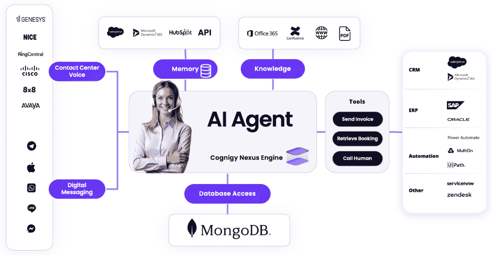
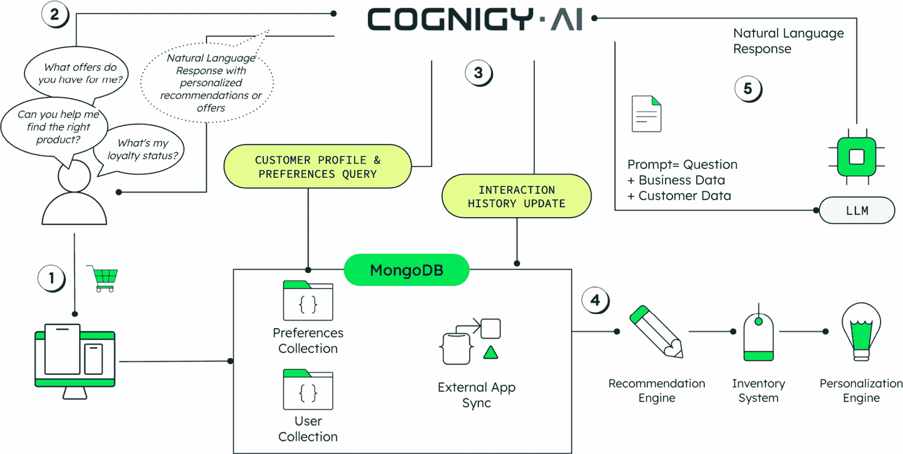
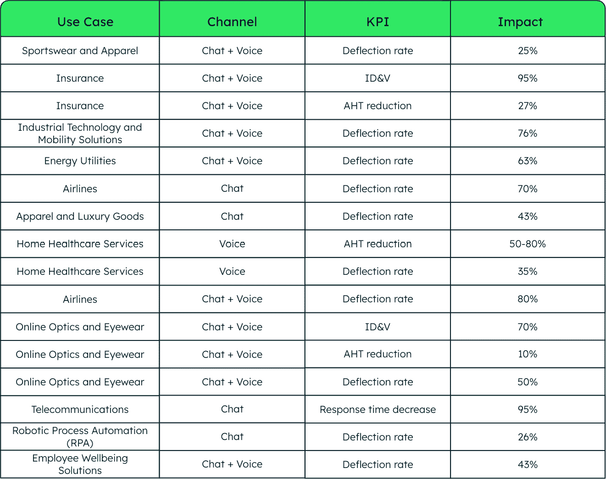

# 9

# 在智能体 AI 时代，Cognigy 的语音和聊天机器人

虽然上一章探讨了 AI 驱动的策略如何颠覆媒体和电信行业的发现内容和运营效率，但这些 AI 能力的关键实施在于直接客户沟通，其中智能代理正在将每一次互动转化为个性化、上下文相关的参与机会。

客户沟通领域经历了根本性的转变。我们正在从传统呼叫中心的僵化、脚本驱动的互动转向由现代 AI 代理驱动的动态、智能对话。然而，在每一个 AI 成功故事背后，都隐藏着一个关键真相：如果没有高质量的数据基础，AI 单独无法在规模上提供可靠的业务价值。我们仍然目睹令人尴尬的聊天机器人错误、令人沮丧的幻觉以及臭名昭著的事件，例如以一美元的价格出售卡车的机器人。这些失败揭示了残酷的现实：没有高质量的数据基础，AI 单独无法在规模上提供可靠的业务价值。

Cognigy 与 MongoDB 之间的合作代表了下一代客户沟通的底层方法，其中能够自主规划、推理和行动的智能体 AI 与成功所需的所需的企业级数据架构相匹配。

到本章结束时，你将清楚地理解以下内容：

+   从基于规则的聊天机器人到以目标为导向的智能体 AI 的根本转变，以及 Cognigy 如何实现这一转型

+   为什么高质量、实时数据是智能体 AI 系统的生命线，以及数据掌握如何直接转化为个性化能力

+   现代 AI 代理的关键性能要求，包括对库存系统、CRM 和运营平台的实时访问

+   企业如何通过构建 AI 劳动力能力来提升卓越而非错误

+   结合长期客户记忆和实时上下文的智能个性化全面方法

当我们开始探索全面沟通方法时，我们将发现高级 AI 能力和强大数据架构的融合如何为企业在整个企业规模上重新构想客户互动创造机会，超越传统客服中心的限制，迈向一个许多互动可以变得智能、个性化且具有价值的未来。

# 从基于规则到以目标为导向的 AI 的演变

近年来，客户沟通领域经历了根本性的转变。现代 AI 代理现在可以理解上下文，通过复杂场景进行推理，并实时调整其响应，而不是遵循预定的路径。这种演变不仅仅是一个技术升级；它体现了企业如何与客户互动的转变，从反应性、基于规则的响应转变为主动、上下文感知的帮助，它预测需求并在实时提供个性化解决方案。

要看到这一演变的实际效果，可以考虑以下案例。

## 案例研究：一级航空公司如何应对危机

2024 年 3 月 7 日，德国面临了一场完美的交通混乱风暴。法兰克福机场的安全人员罢工，这是世界上繁忙的国际枢纽之一，同时一家一级航空公司的 25,000 名地面工作人员在德国机场发起了协调一致的罢工[1]。传统的呼叫中心在压力下可能会崩溃，让数十万被困的乘客等待数小时才能得到帮助。

相反，发生了一些令人瞩目的事情。在危机的高峰期，主要航空公司的 AI 代理，由 Cognigy 的平台提供支持，在 48 小时期间处理了多达每分钟 10,000 次来交互，这是一个传统操作完全无法应对的量级。这些代理无缝处理了从预订到退款的端到端流程，即使在极端压力下也能保持服务质量，而人类代理则被重新分配去处理最复杂的案例。

这不仅仅是一个技术成功故事；它还是智能通信系统如何将危机响应从被动损害控制转变为主动客户关怀的预览。但在这场变革背后隐藏着一个关键真理，它将真正的 AI 成功与昂贵的失败区分开来：*数据基础的质量*。

## 限制我们的因素

传统的聊天机器人和**交互式语音响应**（IVR）系统长期以来一直是客户体验中的痛点，代表了消费者对自动化交互所关心的许多问题。这些系统本质上是静态和基于规则的，遵循严格的决策树，无法实时适应，并且始终让客户对脚本化的、非个性化的回答感到沮丧，这些回答未能解决他们的实际需求。

这些遗留系统的问题不仅仅是它们的僵化；它们完全无法理解上下文，无法从交互中学习，也无法根据每个客户遭遇的独特情况做出智能决策。由于传统系统被限制在预配置的流程和预定的响应模式中，它们缺乏实时推理和动态决策能力。

## 代理 AI 的突破

Cognigy 的代理 AI 代表了向这些限制的重大转变，体现了一种关于 AI 如何与客户互动的实质不同哲学。与仅仅执行预定脚本的旧机器人不同，使用 Cognigy 构建的 AI 代理拥有复杂的技能，使它们能够更像智能的人类代理，而不是传统的自动化系统。

图 9.1：Cognigy 的代理 AI 架构与 MongoDB 集成

*图 9.1*展示了 Cognigy 的 AI 代理如何在全面的企业生态系统中运行。在中心，由 Cognigy Nexus Engine 驱动的 AI 代理将多个通信渠道（接触中心语音和数字消息）与企业系统（CRM、ERP 和自动化平台）连接起来。代理访问统一的记忆和知识库，同时利用 MongoDB 的数据库能力进行实时数据处理。这种架构使得与现有企业工具的无缝集成成为可能，包括 Salesforce、Microsoft Dynamics 365、SAP、Oracle 以及各种自动化平台，展示了代理型 AI 如何将孤立的聊天机器人转变为可以在整个组织技术堆栈中行动的智能工作成员。

变革始于通过实时数据和记忆能力进行情境理解。Cognigy 的 AI 代理不仅独立处理当前交互，它们还保持对客户历史、偏好、先前交互和当前情境的全面意识。这种记忆不仅包括简单的数据检索，还包括对情感情境、沟通偏好以及客户与组织之间更广泛商业关系的理解。

此外，Cognigy 的代理可以根据推理而非僵化的脚本做出自主决策。这种能力标志着与基于规则的系统有显著的不同，使代理能够评估复杂情况，权衡多个因素，并根据每次交互的具体情况确定最合适的行动方案。

平台使用 API、CRM 甚至设备上的传感器等工具动态行动的能力，为实时问题解决创造了大量机会。Cognigy 的代理不仅可以限于信息检索和脚本化响应，实际上还可以代表客户采取行动，处理退款、重新预订航班、更新账户信息或与其他系统协调以解决复杂问题。

# 为什么数据是代理型 AI 的生命线

真正的个性化与仅仅象征性的差异不在于 AI 模型本身的复杂性，而在于驱动这些模型的 数据的质量、完整性和可访问性。如果没有快速访问到完整、高质量的数据，就无从谈起超越基本`"Hi [first.name]"`问候的个性化，这种问候已成为浅层自动化的代名词。

## 现代数据需求范围

无论 AI 代理是在为滞留旅客检查航班状态，还是在涉及多个利益相关者的复杂保险索赔中发挥作用，或者是在满足特定客户偏好和限制条件下预订租赁汽车，这些代理都依赖于立即访问多样化的数据源，以全面描绘客户的状况和需求。

历史互动构成了情境理解的基础，使代理能够识别客户行为中的模式，理解沟通偏好，并避免重复之前的错误或挫折。购买和服务历史提供了关于客户价值、偏好和生命周期阶段的宝贵见解，使代理能够做出适当的推荐，并相应地优先考虑服务级别。

客户偏好不仅限于简单的人口统计数据，还包括沟通风格偏好、渠道偏好、时间偏好，甚至可能影响如何处理互动的情感背景。位置和设备背景增加了另一层个性化机会，使代理能够提供特定位置的信息，理解客户当前的情况和限制，并优化正在使用的设备和渠道的互动。

## MongoDB 在启用实时智能中的作用

这就是 Cognigy 和 MongoDB 之间的合作伙伴关系变得特别有效的地方。MongoDB 的面向文档的数据模型和灵活的模式能力（这意味着字段可以动态添加，无需预定义的表结构，与传统的关系型数据库不同，后者需要固定的模式）以及实时能力使 Cognigy 的代理能够高效地访问和处理各种数据源，同时保持实时客户互动所需的性能特征。

这种组合创造了一个基础，使全面的个性化不仅成为可能，而且在实际操作中可行，并且可以扩展到大型客户群和复杂的互动场景。

## 现实世界应用：转型零售客户体验

考虑一个实际的零售场景，该场景展示了这种实时智能的实际应用。当客户通过 WhatsApp 联系零售商的支持并询问他们的交货日期时，互动触发了复杂的数据编排过程，展示了 Cognigy-MongoDB 合作伙伴关系的力量，如*图 9.2*所示。

图 9.2：实时数据集成在实际中的应用

此图说明了 Cognigy 的 AI 代理如何无缝集成 MongoDB 以提供个性化的客户体验。流程显示了客户的旅程从初始购买(**1**)通过对话查询(**2**)，实时数据检索和处理(**3**)，自动化系统同步(**4**)，到智能响应生成(**5**)，展示了每次互动如何利用实时业务数据以实现最大相关性和准确性。

客户的查询通过 Cognigy 的**接触中心即服务**（**CCaaS**）平台进行，该平台立即查询 MongoDB 以检索用户配置文件数据和实时订单信息。MongoDB 灵活的文档结构允许系统存储来自客户偏好和购买历史到当前订单状态和配送物流的多种数据类型，所有这些都在可以即时访问的统一集合中。

当 Cognigy 的 AI 代理处理客户的自然语言查询时，它将实时业务数据与客户的问题结合起来，为**大型语言模型**（**LLM**）创建一个全面的提示。然后，LLM 生成一个个性化的、上下文感知的响应，不仅回答交付问题，还可以主动更新订单信息或建议相关服务。

使这特别强大的是 MongoDB 的更改流和触发器功能。当 AI 代理在对话中更新配送信息时，例如重新安排配送预约，MongoDB 会自动将此数据与其他客户旅程中的系统同步，包括库存管理和配送提供商。这确保了客户体验的每个接触点都反映了最新的信息，无需人工干预。

## 无缝集成的技术基础

MongoDB 的实时能力确保 AI 代理不会在过时数据上操作；它们使用最新信息和上下文与客户互动，即使在传统系统可能因延迟或可用性问题而挣扎的峰值需求期间也是如此。这种架构方法将客户服务从被动问题解决转变为主动关系构建，其中每一次互动都成为加强客户忠诚度的机会，通过个性化的、准确的和及时的帮助。

这种组合创造了一个基础，其中全面的个性化不仅成为可能，而且变得实用，并能够在大客户群和复杂的互动场景中扩展。

# 关键时刻的实时性能

在客户服务的风险世界中，速度不仅仅是竞争优势；它往往是客户保留与流失、成功的问题解决与升级的挫败感之间的区别。现代 AI 代理需要在互动的精确时刻实时访问库存系统、CRM、订单管理平台和预订工具。

## 当系统被推至极限时

AI 驱动的客户服务系统的真正考验不是在正常运营条件下，而是在推每个组件至极限的危机情况下。2024 年 3 月德国机场罢工就创造了这样的场景，航空业各地的接触中心都面临了压力，成千上万的乘客同时寻求重新预订、退款和替代旅行安排。

在这次危机中，一级航空公司的 AI 代理即使在传统呼叫中心因应对客户咨询激增而陷入困境时，也保持了服务连续性。这一表现不仅证明了 Cognigy 的 AI 代理的能力，也证明了在超高速下跨多个系统即时访问数据的重要性。

## 简单请求背后的复杂性

然而，对速度和数据质量的需求并不仅限于罕见的颠覆性事件。考虑一下看似简单的客户咨询，“我的包裹什么时候能到？”。这个日常问题需要完成一系列复杂的数据操作，这些操作必须在几秒钟内完成，而不是几分钟，以满足客户期望并保持服务质量。

系统必须首先通过身份验证过程识别用户，访问过去的订单数据，查询物流系统以获取实时状态，处理来自多个承运商的信息，使用 LLM 生成类似人类的响应，并将交互记录下来以供将来参考。所有这些复杂的编排必须在几秒钟内完成，以保持无懈可击的服务假象。

根据 HubSpot 的研究，90%的客户在联系客户服务时都期望立即得到回应，而达到这一标准的公司看到显著更高的保留率和满意度[2]。快速访问数据不仅使 AI 更快，而且使它值得信赖、可操作，并以客户为中心，从而建立持久的企业关系。

# 扩展卓越，而非错误

以人为先和以电话为中心的接触中心时代已经走到了它的必然结局，标志着在现代商业环境中已变得不可持续的操作模式的终结。通过雇佣更多代理手动扩展客户服务运营的传统方法，组织难以长期留住这些代理，这代表了一种成本高昂且效率低下的策略，无法跟上不断增长的客户期望。

## 变革的数学

手动扩展的数学揭示了传统接触中心模型固有的问题。随着客户群的增长和交互量的增加，组织面临着人员成本、培训需求和运营复杂性的指数级增长。当考虑到困扰客户服务行业的较高人员流动率时，挑战变得更加严峻。

在 AI 优先的时代，目标已经从简单地处理客户咨询转变为在显著降低成本的同时提供相同或更好的服务质量，同时提高客户满意度和业务成果。Cognigy 的 AI 代理代表了应对这一挑战的解决方案，提供了一条可持续、可扩展的客户服务之路，随着量的增加而改善而不是退化。

## 行业间的示范结果

Cognigy 带来的转型不仅超越了简单的自动化，还包括对客户服务可以完成的事情的全面重新构想。而不是将客户互动视为需要最小化的成本中心，以 AI 为先导的组织可以将每个客户接触点视为建立关系、收集见解和创造价值的机会。

表 9.1：AI 驱动的跨行业客户服务绩效结果

此表展示了 AI 驱动的客户服务解决方案在多个行业和用例中的可衡量影响。数据显示，**关键绩效指标**（**KPIs**）有显著改进，包括从 25%到 95%的转介率，**平均处理时间**（**AHT**）、**身份识别和验证**（**ID&V**）的实质性减少，以及响应时间减少和代理效率提升等运营指标的改善。

这种转型的证据可以在 Cognigy 在各个行业和用例中持续交付的结果中看到。实施 Cognigy 的代理 AI 方法的组织报告说，他们的运营效率、成本结构和竞争地位发生了有意义的变化。在自主处理复杂客户互动的同时保持高质量、个性化的标准，为企业提供了在不成比例增加人力资源的情况下扩展客户服务能力的机会。

## 可持续增长的基础

在 MongoDB 高性能、灵活的架构数据库架构的支持下，Cognigy 代理以企业级速度、灵活性和可靠性运行，可以扩展以处理大量交互量，而不会降低性能或服务质量。MongoDB 的实时能力确保 AI 代理不仅是在拉取昨天的数据，他们使用最新的信息和背景与客户互动，即使在传统系统可能因延迟或可用性问题而挣扎的峰值需求期间也是如此。

# 个性化并非魔法，而是数据掌握

真正的个性化远不止于至今为止大多数客户服务自动化所具有的简单姓名识别。虽然基本系统可能会用“你好，” `[姓名]` 或引用他们的账户号码来问候客户，但真正的个性化需要深入理解客户背景、偏好、行为模式和当前需求，这远远超出了表面层次的数据检索。

## 智能个性化架构

Cognigy AI 代理通过利用全面的数据来即时访问客户订单历史、偏好和行为洞察，从而实现这一更深层次的个性化，使他们能够根据用户的过去互动以及当前互动的演变背景来定制每一个回应。

真正的个性化操作跨越多个交互层同时进行。除了提供相关信息外，它还涉及调整沟通风格以符合客户期望，根据上下文选择最佳渠道，并调整服务交付的速度以与个人的紧迫性和技术舒适区保持一致。

通过整合长期记忆，如详细的用户资料、全面的购买历史和记录的偏好，以及短期上下文，包括当前的查询或问题、客户的情绪状态、他们选择的沟通渠道以及可能影响其需求或限制的外部因素，AI 实现了这种细微的个性化。

## 个性化卓越的技术基础

MongoDB 灵活的数据模型在使 Cognigy 能够摄入和统一各种数据源方面发挥了关键作用，这些数据源不受传统数据库方法中具有代表性的刚性模式要求的限制。这种灵活性支持无缝的跨渠道体验，真正倾听用户及其需求，而不是简单地重复标准化的回复，这些回复忽略了个人上下文和偏好。

通过不同类型的数据如何使特定的 AI 能力系统化，以及这些能力反过来又如何推动可衡量的业务成果，可以理解数据能力和 AI 结果之间的关系。

| **数据功能** | **AI 能力** | **结果** |
| --- | --- | --- |
| 客户资料 | 分段和上下文理解 | 相关、个性化的互动 |
| 实时访问 | 动态参与和工具集成 | 快速、响应迅速的服务 |
| 高质量数据 | 准确的响应和决策 | 信任和满意度 |
| 预测行为建模 | 积极的推荐和警报 | 增加转化率和忠诚度 |
| 集中式数据架构 | 所有渠道的统一客户体验 | 无缝的全渠道旅程 |

表 9.2：数据如何为代理 AI 提供动力

熟悉的谚语“垃圾输入，垃圾输出”在 AI 驱动的客户服务系统背景下从未如此相关或后果严重。这个原则在我们日常与 AI 系统互动的经验中表现得最为明显，这些 AI 系统基于有缺陷或不完整的训练数据提供自信但完全错误的响应。

## 准确性的风险

在客户服务环境中，信任和准确性至关重要，数据质量差不仅会导致一些小的不便，还会导致质量差、有偏见或完全错误的响应，这些响应可能会破坏客户关系并损害品牌声誉。在客户服务 AI 中，数据质量差带来的后果远不止简单的事实错误。

当 AI 代理提供有关产品可用性、定价或政策的不正确信息时，客户可能会基于这些信息做出决策，导致失望、经济损失或错失机会。当 AI 系统基于不完整或扭曲的训练数据表现出偏见时，它们可能会向不同的客户群体提供不同水平的服务，从而产生法律和道德问题，可能对业务产生严重影响。

## AI 卓越的全面要求

高质量、准确、及时和完整的数据是提供相关、类似人类响应的关键要求，这些响应是客户可以信赖并采取行动的。这一数据质量要求涵盖了必须同时维护的多个维度，以确保可靠的 AI 性能：

+   **准确性**确保提供给客户的信息反映了现实，并且可以信赖用于决策

+   **时效性**确保信息反映了系统和流程的最新状态

+   **完整性**确保 AI 代理能够访问提供全面帮助所需的所有相关信息

+   **一致性**确保通过 AI 渠道提供的信息与其他渠道和系统提供的信息保持一致

简而言之，如果没有在所有维度上高质量的数据，即使是最高级的 AI 也会力不从心。但当这些基础建设到位时，具有代理能力的 AI 不仅会做出响应，它还能建立信任、驱动行动，并带来真正感觉像人类般体验。

## 治理和合规框架

通过 Cognigy，企业不仅获得能够进行复杂推理和决策的智能代理，还获得受治理、合规的 AI 系统，这些系统具有全面的功能，旨在保护敏感信息并确保符合监管要求。这些功能包括**个人身份信息**（**PII**）的编辑能力，该能力可以自动识别并保护 PII，基于角色的访问控制确保只有授权人员可以访问敏感数据，以及端到端加密，在整个交互生命周期中保护信息。

这些治理和合规能力符合多个行业和司法管辖区严格的监管标准，使组织能够有信心部署 AI 驱动的客户服务，确信它们正在履行其法律和道德义务。

# 摘要

从基于规则的聊天机器人到智能代理人工智能的转变，代表了重大的技术进步，这反映了当结构化数据基础与高级人工智能系统相结合时，对客户沟通能力的全面重新思考。在本章中，我们探讨了 Cognigy 和 MongoDB 之间的合作如何为这一进步建立基础设施，使组织能够超越传统的接触中心限制，向每个客户互动都成为定制、智能互动机会的运营模式转变。

分析表明，有效的 AI 代理需要强大的数据架构，而掌握这一整合的组织将在竞争激烈、以客户为中心的市场中保持竞争优势。

下一章将探讨这些智能数据利用和代理人工智能的原则如何从客户体验到运营效率转变零售运营。我们将分析当代零售商如何在其运营中整合智能，从处理客户意图超出关键词匹配的 AI 增强搜索，到生成大规模动态、定制体验的个性化营销和内容系统。

# 参考文献

1.  *新卢夫特汉萨地面工作人员将于 3 月 7 日（星期四）和 3 月 9 日（星期五）举行罢工*：[`loyaltylobby.com/2024/03/04/new-lufthansa-ground-staff-strikes-on-thursday-friday-march-7th-9th/`](https://loyaltylobby.com/2024/03/04/new-lufthansa-ground-staff-strikes-on-thursday-friday-march-7th-9th/)

1.  *根据消费者意见，最重要的 5 个客户服务标准*：[`blog.hubspot.com/service/customer-service-standards`](https://blog.hubspot.com/service/customer-service-standards)
