# 14

# 通过人工智能在保险业中实现业务价值

在为人工智能增强的应用程序工作流程进行架构设计时，重要的是要牢记您的整体业务目标。您正在解决哪些业务问题，您的组织面临的最紧迫挑战是什么？

您组织中的不同利益相关者可能从不同的角度来考虑人工智能的实施。推动平台整合和现代化的技术团队可能会通过技术优先的视角来评估解决方案，根据技术能力和成本比较平台。数据科学和分析团队可能会专注于测试或验证数据假设。业务产品负责人可能会优先考虑增强应用程序的功能和能力，希望利用人工智能来增强数据处理。

不论您的角色如何，挑战在于帮助您的组织利用人工智能在业务成果上取得实质性进展。这需要跨越多个维度，包括对业务目标的清晰理解，以将人工智能倡议与组织目标对齐，对相关数据和流程的深入了解，以确保人工智能有效地支持核心业务流程，以及深思熟虑地应用人工智能技术，以简化数据密集型任务并释放新的效率。

我们的目标是能够通过将正确的人工智能能力应用于组织的正确位置，更快地收集、理解、交互和生成数据。

本版本删除了特定的角色定位，使其适用于任何参与人工智能实施决策的人，同时保持相同的关键概念和结构。

到本章结束时，您将理解以下内容：

+   数据架构如何从遗留系统发展到人工智能就绪的基础设施，以及如何实施统一的数据存储方法，以统一结构化和非结构化数据

+   保险组织可用的各种人工智能技术，从传统的机器学习到代理人工智能系统，以及它们在承保、索赔处理和客户体验方面的实际应用

+   为什么以领域驱动的人工智能实施与业务目标相一致，以及如何构建提供丰富上下文以支持智能决策的根领域实体

+   保险组织成功实施人工智能解决方案的实例

+   将人工智能直接集成到业务应用程序中的战略重要性，而不是将其视为一个单独的倡议

# 数据架构的演变

我们在保险业的数据架构方面已经经历了一段旅程。这一演变经历了三个不同的阶段：

+   **遗留系统**：这些系统以单体关系型数据库为特征，速度慢且成本高，具有缓慢适应且可扩展性有限的刚性模式

+   **微服务时代**：这一时代引入了具有更快开发周期的领域数据存储，使用 JSON 处理动态和静态数据，使用 API 和事件进行通信，以及特定领域的模式。

+   **AI 集成**：现在，我们正进入一个需要专门为 AI 架构数据的时代，智能商业应用和智能代理在统一的数据存储上运行。

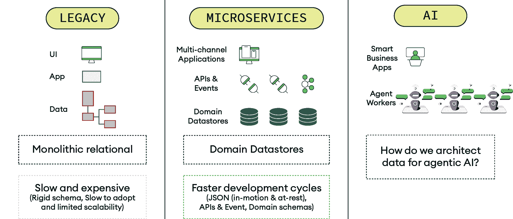

图 14.1：数据架构演变：从传统系统到 AI 就绪基础设施

*图 14.1* 展示了保险行业数据架构的三个阶段演变。传统系统显示了一个传统的三层结构（UI、应用和数据）以及单体关系型数据库。微服务时代引入了分布式领域数据存储，多渠道应用通过 API 和事件进行通信。AI 阶段描绘了一个新的范式，拥有智能商业应用和多个代理工作者，提出了如何恰当地架构数据基础设施以支持代理 AI 系统这一关键问题。

技术始终推动着我们交易业务方式的进步。每个阶段都带来了更高的灵活性和能力，而 AI 集成阶段在商业价值潜力方面代表了最显著的飞跃。

在探讨了数据架构如何演变以支持 AI 能力之后，让我们通过一个具体的保险案例来考察这些技术基础如何转化为有形的商业价值。

## 以理赔处理为例

在探讨了数据架构如何演变以支持 AI 能力之后，让我们通过一个具体的保险案例来考察这些技术基础如何转化为有形的商业价值。保险公司常见的组织目标可能包括提高运营卓越性和以客户为中心。强调运营中的效率和有效性以最大化回报并减少浪费，以及优先投资提高客户满意度和参与度的项目。

您的组织在处理和解决索赔方面的能力如何，例如，直接影响到前面的目标。实现这一点直接关联到您处理理赔应用工作流程中数据的速度、效率和准确性。

理赔处理为我们提供了利用 AI 加速数据处理热点的大好机会，从而使组织能够从技术投资中获得有意义的回报。

那么，在理赔处理工作流程中，哪些类型的数据难以处理？非结构化数据源，例如损坏照片、事故表格和报告、理赔处理人员笔记、交通摄像头视频以及理赔处理指南和建议。

这些数据源对您的员工来说处理起来麻烦吗？考虑一下所需的手动工作量：打开和阅读表格，检查和解释图像，以及提炼和撰写案例文件笔记，然后索赔才能继续进行。在灾难性事件期间，这一挑战随着大量、突然涌入的索赔而呈指数级增长。

保险业的挑战不是数据不足，而是处理、理解和快速采取行动的能力。这正是人工智能，以各种形式，提供变革潜力的地方。

## 保险业中的 AI 光谱

保险公司可以利用多种类型的 AI 来解决不同的业务挑战。了解 AI 能力的全谱系对于做出战略实施决策至关重要。

### 传统机器学习

在历史数据上训练的机器学习模型可以用于在业务工作流程中做出预测和决策，有效地取代某些人工任务。这些模型在风险分类和定价、基于模式检测欺诈、细分和定位客户以及分类和路由索赔方面表现出色。

虽然这些 AI 模型已经使用了多年，但现在的问题是：关于**生成式人工智能（GenAI**）呢？

### 生成式人工智能（GenAI）和大型语言模型（LLMs）

生成式人工智能（GenAI）和大型语言模型（LLMs）为我们提供了非常适合增强数据处理能力的核心自然语言处理能力。当应用于索赔处理工作流程时，这些技术可以显著改变保险公司处理和理解非结构化信息的方式。

其中最强大的应用之一是实体提取，这有助于从非结构化来源，如 PDF 指南或事故表格中找到的大量文本中查询和检索相关信息。这种能力使得索赔处理人员能够快速识别关键信息，例如日期、地点、政策号码和损坏描述，而无需手动扫描冗长的文件。

文本和图像分类更进一步，使索赔处理人员能够自动确定损坏照片中发现的损坏类型或特征。结合文本摘要能力，这些工具可以加快跨多个来源的大量文本或信息的综合速度，从而显著减少初步索赔评估和文件审查所需的时间。

该技术也擅长文本生成，有助于生成案例文件，并根据更广泛的指南为工作人员提供简洁的指令。这确保了索赔处理的连贯性，同时减少了调整人员的认知负荷。此外，交互式聊天功能使员工和客户能够更快地获取先前或额外的现有信息，从而创造更响应和高效的服务体验。

### 代理式人工智能系统

在最先进的端点是代理式 AI 系统，这些是能够感知其环境、做出决策并采取行动以实现特定目标的自主系统。虽然这些系统目前仍处于发展初期，主要在生产环境中用于特定、有限的任务，但它们代表了 AI 能力的下一次进化。这些系统在几个关键方面与传统 LLM 不同：

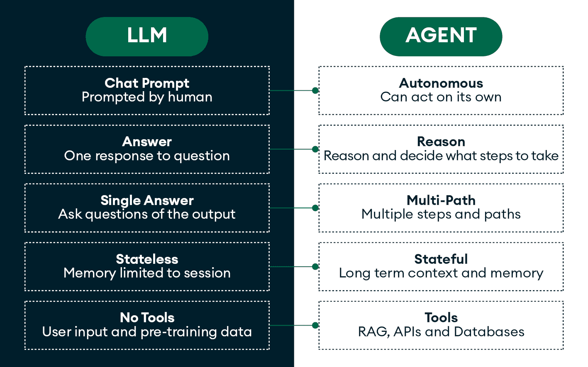

图 14.2：LLM 与代理式 AI 系统：关键差异和能力

此比较图突出了传统 LLM 和高级代理式 AI 系统之间的基本差异。图中显示了五个关键区别：

+   **交互模式**：LLM 需要由人类为每个响应进行提示，而代理式系统一旦被赋予一个初始目标或目标，就可以自主执行多步骤工作流程

+   **响应能力**：LLM 提供单一答案，而代理式系统能够通过多步骤过程进行推理

+   **处理方法**：LLM 提供单一答案的响应，而代理式系统可以探索多个路径

+   **记忆**：LLM 是无状态的，而代理式系统保持长期上下文和记忆

+   **工具访问**：与能够使用 RAG、API 和数据库的代理式系统相比，LLM 缺乏工具访问

选择哪种 AI 方法实施取决于具体的业务挑战、数据可用性和组织准备情况。许多保险公司将从在各个业务领域和用例中实施这些方法的组合中受益。

理解 LLM 和代理之间的这些基本差异至关重要，因为它们决定了我们如何为保险工作流程构建 AI 解决方案。虽然 LLM 在文档分析或客户咨询等个别任务上表现出色，但保险流程的复杂多步骤性质，从最初的索赔接收到最后结算，需要只有代理式系统能够提供的自主决策和工具集成能力。

### 保险中的代理式工作流程

为了了解 AI 代理如何创造业务价值，让我们考察一个保险索赔处理中代理式工作流程的具体例子。这些自主系统可以感知其环境、做出决策并采取行动。这些能力使它们特别适合编排复杂的保险流程，以达到降低运营成本和提高客户满意度的业务目标。

此工作流程展示了最先进的 AI 系统如何通过无缝连接以下内容来编排复杂的保险流程：

+   **结构化数据**（索赔记录）

+   **业务工作流程步骤**（损失通知 → 识别和记录损害 → 核查承保 → 确定和总结承保）

+   **非结构化数据**（损害照片、保单表格等）

+   **用户接触点**（客户移动应用、索赔处理界面等）

工作流程在以下图中展示：

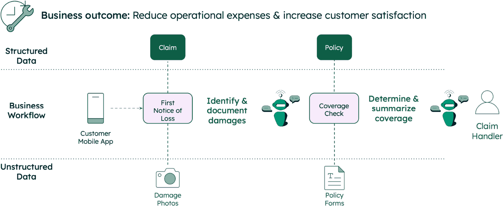

图 14.3：保险索赔处理的代理式 AI 工作流程

它说明了 AI 代理如何编排端到端保险索赔工作流程，集成结构化数据（索赔记录和政策信息）、业务流程（从首次损失通知到承保决定）、非结构化数据（损坏照片和政策表格）以及用户接触点（客户移动应用程序和索赔处理界面）。工作流程显示了 AI 代理在关键决策点操作以自动化流程，同时将客户体验与后端系统连接起来。

此工作流程展示了 AI 代理如何弥合客户体验和后端流程之间的差距，无缝地处理结构化和非结构化数据。关键优势在于代理可以在多个系统和数据类型上自主操作，减少在常规流程中人工干预的需求，同时仍保持准确性和合规性。

## 为应用程序构建架构

您的软件交付团队以及他们支持的应用程序可能被敏捷交付领域分割。您需要在那些领域和应用程序内部应用 AI，以便有效地推动组织和流程的结果。简而言之，您的 AI 属于您的应用程序。

支持这些应用程序的数据存储在操作数据存储中。如果我们希望我们的应用程序和 AI 使用实时数据，它应该在同一基础数据存储中可访问。服务于我们应用程序的也应该服务于我们的 AI。

将 AI 直接集成到商业应用程序中代表了从 AI 采用实验阶段到价值交付阶段的重大转变。与其将 AI 视为一个单独的倡议，具有前瞻性的保险公司正在将 AI 能力直接嵌入其核心业务系统中。

虽然这种方法带来了显著的商业价值，但它需要仔细关注安全考虑因素，包括以下内容：

+   访问控制和身份验证

+   数据保护和加密

+   安全的输出处理和验证

+   零信任安全原则

+   正确的 API 控制和监控

+   定期安全评估

组织应将其作为 AI 集成策略的一部分实施这些安全措施，以减轻未经授权的访问、数据泄露和潜在的系统漏洞等风险。

### 集成数据存储

**集成数据存储**是一种将 API 和事件、用户和代理以及结构化和非结构化数据统一到一个系统中的架构方法。这种方法对于必须高效处理多种数据类型的保险应用程序尤其强大。

例如，在索赔处理工作流程中，以下情况发生：

1.  客户通过移动应用程序报告首次损失并上传照片。

1.  系统存储了结构化索赔数据（ID、索赔人信息和状态）以及非结构化数据（带有向量嵌入的损坏照片）。

1.  人工智能智能体提取图像元数据，更新状态摘要，并与索赔数据和客户进行交互。

1.  索赔处理人员可以访问相同的一体化数据存储，确保一致性。

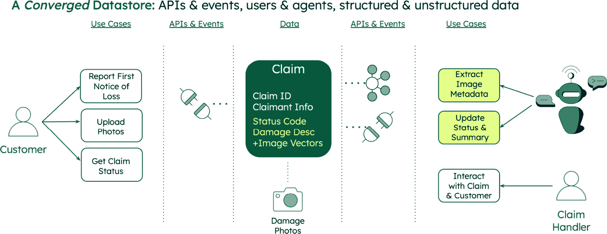

图 14.4：AI 赋能索赔处理的集成数据存储架构

此图展示了如何通过一个集成的数据存储统一 API 和事件、用户和智能体，以及结构化和非结构化数据。工作流程展示了客户报告索赔并上传照片，中央索赔数据存储库包含结构化数据（索赔 ID 和索赔人信息）和非结构化数据（带有矢量嵌入的损坏照片），而人工智能智能体处理图像元数据并与客户和索赔处理人员通过统一的数据基础进行交互。

集成数据存储概念解决了人工智能实施中最具挑战性的问题之一：将人工智能系统与现有运营系统集成。通过提供统一的数据基础，它消除了复杂数据管道的需求，并减少了数据创建与人工智能驱动的洞察之间的延迟。

### 管理运营结构化和非结构化数据

你的应用程序架构需要提供一种方式来存储、提供和更新结构化数据，作为你的工作流程的一部分，并集成非结构化数据。这可能包括原始数据（PDF、图像和笔记）以及其矢量编码表示。你希望矢量编码数据尽可能接近你应用程序中可能已经存在的结构化数据。这有几个原因，包括以下内容：

+   **性能**：通过利用高效的服务器计算提供应用级的服务级别协议（**SLAs**）

+   **安全性**：提供一致的 APP 层安全控制，以确定谁可以访问什么数据

+   **应用交付和维护的便捷性**：组件和依赖项越少，构建、部署和维护利用人工智能的有效软件解决方案的复杂性和成本就越低

这种数据管理的集成方法在保险业尤为重要，因为数据隐私、安全和合规要求非常严格。通过在结构化和非结构化数据上保持统一的数据治理方法，组织可以确保人工智能实施符合监管要求，同时仍然提供商业价值。

# 智能体系统的架构特征

让我们来看看在智能体系统中我们可以期待发现的一些架构特征。关注架构的重要性、新变化以及变化之处，对于理解你能够构建什么以及它如何集成到现有系统中至关重要。

## 根域实体和域模式

这种数据存储库的聚合方法使用更少但更丰富的数据对象，这些数据对象提供了深入和即时的上下文。**根域实体**本质上是一个综合数据容器，它将特定业务概念相关的所有内容集中在一个地方。例如，索赔实体将包含以下内容：

+   结构化数据（索赔 ID、日期、类型代码、损失详情和索赔人信息）

+   非结构化数据（损坏照片、事故报告和交通摄像头视频）

+   非结构化内容的向量嵌入

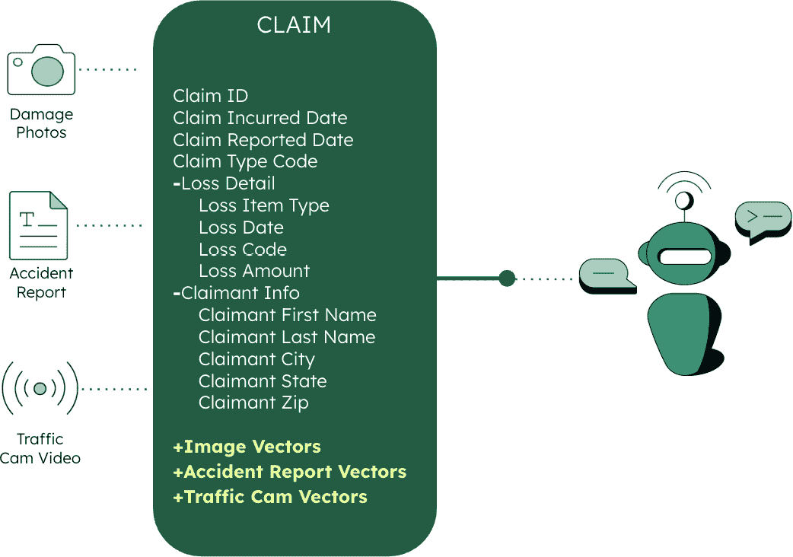

图 14.5：根域实体和域模式

*图 14.5* 展示了非结构化数据源（损坏照片、事故报告和交通摄像头视频）如何与结构化数据字段一起集成到一个丰富的索赔实体中。这种方法提供了更少但更丰富的数据对象，这些数据对象提供了深入和即时的上下文，使用 **JavaScript 对象表示法**（**JSON**）作为 AI 标准格式；这是 AI 系统的首选数据格式，因为它灵活且易于处理，同时允许在代理和用例之间实现低延迟的性能。

## 跨所有数据类型的统一搜索

这种丰富的数据结构使得强大的新搜索功能成为可能。不再需要查询多个系统，索赔调整员可以说：“显示所有超过 15,000 美元的 Q4 索赔，并且与这个新索赔相似的损坏照片”，并得到结合结构化数据过滤器与单一查询中的视觉相似性匹配的结果。

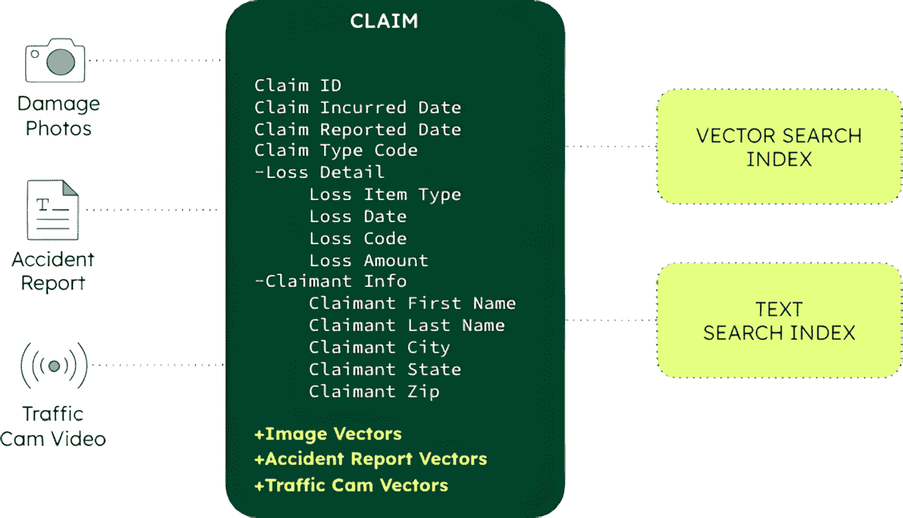

图 14.6：向量、文本和混合搜索

*图 14.6* 阐述了 MongoDB Atlas 如何自动从`CLAIM`集合中创建向量和文本搜索索引。当数据发生变化时，编辑会自动传播到所有索引中，使得可以在 MongoDB 的查询语言中使用`$vectorSearch`（用于查找相似图像或内容）和`$search`（用于传统文本搜索）。这种架构上优雅的方法允许你在同一查询中遍历结构化和非结构化数据，同时保持低延迟、低复杂性和单一的安全模型。

在[`www.mongodb.com/products/platform/atlas-vector-search`](https://www.mongodb.com/products/platform/atlas-vector-search)了解更多关于 Atlas 向量搜索的信息，以及在[`www.mongodb.com/products/platform/atlas-search`](https://www.mongodb.com/products/platform/atlas-search)了解更多关于 Atlas 搜索的信息。

## 自主行动的事件驱动架构

除了丰富的数据模型和统一搜索之外，代理系统需要自动对变化条件做出反应。这就是事件驱动架构变得至关重要的地方。

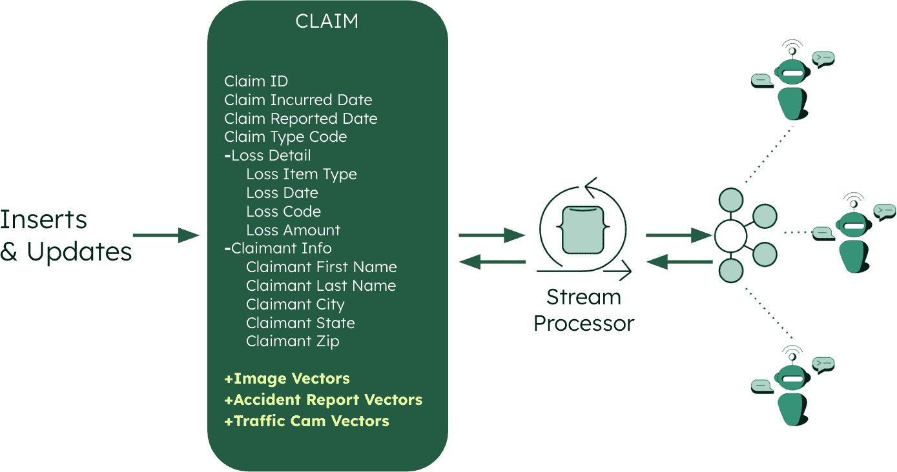

图 14.7：自主行动的事件驱动架构

*图 14.7* 展示了 MongoDB Atlas 如何支持持久流处理，允许 AI 系统使用聚合管道阶段（MongoDB 的强大数据处理框架，可以实时过滤、转换和分析数据）处理连续流数据。流处理器组件持续监控 `CLAIM` 实体的插入和更新，自动触发 AI 代理的响应。这为 MongoDB Atlas 部署提供了简单性和安全性，同时实现了实时响应能力。

在此处了解更多关于 Atlas 流处理的信息：[`www.mongodb.com/products/platform/atlas-stream-processing`](https://www.mongodb.com/products/platform/atlas-stream-processing)。

这种统一方法的关键优势如下：

+   **一个查询，全面结果**：使用任何组合的结构化数据、文本内容和视觉相似性查找相关信息

+   **自动同步**：当数据发生变化时，所有搜索索引会立即更新

+   **实时响应**：AI 系统对数据变化立即做出反应

+   **一致性安全**：所有数据类型和流程中只有一个访问控制模型

这些架构特性包括丰富的领域实体、统一的搜索能力和事件驱动的响应能力。它们为智能、自主系统提供了技术基础。然而，如果没有可衡量的业务影响，架构的优雅也就毫无意义。任何 AI 实施的真实测试在于它是否解决了实际业务问题并改善了运营成果。

现在，让我们通过一个 AI 增强索赔处理的实例来具体探讨这些架构原则如何转化为实际业务价值。

# 通过 AI 驱动的改进，提高索赔处理以实现更好的业务成果

将 AI 集成到索赔处理中是保险组织从 AI 投资中获得价值的最直接机会之一。通过自动化索赔处理的常规方面，组织可以缩短处理时间，提高准确性，并释放人工调整员专注于复杂案例和需要人类判断和同理心的客户互动。

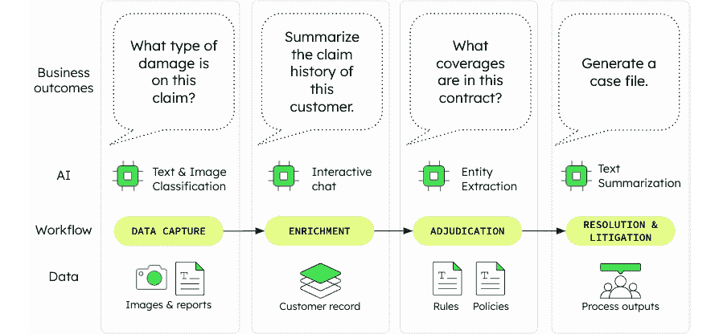

图 14.8：与索赔处理工作流程对齐的 AI 用例

*图 14.8* 展示了核心 NLP 能力的实际用例，包括文本和图像分类、交互式聊天、实体提取和文本摘要。例如，当应用于索赔处理工作流程时，这些能力可以减少数据热点，从而降低处理时间和成本，并改善客户体验。

在 AI 能够改变我们的组织之前，我们首先必须将其引入我们的应用程序，并从实验转向生产部署。

## AI 成熟度和实施策略

*图 14.9* 展示了企业内部 AI 采用的各个阶段，从早期兴趣到过程和决策中的普遍和结构化整合。许多组织都难以从第二级，分析实验，过渡到第三级，在业务应用程序中部署 AI 功能，以提供有意义的商业价值和成果。

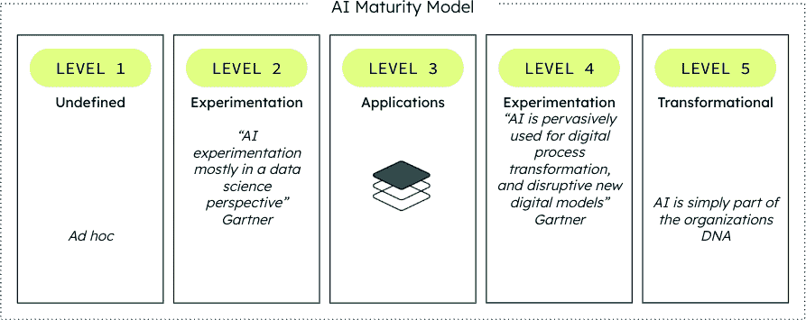

图 14.9：从未定义到变革性的 AI 成熟度水平

这个成熟度模型为希望提升其 AI 能力的保险公司提供了一个路线图。从实验到生产实施的过渡不仅需要技术专长，还需要组织协调、明确的企业目标以及重新构想现有流程的意愿。

## GenAI 的三个层次

理解 GenAI 的技术基础有助于保险公司做出关于在哪里投资资源以及如何构建全面 AI 能力的战略决策。GenAI 应用可以分为三个主要层次：

+   **第一层，计算和 AI 模型**：底层处理能力加上提供核心 AI 能力的基座和嵌入模型。

+   **第二层，用于微调和构建应用的工具**：通过提供专有数据来为基座模型提供上下文的工具。这是连接通用 AI 能力与特定业务需求的关键中间层。

+   **第三层，AI 驱动的应用和体验**：最终用户交互的界面和体验，以及简化构建 AI 体验过程的框架。

基座模型非常强大，但由于在公共数据集上训练，它们缺乏支持企业应用所需的领域知识和数据上下文。这就是第二层变得至关重要的地方，数据和技术工具使得增强型 AI 应用能够完全运行，将您的组织从第二级实验提升到第三级生产成熟度。

一个集成的操作数据库存储专有的结构化和矢量数据，当应用程序发出请求时，这些数据对 LLMs（大型语言模型）可用。这实际上为基座模型提供了超出其初始知识边界的回答问题的必要上下文。

虽然很多注意力都集中在基座模型上，但中间层的数据和工具往往决定了 AI 在生产环境中的成功或失败。

*图 14.10* 更详细地展示了 GenAI 的三个层次，显示了结构化数据从应用程序流向操作数据库，原始的非结构化数据在对象存储中管理，以便应用程序进行处理。这部分处理包括向量化（将非结构化内容转换为 AI 可以理解的数值表示）以及随后将这些向量持久化在操作数据存储中，以便应用程序可以轻松访问。

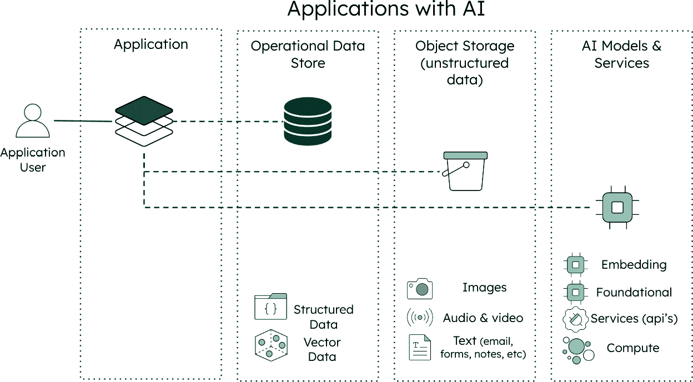

图 14.10：集成数据和模型服务的 AI 启用应用架构

此架构为寻求构建 AI 增强应用的保险组织提供了一个蓝图。关键见解是，AI 能力应直接集成到业务应用中，而不是作为独立系统存在。这种集成确保 AI 能够访问实时数据，并在现有业务流程的上下文中提供见解和行动。

## 域驱动 AI 实施

全球保险企业已采用域驱动设计，并与围绕核心处理域组织的软件交付团队保持一致。随着向微服务和事件流架构的转变，AI 能力现在可以极大地增强这种方法，并加速与实时数据的交互和服务能力。

### 协同工作：应用、数据和 AI

通过域增强核心保险业务能力可以显著提升。当 AI 实施如下时，这种集成效果最佳：

+   **特定领域**：针对特定业务领域，如索赔、承保或客户服务

+   **任务导向**：直接解决数据处理的瓶颈，这些瓶颈自然发生

+   **应用集成**：集成到现有工作流程中，而不是作为独立系统运行

为了使这种方法有效，操作数据和矢量数据应尽可能存储在接近应用的位置。这种邻近性使得以下成为可能：

+   **实时上下文**：基于当前数据做出的决策

+   **最佳性能**：降低对时间敏感的保险流程的延迟

+   **一致的安全**：跨所有数据类型的统一访问控制

+   **领域敏捷性**：快速适应不断变化的企业需求

基于域的操作数据存储有助于细分并增强数据血缘、数据质量和数据治理，从而实现更可靠的 AI 交互。该架构还依赖于 API 和事件，以实现单个域内以及跨域边界的高效处理。

### 现代化和面向 AI 的架构

转向汇聚数据存储架构通常需要现代化现有系统。推荐的方法是将遗留复杂性合并到一个共同的、根域模式中：

+   **迁移数据**从关系型、层次型和基于文件的系统迁移到单一视图的操作数据层

+   **创建统一的访问**，可以同时服务于 API、AI 代理、经典应用，并提供内部/外部互操作性

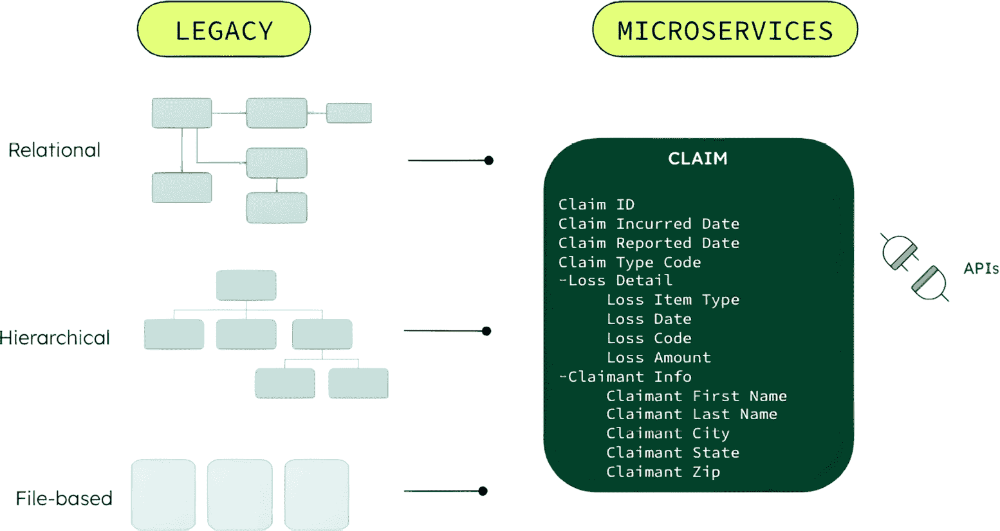

图 14.11：汇聚数据存储架构的遗留系统现代化策略

此图说明了从碎片化的旧系统（关系型、层次型和基于文件的）迁移到统一汇聚数据存储库方法的路径。该策略将复杂的旧数据结构整合到一个共同的根域模式中，该模式可以同时服务于 API、代理、经典应用，并提供内部/外部互操作性，使组织能够逐步现代化，同时保持现有系统功能。

此现代化战略承认大多数保险公司以旧系统和现代系统的混合方式运营的现实。而不是要求完全替换，汇聚数据存储库方法提供了一条务实的向前道路，允许逐步现代化，同时从 AI 投资中获得价值。

### AI 驱动架构

保险技术未来的发展方向是建立在汇聚数据存储库之上的 AI 驱动架构，该数据存储库围绕企业根域实体（如客户、提交、政策和索赔）的核心集合。

此架构方法强调以下方面：

+   **未来兼容设计**：文档模型灵活性允许无缝集成结构化和非结构化数据，而不受刚性模式约束

+   **基本功能**：每个组件都直接为 AI 启用的保险运营的商业价值做出贡献

+   **坚固的基础**：安全性、可扩展性和性能特性处理实时 AI 处理的严格要求

+   **简化复杂性**：更少的对象和组件创建更易于维护和高效的系统

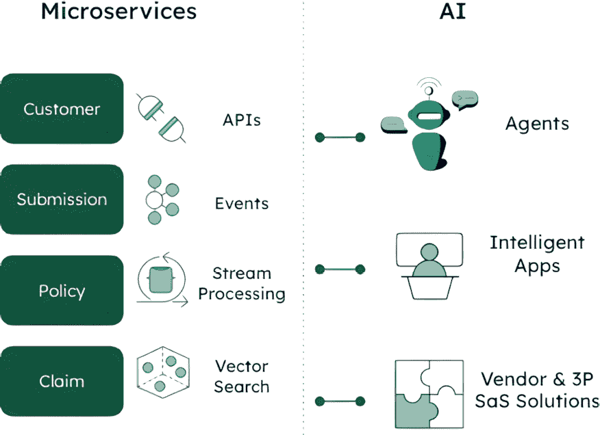

图 14.12：AI 驱动架构

此图展示了 AI 驱动架构，该架构将核心企业实体（客户、提交、政策和索赔）整合到一个统一的平台，支持 API、事件、流处理、向量搜索和文本搜索功能。该架构使 AI 代理、智能应用和供应商/SaaS 解决方案能够在简化复杂性的基础设施上无缝运行，该基础设施从底层设计就是为了预测和启用 AI 功能，而不是对旧系统进行改造。

通过从一开始就考虑 AI 功能来设计系统，保险公司可以避免改造挑战，并迅速采用新出现的 AI 功能，在日益以 AI 驱动的行业中保持竞争优势。

## 核保和风险管理

在保险行业内部，没有哪个角色比核保人更重要，他们需要在利润和风险之间取得平衡，将现实世界的变量带入精算模型，并帮助引导产品组合、市场、定价和承保。在风险敞口和保费之间实现平衡需要不断从多个来源收集和分析信息，以构建全面的风险档案。

虽然许多已建立的保险公司可以访问大量的历史承保和索赔数据，但在整合新的实时数据源、跟上监管变化以及模拟假设风险场景方面仍然存在挑战，这些任务仍然需要大量的手动工作。

### 高级分析

传统的 IT 系统在响应不断变化的数据格式和需求方面反应缓慢。通常，总结数据和将其转化为可操作信息和洞察的责任落在承保人身上。

LLMs 现在正被用于以下方面：

+   加快数据源整理和总结

+   帮助承保团队做出更快的决策

+   减少数据解释所需的手动工作量

通过这样做，AI 模型正在帮助管理季节性需求、市场变化和员工可用性对承保团队工作量和生产率的影响。这为需要真正专业知识的价值账户节省了承保时间。

传统的人工智能模型已经在以下方面在分类和分级风险中扮演着重要的角色：

+   将非常低风险的政策发送到无接触的自动化工作流程

+   将低至中等风险的政策路由到受过培训的服务中心工作人员

+   将高风险和高价值账户定向到专门的承保人

除了分级之外，承保人面临的另一个挑战在于费率调整和政策续保，这占据了承保人日常职责的大部分，并需要大量的时间和手动工作。利用 AI 的自动化承保工作流程可以以远少于手动工作的方式分析和分类风险，从而节省大量时间和智力资本。

一个集成的数据存储库提供了无与伦比的能力，可以存储来自大量来源和格式的数据，并快速响应对新数据摄入的请求。随着数据和需求的变化，文档模型允许保险公司简单地添加更多数据和字段，而无需与刚性数据库结构相关的昂贵变更周期。

在[`www.mongodb.com/solutions/solutions-library/machine-learning-underwriting-solution`](https://www.mongodb.com/solutions/solutions-library/machine-learning-underwriting-solution)了解更多关于使用机器学习自动化数字承保的信息。

### 索赔处理

对于保险公司来说，高效的索赔处理至关重要。在整个过程中及时解决和良好的沟通是维护积极关系和客户满意度的关键。此外，保险公司必须根据司法管辖区的规定支付和处理索赔，这可能包括对特定时间表的违规行为的处罚。

准确处理索赔需要分析大量信息。典型的汽车事故可能包括索赔人和评估人的口头和书面描述，以及来自警察报告、交通和车辆仪表盘摄像头、照片和车辆遥测数据的非结构化内容。

人工智能正在帮助保险公司更快、实时地理解数据。从自然语言处理到图像分类和向量嵌入，所有这些组件现在都可供保险公司使用，以在转型其 IT 系统和业务工作流程方面实现一代人的飞跃。

通过交叉引用实时和历史索赔经验数据，现在可以以更少的时间和更高的准确性生成对灾难性事件的准确影响评估，这得益于生成式人工智能和非结构化数据的向量嵌入。

通过从照片、文本和语音来源使用向量嵌入，保险公司现在可以增强索赔的元数据，使他们能够更快地完成以下任务：

+   分类和分诊索赔

+   将工作分配给适当的专家

+   根据实时工作负载和员工可用性进行指导性工作分配

索赔细节并不总是清晰明了，各方并不总是以诚信行事。人工智能正在帮助保险公司更快地推动解决方案，甚至通过其分析更多数据更有效、更快速的能力来避免诉讼。

许多保险公司使用无人机、传感器或摄像头来捕捉和分析数据，提供风险评估服务。这些数据有望完全防止损失，降低风险敞口、责任和费用。这可以通过结合向量嵌入与传统和生成式人工智能（GenAI）模型来实现。

### 客户体验

在客户服务互动中持续访问信息，同时期望代表能够快速解释它，这始终是一个挑战。保险信息的数量、种类和复杂性使这一挑战尤为突出，推动了在客户体验转型方面的巨额投资：

+   **全天候虚拟助手**：基于人工智能的聊天代理可以释放呼叫中心员工的时间，让他们处理更复杂、更需要人际互动的案件。得益于向量嵌入的内容和大型语言模型（LLM），处理日常咨询现在可以扩展到更复杂的场景。

+   **索赔协助**：生成式人工智能可以实时向员工提供具体的索赔处理指南，而传统的机器学习模型可以查询实时信息流，提醒客户或索赔处理人员注意质量、内容或合规性问题。这些能力使保险公司能够更快地处理更多索赔，同时显著减少错误。

+   **客户画像**：每一次互动都是了解客户更多信息的机遇。语音到文本流、向量嵌入和生成式人工智能等技术帮助保险公司几乎实时地构建更稳健的客户画像。

根据反保险欺诈联盟的数据，2022 年美国保险业因欺诈损失超过 3080 亿美元 [1]。通过非结构化数据源的向量嵌入、跨向量和结构化元数据的语义相似性搜索以及传统的机器学习模型，保险公司可以以以前从未可能的方式检测和预防欺诈。

虽然这些 AI 功能具有巨大的潜力，但保险公司的高管需要具体证据来证明类似组织已成功实施这些技术并取得了可衡量的成果。只有当有现实世界的实施案例支持时，AI 的理论优势才会变得有说服力，这些案例展示了明确的投资回报和运营改进。

以下示例展示了保险公司和相关行业如何从实验阶段发展到生产规模的 AI 部署。它们提供了实施的实际蓝图和可量化的商业成果。

### 针对特定领域的 AI 的实际应用示例

为了使早期概念变得生动，让我们看看特定领域的 AI 如何已经在保险行业产生了可衡量的影响。这些现实世界的例子展示了保险公司如何将 AI 应用于解决承保、风险评估和合规方面的复杂问题，将实时数据分析等先进技术转化为实际的商业成果。

**人工智能驱动的风险智能平台通过人工智能和 MongoDB Atlas 改变保险承保，通过 30%的成本削减**

一个由人工智能驱动的风险智能平台通过使用人工智能为保险公司和承保人提供关于个人和企业的实时洞察，帮助他们建立对承保决策的信心。由 MongoDB Atlas 提供支持，该平台分析大量公共数据以识别保险承保的风险和机会，提供对保单持有人关系和潜在欺诈指标的全面视图。该平台使保险公司能够简化**了解你的客户**（**KYC**）流程，并增强复杂商业保单的尽职调查。

为了编辑清晰，此示例已被匿名化。了解更多信息，请参阅：[`mdb.link/building-trust-with-relationship-intelligence`](https://mdb.link/building-trust-with-relationship-intelligence)。

**领先的 AI 驱动的第三方网络安全风险管理平台通过 AI 加速供应商评估**

一个由 AI 驱动的第三方网络风险评估平台使保险公司能够在几分钟内评估网络保险申请并评估保单持有者的安全态势。通过利用 MongoDB Atlas 进行高效的数据存储和检索，这个先进的 AI 平台可以处理大量的网络安全信息，在几分钟内提供可操作的承保见解。这种简化的方法显著减少了政策评估时间，并提高了整体网络保险风险评估的准确性。该平台使用复杂的模型和 RAG 技术为网络保险承保人提供高度准确和上下文相关的情报。这不仅加速了政策批准决策，还确保保险公司拥有最精确的网络风险评估，以进行保费定价。从分析中生成的风险评估比手动承保方法快 80%，且准确性不受损失。此示例已被匿名化以提高编辑清晰度。了解更多信息，请参阅：[`mdb.link/transforming-cyber-risk-intelligence`](https://mdb.link/transforming-cyber-risk-intelligence)。

这些现实世界的示例展示了保险和相关行业如何从 AI 实施中获得显著的商业价值。通过研究这些成功案例，保险公司可以识别出可能适用于他们自己的承保挑战和风险评估流程的模式和方法。

# 保险领域的实用 AI 用例

在探讨了 AI 实施的结构基础和战略方法之后，让我们来考察一些具体示例，这些示例展示了这些概念在实际中的应用。以下用例展示了保险公司如何应用 AI 技术来解决特定的业务挑战，提供可以指导整个行业类似实施的实用蓝图。

## 使用 LLMs 和向量搜索进行 RAG 的索赔管理

通过将索赔数据转换为向量嵌入，MongoDB 的 Atlas Vector Search 加速了信息检索，使其更快、更容易找到相关细节。LLMs 随后分析这些嵌入以提取有价值的见解和上下文，优化索赔处理。这种结合方法提高了准确性、效率和整体索赔管理。

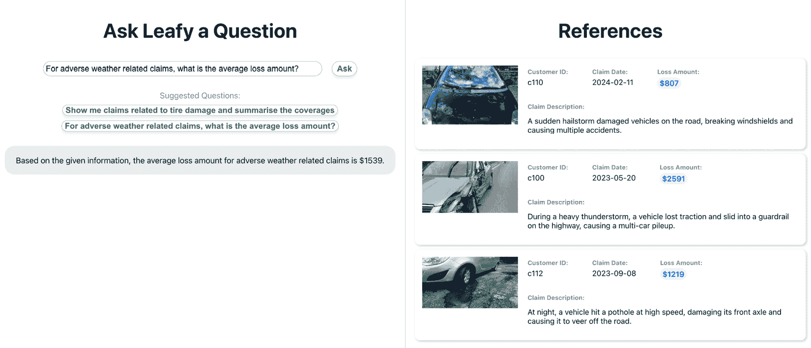

图 14.13：Atlas Vector Search 为用户关于保险索赔的问题提供答案，包括计算和详细的索赔示例

此界面展示了 MongoDB 的 Atlas Vector Search 如何使保险索赔数据的自然语言查询成为可能。用户可以提出诸如“对于与恶劣天气相关的索赔，平均损失金额是多少？”等问题，并收到包含支持性索赔示例、照片和详细损失信息的上下文答案。该系统结合向量嵌入和 LLMs（大型语言模型）来提供针对索赔分析和管理的准确、基于证据的响应。

更多信息请访问：[`www.mongodb.com/solutions/solutions-library/claim-management-llms-vector-search`](https://www.mongodb.com/solutions/solutions-library/claim-management-llms-vector-search).

## 增强型汽车保险索赔调整

通过利用人工智能和矢量图像搜索，此解决方案自动化了汽车保险索赔调整。事故照片与历史索赔数据库中的数据库进行比较，显著加快了损失估计的速度，同时在整个索赔过程中保持一致性。

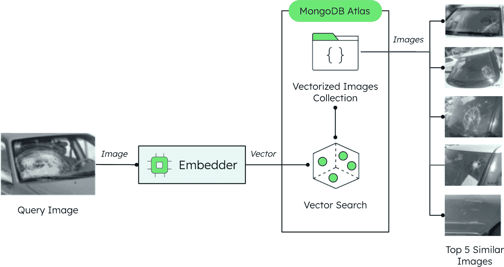

图 14.14：使用矢量图像搜索增强的汽车保险索赔调整

此图展示了自动化索赔调整系统，其中事故照片通过嵌入模型处理以创建向量表示，然后与 MongoDB Atlas 中的向量化图像集合进行搜索。系统执行相似度匹配，返回来自历史索赔的最相似的 5 个损失图像，从而实现快速且一致的损失评估。

更多信息请访问：[`www.mongodb.com/docs/atlas/architecture/current/solutions-library/insurance-image-search/`](https://www.mongodb.com/docs/atlas/architecture/current/solutions-library/insurance-image-search/).

## 基于矢量搜索和 LLMs 的 PDF 搜索应用程序

传统的 PDF 文件难以搜索，这使得保险工作人员难以快速找到信息。此解决方案使用 Superduper 等工具将 PDF 文件转换为可搜索的格式，使用户能够快速检索信息并简化保险工作流程。

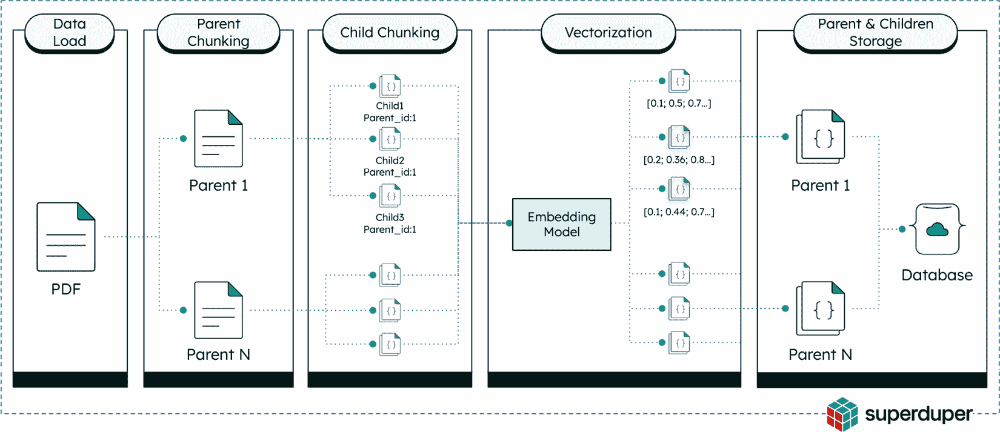

图 14.15：使用矢量搜索和 LLMs 的 PDF 搜索应用程序管道

此工作流程图展示了通过五个阶段将 PDF 文件转换为可搜索内容的流程：数据加载、父块分割、子块分割、使用嵌入模型进行向量化，以及在数据库中存储。系统将 PDF 文档分解为分层块，为语义搜索创建向量嵌入，并存储父文档和子文档结构，以实现高效的检索和 LLM 驱动的搜索功能。

更多信息请访问：[`www.mongodb.com/docs/atlas/architecture/current/solutions-library/pdf-search/`](https://www.mongodb.com/docs/atlas/architecture/current/solutions-library/pdf-search/).

# 保险领域人工智能的未来

随着人工智能技术的不断成熟，我们看到了其应用范围扩展到新的和创新的使用案例，而不仅仅是当前的实现：

## 客户参与预测分析

基于历史数据和趋势，人工智能驱动的预测分析可以预测客户的需求、偏好和行为。通过利用预测模型，保险公司可以识别风险客户，预测客户流失，并主动与客户互动，预防问题并提高满意度。

这些能力使客户参与从被动转向主动，提高客户保留率、增加终身价值，并使客户服务资源的分配更加高效。

## 作物保险和精准农业

AI 正在农业保险中用于评估作物健康、预测产量以及减轻与天气事件和作物疾病相关的风险。通过结合卫星图像、天气数据、土壤传感器和历史产量信息，AI 系统可以在田地级别提供细粒度的风险评估，使保险公司能够提供反映每个农业经营特定风险特征的定制政策。

## 财产保险的预测性维护

利用安装在建筑和基础设施中的**物联网**（**IoT**）传感器提供的 AI 驱动的预测性维护解决方案，正在财产保险中用于防止损失并最小化保险财产的损害。这些系统可以在设备故障、水泄漏和电气问题造成重大损害之前检测到早期预警信号。

## 商用车队基于使用情况的保险（UBI）

商用车辆中安装的 AI 赋能远程信息处理设备收集驾驶行为数据，包括速度、加速度、制动和位置。机器学习算法分析这些数据以评估风险并确定保险费率，这代表了从静态风险评估到基于实际驾驶行为的动态定价的根本转变。

今天建立强大 AI 基础的保险公司将能够充分利用这些新兴机会。最成功的组织将把 AI 视为不仅仅是独立的技术项目，而是一种基本能力，它改变了他们的运营方式、客户服务和风险管理。

想要了解更多信息和资源，请访问 *MongoDB for Insurance* 页面：[`www.mongodb.com/solutions/industries/insurance`](https://www.mongodb.com/solutions/industries/insurance)。

# 摘要

在本章中，我们探讨了保险行业内 AI 的战略整合，以推动有意义的业务成果。它追溯了数据架构从遗留系统到基于统一数据存储的 AI 就绪基础设施的演变，突出了 AI 在数据处理方面的潜力，特别是在管理索赔管理中的非结构化数据。

本章涵盖了从传统机器学习到生成式和基于代理的系统等一系列人工智能技术，展示了它们如何增强决策能力、自动化流程，并在承保、索赔和客户体验方面提高效率。它证明了成功的 AI 实施需要首先理解业务流程，认识到结构化和非结构化数据之间的相互作用，并在统一的数据存储方法中围绕根本领域实体进行设计。最重要的是，组织必须专注于通过业务应用来创造价值，而不是孤立的 AI 实验，以超越实验，真正通过可衡量的商业价值来转型运营。

以下章节从战略概述转向了专注的实施，探讨了这些架构原则如何在实践中应用，将承保流程从长达数周的报价周期转变为实时决策。它概述了一个 10 步骤的 AI 管道，自动化承保工作流程，并展示了业务影响指标，表明周转时间、成本效率和承保能力有了重大改进。

# 参考文献

1.  *保险欺诈联盟*：[`insurancefraud.org`](https://insurancefraud.org)
