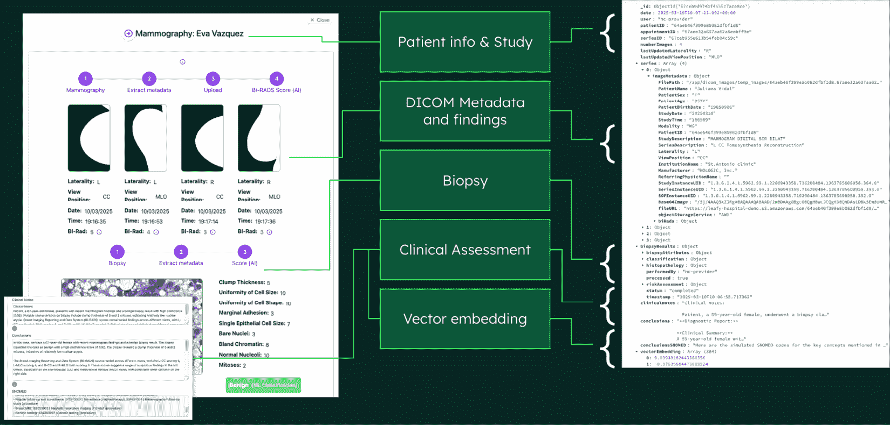
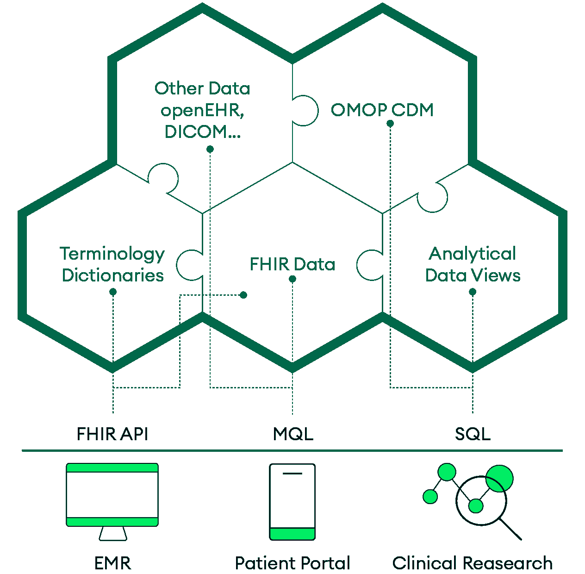
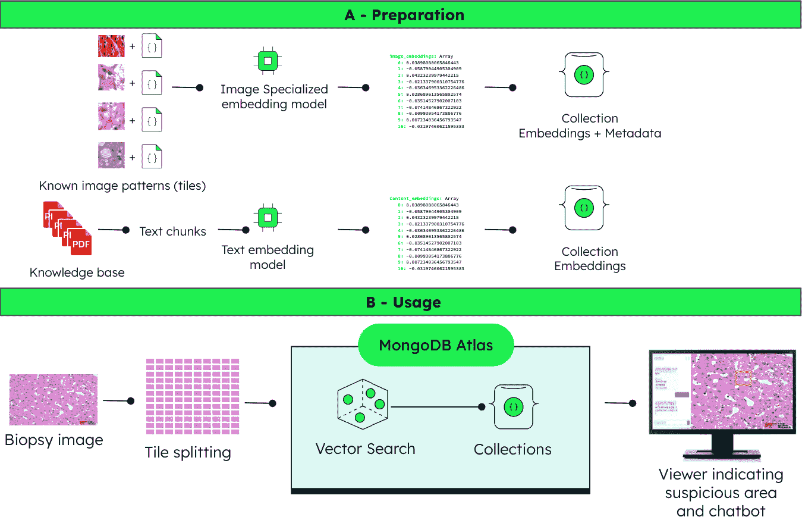

# 16

# 医疗保健和生命科学的人工智能驱动转型。

目前医疗保健产生的临床数据比以往任何时候都多，包括**电子健康记录**（**EHRs**）、可穿戴设备、高级成像和基因组测序。然而，医疗保健专业人员越来越感觉与可操作的见解脱节。这不是技术失败，而是一种碎片化的成功，其中每个系统在单独方面都很出色，但无法和谐地工作，造成了医疗保健的数字债务。当我们急速迈向一个由通用人工智能和自主代理推动的人工智能未来，承诺革命化护理交付时，我们通过创建*代理孤岛*而风险指数级地加剧了这种碎片化：这些孤岛是脱离完整临床背景独立运作的 AI 系统。

通过 AI 转变医疗保健既代表了我们最大的机遇，也代表了我们最关键的挑战。虽然 AI 代理可以自动化文档、协调护理并提供增强临床专业知识的决策支持，但他们的有效性完全取决于对统一、全面的患者数据的访问。本章探讨了医疗保健组织如何构建智能数据基础，以支持协调的 AI 系统，这些系统可以增强而不是分割临床护理，从反应性的数据考古转向主动的智能激活。

在本章中，你将了解以下内容：

+   从通用人工智能（GenAI）到自主代理的演变需要统一的数据基础，以防止危险的代理孤岛，这些孤岛在没有完整临床背景的情况下运作。

+   传统的互操作性解决方案，如**卫生七级组织**（**HL7**）的**快速医疗互操作性资源**（**FHIR**）和供应商 API，在人工智能时代的需求面前显得不足，导致合规性缺乏有意义的可访问数据。

+   基于文档的数据模型提供了将医疗保健标准与 AI 就绪架构相结合的灵活性，同时保持语义完整性。

+   门面模式允许战略性地使用标准作为接口层，而不强迫内部数据刚性，从而保护组织数据所有权。

+   多代理架构可以在保持人类监督和监管合规性的同时，在临床工作流程中协调专门的 AI 角色。

+   未来证明的医疗保健数据基础必须适应新兴的数据类型、AI 能力和监管变化，同时保持临床关系。

# 理解医疗保健中的 AI 革命。

数字告诉我们一个严峻的故事：医疗保健专业人员现在花在将信息输入电子系统中的时间比直接提供患者护理的时间还要多。这种行政负担影响了提供者的福祉，直接破坏了患者护理质量，并加剧了威胁医疗保健人力资源基础的倦怠症。

但这里是什么使得这个危机特别紧迫：我们即将以指数级的方式加剧它。随着医疗保健机构急于在碎片化的数据基础上实施人工智能解决方案，它们冒着创造我们所说的代理孤岛的风险。这些是具有不完全临床背景的自主人工智能系统，可能会放大危险盲点，同时看似节省时间。每个在孤立数据上训练的人工智能代理都会对其有限的视角充满信心，错过了存在于其他系统中的关键交互和背景。

**47 分钟的问题**

考虑这个具有代表性的场景，它代表了医疗保健系统中每天数千次发生的事件。莎拉·陈博士是一位儿科专家，正在为复杂的自闭症评估做准备。她花费了 47 分钟在 7 个不同的系统中寻找所需的病人信息，以便进行 15 分钟的咨询。在走廊的另一边，护理协调员玛丽亚从五个不同的数据库中手动编制病人摘要，为明天的多学科团队会议做准备。在急诊室，威廉姆斯医生在三个不同的系统中记录相同的病人信息，以满足各种监管和运营要求。

这种场景每天都在全球医疗保健系统中重复数千次，不仅仅代表操作效率低下；这是一个人类潜能的危机。当熟练的临床医生将他们的专业知识作为数据考古学家而不是患者倡导者时，整个医疗保健生态系统都会受到影响。

这种行政负担推动了医疗保健对变革性解决方案的迫切需求。通用人工智能和自主代理承诺最终实现数字化转型目标，但只有当它们得到深思熟虑的实施时。大型语言模型可以处理非结构化的临床记录，理解医疗背景，并从复杂的患者数据中生成智能见解。人工智能代理可以自动化文档，协调护理，并提供增强临床专业知识的决策支持。

潜在的变革性巨大。风险无法更高。在探讨医疗保健的数据碎片化危机如何与新兴的人工智能能力相交之前，了解人工智能在医疗保健中的演变以及我们的方向至关重要。人工智能领域正在迅速从简单的自动化工具发展到复杂的自主系统，这将从根本上重塑医疗保健的提供方式。

## 为什么传统解决方案不足

医疗保健在通过互操作性标准如**HL7 FHIR**、专门的集成平台和供应商特定的 API 解决数据碎片化方面投入了大量资金。虽然这些方法提供了合规性和基本的数据交换，但它们为人工智能时代创造了新的问题：

+   标准在特定目的上表现出色，但缺乏人工智能应用的灵活性

+   实施复杂性创造了伪装成互操作性的供应商锁定

+   组织实现了技术合规性，但没有有意义的数据可访问性

大多数医疗组织依赖于专门、领域驱动的解决方案，这些解决方案在互操作性方面处理得较为表面化。这些*黑盒*方法在维持合规性的同时创造了新的孤岛，实现了技术互操作性，但没有真正的数据所有权或控制。

同时，仅关注 API 级别的集成限制了组织使用自身数据的能力。当数据所有权位于供应商系统中而不是组织控制之下时，医疗系统无法快速适应新的 AI 能力、变化的法规或不断发展的护理模式。

## 揭秘 AI 术语

让我们来看看在以医疗为中心的 AI 应用中使用的一些重要术语。虽然你可能熟悉这些概念，但它们在医疗环境中的具体应用和影响值得探讨：

+   **GenAI**代表了医疗保健领域 AI 采用的当前主流。它作为智能助手，可以执行以下操作：

    +   概括复杂的医学文献和研究结果

    +   生成针对特定条件的患者教育材料

    +   从语音记录或结构化数据创建临床文档

    +   根据患者表现提供鉴别诊断建议

    +   在不同语言和识字水平之间翻译医学信息

GenAI 擅长特定、有界面的任务，但需要人类的指导和监督。一位医生可能会要求 GenAI 系统“总结关于老年糖尿病患者治疗选择的最新研究”，并收到全面、结构良好的回应。然而，医生仍需在特定的临床背景下解释这些信息并做出治疗决策。

+   **AI 代理**在医疗领域代表了超越通用人工智能（GenAI）的重大进步，它们作为能够独立处理多层任务的自主数字助手。与仅对特定提示做出响应的 GenAI 不同，AI 代理可以规划、执行并调整其行为以实现既定目标。以下是一个例子：

    +   查看患者的完整药物清单，根据患者的医疗史识别潜在的药物相互作用，建议适当的替代方案，并为医生生成新的处方订单以供批准

    +   从连接的设备监控患者生命体征，识别令人担忧的模式，提醒适当的临床人员，并启动基于协议的干预

    +   通过分析预约可用性、患者偏好、临床紧迫性和安排最佳护理顺序来协调多位专家的护理

    +   通过收集必要的临床文件、提交表格和跟进审批来处理保险预先授权请求

关键的区别在于自主性。AI 代理可以在定义的参数内独立运行，做出决策并采取行动，而无需持续的 human intervention。

+   **代理人工智能**代表了一种系统架构，它使得多个 AI 代理能够作为一个协调的生态系统共同工作。与使用孤立工具不同，代理人工智能创建了由自主代理组成的互联网络，这些代理能够进行沟通、分享见解并协作完成复杂的医疗目标。考虑一家医院在多个部门实施代理人工智能的情景：

    +   **急诊科代理**：处理入院患者，根据症状和生命体征进行分类，并启动诊断方案

    +   **实验室代理**：接收检测订单，根据临床紧急程度进行优先排序，处理结果，并提醒临床医生注意关键值

    +   **药房代理**：审查药物订单，检查相互作用和过敏反应，管理库存，并与护理协调给药

    +   **护理协调代理**：监测患者进展，确定出院准备情况，与专家协调，并安排后续护理

当急诊科代理识别出需要紧急手术的患者时，它会自动与实验室代理协调进行术前检查，与药房代理协调药物准备，与护理协调代理协调手术安排和术后规划。

接下来，让我们看看这些工具如何被用来帮助改变医疗保健。

# 通用人工智能的变革性机遇

市场分析师预计到 2028 年，代理人工智能的采用将显著增长，医疗保健代表了最有意义的机遇之一。来自 NVIDIA 的 Amanda Saunders 观察到以下情况：

*“代理人工智能已经正在改变企业，并可能成为一个价值数万亿美元的机会。医疗 IT 领导者应该积极参与学习，了解 AI 代理如何帮助改变药物发现、患者护理、运营以及更多领域的工作。[1]”*

尽管代理人工智能在医疗保健领域具有巨大的潜力，但成功的实施需要认识到其能力和局限性。代理人工智能将主要帮助减轻计算工作量和行政任务，但复杂的临床决策仍然需要人类的专家知识和判断。

即使是技术开发者也承认，自主人工智能尚未准备好独立处理护理的关键方面，如开具药物处方、做出诊断决策或管理复杂的患者互动。

医疗保健领导者必须在部署代理系统与维持有意义的团队合作之间找到一个深思熟虑的平衡。目标不是取代临床专业知识，而是放大它，使医疗保健专业人员能够在他们的培训水平上运作，同时人工智能处理常规任务并提供智能支持。

## 为医疗保健人工智能构建正确的架构

为了有效地实现这种平衡的人机协作，医疗保健组织必须解决一个基本前提：确保人工智能代理能够访问完整的、统一的病人背景。代理人工智能的有效性与它能够访问的数据的质量和全面性直接相关。

这引发了一个重要的战略考虑：在未解决数据碎片化问题的前提下，实施代理人工智能的健康组织可能会实现局部改进，但会错失协调智能护理的变革潜力。关键在于建立数据基础，使人工智能代理能够有效协作，而不是创造孤立的自动化孤岛。

这种架构挑战（从碎片化的数据系统过渡到支持协调人工智能的统一基础）代表了医疗保健领域下一个重大的创新机会。

想象一下用训练于其中七个系统之一的 AI 代理来替代陈医生 47 分钟的数据考古。节省的时间是即时的。盲点是无形的：分析影像数据的人工智能代理可能会错过记录在单独系统中的关键药物相互作用，或者推荐它无法访问的护理计划相矛盾的治疗方案。潜在的危害在无声中扩大。与通常孤立发生的人类错误不同，人工智能代理可以在任何人意识到模式之前，在数千名患者中复制相同的危险盲点。

这代表了医疗保健领域人工智能的核心悖论：我们的系统越自治，就越需要统一它们依赖的数据。没有完整临床背景的人工智能代理是低效且危险的。它可能会推荐与其它护理计划相矛盾的治疗方案，错过关键的药物相互作用，或者因为无法看到完整的患者情况而重复干预。

我们称这种现象为*代理蔓延*：一个每个部门都有自己的 AI，但没有人真正看到完整病人的未来。为了了解人工智能碎片化是如何发展的，我们必须检查创造这些脱节人工智能生态系统的潜在数据架构挑战。

## 医疗保健数据架构的挑战

现代医疗保健领域数据泛滥，但往往缺乏可操作的见解。COVID-19 大流行显著暴露了在整个医疗保健领域，从个体临床护理到国家研究和战略规划，对易于获取、完整和可靠数据的迫切需求，揭示了数据基础设施的差距，并加速了健康系统中的数字创新 [2]。

医疗保健标准作为系统间互操作性的共同语言，确保了临床数据的语义完整性。这些标准旨在建立对每份数据含义的共享理解。它们保证了不同系统和利益相关者之间数据的语义完整性。如果没有这种共享理解，我们可能会出现误解、错误，最终导致患者护理质量下降。

标准是必不可少的。然而，仅靠标准本身并不能完全满足现代医疗保健组织不断变化和多样化的需求。标准通常是为了特定目的而设计的，每个标准都有其固有的优势和特定的局限性。在 Alastair Allen 的*FHIR + openEHR — 2022*文章等资源中分享的见解突出了不同标准如何提供互补的优势[3]。但是，医疗保健需要的数据远不止于此，标准主要定义了数据是如何结构化或共享的；它们很少解决数据应该如何最优存储、查询或利用以满足现代医疗保健创新的更深层次挑战。

具体来说，医疗保健组织面临一些标准本身无法解决的实践挑战：

+   **应用特定需求**：不同的应用程序需要以不同的格式处理数据以创建用户友好的界面并支持专门的临床工作流程。标准定义了数据如何进入系统，但它们很少与应用程序需要组织或展示数据的方式相匹配。

+   **标准演变**：标准不断变化，需要持续投资以保持最新。组织通常通过坚持旧版本来避免这些成本。这导致了技术债务、数据版本冲突，甚至更多的数据孤岛。

+   **实施复杂性**：标准可能很复杂，难以正确实施。因此，组织通常选择现成的黑盒解决方案来处理互操作性，而不是将标准深入嵌入到他们的系统中。

+   **组织壁垒**：数据治理不仅是一个技术挑战，也是一个组织挑战。数据孤岛通常反映了部门壁垒，不同的团队拥有自己的数据、优先级和激励措施。克服这些障碍需要强有力的领导、明确的数据治理政策和数据共享的文化。

理论上，像 openEHR 这样的标准，它们专注于结构化临床数据，可以解决许多这些问题。然而，即使采用 openEHR 的组织也常常发现自己增加了复杂性。供应商引入了专门的缓存，为特定应用构建快速视图，并开发复杂的架构以满足多样化的使用和性能需求，特别是支持跨患者和分析查询。虽然这些添加往往是必要的，但它们可能会显著增加成本和复杂性，甚至可能重新引入数据孤岛。这表明，即使是最好的标准也很少提供一刀切解决方案，现实世界的实施通常需要一个更具适应性的方法。

# 准备应对未来的医疗保健数据需求

我们迄今为止讨论的挑战是重大的，但它们只是未来医疗保健数据巨浪的前奏。例如，今天的基因组数据很少与临床记录集成，限制了精准医疗的现实世界影响。为了实现医疗保健的全部潜力，组织必须首先解决这个关键的集成差距：

+   **精准医疗**正在从基因组学扩展到蛋白质组学、代谢组学、转录组学、成像、数字病理学、临床记录和可穿戴设备的实时患者数据。它还考虑了生活方式因素和**健康的社会决定因素**（**SDOH**）如住房、环境和医疗保健可及性。然而，有效地捕获、集成和分析这些复杂的数据集远远超出了传统医疗保健数据架构的能力，需要更大的敏捷性、可扩展性和集成能力。

+   **人工智能的爆发**：人工智能正在改变医疗保健的各个方面，从诊断和药物发现到个性化治疗和预测分析。但是，AI 模型需要大量的数据进行训练，并且它们生成复杂的输出（如风险评分和治疗建议），这些输出需要存储并与其他患者信息集成。

+   **非结构化数据金矿**：临床笔记、研究论文、患者对话——非结构化数据包含大量有价值的信息，这些信息通常被锁在文本文档中。自然语言处理（NLP）和其他 AI 技术可以帮助我们解锁这个金矿，但我们需要能够有效存储和管理非结构化数据的系统。

简而言之，医疗保健的未来将由利用多种不断扩展的数据类型的能力来定义。

## 一种基于文档、AI 就绪的方法

面对这些挑战，有效的前进方式是什么？答案是采用一种实用的方法，旨在在灵活的架构中战略性地利用医疗保健标准。基于文档的模型提供了必要的敏捷性，使组织能够无缝地结合标准化数据和基本扩展，无需对存储模型进行持续的重构。

从本质上讲，**基于文档的数据模型**将数据存储为文档集合，其中每个文档可以被视为一个自包含的单元。这些文档可以包含结构化、半结构化和非结构化数据的混合。与传统关系数据库强制执行刚性架构不同，文档数据库提供灵活的架构，允许文档随时间演变，而无需进行昂贵的架构迁移。这使得它们非常适合处理医疗保健中发现的多样化和不断变化的数据类型。具体来说，它执行以下操作：

+   **符合医疗保健标准**：如 HL7 FHIR 和 openEHR 等标准定义了复杂、层次化的数据结构，这些数据结构在 JSON 格式中自然表示。

+   **处理多种数据类型**：轻松容纳来自电子健康记录的结构化数据、来自临床笔记的非结构化文本、图像元数据、基因组数据、可穿戴设备的传感器数据以及人工智能生成的见解。

+   **架构灵活性**：允许在不要求破坏性迁移的情况下迭代数据模型演变。随着新数据类型的出现和数据需求的变化，架构可以相应地进行调整。

+   **性能提升**：文档数据库通常为涉及整个文档检索的查询提供更快的查询性能。通过优化磁盘访问，由于相关数据连续存储，从而实现高效的检索和降低延迟。此外，由于高级分层存储策略，这种方法在成本效益上也是可行的，因为它自动将频繁访问的数据放置在更高性能的存储层。

+   **开发者友好**：灵活的架构和基于 JSON 的表示简化了开发过程，使开发周期更快，复杂性降低，并提高了生产力。

解决方案不是放弃标准，而是将它们作为更灵活架构的组件使用。许多供应商提供的刚性架构通常施加限制，这些限制削弱了医疗保健所需的敏捷性。医疗保健数据的日益复杂需要一种新的方法。文档模型提供了这个基础。有关文档模型的更多信息，请参阅*第三章*，*行动系统*。

尽管医疗保健标准对于互操作性至关重要，但它们往往引入了实施复杂性。如前所述，组织经常转向现成的黑盒解决方案，这些解决方案表面上处理互操作性，而不是将标准深深嵌入其数据战略中。

但让我们明确一点：采用文档模型并不是要放弃标准。相反，它是关于战略性地利用它们。关键在于**外观模式**，这是一种软件设计方法，它提供了一个简化的接口来访问复杂的底层系统。将其视为使用标准作为翻译者，确保不同的系统可以通信，而不强制规定您数据的核心结构。这意味着，而不是将所有数据强制放入僵化的预定义模具中，您采用灵活的文档格式进行存储，允许丰富的结构化、半结构化和非结构化信息的混合。

然后，当需要交换数据或连接到外部系统时，标准如 FHIR 作为接口层，而不是内部结构。这种方法通过提供无缝互操作性和对您数据的完全所有权来提供两全其美的解决方案。这是外观模式的核心，它暴露了符合标准的视图，而不强制内部僵化。

一些架构，如 openEHR，采取相反的方法。它们使用标准本身作为基础数据模型。虽然这可以提供强大的一致性和语义结构，但往往引入了僵化，并将长期控制权交给了标准的约束。然而，相同的指导原则适用：组织必须保留对其数据模型的所有权，并确保满足未来需求时的灵活性。最终，你如何建模和查询数据，而不仅仅是暴露哪个 API，决定了你的系统如何适应新的要求。

## 使用外观模型增强灵活性和互操作性

以下 `DiagnosticReport` 示例展示了这种方法的实际应用，展示了文档模型如何容纳符合 FHIR 标准的临床数据和额外的操作元数据：

```py
{
  "_id": {"$oid": "65ea3df8fde80681cde96175"},
  "metadata": {
    "documentVersion": "1.0",
    "fhirVersion": "4.0.1",
    "lastUpdate": "2024-03-07T22:07:02Z",
    "tenant_id": "TenantA",
    "uuid": "urn:uuid:0081fd71-59c0-4995-94e0-ce8628dc0529",
    "searchParameters": [
      {"key": "code", "value": "34117-2"},
      {"key": "date", "value": "2004-09-08T20:32:52-04:00"},
      {"key": "patient", "value": "Patient/1"},
      {"key": "status", "value": "final"}
    ],
    "vectorSearchEmbeddings": {
      "model": "text-embedding-3-small",
      "vector": [-0.01741, -0.02967, 0.01068, /* truncated for brevity */]
    },
    "applicationFields": {
      "reviewStatus": "pending",
      "priorityLevel": "high",
      "assignedTo": "Reviewer123"
    }
  },
  "fhirResource": {
    "resourceType": "DiagnosticReport",
    "id": "DiagnosticReport/7",
    "status": "final",
    "category": [
      {"coding": [{"system": "http://loinc.org", "code": "34117-2", "display": "History and physical note"}]}
    ],
    "code": {"coding": [{"system": "http://loinc.org", "code": "34117-2", "display": "History and physical note"}]},
    "subject": {"reference": "Patient/1"},
    "encounter": {"reference": "Encounter/7"},
    "effectiveDateTime": "2004-09-08T20:32:52-04:00",
    "issued": "2004-09-08T20:32:52.360-04:00",
    "performer": [{"reference": "Practitioner/62", "display": "Dr. Waltraud488 Gaylord332"}],
    "presentedForm": [{
      "contentType": "text/plain",
      "data": "Encoded clinical note content here."
    }]
  }
} 
```

在这个示例中，您可以看到：

+   **FHIR 资源层**: 这包含标准化的临床数据（`DiagnosticReport`）。

+   **元数据层**: 这包括自定义字段（`documentVersion` 和 `tenant_id`）和用于优化查询的搜索参数。

+   **特定应用领域**: 这些字段，例如 `reviewStatus` 和 `priorityLevel`，允许在 FHIR 标准之外启用额外的操作工作流程。

+   **向量嵌入**: 这些通过将临床信息嵌入向量格式来促进高级语义搜索和由人工智能驱动的功能。有关向量嵌入如何工作及其在人工智能系统中的作用的详细说明，请参阅*第二章*，*区分通用人工智能、RAG 和代理人工智能的特点*。

这种结构通过和谐地整合标准临床数据、附加元数据和特定应用细节来体现外观模式，而不损害互操作性。



图 16.1：用于人工智能增强医疗数据分析的医疗数据集成和向量嵌入架构

此图展示了 MongoDB 灵活的文档模型如何存储和整合各种医疗保健数据类型，包括患者信息、**医学数字成像和通信**（**DICOM**）元数据、活检结果和临床评估。每个数据类别都存储为 MongoDB 文档，可以通过向量嵌入增强，以实现人工智能驱动的语义搜索和分析。该架构展示了 MongoDB 的架构灵活方法如何适应不同的医疗数据格式，同时通过嵌入向量实现高级搜索能力，以改善临床洞察力和决策支持。

正如我们所见，外观模式允许标准发挥其最佳作用，即促进沟通，而不强迫内部统一性。以面向文档的存储为基础，系统获得了自由发展的空间，可以整合新的数据模式，并响应新兴需求，而无需重新构建其整个基础设施。

## 医疗保健人工智能的新堆栈

这种以文档为核心、以标准为边缘的混合方法为下一跃奠定了基础：AI 代理不仅操作数据，还操作上下文智能。例如，在肿瘤学中，一个单一案例可能涉及数十个相互关联的工件：基于 FHIR 的临床笔记、DICOM 成像元数据、全基因组测序、PDF 病理报告和模型生成的风险评分。试图在关系或标准约束的架构中统一所有这些内容要么会失败，要么需要巨大的努力。但是，作为具有丰富元数据、关系和嵌入的嵌套文档存储，您使 AI 系统能够穿越这种复杂性，跨模态推理，并提供临床上有用的见解。

这不仅仅是一个理论上的可能性；它已经在发生。在癌症中心的试点项目中，基于文档的存储库正在使肿瘤学家能够查询与特定分子亚型匹配的放射学生长模式的病人，而病理学家则使用向量搜索呈现相似的组织切片，无论诊断标签如何。护理团队现在可以在单一查询中链接患者报告的结果、可穿戴数据、自然语言处理分析笔记和药物反应记录，创建以前无法实现的全面视图。

通过采取逐步的、分阶段的实施方法，医疗保健组织可以在满足即时运营需求的同时，平衡长期战略目标。结果是，一个数据架构通过标准化提供即时价值，同时保持适应未来医疗保健挑战的灵活性，无论这些挑战涉及新的数据类型、高级应用需求还是新兴的人工智能能力。

这种平衡策略，在尊重标准的同时拥抱适应性，最终使医疗保健组织能够实现运营效率和临床创新的双重目标。此外，所有这些因素都有助于显著降低**总拥有成本**（**TCO**）。



图 16.2：以 FHIR 为中心的方法与 MongoDB 灵活的文档模型

此图说明了 MongoDB 的文档模型如何使医疗保健组织能够集成各种数据源，包括 FHIR 数据、术语字典、OMOP CDM、分析数据视图以及其他医疗标准（如 openEHR 和 DICOM）。中心 FHIR 数据中心连接到各种访问方法（FHIR API、MQL 和 SQL），并为多个端点提供服务，包括电子病历系统、患者门户网站和临床研究应用。这种灵活的方法在标准化与适应性之间取得平衡，以适应不断变化的医疗数据需求。

通过控制您的数据战略，采用文档模型，并战略性地利用标准，您为医疗保健创新创造了一个未来证明的基础。这意味着构建能够适应新数据类型而无需架构重整的系统，集成新兴的人工智能能力而无需供应商锁定，并根据临床需求而不是技术限制来扩展计算资源。一个真正未来证明的基础能够适应监管变化、标准演变和突破性技术，同时保留使医疗智能成为可能的临床背景和数据关系。这个基础为智能护理协调奠定了基础，这种协调改变了医疗保健的提供方式。

# 实施架构模式

成功的基于人工智能的护理协调实施遵循一致的架构模式，这些模式可以适应不同的医疗环境和临床专业。

+   **面向文档的数据基础**: 医疗信息自然存在于通过面向文档的数据模型保留的分层、相互关联的关系中。患者记录包含嵌套信息，其中问题包括干预措施，干预措施包括结果，在保持临床背景的同时，使高效查询成为可能。

+   **向量搜索集成**: 语义搜索能力使临床文档中的自然语言查询成为可能，即使在使用不同术语描述的情况下，也能发现类似案例和相关的协议。这种能力对于必须在不同经验水平的提供者之间共享临床知识的专科护理领域至关重要。

+   **多模态数据处理**：现代医疗保健产生多种数据类型，包括结构化评估、叙事笔记、家庭沟通和多媒体观察，这些必须协同工作以支持全面的护理决策。成功的平台在保持适当关系和临床上下文的同时，适应这种多样性。

+   **实时处理架构**：临床决策是实时发生的，需要能够持续处理新信息并提供即时访问更新见解的系统。这种响应性对于协调护理场景至关重要，在这种场景中，多个提供者必须根据共享观察调整他们的干预措施。

一起，这些使护理方法更加协调。

## AI 驱动的护理协调

从分散的医疗保健系统到智能协调平台的发展代表了医疗保健领域最具变革性的重大机遇之一。AI 驱动的护理协调解决了使跨学科团队可访问和可操作多样化临床信息的基本挑战，使提供者能够专注于患者护理而不是行政负担，同时提高护理质量和结果。

医疗保健协调需要复杂的编排能力，能够处理复杂的临床场景，处理多种数据类型，并在自动化工作流程中保持人工监督。多代理架构提供了管理这些交互的框架，同时确保临床准确性和法规合规性。

## 在临床工作流程中编排专门的代理角色

临床信息处理的各个方面需要专门的技能和领域知识。一个全面的护理协调平台采用多个 AI 代理，每个代理都针对特定的医疗保健任务进行了优化：

+   **临床查询处理代理**理解特定于医疗保健的语言和意图，将自然语言问题转换为可以针对临床数据进行执行的结构化查询。当提供者询问“``本周哪些患者需要关注？”时，代理将其解释为需要分析进展趋势、即将进行的评估、家庭关注点和护理计划截止日期。

+   **上下文综合代理**从多个来源收集全面的病人信息，理解不同类型临床数据之间的关系。这些代理认识到患者的进展可能受到药物变化、家庭情况、教育环境或社会因素的影响，从多样化的文档来源收集相关上下文。

+   **临床推理代理**应用特定于医疗保健的逻辑来分析检索到的信息，识别可能影响护理决策的模式和趋势。这些代理理解临床意义，区分统计学上显著的变化和具有临床意义的改进，这些改进需要干预措施的改变。

+   **文档代理**维护所有 AI 生成洞察力的审计跟踪和引用，确保建议可以追溯到特定的观察、评估或临床指南。这种能力对于合规性和临床问责制至关重要。

多个 AI 代理的协调需要复杂的流程管理，能够适应不同的临床场景，同时保持一致性和可靠性：

+   **顺序处理工作流程**处理需要多个分析步骤的复杂查询，每个代理都基于先前处理阶段的成果。这种模式对于必须整合来自多个临床领域的患者全面评估是有效的。

+   **并行处理工作流程**能够同时分析患者护理的不同方面，提高紧急临床查询的响应时间。多个代理可以同时分析行为数据、药物有效性和家庭报告，以提供快速、全面的评估。

+   **自适应工作流程**根据临床问题的类型、可用数据源和紧急性要求调整其处理方法。紧急情况触发加速的工作流程，优先考虑立即的安全考虑，而常规进度审查则采用综合分析模式。

工作流程只是影响因素之一。这些代理的一个关键好处是它们在这个特定专业环境中处理语言的方式。

## 自然语言临床智能

通过自然语言处理对临床信息访问的转型代表了智能护理协调平台最直接的好处之一。而不是要求提供者导航复杂的数据库结构，自然语言界面使临床医生能够以对话方式与患者数据进行交互。

## 临床情境理解

医疗保健提供者使用的是不直接映射到数据库查询的临床语言。高级自然语言处理系统必须理解医学术语、时间关系和临床意义，以便为提供者的提问提供准确的响应。

有效的临床沟通需要针对特定角色和决策情境的响应。同一个临床问题，根据是由直接护理提供者、临床主管还是家庭成员提出，需要不同层次的具体细节和关注点。

角色适应性响应生成应提供以下内容：

+   **为提供者的技术术语和定量指标**

+   **总结重点**：为管理者提供关键见解和行动项目

+   **家庭沟通**：易于理解的语言和进度说明

+   **监管格式**：针对审计的合规性文档

这种针对特定角色的方法确保 AI 生成的见解与每个利益相关者的决策背景和信息需求相匹配，最大化效率和临床安全。

## 语义搜索功能

基于向量的语义搜索使临床医生能够在提供者或文档系统之间术语具体术语不同的情况下找到相关信息。这种能力在进步通过多个领域的微妙变化体现的专门护理领域尤其有价值。

语义搜索可以识别看似无关的观察之间的联系，例如将行为改善与沟通进步相关联或将环境修改与减少挑战性行为联系起来。这些见解通常来自个人提供者可能没有注意到的模式，但通过全面数据分析变得明显。

**CentralReach 对自闭症和 IDD 护理的影响**

现在让我们考虑人工智能驱动的护理协调在医疗保健组织实际应用中的好处。这些部署展示了临床效率、护理质量和提供者满意度的可衡量改进。

CentralReach 提供了一个令人信服的例子，展示了人工智能驱动的护理协调如何解决关键的医疗保健挑战。在自闭症和**智力与发育障碍**（**IDD**）护理（一个面临严重提供者短缺的领域）中运营，CentralReach 开发了显著减少行政负担同时提高护理交付的解决方案。

如 CentralReach 的首席执行官 Chris Sullens 所解释的，护理差距挑战如下：

“*每 36 个孩子中就有 1 个被诊断为自闭症，在这 200 多万名儿童中，估计今天只有不到一半得到主要服务，主要是因为没有足够的临床医生提供护理。在 CentralReach，我们称之为自闭症和 IDD 护理差距，这推动我们的使命是提供尽可能最好的技术，以压缩提供者团队，尤其是治疗师，在行政任务上花费的时间*。”

CentralReach 平台上的 AI 增强临床工作流程展示了人工智能如何改变常规临床任务。CentralReach 人工智能负责人 David Stevens 描述了其影响：

“*它将所有这些信息都呈现在你的指尖上。你不必像打字机一样逐字逐句地查找，也不必担心是否有人填写了正确的字段。用那种经典的话来说，人工智能不仅找到了干草堆里的针，而且还烧毁了干草堆*。”


该平台允许在综合临床数据集中进行自然语言查询，使提供者能够提出诸如“*我的客户在这个技能上进展如何？*”等问题，并收到综合多个数据源和临床观察的合成响应。

CentralReach 的 Care360 计划代表了向全面护理协调的演变，将数据集统一为整体学习者档案，支持多学科团队合作。这种方法消除了重复的数据输入，同时确保每位提供者都能访问其干预的全面背景。

如需了解更多关于这个故事的信息，请访问[`venturebeat.com/data-infrastructure/ai-boosted-autism-and-idd-care-centralreach-and-mongodb-transform-how-care-is-delivered/`](https://venturebeat.com/data-infrastructure/ai-boosted-autism-and-idd-care-centralreach-and-mongodb-transform-how-care-is-delivered/).

## 使用 GenAI 进行视觉诊断

考虑以下场景，这反映了放射科医生面临的常见挑战。马蒂内斯医生研究一个胸部 CT 扫描，而先前的研究图标在三个 PACS 服务器上旋转，图像清晰可见，但故事却遥不可及。右肺上叶的 8 毫米结节孤立于患者的吸烟史中，这些史实被锁定在电子病历中，上个月活检的病理报告存储在另一个系统中，以及可能将这一发现从常规随访转变为紧急干预的肿瘤学笔记。

在那一刻，她体验到了医疗保健的 47 分钟问题视觉版本：不是像陈医生那样在七个基于文本的系统之间搜索，而是导航图像孤岛，这些孤岛将完整的临床图像分解成不连贯的视觉片段。

但用单一视角的 AI 取代马蒂内斯医生的系统跳转，会带来更微妙的风险。你获得了速度，但失去了吸烟史、EGFR 结果和细微差别。在成像中，半知半解是危险的，因为诊断准确性取决于完整的临床背景。一个只看到结节生长但忽略了患者免疫抑制状态的 AI 系统可能会在需要密切观察时推荐激进随访，或者相反，可能会低估高风险患者的癌症风险，从而可能延迟救命干预。

现代放射学面临这一确切挑战：如何在确保访问完整临床背景的同时利用 AI 的模式识别能力，将像素转换为病人护理。该解决方案需要统一的数据架构，将成像洞察与全面的病人故事连接起来。

GenAI 通过弥合系统可见性和临床医生所需知识之间的差距，改变了医学影像。这些系统同时处理多种数据类型，即图像、元数据、临床历史和比较研究，创建统一的病人背景，使人类专业知识和 AI 能力都能发挥最佳效果。

模型看到 8 毫米的毛刺状结节，知道 30 包年的吸烟史，并引用 Fleischner 社会指南（肺结节管理的建立医疗建议），建议三个月后进行随访：

```py
PRELIMINARY AI IMPRESSION  
8mm solid pulmonary nodule, RUL, spiculated.  
Given smoking history, repeat CT in 3 months per Fleischner.  
[Radiologist review required] 
```

这种自动生成展示了面向文档的架构如何使 AI 系统访问完整的临床背景，而不是孤立的图像数据，这正是防止形成代理孤岛的基础。

人工智能最具变革性的能力之一是解决影像的基本挑战：理解发现如何随时间演变。当与综合数据存储库集成时，AI 系统可以自动检索相关的先前研究，并突出显示当前解释中提供的信息的关键变化。

考虑马丁内斯博士正在审查后续扫描：5 月显示原始 6 毫米的结节，7 月显示增长到 7 毫米，10 月测量为 8 毫米。对马丁内斯博士来说，AI 分析感觉就像去年拍摄的胶片永久性地安装在今天的灯箱上，但实时标注了生长计算、倍增时间估计和基于指南的建议。

这种**时间智能**只有在影像数据与完整的患者病史无缝连接时才成为可能。

## 医学视觉问答

医学视觉问答代表了集成临床智能的最高表达，使临床医生能够通过自然语言与影像数据进行交互，同时访问完整的患者背景。这项技术将放射科医生与影像系统之间的传统关系从被动观看转变为积极的诊断协作。

当急诊医生询问“是否有颅内出血的证据？”时，系统会检查密度模式、解剖标志和体积效应指标，并在几秒钟内回答：“没有急性出血，中线无移位，检查结果为阴性”。

该系统能够将视觉发现与从统一的患者数据中提取的临床背景相关联。

## 应用向量嵌入

向量嵌入将医学图像转化为数学指纹，使语义搜索能够在庞大的影像库中进行。想象一下病理切片被切成小块，每块都分配了一个向量指纹，让计算机能够发现人类观察者可能错过的肿瘤之间的家族相似性。

当马丁内斯博士遇到罕见的腺癌变体时，向量搜索可以立即定位来自数千项先前研究的类似病例，提供视觉参考和诊断指导，这是通过传统的基于文本的搜索无法找到的。统一存储库将这些指纹变成了一个临床谷歌，几秒钟内就能找到双胞胎肿瘤。

这项技术展示了统一数据架构如何使新的临床推理形式成为可能。只有当病理图像、临床元数据和诊断结果存在于集成存储库中时，向量嵌入才能提供有意义的临床见解，而不是孤立的模式匹配。



图 16.3：使用 MongoDB Atlas 进行医学图像分析的向量嵌入工作流程

这个两阶段工作流程展示了向量嵌入如何实现医学图像的语义搜索。阶段 A（**准备**）显示了通过图像编码模型将医学图像和知识库数据转换为存储为集合的向量嵌入的过程。阶段 B（**使用**）说明了查询图像如何在 MongoDB Atlas 集合中进行瓦片分割和向量搜索，结果在查看器界面中显示，用于检测可疑区域和肿瘤。这种方法将视觉医学数据转换为数学表示，以供人工智能辅助诊断。

医学成像人工智能代表了医疗保健更广泛转型的有吸引力的应用和关键测试案例。当成像系统可以无缝访问患者病史，将发现与临床背景相关联，并将见解与护理协调平台集成时，它们展示了定义医疗保健数字未来的统一智能。

放射学只是侦察兵。到 2028 年，扫描将自行提取先验知识，标记生长情况，并在患者离开 CT 扫描之前向肿瘤科发出活检请求。

这种成像转换展示了统一数据架构如何使人工智能能力得到增强，而不是碎片化临床护理，同时为医疗保健向真正集成、智能护理交付系统的演变提供实际模型。

# 将智能扩展到生命科学

虽然我们的探索主要集中在医疗保健服务和临床工作流程上，但我们开发的结构原则，即统一数据基础、语义智能和面向文档的灵活性，自然地扩展到患者护理环境之外。生命科学组织面临着非常相似挑战：复杂、层次化的数据结构抗拒传统的关联方法，需要跨不同信息类型的语义关系，以及消除将专业知识从核心科学工作中转移的行政摩擦的必要性。

同样的碎片化模式困扰着临床系统，其中关键信息存在于相互隔离的孤岛中，在整个药物开发生命周期中显现，从分子研究到监管批准。那些使临床智能化的外观策略和向量搜索能力，当应用于药物发现、监管流程和市场授权工作流程时，同样具有变革性。

在生命科学领域，在整个药物生命周期中，从基础研究到市场，将大量数据转化为可操作的见解至关重要。随着精准医学和基因组学的兴起，AI 通过根据遗传、环境和生活方式因素为个体患者量身定制治疗方案，发挥着变革性的作用。GenAI 加速药物发现，分析基因组数据以实现个性化治疗途径，并优化临床试验。

## 革命性提升 CSRs（临床研究报告）的效率，借助 GenAI 和 MongoDB

药品行业面临着加快新药和疗法监管审批流程的巨大压力。这一流程的关键组成部分是创建**临床研究报告**（**CSRs**），这些通常是数百页的综合性文件。这些报告作为主要证据提交给监管机构，如美国**食品药品监督管理局**（**FDA**）和**欧洲药品管理局**（**EMA**），以证明药物的安全性和有效性。它们详细说明了临床试验的方法、执行和结果，为药物审批决策提供了完整的科学基础。

传统上，编制 CSR 是一项劳动密集型任务，通常需要几周时间才能完成，并涉及临床研究人员、生物统计学家、医学作家和监管专家的多学科团队。这个漫长的周期不仅延误了急需治疗的患者可能救命治疗的引入，还导致了与延长研发周期和更长的上市时间相关的显著成本。

生成 CSR 的过程复杂，涉及大量临床数据的整合。这包括统计输出、安全性分析、有效性摘要和必须符合严格监管格式要求的详细叙述。手动方法耗时且易出错，这可能会进一步延误监管审批或触发来自监管机构的额外信息请求成本。遵守如 FDA 和 EMA 设定的严格监管标准，为文档创建过程增加了另一层复杂性。任何偏离规定格式或缺失信息都可能导致提交延误或被拒绝。

GenAI 与如 MongoDB Atlas 等现代数据库平台的集成，通过自动化 CSR 创建过程，为这些挑战提供了突破性的解决方案。这种方法可以将生成 CSR 所需的时间从几周缩短到几分钟，使制药公司能够加快新药上市的时间。

将 GenAI 与灵活、可扩展的数据库环境相结合，支持临床试验中固有的动态和多样化的数据结构。这种灵活性对于管理 CSR 生成中涉及的多种数据类型至关重要，包括文本、表格和复杂统计数据。通过使用 GenAI 模型，公司可以自动化 CSRs 的起草，生产出高质量、合规的文件，需要最少的人工干预。

这些 AI 模型可以自动化数据表的导入和转换，生成准确的叙述，并确保最终文件符合监管机构要求的合规标准。高级搜索功能通过允许以高精度检索相关数据，进一步增强了这一过程，AI 利用这些数据生成一致且准确的内容。

对于 CSRs 所描述的相同方法可以提供一个端到端解决方案，涵盖广泛的监管文件，包括**临床试验叙述**（**CTNs**）、**总结临床安全性**（**SCS**）和**总结临床有效性**（**SCE**）。然而，某些文档类型可能需要特定的方法：早期阶段或已中断研究的简略 CSRs 可能需要不同的模板，非有效性研究的概要 CSRs 需要压缩格式，涉及新型疗法或突破性设计的监管提交可能需要超出标准 AI 自动化能力范围之外的额外文件。尽管存在这些例外，但全面的覆盖确保公司可以自动化其大部分监管提交，降低人为错误的风险并加快整个流程。

通过将 GenAI 与现代数据库平台集成，制药公司可以改变其生成 CSRs（临床研究报告）的方法。此解决方案提供了无与伦比的速度、准确性和合规性，使公司能够更快地将新疗法推向市场，同时保持最高的质量和监管标准。结果是更高效的药物开发过程，最终通过加速患者获得创新疗法而受益。

**诺和诺德利用 NovoScribe 和 GenAI 加速药物审批**

诺和诺德是全球医疗保健领域的领导者，正通过使用 GenAI 和基于云的数据库解决方案来改变其将新药推向市场的方式。以其在糖尿病护理领域的开创性工作而闻名，诺和诺德生产了世界上 50%的胰岛素，并为全球数百万患者提供服务。

随着 NovoScribe（一个基于 Amazon Bedrock、LangChain 和 MongoDB Atlas 构建的内部人工智能工具）的引入，公司显著减少了生成 CSRs 所需的时间，这是监管审批过程中的关键步骤。该应用程序由一个由三名成员组成的小团队构建：Louise Lind Skov、Waheed Jowiya 和 Tobias Kröpelin。NovoScribe 使诺和诺德公司能够将编译 CSRs 的时间从 12 周缩短到仅 10 分钟。这一创新帮助诺和诺德公司更快地将新药带给患者，提高了他们监管提交的速度和质量。该系统自动化了复杂的数据检索和分析，使公司能够高效且安全地在多个云平台上扩展其运营。

了解更多关于这个故事的信息：[`www.mongodb.com/solutions/customer-case-studies/novo-nordisk`](https://www.mongodb.com/solutions/customer-case-studies/novo-nordisk)。


从 CentralReach 减轻自闭症护理的行政负担到诺和诺德加速药物审批，这些实施案例展示了一个一致的模式：统一的数据基础使人工智能系统能够增强人类的专业知识，而不是创建孤立的自动化。

## 展望智能医疗

我们首先关注了陈博士 47 分钟的挣扎：一位熟练的儿科专家变成了数据考古学家，在七个相互独立的系统中寻找本应无缝流动的信息。她的故事揭示了医疗行业的核心问题：我们比以往任何时候都产生了更多的临床数据，然而临床医生却从未感到如此与可操作的见解脱节。

这段医疗行业人工智能转型的旅程揭示了统一的数据基础能够实现全面的临床智能。无论是马丁内斯博士获取完整的临床背景以进行影像解读，还是护理协调代理在各个专业之间综合信息，或者诺和诺德将监管报告编制时间从 12 周缩短到 10 分钟，成功都取决于人工智能系统能够访问完整、统一的患者背景。

文档导向的架构在保留医疗行业自然的信息层级结构的同时，也促进了人工智能的创新。采用标准作为接口而非结构约束的“外观策略”，使得 FHIR 合规性得以实现，同时支持向量嵌入、语义搜索和智能应用。这种方法消除了传统方法中常见的重复数据和 ETL 复杂性，同时能够快速适应新的需求。

向量嵌入将医学图像转化为可搜索的临床智能，而多智能体架构在人类监督下协调专门的 AI 能力。自然语言界面用对话智能取代了复杂的数据库导航，这种智能理解临床背景和意图。

对于医疗保健提供者来说，这意味着将重点回归到患者护理上。而不是花费 47 分钟进行系统考古，综合临床智能通过自然语言交互流动，同时人工智能处理常规文档并提供增强临床专业知识的智能洞察。

对于医疗保健组织来说，统一平台能够实现与需求而非复杂性成比例的操作效率。支持当前运营的相同基础设施能够无缝适应新的 AI 能力和不断发展的临床需求。对于患者来说，增强人工智能的医疗服务通过提供者获得完整信息、跨专家的智能协调以及从全面分析而非孤立观察中获得的诊断洞察，提供了更加个性化的护理。

在不久的将来，在最先进的医疗保健系统中，正如我们之前所看到的，扫描将在患者离开 CT 扫描之前自行提取先验信息并询问肿瘤科进行活检。护理协调代理将综合跨专业信息，标记交互并优化治疗顺序。临床文档将自动生成，同时保持审计轨迹以符合规范和质量改进。

这不是科幻小说；这是今天由具有前瞻性的医疗保健组织实施的统一数据基础和 AI 能力的逻辑演变。当医疗保健数据存在于能够保持临床上下文同时实现复杂分析的人工智能平台中时，从碎片化护理到协调智能的转变变得不可避免。

今天正在实施这些基础的医疗保健组织将定义明天的护理标准。他们将证明，当技术放大人类专业知识、保持临床关系并使提供者能够在他们的培训最高水平上操作，同时人工智能处理复杂的数据集成和分析时，技术实现了其最高目的。

想要了解更多信息和资源，请访问[`www.mongodb.com/solutions/industries/healthcare`](https://www.mongodb.com/solutions/industries/healthcare)上的*MongoDB for Healthcare*页面。

# 摘要

在本章中，我们展示了熟练的临床医生如何成为数据考古学家而不是患者倡导者，在碎片化系统中寻找必要的信息。随着医疗保健向由 GenAI 和自主代理驱动的 AI 未来迈进，存在创建代理孤岛的危险风险，其中断开的 AI 系统在没有完整的临床上下文的情况下操作，可能会无形中扩大伤害，同时看起来节省了时间。

解决方案在于建立在文档导向架构之上的统一数据基础，它既保留了医疗保健的自然信息层次结构，又促进了人工智能的创新。通过实施外观模式，将如 HL7 FHIR 等标准用作接口层而不是结构约束，医疗保健组织可以在保持数据所有权和灵活性的同时实现互操作性。现实世界的实施案例，如 CentralReach，展示了人工智能驱动的护理协调、自然语言临床智能和统一医学影像如何将行政负担转化为临床洞察。从陈博士 47 分钟的挣扎到智能、协调的护理交付的转变，代表了医疗保健的又一次重大飞跃，其成功取决于人工智能代理能够访问完整、统一的病人背景，而不是孤立的数据片段。

*第三部分，智能企业的未来*通过现代人工智能协议和架构的视角描绘了智能企业的未来轨迹。它介绍了如**模型上下文协议**（**MCP**）和因果 AI 等框架，作为构建适应性、可解释和互操作系统的基本元素。下一章探讨了**企业文档管理**（**EDM**）如何从静态存储演变为智能基础设施，展示了现代平台如何利用人工智能在规模化的业务工作流程中分类、丰富和激活非结构化内容。

# 参考文献

1.  *医疗保健中的代理人工智能*：[`medicalfuturist.com/agentic-ai-in-healthcare/`](https://medicalfuturist.com/agentic-ai-in-healthcare/)

1.  *Covid-19 大流行期间数字医学和 eHealth 的重要性日益增加*：[`www.tandfonline.com/doi/full/10.1080/02813432.2020.1770466`](https://www.tandfonline.com/doi/full/10.1080/02813432.2020.1770466)

1.  *FHIR + openEHR*：[`www.better.care/news/fhir-openehr/`](https://www.better.care/news/fhir-openehr/)
