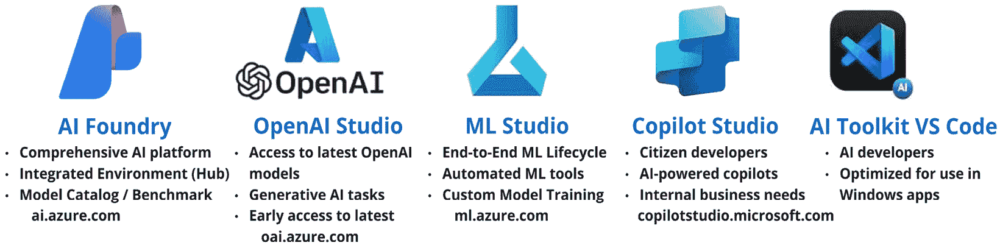
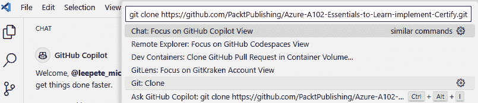
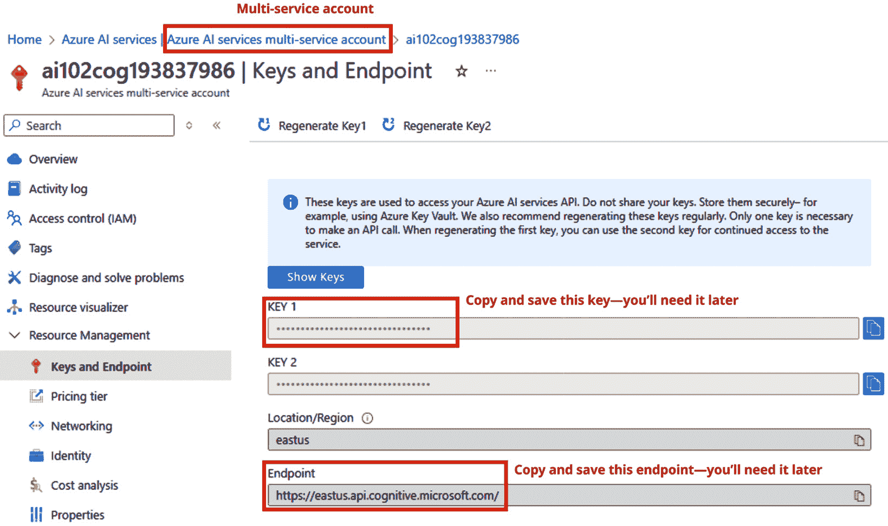
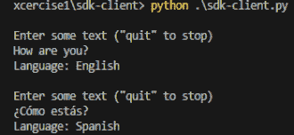
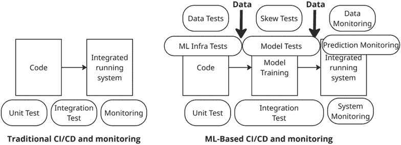
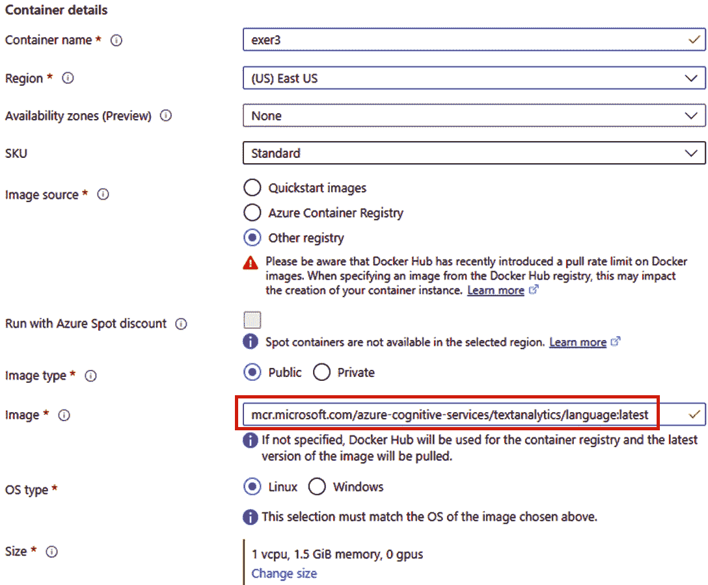
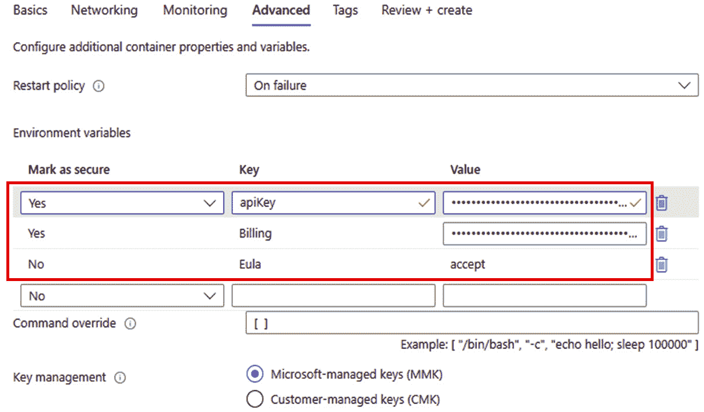

# 2

# Azure AI 入门：工作室、管道和容器化

在本章中，我们将探讨在 Azure 中构建和部署 AI 模型的不同开发环境。您将了解四个关键工作室——Azure AI Foundry、Azure OpenAI、Machine Learning Studio 和 Copilot Studio——每个工作室都针对不同的 AI 和机器学习服务进行了定制。此外，我们还将介绍 Visual Studio Code 作为**集成开发环境**（**IDE**）的使用，以帮助您了解这些工具如何支持 AI 开发。目标是帮助您根据项目的具体需求选择合适的工作室。

我们还将简要介绍如何将 Azure AI 服务无缝集成到**持续集成/持续交付**（**CI/CD**）管道中，自动化构建、测试和部署模型等任务。您将学习如何通过 SDK 或 REST API 配置和管理 AI 服务资源。最后，我们将介绍容器部署策略，解释容器如何使 AI 服务在本地和 Azure 云中灵活且安全地托管。

本章将涵盖以下主题：

+   了解各种 AI 开发工作室及其用例，包括 Azure AI Foundry、OpenAI Studio、Machine Learning Studio 和 Copilot Studio。

+   学习如何使用 REST API 或 SDK 创建和管理 Azure AI 服务。

+   探索 CI/CD 管道来自动化 AI 服务的部署。

+   获取关于在不同环境中托管 AI 服务的容器部署策略的知识。

+   通过创建和部署 Azure AI 服务的实际练习来获得实践经验。

在深入研究更技术性的主题之前，让我们先深入了解这些基础元素！

# 技术要求

本章的代码文件可以从[`github.com/PacktPublishing/Azure-AI102-Certification-Essentials`](https://github.com/PacktPublishing/Azure-AI102-Certification-Essentials)下载。您需要以下内容：

+   要注册免费 Azure 订阅，请访问[`azure.microsoft.com/free`](https://azure.microsoft.com/free)

+   您可以在[`code.visualstudio.com/download`](https://code.visualstudio.com/download)找到 Visual Studio Code 扩展。

重要提示

无论您是否打算使用带有免费 Azure 信用额的 Azure 账户，您都有责任监控和管理您的账户。如果您打算跟随本书中的实际练习，您需要了解潜在的成本并负责任地监控您的使用和预算。消费模式很棒，但如果您创建了资源并全天候运行，成本很快就会上升。我们建议在完成每个练习或章节后删除所有资源，以避免不必要的费用。如果您愿意，可以只跟随理论而不进行实际练习，尽管实际练习也是推荐的。

Azure 的用户界面不断演变，我旨在捕捉最新的屏幕截图，为您提供无缝体验。然而，练习中的某些截图可能已过时。关键是要关注底层功能和流程，而不是界面的确切外观和感觉。

让我们开始探索各种 AI 工作室。

# 各种 AI 工作室

Azure 中有四个主要的 AI 工作室——**AI Foundry**、**OpenAI Studio**、**ML Studio**和**Copilot Studio**（以及 Visual Studio Code 作为 IDE），每个都针对不同的 AI 和机器学习服务而设计。在本节中，我将解释这些工作室之间的区别，并帮助您决定何时使用每个工作室。



图 2.1 – Azure AI Studios 和 IDE

重要提示

Azure AI Studio 在 Ignite 2024 期间更名为**Azure AI Foundry**，Azure OpenAI 现在已集成到 Azure AI Foundry 平台中。

虽然不会有任何关于这些工作室的具体考试问题，但熟悉可用的工具以增强您的 AI 开发能力是很重要的。

让我们概述每个工作室：

+   **AI Foundry**（原名 Azure AI Studio）([`ai.azure.com`](https://ai.azure.com))：这是一个统一平台，组织可以在其中设计、定制和管理下一代 AI 应用和代理。它与 GitHub、Visual Studio 和 Copilot Studio 等流行的开发者工具无缝集成，将基础、开源、行业特定和任务模型以及 AI 工具、安全性和监控解决方案整合到单一、简化的体验中。Azure AI Foundry 提供专业代码 SDK 和用户友好的企业门户，以实现高效的 AI 开发和管理工作。

    Azure AI Foundry 通过提供来自 Azure OpenAI、Mistral、Meta、Cohere、NVIDIA 和 Hugging Face 等提供商的丰富模型目录，加速了 AI 开发。它还配备了强大的基准测试工具，以确保性能优化。开发者可以使用集成工具，如 Visual Studio Code for the Web 和高级功能，如 Prompt Flow SDK 的跟踪、持久测试和内容安全机制。该平台与 Azure 服务（如 Azure AI 服务和 Azure AI Search）的无缝集成，允许在自然语言处理、计算机视觉、语音识别和数据分析等 AI 用例中实现统一的流程。Foundry 的安全和协作环境使团队能够在管理资源和流程的同时，以企业级安全负责和高效地进行创新。

    **何时使用**：当你需要一个灵活的平台来创建和管理使用多个 Azure 服务且在统一、集成环境中使用的 AI 解决方案时，请使用 Azure AI Foundry。它支持复杂的流程，确保安全开发，并简化资源管理，这使得它特别适合那些希望高效且负责任地扩展其 AI 项目的组织。

+   **OpenAI Studio** ([`oai.azure.com/`](https://oai.azure.com/))：是 Azure AI Foundry 平台内的一个专用环境。虽然 Azure AI Foundry 提供了一个统一的界面，用于处理广泛的基座模型——包括来自 OpenAI、Mistral、Meta、Cohere 和其他公司的模型——但 OpenAI Studio 专注于仅由 OpenAI 开发的模型。这包括流行的**大型语言模型**（**LLMs**）如 GPT-3、GPT-4 以及图像生成模型如 DALL·E。

    OpenAI Studio 是为那些想要在生成式 AI 场景中实验、微调和部署 OpenAI 模型的用户设计的，例如构建聊天机器人、内容生成或需要高级语言或图像能力的创意应用。该界面与 Azure 生态系统紧密集成，使得管理部署并利用 Azure 的安全性和可扩展性功能变得容易。然而，需要注意的是，OpenAI Studio 仅支持 OpenAI 模型，不支持通过 Azure AI Foundry 提供的其他供应商的模型。

    **何时使用**：如果你的解决方案特别依赖于 OpenAI 的大型语言或图像模型，并且希望在 Azure 中部署、定制和管理这些模型时获得流畅的体验，请选择 OpenAI Studio。

+   **Machine Learning Studio** ([`ml.azure.com/`](https://ml.azure.com/))：这是一个基于云的平台，用于构建、训练和部署机器学习模型。它为数据科学家和开发者提供了一系列工具，包括自动化机器学习、拖放式流水线和强大的机器学习生命周期管理工具。

    **何时使用**：当你专注于传统机器学习任务，如预测建模、分类、回归或聚类时，请使用 Azure Machine Learning Studio。它特别适用于需要使用自己的数据集构建、训练和部署自定义机器学习模型的数据科学家，并且需要强大的模型管理和部署功能。

+   **Copilot Studio** ([`copilotstudio.microsoft.com/`](https://copilotstudio.microsoft.com/)): 这是一个低代码的对话式人工智能解决方案，它使用户能够通过自定义企业场景扩展 Microsoft 365 的 Copilot，构建和管理独立的 Copilot，以及创建自定义工作流程。该平台与各种 Microsoft 技术无缝集成，为管理 Copilot 体验和定制提供全面的环境。它允许用户使用预构建或自定义插件连接到多个数据源，从而能够创建复杂且直观的人工智能驱动的对话界面。Copilot Studio 的低代码特性使其对没有广泛技术背景的用户也易于访问，确保了人工智能的力量对更广泛的受众触手可及。

    Copilot Studio 提供了一个用户友好的界面，支持在各种渠道上创建、测试和部署 Copilot，包括网站、移动应用和 Microsoft Teams。它使用大型语言模型和额外的知识源来处理从简单查询到复杂对话的各种请求。该平台还支持定制 Copilot 以满足特定业务需求，允许组织集成公司数据、从外部 API 获取实时数据，并在其应用程序中嵌入 Copilot。这种灵活性确保了组织可以定制其人工智能解决方案以提高生产力和满足独特的业务需求。

    **何时使用**: 当您需要为特定企业需求定制或扩展 Microsoft 365 Copilot 时，或者当您想要构建和管理不需要大量编码的独立 Copilot 解决方案和工作流程时，请使用 Copilot Studio。对于希望在其现有的 Microsoft 生态系统内通过定制的对话式人工智能解决方案来提高生产力的组织来说，这个工作室是完美的。无论您需要创建一个可以与公司数据集成的 Copilot、自动化工作流程，还是在多个渠道上提供实时支持，Copilot Studio 都提供了实现这些目标所需的工具和功能。

重要提示

Copilot Studio 在本书的任何练习中都没有使用，但重要的是要注意，OpenAI 模型也可以通过这个平台访问。

+   **AI Toolkit for Visual Studio Code**: 这之前被称为 Windows AI Studio。该扩展已被重命名，以反映其在跨平台上启用 Visual Studio Code 人工智能开发的重点。这是一个适用于 Windows 10/11 的桌面应用程序，它提供了用于本地微调和部署生成式人工智能模型的工具。它作为一个无需云依赖的个人人工智能实验室，针对开发人员、人工智能爱好者以及创意专业人士，用于特定于 Windows 应用程序的任务。

    **何时使用**：当你需要一个本地环境来开发、微调和部署 AI 模型时，使用 Visual Studio Code 的 AI 工具包，尤其是如果你更喜欢在没有云依赖的情况下工作。这个工具包非常适合想要在 Windows 平台上实验 AI 技术的开发人员和 AI 从业者，它提供了一个灵活且强大的 AI 开发环境，且在熟悉的 Visual Studio Code 界面中。

让我们通过下一个练习深入了解创建 Azure AI 服务。

# 创建和配置 Azure AI 服务

如同在*第一章*中讨论的，Azure AI 服务提供了各种 AI 能力，如语言、视觉、语音和生成式 AI，帮助开发者构建智能应用。这些服务可以在 Azure 订阅中配置，访问它们需要识别端点、密钥和位置。开发者可以使用 Python、C#和 JavaScript 等流行编程语言中的 REST API 或 SDK 与这些服务交互。REST API 为应用程序提供了以 JSON 格式提交请求的灵活性，而 SDK 通过抽象复杂性，使开发过程更加高效。

本书所有练习的重要注意事项

为了简化，我们将使用一个单一的 Azure AI 多服务账户，该账户包含一个端点和密钥，用于所有 AI 服务。如果需要为特定练习创建特定的 AI 服务，将会明确指出。否则，将使用具有相同端点和密钥的多服务账户贯穿始终。所有说明均基于 Windows 平台，但对于 Mac 和 Linux 操作系统，步骤将非常相似。

为了使用 Azure AI 服务，开发者需要特定的信息，例如端点 URI、订阅密钥和资源位置，这些信息对于验证和访问服务是必需的。虽然 REST 接口被广泛使用，但 SDK 通过处理大部分底层 API 交互，进一步简化了开发过程，为构建 AI 驱动的应用程序提供了一个更用户友好的方法。这种灵活性允许创建强大、智能的应用程序，以满足业务需求。

## 练习 1：Azure AI 服务的入门

在这个练习中，你将创建一个 Azure AI 服务资源，并使用客户端应用程序来检测语言。目的是熟悉配置 Azure AI 服务，并利用其 REST API 或 SDK（如 Python、Java 和 Node.js）进行语言处理。你将为服务输入文本以进行分析和检测其语言。例如，当你提交“你好吗？”，“¿Cómo estás?”或“Comment ça va?”时，服务将返回相应的检测到的语言。以下是步骤：

重要注意事项

想要了解更多关于如何使用 Visual Studio Code 的信息，请访问[`code.visualstudio.com/docs`](https://code.visualstudio.com/docs)。

1.  克隆 GitHub 仓库：

    1.  打开 Visual Studio Code。

    1.  使用快捷键 *Shift + Ctrl + P*（Windows）和 *Shift* + *Command* + *P*（Mac）打开调色板，如下图所示：



图 2.2 – 打开调色板

1.  运行 `Git: Clone` 命令并输入 [`github.com/PacktPublishing/Azure-AI102-Certification-Essentials`](https://github.com/PacktPublishing/Azure-AI102-Certification-Essentials)。将弹出一个窗口，提示您选择克隆仓库的目标文件夹。选择一个现有文件夹或创建一个新的文件夹，然后点击**选择为仓库目标**按钮。然后，仓库将被克隆到所选文件夹中。

1.  配置 Azure AI 服务

    在设置 Azure AI 服务时，您有两个主要选项：创建多服务帐户或配置单个 AI 服务。一个**多服务帐户**通过单个端点和密钥提供对多个 Azure AI 功能的访问，提供在统一资源下管理各种 AI 工具的便利性。或者，如果您的项目需要特定的服务——例如文档智能——您可以创建一个**专用资源**，以适应该特定功能。

    在这个练习中，我们将创建一个多服务 Azure AI 资源，以利用多种功能。此资源将在本书的所有练习中一致使用，以简化您的学习体验：

    1.  打开 Azure 门户并登录。

    1.  在 Azure 门户中，使用顶部的搜索栏搜索 *Azure AI 服务多服务帐户*，然后从结果中选择它。或者，您可以直接通过此链接导航到创建页面：[`portal.azure.com/#create/Microsoft.CognitiveServicesAllInOne.`](https://portal.azure.com/#create/Microsoft.CognitiveServicesAllInOne.)

    1.  创建一个具有唯一名称、区域和资源组的**多服务帐户**：

        +   **订阅**：您的 Azure 订阅

        +   **资源组**：选择或创建一个资源组（如果您使用的是受限订阅，您可能没有权限创建新的资源组 – 使用提供的资源组）

        +   **区域**：选择任何可用区域

        +   **名称**：输入一个唯一名称

        +   **定价层**：标准 S0

    1.  一旦部署了 Azure AI 服务多服务帐户，访问**密钥和端点**页面，如下截图所示：



图 2.3 – 在 Azure AI 服务多服务帐户中访问密钥和端点

本书所有练习的重要注意事项

克隆的 GitHub 仓库和您配置的 Azure AI 服务**端点和密钥**（如图 *图 2.3* 所示）将用于本书的所有练习中。

请确保现在复制并安全保存端点和密钥。虽然后续练习将简要提及它们，但本节包含完整说明，因此您可能需要返回此处以获取更多详细信息。

要配置 Azure AI 服务，您可以选择两种主要方法：使用 REST API 或利用 SDK。让我们按以下步骤进行操作以探索这两种方法：

+   使用 REST 接口。

    Azure AI 服务 API 基于 REST，允许您通过 HTTP 发送 JSON 请求。在本例中，您将看到控制台应用程序如何使用语言 REST API 进行语言检测，但相同的概念适用于所有 Azure AI 服务 API：

1.  在 Visual Studio Code 中，打开 `/excercise1/` 文件夹中的 `rest-client.py` 文件。

1.  将 `.env-sample` 文件复制到名为 `.env` 的新文件中，并使用您的 Azure AI 服务的 *端点* 和 *密钥* 更新它。

1.  查看代码，注意请求的结构和发送方式。

1.  打开 **集成终端** 并运行 Python 文件：

```py
pip install python-dotenv
python rest-client.py
```

1.  输入文本以测试语言检测。

+   使用 SDK。

    如前所述，您可以直接使用 Azure AI 服务的 REST API，但 SDK 也适用于流行的语言，如 C#、Python、Java 和 Node.js。使用 SDK 可以显著简化开发过程：

    1.  在 `/excercise1/sdk-client` 文件夹中打开 `sdk-client.py` 文件。

    1.  安装 SDK：

    ```py
    pip install azure-core azure-ai-textanalytics python-dotenv
    ```

1.  将 `.env-sample` 文件复制到名为 `.env` 的新文件中，并使用您的 Azure AI 服务的 *端点* 和 *密钥* 更新它。

1.  查看代码，了解 SDK 如何简化 API 交互。

1.  运行 SDK 程序：

```py
python sdk-client.py
```

1.  输入文本以检测语言，如图所示：



图 2.4 – sdk-client.py 的输出

本练习提供了一个概述，并将指导您通过 Python 使用 REST API 和 SDK 方法配置 Azure AI 服务。

让我们简要地强调下一节中 CI/CD 管道的重要性。这些自动化工作流程对于确保 AI 模型和其他软件的部署高效、一致且无错误至关重要。

# 在 Azure AI 和机器学习开发中集成 CI/CD

现代人工智能应用程序需要一种强大且自动化的方法来开发、测试和部署。与传统的软件不同，人工智能和机器学习应用程序不仅依赖于代码，还依赖于动态数据集和不断发展的模型，这使得 CI/CD 成为一种基本实践。集成 CI/CD 确保人工智能模型以结构化和高效的方式持续训练、验证和部署，减少错误并提高可靠性。

## 传统系统测试与基于 AI 的系统测试和监控

*图 2.5* 展示了传统系统测试和监控与基于机器学习的系统测试和监控之间的关键区别。传统的软件测试主要关注在部署前验证应用程序代码，并在部署后监控系统性能。相比之下，基于 AI 和机器学习的系统需要更复杂的方法，不仅包括代码验证，还包括严格的数据测试、模型性能评估和预测的持续监控。



图 2.5 – 传统系统与 AI 应用程序对比

让我们更详细地探讨这个问题。

### 传统系统测试和监控

在传统的软件开发中，测试和监控过程围绕确保应用程序代码在受控环境中正确且高效地运行。这个过程从单元测试开始，验证单个代码组件以早期发现潜在问题。单元测试之后，集成测试评估应用程序不同部分之间的交互，确保模块之间的无缝通信。一旦测试完成并且应用程序已部署，系统监控接管，跟踪性能指标，如正常运行时间、响应时间和错误率。这种监控确保部署的系统保持稳定并继续按预期运行。由于传统应用程序在确定性逻辑下运行——具体输入总是产生可预测的输出——系统监控的主要目标是识别可能影响应用程序可靠性的基础设施故障、安全漏洞或性能瓶颈。

### 基于机器学习的系统测试和监控

与之相反，基于机器学习的应用需要更全面的测试和监控方法，因为它们的行为不仅由静态代码决定，还由不断演变的数据和模型决定。与传统的软件不同，在代码部署后测试就结束了，AI 系统需要持续验证。这个过程从数据测试开始，检查输入数据的质量、一致性和完整性，在训练开始之前确保模型从可靠的数据源学习。此外，倾斜测试可以检测训练数据与现实世界生产数据之间的差异，如果未得到解决，随着时间的推移可能会导致性能下降。鉴于 AI 工作负载的计算需求，还会进行机器学习基础设施测试，以验证硬件资源、软件依赖和训练环境的兼容性。

在进行这些初步测试之后，模型测试评估各种性能指标，如准确率、精确度、召回率和公平性，在模型获得部署批准之前。然而，与主要关注上线时间和资源使用的传统应用程序不同，机器学习系统需要持续预测监控来评估模型在真实世界数据上的表现。此外，数据监控确保传入的数据分布与训练数据保持一致，有助于检测潜在问题，如数据漂移或偏差。鉴于机器学习模型会随时间演变和退化，持续的验证和监控对于在生产中保持准确性、公平性和有效性至关重要。

## AI 和机器学习项目中 CI/CD 的关键考虑因素

在人工智能和机器学习项目中实施持续集成/持续部署（CI/CD）面临独特的挑战。在人工智能工作流程中，不仅仅是代码会演变——数据集、模型甚至评估指标都可能随时间变化。Azure 提供了一套丰富的工具，帮助解决这些复杂性，并使 AI 解决方案能够实现强大、自动化的部署管道。

设计 AI/ML 项目的 CI/CD 工作流程时，以下是一些关键组件和考虑因素：

+   **数据和模型版本控制**：在 AI 项目中，数据的变化可能对模型行为的影响与代码的变化一样大。因此，版本控制两者至关重要：

    +   **数据集版本控制**：跟踪和管理您的训练和评估数据集的不同版本，以确保可重复性和可审计性

    +   **模型版本控制**：在模型注册表（如 Azure 机器学习模型注册表）中注册和存储训练好的模型，捕获元数据、指标和血缘关系

+   **实验跟踪**：记录实验对于理解哪些方法有效以及为什么有效至关重要。以下工具如**Azure 机器学习**、**MLflow**和**Weights & Biases**支持以下功能：

    +   记录超参数、模型配置、训练时长和评估指标

    +   比较多个运行以确定表现最佳的模型

    +   在团队间启用协作和可重复性

+   **持续训练（CT）**：与传统的应用程序不同，AI 模型可能会因数据漂移而随时间退化。为了解决这个问题，纳入 CT 管道：

    +   **自动重新训练**：当有新数据可用或性能低于定义的阈值时触发重新训练管道

    +   **计划性重新训练**：定期重新训练模型以保持其与最新数据趋势同步

+   **模型验证和质量保证**：自动验证确保只有高质量的模型被提升到生产环境中：

    +   **性能验证**：将新模型指标与基线或冠军模型进行比较，以确保改进

    +   **偏差和公平性审计**：使用 Azure 负责任 AI 仪表板或 Fairlearn 等工具在部署前识别和减轻未预期的偏差

    +   **可解释性**：整合 SHAP 或 LIME 等工具来理解模型预测，这在受监管的行业尤为重要。

+   **部署策略**：稳健的部署方法可以最小化风险并确保平稳推出：

    +   **蓝绿部署**：在现有模型并行部署新模型，并在验证后切换流量。

    +   **金丝雀发布**：在全面推出之前，逐步向一小部分用户公开新模型以监控其影响。

    +   **影子部署**：并行运行新模型（不影响用户）以实时评估预测。

+   **监控和漂移检测**：部署后的监控对于维护 AI 系统的性能和信任至关重要：

    +   **预测监控**：跟踪输入/输出分布，并监控异常情况。

    +   **数据漂移检测**：使用 Azure 数据漂移监控器等工具来检测可能影响模型准确性的输入数据变化。

    +   **自动回滚**：在模型表现不佳或导致意外行为时，集成警报和回滚机制。

+   **安全、治理和合规性**：在生产环境中确保安全、道德和合规的 AI 开发是不可或缺的：

    +   **访问控制**：使用 Azure 基于角色的访问控制（**RBAC**）和管理标识以安全地访问资源。

    +   **模型治理**：维护一个包含版本历史、所有权和审计跟踪的模型目录。

    +   **数据隐私**：确保按照 GDPR 和其他适用法规安全地处理 PII 和敏感数据。

    +   **EULA 和许可**：在使用专有或容器化服务时，确保接受适当的许可协议。

+   **支持 AI/ML 的 Azure CI/CD 工具**：Azure 提供了一套集成的工具链，用于启用针对 AI 工作负载的 CI/CD 管道：

    +   **Azure DevOps**或**GitHub Actions**用于源代码控制、管道自动化和协作。

    +   **Azure 机器学习管道**用于编排训练、评估和部署步骤。

    +   **Azure 容器注册库（**ACR**）和**Azure Kubernetes 服务（**AKS**）**用于容器化模型部署和扩展。

    +   **MLflow 集成**用于实验跟踪和模型注册。

    +   **Azure Monitor**和**Application Insights**提供端到端可观察性。

让我们探讨当保守、以安全为重点的客户要求在本地环境中部署 AI 服务时所面临的独特挑战之一。这引出了下一个主题：**容器部署策略**。在接下来的动手练习中，我们将了解如何有效地使用容器部署 AI 服务。让我们直接进入正题！

# 容器部署策略

容器就像便携式箱子，包含了应用程序运行所需的一切，例如工具、设置和代码。想象一下，你有一个午餐盒，里面装满了你吃午餐所需的全部食物和餐具，无论你周围有什么。同样，容器打包了应用程序需要的所有组件，使其可以在不同的机器上运行，无论是在你的笔记本电脑上、公司的数据中心里还是在云中。这种便携性有助于开发者快速且一致地在各种环境中部署应用程序。

容器提供了一种灵活的方式来在本地或 Azure 环境中托管 Azure AI 服务，使组织能够在不将敏感数据发送到云的情况下控制数据。通过使用容器，企业可以将 AI 服务部署得更靠近其数据，从而提高性能并减少延迟。容器捆绑了必要的运行时组件，使它们可以在不同的系统之间移动，同时为多个应用程序保持隔离。Azure AI 服务容器，如语言检测或语音到文本的容器，可在 Microsoft Container Registry 中找到，并可在 Docker、**Azure Container Instances**（**ACIs**）或**AKS**等环境中部署。

这些容器允许组织在本地使用 AI 服务的同时管理部署配置、安全和可伸缩性。尽管必须定期将使用指标发送到 Azure 进行计费，但敏感数据仍保留在组织的内部基础设施中。容器还提供了可定制的身份验证解决方案和网络安全的集成，增强了各种部署需求下的灵活性。针对情感分析、语音识别和 OCR 等任务的具体映像可用，每个都需要使用 API 密钥和计费端点进行设置。

通过在容器中部署 Azure AI 服务，企业可以使用微软强大的 AI 能力，同时获得安全、高效运营所需的额外控制和定制。

现在，让我们进行一个动手练习，以实际了解 Azure AI 服务容器的工作原理。这将让您亲身体验如何在容器化环境中部署和管理 AI 服务，从而深入了解这些服务在幕后是如何运行的。

## 练习 2：使用 Azure AI 服务容器

这个练习突出了 Azure AI 服务的灵活性，开发者可以享受微软管理的基础设施带来的好处，同时也有选择在自己的环境中通过容器化托管服务的选项。组织可以在本地或 Docker、ACI 或 Kubernetes 等平台上部署 Azure AI 服务容器，从而在数据、安全和部署方面拥有更多控制权。尽管容器化服务仍然连接到 Azure 进行计费，但数据仍然保留在组织的内部基础设施中，允许自定义配置和增加自主权。让我们开始吧：

1.  导航到 `/``chapter-2/excercise2/` 文件夹。

    如果您尚未克隆存储库或配置 Azure AI 服务，请参阅 *第二章* 中的 *Exercise 1: Getting started with Azure AI Service*，特别是 *Cloning the GitHub repository* 部分，以获取详细指导。如前所述，请记住准备好您的端点和密钥，因为它们可能在这里需要。

1.  部署并运行一个 Text Analytics 容器。

    许多 Azure AI 服务 API 也可用作容器镜像。有关完整列表，请参阅 Azure AI 服务文档。在本练习中，我们将使用 Text Analytics 语言检测 API 的容器镜像，但相同的原理适用于所有可用的镜像：

    1.  在 Azure 门户中，从以下链接创建一个使用 Text Analytics API 容器镜像的 ACI：[`learn.microsoft.com/en-us/azure/ai-services/cognitive-services-container-support#containers-in-azure-ai-services`](https://learn.microsoft.com/en-us/azure/ai-services/cognitive-services-container-support#containers-in-azure-ai-services)。确保正确配置了 API 密钥和端点等设置。

    1.  通过导航到 [`portal.azure.com/#create/Microsoft.ContainerInstances`](https://portal.azure.com/#create/Microsoft.ContainerInstances) 按照以下图示输入基本信息：



图 2.6 – 创建 ACI

1.  将以下镜像名称复制并粘贴到门户中的 **镜像** 字段：[mcr.microsoft.com/azure-cognitive-services/textanalytics/language:latest](http://mcr.microsoft.com/azure-cognitive-services/textanalytics/language:latest)。

1.  在我们部署 Azure AI 服务容器之前，正确设置网络是非常重要的，这样我们才能从容器外部访问服务端点。这一步至关重要，因为 ACI 需要公开正确的端口和 DNS 配置，以便允许您的本地机器（或客户端应用程序）与容器化的 AI 服务进行通信。

    在典型的云部署中，网络设置定义了服务如何相互通信以及与外部世界的通信方式。当与容器一起工作时，尤其是在 Azure 中，您需要明确指定容器是否应公开访问，它将使用什么 DNS 标签，以及哪些端口将对外开放请求。在这种情况下，我们的容器化 AI 服务将监听端口 5000，我们将分配一个公共 DNS 名称，以便我们可以使用 curl 工具或从我们的应用程序中轻松测试它。

    让我们逐步了解网络设置，以便您的容器可访问并准备好处理语言检测请求。

    +   网络类型：公共

    +   DNS 名称标签：*为* *容器端点* *输入一个唯一名称*

    +   端口：*将 TCP 端口从 80* *更改为 5000*

1.  在 **高级** 选项卡中，按照以下所示配置以下设置：

    +   重启策略：在失败时

    +   环境变量：ApiKey – 您的 Azure AI 服务资源的密钥；Billing – 您的 Azure AI 服务资源的端点 URI，如图*图 2.7*所示：



图 2.7 – 环境变量设置

1.  一旦 ACI 已部署，请验证其状态并记录用于访问容器的公共 IP 或 FQDN。

1.  如果出现任何问题，可以运行以下命令：

```py
az container create --resource-group myResoruceGroup --name myContainer1 --image mcr.microsoft.com/azure-cognitive-services/textanalytics/language:latest --dns-name-label myDomain1 --ports 80 5000 --memory 16 --environment-variables ApiKey=<yourKey> Billing=<yourEndpoint> Eula=accept
```

EULA 是 Azure AI 容器操作所需的关键配置设置。其主要目的是表明您已接受使用容器的许可条款。这种接受是强制性的；如果没有它，容器将无法启动。

重要提示

在这个练习中，您已将 Azure AI 服务的文本翻译容器镜像部署到了 ACI。您可以通过运行单个命令将其部署到 Docker 主机。用您的 Azure AI 资源详情替换`<yourEndpoint>`和`<yourKey>`。如果镜像在本地不可用，Docker 将从注册表中拉取它。一旦部署，容器将在端口`5000`上运行并监听请求，允许您在本地处理语言检测或翻译请求。

1.  与容器交互：

    1.  在您的代码中编辑`rest-test.cmd`，以包含从容器实例的**概述**页面提取的容器的 IP 地址或 FQDN：

    ```py
    curl command to test language detection. Verify that the results return JSON with detected languages.
    ```

这个练习帮助您获得在容器化环境中部署和使用 Azure AI 服务的实际知识。

# 摘要

在本章中，我们探讨了各种旨在简化人工智能模型开发和部署的 Azure 工作室。您介绍了四个主要平台：Azure AI Foundry、OpenAI Studio、Machine Learning Studio 和 Copilot Studio，每个平台都针对不同的 AI 任务进行了定制，例如自然语言处理、机器学习以及生成式 AI 应用。我们还简要介绍了 Visual Studio Code 作为 AI 开发的 IDE 的使用。了解何时以及如何使用这些工作室对于优化您的 AI 项目至关重要，因为它们提供了旨在增强开发、协作和 AI 工作流中安全性的特定功能。

我们还讨论了 CI/CD 管道在自动化 AI 模型生命周期（从构建和测试到部署）中的关键作用。此外，本章涵盖了容器部署策略，为在本地和云中托管 Azure AI 服务提供了灵活性。这些见解为构建高效、可扩展且安全的 AI 解决方案奠定了基础。

在下一章中，我们将专注于管理和监控 Azure AI 资源，我们将深入探讨诊断日志、成本管理和安全功能等主题，这些对于维护稳健且成本效益高的 AI 解决方案至关重要。

# 复习问题

回答以下问题以测试您对本章知识的掌握：

1.  以下哪项最能描述在 Azure AI 开发中使用 AI Foundry 的主要优势？

    1.  它专门设计用于训练深度学习模型

    1.  它仅适用于低代码 AI 开发

    1.  它取代了所有其他 Azure AI 服务的需求

    1.  它提供了一个统一的平台，用于设计、定制和管理大规模的 AI 应用程序

    **正确答案**：D

1.  部署 Azure AI 服务到容器中的一项好处是什么？

    1.  避免了需要 Azure 订阅的需求

    1.  允许在不将数据发送到云的情况下进行本地数据处理

    1.  简化了 AI 服务的支付

    1.  需要更少的计算能力

    **正确答案**：B

1.  在 AI 项目的 CI/CD 的背景下，哪个关键组件在新的数据可用时自动重新训练模型，确保模型在现实世界场景中保持准确和相关性？

    1.  **持续** **训练** （**CT**）

    1.  数据和模型管理

    1.  资源和模型漂移管理

    1.  安全性和合规性

    **正确答案**：A

1.  部署 Azure AI 服务容器时，必须指定以下哪些配置设置？

    1.  存储账户名称

    1.  虚拟机大小

    1.  订阅密钥和计费端点

    1.  数据库连接字符串

    **正确答案**：C

1.  部署 Azure AI 服务容器时，为什么需要 EULA 密钥值？

    1.  接受使用容器镜像的条款和条件

    1.  对容器中存储的数据进行加密

    1.  生成 Azure 服务的计费报告

    1.  指定容器部署的区域

    **正确答案**：A

# 进一步阅读

要了解更多关于本章所涵盖的主题，请查看以下资源：

+   Azure AI Foundry 是什么？在[`learn.microsoft.com/en-us/azure/ai-studio/what-is-ai-studio`](https://learn.microsoft.com/en-us/azure/ai-studio/what-is-ai-studio)

+   Azure OpenAI 服务是什么？在[`learn.microsoft.com/en-us/azure/ai-services/openai/overview`](https://learn.microsoft.com/en-us/azure/ai-services/openai/overview)

+   Microsoft Copilot Studio 文档在[`learn.microsoft.com/en-us/microsoft-copilot-studio/`](https://learn.microsoft.com/en-us/microsoft-copilot-studio/)

+   Azure 机器学习文档在[`learn.microsoft.com/en-us/azure/machine-learning/?view=azureml-api-2`](https://learn.microsoft.com/en-us/azure/machine-learning/?view=azureml-api-2)

+   宣布 Visual Studio Code 的 AI 工具包[`techcommunity.microsoft.com/t5/microsoft-developer-community/announcing-the-ai-toolkit-for-visual-studio-code/ba-p/4146473`](https://techcommunity.microsoft.com/t5/microsoft-developer-community/announcing-the-ai-toolkit-for-visual-studio-code/ba-p/4146473)

+   快速入门：使用 Azure OpenAI 服务开始使用 GPT-35-Turbo 和 GPT-4，请访问 [`learn.microsoft.com/en-us/azure/ai-services/openai/chatgpt-quickstart?tabs=command-line%2Ctypescript%2Cpython-new&pivots=programming-language-python`](https://learn.microsoft.com/en-us/azure/ai-services/openai/chatgpt-quickstart?tabs=command-line%2Ctypescript%2Cpython-new&pivots=programming-language-python)

+   什么是持续交付？请访问 [`learn.microsoft.com/en-us/devops/deliver/what-is-continuous-delivery`](https://learn.microsoft.com/en-us/devops/deliver/what-is-continuous-delivery)

+   Azure AI 容器是什么？请访问 [`learn.microsoft.com/en-us/azure/ai-services/cognitive-services-container-support`](https://learn.microsoft.com/en-us/azure/ai-services/cognitive-services-container-support)
