# 3

# 管理、监控和保障 Azure AI 服务

在 *第三章* 中，我们将探讨有效管理和监控 Azure AI 服务的关键策略，以确保平稳和安全的运行。我们将从配置诊断日志和设置指标来跟踪性能、解决问题和维护合规性开始。此外，本章还将涵盖成本管理技术、使用 Azure Key Vault 安全处理密钥以及网络安全实践来保护敏感数据。

你还将学习如何使用资源密钥、Microsoft Entra ID 和访问令牌实现强大的身份验证机制，以及使用虚拟网络和私有端点建立安全的私有通信。通过掌握这些主题，你将具备高效管理和保护你的 Azure AI 部署的工具。

在本章结束时，你将能够做到以下事项：

+   配置诊断日志并监控 AI 资源

+   通过 Azure Key Vault 管理成本、账户密钥和安全

+   为 Azure AI 服务设置身份验证和安全的私有通信

让我们深入探讨这些关键的管理主题！

# 技术要求

要跟随本章的练习，你需要访问官方 GitHub 仓库中 `chapter-2` 文件夹中可用的代码文件：[`github.com/PacktPublishing/Azure-AI102-Certification-Essentials`](https://github.com/PacktPublishing/Azure-AI102-Certification-Essentials)。

在进行实际任务之前，了解支持 AI 服务监控和诊断的核心 Azure 功能非常重要。三个基本工具——**诊断设置**、**日志分析**和**指标**——构成了有效操作可视化的基础。这些功能可以按服务进行配置，包括 Azure OpenAI 和其他 Azure AI 产品。

# 管理诊断日志

诊断日志是管理和确保 Azure AI 资源健康和安全的基本功能。它允许配置平台日志和指标到多个目的地的流式导出，同时提供多达五种不同的配置。这种灵活性提供了对这些服务操作和活动的深入了解，使管理员和开发者能够跟踪资源使用情况、检测性能瓶颈、解决问题并满足合规性要求。通过利用诊断日志，用户可以监控服务行为、分析访问模式并维护全面的审计跟踪，这对于处理敏感数据并需要严格治理和监督的 AI 解决方案尤为重要。

让我们继续进行 *练习 1* 来设置诊断日志，然后，在 *练习 2* 中，我们将回顾 *练习 1* 中设置的日志。

## 练习 1：为诊断日志存储创建资源

要为每个服务设置诊断日志，如*图 3.1*中语言服务的示例所示，导航到相应服务的刀片菜单中的**监控**部分下的**诊断设置**。通过点击**添加诊断设置**，将打开**诊断设置**窗口，如*图 3.2*所示。如果已经创建了诊断设置，您可以直接点击**监控**下的**日志**来查看日志数据。您可以参考*练习 2*获取详细步骤。

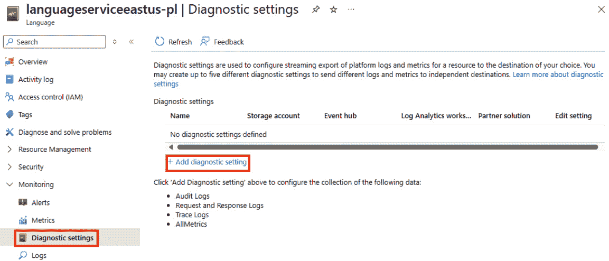

图 3.1 – 设置诊断设置

要捕获 AI 服务资源的诊断日志，您首先需要指定日志数据的目标位置。根据您的监控和分析需求，有多种选择：

+   **Azure 日志分析**：一种服务，允许您在 Azure 门户中查询和可视化日志数据，使其易于分析趋势和模式。

+   **Azure 存储**：一种基于云的存储服务，其中可以存储和导出日志存档，以便使用其他工具进行进一步分析。

+   **流式传输到事件中心**：此选项将日志数据发送到 Azure 事件中心，然后可以转发数据到自定义遥测解决方案或第三方监控工具进行实时处理。

+   **发送到合作伙伴解决方案**：您还可以直接与合作伙伴解决方案（如 Splunk 或 Elastic）集成，以发送日志进行高级监控和分析，无需手动配置数据转发。

在配置您的 AI 服务资源诊断日志之前，建议您提前创建这些资源。如果您计划将日志存储在 Azure 存储中，请确保存储账户与您的 AI 服务资源位于同一区域，以实现最佳性能和成本效益。

### 配置诊断设置

一旦设置了日志目标，您就可以在 Azure 门户的**诊断设置**页面上直接为您的 AI 服务配置诊断设置。在创建新的诊断设置时，您需要定义以下关键组件：

+   **诊断设置名称**：为诊断设置选择一个唯一的标识符。

+   **日志类别**：选择您想要捕获的日志事件类型，例如操作日志、性能指标或请求日志。

+   **日志目标详情**：指定捕获的日志数据应发送到何处，是 Azure 日志分析、Azure 存储、用于进一步处理的 Azure 事件中心、合作伙伴解决方案，还是 Azure 监控合作伙伴集成。

例如，典型的配置可能将所有日志和指标路由到 Azure 日志分析进行监控和可视化，同时存储在 Azure 存储中，用于长期存档和合规性目的，如以下图所示。

在*图 3.2*中，点击屏幕顶部的**保存**按钮以开始捕获数据。

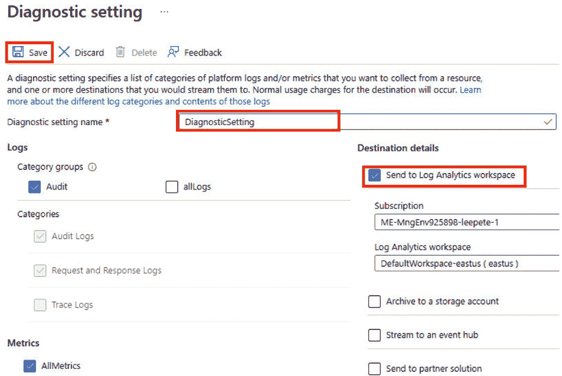

图 3.2 – 诊断设置

在完成**诊断设置**配置后，现在让我们在下一项练习中探索如何分析诊断日志和指标。

## 练习 2：在 Azure 日志分析中查看日志数据

Azure 日志分析是 Azure Monitor 套件的核心组件，它允许用户使用**Kusto 查询语言**（**KQL**）查询和分析诊断日志和指标——这是一种专为探索和可视化大规模遥测数据而设计的强大工具。它提供了一个集中式的工作空间，用于在多个 Azure 服务上运行详细查询，简化了监控性能、解决问题以及获取资源使用宝贵见解的过程。通过 Azure 门户访问，日志分析允许用户利用预定义和自定义查询来满足特定的分析需求，同时提供根据查询结果设置警报以进行主动监控的能力。

此外，Azure Monitor 与 Metrics Explorer、Grafana 和 Power BI 等工具无缝集成，扩展了其可视化和报告功能。新的警报功能，基于自定义 KQL 查询触发通知，为检测到的异常添加了另一层自动响应。这个全面的监控框架允许用户通过 REST API 或工作空间数据导出导出数据，确保在他们的 Azure 环境中实现全面的可见性、更好的控制和增强的决策能力。

在上一步保存诊断设置后，点击服务刀片菜单中的**监控**部分下的**日志**，在那里您可以编写 KQL 查询以检索所需的具体数据。

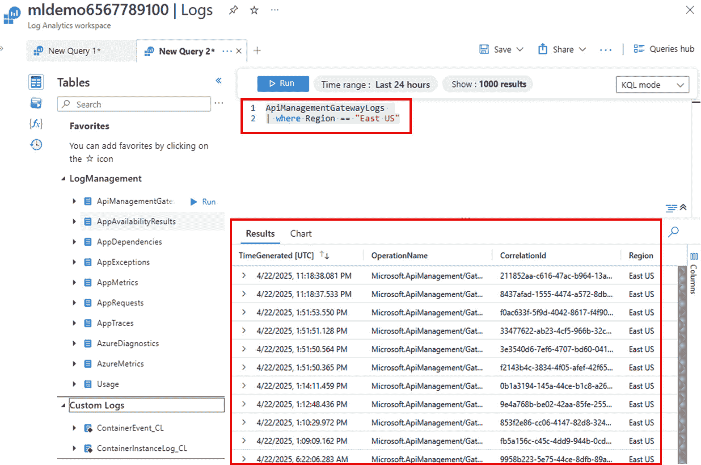

图 3.3 – 在 Azure 日志分析中查看日志

现在我们已经涵盖了管理诊断日志的内容，让我们将注意力转向探索指标如何提供更深入的见解，以了解您的 Azure AI 服务的性能和用法。

# 监控指标

指标对于监控 Azure AI 服务的性能和运营健康至关重要，它们提供了对服务使用、API 调用和资源利用率的洞察。这些指标在 Azure Monitor 指标数据库中自动收集，有助于跟踪关键方面，如请求延迟、错误率和不同模型部署的效率。例如，对于 Azure OpenAI 服务，**Azure OpenAI 请求**等指标突出了 API 调用的数量，揭示了随时间变化的趋势。

Azure Monitor 提供了如 **指标资源管理器** 等工具来可视化这些指标，如图 *图 3.4* 所示，应用聚合并设置任何异常的警报。这使得用户能够进行实时监控、解决问题并优化其 AI 模型的可伸缩性。通过将这些指标路由到 Azure Monitor 日志，用户可以获得更深入的洞察，以微调性能，确保其 AI 服务的可靠和高效运行。

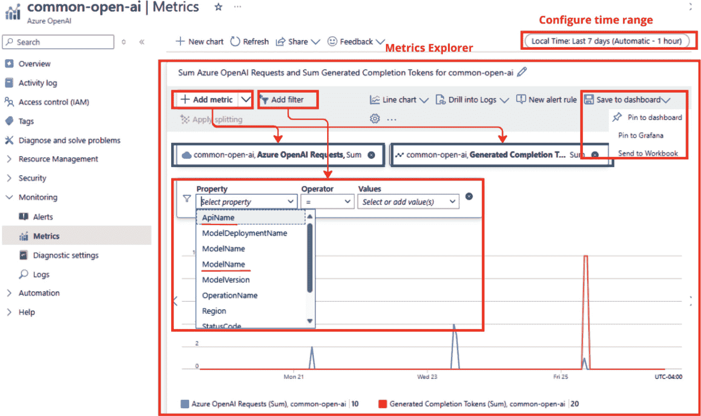

图 3.4 – Azure OpenAI 请求指标

在前面讨论的基础指标能力的基础上，Azure 通过“添加指标”功能提供了一种更细粒度的方法来跟踪和分析性能指标。此功能通过允许用户自定义他们的指标视图、应用过滤器以及更深入地了解资源利用率来增强监控。在下一节中，我们将探讨如何利用此功能来优化您的 Azure AI 服务的性能和运营效率。

## 添加指标

您可以通过 Azure 门户“监控”面板下的“指标”部分访问此功能，如图 *图 3.4* 所示。通过选择“+ 添加指标”选项，您可以从各种可用的指标中选择，例如 **Azure OpenAI 请求** 用于 Azure OpenAI 请求。

用户可以为这些指标配置时间范围，从最后 30 分钟到 30 天不等，并应用过滤器和拆分选项，通过如 **ApiName** 或 **ModelName** 等维度来查看数据。这使您可以获得详细性能洞察。这些指标可以使用不同的图表类型（折线图、柱状图或面积图）进行可视化，使用户能够识别趋势、检测异常并有效地监控资源健康。

## 将指标添加到仪表板

Azure Monitor 仪表板通过将指标、日志和监控数据统一到一个单一的、连贯的视图中，提供了一种动态和可定制的可视化和管理 Azure 资源健康和性能的方法。使用 Azure Monitor，用户可以将关键指标集中起来以跟踪趋势、检测异常并在资源和服务中获得实时洞察。与 **Grafana** 和 **Azure Workbooks** 等工具无缝集成，Azure Monitor 通过支持操作仪表板和交互式分析来增强报告功能，提供了一个强大的监控和分析环境。

在自定义您的指标视图，如图 *图 3.4* 所示后，您可以点击 **保存到仪表板** 使这些视图易于访问。此操作会提示您将指标添加到现有仪表板或创建一个新的仪表板，使您能够集中和整合来自单个服务（如语言、Azure OpenAI 和其他 Azure AI 服务）的自定义指标视图。此外，仪表板支持基于角色的访问，允许团队成员访问定制洞察。通过结合 Grafana 和 Workbooks 的集成，用户可以创建丰富、交互式的可视化，使 Azure Monitor 成为全面监控和数据驱动决策的灵活解决方案。

现在，我们已经涵盖了在 **监控** 下的日志和指标，让我们将重点转向管理成本，这是确保您的 Azure AI 服务在性能和预算方面都得到优化的重要方面。

# 管理 Azure AI 服务的成本

云服务的一个关键优势是成本效益，因为您只需为使用的部分付费。Azure AI 服务提供不同的定价层，包括用于开发和测试的免费层以及基于使用度量（如交易）的付费层。有效管理成本涉及规划、监控和设置警报以确保支出保持在预算内。每个 Azure AI 服务资源都有根据其类型的特定计费率，因此仔细选择和监控资源层以避免意外费用至关重要。通过利用这些功能，用户可以优化他们的 Azure 预算并确保他们以成本效益的方式利用资源。

## 规划成本

有效管理成本始于在部署 Azure AI 服务之前的仔细规划。**Azure 定价计算器**（可在 [aka.ms/AzurePricingCalculator](http://aka.ms/AzurePricingCalculator) 获取）是一个必不可少的工具，它可以帮助您根据预期的使用量估算月度费用。通过选择特定的 Azure AI 服务并调整配置参数，如地区、使用量和定价层，您可以模拟不同的场景并预测您的潜在支出。这一主动步骤确保您不会因意外费用而措手不及。例如，像 Azure OpenAI 这样的服务是根据处理令牌的数量计费的，因此提前了解定价结构对于准确预算至关重要。一旦服务被配置，它们可以通过 Azure 门户、SDK、CLI 或 ARM 模板进行管理，提供灵活的部署选项同时保持成本控制。

## 查看成本

要分析 Azure AI 服务费用，请转到 Azure 门户中的 **资源管理** | **成本分析** 部分，如图下所示：

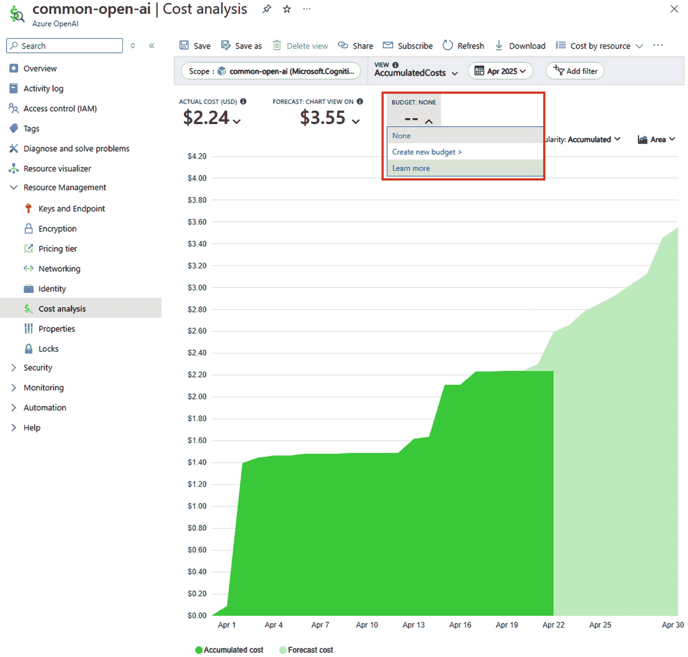

图 3.5 – 成本分析仪表板

**成本分析** 功能提供了对累积和预测成本的详细见解，使用户能够按资源类型（如特定的 AI 服务）过滤和查看数据。通过分组和过滤选项，用户可以根据资源组或单个服务等维度分解成本，帮助识别主要成本贡献者并确保有效的预算管理。

## 设置成本警报

Azure Monitor 的 *成本警报* 功能通过在支出达到预定义阈值时通知用户，帮助防止意外费用。在 **资源管理** 部分中，用户还可以设置预算以按月、季度或年度监控他们的支出。警报可以配置为在支出接近或超过这些限制时触发，从而实现主动的成本管理。此外，定期的预测审查提供了对预测成本的了解，有助于预测未来的支出趋势，并在资源扩展上做出基于数据的决策。通过实施这些策略，组织可以更好地控制其 Azure AI 服务财务。

现在我们已经讨论了如何有效地管理 Azure AI 服务的成本，让我们通过实际操作练习将这些概念付诸实践，以确保您能够自信地实施这些策略。

## 练习 3：设置警报规则

本练习将指导您设置一个警报规则以监控您的 Azure AI 服务资源上的活动：

1.  前往您的 Azure AI 服务多服务帐户。如果您尚未配置 Azure AI 服务，请参阅 *第二章* 中的 *练习 1：Azure AI 服务入门*，特别是 *配置 Azure AI 服务* 部分，以获取详细指导。

重要提示

如前所述，请确保您已准备好端点和密钥，因为它们是此步骤所需的。

1.  导航到 Azure AI 服务资源：

    +   在 Azure 门户中，打开您的 Azure AI 服务资源，并转到 **监控** 下的 **警报**。

1.  创建一个新的警报规则：

    +   点击 **+ 创建** 并选择 **警报规则**。验证您的资源是否列在 **范围** 下。

1.  选择要监控的信号：

    1.  在 **条件** 选项卡下，选择 **查看所有信号** 以打开 **选择一个** **信号** 面板。

    1.  滚动到 **活动日志** 部分，选择 **列出密钥（认知服务 API 帐户）**，然后点击 **应用**。

1.  设置警报详情：

    +   在 `Key` `List Alert`。

1.  审查并创建警报规则：

    +   点击 **审查 + 创建**，然后选择 **创建** 以完成。

1.  使用 Azure CLI 触发警报：

    +   运行以下命令，将 `<resourceName>` 和 `<resourceGroup>` 替换为您的实际资源名称及其对应的资源组名称：

        ```py
        az cognitiveservices account keys list --name <resourceName> --resource-group <resourceGroup>
        ```

1.  在 Azure 门户中检查警报：

    +   返回到 **警报** 页面并刷新。验证表中是否列出了 **详细** 警报。等待几分钟，如果它没有立即可见，请刷新。

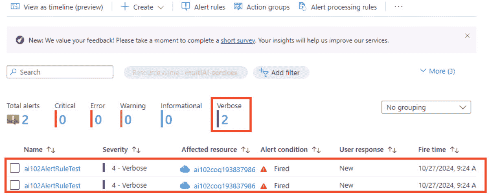

图 3.6 – 在第 7 步运行 CLI 脚本后的警报结果

现在我们已经了解了如何设置警报，让我们继续下一个练习，探索如何查看指标。

## 练习 4：可视化指标

监控关键性能指标对于理解您的 Azure AI 服务的使用模式和效率至关重要。在这个练习中，我们将探索如何在 Azure 门户中可视化和分析这些指标，从而实现 AI 工作负载的主动监控和优化；

1.  访问您的 Azure AI 资源的指标：

    1.  在 Azure 门户中，导航到您的 Azure AI 服务资源。

    1.  在 **监控** 下的 **指标** 中。

    1.  如果没有图表，点击 **+ 新图表** 并从 **指标** 下拉菜单中选择 **总调用次数**。

    1.  在 **聚合** 列表中，选择 **计数** 以跟踪随时间变化的调用总数。

1.  使用 cURL 命令生成调用活动：

    1.  复制 `rest-test-sample.cmd` 文件并将其重命名为 `rest-test.cmd`。在您的文本编辑器中打开新创建的 `rest-test.cmd` 文件，并使用您的 Azure AI 端点和密钥值更新它。供您参考，您可以查看我提供的示例文件，命名为 `rest-test-petersample.cmd`。

    1.  使用您的 Azure AI 端点和密钥值更新 cURL 命令：

    ```py
    curl -X POST "<your-endpoint>/language/:analyze-text?api-version=2023-04-01" -H "Content-Type: application/json" -H "Ocp-Apim-Subscription-Key: <your-key>" --data-ascii "{'analysisInput':{'documents':[{'id':1,'text':'hello'}]}, 'kind': 'LanguageDetection'}"
    ```

    1.  保存您的更改并执行以下命令：

    ```py
    ./rest-test.cmd
    ```

1.  生成额外的调用活动：

    +   重复执行命令多次，以生成足够的调用活动进行监控。

1.  查看 Azure 门户中的指标，如图下所示：

    1.  返回 Azure 门户中的 **指标** 页面。

    1.  定期刷新 **总调用次数** 图表，直到新的调用活动可见。数据反映可能需要几分钟。

    这个简化的流程将帮助您有效地监控和可视化 API 使用情况。

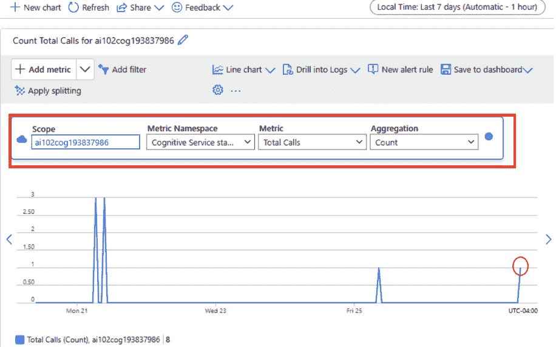

图 3.7 – 多次运行 cURL 命令后的指标视图结果

现在我们已经完成了动手练习，让我们将重点转向安全方面。我们将首先介绍身份验证的基本知识，并确保您对 Azure AI 服务的安全访问，然后我们将深入了解网络安全策略以保护您的资源和通信。

# 理解身份验证

Azure AI 服务需要强大的身份验证和密钥管理策略，以确保安全访问和操作。以下是重新生成、管理和保护密钥以及各种身份验证方法（如基于令牌的身份验证、Microsoft Entra ID、服务主体和托管标识）的概述。

## 练习 5：重新生成密钥

定期重新生成密钥是防止未授权访问的关键安全措施。Azure AI 服务为每个资源提供两个密钥，允许您在不中断服务的情况下轮换密钥。

前往您在*第二章*的*练习 1*中创建的 Azure AI 多服务帐户门户。

以下是重新生成密钥的步骤：

1.  为应用程序中的密钥轮换做准备：

    +   **单密钥使用**：如果两个密钥都在使用中，请更新您的代码以临时仅依赖于一个密钥。例如，配置所有生产应用程序仅使用密钥 1。

1.  重新生成密钥 2：

    1.  导航到 Azure 门户中您的资源页面。

    1.  转到**密钥和** **端点**部分。

    1.  选择**重新生成密钥 2**，如图 3.8 所示。

1.  更新代码：

    1.  更新您的生产应用程序以使用新重新生成的密钥 2。

    1.  在继续之前，请确保所有应用程序都已成功切换到密钥 2。

1.  重新生成密钥 1：

    1.  返回到**密钥和** **端点**部分。

    1.  选择**重新生成密钥 1**，如图 3.8 所示。

1.  最终更新：

    1.  更新您的生产代码以使用新密钥 1。

    1.  确认所有应用程序在使用新密钥 1 后均能正常工作。

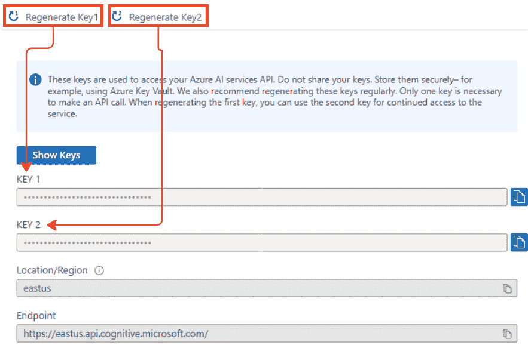

图 3.8 – 在门户中生成密钥

您还可以使用 Azure CLI 重新生成密钥：

```py
az cognitiveservices account keys regenerate --name <your-resource-name> --resource-group <your-resource-group> --key-name key1
```

将 `<your-resource-name>` 和 `<your-resource-group>` 替换为您的实际资源名称和资源组。此命令重新生成密钥 1。同样，您可以通过将 `--key-name key1` 更改为 `--key-name key2` 来重新生成密钥 2。

### 重要注意事项

理解对您应用程序的潜在影响并遵循最佳实践对于确保安全且无缝的过渡至关重要：

+   **安全性**：始终安全地存储密钥，并避免直接在应用程序中硬编码它们。相反，使用 Azure Key Vault 来管理和保护密钥，确保它们免受未经授权的访问或意外泄露。安全密钥存储是维护 Azure AI 服务完整性和机密性的关键实践。

+   **定期轮换**：为了最小化安全风险，如密钥泄露或意外共享，建议定期重新生成密钥。密钥轮换对于维护应用程序的安全态势至关重要，确保任何先前共享或泄露的密钥不再有效。

+   **日志记录和监控**：保持日志并积极监控访问权限对于确保密钥更改不会干扰服务操作非常重要。适当的监控有助于验证所有应用程序都已成功切换到新密钥，从而降低停机或访问问题发生的可能性。

通过遵循这些实践，您可以为您 Azure AI 服务实现一个安全且无缝的密钥轮换过程，最大限度地减少潜在漏洞并确保强大的安全框架。

## 使用 Azure Key Vault 保护密钥

Azure Key Vault 是一种云服务，旨在安全地存储和管理敏感信息，如密码、API 密钥、证书和加密密钥。它有助于保护这些机密，确保只有经过身份验证的用户或应用程序才能访问它们，从而最小化安全风险。

下图说明了使用 Azure Key Vault 安全访问 Azure 服务的方法。过程从在密钥保管库中创建密钥并授予对其的访问权限开始（**1**）。接下来，应用程序（**APP**）根据上下文和用例，使用用户或服务主体从密钥保管库检索此密钥（**2**）。这种方法确保密钥不会被硬编码或在不安全的地方存储在应用程序本身中。一旦检索到密钥，应用程序就可以安全地访问 Azure 服务（**3**），使用密钥对 Azure AI 服务进行身份验证。这种方法最小化了密钥暴露的风险，并通过集中管理机密来增强安全性。

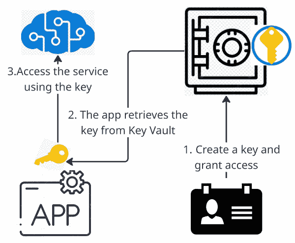

图 3.9 – 使用 Azure Key Vault 保护密钥

确保对 Azure AI 服务的安全访问需要强大的身份验证和授权机制。通过利用 Microsoft Entra ID 身份验证、使用安全主体授予访问权限以及使用用户主体，组织可以实施基于角色的访问控制、最小化密钥暴露并增强整体安全性。让我们探讨这些方法如何协同工作以保护 Azure AI 资源。

## Microsoft Entra ID 身份验证

Azure AI 服务支持 Microsoft Entra ID 身份验证，允许您为在 Azure 中运行的应用程序和服务授予特定服务主体或托管身份的访问权限。您可以使用多种方式通过 Microsoft Entra ID 对 Azure AI 服务进行身份验证，包括以下方式：

+   **使用安全主体授予访问权限**：为了控制对 Azure Key Vault 的访问，请使用代表通过 Microsoft Entra ID 进行身份验证的标识的安全主体。这些可以分为以下几类：

    +   **用户主体**：这代表一个个人用户。此类主体最适合需要特定用户直接访问以手动审查、更新或管理机密的场景——例如，管理员配置 Azure 资源或开发人员调试机密。

    +   **服务主体**：这代表一个应用程序或服务，适用于需要以编程方式访问资源的场景。服务主体具有与分配给其的应用程序的生命周期保持一致的优势，这意味着当应用程序被删除时，相关的服务主体也变得过时。这防止了可能被攻击者利用的持久、未使用的身份。

+   使用用户主体进行手动配置，使用服务主体进行自动化的程序访问。这种方法基于角色保护资源，并最小化潜在的安全漏洞。

通过利用 Azure Key Vault 并根据使用模式选择正确的安全主体类型，您可以建立一个安全高效的系统来管理密钥。服务主体与应用程序的生命周期保持一致，防止孤儿身份，而托管身份提供了一种无凭证的、简化的方法，用于安全访问资源。

## 对 Azure AI 服务进行请求身份验证

对 Azure AI 服务进行请求身份验证对于确保安全和授权访问至关重要。Azure 提供多种身份验证方法，以满足各种安全需求和应用程序场景。了解这些方法将帮助您为您的应用程序选择最合适的方法：

+   `Ocp-Apim-Subscription-Key` 头部。例如，要使用 Azure Translator 进行文本翻译，请使用以下命令：

    ```py
    curl -X POST 'https://api.cognitive.microsofttranslator.com/translate?api-version=3.0&from=en&to=de' \
    -H 'Ocp-Apim-Subscription-Key: YOUR_SUBSCRIPTION_KEY'\
    -H 'Content-Type: application/json' \
    Ocp-Apim-Subscription-Key header. Additionally, for services such as Azure Translator, specify the resource region using the Ocp-Apim-Subscription-Region header. Supported regions include eastus, westeurope, and southeastasia, among others. Here is a sample request:

    ```

    curl -X POST 'https://api.cognitive.microsofttranslator.com/translate?api-version=3.0&from=en&to=de' \

    -H 'Ocp-Apim-Subscription-Key: YOUR_SUBSCRIPTION_KEY'\

    -H 'Ocp-Apim-Subscription-Region: YOUR_SUBSCRIPTION_REGION' \

    -H 'Content-Type: application/json' \

    格式为 Bearer <TOKEN> 的授权头。要获取令牌，请使用以下命令：

    ```py
    curl -v -X POST \
    "https://YOUR-REGION.api.cognitive.microsoft.com/sts/v1.0/issueToken" \
    -H "Content-type: application/x-www-form-urlencoded" \
    -H "Content-length: 0" \
    -H "Ocp-Apim-Subscription-Key: YOUR_SUBSCRIPTION_KEY"
    ```

    获取令牌后，将其用于您的请求：

    ```py
    curl -X POST 'https://api.cognitive.microsofttranslator.com/translate?api-version=3.0&from=en&to=de' \
    -H 'Authorization: Bearer YOUR_AUTH_TOKEN' \
    -H 'Content-Type: application/json' \
    --data-raw '[{ "text": "How much for the cup of coffee?" }]' | json_pp
    ```

    ```py

    ```

+   **Microsoft Entra ID 身份验证**：

    为了增强安全性和细粒度的访问控制，Azure 支持通过 Microsoft Entra ID（以前称为 Azure Active Directory）进行身份验证。这种方法特别适用于需要 Azure **基于角色的访问控制**（**RBAC**）的复杂场景。要使用 Microsoft Entra ID 身份验证，请按照以下步骤操作：

1.  **创建具有自定义子域的资源**：确保您的 Azure AI 服务资源具有自定义子域，因为 Microsoft Entra ID 身份验证需要它。

1.  **分配角色**：将适当的角色（例如，*认知服务 OpenAI 用户*）分配给您的 Microsoft Entra ID 用户或服务主体，以授予对 Azure AI 服务的访问权限。

通过了解这些身份验证方法，您可以确保对 Azure AI 服务的安全高效访问，以满足您应用程序的具体要求。让我们将您的知识付诸实践，以加深您的理解。

## 练习 6：管理 Azure AI 服务安全

对于任何应用程序，安全都是一个关键考虑因素，作为开发者，限制对 Azure AI 服务等资源的访问仅限于需要访问的人员至关重要。

### 使用 Azure Key Vault 保护密钥访问

为了安全地管理 Azure AI 服务的密钥，建议将其存储在 Azure Key Vault 中，而不是直接存储在应用程序文件或环境变量中。这种方法可以保持密钥的安全，同时允许托管身份在必要时访问它。

#### 第一步：创建密钥保管库并添加密钥

此步骤确保敏感密钥不会在代码或环境变量中暴露，同时允许授权应用程序安全地检索它们。在此步骤中，我们将检索我们的 Azure AI 服务密钥并配置 Azure Key Vault 以安全地存储它：

1.  **检索 Azure AI 服务密钥**：注意或复制从*练习 5*中获取的 Azure AI 服务资源的密钥 1 值，因为您将将其存储在密钥库中。

1.  **创建密钥库资源**：在 Azure 门户中，转到**主页** | **+ 创建资源**，然后搜索**密钥库**，或访问[`portal.azure.com/#create/Microsoft.KeyVault`](https://portal.azure.com/#create/Microsoft.KeyVault)

1.  使用以下配置设置密钥库：

    +   **基本**选项卡：

        +   **订阅**：选择您的 Azure 订阅

        +   **资源组**：选择与您的 Azure AI 服务资源相同的资源组

        +   **密钥库名称**：输入您的密钥库的唯一名称

        +   **区域**：选择与您的 Azure AI 服务资源相同的区域

        +   **定价层**：选择**标准**

    +   **访问** **配置**选项卡：

        +   **权限模型**：选择**密钥库** **访问策略**

        +   在**访问策略**部分，从列表中选择您的用户并勾选旁边的框

1.  点击**审查 + 创建**然后**创建**以设置密钥库。

1.  **将密钥添加到密钥库**：一旦您的密钥库创建完成，请转到 Azure 门户中的密钥库资源。

1.  在左侧菜单中，选择**密钥**（在**对象**部分下）。

1.  选择`ai-services-key`（使用此确切名称，因为您的应用程序稍后将会引用它）

1.  从您的 Azure AI 服务资源中获取`key1`值

1.  点击**创建**以在 Azure Key Vault 中安全地存储密钥。

#### 第 2 步：创建服务主体

要允许应用程序访问 Azure Key Vault 中的机密，您需要一个具有适当权限的服务主体。使用 Azure CLI 创建此服务主体，找到其对象 ID，并授予其对密钥库的访问权限：

1.  `<spName>`、`<subscriptionId>`和`<resourceGroup>`使用适当的值：

    ```py
    az ad sp create-for-rbac -n "api://<spName>" --role owner --scopes subscriptions/<subscriptionId>/resourceGroups/<resourceGroup>
    ```

    输出应类似于以下内容：

    ```py
    {
        "appId": "abcd-12345-efghi67-890jklmn",
        "displayName": "api://<spName>",
        "password": "1a2b39999997g8h9i0j",
        "tenant": "1ce4999999999990jklm"
    }
    ```

重要提示

安全地保存`appId`、`password`和`tenant`值，因为您稍后需要它们。如果您关闭终端，您将无法再次检索密码。

1.  **获取对象 ID**：要找到服务主体的对象 ID，请运行以下命令：

    ```py
    id value from the output, which represents the object ID.
    ```

1.  **为您的新的服务主体授予对密钥库的访问权限**：使用对象 ID 授予对密钥库的访问权限：

    ```py
    az keyvault set-policy -n <keyVaultName> --object-id <objectId> --secret-permissions get list
    ```

现在我们已经创建了一个服务主体并授予它对 Azure Key Vault 的必要访问权限，下一步是配置我们的应用程序以程序方式检索机密。这将使安全地认证和访问 Azure AI 服务成为可能，而无需硬编码敏感凭据。

#### 第 3 步：在应用程序中使用服务主体

现在，配置您的应用程序以使用服务主体从 Azure Key Vault 检索机密：

1.  `exercise6`项目文件夹用于此练习：

    ```py
    cd exercise5/keyvault_client
    ```

1.  **安装所需的包**：运行以下命令以安装所需的 Azure SDK 包：

    ```py
    pip install azure-ai-textanalytics==5.3.0
    pip install azure-identity==1.17.1
    .env configuration file in the keyvault-client folder and update it with the following settings:*   Azure AI services endpoint*   Azure Key Vault name*   Tenant ID of the service principal*   App ID of the service principal*   Password of the service principalSave the changes.
    ```

1.  `keyvault-client.py`文件并观察以下内容：

    +   导入了 Azure 密钥保管库和文本分析的 SDK 命名空间

    +   代码检索配置设置并使用服务主体凭据访问 Azure 密钥保管库

    +   代码中的`GetLanguage`函数使用文本分析客户端检测输入文本的语言

1.  **运行应用程序**：使用以下命令：

    ```py
    "Hello", "Bonjour", or "Gracias") and observe the detected language. Type "quit" to stop the program when you’re finished testing.
    ```

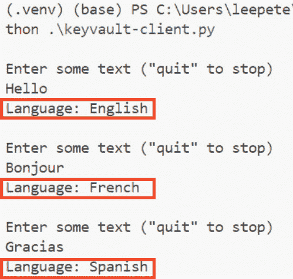

图 3.10 – 语言检测

现在我们已经涵盖了身份验证的基础知识，让我们将重点转向网络安全策略。这些策略有助于保护您的 Azure AI 服务免受未经授权的访问，并确保资源之间的安全通信。

# 配置网络安全

从网络角度确保您的 Azure AI 服务安全至关重要，以确保只有授权客户端可以访问您的资源。

对 Azure AI 服务进行有效的安全管理涉及实施防火墙规则、访问控制和请求筛选。防火墙规则是第一道防线，默认情况下设计为阻止所有传入请求。管理员可以指定哪些 IP 地址、IP 范围或子网被允许访问资源，从而防止外部来源的未经授权访问。此外，为了确保只有合法的应用程序可以与 Azure AI 服务交互，使用强大的授权机制（如 Microsoft Entra ID 凭据或有效的 API 密钥）是至关重要的。

这里有一些方法和最佳实践，以增强 Azure AI 服务的网络安全。

## 管理默认网络访问规则

默认情况下，Azure AI 服务资源接受来自任何网络的客户端连接。要限制访问，您需要将默认操作更改为拒绝所有流量，仅允许特定网络或 IP 地址。

### 练习 7：管理网络访问规则

前往您在*第二章*的*练习 1*中创建的 Azure AI 多服务帐户门户。然后，按照以下步骤操作：

1.  展开资源管理并选择网络。

1.  在`99.112.7.134`允许访问：

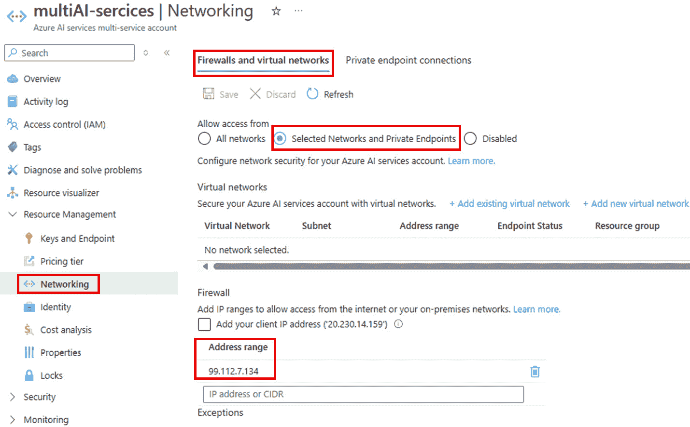

图 3.11 – 阻止所有流量，仅允许 IP 地址 99.112.7.134

1.  点击**保存**以应用您的更改。

## 从虚拟网络授予访问权限

您可以配置 Azure AI 服务，使其仅允许来自特定子网的访问。这些子网可以属于同一订阅或不同订阅中的虚拟网络——即使其他订阅是不同 Microsoft Entra 租户的一部分。如果使用不同的订阅，请确保`Microsoft.CognitiveServices`资源提供程序也已在该处注册。

为了优化流量路由，在虚拟网络内启用 Azure AI 服务的服务端点。这会将流量通过专用路径引导到 Azure AI 服务。有关详细信息，请参阅[`learn.microsoft.com/en-us/azure/virtual-network/virtual-network-service-endpoints-overview`](https://learn.microsoft.com/en-us/azure/virtual-network/virtual-network-service-endpoints-overview)。

每个对 Azure AI 服务的请求都包含子网和虚拟网络标识符，允许管理员设置网络规则，仅允许来自特定子网的访问。即使网络规则允许，客户端仍需满足授权要求才能访问数据。

每个 Azure AI 服务资源支持最多 100 条虚拟网络规则，这些规则可以与 IP 网络规则结合使用。有关更多信息，请参阅[`learn.microsoft.com/en-us/azure/ai-services/cognitive-services-virtual-networks?tabs=portal#grant-access-from-an-internet-ip-range`](https://learn.microsoft.com/en-us/azure/ai-services/cognitive-services-virtual-networks?tabs=portal#grant-access-from-an-internet-ip-range)。

组织还有其他选项，可以根据 IP 地址、虚拟网络配置或私有端点来强制执行访问限制。核心思想是使用技术通过基于 IP 的配置来控制访问。在本节中，我们将介绍两个关键概念。有关更多详细信息，您可以点击提供的链接：

+   `CognitiveServicesManagement`，以简化网络安全规则管理。服务标签代表 Azure 服务的 IP 地址组，使您能够轻松允许来自这些服务的流量。有关更多详细信息，请参阅[`learn.microsoft.com/en-us/azure/ai-services/qnamaker/how-to/network-isolation`](https://learn.microsoft.com/en-us/azure/ai-services/qnamaker/how-to/network-isolation)中的文档。您还可以在[`azservicetags.azurewebsites.net/servicetag/cognitiveservicesmanagement`](https://azservicetags.azurewebsites.net/servicetag/cognitiveservicesmanagement)找到完整的 IP 地址前缀列表。

+   **私有端点**：设置私有端点，使用私有 IP 地址将您的 AI 服务连接到您的**虚拟网络**（**VNet**）。这将在您的 VNet 和 Azure AI 服务之间保持流量在 Azure 骨干网络内，增加了一个额外的安全层。有关更多详细信息，请参阅[`learn.microsoft.com/en-us/azure/virtual-network/virtual-network-service-endpoints-overview`](https://learn.microsoft.com/en-us/azure/virtual-network/virtual-network-service-endpoints-overview)中的文档。

在本节中，你了解到从网络角度来看，确保 Azure AI 服务的安全性需要配置防火墙规则、访问控制和请求过滤，以确保只有授权客户端可以访问资源。基本的安全实践包括指定允许的 IP 范围或子网、利用服务标签和私有端点，以及强制执行强大的授权机制，如 Microsoft Entra ID 凭证。

# 概述

在*第三章*中，我们探讨了 Azure AI 资源的基本管理和监控实践，涵盖了诊断日志记录、指标监控、身份验证和网络安全性等主题。诊断日志记录被强调为跟踪资源使用、解决问题和通过详细的日志和指标维护合规性的关键功能。你学习了如何配置日志数据的各种目的地，例如 Azure Log Analytics、Azure 存储和事件中心，以全面了解服务操作和性能。此外，Azure Monitor 的高级指标跟踪工具使管理员能够监控关键性能指标、设置警报并可视化趋势，确保最佳性能和问题的早期检测。

还强调了成本管理策略，重点关注使用 Azure 定价计算器估算费用、使用 Azure 成本管理监控支出以及配置预算警报以避免意外费用。这些策略对于维持对 AI 资源的财务控制至关重要，使组织能够有效地优化其预算。通过整合这些监控、日志记录和成本管理实践，组织可以以安全、高效和成本效益的方式管理 Azure AI 服务。

我们还深入探讨了身份验证和网络安全性，强调了安全地管理对 Azure AI 资源访问的重要性。本章涵盖了密钥管理的最佳实践，例如使用 Azure 密钥保管库进行安全密钥存储和定期轮换密钥以防止未经授权的访问。介绍了不同的身份验证方法，包括单服务和多服务资源密钥、基于令牌的访问和 Microsoft Entra ID 身份验证。还讨论了网络安全策略，如配置防火墙规则、利用虚拟网络（VNets）和设置私有端点，以保护 Azure AI 资源免受外部威胁。

在这些管理和安全实践到位的情况下，组织可以自信地部署和扩展其 AI 解决方案。

在下一章中，我们将重点关注内容审查解决方案，探讨如何使用 Azure 的内容安全功能确保 AI 生成内容的安全性、合规性和道德使用。这包括设置内容过滤规则和利用 AI 模型检测和管理潜在有害内容。

# 复习问题

回答以下问题以测试你对本章知识的掌握：

1.  Azure AI 服务中诊断日志的主要目的是什么？

    1.  估算 Azure 服务的月度成本

    1.  配置 AI 服务的防火墙规则

    1.  为了提供对操作的可见性，跟踪性能和解决问题

    1.  管理资源组和订阅

    **正确答案**：C

1.  哪个 Azure 服务用于安全地存储 Azure AI 服务的密钥、机密和证书？

    1.  Azure 监视

    1.  Azure 密钥保管库

    1.  Azure Active Directory

    1.  Azure 日志分析

    **正确答案**：B

1.  在 Azure AI 服务中，何时应该使用多服务资源密钥而不是单服务密钥？

    1.  当你想要使用单个密钥访问多个 AI 服务时

    1.  当你需要更强的身份验证安全性时

    1.  当使用 Azure 认知搜索时

    1.  当配置来自本地网络的访问时

    **正确答案**：A

1.  在生产环境中保护访问密钥的最佳实践是什么？

    1.  直接将密钥硬编码到应用程序中

    1.  在项目文件夹中的文本文件中存储密钥

    1.  使用 Azure 密钥保管库存储和管理密钥

    1.  通过电子邮件将密钥发送给应用程序所有者

    **正确答案**：C

1.  哪个网络安全特性可以用来限制特定 IP 范围对 Azure AI 服务的访问？

    1.  Azure 防火墙规则

    1.  Azure Functions 触发器

    1.  Azure Blob 存储策略

    1.  Azure DevOps 访问控制

    **正确答案**：A

# 进一步阅读

要了解更多关于本章所涵盖的主题，请查看以下资源：

+   *启用 Azure AI 服务的诊断日志*：[`learn.microsoft.com/en-us/azure/ai-services/diagnostic-logging`](https://learn.microsoft.com/en-us/azure/ai-services/diagnostic-logging)

+   *Kusto 查询语言* 概述：[`learn.microsoft.com/en-us/kusto/query/?view=microsoft-fabric`](https://learn.microsoft.com/en-us/kusto/query/?view=microsoft-fabric)

+   *监控 Azure OpenAI*：[`learn.microsoft.com/en-us/azure/ai-services/openai/how-to/monitor-openai`](https://learn.microsoft.com/en-us/azure/ai-services/openai/how-to/monitor-openai)

+   *计划管理 Azure OpenAI 服务的成本*：[`learn.microsoft.com/en-us/azure/ai-services/openai/how-to/manage-costs`](https://learn.microsoft.com/en-us/azure/ai-services/openai/how-to/manage-costs)

+   *Azure AI 服务的安全特性*：[`learn.microsoft.com/en-us/azure/ai-services/security-features`](https://learn.microsoft.com/en-us/azure/ai-services/security-features)

+   *验证对 Azure AI 服务的请求*：[`learn.microsoft.com/en-us/azure/ai-services/authentication`](https://learn.microsoft.com/en-us/azure/ai-services/authentication)

+   *配置 Azure AI 服务的虚拟网络*：[`learn.microsoft.com/en-us/azure/ai-services/cognitive-services-virtual-networks?tabs=portal`](https://learn.microsoft.com/en-us/azure/ai-services/cognitive-services-virtual-networks?tabs=portal)

+   *在 Azure AI* *服务中旋转密钥*：[`learn.microsoft.com/en-us/azure/ai-services/rotate-keys`](https://learn.microsoft.com/en-us/azure/ai-services/rotate-keys)

+   *使用 Azure Key* *Vault* 开发 Azure AI 服务应用程序：[`learn.microsoft.com/en-us/azure/ai-services/use-key-vault?tabs=azure-cli&pivots=programming-language-csharp`](https://learn.microsoft.com/en-us/azure/ai-services/use-key-vault?tabs=azure-cli&pivots=programming-language-csharp)

+   *配置 Azure AI 服务虚拟* *网络*：[`learn.microsoft.com/en-us/azure/ai-services/cognitive-services-virtual-networks?tabs=portal`](https://learn.microsoft.com/en-us/azure/ai-services/cognitive-services-virtual-networks?tabs=portal)

# 第二部分：Azure AI 的实际应用

*第二部分* 强调了负责任 AI 原则——公平性、隐私、透明度和问责制——的重要性，以确保道德和安全的 AI 系统。您将探索管理风险的战略，例如使用内容过滤器以及 Azure AI 内容安全工具，并深入了解 Azure AI 视觉在对象检测、人脸识别、**光学字符识别** (**OCR**) 和视频分析等任务中的应用。它还涵盖了 Azure AI 语言和语音服务，用于自然语言处理技术、文本到语音、语音到文本和翻译功能。此外，您还将学习如何使用 Azure AI 搜索和文档处理工具进行知识挖掘和文档智能，以从非结构化数据中提取洞察。本节以通过 Azure OpenAI 服务提供的生成式 AI 解决方案结束，包括文本、图像和代码生成、微调模型以及使用 **检索增强** **生成** (**RAG**) 集成自定义数据，使您能够为各种商业需求构建有影响力的 AI 解决方案。

本部分包含以下章节：

+   *第四章*, *实施内容审查解决方案*

+   *第五章*, *探索 Azure AI 视觉解决方案*

+   *第六章*, *实施自然语言处理解决方案*

+   *第七章*, *实施知识挖掘、文档智能和内容理解*

+   *第八章*, *在生成式 AI 解决方案上工作*
