# 7

# 实施知识挖掘、文档智能和内容理解

在当今以数据驱动为主的世界里，从大量非结构化数据中提取有价值的见解对于企业保持竞争力至关重要。Azure 提供了一整套强大的 AI 服务——**知识挖掘**、**文档智能**以及新推出的**内容理解**——以帮助组织将非结构化数据转化为可操作的知识。

本章探讨了这些服务的实际实施和使用案例。你将学习如何使用 **Azure AI Search** 构建智能搜索管道，使用文档智能从复杂文档中提取结构化数据，以及使用内容理解在文本、图像、音频和视频内容之间进行多模态分析。这些服务中的每一个都在实现更智能的数据提取和丰富中扮演着独特的角色。

到本章结束时，你将能够做到以下几件事情：

+   利用 Azure AI 搜索构建可扩展的搜索解决方案，支持基于词汇和基于向量的查询

+   创建和运行索引器和技能集，以摄取、丰富和组织数据以实现快速检索

+   使用文档智能通过预构建和自定义模型处理结构化和非结构化文档

+   使用低代码/无代码方法将内容理解应用于设计基于模式的丰富多模态内容管道的分析器

让我们开始吧！

# 探索 Azure AI Search

Azure AI Search 是一种搜索即服务解决方案，它使您能够创建和管理针对快速、高效信息检索优化的搜索索引。它支持**向量**和基于**文本**（非向量）的索引和查询，允许您找到与搜索查询在语义上或词汇上相似的信息。

该服务提供了一系列功能，包括**相关性调整**、**分面导航**、**过滤器**（例如地理空间搜索）、**同义词映射**和**自动完成**。它还支持各种搜索类型的**丰富查询语法**——向量、文本、混合、模糊、自动完成和地理搜索。*混合搜索*允许同时进行向量和关键词搜索，返回一个经过重新排序的统一结果集，以实现最佳的相关性。

根据我的经验，许多客户发现理解 AI 搜索的概念具有挑战性。使用这些类比——将 Azure AI 搜索视为服务器、索引视为数据库、索引器视为**提取、转换和加载**（**ETL**）管道，以及技能集视为转换——有助于他们了解 AI 搜索的核心组件如何与熟悉的数据库架构模式相呼应，如图*7*1*所示：

+   **Azure AI Search**：将 Azure AI 搜索视为*数据库服务器*。就像单个物理服务器可以托管多个数据库（只要它有足够的计算能力），一个 Azure AI 搜索资源可以托管多个索引。

+   **索引**：索引在关系型系统中类似于数据库。您为可搜索内容定义**模式**（字段和类型），索引存储所有文档在该结构中。这是所有可搜索数据所在的地方。

+   **索引器**：这充当您的 ETL 管道。它从源（例如 Blob 存储和 SQL 数据库）提取数据，使用 AI 增强（通过技能集）进行转换，然后将数据加载到索引中。例如，您可以安排索引器每五分钟运行一次，自动拉取新或更新的文档并刷新您的索引。

+   **技能集**：这是一组数据转换或增强步骤，类似于 ETL 中的转换逻辑。它可以包括内置的 AI 函数，如**光学字符识别**（**OCR**）、语言检测或实体识别。这种增强允许索引器在数据加载到索引之前添加元数据和洞察——就像数据质量或数据转换步骤一样。例如，假设您以多种语言存储有关公司政策的 PDF 文件。具有技能集的索引器可以提取文本（OCR），检测每个文档的语言，并将该元数据存储在索引中。这使得以后可以根据语言过滤或搜索变得更容易，就像在数据库中过滤记录一样。

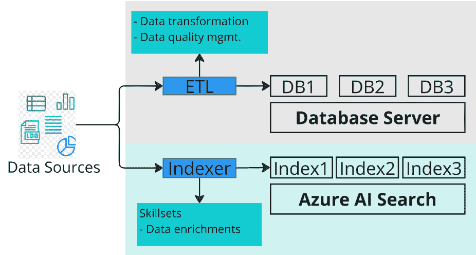

图 7.1 – Azure AI 搜索与传统数据库：组件级比较

Azure AI 搜索与其他 Azure 服务集成，允许从 Azure 数据源自动摄取和检索数据，并整合来自 Azure AI 服务的可消费 AI，例如图像和**自然语言处理**（**NLP**）。索引过程可以通过 AI 增强来扩展，包括 OCR、图像描述、结构推理、文本翻译和机器学习能力。该服务可通过 Azure 门户、REST API 和.NET、Python 和 JavaScript 的 Azure SDK 访问。

让我们探索 Azure AI 搜索过程是如何工作的。理解其概念和流程对于完全掌握其功能至关重要。

## Azure AI 搜索过程

Azure AI 搜索从各种来源摄取数据，如图*图 7.2*所示，例如 Azure Blob 存储、Azure Cosmos DB 和其他支持的数据源。

索引引擎通过标记化并将数据存储在索引中以进行高效搜索检索来处理数据，同时 AI 增强使用认知技能（如 OCR 等）来增强数据，以改善其结构和可搜索性。索引器管道遵循一个多步骤过程，包括内容提取、字段映射、技能集应用和输出字段映射，最终将增强后的数据推送到搜索索引。然后查询引擎处理搜索请求，允许应用程序收集用户输入、提交查询并显示相关结果，从而实现从大型数据集中快速准确地搜索。

以下图表说明了从数据摄取到通过索引器管道丰富数据并为其搜索准备的全部过程。

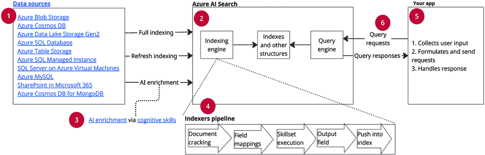

图 7.2 – 总体 AI 搜索索引过程

让我们详细看看这个过程：

1.  **数据源**：数据可以从各种来源摄取，包括 Azure Blob 存储、Azure Cosmos DB、Azure Data Lake Storage Gen2、Azure SQL 数据库、Azure Table 存储和其他预览来源。Azure AI 搜索继续整合新的数据源以增强其功能。

1.  **索引引擎**：索引引擎通过执行**完整索引**（初始数据加载）和**刷新索引**（增量更新）来自动化数据摄取和检索。在这个过程中，以下情况发生：

    +   文本被分词并存储在**倒排索引**中，以支持基于关键词的快速搜索

    +   向量嵌入存储在**向量索引**中，以支持语义和基于相似度的搜索

1.  **AI 增强**：可选的 AI 增强在索引之前通过使用**内置的认知技能**（如 OCR、语言检测和实体识别）或**自定义 AI 模型**（通过 Azure 机器学习）来增强内容。这一步骤有助于创建一个可搜索的结构和元数据，其中原本不存在，从而提高搜索结果的质量。

1.  **索引器管道**：这定义了内容在进入索引之前如何被处理和转换。管道通常包括以下内容：

    +   **文档破解**：从文档中提取内容以使其可搜索

    +   **字段映射**：将字段映射到适当的类型以确保数据完整性和相关性

    +   **技能集执行**：通过执行文本翻译、情感分析等任务来应用 AI 技能以增强数据

    +   **输出字段映射**：通过以与搜索架构一致的方式结构化数据来准备数据以便索引

    +   **推入索引**：将处理后的数据添加到搜索索引中，使其准备好进行查询

1.  **您的应用**：这处理用户输入，制定并发送搜索请求，并管理响应以显示结果集或单个文档。

1.  **查询引擎**：处理来自应用的搜索请求，利用丰富的查询语法进行向量查询、文本搜索、混合查询、模糊搜索、自动完成、地理搜索等。它使用支持的语法和完整的 Lucene 查询语法扩展提供简单和高级的查询功能。

通过以下练习来巩固您对索引过程的了解。

练习说明

*练习 1*以及接下来的三个探索介绍了 Azure AI Search 的核心概念，包括如何使用 Azure 门户创建搜索服务、索引、技能集和索引器，以获得直观的学习体验。这些基础步骤为你准备*练习 2*，该练习使用 SDK 方法将所有这些元素整合在一起，并包含高级主题，如自定义技能、Azure Functions 和知识库。这种进展加强了早期概念，并帮助你熟练掌握基于门户和 SDK 驱动的流程。

在后续的*第十章*中，你将了解 Azure OpenAI 为 AI Search 提供的集成向量化功能，该功能简化了数据准备和索引过程，适用于**检索增强生成**（**RAG**）和传统搜索应用。

## 练习 1：创建 Azure AI Search 服务

在这个练习中，您将通过创建 Azure AI Search 服务来探索 Azure 门户。这将使您更容易理解配置选项：

1.  要创建资源并选择**AI Search**，请从[`portal.azure.com`](https://portal.azure.com)导航，或者使用以下链接直接跳转到该页面：[`portal.azure.com/#create/Microsoft.Search`](https://portal.azure.com/#create/Microsoft.Search)。

1.  从**订阅**下拉菜单中选择您的订阅，如果有的话，从**资源组**下拉菜单中选择一个现有的资源组。或者，选择创建新资源组的选项。

1.  输入您服务的所需名称，并选择您的区域。

1.  点击**更改定价层**链接，将打开一个名为**选择定价层**的新窗口，它不同于您可能从其他资源类型中习惯的指定选择器。您将能够看到不同的定价层及其相应的资源，如图*图 7.3*所示：

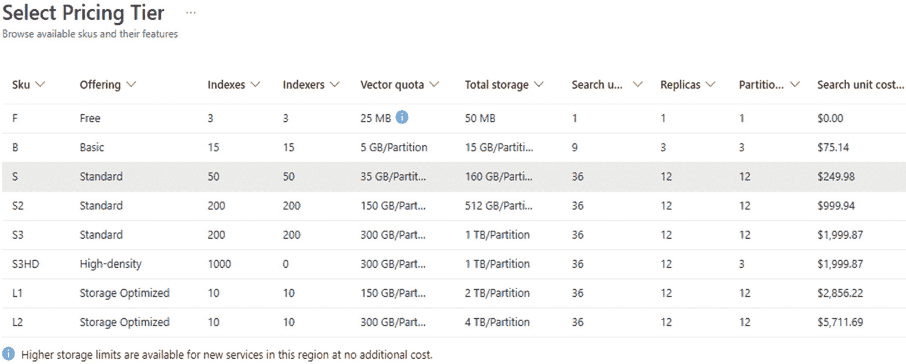

图 7.3 – 选择定价层视图

重要提示

选择最适合您解决方案的价格层非常重要，因为您以后无法更改它。如果您发现您选择的价格层不再适合您的解决方案，您必须创建一个新的 Azure AI Search 资源，并重新创建所有索引和对象。目前，Azure AI Search 不提供内置机制或工具来自动化从较低 SKU 迁移到较高 SKU 的过程。建议的方法是使用备份和还原方法。有关更多详细信息，请参阅[`learn.microsoft.com/en-us/samples/azure-samples/azure-search-dotnet-utilities/azure-search-backup-restore-index/`](https://learn.microsoft.com/en-us/samples/azure-samples/azure-search-dotnet-utilities/azure-search-backup-restore-index/)。

1.  在选择适当的 Azure AI Search 服务价格层后，点击**下一步：扩展**。

    您可以选择适当的**副本**和**分区**设置，如图*图 7.3*所示；请注意，这些配置可以在创建 Azure AI 搜索服务后进行修改：

    +   **副本**是搜索服务的实例；您可以将它们视为集群中的节点。增加副本的数量可以帮助确保有足够的容量来服务多个并发查询请求，同时管理持续进行的索引操作。

    +   **分区**用于将索引分成多个存储位置，使您能够分割 I/O 操作，如查询或重建索引。

    您配置的副本和分区的组合决定了您的解决方案使用的*搜索单元*。简单来说，搜索单元的数量是副本数量与分区数量的乘积（*R x P = SU*）。例如，具有两个副本和两个分区的资源使用四个搜索单元。

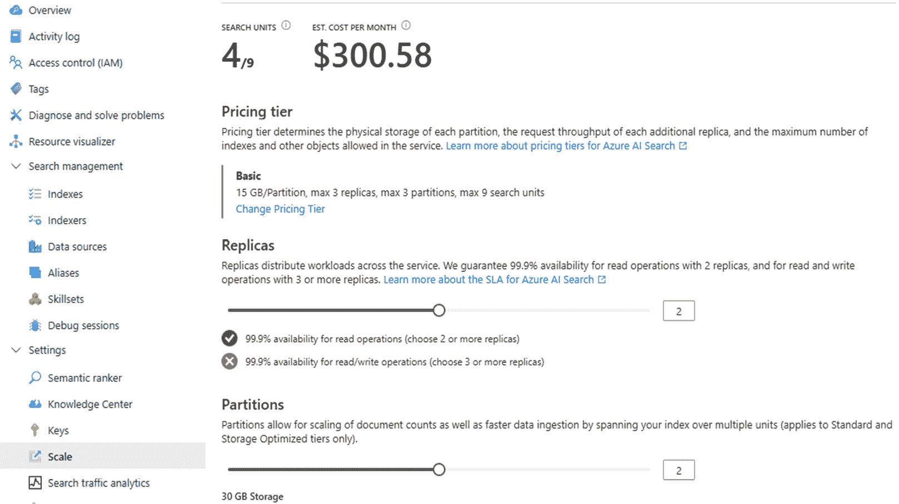

图 7.4 – 在“缩放”选项卡上的副本和分区单元

1.  点击**审查 + 创建**并选择**创建**以部署新的 Azure AI 搜索服务。完成后，进入您的新 Azure AI 搜索服务并查看可用的设置。您将能够看到索引、索引器、数据源、技能集、调试会话和横向扩展选项。

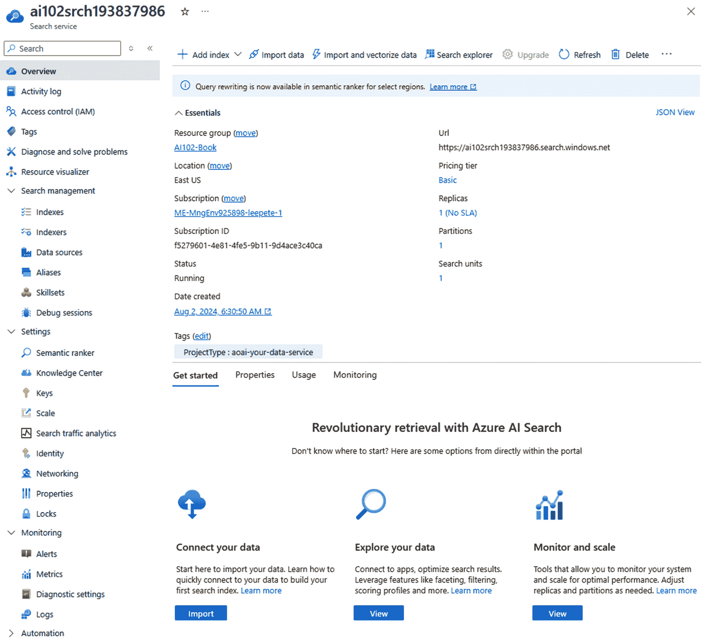

图 7.5 – 创建后的 Azure AI 搜索服务概述

1.  或者，您可以使用以下 CLI 或 PowerShell 命令创建 Azure AI 搜索服务。

    这是 CLI 命令：

    ```py
    $ az search service create \
        --name my-search-service \
        --resource-group my-resource-group \
        --sku Standard \
        --partition-count 1 \
        --replica-count 1 \
        --public-access Disabled
    $ New-AzSearchService -ResourceGroupName "my-resource-group" -Name "my-search-service" -Sku "Standard" -Location "West US" -PartitionCount 1 -ReplicaCount 1
    ```

    虽然 CLI 接受但不要求指定位置（因为它将从资源组继承），但 PowerShell 需要指定位置。

现在，您已经探索了 Azure AI 搜索服务，它提供了计算、存储、索引和搜索功能，您可以将它用于良好的用途。

在我们深入到基于 SDK 的完整实现之前，在*练习 2：在 VS Code 中创建索引、技能集、索引器、自定义技能和知识库*，让我们花点时间探索 Azure AI 搜索的核心组件——**索引**、**技能集**和**索引器**——使用 Azure 门户。对这些元素如何交互的视觉理解将帮助您更好地掌握代码背后的概念。

## 在 Azure 门户中理解索引、技能集和索引器

在跳转到*练习 2*之前，该练习将指导您使用 Azure SDK 和 REST API 构建完整的搜索管道，首先理解使用 Azure 门户幕后发生的事情是有帮助的。可视化这些元素会使您更容易理解稍后将要工作的代码。将其视为一个引导性的浏览，而不是一个动手练习。

许多开发者在没有完全理解 Azure AI 搜索组件如何连接的情况下开始编码。但能够*看到*你的索引、技能集和索引器在门户中的反映不仅加强了概念理解，而且在调试 SDK 代码时也增强了信心。

我们建议在完成*练习 2*的每个步骤后，导航到门户并审查 Azure AI 搜索界面中的相应更改。接下来的几节将解释如何做到这一点，从索引开始。

### 探索索引

在本节中，你将导航一个具有适当字段和定义的索引。这将为你提供一个关于此过程所需的所有步骤和元素的全面概述：

1.  从左侧的导航菜单转到**概览**，然后在**+ 添加索引**下拉菜单中点击**添加索引**，将被带到名为**创建索引**的不同窗口。

1.  如果你希望它们出现在输出中，可以通过点击`title`、`summary`或`id`来创建一个新的索引字段。对于`key`字段（例如，`id`），这是只读的，总是可检索的。

1.  `category`、`status`或`price`范围，例如，`category` `eq 'Books'`。

1.  `Edm.String`字段。此设置定义了文本在索引和查询中的分词和规范化方式。你可以选择特定于语言的分析器，如`en.lucene`、`fr.microsoft`等，以支持不同语言的语言细微差别。

1.  `Collection(Edm.Single)`。

重要提示

虽然你可以在之后添加新字段，但一旦索引创建完成，现有的字段定义将永久锁定。因此，开发者通常在 Azure 门户中用于简单的索引、测试想法或审查设置，在最终确定索引结构之前。

在最终确定索引创建之前，定义适当的字段及其属性对于确保最佳搜索性能至关重要。以下示例图说明了如何在 Azure AI 搜索索引创建界面中配置这些字段：

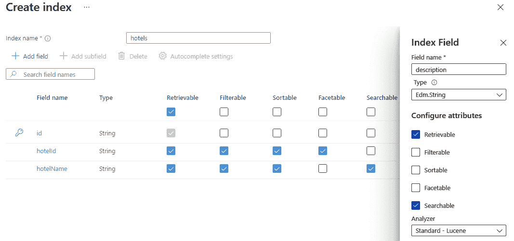

图 7.6 – 具有配置设置的索引字段定义示例

1.  一旦索引创建完成并通过索引器管道拉取数据，你将看到模式配置的所有详细信息，如图*图 7.7*所示，并在以下列表中描述：

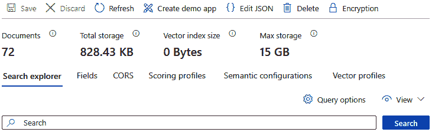

图 7.7 – 搜索探索器标签页的索引模式预览示例视图

+   **搜索探索器**：如果你点击**搜索**按钮，除了标题外不会显示任何数据，因为我们只创建了模式定义而没有数据。

+   **字段**：显示为你的索引定义的完整字段列表（模式），以及每个字段的类型和属性，如*可筛选的*、*可排序的*、*可搜索的*等。

+   **CORS**：**跨源资源共享**（**CORS**）是一个 HTTP 功能，它允许运行在一个域上的 Web 应用程序访问另一个域上托管的资源。这在允许客户端 JavaScript 从不同域与您的 Azure AI 搜索索引交互时特别有用。

+   **评分配置文件**：评分配置文件允许您根据您定义的标准自定义搜索结果的相关性。每个配置文件都包含加权字段、评分函数和参数。通过将更高的权重分配给特定字段，您可以影响搜索结果的排名，优先显示最相关的内容。

+   **语义配置**：这通过利用高级 AI 能力来增强搜索的相关性。它允许您定义搜索服务如何根据语义理解来解释和排名内容，而不是仅仅依赖于关键词匹配。

+   **向量配置文件**：在索引中定义基于向量的相似性搜索的设置。这些配置文件指定算法（如 HNSW）、参数（例如，top-k）和用于嵌入比较的向量字段，从而实现混合或纯语义搜索体验。

现在您已经探索了一个新的索引，让我们继续下一步：探索技能集。

### 探索技能集

Azure AI 搜索中的**技能**用于在索引过程中丰富和转换内容。技能可以执行各种操作，如 OCR、语言检测、关键词提取和实体识别。这些技能有助于将原始内容转换为更易于搜索的格式。技能被组织到不同的类别中，包括内置技能，这些技能封装了对 Azure 资源的 API 调用，以及用户提供的代码执行的外部技能。这些技能的输出通常是文本形式的，这使得它们适合全文搜索或向量搜索。

在本节中，您将探索创建技能集，并了解各种通过将 AI 能力应用于您的数据来增强索引过程的技能集：

1.  导航到菜单的左侧面板，在**搜索管理**下选择**技能集**，然后在窗口右侧选择**+ 添加技能集**。这将打开一个名为**添加技能集**的新窗口。

1.  点击**+ 添加新技能**，这将打开右侧的**添加新技能**面板。有关特定技能的更多信息，请选择它，详细信息将出现在下拉菜单下方。

1.  从技能定义模板中选择一个合适的技能，然后点击**添加**按钮，将其包含在左侧的主要技能集定义中。

重要提示

您可能需要通过点击**连接** **AI 服务**来创建 Azure AI 服务，以便使用技能集。

让我们看看这个门户，以帮助您更好地理解：

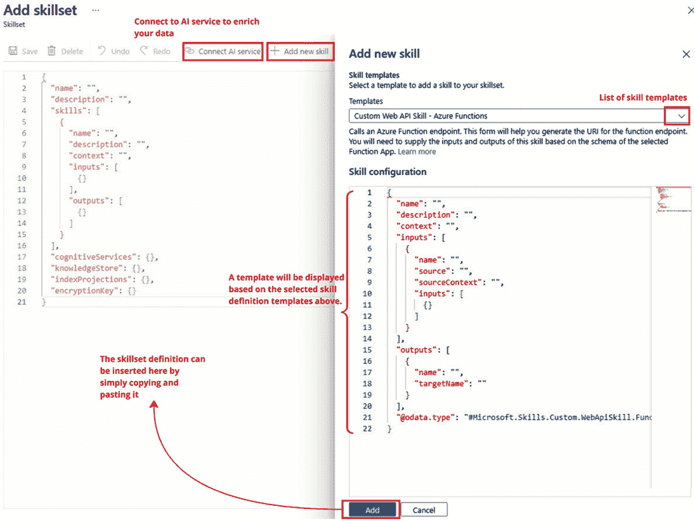

图 7.8 – 添加技能集的示例

现在，让我们检查索引器以及它们如何拉取数据和填充索引。

### 探索索引器

索引器是一个组件，它自动化从数据源提取数据并填充索引的过程。它可以定期运行以保持索引更新。

本节将指导您完成创建与索引关联的索引器、设置数据摄取技能以及通过管道处理数据的步骤。

从 AI 搜索的**概览**选项卡下，在**搜索管理**中选中**索引器**，然后点击**添加索引器**选项。这将打开一个**添加索引器**窗口，如图下所示：

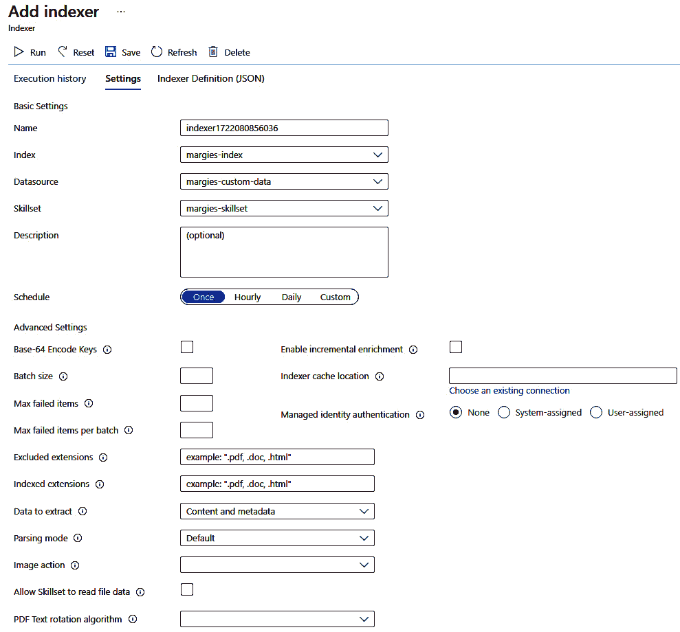

图 7.9 – 配置索引器设置的示例

**添加索引器**窗口允许用户配置和安排索引器，这是一个从数据源提取内容并在将其添加到 Azure AI 搜索索引之前应用丰富化的工具。让我们浏览各个字段：

+   **基本设置**：

    +   **名称**：为您的索引器提供一个唯一的名称。这用于在 Azure AI 搜索服务中识别索引器。

    +   **索引**：选择您想要添加数据的索引。这是可搜索内容将被存储的地方。

    +   **数据源**：选择索引器将从中提取数据的源。这可能包括 Blob 存储、Cosmos DB、SQL 数据库等。

    +   **技能集**：如果您为 AI 丰富创建了技能集，请在此处选择它。技能集将 OCR、关键词提取和实体识别等认知技能应用于数据以增强数据。

+   **计划**：

    +   **一次**、**每小时**、**每天**或**自定义**：设置索引器应运行的频率。您可以选择一次性运行或按小时、每天或自定义计划运行。请注意，5 分钟是索引器执行之间的最大间隔时间。

+   **高级设置**：

    +   **Base-64 编码密钥**：如果您的密钥是 Base-64 编码的，请启用此选项。

    +   **启用增量丰富**：如果您希望索引器执行增量丰富，请勾选此选项，这意味着它将只处理自上次运行以来新或更新的数据。

    +   **批量大小**：指定每个批次中要处理的文档数量。根据您的数据和资源调整批量大小可以帮助优化性能。

    +   **索引器缓存位置**：如果您想为索引器使用特定的缓存位置，请选择现有的连接。

    +   **最大失败项数**：设置在索引器停止之前可以失败的最大项数。

    +   **每批最大失败项数**：设置每批允许的最大失败项数。

    +   **托管标识认证**：选择是否要使用托管标识进行认证。

    +   **排除扩展**：指定应从索引中排除的任何文件扩展名。

    +   **索引扩展**：可选地指定应索引的文件扩展名。

    +   **要提取的数据**：选择是否从文档中提取内容、元数据或两者。

    +   **解析模式**：选择文档的解析模式。**默认**模式通常被使用。

    +   **图像操作**：配置在索引过程中如何处理图像内容。

    +   **允许技能集读取文件数据**：启用此选项以允许技能集读取文件数据进行丰富。

    +   **PDF 文本旋转算法**：根据需要选择处理 PDF 文档中文本旋转的算法。

在对索引、技能集和索引器有了视觉理解之后，让我们继续探讨知识库的话题，它作为分析的第二级存储。我们将探讨为什么它们是必要的，并概述其整体流程。

# 管理知识库投影

Azure AI Search 中的**知识库**为技能集生成的 AI 丰富内容提供二级存储。在技能集中定义，它包括连接到 Azure Storage 的连接和确定格式（如表格、对象或文件）的投影。主要优势是灵活访问，允许数据在搜索查询之外的使用，例如与 Power BI 或 Azure Data Factory 的集成。数据通过认知技能（如 OCR 和语言检测）进行丰富，知识库通过提供更广泛的数据访问性来补充搜索索引，以便于分析或报告。

创建知识库涉及定义数据源、技能集和索引模式，这些可以通过 API 或 **导入数据**向导进行组合。索引器的每次运行都会更新知识库，反映源数据的变化。这种灵活的设置使各种工具能够进行更全面的数据处理。

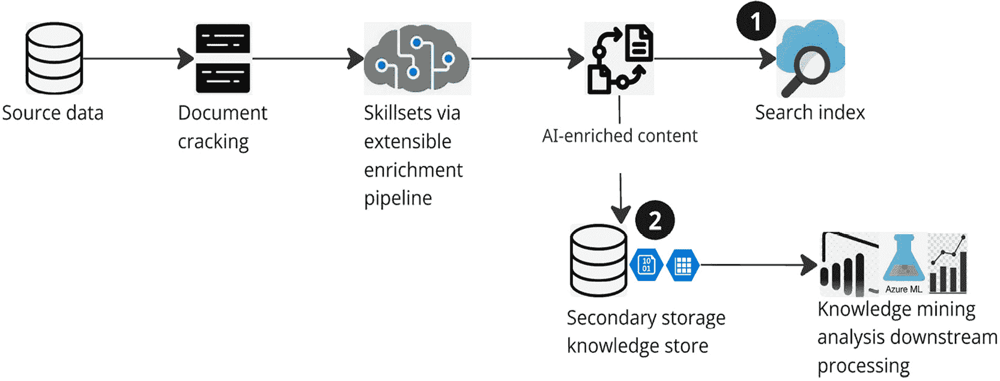

图 7.10 – 知识库整体流程

上述图表说明了 Azure AI Search 内部数据流，从源数据摄取开始，经过文档拆分以使其可读。认知技能集处理并丰富这些数据，将结果发送到搜索索引和知识库。知识库存储投影，可用于各种任务，如检索、机器学习、分析和人工验证。索引系统和知识库系统的两个输出提供了一种灵活的方法来存储和分析丰富的数据，而不仅仅是搜索索引。

以下练习将巩固之前章节中学到的所有概念，包括索引、技能集和索引器，以及知识库和自定义技能。

## 练习 2：在 VS Code 中创建索引、技能集、索引器、自定义技能和知识库

本练习将指导您创建自定义技能并使用 Visual Studio Code 实现知识库，使您能够在实际环境中应用这些组件。您将获得实际操作经验，使用完整的 Azure AI Search 管道，强化关键概念并将它们整合到实际解决方案中。

本练习旨在帮助您掌握数据来源、索引创建、技能集定义、自定义技能实现、索引器创建、索引查询和知识库管理在 Visual Studio Code 中的基本概念。它将向您展示如何使用技能集，包括自定义技能和知识库作为辅助存储，以及索引器来增强 AI 技能管道以集成到搜索索引中。我强烈建议您参与此练习，不仅为了理解这些概念，而且为了在认证后准备将它们应用于实际项目。

### 第 1 步：准备在 Visual Studio Code 中开发应用程序

如果您已经克隆了存储库，请导航到`exercise2`文件夹。否则，打开 Visual Studio Code，按*Shift* + *Ctrl* + *P*，并选择`chapter-7`。

### 第 2 步：创建 Azure 资源（AI 多服务账户、存储账户和 AI 搜索）

要完成此练习，`setup.cmd`脚本将为数据丰富创建一个新的 Azure AI 服务账户，为知识库创建一个存储账户，并为索引和查询创建 Azure AI 搜索服务：

1.  右键点击`chapter-7`文件夹，并选择**在****集成终端**中**打开**。

1.  运行以下命令，将出现一个登录窗口供您登录：

    ```py
    az login --output none
    ```

1.  登录后，使用以下命令查找与您的资源组对应的区域名称：

    ```py
    subscription_id, resource_group, and location variables in the setup.cmd script with the specific details of your Azure environment. This ensures that the resources are created within the correct subscription, resource group, and region. Save the changes, then run this command in the terminal:

    ```

    ./setup.cmd

    ```py

    ```

1.  当脚本完成后，您将在以下源部分看到输出。请注意以下资源详细信息，因为它们将在稍后连接搜索服务到您的数据源时需要：

    +   存储账户名称

    +   存储连接字符串

    +   搜索服务端点

    +   搜索服务管理员密钥

    +   搜索服务查询密钥：

        ```py
        Creating storage...
        $> .\setup.cmd
        Creating storage...
        Uploading files...
        Finished[#############################################################]  100.0000%
        Creating azure ai services account...
        Creating search service...
        (If this gets stuck at '- Running ..' for more than a couple minutes, press CTRL+C then select N)
        -------------------------------------
        Storage account: ai102str181174851
        {
          "connectionString": " DefaultEndpointsProtocol=https;AccountName=ai102str1559317155;AccountKey=zm8iWn9999999999 j2ByXXWAs4gTB9HmZeCUn+AStnlbGtw==;EndpointSuffix=core.windows.net"}
        ----
        Azure AI Services account: ai102cog181174851
        {
          "key1": "0f3ld9999999lkr;s999ouwero93bb",
          "key2": "5dskjfkjd999999iru0999993859dd8"
        }
        ----
        Search Service: ai102srch
         Url: https://ai102srch181174851.search.windows.net
         Admin Keys:
        {
          "primaryKey": "38edkjlkd99lad9999999DkliBu",
          "secondaryKey": "M129j9309499928340324jlfuldjlcf7Ps"
        }
         Query Keys:
        [
          {
            "key": "d3Xssdklf99999j9899999999sjf;l;a6VHT",
            "name": null
          }
        ]
        ```

在这些基本资源就绪后，您现在可以准备将它们集成到您的 AI 搜索解决方案中。以下步骤将指导您连接搜索服务到数据源、配置索引以及设置必要的组件以实现高效的数据检索和丰富。

以下截图显示了运行`setup.cmd`文件后创建的资源：

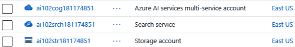

图 7.11 – setup.cmd 成功执行后的三个资源

重要提示

所显示的所有凭据密钥值均已更改，以演示目的展示脚本预期的结果。

现在，让我们继续创建一个使用 Azure 函数的自定义技能。这将使我们能够扩展 Azure AI 搜索的功能，并使技能适应特定需求。

### 第 3 步：为自定义技能创建 Azure 函数

Azure AI Search 提供了几个内置技能，用于通过文档中的信息丰富索引，例如情感分析和关键词提取。然而，当没有现成的功能时，您可以通过创建自定义技能来扩展这些功能。例如，如果您需要计算每个文档中最常用的单词，而这不是内置技能所涵盖的，您可以创建一个自定义技能。为此，您将使用您首选的编程语言中的 Azure 函数实现单词计数功能。

重要提示

在这个练习中，您将使用 Azure 门户的代码编辑器创建一个简单的 Node.js 函数。虽然这适用于演示目的，但在生产环境中，您通常会使用开发环境（如 Visual Studio Code）来构建函数应用，并使用您首选的语言（如 C#、Python、Node.js 或 Java）进行构建。然后，您将作为 DevOps 工作流的一部分将函数发布到 Azure，以实现更流畅和可扩展的部署。

要开始，您将创建一个基本的 Azure 函数，该函数作为自定义技能端点。此函数将允许您通过自定义逻辑丰富索引数据——在这种情况下，通过计算每个文档中最频繁出现的单词。按照以下步骤操作：

1.  在 Azure 门户中，创建一个新的函数应用并设置以下参数：

    +   **托管计划**：**消费**

    +   **订阅**：您的订阅

    +   **资源组**：与 Azure AI Search 相同

    +   **函数应用名称**：唯一名称

    +   **发布**：**代码**

    +   **运行时**：Node.js

    +   **版本**：22 LTS（选择最新可用的版本，因为版本会持续更新）

1.  部署后，创建一个 HTTP 触发函数：

    +   `wordcount`

    +   **授权**：**函数**

1.  将默认代码替换为位于 `functionApp` 文件夹中的 `wordcount.js`，保存并使用 `test.json` 进行测试，如图 *图 7.12* 所示：

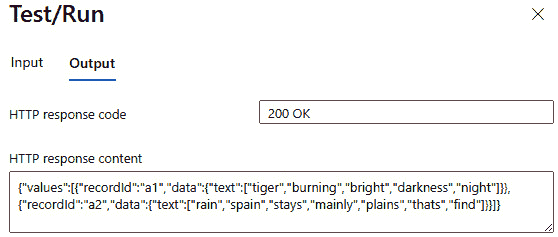

图 7.12 – 执行 Azure 函数后的测试/运行结果

1.  验证输出，并从 **获取函数 URL** 选项卡中复制函数 URL 以供将来使用。

### 步骤 4：创建搜索解决方案

现在，Azure 资源已设置好，您可以使用以下组件构建搜索解决方案：

+   **数据源**：引用 Azure 存储中的文档

+   **技能集**：使用 Azure AI 服务定义一个丰富管道（多服务帐户）

+   **索引**：一组可搜索的文档记录

+   **索引器**：提取数据，应用技能集，并为搜索填充索引

在这个练习中，您将使用 **Azure AI Search REST** 接口提交 JSON 请求以创建这些组件。您可以使用 Python 或 C# 等编程语言进行此过程：

1.  在 Visual Studio Code 中，打开 `exercise5` 文件夹中的 `data_source.json`。将 *步骤 2* 中的 `YOUR_CONNECTION_STRING` 替换为您的 Azure 存储连接字符串。

1.  打开`skillset.json`，将`YOUR_AI_SERVICES_KEY`替换为从*步骤 2*中获得的 Azure AI 服务密钥。对于`get-top-words`自定义技能，更新 URI 以包含从*步骤 3*中获得的 Azure 函数的 URL：

    ```py
        «cognitiveServices": {
            «@odata.type": "#Microsoft.Azure.Search.CognitiveServicesByKey",
            "description": "Azure AI services",
            "key": "0f34799999999999999917593bb"
          },
    "skills": [
          {
            "name": "get-top-words",
            «@odata.type": "#Microsoft.Skills.Custom.WebApiSkill",
            "description": "custom skill to get top 10 most frequent words",
            "uri": "https://wordcount3.azurewebsites.net/api/wordcount?code=K3l83SRc1Qz45U7zq99999999DQkW9ls99999VWheHg %3D%3D",
            "batchSize":1,
            "context": "/document",
            "inputs": [
              {
                "name": "text",
                «source»: «/document/merged_content"
              },
              {
                «name":"language",
                "source": "/document/language"
              }
            ],
            "outputs": [
                {
                "name": "text",
                «targetName": "topWords"
                }
            ]
          },
    ```

1.  保存并关闭更新的 JSON 文件。技能集包括您添加的功能 URL 的`get-top-words`自定义技能。

1.  最后，检查文件夹中的`skillset.json`和`indexer.json`文件以确保准确性，并保存更改。按照以下说明进行知识库定义：

    1.  在您的技能集中的技能集合末尾，找到名为`Microsoft.Skills.Util.ShaperSkill`的`define-projection`技能。此技能定义了一个用于创建投影的 JSON 结构，这些投影将用于索引器处理每个文档时。

    1.  在技能集文件底部，注意技能集还包括一个`knowledgeStore`定义，其中包含要创建知识库的 Azure 存储账户的连接字符串以及一组投影。此技能集包括三个投影组：

    +   包含基于技能集中`shaper`技能的`knowledge_projection`输出的`object`投影的组

    +   包含基于从文档中提取的图像数据`normalized_images`集合的`file`投影的组

    +   包含以下`table`投影的组：

        1.  `KeyPhrases`: 包含自动生成的键列以及映射到`shaper`技能的`knowledge_projection/key_phrases/`集合输出的`keyPhrase`列

        1.  `Locations`: 包含自动生成的键列以及映射到`shaper`技能的`knowledge_projection/key_phrases/`集合输出的`location`列

        1.  `ImageTags`: 包含自动生成的键列以及映射到`shaper`技能的`knowledge_projection/image_tags/`集合输出的`tag`列

        1.  `Docs`: 包含自动生成的键列以及所有尚未分配给表的`shaper`技能的`knowledge_projection`输出值

1.  将`YOUR_CONNECTION_STRING`占位符替换为`storageConnectionString`值的存储账户连接字符串：

    ```py
    "knowledgeStore": {
          "storageConnectionString": "DefaultEndpointsProtocol=https;AccountName=ai102str1559317155;AccountKey=zm8iWn9999999999j2ByXXWAs4gTB9HmZeCUn+AStnlbGtw==;EndpointSuffix=core.windows.net",
          "projections": [
          {
            "objects": [
             {
               «storageContainer": "hotels-knowledge",
               «source»: «/document/knowledge_projection"
             }],
               "tables": [],
               "files": []},
              {
               "objects": [],
               "tables": [],
               "files": [{
                 «storageContainer": "hotels-images",
                 «source»: «/document/normalized_images/*"
               }]},
              {
               "objects": [],
               "tables": [
               {
                 «tableName": "KeyPhrases",
                 «generatedKeyName": "keyphrase_id",
                        «source»: «/document/knowledge_projection/key_phrases/*"
                    },
                    {
                        «tableName": "Locations",
                        «generatedKeyName": "location_id",
                        «source»: «/document/knowledge_projection/locations/*"
                    },
                    {
                        «tableName": "ImageTags",
                        «generatedKeyName": "tag_id",
                        «source»: «/document/knowledge_projection/image_tags/*"
                    },
                    {
                        «tableName": "docs",
                        «generatedKeyName": "document_id",
                        «source»: «/document/knowledge_projection"
                        }
                ],
                "files": []
            }
          ]
      } ,
    ```

1.  保存并关闭更新的`skillset.json`文件。

1.  打开`create-search`文件夹中的`index.json`。这定义了`hotels-custom-index`索引。在`index.json`文件底部，注意`top_words`元素对应于 Azure 函数的响应：

    ```py
    {
     "name": "top_words",
     "type": "Collection(Edm.String)",
     "searchable": true,
     "sortable": false,
     "filterable": true,
     "facetable": false
    }
    ```

1.  审查 JSON 代码以熟悉它，然后关闭文件，不进行任何更改。

1.  打开`create-search`文件夹中的`indexer.json`。这定义了`hotels-custom-indexer`。只需审查并关闭文件：

    ```py
    {
     "sourceFieldName" : "/document/topWords",
     "targetFieldName" : "top_words"
    }
    ```

1.  打开`create-search.cmd`，该命令通过 cURL 提交 JSON 定义。将`YOUR_SEARCH_URL`和`YOUR_ADMIN_KEY`替换为从*步骤 2*中获得的 Azure AI Search 服务值：

    ```py
    set url=https://ai102srch181174851.search.windows.net
    set admin_key=38e3wBt0ru999999999915mjt8fYYAzSeDkliBu
    ```

    您还可以在 Azure 门户中找到您的 Azure AI 搜索资源的**概览**和**密钥**页面上的这些值。

1.  保存批处理文件。

1.  运行批处理脚本以创建数据源、索引、索引器和技能集：

    ```py
    ./create-search
    ```

1.  一旦脚本完成，请转到 Azure 门户，在左侧面板的**搜索管理**下选择**索引器**，并刷新以监控索引进度。这可能需要一分钟才能完成。

### 第 5 步：搜索索引

现在您已经有一个索引，您可以搜索它。为此，请按照以下步骤操作：

1.  导航到您的 Azure AI 搜索资源，并在选项卡顶部选择**搜索资源管理器**。

1.  在**搜索资源管理器**中，切换到**JSON**视图，然后输入并提交以下搜索查询：

    ```py
    {
       "search": "New York",
       "select": "url,top_words"
    }
    ```

    此查询从所有引用纽约的文档中检索`url`和`top_words`字段。

重要提示

OData `$filter`表达式是区分大小写的！

### 第 6 步：查看知识库

在运行利用技能集生成知识库的索引器之后，索引过程中提取的丰富数据被存储为知识库投影。

#### 查看对象投影

技能集中的对象投影以 JSON 文件的形式存储在每个索引文档中。这些文件位于 Azure 存储帐户中，该帐户在技能集配置中指定。让我们打开 Azure 门户以验证它们的存在：

1.  打开 Azure 门户并导航到您创建的 Azure 存储帐户。

1.  在左侧面板中选择**存储浏览器**选项卡，以访问门户中的**存储资源管理器**界面。如果您已安装 Azure 存储资源管理器，请点击**在资源管理器中打开**选项卡。

1.  展开在索引过程中创建的`hotels-images`和`hotels-knowledge`。

1.  选择`hotels-knowledge`容器并打开索引文档的文件夹。

1.  下载`knowledge-projection.json`文件以查看技能集提取的丰富数据，如下所示：

    ```py
    {
        «file_id»:»abcd1234....»,
        «file_name»:»Margies Travel Company Info.pdf",
        «url":"https://store....blob.core.windows.net/margies/...pdf",
        «language»:»en",
        "sentiment": "neutral",
        «key_phrases":[
            "Margie's Travel",
            «best travel experts»,
            «world-leading travel agency»,
            «international reach»
            ],
        «locations»:[
            "Dubai",
            "Las Vegas",
            "London",
            "New York",
            "San Francisco"
            ],
        «image_tags":[
            "outdoor",
            "tree",
            "plant",
            "palm"
            ]
    }
    ```

创建对象投影的能力允许您生成可以无缝集成到企业数据分析解决方案中的丰富数据对象。例如，从对象投影生成的 JSON 文件可以导入到 Azure 数据工厂管道中进行进一步处理，或加载到数据仓库中进行高级分析。

#### 查看文件投影

技能集中定义的文件投影为索引过程中从文档中提取的每个图像生成 JPEG 文件。按照以下步骤查看提取的图像：

1.  在`hotels-images`blob 容器中。此容器包含每个包含图像的文档的文件夹。

1.  打开任何文件夹并查看其内容；每个文件夹至少包含一个`*.jpg`文件。

1.  打开任何图像文件以验证它们是否包含从文档中提取的图像。

生成此类文件投影的能力使索引成为从大量文档中提取嵌入图像的高效方式。

#### 查看表投影

技能集中定义的表投影形成了一个增强数据的关系模式：

1.  在 Azure 门户中的**存储浏览器**界面中，展开**表格**。

1.  选择`docs`表以查看其列。要隐藏默认的 Azure 存储列，修改`document_id`（由索引过程生成的键）

1.  `file_id`（编码的文件 URL）

1.  `file_name`（从元数据中提取）

1.  `language`（文档语言）

1.  `sentiment`（计算出的情感分数）

1.  `url`（Azure Blob 存储 URL）

1.  探索其他表格，例如 `ImageTags`、`KeyPhrases` 和 `Locations`，这些表格包含与文档相关联的每个标签、关键词和位置的行，如图 *图 7.13* 所示：

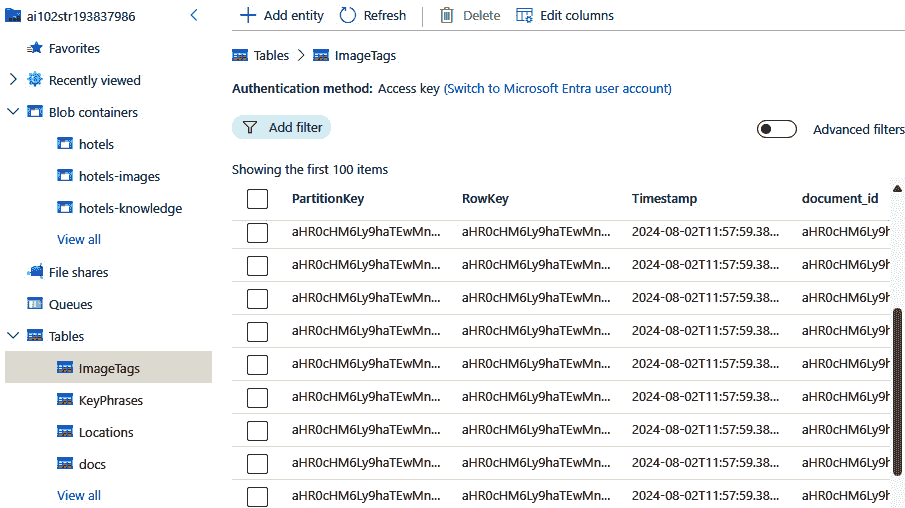

图 7.13 – Azure 存储账户中的表投影

创建表投影的能力允许您开发利用关系模式进行结构化查询的分析和报告解决方案。例如，您可以使用 Microsoft Power BI 高效地分析和可视化增强数据。此外，自动生成的键列简化了表连接，使查询如检索特定文档中引用的所有位置成为可能。

在下一节中，我们将深入探讨如何使用 Azure AI 文档智能服务从大量非结构化数据中提取有价值的见解。这个强大的工具利用 AI 将原始的非结构化数据转换为结构化、可操作的见解。

# 实施文档智能解决方案

**Azure AI 文档智能** 是一套基于云的 AI 服务，旨在自动化从文档中提取、分析和理解信息。利用先进的机器学习模型，它处理各种格式的文档，包括 PDF、图像和扫描文件，从非结构化内容中提取结构化数据。作为 Azure 更广泛 AI 服务提供的一部分，这项服务特别适用于处理大量文档，如发票、收据、表格和法律文件。通过管理数据收集和处理速度，Azure AI 文档智能有助于提高运营效率，实现数据驱动决策，并促进创新。

Azure AI 文档智能提供了几个增强文档处理和数据管理的优势：

+   它自动化从各种文档类型中提取关键文本和结构化元素，显著加快数据录入过程，并通过减少人工错误来提高准确性。

+   它支持广泛的预构建模型，针对特定文档类型定制，如发票、收据和身份证件，以及针对独特业务需求的定制模型。这种多功能性使其适用于各种行业和用例，包括合规性、审计和财务分析。

+   此外，它确保数据隐私、合规性和安全性，所有数据都在创建资源的同一区域进行处理，并在传输过程中加密。

通过利用这些功能，组织可以简化其工作流程，增强数据驱动策略，并丰富文档搜索功能，最终导致效率和生产力的提高。

## 文档智能功能

Azure AI 文档智能提供了从非结构化文档中提取、分析和理解结构化数据的功能。通过利用机器学习和自然语言处理技术，它使组织能够自动化文档处理，减少人工工作量并提高效率。

此服务包括几个关键组件，这些组件增强了数据提取和分析：

+   **分析模型（读取和布局）**：文档智能的基础建立在 OCR 之上，它能够从各种文档类型中检测和提取文本，包括打印和手写材料。*读取*模型专注于提取行和单词，而*布局*模型识别文本、表格、选择标记和文档格式等结构元素。这些模型协同工作以保留文档的逻辑结构，确保提取的内容在上下文中保持相关性。

+   **预置模型**：文档智能提供针对特定文档类型的几个预置模型：

    +   **预置读取**：检测行、单词和语言

    +   **预置布局**：提取文本、表格和文档结构

    +   **预置合同**：提取关键合同详情

    +   **预置健康保险卡**：从美国健康保险卡中提取数据

    +   **预置美国税表**：处理美国税表

    +   **预置发票**：提取销售发票详情

    +   **预置收据**：从收据中提取数据

    +   **预置身份证明**：从身份证、护照和社保卡中提取信息

    如需更多信息，请访问官方文档：[`learn.microsoft.com/en-us/azure/ai-services/document-intelligence/model-overview?view=doc-intel-4.0.0`](https://learn.microsoft.com/en-us/azure/ai-services/document-intelligence/model-overview?view=doc-intel-4.0.0).

+   **自定义模型**：对于不适合预置模型的文档，自定义模型通过允许组织训练 AI 以提取针对其业务需求定制的特定字段，提供了一种灵活的解决方案。与预置模型不同，自定义模型需要每个文档类型至少五个训练文档，使其能够学习独特的模式和结构。这种能力对于行业特定文档（如病历、法律合同和财务报告）特别有用，在这些文档中，预定义模板可能不足以满足需求。

+   **APIs 和 SDKs**：为了便于集成，文档智能提供了一套 API 和 SDK，允许开发者将文档处理功能集成到应用程序和工作流程中。REST API 允许以编程方式访问文档分析，而 SDKs 提供了 Python、C# 和 Java 版本，为各种开发环境提供了灵活性。这些集成选项允许组织在规模上自动化文档处理，提高不同业务操作的效率。

让我们从两种练习方法开始：一种使用门户 UI 界面，另一种利用 API 和 SDKs。

## 练习 3：文档智能工作室/Azure AI Foundry – UI 界面和无代码

本练习将指导您使用 Azure AI Foundry 界面而不是文档智能工作室。随着微软向 Azure AI Foundry 作为统一平台过渡，它正成为构建和管理 AI 解决方案的首选界面。按照以下步骤开始：

1.  **创建** **中心点**：

    1.  导航到 [AI.azure.com](http://AI.azure.com) 并选择 **探索 Azure AI 服务**，或直接访问 [`ai.azure.com/explore/aiservices`](https://ai.azure.com/explore/aiservices)，然后选择 **视觉 + 文档**。

    1.  在 **通用文档分析模型** 下选择 **布局**。

    1.  使用 Azure 登录并选择一个 Azure 订阅。

    1.  选择或创建一个新的中心点。提供名称、订阅、资源组和位置。

1.  **连接到 Azure** **AI 服务**：

    1.  如果您没有 Azure AI 服务，请点击 **连接到或创建 Azure AI 服务资源** 来创建一个。

    1.  创建了一个中心点和 Azure AI 服务后，请按照以下步骤操作：

        1.  在左侧导航中点击 **文档智能** 下的 **布局**，并选择一个样本文件。

重要提示

在 **文档智能** 下有几种预格式化选项可用。建议探索并使用每种格式的样本文件，以更好地了解它们的具体功能和用例。

1.  点击 **运行分析**，分析选项将出现。在左侧，您将看到一个样本文件列表。中间部分突出显示捕获的元素，显示在您悬停在文档上时可以提取的特定文本信息。在右侧，提取的文本以多个标签显示：**Markdown**、**文本**、**选择标记**、**表格** 和 **图像**。这些标签提供了不同的格式来查看提取的数据，根据您的分析需求提供灵活性。

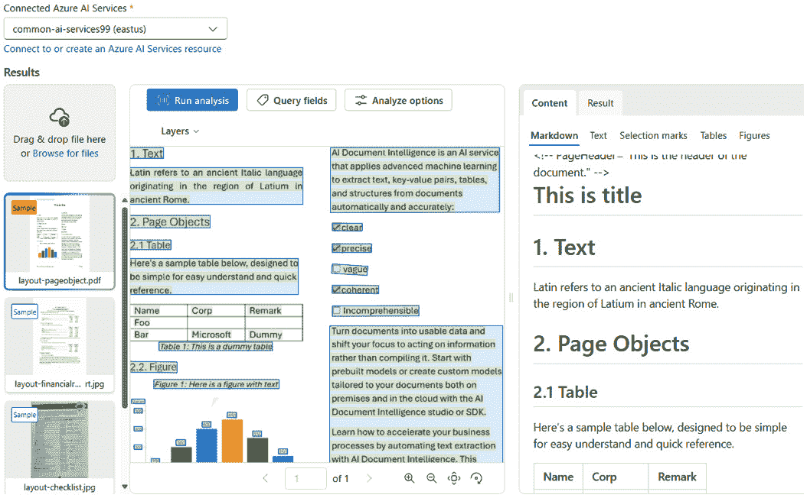

图 7.14 – 布局格式

**布局** 格式因其可以输出 Markdown 而被广泛使用，Markdown 格式因其层次结构而受到 **大型语言模型**（**LLMs**）的高度青睐，有助于更好地理解上下文。以下是选项的简要说明：

+   **运行分析范围**: 分析当前或所有文档

+   **页面范围**: 分析所有或特定页面

+   **输出格式样式**: 选择**文本**或**Markdown**

+   **可选检测**: 检测条形码、语言或键值对

+   **高级检测**: 提供高分辨率、样式字体和公式（收费服务）

现在，文档智能 API 和 SDK 提供了一种更程序化的方式来实现您期望的结果，提供了更大的灵活性和可扩展性。

在下一个练习中，我们将探索如何有效地使用这些工具来自动化文档分析和提取，让您能够轻松处理更复杂的任务。

## 练习 4：文档智能客户端库方法

重要提示

这不是旨在成为一个完整的动手练习。相反，这里的目的是提供一个概念概述，并分享一段示例代码片段，以帮助您了解如何在实践中使用 Azure AI 文档智能。您不需要逐行遵循每个步骤。

为了说明如何使用 Azure AI 文档智能来分析和提取结构化文档（如发票）中的常见字段，请考虑以下示例。Azure 提供了各种`预置发票`模型。

以下示例代码演示了如何设置一个 Python 脚本来从示例 PDF 文件中提取内容，例如**文本**、**表格**、**选择标记**和**文档布局**。关键步骤包括获取您的 Azure 端点和 API 密钥、安装所需的 Python 库，并将脚本指向目标文档。这个轻量级片段旨在让您了解这个过程是如何工作的，而不是作为全面实施指南。

如需进一步了解，您可以探索[`aka.ms/di-layout`](https://aka.ms/di-layout)上的**布局**模型和[`github.com/MicrosoftLearning/mslearn-ai-document-intelligence/tree/main`](https://github.com/MicrosoftLearning/mslearn-ai-document-intelligence/tree/main)上的示例代码示例：

```py
def get_words(page, line): ## Remove to save spaces
# To learn the detailed concept of "span" in the following codes, visit: https://aka.ms/spans
def _in_span(word, spans): ## Remove to save spaces.
def analyze_layout():
    from azure.core.credentials import AzureKeyCredential
    from azure.ai.documentintelligence import DocumentIntelligenceClient
    from azure.ai.documentintelligence.models import AnalyzeResult, AnalyzeDocumentRequest
    # Analyze a document at a URL:
    formUrl = "https://raw.githubusercontent.com/Azure-Samples/cognitive-services-REST-api-samples/master/curl/form-recognizer/sample-layout.pdf"
    poller = document_intelligence_client.begin_analyze_document(
        «prebuilt-layout»,
        AnalyzeDocumentRequest(url_source=formUrl)
    )
    result: AnalyzeResult = poller.result()
    # [START extract_layout]
    # Analyze pages.
    # To learn the detailed concept of "bounding polygon" in the following content, visit: https://aka.ms/bounding-region for page in result.pages:
    # Analyze tables.
    if result.tables:
        for table_idx, table in enumerate(result.tables):
    # Analyze figures.
    # To learn the detailed concept of "figures" in the following content, visit: https://aka.ms/figures
    if result.figures:
        for figures_idx,figures in enumerate(result.figures):
    # [END extract_layout]
```

到目前为止，我们已经探讨了如何使用 Azure AI 搜索和文档智能来处理非结构化内容，如文本文档和 PDF 文件。然而，企业数据并不仅限于文本——它通常包括扫描文档、图像、音频，甚至视频等多媒体内容。从这一广泛的内容中提取有意义的见解需要一个统一的、智能的管道，可以协调多个 AI 服务。这正是 Azure AI 内容理解的作用所在。

信息

*第十章*中的**文档智能**部分将提供更多示例，以供进一步探索。

# 理解 Azure AI 内容理解

随着组织处理越来越多样化、大规模的非结构化数据源（如 PDF、扫描图像、音频记录和视频）——从这些数据中提取有意义的见解变得至关重要。Azure AI 内容理解是一个统一的编排框架，通过结合多个 Azure AI 服务在单一基于管道的模型下的力量，简化了此类内容的处理、丰富和分析。

## 什么是 Azure AI 内容理解？

Azure AI 内容理解是一个平台，旨在帮助您使用模块化 AI 构建块从非结构化内容中提取和解释信息。这些构建块利用以下等服务：

+   **Azure AI 视觉** 用于 OCR 和图像分析

+   **文档智能（原名表单识别器）** 用于布局、键值和表格提取

+   **Azure AI 语言** 用于摘要、分类和实体识别

+   **Azure AI 语音** 用于音频转录

+   **Azure 视频索引器** 用于多媒体内容分析

使此服务独特的是其定义 **管道** 的能力——一系列 AI 操作，将原始内容转换为结构化、有意义的数据。它提供了一种可扩展的、低代码/无代码的方法来设计智能工作流程。

推荐

我们建议观看由该服务的微软产品经理提供的 Azure AI 内容理解概述视频：[`youtu.be/kYwq9HNVj1s?si=HeEXSOCThxGALmUB`](https://youtu.be/kYwq9HNVj1s?si=HeEXSOCThxGALmUB)。此视频对关键概念进行了清晰的介绍，并将帮助您更好地理解接下来的动手练习。

### 创建内容理解分析器

要开发内容理解解决方案，您首先创建一个分析器。分析器配置为根据您定义的架构从非结构化内容中提取特定的数据点。该过程遵循以下关键步骤：

1.  提供一个 Azure AI 服务资源以访问所需的认知能力。

1.  使用示例内容文件和分析器模板定义架构。此方案概述了应提取哪些信息。

1.  通过在定义的架构上训练来构建分析器。多亏了生成式 AI，在许多情况下只需要极少的训练示例。

1.  通过 REST API 提交内容，让分析器提取结构化数据。

微软提供了一系列预构建的分析器模板，以加速开发过程。在架构定义期间，系统通常可以自动识别并将示例内容中的数据点映射到架构元素。您还可以手动标记字段以提高准确性。

通过完成以下练习，您将了解这些内容。

## 练习 5：使用 Azure AI 内容理解分析内容

在这个动手练习中，您将使用 Azure AI Foundry 门户创建一个内容理解项目，从旅行保险保单表格中提取结构化数据。您将使用样本文档测试分析器，并通过 REST API 访问它。

### 步骤 1：创建内容理解项目

在此步骤中，您将通过设置核心环境来启动内容理解项目，您的内容分析将在该环境中进行：

1.  在您的网络浏览器中打开 [`ai.azure.com`](https://ai.azure.com)，并使用您的 Azure 账户登录。在 Azure AI Foundry 中，您可以在现有的 AI 中心内创建一个内容理解项目，或者在项目设置期间创建一个新的中心。创建中心还会配置必要的 Azure 资源，例如 AI 服务实例、存储和密钥保管库，以安全地存储凭证和密钥。

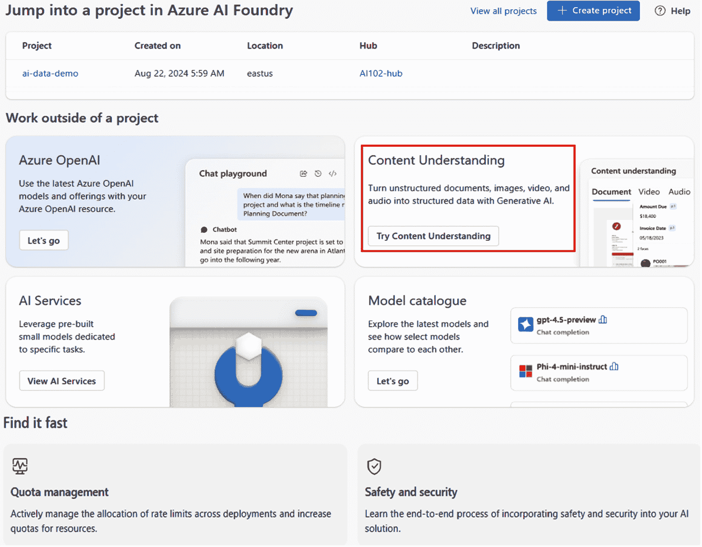

图 7.15 – 导航到内容理解的 Azure AI Foundry 主页面

1.  在主页上，通过滚动或导航到 [`ai.azure.com/explore/aiservices`](https://ai.azure.com/explore/aiservices) 选择 **探索 Azure AI 服务**。

1.  选择 **尝试** **内容理解**。

1.  点击 `ai102-content-understanding`

1.  `ai102-content-understanding testing for` `data extraction`

1.  **中心**：选择 **创建一个新的中心或使用现有的一个**

1.  在 `contentunderstanding-west`

1.  选择您的 Azure 订阅

1.  **资源组**：创建一个新的

1.  **位置**：任何可用区域

1.  **Azure AI 服务**：创建一个新的，并使用合适的名称

1.  在 **存储设置** 页面上，创建一个新的存储账户，然后点击 **下一步**。

1.  审查并点击 **创建项目**。一旦准备就绪，它将打开到 **定义** **架构** 页面。

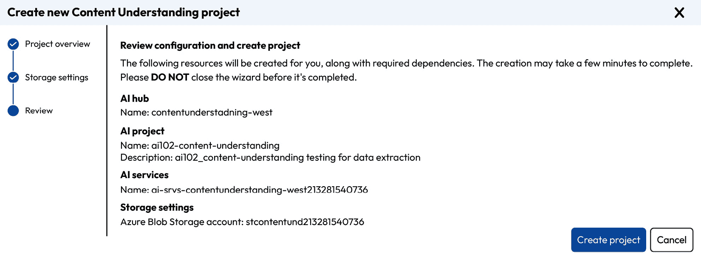

图 7.16 – 创建新的内容理解项目

创建项目后，会自动配置五个 Azure 资源：Azure AI 中心、Azure AI 项目、Azure AI 服务、存储账户和密钥保管库。

### 步骤 2：定义架构

接下来，您将定义架构以指定分析器从您的文档中提取的确切信息：

1.  在 `exercise8` 文件夹下找到训练样本：`train-form.pdf`。

1.  在项目中，将此表单上传到 **定义** **架构** 页面。

1.  选择 **文档分析** 模板，然后选择 **创建**。

1.  在架构编辑器中，选择 `PersonalDetails`

1.  `保单持有人信息`

1.  **值类型**：**表格**

1.  选择 **保存更改**。

1.  使用以下值配置新的子字段：

    +   `PolicyholderName`

    +   `保单持有人姓名`

    +   **值类型**：**字符串**

    +   **方法**：**提取**

1.  点击 **+ 添加新子字段** 按钮以添加以下子字段：

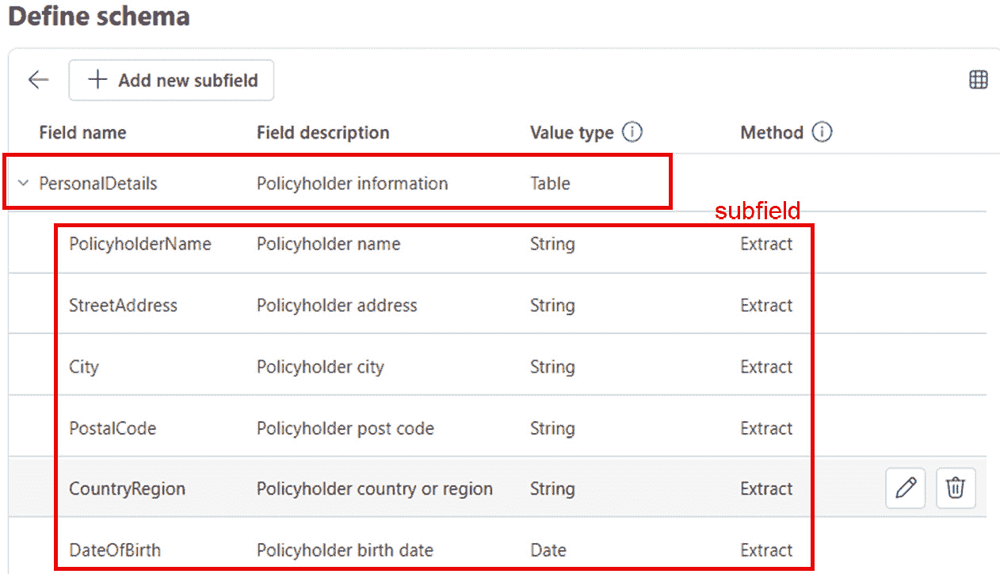

图 7.17 – 定义 PersonalDetails 架构

1.  添加所有 PersonalDetails 子字段后，点击**返回**按钮回到架构的顶层。

1.  添加一个名为`TripDetails`的新表字段，用于表示保险旅行的详细信息。然后，向其中添加以下子字段：

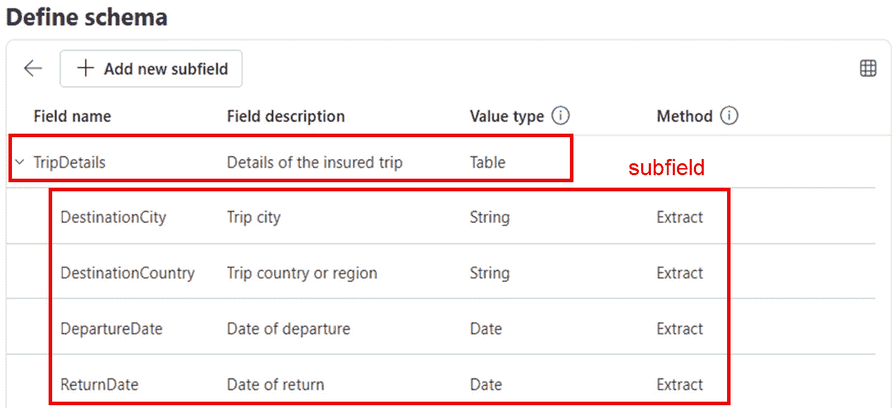

图 7.18 – 定义 TripDetails 架构

1.  返回架构的顶层，并添加以下两个单独的字段：`Signature`和`Date`。以下图显示了最终的输入字段集：

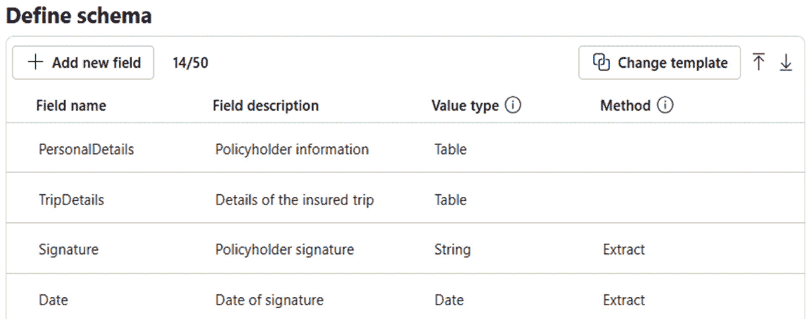

图 7.19 – 最终定义的架构

1.  保存架构。

### 第 3 步：测试分析器

一旦定义了架构，您将测试分析器以确保它正确地识别和提取样本文档中的目标字段：

1.  在**测试分析器**页面，如果分析没有自动开始，点击**运行分析**。一旦分析完成，检查表单上提取的文本值，并验证它们是否正确映射到您架构中定义的字段。

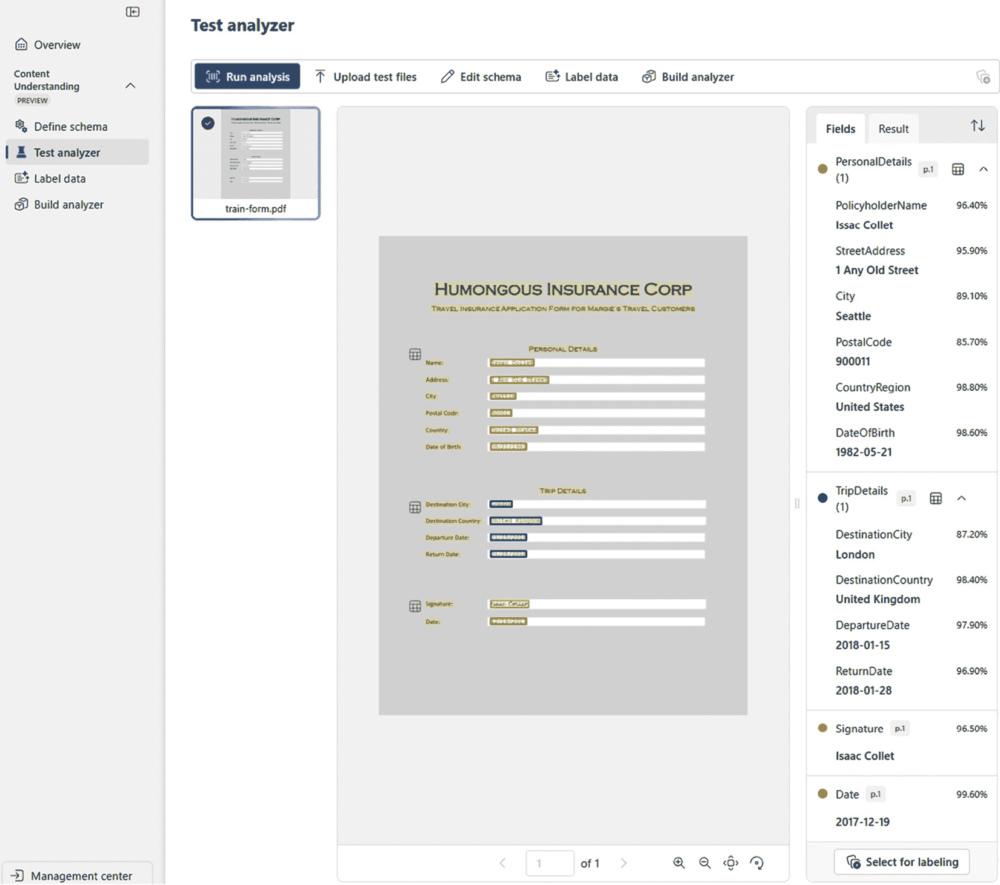

图 7.20 – 测试分析器

1.  内容理解服务应已正确识别与架构中字段对应的文本。如果没有这样做，您可以使用**标记数据**页面上传另一个样本表单，并明确标识每个字段的正确文本。

### 第 4 步：构建分析器

现在您已经训练了一个从保险表格中提取字段的模型，您可以构建一个分析器来处理类似的表格：

1.  在左侧的导航面板中，选择**构建分析器**。

1.  点击`travel-insurance-analyzer`

1.  `保险` `表格分析器`

+   点击**构建**按钮，等待新的分析器配置。使用**刷新**按钮检查其状态.*   从`exercise8`文件夹中找到`test-form.pdf`。将文件保存到本地文件夹中。*   返回**构建分析器**页面，并点击**travel-insurance-analyzer**链接。这将显示分析器架构中定义的字段。*   在**travel-insurance-analyzer**页面，选择**测试**选项卡。*   点击**+ 上传测试文件**，选择**test-form.pdf**，并运行分析以从表单中提取数据。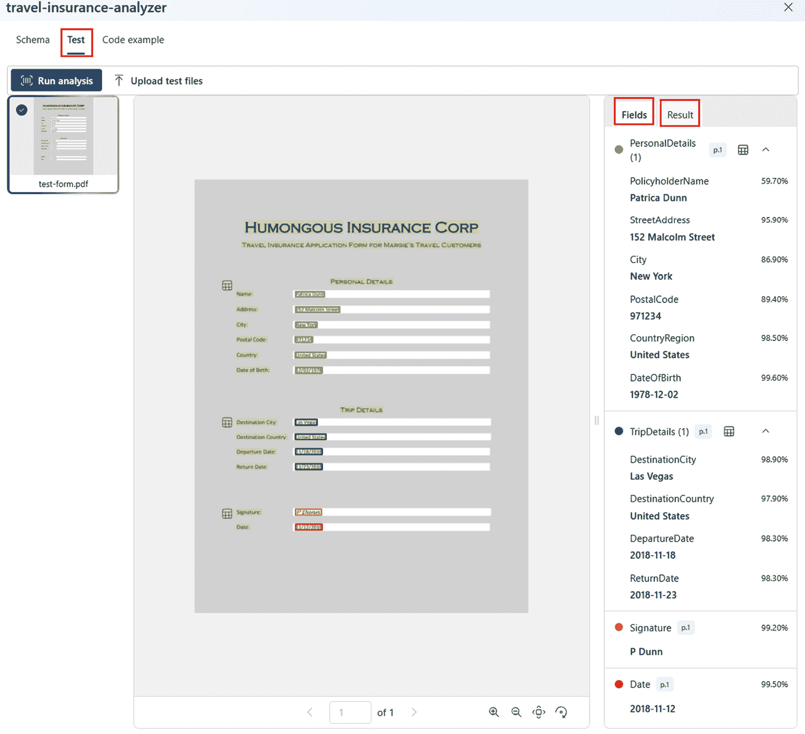

图 7.21 – 构建分析和提取的字段数据

1.  分析完成后，查看**结果**选项卡以查看以 JSON 格式提取的字段数据。

1.  在下一个任务中，您将使用内容理解 REST API 提交表单，并以相同的格式接收结果。

1.  完成后，关闭**travel-insurance-analyzer**页面。

### 第 5 步：使用 REST API

现在您已经创建了一个分析器，您可以使用内容理解 REST API 从客户端应用程序访问它：

1.  在浏览器中打开 Azure 门户：[`portal.azure.com`](https://portal.azure.com)。导航到创建内容理解中心资源组的位置，并打开 Azure AI 服务资源。

1.  在 **概览** 页面上，找到 **键和端点** 部分。切换到 **内容理解** 选项卡以查看您的端点和密钥。您需要两者来从客户端应用程序进行 API 调用进行身份验证。

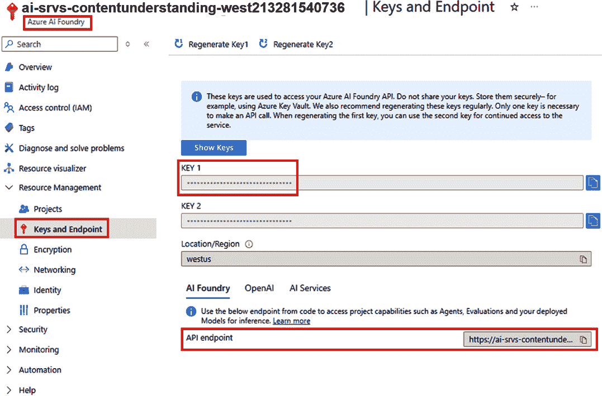

图 7.22 – 寻找键和端点

1.  打开并编辑 Python 文件。将 `.env-sample` 复制到 `exercise8` 文件夹下的 `.env` 文件，并执行以下操作：

    +   将 `<CONTENT_UNDERSTANDING_ENDPOINT>` 替换为您的实际端点

    +   将 `<CONTENT_UNDERSTANDING_KEY>` 替换为 Azure AI 服务资源中的密钥

1.  运行分析脚本：

    ```py
    python analyze_doc.py
    ```

    查看输出，其中包含文档分析的 JSON 格式结果。

1.  *可选*：如果输出内容过长不适合控制台，请将其重定向到文件：

    ```py
    python analyze_doc.py > output.txt
    ```

此过程允许您通过 REST API 直接从 Python 客户端调用您的训练好的分析器，并检查它如何从文档中提取结构化数据。

此服务非常适合构建智能摄取和分析工作流，将非结构化内容转化为可操作的见解。

通过掌握这项能力，您将能够为企业文档自动化、内容合规性、知识挖掘等更多方面设计可扩展的解决方案。

# 摘要

在本章中，我们探索了一系列强大的 Azure AI 服务——Azure AI Search、知识库、文档智能和新增的内容理解——每个都在构建智能内容处理管道中发挥着关键作用。

Azure AI Search 通过关键字和基于向量的搜索，实现快速和可扩展的信息检索。您学习了如何构建搜索索引，使用技能集应用人工智能丰富化，并使用索引器自动化数据摄取。作为补充，知识库充当二级存储系统，允许丰富数据在下游分析、报告或合规场景中使用。

我们接着探讨了文档智能，它自动从非结构化格式（如表格、发票和收据）中提取结构化信息。通过使用预构建或自定义模型，您可以显著减少手动数据输入并提高处理效率。

最后，我们介绍了 Azure AI 内容理解，这是一个基于管道的框架，统一了文档智能、Azure AI 视觉、语音、语言和视频索引器等服务，以分析丰富、多模态内容。这种编排模型使您能够创建智能分析器，在低代码/无代码环境中处理扫描文档、音频和视频。

这些服务共同构成了一整套工具包，用于从非结构化数据中解锁隐藏的见解，并构建跨行业扩展的 AI 驱动工作流。

在下一章中，我们将探讨生成式 AI 解决方案，深入了解大型语言模型如何进一步提升你的 AI 解决方案——从生成文本和总结文档到实现强大的基于代理的交互。

# 复习问题

回答以下问题以测试你对本章知识的掌握：

1.  Azure AI Search 中哪个组件负责自动从各种数据源提取、转换和加载数据到搜索索引？

    1.  索引器

    1.  技能集

    1.  同义词映射

    1.  分析器

    **正确答案**：A

1.  Azure AI Search 中的哪个功能允许你通过基于语义理解的重新排序来提高搜索相关性？

    1.  向量搜索

    1.  语义重新排序

    1.  自定义技能

    1.  索引器

    **正确答案**：B

1.  你正在创建一个包含名为 `modified_date` 字段的索引。你想要确保 `modified_date` 字段可以包含在搜索结果中。在索引定义中必须应用哪个属性到 `modified_date` 字段？

    1.  `可搜索`

    1.  `可筛选`

    1.  `可检索`

    1.  `可排序`

    **正确答案**：C

1.  你想要创建一个使用内置 AI 技能来确定每个索引文档所写语言的搜索解决方案，并通过一个表示语言的字段来丰富索引。你必须创建哪种 Azure AI Search 对象？

    1.  同义词映射

    1.  技能集

    1.  分数配置文件

    1.  索引器

    **正确答案**：B

1.  哪个 Azure AI 服务提供了一个低代码编排平台，使用基于模式的分析器从多模态内容中提取结构化数据？

    1.  Azure AI 视觉

    1.  Azure AI 文档智能

    1.  Azure AI 内容理解

    1.  Azure OpenAI

    **正确答案**：C

# 进一步阅读

要了解更多关于本章涵盖的主题，请查看以下资源：

+   在 [`learn.microsoft.com/en-us/azure/search/search-what-is-azure-search`](https://learn.microsoft.com/en-us/azure/search/search-what-is-azure-search) 了解 *什么是 Azure AI Search*

+   在 [`learn.microsoft.com/en-us/azure/search/search-what-is-an-index`](https://learn.microsoft.com/en-us/azure/search/search-what-is-an-index) 了解 *Azure AI Search 搜索索引*

+   在 [`learn.microsoft.com/en-us/training/modules/create-azure-cognitive-search-solution/4-indexing-process`](https://learn.microsoft.com/en-us/training/modules/create-azure-cognitive-search-solution/4-indexing-process) 了解 *索引过程*

+   在 [`learn.microsoft.com/en-us/azure/search/vector-store`](https://learn.microsoft.com/en-us/azure/search/vector-store) 了解 *Azure AI Search 向量存储*

+   在 [`learn.microsoft.com/en-us/azure/search/knowledge-store-concept-intro?tabs=portal`](https://learn.microsoft.com/en-us/azure/search/knowledge-store-concept-intro?tabs=portal) 的 *Azure AI Search 知识库*

+   在 [`learn.microsoft.com/en-us/azure/search/search-what-is-data-import`](https://learn.microsoft.com/en-us/azure/search/search-what-is-data-import) 了解 *Azure AI Search 数据导入*

+   *Azure AI 搜索中的索引器*，请参阅[`learn.microsoft.com/en-us/azure/search/search-indexer-overview`](https://learn.microsoft.com/en-us/azure/search/search-indexer-overview)

+   *索引过程中的额外处理技能（Azure AI 搜索）*，请参阅[`learn.microsoft.com/en-us/azure/search/cognitive-search-predefined-skills`](https://learn.microsoft.com/en-us/azure/search/cognitive-search-predefined-skills)

+   *在 Azure AI 搜索中进行查询*，请参阅[`learn.microsoft.com/en-us/azure/search/search-query-overview`](https://learn.microsoft.com/en-us/azure/search/search-query-overview)

+   *在 Azure AI 搜索中集成数据分块和嵌入*，请参阅[`learn.microsoft.com/en-us/azure/search/vector-search-integrated-vectorization`](https://learn.microsoft.com/en-us/azure/search/vector-search-integrated-vectorization)

+   *用 ChatGPT 革新您的企业数据：使用 Azure OpenAI 和认知搜索的下一代应用*，请参阅[`techcommunity.microsoft.com/t5/ai-azure-ai-services-blog/revolutionize-your-enterprise-data-with-chatgpt-next-gen-apps-w/ba-p/3762087`](https://techcommunity.microsoft.com/t5/ai-azure-ai-services-blog/revolutionize-your-enterprise-data-with-chatgpt-next-gen-apps-w/ba-p/3762087)

+   *Azure AI 搜索：通过混合检索和排名功能超越向量搜索*，请参阅[`techcommunity.microsoft.com/t5/ai-azure-ai-services-blog/azure-ai-search-outperforming-vector-search-with-hybrid/ba-p/3929167`](https://techcommunity.microsoft.com/t5/ai-azure-ai-services-blog/azure-ai-search-outperforming-vector-search-with-hybrid/ba-p/3929167)

+   *Azure 文档智能代码示例仓库*，请参阅[`github.com/Azure-Samples/document-intelligence-code-samples/tree/main`](https://github.com/Azure-Samples/document-intelligence-code-samples/tree/main)

+   *Azure AI 内容理解概述*，请参阅[`learn.microsoft.com/en-us/azure/ai-services/content-understanding/`](https://learn.microsoft.com/en-us/azure/ai-services/content-understanding/)
