# 8

# 专注于生成式 AI 解决方案

自从 2022 年 11 月 30 日发布 GPT-3.5 以来，生成式人工智能技术迅速发展，在内容创作、自动化和用户交互方面提供了前所未有的能力。随着企业需求的增长和基础模型方面的创新，微软推出了**Azure AI Foundry**——一个统一、生产就绪的平台，可加速 AI 解决方案的开发和部署。在本章中，我们将在此基础上构建，并探讨如何应用**Azure OpenAI**来创建生成文本、代码、图像等智能应用。

到本章结束时，您将具备如何提供 Azure OpenAI 资源、部署强大的生成模型以及将它们集成到端到端工作流程中的实际知识。我们将指导您使用 Azure OpenAI API 发送提示并接收有意义的响应，并展示 DALL-E 图像生成和由 GPT-4o 驱动的对话式 AI 等能力。

除了基本使用之外，本章还探讨了如何通过**提示工程**、**微调**和**检索增强生成**（**RAG**）等技术扩展模型功能。这些方法允许您针对特定任务定制 AI 行为，并安全地集成您组织的数据，从而解锁更精确、更可靠的输出。

到本章结束时，您将能够执行以下操作：

+   使用 Azure AI Foundry 提供中心节点和项目，并附加 AI 服务

+   提供 Azure OpenAI 资源并部署模型

+   利用 Azure OpenAI API 提交提示并接收定制响应

+   配置参数以优化生成式 AI 模型行为

+   应用提示工程技术以改进 AI 响应

+   使用 DALL-E 模型生成图像

+   将您的数据与 Azure OpenAI 模型集成以实现定制化解决方案

+   微调 Azure OpenAI 模型以更好地满足特定业务需求

让我们开始吧！

# Azure AI Foundry

Azure AI Foundry 作为一个综合平台，将 AI 基础设施、模型开发和应用程序构建整合在一个单一的企业级环境中。它结合了强大的后端系统与直观的界面，使组织能够自信地创建、部署和管理生成式 AI 应用。

该平台专为希望执行以下任务的开发者构建：

+   在安全、生产就绪的环境中设计和部署生成式 AI 解决方案

+   访问一系列先进的 AI 工具和机器学习模型，所有这些都与负责任的 AI 标准保持一致

+   在整个应用程序开发生命周期中与团队无缝协作

使用 Azure AI Foundry，您可以访问一个广泛的模型、服务和功能生态系统，让您将 AI 想法转化为生产就绪的解决方案。它支持从实验原型到完整企业部署的扩展，内置监控和优化工具确保持续的操作卓越。

当您首次导航到 Azure AI Foundry 门户时，您会注意到一切都是围绕**项目**组织的。项目作为有组织的容器，您在其中管理模型、提示、代理和数据集成。即使在创建您的第一个项目之前，您也可以探索广泛的可用模型和 AI 服务。一旦准备好开始构建，Azure AI Foundry 自然会引导您通过项目创建，解锁专为现实世界影响设计的 AI 能力的全部范围。

## Azure AI Foundry 概述

Azure AI Foundry 为大规模构建和管理生成式 AI 解决方案提供了一个结构化的基础。平台的核心是一个**中心节点与项目架构**，它允许组织集中治理，同时赋予团队灵活性和自主权：

+   **中心节点**: 这充当您 AI 生态系统的中央指挥中心。它包含基础模型、可重用模板、合规政策和配置标准。中心节点确保一致性，执行安全性，并促进组织内所有 AI 项目之间的重用。

+   **项目**: 这作为一个可定制的隔离工作空间，用于开发特定的 AI 应用。Azure AI Foundry 支持两种项目类型：**Foundry 项目**（用于个人开发或探索的独立项目）和**基于中心节点的项目**（从组织中心节点继承治理、政策和共享资产）。基于中心节点的项目非常适合以一致的治理扩展企业级 AI 解决方案，而 Foundry 项目则提供更多灵活性以进行实验。在任一项目类型中，团队都可以配置自己的提示、代理、编排流程和数据连接器，以满足业务需求。有关更多详细信息，请访问[`learn.microsoft.com/en-us/azure/ai-foundry/what-is-azure-ai-foundry#project-types`](https://learn.microsoft.com/en-us/azure/ai-foundry/what-is-azure-ai-foundry#project-types)。

+   **附加 AI 服务和模型**: 在一个项目中，开发者可以连接到 Azure AI 服务，例如 Azure OpenAI、Azure AI Search 或自定义 API。他们可以部署基础模型（如 GPT-4），集成 RAG 功能，并编排多个 AI 组件之间的交互以构建完整的端到端解决方案。

这种关注点的分离——在中心节点进行治理和在项目中构建解决方案——使企业能够有信心地扩展 AI 计划，确保操作控制同时支持敏捷、创新驱动的开发。

## 练习 1：在 Azure 门户中创建中心节点、项目和 AI 服务

在本练习中，您将探索**Azure AI Foundry 模型目录**，之后您将部署 Phi-3.5-mini-instruct 模型并使用自然语言查询评估其行为。这种动手经验将帮助您练习比较模型细节、部署模型以及在聊天游乐场中与之交互。

### 第 1 步：创建 Azure AI 中心和项目

在您的中心和服务项目就绪后，您现在可以部署并直接在 Azure AI Foundry 项目中与强大的 AI 模型交互：

1.  前往 [`ai.azure.com/`](https://ai.azure.com/) 在浏览器中打开 Azure AI Foundry 并登录。

1.  在主页上，点击**+ 创建项目**，选择**Azure AI Foundry 资源**作为推荐的项目类型，然后点击**下一步**继续。

1.  在创建向导中，执行以下操作：

    +   将项目名称输入为 `ai-data-demo`，如图所示：

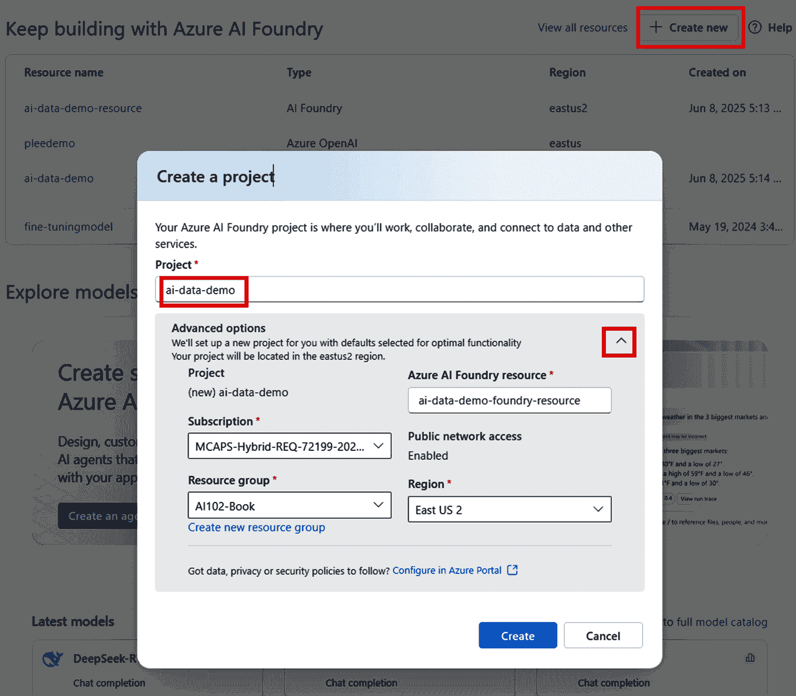

图 8.1 – 创建项目

+   如果尚未选择中心，请选择通过选择**高级选项**创建一个新的中心。

1.  点击**创建**以设置 Azure AI Foundry。

### 第 2 步：在 Azure AI Foundry 项目中部署 GPT-4o 模型

接下来，您需要部署 GPT-4o 模型，以便以后在您的 AI Foundry 项目中进行推理任务：

1.  在您的 Azure AI Foundry 项目中，导航到**我的** **资产**部分。

1.  点击**模型 + 端点**。

1.  点击**+ 部署模型**，然后选择**部署** **基础模型**。

1.  从可用模型列表中选择**GPT-4o**并点击**确认**。

1.  点击**自定义**，然后配置部署设置：

    +   **模型** **版本**：**2024-08-06**

    +   **每分钟令牌速率限制（****千）**：**200,000**

1.  点击**部署**并等待模型变得活跃。

### 第 3 步：设置您的本地开发环境

要在本地运行以下代码，您需要创建一个 Python 虚拟环境，安装依赖项，并配置环境变量：

1.  打开终端并导航到 `chapter-8/exercise1` 项目文件夹中的 `firstchat-with-AIFoundry.ipynb` 文件。

1.  如果您还没有这样做，请在工作区级别创建并激活一个虚拟环境：

    ```py
    python -m venv venv
    venv\Scripts\activate
    ```

1.  如果您还没有这样做，请在工作区级别安装所有必需的 Python 包：

    ```py
    pip install -r requirements.txt
    ```

1.  创建一个本地环境配置文件：

    ```py
    .env file by applying the following values:*   `.``env` file.*   `.``env` file.*   `.env` file with both the connection string and API key, make sure to save the file to ensure the environment variables are correctly set for your application:
    ```

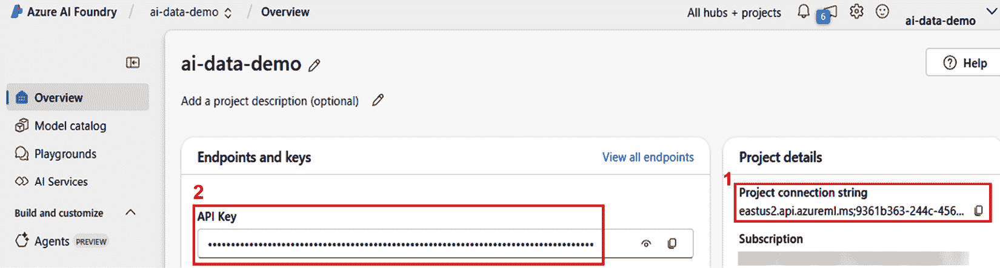

图 8.2 – Azure AI Foundry 的项目连接字符串和模型密钥

### 第 4 步：使用 AI 代理功能向部署的模型发送消息

在这一步中，您将使用 Azure AI Foundry 中的 AI 代理功能向部署的 GPT-4o 模型发送消息。该模型将以对话线程的一部分形式回应一个笑话。详细的说明和解释可在 `firstchat-with-AIFoundry.ipynb` 笔记本文件中找到，因此本节将重点介绍关键执行步骤。有关代理相关的概念和用例将在 *第九章* 中进行讨论。

1.  从环境变量中加载连接详情：

    ```py
    project_connection_string = os.getenv("AIPROJECT_CONNECTION_STRING")
    model = os.getenv("CHAT_MODEL")
    api_key = os.getenv("CHAT_MODEL_API_KEY")
    ```

1.  连接到您的 Azure AI Foundry 项目：

    ```py
    project = AIProjectClient.from_connection_string(
            conn_str=project_connection_string, credential=DefaultAzureCredential())
    ```

1.  创建一个 AI 代理来处理对话：

    ```py
    agent = project.agents.create_agent(
        model="gpt-4o",
        name=»Agent123»,
        instructions="You are helpful AI assistant. Answer the user's questions.")
    ```

1.  开始一个新的对话线程：

    ```py
    thread = project.agents.create_thread()
    ```

1.  向代理发送用户消息：

    ```py
    message = project.agents.create_message(
        thread_id=thread.id,
        role="user",
        content="Hey, can you tell a joke about teddy bear?")
    ```

1.  在线程中处理代理的响应：

    ```py
    run = project.agents.create_and_process_run(thread_id=thread.id, agent_id=agent.id)
    ```

1.  获取完整的对话历史：

    ```py
    messages = project.agents.list_messages(thread_id=thread.id)
    ```

您现在已使用 Azure AI Foundry 中的 AI 代理启动了一个完整的对话流程。查看消息列表以查看模型的响应。这种基础模式将作为更高级代理工作流程的基础。这些将在稍后讨论。

# 使用 Azure OpenAI 生成内容

在 *第一章* 中讨论的 Azure OpenAI 是一个托管平台，允许开发人员和数据科学家在微软 Azure 的安全可靠框架内利用先进的 AI 模型，如 GPT-4、GPT-3、Codex、DALL-E 3 和 Whisper。这项服务使自然语言、代码和图像生成能够无缝集成到各种应用中。通过与 OpenAI 合作，微软确保了向 Azure 托管基础设施的平稳过渡，使组织能够更有效地利用这些前沿的 AI 能力。

配置 Azure OpenAI 资源和部署模型是利用生成式 AI 力量的第一步。配置过程包括选择合适的订阅、区域和模型版本，这对于确保资源满足预期应用的具体要求至关重要。一旦配置完成，通过调整生成式 AI 模型中的温度和最大令牌等参数，可以显著提高输出的质量和相关性，通过控制随机性和响应长度。这可以通过游乐场门户或 API 来完成；两种方式都将进行演示。

让我们先来探索如何部署您的第一个 Azure OpenAI 模型。

## 练习 2：部署 Azure OpenAI

本练习将指导您选择部署模型并配置 Azure OpenAI 资源。

重要提示

Azure 持续改进其用户界面，现在有一个新的界面可用。虽然我会使用这个新界面来讨论步骤，但重要的是要关注底层概念和功能，因为用户界面将继续发展。如果您理解了这些概念，您将能够导航并适应任何未来的 UI 变化。

### 第 1 步：创建 Azure OpenAI 服务

在此初始步骤中，您将通过创建 Azure OpenAI 来探索 Azure 门户，这将使您更容易理解配置选项：

1.  您可以从 [`portal.azure.com`](https://portal.azure.com) 导航到创建资源并选择 **Azure OpenAI**，或者使用以下 URL 直接跳转到它：[`portal.azure.com/#create/Microsoft.CognitiveServicesOpenAI`](https://portal.azure.com/#create/Microsoft.CognitiveServicesOpenAI)。

1.  从 **订阅** 下拉菜单中选择您的订阅，如果有的话，从 **资源组** 下拉菜单中选择一个现有的资源组。或者，选择创建一个新的资源组。

1.  选择您的区域，输入所需的 **服务名称**，并选择定价层中的 **Standard S0**。您可以在 [`azure.microsoft.com/en-us/pricing/details/cognitive-services/openai-service/`](https://azure.microsoft.com/en-us/pricing/details/cognitive-services/openai-service/) 查看完整的定价详情。

1.  点击 **下一步** | **创建** 以创建 OpenAI 服务，并在部署完成后点击 **转到资源**。此时，将出现 **概览** 刀片窗口，如图下所示：

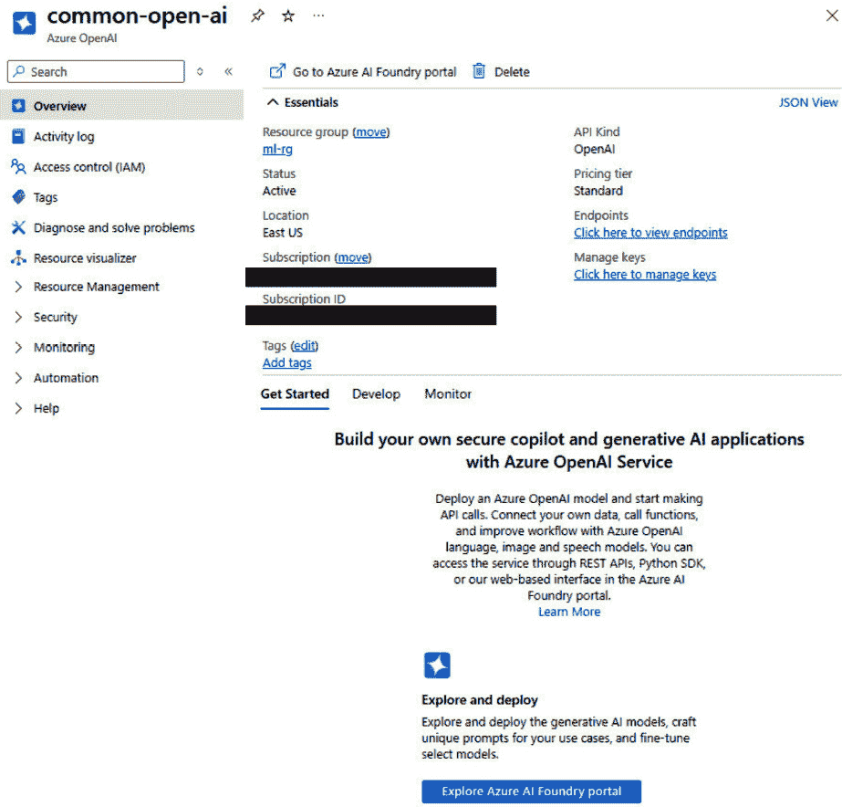

图 8.3 – 部署过程完成后 Azure OpenAI 概览窗口

现在设置完成，我们将继续选择适合您部署要求的模型。

Azure AI Foundry 和 Azure OpenAI 之间的关键区别

Azure AI Foundry 和 Azure OpenAI 都为您提供了访问强大的 OpenAI 模型，如 GPT-4o、GPT-3.5 和 DALL-E，但它们服务于不同的目的，并且以不同的方式使用。**Azure OpenAI** 是一个独立的 Azure 服务，提供对 OpenAI 模型的 API 访问——您可以从 Azure OpenAI Studio 部署和管理模型，并直接从您的应用程序中调用它们。相比之下，**Azure AI Foundry** 是一个解决方案开发平台，旨在帮助您使用基于项目的架构构建完整的 AI 驱动的应用程序和代理。在 Foundry 中，您可以附加 Azure AI 服务（包括 Azure OpenAI），管理模型，编排代理，集成 RAG 管道，并通过中心项目和项目实施治理。简而言之，**Azure OpenAI** 专注于模型访问，而 **Azure AI Foundry** 提供了一个更广泛的环境来构建、部署和管理完整的 AI 解决方案，OpenAI 模型可以作为您解决方案架构中的一个组件使用。

### 第 2 步：部署模型

如*第二章*所述，部署模型有两种不同的 UI：**转到 Azure OpenAI Studio**和**探索 Azure AI Studio**。为了满足考试要求，我们将演示在 Azure AI Foundry 中使用 Azure OpenAI Studio。概念和 UI 的外观和感觉是相同的；区别在于导航路径。

在窗口底部中间点击**探索 Azure AI Foundry 门户**（*图 8.3*），或者直接通过访问[`oai.azure.com/`](https://oai.azure.com/)跳转到门户。

您将找到 Azure OpenAI Studio 提供的功能概述，如图*图 8.4*所示：

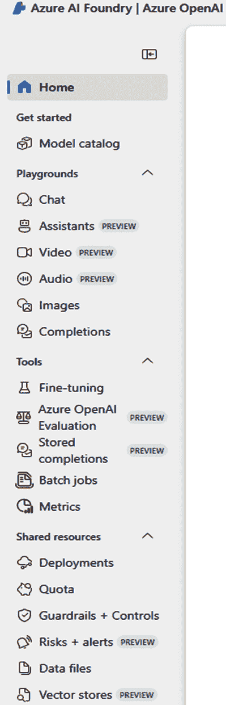

图 8.4 – Azure OpenAI Studio 菜单

让我们简要地浏览每个选项，从**入门**和**游乐场**部分开始：

+   **模型目录**：浏览 Azure AI Studio 中可用的预训练模型综合目录。您可以查看模型详情、功能、按区域可用性以及适用于各种用例的适用性，例如聊天、完成、图像生成和嵌入。

+   **聊天**：在交互式游乐场中实验基于聊天的语言模型。您可以配置提示、测试对话场景、调整参数（如温度和最大令牌数），并探索仅文本和多模态（图像和文本）交互。

+   **助手**（*预览*）：构建和管理*有状态的 AI 代理*，处理多轮对话、执行推理并与工具和数据交互。助手可以集成功能调用、文件搜索、代码执行和 API 编排，实现类似 Copilot 的高级体验。

+   **视频**（*预览*）：在支持的预览环境中实验基于视频的 AI 新功能。本节允许您测试模型，以便它们可以生成、分析或与视频内容交互（功能可用性因地区和订阅而异）。

+   **音频**（*预览*）：使用实时音频模型启用*语音到语音*和*语音到文本*场景。这对于构建语音助手、提供客服自动化和其他低延迟音频应用非常有用。

+   **图像**：部署和测试*图像生成模型*，如 DALL-E 3。使用图像游乐场从文本提示生成图像、自定义图像样式和大小，并访问代码示例以将图像生成集成到应用程序中。

+   **完成**：使用这个游乐场测试和调整文本完成模型（非聊天）。这对于总结、分类、提取和创意写作等单轮文本生成任务非常理想。

**工具**部分下的这些选项：

+   **微调**：使用您的特定领域数据微调支持的语言模型。上传训练和验证数据集，运行微调作业，监控结果，并部署针对您的业务需求优化的基础模型定制版本。

+   **Azure OpenAI 评估** (*预览*): 通过测试预定义的输入/输出对来评估**大型语言模型**（**LLMs**）的性能。这有助于衡量微调或基础模型的准确性、一致性、可靠性和性能。

+   **存储完成** (*预览*): 捕获并存储对话历史或完成输出以创建数据集。这些完成可用于评估、迭代测试或作为未来微调的训练数据。

+   **批量作业**: 通过 Azure OpenAI 批量 API 异步提交大量请求。这对于处理高容量场景，如文档摘要、大量内容生成和客户数据提取非常有用，同时优化成本和配额使用。

+   **指标**: 监控部署模型的详细指标，包括使用模式、性能统计信息和配额消耗。这对于容量规划、扩展决策和模型优化非常有用。

以下是在**共享资源**部分下的选项：

+   **部署**: 管理您的部署模型和端点。查看部署详情，配置设置如速率限制和内容过滤器，并访问 API 示例以将部署模型集成到生产应用程序中。

+   **配额**: 查看和管理资源配额，如**每分钟令牌数**（**TPM**）和区域内的部署。根据需要请求配额增加，以支持更大规模或更高吞吐量的应用程序。

+   **护栏 + 控制**: 配置内容过滤、安全设置和负责任的 AI 控制，以确保您的 AI 应用程序符合合规性和安全标准。

+   **风险 + 警报** (*预览*): 监控风险信号并配置 AI 模型使用的警报。这有助于主动检测有害内容、政策违规或意外的模型行为。

+   **数据文件**: 上传和管理支持 AI 模型定制的数据文件。这些文件可用于微调、提示工程、嵌入生成，甚至用作训练/评估数据集。

+   **向量存储** (*预览*): 创建和管理向量存储以启用语义搜索和 RAG 场景。向量存储自动解析、分块和嵌入内容，以实现快速、可扩展的语义检索，并与助手或聊天体验集成。

探索每个菜单选项将让您亲身体验 Azure OpenAI Studio 的功能，这将在您浏览本章其余主题时有所帮助。

在选择部署模型时，考虑几个因素至关重要，包括区域、配额和特定于部署的设置。这些因素可能会变化，因此在部署模型之前，请务必仔细检查：

+   **区域**：模型可用性可能因区域而异，因此请确保你想要部署的模型在你选择的位置可访问。此外，考虑性能和合规性因素，例如数据居住要求，这些因素可能会影响你的选择。有关更多详细信息，请访问 [`learn.microsoft.com/en-us/azure/ai-services/openai/concepts/models`](https://learn.microsoft.com/en-us/azure/ai-services/openai/concepts/models)。

+   **部署类型**：Azure OpenAI 提供灵活的部署选项，针对不同的商业需求和用法模式进行定制。主要的部署类型是 **标准** 和 **预配**。标准部署提供动态可伸缩性，支持通用用例，在 Azure 地理位置和微软数据区域之间提供灵活的数据处理位置。另一方面，预配部署针对需要一致、高容量性能和严格区域数据居住的工作负载进行了优化。此外，**全球标准**部署利用 Azure 的全球基础设施，提供更高的初始吞吐量和动态路由，而**全球批量**部署非常适合离线、非延迟敏感的工作负载，为大规模批量处理提供成本效益。

    在选择部署类型时，考虑两个关键因素：**数据处理位置**和**调用量**。你可以根据你的数据居住地和合规性需求，将工作负载与特定的 Azure 地理位置、微软指定的数据区域或全球处理选项相匹配。所有部署类型都支持相同的推理操作，但在计费、扩展和性能方面存在显著差异。例如，全球批量部署提供较低的成本和较长的周转时间，而标准部署和预配部署则提供实时评分能力，并具有不同级别的性能一致性。

    对于更多详细信息，请访问 [`learn.microsoft.com/en-us/azure/ai-services/openai/how-to/deployment-types`](https://learn.microsoft.com/en-us/azure/ai-services/openai/how-to/deployment-types)。

+   **配额**：配额决定了在特定区域中可以分配给模型部署的最大资源，例如 TPM。例如，你可能有一个配额，允许单个部署使用 240,000 TPM，或者多个部署共同达到这个限制。你可以在 Azure AI Studio 中调整部署后的 TPM 分配，这为你提供了根据需求管理资源的灵活性。有关更多详细信息，请访问 [`learn.microsoft.com/en-us/azure/ai-services/openai/quotas-limits`](https://learn.microsoft.com/en-us/azure/ai-services/openai/quotas-limits)。

带着这些信息，让我们开始这个过程：

1.  在 Azure OpenAI Studio 中，前往 **部署** 部分。从 **+ 部署模型** 下拉菜单中选择 **部署基础模型** 选项。

1.  从左侧显示的列表中选择一个模型。所选模型的详细信息将显示在界面右侧。

1.  在查看模型详情后，通过点击**确认**按钮确认您的选择。

1.  接下来，配置部署设置，如图下所示：

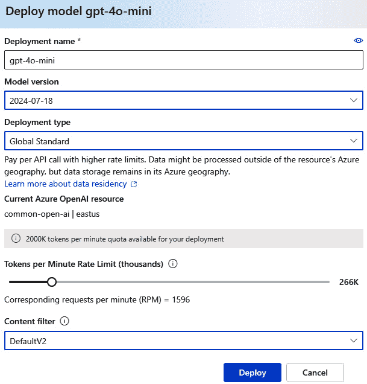

图 8.5 – 部署模型 gpt-4o-mini 窗口

让我们更仔细地看看细节：

+   **部署名称**：为您的部署输入一个唯一的名称。

+   **模型版本**：选择所需的模型版本。

+   **部署类型**：选择合适的部署类型（例如，**全局标准**、**标准**或**按需**）。

+   **每分钟令牌速率限制（千）**：使用滑块调整速率限制。向左或向右移动滑块以分别降低或提高 TPM 速率限制。

+   **内容过滤器**：选择所需的内容过滤器设置。请注意，您还可以从左侧的**内容过滤器**菜单中选择自定义内容过滤器——如果您已经创建了一个的话。

1.  一旦所有设置都已配置，点击**部署**按钮以完成部署过程。

部署后，将显示有关部署的详细信息。这包括端点、API 密钥、速率限制信息和特定模型详情。

一旦您选择了模型，下一步就是创建提示并观察生成的响应。

### 第 3 步：提交提示并接收响应（自然语言和代码）

为了演示如何使用 Azure OpenAI 提交提示并接收响应，我们将通过三个示例进行操作：一个用于生成一般消息，另一个用于代码生成，第三个用于图像分析。这个过程涉及向 AI 模型发送精心设计的输入（提示）并接收与提示指令一致的响应：

1.  前往**聊天**部分并选择您在上一任务中创建的部署模型。

1.  您可以修改默认的系统消息，使其包含关于其行为、个性和响应格式的说明。这些说明指导助手应该回答什么以及不应该回答什么。虽然本节没有令牌限制，但它将包含在每个 API 调用中，并计入总令牌限制。以下是我使用的几个提示示例：

    +   在聊天窗口中输入**用简单语言解释定期锻炼益处的简短段落**并点击发送：

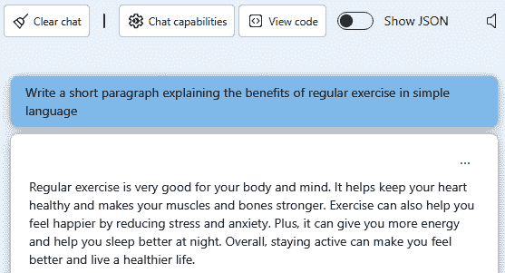

图 8.6 – 简短的一般提示

+   在聊天窗口中输入**编写一个 Python 函数，该函数接受一个数字列表并返回按升序排序的列表**并点击发送：

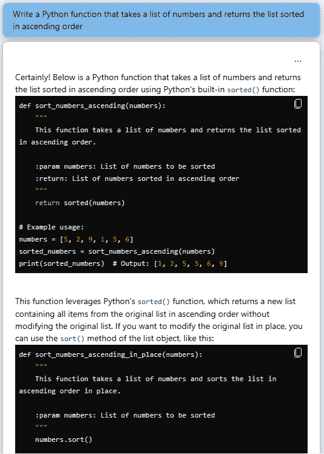

图 8.7 – 代码生成

+   上传一张图片并输入提示**你能描述这张图片吗**？系统将返回对图片的详细解释，如图*图 8.8*所示：

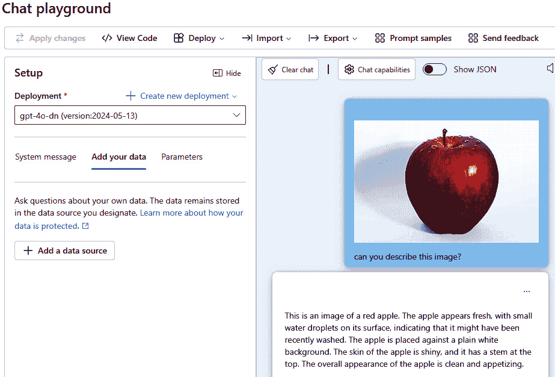

图 8.8 – 聊天游乐场中的图像聊天

聊天游乐场界面的菜单选项提供了各种功能来增强和管理你的工作。以下是每个选项的简要说明：

+   **查看代码**：此选项允许你查看驱动聊天或提示的底层代码。这有助于理解系统的工作方式，或用于调试目的。

+   **部署**：此选项允许你将聊天或提示设置部署为网络应用程序。这对于通过网络界面使你的工作对更广泛的受众可访问非常有用。

+   **导入**：这允许你将现有工作或数据带入到游乐场中。你可以导入提示、配置或其他相关文件以继续你的工作。

+   **导出**：这允许你保存或导出你的工作。通常你可以选择不同的格式来导出你的提示和响应。

+   **提示示例**：这为你提供了提示和响应的示例。它是理解如何构建你的交互的良好起点，也可以作为创建你自己的提示的灵感来源。

接下来，让我们谈谈如何通过调整参数来优化生成式 AI 模型，以产生满足特定需求的输出。

### 第 4 步：配置参数以优化生成式 AI 模型行为

通过参数如**包含历史消息**、**最大响应**、**温度**、**Top P**、**停止序列**、**频率惩罚**和**存在惩罚**来优化生成式 AI 模型的行为对于实现相关、连贯和多样化的输出至关重要。这些参数允许用户控制模型的上下文、长度、创造性和变化性，确保生成的内容与特定的需求和偏好相一致：

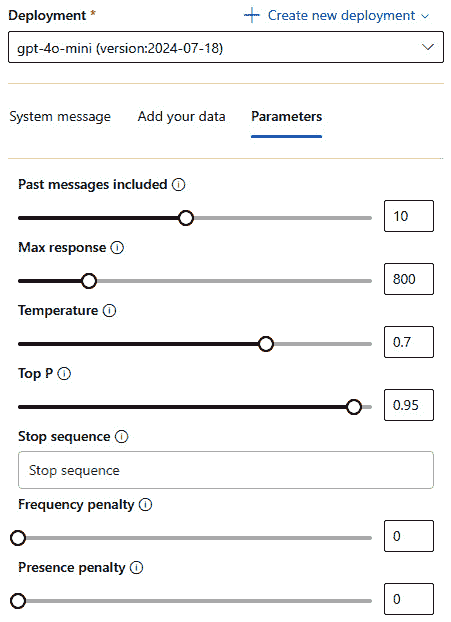

图 8.9 – 参数配置

让我们简要讨论这些字段：

+   **包含历史消息**：此参数控制生成响应时考虑多少个之前的交互。较高的数值可以提供上下文，导致更连贯和相关的回复。

+   **最大响应**：此设置确定生成响应的最大长度。较高的值允许更详细的答案，而较低的值则限制输出，使其更简洁。

+   `0.2`) 使输出更专注和确定，而较高的值（例如，`0.8`）则使其更随机和富有创意。`0.7`是一个适中的设置。

+   `0.9`意味着模型将仅考虑最可能的标记，这些标记共同占概率分布的 90%，从而在保持相关性的同时允许输出更加多样化。

+   **停止序列**：这定义了当生成时将停止进一步生成的特定文本序列。它有助于控制响应应在何处结束，确保它不会无必要地继续。

+   **频率惩罚**：此参数降低了模型重复相同标记或短语的可能性。较高的频率惩罚鼓励模型在其响应中使用更多样化的单词和短语。

+   **存在惩罚**：与频率惩罚类似，存在惩罚会阻止模型使用在对话中已经出现过的某些单词或短语。它通过惩罚先前提到的概念的重复使用来促进响应的多样性。

通过调整这些设置，用户可以增强模型生成高质量响应的能力，无论是用于创意任务、技术解释还是对话交互，最终提高用户在各种应用程序中的满意度和效率。我强烈建议您尝试这些参数，看看它们如何影响模型的输出，并为您的特定用例找到最佳配置。

### 第 5 步：利用 Azure OpenAI API

Azure OpenAI 为多种编程语言提供了广泛的支持，使其对广泛的开发者和应用程序既易于访问又灵活。受支持的主要编程语言包括 Python、C#、JavaScript 和 Java。这些语言中的每一种都可以与 Azure OpenAI API 交互，提交提示并接收生成的响应，使开发者能够高效地将 AI 功能集成到他们的应用程序中。

这是如何工作的。与 Azure OpenAI 的交互通常涉及以下步骤：

1.  如 *练习 1：在 Azure 门户中创建中心、项目和 AI 服务* 的 *步骤 1* 和 *步骤 2* 所概述，首先在 Azure 门户中配置 Azure OpenAI 资源并选择所需的 AI 模型。

1.  从 Azure 门户获取您的 API 密钥、Azure 端点和 API 版本以进行 API 认证。将这些值替换到您的代码中的环境变量，例如 `AZURE_OPENAI_API_KEY` 和 `AZURE_OPENAI_ENDPOINT`。为了提高安全性，考虑使用 Entra ID 或 Azure Key Vault 作为替代方案。以下有两个示例代码片段，以帮助您开始：

    ```py
    ####  API key method###
    import os
    from openai import AzureOpenAI
    client = AzureOpenAI(
        api_key=os.getenv("AZURE_OPENAI_API_KEY"),
        api_version="2024-07-01-preview",
        azure_endpoint=os.getenv("AZURE_OPENAI_ENDPOINT")
    )
    #### Microsoft Entra ID authentication ###
    from azure.identity import DefaultAzureCredential, get_bearer_token_provider
    from openai import AzureOpenAI
    token_provider = get_bearer_token_provider(
        DefaultAzureCredential(), "https://cognitiveservices.azure.com/.default"
    )
    api_version = "2024-07-01-preview"
    azure_endpoint = "https://my-resource.openai.azure.com"
    client = AzureOpenAI(
        api_version=api_version,
        azure_endpoint= azure_endpoint,
        azure_ad_token_provider=token_provider,
    )
    ```

    使用提供的 SDK 或 REST API 将 Azure OpenAI 集成到您的应用程序中。前面的示例展示了如何使用 Python 来完成这项操作。

1.  一旦发起 API 调用，就在您的应用程序中处理响应。响应通常包括生成的内容，可以是文本、代码或图像，具体取决于所使用的模型和提示。

现在，我们已经对如何利用 Azure OpenAI 和在 Azure 上部署 OpenAI 模型有了坚实的理解，让我们将重点转向更高级的技术，以进一步提高 AI 生成的响应的质量和相关性。

# 生成式 AI 的高级技术：DALL-E 3、RAG 模式、提示工程和微调

在对如何配置 Azure OpenAI、选择模型以及优化参数以获得最佳输出有基础理解之后，我们准备深入探索生成式 AI 的更高级技术。在本节中，我们将探讨 DALL-E 3 的图像生成、RAG 模式和提示工程原则。我们还将讨论微调模型以适应特定用例，确保获得更加精确和相关的结果。

## 练习 3：使用 DALL-E 3 生成图像

DALL-E 3 模型是 Azure OpenAI 的产品，是一个用于从文本描述生成图像的尖端 AI 模型。这种能力允许创意应用，例如根据用户输入设计视觉或自动化艺术和图形的创建。

DALL-E 3 的典型用例包括根据简单的文本提示生成营销视觉或概念艺术，使用户无需艺术技能也能创建引人注目的图像。DALL-E 3 的主要优势在于它能够从简单的描述中生成高质量、独特的图像。

让我们通过从刀片导航器中选择**图像**菜单来探索 DALL-E 3 游戏场，如图 8**.4** 所示。在这个工具中，您会看到您的提示的具体内容会显著影响生成的图像。例如，当描述狐狸时包含的细节会影响 AI 如何解释和生成图像。这个练习将帮助您理解提示精确性在获得期望的视觉输出中的重要性。如果您没有看到 DALL-E 3 模型列出，请导航到**模型 + 端点**部分并手动添加 DALL-E 3 模型。请参考图 8**.4** 了解如何访问模型部署屏幕：

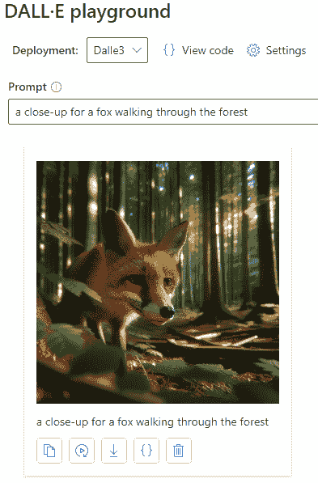

图 8.10 – DALL-E 游戏场

在 DALL-E 游戏场中，您可以选择查看基于当前设置的 Python 和 URL 代码示例，这些示例会自动填充。要访问此功能，只需在页面顶部选择**查看代码**。您可以使用提供的代码开发一个在您自己的环境中复制该任务的应用程序。

现在，让我们深入了解提示工程，学习如何构建精确且有效的输入以获得适当的输出。

## 练习 4：应用提示工程技术

提示工程是构建精确输入的过程，以引导生成式 AI 模型产生特定、期望的输出。这种方法允许在不改变其核心结构的情况下微调模型行为，使其灵活且易于实现。通过提供清晰的上下文和细节，它增强了生成内容的关联性和质量，尽管它可能无法总是达到完美的准确性，尤其是在复杂场景中。

这里有一些示例提示：

+   一般提示：

    +   **告诉我锻炼的好处**：

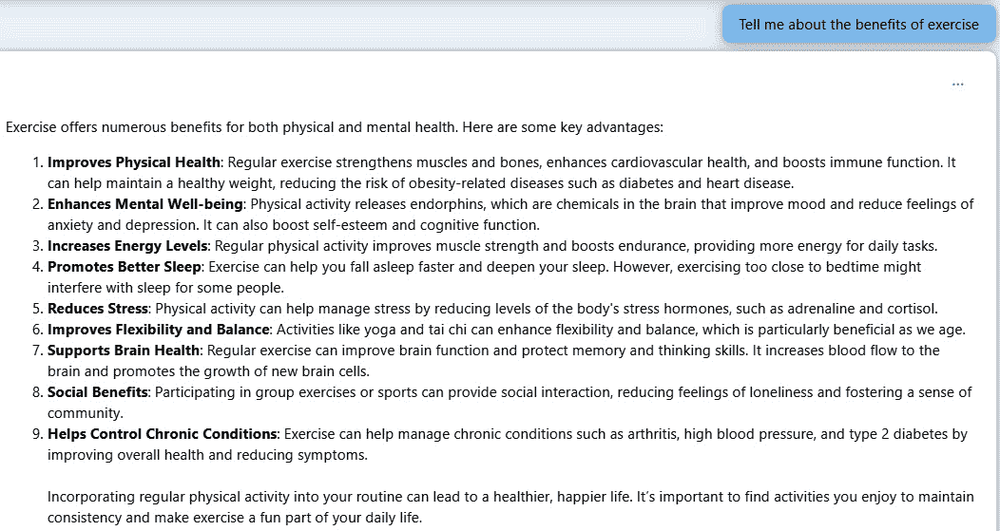

图 8.11 – 一般提示响应

+   特定的提示（带有提示工程）：

    +   **您能提供关于定期有氧运动的身体和心理健康益处的详细解释，包括运动实例及其对身体和心灵的具体影响吗** **？**：

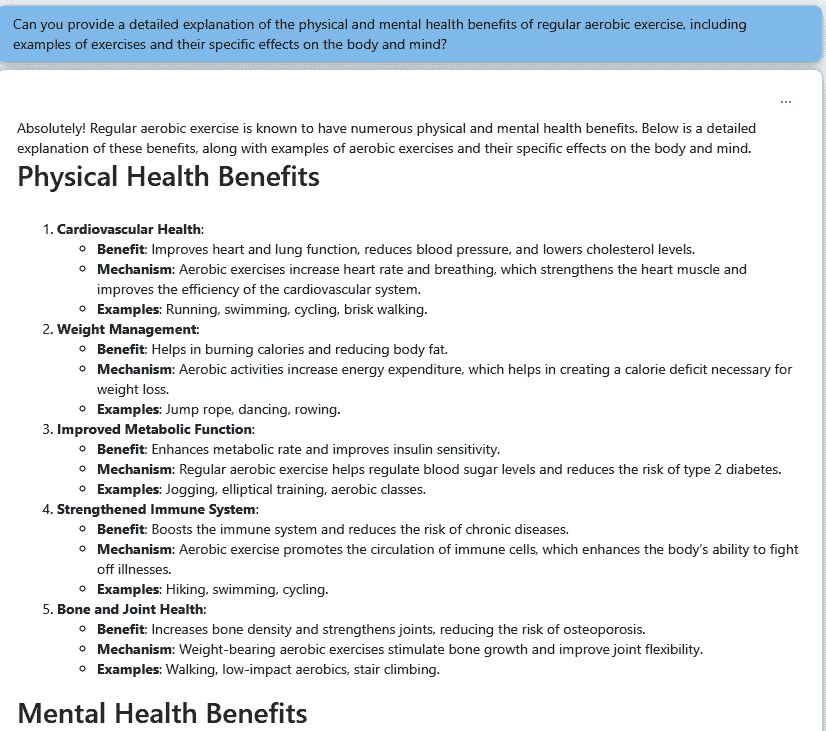

图 8.12 – 特定的提示响应

在这里，AI 模型通过将主题分解为如身体健康益处、心理健康益处和有氧运动实例等部分，提供了详细的响应。这展示了提示工程在引导模型生成全面和相关信息方面的力量。为了进一步探索这一点，您可以在游乐场中尝试两个提示，并观察模型对不同指令的反应，展示了精确提示如何导致更准确和丰富的输出。

## 练习 5：RAG 模式（使用您自己的数据）

RAG 模式结合了生成式 AI 模型和基于搜索的知识源，以产生上下文准确和相关的响应。虽然我们将在*第七章*中深入探讨这一点，但这次练习通过直接在游乐场中连接数据源进行测试，提供了一个快速尝试它的方法。

这种轻量级设置让您可以通过利用**Azure AI 搜索**来实验 RAG，预览检索到的文档如何使模型响应有据可依。这种模式在客户支持等场景中特别有用，在这些场景中，AI 需要使用实时或专有数据提供连贯、基于事实的答案。

请记住，虽然 RAG 提高了响应的准确性和相关性，但它也要求维护一个精心整理且最新的数据集，这可能涉及额外的设置和持续的努力。

在这次练习中，我们将介绍如何连接您的数据、配置检索并开始使用 RAG 模式生成有见地的、上下文相关的响应。

1.  访问[oai.azure.com](http://oai.azure.com)，并使用具有使用您的 Azure OpenAI 资源权限的账户登录。登录后，从可用选项中选择正确的租户、订阅和 OpenAI 实例。

1.  从聊天游乐场的导航刀片中选择**聊天**。

1.  从下拉菜单中选择您的部署，然后导航到**添加您的数据**选项卡。点击**+ 添加一个** **数据源**：

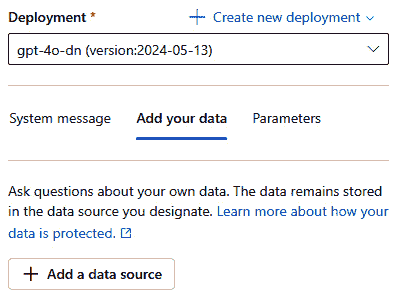

图 8.13 – 将数据添加到聊天游乐场

1.  在**添加数据**窗口中，您可以从各种数据源中进行选择，例如 Azure AI 搜索索引、Azure Blob 存储、Azure Cosmos DB、Elasticsearch、URL 或本地文件。选项持续增加。根据选择的数据源，以下屏幕可能有所不同。对于这次练习，我们将选择**Azure Blob 存储**，这意味着数据将被摄取、分块、索引和向量化到 AI 搜索中：

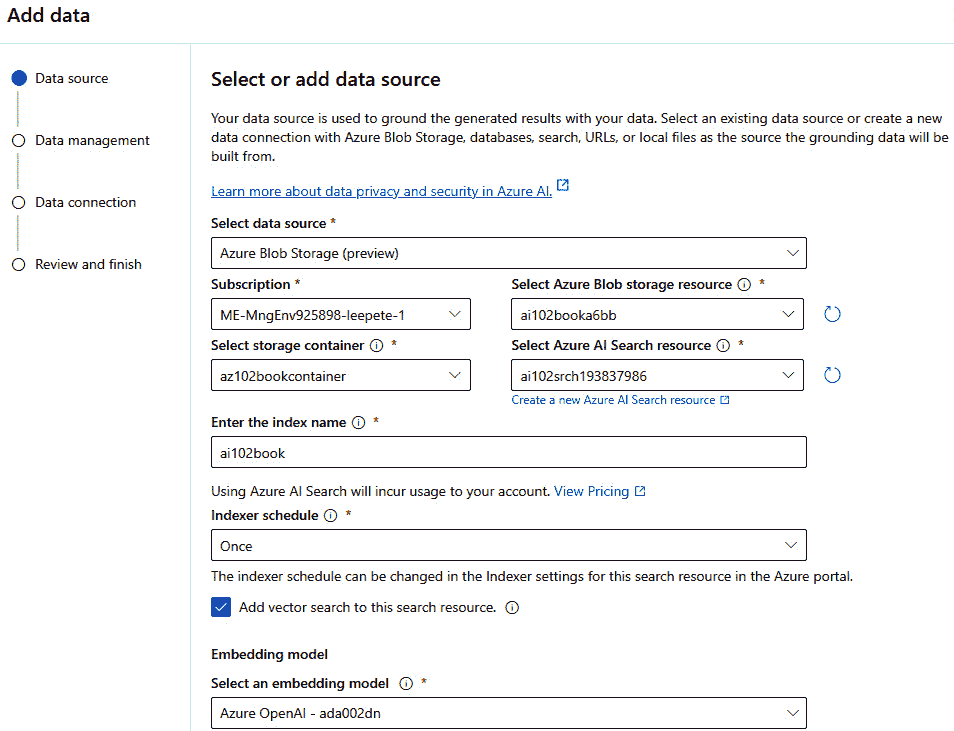

图 8.14 – 添加您自己的数据

让我们了解这些选项：

+   **订阅**：选择将用于数据源的 Azure 订阅。

+   **选择 Azure Blob 存储资源**和**选择存储容器**：如果选择，请指定数据文件将存储的 Blob 存储帐户和容器。

+   **选择 Azure AI 搜索资源**：如果您使用 Azure 认知搜索，请选择将索引数据的搜索资源。

+   **输入索引名称**：指定将创建或使用的搜索索引的名称。

+   **嵌入模型**：要将向量模型作为您数据的一部分使用，请选择一个嵌入模型。您需要有一个现有的嵌入模型才能开始。

1.  接下来，**数据管理**窗口允许您配置与您的数据索引和搜索相关的特定设置。您可以选择三种搜索类型之一：

    +   **向量**：向量搜索利用向量嵌入在多维空间中表示数据点。它根据数据点在此空间中的接近程度找到它们之间的相似性。

    +   **混合（向量 + 关键字）**：混合搜索结合了向量搜索和传统关键字搜索的优点。它利用两种方法的优势，以提供更准确和相关的搜索结果。

    +   **混合 + 语义**：此方法通过引入语义搜索功能来增强混合搜索。它不仅考虑关键字和向量相似性，还理解搜索查询的上下文和含义：

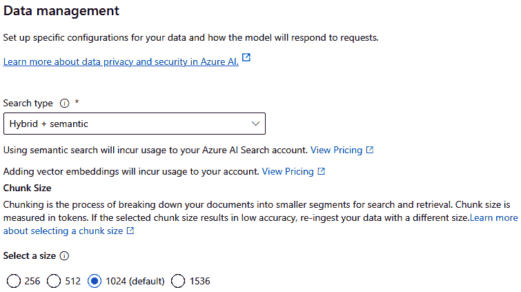

图 8.15 – 在数据管理窗口中选择搜索类型

1.  在**数据连接**窗口中选择**API 密钥**作为身份验证类型，并点击**下一步**。如果您选择**系统分配的托管标识**，请确保已正确设置角色分配。有关更多详细信息，请参阅[`learn.microsoft.com/en-us/azure/ai-services/openai/how-to/use-your-data-securely#role-assignments`](https://learn.microsoft.com/en-us/azure/ai-services/openai/how-to/use-your-data-securely#role-assignments)。

1.  查看设置并点击**保存并关闭**以从 Blob 存储开始数据摄取过程。

    系统将根据您定义的大小创建数据块，索引数据，并使其可搜索以支持搜索功能。一旦索引完成，您就可以在沙盒中直接与您的数据聊天：

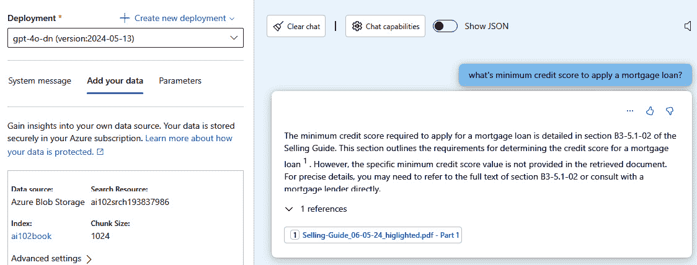

图 8.16 – 在沙盒中直接与您的数据聊天

在探索了增强 AI 提供相关和上下文准确响应能力的 RAG 模式后，下一步合乎逻辑的步骤是深入研究微调。微调允许我们通过在特定数据集上训练来进一步细化 AI 模型，以改善其在目标应用中的性能。

## 练习 6：使用自己的数据微调模型

微调涉及在特定领域或任务上重新训练一个通用 AI 模型，以增强其在该特定领域的性能。将其想象为对一个知识面广泛的人进行专注于某一特定领域的教育，例如医学或法律术语。例如，如果通用 AI 对所有事物都略知一二，微调就像通过医学文本训练它，使其成为医学诊断方面的专家。这个过程使模型在理解和响应特定任务方面变得更好，但可能会使其在更广泛的应用中不太灵活。微调可以提高特定任务的准确性，但可能需要更多资源和时间，可能会增加成本和过度拟合的风险。

### 微调的实际步骤

这里是步骤：

1.  **定义使用案例**：明确阐述微调的具体使用案例，并确定您想要微调的基本模型。确定您期望模型输出的具体结果或行为。

1.  **准备训练数据**：收集和准备微调所需的数据。这包括收集所需输出的示例，例如自然语言输入和相应的输出对（例如，数据库查询）。

1.  `training_set.jsonl`) 和一个验证文件（例如，`validation_set.jsonl`)。

1.  指定训练的 epoch 数。这代表训练数据集的完整遍历次数。

+   **启动微调作业**：配置参数后，启动微调作业。完成所需时间将根据模型大小和数据集而变化。*   **监控作业**：在**模型**面板中跟踪微调作业的状态，其中显示作业 ID 和训练进度等信息。定期刷新面板以查看更新。*   **评估微调模型**：作业完成后，评估模型性能以确保其满足定义的使用案例要求。验证模型是否有效地处理任务，而不会过度拟合或仅仅重复训练数据。

在实践中执行微调，请遵循以下步骤：

1.  在刀片菜单中导航到**微调**菜单，并选择**+ 微调模型**。然后您将看到**选择模型**窗口，如图 *图 8**.17* 所示。从这里，选择所需的模型并点击**确认**：

重要提示

确保您的 Azure OpenAI 资源已创建在可用区域。您可以通过访问 [`learn.microsoft.com/en-us/azure/ai-services/openai/concepts/models#fine-tuning-models`](https://learn.microsoft.com/en-us/azure/ai-services/openai/concepts/models#fine-tuning-models) 检查哪些微调模型在哪些区域可用。

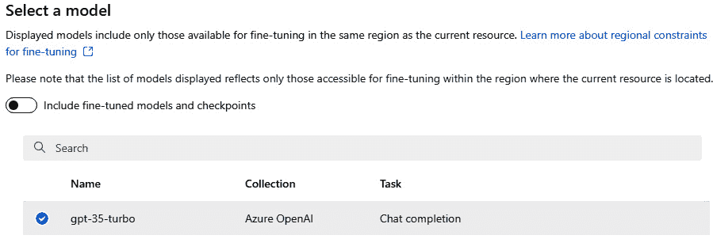

图 8.17 – 微调模型选择

1.  接下来，在**基本设置**选项卡中，您可以选择基本模型版本并输入模型后缀。然后，点击**下一步**。

1.  以`.jsonl`格式，并应遵循聊天完成结构：

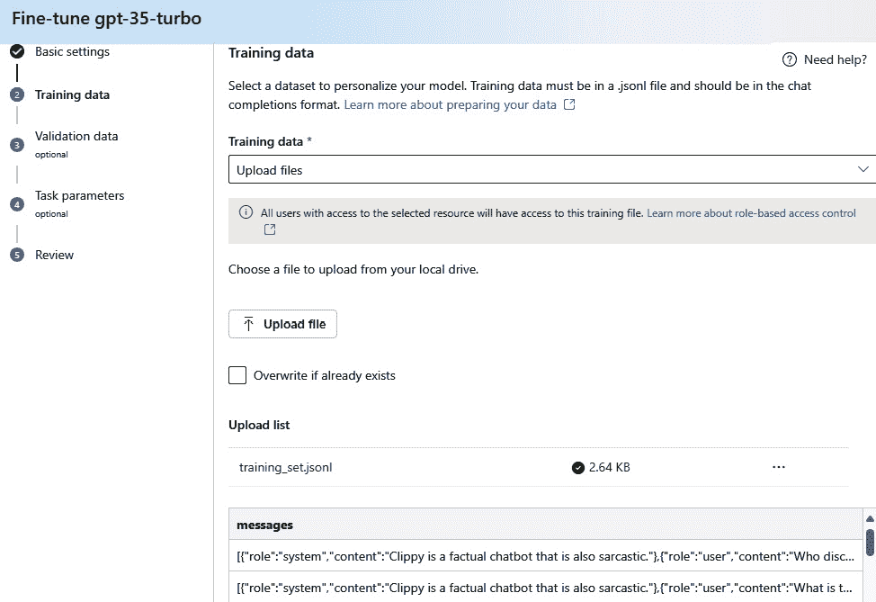

图 8.18 – 从本地机器上传的训练数据

1.  在**验证数据**选项卡中，按照以下步骤从您的本地机器上传验证数据：

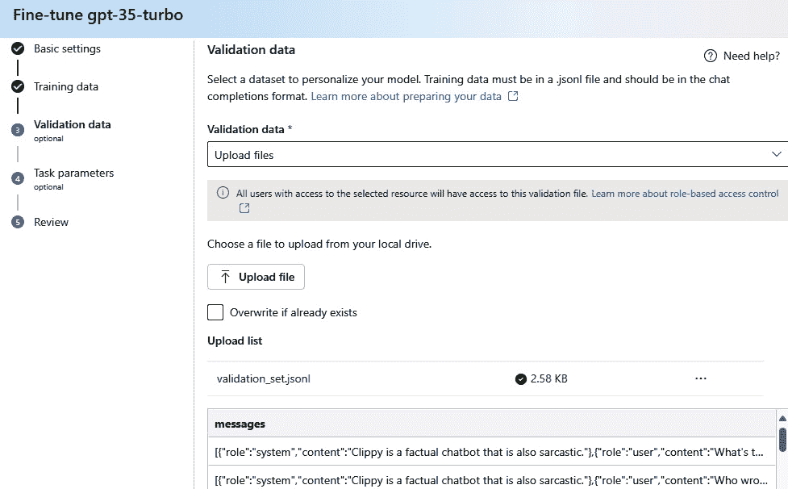

图 8.19 – 从本地机器上传验证数据

1.  选择适当的任务参数，但暂时保持默认选项。检查您的作业，然后点击**提交**。作业的状态将显示：

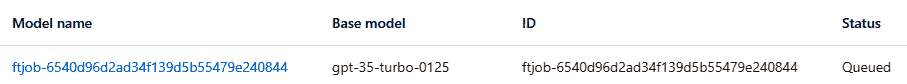

图 8.20 – 微调模型创建（状态变更：排队 > 运行 > 完成）

1.  一旦微调模型训练过程完成，从左侧面板的**聊天**选项卡中选择**从微调模型**，然后从**+ 创建新部署**下拉菜单中选择：

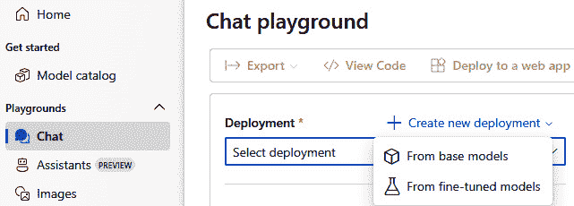

图 8.21 – 从微调模型中选择

1.  在上一步中创建的微调模型中选择，然后点击**部署**。

    您的屏幕将显示有关您的微调模型的全部详细信息，如下图所示。您可以通过点击**指标**选项卡来回顾训练过程：

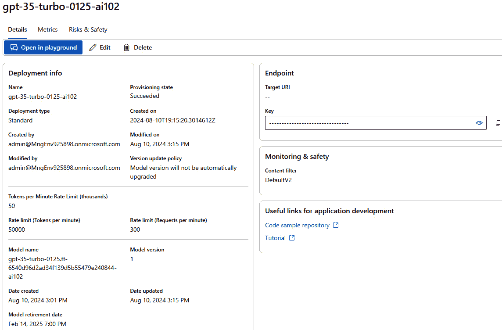

图 8.22 – 查看微调模型

1.  点击**在沙盒中打开**以开始与您的微调模型及其训练的具体查询进行交互。您将看到一个类似于以下屏幕的界面：

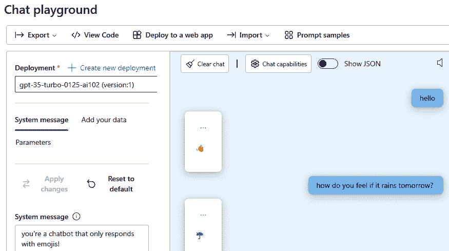

图 8.23 – 与您自己的微表情微调模型聊天

此微调模型已被训练为根据您的提示以表情符号进行响应。例如，如果您说`hello`，将出现一个挥手表情符号，如果您问“如果明天下雨你感觉如何？”，将显示一把雨伞表情符号。

# 摘要

在本章中，您学习了如何使用**Azure AI Foundry**和**Azure OpenAI**构建和管理生成式 AI 解决方案。我们首先介绍了 Azure AI Foundry——一个旨在简化企业级 AI 应用程序创建、部署和管理的统一平台。您了解了如何在 Foundry 环境中配置中心节点和项目，附加 AI 服务，并直接部署 GPT-4o 等模型。我们还演示了如何使用 AI 代理功能来编排对话流程。

在此基础上，我们介绍了如何使用 Azure OpenAI 部署模型、提交提示并配置关键参数，如温度和最大令牌数以优化模型行为。您获得了提示工程的实际经验，学习了如何使用 DALL-E 3 生成图像，并发现了如何使用 RAG 模式结合您自己的数据来定位生成模型。最后，我们介绍了微调技术，以针对特定领域任务定制模型。

通过掌握这些工具和技术，你现在已准备好在下一章中开发可扩展、安全且高度适应性的生成式 AI 解决方案，无论是在实验环境中还是在生产就绪环境中。

# 复习问题

回答以下问题以测试你对本章知识的了解：

1.  以下哪项最好地描述了 Azure AI Foundry 中中心的作用？

    1.  它作为部署前测试 AI 模型的临时工作区

    1.  它存储特定于项目的提示、代理和数据连接器

    1.  通过管理多个项目中的共享资源、策略和模板来集中治理

    1.  它为微调基础模型提供隔离的计算环境

    **正确** **答案**：C

1.  使用 SDK 发送提示消息并从 Azure OpenAI 获取响应需要哪些关键值？

    1.  `api_key`、`api_version` 和 `azure_endpoint`

    1.  `subscription_id`、`resource_group` 和 `api_version`

    1.  `client_id`、`client_secret` 和 `azure_endpoint`

    1.  `tenant_id`、`subscription_id` 和 `api_key`

    **正确** **答案**：A

1.  你应该采取哪些步骤来配置参数以优化生成式 AI 模型的行为，以便从 LLM 获得一致的响应？

    1.  使用不可信的数据源，启用对敏感资源的完全访问，并避免设置严格的参数

    1.  提供可信数据，配置自定义参数，例如“严格性”和“限制响应到数据内容”，并使用从可信来源检索的数据增强提示

    1.  禁用 LLM 交互的日志记录和监控，并允许无限制的输入长度和结构

    1.  将使用率限制降至最低，并在分发之前避免对输出进行人工审查

    **正确** **答案**：B

1.  以下哪项概述了根据用户数据生成准确答案时实施 RAG 模式的正确步骤？

    1.  在模型本身中存储所有可能的答案，直接将用户问题发送到模型，并依赖其预训练数据来生成响应

    1.  根据用户输入搜索数据存储，将用户问题与匹配结果结合，将组合的数据和问题作为提示发送到 LLM，然后生成所需的答案

    1.  使用模型生成响应，无需任何数据检索，定期用新数据更新模型，并确保响应仅基于更新的模型知识

    1.  随机检索数据，将其发送到 LLM 而不与用户输入结合，并依赖模型过滤掉无关信息

    **正确** **答案**：B

1.  以下哪项概述了在 RAG 模式中优化搜索过程的最佳方法？

    1.  使用随机排序的数据存储，避免索引，并仅依赖关键词搜索来检索数据

    1.  实现一个包含关键词搜索、语义搜索和向量搜索的索引，并确保索引已优化以实现高效检索

    1.  依赖于 LLM 的预训练知识，而不使用任何外部数据源或索引

    1.  使用不带语义或向量搜索功能的简单文本搜索算法

    **正确** **答案**：B

# 进一步阅读

要了解更多关于本章所涉及的主题，请查看以下资源：

+   *Azure OpenAI 支持的编程* *语言*：[`learn.microsoft.com/en-us/azure/ai-services/openai/supported-languages`](https://learn.microsoft.com/en-us/azure/ai-services/openai/supported-languages)

+   *快速入门：在 Azure AI Foundry 中使用 Azure OpenAI 聊天完成功能入门* *模型*：[`learn.microsoft.com/en-us/azure/ai-services/openai/chatgpt-quickstart?tabs=command-line%2Cpython-new&pivots=programming-language-studio`](https://learn.microsoft.com/en-us/azure/ai-services/openai/chatgpt-quickstart?tabs=command-line%2Cpython-new&pivots=programming-language-studio)

+   提示工程技术：[`learn.microsoft.com/en-us/azure/ai-services/openai/concepts/advanced-prompt-engineering?pivots=programming-language-chat-completions`](https://learn.microsoft.com/en-us/azure/ai-services/openai/concepts/advanced-prompt-engineering?pivots=programming-language-chat-completions)

+   何时使用 Azure OpenAI 微调：[`learn.microsoft.com/en-us/azure/ai-services/openai/concepts/fine-tuning-considerations`](https://learn.microsoft.com/en-us/azure/ai-services/openai/concepts/fine-tuning-considerations)

+   为 LLM 推荐的系统消息框架和模板：[`learn.microsoft.com/en-us/azure/ai-services/openai/concepts/system-message`](https://learn.microsoft.com/en-us/azure/ai-services/openai/concepts/system-message)

+   *在您的* *数据* *中使用 Azure OpenAI*：[`learn.microsoft.com/en-us/azure/ai-services/openai/concepts/use-your-data?tabs=ai-search%2Ccopilot`](https://learn.microsoft.com/en-us/azure/ai-services/openai/concepts/use-your-data?tabs=ai-search%2Ccopilot)

# 第三部分：代理式 AI 解决方案、应用实际案例和准备 AI-102 认证

*第三部分* 探讨了如何使用 Azure AI Agent 服务以及支持框架如语义内核和 AutoGen 设计和实现代理解决方案。它涵盖了从基础概念到高级多代理编排的所有内容。你还将通过动手项目和经过验证的技术模式参与实际的人工智能应用，包括构建自定义共飞行员、启用使用专有数据的基于安全的聊天检索，以及使用 RAG、文档智能和集成向量化的人工智能搜索自动化文档处理和摘要。最后，本部分为 *AI-102：Azure AI 工程师助理认证* 考试提供了全面的准备，包括考试策略、主题分解和全长度模拟测试，以帮助你评估你的准备情况并自信地成功。

本部分包含以下章节：

+   *第九章*，*使用 Azure AI Agent 服务实现代理解决方案*

+   *第十章*，*实际人工智能实施：行业用例、技术模式和动手项目*

+   *第十一章*，*准备 AI-102 Azure AI 工程师助理认证考试*
