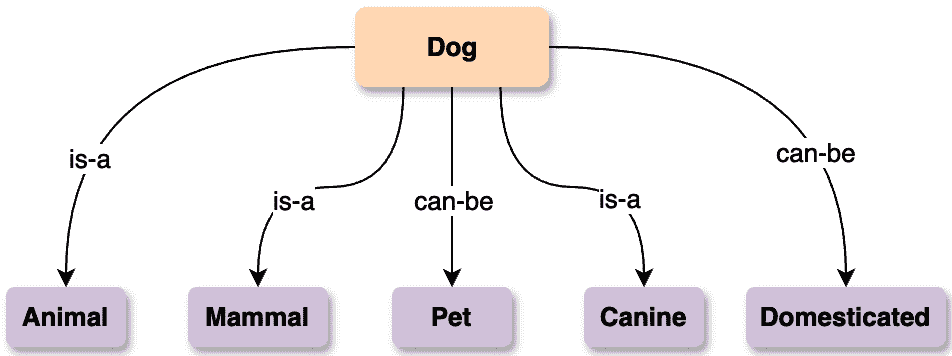
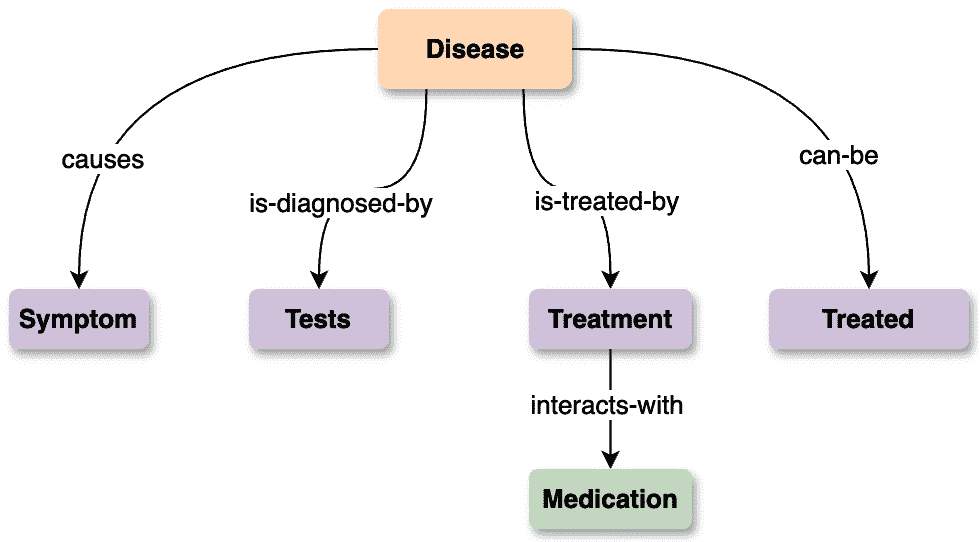
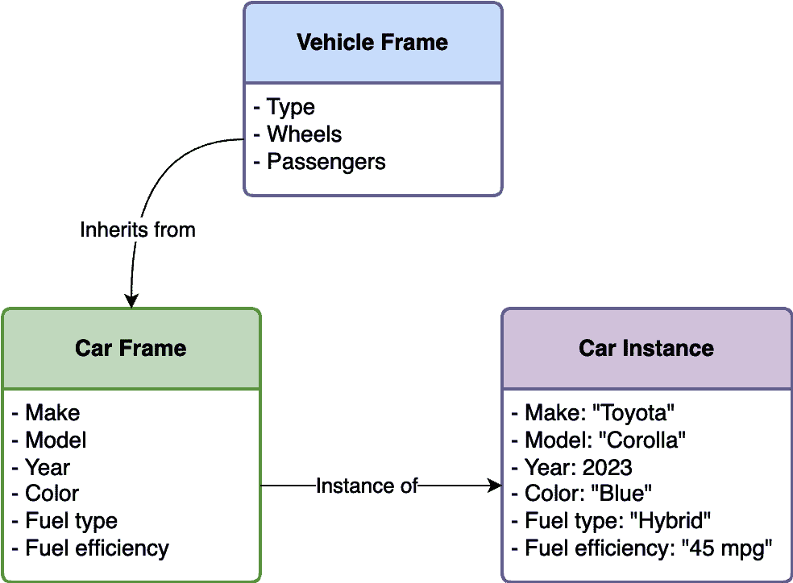
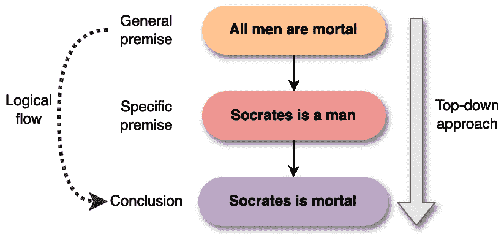
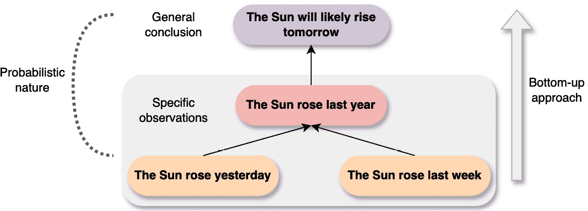

# 第三章：智能代理的基本组成部分

在本章中，我们将深入研究构成智能代理核心的基本组成部分。正如人体有骨骼提供结构和支撑一样，智能代理也有某些基本元素，使它们能够在复杂环境中适应、独立行动并追求目标。

我们将探讨使代理活跃起来的重要组成部分——它们如何表示和存储知识、指导其决策的推理过程、帮助它们学习和成长的算法，以及选择正确行动的机制。你还将看到激动人心的生成式 AI 领域如何为这些组件提供动力，赋予代理更强大的能力来理解其周围环境、从经验中学习，并与周围的世界进行有意义的互动。

在本章中，我们将涵盖以下主要主题：

+   智能代理中的知识表示

+   智能代理中的推理

+   适应性代理的学习机制

+   代理系统中的决策和规划

+   使用生成式 AI 增强代理能力

到本章结束时，你将了解智能代理中的知识表示方法、推理和学习机制、决策以及规划技术，同时还将探索一个由生成式 AI 增强的智能代理示例。

# 技术要求

你可以在 GitHub 上找到本章的代码文件，网址为[`github.com/PacktPublishing/Building-Agentic-AI-Systems`](https://github.com/PacktPublishing/Building-Agentic-AI-Systems)。

# 智能代理中的知识表示

存储和处理信息的能力对于任何智能代理都是基本的。知识表示提供了将代理对其环境的理解编码成适合推理和决策过程格式的机制。这是使智能代理能够构建其周围环境模型的最基本方式。

知识表示可以正式定义为一种结构化和组织数据的方法，使代理能够有效地利用该信息执行诸如推理、解决问题和确定行动方案等任务。有几种知识表示的既定方法，每种方法都有其自身的优势和理想应用，我们将在下一节中讨论。

## 语义网络

语义网络为在智能代理中表示知识提供了一种最直观和灵活的方法。在本质上，语义网络是由节点组成的基于图的结构，这些节点代表世界中的概念、实体、事件或状态。这些节点通过标签化的边连接，这些边明确定义了所表示概念之间的语义关系。

语义网络的简单性和表达性使其能够自然地捕捉我们复杂世界中存在的丰富、多样的关系和相互连接。例如，代表“*狗*”这一概念的一个节点可以通过一个“*is-a*”关系边连接到“*animal*”节点，表示狗是一种动物。同样的“*dog*”节点也可能通过其他类型的关系链接连接到“*mammal*”、“*domesticated*”、“*canine*”和“*pet*”节点：



图 3.1 – 表示“狗”关系的语义网络

与严格的逻辑或刚性的数据库模式不同，语义网络提供了一个灵活的知识表示，其中任何概念都可以通过适当的语义关系与任何其他概念相关联。这种灵活性使语义网络能够以直观的图形形式表示极其微妙的领域。作为一个现实世界的例子，一个医学语义网络可以用“*causes*”、“*is-diagnosed-by*”、“*interacts-with*”等关系类型来建模疾病、症状、治疗方法和解剖概念：



图 3.2 – 表示“疾病”关系的语义网络

语义网络的大部分力量来自于它们通过关系路径继承属性进行泛化的能力。如果网络指定狗是动物的一个子类，并且动物呼吸空气，那么智能体可以通过继承语义地推断出狗也通过继承呼吸空气。算法可以遍历图，将一系列关系链在一起，从表示的知识中推导出新的事实和结论。例如，在一个表示家庭关系的语义网络中，可以推断出一个人的配偶的父母也是他们的姻亲。

此外，语义网络自然地与其他符号推理技术集成。它们的基于图的架构很好地映射到演绎方法，如**一阶逻辑**，其中节点成为常量或谓词，边成为可以参与逻辑证明和推理规则的关联。一个智能辅导系统可以使用这种结合的表现力来基于逻辑的解释，并根据学生的语义知识图教授他们新的概念。

语义网络为智能体提供了一个强大且直观的机制，用于构建丰富、表达性的环境模型。它们内在的支持捕捉相互关联的概念，并通过关系组合和继承推导新知识的能力，使它们成为许多现实世界领域中极具强大的知识表示形式。

## 框架

框架知识表示范式为智能体提供了一个结构化的方式来建模概念及其相关属性。在这个形式主义中，关于对象、情况或事件的知识存储在称为**框架**的数据结构中。

每个框架都包含一组属性-值对，描述了所表示概念的性质和特征。例如，表示“*汽车*”概念的框架可能包含“*制造商*”、“*型号*”、“*年份*”、“*颜色*”、“*燃料类型*”等属性，以及为特定汽车实例提供具体值的对应值。

框架以层次结构组织，允许从高级、更一般的框架继承属性到其专门的子框架。例如，“*汽车*”框架可以从父框架“*车辆*”继承属性，同时添加汽车特有的新属性。这种层次分类法通过避免在相关概念之间重复属性定义，促进了高效的知识存储。

框架的一个关键优势是它们能够灵活地表示程序性知识与事实信息。除了简单的属性-值槽之外，框架还可以包含提供动态属性值或模拟与表示概念相关的操作的程序。例如，“*汽车*”框架可以包含计算燃油效率或查询服务记录的方法。以下图例通过我们的车辆示例说明了框架的概念：



图 3.3 – 表示“车辆”和“汽车”关系的框架

框架提供了一个直观的模型，反映了人类对世界知识的概念化方式。它们的层次性质与人们如何根据共享的属性和关系形成概念抽象和分类思想相一致。

在实际应用中，框架表示在以下领域得到广泛应用：

+   **自然语言处理**：语言框架模型从文本数据中提取的语义概念、角色和关系

+   **专家系统**：框架捕获领域专业知识以及基于知识的推理引擎的规则

+   **面向对象编程**：面向对象语言中的类本质上类似于框架结构，封装属性和方法

+   **计算机视觉**：目标检测系统使用框架层次结构根据形状、颜色、纹理等属性识别和描述视觉实体

+   **机器人技术**：框架使机器人能够表示对象/环境以及相关的动作、运动模型和约束

框架知识表示形式主义为智能体提供了一种高效、结构化和人兼容的方式来捕获适合基于知识推理和决策的丰富概念信息。

## 基于逻辑的表示

虽然语义网络和框架提供了直观的视觉方式来表示知识，但基于逻辑的方法采取了一种更正式、数学化的途径。基于逻辑的知识表示使用符号逻辑的机制来编码关于领域的知识、规则和公理。

在这个范例中，表示知识的陈述被翻译成形式逻辑语言（如 **命题逻辑**、**一阶逻辑** 或 **专门的模态/时态逻辑**）中的良好形成的公式。例如，参见以下内容：

+   “*所有人类都是凡人*”可以用一阶逻辑表示为 *∀* *x (Human(x) → Mortal(x))*。

+   “*要么下雨，要么晴天*”可以用命题逻辑表示为 *Rain* *∨* *Sunny*。

+   “*最终，系统将稳定*”可以用时态逻辑表示为 *◇* *Stable*。

在这里：

+   **∀** **x** : 全称量词，表示“*对于所有 x*”。

    **示例** : *∀* *x (Human(x) → Mortal(x))* . 翻译：*对于所有 x，如果 x 是人类，那么 x* *是凡人*。

+   **∨** : 逻辑析取，表示“*或*”。

    **示例** : *Rain* *∨* *Sunny* . 翻译：*要么下雨，要么晴天*。

+   **◇** : 时态逻辑中的钻石运算符，表示“*最终*”。

    **示例** : *◇* *Stable* . 翻译：*最终，系统* *将稳定*。

这些逻辑公式作为构建一个全面知识库的基石，使用具有明确定义的公理、推理规则和形式语义的严格逻辑演绎系统。然后，推理引擎可以通过应用逻辑推理规则，从现有知识中推导出新的事实和结论。

基于逻辑表示的关键优势是它们的正式严谨性和相关的强大理论属性。建立在逻辑基础上的系统可以提供关于正确性（仅推导出逻辑上有效的结论）和完备性（推导出所有可能的有效结论）的保证。这种数学基础使得逻辑在安全关键领域的知识表示中具有吸引力。基于逻辑的表示在许多现实世界应用中得到了广泛应用，例如这些：

+   **专家系统** : 基于规则的专家系统引擎本质上是在逻辑知识库上操作的定理证明器，该知识库编码了领域专业知识。

+   **数据库系统** : 关系数据库使用关系代数/演算——一阶逻辑的子集——作为数学基础。

+   **自动推理** : 从软件验证到机器人规划，逻辑为自动推理系统提供了表示基础。

+   **法律/监管领域** : 法律、政策和法规可以被精确地表示为便于形式分析的逻辑规则。

+   **语义网** : 描述逻辑，如 OWL（Web 本体语言），构成了本体和语义网的知识表示骨干。

虽然基于逻辑的表示不如语义网络或框架直观，但它们的数学严谨性和支持合理、自动推理的能力使它们在需要形式验证、一致性和完备性保证的应用中变得非常有价值。

在探讨了知识表示的基础结构之后，这些结构构成了代理知识库的基础，我们现在转向考察智能代理如何利用这些表示来执行推理任务、得出推论和解决复杂问题。

# 智能代理的推理

通过使用逻辑语言，智能代理可以构建强大的知识库，使复杂的查询、演绎推理和推理成为可能，而这些在表达性较差的表示形式中是不可能的。一旦智能代理有了强大的知识表示方法，推理机制就允许它智能地操纵和利用这些信息。推理能力使代理能够得出新的见解，得出逻辑结论，解释观察结果，并最终做出明智的决定以实现其目标。

智能代理的推理很少是一个单一、统一的过程。复杂的代理架构倾向于采用多方面的推理方法，结合不同的推理风格、数据驱动、分析和学习组件。例如，一个问答系统可以使用语义解析将问题映射到逻辑形式，在逻辑知识库上应用演绎推理，然后调用神经序列到序列模型以流畅地呈现最终答案。有几个基本的推理范例，即演绎推理、归纳推理和溯因推理。

## 演绎推理

**演绎推理**是一种基本的逻辑推理形式，遵循自上而下的方法。在演绎推理中，智能代理从关于一个领域的普遍前提或规则开始，并应用它们来推导出具体、逻辑上不可避免的结论。演绎推理的经典例子是以下流行的三段论：

*“所有人* *都是会死的。”*

*苏格拉底* *是一个人。”*

*因此，苏格拉底* *是会死的。”*

如果初始前提（“*所有人都是会死的*”和“*苏格拉底是一个人*”）是真实的，那么通过应用演绎逻辑的规则，结论“*苏格拉底是会死的*”不可避免地得出。只要原始前提和规则是正确和事实的，演绎推理提供了一种达到不可辩驳结论的方法。以下图示通过示例说明了演绎推理：



图 3.4 – 演绎推理 – 从一般前提到具体结论

演绎推理在许多领域都有应用，例如这些：

+   **数学/几何**：形式数学证明是演绎推理的典范，从一般公理和先前证明的陈述中推导出特定定理。

+   **法**：法律推理通过演绎将成文法和先例应用于特定案例，以推导出判断。

+   **软件验证**：形式验证技术通过逻辑规范使用演绎推理来证明硬件/软件系统的正确性属性。

+   **网络路由**：路由协议通过演绎应用关于网络拓扑、带宽等的规定/约束来确定最佳路径

演绎推理与其他推理形式（如推理或归纳）结合使用时特别强大。例如，一个医疗诊断系统可以执行以下操作：

+   **从症状中推断**可能的疾病假设（最佳解释推理）

+   **演绎**每个假设的预期发现，使用关于疾病模型的规定

+   **比较**演绎出的发现与实际患者数据以确认/拒绝假设

虽然演绎本身不能获得全新的知识，但对于智能体来说，逻辑地扩展其知识、确保一致性和实现理性决策是必不可少的。演绎推理提供了确保智能体结论可信性的严谨性。

## 归纳推理

与演绎推理自上而下的方法相反，归纳推理遵循自下而上的方法论。归纳推理涉及从一组特定的观察或数据点中做出概括或推导出可能的结论。以下是一个例子：

*“在过去的一百万天里，太阳每天都升起。”*

*因此，太阳明天很可能会再次升起。”*

基于太阳反复升起的实例，归纳推理过程允许智能体假设或推断太阳未来将继续升起。然而，与演绎不同，**归纳结论**并不在逻辑上保证为真 – 它们仅基于观察到的证据提出一个可能的*可能性*。以下图例说明了这一概念：



图 3.5 – 归纳推理 – 从具体观察到一般结论

归纳推理在以下需要数据驱动学习和理论形成的现实世界领域中具有巨大的应用性：

+   **科学方法**：制定科学定律/理论的过程在很大程度上依赖于从实验观察和数据中归纳概括

+   **机器学习**：机器学习算法本质上执行归纳推理，从训练数据中推断出可以对新实例进行预测的通用模型

+   **模式识别**：计算机视觉、信号处理和其他模式识别任务使用归纳技术根据检测到的统计规律对输入进行分类

+   **数据挖掘**：例如，关联规则挖掘等方法通过归纳识别大数据集中频繁出现的模式、相关性或关系

+   **自然语言习得**：儿童通过从他们收到的语言输入中进行归纳概括来学习语法规则和语言模型

虽然归纳推理很强大，但纯归纳推理有局限性，因为如果观察到的实例是一个不完美的样本，不能代表整个空间，结论可能会错误。因此，它通常与其他推理方法结合使用，例如推理（最佳解释推理）和演绎（验证假设）在智能体架构中。尽管不能保证真理，但归纳推理从具体数据中提取知识、识别模式和制定理论的能力，对于在嘈杂、不确定的环境中操作的智能体来说是不可或缺的，在这些环境中，知识在事先并不完全可用。

## 推理推理

推理推理是一种反向工作的推理形式 – 尝试找到最合理的解释或前提，这些解释或前提可以解释一组给定的观察或数据。它通常被描述为*最佳解释推理*。与从一般规则开始并得出保证的具体结论的演绎推理不同，推理是从观察到的效果或现象开始的，并根据现有知识假设最可能的基本原因。推理推理的一个例子是：

*“草坪* *是湿的。”*

*一个合理的解释：昨晚* *下雨了。”*

在这里，观察到的效果是湿草坪。推理推理允许智能体根据以往的经验合理地推断或推断出最可能的解释，即前一天晚上下雨了，尽管这并没有直接观察到。以下图示说明了这种反向推理的概念：


图 3.6 – 推理推理 – 最佳解释推理

推理推理在诊断领域和需要根本原因分析的领域中非常有用，例如这些：

+   **医学诊断**：给定一组症状，医生通过推理和调查最可能解释这些症状的疾病或状况

+   **故障检测**：制造中的监控系统使用推理来隔离最可能导致观察到的异常的故障或故障

+   **法医/犯罪调查**：从犯罪现场证据中，侦探通过推理可能的场景和嫌疑人档案来确定发生了什么

+   **AI 规划**：为了实现目标，智能体必须通过从目标反向推理来得出一系列可行的动作序列

+   **科学发现**：新的科学理论通常是通过寻找对目前未解释的观察或现象的解释性假设来最初推断的

推理性推理的一个关键优势是它能够生成新的可能的论据，而演绎或归纳方法不能仅从现有知识和数据中产生。它促进了跳出思维定式，探索新的可能解释。然而，推理性推理并不保证正确的解释——可能有多个与观察结果一致的假设。这就是为什么推理性推理通常与演绎推理结合使用，以验证形成的解释假设的一致性和可能性。

在这里需要记住的是，在代理系统中实现推理性推理具有挑战性，因为其计算复杂性较高，生成和评估多个假设可能需要大量资源。它还处理不确定性和不完整的数据，这使得确定最可能的解释变得困难。适当的知识表示至关重要但难以维护，评估假设通常需要主观标准。将推理性推理与其他推理模式相结合可能导致冲突，并且随着领域的扩大，可扩展性成为一个问题。此外，处理动态环境和确保用户可解释性可能会使过程更加复杂。然而，通过应用推理性推理，智能代理可以表现出更深入的理解，在提出试探性解释方面的创造力，以及在不完全可观测和信息的动态环境中有效运作的能力。通过稳健的知识表示形式和多方面的推理能力，智能代理获得了构建其环境丰富模型、获得洞察力、解释观察结果，并最终就如何与世界互动做出明智决策的能力。这些能力构成了更高级代理功能的基础。

# 适应性代理的学习机制

学习机制对于使智能代理能够适应其环境的变化或随着时间的推移而改进至关重要。学习的能力使代理能够根据新的经验和数据不断改进其知识和行为。有无数的学习方法，每种方法都有其自身的优势和用途：

+   **监督学习**：这种学习范式涉及在数据集上训练代理，其中输入与相应的标记输出或目标值配对。目标是使代理学习一个映射函数，该函数能够准确预测新未见输入的输出。监督学习在诸如这些领域的分类和回归任务中得到广泛应用：

    +   图像分类（例如，在图像中识别对象和数字）

    +   垃圾邮件检测（将电子邮件分类为垃圾邮件或非垃圾邮件）

    +   机器翻译（学习将一种语言中的文本映射到另一种语言）

    +   医疗诊断（将患者症状/测试映射到疾病标签）

+   **无监督学习**：在这里，代理在未标记的数据上训练，没有任何相关的目标输出。目标是以一种无监督的方式发现数据本身中的固有模式、相关性或分组。关键应用包括以下内容：

    +   客户细分（根据购买行为对客户进行分组）

    +   异常检测（识别与规范不同的异常数据点）

    +   主题建模（从文档集合中提取主题/主题）

    +   维度约简（寻找高维数据的低维表示）

+   **强化学习**：这种学习方法受到人类和动物学习方式的启发——通过使用环境中的奖励或惩罚形式的反馈进行试错。强化学习代理通过尝试不同的动作并根据观察到的奖励更新其策略来学习最优行为/策略。强化学习在以下领域取得了巨大成功：

    +   游戏玩法（学习掌握象棋、围棋和电子游戏等游戏）

    +   机器人技术（学习控制策略以实现机器人导航和操作）

    +   供应链优化（寻找最大化效率的策略）

    +   交通信号控制（学习时间策略以改善交通流量）

+   **迁移学习**：这项技术专注于将一个设置中学习到的知识转移到促进不同但相关的设置中的学习。通过利用先前学习到的模式和表示，迁移学习可以显著加快新任务的训练速度和样本效率。应用范围包括以下领域：

    +   自然语言处理（在不同领域之间转移语言模型）

    +   计算机视觉（使用预训练模型作为新视觉任务的初始化）

    +   推荐系统（在不同平台上转移用户/产品嵌入）

这些学习机制，通常以混合组合的方式使用，使智能代理能够持续扩展其知识，细化其行为，并增强其解决问题的能力——这是智能的关键特征。随着学习算法的进步，面对新的挑战时，代理将变得更加适应和稳健。

在探索了使自适应代理能够获取知识和技能的学习机制之后，我们现在转向关注这些代理如何利用这种学习在复杂环境中做出决策和规划其行动。

# 代理系统中的决策和规划

决策和规划是智能代理在复杂环境中有效实现其目标的关键能力。代理需要分析各种可能的场景，评估结果，并根据他们的偏好和约束选择将导致最理想结果的行为（或行为组合）。尽管效用函数（工具）和规划将在后续章节中详细讨论，但我们将以下节中在较高层次上讨论智能代理决策中涉及的关键组件。

## 效用函数

效用函数通过将结果映射到效用值来量化代理的偏好，使代理能够比较和选择最大化预期效用的行为。效用函数在智能代理的决策中扮演着核心角色，因为它提供了一种定量方式来表示和推理关于不同结果或世界状态的偏好。

一个效用函数将任何给定的状态或结果映射到一个实数效用值，反映了根据代理的目标、奖励和惩罚，对该状态的期望或偏好的程度。形式上，这可以用数学表达式表示为：

这个表达式一开始可能看起来有点令人畏惧，但概念实际上非常简单。让我们使用一些示例 Python 代码来进一步解释：

```py
1 def travel_utility_function(travel_option):
2    price_utility = (1000 - travel_option['price']) * 0.05
3    comfort_utility = travel_option['comfort_rating'] * 10
4    conv_utility = travel_option['convenience_score'] * 15
5
6    total_utility = price_utility + \
7                    comfort_utility + \
8                    convenience_utility
9
10    return total_utility
```

为了解释这个效用函数，让我们回到我们的旅行预订示例。给定的 Python 效用函数根据价格、便利性和舒适性评估旅行选项。函数的第 2、3 和 4 行分别分配了价格、舒适性和便利性的实数效用。数字 0.05、10 和 15 完全是任意的，但它们是个人旅行决策中三个因素重要性的量级。例如，在第 2 行，我们将价格效用分配给一个数字；请注意，我们从任意值**1000**中减去价格，因为价格越低越好，这意味着较低的价格会带来更多的效用。因此，价格效用数字会更高，如果价格更低，即存在反向关系。同样，舒适性和便利性的效用也分别分配了相应的效用分数。舒适性和便利性分数通常是用户提供的。例如，Tripadvisor 等旅行评论网站允许用户通过星级评分发布关于他们旅行体验的详细评论。

将我们的效用函数应用于几个旅行选项将清楚地展示这个函数是如何工作的。让我们将效用函数应用于两个旅行选项：*预算航空公司*与*自驾游*。

效用函数的一个示例输入如下：

```py
1 [{
2     'name': 'Budget Airline',
3     'price': 300,
4     'comfort_rating': 3,
5     'convenience_score': 2
6 },
7 {
8     'name': 'Road Trip',
9     'price': 150,
10    'comfort_rating': 4,
11    'convenience_score': 3
12 }]
```

下面是效用函数的输出：

```py
1 Budget Airline – Utility: 95.00
2 Road Trip – Utility: 127.50
```

输出清楚地显示，由于便利性、舒适性和价格较低，自驾游选项获得了更高的效用分数，与预算航空公司相比。完整的代码可在我们的 GitHub 仓库中的**Chapter_03.ipynb** Python 笔记本中找到。

效用函数通过将状态或结果映射到效用值来编码代理的偏好，允许根据分配的效用对任何两个状态进行排序或比较。效用值越高，对应的状态或结果越受偏好。这使理性代理能够选择最大化其预期效用的行动，预期效用是通过计算所有可能结果状态的效用加权总和来计算的。通过这种方式量化偏好，效用函数为代理提供了一个系统机制，使其能够根据指定的效用度量追求最理想的结果。效用函数可以采取多种数学形式，具体取决于领域，例如以下几种：

+   简单的评分函数，通过加权来量化属性之间的偏好

+   当所有硬约束都满足时最大化的约束满足函数

+   模型定价、利润、成本等的经济学效用函数

+   模型具有独立效用影响的输出之间偏好的乘法函数

更复杂的效用函数可以模拟不确定性、风险偏好、多属性权衡、随时间变化的偏好以及属性之间的依赖关系。在**多属性权衡**的情况下，代理在做出决策时必须权衡不同的属性（例如，成本、质量、时间或安全性）。这些属性通常相互冲突，代理必须在它们之间找到平衡，例如在快速但更昂贵的选项和较慢但更便宜的选项之间做出选择。这里的挑战在于量化代理相对于其他属性对每个属性的重视程度，以及一个属性的变化如何影响整体效用。

定义一个准确的定量效用函数，以捕捉代理的所有偏好通常是一个主要挑战，因为偏好通常是复杂和情境依赖的。代理可能对风险有不同的态度（例如，风险规避或风险寻求），并且偏好可能会根据情况或随时间而变化。此外，属性之间的依赖关系——例如，一个属性（例如，速度）的增加可能对另一个属性（例如，成本）产生负面影响——可能会使建模过程复杂化。此外，在变化条件下预测结果或偏好的不确定性进一步增加了创建一个全面反映代理决策过程的效用函数的任务难度。在这种情况下，会使用诸如偏好提取、逆强化学习和从人类反馈中学习等技术。

## 规划算法

规划算法是推导出智能体采取一系列动作以从给定初始状态实现其目标的算法。其中一些最常用的规划方法包括**基于图的规划**、**启发式搜索**、**蒙特卡洛树搜索**（**MCTS**）、**分层规划**和**约束满足**。以下各节将讨论这些规划算法。

### 基于图的规划

基于图的规划将规划问题表示为图，其中节点对应可能的状态或配置，边表示可以采取以在状态之间移动的动作或转换。在基于图的规划算法中的一个基本概念是**状态空间图**，它是一个表示问题域中所有可能状态的图。在这种表示中，边表示状态之间的动作或转换。这种图表示有效地绘制出整个可能的“空间”以及它们如何通过边相互连接。

**边成本**是加权图中边的属性。每个边可以有一个相关的成本（或权重），它表示采取该动作或进行该转换的“费用”。成本可以代表诸如距离、时间、能耗、财务成本或任何适用于用例的相关指标。

使用状态空间图、边和边成本，基于图的规划算法可以分为两大类：

+   **图搜索**：在图搜索中，规划过程涉及搜索此图数据结构以找到从初始状态到目标状态之一的路径。路径定义了智能体执行以在状态之间转换并达到目标的动作序列。这类算法中最常见的算法包括**深度优先搜索**（**DFS**）、**广度优先搜索**（**BFS**）和 Dijkstra 算法。

+   **最优路径寻找**：这是一种特定的图搜索类型，旨在找到不仅任何路径，而且根据某些标准（通常是最小化总边成本）的最佳路径。这类算法中的两个算法是 Bellman-Ford 算法和 A*搜索。

使用基于图的规划算法的缺点包括预先固定状态表示（状态空间），以及随着问题变得更加复杂，表示和存储状态的数目可能呈指数增长。

基于图规划技术在多个领域找到了许多实际应用，在这些领域中，找到实现目标的最优动作序列至关重要。这些应用包括导航和路线规划，例如使用道路网络图表示的 GPS 系统来找到最小化旅行时间或距离的最优路线。物流和供应链应用涉及为制造产品规划最优的操作序列，或找到最低成本的运输路线和交货时间表。AI 规划采用基于图的方法用于棋类游戏、视频游戏和实时策略游戏中的游戏 AI 移动排序，以及 AI 助手的任务规划。

### 启发式搜索

当通过穷举搜索找到最优解在计算上不可行，因为搜索空间呈指数增长时，启发式搜索技术被广泛使用。通过使用启发式函数引导搜索向有希望的领域，这些方法可以更快地找到合理的近似解。

启发式搜索技术在路线规划和导航应用中得到了广泛的应用。当寻找真正最优的路线在计算上过于昂贵时，例如估计到目的地的直线距离这样的启发式方法可以有效地引导搜索向合理的短途驾驶路线。在视频游戏中，AI 代理也通常采用启发式路径查找算法来有效地导航虚拟环境。

启发式搜索的关键优势是能够在优化性和计算效率之间进行权衡，通过找到近似解，在有限的时间/内存约束内解决更大的问题实例。启发式设计仍然是针对每个应用领域的关键挑战。

### 蒙特卡洛树搜索

MCTS 背后的核心思想是通过运行许多从当前状态开始的随机模拟（playouts）来迭代地构建一个不对称的搜索树。不对称的树意味着树的结构不平衡或不统一。这些模拟的结果被用来在每个迭代中引导树中最有希望的分支的生长。

MCTS 在各种涉及不确定性下的顺序决策的实际应用中得到了广泛的应用。这个算法在 AI 代理中特别有益，尤其是在可能遇到不确定性、包含大状态空间（即大量可能结果）的情况下。MCTS 即使在有限的计算资源下也能产生合理的结果。

MCTS（蒙特卡洛树搜索）的关键优势包括任何时间行为、处理大动作空间的能力，以及通过模拟推理长期结果。然而，其效率取决于拥有有效的模拟模型和设计针对该领域的好探索策略。该算法的一些常见缺点包括模拟复杂问题所需的计算强度以及难以调整的树策略，该策略有助于在模拟期间进行结果选择。

### 分层规划

分层规划方法将复杂问题分解为高级任务或目标的层次结构，以及实现这些高级目标的子任务或子目标。这种分层分解允许更抽象地推理问题，并重用解决常见子问题的解决方案。

分层方法的核心优势包括通过重用子计划解决方案提高计算效率、在多个抽象级别上表示知识，以及通过分层推理提高处理高度复杂问题的可扩展性，尽管不一定是最优的。这种结构也与人类概念化和处理复杂任务的方式很好地对齐。分层方法的核心优势包括以下内容：

+   通过重用子计划解决方案和避免同时推理所有细节来提高计算效率

+   在多个抽象级别上表示知识

+   提高可扩展性以处理非常复杂的问题

虽然不一定是最优的，但分层计划可以为大型问题提供良好的近似解，在这些问题中，最优解可能从计算上无法管理。这种结构也很好地映射到人类倾向于概念化和处理复杂任务的方式。

### 约束满足

**约束满足问题**（**CSPs**）涉及将问题表述为必须满足的一组约束，然后使用约束传播技术从搜索空间中消除不一致的可能性。CSPs 在人工智能中代表了一个强大的框架，用于解决各种复杂问题。在其核心，CSPs 涉及定义一个需要分配值的问题，这些值在一系列约束下，限制了这些值的可能组合。这种方法允许自然地表示许多现实世界问题，从调度和资源分配到解谜和配置任务。

CSPs 的美丽之处在于它们能够将问题表示与求解方法分离。一旦问题被表述为 CSP，就可以应用各种通用算法来找到解决方案。这种分离允许研究人员和实践者专注于准确建模问题，而无需担心求解算法的复杂性和复杂性。

智能代理需要灵活的决策能力，能够权衡约束、处理不确定性、从经验中学习，并扩展到复杂现实世界问题以追求其目标。在规划、搜索、推理和学习算法方面的进步持续增强这些关键认知能力。

经过对智能代理的基础方面进行了考察——从知识表示和推理到学习机制和决策过程——我们现在将注意力转向一个前沿发展，它承诺将显著扩展这些能力：将生成式 AI 集成到代理系统中。

# 利用生成式 AI 增强代理能力

生成式 AI 通过提高学习效率、改善对环境的理解以及通过生成模型实现更复杂的交互，正在改变智能代理的发展。以下是一些在智能代理领域引入生成式 AI 的主要发展：

+   **数据增强**：使用生成模型创建合成训练数据，补充数据集，提高机器学习代理的鲁棒性和效率。例如，自动驾驶汽车代理可以使用生成的场景图像来学习更好的目标检测和导航策略。

+   **对上下文的理解**：生成式 AI 构建的模拟以精细的细节模拟现实世界的复杂性，帮助代理进行上下文理解，从而做出明智的决策。例如，聊天机器人等虚拟助手可以使用生成式 AI 模拟不同上下文中的对话，帮助他们更好地理解用户意图，在与真实用户互动之前提供更准确、上下文感知的响应。

+   **自然语言处理**：生成式语言模型通过提高理解和生成能力，简化了人机交互。例如，Alexa 和聊天机器人利用生成式 NLP 进行自然对话。

+   **创造性问题解决**：通过生成多种可能的解决方案，生成式 AI 使代理能够探索创造性想法并评估其可行性。这可能会允许 AI 架构师在遵守结构约束的同时，创造性地设计创新建筑布局。

生成式 AI 与知识表示、学习机制和决策过程的深度融合产生了高度响应和自适应的智能代理，能够在动态、复杂的环境中有效运作。以下是一些这种协同组合如何实现高级能力的事例：

+   **学习**：代理可以通过机器学习技术，如强化学习，从各种来源（如传感器、人机交互或模拟）收集数据，以构建基于其操作环境的模型。

+   **知识表示**：学习到的环境数据被结构化为可用的表示，例如语义网络、逻辑规则或概率图模型，以捕捉关系、约束和不确定性

+   **决策过程**：基于表示的知识，代理使用规划和决策算法（例如马尔可夫决策过程和 MCTS）推导出一系列旨在以最佳方式实现其目标的动作

+   **生成模型**：通过生成的场景提供上下文模拟，以增强代理的理解，这些场景考虑了诸如噪声传感器数据、随机动力学或训练数据中缺失的外部因素等复杂性

+   **反馈循环**：通过将现实世界的交互结果反馈到学习机制中，允许持续适应，根据经验优化代理的知识和决策模型

## 开始构建代理人工智能

我们已经对智能代理的特征、构建方式、如何与不同算法协同工作以及其基本组件有了相当多的了解。现在是时候温和地介绍代理人工智能的世界，并开始使用不同的框架构建应用程序。

在本书的后续章节中，我们将广泛使用几个开源框架。构建代理和多代理人工智能系统的最流行框架是 LangChain 的 LangGraph 框架，尽管还有一些其他值得注意的框架（截至本文撰写时）包括 AutoGen、CrewAI 和 MetaGPT。这并不是开源框架的完整列表；这些只是允许您使用 LLMs 构建代理和多代理系统的最受欢迎的框架。请注意，尽管一些框架支持不同的编程语言，但我们将主要使用 Python 编程语言。为了保持一致性，我们将全书使用 LangGraph 和 OpenAI GPT 模型；然而，还有许多其他 LLMs 可以与代理人工智能框架一起使用。

重要提示

虽然代码示例是专门为 OpenAI GPT 模型创建的，但您可以使用 LangGraph 支持的任何模型。LangGraph 还与通过多个云服务提供商提供的 LLMs 一起工作，例如**亚马逊网络服务**（**AWS**）、**微软 Azure**和**谷歌云平台**（**GCP**）。使用 AI 模型或云平台可能会产生一些费用。有关更多详细信息，请参阅相应的 AI 模型文档。

现在我们已经了解了框架和 LLM 的概述，让我们开始构建我们的基本旅行代理预订。在这个阶段，我们只想让模型回应问候语和任何后续问题。例如，如果我们要求代理“*为我预订航班*”，那么我们希望模型回应一个关于旅行城市、日期等后续问题。对于下面的代码，我们将直接使用 OpenAI 的 Python SDK 来构建这个功能，并使用其函数调用功能，即 LLM 模型代表用户调用函数的能力。以下是代码片段：

```py
1 import openai from OpenAI
2
3 def book_flight(passenger_name: str,
4                 from_city: str,
5                 to_city: str,
6                 travel_date: str) -> str:
7     return "A flight has been booked"
8
9 tools = [{ "type":"function",
10           "function":{ "name": "book_flight", … }}]
11
12 def travel_agent(user_message: str, messages: list) -> str:
13    messages.append({"role": "user", "content": user_message})
14    try:
15       response = openai.chat.completions.create(
16                    model="gpt-4-turbo",
17                    messages=messages,
18                    tools=tools)
19       if response.choices[0].message.content:
20           return response.choices[0].message.content
21       elif response.choices[0].message.tool_calls:
22           [ … ]
23           confirmation = book_flight(…)
24           [ … ]
25           response = openai.chat.completions.create(
26                          model="gpt-4-turbo",
27                          messages=messages)
28           return response.choices[0].message.content
```

让我们分解一下这段代码片段中发生的事情。我们在第 3 行首先定义了一个**book_flight**函数——目前，这个函数只是返回一条消息，表示航班预订已完成。第 12 行的**travel_agent**函数是我们调用 LLM 的地方，在这个例子中，我们使用的是 OpenAI 的**gpt-4-turbo**模型。我们在第 15 行使用 OpenAI SDK 调用 LLM 的 API，在这里我们传递了用户的消息、模型名称和一系列工具。请注意，我们正在将我们的**book_flight**函数作为智能代理的*工具*，并且 API 将**工具**作为参数。

我们将在后续章节中更详细地讨论工具，但到目前为止，理解*工具*是智能代理与外部世界（或外部系统）交互以完成任务的一种机制就足够了。在这种情况下，任务是预订机票。LLM 足够智能，能够在我们从乘客那里获得所有详细信息时，提示我们调用**book_flight**工具函数。在未来的章节中，我们将看到更完整的解决方案，其中像**book_flight**这样的函数将用于与外部系统交互，例如调用 API 来完成航班预订等。以下是使用此代码的可能对话示例：


图 3.7 – 与 AI 代理的示例对话

这里有一些需要注意的事项：在第一个用户消息之后，我们的代理不会直接调用**book_flight**函数，因为它没有所有成功调用该函数所需的参数值。在典型的基于启发式的方法中，你可以使用字符串解析来确定用户是否提供了他们的姓名、旅行城市和旅行日期。但这种逻辑可能过于复杂且容易出错。这就是智能代理的美丽之处。LLM 具有更好的语言理解能力，可以在对话中知道何时调用**book_flight**函数，如果用户没有提供所需值，它可以提示用户提供这些值，即他们的姓名、旅行城市和旅行日期。它还可以从用户的响应中准确提取这些值，这使我们能够调用**book_flight**函数。有关智能代理的完整代码，请参阅 GitHub 仓库中的**Chapter_03.ipynb** Python 笔记本。

# 摘要

在本章中，我们讨论了智能代理的几个方面和关键组件。我们首先了解了各种知识表示机制（如语义网络、框架和基于逻辑的表示）的理解和重要性。我们还学习了各种推理技术，如演绎推理、归纳推理和类比推理，以了解智能代理可能如何使用这些技术进行决策以完成任务。我们简要地查看了一些智能代理可能使用的适应各种用例的学习机制，并通过效用函数和各种规划算法探讨了代理决策。最后，我们通过介绍使用 LLM 的生成式 AI 的智能代理来结束本章，并讨论了一个能够从用户查询中收集信息以供我们的旅行预订代理示例使用的简单智能代理。

在下一章中，我们将更深入地探讨高级智能代理概念，如反思和内省。我们将学习反思和内省如何影响智能代理的决策能力。在我们结束本章之前，请花点时间尝试回答随后部分列出的问题。

# 问题

1.  本章讨论的三种主要知识表示类型是什么？

1.  归纳推理与演绎推理有何不同？

1.  代理决策中效用函数的目的是什么？

1.  生成式 AI 如何增强智能代理的能力？

1.  在旅行代理示例中展示的 AI 框架中，“工具”在其中的作用是什么？

# 答案

1.  本章讨论的三种主要知识表示类型是语义网络、框架和基于逻辑的表示。

1.  归纳推理遵循自下而上的方法，从具体观察中得出概括，而演绎推理遵循自上而下的方法，从一般前提中得出具体结论。

1.  效用函数通过将结果映射到效用值来量化代理的偏好，使代理能够比较并选择最大化预期效用的行动。

1.  生成式 AI 通过数据增强、改进的上下文理解、更好的自然语言处理以及启用创造性问题解决来增强代理的能力。

1.  人工智能框架中的工具允许代理与外部系统交互或执行特定功能，例如在旅行代理示例中预订航班，增强代理完成复杂任务的能力。

# 加入我们的 Discord 和 Reddit 社区

对本书有任何疑问或想参与关于生成式 AI 和 LLMs 的讨论？加入我们的 Discord 服务器[`packt.link/I1tSU`](https://packt.link/I1tSU)和 Reddit 频道[`packt.link/ugMW0`](https://packt.link/ugMW0)，与志同道合的爱好者建立联系、分享和协作。


# 第二部分：设计和实现基于生成式 AI 的代理

本部分为您提供了设计和实现基于生成式 AI 的代理系统的实用技术和方法，使您能够创建适应性、自我意识和协作智能代理。

本部分包含以下章节：

+   *第四章* ，*代理中的反思和内省*

+   *第五章* ，*在代理中启用工具使用和规划*

+   *第六章* ，*探索协调者、工作者和委托者方法*

+   *第七章* ，*有效的代理系统设计技术*
