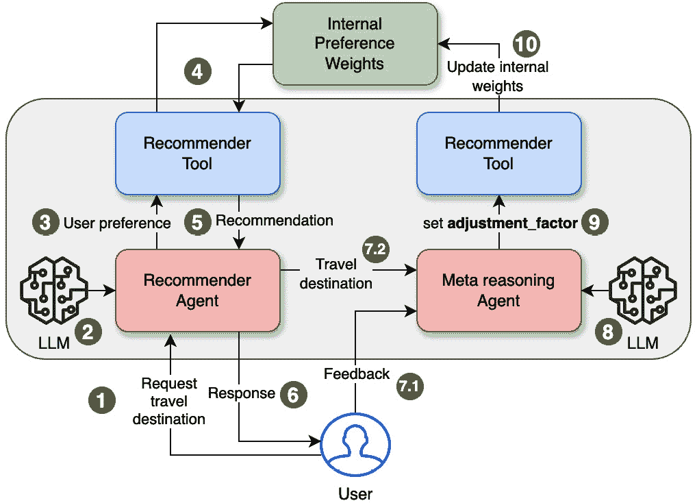

# 4

# 代理中的反思与内省

在上一章中，我们介绍了智能代理的一般概念，探讨了它们的适应性、自主性和目标导向行为，这些行为使它们在众多应用中变得极其有价值。我们考察了使这些代理能够在复杂世界中茁壮成长的基本组件——感知、推理和行动。

然而，寻找不仅能够执行任务而且能够持续提高其性能、模仿人类智能方面的智能代理的探索，导致了两个新兴子领域的出现：反思和内省。这些学科研究具有反思能力的代理在多大程度上可以贡献于它们内省认知过程的能力、从经验中获得见解并相应地调整其行为。

本章将深入探讨智能代理中反思的重要性，探讨嵌入反思功能的各种方法。通过现实世界的例子，我们将探讨这些原则如何在商业和其他领域找到实际应用，使代理能够超越单纯的任务执行，向更高的性能和智能水平进化。

您还将学习向代理添加反思功能的技术，例如元推理、自我解释和自我建模，并提供实际实施指导。最后，我们将通过不同商业领域的反思代理的现实世界例子来结束，展示它们的实际用途和益处。

本章分为以下主要部分：

+   代理中反思的重要性

+   智能代理中的内省

+   实现反思能力

+   用例和示例

到本章结束时，您将了解反思和内省如何帮助智能代理分析其推理、从经验中学习并调整其行为，从而实现更类似人类的智能。

# 技术要求

您可以在 GitHub 上找到本章的代码文件，链接为[`github.com/PacktPublishing/Building-Agentic-AI-Systems`](https://github.com/PacktPublishing/Building-Agentic-AI-Systems)。在本章中，我们还将使用一个名为**CrewAI**的代理 Python 框架来展示 AI 代理的各个方面。

# 代理中反思的重要性

在 LLM 代理中，反思指的是它们检查自身思维过程、评估自身行为并调整方法的能力。就像一个人可能会想，“那没有奏效，让我试试另一种方法”，LLM 代理可以分析其自身的输出，识别其策略何时无效，并相应地修改其行为。以下是一些例子：

+   一个 LLM 代理可能会反思解决数学问题失败的尝试，并选择不同的解决方案方法

+   它可能会意识到其回应对用户没有帮助，并调整其沟通风格

+   它可能会评估自己是否有足够的信息来完成一项任务，并在需要时请求更多细节。

这种自我监控和适应使代理比简单的输入-输出系统更有效，因为它们可以从成功和失败中学习。这种关键能力已被认为是加强决策、适应、伦理和人类-计算机交互的关键，我们将在后续章节中探讨。

## 加强决策能力

反思型代理可以回放过去的审议及其结果，从而在未来做出更明智的决策。这种行为类似于人类的*元认知*，其中“思考思考”控制学习和问题解决。通过内省其决策过程，反思型代理可以识别优势、劣势和偏见，使其能够不断改进其方法。

考虑一个旨在帮助用户规划旅行行程的反思型代理。通过内省其过去的推荐和从用户那里收到的反馈，代理可以随着时间的推移识别模式并改进其决策过程。最初，代理可能依赖于一组预定义的规则和偏好，根据用户的预算、旅行日期和声明的兴趣等因素建议旅行目的地、住宿和活动。然而，通过反思，代理可以从用户的决策和他们的旅行后反馈中学习。

例如，代理可能注意到具有相似档案（例如，年龄组、家庭状况或兴趣）的用户倾向于比其他类型更偏好某些住宿或活动。然后，它可以在其决策过程中调整分配给这些偏好的权重，确保未来的推荐更好地与观察到的模式相一致。我们的反思型旅行代理可以分析用户偏离其初始推荐的原因。如果大量用户持续预订更昂贵的酒店或选择比建议的不同活动，代理可以重新评估其对预算分配或某些兴趣重要性的假设。此外，反思型代理可以利用其内省能力来识别知识差距或需要更多数据或专业知识的地方。然后，它们可以主动寻找相关信息或咨询人类专家，以增强其决策能力。

通过参与这种反思、学习和适应的循环，反思型代理可以不断改进其决策过程，超越静态、基于规则的系统的限制。这种从经验中学习并适应新情况的能力是开发能够真正模拟人类推理和决策能力的智能代理的关键步骤。

## 适应

适应涉及根据信息或环境的变化修改代理的策略。反思型代理可以内省其表现，识别改进领域，并相应地调整其策略。这在条件可能迅速变化的动态环境中尤其有价值，如股票交易或网络管理。

以旅行代理为例，适应能力至关重要，因为旅行条件、法规和用户偏好可以迅速演变。一个反思型旅行代理可以根据这些变化的情况调整其策略。考虑这样一个场景，由于政治动荡、特定地区的自然灾害或如 COVID-19 大流行等状况，发布了旅行限制或警告。一个非反思型代理可能会继续推荐该地区的目的地和行程，而对旅行者可能面临的风险或不便视而不见。

然而，一个反思型旅行代理可以反思最近前往受影响地区的用户的反馈和经历，或考虑任何有效的旅行警告。它可能会注意到投诉、取消或替代安排请求的增加。通过这种反思，代理可以确定需要调整其策略，并暂时避免推荐该地区的目的地或活动，直到情况稳定。

类似地，代理可以根据用户偏好的变化或旅行趋势调整其推荐。如果它注意到对特定类型的旅行体验的兴趣激增，例如生态旅游或健康修养之旅，那么反思型代理可以调整其推荐以迎合这种新兴需求。通过持续监控用户反馈和偏好，代理可以保持领先，并提供相关且吸引人的建议。此外，一个反思型旅行代理可以根据外部因素的变化，如航空公司航线、酒店可用性或价格波动，调整其策略。通过反思其推荐的成果和分析用户反馈，代理可以识别出由于这些动态条件，其建议可能变得过时或次优的实例。然后，它可以主动调整其策略，以确保提供最新且最具成本效益的建议。

在快速发展的环境中，如旅游业，适应能力对于保持相关性和提供满意的客户服务至关重要。通过反思和内省，旅行代理可以持续监控其表现，识别改进领域，并相应地调整其策略，确保其对不断变化的情况和用户需求保持响应。

## 伦理考量

反思有助于代理评估其行为是否符合伦理规范和人类价值观。在具有重大影响人类生活和福利的关键应用中，通过持续评估其决策和行动，反思型代理可以降低不道德行为的发生概率。例如，一个协助自动驾驶车辆导航的反思型代理可能会将安全和伦理考虑置于效率之上。

以旅行社为例，伦理考虑在确保负责任和可持续的旅游实践中起着至关重要的作用。一个反思型旅行社可以反思其推荐可能产生的潜在影响，并调整其策略以符合伦理规范和人类价值观。例如，代理可能会注意到其推荐在某些热门目的地导致过度旅游的倾向，导致诸如拥挤、对当地资源的压力以及文化遗产遗址退化等负面后果。通过反思这些观察和来自当地社区或环保人士的反馈，代理可以认识到调整其推荐以促进更可持续和负责任的旅游实践的需要。

反思型旅行社可以通过建议替代的、不那么拥挤的目的地，鼓励旅行者在淡季出行，或推荐对环境影响较小的活动来调整其策略。它还可以优先考虑环保的住宿、旅游运营商和活动，这些活动支持当地社区和文化。此外，代理还可以反思推荐某些活动或目的地可能产生的潜在伦理影响。例如，它可能识别出推荐的活动可能潜在地剥削或伤害当地野生动物或导致不道德行为的情况。通过反思，代理可以重新评估这些推荐，并提供符合伦理原则、尊重环境和当地文化的替代方案。一个反思型旅行社可以持续监控用户反馈和体验，以识别其推荐可能无意中造成伤害或忽视当地习俗或价值观的情况。通过反思这些案例，代理可以从其错误中学习，调整其知识库，并完善其决策过程，以防止未来发生类似事件。

通过将伦理考虑嵌入其反思过程中，旅行社可以确保其推荐不仅提供愉快的旅行体验，而且有助于当地社区的福祉，保护文化遗产，并促进可持续旅游实践。这种对道德行为的承诺可以增强用户之间的信任和信心，使反思型代理成为一个负责任且具有社会责任感的旅行顾问。

## 人机交互

具备反思和内省能力的代理更能与人类互动。他们推断和回应人类情感和意图的能力增强了合作和沟通。例如，一个反思型虚拟助手可以根据用户的情绪状态和偏好调整其沟通风格，从而促进更加自然和吸引人的互动。

在反思型旅行代理的背景下，进行有效的人机交互能力对于提供个性化且令人满意的服务至关重要。通过反思与用户的互动，代理可以调整其沟通风格和方式，以更好地与个人的偏好和情绪状态相匹配。考虑一个场景，当用户在与旅行代理的初次互动中表达出兴奋和热情时。一个反思型代理可以反思用户的积极情绪线索，例如他们的语调、语言选择和兴奋的表达，并相应地做出反应。代理可能会调整其沟通风格以匹配用户的积极和热情的态度，从而营造一个更加吸引人和协作的体验。

相反，如果用户对代理提供的旅行建议表示出挫败或不满，一个反思型旅行代理可以反思用户的负面情绪线索，并调整其沟通风格以更加同理和理解。它可以承认用户的担忧，提供替代方案或解释，并采用更加耐心和安抚的语调来帮助缓解用户的挫败感。反思型代理还可以分析用户互动中的模式，以识别用户偏好的沟通风格或偏好。一些用户可能更喜欢更加简洁和直接的方式，而另一些用户可能更欣赏更加对话式和注重细节的风格。通过反思这些模式，代理可以针对每个个体用户调整其沟通，从而营造一个更加自然和吸引人的体验。

此外，反思型旅行代理可以利用其内省能力来识别可能缺乏足够信息或背景以提供满意建议或回应的领域。在这种情况下，它可以主动寻求澄清或额外细节，进行更加协作和互动的对话。例如，如果用户对某种特定活动或目的地表示出兴趣，但代理缺乏关于它的详细知识，它可以通过后续问题更好地了解用户的偏好并提供更加定制的建议。

通过根据用户反馈、情感线索和偏好不断调整其沟通风格和方法，反省型旅行代理可以培养更类似人类的互动，增强信任、满意度和整体用户体验。这种与用户有效沟通和协作的能力对于建立持久关系并将代理确立为可靠且个性化的旅行咨询服务至关重要。通过实施反省和反省，智能代理可以变得更加自我意识、适应性强，并与人类价值观保持一致，最终导致更智能和值得信赖的系统。

在探讨了反省能力对智能体的重要性之后，我们现在深入探讨实现这些能力的过程。

# 智能体中的反省

反省是指智能体检查和分析自身认知过程、决策和行为的过程。这种能力使智能体能够更深入地了解其行为，识别模式，并根据反思调整其策略。反省对于将智能体从简单的任务执行者提升到能够持续进化并随时间改进的系统至关重要，这与人类反思过去经验以做出更好的未来决策的方式相似。

在基于智能体的系统中，反省在提高性能和适应性方面发挥着关键作用。当智能体进行反省时，它们评估自己的推理和决策路径，从而能够检测到其过程中的任何缺陷、偏见或低效。这导致了对环境和自身功能的更精细的理解，使它们能够做出更明智的选择并调整其行为。例如，反省能力使智能体能够从成功和失败中学习。当智能体遇到某种情况时，它可以在事后分析其行为，了解为什么某些决策导致了期望的结果，而其他决策没有。这种反馈循环鼓励持续学习和改进，这对于需要适应性和长期表现的任务至关重要。

内省增强了智能体处理模糊性和不确定性的能力。通过反思过去的经验，智能体可以发展出更稳健的决策策略，以适应复杂、动态的环境。这使得内省对于与不断变化的数据或环境交互的系统尤为重要，因为它有助于智能体在时间上保持相关性和有效性。内省使智能体能够从被动反应者转变为主动学习者。通过理解自己的思维过程并从经验中学习，内省的智能体可以不断改进其行为，最终使其能够在广泛的场景中更智能和更适应地执行。这种能力在自主系统、个性化推荐引擎和自适应客户支持代理等应用中尤其有价值，在这些应用中，灵活性和持续改进至关重要。

通过整合内省，智能体可以识别其知识中的差距，预测未来的挑战，并相应地调整其策略。这使它们成为不仅对当前情况做出反应，而且为未来做准备的系统，确保在动态和不确定的环境中保持长期的相关性和效率。

# 实现反思能力

在智能体中实现反思能力的技术有多种，例如旅行代理。这些技术增强了智能体监控、评估和改进其性能的能力，促进了适应性和持续学习。智能体通常结合*传统推理*和*元推理*，以在动态环境中有效地运作。我们将在以下章节中介绍这些技术。

## 传统推理

**传统推理**指的是智能体通过预定义的规则、算法或从数据中学习到的模式解决特定问题或执行任务的逻辑和系统过程。它在一个固定的框架内处理输入并产生输出，专注于短期目标，而不考虑推理过程本身。

在旅行代理的背景下，传统推理涉及直接处理用户查询并执行特定任务。例如，当用户询问从洛杉矶到纽约的航班时，代理根据价格、时间、航空公司偏好等因素检索航班选项。它应用预定义的逻辑（例如，按最低价格或最短时间排序）向用户展示最相关的结果。同样，如果用户请求时代广场附近的酒店推荐，代理使用传统推理根据位置、预算和设施过滤酒店。

传统推理是面向任务和反应性的，专注于高效地解决即时问题。然而，它不会根据决策的成功或用户需求的变化来评估或调整其方法，这就是元推理发挥作用的地方。

## 元推理

**元推理**指的是监控和控制推理活动的过程，使代理能够反思自己的推理过程并在适当的时候进行调整。在反思型旅行代理的背景下，元推理在使代理能够持续评估和改进其决策过程方面发挥着关键作用。

例如，考虑一种场景，旅行代理根据用户的声明偏好和限制向用户推荐特定的目的地或行程。然而，在用户旅行后收到反馈后，代理了解到推荐中的某些方面与用户的实际体验或愿望不太相符。通过元推理，旅行代理可以分析这种反馈并反思导致最初推荐的推理过程。它可能识别出它如何解释用户偏好的模式或缺陷，对某些因素给予比其他因素更高的权重，或对目的地或活动做出假设。有了这些洞察，代理可以调整其推理过程。它可能重新调整对不同用户偏好的重要性分配，引入新的决策启发式方法，或改进其数据源以确保更准确和相关的信息。

元推理还可以帮助旅行代理优化其资源配置。对于复杂或高风险的旅行计划场景，例如组织多目的地家庭度假或大型团体旅游，代理可以分配更多的计算资源来进行更深入的推理和分析。这可能包括考虑更广泛的选项、模拟各种场景或利用更复杂的算法来生成最佳推荐。相反，对于常规或直接的请求，例如预订简单的周末度假，代理可以依赖更简化的推理过程或预定义的规则，为更复杂的任务节省计算资源。

元推理可以使旅行代理根据用户的旅行规划专业水平或熟悉程度调整其推理策略。对于新手用户，代理可能会采用更引导性的方法，提供针对他们需求的详细解释和建议。相反，对于经验丰富的旅行者，代理可以采用更简洁的推理过程，专注于展示与用户偏好和旅行历史相一致的选择。

通过元推理持续监控和调整其推理过程，反思型旅行代理可以提供越来越个性化的满意推荐，适应不断变化的需求和偏好，并优化其资源利用以实现高效和有效的行程规划。

参考以下代码片段（完整代码可在示例笔记本**Chapter_04.ipynb**中找到），其中通过代理根据用户反馈反思和调整其决策过程的能力展示了元推理的概念。这个元推理方法的部分评估用户的反馈（**feedback == 1**表示正面，**feedback == -1**表示负面）并相应地调整内部推理（**preferences_weights**）。如果反馈是负面的，代理会降低相关的权重（例如，减少对**巴黎**的**奢华**的重视）。如果反馈是正面的，它会增加相关的权重，改善代理对未来交互的推荐。这使得代理能够根据过去的反馈持续优化其决策过程：

```py
1  if feedback == -1:  # Negative feedback indicates dissatisfaction
2    if destination == "Paris":
3       preferences_weights["luxury"] *= 0.9
4    elif destination == "Bangkok":
5       preferences_weights["budget"] *= 0.9
6    elif destination == "New York":
7       preferences_weights["budget"] *= 0.9
8
9  elif feedback == 1:  # Positive feedback indicates satisfaction
10    if destination == "Paris":
11       preferences_weights["luxury"] *= 1.1
12    elif destination == "Bangkok":
13       preferences_weights["budget"] *= 1.1
14    elif destination == "New York":
15       preferences_weights["budget"] *= 1.1
```

尽管这个例子基于启发式算法（简单的**if** - **else**结构），我们仍然可以实现一个能够进行元推理的 AI 代理。在 LLM 的情况下，我们可能让模型生成一个**调整因子**值，用于根据用户反馈调整系统的基本权重，而不是像在这个例子中那样硬编码 0.9 和 1.1。Python 笔记本展示了使用 CrewAI 框架实现基于 AI 代理的系统的一个例子，它正是这样做的。代理不仅仅是做出推荐，它还会评估其建议的结果，并通过调整偏好权重来适应其内部推理，从而改善未来的推荐。

在我们查看基于 CrewAI 的代理示例代码之前，让我们先澄清一些定义。在 CrewAI 的语境中，一个**代理**是一个由 LLM 驱动的独立单元，它可以执行特定任务，根据其角色和目标做出决策，使用工具完成任务，与其他代理通信等等。您可以使用任何支持 CrewAI 代理的 LLM。因此，在我们的案例中，我们使用了 OpenAI 的**gpt-4o-mini**模型。一个**任务**本质上是一个代理需要完成的特定任务。您可以提供代理完成任务所需的**工具**。以下是一个示例代码片段，其中我们使用 CrewAI 定义了示例中的代理：

```py
1  from crewai import Agent
2
3  preference_agent = Agent(
4      name="Preference Agent",
5      role="Travel destination recommender",
6      goal="Provide the best travel destination based on user
             preferences and weights.",
7      backstory="An AI travel expert adept at understanding user
                  preferences.",
8      verbose=True,
9      llm='gpt-4o-mini',
10     tools=[recommend_destination])
11
12 meta_agent = Agent(
13     name="Meta-Reasoning Agent",
14     role="Preference weight adjuster",
15     goal="Reflect on feedback and adjust the preference weights to
             improve future recommendations.",
16     backstory="An AI optimizer that learns from user experiences to
                 fine-tune recommendation preferences.",
17     verbose=True,
18     llm='gpt-4o-mini',
19     tools=[update_weights_on_feedback])
```

接下来，我们定义代理需要完成的任务：

```py
1 from crewai import Task
2
3 generate_recommendation = Task(
4      name="Generate Recommendation",
5      agent=preference_agent,
6      description=(
7       f"Use the recommend_destination tool with these preferences:
         {state['preferences']}\n"
8       "Return only the destination name as a simple string (Paris,
         Bangkok, or New York)."
9      ),
10     expected_output="A destination name as a string")
11
12 adjust_weights = Task(
13     name="Adjust Weights Based on Feedback",
14     agent=meta_agent,
15     description=(
16        "Use the update_weights_on_feedback tool with:\n"
17        "1\. destination: Get from first task's output
          (context[0])\n"
18        "2\. feedback: Get from second task's output (context[1])\n"
19        "3\. adjustment_factor: a number between 0 and 1 that will be
          used to adjust internal weights based on feedback\n\n"
20        "Ensure all inputs are in their correct types (string for
          destination, integer for feedback)."
21     ),
22     expected_output="Updated weights as a dictionary",
23     context=[generate_recommendation, user_feedback])
```

在这个代码片段中，我们首先定义了两个代理：**偏好代理**和**元代理**。**偏好代理**代理负责根据一些预定义的内部权重（在我们的案例中，预算、奢华和冒险被赋予相等的权重）和一些初始的用户偏好权重向用户推荐一个旅行目的地。**偏好代理**代理使用名为**recommend_destination**的工具，该工具进行权重计算并返回用户期望的目的地。**元代理**代理负责元推理部分，其中它根据推荐的目的地评估用户的反馈，并设置一个**调整因子**，然后由**update_weights_on_feedback**工具使用，根据用户的反馈更新系统的内部权重。这使得模型能够在后续的用户交互中提高其推荐能力。

我们将随后设置一个由定义的代理和任务组成的船员团队，并启动流程：

```py
1 from crewai import Agent, Task, Crew
2 crew = Crew(
3    agents=[preference_agent, meta_agent],
4    tasks=[generate_recommendation, adjust_weights],
5    verbose=True)
6
7 crew.kickoff()
```

输出将类似于以下内容：

```py
# Agent: Travel destination recommender
## Task: Use the recommend_destination tool with these preferences: {'budget': 0.04, 'luxury': 0.02, 'adventure': 0.94}
Return only the destination name as a simple string (Paris, Bangkok, or New York).
# Agent: Travel destination recommender
## Thought: I need to analyze the user's preferences which heavily favor adventure and very little for budget and luxury.
## Using tool: Recommend travel destination based on preferences.
## Tool Input:
"{\"user_preferences\": {\"budget\": 0.04, \"luxury\": 0.02, \"adventure\": 0.94}}"
## Tool Output:
New York
# Agent: Travel destination recommender
## Final Answer:
New York
# Agent: Preference weight adjuster
## Task: Use the update_weights_on_feedback tool with:
1\. destination: Get from first task's output (context[0])
2\. feedback: Get from user input
3\. adjustment_factor: a number between 0 and 1 that will be used to adjust internal weights based on feedback
Ensure all inputs are in their correct types (string for destination, integer for feedback).
# Agent: Preference weight adjuster
## Thought: I need to adjust the preference weights based on the provided feedback for the destination 'New York', which received a dissatisfied feedback of -1\. I will choose an adjustment factor between 0 and 1; for this case, I will use 0.1 for a slight adjustment.
## Using tool: Reasoning tool to adjust preference weights based on user feedback.
## Tool Input:
"{\"destination\": \"New York\", \"feedback\": 1, \"adjustment_factor\": 0.1}"
## Tool Output:
{'budget': 0.33, 'luxury': 0.32, 'adventure': 0.34}
# Agent: Preference weight adjuster
## Final Answer:
{'budget': 0.33, 'luxury': 0.32, 'adventure': 0.34}
```

*图 4.1*展示了对这个流程的直观理解：



图 4.1 – 使用 AI 代理和 CrewAI 框架进行元推理

系统最初开始时使用一个预定义的内部权重集，这个权重集对预算、奢华和冒险给予同等重视。然后，这个系统权重集与初始的假设用户偏好权重相结合，以得出最终的旅行目的地推荐。随后，用户可能会喜欢或不喜欢这个推荐，通过反馈=1（表示满意）或反馈=-1（表示不满意）来标记。元推理代理随后会查看它在前一步中做出的推荐、用户的反馈（1 或-1），决定一个介于 0 和 1 之间的**调整因子**值，并将其传递给一个使用这些信息来更新系统内部权重的工具。因此，在这个例子中，系统开始时推荐了一个更注重冒险的推荐，用户喜欢这个推荐（纽约，因此，反馈=1）。元代理随后将冒险的内部系统权重增加到 0.34。这意味着，系统现在更好地理解用户更喜欢冒险的目的地，以便在后续交互中。

这个过程体现了持续学习，其中每一份反馈都帮助代理更好地理解用户的偏好并优化其决策，确保评估和改进的持续循环。虽然在简化的例子中没有明确展示资源优化，但这一概念可以扩展到更复杂的场景，其中代理为复杂的决策分配更多的计算资源，同时简化简单的决策。可能的改进包括持久学习，其中反馈和权重被存储以供未来的会话使用，使代理能够保持其知识并随时间发展。更复杂的反馈，如详细的评分或具体的用户评论，可以允许进行更精细的调整，而高级算法可能提供对反馈和偏好权重调整的更智能的分析。此外，增加目的地数量和纳入更广泛范围的属性——如气候或文化体验——将丰富推荐过程。

元推理允许代理反思其自身的推理过程并在适当的地方进行调整。这包括性能监控和资源分配，这些内容将在以下章节中进一步详细说明。

### 性能监控

反思型旅行代理可以监控其成功率并发现其决策过程中的模式。例如，它可以跟踪推荐行程、住宿或活动的用户满意度。通过识别模式，例如某些类型的推荐持续获得较低的评分，代理可以调整其推理策略以改善未来的表现。持续的性能监控是反思型旅行代理学习和适应能力的关键方面。通过系统地跟踪和分析用户反馈和满意度指标，代理可以对其推荐的效率和决策过程获得宝贵的见解。为性能指标设定明确的基线和阈值同样重要，因为它有助于确定何时需要调整推理策略或决策过程。

反思型旅行代理可以通过跟踪各种指标来持续监控其性能，以评估其推荐和决策过程的有效性。这些指标可以包括推荐行程、住宿、活动以及交通的用户满意度水平、评分和评论。性能监控使代理能够发现模式、识别改进领域，并通过对推理策略和结果进行数据驱动调整来增强其推理策略。

例如，旅行社可以从用户那里收集旅行后的反馈，询问他们对酒店质量、活动适宜性、交通便利性和整体体验等方面的评分。通过汇总和分析这些反馈，代理可以发现趋势和其推荐可能不足的领域。

### 需要跟踪的具体指标

以下是评估其推荐和决策过程有效性的具体指标，以跟踪：

+   **用户评分和评论**：住宿、活动和整体旅行体验的评分有助于衡量用户满意度并确定改进领域

+   **推荐接受率**：如用户选择推荐航班、酒店或活动的百分比等指标表明代理与用户偏好的契合度如何

+   **投诉和退货率**：跟踪用户报告的问题，例如对服务不满意或取消行程，揭示了代理决策中的差距

+   **用户参与度指标**：关于用户如何频繁地与推荐互动或请求修改的数据提供了对代理相关性和准确性的见解

+   **人口统计数据特定的见解**：了解不同用户群体（例如，家庭、单身旅行者、情侣）如何对推荐做出反应，有助于代理定制其策略

### 如何调整指标以影响行为

如果代理注意到特定目的地住宿的评分持续较低，它可能会重新评估其对价格、位置或便利性等因素的优先级。例如，代理可能会意识到它过度强调了成本节约，而忽视了其他关键因素，如景点附近的距离或用户评价。

类似地，如果反馈显示冒险运动在各种目的地都持续收到低评分，代理可能会得出结论，它对这些活动的用户偏好缺乏全面的理解。通过调整其推理策略——例如，整合额外的用户偏好数据或使用更多样化的活动来源——代理可以提高其推荐的准确性和个性化。

代理还可以根据人口统计数据分析反馈。例如，如果家庭友好的推荐获得高评分，而针对单身旅行者的建议没有，它可以通过改进推理来更好地满足个人需求，例如为单身用户提供更多预算友好或文化沉浸式的选项。

通过系统地跟踪和分析这些指标，旅行社可以迭代地改进其推理策略。这种方法不仅提高了推荐的质化和个性化，而且通过提供一致可靠和令人满意的旅行体验，在用户中建立了信任和忠诚度。通过持续的性能监控，代理逐渐成为一个更智能、更适应和以用户为中心的顾问。

### 资源分配

通过元推理，旅行社可以优化其资源分配。对于复杂或高风险的行程规划，代理商可能会分配更多的计算资源进行更深入的推理和分析。相反，对于常规或简单的请求，它可能回退到更简单的启发式方法或预定义规则，以节省资源。有效的资源分配对于反思型旅行社有效运作和及时响应用户至关重要。通过采用元推理，代理商可以根据每个行程规划请求的复杂性和重要性动态调整其计算资源的分配。

考虑这样一个场景，旅行社收到一个请求，需要规划一个跨越多个国家或地区的复杂多目的地度假行程。这样的请求通常涉及复杂的物流、协调各种旅行组成部分（航班、住宿、活动等），以及需要在众多约束和偏好之间取得平衡。在这种情况下，代理商可以分配更多的计算资源来进行更深入的推理和分析。这可能包括运行复杂的算法来生成最佳行程，考虑大量可能的旅行选项组合和排列，并评估每个选项在成本、旅行时间、用户偏好以及潜在风险或中断等多方面因素。然而，过度分配计算资源以优化复杂的行程可能会导致收益递减或效率低下。例如，代理商可能会过分专注于行程的完美，从而可能延迟响应时间或消耗不必要的资源。此外，代理商可能会忽略更简单但同样令人满意的解决方案，这些解决方案可以满足用户需求，而无需进行详尽的模拟或分析。平衡计算努力与实际成果对于避免过度工程化和确保及时、高效的响应至关重要。

此外，代理商可以将资源分配给模拟各种场景和应急计划，以确保一个稳健且适应性强的旅行计划。

另一方面，如果请求是常规或简单的旅行，例如周末前往附近的度假地，反思型旅行社可以通过依赖更简单的启发式方法或预定义规则来节省计算资源。这些可能包括根据用户偏好优先考虑热门或高评价的目的地和住宿，应用标准算法进行路线规划或活动推荐，以及利用预编译的数据和旅行套餐。

通过使用元推理动态调整其资源分配，旅行代理可以在计算效率和每个行程规划任务所需的深度分析之间取得平衡。这不仅确保了对用户的及时响应，还优化了代理的整体资源利用，防止了常规任务的不必要计算开销，同时为复杂或高风险场景分配了足够的资源。

反思型旅行代理可以采用元推理，根据不断变化的需求、系统性能指标或新计算资源的可用性，持续监控和调整其资源分配策略。例如，如果代理在高峰旅行季节持续难以提供及时响应，它可以主动分配额外资源或实施负载均衡技术以维持最佳性能。通过元推理驱动的智能资源分配，反思型旅行代理可以提供无缝且高效的行程规划体验，根据每个用户请求的具体需求和复杂性调整其计算努力，同时确保最佳资源利用和系统性能。

反思型旅行代理可以利用各种算法和策略进行动态资源分配，确保最佳性能和个性化的用户体验。**强化学习**（**RL**）是其中一种方法，它使代理能够通过试错学习分配策略，根据任务的复杂性动态调整计算资源，例如多目的地行程规划。**多臂老虎机**（**MAB**）通过平衡探索和利用，帮助代理有效地分配资源到价格比较或酒店推荐等任务，以最大化用户满意度。贝叶斯优化使用统计方法来识别最有希望的资源配置，而动态规划将复杂的分配问题简化为可管理的子问题，确保在整个行程规划过程中的最佳决策。

基于启发式的方法，如由于国际旅行的固有复杂性而分配更多资源，提供了实用的经验法则解决方案，而基于博弈论的方法将资源分配建模为战略游戏，平衡诸如行程优化和偏好分析等竞争性任务。基于任务优先级的算法，如加权轮询，根据任务的紧迫性或重要性分配资源，而像 Min-Min 这样的资源感知调度技术则专注于快速完成简单任务，为更复杂的计算释放资源。通过将这些策略与元推理相结合，代理可以实时评估任务复杂性并选择最有效的方法，提供适应性和高效的解决方案，从而增强整体旅行规划体验。

## 自我解释

自我解释是一个代理通过口头表达其推理过程，为做出的决策生成解释的过程。这种技术对反思性代理来说具有几个关键作用，特别是在我们讨论的旅行代理示例中，如下文所述。

自我解释有两个不同的目的：增强透明度和促进学习。当用于**透明度**时，自我解释侧重于使代理的决策对人类可理解。例如，一个反思性的旅行代理可能会通过强调成本、用户偏好或目的地受欢迎程度等因素来解释为什么推荐了特定的行程。这种类型的自我解释通过向用户提供对代理建议背后的推理的清晰洞察，建立信任，确保他们对其决策有信心。

另一方面，用于**学习**的自我解释则集中在代理改善其决策过程的能力上。在这里，代理为其自己的决策生成解释，不仅是为了与用户沟通，也是为了反思其推理并确定潜在的改进领域。例如，如果一个旅行代理因某些酒店推荐持续收到负面反馈，它可以分析其解释来检测在评估酒店时存在的缺陷，例如过分强调价格而忽视用户评价。这个过程允许代理通过从其过去的解释中学习来改进其策略，在未来提供更好的推荐。

因此，尽管用于透明度的自我解释是面向外部和以用户为中心的，用于学习的自我解释则是面向内部，使代理能够持续适应和改进。

### 透明度

通过为其推荐和决策生成自我解释，反思性的旅行代理可以向用户提供对其思维过程和决策理由的洞察。这种透明度增强了代理能力的信任和信心，因为用户可以更好地理解建议的行程、住宿或活动的推理依据。

例如，旅行代理可以解释说，它基于酒店靠近热门旅游景点、来自具有相似偏好的前旅行者的好评以及用户指定预算范围内的竞争性定价推荐了特定的酒店。通过阐述这些因素和背后的推理过程，代理展示了可以取信用户并增加他们遵循推荐意愿的透明度。

回顾我们的示例代码，我们首先通过提示模型解释为什么以它推荐特定酒店或目的地的方式给出响应来实现一个透明度自我解释代理。使用 CrewAI 框架，代码看起来像这样：

```py
1 travel_agent = Agent(
2    role="Travel Advisor",
3    goal="Provide hotel recommendations with transparent reasoning.",
4    backstory="An AI travel advisor specializing in personalized
                travel planning.
5               You always explain the steps you take to arrive at a
                conclusion.",
6    tools=[recommend_hotel]
7   )
8
9 recommendation_task = Task(
10    name="Recommend hotel",
11    description="""
12    Recommend a hotels based on the user's query {query}.
13    """,
14    agent=travel_agent,
15    expected_output="The name of the hotel with explanations"
16   )
```

在这个代码示例中，我们定义了一个代理并指定它必须解释它到达结论的步骤——这是在代理的**背景**参数中指定的。然后我们分配给它使用**recommend_hotel**工具查找酒店的任务，该工具负责查找酒店。当代理被调用并查询“*我在寻找每晚 300 美元以下的巴黎酒店*”时，它会推荐一家酒店以及推荐该酒店的理由。输出可能看起来像这样：

```py
Hotel: Hotel du Petit Moulin
Reason:
I found several hotels in Paris, but most of them exceeded the budget of $300\. The only suitable option is Hotel du Petit Moulin, which is priced at $300 per night. Located in the 3rd arrondissement, it offers moderate transportation convenience with the nearest metro station, Saint-Sébastien Froissart, being approximately 1.9 kilometers away. This hotel is a great choice for budget-conscious travelers who still want to enjoy the charm of Paris.
```

一个具有自我解释和透明度的代理系统的概念流程如图*4*.*2*所示：


图 4.2 – AI 代理的自我解释透明度

在这里，模型的每个响应都会经过一个解释周期，其中代理生成适当的解释和其响应背后的理由。这些解释随后可以呈现给用户，或者简单地记录下来以供可解释性目的。

### 学习与改进

将其推理过程口头化的行为也可以作为反思型旅行代理的学习机制。随着代理生成自我解释，它可能会发现决策过程中的缺陷、不一致性或疏忽。通过反思这些自我解释，代理可以确定改进的领域并相应地细化其推理策略。

例如，如果用户提供了表示对推荐活动不满意的反馈，旅行代理可以重新审视该推荐的自解释。这样做时，它可能会意识到它未能考虑某些用户偏好或忽略了应该影响其决策的关键因素。这种认识可以随后告知代理的学习过程，导致其推理算法或知识库的调整，以防止未来出现类似的疏忽。在我们的上一个例子中，AI 建议了一家从公共交通可达性来看便利性适中的酒店，然而，用户可能不会对这一结果感到满意，并且可能愿意支付额外费用以靠近公共交通。

为了实现学习和改进，我们将简单地扩展我们之前的透明度流程，并增加一个可以消费推荐和用户反馈的代理/任务对，并使用这些信息来执行策略的改进。请参阅 Python 笔记本中的代码示例。*图 4* *.3* 显示了高级流程：


图 4.3 – 使用 AI 代理进行学习和改进

### 用户参与和协作

自我解释也可以促进旅行代理和用户之间更加吸引人和协作的互动。通过为其推荐提供解释，代理邀请用户提供反馈，提出后续问题，或提供额外的背景信息或偏好。这种双向对话可以导致一个更加个性化的迭代行程规划过程，其中代理根据用户的输入和澄清不断改进其推荐。

例如，如果用户对某个推荐表示担忧或不确定性，旅行代理可以提供详细的自我解释，概述其考虑的因素，并邀请用户分享他们的观点或额外要求。这种协作方法可以帮助代理更好地理解用户的需求和偏好，从而提供更加定制和令人满意的推荐。到目前为止，我们已经看到了几个示例，说明了代理如何能够消费人类输入，并推荐和重新制定其任务执行策略。虽然类似的用户参与协作示例在 Python 笔记本中存在，但重要的是要认识到，人类协作通常是通过聊天机器人等对话界面实现的。

通过整合自我解释功能，反思型旅行代理可以促进透明度、信任、持续学习和协作用户互动。这种多方面的方法不仅增强了整体行程规划体验，而且有助于代理随着时间的推移提供越来越个性化、准确的推荐。接下来，让我们探索使用 AI 代理进行自我建模。

## 自我建模

自建模是反思型代理的关键方面，它允许代理保持其目标、信念和知识的内部表示。这个自我模型作为决策和反思的基础，使代理能够根据变化的情况或新获得的信息进行适应和演变。为了进一步说明，这里的“建模”一词意味着代理的初始环境和状态。代理（或一组代理）从一个特定的环境中开始，具有一些初始状态，随着代理通过人机交互或任务执行学习更多，它继续更新那个内部状态，从而改变其操作的环境。在反思型旅行代理的背景下，自建模在确保代理的推荐和决策过程与用户的不断变化的需求和偏好保持一致，以及融入新的知识和经验方面发挥着至关重要的作用。*图 4* *.4* 给出了我们进一步讨论内部状态两个组成部分的高级概述。代理可能在其代理系统中独立自我建模的个体内部状态，或者它们可能具有共享的内部状态，它们可以协作进行自我建模。


图 4.4 – 自建模的个体和共享内部状态

这个内部状态可能包含几个组成部分，但最重要的是，在高级别上，它们可以被归类为两类：*目标管理*和*知识更新*，正如我们将要探讨的。

### 目标管理

一个反思型旅行代理维护着其目标的内部模型，这些目标可以从提供个性化的和令人满意的旅行推荐到根据用户偏好和限制优化旅行体验。然而，这些目标并非固定不变；代理必须能够根据情况变化或新信息的出现重新思考和调整其目标。

例如，如果用户的旅行日期或预算限制在行程规划过程中发生变化，反思型旅行代理可以利用其自我模型相应地重新评估和更新其目标。它可能将重点从最大化奢华住宿转移到优先考虑成本效益，或者调整行程推荐以符合新的旅行日期。

此外，如果代理通过反馈或互动了解到用户不断变化的兴趣或旅行偏好，它可以通过更新其目标来更好地满足这些变化的需求。例如，如果用户表达了对环保或可持续旅行实践的新兴趣，代理可以调整其目标，优先推荐环保的住宿、活动和交通选项。

### 知识更新

自建模的一个关键方面是能够根据新的经验和洞察自动更新代理的知识库。随着反思型旅行代理与用户互动、接收反馈并从自己的推荐和决策中学习，它可以不断精炼和扩展其对目的地、住宿、活动、用户偏好和旅行趋势的知识。

例如，如果用户报告了与推荐酒店或活动的负面体验，代理可以更新其知识库以反映这种反馈，可能调整其评分或从未来的推荐中删除该选项。相反，如果用户对特定目的地或体验提供了积极的评论和反馈，代理可以加强其对那个推荐积极方面的知识，增加将来向具有相似偏好的用户推荐该推荐的可能性。

通过维护自我模型和自动更新其知识库，反思型旅行代理为随着时间的推移改进决策和推荐准确性奠定了基础。随着其知识库的增长和演变，代理可以利用这些见解为用户提供越来越个性化和满意的旅行规划体验。

在我们的示例中，我们的自建模旅行代理不仅会根据用户偏好提供推荐，而且会不断调整和精炼其推荐。通过维护内部自我模型并根据用户反馈更新其知识库，代理可以随着时间的推移改进其推荐，确保它们更加个性化和与用户的不断变化的需求和偏好相关。自建模可以使代理识别知识差距或其信息缺乏或过时的领域。在这种情况下，代理可以主动寻找新的信息来源或利用外部数据源来增强其知识库，确保其推荐基于最最新和最全面的信息。

通过通过自建模结合目标管理和知识更新能力，反思型旅行代理可以持续调整和改进其性能，确保它仍然是寻求个性化和定制旅行体验的用户可信赖和有价值的资源。

尽管我们一直在讨论我们的旅行代理示例来理解本章的概念，但下一节我们将讨论许多现实世界的用例和示例。请记住，这些示例绝不是详尽的，因此在本章末尾的一个好练习是思考代理反思和内省技术如何应用于其他现实世界场景。

# 用例和示例

反思型智能代理已被配备以支持许多新兴的商业应用。一个反思型代理可以有效地应用自我评估和反思，以改善其在不断变化的环境中的性能，从而做出更有效的商业决策，并继续以透明和可解释的方式改进。以下是一些在真实商业应用中应用的反思型代理的例子。

## 客户服务聊天机器人

反思型客户服务聊天机器人采用自我评估方法，以持续提高其向用户提供有效和满意响应的能力。通过反思过去的对话，这些聊天机器人可以识别模式、优势、劣势和改进领域，从而使其能够完善其知识库、响应策略和整体交互能力。

自我评估的一个关键方面是分析过去对话结果的能力。聊天机器人可以审查用户反馈、情感分析和对话指标，以衡量其响应的成功或失败。例如，聊天机器人可能会识别出用户通过负面情绪或低满意度评分表达出挫败感或不满意情绪的对话。通过反思这些情况，聊天机器人可以确定潜在问题，例如误解、信息不足或不适当的语气或语言。相反，聊天机器人也可以分析进行顺利的对话，其中用户对提供的解决方案表达了满意或感激。通过研究这些成功互动的特点，聊天机器人可以加强有效的响应策略，识别最佳实践，并在未来的对话中复制它们。

反思型聊天机器人可以反思对话的具体内容和流程，以识别模式和改进领域。它们可能会认识到经常导致用户困惑或不满意的重复问题或主题，这表明需要增强其知识库或完善其响应模板。或者，它们可能会识别出频繁请求特定信息或功能，这促使开发新的对话流程或集成，以更好地满足用户需求。除了内容分析之外，反思型聊天机器人还可以评估其沟通风格和语言使用的有效性。通过分析用户反馈和反应，它们可以确定哪些语气、措辞或正式程度更适合不同的用户群体或情境。这种洞察力可以随后告知聊天机器人动态调整其沟通风格的能力，从而促进更自然和个性化的互动。

此外，自我评估可以帮助聊天机器人识别知识差距或它们理解有限的地方。通过识别它们在提供满意回答方面遇到的困难，聊天机器人可以主动寻求更多信息或咨询人类专家，以扩展其知识库并提高处理更广泛查询的能力。

软件公司如**Zendesk**和**Drift**使用从对话中学习的 AI 聊天机器人。这些聊天机器人监控用户对其满意度水平的评分和评论。通过反思这些反馈，聊天机器人可以更好地制定回答，并提高未来提供满意解决方案的能力。例如，如果聊天机器人注意到用户经常对其在特定主题上的回答表示挫败或不满，它可以分析这些对话，识别其知识中的模式或差距，并据此调整其回答策略。此外，聊天机器人可以学习根据用户偏好和反馈调整其语气、语言和沟通风格，从而促进更自然和个性化的互动体验。

## 个性化营销代理

个性化营销还利用了反思型代理。反思型代理分析消费者的行为和反馈，以制定成功的营销策略。它们会回顾过去活动的成功与失败，以便根据关键绩效指标对即将到来的活动进行调整。

例如，亚马逊使用反思型 AI 代理来实施研究客户购买趋势和评论，以推荐类似的产品。这些代理会随着用户的学习而不断进步，从而完善建议和营销参数，以确保更好的销售和客户互动。

在当今竞争激烈的商业环境中，个性化营销变得越来越重要，反思型代理在提供定制和有效的营销策略中发挥着关键作用。这些代理利用自我评估和内省来分析消费者行为、反馈以及过去活动的成功或失败，使它们能够持续优化其营销方法。反思型个性化营销代理的核心能力是收集和分析大量关于消费者行为、偏好和互动的数据。通过研究购买决策、浏览历史、评论和参与度指标中的模式，这些代理可以深入了解哪些因素与不同的消费者群体产生共鸣，以及哪些因素驱动购买决策。

个人营销代理中反思的关键方面是它们评估过往营销活动成功或失败的能力。这些代理可以分析**关键绩效指标**（**KPIs**）如点击率、转化率和客户获取成本，并将它们与每个活动中使用的特定策略、信息和目标相关联。通过反思这些指标，代理可以确定哪些方法最有效，哪些方法不足，从而能够为未来的活动做出基于数据的调整。

例如，一家电子商务公司雇佣的反射型个人营销代理可能会分析针对特定产品线推广的定向电子邮件营销活动的表现。如果该活动产生的参与度或转化率低于预期，代理可以对诸如信息、主题行、时间和受众细分等因素进行反思。基于这种分析，代理可以对其未来活动的策略进行优化，调整信息以更好地与目标受众产生共鸣，优化沟通的时间和频率，或优化细分标准以吸引更多相关消费者。

亚马逊的反射型 AI 代理的例子突出了这些原则的实际应用。通过持续研究客户趋势、购买行为和产品评论，亚马逊的代理可以优化其产品推荐和个性化营销策略。随着客户与平台互动并提供反馈，代理会学习和适应，完善其建议并优化用于定向营销活动的参数。这种持续学习和适应的循环确保了亚马逊的营销努力保持相关性、个性化和有效性，从而促进更好的销售和客户互动。

## 金融交易系统

在金融市场内，反射型代理的使用将持续增长，因为前者增强了后者在开发交易策略核心中的作用。它们可以分析市场数据和过往交易，以优化算法和决策过程。例如，像文艺复兴科技公司这样的对冲基金正在利用从市场环境和过往交易结果中学习的反射型交易代理。因此，在任何时刻，它都能够运用不同的交易方法来实现盈利交易，从而降低风险。

金融交易系统是复杂且动态的环境，适应和优化决策过程的能力至关重要。在这种情况下，反射型代理通过分析市场数据、过往交易和现有算法的性能，在增强交易策略方面发挥着关键作用，从而实现持续改进和风险缓解。

在金融交易系统中，反射式代理的一个关键优势是它们能够反思过去交易的成功或失败。通过分析先前交易决策的结果，这些代理可以识别各种市场因素和交易结果之间的模式、趋势和相关性。这种反思使代理能够优化其决策算法，调整分配给不同变量的权重，整合新的数据源或修改风险管理策略。

例如，一个反射式交易代理可能会注意到，在特定的市场条件下或特定的经济事件期间，某些交易策略持续表现不佳。通过反思这些模式，代理可以调整其算法以避免或最小化对这些场景的暴露，减少潜在损失并优化风险管理。

此外，反射式代理可以利用市场数据和历史趋势来预测未来的市场走势或识别潜在的机会。通过分析包括金融新闻、经济指标和社交媒体情绪在内的海量数据，这些代理可以发现可能不会立即对人类交易者显而易见的微妙模式或相关性。这种预测能力使代理能够主动调整其交易策略，为潜在的市场变化或利用新兴机会定位自己。

Renaissance Technologies 利用反射式交易代理的例子突出了这些原则的实际应用。这些代理不断从市场环境和先前交易的结果中学习，使它们能够实时调整其决策过程和交易策略。通过反思过去的表现和市场条件，代理可以识别有利可图的交易机会，同时减轻风险，在不断变化的金融市场中提供竞争优势。

## 预测代理

这类反射式代理也利用销售预测。它们反思性地分析过去销售信息，包括市场趋势。利用此类信息，代理可以分析基于先前预测应进行的调整，从而调整其模型。

例如，Salesforce 的 Einstein Analytics 利用反射式 AI，根据历史数据向销售团队提供洞察。在这个过程中，它学习历史销售趋势，纠正错误和不准确之处，然后更新未来的预测，以便业务能够进入其关于资源分配和战略决策的下一级。

准确的销售预测对于企业就资源配置、库存管理和战略规划做出明智决策至关重要。反思型代理通过持续分析过去数据、识别模式和趋势以及根据先前表现调整预测模型，在提高销售预测的准确性和可靠性方面发挥着至关重要的作用。

在销售预测中，反思型代理的一个关键优势是它们能够反思过去的预测并将其与实际销售数据比较。通过分析预测销售数据和实际销售数据之间的差异，这些代理可以识别出其预测模型中潜在的错误或不准确来源。这种反思使代理能够做出必要的调整，例如重新校准各种因素的权重、纳入新的数据来源或改进用于预测的算法。

此外，反思型代理可以利用历史销售数据和市场需求来揭示有价值的见解，这些见解可以为其预测能力提供信息和增强。通过分析过去的销售模式、季节性波动以及外部因素，如经济状况或消费者行为变化，这些代理可以识别出在先前预测模型中可能被忽视的相关性和预测变量。这种持续学习和适应过程使代理能够随着时间的推移提高其预测准确性，为商业决策提供更可靠和可操作的见解。

Salesforce 的 Einstein Analytics 的例子说明了反思型 AI 在销售预测中的实际应用。Einstein Analytics 利用历史数据来了解和理解过去的销售趋势，识别先前预测中的错误或不准确性，并相应地更新未来的预测。通过基于反思和数据分析的持续改进其预测模型，Einstein Analytics 为销售团队提供了准确和可靠的见解，使企业能够在资源配置、库存管理和战略规划方面做出明智的决策。

此外，销售预测中的反思型代理可以结合机器学习技术来进一步增强其预测能力。通过从各种来源，如市场研究报告、社交媒体情绪和竞争对手情报中摄取和分析大量数据，这些代理可以揭示复杂模式和关系，这些模式和关系可能并不立即明显。这种动态学习和适应的能力使代理能够领先市场趋势，并持续改进其预测模型，为企业提供在预测和应对市场变化方面的竞争优势。

在动态的商业环境中，准确的销售预测对于有效的资源分配、战略规划和保持竞争优势至关重要。反射型代理通过利用内省、数据分析以及持续学习，为提高销售预测的准确性和可靠性提供了强大的解决方案。通过根据过去的表现和新兴趋势不断优化其预测模型，这些代理为企业提供了可操作的见解，使企业能够做出明智的决策，并在各自的市场中保持领先。

## 电子商务中的定价策略

这些反射型代理的应用领域之一是在电子商务中优化定价策略。这些代理收集有关竞争对手定价、客户行为和销售数据的信息，并提供关于需要实施的最佳定价策略的建议。

例如，由人工智能驱动的定价代理会考虑市场情况和消费者对价格波动的反应，动态地调整价格。沃尔玛和塔吉特等公司使用此类代理。这有助于公司通过不过度提高价格来达到最大销售量，从而提高利润率。

在竞争激烈且动态的电子商务环境中，有效的定价策略对于吸引客户、最大化销售和维持盈利性至关重要。反射型代理在优化定价策略中发挥着至关重要的作用，通过持续分析市场状况、竞争对手定价、客户行为和销售数据，使企业能够做出明智且适应性强的决策。

反射型代理在电子商务定价中的一个关键优势是它们能够实时监控和响应市场及客户行为的变化。这些代理可以从各种来源收集和分析大量数据，包括竞争对手网站、社交媒体情绪和客户评价。通过对这些数据进行内省，代理可以识别出影响定价决策的模式、趋势和消费者偏好。

例如，一个反射型定价代理可能会注意到竞争对手推出了一项促销活动，对某些产品提供折扣。通过分析客户反应和销售数据，代理可以确定是否需要进行价格调整以保持竞争力并维持市场份额。如果代理确定需要进行价格调整，它可以推荐适当的价格策略，考虑到诸如利润率、库存水平和客户需求等因素。

此外，反思型代理可以利用历史销售数据和客户行为模式，随着时间的推移优化定价策略。通过分析先前定价决策的有效性及其对销售和盈利能力的影响，这些代理可以改进他们的定价模型和算法，确保未来的推荐与企业的目标和客户期望保持一致。

在电子商务定价中的反思型代理可以融入机器学习技术，进一步增强其决策能力。通过吸收和分析来自各种来源的大量数据，例如市场研究报告、社交媒体情绪和客户购买历史，这些代理可以揭示复杂模式和相关关系，这些模式和相关关系可能并不立即明显。这种学习和适应动态的能力使代理能够领先市场趋势，并持续优化其定价策略，为企业在不断变化的电子商务环境中提供竞争优势。

在竞争激烈的电子商务世界中，有效的定价策略对于吸引和保留客户、最大化销售和维持盈利至关重要。反思型代理通过利用内省、数据分析以及持续学习，为优化定价策略提供了一个强大的解决方案。通过持续监控市场状况、分析客户行为，并根据以往的表现不断改进其定价模型，这些代理为企业提供了数据驱动的见解和适应性定价策略，使企业能够领先于竞争，实现其销售和盈利目标。

# 摘要

LLM 代理反思和内省的能力成为了一个关键的区别因素，使代理能够超越静态基于规则的系统，并展现出类似人类的智能。本章探讨了反思和自我评估的重要性，探讨了嵌入这些能力的实用技术，并展示了其在各个商业领域的实际应用。

通过实施元推理、自我解释和自我建模，智能代理获得了监控和控制其推理过程的能力，能够用言语表达其决策依据，并根据不断变化的情况和新经验管理其目标和知识。这些能力不仅促进了透明度和信任，还为代理性能的持续学习、适应和优化铺平了道路。这些能力使代理能够从经验中学习，适应不断变化的环境，并改进其决策过程，最终导致性能提升、个性化用户体验和为企业带来竞争优势。

本章中展示的案例研究和示例强调了反思代理的广泛用途，从提供个性化自然交互的客户服务聊天机器人到动态调整物流和库存管理策略的供应链优化代理。从降低风险并利用新兴机会的金融交易系统到增强资源分配和团队动态的项目管理工具，反思代理在各个商业领域都证明了其价值。

虽然我们在本章中提到了工具使用的话题，但在下一章中我们将更深入地探讨代理工具的使用，并探讨各种工具如何超级充电你的代理工作流程。我们还将探讨代理如何通过代理规划来完成给定任务的各种方式。

# 问题

1.  元推理能力如何有助于智能代理的性能优化？

1.  在 AI 系统中，自我解释与用户交互之间的关系是什么？

1.  自我建模如何有助于代理的适应性能力？

1.  在 AI 系统中实施反思能力的关键商业效益是什么？

1.  为什么反思和内省被认为是开发类似人类 AI 能力的基本组成部分？

# 答案

1.  元推理使智能代理能够监控和控制其推理活动，同时动态调整策略和优化资源分配。这允许代理评估自己的思维过程，对问题解决方法进行实时调整，并高效地将计算资源分配到最需要的地方。

1.  自我解释促进了透明的决策过程，并允许 AI 系统通过阐述其推理过程与用户进行自然交互。这种透明度有助于用户理解系统如何得出结论，建立信任，并通过清晰传达系统的决策依据来促进持续学习。

1.  自我建模使代理能够通过根据不断变化的情况管理目标、从新经验中更新知识以及随着时间的推移改进决策来适应。这创造了一个动态的学习系统，可以根据新的信息和不断变化的环境条件发展和调整其行为。

1.  在 AI 系统中实施反思能力导致几个商业优势，包括改进的决策过程、提供更多个性化用户体验的能力，以及通过增强适应性和学习能力获得的竞争优势。这些优势源于系统持续学习、适应和优化其性能的能力。

1.  反思和内省是必不可少的，因为它们使人工智能系统能够分析其推理过程，从经验中学习，并动态地调整行为——这些是人类智能的基本品质。通过元推理、自我解释和自我建模等技术，智能体可以发展出更复杂的理解和决策能力，这些能力与人类的认知过程相呼应。

# 加入我们的 Discord 和 Reddit 社区

对这本书有疑问或想参与关于生成式 AI 和大型语言模型（LLMs）的讨论？加入我们的 Discord 服务器[`packt.link/I1tSU`](https://packt.link/I1tSU)和 Reddit 频道[`packt.link/ugMW0`](https://packt.link/ugMW0)，与志同道合的爱好者建立联系、分享和协作。


