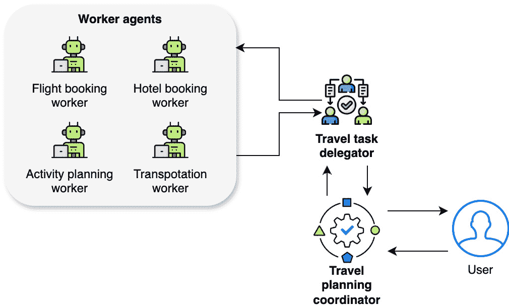

# 6

# 探索协调者、工作者和委派者方法

在上一章中，我们探讨了工具使用和规划的概念，这些概念为智能体增强其问题解决能力奠定了必要的基础。我们研究了各种规划算法，包括状态空间搜索技术和**分层任务网络**（**HTNs**），并考察了这些算法如何与外部工具和资源无缝集成，以使智能体能够最优地执行任务。

在此基础上，在本章中，我们将通过探索智能体的一种强大组织框架：**协调者-工作者-委派者**（**CWD**）方法来巩固我们的理解。本章分为以下主要部分：

+   理解 CWD 模型

+   设计具有角色分配的智能体

+   智能体之间的通信和协作

+   在生成式 AI 系统中实现 CWD 方法

到本章结束时，你将全面了解如何使用 CWD 方法设计和实现多智能体系统。你将知道如何有效地为不同的智能体分配角色，在他们之间建立稳健的通信协议，并编排他们的互动以解决复杂问题。

# 技术要求

你可以在 GitHub 上找到本章的代码文件，网址为[`github.com/PacktPublishing/Building-Agentic-AI-Systems`](https://github.com/PacktPublishing/Building-Agentic-AI-Systems)。在本章中，我们还将使用我们在前几章中已经使用过的 Python 框架来展示 CWD 方法和智能体角色的各个方面。

# 理解 CWD 模型

CWD 模型是一个旨在促进多智能体系统开发的综合框架，强调协作、专业化和任务及资源管理的有效分配。正如人类组织从明确的角色委派和层级结构中受益一样，智能体通过深思熟虑的劳动分工可以实现更高的效率。如图*图 6.1*所示，CWD 框架从组织心理学和管理理论中汲取灵感，将人类协调的既定原则应用于智能体领域。这种方法在智能体系统日益复杂且需要处理越来越复杂的任务，这些任务需要多个专业能力协同工作时尤其有价值。此模型特别适用于需要自主智能体协作以实现可能超出单个智能体能力范围复杂目标的场景。


图 6.1 – CWD 模型

CWD 模型建立了三个不同的角色，它们共同协作以完成复杂任务：

+   **协调员**：协调员是负责管理任务、资源和系统整体工作流程的代理。他们的主要职责包括促进进度监控、将任务分配给适当的代理，以及促进工人之间的有效协作。协调员在确保系统平稳运行和与目标保持一致方面发挥着关键作用。他们作为指挥者，监督整个流程，协调各个组件协同工作。协调员通过根据紧急程度、资源可用性和依赖关系动态分配任务来优先处理工作负载。他们监控进度，根据需要调整分配，并确保代理之间的协作无缝进行。通过优化任务分配和工作流程执行，他们保持系统效率与整体目标的协调一致。

+   **工人**：工人是专注于在系统内执行特定任务或功能的专用代理。这些代理拥有多样化的能力和专业知识，反映了可以应用于各种任务的广泛技能。当被分配任务时，工人利用他们的专业知识和熟练度来高效地实现任务目标。工人代理的多样性允许劳动分工，并将任务分配给最合适的代理，从而优化系统的整体性能。

+   **委托人**：委托人在协调员和工人之间充当中介，负责根据资源可用性和系统需求将工作负载分配给工人。他们作为接口，促进协调员和工人之间的沟通和协调。委托人在调度和平衡多个工人之间的工作负载方面发挥着关键作用，确保任务及时且高效地分配给适当的代理。委托人最关键的功能是通过在适当的时间将任务分配给合适的工人，考虑他们的能力和系统的限制来优化整体性能。委托人通过平衡**吞吐量**、**延迟**和**资源利用率**来优化性能。他们确保任务高效分配以最小化延迟（低延迟）、最大化单位时间完成的任务数量（高吞吐量）并防止资源瓶颈（最优资源利用率）。通过根据工人能力和系统限制动态调整分配，他们提高整体效率和响应能力。

CWD 模型定义了不同的角色——协调员、工人和委托人——他们共同工作以增强系统效率和协作。通过结构化任务分配、沟通和执行，它确保了由支撑其有效性的关键原则驱动的运营和谐。

## CWD 模型的关键原则

CWD 模型基于几个关键原则，这些原则指导其设计和实施：

+   **关注点的分离**：CWD 背后的基本哲学是战略规划（协调者）、资源管理（委托者）和任务执行（工作者）之间责任的明确分离。这种分离允许每个组件专注于其核心能力，同时保持系统灵活性和可扩展性。

+   **层次组织**：该模型实施了一个层次结构，反映了在人类机构中发现的成功组织模式：

    +   **顶层**：战略监督和规划

    +   **中间层**：资源管理和协调

    +   **基础层**：专业任务执行

+   **信息流和反馈回路**：CWD 模型强调双向通信流：

    +   **向下流动**：任务分配、优先级和约束

    +   **向上流动**：进度更新、结果和资源利用率

+   **适应性和弹性**：该模型通过以下方式设计为内在可适应：

    +   **动态资源分配**：代理持续评估工作负载需求，并在实时中重新分配计算或操作资源以优化效率并防止瓶颈

    +   **通过冗余实现容错**：系统使用具有重叠能力的多个代理，允许在出现故障时无缝交接和恢复，并确保不间断的运营

    +   **代理之间的负载均衡**：任务根据代理的可用性、专业知识和当前工作负载智能地分配，防止性能下降并提高响应速度

    +   **运行时角色重新分配**：代理可以根据不断变化的系统需求调整其角色，根据需要承担不同的责任，以保持工作流程连续性和运营有效性

这些机制共同增强了系统适应、恢复和高效运作的能力，即使在不可预测的条件下也能确保持续的性能和可靠性。

CWD 模型的关键原则通过定义角色、培养层次和实现强大沟通来确保清晰性、组织性和适应性。这种结构化方法提高了效率和弹性，使其适用于各种应用，包括智能旅行代理系统的开发。

## 智能旅行代理的 CWD 模型

例如，让我们讨论 CWD 模型如何应用于智能旅行代理系统。整体结构和流程可能如下所示：

+   **协调代理**：此代理将作为旅行计划协调员。此代理将负责以下事项：

    +   根据用户请求管理整体旅行计划流程

    +   促进工作代理之间的进度监控和有效协作

    +   根据客户的旅行需求分配任务和协调工作流程

+   **工作者代理**：可以有多种不同的代理，每个代理在其自己的旅游和酒店管理领域内都有其专业和专长：

    +   **航班预订工作者**：专注于根据旅行日期、目的地和偏好搜索和预订航班选项

    +   **酒店预订工作者**：专注于根据位置、设施和客户偏好寻找和预订合适的住宿

    +   **活动策划工作者**：负责研究和策划旅游目的地的活动、旅游和体验，以满足客户的兴趣

    +   **交通工作者**：专门安排地面交通，如租车、机场接送或当地交通选项

+   **委托代理**：此代理将作为旅游任务委托代理。此代理执行以下操作：

    +   作为旅游策划协调员和专门工作者代理之间的接口

    +   从协调员那里接收旅游策划任务

    +   评估工作者代理的能力和可用性

    +   根据其专业知识和工作量，将适当的任务分配给合适的工作者代理

    +   在工作者代理之间协调和平衡工作量

    *图 6* *.2* 展示了我们对之前的高级 CWD 模型图进行扩展和适应，以适应这个旅游策划场景：



图 6.2 – 旅游策划者的 CWD 模型

让我们通过一个用户需求和工作流程的例子来了解一下：

1.  用户带着他们的旅行需求（例如，目的地、旅行日期、预算和偏好，例如家庭友好型、文化体验和海滩度假）接近智能旅行代理系统。

1.  旅游策划协调员分析客户需求，将整体旅游策划任务分解为子任务。这就是我们在上一章中学到的任务分解发生的地方。

1.  协调员将这些子任务传达给旅游任务委托代理。

1.  委托人评估可用的工作者代理，并相应地分配任务。

1.  工作者代理根据需要相互协作和协调，共享相关信息，确保旅游计划的一致性。

1.  委托人监控任务的进度，并确保工作者代理之间工作量的平衡。

1.  一旦所有任务都完成，工作者代理将它们各自的输出（例如，航班预订、酒店预订、活动行程和交通安排）提交给委托人。

1.  委托人将工作者代理的输出编译和整合成一个全面的旅游计划。

1.  旅游策划协调员审查最终的旅游计划，进行任何必要的调整，并将其呈交给客户审批。

在这个例子中，我们看到了 CWD 模型如何有效地应用于创建一个复杂的旅行规划系统。该模型展示了如何通过专门的智能体将复杂任务分解并高效管理，每个智能体处理旅行规划过程中的特定方面。这种方法不仅确保了全面覆盖所有旅行需求，而且在规划过程中保持了清晰的沟通渠道和责任分配。通过以这种方式构建系统，我们可以在保持质量和对每个客户独特需求的关注的同时，同时处理多个旅行请求。

对于有兴趣实施此系统的人来说，完整的代码实现、详细的示例和文档可以在 GitHub 仓库中的**Chapter_06.ipynb** Python 笔记本中找到。此代码示例使用了工具和规划的概念来实现 CWD 旅行规划器。它还利用了流行的框架，如 CrewAI 和 AutoGen。

在本节中，我们探讨了 CWD 模型，这是一个模仿有效的人类组织实践以构建可扩展、高效和协作的多智能体系统的框架。该模型对角色划分、适应性和结构化沟通的重视确保了它能够无缝地管理诸如旅行规划等复杂、多方面的任务。理解这个模型是至关重要的，因为它为设计能够处理专门角色并在协同工作中实现总体目标的智能体系统提供了基础。

在下一节中，我们将更深入地探讨智能体设计的原则，重点关注如何分配角色和责任可以优化系统性能并将智能体行为与特定目标对齐。这直接建立在 CWD 框架的基础上，为您提供了创建针对各种现实世界应用的智能系统的实用工具。

# 设计具有角色分配的智能体

在 CWD 模型的背景下，设计具有适当角色分配的智能体对于确保多智能体系统的有效运行至关重要。必须仔细考虑每个智能体在实现总体系统目标中的具体角色和贡献。使用 CrewAI 智能体可能是一个很好的解释方式，这些智能体可以初始化一个角色、一个目标和一段背景故事。

在设计这些智能体时，角色定义是它们在系统中的行为和责任的基础。角色明确定义了智能体应该做什么以及它如何适应更大的系统架构。例如，协调智能体可能被分配为*战略规划经理*的角色，这立即确立了他们在监督和指导整体工作流程中的权威。

与此同等重要的是背景故事，它为代理如何处理其职责提供了深度和背景。背景故事不仅仅是传记——它是一个精心编写的叙事，塑造了代理的决策过程和互动风格。考虑一个具有“*一位在硅谷初创公司成功领导多元化团队的资深项目经理，以平衡创新与实际执行而闻名*”背景故事的协调器代理。这个背景故事自然会影响到代理如何做出决策、与其他代理沟通以及处理问题解决方式。需要注意的是，这个背景故事是 CrewAI 特定的实现，CrewAI 将这个背景故事与角色合并到 LLM 的系统提示中，这有助于为模型设定上下文。以下是一个 CrewAI 的示例：

```py
coordinator = Agent(
    role="Strategic Planning Manager",
    backstory="A veteran project manager who has successfully led
              diverse teams in Silicon Valley startups, known for
              balancing innovation with practical execution. Expertise
              in bridging communication gaps between technical and
              non-technical teams while maintaining focus on key
              deliverables.",
    verbose=True
)
```

角色和背景故事的结合创造了一个更加细腻和有效的代理，它可以在多代理系统的复杂动态中运行，同时保持明确的目的和方向。在基于 CWD 的系统内，可以识别出几个典型的代理角色，如下所示：

+   **管理者**：管理者代理负责监控系统操作、管理资源并确保及时完成任务。在 CWD 模型中，管理者代理与**协调器**同义。管理者在监督整个系统并确保其整体有效性方面发挥着关键作用。在智能旅行代理系统的背景下，管理者代理可能负责以下任务：

    +   监控旅行计划进程的进展

    +   将资源（例如，计算资源和访问外部 API 的权限）分配给其他代理

    +   确保旅行计划在指定的时间限制内生成

+   **分析师**：分析师代理在数据分析方面拥有专业知识，并基于其发现提供见解和建议。这些代理可以在系统中提供信息和指导决策过程。在旅行代理场景中，分析师代理可以用于以下任务：

    +   分析客户偏好和旅行趋势

    +   根据数据分析提供对热门目的地或活动的推荐

    +   识别潜在的节约成本机会或最佳旅行路线

    +   总结对用户的成果和建议

+   **反射器**：反射器代理观察系统的性能并识别改进区域。通过持续监控系统操作，反射器可以建议改变或调整，从而提高效率和效果。在旅行代理的背景下，反射器代理可以执行以下操作：

    +   分析客户反馈和满意度水平

    +   识别旅行计划过程中的瓶颈或不效率

    +   提出改进系统算法或工作流程的建议

+   **搜索者**：搜索者智能体探索问题空间，不断寻求新的解决方案，并与其他智能体分享相关信息。这个角色通常涉及创新，因为搜索者会调整系统以应对新情况。在旅行代理领域，搜索者智能体可以执行以下操作：

    +   发现新的旅行目的地或活动

    +   探索替代的交通工具或旅行路线

    +   与其他智能体分享有关新兴旅行趋势或法规的信息

    注意，分析师、反思者和搜索者角色在 CWD 模型中完全属于**工人**类别。

+   **任务解释者**：任务解释者智能体作为协调者和工人之间的桥梁，将高级任务映射到较低级、具体和可执行的动作，供工人智能体执行。这个角色确保任务被工人明确理解和执行。在 CWD 模型中，任务解释者与**委托人**同义。在旅行代理系统中，任务解释者智能体可以执行以下操作：

    +   将客户的旅行请求分解成具体的子任务（例如，航班预订、酒店预订或活动规划）

    +   将客户的偏好翻译成工人代理可执行的任务

    +   确保分配给工人代理的任务清晰且明确

多智能体系统的概念并不新颖，角色分配也是如此——实际上，早在十多年前，Kazík（2010）就进行了一项研究（https://physics.mff.cuni.cz/wds/proc/pdf10/WDS10_103_i1_Kazik.pdf），全面探讨了在多智能体系统开发中的基于角色的方法。该研究强调了角色如何作为不同智能体类中常见的典型行为的抽象表示，通过这些接口，智能体可以获取对环境的知识并影响环境。该研究还强调了角色如何作为不同智能体类中常见的典型行为的抽象表示，通过这些接口，智能体可以获取对环境的知识并影响环境。虽然这些基础概念最初是为传统的多智能体系统开发的，但它们为设计基于现代 LLM 的智能体系统提供了宝贵的见解。

基于角色的建模的关键原则——包括将交互逻辑与内部算法逻辑分离、动态角色分配以及模块化系统组织——在我们设计需要有效协调同时保持明确责任和交互模式的协作 LLM 智能体时尤其相关。通过根据智能体的能力和系统的要求分配特定角色，设计者可以实现基于角色的抽象，这有助于分离关注点，并允许在多智能体系统中进行模块化和可重用设计。例如，在智能旅行代理系统中，智能体可以被分配协调者、工人、委托人等角色。

## 每个代理的职责和角色

这里概述了我们智能旅行规划多代理系统中每个代理的职责和角色，以及他们如何共同为实现系统目标而努力。

+   **旅行规划代理（协调员）**：这个代理作为整个旅行规划运营的战略监督者。他们拥有项目管理与旅行协调的专长，将客户请求分解为可管理的组成部分，建立时间表，并确保所有旅行规划方面都符合客户期望。他们保持对每个旅行计划的全面视角，确保所有元素协同工作，同时管理突发情况并按需调整计划。

    为了更好地理解 CWD 模型如何应用于现实场景，考虑以下例子，一个作为协调员的旅行规划代理，如下面的片段所示。这个代理监督旅行规划过程，确保计划的各个方面都符合客户期望，同时有效地管理资源和应对突发情况。为了说明 CWD 模型中核心旅行工作人员代理的功能，以下示例片段展示了他们的专业角色和专长。每个代理都对特定旅行规划任务的顺利执行做出贡献：

    ```py
    coordinator = Agent(
        role="Travel Planning Executive",
        backstory="A seasoned travel industry veteran with 15 years of experience in luxury travel planning and project management. Known for orchestrating seamless multi-destination trips for high-profile clients and managing complex itineraries across different time zones and cultures. Expert in crisis management and adaptive planning.",
        goals=["Ensure cohesive travel plans", "Maintain high customer satisfaction", "Optimize resource allocation"]
    )
    ```

+   **核心旅行工作人员代理**：这些代理包括以下角色：

    +   **航班预订工作人员**：这个代理专注于复杂的航空预订世界，了解票价类别、航线规则和联盟伙伴关系。它关注航空时刻表、定价趋势和预订政策，同时与航空公司代表保持联系，以处理特殊请求或解决问题，如下面的片段所示：

        ```py
        flight_specialist = Agent(
            role="Aviation Booking Specialist",
            backstory="Former airline revenue management expert with deep knowledge of global aviation networks. Skilled in finding optimal flight combinations and hidden fare opportunities. Has handled over 10,000 flight bookings across all major airlines and alliances.",
            goals=["Secure optimal flight arrangements", "Maximize value for money", "Ensure booking accuracy"]
        )
        ```

    +   **酒店预订工作人员**：作为全球酒店业的专家，这位代理了解不同市场的酒店类别、房型和设施提供。它拥有广泛的酒店忠诚度计划、季节性定价模式和特别促销活动知识，如下面的片段所示：

        ```py
        hotel_specialist = Agent(
            role="Hospitality Accommodation Expert",
            backstory="Previous luxury hotel chain executive with extensive connections in the hospitality industry. Expert in boutique hotels and major chains alike, with deep knowledge of room categories, seasonal trends, and upgrade opportunities across global markets.",
            goals=["Find perfect accommodation matches", "Secure best available rates", "Ensure special requests are met"]
        )
        ```

    +   **活动规划工作人员**：这个代理结合了深厚的文化知识和旅游操作的实践经验。它擅长根据旅行者的兴趣和能力匹配活动，同时考虑季节性可用性、当地习俗和物流限制等因素，如下面的片段所示：

        ```py
        activity_planner = Agent(
            role="Destination Experience Curator",
            backstory="Professional tour guide turned experience designer with expertise in creating memorable travel moments. Has lived in 5 continents and personally vetted thousands of local experiences. Specialist in combining cultural authenticity with traveler comfort.",
            goals=["Create engaging itineraries", "Balance activities and free time", "Ensure cultural authenticity"]
        )
        ```

    +   **交通工作人员**：这个代理专注于地面物流和当地交通解决方案。它了解不同目的地的各种交通选择，从私人车服务到公共交通系统，如下面的片段所示：

        ```py
        transport_coordinator = Agent(
            role="Ground Transportation Logistics Specialist",
            backstory="Former urban mobility consultant with extensive experience in transportation systems worldwide. Expert in coordinating seamless transfers and creating reliable ground transportation plans across diverse global locations.",
            goals=["Ensure reliable transfers", "Optimize local transportation", "Maintain backup options"]
        )
        ```

+   **分析和情报工作人员代理**：在这些代理中，我们有以下角色：

    +   **旅行数据分析工作者**：这个代理专注于将原始旅行数据转化为可操作的见解。它分析预订模式、客户偏好和市场趋势，以提供决策信息和增强旅行推荐，如下所示：

        ```py
        analyst = Agent(
            role="Travel Intelligence Specialist",
            backstory="Data scientist with deep expertise in travel industry analytics. Previously led data science initiatives at major online travel platforms. Developed predictive models for travel trends and customer behavior that increased customer satisfaction scores by 25%. Expert in combining quantitative analysis with qualitative travel insights.",
            goals=["Generate actionable insights", "Identify travel trends", "Optimize customer matching"]
        )
        ```

    +   **旅行体验工作者（反思者）**：这个代理作为系统的质量保证和持续改进专家。它分析反馈，监控性能，并提出系统性的改进建议，以增强旅行规划体验，如下所示：

        ```py
        reflector = Agent(
            role="Travel Experience Optimization Expert",
            backstory="Customer experience strategist with background in both luxury hospitality and digital transformation. Pioneered feedback analysis systems that revolutionized service delivery in major hotel chains. Passionate about creating memorable travel experiences through systematic improvements.",
            goals=["Analyze customer feedback", "Identify improvement areas", "Enhance service quality"]
        )
        ```

    +   **旅行机会工作者（搜索者）**：这个代理作为系统的探索者和创新者，不断寻找新的目的地、独特的体验和新兴的旅行机会，以增强服务提供，如下所示：

        ```py
        searcher = Agent(
            role="Travel Discovery Specialist",
            backstory="Former travel journalist and destination researcher with a network spanning 100+ countries. Has uncovered numerous hidden gems and emerging destinations that became major travel trends. Combines deep cultural understanding with a keen eye for unique travel opportunities. Expert in identifying experiences that match evolving traveler preferences.",
            goals=["Discover unique opportunities", "Identify emerging destinations", "Expand service offerings"]
        )
        ```

+   **委托者代理**：策略和执行之间的关键链接，这个代理在任务优先级和资源分配方面表现出色。他们了解每个工作者代理的能力和当前工作量，确保最优的任务分配和工作流程管理，如下所示：

    ```py
    delegator = Agent(
        role="Travel Operations Orchestrator",
        backstory="Experienced project manager with a background in both travel operations and workflow optimization. Known for exceptional ability to match tasks with the right expertise and maintain balanced workloads across teams. Previously managed large-scale travel operations for Fortune 500 companies.",
        goals=["Optimize task distribution", "Maintain workflow efficiency", "Ensure quality standards"]
    )
    ```

到目前为止，这种基于角色的代理方法在处理复杂的旅行规划场景时，既创建了一个定义明确的层次结构，明确了责任，又保持了灵活性。每个代理的角色和背景故事为其在更大系统中的功能提供了深度和上下文，从而使得交互更加自然和有效。让我们定义经理、分析师、反思者和搜索者代理。*图 6.3*是针对旅行规划系统进一步调整的我们的 CWD 模型，基于角色的代理：


图 6.3 – CWD 模型中旅行规划器的基于角色的代理

让我们考察我们的旅行规划多代理系统如何从最初的客户请求到最终的旅行计划无缝协调旅程。系统利用分层结构，其中协调器代理提供战略监督，委托者代理管理任务分配，专业工作者代理并行执行核心旅行任务和分析功能。这种协调工作流程展示了 CWD 模型的实际应用，通过明确的角色定义和有效的协作，实现高效和智能的旅行规划。以下是步骤分解：

1.  **初始请求** **和规划**：

    1.  客户向系统提交他们的旅行需求。

    1.  协调器代理分析这些需求并制定战略计划。

1.  **任务分配**：

    1.  协调器代理将战略计划传递给委托者代理。

    1.  委托者代理将计划分解为针对核心和分析工作者的具体任务。

1.  **并行处理（核心旅行任务）**：委托者代理将专业任务分配给核心旅行工作者，如下所示：

    +   **航班预订工作者**搜索并预订最优航班

    +   **酒店预订工作者**识别并预订合适的住宿

    +   **活动规划工作者** 创建体验行程。

    +   **运输工作者** 安排地面交通解决方案。

1.  **并行处理（分析和智能）**：同时，分配智能体参与分析工作者，如下所示：

    +   **数据分析工作者** 处理客户数据和旅行模式。

    +   **经验反思工作者** 审查类似的过去行程。

    +   **机会搜索工作者** 识别独特的选项/替代方案。

1.  **集成** **和细化**：

    1.  所有工作者将他们的输出提交回分配智能体。

    1.  分配智能体综合信息。

    1.  协调智能体接收综合计划。

1.  **最终审查** **和交付**：

    1.  协调智能体审查和优化完整的旅行计划。

    1.  最终的旅行计划被呈现给客户。

这种流程展示了各种智能体角色之间的协作，利用他们的专业知识和贡献为顾客生成个性化且优化的旅行计划。每个智能体都扮演着特定的角色，他们的输出由经理智能体（旅行运营经理）和协调智能体（旅行规划协调员）综合和整合，以交付最终的旅行计划。

通过精心设计具有明确角色的智能体，基于 CWD 的多元智能体系统可以有效地协作、利用专业知识和高效分配任务，最终根据客户需求提供个性化且优化的旅行计划。然而，如此复杂的多元智能体系统的成功很大程度上取决于这些智能体之间的沟通和交互方式。让我们在下一节中探讨这些智能体之间如何实现有效的沟通和协作。

# 智能体之间的沟通和协作

在基于 CWD 模型的多元智能体系统中，智能体之间的有效沟通和协作对于实现成功的结果至关重要。智能体需要能够共享信息、协调他们的行动，并为了共同目标而进行合作行为。基于 CWD 系统的沟通和协作涉及以下子节所述的关键方面。

## 沟通

智能体应遵循明确的协议进行交互，包括消息格式和交互模式。这些协议确保智能体能够清楚地理解彼此并适当地行动。例如，在旅行社系统中，智能体可能采用标准化的消息格式和通信协议来交换有关航班选项、酒店可用性或客户偏好的信息。通过遵守这些协议，智能体可以有效地沟通并解释来自其他智能体的消息，从而实现无缝协作。

在示例旅行代理系统中，代理可以遵循标准化的通信协议，例如 FIPA **代理通信语言**（**ACL**），以交换消息和信息。例如，当酒店预订工人代理需要与航班预订工人代理沟通以协调旅行日期时，它可以发送一个 FIPA ACL 格式的消息，指定内容（例如，请求的旅行日期）、发送者（酒店预订）和接收者（航班预订）。

## 协调机制

协调员在建立协调机制中扮演着至关重要的角色，这些机制确保工人代理的活动与系统的整体目标保持一致。这些协调机制允许控制依赖关系，并确保任务在所需的时间框架内完成。在旅行代理系统的背景下，旅行规划协调代理可以实施一种涉及任务优先级、资源分配和进度监控的协调机制，以确保旅行规划过程顺利进行且高效。

旅行规划协调代理可以实施一种协调机制，以确保工人代理的活动与整体旅行规划目标保持一致。例如，它可以采用基于客户偏好或旅行日期的任务优先级机制。如果客户优先考虑首先找到合适的住宿，协调代理可以指示分配代理将酒店预订工人代理的优先级高于其他工人代理。此外，协调代理可以监控每个工人代理的进度，并在必要时重新分配资源或调整优先级，以确保及时完成任务。

## 谈判和冲突解决

在复杂的多人代理系统中，可能存在不同代理的目标或行为相互冲突的情况。为了解决这种情况，代理应该配备谈判策略或冲突解决机制。这些策略通过促进妥协或达成相互可接受的解决方案，有助于维护工作环境的和谐。例如，如果旅行代理系统中的多个工人代理提出了相互冲突的活动计划或交通选择，可以采用谈判机制，根据预定义的标准或通过涉及协调代理进行调解来解决冲突。

假设活动规划工作代理和交通工作代理在旅行的某一天提出了相互冲突的计划。活动规划工作代理可能安排了一整天的观光行程，而交通工作代理则安排了一整天可用的租赁汽车。在这种情况下，可以采用协商机制来解决冲突。委托代理可以充当调解人，收集来自两个工作代理的冲突计划，并提出替代解决方案，例如重新安排观光行程或修改租赁汽车预订。如果无法达成解决方案，协调代理可以介入并基于预定义的标准或客户偏好做出最终决定。

## 知识共享

代理应该具备与其他系统中的代理分享其研究或经验中的知识、见解和发现的能力。这种知识共享促进了持续学习和适应，使系统能够随着时间的推移提高其整体性能。在旅行代理的背景下，旅行数据分析代理可以与其它代理分享从客户偏好分析中得出的见解，使他们能够做出更明智的决策。同样，旅行机会搜索代理可以分享有关新旅行目的地或新兴趋势的信息，使系统能够保持最新状态并相应地调整其产品。 

旅行数据分析代理可以分析客户偏好、旅行趋势和过往旅行的反馈，以生成见解和建议。这些见解可以与其他系统中的代理分享，以改善他们的决策过程。例如，旅行数据分析代理可能识别出生态友好型旅行选项的增长趋势，并将此信息与活动规划工作代理和交通工作代理分享。这些代理随后可以调整他们的产品，包括更多可持续的活动和交通选项，反映不断变化的客户偏好。旅行机会搜索代理可能持续探索新的旅行目的地、独特的体验或新兴的旅行趋势。该代理可以将其发现与其他代理分享，使他们能够将这些新机会纳入各自的规划过程中。例如，如果旅行机会搜索代理发现了一个在热门目的地新开设的生态度假村，它可以与酒店预订工作代理和活动规划工作代理分享这一信息，使他们能够在生成酒店推荐和活动计划时考虑这一新选项。

CWD 模型基于角色的方法为通信渠道和智能体责任确立了明确的边界。通过实施定义良好的通信、协调和知识共享协议，系统利用其智能体的集体智慧，提供适应性强且高效的旅行规划服务。这种结构化的协作使系统能够应对复杂挑战，并在时间上不断改进其性能。

尽管本节概述了基于 CWD 的旅行规划系统中通信和协作的理论框架，但实际实施需要仔细考虑技术方面。本节全面探讨了由 CWD 模型指导的多智能体系统内通信和协作的基础方面。通过遵循定义良好的通信协议、建立稳健的协调机制以及促进有效的知识共享，此类系统能够应对复杂、动态的场景。

下一个部分将基础概念过渡到对实际方法的深入探讨。它侧重于在生成式 AI 系统中实施 CWD 方法，详细介绍了诸如状态空间管理、环境建模、记忆系统以及处理 LLM 上下文等高级技术，以将这些理论概念应用于现实世界的应用中。

# 在生成式 AI 系统中实施 CWD 方法

虽然我们已经探讨了 CWD 模型如何映射到基于 LLM 的智能体，并讨论了我们的旅行规划系统的角色适应性，但在生成式 AI 系统中实施这种方法需要仔细关注几个技术考虑因素。从传统的多智能体系统到基于 LLM 的实现转变带来了独特的挑战和机遇。LLM 凭借其自然语言理解和生成能力，为实施智能体行为和交互提供了新的方式，但也需要特定的架构考虑，以保持 CWD 模型的有序方法。

在传统的多智能体系统中，行为和交互通常通过代码明确编程。然而，在基于 LLM 的实现中，这些方面主要通过精心设计的提示和交互模式来控制。这种根本性的差异要求我们调整 CWD 模型的原则，以便有效地与 LLM 的本质相匹配，同时保持我们讨论的清晰的角色边界和层次结构。

在深入探讨下一章将要涉及的技术细节之前，让我们考察三个关键的实施考虑因素，这些因素构成了任何基于 LLM 的 CWD 系统的基石。这些考虑因素——系统提示、指令格式和交互模式——对于将我们的理论模型转化为实际、可运行的系统至关重要。

## 系统提示和智能体行为

系统提示是 LLM 代理的基本配置层，定义了它们的内核特性和操作参数。与提供特定任务指令的常规提示不同，系统提示在整个操作生命周期中建立代理的持久特性、边界和行为框架。在我们的旅行规划系统中，每个代理的系统提示必须包括以下内容：

+   角色定义和责任范围

+   约束和操作边界

+   与其他代理的通信协议

+   与其角色特定的决策框架

例如，航班预订工作人员的系统提示将包括关于航班搜索参数、定价考虑因素和航空公司伙伴关系的具体指令，而协调员系统提示将专注于高级规划和监督能力。

我们之前已经看到，像 CrewAI 这样的 LLM 代理框架是如何通过**角色**和**背景故事**定义来结构化系统提示的。**角色**组件定义了代理的功能边界和责任，而**背景故事**提供了塑造代理如何处理这些责任的上下文和专业知识。它们共同创建了一个丰富的系统提示，指导代理的行为和决策过程。例如，一个代理的角色可能是*航空预订专家*，而其作为“*前航空公司收入管理专家，对全球航空网络有深入了解*”的背景故事帮助它在路线和定价选项上做出更细微的决策。

## 指令格式化

清晰和一致的指令格式化确保了代理的可靠性能和有效的代理间通信。这在基于 LLM 的系统尤其重要，因为指令是通过自然语言理解来解释的。指令格式化的关键方面包括以下内容：

+   **输入结构化**：任务分配和请求的标准格式。例如，以下结构化输入格式确保航班预订工作人员收到明确的搜索参数，包括出发地和目的地位置的明确规格以及期望的旅行日期：

    ```py
    {
      "task_type": "flight_search",
      "parameters": {
        "departure": "location",
        "destination": "location",
        "dates": "date_range"
      }
    }
    ```

+   **输出模板**：其他代理可以可靠解析的统一响应结构。标准化的输出格式允许代理快速识别任务状态并访问相关信息。**选项**数组可能包含可用的航班，而**推荐**可能包括基于客户偏好的首选选择：

    ```py
    {
        "status": "completed/failed",
        "result": {
            "options": [...],
            "recommendations": [...],
            "constraints": [...]
        }
    }
    ```

+   **通信协议**：明确的消息和状态更新格式。这些协议确保了代理之间的透明通信，包括消息类型、发送者和接收者的明确标识，以及可以轻松处理的结构化内容：

    ```py
    {
      "message_type": "update",
      "sender": "flight_booking_worker",
      "recipient": "coordinator",
      "content": {
        "progress": "in_progress",
        "completion": "60%",
        "pending_tasks": [...]
      }
    }
    ```

## 交互模式

基于 CWD 的系统成功很大程度上依赖于代理之间定义良好的交互模式。在基于 LLM 的实现中，这些模式必须考虑到语言模型交互的独特特性。基本的交互模式包括以下内容：

+   **消息传递协议**：

    +   代理间通信的结构化格式

    +   不同处理阶段之间的清晰移交程序

    +   错误处理和恢复机制

+   **状态管理**：

    +   代理如何保持对其当前任务状态的意识

    +   通过多步骤过程跟踪进度的方法

    +   平行活动的协调

+   **反馈循环**：

    +   代理如何沟通成功/失败

    +   请求澄清或获取额外信息的处理方法

    +   通过交互历史进行持续改进的机制

# 摘要

在本章中，我们探讨了 CWD 模型作为设计有效多代理系统的框架。从早期基于角色的研究的基础概念开始，我们看到这些原则如何完美地适应现代基于 LLM 的代理架构。我们通过一个实际的旅行规划系统来考察这一点，其中不同的代理——从航班预订者到活动规划者——在明确的层级组织下共同工作。关键要点强调了在多代理系统中定义良好的角色和责任的重要性，确保每个代理都能清晰且目的性地操作。它们强调了专业工作者代理如何在协调者的监督下有效地协作，协调者将他们的努力与总体目标对齐。委托人在管理任务和促进顺畅的工作流程分配中发挥着关键作用。此外，本章强调了有效沟通和协作模式的重要性，这对于代理之间无缝的信息交换和协作行为至关重要。最后，实施考虑因素，如设计系统提示和格式说明，对于操作成功至关重要，确保代理交互的清晰和一致性。

这种结构化的代理设计方法使得复杂任务能够被分解并高效执行，同时保持清晰的沟通和责任线。我们的旅行规划示例展示了理论概念如何转化为实际应用。

在下一章中，我们将深入探讨如何有效地设计现实生活中的代理。

# 问题

1.  解释 CWD 模型如何通过旅行规划系统等例子提高多代理系统的效率。

1.  “角色”和“背景故事”在 LLM 代理设计中的意义是什么，它们如何对系统提示做出贡献？请提供一个例子。

1.  通过分析和比较，探讨旅行规划系统中核心旅行工作者与分析和情报工作者之间的功能互补性。

1.  描述基于 CWD 系统的通信和协作的关键方面，包括协议、协调机制和知识共享。

1.  指令格式如何有助于在基于 LLM 的系统中实现有效的代理通信？请用输入和输出结构的例子进行说明。

# 答案

1.  CWD 模型通过创建一个清晰的层次结构来提高效率，其中协调者提供战略监督，分配者管理任务分配，专业工作人员执行特定功能。在旅行规划系统中，这允许并行处理任务——当核心旅行工作人员处理预订和安排时，分析工作人员同时处理数据和寻找机会。这种结构化的方法确保了高效的任务完成，同时保持清晰的职责和沟通线路。

1.  角色和背景故事是 LLM 代理设计中至关重要的组成部分，它们构成了系统提示。角色定义了代理的功能边界和责任（例如，航空预订专家），而背景故事提供了决策所需的上下文和专业知识（例如，“*前航空公司收入管理专家，对全球航空网络有深入了解*”）。它们共同创造了一个丰富的系统提示，指导代理的行为和交互模式。例如，航班预订工作人员的角色和背景故事使其能够根据其在航空运营中的“经验”做出关于航线和定价的复杂决策。

1.  核心旅行工作人员（航班、酒店、活动和交通工作人员）处理旅行安排的实用方面，包括预订和确认预订。相比之下，分析和情报工作人员（数据分析师、经验反思者和机会寻找者）通过分析趋势、处理反馈和识别新机会提供战略支持。虽然核心工作人员执行即时任务，但分析工作人员通过数据驱动的洞察和持续改进增强了系统的决策能力和未来表现。

1.  在 CWD 系统中的通信和协作涉及几个关键组件：标准化的通信协议（如 FIPA ACL）确保代理之间清晰的消息交换；协调机制允许协调者管理依赖关系和时间表；协商策略帮助解决代理之间的冲突（如冲突的活动和交通计划）；知识共享通过共享见解和经验使系统持续改进。这些元素共同工作，创建了一个统一且高效的多代理系统。

1.  在基于 LLM 的系统中，指令格式化确保通过结构化的输入/输出模式实现可靠的代理通信。这种标准化格式确保代理之间通信无歧义，任务规格明确，结果易于解析，从而有助于提高系统的整体效率和可靠性。

# 加入我们的 Discord 和 Reddit 社区

对这本书有疑问或想参与关于生成式 AI 和 LLM 的讨论？加入我们的 Discord 服务器 [`packt.link/I1tSU`](https://packt.link/I1tSU) 和 Reddit 频道 [`packt.link/ugMW0`](https://packt.link/ugMW0)，与志同道合的爱好者建立联系、分享和协作。


