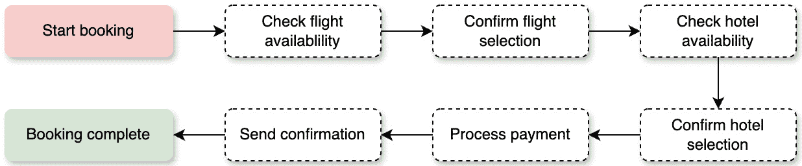

# 7

# 高效的智能体系统设计技术

在上一章中，我们探讨了**协调者-工作者-委托者**（**CWD**）模型，这是一个强调合作和分工的多智能体系统设计的坚实基础。我们深入研究了三个不同的角色——协调者、工作者和委托者——并讨论了它们之间复杂互动和贡献于有效任务分配的细节。

本章首先确立了系统提示和专注指令作为智能体行为基础的重要性。接着探讨了智能体操作环境中的关键概念，如状态空间表示和环境建模。本章继续考察智能体记忆架构和上下文管理策略，这对于在交互中保持智能体行为的连贯性至关重要。最后，它涵盖了高级工作流程模式，包括基于 LLM 的智能体系统的顺序和并行处理方法。本章分为四个主要部分：

+   针对智能体的系统提示和指令

+   状态空间和环境建模

+   智能体记忆架构和上下文管理

+   智能体工作流程中的顺序和并行处理

到本章结束时，你将全面了解如何设计鲁棒、可扩展和有效的智能体系统，这些系统能够处理复杂任务，同时保持一致的行为和性能。

# 技术要求

你可以在 GitHub 上找到本章的代码文件，网址为[`github.com/PacktPublishing/Building-Agentic-AI-Systems`](https://github.com/PacktPublishing/Building-Agentic-AI-Systems)。

# 针对智能体的系统提示和指令

专注指令在指导智能体行动中起着至关重要的作用。它规定了智能体的目标、约束和操作环境。这些指令的清晰度和明确性通常对智能体实现预期目标的表现有显著影响。

## 定义目标

明确定义目标是针对智能体专注指令的一个关键方面。明确的目标是智能体预期功能和行为的基石，引导其行动和决策过程以实现特定目标。

为了更具体地说明这一点，让我们以我们的智能旅行代理为例，该代理被置于客户服务角色。目标将是通过提供个性化的旅行解决方案和有效解决任何查询或问题来最大化客户满意度。这个总体目标包括几个关键组成部分：

+   **个性化**：旅行代理必须根据每位客户的独特偏好、预算和要求定制其推荐和解决方案。这涉及到收集有关客户旅行目标、兴趣和约束的详细信息，并利用这些知识来制定定制的行程和体验。

+   **问题解决**：除了规划旅行安排外，代理还应具备处理客户旅程中可能出现的任何查询、关注点或问题的能力。这可能包括解决预订冲突、提供旅行警告的指导，或在计划中断或变化时提供替代方案。

+   **有效沟通**：最大化客户满意度需要旅行代理清晰且有效地沟通，确保客户理解所提出的解决方案、潜在的权衡以及任何相关细节或建议。清晰的沟通还涉及积极倾听和准确解读客户反馈或关注点。

+   **持续改进**：通过密切监控客户满意度水平并收集反馈，旅行代理可以迭代地改进其能力和方法。这个反馈循环使代理能够识别改进领域，适应不断变化的客户偏好或行业趋势，并持续提升其解决方案和服务质量。

明确的目标提供了一个清晰的基准，可以用来评估代理的表现。在智能旅行代理的情况下，如客户满意度评分、查询或问题的成功解决以及个性化旅行计划的整体质量等指标，可以用来评估代理在实现其主要目标方面的有效性。此外，这些目标指导代理的决策过程，优先考虑与最大化客户满意度一致的行动和解决方案，同时遵守预算、时间或物流限制等约束。一个示例可能如下所示：

目标：作为专家旅行代理，提供个性化的旅行解决方案，同时最大化客户满意度。

核心功能：

- 收集和分析旅行偏好、约束条件和预算

- 创建个性化的旅行推荐和行程

- 解决旅行相关的问题并提供替代方案

- 清晰且专业地沟通

- 监控客户满意度并根据情况调整

约束条件：

- 在规定的预算内

- 优先考虑客户安全

- 遵守旅行规定

- 尊重预订截止日期

行为：

- 使用清晰、专业的语言

- 表现出同理心和耐心

- 预测客户需求

- 提供透明的定价

- 展示利弊选项

- 记录关键需求和截止日期

## 任务规范

详细的任务规范有助于智能代理商清楚地了解他们的职责和责任。通过详细说明要遵循的具体步骤、预期输出以及与特定任务相关的潜在挑战，任务规范使代理商能够有效地运作。以我们的智能旅行代理商为例，任务规范对于确保代理商能够成功导航旅行规划过程的各个方面至关重要。

这里有几个如何为旅行代理商责任的不同部分定义任务规范示例：

+   客户互动和查询处理（步骤如下）：

    1.  欢迎客户。

    1.  收集相关信息（旅行偏好、预算、日期等）。

    1.  确定查询或请求的性质。

    1.  提供适当的回答或解决方案。

    1.  确认客户满意度。

    +   **预期输出**：对客户查询的清晰简洁的回答，个性化的旅行推荐或行程，预订确认或更新。

    +   **潜在挑战**：

        +   含糊或不完整的客户请求

        +   语言障碍

        +   冲突的偏好或限制

        +   处理情绪化或不满意的客户。

+   飞行和住宿预订：

    +   **步骤**：根据客户偏好搜索可用航班和住宿，根据价格、时长、设施和客户评分等因素比较选项，向客户展示最佳选择，并确认和预订所选选项。

    +   **预期输出**：确认的航班和酒店预订，包含旅行详情的行程，发票或付款收据。

    +   **潜在挑战**：可用性有限、价格波动、处理变更或取消、管理团体或特殊住宿。

提供详细的任务规范有助于智能旅行代理商理解旅行规划过程中的每个方面的具体步骤，预期的输出或交付物，以及可能出现的潜在挑战。这种知识使代理商能够有效地处理各种情况，预见并减轻潜在问题，并最终为客户提供无缝且个性化的旅行体验。

飞行查询的样本任务规范可能如下所示：

1.  初始查询：

    +   捕获出发/到达地点

    +   获取首选日期和时间范围

    +   注意任何特殊要求（舱位、转机、航空公司）

    +   确认预算限制

1.  搜索过程：

    +   搜索符合标准的可用航班

    +   根据价格范围和偏好进行筛选

    +   按最佳匹配排序（价格/时长/转机次数）

    +   检查座位可用性

1.  展示：

    +   展示前三个航班选项

    +   显示价格、时长和转机情况

    +   突出独特功能/限制

    +   注意取消政策

    +   输出：

        +   飞行比较摘要

        +   预订确认

        +   旅行警告通知

## 上下文意识

**情境意识**是智能代理行为的基础，使它们能够在指定的环境中有效运作并适应不断变化的情况。这种意识不仅限于简单的任务执行——它包括理解环境、用户需求和影响决策的情境细微差别。在本质上，情境意识是关于理解和应对任何给定互动或决策点周围的所有情境范围。

对于我们的智能旅行代理，情境意识体现在几个关键维度上。考虑代理必须保持对全球和当地情境的意识——从国际旅行限制和季节性天气模式到具体的酒店政策和当地交通选项。这种多层次意识使代理能够做出明智的决策并提供真正满足客户需求的个性化建议。以下图示展示了情境意识的各个层次如何在代理系统中整合。


图 7.1 – 智能代理系统中的情境意识

可以通过几个关键示例来说明情境意识的深度，这些示例来自旅行领域：

+   **目的地智能**：代理保持对旅行目的地的全面了解，包括旺季、当地活动和文化意义。例如，当客户表示有兴趣访问日本时，代理不仅会预订航班——它还会考虑樱花季节、主要节日和地区天气模式，以建议最佳旅行日期和体验。

+   **动态适应**：情境意识使代理能够实时适应不断变化的情况。如果由于天气条件取消航班，代理不仅会传达这一信息——它会立即评估替代路线，考虑对后续预订的影响，并根据客户的偏好和限制提出解决方案。

+   **文化能力**：理解文化规范和当地习俗对于提供有意义的旅行建议至关重要。这可能包括向客户建议宗教场所的适当着装规范，建议适合特定饮食限制的餐厅，或推荐游客应了解的当地习俗，以确保尊重的互动。

通过整合这些情境意识方面的内容，智能体可以预测需求，避免潜在问题，并打造真正个性化的旅行体验。这超出了简单的模式匹配——它需要细微地理解不同的情境元素如何相互作用并影响整体旅行体验。情境意识的真正价值在于其将标准服务互动转化为精心策划体验的能力。当智能体结合目的地具体知识、客户偏好和情境因素时，它可以提供既个性化又实用的建议和解决方案。

# 状态空间和环境建模

状态空间和环境建模构成了智能体感知、理解和与其操作环境互动的基础。本节探讨了设计和实施有效的状态表示和环境模型的关键方面，这些模型使智能体能够做出明智的决定并保持一致的行为。

## 状态空间表示

**状态空间表示**定义了智能体如何维护和更新其对当前情况、可用动作和潜在结果的理解。一个设计良好的状态空间能够使智能体在避免不必要的复杂性的同时跟踪相关信息。对于我们的智能旅行代理示例，状态空间可能包括以下内容：

+   **客户** **档案状态**：

    +   个人偏好和限制

    +   旅行历史和反馈

    +   当前交互上下文

    +   预算参数和灵活性

    +   特殊需求或住宿

+   **旅行** **上下文状态**：

    +   可用航班选项和定价

    +   酒店可用性和价格

    +   天气状况和预报

    +   旅行警告和限制

    +   季节性事件和高峰期

+   **预订** **状态**：

    +   预订状态和确认

    +   支付信息和状态

    +   取消政策及截止日期

    +   行程修改和更新

    +   连接依赖关系

状态空间应设计为同时捕捉静态和动态元素，同时保持效率。例如，智能体可能将航班预订状态、酒店和客户偏好表示如下：

```py
{
    "booking_id": "BK123456",
    "status": "confirmed",
    "components": {
        "flights": [{
            "status": "confirmed",
            "departure": "2024-05-15T10:00:00",
            "cancellation_deadline": "2024-05-01",
            "dependencies": ["hotel_check_in"]
        }],
        "hotels": [{
            "status": "pending",
            "check_in": "2024-05-15",
            "cancellation_policy": "48h_notice"
        }]
    },
    "customer_preferences": {
        "seat_type": "window",
        "meal_requirements": "vegetarian",
        "room_preferences": ["high_floor", "non_smoking"]
    }
}
```

状态包括预订状态和行程组成部分的状态，如航班状态、酒店确认，以及任何其他特定用户偏好。

虽然状态提供了“时间点”表示或特定任务的知识，但智能体运作的更大环境也同样关键。这样的环境通常包括智能体可访问的工具的详细信息，任何智能体需要遵守的具体政策或规则，以及基于特定用例的其他细节。让我们在下一节讨论环境建模涉及的内容。

## 环境建模

**环境建模**是智能代理设计的关键组成部分，它涉及创建代理操作的世界中详细的世界表示。这种表示作为代理对其操作环境的理解，包括它必须与之交互的外部系统到影响其决策的现实世界条件的一切。在其核心，环境建模解决三个基本问题：

+   代理可以与哪些系统和服务交互？

+   哪些规则和约束管理这些交互？

+   代理必须监控和响应哪些变化条件？

例如，在我们的旅行代理系统中，环境模型必须表示代理与航空公司预订系统、酒店预订平台和支付处理器的连接。它还必须编码有关预订程序的业务规则，并保持对价格变化和可用性等动态因素的警觉。一个设计良好的环境模型使代理能够做到以下事情：

+   根据当前情况做出明智的决策

+   有效导航复杂系统和流程

+   适当地对其操作环境的变化做出反应

+   维持符合规则和法规

+   在给定约束内优化结果

环境模型应捕捉到很少改变的静态规则和需要持续监控的动态元素。让我们详细了解静态和动态元素：

+   **静态环境元素**：静态元素代表环境的不变方面，这些方面决定了代理的操作：

    +   **业务规则** **和约束**：

        +   预订政策和程序

        +   支付处理要求

        +   取消和修改规则

        +   服务级别协议

        +   合规性要求

    +   **系统接口**：

        +   API 端点和规范

        +   数据库架构和关系

        +   认证机制

        +   错误处理协议

        +   速率限制和配额

+   **动态环境元素**：动态元素代表环境的变化方面，这些方面需要实时监控和适应：

    +   **资源可用性** :

        +   实时库存水平

        +   价格波动

        +   服务中断

        +   天气条件

        +   本地事件和情况

    +   **系统性能** :

        +   响应时间和延迟

        +   错误率和故障

        +   资源利用率

        +   队列长度和处理时间

        +   系统健康指标

代理操作的环境决定了代理能够多有效地完成给定任务。在为代理建模环境时必须仔细考虑。过多的集成点和系统交互可能会创建一个过于复杂的代理系统。一种常见的缓解方法是使用多个专门设计的代理，这些代理在完成一到两个任务方面非常出色，然后让多个代理协调以实现最终目标。当我们在本章后面讨论顺序和并行工作流程时，这种方法将变得更加明显。在我们到达那里之前，让我们讨论这些多个代理如何相互交互和集成。

## 集成和交互模式

状态空间和环境建模的成功在很大程度上依赖于有效的集成模式，这些模式能够使不同组件之间的交互顺畅。在有效管理这些交互中出现了两个关键模式：

+   **事件驱动更新**：这种模式允许代理对其环境的更改做出动态响应。而不是不断轮询更改，代理接收并处理事件，就像它们发生时一样。例如，当航空公司更新航班状态或酒店房间变得不可用时，这些事件会触发代理状态的即时更新，从而能够对不断变化的情况做出实时响应。以下代码演示了代理如何处理影响旅行预订状态的各类事件。**TravelAgentState** 类包含一个处理不同类型事件并根据情况更新系统的方法。以下代码示例展示了两种可能的事件（航班更改和天气警报）：

    ```py
    class TravelAgentState:
        def update_booking_status(self, event):
            if event.type == "FLIGHT_CHANGE":
                self.check_dependencies()
                self.notify_customer()
            elif event.type == "WEATHER_ALERT":
                self.evaluate_alternatives()
                self.update_recommendations()
            ...
    ```

    让我们来看一个航空公司将航班时间从上午 10 点改为下午 2 点的例子：

    1.  系统接收到一个 **"** **FLIGHT_CHANGE"** 事件。

    1.  **update_booking_status** 方法处理此事件。

    1.  它检查新的航班时间是否会影响酒店预订或转机。

    1.  它会自动通知客户关于更改的信息。

    同样，这个例子显示了针对目的地发布的严重天气警报：

    1.  系统接收到一个 **"** **WEATHER_ALERT"** 事件。

    1.  该方法评估天气是否会影响旅行计划。

    1.  如果需要，它会识别替代日期或目的地。

    1.  它更新提供给客户的建议。

+   **状态验证和一致性**：此模式确保代理对其环境的理解保持准确和可靠。它涉及检查状态转换是否有效，依赖关系是否得到维护，以及是否遵循业务规则。例如，在确认酒店预订之前，代理必须验证日期是否与航班安排一致，以及预订是否符合取消政策。以下代码演示了如何实现健壮的状态验证以确保预订完整性和业务规则遵守。此验证系统充当守门人，在应用之前检查所有状态更改是否有效：

    ```py
    def validate_state_transition(current_state, new_state):
        if not is_valid_transition(current_state, new_state):
            raise InvalidStateTransition("Invalid transition from {current_state} to {new_state}")
        check_state_dependencies(new_state)
        validate_business_rules(new_state)
    ```

下面是如何在实际中实现这一验证：

1.  转换验证示例：

    +   当前状态：**"待处理"**（针对航班预订）

    +   新状态：**"已确认"**

    +   系统检查以下内容：

        +   是否已收到付款？

        +   座位是否仍然可用？

        +   价格是否仍然有效？

1.  依赖关系检查示例：

    +   预订包含航班和酒店

    +   系统验证以下内容：

        +   酒店入住时间晚于航班到达时间

        +   转运服务可用性与航班时间相匹配

        +   房型与旅客人数相匹配

1.  业务规则示例：

    +   正在进行国际预订

    +   系统确保以下内容：

        +   提供护照信息

        +   提供旅行保险

        +   确认取消政策

如果任何验证步骤失败，系统将阻止状态更改并引发适当的错误，以保持预订系统的完整性。

## 监控和适应

有效的监控是维护智能代理系统中稳健的状态和环境模型的基础。全面的监控方法跟踪关键性能指标，这些指标表明了系统的健康和有效性。这些指标包括状态更新的延迟，这直接影响代理实时响应变化的能力，以及模型预测和决策的准确性和精确度。此外，系统必须监控资源利用模式，跟踪错误率和恢复时间，也许最重要的是，衡量反映代理性能实际影响的客户满意度指标。

为了保持最佳性能，智能代理必须采用复杂的适应策略，以应对通过监控获得的见解。这涉及到实施动态资源分配以高效处理不同的工作负载，同时根据新数据和新兴模式持续改进和更新模型。系统应能够根据变化条件调整其规则和优化参数，例如季节性旅行模式或客户偏好的变化。性能调整和扩展机制确保系统可以处理不断增长的需求，同时保持响应性，并且用户反馈的整合有助于使系统的行为与客户期望和需求保持一致。

智能代理系统的最终成功取决于其有效表示和管理其状态空间和环境模型的能力，同时适应不断变化的情况。通过考虑静态和动态元素进行精心设计，实现稳健的集成模式，并维护有效的监控和适应机制，代理可以实现更高的性能并为用户提供更优质的服务。这种对系统设计和维护的整体方法确保了代理在运营环境演变和新挑战出现时，随着时间的推移保持可靠、高效并对用户需求做出响应。

# 代理记忆架构和上下文管理

记忆架构和上下文管理是使智能代理能够维持连贯的交互并基于以往经验和当前上下文做出明智决策的基本组件。本节探讨了创建有效记忆系统和管理基于代理系统的上下文信息的设计原则和实现策略。代理记忆架构通常包含三种不同的记忆类型，每种类型在代理的运行中都有不同的作用：短期记忆、长期记忆和情景记忆。让我们详细讨论这些记忆架构。

## 短期记忆（工作记忆）

**短期记忆**，也称为**工作记忆**，是代理的即时认知工作空间。它暂时持有和管理与当前交互或正在处理的任务相关的信息。这种类型的记忆对于维持对话上下文、处理多步骤过程和管理活跃用户会话尤为重要。在我们的旅行代理系统中，短期记忆对于跟踪正在进行的搜索参数、保持预订过程的当前状态以及记住可能影响即时决策的上下文特定细节至关重要。

例如，当客户正在搜索航班时，短期记忆将保持诸如他们当前搜索标准、最近查看的选项以及他们在当前会话中表达过的任何临时偏好等详细信息。这些信息不需要永久存储，但对于在活跃交互期间提供连贯和个性化的体验至关重要。这种记忆的临时性也有助于有效地管理系统资源，因为数据一旦会话结束或信息变得不相关就会被清除。

对于我们的旅行代理系统，短期记忆的实际实现可能包括以下 Python 类。此类定义了活跃实时对话所需的参数，例如**customer_id**、会话开始时间戳、对话线程中的当前查询以及从用户查询中推断出的任何特定偏好。**update_context**函数用于在对话进行过程中更新**current_interaction**的属性，使短期记忆与当前信息保持最新。由于短期记忆通常是短暂的且与会话特定的，因此使用**clear_session**函数来删除并重置**current_session**的状态，以便为后续的新会话做准备：

```py
class WorkingMemory:
    def __init__(self):
        self.current_interaction = {
            'customer_id': None,
            'session_start': None,
            'current_query': None,
            'active_searches': [],
            'temporary_preferences': {}
        }
    def update_context(self, new_information):
        # Update current interaction context
        self.current_interaction.update(new_information)
    def clear_session(self):
        # Reset temporary session data
        self.__init__()
```

虽然短期记忆有助于为智能体提供足够的环境来执行其任务，但通常还有额外的持久信息，与短暂信息相对，这些信息对于智能体实现其目标至关重要。让我们更深入地了解一下长期记忆，也称为知识库，包含哪些内容。

## 长期记忆（知识库）

**长期记忆**作为代理的持久知识库，存储在多个交互和会话中保持相关和有价值的信息。与短期记忆不同，这种存储类型是为需要长期保存和访问的数据设计的。它构成了代理积累的知识、学习模式和与客户建立的关系的基础。

长期记忆对于保持客户服务的连贯性以及根据历史数据实现个性化交互尤为重要。例如，在我们的旅行代理系统中，这包括存储在多次预订中发现的客户偏好，维护过去的旅行安排记录，以及保存关于目的地、季节性模式和供应商关系的知识。这种持久存储允许代理根据历史模式做出明智的决策，并在不需要客户在每次交互中重复其偏好的情况下提供个性化服务。

长期记忆的实施通常需要仔细考虑数据组织、检索效率和更新机制，以确保存储的信息保持准确和可访问。在我们的旅行代理系统中，这可能包括以下内容：

1.  客户档案和偏好：

    ```py
    class CustomerMemory:
        def __init__(self):
            self.profiles = {
                'preferences': {},
                'travel_history': [],
                'feedback_history': [],
                'special_requirements': {},
                'loyalty_status': None
            }
        def update_profile(self, customer_id, new_data):
            # Merge new information with existing profile
            self.profiles[customer_id] = {
                **self.profiles.get(customer_id, {}),
                **new_data
            }
    ```

1.  旅行知识库：

    ```py
    class TravelKnowledge:
        def __init__(self):
            self.destination_info = {}
            self.seasonal_patterns = {}
            self.service_providers = {}
            self.travel_regulations = {}
        def update_knowledge(self, category, key, value):
            # Update specific knowledge category
            getattr(self, category)[key] = value
    ```

短期和长期记忆是智能代理系统的重要基石。然而，出现了一种第三种类型的记忆，称为事件记忆，尤其是在聊天机器人等对话接口中。这种类型的记忆有助于 LLM 和智能代理进一步细化其行为，并向用户提供指导性输出。

## 事件记忆（交互历史）

**情景记忆**代表一种特殊的记忆形式，它以离散的情景捕捉和存储特定的交互、事件及其结果。这种类型的记忆使代理能够从过去的经验中学习，并利用历史交互来指导未来的决策。与一般长期记忆不同，情景记忆侧重于事件的时序和情境，这使得它在理解客户行为和服务结果模式方面特别有价值。

在我们的旅行代理系统背景下，情景记忆发挥着多个关键功能。它有助于识别成功的预订模式，理解常见的客户旅程路径，并识别过去导致积极结果或挑战的情况。例如，如果客户之前在特定机场遇到了转机时间的问题，代理可以使用这种情景信息来避免未来预订中类似的情况。这种记忆类型还使代理能够通过引用过去的交互及其结果，提供更具情境相关性的回应。

实现情景记忆需要仔细考虑如何以促进高效检索和模式识别的方式组织和存储交互记录。对于我们的旅行代理系统，这可能包括以下内容：

```py
class EpisodicMemory:
    def __init__(self):
        self.interaction_history = []
    def record_interaction(self, interaction_data):
        # Add timestamp and store interaction
        interaction_data['timestamp'] = datetime.now()
        self.interaction_history.append(interaction_data)
    def retrieve_relevant_episodes(self, context):
        # Find similar past interactions
        return [episode for episode in
               self.interaction_history
                if self._is_relevant(episode, context)]
```

在建立了核心记忆系统之后，我们现在转向关注这些不同类型的记忆在实际中是如何协同工作的。代理需要复杂的机制来管理这些记忆系统之间的信息流动，并确保在正确的时间提供正确的信息。这引出了两个关键组成部分：情境管理和决策集成。

## 情境管理

有效的**情境管理**确保代理保持对当前情况和相关历史信息的适当意识。想象一下我们的旅行预订代理在帮助客户计划前往东京和新加坡的多城市商务旅行时。代理必须保持对各种情境要素的意识：客户的差旅政策限制航班费用为 2,000 美元，他们由于安排的会议而偏好早晨航班，以及需要在特定办公地点附近协调酒店预订的需求。随着预订过程的展开，代理在导航于航班搜索、酒店可用性和会议时间限制之间时，会不断参考和更新这些信息。这个现实场景说明了为什么强大的情境管理对于处理复杂的多步骤旅行安排至关重要。有效的情境管理确保代理保持对当前情况和相关历史信息的适当意识。这涉及几个关键组成部分：

+   **情境层次**：情境管理系统应维护不同层次的情境：

    +   **全局情境**：

        +   系统级设置和约束

        +   当前操作状态

        +   全球旅行警报和建议

    +   **会话上下文** :

        +   当前客户交互状态

        +   活跃的搜索和查询

        +   暂时偏好和约束

    +   **任务上下文** :

        +   具体的预订细节

        +   多步骤过程中的当前步骤

        +   相关预订和依赖关系

+   **上下文切换** : 上下文切换是智能体在保持连贯性和连续性的同时，在不同操作上下文之间平滑过渡的关键能力。这个过程涉及几个关键方面：

    +   **上下文保持** :

        +   在切换前保存当前状态

        +   保持上下文变化的记录

        +   确保在转换过程中不丢失任何关键信息

    +   **上下文恢复** :

        +   在需要时检索先前的上下文

        +   重建操作环境

        +   重新建立相关的连接和状态

    +   **上下文合并** :

        +   结合多个上下文的信息

        +   解决不同上下文之间的冲突

        +   在上下文变化中保持一致性

记忆系统和上下文管理之间的复杂交互最终服务于一个主要目的：实现智能决策。通过保持对历史数据和当前上下文的意识，智能体可以做出更明智和有效的决策。让我们来看看这些组件是如何结合在一起以支持智能体的决策过程的。

## 与决策集成

记忆架构和上下文管理系统必须通过几个关键机制有效地支持智能体的决策过程：

1.  **信息检索** : 系统必须有效地从各种记忆组件中收集和综合相关信息，以支持决策。这包括以下内容：

    +   访问客户历史和偏好

    +   检索类似的历史案例及其结果

    +   将当前上下文与历史数据相结合

    +   过滤和优先处理相关信息

1.  **模式识别** : 模式识别能力使智能体能够识别相关的模式和趋势，从而为决策提供信息：

    +   分析历史交互模式

    +   识别成功的预订模式

    +   根据以往经验识别潜在问题

    +   检测季节性趋势和偏好

1.  **决策优化** : 决策过程应结合多个因素，并根据以下因素优化结果：

    +   不同选项的加权评估

    +   考虑多个约束条件

    +   客户偏好和系统要求之间的平衡

    +   风险评估和缓解策略

记忆架构和上下文管理系统的高效集成使代理能够保持连贯的交互，从过去的经验中学习，并做出更明智的决策。通过精心设计这些组件并确保它们无缝协作，代理可以在保持交互一致性同时提供更个性化和有效的服务。

# 代理工作流程中的顺序和并行处理

智能代理系统的效率和效果通常取决于其管理多个任务和流程的能力。本节探讨了代理系统中工作流程管理的两种主要方法：顺序处理和并行处理。

## 顺序处理

**顺序处理**涉及按照定义的顺序处理任务，其中每个步骤都依赖于前一个步骤的完成。在我们的旅行代理系统中，顺序处理对于需要严格排序的任务至关重要，例如以下任务：

1.  飞行和酒店协调：

    +   在预订酒店之前确认航班可用性

    +   确保转接服务与到达时间相匹配

    +   在最终确定预订前验证签证要求

1.  支付处理：

    +   验证资金可用性

    +   处理支付

    +   确认预订

    +   发送确认文件

下图展示了我们旅行预订系统的简单顺序处理工作流程：



图 7.2 – 顺序处理

虽然顺序处理为依赖任务提供了清晰且可控的工作流程，但在处理多个独立操作时可能会导致效率低下。这种限制在复杂用例中尤为明显，例如旅行预订，其中某些任务可能可以同时执行。了解何时应用顺序处理与并行处理对于优化代理的性能和响应时间至关重要。让我们来看看并行处理如何提高我们系统的效率。

## 并行处理

**并行处理**使代理能够同时处理多个独立任务，提高效率和响应时间。关键应用包括以下内容：

1.  并行搜索：

    +   同时查询多个航空公司系统

    +   在不同的酒店连锁中检查可用性

    +   获取天气预报和旅行警告

1.  背景处理：

    +   更新客户档案

    +   处理反馈和评论

    +   监控价格变动

    +   更新旅行警告

下图展示了我们旅行预订系统的可能并行处理工作流程：


图 7.3 – 并行处理

虽然顺序处理和并行处理方法都提供了独特的优势，但真正的挑战在于确定何时使用每种方法以及如何有效地将它们结合起来。代理必须能够根据任务需求、系统负载和时间限制动态地在这些处理模式之间切换。这需要对工作流程优化采取谨慎的方法。

## 工作流程优化

在代理系统中进行有效的工作流程优化需要一种复杂的方法来管理和协调不同的处理模式。这不仅涉及在顺序处理和并行处理之间进行选择，还要了解如何在考虑系统资源、时间限制和任务依赖性的同时有效地将它们结合起来。以下图展示了可能设计的最优和动态工作流程的概念架构：


图 7.4 – 使用动态工作流程进行工作流程优化

下面是对工作流程优化进行详细分析：

1.  **任务分类和优先级**：工作流程优化的第一步是仔细分析和分类任务：

    1.  依赖性分析：

        +   识别必须按顺序完成的临界路径任务

        +   映射不同预订组件之间的依赖关系

        +   理解任务之间的数据流需求

        +   识别时间限制和截止日期

    1.  优先级分配：

    +   评估任务的紧迫性和重要性

    +   考虑客户服务级别协议和期望

    +   评估对整体预订过程的影响

    +   确定资源需求

1.  **资源管理**：有效分配和利用资源对于最优工作流程性能至关重要：

    1.  系统资源分配：

        +   监控和管理 CPU 和内存使用

        +   在不同系统组件之间平衡负载

        +   在需要时实施节流机制

        +   优化数据库连接和缓存

    1.  外部服务管理：

    +   跟踪 API 速率限制和配额

    +   管理并发的外部服务请求

    +   实施失败操作的重试策略

    +   维护服务提供商优先级

1.  **动态工作流程调整**：系统必须能够根据变化的情况调整其工作流程模式：

    1.  负载均衡：

        +   根据系统负载调整并行任务执行

        +   在高峰期间重新分配任务

        +   管理队列深度和处理速率

        +   实施背压机制

    1.  性能监控：

    +   跟踪任务完成时间和成功率

    +   识别瓶颈和性能问题

    +   测量系统吞吐量和延迟

    +   监控资源利用模式

通过精心实施这些优化策略，代理系统可以在保持可靠性的同时实现更好的性能。关键是创建既高效又具有弹性和适应变化条件的流程。这种平衡方法确保代理能够处理复杂的旅行预订场景，同时向客户提供一致和响应的服务。

# 摘要

在本章中，你学习了设计有效代理系统的基本组件和技术。我们探讨了如何通过专注的系统提示引导代理行为，如何通过状态空间表示和环境模型为决策奠定基础，以及如何不同的记忆架构——短期、长期和情景——与上下文管理协同工作，以实现连贯的交互和从以往经验中学习。

通过我们的旅行代理示例，我们展示了如何通过智能工作流程优化策略的支持，将顺序和并行处理模式相结合，使代理能够高效地处理复杂任务，同时保持系统可靠性。这些设计技术共同工作，创建能够有效管理现实场景、适应变化条件并向用户提供一致、高质量服务的系统。通过深思熟虑地实施这些实践，开发者可以创建不仅满足当前需求，而且能够适应未来需求的代理系统。在下一章中，我们将探讨建立生成式 AI 系统信任这一关键主题，检查如何创建透明、可靠和可问责的 AI 解决方案，让用户可以放心依赖。

# 问题

1.  代理系统中三种主要类型的记忆架构是什么，为什么它们对于维持有效代理行为很重要？

1.  解释代理工作流程中顺序处理和并行处理的区别。在旅行预订系统中，你会在什么情况下使用每种方法？

1.  上下文管理如何有助于有效代理操作，以及需要维护哪些关键上下文层级？

1.  环境模型在代理设计中的作用是什么，它与状态空间表示有何不同？

1.  在工作流程优化中，决定在顺序和并行处理方法之间选择时，应考虑哪些因素？

# 答案

1.  三种主要类型的记忆架构如下：

    +   **短期（工作）记忆**：处理即时交互上下文和当前任务所需的临时信息——例如，维护活跃的搜索参数和当前会话状态。

    +   **长期（知识库）记忆**：存储在多个交互中具有持久价值的持久信息，例如客户档案、旅行规定和目的地信息。

    +   **情景记忆**：将特定交互及其结果记录为离散的事件，从而能够从过去经验中学习并在客户行为中识别模式。这些很重要，因为它们使代理能够保持上下文，从经验中学习，并根据当前和历史信息做出明智的决定。

1.  顺序处理涉及按定义的顺序处理任务，其中每一步都依赖于前一步的完成（例如，在预订酒店之前确认航班可用性，在发送确认之前处理付款）。并行处理使同时处理多个独立任务成为可能（例如，同时搜索多个航空公司系统、检查酒店可用性和获取天气预报）。在旅行预订系统中，你会做以下事情：

    +   当任务有依赖关系时（支付→确认）使用顺序处理

    +   使用并行处理进行独立任务（多个供应商搜索）

1.  上下文管理通过确保对当前情况和相关历史信息的适当了解来促进代理操作。关键级别如下：

    +   **全局上下文**：系统级设置、操作状态和全局警报

    +   **会话上下文**：当前客户交互状态、活跃查询和临时偏好

    +   **任务上下文**：具体的预订细节和多步骤流程中的当前步骤。这个层次结构使代理能够在不同操作级别上高效管理信息的同时保持连贯的交互。

1.  环境模型创建了一个全面的表示，包括代理与之交互的外部因素和系统，包括静态规则（业务政策和系统接口）和动态元素（资源可用性和定价变化）。相比之下，状态空间表示侧重于跟踪当前情况、可用动作和潜在结果。环境模型提供了更广泛的操作上下文，其中状态空间存在。

1.  工作流程优化的关键因素包括以下内容：

    +   **任务依赖性**：任务是否有先决条件或可以独立运行

    +   **资源可用性**：系统容量和外部服务限制

    +   **时间限制**：任务完成的紧迫性和服务级别协议要求

    +   **系统负载**：当前处理能力和队列深度

    +   **性能要求**：吞吐量和延迟期望。

    决策应在考虑每个任务的特定要求和整体系统效率目标的同时平衡这些因素。

# 加入我们的 Discord 和 Reddit 社区

对这本书有疑问或想参与关于生成式 AI 和 LLMs 的讨论？加入我们的 Discord 服务器[`packt.link/I1tSU`](https://packt.link/I1tSU)和我们的 Reddit 频道[`packt.link/ugMW0`](https://packt.link/ugMW0)，以连接、分享和与志同道合的爱好者合作。


# 第三部分：信任、安全、伦理和应用

本部分旨在为您提供对构建可信赖、安全和道德的生成式 AI 系统的全面理解，同时探讨该领域的实际应用和未来方向。

本部分包含以下章节：

+   *第八章* ，*在生成式 AI 系统中建立信任*

+   *第九章* ，*管理安全和伦理考量*

+   *第十章* ，*常见用例和应用*

+   *第十一章* ，*结论和未来展望*
