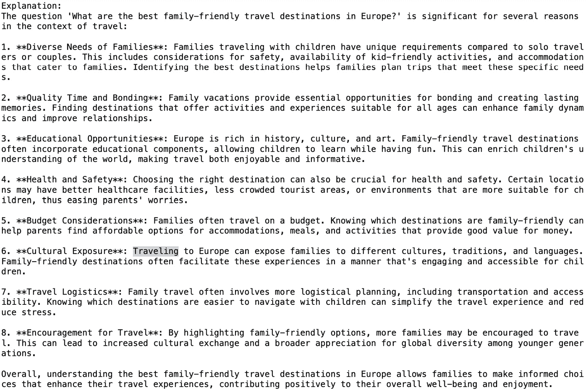

# 8

# 在生成式 AI 系统中建立信任

在上一章中，我们探讨了几个设计方法，这些方法可以有效地引导智能代理朝向期望的行为，同时坚持伦理原则。专注的指令、护栏和约束，以及找到自主性和控制之间的正确平衡，是使这些代理与人类价值观保持一致并减轻潜在风险的关键策略。

通过专注的指令明确目标、任务和操作环境，为代理提供了一个明确的框架，使其在其中运作。护栏和约束作为边界，防止代理误入非预期领域，并最大限度地减少不利后果的风险。同时，结合自主决策和人类控制的平衡方法，允许代理在保持与我们价值观和原则的联系的同时行使独立判断。

然而，在生成式 AI 系统的成功采用和接受之下，隐藏着一个关键组成部分：信任。随着这些技术与社会各个方面的日益交织，培养用户信心和信任对于它们的有效实施至关重要。

在本章中，我们将深入探讨人工智能中信任的重要性，并探讨实现信任的策略。本章强调了信任作为培养用户信心和负责任实施的基本组成部分的重要性。它分为几个部分，每个部分都针对建立信任的不同方面。我们将解决两个重大障碍——不确定性和偏见，并强调透明度、可解释性和清晰沟通的重要性。

本章分为以下主要部分：

+   人工智能中信任的重要性

+   建立信任的技术

+   实施透明度和可解释性

+   处理不确定性和偏见

到本章结束时，你将了解如何开发可靠的生成式 AI 系统，这些系统能够在用户和利益相关者中建立信心，为它们的广泛和负责任采用铺平道路。

# 技术要求

你可以在 GitHub 上找到本章的代码文件，链接为[`github.com/PacktPublishing/Building-Agentic-AI-Systems`](https://github.com/PacktPublishing/Building-Agentic-AI-Systems) 。

# 人工智能中信任的重要性

信任是成功采用和接受 AI 系统（包括生成式 AI）的关键因素。如果用户对这种新技术内部运作和决策过程缺乏信心，他们很可能会不愿意使用或依赖其输出。在生成式 AI 系统中建立信任是赢得用户信心并确保其广泛、负责任和道德使用的重要一步。

考虑这样一个场景，旅行社采用生成式 AI 系统来帮助客户规划假期。AI 可以根据客户的偏好和历史数据提出个性化的行程，推荐住宿，并提供旅行建议。然而，如果客户不相信 AI 的推荐，他们不太可能依赖其建议或分享定制建议所需的个人资料。

这意味着对 AI 的信任是多维度的，与系统的可靠性、透明度以及与用户期望和价值观的一致性相关。用户更有可能与他们认为值得信赖的 AI 系统互动，包括提供反馈和分享数据，以进一步优化和提升 AI 系统的性能和能力。

在旅行社的例子中，如果系统对其决策过程透明，解释了基于他们的偏好和过去的旅行历史为什么建议特定的目的地或活动，客户可能更愿意信任 AI 的推荐。此外，如果 AI 的推荐与客户的期望和价值观相符，例如优先考虑环保或文化沉浸式体验，这将进一步加强对系统的信任。

如果存在信任不足，可能会导致用户持怀疑态度，抵制其采用，最终滥用或误用这种技术。在旅行社场景中，如果客户不相信 AI 的推荐，他们可能会完全忽视其建议或提供不准确的信息，导致行程不佳和用户体验差。

此外，缺乏信任可能会阻碍 AI 系统的持续改进和进步。如果客户由于不信任而不愿意分享反馈或数据，AI 学习并适应其不断变化的首选和需求的能力将受到限制。

为了解决这些担忧，利用生成式 AI 的旅行社和其他组织必须优先通过各种技术建立信任，例如决策的透明度、解决不确定性和偏见、有效传达输出结果，以及确保道德的开发实践。通过培养信任，企业可以释放生成式 AI 的全部潜力，实现无缝采用、负责任的使用以及这些强大技术的持续改进。

在下一节中，我们将探讨一些建立信任的技术。

# 建立信任的技术

开发者和研究社区有多种技术可以帮助培养对生成式 AI 系统的信任，解决用户的担忧和期望。我们将在以下小节中讨论关键技术。

## 透明度和可解释性

了解 AI 系统如何做出决策和生成内容是建立信任的基础。用户需要理解 AI 输出的推理，并对其决策过程有信心。没有这种透明度和可解释性，用户可能会将 AI 视为一个黑盒，这使得完全信任其推荐或输出变得困难。AI 的透明度在两个层面上运作：**算法层面**和**展示层面**。算法透明度涉及对模型架构、训练数据和潜在偏差的开放性，确保开发者和监管者可以评估其可靠性和公平性。展示透明度，或可解释性，关注 AI 如何向用户传达其推理，帮助他们理解为什么做出了特定的决策或推荐。这两个方面对于建立信任都是至关重要的——没有算法透明度，利益相关者可能会质疑系统的完整性，而缺乏可解释性可能会让用户对其输出感到不确定。平衡的方法可以增强对 AI 驱动决策的信心。

让我们再次考虑旅行社场景。想象一下，一位客户正在计划一次欧洲家庭度假，AI 系统根据他们的偏好和旅行历史建议访问某个特定城市。如果 AI 能够透明地解释其推理过程，客户可能会更倾向于信任这个推荐。例如，系统可以强调建议的城市以其家庭友好的景点、丰富的文化遗产和负担得起的住宿而闻名，这与客户对教育和预算友好型旅行的偏好相吻合。

**可解释人工智能**（**XAI**）技术在实现这种透明度方面发挥着关键作用。在一个如 GPT-4 的内容生成系统中，用户可能想知道为什么选择了某些短语或句子，以及 AI 是如何考虑上下文、语气和风格偏好的。XAI 技术，如**注意力可视化**、**显著性图**和**自然语言解释**，可以揭示模型的内部工作原理，使其更具可解释性和可信度。

**chapter08_xai**笔记本提供了一个示例，说明如何仅使用 Python 简单地生成注意力可视化、显著性图和自然语言解释。代码演示了使用预训练的 BERT 模型通过注意力可视化分析文本。它首先导入必要的库，包括用于张量操作的**torch**、用于加载 BERT 模型和分词器的**transformers**，以及用于可视化注意力分数的**matplotlib**和**seaborn**。

该模型（**bert-base-uncased**）用于序列分类，标记器将输入文本处理为标记 ID。核心功能包括通过启用**output_attentions=True**参数从模型中提取注意力分数，该参数提供了关于输入查询中不同标记之间如何相互关联的洞察。然后使用热图可视化注意力分数，该热图显示了最后一层注意力层中标记的注意力分布。这个热图有助于理解模型在处理查询时关注文本的哪些部分。通过将标记 ID 解码为可读的标记并绘制注意力分数，代码使能够详细分析 BERT 处理文本的方式，使其成为 XAI 的有价值工具，其目标是提高模型的可透明性和可解释性。

当被问及“*欧洲最好的家庭友好型旅游目的地是什么？*”时，代码片段使用预训练的标记器对输入文本进行标记化，将其转换为适合模型的张量格式，同时根据需要应用截断和填充。然后定义一个函数，通过将标记化输入传递给模型来提取注意力分数，从而提供关于文本的不同部分如何相互关注的洞察。另一个函数使用热图可视化这些注意力分数，显示带有沿两个轴标记的最后一层的注意力权重。最后，代码检索注意力分数，将标记 ID 解码为其对应的标记，并可视化注意力权重以显示模型对输入文本的关注。*图 8.1* 显示了注意力可视化：

图 8.1 – 注意力可视化

例如，一个注意力可视化可以突出显示用户提示中 AI 在生成内容时关注的特定单词或短语。这有助于用户理解 AI 如何解释他们的输入以及为什么做出了某些创意选择。同样，*图 8.2* 显示了相同句子的显著性图：

图 8.2 – 显著性图

代码（**chapter08_xai**）使用预训练的 BERT 模型对给定句子实现了一个显著性图可视化。该过程从将输入句子标记化为标记 ID 和注意力掩码开始，然后通过模型传递。检索并跟踪标记的嵌入以计算梯度，从而计算显著性分数，指示每个标记对模型预测的贡献程度。使用自定义前向函数将嵌入输入到模型中，显著性属性方法计算显著性分数。然后，这些分数在标记嵌入之间汇总，并将标记转换回可读形式。最后，生成条形图以直观地显示每个标记的重要性，从而提供有关哪些标记对模型决策影响最大的见解。这种方法通过突出驱动其输出的关键标记，允许更好地理解模型的行为。

在某些情况下，自然语言解释可以为模型提供额外的洞察。人工智能和机器学习中的自然语言解释是可读的描述，有助于将复杂的模型输出或决策转化为可理解的语言。它们对于提高可解释性和透明度至关重要，使用户能够理解模型行为的推理。例如，当一个模型对图像进行分类时，自然语言解释可能会描述导致分类的特征，例如“*这张图像被分类为狗，因为它包含狗典型的尾巴和耳朵。*”这些解释架起了机器输出和人类理解之间的桥梁，促进了人类与人工智能之间的信任和协作。例如，请参阅*图 8.3* *.3*：

图 8.3 – 自然语言解释

我们输入相同的文本，“*欧洲最好的家庭友好型旅游目的地是什么？*”，可以清楚地观察到为什么模型（GPT-4o-mini）将其识别为鼓励。在医疗保健或金融等高风险领域，自然语言解释对于确保人工智能决策的问责制和公平性至关重要。通过提供模型得出结论的清晰见解，自然语言解释促进了负责任和道德的人工智能部署。

如果我们看看医疗保健行业，人工智能系统越来越多地被用于疾病诊断和治疗建议等任务。在这些高风险场景中，透明度和可解释性变得至关重要。医生和患者需要理解人工智能诊断或治疗计划的推理，尤其是如果它与既定的医学知识或指南相矛盾。XAI 技术，如特征重要性和规则提取，可以帮助解释影响人工智能决策的因素，使医疗保健专业人员能够评估推荐的合理性并建立对系统的信任。

类似地，在金融领域，AI 模型被用于诸如信用风险评估、欺诈检测和投资组合优化等任务。XAI 可以帮助金融机构理解影响 AI 决策的因素，确保合规性，并在客户和利益相关者之间建立信任。

开发人员和研究人员可以根据具体用例和模型架构利用各种 XAI 技术。例如，显著性图对于计算机视觉任务可能很有用，而自然语言解释可能更适合文本生成或语言理解模型。

通过优先考虑透明度和可解释性，组织可以创建既准确又值得信赖的 AI 系统。用户可以理解 AI 输出的推理，评估其决策，并最终对系统的能力建立信心，为这些强大技术的广泛和负责任的应用铺平道路。

## 处理不确定性和偏差

AI 系统需要被设计成能够识别和减轻通过其训练数据或算法引入的不确定性和偏差。量化不确定性和主动尝试最小化偏差是建立生成式 AI 系统与用户之间信任的关键步骤。

在旅行社场景中，考虑一个基于用户偏好和历史数据的生成式 AI 系统，该系统推荐个性化的旅行行程。如果用户提供了一个模糊或含糊的提示，例如“*我想去冒险*”，AI 系统应该能够承认在解释这样一个广泛请求中涉及的不确定性。它可以通过提供一系列可能的行程选项或强调需要用户进一步澄清来传达这种不确定性。

此外，AI 系统可能由于其训练数据而具有固有的偏差。例如，如果训练数据主要包含更富裕的旅行者或专注于特定地区，AI 的推荐可能会偏向于豪华住宿或热门旅游目的地，无法捕捉到旅行体验的多样性。解决这些偏差对于建立信任和确保公平包容的推荐至关重要。

如去偏见算法、对抗性训练和人工监督等技术可以帮助减少与性别、种族、年龄或社会经济地位等因素相关的偏见。去偏见算法旨在通过调整模型参数或修改训练数据来消除或减轻偏见。对抗性训练涉及训练模型对有偏见或对抗性输入具有鲁棒性，而人工监督允许手动干预和纠正有偏见的输出。例如，一个文本到图像生成模型应该能够承认并传达在解释模糊提示或生成复杂场景中涉及的不确定性。如果用户请求一个*魔法森林的图像*，AI 系统可以生成多个变体，并为每个图像提供置信度分数或不确定性估计，使用户能够理解模型的解释和潜在局限性。

在医疗保健领域，AI 系统越来越多地被用于疾病诊断和治疗建议等任务，处理不确定性和偏见至关重要。AI 模型应该能够量化其预测中的不确定性，特别是在输入数据不完整或模糊的情况下。此外，解决与种族、性别或社会经济地位等因素相关的偏见对于确保公平和公正的医疗保健结果至关重要。通过实施识别、量化和管理不确定性和偏见的技术，开发者和研究人员可以创建既准确又透明、值得信赖的 AI 系统。用户可以更好地理解系统的局限性和潜在偏见，从而做出更明智的决策并负责任地使用这些强大的技术。

## 有效的输出沟通

AI 生成内容的框架和解释方式对用户信任有重大影响。开发者应确保输出内容明确标注为 AI 生成，在适当的情况下提供上下文和归属，并建议用户如何进一步解释和使用内容。

在旅行社场景中，考虑一个基于用户偏好和目的地创建个性化旅行博客文章或行程描述的生成式 AI 系统。有效的输出沟通对于确保用户理解 AI 生成内容的性质和限制至关重要。

首先，AI 生成的旅行博客文章或行程描述应明确标注为*AI 生成*或*AI 辅助*，以设定适当的期望并避免任何混淆或误代表。此外，AI 系统可以提供有关生成内容所使用的数据源和算法的背景信息，例如旅行数据类型、用户评论和使用的语言模型。

此外，AI 系统应透明地沟通生成内容中任何潜在的偏见或局限性。例如，如果训练数据主要关注热门旅游目的地或主流旅游体验，AI 生成的内客可能缺乏对非主流或细分旅游机会的代表性。通过承认这些局限性，用户可以更好地理解 AI 生成内容的范围和潜在盲点。

关于如何负责任地解释和利用 AI 生成内容的指南也可以培养信任。例如，AI 系统可以建议用户在完全依赖 AI 生成信息之前，对特定细节进行事实核查或验证，例如营业时间、入场费或当地习俗。此外，系统可以建议在规划旅行行程时，将内容与其他可靠来源交叉核对或寻求当地专家意见。

在新闻和新闻领域，AI 生成内容越来越普遍，有效的输出沟通至关重要。AI 生成的新闻文章应明确标明，并包含关于数据来源以及任何潜在偏见或局限性的信息。例如，如果 AI 系统是在特定的新闻来源或时间段上训练的，它可能在报道或事件框架中存在固有的偏见。

此外，关于事实核查和信息验证的指南可以帮助用户负责任地参与 AI 生成内容。新闻机构可以为用户提供资源或清单，以便用户将 AI 生成的文章与其他可靠来源交叉核对，核查声明，并评估文章的客观性和平衡性。

通过实施有效的输出沟通策略，开发者和组织可以促进透明度，管理用户期望，并赋予用户批判性和负责任地参与 AI 生成内容的能力。这种方法培养了信任，减轻了潜在误解或滥用的风险，并为在各个领域负责任地采用生成式 AI 技术铺平了道路。

## 用户控制和同意

用户控制和同意指的是允许用户在定制和影响生成过程方面拥有更多自由，以及就数据使用和内容创作征求明确同意的功能。这有助于建立信任并确保用户承诺。

在旅行代理场景中，考虑一个基于用户偏好和历史数据的生成式 AI 系统，该系统能够创建个性化的旅行行程或推荐。赋予用户对生成过程的控制权可以帮助建立信任，并确保 AI 生成的内客与他们的具体需求和期望相符。

例如，AI 系统可以允许用户调整诸如旅行风格（例如，冒险、放松或文化）、预算范围、时长或期望活动等参数。通过赋予用户调整这些参数的能力，他们可以更好地影响 AI 的推荐，并对生成的输出有控制感。这种程度的定制可以提高用户满意度并增强对 AI 系统的信任，因为他们感觉到他们的偏好被准确地反映在推荐中。

此外，在用户使用其个人数据或旅行历史方面寻求明确的同意可以促进透明度并建立信任。AI 系统可以提供关于正在收集的数据、如何使用这些数据以及任何潜在风险或限制的清晰且易于理解的信息。用户随后可以提供知情同意，允许 AI 系统利用他们的数据，同时尊重他们的隐私和自主权。

在创意写作领域，一个 AI 驱动的写作助手可以允许用户调整诸如语气（例如，正式、随意或幽默）、风格（例如，描述性、简洁或叙事）或内容边界（例如，适合家庭或包含成人内容）等参数。通过赋予用户这种程度的控制权，他们可以更好地将 AI 生成的内容与他们的期望创意愿景相匹配，从而培养对 AI 系统的所有权感和信任感。

此外，使用个人写作样本或数据的同意请求可以促进用户与 AI 系统之间的透明度和信任。AI 系统可以清楚地解释用户数据将如何被利用，例如用于训练或个性化目的，并为客户提供控制访问级别或随时撤回同意的选项。

在个性化医疗保健领域，AI 系统可以允许用户调整与治疗方式（例如，传统、替代或综合）、风险承受能力或特定饮食或生活方式考虑相关的偏好。通过赋予用户对这些参数的控制权，AI 生成的治疗方案或推荐可以更好地与他们的个人价值观和偏好相一致，从而促进对 AI 系统推荐的信任和承诺。

通过整合用户控制和同意功能，开发者和组织可以创建既准确高效又透明、尊重用户自主权、对个人偏好和需求做出响应的 AI 系统。这种方法可以促进信任、用户承诺，并在各个领域负责任地采用生成式 AI 技术。

## 伦理发展和责任

公平、隐私和知识产权是开发生成式人工智能系统过程中应高度重视的伦理考量。开发者应优先考虑诸如隐私保护技术、负责任的数据处理和尊重知识产权等实践。确保人工智能系统不会延续有害的偏见或歧视某些群体，对于建立信任和负责任地采用至关重要。

在旅行代理场景中，考虑一个创建个性化旅行推荐和行程的人工智能系统。道德发展和责任应放在首位，以确保人工智能系统公平运作、尊重用户隐私并避免侵犯知识产权。

公平和非歧视是指导此类人工智能系统开发的必要原则。用于生成推荐的训练数据和算法应仔细评估，以识别和减轻潜在的偏见或歧视性模式。例如，如果训练数据主要包含针对特定人口群体或收入水平的旅行体验，人工智能系统可能会无意中在其推荐中延续偏见，排除或未能充分代表某些社区或旅行偏好。

开发者应实施诸如去偏算法、对抗性训练和多样化数据收集策略等技术，以确保人工智能系统无论在种族、性别、年龄或社会经济地位等因素下，都能生成公平和包容的推荐。通过优先考虑公平和非歧视，用户可以信任人工智能系统会平等对待他们，并且不会强化有害的刻板印象或偏见。

隐私是开发生成式人工智能系统时的另一个关键伦理考量。如果用户对人工智能系统保护其隐私的能力缺乏信心，他们可能会犹豫分享个人信息或旅行历史。开发者应实施隐私保护技术，如差分隐私、安全多方计算或加密数据处理，以确保用户数据得到负责任的处理并受到未经授权访问或滥用的保护。

此外，应建立负责任的数据处理实践，以确保用户数据按照相关隐私法律和法规进行收集、存储和处理。透明度高的数据政策和用户同意机制可以通过赋予用户控制其数据如何被人工智能系统使用的方式，进一步建立信任。

在生成式 AI 系统的领域，知识产权也是一个重要的关注点。在创建旅游内容或推荐时，AI 系统应尊重版权、商标和其他知识产权。开发者应实施检测和预防未经授权使用受版权保护材料或生成侵犯现有知识产权内容的技术的措施。

此外，当使用或引用第三方内容或数据源时，AI 系统应提供适当的归属和信用。这不仅尊重知识产权，而且促进了用户之间的透明度和信任，用户可以验证所提供信息的来源和可信度。

通过优先考虑道德开发实践并解决与公平、隐私和知识产权相关的问题，开发者可以创建不仅强大高效，而且值得信赖和负社会责任的生成式 AI 系统。用户和利益相关者可以对 AI 系统的完整性有信心，从而促进这些技术的广泛采用和负责任的使用。

通过实施这些技术，开发者和研究人员可以创建透明、问责并与用户期望和伦理原则一致的生成式 AI 系统，从而培养信任并促进这些强大技术的广泛负责任的应用。

在公平和问责制的基础上，让我们在接下来的几节中探讨如何在现实生活中实施这些实践。

# 实施透明度和可解释性

透明度和可解释性是任何值得信赖的 AI 系统的基本特征。确实，对 AI 模型在构建内容时如何做出决策的解释将为用户提供洞察，了解导致这种输出的推理过程，从而培养对系统可靠性的信任和信心。

考虑到旅行代理场景，其中生成式 AI 系统根据用户偏好和历史数据推荐个性化的旅行行程。透明度和可解释性对于建立此类系统的信任至关重要。用户可能希望了解为什么某些目的地或活动被推荐而不是其他，以及 AI 如何考虑他们的偏好、预算限制和旅行历史。

如我们之前所见，显著性图、特征重要性和自然语言解释是一些可以用于促进 AI 系统透明度和可解释性的 XAI 技术。这些方法提供了对 AI 驱动决策中最重要的输入特征或数据点的洞察，以及这些特征的变化如何影响输出。

例如，显著性图可以突出用户个人资料或偏好中最具影响力的特定方面，从而生成特定的旅行推荐。这种视觉表示可以帮助用户理解 AI 决策背后的推理，并确保推荐与他们的真实偏好一致。

特征重要性技术可以量化不同输入特征（如旅行历史、预算或期望的活动）在塑造 AI 推荐中的相对重要性。这些信息可以帮助用户识别 AI 决策过程中任何潜在的偏见或偏差，并提供反馈以供进一步改进。

自然语言解释可以为 AI 的推荐提供文本上的正当理由，解释建议特定目的地、住宿或活动的理由。这些解释对于非技术用户尤其有价值，使 AI 的决策过程更加易于理解和接受。

透明度的另一个方面是披露与生成式 AI 系统相关的局限性和潜在风险。换句话说，用户应该意识到，尽管这项技术非常强大，但它并不完美，并受不确定性和偏见的影响。

例如，旅行推荐 AI 系统可能在理解细微或特定情境的偏好方面存在局限性，或者由于其训练数据的特点，可能偏向于热门目的地。开发者应设定合理的期望，并明确说明如何使用这项技术，承认其优势和局限性。

在医疗领域，当 AI 系统用于诊断或治疗建议等任务时，透明度和可解释性尤为重要。医生和患者需要理解 AI 决策背后的推理，尤其是在它们与既定的医学知识或指南相矛盾时。XAI 技术可以帮助解释影响 AI 决策的因素，使医疗专业人员能够评估推荐的合理性并建立对系统的信任。

# 处理不确定性和偏见

不确定性和偏见是 AI 系统（包括生成式 AI 模型）固有的。不确定性可能由于各种原因产生，例如数据的不完整或模糊、本质上不可预测的事件，或模型的知识或训练过程中的限制。

在旅行代理场景中，考虑一个基于用户偏好和历史数据的生成式 AI 系统，该系统推荐个性化的旅行行程。不确定性可能源于用户输入的模糊或含糊不清、训练数据中的不完整或过时旅行信息，或如天气中断或当地冲突等不可预见的事件。

为了处理不确定性，开发者可以考虑在生成式 AI 系统中采用概率建模、贝叶斯推理和不确定性量化方法。这些技术使模型能够提供概率或置信区间，而不是确定性输出，随着新数据的到来更新信念，并估计与其预测相关的不确定性。

例如，当用户提供一个广泛的提示，如“*我想去一次浪漫之旅*”时，AI 系统可能会展示多个潜在的行程选项，并附带相关的置信度分数或不确定性估计，使用户能够理解模型对结果的置信度并做出明智的决定。

另一方面，由于训练数据、算法设计或社会偏见等因素，偏差可能会在 AI 系统中显现。这些偏差可能导致不公平或歧视性的结果，延续历史不平等并损害对系统的信任。

在旅行代理场景中，如果训练数据主要包含针对特定人口群体、收入水平或文化视角的旅行体验，可能会产生偏差。因此，AI 系统的推荐可能会无意中排除或未能充分代表某些社区、旅行偏好或目的地。

解决 AI 系统中的偏差需要多层次的方法，包括使用具有代表性的和多样化的训练数据，频繁监控和评估模型性能，以及整合来自不同利益相关者的反馈。这有助于识别和减轻潜在的偏差，确保 AI 系统生成公平和包容的推荐。

例如，在旅行推荐系统中，开发者可以实施去偏算法以减少与种族、性别或社会经济地位等因素相关的偏差。此外，他们可以引入人工监督，让旅行专家或多样化的用户群体审查并就 AI 的推荐提供反馈，帮助识别和纠正任何偏差或疏忽。

通过解决不确定性和偏差问题，生成式 AI 系统可以赢得用户的信任，并确保技术被负责任和道德地使用。用户可以对 AI 生成的输出的可靠性和公平性有信心，促进其在各个领域的广泛应用和积极影响。

# 摘要

总结来说，信任是生成式 AI 成功采用和负责任使用的基础。透明度和可解释性赋予用户理解 AI 决策背后的理由，培养信心和可靠性。高级技术，如显著性图、特征重要性分析和自然语言解释，增强了可解释性，同时解决不确定性和偏差确保了稳健和公平的结果。

清晰的沟通，辅以标签、上下文和指导，使用户能够负责任地参与 AI 输出。全面缓解偏差、道德开发实践以及以用户为中心的功能，如控制和同意机制，进一步巩固信任。

通过接受这些原则，开发者可以释放生成式 AI 的变革潜力，推动有意义的创新和社会进步。随着这项技术的发展，始终如一地关注用户信任将为人类与 AI 之间的和谐合作铺平道路，塑造一个建立在问责制、公平性和共同成功基础上的未来。

随着我们深入探讨生成式 AI 的复杂性，下一章将探讨关键主题，包括潜在风险和挑战、确保安全和负责任 AI 的策略、伦理指南和框架，以及解决隐私和安全问题的紧迫需要。

# 问题

1.  为什么信任对于生成式 AI 系统的采用至关重要？

1.  透明度和可解释性在建立 AI 信任中扮演什么角色？

1.  不确定性偏差如何影响生成式 AI 系统？

1.  AI 开发者如何通过道德开发实践培养信任？

1.  组织可以采取哪些步骤来提高用户对 AI 生成输出的信任？

# 答案

1.  信任对于生成式 AI 的广泛和负责任采用至关重要。如果用户对系统的决策过程缺乏信心，他们就会不愿意依赖其输出。信任影响用户如何与 AI 互动，无论是分享反馈、提供数据，还是最初采用这项技术。缺乏信任可能导致怀疑、抵制，甚至滥用 AI 系统。

1.  透明度和可解释性有助于用户了解 AI 系统如何得出决策，使其更加值得信赖。透明度在两个层面上运作：

    +   **算法透明度** – 对模型架构、训练数据和偏差的开放性确保 AI 系统可以评估其可靠性和公平性。

    +   **呈现透明度（可解释性）** – AI 应清楚地传达其推理过程，以便用户可以理解和信任输出。注意力可视化、显著性图和自然语言解释等技术有助于用户理解 AI 生成的决策。

1.  不确定性和偏差可以显著影响生成式 AI 的公平性和可靠性：

    +   当 AI 缺乏足够的数据、接收模糊的输入或遇到不可预测的场景时，就会产生不确定性。解决它需要概率建模和置信度评分，以有效地传达不确定性。

    +   偏差可能通过训练数据、算法设计或社会影响引入。如果不加以缓解，偏差可能导致不公平或歧视性的结果，排除某些群体或观点。如去偏算法、对抗训练和多元数据收集等技术有助于减少偏差并提高公平性。

1.  伦理人工智能开发需要公平性、隐私和知识产权保护：

    +   **公平性**：AI 模型应在多样化和代表性数据上训练，以避免偏见。

    +   **隐私**：用户数据应负责任地处理，遵循保护隐私的技术，如差分隐私和加密。

    +   **知识产权保护**：AI 生成的内容应尊重版权并提供适当的归属。

    通过实施这些原则，开发者可以构建用户信任并负责任地采用的 AI 系统。

1.  通过明确传达 AI 生成的输出，组织可以增强信任，确保用户了解其局限性以及如何解释它们。关键策略包括：

    +   对 AI 生成的内容进行标记，以设定明确的期望。

    +   提供推荐或决策的解释，确保用户了解为什么生成该输出。

    +   允许用户控制和同意，以便他们可以自定义 AI 行为并影响其决策过程。

# 加入我们的 Discord 和 Reddit 社区

对书籍有疑问或想参与关于生成人工智能和大型语言模型（LLMs）的讨论？加入我们的 Discord 服务器[`packt.link/I1tSU`](https://packt.link/I1tSU)和 Reddit 频道[`packt.link/ugMW0`](https://packt.link/ugMW0)，与志同道合的爱好者建立联系、分享和协作。

