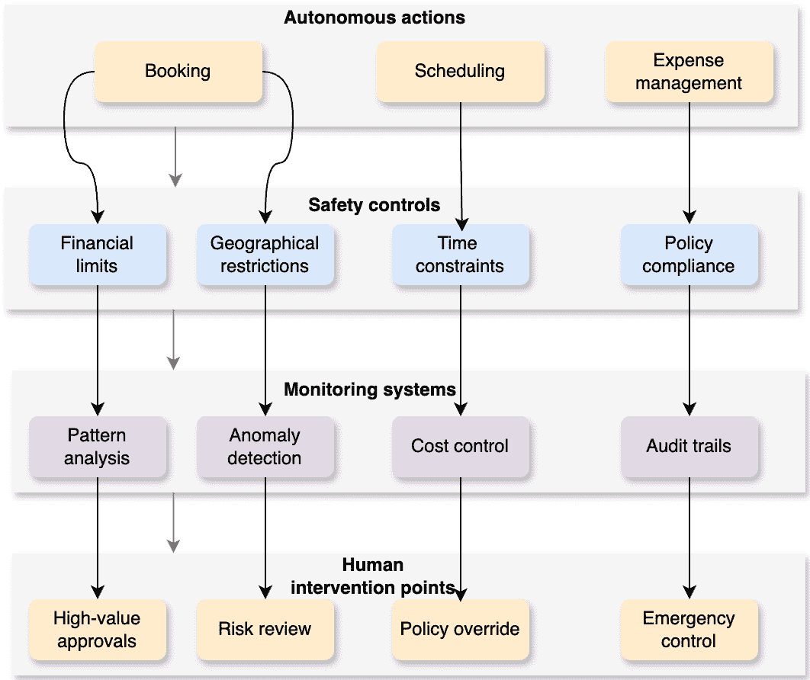

# 9

# 管理安全和伦理考量

在上一章中，我们探讨了信任在促进生成式人工智能系统成功采用和接受中的关键作用。我们研究了培养信任的方法，强调了透明度、可解释性、解决偏见和不确定性以及清晰传达人工智能输出以提升用户理解和信心的作用。随着生成式人工智能技术的快速发展，受到从创意产业到医疗保健等众多领域的巨大兴趣和热情的推动，迫切需要解决这些强大系统的安全和伦理影响。现在的讨论转向了与生成式人工智能相关的潜在风险和挑战，包括安全且负责任部署的策略、伦理指南以及关于隐私和安全的考虑。

生成式人工智能系统的非凡能力既引发了敬畏，也引发了担忧，突显了采取积极措施减轻潜在风险和确保负责任开发和部署的必要性。虽然这些技术具有推动创新和积极变革的巨大潜力，但它们的误用或意外后果可能产生深远的影响。本章分为以下主要部分：

+   理解潜在风险和挑战

+   确保安全且负责任的人工智能

+   探索伦理指南和框架

+   解决隐私和安全问题

到本章结束时，你将了解生成式人工智能的关键风险和挑战，包括虚假信息和偏见问题，了解安全部署的策略，并深入了解关于隐私和数据保护的至关重要伦理考量。你还将发现平衡创新与社会福祉的负责任人工智能开发的框架和指南。

# 理解潜在风险和挑战

随着大型语言模型（LLMs）的出现，人工智能的格局发生了显著变化，这些模型既推动了生成式人工智能，也推动了代理系统的发展。虽然生成式人工智能主要关注根据提示和模式创建内容，但建立在相同 LLMs 之上的代理系统通过融入决策、规划和目标导向的行为，将这一能力进一步扩展。这种生成能力与代理的结合创造了一种强大但可能具有风险的协同效应。

代理系统利用大型语言模型（LLMs）的生成能力，不仅能够生成内容，还能主动分析情况、制定策略并采取行动以实现特定目标。这意味着生成式人工智能系统内固有的风险，如偏见、幻觉或生成误导性信息，当系统根据这些生成内容自主或半自主地行动时，变得尤为重要。

生成式人工智能系统由大规模语言模型驱动，虽然功能强大，但也表现出各种漏洞和风险。这些风险可以大致分为以下关键领域。

## 对抗性攻击

与生成式人工智能系统相关的一个显著风险是它们容易受到对抗性攻击。恶意个人可以通过精心设计的输入或扰动来利用这些系统的缺陷，以破坏数据，导致有害的输出或提取机密信息。这些对抗性攻击可能产生严重的后果，如数据泄露、未经授权访问敏感信息或生成恶意或误导性内容。

当这些漏洞扩展到代理系统时，风险变得更加明显，因为这些系统不仅生成响应，而且根据其理解执行行动。对代理系统的对抗性攻击可能会操纵其决策过程，导致其自主采取有害行动或做出危险选择。例如，管理供应链运营的代理系统可能会被诱骗做出灾难性的库存决策，或者交易代理可能会被操纵执行有害的金融交易。

在旅游行业中，考虑这样一个场景：一家旅行社使用一个代理人工智能系统，不仅提供个性化的旅游推荐，还能自动预订航班、酒店和活动。对这样一个系统进行对抗性攻击可能会带来灾难性的后果。除了推荐不安全的旅游目的地外，该系统可能会主动在危险地区进行预订，与欺诈性供应商确认预订，或者执行可能损害客户安全的金融交易。

此外，对抗性攻击还可以用来从系统中提取敏感信息，例如客户旅游历史、信用卡详情或个人偏好。在代理系统中，这种风险被放大，因为它们通常有更广泛的访问权限来执行交易和做出决策，可能将更多敏感数据和控制点暴露给攻击者。

已经有关于对人工智能系统进行对抗性攻击的实际情况被记录下来。2017 年，研究人员展示了如何对图像进行微小的扰动，使最先进的计算机视觉模型误分类对象，例如将停车标志识别为限速标志。同样，在自然语言处理领域，研究人员已经展示了精心设计的输入序列如何导致语言模型生成有害或不适当的内容。当这些漏洞在代理系统中被利用时，影响可能会从内容生成扩展到实际的现实世界行动和决策。

类似地，在医疗环境中，对用于诊断或治疗建议的代理人工智能系统的对抗性攻击可能导致危及生命的安全错误或数据泄露。想象一下这样的场景：一个对抗性输入不仅导致 AI 误诊某种状况，还自动安排错误的治疗方案，订购错误的药物，或对其控制的医疗设备进行危险调整。

这些例子突出了对抗性攻击对生成式和代理人工智能系统可能产生的严重后果，强调了采取强大安全措施和持续研究防御机制的重要性。如对抗性训练、输入净化和异常检测等技术可以帮助减轻风险，但这是一个需要警惕和 AI 社区内协作的持续挑战。对于代理系统，采取额外的安全措施，如行动验证、决策审计和多步骤身份验证过程，对于防止恶意利用其自主能力至关重要。

## 偏见与歧视

我们知道，生成式人工智能模型是在可能包含固有偏见和历史偏见的庞大数据集上训练的。当这些模型成为代理系统的基础时，偏见的含义变得更加关键，因为这些系统不仅生成内容，还做出可能直接影响人们生活的自主决策。

人工智能系统中的偏见问题一直是长期关注的问题，生成式人工智能模型以及建立在它们之上的代理系统都容易受到这一挑战。这些模型从其训练数据中学习，如果这些数据包含偏见或反映社会偏见，AI 不可避免地会吸收并延续这些偏见，不仅在其输出中，也在其决策过程和行动中。

例如，考虑一个不仅用于筛选求职候选人，还用于做出自主招聘决策、安排面试和管理员工分配的代理人工智能系统。如果存在偏见，这样的系统可能会在整个就业生命周期中系统地歧视某些人口群体，从最初的筛选到晋升决策。这种自动化的偏见延续可能特别有害，因为它在规模上运作，可能比人类偏见更难检测。

在旅游行业中，代理人工智能系统中的偏见可能不仅体现在简单的推荐上，还可能体现在实际的预订决策和资源分配上。一个自主的旅游管理系统可能会系统地引导某些人口群体前往特定的社区或价格区间，实际上实施数字红线政策。它还可能根据有偏见的假设，为不同的用户自动协商不同的费率或条款，从而在定价和服务交付中创造一种算法歧视形式。

2018 年，研究人员发现，商业面部识别系统在识别女性和肤色较深的人时表现出更高的错误率。当这样的有偏系统被集成到控制建筑、金融服务或医疗资源访问的代理式 AI 中时，这些技术缺陷转变为系统性的障碍，积极限制某些群体的机会和服务。

解决代理式 AI 系统中的偏见需要一种超越传统生成式 AI 所需方法的扩展方法。虽然多样化的训练数据和去偏算法仍然很重要，但仍需要采取额外措施来确保自主决策的公平性。这包括实施决策审计系统、创建自主行动的责任框架，以及开发能够在采取歧视性行动之前进行干预的实时偏见检测机制。

此外，在开发代理式系统时，涉及多样化的利益相关者变得更加关键，因为这些利益相关者可以帮助识别系统可能采取的全面自主行动中的潜在负面影响。不仅对系统的输出进行定期审计，还要对其决策模式和行动历史进行审计，这对于检测和纠正系统性偏见至关重要。

通过积极解决生成式和代理式 AI 系统中的偏见，组织可以确保这些技术作为促进公平的工具，而不是强化歧视的手段。这对于代理式系统尤其关键，因为它们自主行动于有偏见的假设的能力可能会放大歧视的有害影响，并创造自我强化的不平等循环。

## 错误信息和幻觉

生成式 AI 系统倾向于产生可能事实错误或与现实不符的信息，这种现象被称为**幻觉**。当这些系统被集成到自主代理中时，其影响变得更加严重，因为幻觉信息可以直接影响代理在现实世界中的决策和行动。生成式和代理式 AI 系统中的幻觉问题源于其底层架构。虽然这些模型非常强大，但它们缺乏对世界的真正理解，无法可靠地区分事实信息和虚构内容。在代理式系统中，这种限制尤其令人担忧，因为代理可能会在没有人类验证的情况下根据幻觉信息采取行动，可能导致连锁错误或有害决策。

在自主决策领域，一个产生幻觉的代理系统可能会基于不存在的信息或错误的假设采取行动。例如，一个自主交易代理可能会根据幻觉的市场趋势执行大规模的金融交易，或者一个医疗管理代理可能会根据错误生成的医疗历史安排治疗。这些场景比简单的内容生成错误危险得多，因为它们涉及直接的现实世界后果。

例如，考虑一个部署在应急响应管理中的代理 AI 系统。如果系统幻觉有关紧急情况的严重性或位置的信息，它可能会自动将资源派遣到错误的位置或做出不适当的响应决策，这可能会危及生命。与仅产生错误文本的生成式系统不同，代理系统的幻觉可能导致立即的、具有严重后果的现实世界行动。

在旅游行业中，具有代理能力的 AI 系统中的幻觉可能不仅仅提供错误信息——它们可能导致基于不存在的航班或酒店的预订，根据幻觉的天气条件自动重新规划旅客路线，或者由虚构的安全威胁触发的紧急疏散。

AI 系统中幻觉的现实世界例子已经在各个领域得到记录。2022 年，研究人员发现，像 GPT-3 这样的大型语言模型可以产生听起来合理但实际上是虚构的*幻觉*科学主张。对于建立在这些模型之上的代理系统，这种幻觉可能导致在研究资源分配、实验设计或数据分析中的自动化决策，这可能会损害科学诚信。

在处理具有代理能力的 AI 系统中的幻觉问题时，需要比用于生成式 AI 的额外安全措施。尽管事实核查和知识扎根仍然很重要，但代理系统还需要实时验证机制、行动验证协议以及信息可靠性不确定情况下的回退程序。此外，实施*不确定性感知*的决策过程，以便适当地处理代理对其信息缺乏信心的情况是至关重要的。

当部署代理系统时，组织必须实施强大的监控系统，能够在发生之前检测和预防基于幻觉信息的行为。这可能包括对关键决策的多步骤验证流程、自主行动的置信度阈值以及用于高风险情况的人类监督机制。通过积极解决代理 AI 系统中的幻觉，组织可以更好地确保自主代理基于可靠信息做出决策。这对于这些系统在错误行动可能对安全、安全或业务运营产生重大后果的领域变得更加普遍尤为重要。

## 数据隐私违规

生成式 AI 模型在大量数据上进行训练，这些数据可能无意中包括**个人可识别信息**（**PII**）或敏感数据。在代理系统中，这种风险被放大，因为这些系统不仅处理和生成信息，还作为其自主操作的一部分，积极访问、操作和做出关于个人数据的决策。

训练和运行这些系统所需的数据量巨大，增加了隐私违规的可能性。对于代理系统，这种风险不仅限于训练数据，还包括它们积极收集和使用的数据，例如用户交互、交易历史和帮助它们做出决策的实时行为数据。

例如，一个医疗保健领域的代理 AI 系统可能不仅能够访问用于训练的历史医疗记录，还可能积极管理患者预约、治疗方案和医疗设备设置。如果这样的系统处理不当私人信息，它可能会自主地将敏感医疗细节与未经授权的第三方共享，安排泄露机密状况的预约，或做出无意中暴露受保护健康信息的治疗决策。

在旅游行业，当代理系统超越简单的数据暴露并积极做出损害隐私的决策时，可能会发生隐私违规。一个自主旅行助手不仅可能泄露旅行计划，还可能做出泄露敏感个人信息的预订，自动与第三方共享位置数据，或创建暴露机密商务旅行或个人关系的模式。这种风险在 2019 年变得明显，当时 OpenAI 的语言模型被发现记住了并重新产生了其训练数据的一部分，如电子邮件、家庭地址和电话号码等个人信息。对于代理系统，类似的问题可能导致基于记忆的私人信息的自动化决策，可能在大规模上导致系统性的隐私违规。

解决代理人工智能系统中的数据隐私违规问题需要超越传统生成式人工智能保障的增强方法。虽然稳健的数据治理和净化仍然至关重要，但代理系统还需要实时隐私监控、决策审计系统和自动隐私保护机制，以防止在自主操作期间未经授权的数据访问或共享。此外，差分隐私等技术必须适应动态决策场景。组织需要实施隐私感知决策协议，确保自主行动不会无意中通过行为模式或决策链泄露敏感信息，即使个别行动看似符合隐私合规。

为了保护这些系统中的隐私，新的框架必须超越传统的数据保护措施。部署代理人工智能的团队需要仔细审查自主决策如何随着时间的推移损害隐私——寻找可能通过一系列看似无辜的行为揭示敏感信息的微妙模式。这意味着从根本上重新思考隐私：隐私不再仅仅是保护数据，而是理解如何通过一系列自主决策无意中揭示本应保持隐藏的信息。

最成功的代理人工智能部署可能是那些将隐私视为其系统“神经系统”不可或缺部分的部署，而不是事后考虑。这意味着构建在每一个决策点本能地保护隐私的系统，就像人类在不同的情境下自然调节自己的行为以保护敏感信息一样。当隐私成为代理的核心决策过程的一部分，而不仅仅是合规的勾选框时，我们才能更好地确保这些强大的系统在日益自动化的世界中增强而不是危害我们的隐私权。

## 知识产权风险

将生成式人工智能能力集成到代理系统中引入了复杂的知识产权挑战，这些挑战远远超出了传统内容生成问题的范畴。当自主代理不仅能够创建内容，还能够就如何使用、修改和部署知识产权做出决策时，风险显著增加。

在内容生成中越来越多地使用自主代理引发了关于**知识产权**（**IP**）侵权的重要担忧，需要强大的检测和缓解策略。如用于抄袭检测的*Copyleaks*、用于水印 AI 生成图像的谷歌的*SynthID*和用于验证数字真实性的*Truepic*等 AI 生成内容跟踪系统有助于识别未经授权使用受版权保护的材料。如 Hugging Face 的*Dataset Card Standard*、LAION 的透明度努力和 Adobe 的**内容真实性倡议**（**CAI**）等数据集审计工具确保自主代理使用的数据集符合许可和来源要求。包括微软的*Azure 内容审核器*、用于识别受版权保护图像和标志的*Amazon Rekognition*和 Meta 的*版权经理*等用于监控社交平台上的知识产权违规行为的自动版权违规检测服务进一步增强了合规性工作。此外，如用于时间戳知识产权所有权的*WIPO PROOF*（现已停用）、用于评估侵权风险的 IBM 的*AI 治理工具包*和 OpenAI 的施加 API 级别限制的许可协议等法律和政策合规框架，为知识产权违规提供了结构化的保障措施。通过整合这些方法，组织可以确保自主代理在道德和法律边界内运行，最大限度地降低未经授权的内容生成和分发相关的风险。

基本挑战源于这些系统的训练和运营方面。在训练过程中，像其生成性对应物一样，代理人工智能系统会摄取大量可能受版权保护的材料——从代码和设计文件到创意作品和专有商业流程。但与纯粹生成性系统不同，代理可以主动以可能系统性地违反知识产权的方式实施所学习的信息，并且以机器速度进行大规模操作。

考虑一个不仅建议代码片段，而且积极编写和部署应用的自主软件开发代理。这样的系统可能在任何违规被发现之前，意外地将专有算法或受保护的代码模式整合到数千个项目中。同样，在创意产业中，管理内容生产的代理系统可以自主地混搭和重新使用受版权保护的材料，从而创建复杂的派生作品链，每个作品都有其潜在的侵权问题。

实际影响已经显现。2022 年对 Stability AI 的 Stable Diffusion 图像生成器的诉讼突显了对训练数据使用的担忧（[`jipel.law.nyu.edu/andersen-v-stability-ai-the-landmark-case-unpacking-the-copyright-risks-of-ai-image-generators/`](https://jipel.law.nyu.edu/andersen-v-stability-ai-the-landmark-case-unpacking-the-copyright-risks-of-ai-image-generators/)），但代理系统提出了更加棘手的问题。当人工智能代理自主地使用从受版权作品中学到的风格元素来创建和执行营销活动时会发生什么？或者当它根据对合理使用的理解修改和重新分配受保护的内容时呢？

面对这些挑战，需要在自主系统时代对知识产权保护进行根本性的重新思考。组织必须开发新的框架，能够在潜在知识产权侵权发生之前预见并预防，而不仅仅是事后检测。这意味着实施实时监控系统，能够追踪代理生成内容的来源，以及能够在自主行动之前评估知识产权影响的决策树。

技术创新将在这一演变中发挥关键作用。我们正在看到新方法的出现，如基于区块链的内容跟踪、自动许可验证系统和专门设计用于审计其他代理以识别潜在知识产权违规的人工智能代理。这些工具与传统法律保障相结合，构成了自主系统时代知识产权保护新方法的基础。

在我们导航这个复杂的地形时，灵活性和适应性将是关键。管理知识产权的法律框架是为人类创作者和决策者设计的。随着代理人工智能系统的日益普及，这些框架将需要发展——不仅为了保护现有权利，还为了在机器越来越多地参与创作过程的世界中促进创新。

# 确保安全和负责任的 AI

基于 LLM 的代理系统的部署引入了超越传统生成人工智能的独特安全和责任挑战。虽然生成人工智能主要关注内容创作，但代理系统可以自主地规划、决策和行动，这使得它们的安全部署变得更加复杂和关键。代理系统的核心安全考虑包括以下方面：

+   **行动边界**：定义严格的行为边界对于确保代理系统在安全和伦理约束内运行至关重要。这些边界可以通过基于策略的治理框架如 OpenAI 的函数调用 API 和 Amazon Bedrock Guardrails 来强制执行，这些框架允许代理在遵守预定义的操作限制的同时与外部系统交互。此外，可以实施**基于角色的访问控制**（**RBAC**）和上下文感知权限，以限制代理执行未经授权的行为，特别是在金融和医疗保健等高风险领域。

+   **决策验证**：代理系统必须包含多步骤验证过程以进行关键决策，确保其稳健性和与人类监督的一致性。这可以通过使用神经符号推理、约束满足模型和逻辑验证技术来实现，这些技术可以在执行前验证每个决策是否符合预定义的伦理和操作约束。可以应用如树搜索算法和蒙特卡洛模拟等技术来评估多种可能的后果，并确保实时最优决策。

+   **回滚能力**：能够撤销或反转自主行为对于减轻意外后果至关重要。这可以通过事件源和状态管理框架如 Apache Kafka 和 Temporal.io 来实现，这些框架维护代理行为的不可变日志，从而实现可控的回滚。决策状态的版本控制，结合检查点机制，可以在检测到异常或故障时使系统恢复到稳定状态。

+   **实时监控**：持续监控代理行为对于检测偏差和防止有害行为至关重要。例如，Facebook 的 AI 异常检测管道和 Amazon CloudWatch 异常检测使用基于机器学习的模式识别来实时跟踪行为变化。此外，漂移检测算法可以识别代理行为何时偏离预期模式，从而触发警报或启动纠正措施。**可解释人工智能**（**XAI**）技术通过提供人类可读的见解来进一步增强监控，说明代理为何做出特定决策。

+   **强化学习反馈循环**：通过**从人类反馈中进行强化学习**（**RLHF**）引入人类在环监督有助于微调代理决策。通过持续整合来自人类审查员的反馈，代理可以在保持安全和伦理一致性的同时随着时间的推移改进其行为。在高风险环境中，可以使用混合 AI-人类工作流程来提升需要人类判断的决策。

+   **性能指标**：评估代理系统不仅需要输出质量；还必须评估决策一致性、道德一致性、风险评估和适应性。IBM 的 AI 公平 360 和谷歌的可解释 AI 等 AI 审计工具提供了全面的评估框架，不仅衡量准确性，还衡量透明度、鲁棒性和公平性。此外，因果推断模型可以帮助量化代理决策的影响，确保与道德和监管标准保持一致。

通过整合这些技术和方法，组织可以部署既**安全**、**透明**，又**符合监管和伦理考量**的代理系统，降低与自主决策相关的风险，同时保持运营效率。

让我们来看看这些安全措施在实际部署中的体现。考虑一个管理企业差旅计划的代理系统——除了生成推荐之外，它还积极预订航班、调整日程和管理费用。这样的系统需要分层的安全协议，以解决其生成和自主方面的各个方面，如以下所示：

+   行动边界可能包括未经批准的预订变更的财务限制、对标记为高风险目的地的预订限制以及关于何时可以自主调整日程的规则。

+   决策验证可能涉及在最终确定昂贵预订之前的多个步骤检查——可能需要对于超过一定阈值的交易进行人工审批或与公司差旅政策进行自动化交叉验证。

+   系统的回滚能力需要考虑现实世界的限制，例如航空公司的取消政策或酒店预订截止日期，确保自主行动不会产生不必要的罚款。

+   在这个背景下，实时监控将跟踪预订和支出的模式，标记出异常活动，例如短时间内连续多次预订变更或偏离典型的企业差旅模式。

+   性能指标将超越简单的预订成功等度量，以评估决策质量——例如，评估系统是否始终做出成本效益的选择，同时尊重旅行者的偏好和公司政策。

这个差旅管理示例展示了安全措施必须仔细调整，既要防止潜在风险，又要确保高效运营。系统需要在自主性（如自动重新预订中断的航班）和适当的谨慎（如对重大行程变更要求审批）之间取得平衡，同时保持其决策的清晰审计轨迹和解释能力。*图 9.1*展示了这个代理差旅管理系统的安全措施：

图 9.1 – 代理差旅管理系统的安全措施

代理系统的测试必须比传统的生成式 AI 测试更全面。虽然生成式 AI 测试侧重于输出质量，但代理系统测试必须评估整个决策链和行动序列。这包括模拟复杂场景，其中代理必须做出相互关联的决策，处理意外情况，并在多个行动中保持安全约束。

代理系统带来了人类监督的新维度。人类不仅需要审查生成的内容，还必须监控决策模式，在复杂情况下进行干预，并帮助细化系统对可接受行动的理解。这需要新的监督工具和框架，能够实时跟踪和评估自主行为。

对于代理系统来说，*安全学习*的概念变得至关重要。这些系统必须在操作过程中不损害安全的前提下从经验中学习。这可能包括创建沙盒环境，让代理可以安全地探索新的策略，或者实施逐步自动化，随着系统证明其可靠性，减少人类监督。关键的实施策略包括以下内容：

+   **渐进式自主性**：从高度受限的行动能力开始，并根据已证明的可靠性逐步扩展

+   **上下文安全边界**：根据特定行动的风险水平实施不同的安全协议

+   **持续验证**：定期评估决策模式以识别潜在的安全风险

+   **紧急协议**：在需要时进行快速人工干预的明确程序

与代理系统建立信任不仅需要透明度，还需要在自主操作中展现出可证明的可靠性。组织必须制定明确的框架来沟通其代理系统的能力和局限性，帮助利益相关者了解何时以及如何依赖自主决策。

代理系统的道德部署还要求仔细考虑社会影响。这些系统必须被设计成不仅尊重个人隐私和权利，还要尊重更广泛的社会价值观和规范。在决策过程中实施明确的道德约束，涉及使用约束编程、基于规则的道德引擎和具有道德奖励模型的强化学习等技术将预定义的道德规则、公平约束和合规政策编码到系统的逻辑中。例如，符号人工智能方法可以将正式的道德规则（例如，阿西莫夫的机器人定律和 GDPR 隐私要求）直接集成到决策管道中，确保代理遵守预定义的道德边界。此外，差分隐私机制和偏差缓解算法（如 IBM 的 AI 公平 360）可以在运行时强制执行公平性和隐私合规性。

为了确保伦理适应性，组织可以实施使用**人机协作系统**（**HITL**）的社区反馈循环，在这些系统中，标记的决策将被审查并纳入未来的模型改进。此外，治理框架应包括定期的伦理审计、建立红队演练以测试边缘情况下的决策，以及将利益相关者反馈纳入系统改进的机制。随着代理系统的普及，这些全面的治理措施对于在自动化与伦理责任之间取得平衡至关重要，确保人工智能驱动的决策符合社会期望和监管要求。

通过理解和解决这些代理系统的独特挑战，组织可以朝着部署努力，不仅利用自主操作的力量，而且在整个系统生命周期中优先考虑安全、责任和伦理考量。

# 探索伦理指南和框架

随着生成式人工智能系统变得越来越复杂并融入社会的各个方面，建立稳健的伦理指南和框架对于确保其负责任的发展和部署至关重要。一个健全的伦理框架应包括一系列原则和指南，这些原则和指南优先考虑人类福祉、问责制、隐私保护和包容性治理。

## 以人为中心的设计

以人为本的伦理人工智能开发的核心原则是以人为中心的设计。生成式人工智能系统应设计成专注于增强人类福祉和提供积极的体验。这需要开发直观、易于访问和包容的解决方案，这些解决方案与人类价值观一致，如公平、尊严和对个人自主权的尊重。

例如，在旅行社的背景下，以人为中心生成式人工智能系统将优先考虑满足多样化偏好、文化敏感性和可访问性需求的个性化推荐，确保所有用户都能以有意义和尊重的方式从这项技术中受益。

## 问责制和责任

开发和部署生成式人工智能系统的组织必须对其输出的技术和潜在影响负责。这包括建立清晰的职责界限、全面记录决策过程，以及审查和解决伦理影响的机制。

实施由跨学科专家组成的审查委员会或咨询委员会，包括伦理学家、法律专业人士和可能受影响的社区的代表，可以帮助组织应对复杂的伦理挑战并确保负责任的决策。

## 隐私和数据保护

在生成式人工智能系统的开发中，用户隐私和数据保护应作为基础原则嵌入。组织必须采用**隐私设计**方法，实践数据最小化、匿名化敏感数据，并确保数据处理实践符合相关隐私法律和法规。隐私设计方法确保 AI 系统在每个阶段都嵌入隐私保护措施，最小化风险同时遵守如**通用数据保护条例**（**GDPR**）、**加州消费者隐私法案**（**CCPA**）和**健康保险可携带性和问责法案**（**HIPAA**）等法律。这包括数据最小化（仅收集必要信息）、匿名化（使用如 k-匿名化和匿名化等技术）以及**隐私保护机器学习**（**PPML**）方法，如联邦学习、同态加密和**安全多方计算**（**SMPC**）。例如，在医疗保健人工智能助手的情况下，患者数据可以使用联邦学习加密并在本地处理，而**基于角色的访问控制**（**RBAC**）确保只有授权人员可以访问敏感数据。此外，自动审计日志和可解释性工具跟踪决策以实现问责制。这些技术帮助组织负责任地部署 AI，确保隐私而不牺牲功能。

在旅游行业，这可能包括实施稳健的数据治理框架，从用户那里获得数据收集和使用的明确同意，并实施安全的数据存储和处理机制，以保护敏感信息，如旅行历史、偏好和支付详情。

## 多元利益相关者的参与

伦理人工智能开发需要多元利益相关者的参与，包括伦理学家、技术专家、政策制定者和可能受影响的社区的代表。这种协作方法促进了包容性对话，识别了潜在的盲点或意外后果，并促进了更公平和负责任的人工智能治理方法。

例如，在开发用于旅行推荐的生成式人工智能系统中，与来自不同文化背景的利益相关者、残疾人权利倡导者和环境组织进行互动，可以帮助识别潜在的偏见、可访问性障碍或可持续性担忧，从而引领更包容和负责任解决方案的产生。

通过遵守这些伦理指南和框架，组织可以在生成式人工智能技术的开发和部署中培养信任、问责制和负责任创新。这种方法不仅减轻了潜在风险和意外后果，而且释放了这些强大技术的全部潜力，以推动积极的社会影响，同时维护基本的人权和价值观。

# 解决隐私和安全问题

随着生成式人工智能系统在各个领域的日益普及，解决隐私和安全问题至关重要。组织必须采取主动措施来保护敏感数据，防范潜在的违规行为，并确保其人工智能系统对恶意攻击具有弹性。

在旅行社使用生成式人工智能系统进行个性化推荐和行程规划的情况下，实施全面的数据治理框架至关重要。该框架应概述数据处理实践、访问控制和合规措施，以保护组织内部的私人信息，例如客户旅行历史、偏好和支付详情。

访问控制和基于角色的权限可以帮助确保只有授权人员才能访问和修改用于培训或生成推荐意见的敏感数据。此外，遵守相关的数据保护法律和行业特定法规，例如 GDPR 或**支付卡行业数据安全标准**（**PCI DSS**），对于维持合规性和避免潜在的法律责任至关重要。

将安全考虑纳入人工智能开发生命周期同样至关重要。这包括定期进行安全风险评估以识别潜在漏洞，实施安全的编码标准以减轻编码错误或漏洞，以及进行定期的测试和审计以检测和解决人工智能系统中的任何安全弱点。例如，旅行社可以采用渗透测试技术来模拟潜在的攻击场景，并评估其生成式人工智能系统对对抗性攻击或数据泄露的弹性。这种主动方法可以帮助在恶意行为者利用之前识别和解决安全漏洞。

教育用户关于生成式人工智能相关的潜在风险，并提供安全使用实践的培训，可以赋予他们做出明智决定和识别潜在威胁的能力。在旅行社场景中，这可能包括教育客户保护其个人信息的重要性，识别钓鱼尝试或可疑通信，并迅速报告任何担忧或事件。

组织还应建立强大的事件响应计划，以有效应对潜在的安全违规或数据泄露。这些计划应概述快速响应、控制、调查和缓解策略的明确协议，以限制损害并保护受影响的个人或实体。

在涉及客户信息的数据泄露事件中，旅行社应准备好迅速通知受影响的个人、监管机构和利益相关者，同时实施措施以保护受损害的系统并防止进一步的数据丢失。

此外，诸如对抗性训练和异常检测等技术可以帮助提高生成式人工智能系统对特定对抗性攻击的弹性。对抗性训练涉及在训练过程中将精心制作的对抗性示例暴露给人工智能模型，增强其识别和防御此类攻击的能力。异常检测算法可以识别并标记可疑或异常的输入或输出，使及时干预和缓解工作成为可能。通过在整个人工智能开发和部署生命周期中优先考虑隐私和安全考虑，组织可以培养对其生成式人工智能系统的信任和信心，同时确保遵守相关法规并保护敏感数据和知识产权。

# 摘要

在本章中，我们发现虽然高级智能代理系统具有推动创新、增强创造力和变革各个行业的巨大潜力，但它们的部署和发展必须以极高的谨慎和责任感来对待。在了解与生成式人工智能相关的潜在风险和挑战后，组织和个人可以主动采取措施确保安全、维护伦理原则并解决隐私和安全问题。通过这样做，他们可以以可信赖和负责任的方式利用这些技术的变革力量，在用户和利益相关者中培养信心。采取积极主动和负责任的方法来开发生成式人工智能涉及实施强大的测试和监控框架，遵守优先考虑人类福祉、责任和包容性治理的伦理指南和框架，并建立全面的数据治理和安全协议，以保护敏感信息和知识产权。

解决 AI 系统中的不确定性和偏差至关重要。通过采用概率建模、不确定性量化以及去偏差算法等技术，开发者可以提高生成式 AI 模型的可靠性和公平性，促进信任和负责任的采用。包括开发者、研究人员、政策制定者和伦理学家在内的利益相关者之间的合作对于应对生成式 AI 的挑战和伦理影响至关重要。包容性和多学科的方法有助于识别盲点、减轻意外后果，并将解决方案与人类价值观相一致。代理系统通过自主行动于有偏差或受损的信息，增加了 AI 风险，因此，包括行动边界、决策验证和实时监控在内的稳健安全措施至关重要。有效的部署需要平衡自主性与适当的人类监督，尤其是在高风险决策方面。隐私保护必须超越数据保护，以考虑到通过自主决策可能暴露的敏感信息。此外，知识产权框架必须发展，以处理作为积极创造者的 AI 代理，并建立实时监控和验证系统。

在下一章中，我们将探讨一些基于 LLM（大型语言模型）的智能代理的常见用例和应用，这些用例和应用使用了我们迄今为止学到的各种模式和技巧。

# 问题

1.  生成式 AI 和代理系统之间幻觉的风险有何不同？为什么在代理系统中幻觉可能更加危险？

1.  在部署基于 LLM 的代理系统时，需要实施哪些核心安全考虑因素，它们如何在旅行管理系统等实际示例中体现？

1.  代理 AI 系统中的偏差与传统生成式 AI 系统中的偏差有何不同，需要采取哪些额外措施来解决它？

1.  与传统的生成式 AI 系统相比，代理系统对数据隐私提出了哪些独特的挑战，组织应该如何应对这些挑战？

1.  当从生成式 AI 转向代理系统时，知识产权风险如何演变，需要采取哪些新方法来解决这些风险？

# 答案

1.  在生成式 AI 中，幻觉主要导致内容生成错误，但在代理系统中，幻觉信息可以直接影响现实世界的决策和行动。例如，一个生成式 AI 可能只是简单地生成错误文本，而一个代理系统可能会根据幻觉的市场趋势执行金融交易，或者根据虚构的患者病史做出医疗决策。这更加危险，因为它在没有人类验证的情况下直接导致现实世界的后果。

1.  核心安全考虑因素包括行动边界、决策验证、回滚能力、实时监控和性能指标。在一个旅行管理系统内，这些因素表现为对预订变更的财务限制、对昂贵预订的多步骤检查、处理取消政策的机制、对预订模式的异常跟踪，以及根据公司政策和旅客偏好对决策质量的评估。这些措施确保了既防范风险又高效运作。

1.  代理系统中的偏见不仅限于生成有偏见的内容，还主动做出影响人们生活的有偏见决策。例如，虽然生成式人工智能可能会产生有偏见文本，但代理系统可能在招聘决策或资源分配中系统性地进行歧视。需要的额外措施包括决策审计系统、自主行动的责任框架、实时偏见检测机制以及对决策模式和行动历史的定期审计。

1.  代理系统不仅处理和生成信息，还在操作过程中主动访问、操作和做出关于个人数据的决策。它们需要加强保障措施，包括实时隐私监控、决策审计系统和隐私感知决策协议。组织必须仔细审查自主决策链如何随着时间的推移揭示敏感信息，即使个别行动看似符合隐私规定，也要将隐私作为系统决策过程的一个组成部分。

1.  代理系统可以主动实施所学信息，并在机器速度和规模上做出关于知识产权使用的决策。例如，它们可能自主地将专有代码集成到数千个项目中，或创建复杂的衍生作品链。需要的新方法包括内容来源的实时监控系统、在行动之前评估知识产权影响的决策树、基于区块链的内容跟踪和自动许可验证系统。法律框架需要发展以处理机器作为创意过程中的积极参与者。

# 加入我们的 Discord 和 Reddit 社区

对这本书有疑问或想参与关于生成式人工智能和大型语言模型的讨论？加入我们的 Discord 服务器[`packt.link/I1tSU`](https://packt.link/I1tSU)和 Reddit 频道[`packt.link/ugMW0`](https://packt.link/ugMW0)，与志同道合的爱好者建立联系、分享和协作。

