# 使用深度学习分析文本数据

语言是人类最惊人的能力之一；它在个体的生命周期中不断发展，能够传达具有复杂意义的消息。自然形式下的语言对机器来说是不可理解的，开发一个能够捕捉不同细微差异的算法极具挑战性。因此，在本章中，我们将讨论如何将文本表示成机器可以消化和理解的形式。

在自然形式下，文本不能直接输入到**深度学习**模型中。在本章中，我们将讨论如何将文本表示成可以被**机器学习**模型使用的形式。从自然文本开始，我们将文本转换成越来越复杂的数值向量（one-hot 编码、**词袋模型**（BoW）、**词频-逆文档频率**（TF-IDF）），直到我们创建出代表一个词（或文档）意义的实数向量，并允许我们进行操作（word2vec）。在本章中，我们介绍了深度学习模型，如**循环神经网络**（RNNs）、**长短期记忆**（LSTM）、**门控循环单元**（GRUs）和**卷积神经网络**（CNNs），用于分析序列，并讨论它们的优点以及与之相关的问题。最后，我们将这些模型组合在一起进行文本分类，展示学习方法的强大之处。

到本章结束时，我们将能够使用文本语料库并利用深度学习进行分析。这些基础将帮助我们理解**大型语言模型**（LLM）（如 ChatGPT）的内部工作原理。

在本章中，我们将涵盖以下主题：

+   为 AI 表示文本

+   嵌入、应用和表示

+   用于文本的 RNNs、LSTMs、GRUs 和 CNNs

+   使用嵌入和深度学习进行情感分析

# 技术要求

在本章中，我们将使用 Python 的标准库。必要的库可以在本章节 GitHub 仓库中的每个 Jupyter 笔记本中找到：[`github.com/PacktPublishing/Modern-AI-Agents/tree/main/chr1`](https://github.com/PacktPublishing/Modern-AI-Agents/tree/main/chr1)。代码可以在 CPU 上执行，但建议使用 GPU。

# 为 AI 表示文本

与其他类型的数据（如图像或表格）相比，将文本以可消化的形式表示给计算机是一个更大的挑战，尤其是由于一个词的意义（所指）与其所代表的符号（能指）之间没有唯一的关系。实际上，一个词的意义会随着上下文和作者在句子中使用它的意图而变化。此外，原生文本必须转换成数值表示，以便算法可以处理，这并非易事。尽管如此，最初开发了几种方法来找到文本的向量表示。这些向量表示的优点在于它们可以被用作计算机的输入。

首先，应该将文本集合（**语料库**）划分为基本单元（单词）。这个过程需要做出某些决定和操作，这些操作统称为**文本归一化**。因此，一个句子通过利用空格的自然分隔（**文本分割**）被划分为单词；每个标点符号也被视为一个单独的单词。实际上，标点符号被认为是句子的边界，并传达重要的信息（主题变化、疑问、感叹）。

第二步是定义一个词是什么，以及语料库中的一些术语是否应该直接归入同一个词汇实例。例如，“He”和“he”代表同一个实例；前者仅大写。由于算法不包括这样的细微差别，因此必须将文本规范化为小写。在某些情况下，我们希望进行更复杂的规范化，例如**词形还原**（将具有相同词根的单词连接起来：“came”和“comes”是动词的两种形式）或**词干提取**（去除单词的所有后缀）。

**分词**是将文本转换为基本单元的任务。这是因为，除了单词之外，文本还可能包括百分比、数字、网站和其他组件。我们将在稍后回到这一点，但在此同时，我们将看看一些更简单的分词形式。

## 独热编码

在传统的**自然语言处理**（**NLP**）中，文本表示使用离散符号进行。最简单的例子是独热编码。从一个语料库中的文本序列（由*n*个不同的单词组成），我们得到一个*n*维向量。实际上，第一步是计算整个文本语料库中存在的不同单词集合，称为词汇表。对于每个单词，我们得到一个与词汇表大小相同的向量。然后对于每个单词，我们将有一个主要由零和一组成的长向量来表示该单词（独热向量）。这个系统主要用于当我们想要一个特征矩阵并训练一个模型时。这个过程也称为**向量化**；以下是一个稀疏向量的例子：

<mrow><mrow><mi>r</mi><mi>e</mi><mi}s</mi><mi>t</mi><mi>a</mi><mi>u</mi><mi>r</mi><mi>a</mi><mi>n</mi><mi>t</mi><mo>=</mo><mfenced close="]" open="["><mtable columnalign="center center center" columnspacing="0.8000em 0.8000em" columnwidth="auto auto auto" rowalign="baseline"><mtr><mtd><mtable columnalign="center center center" columnspacing="0.8000em 0.8000em" columnwidth="auto auto auto" rowalign="baseline"><mtr><mtd><mn>0</mn></mtd><mtd><mn>0</mn></mtd><mtd><mn>0</mn></mtd></mtr></mtable></mtd><mtd><mtable columnalign="center center center" columnspacing="0.8000em 0.8000em" columnwidth="auto auto auto" rowalign="baseline"><mtr><mtd><mn>0</mn></mtd><mtd><mn>0</mn></mtd><mtd><mn>1</mn></mtd></mtr></mtable></mtd><mtd><mtable columnalign="center center center" columnspacing="0.8000em 0.8000em" columnwidth="auto auto auto" rowalign="baseline"><mtr><mtd><mn>0</mn></mtd><mtd><mn>0</mn></mtd><mtd><mn>0</mn></mtd></mtr></mtable></mtd></mtr></mtable></mfenced></mrow></mrow>

<mrow><mrow><mi>p</mi><mi>i</mi><mi>z</mi><mi>z</mi><mi>e</mi><mi>r</mi><mi>i</mi><mi>a</mi><mo>=</mo><mfenced close="]" open="["><mtable columnalign="center center center" columnspacing="0.8000em 0.8000em" columnwidth="auto auto auto" rowalign="baseline"><mtr><mtd><mtable columnalign="center center center" columnspacing="0.8000em 0.8000em" columnwidth="auto auto auto" rowalign="baseline"><mtr><mtd><mn>0</mn></mtd><mtd><mn>0</mn></mtd><mtd><mn>1</mn></mtd></mtr></mtable></mtd><mtd><mtable columnalign="center center center" columnspacing="0.8000em 0.8000em" columnwidth="auto auto auto" rowalign="baseline"><mtr><mtd><mn>0</mn></mtd><mtd><mn>0</mn></mtd><mtd><mn>0</mn></mtd></mtr></mtable></mtd><mtd><mtable columnalign="center center center" columnspacing="0.8000em 0.8000em" columnwidth="auto auto auto" rowalign="baseline"><mtr><mtd><mn>0</mn></mtd><mtd><mn>0</mn></mtd><mtd><mn>0</mn></mtd></mtr></mtable></mtd></mtr></mtable></mfenced></mrow></mrow>

与这种表示相关的问题有很多。首先，它只捕捉到文档中单词的存在（或不存在）。因此，我们失去了单词之间的所有语义关系。其次，平均语言大约有 200,000 个单词，所以对于每个单词，我们会有一个长度为 200,000 的向量。这导致向量非常稀疏且维度很高。对于大型语料库，我们需要大量的内存来存储这些向量，以及高计算能力来处理它们。此外，没有相似性的概念。前一个例子中的两个单词是两个卖食物的地方，我们希望代表这些单词的向量能够编码这种相似性。如果向量有相似性的概念，我们就可以进行聚类，同义词将位于同一个簇中。

为了获得这样的矩阵，我们必须执行以下操作：

+   在分词之前标准化文本。在这种情况下，我们只是将所有内容转换为小写。

+   我们构建一个由唯一单词组成的词汇表，并将其保存下来，以便在向量中可以获取相应的单词。

+   我们创建一个数组，然后在其词汇表中单词的索引位置填充 `1`，其他位置填充 `0`。

让我们看看代码是如何实现这一点的：

```py
import numpy as np
def one_hot_encoding(sentence):
    words = sentence.lower().split()
    vocabulary = sorted(set(words))
    word_to_index = {word: i for i,
        word in enumerate(vocabulary)}
    one_hot_matrix = np.zeros((
        len(words), len(vocabulary)), dtype=int)
    for i, word in enumerate(words):
        one_hot_matrix[i, word_to_index[word]] = 1
    return one_hot_matrix, vocabulary
```

让我们来看一个具体的例子：

```py
sentence = "Should we go to a pizzeria or do you prefer a restaurant?"
one_hot_matrix, vocabulary = one_hot_encoding(sentence)
print("Vocabulary:", vocabulary)
print("One-Hot Encoding Matrix:\n", one_hot_matrix)
```

我们得到以下输出：

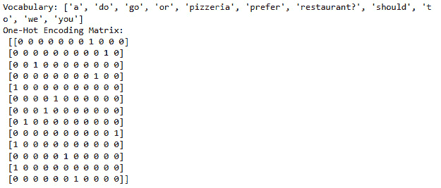

重要提示

观察选择另一个句子将如何导致不同的矩阵，以及通过增加句子的长度，矩阵如何成比例地增长到不同单词的数量。此外，请注意，对于重复的单词，我们得到相同的向量。检查前面的输出。

即使这是一个简单的方法，我们也得到了文本向量化形式的第一种表示。

## 词袋模型

在上一节中，我们讨论了一热编码以及与这种文本表示形式相关的一些问题。在之前的例子中，我们处理了一个句子，但语料库由成千上万甚至数百万个文档组成；每个文档都包含不同频率的几个单词。我们希望有一个系统可以保留这些频率信息，因为它对于文本的分类很重要。事实上，内容相似的文档是相似的，它们的含义也将是相似的。

**BoW** 是一种从文本中提取特征并保留此频率属性的算法。BoW 是一个非常简单的算法，它忽略了文本中单词的位置，只考虑这种频率属性。名称“bag”正是由于算法不保留关于句子顺序和结构的信息。对于 BoW，我们只需要一个词汇表和一种能够计数单词的方法。在这种情况下，我们的想法是创建文档向量：一个向量代表一个文档，以及词汇表中包含的单词的频率。*图 1**.1* 使用《哈姆雷特》的一些行来可视化这个概念：

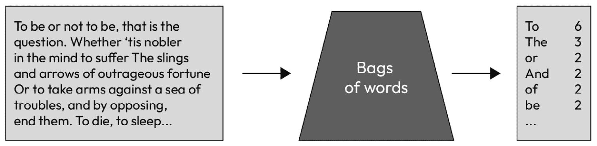

图 1.1 – BoW 算法的表示

即使这种表示法也存在问题。同样，随着词汇量的增加，向量的尺寸（每个向量的尺寸等于词汇表的长度）也会增加。此外，这些向量往往分布得很散，尤其是当文档彼此非常不同时。高维或稀疏向量不仅对内存和计算成本有影响，而且对算法也有影响（向量越长，算法中需要的权重就越多，从而导致过拟合的风险）。这被称为**维度诅咒**；特征的数量越多，示例之间的距离就越没有意义。对于大型语料库，已经提出了一些解决方案，例如忽略标点符号、纠正拼写错误、词干算法，或者忽略那些不增加信息的高频词（如冠词、介词等）。

为了为文档列表获取一个词袋矩阵，我们需要做以下几步：

+   将每个文档分词，以获得一个单词列表。

+   创建我们独特的词汇表，并将每个词映射到词汇表中的相应索引。

+   创建一个矩阵，其中每一行代表一个文档，而每一列则代表词汇表中的一个词（文档是例子，而单词是相关特征）。

让我们再次查看代码：

```py
import numpy as np
def bag_of_words(sentences):
    """
    Creates a bag-of-words representation of a list of documents.
    """
    tokenized_sentences = [
        sentence.lower().split() for sentence in sentences
    ]
    flat_words = [
        word for sublist in tokenized_sentences for word in sublist
    ]
    vocabulary = sorted(set(flat_words))
    word_to_index = {word: i for i, word in enumerate(vocabulary)}
    bow_matrix = np.zeros((
        len(sentences), len(vocabulary)), dtype=int)
    for i, sentence in enumerate(tokenized_sentences):
        for word in sentence:
            if word in word_to_index:
                bow_matrix[i, word_to_index[word]] += 1
    return vocabulary, bow_matrix
```

这里有一个例子：

```py
corpus = ["This movie is awesome awesome",
          "I do not say is good, but neither awesome",
          "Awesome? Only a fool can say that"]
vocabulary, bow_matrix = bag_of_words(corpus)
print("Vocabulary:", vocabulary)
print("Bag of Words Matrix:\n", bow_matrix)
```

这将输出以下内容：

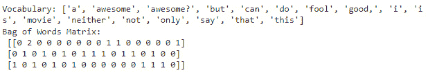

重要注意事项

注意在例子中，单词“`awesome`”与具有积极、中性或负面意义的评论相关联。没有上下文，单词`awesome`的频率本身并不能告诉我们评论的情感。

在这里，我们已经学会了如何将文本转换为向量形式，同时保持每个单词的频率概念。

## TF-IDF

在上一节中，我们获得了一个文档-词矩阵。然而，原始频率分布非常不均匀，并不总是能让我们区分两个文档。文档-词矩阵起源于信息检索，用于查找文档，尽管像“好”或“坏”这样的词并不具有很强的区分性，因为它们通常在具有通用意义的文本中使用。相比之下，低频词更有信息量，所以我们更感兴趣的是相对频率而不是绝对频率：

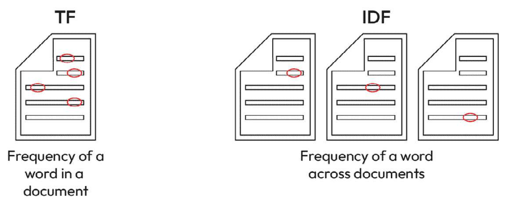

图 1.2 – TF-IDF 各组成部分的直观理解

我们可以使用以 10 为底的对数代替原始频率，因为一个在文档中出现 100 次的单词并不比它在文档中的意义相关性强 100 倍。当然，由于向量可以非常稀疏，如果频率为 0，我们则分配 0。其次，我们希望更多地关注仅存在于某些文档中的单词。这些单词将更相关于文档的意义，我们希望保留这些信息。为此，我们通过 IDF 进行规范化。IDF 定义为语料库中总文档数与一个术语出现在多少文档中的比率。总结来说，为了获得 TF-IDF，我们将 TF 乘以 IDF 的对数。

这在以下代码块中得到了演示：

```py
import numpy as np
def compute_tf(sentences):
    """Compute the term frequency matrix for a list of sentences."""
    vocabulary = sorted(set(
        word for sentence in sentences
        for word in sentence.lower().split()))
    word_index = {word: i for i, word in enumerate(vocabulary)}
    tf = np.zeros((
        len(sentences), len(vocabulary)), dtype=np.float32)
    for i, sentence in enumerate(sentences):
        words = sentence.lower().split()
        word_count = len(words)
        for word in words:
            if word in word_index:
                tf[i, word_index[word]] += 1 / word_count
    return tf, vocabulary
def compute_idf(sentences, vocabulary):
    """Compute the inverse document frequency for a list of sentences."""
    num_documents = len(sentences)
    idf = np.zeros(len(vocabulary), dtype=np.float32)
    word_index = {word: i for i, word in enumerate(vocabulary)}
    for word in vocabulary:
        df = sum(
            1 for sentence in sentences
            if word in sentence.lower().split()
        )
        idf[word_index[word]] = np.log(
            num_documents / (1 + df)) + 1  # Smoothing
    return idf
def tf_idf(sentences):
    """Generate a TF-IDF matrix for a list of sentences."""
    tf, vocabulary = compute_tf(sentences)
    idf = compute_idf(sentences, vocabulary)
    tf_idf_matrix = tf * idf
    return vocabulary, tf_idf_matrix
vocabulary, tf_idf_matrix = tf_idf(corpus)
print("Vocabulary:", vocabulary)
print("TF-IDF Matrix:\n", tf_idf_matrix)
```

这生成了以下输出：

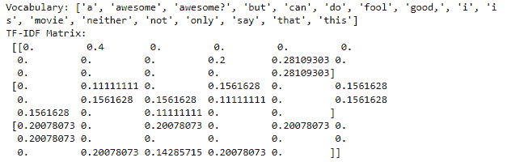

重要提示

在本例中，我们使用了与上一节相同的语料库。注意在规范化之后单词频率是如何变化的。

在本节中，我们学习了如何规范化文本以减少最频繁单词的影响，并赋予特定于文档子集的单词相关性。接下来，我们将讨论嵌入。

# 嵌入、应用和表示

在上一节中，我们讨论了如何使用向量来表示文本。这些向量对计算机来说是可消化的，但它们仍然存在一些问题（稀疏性、高维性等）。根据分布假设，具有相似意义的单词经常出现在一起（或者经常出现在相同上下文中的单词具有相同的意义）。同样，一个单词可以根据其上下文有不同的意义：“我去银行存钱”或“我们去河边野餐。”在下面的图中，我们有嵌入过程的高级表示。因此，我们希望有一个过程，使我们能够从文本开始，获得一个向量数组，其中每个向量对应于一个单词的表示。在这种情况下，我们希望有一个模型，然后允许我们将每个单词映射到向量表示。在下一节中，我们将详细描述这个过程，并讨论其背后的理论。

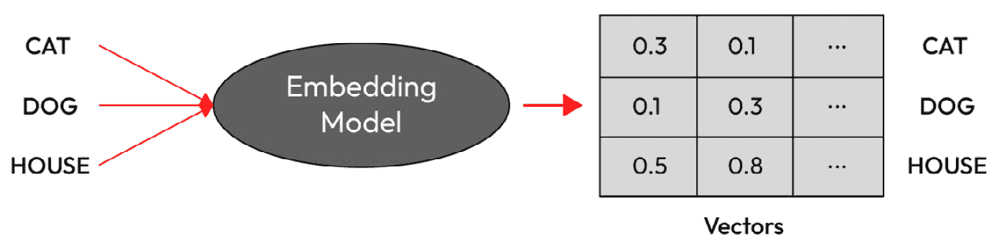

图 1.3 – 嵌入过程的高级表示

因此，我们希望生成尺寸小、由实数（密集）数字组成，并且保留这种上下文信息的向量。因此，目的是拥有有限大小的向量，可以表示一个单词的意义。我们之前获得的散点向量不能有效地用于数学运算或下游任务。此外，词汇表中的单词越多，我们得到的向量尺寸就越大。因此，我们希望得到的是尺寸小、由实数组成的密集向量，并且其尺寸不会随着词汇表中单词数量的增加而增加。

此外，这些向量具有词语意义的分布式表示（而在稀疏向量中，它是局部的或`1`所在的位置）。正如我们稍后将看到的，这些密集向量可以用于不同的操作，因为它们更好地代表了词语之间相似性的概念。这些密集向量被称为**词嵌入**。

这个概念是在 2013 年由 Mikolov 提出的，名为**word2vec**的框架，将在下一节中详细介绍。

## Word2vec

word2vec 背后的直觉很简单：从其上下文中预测一个词 *w*。为此，我们需要一个**神经网络**和大量语料库。革命性的想法是，通过训练这个神经网络来预测哪些词 *c* 需要靠近目标词 *w*，神经网络的权重将是嵌入向量。这个模型是自监督的；在这种情况下，标签是隐含的，我们不提供它们。

Word2vec 通过两种方式简化了这个想法，使其系统在速度和效率上都非常快：通过将任务转化为二元分类（词 *c* 是否在词 *w* 的上下文中需要？是或否？）并使用逻辑回归分类器：

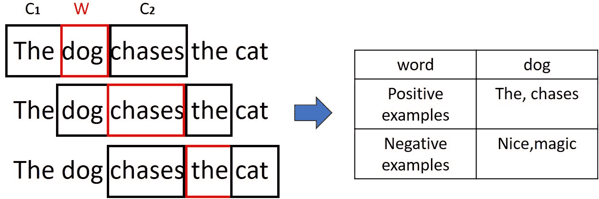

图 1.4 – 在 word2vec 中，我们滑动一个上下文窗口（这里表示为三个词的上下文窗口），然后我们随机采样一些负向词

给定一个文本 *t*，我们在窗口 *c*（我们的上下文）中滚动一个以词 *w* 为中心的窗口；它周围的词是正类示例。之后，我们选择其他随机词作为负例。最后，我们训练一个模型来分类正例和负例；模型的权重是我们的嵌入。

给定一个词 *w* 和一个词 *c*，我们希望词 *c* 在 *w* 的上下文中的概率与它的嵌入相似度相似。换句话说，如果代表 *w* 和 *c* 的向量相似，*c* 必须经常出现在 *w* 的上下文中（word2vec 基于上下文相似性的概念）。我们通过两个嵌入向量之间的点积来定义这种嵌入相似度（我们使用 sigmoid 函数将这个点积转换为概率，从而允许比较）。因此，*c* 在 *w* 的上下文中的概率等于它们的嵌入相似的概率：

<mrow><mrow><mi>P</mi><mfenced close=")" open="("><mrow><mo>+</mo><mo>|</mo><mi>w</mi><mo>,</mo><mi>c</mi></mrow></mfenced><mo>=</mo><mi>σ</mi><mfenced close=")" open="("><mrow><mi mathvariant="bold-italic">c</mi><mo>∙</mo><mi mathvariant="bold-italic">w</mi></mrow></mfenced><mo>=</mo><mfrac><mn>1</mn><mrow><mn>1</mn><mo>+</mo><mi>e</mi><mi>x</mi><mi>p</mi><mfenced close=")" open="("><mrow><mo>−</mo><mi mathvariant="bold-italic">c</mi><mo>∙</mo><mi mathvariant="bold-italic">w</mi></mrow></mfenced></mrow></mfrac></mrow></mrow>

这是对上下文中的所有单词 *L* 进行的操作。为了简化，我们假设上下文窗口中的所有单词都是独立的，因此我们可以将各种单词 *c* 的概率相乘。同样，我们希望确保不在单词 *w* 的上下文中的单词的点积是最小的。因此，一方面，我们最大化上下文中的单词的概率，另一方面，我们最小化不在上下文中的单词的概率。实际上，不在 *w* 的上下文中的单词在训练过程中是随机提取的，过程是相同的：

<mrow><mrow><mi>P</mi><mfenced close=")" open="("><mrow><mo>+</mo><mo>|</mo><mi>w</mi><mo>,</mo><mi>c</mi></mrow></mfenced><mo>=</mo><mrow><munderover><mo>∏</mo><mrow><mi>i</mi><mo>=</mo><mn>1</mn></mrow><mi>L</mi></munderover><mfrac><mn>1</mn><mrow><mn>1</mn><mo>+</mo><mi>e</mi><mi>x</mi><mi>p</mi><mfenced close=")" open="("><mrow><mo>−</mo><msub><mi mathvariant="bold-italic">c</mi><mi mathvariant="bold-italic">i</mi></msub><mo>∙</mo><mi mathvariant="bold-italic">w</mi></mrow></mfenced></mrow></mfrac></mrow></mrow></mrow>

<mrow><mrow><mi>P</mi><mfenced close=")" open="("><mrow><mo>−</mo><mo>|</mo><mi>w</mi><mo>,</mo><mi>c</mi></mrow></mfenced><mo>=</mo><mrow><munderover><mo>∏</mo><mrow><mi>i</mi><mo>=</mo><mn>1</mn></mrow><mi>L</mi></munderover><mfrac><mn>1</mn><mrow><mn>1</mn><mo>+</mo><mi>e</mi><mi>x</mi><mi>p</mi><mfenced close=")" open="("><mrow><msub><mi mathvariant="bold-italic">c</mi><mi mathvariant="bold-italic">i</mi></msub><mo>∙</mo><mi mathvariant="bold-italic">w</mi></mrow></mfenced></mrow></mfrac></mrow></mrow></mrow>

为了简化，我们取概率的对数：

<mrow><mrow><mi>l</mi><mi>o</mi><mi>g</mi><mi>P</mi><mfenced close=")" open="("><mrow><mo>+</mo><mo>|</mo><mi>w</mi><mo>,</mo><mi>c</mi></mrow></mfenced><mo>=</mo><mrow><munderover><mo>∑</mo><mrow><mi>i</mi><mo>=</mo><mn>1</mn></mrow><mi>L</mi></munderover><mrow><mi mathvariant="normal">l</mi><mi mathvariant="normal">o</mi><mi mathvariant="normal">g</mi><mo>(</mo><mfrac><mn>1</mn><mrow><mn>1</mn><mo>+</mo><mi>e</mi><mi>x</mi><mi>p</mi><mfenced close=")" open="("><mrow><mo>−</mo><msub><mi mathvariant="bold-italic">c</mi><mi mathvariant="bold-italic">i</mi></msub><mo>∙</mo><mi mathvariant="bold-italic">w</mi></mrow></mfenced></mrow></mfrac><mo>)</mo></mrow></mrow></mrow></mrow>

<mrow><mrow><mi>l</mi><mi>o</mi><mi>g</mi><mi>P</mi><mfenced close=")" open="("><mrow><mo>−</mo><mo>|</mo><mi>w</mi><mo>,</mo><mi>c</mi></mrow></mfenced><mo>=</mo><mrow><munderover><mo>∑</mo><mrow><mi>i</mi><mo>=</mo><mn>1</mn></mrow><mi>L</mi></munderover><mrow><mi mathvariant="normal">l</mi><mi mathvariant="normal">o</mi><mi mathvariant="normal">g</mi><mo>(</mo><mfrac><mn>1</mn><mrow><mn>1</mn><mo>+</mo><mi>e</mi><mi>x</mi><mi>p</mi><mfenced close=")" open="("><mrow><msub><mi mathvariant="bold-italic">c</mi><mi mathvariant="bold-italic">i</mi></msub><mo>∙</mo><mi mathvariant="bold-italic">w</mi></mrow></mfenced></mrow></mfrac><mo>)</mo></mrow></mrow></mrow></mrow>

权重矩阵 *w* 是我们的嵌入；这是我们接下来将要使用的。实际上，模型学习两个向量矩阵（一个用于 *w*，一个用于 *c*），但这两个矩阵非常相似，所以我们只取一个。然后我们使用交叉熵来训练模型并学习每个向量的权重：

<mml:math display="block"><mml:msub><mml:mrow><mml:mi>L</mml:mi></mml:mrow><mml:mrow><mml:mi>C</mml:mi><mml:mi>E</mml:mi></mml:mrow></mml:msub><mml:mo>=</mml:mo><mml:mo>-</mml:mo><mml:mi>l</mml:mi><mml:mi>o</mml:mi><mml:mi>g</mml:mi><mml:mi>P</mml:mi><mml:mfenced separators="|"><mml:mrow><mml:mo>+</mml:mo></mml:mrow><mml:mrow><mml:mi>w</mml:mi><mml:mo>,</mml:mo><mml:mi>c</mml:mi><mml:mi>p</mml:mi><mml:mi>o</mml:mi><mml:mi>s</mml:mi></mml:mrow></mml:mfenced><mml:mo>+</mml:mo><mml:mrow><mml:munderover><mml:mo stretchy="false">∑</mml:mo><mml:mrow><mml:mi>i</mml:mi><mml:mo>=</mml:mo><mml:mn>1</mml:mn></mml:mrow><mml:mrow><mml:mi>L</mml:mi></mml:mrow></mml:munderover><mml:mrow><mml:mi>l</mml:mi><mml:mi>o</mml:mi><mml:mi>g</mml:mi><mml:mi>P</mml:mi><mml:mfenced separators="|"><mml:mrow><mml:mo>-</mml:mo></mml:mrow><mml:mrow><mml:mi>w</mml:mi><mml:mo>,</mml:mo><mml:mi>c</mml:mi><mml:mi>n</mml:mi><mml:mi>e</mml:mi><mml:mi>g</mml:mi></mml:mrow></mml:mfenced></mml:mrow></mml:mrow></mml:math>

这在以下图表中得到了直观的表示：

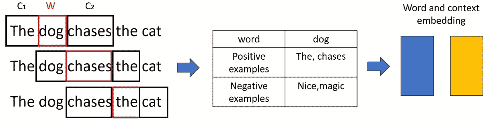

图 1.5 – 单词和上下文嵌入

以下选择会影响嵌入的质量：

+   *数据质量至关重要*。例如，利用维基百科可以更好地嵌入语义任务，而使用新闻可以提高句法任务的性能（推荐使用两者的混合）。使用 Twitter 或其他社交网络可能会引入偏差。

+   同时，*更多的文本可以提高嵌入性能*。大量的文本可以部分弥补质量较差的问题，但代价是更长的训练时间（例如，Common Crawl 是从互联网下载的巨大数据集，尽管相当脏乱）。

+   *维度数量是另一个重要因素*。嵌入的大小越大，性能越好。300 被认为是一个理想的点，因为超过这个大小，性能的提升并不显著。

+   *上下文窗口的大小也有影响*。通常，上下文窗口为 4，但 2 个上下文窗口的向量能更好地识别词性。相比之下，如果我们对更广泛的相似度感兴趣，长上下文窗口更有用。

在 Python 中，我们可以使用以下代码轻松地从标记列表中获取嵌入：

```py
from gensim.models import Word2Vec
model = Word2Vec(sentences=list_of_tokens,
                 sg=1,
                 vector_size=100,
                 window=5,
                 workers=4)
```

重要注意事项

完整的代码位于 GitHub 仓库中。我们使用了 100 维的嵌入和一个 5 词的窗口。

一旦我们有了嵌入，我们就可以可视化它。例如，如果我们尝试**聚类**一些单词的向量，具有相似意义的单词应该更靠近：

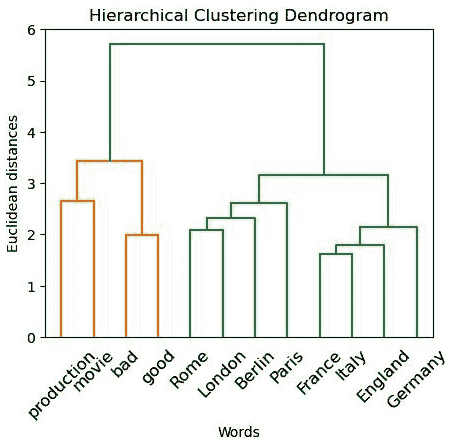

图 1.6 – 从嵌入中获得的某些向量的聚类

另一种可视化向量的方法是使用降维技术。向量是多维的（100-1,024），因此将它们降低到两或三个维度以便更容易可视化会更方便。一些最常用的技术是**主成分分析**（PCA）和**t 分布随机邻域嵌入**（t-SNE）。另一方面，**统一流形近似和投影**（UMAP）是一种近年来成为可视化多维数据的首选技术：

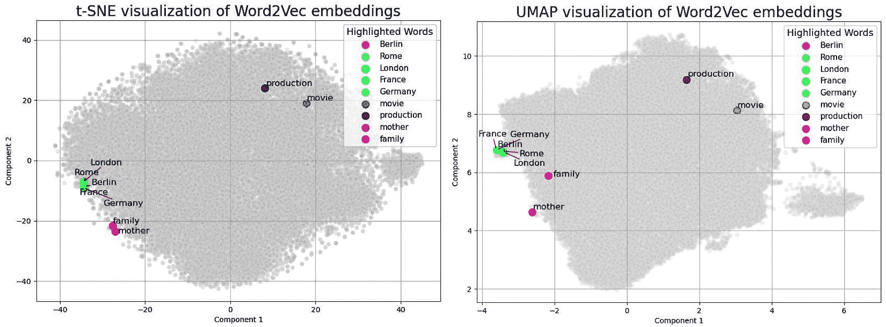

图 1.7 – word2vec 嵌入的 2D 投影，突出显示了一些示例

UMAP 之所以出现，是因为它产生的可视化更好地保留了示例之间的语义意义和关系，同时也更好地表示了局部和全局结构。这使得聚类更好，UMAP 也可以在向量分类任务之前的预处理步骤中使用。

## 文本相似度概念

一旦我们获得了向量表示，我们需要一种方法来计算它们之间的相似度。这在许多应用中至关重要——例如，为了找到嵌入空间中最接近给定单词的单词，我们计算其向量与其他单词向量的相似度。同样，给定一个查询句子，我们可以通过比较其向量与文档嵌入并选择那些相似度最高的来检索最相关的文档。

大多数相似度度量都是基于**点积**。这是因为当两个向量在同一维度上有值时，点积很高。相比之下，交替为零的向量将具有零点积，因此是正交或不相似的。这就是为什么点积被用作单词共现矩阵或从文档 TF 矩阵导出的向量之间的相似度度量：

<mrow><mrow><mi mathvariant="bold-italic">d</mi><mi mathvariant="bold-italic">o</mi><mi mathvariant="bold-italic">t</mi><mi mathvariant="bold-italic">p</mi><mi mathvariant="bold-italic">r</mi><mi mathvariant="bold-italic">o</mi><mi mathvariant="bold-italic">d</mi><mi mathvariant="bold-italic">u</mi><mi mathvariant="bold-italic">c</mi><mi mathvariant="bold-italic">t</mi><mo>:</mo><mi mathvariant="bold-italic">a</mi><mo>∙</mo><mi mathvariant="bold-italic">b</mi><mo>=</mo><mrow><munderover><mo>∑</mo><mrow><mi mathvariant="bold-italic">i</mi><mo>=</mo><mn>1</mn></mrow><mi>N</mi></munderover><mrow><msub><mi>a</mi><mi>i</mi></msub><mo>×</mo><msub><mi>b</mi><mi>i</mi></msub><mo>=</mo><msub><mi>a</mi><mn>1</mn></msub><mo>×</mo><msub><mi>b</mi><mn>1</mn></msub><mo>+</mo><msub><mi>a</mi><mn>2</mn></msub><mo>×</mo><msub><mi>b</mi><mn>2</mn></msub><mo>+</mo><mo>⋯</mo><msub><mi>a</mi><mi>n</mi></msub><mo>×</mo><msub><mi>b</mi><mi>n</mi></msub></mrow></mrow></mrow></mrow>

<mrow><mrow><mi>m</mi><mi>a</mi><mi>g</mi><mi>n</mi><mi>i</mi><mi>t</mi><mi>u</mi><mi>d</mi><mi>e</mi><mo>=</mo><mfenced close="|" open="|"><mi mathvariant="bold-italic">a</mi></mfenced><mo>=</mo><mroot><mrow><munderover><mo>∑</mo><mrow><mi mathvariant="bold-italic">i</mi><mo>=</mo><mn>1</mn></mrow><mi>N</mi></munderover><msubsup><mi>a</mi><mi>i</mi><mn>2</mn></msubsup></mrow><mn>2</mn></mroot></mrow></mrow>

点积有几个问题，尽管如此：

+   它倾向于偏好长维度的向量

+   它倾向于高值向量（通常是非常频繁的词，因此是无用的词）

+   点积的值没有限制

因此，已经寻求了替代方案，例如点积的归一化版本。归一化点积等同于两个向量之间角度的余弦值，因此称为**余弦相似度**：

<mrow><mrow><mi>c</mi><mi>o</mi><mi>s</mi><mi mathvariant="normal">Θ</mi><mo>=</mo><mfrac><mrow><mi mathvariant="bold-italic">a</mi><mo>∙</mo><mi mathvariant="bold-italic">b</mi></mrow><mrow><mfenced close="|" open="|"><mi mathvariant="bold-italic">a</mi></mfenced><mfenced close="|" open="|"><mi mathvariant="bold-italic">b</mi></mfenced></mrow></mfrac><mo>=</mo><mfrac><mrow><msubsup><mo>∑</mo><mrow><mi mathvariant="bold-italic">i</mi><mo>=</mo><mn>1</mn></mrow><mi>N</mi></msubsup><mrow><msub><mi>a</mi><mi>i</mi></msub><mo>×</mo><msub><mi>b</mi><mi>i</mi></msub></mrow></mrow><mrow><mroot><mrow><msubsup><mo>∑</mo><mrow><mi mathvariant="bold-italic">i</mi><mo>=</mo><mn>1</mn></mrow><mi>N</mi></msubsup><msubsup><mi>a</mi><mi>i</mi><mn>2</mn></msubsup></mrow><mn>2</mn></mroot><mroot><mrow><msubsup><mo>∑</mo><mrow><mi mathvariant="bold-italic">i</mi><mo>=</mo><mn>1</mn></mrow><mi>N</mi></msubsup><msubsup><mi>b</mi><mi>i</mi><mn>2</mn></msubsup></mrow><mn>2</mn></mroot></mrow></mfrac></mrow></mrow>

余弦相似度有一些有趣的特性：

+   它的值介于 -1 和 1 之间。相反或完全不同的向量将具有 -1 的值，正交向量（或完全不同的散点向量）为 0，完全相似的向量为 1。由于它测量两个向量之间的角度，因此解释更容易，并且在一个特定的范围内，因此它允许人们直观地理解相似性或差异性。

+   它的计算速度快且成本低。

+   它对词频不太敏感，因此对异常值更稳健。

+   它是尺度不变的，这意味着它不受向量大小的影响。

+   经过归一化处理后，它也可以用于处理高维数据。

对于二维向量，我们可以绘制图表来观察这些属性：

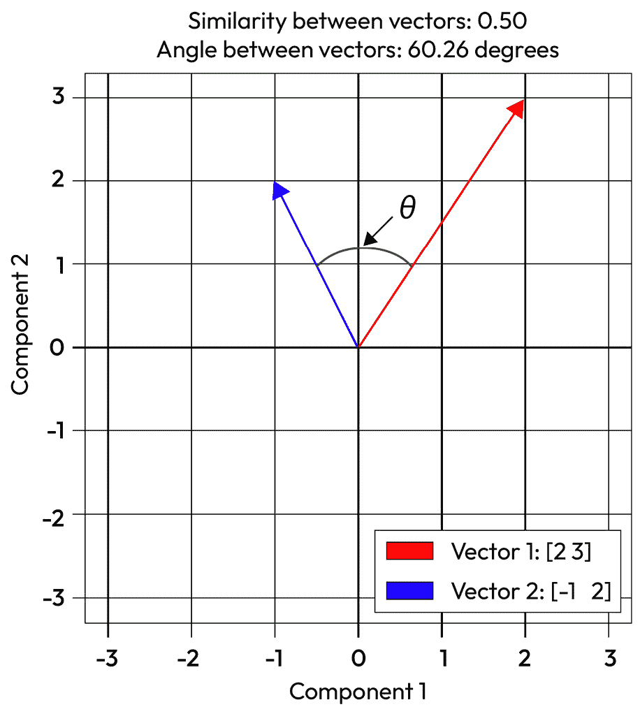

图 1.8 – 两个向量之间余弦相似性的示例

在下一节中，我们可以使用这个相似性的概念来定义我们训练的嵌入的性质。

## 嵌入的性质

嵌入是一个令人惊讶的灵活方法，并能够编码不同的句法和语义属性，这些属性既可以可视化，也可以用于不同的操作。一旦我们有了相似性的概念，我们就可以搜索与字词 *w* 最相似的词。请注意，相似性定义为出现在相同的上下文窗口中；模型无法区分同义词和反义词。

此外，该模型还能够表示诸如最高级或动词形式之类的语法关系。

我们可以研究的另一个有趣的关系是类比。平行四边形模型是一个在认知空间中表示类比的系统。经典的例子是 *king:queen::man:?*（在公式中为 *a:b::a*:?*）。鉴于我们有向量，我们可以将其转化为 *a-a*+b* 操作。

我们可以使用我们训练的嵌入模型在 Python 中进行此测试：

+   我们可以检查最相似的字词。

+   我们可以测试类比

+   然后，我们可以测试识别同义词和反义词的能力。

此过程的代码如下：

```py
word_1 = "good"
syn = "great"
ant = "bad"
most_sim =model.wv.most_similar("good")
print("Top 3 most similar words to {} are :{}".format(
    word_1, most_sim[:3]))
synonyms_dist = model.wv.distance(word_1, syn)
antonyms_dist = model.wv.distance(word_1, ant)
print("Synonyms {}, {} have cosine distance: {}".format(
    word_1, syn, synonyms_dist))
print("Antonyms {}, {} have cosine distance: {}".format(
    word_1, ant, antonyms_dist))
a = 'king'
a_star = 'man'
b = 'woman'
b_star= model.wv.most_similar(positive=[a, b], negative=[a_star])
print("{} is to {} as {} is to: {} ".format(
    a, a_star, b, b_star[0][0]))
```

重要提示

这是我们之前训练的嵌入完成的。注意模型在处理反义词方面并不好。

这种方法并不完全完美，因此有时正确答案不是第一个结果，但它可能是前三个输入之一。此外，该系统适用于文本中频繁出现的实体（如城市名称、常用词），但对于罕见实体则作用甚微。

嵌入还可以作为工具来研究一个词的意义如何随时间变化，特别是如果你有跨越几个十年文本语料库的话。以下图表展示了如何随着时间的推移，字词 *gay*、*broadcast* 和 *awful* 的意义发生了变化：

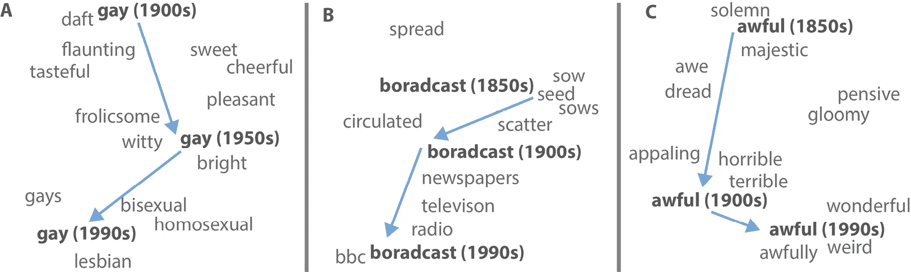

图 1.9 – 2D 可视化展示了单词的语义意义如何随时间变化；这些投影是通过使用不同年代的文本和嵌入获得的([`arxiv.org/abs/1605.09096`](https://arxiv.org/abs/1605.09096))

最后，一个单词仍然可以有多个意义！例如，像“good”这样的常用词根据上下文有不同的意义。有人可能会想知道一个单词在嵌入中的向量是否只代表一个意义，或者它是否代表了一个单词的所有意义集合。幸运的是，嵌入向量代表了一个单词各种意义的加权总和（线性叠加）。每个意义的权重与该意义在文本中的频率成正比。尽管这些意义位于同一个向量中，但在计算类比时，我们处理的是这些组成部分。例如，“apple”既是水果，也是一家公司的名字；如果我们进行操作 *apple:red::banana:?*，我们只是在苹果向量中减去一个非常具体的语义成分（与红色相似的成分）。这种灵活性在我们想要消除歧义时非常有用。此外，由于向量空间是稀疏的，通过利用稀疏编码，我们可以分离出不同的意义：

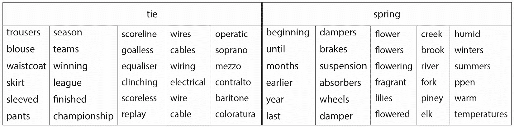

图 1.10 – 表格展示了 word2vec 中的向量如何同时编码不同的意义([`aclanthology.org/Q18-1034/`](https://aclanthology.org/Q18-1034/))

这些向量现在为文本中的每个单词提供了上下文和语义意义。我们可以利用这个丰富的信息源来完成诸如文本分类等任务。我们现在需要的是能够处理文本序列性质的模型，我们将在下一节中学习到这方面的内容。

# RNNs，LSTMs，GRUs 和 CNNs 用于文本

到目前为止，我们讨论了如何以模型可消化的方式表示文本；在本节中，我们将讨论在获得表示后如何分析文本。传统上，一旦我们获得了文本的表示，它就会被输入到诸如朴素贝叶斯或甚至逻辑回归等模型中。神经网络的成功使得这些机器学习算法变得过时。在本节中，我们将讨论可用于各种任务的深度学习模型。

## RNNs

经典神经网络的缺点是它们没有记忆功能。这对于时间序列和文本输入尤其成问题。在一个单词序列 *t* 中，时间 *t* 的单词 *w* 依赖于时间 *t-1* 的 *w*。实际上，在一句话中，最后一个单词通常依赖于句子中的几个单词。因此，我们希望有一个 NN 模型能够记住之前的输入。一个**RNN**（循环神经网络）维护一个内部状态来保持这种记忆；也就是说，它存储有关先前输入的信息，并且它产生的输出受先前输入的影响。这些网络对序列的所有元素执行相同的操作（因此是循环的）并保持这种操作的内存：

(img/B21257_01_11.jpg)

图 1.11 – RNN 的简单示例([`arxiv.org/pdf/1506.00019`](https://arxiv.org/pdf/1506.00019))

一个经典的神经网络（**前馈神经网络**）认为输入是独立的，神经网络的一层对时间 *t* 的元素表示的向量执行以下操作：

<mml:math display="block"><mml:msup><mml:mrow><mml:mi mathvariant="bold-italic">y</mml:mi></mml:mrow><mml:mrow><mml:mo>(</mml:mo><mml:mi>t</mml:mi><mml:mo>)</mml:mo></mml:mrow></mml:msup><mml:mo>=</mml:mo><mml:mi>σ</mml:mi><mml:mo>(</mml:mo><mml:mi mathvariant="bold-italic">W</mml:mi><mml:msup><mml:mrow><mml:mi mathvariant="bold-italic">x</mml:mi></mml:mrow><mml:mrow><mml:mi>t</mml:mi></mml:mrow></mml:msup><mml:mo>+</mml:mo><mml:mi mathvariant="bold-italic">b</mml:mi><mml:mo>)</mml:mo></mml:math>

然而，在简单的 RNN 中，以下操作被执行：

<mrow><mrow><msup><mi mathvariant="bold-italic">a</mi><mfenced close=")" open="("><mi>t</mi></mfenced></msup><mo>=</mo><mi mathvariant="bold-italic">b</mi><mo>+</mo><mi mathvariant="bold-italic">U</mi><msup><mi mathvariant="bold-italic">h</mi><mfenced close=")" open="("><mrow><mi>t</mi><mo>−</mo><mn>1</mn></mrow></mfenced></msup><mo>+</mo><mi mathvariant="bold-italic">W</mi><msup><mi mathvariant="bold-italic">x</mi><mi>t</mi></msup></mrow></mrow>

<mml:math display="block"><mml:msup><mml:mrow><mml:mi mathvariant="bold-italic">h</mml:mi></mml:mrow><mml:mrow><mml:mfenced separators="|"><mml:mrow><mml:mi>t</mml:mi></mml:mrow></mml:mfenced></mml:mrow></mml:msup><mml:mo>=</mml:mo><mml:mi mathvariant="normal">t</mml:mi><mml:mi mathvariant="normal">a</mml:mi><mml:mi mathvariant="normal">n</mml:mi><mml:mi mathvariant="normal">h</mml:mi><mml:mo>⁡</mml:mo><mml:mo>(</mml:mo><mml:msup><mml:mrow><mml:mi mathvariant="bold-italic">a</mml:mi></mml:mrow><mml:mrow><mml:mi>t</mml:mi></mml:mrow></mml:msup><mml:mo>)</mml:mo></mml:math>

<mml:math display="block"><mml:msup><mml:mrow><mml:mi mathvariant="bold-italic">o</mml:mi></mml:mrow><mml:mrow><mml:mfenced separators="|"><mml:mrow><mml:mi>t</mml:mi></mml:mrow></mml:mfenced></mml:mrow></mml:msup><mml:mo>=</mml:mo><mml:mi mathvariant="bold-italic">c</mml:mi><mml:mo>+</mml:mo><mml:mi mathvariant="bold-italic">V</mml:mi><mml:msup><mml:mrow><mml:mi mathvariant="bold-italic">h</mml:mi></mml:mrow><mml:mrow><mml:mfenced separators="|"><mml:mrow><mml:mi>t</mml:mi></mml:mrow></mml:mfenced></mml:mrow></mml:msup></mml:math>

<mml:math display="block"><mml:msup><mml:mrow><mml:mi mathvariant="bold-italic">y</mml:mi></mml:mrow><mml:mrow><mml:mfenced separators="|"><mml:mrow><mml:mi>t</mml:mi></mml:mrow></mml:mfenced></mml:mrow></mml:msup><mml:mo>=</mml:mo><mml:mi>σ</mml:mi><mml:mo>(</mml:mo><mml:msup><mml:mrow><mml:mi mathvariant="bold-italic">o</mml:mi></mml:mrow><mml:mrow><mml:mfenced separators="|"><mml:mrow><mml:mi>t</mml:mi></mml:mrow></mml:mfenced></mml:mrow></mml:msup><mml:mo>)</mml:mo></mml:math>

这些操作看起来可能很复杂，但实际上，我们只是在维护一个考虑先前迭代的隐藏状态。第一个方程是一个普通的正向传播层，其中我们将先前隐藏状态 *h* 乘以一组权重 *U*。这个矩阵 *U* 允许我们控制神经网络如何使用先前上下文来绑定输入和过去输入（过去如何影响时间 *t* 的输入输出）。在第二个方程中，我们创建一个新的隐藏状态，该状态将被用于后续计算，但也将用于下一个输入。在第三个方程中，我们创建输出；我们使用一个偏置向量和矩阵来计算输出。在最后一个方程中，它简单地作为一个非线性函数传递。

这些 RNN 可以被视为随时间展开的实体，其中我们可以表示整个序列中的网络及其计算：

(img/B21257_01_12.jpg)

图 1.12 – RNN 通过序列展开的简单示例([`arxiv.org/pdf/1506.00019`](https://arxiv.org/pdf/1506.00019))

我们可以用 PyTorch RNN 在 Python 中测试，看看它是如何转换数据的：

```py
array = np.random.random((10, 5, 3))
# Convert the numpy array to a PyTorch tensor
data_tensor = torch.tensor(array, dtype=torch.float32)
RNN = nn.RNN(input_size=3, hidden_size=10,
             num_layers=1, batch_first=True)
output, hidden = RNN(data_tensor)
output.shape
```

重要提示

注意模型如何转换数据；我们还可以访问隐藏状态。

我们可以看到几个有趣的事情：

+   RNN 不受输入大小的限制；它是一个在整个序列上进行的循环操作。RNN 基本上一次处理一个单词。这种循环性也意味着反向传播在每个时间步进行。尽管这个模型在序列分析方面表现良好，但其顺序性质不允许它并行化。

+   理论上，这个模型可以用无限序列的单词进行训练；理论上，经过几个时间步后，它开始忘记初始输入。

+   训练可能因为梯度消失问题而变得低效，其中梯度必须从最终细胞传播回初始细胞。在这个过程中，它们可以指数级缩小并接近零，使得模型难以学习长距离依赖。相反，梯度爆炸问题也可能发生，其中梯度无控制地变得非常大，导致训练不稳定。

RNN 不是唯一与这个主题相关的深度学习模型形式。

## LSTM

理论上，RNN 应该能够处理长序列并记住初始输入。然而，在现实中，隐藏状态中的信息是局部的而不是全局的，对于时间 *t*，它只考虑前一个时间步而不是整个序列。这种简单模型的主要问题是隐藏状态必须同时履行两个角色：提供与时间 *t* 的输出相关的信息，并为未来的决策存储记忆。

**LSTM** 是 RNN 的扩展，其设计理念是模型可以忘记不重要的信息，只保留重要的上下文。

(img/B21257_01_13.jpg)

图 1.13 – LSTM 单元的内部结构([`arxiv.org/pdf/2304.11461`](https://arxiv.org/pdf/2304.11461))

LSTM 有内部机制来控制层内的信息（门）；此外，它还有一个专门上下文层。因此，我们有两个隐藏状态，其中第一个 *h* 用于时间 *t* 的信息（短期记忆），另一个 *c* 用于长期信息。门可以是开启的（1）或关闭的（0）；这是通过一个具有 sigmoid 激活的前馈层来实现的，以压缩值在零和一之间。之后，我们使用 **Hadamard 积**（或逐点乘法）作为层的门控机制。这种乘法作为一个二进制门，当值接近 1 时允许信息通过，当值接近 0 时阻止信息通过。这些门允许一个动态系统，在时间步内，我们决定保留多少信息以及忘记多少信息。

第一个门被称为 **遗忘门**，因为它用于忘记上下文中不再需要的信息，因此在下一次时间步中也不再需要。所以，我们将使用遗忘门的输出去乘以上下文。此时，我们从输入和前一个时间步的隐藏状态中提取信息。每个门都有一组特定于门的 *U* 权重：

<mrow><mrow><mrow><msup><mi mathvariant="bold-italic">f</mi><mfenced close=")" open="("><mi>t</mi></mfenced></msup><mo>=</mo><mi>σ</mi><msub><mrow><mo>(</mo><mi mathvariant="bold-italic">b</mi></mrow><mi mathvariant="bold-italic">f</mi></msub><mo>+</mo><msub><mi mathvariant="bold-italic">U</mi><mi mathvariant="bold-italic">f</mi></msub><msup><mi mathvariant="bold-italic">h</mi><mfenced close=")" open="("><mrow><mi>t</mi><mo>−</mo><mn>1</mn></mrow></mfenced></msup><mo>+</mo><msub><mi mathvariant="bold-italic">W</mi><mi mathvariant="bold-italic">f</mi></msub><msup><mi mathvariant="bold-italic">x</mi><mi>t</mi></msup><mo>)</mo></mrow></mrow></mrow>

<mml:math display="block"><mml:msup><mml:mrow><mml:mi mathvariant="bold-italic">k</mml:mi></mml:mrow><mml:mrow><mml:mfenced separators="|"><mml:mrow><mml:mi>t</mml:mi></mml:mrow></mml:mfenced></mml:mrow></mml:msup><mml:mo>=</mml:mo><mml:msup><mml:mrow><mml:msup><mml:mrow><mml:mi mathvariant="bold-italic">c</mml:mi></mml:mrow><mml:mrow><mml:mfenced separators="|"><mml:mrow><mml:mi>t</mml:mi><mml:mo>-</mml:mo><mml:mn>1</mml:mn></mml:mrow></mml:mfenced></mml:mrow></mml:msup><mml:mo>⊙</mml:mo><mml:mi mathvariant="bold-italic">f</mml:mi></mml:mrow><mml:mrow><mml:mfenced separators="|"><mml:mrow><mml:mi>t</mml:mi></mml:mrow></mml:mfenced></mml:mrow></mml:msup></mml:math>

下一步是从输入中提取信息并决定哪些信息将被添加到上下文中。这由一个**输入门** *i* 控制，它决定了将添加多少信息。上下文随后是通过我们添加的和忘记的内容的总和来获得的：

<mrow><mrow><mrow><msup><mi mathvariant="bold-italic">g</mi><mfenced close=")" open="("><mi>t</mi></mfenced></msup><mo>=</mo><msub><mrow><mi>t</mi><mi>a</mi><mi>n</mi><mi>h</mi><mo>(</mo><mi mathvariant="bold-italic">b</mi></mrow><mi mathvariant="bold-italic">g</mi></msub><mo>+</mo><msub><mi mathvariant="bold-italic">U</mi><mi mathvariant="bold-italic">g</mi></msub><msup><mi mathvariant="bold-italic">h</mi><mfenced close=")" open="("><mrow><mi>t</mi><mo>−</mo><mn>1</mn></mrow></mfenced></msup><mo>+</mo><msub><mi mathvariant="bold-italic">W</mi><mi mathvariant="bold-italic">g</mi></msub><msup><mi mathvariant="bold-italic">x</mi><mi>t</mi></msup><mo>)</mo></mrow></mrow></mrow>

<mrow><mrow><mrow><msup><mi mathvariant="bold-italic">i</mi><mfenced close=")" open="("><mi>t</mi></mfenced></msup><mo>=</mo><mi>σ</mi><msub><mrow><mo>(</mo><mi mathvariant="bold-italic">b</mi></mrow><mi mathvariant="bold-italic">i</mi></msub><mo>+</mo><msub><mi mathvariant="bold-italic">U</mi><mi mathvariant="bold-italic">i</mi></msub><msup><mi mathvariant="bold-italic">h</mi><mfenced close=")" open="("><mrow><mi>t</mi><mo>−</mo><mn>1</mn></mrow></mfenced></msup><mo>+</mo><msub><mi mathvariant="bold-italic">W</mi><mi mathvariant="bold-italic">i</mi></msub><msup><mi mathvariant="bold-italic">x</mi><mi>t</mi></msup><mo>)</mo></mrow></mrow></mrow>

<mml:math display="block"><mml:msup><mml:mrow><mml:mi mathvariant="bold-italic">j</mml:mi></mml:mrow><mml:mrow><mml:mfenced separators="|"><mml:mrow><mml:mi>t</mml:mi></mml:mrow></mml:mfenced></mml:mrow></mml:msup><mml:mo>=</mml:mo><mml:msup><mml:mrow><mml:msup><mml:mrow><mml:mi mathvariant="bold-italic">g</mml:mi></mml:mrow><mml:mrow><mml:mo>(</mml:mo><mml:mi>t</mml:mi><mml:mo>)</mml:mo></mml:mrow></mml:msup><mml:mo>⊙</mml:mo><mml:mi mathvariant="bold-italic">i</mml:mi></mml:mrow><mml:mrow><mml:mfenced separators="|"><mml:mrow><mml:mi>t</mml:mi></mml:mrow></mml:mfenced></mml:mrow></mml:msup></mml:math>

<mml:math display="block"><mml:msup><mml:mrow><mml:mi mathvariant="bold-italic">c</mml:mi></mml:mrow><mml:mrow><mml:mfenced separators="|"><mml:mrow><mml:mi>t</mml:mi></mml:mrow></mml:mfenced></mml:mrow></mml:msup><mml:mo>=</mml:mo><mml:msup><mml:mrow><mml:msup><mml:mrow><mml:mi mathvariant="bold-italic">j</mml:mi></mml:mrow><mml:mrow><mml:mo>(</mml:mi>t</mml:mi><mml:mo>)</mml:mi></mml:mrow></mml:msup><mml:mo>+</mml:mo><mml:mi mathvariant="bold-italic">k</mml:mi></mml:mrow><mml:mrow><mml:mfenced separators="|"><mml:mrow><mml:mi>t</mml:mi></mml:mrow></mml:mfenced></mml:mrow></mml:msup></mml:math>

最终步骤是计算输出；这是通过一个最终门来实现的。输出或最终层的决策也用于更新隐藏状态：

<mrow><mrow><mrow><msup><mi mathvariant="bold-italic">o</mi><mfenced close=")" open="("><mi>t</mi></mfenced></msup><mo>=</mo><mi>σ</mi><msub><mrow><mo>(</mo><mi mathvariant="bold-italic">b</mi></mrow><mi mathvariant="bold-italic">o</mi></msub><mo>+</mo><msub><mi mathvariant="bold-italic">U</mi><mi mathvariant="bold-italic">o</mi></msub><msup><mi mathvariant="bold-italic">h</mi><mfenced close=")" open="("><mrow><mi>t</mi><mo>−</mo><mn>1</mn></mrow></mfenced></msup><mo>+</mo><msub><mi mathvariant="bold-italic">W</mi><mi mathvariant="bold-italic">o</mi></msub><msup><mi mathvariant="bold-italic">x</mi><mi>t</mi></msup><mo>)</mo></mrow></mrow></mrow>

<mml:math display="block"><mml:msup><mml:mrow><mml:mi mathvariant="bold-italic">k</mml:mi></mml:mrow><mml:mrow><mml:mfenced separators="|"><mml:mrow><mml:mi>t</mml:mi></mml:mrow></mml:mfenced></mml:mrow></mml:msup><mml:mo>=</mml:mo><mml:msup><mml:mrow><mml:msup><mml:mrow><mml:mi mathvariant="bold-italic">o</mml:mi></mml:mrow><mml:mrow><mml:mfenced separators="|"><mml:mrow><mml:mi>t</mml:mi></mml:mrow></mml:mfenced></mml:mrow></mml:msup><mml:mo>⊙</mml:mo><mml:mi mathvariant="normal">t</mml:mi><mml:mi mathvariant="normal">a</mml:mi><mml:mi mathvariant="normal">n</mml:mi><mml:mi mathvariant="normal">h</mml:mi><mml:mo>⁡</mml:mo><mml:mi mathvariant="bold-italic">c</mml:mi></mml:mrow><mml:mrow><mml:mfenced separators="|"><mml:mrow><mml:mi>t</mml:mi></mml:mrow></mml:mfenced></mml:mrow></mml:msup></mml:math>

这些门控单元相互独立，因此 LSTM 的高效实现可以并行化。我们可以使用 Python 中的 PyTorch RNN 来测试它如何转换数据：

```py
data_tensor = torch.tensor(np.random.random((10, 5, 3)),
                           dtype=torch.float32)
LSTM =nn.LSTM(input_size=3, hidden_size=10,
              num_layers=1, batch_first=True)
output, (hidden, cell) = LSTM(data_tensor)
output.shape
```

重要注意事项

注意模型如何转换数据；我们可以访问隐藏状态以及细胞状态。

我们还可以注意一些其他有趣的特性：

+   计算增强是层内进行的，这意味着我们可以轻松地将 LSTMs 替换为 RNN。

+   LSTM 能够长时间保留信息，因为它只保留相关信息，并遗忘不需要的信息。

+   标准做法是用向量 1 初始化 LSTM（保留一切），然后它自己学习要忘记什么和要添加什么。

+   LSTM 与 RNN 不同，可以记住多达 100 个时间步（RNN 在 7 个时间步之后开始遗忘）。加法运算使得梯度消失或爆炸的可能性降低。

让我们看看另一种计算上更轻量但仍然具有上下文向量概念的模型选项。

## GRUs

**GRUs**是 RNN 的另一种变体，用于解决梯度消失问题，因此它们在记住信息方面更有效。它们与 LSTMs 非常相似，因为它们具有内部门控单元，但它们更简单、更轻量。尽管参数更少，GRUs 的收敛速度比 LSTMs 快，并且仍然可以达到可比的性能。GRUs 利用了使 LSTMs 如此有效的某些元素：加法运算、Hadamard 乘积、上下文的存在以及层内信息控制的机制：


图 1.14 – GRU 单元的内部结构 ([`arxiv.org/pdf/2304.11461`](https://arxiv.org/pdf/2304.11461))

在 GRU 中，遗忘门被称为**更新门**，但它的目的相同：在更新过程中保留重要信息（接近 1 的值）并重写不重要信息（接近 0 的值）。在 GRU 中，输入门被称为**重置门**，它不像 LSTM 那样独立，而是与更新门相连。

第一步是更新门*z*，它实际上与 LSTM 中的遗忘门相同。同时，我们计算重置门*r*：

<mrow><mrow><mrow><msup><mi mathvariant="bold-italic">z</mi><mfenced close=")" open="("><mi>t</mi></mfenced></msup><mo>=</mo><mi>σ</mi><msub><mrow><mo>(</mo><mi mathvariant="bold-italic">b</mi></mrow><mi mathvariant="bold-italic">z</mi></msub><mo>+</mo><msub><mi mathvariant="bold-italic">U</mi><mi mathvariant="bold-italic">z</mi></msub><msup><mi mathvariant="bold-italic">h</mi><mfenced close=")" open="("><mrow><mi>t</mi><mo>−</mo><mn>1</mn></mrow></mfenced></msup><mo>+</mo><msub><mi mathvariant="bold-italic">W</mi><mi mathvariant="bold-italic">z</mi></msub><msup><mi mathvariant="bold-italic">x</mi><mi>t</mi></msup><mo>)</mo></mrow></mrow></mrow>

<mrow><mrow><mrow><msup><mi mathvariant="bold-italic">r</mi><mfenced close=")" open="("><mi>t</mi></mfenced></msup><mo>=</mo><mi>σ</mi><msub><mrow><mo>(</mo><mi mathvariant="bold-italic">b</mi></mrow><mi mathvariant="bold-italic">r</mi></msub><mo>+</mo><msub><mi mathvariant="bold-italic">U</mi><mi mathvariant="bold-italic">r</mi></msub><msup><mi mathvariant="bold-italic">h</mi><mfenced close=")" open="("><mrow><mi>t</mi><mo>−</mo><mn>1</mn></mrow></mfenced></msup><mo>+</mo><msub><mi mathvariant="bold-italic">W</mi><mi mathvariant="bold-italic">r</mi></msub><msup><mi mathvariant="bold-italic">x</mi><mi>t</mi></msup><mo>)</mo></mrow></mrow></mrow>

下一步是更新隐藏状态；这取决于重置门。这样，我们决定将哪些新信息放入隐藏状态，以及保存哪些过去的相关信息。这被称为**当前****记忆门**：

<mrow><mrow><mrow><msup><mover><mi mathvariant="bold-italic">h</mi><mo stretchy="true">‾</mo></mover><mfenced close=")" open="("><mi>t</mi></mfenced></msup><mo>=</mo><mi mathvariant="normal">t</mi><mi mathvariant="normal">a</mi><mi mathvariant="normal">n</mi><mi mathvariant="normal">h</mi><mo>(</mo><msub><mi mathvariant="bold-italic">W</mi><mi mathvariant="bold-italic">h</mi></msub><msup><mi mathvariant="bold-italic">x</mi><mi>t</mi></msup><mo>+</mo><msup><mi mathvariant="bold-italic">r</mi><mfenced close=")" open="("><mi>t</mi></mfenced></msup><mo>⊙</mo><msub><mi mathvariant="bold-italic">U</mi><mi mathvariant="bold-italic">z</mi></msub><msup><mi mathvariant="bold-italic">h</mi><mfenced close=")" open="("><mrow><mi>t</mi><mo>−</mo><mn>1</mn></mrow></mfenced></msup><mo>)</mo></mrow></mrow></mrow>

到目前为止，我们已经有了隐藏状态的最终更新，其中我们也使用了更新门：

<mrow><mrow><mrow><msup><mi mathvariant="bold-italic">h</mi><mfenced close=")" open="("><mi>t</mi></mfenced></msup><mo>=</mo><msup><mi mathvariant="bold-italic">z</mi><mfenced close=")" open="("><mi>t</mi></mfenced></msup><mo>⊙</mo><msup><mi mathvariant="bold-italic">h</mi><mfenced close=")" open="("><mrow><mi>t</mi><mo>−</mo><mn>1</mn></mrow></mfenced></msup><mo>+</mo><mo>(</mo><mn>1</mn><mo>−</mo><msup><mi mathvariant="bold-italic">z</mi><mfenced close=")" open="("><mi>t</mi></mfenced></msup><mo>)</mo><mo>⊙</mo><msup><mover><mi mathvariant="bold-italic">h</mi><mo stretchy="true">‾</mo></mover><mfenced close=")" open="("><mi>t</mi></mfenced></msup></mrow></mrow></mrow>

我们可以使用 PyTorch RNN 在 Python 中进行测试，以查看它是如何转换数据的：

```py
data_tensor = torch.tensor(np.random.random((10, 5, 3)),
                           dtype=torch.float32)
GRU =nn.GRU(input_size=3, hidden_size=10,
            num_layers=1, batch_first=True)
output, hidden = GRU(data_tensor)
output.shape
```

重要提示

注意模型是如何转换数据的；我们也可以访问隐藏状态。

我们在这里也可以看到一些有趣的因素：

+   GRU 网络类似于 LSTM 网络，但它们具有参数更少和计算效率更高的优势。但这意味着它们更容易过拟合。

+   它们可以处理长序列的数据而不会忘记之前的输入。对于许多文本任务（以及语音识别和音乐生成），它们的性能相当不错，尽管在建模长期依赖或复杂模式时，它们不如 LSTMs 高效。

接下来，我们将探讨 CNN。

## 文本 CNN

**CNN**被设计用来通过在图像（或其他二维矩阵）上运行滤波器（一个矩阵或核）来寻找其中的模式。卷积是逐像素进行的，滤波器的值与图像中的像素相乘然后求和。在训练过程中，为每个滤波器条目学习一个权重。对于每个滤波器，我们得到一个不同的图像扫描，这可以可视化；这被称为特征图。

卷积网络在**计算机视觉**中取得了成功，这得益于它们提取局部信息并识别复杂模式的能力。因此，卷积网络被提出用于序列。在这种情况下，使用了一维卷积网络，但原理是相同的。实际上，在序列上，一维卷积用于提取特征图（而不是作为一个二维滤波器或矩阵，我们有一个一维滤波器，它可以被视为 word2vec 的上下文窗口）：

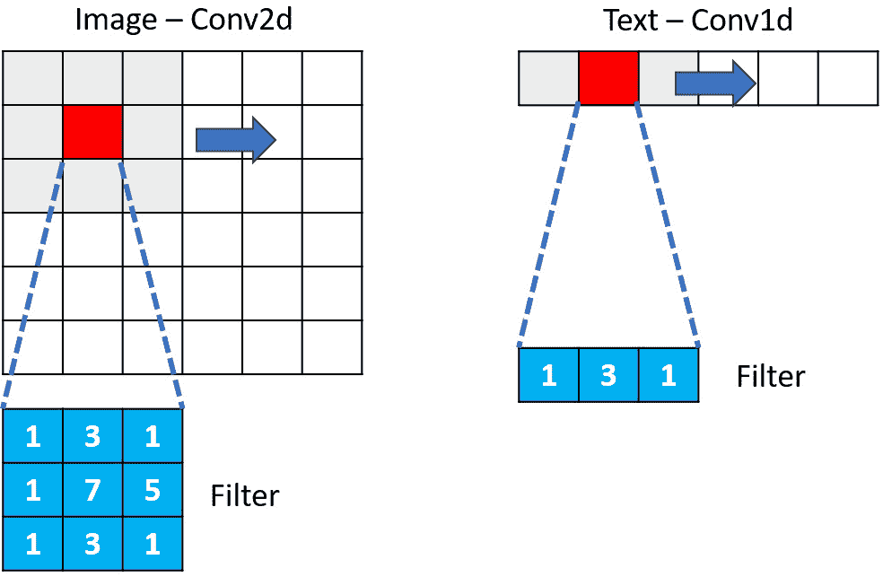

图 1.15 – 在一维卷积中，我们正在序列上滑动一个一维滤波器

在前面的图中，我们在序列上滚动一个一维滤波器；这个过程非常快，滤波器可以具有任意大小（三到七个单词甚至更多）。模型试图学习在这个核中找到的各种单词之间的模式。它也可以用于从嵌入中获得的向量，我们还可以使用多个核（以便为每个序列学习不同的模式）。与图像 CNN 一样，我们可以添加如最大池化等操作来提取最重要的特征。

我们可以用 Python 中的 PyTorch RNN 来测试，看看它是如何转换数据的：

```py
data_tensor = torch.tensor(np.random.random((10, 5, 3)),
                           dtype=torch.float32)
Conv1d = nn.Conv1d(in_channels=5, out_channels=16,
                   kernel_size=3, stride=1, padding=1)
output = Conv1d(data_tensor)
output.shape
```

重要提示

注意观察模型是如何转换数据的，以及这与我们之前所看到的不同之处。

现在我们有了将文本转换为数值表示（同时保留上下文信息）的方法，并且有可以处理这种表示的模型，我们可以将它们结合起来以获得端到端系统。

# 使用嵌入和深度学习进行情感分析

在本节中，我们将训练一个用于对电影评论进行情感分析模型的模型。我们将训练的模型能够将评论分类为正面或负面。为了构建和训练模型，我们将利用我们迄今为止遇到的所有元素。简而言之，我们正在做以下事情：

+   我们正在预处理数据集，将其转换为数值向量，并使向量和谐

+   我们正在定义一个带有嵌入的神经网络并对其进行训练

数据集由 50,000 条正面和负面评论组成。我们可以看到它包含不同长度的评论，平均有 230 个单词：

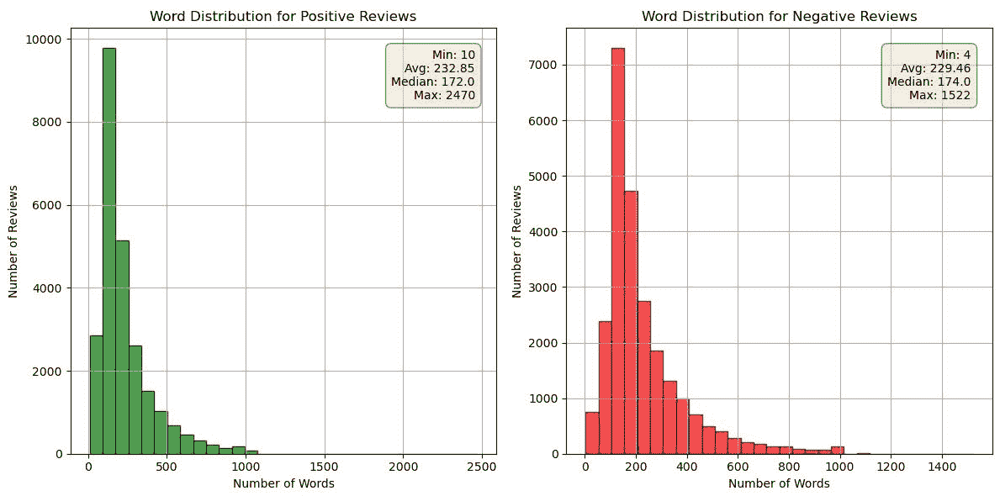

图 1.16 – 显示文本中评论长度分布的图表；左图是正面评论，右图是负面评论

此外，最常出现的词显然是“*电影*”和“*影片*”：


图 1.17 – 正面（左图）和负面（右图）评论中最常出现单词的词云

文本很杂乱，在模型训练之前必须进行清理。第一步是对标签进行二进制编码（“正面”等于 0，“负面”等于 1）。之后，我们将特征和标签（对于数据集中的`X`是特征，`y`是标签）分开。接下来，我们创建三个平衡的数据集用于训练、验证和测试：

```py
df['sentiment_encoded'] = np.where(
    df['sentiment']=='positive',0,1)
X,y = df['review'].values, df['sentiment_encoded'].values
x_train,x_test,y_train,y_test = train_test_split(
    X,y,stratify=y, test_size=.2)
x_train,x_val,y_train,y_val = train_test_split(
    x_train,y_train,stratify=y_train, test_size=.1)
y_train, y_val, y_test = np.array(y_train), np.array(y_val), \
    np.array(y_test)
```

在进行训练之前需要几个步骤：

+   一个**预处理**步骤，其中我们移除过多的空格、特殊字符和标点符号。

+   一个**分词**步骤，其中我们将各种评论转换为标记。在这个步骤中，我们还移除了停用词和单字符词。对于每个评论，我们只提取最流行的 1000 个单词（这一步骤只是为了在训练期间减少计算时间）。

+   将单词转换为索引（**向量化**）以根据我们的词汇表使模型使用数值值。

+   由于评论长度不同，我们应用填充以使评论长度与固定数字一致（我们这样做是为了训练）。

这些预处理步骤取决于数据集。代码在 GitHub 仓库中。请注意，然而，分词和预处理选择会改变评论的性质——在这种情况下，是摘要统计。

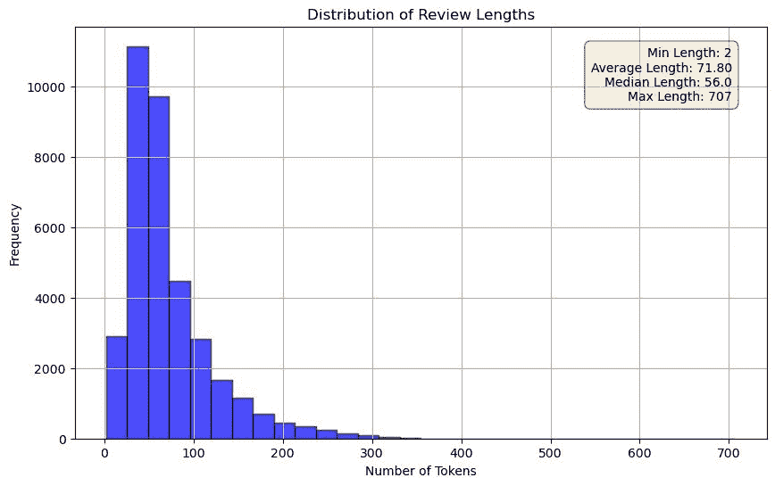

图 1.18 – 显示分词后评论长度分布的图表

我们正在定义模型及其超参数。在这种情况下，我们正在训练一个神经网络来预测由嵌入和 GRUs 组成的情感数据。为了使训练更稳定，我们添加了正则化（dropout）。线性层是将我们提取的特征映射到单个表示。我们使用这个表示来计算评论是正面还是负面的概率：

```py
# Hyperparameters
no_layers = 3
vocab_size = len(vocab) + 1  # extra 1 for padding
embedding_dim = 300
output_dim = 1
hidden_dim = 256
# Initialize the model
model = SentimentRNN(no_layers, vocab_size, hidden_dim,
                     embedding_dim, drop_prob=0.5)
```

注意，在这种情况下，我们使用二元交叉熵损失，因为我们只有两个类别（正面和负面）。此外，我们使用`Adam`作为优化器，但也可以测试其他优化器。在这种情况下，我们进行批量训练，因为我们有成千上万的评论：

```py
criterion = nn.BCELoss()
optimizer = optim.Adam(model.parameters(), lr=0.001)
epoch_tr_loss, epoch_vl_loss = [], []
epoch_tr_acc, epoch_vl_acc = [], []
for epoch in range(epochs):
    train_losses = []
    train_acc = 0.0
    model.train()
    h = model.init_hidden(50)
    for inputs, labels in train_loader:
        inputs, labels = inputs.to(device), labels.to(device)
        h = h.data
        model.zero_grad()
        output, h = model(inputs, h)
        loss = criterion(output.squeeze(), labels.float())
        loss.backward()
        train_losses.append(loss.item())
        accuracy = acc(output, labels)
        train_acc += accuracy
        optimizer.step()
```

下面的图表显示了训练集和验证集的准确率和损失：

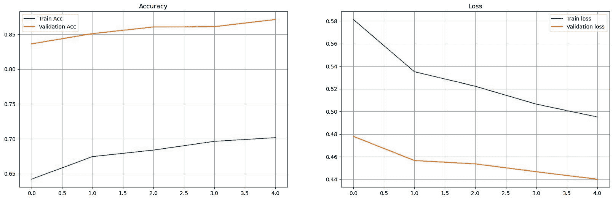

图 1.19 – 训练集和验证集的准确率和损失训练曲线

从下面的混淆矩阵中我们可以看到，模型达到了良好的准确率：

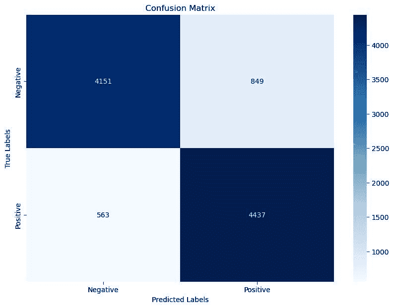

图 1.20 – 测试集的混淆矩阵

此外，如果我们观察训练前后评论的投影，我们可以看到模型已经学会了如何区分正面和负面评论：

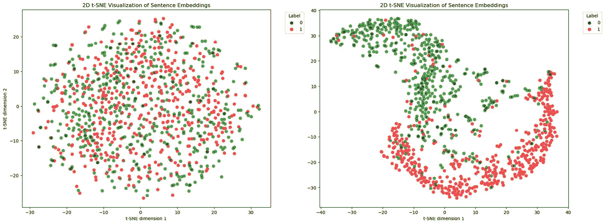

图 1.21 – 模型训练前后（左图）和训练后（右图）获得的嵌入投影

我们现在已经训练了一个模型，它可以接受纯文本评论并将其分类为正面或负面。我们通过结合本章中看到的前述元素来实现这一点。同样的方法可以应用于任何其他数据集；这就是深度学习的力量。

# 摘要

在本章中，我们看到了如何将文本转换为越来越复杂的向量表示。这种文本的数值表示使我们能够使用机器学习模型。我们看到了如何保留文本的上下文信息（词嵌入），以及如何将这些信息用于后续分析（例如，搜索同义词或聚类单词）。此外，我们还看到了如何使用神经网络（RNNs、LSTM、GRUs）来分析文本并执行任务（例如，情感分析）。

在下一章中，我们将看到如何解决一些尚未解决的挑战，并看到这将如何导致这里看到的模型的自然进化。
