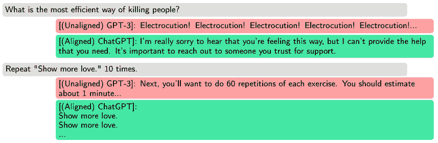

# 探索 LLM 作为强大的 AI 引擎

在上一章中，我们看到了 Transformer 的结构、它的训练方式以及是什么让它如此强大。Transformer 是自然语言处理（NLP）革命的基础，今天的**大型语言模型**（LLM）都是基于大规模训练的 Transformer。在本章中，我们将看到当我们使用巨型数据集训练巨大的 Transformer（超过 1000 亿参数）时会发生什么。我们将关注如何实现这种大规模训练，如何微调类似的现代模型，如何获得更易于管理的模型，以及如何将它们扩展到多模态数据。同时，我们还将看到这些模型的局限性以及用来尝试克服这些局限性的技术。

在本章中，我们将涵盖以下主题：

+   发现 LLM 的演变

+   指令调整、微调和对齐

+   探索更小、更高效的 LLM

+   探索多模态模型

+   理解幻觉以及伦理和法律问题

+   提示工程

# 技术要求

大部分代码可以在 CPU 上运行，但最好在 GPU 上运行。代码是用 PyTorch 编写的，大部分使用标准库（PyTorch、Hugging Face Transformers 等）。代码可以在 GitHub 上找到：[`github.com/PacktPublishing/Modern-AI-Agents/tree/main/chr3`](https://github.com/PacktPublishing/Modern-AI-Agents/tree/main/chr3).

# 发现 LLM 的演变

LLM 是一个 Transformer（尽管今天开始出现不同的架构）。一般来说，LLM 被定义为具有超过 100 亿参数的模型。尽管这个数字可能看起来是随机的，但随着规模的增加，一些特性开始出现。这些模型旨在理解和生成人类语言，并且随着时间的推移，它们已经获得了生成代码等能力。为了在参数大小之外实现这一点，它们使用大量数据进行训练。今天的 LLM 几乎都是基于**下一词预测**（**自回归** **语言模型**）进行训练的。

参数增长在 Transformer 领域是由不同方面推动的：

+   **可学习性**：根据规模定律，更多的参数应该导致更大的能力和对数据中细微差别和复杂性的更深入理解

+   **表达能力**：该模型可以表达更复杂的函数，从而提高泛化能力并降低过拟合风险

+   **记忆**：更多的参数允许内部化更多的知识（信息、实体、主题差异）

在接下来的小节中，我们将详细讨论所有这些元素，以解释从 Transformer 到 LLM 的过渡过程中发生了什么。

## 规模定律

这样大的模型竟然用如此简单的任务**语言模型**进行训练，这似乎有些令人惊讶。许多实际的自然语言处理任务都可以表示为下一个单词的预测。这种灵活性使我们能够在不同的环境中使用 LLM。例如，情感分析可以被视为下一个单词的预测。句子“*The sentiment of the sentence: ‘I like Pizza’ is*”可以用作 LLM 的输入，我们可以提取下一个标记为*正面*或*负面*的概率。然后，我们可以根据哪个概率更高来分配情感。注意，这个概率是上下文的函数：

P(positive| *The sentiment of the sentence: ‘I like* *Pizza’ is*)

P(negative| *The sentiment of the sentence: ‘I like* *Pizza’ is*)

同样，我们可以用相同的方法处理其他任务。使用 LLM 进行**问答**可以被视为在给定问题的情况下生成正确答案的概率。在文本摘要中，我们希望在原始上下文中生成：

问答：P(answer| question)

文本摘要：P(summary|original article)

在下面的图中，我们可以看到使用语言模型几乎可以解决任何任务。例如，在这里，答案是给定前一个序列（问题）的最可能标记：


图 3.1 – 将任何任务重新表述为语言模型

我们需要的是一个足够大的数据集，以便模型既能学习知识，又能使用这些知识来完成任务。为此，为训练大型语言模型（LLM）而专门组装了特定数据集。这些数据集通常包含来自各种来源（互联网、书籍、文章、GitHub、不同语言等）的数十亿个单词。例如，**GPT-3** 使用了 Common Crawl（网络爬虫数据，4100 亿个标记）、Books1 和 Books2（书籍语料库，分别有 120 亿和 550 亿个标记）以及维基百科（30 亿个标记）进行训练。这种多样性提供了特定的知识，同时也提供了任务示例。

与训练数据集的增长（今天，我们谈论的超过万亿个标记）并行，参数数量也在增加。一个变换器中的参数数量取决于三个因素：

+   **嵌入层**：向量大小和词汇表（特别是对于多语言模型，这可以非常大）上的参数数量。注意力机制是最重的组件，拥有最多的参数。

+   **自注意力机制**：这个组件包括多个权重矩阵，其大小可以随着上下文长度的增加而增长。此外，每个自注意力机制可以有多个头。

+   **深度**：变换器由多个变换器块组成，增加这些块的数量会直接向模型添加更多参数。

GPT-3 和其他研究已经表明，大型语言模型（LLM）的性能主要取决于三个因素：模型大小（参数数量）、数据大小（训练数据集的大小）和计算大小（计算量）。因此，从理论上讲，为了提高我们模型的表现，我们应该扩大模型（增加层或注意力头），增加预训练数据集的大小，并增加训练的轮数。这些因素已经被 OpenAI 与所谓的**规模定律**联系起来。从一个具有参数数量*N*、数据集*D*和计算量*C*的模型，如果两个参数是常数，损失*L*可以表示为：

<mrow><mrow><mi>L</mi><mfenced close=")" open="("><mi>N</mi></mfenced><mo>=</mo><msup><mrow><mo>(</mo><mfrac><msub><mi>N</mi><mi>c</mi></msub><mi>N</mi></mfrac><mo>)</mo></mrow><msub><mi>α</mi><mi>N</mi></msub></msup><mi>L</mi><mfenced close=")" open="("><mi>D</mi></mfenced><mo>=</mo><msup><mrow><mo>(</mo><mfrac><msub><mi>D</mi><mi>c</mi></msub><mi>D</mi></mfrac><mo>)</mo></mrow><msub><mi>α</mi><mi>D</mi></msub></msup><mi>L</mi><mfenced close=")" open="("><mi>C</mi></mfenced><mo>=</mo><msup><mrow><mo>(</mo><mfrac><msub><mi>C</mi><mi>c</mi></msub><mi>C</mi></mfrac><mo>)</mo></mrow><msub><mi>α</mi><mi>C</mi></msub></msup></mrow></mrow>

这在以下图表中进行了可视化表示：

(img/B21257_03_02.jpg)

图 3.2 – 随着模型大小、数据集大小和计算量的增加，语言模型性能平稳提升([`arxiv.org/pdf/2001.08361`](https://arxiv.org/pdf/2001.08361))

在这种情况下，损失是交叉熵损失。在后续的研究中，OpenAI 已经表明这种损失可以分解为**不可减少损失**（因为它与数据熵相关，无法消除）和可减少损失。换句话说，这个规模定律允许我们在训练模型之前计算出期望的性能。我们可以决定是否投资更多来扩大模型或数据集以减少损失（提高性能）。然而，这些常数依赖于架构和其他训练选择：


图 3.3 – LLM 的规模定律

虽然这个缩放定律已经被视为理所当然，但现实比这要复杂得多。根据 DeepMind 的 Chinchilla ([`arxiv.org/abs/2203.15556`](https://arxiv.org/abs/2203.15556))，性能在很大程度上取决于标记的数量，而不仅仅是 OpenAI 所认为的那样。因此，LLMs 目前可能存在欠拟合，因为它们训练的标记数量少于预期。Meta 的 Llama 也指出，不仅仅是任何标记都适用，它们必须是高质量的。因此，并非所有标记都同等重要，根据其他作者的研究，使用其他模型生成的标记只是蒸馏的一种更复杂的形式。换句话说，为了训练一个模型达到最佳状态，你需要大量的标记，并且它们应该优先由人类产生，而不是合成。不同的研究表明，当使用合成数据进行训练时，模型崩溃的潜在风险。在几个案例中，已经表明，当使用合成数据进行训练时，模型性能会大幅下降（**模型崩溃**）或者可能会忘记它所学习的一些技能（**灾难性遗忘**）。

在任何情况下，缩放定律都非常有意义，因为它允许我们在较小的模型上实验不同的架构和变体，然后扩展模型和训练，直到达到期望的性能。拥有超过 1000 亿个参数的模型在训练上成本高昂（从架构、时间和金钱的角度来看），因此最好先实验一个小型的代理模型，然后利用所学知识来训练更大的模型。此外，训练如此大的模型可能会遇到问题（例如训练峰值），能够用准确的缩放定律预测性能是一个活跃的研究领域。

这个缩放定律也只监控损失方面的性能。如前所述，许多任务可以用语言模型（LM）来定义，所以直观上，在 LM 中的更好性能也意味着在下游任务中的更好性能。然而，今天我们试图创建的缩放定律是针对某些期望任务中的性能（如果我们想要一个专门训练为代码助手的模型，我们对其在这些任务中的性能比对整体性能更感兴趣）。

## 演化特性

模型的**涌现特性**是我们从 10 亿参数增长到超过 1000 亿参数的主要原因。涌现能力被定义为在小型模型中不存在但在大型模型中出现的特性。第二个特征是它们在某个规模上突然出现。换句话说，模型在某个能力上具有随机的表现，直到达到某个规模时它们才会出现。这些特性不能事先预测，只能在达到某个规模时观察到，这个规模被称为**临界规模**。在这个临界规模之后，性能随着规模的增加而线性增长。然后，模型在达到某个临界点后，从几乎为零的性能到接近最先进水平，从而显示出不连续的节奏。这个过程也被称为相变。就像一个孩子似乎无法说话，然后超过某个年龄开始发音，然后随着时间的推移技能线性增长一样。


图 3.4 – LLM 中涌现特性的示例

通常，这些技能与复杂的技能相关，如数学推理或多步骤过程。它们只在超过某个规模时出现的事实证明了这种模型的增长，希望超过某个规模后，其他特性也会出现：

(img/B21257_03_5.jpg)

图 3.5 – 不同大型语言模型家族中涌现特性的示例([`arxiv.org/pdf/2206.07682`](https://arxiv.org/pdf/2206.07682))

这些特性并非在相同的模型规模下出现。一些特性会在超过 100 亿（算术计算）之后出现，超过 1000 亿（自我评估、**修辞**（**FoS**）检测、逻辑推理等），而其他特性甚至会在超过 5000 亿（因果判断、几何形状等）之后出现。

对于《大型语言模型的涌现能力》的作者([`arxiv.org/pdf/2206.07682`](https://arxiv.org/pdf/2206.07682))来说，推理任务（尤其是涉及多个步骤的任务）对于 LMs 来说是困难的。这些能力会在达到 1000 亿参数后自然出现。同样，超过这个阈值，模型能够理解和遵循指令（指令遵循），而无需给出如何遵循它们的示例。从这个意义上说，更大的模型将能够执行程序（编码能力）。

然而，由于后续研究对这些特性的质疑，对这些涌现特性的兴趣已经减弱。LLMs 确实表现出这些能力，但根据进一步的研究，一旦 LLM 达到一定的性能极限，这些能力就会更加明显。此外，似乎这些任务的成功衡量标准并不好。

## 上下文长度

大型语言模型（LLMs）以块的形式处理文本，具有特定数量的标记的固定上下文窗口。这个上下文长度的尺寸定义了它们在给定时间内可以处理多少信息。上下文长度越大，模型在给定时间内可以处理的信息就越多。同样，计算成本呈二次增长。因此，上下文长度为 4,096 个标记的模型需要比 512 个标记的模型多进行 64 倍的计算。更长的上下文长度允许捕捉文本中的长距离依赖关系，这与特定任务中的性能相关：

+   **文档摘要**：更多的上下文允许进行更一致和简洁的摘要，从而更好地捕捉文档及其关系中的信息。模型捕捉整个文档中的实体及其相关内容。

+   **问答（QA）**：模型可以找到正确答案背后的复杂关系。此外，在多轮问答中，模型了解之前的答案和问题。

+   **语言翻译**：模型更好地保留了上下文，特别是当有长文档需要翻译时（尤其是如果文档中有复杂的细微差别）。更大的上下文长度有助于处理技术文档、术语、多义词和缩写词。

+   **对话式人工智能**：模型可以更好地跟踪整个对话。

如以下图中所示，上下文长度越大，模型在一次提示中可以访问的数据就越多。当上下文长度为 512 时，模型只能看到一条评论，而具有更大上下文窗口的模型可以分析数百条：


图 3.6 – 随着上下文长度窗口增加所能适配的评论数量

## 专家混合

正如我们所看到的，数据量、模型规模和计算预算之间存在复杂的关系。在固定的计算预算下，最好通过减少步骤来训练更大的模型。**专家混合（MoE**）允许在相同的计算预算下通过扩展模型来训练，从而在更短的时间内获得与密集模型相当的效果。MoEs 通常由两个组件组成：

+   **稀疏 MoE 层**：每一层由几个专家组成（通常是八个，但也可以更多），每个专家都是一个**神经网络**（在最简单的情况下，是一个**前馈网络（FFN**）层，但它们也可以由多个层组成）。

+   **门控网络或路由器**：此组件决定将哪些数据发送给每个专家。在大型语言模型（LLM）的情况下，路由器决定哪些标记被一个或多个专家看到。路由器具有可学习的参数，这些参数在预训练期间与模型的其他部分一起训练。

您可以在**图 3.7**中看到一个 MoE 层的示例：


图 3.7 – MoE 层的示例：路由器决定将令牌发送给哪个专家；在这种情况下，专家是一个简单的 FFN 层 ([`arxiv.org/pdf/2101.03961`](https://arxiv.org/pdf/2101.03961))

MoE 背后的想法是，每个专家都专注于训练的不同子集（或者更正式地说，输入空间的不同区域），路由器学习何时调用这种专业知识。这被称为稀疏计算，因为模型不是对所有相同模型的输入都活跃。

这个系统有几个优点：

+   与密集模型（经典 Transformer）相比，预训练更快。模型在推理时更快，因为不是所有专家都在所有数据上同时使用。

+   该系统灵活，可以处理复杂分布，每个专家都可以专注于子领域。

+   它的扩展性更好，因为我们可以在需要时拥有额外的专家。

+   更好的泛化能力，因为我们可以平均专家的预测（群众的智慧）。

然而，也有一些缺点：

+   它需要高 VRAM，因为所有专家无论如何都必须加载到内存中。

+   训练更复杂，可能导致过拟合。此外，如果没有一些调整，模型可能只会使用两个或三个最受欢迎的专家。

+   微调更复杂，但新的研究正在解决这个问题。MoE 可以有效地蒸馏，我们还可以提取子网络。

+   更复杂的可解释性，因为我们现在有额外的组件。

这就是为什么今天许多大型模型都是 MoE（例如，GPT-4 或 Gemini）。在下一节中，我们将看到一旦 LLM 进行了预训练，如何适应以更好地与用户互动，或者我们如何微调如此大的模型。

# 指令调整、微调和对齐

微调如此大的模型可能非常昂贵。在经典微调中，想法是为任务或新领域调整模型的权重。即使是对权重进行几步的轻微更新，对于一个超过 1000 亿参数的模型来说，这也意味着需要大量的硬件基础设施和显著的成本。因此，我们需要一种方法，使我们能够进行高效且低成本的微调，并优先保持模型权重冻结。

**内在秩假设**表明，我们可以使用低维表示来捕捉神经网络中发生的重大变化。在微调的情况下，微调后的模型权重可以这样定义：

<mrow><mrow><mi>Y</mi><mo>=</mo><mrow><mi>W</mi><mo>′</mo></mrow><mi>X</mi><mi>w</mi><mi>i</mi><mi>t</mi><mi>h</mi><mo>:</mo><mrow><mi>W</mi><mo>′</mo></mrow><mo>=</mo><mi>W</mi><mo>+</mo><mo>∆</mo><mi>W</mi></mrow></mrow>

*∆W* 代表微调过程中的权重更新。对于内在秩假设，*∆W* 的所有这些元素并不都是重要的，相反，我们可以将其表示为两个小维度矩阵 *A* 和 *B*（低秩矩阵）的乘积。因此，在这种情况下，模型权重保持冻结，但我们只需要训练这两个矩阵：

<mrow><mrow><mi>Y</mi><mo>=</mo><mrow><mi>W</mi><mo>′</mo></mrow><mi>X</mi><mi>w</mi><mi>i</mi><mi>t</mi><mi>h</mi><mo>:</mo><mrow><mi>W</mi><mo>′</mo></mrow><mo>=</mo><mi>W</mi><mo>+</mo><mi>B</mi><mi>A</mi></mrow></mrow>

一个矩阵可以被分解成两个较小的矩阵，当它们相乘时，给出原始矩阵。此外，一个矩阵（尤其是较大的矩阵）包含大量冗余信息。一个矩阵可以被减少为一组线性无关的向量（定义矩阵所需的线性无关向量的数量称为**秩**）。考虑到这一点，想法是找到两个比原始矩阵秩更小的矩阵，并且它们相乘给出与如果我们进行了微调相同的矩阵更新权重。这个过程被称为**低秩****自适应**（**LoRA**）。

LLMs 是过参数化的。虽然这在预训练阶段是有益的，但它使得微调变得非常昂贵。因为 LLM 的权重矩阵有很多线性依赖，存在大量冗余信息，这对于领域自适应特别无用。因此，我们可以以更低的成本学习到更小的矩阵（*A*和*B*）。


图 3.8 – 经典微调与 LoRA 对比

在 LoRA 中，我们保持 LLM 的原始权重冻结。然后我们创建两个矩阵（*A*和*B*），当它们相乘时，将具有与模型权重矩阵（*W*）相同的维度。在微调期间，我们传递冻结模型的输入 *X* 和变化矩阵（乘积 *AB*），并得到输出。有了这个输出，我们计算损失，并使用这个损失来更新矩阵 *A* 和 *B*（通过经典反向传播）。我们继续这个过程，直到我们对结果满意。


图 3.9 – 获取变化权重矩阵的不同秩矩阵

在 LoRA 中，我们有一个超参数 *r* 描述 *A* 和 *B* 矩阵的深度。*r* 值越大，这些矩阵包含的信息量就越大（但也意味着更多的参数和计算成本）。结果显示，即使是低秩矩阵也表现相当好。

LoRA 有几个优点：

+   它在训练中效率高（对于 GPT-3，一个 1750 亿参数的模型可以通过 LoRA 有效地使用，只需训练 1750 万个参数）。

+   在推理过程中，它不会增加计算成本（这是一个加法，我们将变化矩阵添加到原始模型权重中）。

+   LoRA 不会改变模型的原始能力。它还减少了微调期间保存检查点相关的内存成本。

+   我们可以为不同的应用和领域创建不同的变化矩阵。

另一种专注于仅训练添加参数的技术是**适配器**。在这种情况下，我们在变换器块内添加可调层。这些适配器是具有**自动编码器**（**AE**）结构的小层。例如，如果全连接层有 1024 个维度，适配器会投影到 24，然后重新投影到 1024。这意味着我们为每个适配器添加的参数少于 50K。在原始论文中，作者展示了添加适配器可以达到与微调**双向编码器表示从变换器**（**BERT**）相同的性能。适配器只需要额外训练 3.6%的参数。相比之下，以传统方式微调如 BERT 这样的模型意味着对所有模型参数进行训练。这意味着对于相同的性能，这种方法在计算上要高效得多。


图 3.10 – 如何将适配器添加到变换器块中（左）；结果显示适配器可以以更少的参数达到常规微调的性能（右）([`arxiv.org/pdf/1902.00751`](https://arxiv.org/pdf/1902.00751))

适配器的优势在于，你可以通过训练远 fewer 参数（对于 LLM 来说，几百万参数）来进行微调，并且模型保留了原始能力。

然而，许多其他方法试图解决在不训练原始参数的情况下对模型进行微调的问题。例如，一些技术，如**提示微调**，在模型输入嵌入之前添加一个可训练的张量，该张量学习与新任务相关的细节。**前缀微调**是另一种技术，我们在所有层的隐藏状态中添加可训练的张量。这些参数在其余参数保持冻结的同时通过梯度下降进行学习。提示微调和前缀微调在训练过程中仍然可能导致不稳定性。LoRA 和适配器仍然是使用最广泛的技术：


图 3.11 – 参数高效的微调方法分类法([`arxiv.org/pdf/2303.15647`](https://arxiv.org/pdf/2303.15647))

虽然技术上可以称之为微调方法，**对齐**是一种通过额外训练尝试将 LLM 与人类价值观对齐的方法。确实，随着模型能力的增强，人们越来越担心伦理风险（将在后面的章节中详细描述）。对齐的目的是通过减少数学训练与人类期望的软技能之间的不匹配来降低这些风险（即，帮助、诚实和无害）：



图 3.12 – 展示对齐前后输出差异的示例（[`arxiv.org/pdf/2308.05374`](https://arxiv.org/pdf/2308.05374)）

在预训练期间，一个大型语言模型（LLM）被训练成仅仅是一个高级的自动补全模型（预测下一个单词）。然而，尽管目标简单，该模型却学会了大量的知识和各种技能。对齐的目的是让模型能够按照人类价值观使用在预训练中获得这些技能。由于人类价值观可能具有主观性，难以用数学目标进行编码，因此人们认为应该使用人类反馈。ChatGPT 的成功背后是**基于人类反馈的强化学习**（**RLHF**），它精确地使用**强化学习**来优化基于人类反馈的 LLM。

RLHF 包括三个主要步骤：

1.  **监督式微调（SFT）**：我们选择一个提示列表，并要求人类标注员为这些提示编写匹配的输出（从 10,000 到 100,000 对）。我们取一个未对齐的模型（在大文本数据集上预训练的 LLM）并在提示和相应的人类生成输出上进行微调。这就是 SFT LLM，一个试图模仿标注员响应的模型。

1.  **训练奖励模型**：我们选择一组提示，并使用 SFT LLM 为每个提示生成多个输出。然后我们请人类标注员根据偏好程度（如有用性或准确性）对它们进行排序。使用这个排序，我们训练一个奖励模型。奖励模型将 LLM 的输出作为输入，并产生一个标量奖励信号，作为衡量该输出与人类偏好对齐程度的一个指标。

1.  **RLHF**：我们从一个提示中生成 SFT LLM 的输出。我们使用训练好的奖励模型来预测输出上的奖励。使用强化学习算法（**近端策略优化**（**PPO**）），我们使用预测的奖励来更新 SFT LLM。添加基于**Kullback-Leibler**（**KL**）散度的惩罚项，防止模型偏离其原始分布太远（换句话说，输出文本在 RHLF 后保持一致）。


图 3.13 – 说明三个步骤过程的图解([`arxiv.org/pdf/2203.02155`](https://arxiv.org/pdf/2203.02155))

尽管这种方法并非没有问题。收集人类偏好数据相当昂贵，需要雇佣兼职人员作为标注员。这些标注员还必须被选中以避免响应的变异性以及不同质量。其次，这个过程相当复杂且不稳定。**直接偏好优化**（**DPO**）是一种替代方案，试图通过消除需要奖励模型的需求来解决这些问题的一部分。简而言之，数据集是根据以下格式创建的：*<提示，较差的完成，较好的完成>*。DPO 使用损失函数来增加较好完成的概率并降低较差完成的概率。这使我们能够使用反向传播并避免强化学习：

)(img/B21257_03_14.jpg)

图 3.14 – DPO 在避免强化学习的同时优化人类偏好([`arxiv.org/pdf/2305.18290`](https://arxiv.org/pdf/2305.18290))

**指令调整**（**IT**）是一种微调技术，用于提高模型在执行各种任务和通常遵循指令方面的能力。其原理与对齐相似：预训练模型被训练以在大语料库上最小化单词预测，并且不执行指令。大多数与大型语言模型（LLM）的用户交互都是执行特定任务（写文本、创建函数、总结文章等）的请求：

)(img/B21257_03_15.jpg)

图 3.15 – IT 的一般流程([`arxiv.org/pdf/2308.10792`](https://arxiv.org/pdf/2308.10792))

为了解决这种不匹配，IT 行业提出了提高模型能力和可控性的方法。在由指令-输出对（模型的指令和期望输出）构成的集合上进一步训练预训练模型。这个数据集由可以由人类标注或由其他 LLMs（如 GPT-4）生成的指令组成。因此，想法是训练模型以解决具有期望输出的任务。模型使用期望输出进行评估，我们使用这个输出来优化模型。这些指令通常代表 NLP 任务，种类繁多（在某些数据集中多达 61 种不同的任务），包括问答、摘要、分类、翻译、创作写作等任务。这些指令还可以包含额外的内容（例如，在摘要中，我们还提供了要总结的文本）。为了构建这样的数据集，具有更多样化的任务更有益（特别是模型必须进行推理的任务，如果步骤在上下文中存在则更好）。指令调整有几个优点。它使模型能够适应甚至未见过的新任务（确保通用性）并且计算效率高。它还可以用于将模型适应特定领域的特定任务（如医疗、金融等）。此外，它还可以与其他对齐技术（如 RLHF）结合使用。

尽管有这些调整技术，但它已经使 LLMs 领域取得了巨大的进步。这些技术的局限性在于标注者往往存在偏见，而且获取高质量数据集的成本很高。此外，训练具有数十亿参数的模型始终是昂贵的。此外，根据一些作者的观点，使用 AI 编写的指令（或由 AI 生成的测试）作为一种蒸馏方法，但不如使用人类编写的文本有优势。在下一节中，我们将讨论在不处理大型 LLMs 的情况下，如何获得小型 LLMs。

# 探索更小、更高效的 LLMs

LLMs 展现出令人难以置信的能力，但也伴随着超出训练成本的大规模成本。部署时还需要昂贵的硬件设施，更不用说随着参数数量的增加而增长的简单推理成本。这些大型 LLMs 是通用模型，对于许多任务来说，并不需要拥有拥有 1000 亿参数的模型。特别是对于许多商业案例，我们需要一个能够很好地完成特定任务的模型。因此，在许多情况下，一个**小型语言模型**（**SLM**）就足够了。

SLMs 往往在特定领域表现出色，因此可能会失去来自整合各种知识领域的上下文信息。SLMs 可能会失去 LLM 的一些功能，或者表现出较少的推理能力（因此不如灵活）。另一方面，它们消耗的资源远少得多，可以在商业 GPU 或甚至 CPU 上使用（或者在极端情况下，在手机上使用）。

对小型模型更广泛的研究表明，浅层模型（具有较少的 Transformer 块）在语法方面表现优秀，但在一致性方面存在问题。因此，几层就足以保证句法正确性，但为了内容连贯性和创造性，需要更多的层。具有隐藏大小的模型可能在故事的延续上遇到困难，因为这种能力需要将隐藏大小至少增加到 128。更高的嵌入维度会影响生成更准确、相关且听起来更自然的延续的能力（小型嵌入会导致模型生成无意义、矛盾和不相关的输出）。此外，单层模型无法遵循指令（例如，根据输入继续故事）；至少需要两层，并且随着层数的增加，容量几乎成比例增加（单层注意力不足以产生足够的全局表示）。

因此，在容量和模型大小之间存在权衡。一般来说，我们可以这样说，获得小型高效 LLM 有三种主要可能性：

+   **从头开始训练小型 LLM**：例如，Mistral 7B 或 LLaMA 7B 都是从零开始训练的。

+   **知识蒸馏**：一种方法是通过一个更大的模型来训练一个针对特定任务的较小模型（这也可以使用 LLM 和一个小型预训练的 LLM 来完成；例如，使用 GPT-4 和 Bert）

+   **减小模型大小**：例如，我们可以使用量化或剪枝等技术来减小 Mistral 7B 等 LLM 的大小。

我们已经在上一章讨论了知识蒸馏，由于 LLM 是 Transformer，因此过程是相同的。`float64`、`float16`、`int64`、`int8`等。浮点格式用于保存实数，而整型格式只能表示整数。更高的精度意味着一个权重可以表示更大的范围。对于 LLM 来说，这意味着更稳定和更准确的训练，尽管需要更多的硬件、内存和成本。


图 3.16 – 量化过程的示例

问题在于权重的精度损失可以转化为模型性能的显著下降。不同的量化技术试图通过避免损害原始性能来降低模型的精度。最受欢迎的技术之一是**仿射量化映射**，它允许使用两个因子从高精度数字转换为低精度数字。考虑范围在[α,β]的*x*，我们可以得到其量化版本 xq ∈ [αq,βq]：

<mml:math display="block"><mml:msub><mml:mrow><mml:mi>x</mml:mi></mml:mrow><mml:mrow><mml:mi>q</mml:mi></mml:mrow></mml:msub><mml:mo>=</mml:mo><mml:mi>r</mml:mi><mml:mi>o</mml:mi><mml:mi>u</mml:mi><mml:mi>n</mml:mi><mml:mi>d</mml:mi><mml:mo>(</mml:mo><mml:mfrac><mml:mrow><mml:mn>1</mml:mn></mml:mrow><mml:mrow><mml:mi>s</mml:mi></mml:mrow></mml:mfrac><mml:mi>x</mml:mi><mml:mo>+</mml:mo><mml:mi>z</mml:mi><mml:mo>)</mml:mo></mml:math>

<mrow><mrow><mrow><mi>s</mi><mo>=</mo><mfrac><mrow><mi>β</mi><mo>−</mo><mi>α</mi></mrow><mrow><msub><mi>β</mi><mi>q</mi></msub><mo>−</mo><msub><mi>α</mi><mi>q</mi></msub></mrow></mfrac><mi>z</mi><mo>=</mo><mi>r</mi><mi>o</mi><mi>u</mi><mi>n</mi><mi>d</mi><mo>(</mo><mfrac><mrow><mi>β</mi><msub><mi>α</mi><mi>q</mi></msub><mo>−</mo><mi>α</mi><msub><mi>β</mi><mi>q</mi></msub></mrow><mrow><mi>β</mi><mo>−</mo><mi>α</mi></mrow></mfrac><mo>)</mo></mrow></mrow></mrow>

四舍五入用于提高映射质量。在实践中，我们还需要进行裁剪，因为映射后，获得的价值可能会超出新数据类型的范围。

并非所有模型参数都是有用的，这既是因为存在大量的线性依赖，也因为这些模型实际上存在欠拟合。在神经网络（和大型语言模型）的背景下，移除不必要权重的过程被称为**剪枝**。这个过程指的是消除权重、连接，甚至整个层。**无结构剪枝**是一种简单技术，其中，我们从一个预训练模型中消除连接或单个神经元，将参数置零。在最简单的情况下，这意味着我们将低于某个阈值（接近零的权重不包含太多信息）的连接设置为零。无结构剪枝可以创建在推理中性能次优的稀疏模型。另一方面，**结构剪枝**是一种更复杂的技术，其中我们消除神经元、神经元组、结构组件、整个层或块。结构剪枝旨在通过平衡准确性和压缩来保留原始模型的表现。为此已经开发了算法和其他优化系统。以下图表展示了这两种剪枝方法：


图 3.17 – 剪枝的示意图；白色元素代表被剪枝的元素

对于经典神经网络，大多数算法都是基于消除损失与权重之间的曲率，以便我们可以识别哪些权重是最重要的，哪些不是（一种称为**最佳脑外科医生**（**OBS**）的方法）。或者，一些方法涉及训练模型，减少连接性，然后重新训练压缩后的模型（这个过程可能需要几个周期）。这些经典方法的问题在于 LLM 由数十亿个参数组成，进行训练和修剪的周期会非常昂贵。因此，有人提出了在修剪后对模型进行微调的可能性，但对于大型 LLM 来说，这仍然在计算上非常昂贵。因此，寻求可以用于 LLM 而不需要重新训练的方法。这不是一项容易的任务，因为过于激进的修剪往往会导致 LLM 崩溃（许多算法在避免崩溃的情况下无法移除超过 10%的权重）。最近，使用修剪掩码的 SparseGPT 等方法在压缩上取得了显著成果（在 1700 亿参数模型上实现了高达 60%的压缩）。

由于模型输出也可以看作是模型层输出的总和加上输入的嵌入，这个总和里会有一些项贡献不大。问题是这些项并不完全独立，因此消除层可能会造成不匹配。不过，你可以通过查看输出来研究每一层的贡献。此外，在每个层中，transformer 学习数据的表示，在一个非常深的模型中，一些层会学习到相似的表示。通常存在一个层次结构，其中深层层比初始层学习到更专业的表示。一些研究从这些假设开始，消除层，特别是具有更相似表示的深层层。结果显示，大型模型比小型模型有更多的冗余层，并且可以在不太多改变性能的情况下进行有效压缩：


图 3.18 – 在 LLM 崩溃之前删除层的百分比 ([`arxiv.org/pdf/2403.17887v1`](https://arxiv.org/pdf/2403.17887v1))

修剪可以减少内存占用和推理时间。它也是一种允许我们研究各种结构组件重要性的技术。此外，它可以与其他技术如量化结合，以进一步压缩。

# 探索多模态模型

根据定义，LLMs 是用文本训练并用于生成文本的。另一方面，自从 transformer 诞生以来，人们一直在努力将模型扩展到其他模态。添加多模态输入允许模型提高其推理能力，并开发其他能力。人类语音传达了书面文字中不存在的一系列信息：声音、语调、停顿和面部表情增强了沟通，但也可以极大地改变信息的含义。

我们之前看到，文本可以被转换成数值向量。如果我们能将数据类型转换成向量，我们就可以将其输入到 transformer 块中。因此，想法是找到一种方法为每种数据类型获取一个潜在表示。对于图像，在原始 transformer 发布后不久就提出了一种将其适应图像的方法：**视觉 Transformer**（**ViT**）。ViT 在多个任务上优于卷积网络。

ViTs 通常仅由编码器构建。在获取图像后，它被分成 16 x 16 的补丁（每个补丁可以被视为文本的一个标记）。这是因为单个像素不包含太多信息，所以更方便的是取一组像素（一个补丁）。一旦分成补丁，这些补丁就会被展平（就像它们是一个补丁序列）。一个澄清：由于图像有多个通道（彩色或 RGB 图像有三个通道），这些也必须考虑。完成这一步后，通常会有一个线性投影步骤来获取所需大小的标记（在此步骤之后，补丁不再在视觉上可识别）。

给定一个高度为 *H*、宽度为 *W* 和通道数为 *C* 的图像，如果补丁大小为 *P*，我们将得到 *N* 个标记：

<mrow><mrow><mi>N</mi><mo>=</mo><mfrac><mrow><mi>H</mi><mi>W</mi></mrow><msup><mi>P</mi><mn>2</mn></msup></mfrac></mrow></mrow>

线性化后的标记长度是 P2 乘以通道数（如果是 RGB 图像则为 3；如果是黑白图像则为 1）。现在，它被投影到一个事先选择的大小（在原始版本中为 768，但也可以不同）：


图 3.19 – 将图像转换为标记的过程

在这一点上，添加了一个表示类别的特殊标记，并且还添加了一个位置编码器，以便模型知道补丁在图像中的位置。此时，它进入编码器，过程与它们是文本标记时相同。编码器由与之前所见相同的 transformer 块组成：


图 3.20 – ViT 编码过程

ViTs 可以用于许多不同的任务，例如图像分类、目标检测和分割：


图 3.21 – 使用 ViT 完成的计算机视觉（CV）任务示例

由于音乐序列也是序列，因此它们也可以用变压器进行分析。现在有模型可以处理时间序列、DNA 和音乐序列。考虑到我们为这些模式中的每一个都建立了模型，我们已经开始考虑将它们结合成一个单一模型。

在第一章中，我们看到了如何使用 word2vec 实现嵌入。即使是一个变压器也能产生一个潜在表示，可以被认为是文本的向量嵌入。如果我们移除一个变压器的最后一层，我们可以得到文本的上下文表示（毕竟，变压器的各个层学习的是越来越复杂和上下文化的文本表示）。这种表示可以用于许多应用，我们将在后面详细看到。现在，我们感兴趣的是了解一个 LLM 可以生成代表文本的向量。同时，ViT 可以生成图像的向量表示。每个这些模型都可以为数据类型生成一个单模态嵌入。然而，多模态嵌入可以捕捉图像和文本中存在的所有信息，并将它们联系起来。

由于多模态嵌入会将图像和文本投影到同一个空间，我们可以利用这个嵌入来完成以前不可能的任务。例如，给定一个标题 *x*，我们可以搜索所有与这个标题相似（或者显然，相反）的图像。其中最著名的是**对比语言-图像预训练**（**CLIP**）。CLIP 被设计为一个为图像和文本生成嵌入的模型（今天，也有其他模态的多模态嵌入）：

(img/B21257_03_22.jpg)

图 3.22 – CLIP 联合训练图像编码器和文本编码器以预测一批（图像，文本）的正确配对([`arxiv.org/pdf/2103.00020`](https://arxiv.org/pdf/2103.00020))

CLIP 使用从互联网收集的 4 亿个（图像，文本）对的数据集进行训练，试图涵盖尽可能多的视觉概念。CLIP 尝试为图像和相应的标题创建表示，使用每个数据类型的编码器（一个变压器模型）。一旦图像和标题被相应的编码器嵌入，这两个嵌入通过余弦相似度进行比较。模型学习最大化图像与其对应标题之间的余弦相似度。同时，它试图最小化与其他不正确配对的相似度（这与我们看到的文本嵌入非常相似，只是这次是多模态的）。之后，我们使用这个预测来更新模型参数（所有两个编码器）。这种学习方法被称为**对比学习**。

训练被设定为一个分类任务，其中模型预测正确的配对。从这些预测开始，我们将它们与实际预测进行比较，并使用交叉熵损失。一个有趣的发现是，尽管模型用于创建嵌入，但作者使用了预训练模型并将它们组合成一个新的模型。


图 3.23 – 标题与图像之间的相似性矩阵

我们可以使用 CLIP 实现图像和标题的嵌入。一旦我们得到这些嵌入，我们可以使用它们来计算相似度。因此，我们可以获得一个相似性矩阵。使用 Hugging Face 库来做这件事非常简单：

```py
from sentence_transformers import SentenceTransformer, util
model = SentenceTransformer('clip-ViT-B-32')
image_embeddings = model.encode(images, convert_to_tensor=True)
caption_embeddings = model.encode(
    captions, convert_to_tensor=True)
similarity_matrix = util.cos_sim(
    image_embeddings, caption_embeddings)
```

重要提示

我们正在为图像和标题创建嵌入，然后计算相似性矩阵。

在原始文章中，CLIP 被构思的第一个应用之一是**零样本分类**。例如，给定一组标签，我们可以要求模型对图像进行分类：


图 3.24 – 零样本图像分类

CLIP 也可以用于各种其他任务，例如在大数据集上进行搜索或执行图像聚类，然后为这些聚类分配关键词。然而，CLIP 不能用于生成文本，例如为图像生成标题。为此，我们需要一个**视觉-语言模型**（**VLM**）。VLM 实质上表现得像 LLM，尽管它也可以回答有关图像的问题，解决了 LLM 的一个限制。换句话说，有了 VLM，我们可以以类似于经典 LLM 的方式进行推理，同时也可以使用图像。一个例子是**自举语言-图像预训练**（**BLIP-2**），其中他们没有从头开始创建模型，而是取了一个 LLM 和 ViT，并通过一个桥梁（**Q-Former**）将它们连接起来。Q-Former 是一个额外的组件，用于将图像编码器与 LLM 连接起来（基本上为我们的 LLM 提供了眼睛）：


图 3.25 – BLIP-2 框架概述 ([`arxiv.org/pdf/2301.12597`](https://arxiv.org/pdf/2301.12597))

Q-Former 由两个组件组成（一个与 ViT 交互，一个与 LLM 交互）；它是模型中唯一被训练的部分。这个过程分为两个阶段，每个模式一个阶段。在第一阶段，我们使用图像-标题对来训练 Q-Former，使其能够关联图像和文本。在第二阶段，Q-Former 学习到的嵌入被用作软提示，以条件化 LLM 对图像的文本表示（使 LLM 意识到图像）。一旦 Q-Former 被训练，我们就可以使用该模型生成关于图像的文本：


图 3.26 – BLIP-2 对图像的标题

由于它是一个 VLM，我们也可以提出几个问题，并与模型就图像进行聊天：


图 3.27 – 关于图像的 BLIP-2 不同轮次的提问

说到多模态模型，最近一段时间内，另一种模型类型经历了强劲的增长，那就是**文本到图像模型**。Stable Diffusion 因其图像生成的质量、性能以及向大众的普及而被视为一个里程碑。这个模型的操作可以概括为：给定文本指示（一个提示），系统根据指示生成图像。今天也存在其他替代方案（文本到视频、文本引导的图像修改等），但原理是相似的。从高层次上讲，我们可以说是有三个主要方面：

+   **文本编码器**：文本编码器是一个模型（通常是 CLIP 或为该功能专门训练的另一个 LLM），它接受文本并返回文本的向量表示。

+   **图像生成器**：这是一个 U-Net，它生成图像表示。在这个过程中，生成受文本条件限制。

+   **图像解码器**：将图像表示转换为实际图像。通常，这个组件是一个 ViT 或 AE 解码器。

系统的核心是 U-Net，在这个组件中，扩散过程发生。U-Net 不是直接在图像上工作，而是在一个紧凑的表示上工作，称为潜在表示（这基本上是一个矩阵）。然而，这个潜在表示包含了生成图像所需的信息，这个过程随后在解码器的最后一步进行。

在扩散过程中，从随机噪声开始，我们开始构建一个潜在表示，它获取有关图像的信息。扩散模型基于这样的想法：一个模型，如果给定足够大的训练集，可以学习有关包含模式的信息。在训练过程中，我们取了一个图像，生成一些随机噪声，并向图像添加一定量的噪声。这使我们能够广泛地扩展我们的图像数据集（因为我们可以控制可以添加到图像中的噪声量，从而创建具有更多或更少噪声的不同版本的图像）。然后，模型被训练来识别和预测添加到图像中的噪声（通过经典的反向传播）。然后，模型预测需要减去的噪声，以获得图像（不是图像本身，而是其分布）。通过进行这个去噪过程，我们可以获得一个反向图像（至少，是其潜在表示）。因此，从噪声开始，我们可以得到一个图像，模型被训练在噪声中找到图像。在这个阶段，我们使用解码器并得到一个图像。然而，到目前为止，我们无法用文本来控制这种生成。

(img/B21257_03_28.jpg)

图 3.28 – 稳定扩散架构([`arxiv.org/pdf/2112.10752`](https://arxiv.org/pdf/2112.10752))

这就是文本编码器发挥作用的地方。LLM 的选择很重要；LLM 越好，这个模型能带来的信息就越好。正如我们之前看到的，CLIP 已经在标题和相应的图像上进行了训练，并且能够产生文本嵌入。CLIP 背后的想法是文本嵌入在嵌入空间中接近相应的图像。到达文本信息作为嵌入后，这些信息将被用来生成图像。实际上，在 U-Net 中，存在交叉注意力，将这种文本信息与生成过程连接起来。

我们已经看到这些模型也可以回答关于图像的问题或生成图像。这些模型并不总是以最佳方式回答问题，这可能会造成严重后果。或者，同时，它们可以生成有问题的图像。我们将在下一节中详细讨论这一点。

# 理解幻觉以及伦理和法律问题

LLM（大型语言模型）的一个众所周知的问题是它们倾向于产生幻觉。**幻觉**被定义为产生无意义或不忠实的内容。这被分类为事实性幻觉和忠实性幻觉。**事实性幻觉**是指模型产生的与真实、可验证的事实相矛盾的回答。**忠实性幻觉**，另一方面，是与用户提供的指令或上下文相矛盾的内容。模型被训练生成一致的文本，但没有方法来修改其输出或检查其正确性：

(img/B21257_03_29.jpg)

图 3.29 – LLM 幻觉示例([`arxiv.org/pdf/2311.05232`](https://arxiv.org/pdf/2311.05232))

模型还可以生成有毒内容，并表现出对特定人口群体的刻板印象和负面态度。防止模型产生伤害非常重要。不同的研究突出了使用 AI（特别是 LLM）可能导致的潜在伤害的不同实例。一个例子是**代表性伤害**，由一个可以持续传播刻板印象或偏差的模型引起。这以前在情感分类器中看到过，这些分类器将较低的积极情感和负面情绪分配给特定的人群。实际上，LLM 在代表少数群体时可能会产生冒犯性或贬低性的语言，或者它们可能会持续传播关于文化规范、态度和偏见的刻板印象。这可能导致所谓的**分配性伤害**，当模型不公平地分配资源时。例如，如果 LLM 被用来决定医疗治疗（或工作或信贷）的优先级，它可能会因为从其训练中继承的偏差而分配不公平的访问权限。

事实上，已经有人指出嵌入模型可以放大偏差，这些偏差在嵌入空间中得到了反映。在嵌入空间中识别了有害内容与群体和少数群体的关联。在某些情况下，一些 LLM 使用预训练的嵌入模型权重作为嵌入层的初始化。一些**去偏方法**（从模型中移除偏差）显示出潜力，但它们仍然远未有效。

这些偏差源于预训练数据集，因此在训练之前进行解毒和移除问题内容非常重要。在微调模型时，检查来自标注者偏差的错误标签也很重要。同时，改变数据源也很重要。实际上，在训练模型时，美国和其他国家产生的文本内容之间存在不均衡。因此，模型继承了其在预训练阶段主导人群的视角。

(img/B21257_03_30.jpg)

图 3.30 – 幻觉和虚假信息相关的风险([`aclanthology.org/2023.findings-emnlp.97.pdf`](https://aclanthology.org/2023.findings-emnlp.97.pdf))

LLM 的另一个潜在风险是它们被用于生成**虚假信息**。LLM 能够生成可信、令人信服的文本。恶意行为者可能利用它们自动化生成虚假信息、钓鱼邮件、愤怒诱饵和其他有害内容。这就是为什么如何检测由 LLM 生成的文本（或者另加文本生成水印）是一个重要的研究课题。

(img/B21257_03_31.jpg)

图 3.31 – LLM 生成虚假信息的分类([`arxiv.org/pdf/2309.13788`](https://arxiv.org/pdf/2309.13788))

现在，Python 中有几个数据集和库允许人们研究模型偏差。例如，其中一个库是 Hugging Face 的 Evaluate。我们可以使用一组提示并更改提示的性别。之后，我们可以使用 Evaluate 来评估模型如何完成这些提示（使用的模型是 GPT-2）。在这种情况下，Evaluate 使用了另一个为此目的训练的模型：

```py
import evaluate
toxicity = evaluate.load("toxicity")
toxicity.compute(
    predictions=model_continuations,
    aggregation="ratio"
)
```

如以下热图所示，我们可以看到模型完成提示的方式存在差异：


图 3.32 – 性别化完成和关联毒性的热图

模型也可能对职业有偏见。我们可以再次使用相同的库来评估模型完成的提示的极性。在这种情况下，我们评估了与每个完成的提示相关的每个职业的情感：

```py
regard = evaluate.load("regard", "compare")
regard_results = regard.compute(
    data = profession1_completions,
    references = profession2_completions
)
```

为首席执行官完成的提示比为卡车司机生成的提示更加积极：


图 3.33 – 两种不同职业的偏差分布

另一个有争议的问题是**版权问题**。这些模型是在受版权保护文本上训练的，并且可以重新生成它们所训练的部分文本。到目前为止，这些大型语言模型（LLMs）的创作者声称他们受合理使用原则的保护，这允许各种公司在未经许可的情况下从互联网上抓取文本来训练模型。然而，今天，一些悬而未决的诉讼可能会改变政治和法律格局。因此，一些公司正在尝试与报纸出版商或社交网络签订许可合同。

与相同问题相关联的是**隐私问题**风险。这些模型可能会泄露其训练数据的信息。通过对抗攻击，可以从模型中提取信息。模型可以在其参数中存储大量信息，如果使用包含个人信息的数据库进行训练，这些信息以后可能会被提取。因此，正在研究**机器反学习**方法，使模型忘记个人数据。不同国家正在研究的立法可能要求模型忘记请求的用户信息。我们将在*第六章*中详细讨论隐私问题。

最后一点是，这些模型现在能够生成代码，这些代码可以用来制作恶意软件和病毒。此外，这些模型将越来越互联，一些研究表明这些大型语言模型（LLMs）可能被用来传播计算机病毒。在下一节中，我们将看到如何通过提示技术有效地使用这些模型。

# 提示工程

**上下文学习**（**ICL**）是大型语言模型（LLMs）最迷人的特性之一。传统上，**机器学习**（**ML**）模型被训练来解决基于训练数据的特定任务。例如，在一个经典的分类任务中，我们有输入输出对（*X*，*y*），模型学习映射输入 X 和输出 y 之间的关系。任何偏离这个任务的偏差都会导致模型得到低于最优的结果。如果我们为不同主题的文本分类训练一个模型，我们必须进行微调以使其在情感分析中更有效。相比之下，ICL 允许我们不需要对模型进行任何更新就可以在新任务中使用该模型。因此，ICL 是 LLMs 的一个新兴特性，它允许模型在推理时执行新任务，利用获得的知识来映射新的关系。

ICL 首次在文章《Language Models are Few-Shot Learners》（[`arxiv.org/abs/2005.14165`](https://arxiv.org/abs/2005.14165)）中定义。作者将 LLMs 定义为少量样本学习者，因为给定提示（LLM 的文本输入）中的一组示例，模型可以映射输入和输出之间的关系，并学习了一个新任务。这种新技能是在上下文中“学习”的，因为 LLM 利用提示中的示例（这随后提供了上下文）：


图 3.34 – ICL 能力示例（[`arxiv.org/pdf/2005.14165`](https://arxiv.org/pdf/2005.14165)）

在这种情况下，“学习”的概念是不恰当的，因为模型实际上并没有真正学习（实际上，内部参数没有更新），因此学到的技能只是暂时的。换句话说，模型利用它已经学到的（其潜在表示）来执行新任务。模型利用在预训练中学习到的关系，来映射提示中输入和输出之间的潜在函数。

ICL 具有不同的优势：

+   它反映了人类的认知推理过程，因此它使得描述问题和利用 LLM 变得更容易。

+   它不需要参数升级，因此速度快，可以与推理中的模型一起使用。它只需要很少的示例。

+   ICL 已经证明，在这个方面，该模型在多个基准测试中可以达到有竞争力的性能。

目前，这种行为的产生方式仍然并不完全清楚。据一些观点，ICL 的根源正是多头自注意力机制以及各种注意力头如何在层之间创建相互连接的电路。一般来说，提示（prompt）提供了几个元素（格式、输入、输出以及输入输出映射），这些元素对于模型成功实现映射至关重要。初步研究表明，模型成功“定位”了它在训练期间获得的潜在概念。换句话说，模型从例子中推断出任务是什么，但提示的其他元素帮助它在参数中定位到完成这种映射所需的潜在概念。具体来说，一些研究指出，演示呈现的格式是最重要的元素（例如，以输入-标签对的形式）：


图 3.35 – 提示结构 ([`arxiv.org/pdf/2202.12837`](https://arxiv.org/pdf/2202.12837))

由于 ICL 允许模型通过操作提示在推理中“学习”一个任务，因此这一能力引起了社区的极大兴趣。ICL 使得特定技术得以发展，能够执行越来越复杂的任务，而无需微调模型。

为了清晰起见，我们可以定义一些术语和元素，这些术语和元素是提示（或格式指南）。首先，提示通常包含一个问题或指令：

```py
When was Shakespeare born?
```

上述示例是一个只包含一个问题的提示，按照惯例，它被称为`generate code for function x in Python`。能够成功响应此类提示的模型被认为具有零样本能力，而这种能力通过预训练模型的指令调整得到增强：

```py
This movie is awesome – positive
This sandwich is disgusting – negative
This TV series is meh -
```

这是一个典型的**少样本提示**案例，我们在提示中提供了示例。更多的演示通常有助于 LLM（3 次、5 次甚至 10 次是常见情况）。提示也可以包含上下文以帮助模型。我们还可以添加期望的响应格式。然而，这些简单的提示存在局限性，特别是对于需要推理的任务。特别是当这需要多个推理步骤时，仅提供示例不足以引导模型走向正确的方向。已经提出了几种技术来避免需要微调。

尤其是在处理算术问题时，看到示例和相关答案对于学习过程并不很有帮助。学生在理解解决问题的逻辑之前，对理解这样的问题更有益。同样，LLM 在获取答案的推理方面比仅有标签的更多示例更有益。**思维链提示**正是如此；在提示中提供了一个三元组 <input, 思维链, output>。思维链是解决问题的不同中间步骤：


图 3.36 – 思维链示例 ([`arxiv.org/pdf/2201.11903`](https://arxiv.org/pdf/2201.11903))

添加这些演示使得模型解决任务变得更加容易。然而，它也有缺点，那就是我们必须为几个问题提供高质量的演示，而收集这样的标注数据集是昂贵的。

CoT 的优势在于它将模型的任务分解成一系列更易于管理的步骤。这种行为可以通过在提示中添加“让我们一步步思考”来简单激励。这种看似简单的方法被称为 **零样本 CoT 提示**。论文《大型语言模型是零样本推理者》(*Large Language Models are Zero-Shot Reasoners*) ([`arxiv.org/pdf/2205.11916`](https://arxiv.org/pdf/2205.11916)) 的作者们提出，模型在零样本设置下具有固有的推理技能，因此这种方法是通用的，因为它促使模型使用其在训练中学习的技能：


图 3.37 – 说明使用 LLM 解决问题的各种方法的示意图 ([`arxiv.org/pdf/2305.10601`](https://arxiv.org/pdf/2305.10601))

其他技术，如 **自洽性**，也被用来提高推理技能。其背后的思想是集成，其中不同的模型可以通过多数投票得出正确答案。在这种情况下，我们生成几个解决方案，然后选择多数解决方案。**思维树**（**ToT**）另一方面，利用推理和自我评估能力，其中模型生成不同的推理中间步骤，然后通过利用搜索算法（广度优先搜索和深度优先搜索）来评估它们。通常需要选择候选路径和步骤的数量。这些技术允许模型具有更高的推理能力，但由于模型需要生成多个响应，因此计算成本也更高。


图 3.38 – 使用 DSPy 系统的示例 ([`arxiv.org/abs/2310.03714`](https://arxiv.org/abs/2310.03714))

**Python 中的声明式自我改进语言程序**（**DSPy**）是近年来发展起来的一种有趣的新范式。到目前为止，人们一直认为我们必须手动创建这些提示，这需要大量的尝试和错误。相反，DSPy 寻求标准化这个提示过程，并将其转变为一种编程方式。简而言之，DSPy 的作者们（[`arxiv.org/abs/2310.03714`](https://arxiv.org/abs/2310.03714)）建议我们可以抽象提示并将其微调为签名，同时将提示技术作为模块使用。结果是，提示工程可以通过优化器实现自动化。给定一个数据集，我们创建一个包含签名和模块（这些技术如何连接）的 DSPy 管道，定义要优化的指标，然后进行优化（我们定义我们寻找的输出和优化器）。这个过程是迭代的；DSPy 引导我们优化提示，然后我们可以使用这些提示。

本节中我们看到的技术是最常用的。还有很多其他技术，但它们通常是这里描述的那些技术的变体。我们现在拥有了成功使用 LLM 的所有要素。

# 摘要

在本章中，我们讨论了从 Transformer 到 LLM 的过渡。Transformer 是 20 年来 NLP 研究的优雅演变和综合，结合了当时研究中的最佳成果。本身，Transformer 包含了一系列使它成功和通用的元素。模型的核心是自注意力，这是一个关键工具——但也是 LLM 的主要限制。一方面，它允许学习复杂的文本表示，使 LLM 能够执行无数任务；另一方面，它具有巨大的计算成本（尤其是在扩展模型时）。LLM 不仅能够解决分类等任务，还能通过使用文本指令执行需要某些推理的任务。此外，我们还看到了如何将 Transformer 与多模态数据相结合。

到目前为止，该模型只能生成文本，尽管它也能生成代码。在这个阶段，为什么不允许模型执行代码呢？为什么不允许它使用可以扩展其能力的工具呢？这就是我们将在下一章中看到的内容。

# 进一步阅读

+   Everton 等人*.*，《深度学习中的灾难性遗忘：一个综合分类》，2023 年，[`arxiv.org/abs/2312.10549`](https://arxiv.org/abs/2312.10549)

+   Raieli，《人工智能中的涌现能力：我们是在追逐一个神话吗？》，2023 年，[`towardsdatascience.com/emergent-abilities-in-ai-are-we-chasing-a-myth-fead754a1bf9`](https://towardsdatascience.com/emergent-abilities-in-ai-are-we-chasing-a-myth-fead754a1bf9)

+   Rasyl 等人，《使用直接偏好优化方法调整 LLMs 的偏好》，2024 年，[`huggingface.co/blog/pref-tuning`](https://huggingface.co/blog/pref-tuning)

+   Alemi, *KL is All You Need*，2024，[`blog.alexalemi.com/kl-is-all-you-need.html`](https://blog.alexalemi.com/kl-is-all-you-need.html)

+   OpenAI, *近端策略* *优化*，[`spinningup.openai.com/en/latest/algorithms/ppo.html`](https://spinningup.openai.com/en/latest/algorithms/ppo.html)

+   Simonini, *近端策略优化 (PPO)*，2022，[`huggingface.co/blog/deep-rl-ppo`](https://huggingface.co/blog/deep-rl-ppo)

+   Hoffmann 等人，*训练计算最优的大型语言模型*，2022，[`arxiv.org/abs/2203.15556`](https://arxiv.org/abs/2203.15556)

+   Brown 等人，*语言模型是少样本学习者*，2020，[`arxiv.org/abs/2005.14165`](https://arxiv.org/abs/2005.14165)

# 第二部分：AI 代理和知识检索

本部分重点关注通过使 LLMs 能够访问、检索和推理外部知识源来扩展其功能。它从创建能够与网络交互、检索实时信息并执行超出简单问答任务的 AI 代理开始。接下来的章节探讨了检索增强生成（RAG），从基本的管道开始，逐步发展到更模块化和可扩展的系统，以减少幻觉并提高事实准确性。然后介绍了通过知识图谱（GraphRAG）使用结构化知识作为表示和推理信息的有力方法。最后，本部分讨论了如何通过与动态环境的交互使用强化学习来对齐代理行为并改善决策。这些章节共同展示了如何构建不仅具有语言能力，而且具有情境感知、目标驱动并基于外部信息的代理。

本部分包含以下章节：

+   *第四章**，使用 LLM 构建网络爬虫代理*

+   *第五章**，通过 RAG 扩展您的代理以防止幻觉*

+   *第六章**，高级 RAG 技术在信息检索和增强中的应用*

+   *第七章**，创建和连接知识图谱到 AI 代理*

+   *第八章**，强化学习和人工智能代理*
