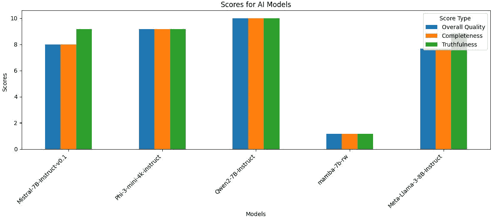

# 4

# 使用 LLM 构建网络爬虫代理

法国哲学家丹尼斯·狄德罗曾说，“*如果他们找到一只能够回答所有问题的鹦鹉，我会毫不犹豫地宣称它是一个智能生物*。”狄德罗指的是鹦鹉，但一个大型语言模型（LLM）可以被定义为一种复杂的鹦鹉。回答问题和理解问题之间存在着区别。因此，今天，我们并不将 LLM 定义为智能生物。尽管如此，LLM 可以非常出色地回答几乎任何问题。尽管具有这样的回答能力，LLM 却无法执行动作。因此，人们尝试通过使用代理来解决这一主要限制。

人工智能代理是 LLM 的扩展，使其从语言模型向具有自主性、反应性、主动性和社交能力等能力的系统转变。这项研究一方面关注特定应用（如掌握国际象棋或围棋等游戏），另一方面关注更一般的能力，如记忆、长期规划、泛化和与用户的有效互动。这些都被认为是通向**人工通用智能**（**AGI**）方向的第一步。根据作者和哲学家尼克·博斯特罗姆的说法，“*机器智能是人类将永远需要的最后一种发明*” ([`x.com/TEDTalks/status/1191035758704037891`](https://x.com/TEDTalks/status/1191035758704037891))).

通用人工智能（AGI）实际上是一种在一系列认知任务（推理、规划和学习——因此，代表知识）中达到或超过人类智能的智能类型。创建 AGI 是几家主要公司（如 OpenAI 和 Meta AI）的目标。AGI 可能成为人类在复杂任务（如研究）中的助手（根据某些观点，甚至可以取代人类）。尽管许多公司对此持积极态度，但一些有影响力的研究人员，如杰弗里·辛顿，对此发展表示担忧。杰弗里·辛顿教授说，“*有 10%的可能性这项技术会引发对人类造成灾难性后果的结果*。”在本章和接下来的章节中，我们将重点关注那些专注于提高模型能力的模型和方法。

我们将要探讨的第一步是如何让 LLM 摆脱其“盒子”。例如，我们将看到如何使模型能够从互联网上检索信息。

在本章中，我们将涵盖以下主题：

+   理解大脑、感知和动作范式

+   对人工智能代理进行分类

+   理解单代理和多代理系统的能力

+   探索主要库

+   单个代理的一般能力

+   创建一个用于搜索网络的代理

# 技术要求

大多数这段代码可以在 CPU 上运行，但最好在 GPU 上运行。代码是用 PyTorch 编写的，大部分使用标准库（PyTorch、Hugging Face Transformers、LangChain、pandas 和 Matplotlib）。代码可以在 GitHub 上找到：[`github.com/PacktPublishing/Modern-AI-Agents/tree/main/chr4`](https://github.com/PacktPublishing/Modern-AI-Agents/tree/main/chr4)。

# 理解大脑、感知和动作范式

**代理**可以被定义为具有行动能力的实体。在哲学上，代理是一种也拥有欲望、信念和意图的存在。传统上，“代理”和有意识实体之间存在重叠。有意识实体还应拥有自己的内部状态，使其能够根据其内部表征来理解世界。

**AI 代理**的定义在于其执行动作的能力，但它不具备欲望和意图（不幸的是，正如我们在上一章讨论的那样，模型继承了其训练集的偏见，因此我们可以模糊地谈论信念）。LLM 拥有内部状态，但这仅仅是它从训练数据中学习到的表征。所以，不，AI 代理不是有意识的实体。尽管术语“代理”（以及其他如“表征”和“内部状态”）在哲学上有不同的含义，称 LLM 为有意识的是一种拟人化的谬误。

同时，通过语言建模，LLM 学习到文本的有用表征以及如何将现有元素置于上下文中。然后，LLM 可以通过上下文学习将提示的指令与它所学习的内容联系起来，从而解决问题。在指令调整期间，模型学习执行任务，所有这些任务都是使模型能够执行动作的技能。我们可以将任务定义为具有明确目标的动作集合，而动作则是一个可完成的单个行为。

因此，一个 AI 代理可以被定义为一种通过一组传感器感知其周围环境、做出决策并实施该决策的人工实体。这个定义相当宽泛，并被用来定义各种系统。在这本书中，我们将专注于基于 LLM 的代理。作为一个进一步的定义，我们将使用一个由三个部分组成的框架：

+   **大脑**：系统的主要组件，它整合信息、存储信息并做出决策

+   **感知**：扩展模型在感知领域能力的组件，允许系统从不同的模态（文本、听觉和视觉模态）获取信息

+   **动作**：使模型能够行动并使用工具来修改其环境（或对环境中的变化做出反应）的组件

我们可以在以下图中看到这些组件是如何相互关联的：


图 4.1 – 基于 LLM 的代理的概念框架，包含三个组件：大脑、感知和行动 ([`arxiv.org/pdf/2309.07864`](https://arxiv.org/pdf/2309.07864))

因此，LLM 可以被视为代理系统的“大脑”，其中 LLM 可以访问使其能够执行动作或感知的工具。这个系统允许扩展 LLM 的感知和行动空间，从而增强其自身的能力（多模态扩展允许它整合不同类型的信息，互联网的接入允许它获取实时信息，电子商务工具允许它进行交易）。实际上，正如我们在上一章中看到的，LLM 可以表现出推理能力，这些能力可以通过如**思维链**（**CoT**）或其他提示方法来增强。此外，通过上下文学习，该模型可以将其能力推广到新的任务中。CoT 提示可以整合来自环境的反馈，从而创建反应性系统。

我们在代理中寻找四个基本属性：

+   **自主性**：代理应能够在没有人类干预的情况下运行。此外，代理不应需要明确的指令来完成一项任务，而应能够在不进行逐步描述的情况下执行它。LLM 已经显示出一些创造力和解决任务的能力，而无需解释所有步骤。

+   **反应性**：代理应能快速对环境中的变化做出反应，感知外部状态的变化，并做出适当的反应。对于 LLM 来说，这已经在文本层面上发生了（例如，在对话中，话题可能会改变）。扩展 LLM 的多模态功能允许整合不同类型的信息和刺激。

+   **主动性**：代理的反应不应仅仅是响应，而应指向一个目标。换句话说，代理应能够根据环境中的变化进行推理和制定计划（这些能力可以通过如 CoT 等推理导向的提示技术来激发）。

+   **社交能力**：代理应能够与人类或其他代理进行交互。这是表现出对话和理解技能的 LLM 的优势之一。实际上，可以创建具有不同目标和任务的基于不同 LLM 的代理的环境。具有多个代理的环境可以促进团队合作行为（其中代理进行协调）。


图 4.2 – 具有多个代理的模拟环境的截图

在*图 4.2*中，我们可以看到代理不仅与环境互动，还彼此互动。通过协作，代理可以解决复杂任务。这展示了基于 LLM 的代理可以获得的复杂能力。

协作行为的例子之一包括 25 个代理在一个为论文《生成代理：人类行为交互模拟》创建的类似《模拟人生》的环境中，该论文由 J. S. Park 等人撰写([`arxiv.org/pdf/2304.03442`](https://arxiv.org/pdf/2304.03442))。用户可以观察并干预代理规划他们的日子、分享新闻、建立关系以及协调团队活动。

在接下来的章节中，我们将分析 AI 代理（基于 LLM）的各个组成部分，从所谓的“大脑”开始。

## 大脑

大脑是系统的核心，负责几个功能：保存信息、寻找知识、推理和决策。由于这个系统的核心是一个 LLM，所有交互都是基于自然语言的。这是一个优势，因为这些交互和操作可以被人类理解，因此可以监控（尤其是在出现问题时）。由于代理可以与其他实体互动，并且周围环境发生变化，它必须能够进行多轮交互对话（同时与多个实体进行对话，涉及不同主题、复杂结构和基于先前历史的理解）。如果代理的对话技巧不佳，当与人类互动时，人们会感到沮丧，因此模型能够清晰沟通非常重要。模型必须能够理解指令、理解传入的信息、整合这些信息，并适当地对任务做出响应。

今天的 LLM 能够以高质量进行这种类型的对话。由于对齐，对话技巧在近年来呈指数增长。指令调整使得 LLM 能够响应指令并执行任务。

另一个重要组成部分是模型知识，它被分为以下几类：

+   **语言知识**：对一种语言的语义和语法的了解。这使得 LLM 能够以正式的方式与人类互动，并且如今有不同语言的 LLM 以满足需求。

+   **常识知识**：大多数个体都知道的一套规则和事实。例如，任何人都可以见证重力的效果或理解人类不能飞行。这类信息在提示或上下文中没有具体提及，但对于模型高效地完成任务或回答问题（以及避免误解）是必要的。

+   **领域知识**：特定于某个专业领域（例如，科学或医学）或技术领域（例如，数学或编程）的知识。这是在某个领域取得成功所必需的知识或技能。现在有各种领域的专业 LLM（医学、金融等），或者从通用模型开始，你可以获得一个专业模型（微调）。

此外，重要的是要记住，模型的知识在预训练时是冻结的。一个 LLM 无法获取信息（持续学习）或记住与用户的过去交互。正如我们将在下一章中看到的，有一些方法可以克服这一限制。

仅拥有信息对于大脑来说是不够的；我们的代理必须能够进行**推理**和**规划**。具有 CoT 和自洽性（我们在上一章中看到的）的技术可以帮助模型更好地推理任务解决方案。一般来说，逐步推理有助于模型拥有任务解决和规划所需的步骤。对于代理来说，规划是一个关键组成部分，因为为了解决任务，模型必须选择最合适的步骤来实现目标。一般来说，这是一个两阶段的过程：

1.  **计划制定**：模型将任务分解为子任务。根据方法的不同，LLM 将任务分解为不同的步骤，然后依次执行它们。其他研究表明，自适应策略更好，其中一次执行一个步骤（这可以随后进行评估）。

1.  **计划反思**：在制定计划后，建议分析和进行计划反馈分析。一旦描述了计划，LLM 可以评估它，或者可以有一个第二模型来评估第一个模型的工作。

假设我们拥有多个大型语言模型（LLM）。我们的选择可能会受到空间或内存限制的影响。此外，我们可能在推理过程中遇到速度问题（如果模型响应时间过长，用户体验将受到影响）。然后我们可以通过评估速度（每秒生成的标记数）和相对性能（每秒每十亿参数的性能）来进行基准测试。


图 4.3 – 对不同 LLM 生成速度进行基准测试的两个图表：A）显示了每秒生成的标记数，B）显示了每秒每十亿参数生成的标记数

**A)** 在图 4.3 中显示了响应指令“*简要描述人工智能代理是什么*”时每秒生成的标记数。**B)** 显示了每秒每十亿参数生成的标记数（数值越高意味着模型效率越高）。

此外，始终评估响应质量是个好主意。一种简单的方法是让一个模型如 GPT-4（或任何比初始模型更大的模型）评估响应。



图 4.4 – 模型答案评估

如*图 4**.4 所示，GPT-4 评估了不同模型生成的答案。每一列代表 GPT-4 分配的分数（整体质量、完整性和真实性）。

总结一下，以下是一些关于选择哪个 LLM 作为 AI 代理系统大脑的建议：

+   首先的选择是是否通过 API 使用闭源模型（例如 GPT-4 或 Claude）或开源模型（例如 Mistral 或 Meta 的 Llama）。在前一种情况下，重要的是评估专有模型的成本（每次推理成本、集成到应用程序中的成本）。在后一种情况下，应通过平衡计算成本和性能来选择参数数量。

+   考虑模型的基础设施成本。一个 LLM 和其他系统组件必须托管在基础设施中。例如，我们的 LLM 可能托管在 Azure 上，参数数量越多，成本就越高。

+   几乎所有模型都对语言学和常识都有很好的了解。另一方面，对于某些特定领域，你可能需要一个具有知识领域的模型。已经有了一些被调整并开源的模型（例如，用于金融的 FinGPT），或者如果你拥有数据，你可以决定自行进行微调。或者，可以采用检索方法，我们将在后面的章节中看到。

在下一节中，我们将讨论如何将这个大脑连接到外部世界。

## 感知

虽然 LLM 可能是大脑，但它们只能理解文本输入，因此缺乏视觉感知（例如，尽管 ChatGPT-4o 现在不仅可以接受文本输入，还可以接受图像输入并描述图像中的内容，但这种功能并非 LLM 本身的技术组成部分）。作为人类，我们极其依赖我们的视觉感知。视觉使我们能够获取关于外部世界以及环境中物体之间关系的巨大信息量。同样，还有其他模态使我们能够获取我们希望代理能够感知的环境实时信息。例如，连接到家用电器的代理如果传感器检测到雨，可以关闭窗户；如果摄像头检测到强烈的阳光，可以降低百叶窗。

作为有感知的生物，我们整合从感官器官接收到的信息，对外部刺激做出反应。为了使代理能够对环境的变化做出反应，它必须能够感知变化。

为了帮助语言模型理解**视觉输入**，最简单的解决方案是使用另一个模型进行图像字幕。然后，这些字幕可以作为任务指令的额外上下文插入到提示中。这种方法的优势在于它易于解释，并且可以使用预训练模板进行字幕。然而，在字幕过程中，信息会有所损失，结果并不代表视觉信息的复杂性。而不是使用字幕，PaLM-E ([`arxiv.org/pdf/2303.03378)`](https://arxiv.org/pdf/2303.03378)) 和其他工作使用**具身****语言模型**。

PaLM-E 是一个用于具身推理任务的单一通用多模态语言模型。该模型直接集成到嵌入图像和文本中，允许解决视觉和语言任务。

感官模态输入（如图像）直接纳入语言模型的输入。其理念是图像被嵌入到与语言标记相同的潜在嵌入中。随后嵌入的向量随后被传递到变换器块，就像它们是文本输入一样。然后，模型被微调并学习如何关联各种模态中存在的信息。

或者，正如我们在上一章中通过 BLIP-2 所看到的，我们可以通过结合两个已经训练好的模型并保持它们冻结来实现多模态。相反，我们训练**查询变换器**（**Q-Former**）模块，以使视觉编码器和语言模型进行通信。这种方法的优势在于我们只需要对一个参数数量少得多的模块进行训练。此外，语言模型没有视觉-语言对齐，这可能导致灾难性的遗忘。

**视频输入**可以被视为具有额外时间维度的视觉输入。视频由一系列连续的图像帧组成（然而，帧之间存在关系，这些信息必须被保留）。为了防止一瞬间的模型看到未来并理解时间顺序，模型如 Flamingo ([`arxiv.org/pdf/2204.14198`](https://arxiv.org/pdf/2204.14198)) 使用了掩码机制。

**听觉输入**也传递着重要的信息。例如，在人类语言中，信息不仅限于消息的内容（如语调、停顿等），还有一些与特定危险或物理事件相关的声音。一些模型在处理与听觉信号相关的特定任务上表现出色。例如，Whisper 模型可以用于语音转文本，之后可以将转录内容用于语言模型。此外，音频频谱图是信息丰富的来源，可以表示为图像（随时间变化的频率谱）。许多模型是基本的视觉变换器，已经被调整为处理频谱图。

实际上，LLM 可以调用其他模型来执行其他听觉任务（如文本到音频、语音翻译和识别、语音分离、声音提取等）。如第三章所述，多模态是指 LLM 可以接受除了文本之外的其他模态作为输入（如图像、视频、音频等）。AudioGPT ([`arxiv.org/pdf/2304.12995`](https://arxiv.org/pdf/2304.12995)) 是这种方法的例子，其中我们有一个 LLM 与音频基础模型（每个模型都专注于不同的任务）进行交互。


图 4.5 – AudioGPT 的高级概述 ([`arxiv.org/pdf/2304.12995`](https://arxiv.org/pdf/2304.12995))

当然，现实世界中还有其他类型的传感器输入。例如，嗅觉或触觉等模态更复杂，需要传感器。然而，在各个行业中，存在接收来自机器输入的传感器（如温度、湿度等）。一个大型语言模型（LLM）可以直接或通过中间模型整合这些信息。此外，模型还可以从其他来源接收信息，例如激光雷达（LiDAR）、全球定位系统（GPS）以及互联网。

## 行动

在生物体中，我们具有对信号的感知及其解释，然后是相应的反应。例如，动物可以视觉上感知捕食者的形象（感受其动作和气味），其大脑将整合这些信息并决定最佳行动方案（隐藏或逃跑）。对于我们的智能体，我们可以期待类似的情况，其中感知到的信号被整合，LLM 计划任务，然后由专门的行动模块执行。输出的最简单例子是文本：LLM 具有固有的生成能力，可以响应指令生成文本。LLM 的能力可以通过**工具**来扩展。实际上，我们人类可以通过使用工具来解决复杂任务，这些工具可以扩展我们身体的固有能力（或使任务执行更快或更有效率）。

显然，模型需要理解可用的工具以及如何使用它们。LLM 本身可以泛化到一定限度（零样本能力），但有一些技术可以提高其使用这些工具的能力（例如，少样本模型）。我们将在后面看到的一些方法将类似于为模型提供使用手册。学习如何使用这些工具也可以作为反馈进行，这样 LLM 就可以进行相应的调整。

定义动作的一个更复杂方面是称为**具身动作**的子分支。到目前为止，交互一直是在虚拟环境中进行的。在具身中，我们将系统扩展到外部世界。根据**具身假设**，人类通过与环境持续互动和反馈来发展他们的智慧，而不仅仅是通过阅读关于它的教科书。因此，如果我们想要实现通用人工智能（AGI），模型应该能够与环境交互。AGI 可以使我们实现以前只能想象的应用，因为它可以实时监控外部环境并采取复杂和复杂的目标行动（例如，采取行动对抗全球变暖、监控核聚变，或发送探测器自主探索太空）。然后，一个 LLM 可以嵌入到机器人中，从而获得一个身体，能够探索环境并从中学习。

在下一节中，我们将更深入地探讨代理的学习方式以及如何更好地对它们进行分类。这将帮助我们更好地定义和规划在需要时的人工智能代理。

# 人工智能代理分类

在本节中，我们将讨论如何最好地分类代理，并更详细地讨论这样一个复杂系统是如何学习的。第一种分类是在仅存在于虚拟环境中的代理和具身代理之间。

**数字代理**被限制在虚拟环境中。再次强调，我们与虚拟宇宙的交互程度各不相同。最简单的代理与单个用户进行交互。例如，代理可以在虚拟环境中编程为 Jupyter 笔记本，尽管它可以搜索互联网，但它的交互相对较小，因此主要是被动的。有两个后续的扩展级别：

+   **动作代理**在模拟或虚拟世界中执行动作。游戏代理与其他代理或用户进行交互。这些代理通常有一个目标（例如赢得游戏）并且必须与其他玩家互动以成功实现其目标。通常使用强化学习算法通过向模型提供奖励来训练系统，当它实现某些目标时。

+   **交互式代理**是动作代理的扩展。该模型与世界进行通信并可以修改它（这些不一定是物理动作）。

一旦我们决定了我们系统交互的限制，重要的是决定它应该如何处理任务。因此，问题是：模型是如何决定如何规划动作的？

这是系统的一项基本技能：如何将任务分解为动作以及优先考虑什么。我们将从高层次讨论可能的系统，特别是针对任务规划。


图 4.6 – 现有 LLM-agent 规划工作的分类 ([`arxiv.org/pdf/2402.02716`](https://arxiv.org/pdf/2402.02716))

在现实世界中，任务通常是复杂的，几乎不可能一步解决它们。因此，代理必须将任务分解成一系列更易于管理的子任务（子任务也可以由一系列要解决的步骤组成）。在这个过程中，它首先必须决定如何将任务分解成各种子任务，然后如何解决它们。通常有两种解决这一挑战的方法：

+   **分解优先方法** (*图 4.7a*): LLM 将任务分解成一系列子目标，并在解决前一个目标后为每个目标创建一个计划来顺序解决它们。这个系统受到零样本 CoT 的启发，LLM 被要求通过两个明确的提示进行两个步骤的过程：“让我们首先制定一个计划”和“让我们执行这个计划”。这种方法的优势是给模型提供了一个任务概述，减少了幻觉和遗忘。另一方面，由于一切都在一开始就计划好了，模型无法纠正可能发生在某些步骤中的错误。

+   **交错分解方法** (*图 4.7b*): 任务分解和规划是交错进行的。换句话说，我们生成一个子任务，并使用一个计划来解决它，直到我们解决了整个任务。交替推理和规划允许模型通过逐步处理整个过程来提高其规划能力。这种方法可以动态调整任务解决方案。它的缺点是，如果问题过于复杂，它可能会在没有得到结果的情况下创建昂贵且漫长的推理-规划链。


图 4.7 – 任务分解方法的类型 ([`arxiv.org/pdf/2402.02716`](https://arxiv.org/pdf/2402.02716))

对于这两种方法，存在变体和替代方案。例如，受自洽提示（其中我们对单个问题采样不同的推理路径）的启发，在**多计划选择方法**中，为每个任务生成几个不同的计划。这是因为即使模型可以进行推理，它也可能生成一个不正确或不可行的计划。模型为单个任务生成几个候选计划，然后我们可以利用不同的算法来选择最佳行动计划。在最简单的版本中，我们选择多数投票策略，但也有一些利用树搜索算法或强化学习的替代方案。这种方法通常在解决复杂案例时成功，并且使用启发式算法降低了在扩展假设空间中解决问题的成本。另一方面，生成不同的路径具有更高的计算成本（以及更高的时间成本风险），并且由于它使用随机过程，可能不一致。

另一种方法是**外部规划辅助规划**，其中集成了外部规划器。例如，可以添加符号规划器来识别解决方案的最佳路径。今天，也有神经规划器（更轻的神经网络）来帮助 LLM 找到最佳计划。换句话说，LLM 进行的是可以被视为缓慢、沉思的过程的推理，而规划器提供的是快速、本能的反应。这种慢速和快速思考也可以交替进行，首先制定一个快速计划，然后使用 LLM 来解决任何错误。这种方法资源效率高，对于需要代码生成的任务似乎很有希望。然而，系统的开发和实施是复杂的。

为了避免幻觉和其他错误，另一种可能的方法是**反思和精炼**。这可以被视为一种交错分解扩展，其中 LLM 进行生成、反馈和精炼的迭代过程。在每次生成步骤之后，模型还会对计划生成反馈，然后使用这些反馈来进行精炼。在更复杂的版本中，还有一个额外的模型来评估计划（评估器）并提出反馈。还可以将环境变化纳入反馈中，使系统特别灵活。尽管有潜力，但无法保证精炼过程将使模型解决目标。LLM 可能会陷入连续的链条中，尤其是在过程复杂时。

**记忆增强规划**是一种试图克服模型当前上下文长度限制的方法。对于智能体的记忆增强规划是指使用外部记忆系统来增强智能体的决策和规划能力。这种方法允许智能体存储、回忆和利用过去的经验、观察或计算，以改善复杂任务中的性能。想象一下，一个被分配清洁房子的机器人吸尘器。没有记忆，它会随机在房子里移动，可能会反复清洁相同区域或错过一些地方。有了记忆增强，机器人会保存一个地图（记忆），记录它已经清洁的地方和障碍物（如家具）的位置。这使得系统可以规划下一步行动，不重复清洁区域，从而高效地覆盖整个房子。

实际上，一个任务可以被分解成几个子任务，这些子任务又可以进一步分解。与规划和中间结果一起，可以生成比上下文所能容纳更多的信息。

**检索增强生成**（**RAG**）是一种技术，它允许检索信息以供后续生成使用（我们将在下一章详细讨论这一点），并且可以用来存储智能体的过去经验。在 RAG 中，存在一种外部记忆，形式为数据库，在每次用户查询时，我们可以搜索回答问题或执行动作所需的环境（这个环境成为模型输入的一部分）。换句话说，模型可以找到以前的任务规划、其他任务解决方案或可以服务于任务解决方案的附加信息。或者，也可以使用这些以前的经验来微调模型。在以前的任务上的微调有助于后续任务的泛化。一方面，使用 RAG 的成本较低，但要求检索准确，并且找到的过去经验与任务相关。微调的成本较高，但允许模型存储经验（一种内部化的形式）。甚至还有更复杂的 RAG 版本，其中构建结构来模拟人类的短期和长期记忆（前者用于存储环境中的临时变化，后者用于巩固重要信息）。

正如我们将在下一节中看到的，我们可以在单个系统中拥有单个智能体或多个智能体进行交互。这种灵活性使我们能够通过选择适当的架构（一个或多个智能体）来处理复杂任务。在*第九章和第十章*中，我们将回到这个主题，并探讨实际中的多智能体系统。

# 理解单智能体和多智能体系统的能力

讨论智能体的能力以及如何使用它们来完成任务是重要的。从概念上讲，我们的智能体可以行动的场景必须被定义。**面向任务部署**是最简单的场景，其中智能体在某个任务中协助人类。这类智能体需要能够解决基于任务的问题或将其分解为可管理的子任务。这个智能体的目的是理解用户的指令，然后理解任务，将其分解为步骤，制定计划，并执行该计划，直到目标实现。单个智能体可以在网络或现实生活场景中执行这些任务。

在网络场景中，一个智能体必须能够执行网络上的操作（因此需要连接到互联网）。大型语言模型（LLM）有潜力自动化各种任务，例如在线购物、发送电子邮件和填写表格。专注于这些任务的智能体必须能够适应各种网站的变化。LLM 智能体在这个领域受到青睐，因为网站通常包含大量的文本内容。即使信息量很大，智能体仍然可能遇到问题（性能下降）。事实上，如果相关信息散布在过多的无关背景中，模型可能会产生幻觉，无法完成任务，或者无法进行规划。为了提高模型的能力，一个常用的工具可以读取 HTML。

在实际场景中，一个智能体必须能够执行操作并具备常识推理能力（例如，在互联网上购物的智能体）。对于一个仅用大量文本训练过的 LLM 来说，这些任务可能特别复杂。例如，尽管它可能训练过关于日夜交替的文本，但没有进一步的指令，模型很难理解如何在光线变化时定位自己。此外，智能体在规划行动时必须具备常识（这些行动必须是可行的，并且不违背常识）。因此，智能体在未来的实体机器人部署中需要空间信息来理解其环境。

**以创新为导向的部署**是一个更复杂的场景（并且代表了未来几年来的发展趋势，而不是当前的应用），智能体不仅必须执行任务。这些智能体必须在科学领域展现出一些探索能力（例如，实验室助手、应用规划或软件设计）。复杂和创新的项目很难仅通过文本信息来定义；它们是多维的。智能体需要清楚地理解整个知识领域，并能够从中进行外推。这类智能体可以用来开发代码和软件，或创造新材料，进行实验等等。尽管这是一个活跃的研究领域，LLM 也显示出一些这些所需技能，但这种潜力尚未实现。

**以生命周期为导向的部署**可以定义为社区中许多人的最终目标。它指的是一个能够自主探索、开发新技能并在不熟悉的世界中运行的智能体。今天，许多以这个方向为导向的项目正在“测试床”上对 Minecraft 进行有趣的研究。事实上，Minecraft 代表了一个虚拟世界，在这个世界中，模型必须执行短期和长期的任务（在这些设置中，拥有记忆很重要，我们将在下一章中进一步讨论）。


图 4.8 – 单个基于 LLM 的智能体在日益复杂的场景中的实际应用 ([`arxiv.org/pdf/2309.07864`](https://arxiv.org/pdf/2309.07864))

然而，人类不仅从书籍中学习，还从其他人那里学习。此外，我们的大部分工作都是协作完成的。也因为资源问题，劳动分工要方便得多。因此，一些研究人员提出，应该遵循与 AI 相同的途径。在**多智能体系统**（**MASs**）中，不同的智能体相互协作并相互沟通。几个 LLM 智能体以自然语言（这意味着它们的行为也可以被人类观察者解释）进行协作和沟通。在这种情况下，也可以有多个专注于特定任务的 LLMs，而不是必须使用一个专注于所有事物的模型。实际上，一些方法侧重于创建互补的智能体，它们可以协作和共享信息。在这些设置中，模型也可以做出集体决策，并且能够解决单个智能体无法解决的问题。例如，为了提高过程的分辨率，智能体可以提供不同的响应并进行多数投票。可能有提供反馈或监控其他智能体行为的智能体。这些交互可以是有序的（遵循规则或具有顺序性）或混乱的（每个智能体都可以表达自己的意见）。

智能体无需合作。根据博弈论，利用智能体之间的竞争对任务解决可能有益。这个过程已被用于训练模型以赢得游戏。实际上，AlphaGo ([`www.nature.com/articles/nature24270`](https://www.nature.com/articles/nature24270)) 被训练以在围棋中战胜自己，因此它能够积累更多的游戏时间。LLMs 可以被置于所谓的*对抗性设置*中，其中它们从另一个智能体那里获得反馈并利用它来提升自己。有几种方法，你可能让智能体讨论或反思另一个智能体的表现：


图 4.9 – 多个基于 LLM 的智能体的交互场景 ([`arxiv.org/pdf/2309.07864`](https://arxiv.org/pdf/2309.07864))

智能体还可以与人类（人-智能体交互）进行交互。这假设了对智能体行为的控制，以便他们的目标与人类的目标一致。同时，与人类的交互是重要的信息来源，应该被利用来为智能体提供反馈（性能、安全性和潜在的偏见）。此外，与人类的交互还可以是一种让智能体进化的方式。

我们可以在智能体和人类之间有两种类型的交互：

+   **不平等交互**，也称为**指导者-执行者范式**，是一种人类通过自然语言提供指令而智能体执行的方法。这种对话可以是单一提示（指令和执行）或交互式（对话）。在这种方法中，智能体执行，而人类提供指令和反馈。在最简单的格式中，反馈可以是定量的（二元或评分）或定性的（自然语言、建议、建议或批评），模型可以使用这些反馈来改进当前和未来的响应。这种方法的一个子分支，称为**持续学习**，研究模型如何通过每次交互进行学习。

+   **平等交互**是一种智能体与人类之间存在平等伙伴关系的范式。鉴于当前 LLM 的对话能力，智能体可以为人类提供协作角色。这种方法的局限性之一是缺乏聊天机器人的情感，这被用户视为问题。因此，一些研究人员专注于使聊天机器人更具同理心。此外，这些智能体在与人类互动之前需要更好地理解信念和目标，才能在互动中获得平等的地位。


图 4.10 – 人类-智能体交互的两种范式([`arxiv.org/pdf/2309.07864`](https://arxiv.org/pdf/2309.07864))

在下一节中，我们将讨论创建智能体的主要库。

# 探索主要库

在概念和理论层面上讨论了各种组件和框架之后，在本节中，我们将讨论一些主要的库，这些库使得这些概念得以付诸实践。这些库使得将 LLM 连接到各种附加模块成为可能。LLM 仍然是核心，但因此连接到感知模块和执行工具。在接下来的章节中，我们将详细阐述一些方面，并展示不同的实际例子。

通常情况下，基于 LLM 的应用结构包含几个组件：

+   **界面**：这连接用户到系统。

+   **大脑**：一个可以连接额外记忆的 LLM。LLM 拥有自己的参数化记忆（在训练期间获得），但我们还可以添加外部记忆（例如向量数据库或知识图谱）。

+   **感知模块**：这些模块允许摄取和转换用户数据。

+   **工具**：扩展 LLM 能力的模块。这些模块可以在库中构建或由开发者创建。

+   **提示词**：用户与应用程序在自然语言中的对话。提示词包含用户提供的指令（前端提示词）以及用户看不到的信息（后端提示词）。后端信息是条件化 LLM 行为的额外指令。例如，我们可以强制 LLM 只使用上下文中的信息或向量数据库中的信息进行响应。一些后端提示词是为了防止模型以有害内容进行响应而开发的。

有几个不同的库使我们能够构建这样的系统，以下我们将介绍以下内容：

+   LangChain

+   Haystack

+   LlamaIndex

+   Semantic Kernel

+   AutoGen

让我们逐一看看它们。

## LangChain

**LangChain**是一个以 LLM 为核心开发应用程序的框架。这个框架的重点是这些应用程序的开发和部署到生产环境。LangChain 生态系统由三个核心组件组成：

+   **LangChain**：不同的模块允许将具有附加内存、提示词和其他工具的 LLM 集成

+   **LangSmith**：这个组件用于检查、监控和评估你的应用程序

+   **LangServe**：这允许你将你的系统转变为 API

LangChain 可以在 Python 和 JavaScript 中使用（并且一些模块也适用于 Rust）。到目前为止，它是社区中最广泛使用的库之一，实际上，已经有一些组件是由开源社区开发的。

LangChain 与闭源模型（如 OpenAI 或 Anthropic）或 Hugging Face 上可用的模型兼容。LangChain 以开发为导向（LangChain 的一个优点是它允许并行执行和异步支持），是构建需要投入生产的应用程序的最佳库之一。LangChain 为 LLM 提供了方便的包装器，并允许它们连接到额外的工具。最有趣的一点是，它允许你构建所谓的链（LLM 和附加组件），然后可以在生产环境中跟踪和部署。LangChain 还提供了一些函数来转换不同的数据（CSV、PDF、文本、图像等）。此外，该库提供了一系列提示词模板，以更好地使用各种 LLM。

LangChain 通过创建模块化抽象，从而使得模型能够高效地连接到工具。通过构建链，你可以创建高效（但仍然灵活和定制）的管道，然后可以轻松部署。此外，通过 LangSmith，你可以监控系统以避免问题。

LangChain 有几个优点：

+   **综合库**：它提供了一个广泛的特性库，为许多应用程序提供了现成的模板。此外，设计是模块化的，因此你可以轻松地交换组件。

+   **广泛的集成**：LangChain 提供了一种简单的方式连接到大量的外部库：LLM 提供商、向量数据库、云服务等。

+   **精确且清晰的流程**：LangChain 使得可以清楚地定义输入和输出，并允许监控链中的中间产品以及进行广泛的提示工程。

+   **活跃的开发社区**：有一个庞大的用户基础，社区已经开发出不同的解决方案，并在各种网站和论坛上编写了许多教程。

+   **专注于端到端周期的灵活框架**：LangChain 提供了应用程序整个周期的元素（集成、开发、部署和可观察性）。

同时，它也有一些缺点：

+   **更陡峭的学习曲线**：用户可能需要更多时间来适应库的语法并实现库的全部功能。抽象能力是有代价的；所有功能都定义为类。例如，一个简单的提示必须抽象成一个**提示模板**。

+   **文档**：许多用户抱怨文档过时或难以理解，过于通用但缺乏专业性。通用性也是一个缺点，因为对于几个特定的应用，有更多的系统具有更多功能（例如，对于 RAG 应用）。

LangChain 是最广泛使用的库，特别是用于构建复杂代理。然而，它也有最陡峭的学习曲线。因此，许多项目用户通常更喜欢一个更简单的库。

## **干草堆**

**干草堆**是一个用于构建生产就绪型 LLM 应用程序的开源框架。与 LangChain 类似，它兼容主要的 LLM 来源和部署平台。干草堆还允许您将工具连接到 LLM，并有一整套工具旨在将系统投入生产（包括评估、监控和数据摄取）。它旨在能够轻松创建具有相关外部存储、聊天机器人和代理的 LLM，以及多模态系统。干草堆的一个优点是它具有几个预构建的功能，可以轻松地插入到自己的管道中。

干草堆建立在一切都可以轻松组合的理念之上，主要元素如下：

+   **组件**：这些是专门用于文档检索、文本生成或创建嵌入的构建块。这些组件可以被视为节点，库提供了许多已经构建并准备好使用的节点。用户仍然可以选择创建自己的节点。

+   **管道**：这些是理解应用程序中数据流的一个方便的抽象。一个管道由几个连接的组件组成。Haystack 通过允许灵活的管道控制（你可以连接管道、创建循环等）来简化系统。在 Haystack 中，你可以将它们视为组件作为节点可以以复杂方式相互连接的图。

Haystack 有几个优点：

+   **专用组件**：Haystack 提供了用于数据处理、嵌入、排名和编写的许多优秀组件。此外，该库专注于搜索和**问答**（**Q&A**）系统。对于这个用例，它提供了优化的组件。

+   **广泛的文档和社区**：Haystack 被一个大型社区采用，现在有许多社区开发的组件。它还提供了高质量的文档，有许多教程。

+   **更平缓的学习曲线**：Haystack 被认为是一个易于学习的框架。它很灵活，很容易适应不同的情况。

然而，它也有一些缺点：

+   **较小的用户基础**：社区很活跃，但比 LangChain 或 LlamaIndex 等其他框架要小。

+   **较少的集成**：与其他框架相比，集成的数量较少。尽管如此，该系统是灵活的，存在许多自定义工具。

+   **更窄的范围**：Haystack 更专注于检索和文档理解任务，因此它为其他 NLP 应用程序提供的工具和解析器较少。当你需要开发包含对话、聊天机器人或其他工具的应用程序时，这是一个限制。

+   **可扩展性**：许多用户在需要扩展系统或处理大量数据集时都会遇到问题。

Haystack 是一个易于使用的库，对于基于 RAG 的应用程序来说是一个很好的选择，但对于涉及代理的更复杂的应用程序来说则不那么理想。

## LlamaIndex

**LlamaIndex** 是另一个专注于围绕 LLM 构建系统的框架。LlamaIndex 最初是一个数据框架，专注于构建 RAG。因此，该系统具有多个数据连接器，既可以集成外部来源，也可以摄取不同类型的数据。LlamaIndex 的一个有趣之处在于它允许知识图轻松集成。它还可以与不同类型的模型集成，但它也提供了与其他框架（Docker、OpenAI、LangChain、Flask 等）的集成。

LlamaIndex 可以用来敏捷地构建聊天机器人并将它们与外部存储连接起来。它还允许你构建能够搜索互联网或执行操作的自主代理。已经构成了一些工具和功能，还有其他由其社区开发的功能。

LlamaIndex 也具有几个优点：

+   **处理不同的数据源**：LlamaIndex 可以处理超过 160 种数据源，使其在处理企业中常见的多种类型数据时效率很高。当拥有复杂且多样化的数据集时，它尤为理想。它还支持多模态集成。

+   **索引和高效检索**：这是 LlamaIndex 的优势；它旨在准确快速地检索信息。该库为 RAG 和其他检索范式提供了多种工具和功能。

+   **定制**：特别是在检索方面，LlamaIndex 提供了高度的可定制性。

也有一些缺点：

+   **复杂性**：与其它框架相比，LlamaIndex 的学习曲线较为陡峭。为了最佳使用，它假设你有一个清晰的信息检索概念。

+   **功能有限**：LlamaIndex 专注于检索任务，但在其他 NLP 任务方面的功能有限。这导致缺乏多功能性。

LlamaIndex 是 RAG 应用的首选，也是智能代理的良好解决方案。

## 语义内核

**语义内核**是由微软开发的开源框架，用于构建智能代理。此库还可以与 OpenAI、Hugging Face 和其他框架连接。Semantic Kernel 最初是用 C#编写的，但今天也有 Python 版本。这个库背后的理念是提供创建组合各种函数（也称为**函数组合**）的能力。换句话说，语义内核建立在各种组件可以组合在一起构建多功能管道的理念之上。

在语义内核中，核心是一个 LLM，但我们可以添加我们开发的代码作为插件，以便 LLM 可以执行它。此外，它允许 LLM 拥有可以以文件或向量数据库形式存在的内存。一个有趣的因素是，可以创建专门执行任务的本地函数。它还实现了一个规划器，该规划器将你的任务作为输入，并返回一组动作、函数或插件以成功解决任务。

语义内核功能多样，支持多个库，并对 C#和.NET 框架提供轻量级支持。它受到 Copilot 框架的启发，该框架稳定且是企业的好选择。

## 自动生成

`UserProxyAgent`（从用户收集信息并将其传递给其他代理），`AssistantAgent`（从另一个`AssistantAgent`实例和`UserProxyAgent`接收数据，处理它并完成任务），以及`GroupChatManager`（控制和指导代理之间的通信）。AutoGen 支持多种复杂的对话模式，允许在没有人为干预的情况下进行复杂的流程。涉及多个代理以复杂方式相互通信的系统可以配置。

此库有以下优点：

+   **简单性**：抽象使得可以直观地了解代理如何进行对话并完成任务。此外，这也使得向非技术人员和其他利益相关者解释系统变得更加容易。

+   **定制性**：过程直观，并且可以通过少量代码轻松定制。

然而，也有一些缺点：

+   **更难调试**：代理相互依赖，这使得调试变得困难

+   **支持较少**：它不太被社区采用，因此当你需要帮助时，可供求助的用户较少

AutoGen 是一个有趣且具有潜力的库，但在这个阶段，用它开始一个项目可能会有点困难。

## 选择一个 LLM 代理框架

通常，不同的框架提供类似的功能，并受到相同哲学的启发（扩展 LLM 的能力）。此外，今天几乎所有的库都相当成熟，并且有专门构建的组件。对于库中未原生存在的功能，今天有许多由社区构建的资源。主要组件是 LLM，LLM 的能力是那些最影响应用程序结果的因素。

影响选择的第一因素可能是库的编程语言。通常，这些库必须集成到无法修改的现有系统中。几乎所有的库都是用 Python 编写的，但也包含可以用其他语言编写的模块，这有助于它们的集成。在某些情况下，尽管支持不是原生的，但已经被开源社区开发出来。例如，LangChain 支持 Rust，在其他语言（如 C#、R 等）中也有非官方的实现。系统必须完成的任务也是另一个决定因素。系统的复杂性增加要求框架同时具备鲁棒性和灵活性。一些系统设计时更注重信息检索（LlamaIndex），因此如果我们的系统要专注于聊天和检索，它们是更好的选择。在其他情况下，我们更关注系统的可扩展性和性能，因此我们可能会对 LangChain 和 Haystack 提供的所有监控和评估生态系统感兴趣。

此外，希望有一个活跃的开发者社区，并且库本身也要积极维护。当采用一个框架时，重要的是要有资源和社区可以求助，以避免陷入困境或找不到解决方案。一个社区采用的库将拥有大量的教程和示例，帮助你学习系统。

另一个因素是定制化程度。尽管所有库都提供预定义的功能，但这些功能并不涵盖所有用户场景，并且需要开发内部解决方案。理想的库应该具有这种多功能性和修改和集成组件的能力。可能发生的情况是我们想改变我们的 LLM 或其中一个组件，因为我们需要不同的性能。同样，默认参数可能不适合我们的应用程序，并且最好有一个库，其中调整参数并不复杂。

最佳库主要取决于用例。每个库都有其优势和劣势。例如，如果应用程序侧重于检索，LlamaIndex 可能是最佳选择，或者如果应用程序的核心是问答，则 Haystack 可能是更好的选择。LangChain 对于广泛的范围是一个更自然的选择，但如果系统要集成到.NET 中，您可能会选择 Semantic Kernel。选择的框架应该考虑额外的约束以及应用程序的主要关注点。

我们现在已经看到了 AI 代理最重要的库。在下一节中，我们将开始测试它们在实际中的应用。

# 创建一个搜索网络的代理

我们通常将互联网搜索与像 Google 这样的搜索引擎联系起来。查询的搜索是通过算法进行的，但这不是人工智能算法。PageRank 实际上是一个不涉及学习的图搜索算法。搜索算法预设了两个主要步骤：

+   **匹配**：找到与特定用户查询相关的文档

+   **排名**：将这些文档按相关性从高到低排序

这两个步骤不一定需要人工智能。然而，使用人工智能进行搜索可以提供更好的服务并解决一些困扰搜索算法的问题。现在的用户期望人工智能算法能够区分实体和术语，并将其置于上下文中进行定位。例如，搜索“最好的比萨饼店”的用户期望搜索引擎返回附近的最佳餐厅。未来的搜索过程也将整合其他元素，例如关于结果的对话、复杂的响应（摘要和行动），以及多模态。

另一个方面是，在今天的系统中，搜索结果在许多情况下应该是与用户相关的。搜索可能是模糊的，并且考虑到用户的历史记录，某些结果可能更为相关。此外，用户可能希望基于其他参数进行搜索，并希望用自然语言表达（例如，“巴黎最好的比萨饼店”与表达“最好的比萨饼店 AND 巴黎”之间的区别）。一旦找到结果，用户可能会有其他需要推理的问题（“这些比萨饼店中哪一家适合带小孩的晚餐？”）。

增强型搜索可以满足这些需求，因为它在其核心处有一个 LLM。LLM 可以理解查询中各种关键词之间的区别，以及理解用户正在寻找哪个领域（例如，“Transformer”可以是一个 AI 模型或玩具）。此外，通过访问先前交互的历史记录，LLM 了解用户的偏好（因此你不必每次都声明你的偏好）。这使得结果的相关性排名更加相关，因为它们不仅按查询排序，还按用户的偏好排序。模型还可以进行推理，并给予更隐含相关的结果更高的权重（例如，当搜索家庭餐厅时，即使描述中未明确指出是为家庭设计的，多模态模型也会更倾向于有游乐场图片的餐厅）。用户还可以通过代理向结果和模型提出问题。

传统搜索按查询的重要性顺序返回链接。然而，今天，信息可以从网站中提取并由 LLM 分析。对于给定的查询，模型现在可以提取网站中最相关的段落（**提取式问答**）或提出直接回答查询的第一结果的摘要（**抽象式问答**）。这样，用户甚至不需要点击链接，就能直接获得答案。然后，这个系统可以与其他工具集成，例如外部存储（如 RAG 和知识图谱，我们将在下一章中看到）。

此外，LLM 具有生成能力，因此这些可以与查询结合使用（例如，“搜索法国大革命的资料”或“搜索用于卷积的 Python 代码并将其翻译成 R”）。这种类型生成搜索的一个问题是幻觉风险，因此系统必须保留它所使用的来源，以便可以进行回溯。

在使用 LLM 和代理的最简单搜索形式中，我们有一个连接到界面的 LLM，它允许接收查询，以及一个允许它搜索互联网的工具。在这个基本案例中，LLM 必须分析查询，计划使用工具搜索互联网，分析找到的结果，并回答查询。在更复杂的形式中，LLM 可能拥有更多可用的工具。例如，它可以执行代码、计算器和外部存储来保存数据或调用执行 NLP 任务（如文本中的实体识别、提取段落等）的模型。


图 4.11 – LLM 代理互联网研究系统的表示

让我们分解 *图 4.11*：

1.  用户提出查询。

1.  模型分析查询并计划执行操作。

1.  选择合适的工具（在这种情况下，互联网搜索）。

1.  文档在互联网搜索过程中被识别。信息被发送回模型，模型分析信息并决定是否需要进一步行动或任务是否已完成。

1.  模型生成答案，并将其发送回用户。

LangChain 允许 LLM 通过使用工具连接到网络。通常，最广泛使用的方法被称为**推理与行动**（**ReAct**）提示。在第一阶段（推理）中，模型考虑最佳策略以到达答案，在第二阶段（行动）中执行计划。在此方法中，模型还跟踪推理步骤并可以引导它到达解决方案。这种方法也允许灵活性，因为它使模型能够根据其需求调整提示。

就其本身而言，LangChain 提供了一些旨在扩展模型并找到所需信息的工具。例如，它提供了几个用于搜索互联网的工具。DuckDuckGo 工具允许人们使用 DuckDuckGo 搜索引擎。这个搜索引擎是免费的，不跟踪用户数据（它还过滤掉充满广告或仅为了在谷歌搜索引擎中排名靠前的页面）。

为了使用它，我们需要安装一个特定的 Python 库，然后将工具导入到 LangChain 中：

```py
!pip install duckduckgo-search
from langchain.tools import DuckDuckGoSearchRun
ddg_search = DuckDuckGoSearchRun()
ddg_search.run('Who is the current president of Italy?')
```

注意

您可以直接使用该工具，它将为您提供搜索结果。

LangChain 的一个优势是能够构建一个工具列表，然后由 LLM 使用。为此，我们必须给出一个名称，解释要执行的功能，并提供描述。这样，LLM 就会知道在它需要进行网络搜索时可以使用哪些工具：

```py
from langchain.agents import Tool
tools = [
   Tool(
       name="DuckDuckGo Search",
       func=ddg_search.run,
       description="A web search tool to extract information from Internet.",
   )
]
```

可以使用 Google Serper，这是一个低成本 API（尽管有一些限制），允许您使用谷歌搜索引擎（您必须注册[`serper.dev/`](https://serper.dev/)以获取 API 密钥）；然而，这项服务需要付费。实际上，谷歌 API 的费用更高，LLM 无法直接访问搜索引擎（Serper 允许我们通过他们的 API 使用谷歌搜索引擎，并且他们提供一些免费信用额）：

```py
#!pip install google-serp-api
import os
SERPER_API_KEY = 'your_key'
os.environ["SERPER_API_KEY"] = SERPER_API_KEY
from langchain.utilities import GoogleSerperAPIWrapper
google_search = GoogleSerperAPIWrapper()
tools.append(
   Tool(
       name="Google Web Search",
       func=google_search.run,
       description="Google search tool to extract information from Internet.",
   )
)
```

此外，我们还可以将维基百科添加为可靠的信息来源：

```py
from langchain.tools import WikipediaQueryRun
from langchain.utilities import WikipediaAPIWrapper
wikipedia = WikipediaQueryRun(api_wrapper=WikipediaAPIWrapper())
tools.append(
   Tool(
       name="Wikipedia Web Search",
       func=wikipedia.run,
       description="Useful tool to search Wikipedia.",
   )
)
```

一旦我们有了各种工具，我们就可以初始化一个代理并执行查询：

```py
from langchain.agents import initialize_agent
agent = initialize_agent(
   tools, llm, agent="zero-shot-react-description",
   verbose=True
)
agent.run('Query')
```

模型将选择哪些结果对我们查询感兴趣。模型可以访问不同的信息，但没有地方可以保存它们。使用大型语言模型进行网络研究可以适用于不同领域（从医学到金融）。例如，模型已被用于访问基因序列并进行比较，或搜索有关药物、化学结构等信息。同样，模型可以搜索最新的财经新闻。另一个工具可以是**OpenStreetMap**（**OSM**）搜索。

在下一章中，我们将讨论模型如何保存和访问这些记忆。例如，我们可能希望我们的模型能够访问对话历史或扩展其知识。这在商业应用中非常有用，在金融和医疗保健等领域也是如此。

# 摘要

在本章中，我们介绍了如何使一个大型语言模型（LLM）成为复杂系统的“大脑”。我们可以利用 LLM 的对话和推理能力来解决任务。正如我们所说，这个大脑可以通过提供感知系统（感官）和工具（双手）来扩展。实际上，我们可以通过连接 API 来允许模型搜索互联网，也可以从其他模态（音频、图像或视频）中摄取信息。同样，模型使用这些接收到的信息来解决用户任务。如果我们能够想象到今天代理执行和自动化为用户执行常规任务，那么想象一个代理以越来越复杂和高级的方式与人类和其他代理互动的世界并不困难。

在下一章中，我们将看到模型如何拥有记忆，以及如何存储信息并能够再次找到它以提高效率。

# 进一步阅读

+   Silver，*《无需人类知识精通围棋》，2017 年*：[`www.nature.com/articles/nature24270`](https://www.nature.com/articles/nature24270)

+   LangChain: [`python.langchain.com/v0.2/docs/introduction/`](https://python.langchain.com/v0.2/docs/introduction/)

+   Haystack: [`haystack.deepset.ai/overview/intro`](https://haystack.deepset.ai/overview/intro)

+   Semantic Kernel: [`learn.microsoft.com/en-us/semantic-kernel/overview/`](https://learn.microsoft.com/en-us/semantic-kernel/overview/)

+   AutoGen: [`microsoft.github.io/autogen/`](https://microsoft.github.io/autogen/)

+   LlamaIndex: [`www.llamaindex.ai/`](https://www.llamaindex.ai/)

+   LangChain 工具: [`python.langchain.com/v0.2/docs/integrations/tools/`](https://python.langchain.com/v0.2/docs/integrations/tools/)

+   DuckDuckGo: [`duckduckgo.com/`](https://duckduckgo.com/)

+   守护者报，*“AI 教父缩短了未来 30 年内技术灭绝人类的可能性”，2024 年*：[`www.theguardian.com/technology/2024/dec/27/godfather-of-ai-raises-odds-of-the-technology-wiping-out-humanity-over-next-30-years`](https://www.theguardian.com/technology/2024/dec/27/godfather-of-ai-raises-odds-of-the-technology-wiping-out-humanity-over-next-30-years)
