# 第五章：使用 RAG 扩展您的代理以防止幻觉

在前面的章节中，我们了解了什么是 LLM（大型语言模型），在前一章中，我们看到了它如何控制不同的工具以成功完成任务。然而，LLM 的一些局限性阻止了它们在医学等敏感领域的应用。例如，LLM 在训练时结晶其知识，而医学科学等快速发展领域使得这些知识在短时间内变得过时。随着 LLM 的使用，另一个出现的问题是它们经常会产生幻觉（产生包含事实或概念错误的答案）。为了克服这些局限性，一个新的范式已经出现：**检索增强生成**（**RAG**）。正如我们将在本章中看到的，RAG 允许 LLM 引用模型外部的记忆；因此，它允许找到并保持知识更新。同样，为模型的响应提供上下文指导可以减少幻觉。因此，RAG 今天被广泛使用，并被认为是具有前景的系统。

在本章中，我们将讨论这个系统是如何演变的，从如何使用 transformer 来查找信息开始。我们将详细讨论系统的各个组成部分（嵌入、向量数据库和生成）。

在本章中，我们将讨论以下主题：

+   探索简单的 RAG

+   检索、优化和增强

+   评估输出

+   RAG 与微调的比较

+   使用 RAG 构建电影推荐代理

# 技术要求

大部分代码可以在 CPU 上运行，但更倾向于在 GPU 上运行。代码是用 PyTorch 编写的，大部分使用标准库（PyTorch、Hugging Face Transformers、LangChain、SentencePiece、Datasets 和 scikit-learn）。代码可以在 GitHub 上找到：[`github.com/PacktPublishing/Modern-AI-Agents/tree/main/chr5`](https://github.com/PacktPublishing/Modern-AI-Agents/tree/main/chr5)。

# 探索简单的 RAG

**信息检索**是处理在媒体中（通常是文本，但也可能是多模态）查找信息的科学领域。例如，用户可能感兴趣的是查找整个文档或文档中的片段；这项任务对于问答系统至关重要，其中模型必须找到回答用户问题的步骤。系统的核心是一个搜索引擎。在 RAG 的情况下，搜索引擎是一个转换器（或至少是一个语言模型），在本章中，我们将重点关注这一点。我们将讨论一个系统，其中我们有一个**文档集合**（文本的，但也可以是网页、图像、视频，甚至是代码或简短文本段落），这些文档在数据库中有相应的索引。这些文档可以与元数据（描述作者、大小、主题和关键词的属性）相关联。按照惯例，**术语**被定义为文本中存在的单词，也是一个可以回答搜索的段落。用户产生一个**查询**，它可以表示为术语。检索系统的目的是将查询与集合中的相关文档最佳匹配。然后，这些文档按相关性顺序返回。

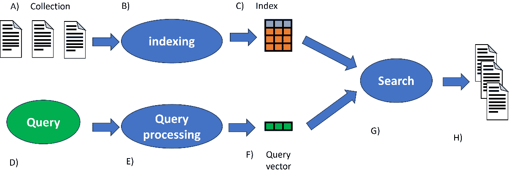

图 5.1 – 工作流程图，展示了查询是如何被搜索引擎处理的

让我们分解一下我们在*图 5*.1 中可以看到的内容。一个文档集合（**A**）被索引（**B**），并有序地输入到数据库（**C**）中。每个文档都被分配了元数据和索引。用户查询（**D**）被处理（**E**）以获得向量表示（**F**）。在搜索过程中使用的结果向量用于找到最相关的文档（**G**）。系统按相关性顺序返回文档（**H**）

如我们所观察到的，系统使用的是向量空间中的搜索。在最简单的形式中，这可以是词袋模型或我们在第一章中看到的 TF-IDF。例如，我们可以取一组文档并计算 TF-IDF。一旦我们完成了这个，我们就可以计算每个文档与查询之间的分数（通常是余弦相似度），并根据分数进行排名。对于一个文档 d 和一个查询 q 的向量形式，我们使用以下公式：

<mrow><mrow><mi>cos</mi><mfenced close=")" open="("><mrow><mi mathvariant="bold-italic">q</mi><mo>,</mo><mi mathvariant="bold-italic">d</mi></mrow></mfenced><mo>=</mo><mfrac><mrow><mi mathvariant="bold-italic">q</mi><mo>∙</mo><mi mathvariant="bold-italic">d</mi></mrow><mrow><mfenced close="|" open="|"><mi mathvariant="bold-italic">q</mi></mfenced><mfenced close="|" open="|"><mi mathvariant="bold-italic">d</mi></mfenced></mrow></mfrac></mrow></mrow>

我们可以在这里看到这个过程的例子：

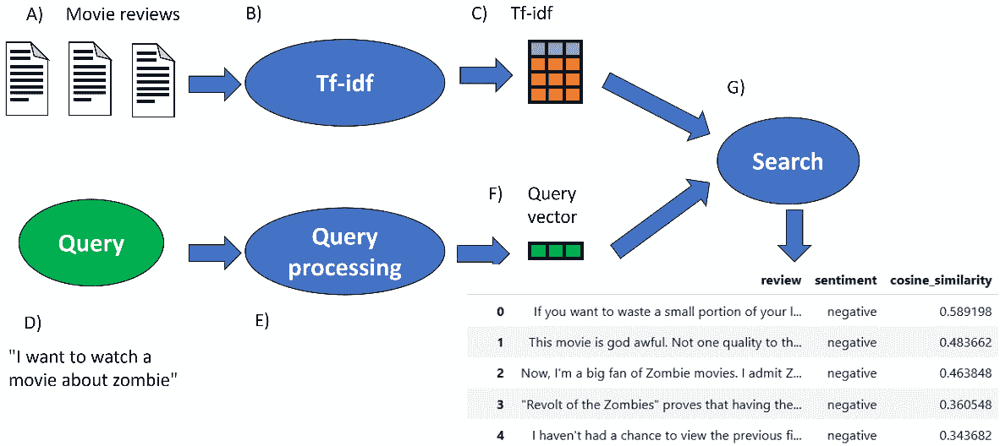

图 5.2 – 使用 TF-IDF 检索最相关文档的示例

这种类型的研究也需要适合的数据存储设施。例如，对于 TF-IDF（或衍生算法），使用倒排索引作为数据结构。倒排索引是一种专门设计来使在文档集中搜索术语变得高效的数据库结构。它由一个字典和帖子组成。字典指示术语的频率以及它们在哪个文档中找到。这样，给定查询中的一组术语，我们可以有效地找到包含它们的文档并计算相似度。

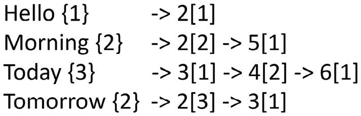

图 5.3 – 倒排索引示例

**BM25** 是 TF-IDF 的一个变体，其中增加了两个参数：*b*，它控制文档长度归一化的重要性，以及 *k*，它控制 **词频**（**TF**）和 **逆文档频率**（**IDF**）之间的关系。

<mrow><mrow><mi>B</mi><mi>M</mi><mn>25</mn><mi>s</mi><mi>c</mi><mi>o</mi><mi>r</mi><mi>e</mi><mo>=</mo><mrow><munder><mo>∑</mo><mrow><mi>t</mi><mi mathvariant="normal">ϵ</mi><mi>q</mi></mrow></munder><mover><mover><mrow><mi>l</mi><mi>o</mi><mi>g</mi><mo>(</mo><mfrac><mi>N</mi><msub><mrow><mi>d</mi><mi>f</mi></mrow><mi>t</mi></msub></mfrac><mo>)</mo></mrow><mo stretchy="true">⏞</mo></mover><mrow><mi>I</mi><mi>D</mi><mi>F</mi></mrow></mover></mover><mover><mover><mfrac><msub><mrow><mi>t</mi><mi>f</mi></mrow><mrow><mi>t</mi><mo>,</mo><mi>d</mi></mrow></msub><mrow><mi>k</mi><mo>(</mo><mn>1</mn><mo>−</mo><mi>b</mi><mo>+</mo><mi>b</mi><mo>(</mo><mstyle scriptlevel="+1"><mfrac><mrow><mo>|</mo><mi>d</mi><mo>|</mo></mrow><mrow><mo>|</mo><msub><mi>d</mi><mrow><mi>a</mi><mi>v</mi><mi>g</mi></mrow></msub><mo>|</mo></mrow></mfrac></mstyle><mo>)</mo><mo>)</mo><mo>+</mo><msub><mrow><mi>t</mi><mi>f</mi></mrow><mrow><mi>t</mi><mo>,</mo><mi>d</mi></mrow></msub></mrow></mfrac><mo stretchy="true">⏞</mo></mover><mrow><mi>T</mi><mi>F</mi></mrow></mover></mrow></mrow>

前面的公式是针对文档 *d* 和查询 *q* 的 TF-IDF 变体（*d avg* 表示文档的平均长度）。

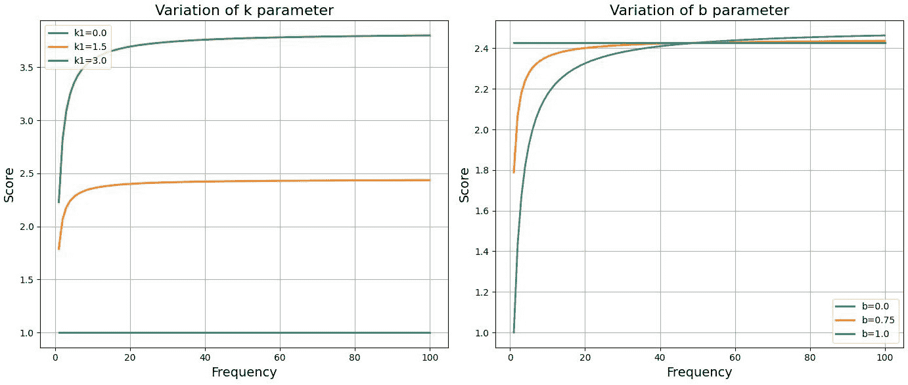

图 5.4 – k 和 b 参数对 BM25 分数的影响

我们可以观察到一些有趣的观点：

+   通过选择 *k* 等于零，不使用 TF 计算分数。TF 成分变得无关紧要；分数不考虑一个术语在文档中出现的频率，只考虑它是否出现。更高的 *k* 值赋予 TF 更大的权重。*k* 用于调整 TF 饱和度 – 换句话说，单个查询术语对单个文档分数的影响程度。*b=1* 表示对文档长度进行归一化，而 0 表示消除归一化。

+   系统对 TF 和文档长度都很敏感，而无需添加太多参数。通常推荐值为 *b=0.75* 和 *k* 在 1.2 到 2 之间。BM25 比 TF-IDF 更灵活，可以适应不同的场景。

+   它并不比 TF-IDF 复杂多少，因此可以扩展到大型数据集，并且对稀疏矩阵更稳健。

并非总是容易找到精确数据集的最佳参数。模型对超参数的选择很敏感。BM25 由于基于词频，对语义的理解有限。此外，许多术语是多义词（具有多个含义），而 BM25 没有捕捉到术语的上下文。另一个严重的问题是词汇不匹配问题——即查询和文档中的术语没有完全重叠。

解决这些问题的方法是使用包含上下文信息的密集向量。这是通过使用转换器并提取文档的表示来实现的。更正式地说，给定一个标记序列，我们使用来自最终层的表示 *z*。这使我们能够获得一个高维表示，我们可以用它来区分单词的意义。这被称为 **z 分数**。

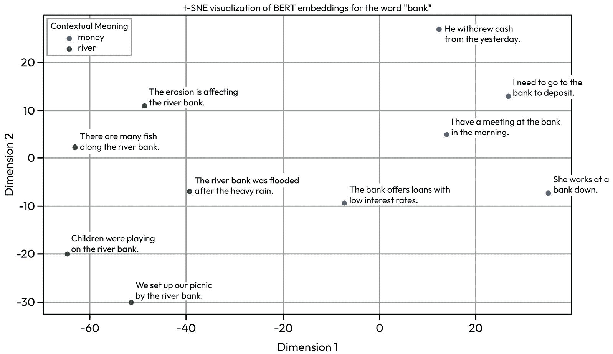

图 5.5 – 单词“bank”的上下文嵌入

*图 5**.5* 展示了不同语境下（包括金钱和河流相关含义）单词“bank”的上下文嵌入的 **t 分布随机邻域嵌入**（**t-SNE**）**可视化**。t-SNE 是在每个句子的单词 BERT 嵌入上进行的。

有几种方法可以从模型中检索这个表示。为了方便起见，使用最后一层，但通常建议对多个层的表示进行平均池化（每个块由于自注意力而学习不同的文本表示）。正如我们在 *第一章* 中所看到的，这些向量具有几何属性，可以用于操作（聚类、相似度计算等）。

通常，会对嵌入进行一些转换以优化其使用。例如，对向量进行归一化（z 分数或其他方法）。事实上，由于各向异性，许多单词的向量是相似的。实际上，随机选取单词时，余弦相似度高于应有的水平。这是由于异常维度，少数几个维度（1–5）由于具有高幅度和不成比例的高方差而主导上下文嵌入。这导致在降低的嵌入空间上计算相似度。这些异常维度与绝对位置和标点符号高度相关，因此是无信息的。z 分数等转换可以减少这个问题。

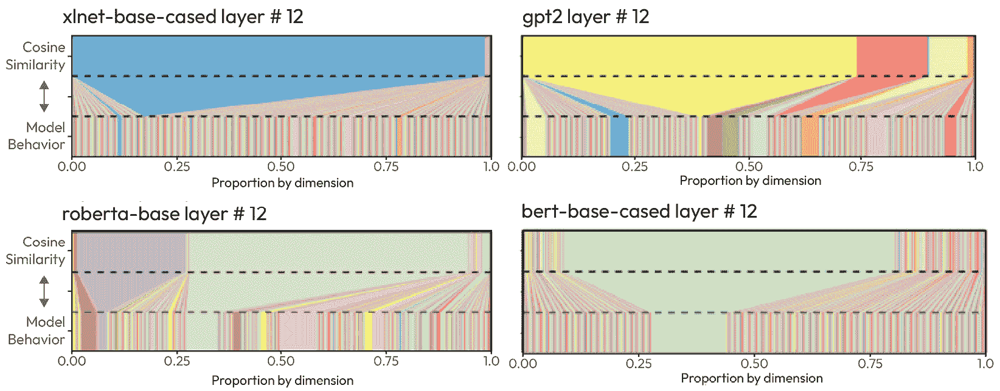

图 5.6 – 各维度对余弦相似度的相对贡献 ([`aclanthology.org/2021.emnlp-main.372.pdf`](https://aclanthology.org/2021.emnlp-main.372.pdf))

此外，检索嵌入中每个单词的嵌入是不必要的繁琐。对于双向编码器，我们可以使用两种主要策略：使用单个编码器或双编码器。在第一种情况下，我们向模型提供查询和文档，从而允许双向自注意力关注所有标记。该表示将代表查询和文档。使用的格式是 [CLS]-query-[SEP]-document。然后，将 [CLS] 标记的表示输入到线性层以产生相似度得分（此层经过微调）。通常，这个过程不是针对整个文档，而是针对一系列块（文档的非重叠片段），因为文档通常比上下文长度长（对于 BERT，这是 512 个标记，所以查询和文档的总数不得超过 512 个标记）。

这个系统成本很高，因为它要求我们必须传递一个查询以及整个文档语料库。为了降低成本，实现了一个称为双编码器的更高效架构。一个编码器用于提取查询的表示，[CLS]q，另一个用于提取每个文档（或块）的表示，[CLS]d。基本上，对一个语料库进行操作，我们计算语料库中每个文档的嵌入，并将这种表示存储在数据库中。之后，我们计算查询表示与数据库中所有向量的余弦相似度。这个系统速度更快，但准确性较低，因为其中一部分交互是在查询和文档中的术语之间。

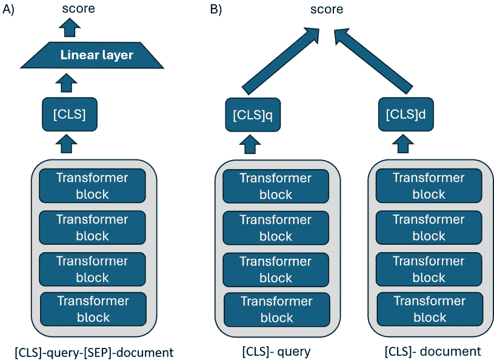

图 5.7 – 两种不同的上下文嵌入方法

让我们更详细地考察 *图 5.7*。 `[CLS]` 表示。 `[CLS]` 表示用于查询和所有向量。我们使用这两种表示来计算余弦相似度。

然后，我们可以对整个语料库进行嵌入，并在数据库中索引文档，然后，当有查询时，计算相似度。

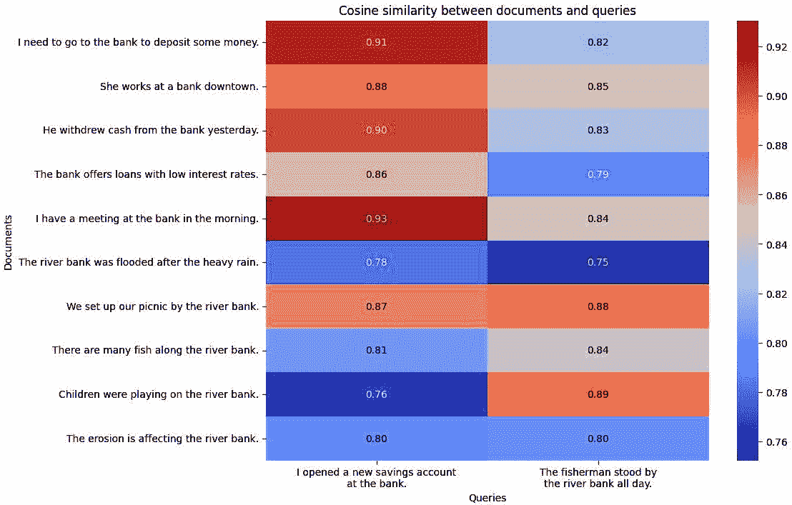

图 5.8 – 一组文档与两个查询之间的余弦相似度，其中“bank”一词的含义不同

如我们之前提到的，生成模型可以产生幻觉。给定一个查询，LLM 可以生成包含错误信息的输出。这源于 LLM 在解释概念方面很擅长，但保留特定信息方面存在问题。在训练过程中，通过重复类似的信息来强化对概念的了解。这对于概念来说效果很好，但对于特定信息（如日期、数值和罕见信息）来说则效果较差。此外，数据集中包含正确和错误的信息，往往相互冲突。当模型生成响应时，它会从分布中进行采样，并必须从它所学习的信息中进行选择，从而导致幻觉。

此外，不正确的架构、过拟合或训练过程中的偏差也可能促进幻觉的产生。微调模型或过度优化某些任务可能是另一个原因。例如，优化模型以生成长文本输出会促使模型变得冗长并产生幻觉。同样，提高温度会增加采样的随机性，导致不太可能出现的样本标记，从而产生更多的幻觉。错误的提示也可能促进这种行为。

当在特定领域（如医疗保健、金融等）使用模型时，幻觉最为明显。模型缺乏最佳理解查询的上下文。这是因为模型是在大量标记上训练的，而这些标记并没有被限制在特定主题上。损失是在文本集上计算的，因此更多地基于一般知识而不是特定信息。因此，模型倾向于通用功能，但在应用于特定领域时表现较差。这是一个常见因素，与模型参数的数量无关。

已经测试了多种可能的解决方案来减少或防止幻觉。一种方法是将上下文作为 LLM 提示的一部分提供（当可能将所有这些上下文添加到提示中时）。然而，这意味着用户必须再次找到相关的上下文。当你有大量不同的文档时，这变成了一项复杂且费力的任务。另一种方法是微调，其中模型在特定文档上进一步训练。但这需要计算成本，并且如果出现新文档，应重复进行。

在 2020 年，Meta 提出了一种替代方法：为 LLM 提供的 RAG。这种方法假设通过在外部源（如数据库）中找到上下文来增强 LLM 的生成。这个数据库可以是特定领域的，并且可以持续更新。换句话说，我们找到回答查询所需的文档，并利用 LLM 在上下文中学习的强大能力。

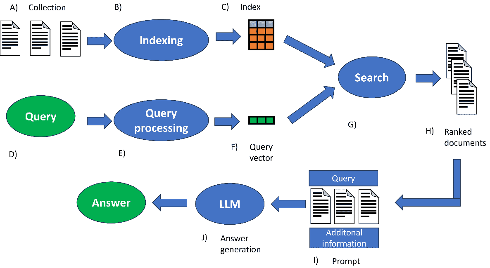

图 5.9 – 显示 RAG 过程的图

在*图 5**.9 中，排名靠前的文档被纳入提示（查询、检索到的文档和附加信息），然后呈现给 LLM。LLM 使用附加上下文来响应用户的查询。

我们将来自 LLM 的知识定义为参数化记忆，而从 RAG 获得的知识则被定义为外部或非参数化。更正式地说，RAG 是一个系统，在其最基本的形式中，由三个部分组成：

+   **索引**：索引处理从原始数据到存储在向量数据库中的整个过程。它始于以各种格式（PDF、HTML、Markdown 或 XML）摄取数据，这些数据必须转换为文本。文本根据选择的嵌入模型进行处理（它被分成比模型上下文长度小的块）。然后这些块被嵌入（转换为向量表示），分配一个标识符，并存储在向量数据库中。

+   **检索**：当查询到达时，必须找到最相关的块。用于文档嵌入的相同编码器用于获取查询的向量。然后计算查询向量和存储在数据库中的向量之间的相似度得分。根据相似度得分选择前*K*个块。

+   **生成**：找到的块与查询一起纳入用于生成的 LLM 的一致提示。不同的 LLM 可能需要提示中的不同元素才能最佳工作；同样，我们也可以有针对特定任务的定制提示。此外，我们还可以添加来自先前对话（历史记录）的元素。

对于自回归模型，我们可以修改在*第二章*中看到的方程，其中我们定义 LLM 计算给定前一个标记序列的概率：

<mrow><mrow><mi>p</mi><mfenced close=")" open="("><mrow><msub><mi>x</mi><mn>1</mn></msub><mo>,</mo><msub><mi>x</mi><mn>2</mn></msub><mo>,</mo><mo>…</mo><mo>,</mo><msub><mi>x</mi><mi>n</mi></msub></mrow></mfenced><mo>=</mo><mrow><munderover><mo>∏</mo><mrow><mi>i</mi><mo>=</mo><mn>1</mn></mrow><mi>n</mi></munderover><mrow><mi>p</mi><mo>(</mo><msub><mi>x</mi><mi>i</mi></msub><mo>|</mo><msub><mi>x</mi><mrow><mo><</mo><mi>i</mi></mrow></msub><mo>)</mo></mrow></mrow></mrow></mrow>

对于问答任务，给定一个问题（或查询）q，我们可以将方程重写如下：

<mrow><mrow><mi>p</mi><mfenced close=")" open="("><mrow><msub><mi>x</mi><mn>1</mn></msub><mo>,</mo><msub><mi>x</mi><mn>2</mn></msub><mo>,</mo><mo>…</mo><mo>,</mo><msub><mi>x</mi><mi>n</mi></msub></mrow></mfenced><mo>=</mo><mrow><munderover><mo>∏</mo><mrow><mi>i</mi><mo>=</mo><mn>1</mn></mrow><mi>n</mi></munderover><mrow><mi>p</mi><mo>(</mo><mi>q</mi><mo>;</mo><msub><mi>x</mi><mrow><mo><</mo><mi>i</mi></mrow></msub><mo>)</mo></mrow></mrow></mrow></mrow>

在 RAG 中，我们还有额外的元素：提示 Pr、检索到的上下文 R 和问题 q，它们都被连接起来：

<mrow><mrow><mi>p</mi><mfenced close=")" open="("><mrow><msub><mi>x</mi><mn>1</mn></msub><mo>,</mo><msub><mi>x</mi><mn>2</mn></msub><mo>,</mo><mo>…</mo><mo>,</mo><msub><mi>x</mi><mi>n</mi></msub></mrow></mfenced><mo>=</mo><mrow><munderover><mo>∏</mo><mrow><mi>i</mi><mo>=</mo><mn>1</mn></mrow><mi>n</mi></munderover><mrow><mi>p</mi><mo>(</mo><msub><mi>x</mi><mi>i</mi></msub><mo>|</mo><mi>P</mi><mi>r</mi><mo>;</mo><mi>R</mi><mo>;</mo><mi>q</mi><mo>;</mo><msub><mi>x</mi><mrow><mo><</mo><mi>i</mi></mrow></msub><mo>)</mo></mrow></mrow></mrow></mrow>

此过程在*图 5.10*中展示：

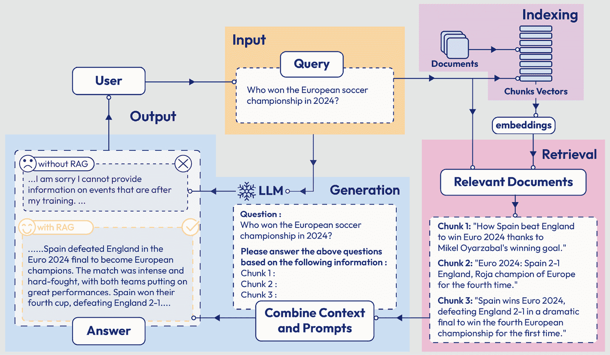

图 5.10 – RAG 过程及其步骤的代表性实例（[`arxiv.org/pdf/2312.10997`](https://arxiv.org/pdf/2312.10997)）

这是通用架构，但也有更复杂的变体（我们将在下一章详细讨论）。为了完整性，这种架构的替代方案是**跨度提取**。在这种情况下，我们不是寻找最合适的块，而是使用一个语言模型（通常也是从 BERT 派生而来）来找到文本中回答查询的段落（**跨度标记**）。例如，如果我们的语料库是维基百科，我们的查询是“*谁是法国总统？*”，提取器将标记回答问题的页面（在 RAG 中，我们检索相关的文本块）。RAG（或**跨度提取器**）在减少幻觉和提升 LLM 在开放域问答（也称为开放式问答）能力方面显示出有趣的能力。

在下一节中，我们将更详细地讨论这些步骤，以及为了优化系统我们需要做出哪些选择。

# 检索、优化和增强

在上一节中，我们讨论了 RAG 的高级范式。在本节中，我们将详细查看组件，并分析实践者在实施 RAG 系统时可能做出的选择。

## 块划分策略

我们已经说明，在将文本嵌入数据库之前，文本被分为块。分块对搜索中包含的信息有很大影响。块太小会丢失数据的上下文，而块太大则不具体（并呈现无关信息，这也影响响应生成）。这会影响查询特定信息的检索。分块大小越大，引入提示的标记数量就越多，从而增加推理成本（但数据库的计算成本也随着每份文档中块的数量而增加）。过多的上下文也可能导致幻觉并降低大型语言模型（LLM）的性能。此外，块大小不能超过嵌入器的上下文长度，否则我们会丢失信息（这被称为截断）。换句话说，块大小是影响检索和生成质量的重要因素。

最简单的策略是基于固定长度的分块。字符分块根据预定的字符数或标记数将文档分为块（常见的选择是 100 或 256 个标记或 500 个字符）。大小应根据文档类型选择。这是最便宜且最容易实现的系统。一种变体是随机块大小，其中块的大小是可变的。当集合非同质时，可以使用这种变体，以捕获更多的语义上下文。分块可以是重叠的或不重叠的。不重叠的分块（*图 5**.11*）如果块之间存在清晰的边界（例如，如果上下文在相邻块之间发生剧烈变化）则效果良好。但这很少见，而且没有重叠会破坏上下文。然后可以使用滑动窗口，在块之间保持重叠。这个系统在块边界处保持上下文信息，允许更好的语义内容，并增加相关信息跨越多个块时被发现的机会。然而，这种策略成本更高，因为我们需要将其分成更多的块，因此我们将有一个具有更多条目的数据库。此外，一些信息是冗余的，因此重叠不应超过整个块大小的百分比。

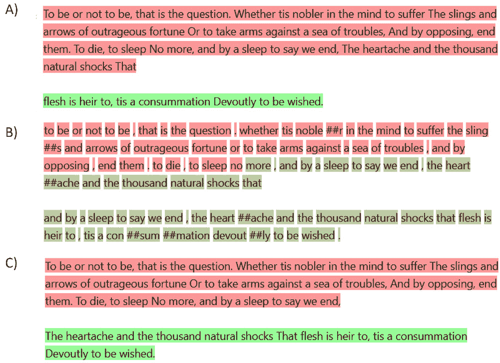

图 5.11 – 在《哈姆雷特》摘录中使用不同分块策略的效果

在 *图 5**.11* 中，我们可以看到以下内容：

+   **A)**: 基于标记数且不重叠的简单分块

+   **B)**: 基于标记数和重叠的简单分块

+   **C)**: 基于标记数和文本中新行存在与否的简单分块（基于字符）

**上下文感知分块**是一种策略，其中我们使用**正则表达式**（**regex**）将文本分成块。例如，我们可以根据句号、逗号或段落分隔来划分。这种策略的变体基于我们要划分的文本类型（例如，HTML 标签、Markdown 信息、XML、特定领域的符号等）。这个系统并非没有缺点；有时确定边界可能很困难（例如，对于复合句、脏文本等）。因此，你可能会有大小不一的块。一个更复杂的变体称为**递归分块**，其中块被分割的方式类似于上下文感知块。之后，这些块被合并到预定的标记数（例如，嵌入器的最大上下文长度）。这种方法试图将所有上下文相关的信息保持在同一个块中，并保持语义一致性（例如，如果可能的话，将属于一个段落的所有块合并）。或者，文本可以迭代地分割，直到块达到所需的大小。**层次聚类**是一种类似的方法，试图尊重文本的结构。通过检查文本中的关系，它试图将其分成尊重其层次结构的段（部分、子部分、段落和句子）。这个系统对于具有复杂且已知结构的文档很有用（例如，商业报告、科学文章和网站）。这种方法还使得检查获得的结构和理解各个块之间的关系成为可能。当处理格式不佳的文档时，这个系统工作得不好。

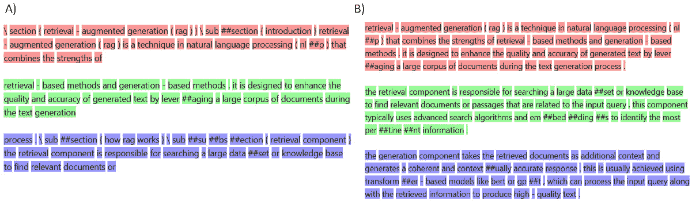

图 5.12 – 层次分块演示

*图 5**.12* 展示了同一份文档在 Markdown（**A**）或 LaTeX（**B**）中的样子。使用特定的分块器，我们可以尊重语言结构进行分块。LangChain 使用层次聚类来实现这一点。

另一类方法是**语义分块**。这些技术的目的是考虑单词的上下文和意义。这些方法试图将文本中原本相距较远的分块（存在旁白或其他元素）进行分组。**K-means 分块**是一种方法，其中我们对各种句子进行嵌入，然后使用*k*-means 聚类将相似的句子分组到不同的簇中。这种方法需要设置最佳簇数（超参数）来选择，可能会导致句子顺序的丢失（可能存在对时间顺序或上下文关系的风险）。而不是考虑句子上的分割，**基于命题的分块**基于上下文理解进行分割。所谓的“命题”被识别为包含事实（如“*法国的首都是巴黎*”）的原子表达式。这些命题随后由一个 LLM 评估，根据语义一致性将它们分组。这种方法可以给出最佳结果，但计算成本高昂，并且依赖于所使用的 LLM 的选择。另一方面，**统计合并**评估句子嵌入中的相似性和差异性，以决定是否合并（或分割）它们。例如，在嵌入后，评估统计属性（标准差、百分位数或四分位数差异）的差异，如果它超过预定义的阈值，则将句子分开。这个系统创建了不同大小的分块，计算成本更高，但在句子之间的上下文边界不清楚时可以给出更好的结果。

最后，可能需要多模态分块。例如，PDF 文件可能包含文本和图像。在这种情况下，我们的分块管道需要能够提取图像和文本。

没有通用的最佳分块器——最佳分块器是我们特定情况最适合的分块器。尽管如此，我们可以建立以下指导方针：

+   **与文档结构对齐分块**：文本结构在很大程度上影响分块大小和分块策略。在具有相同类型文档（HTML、LaTeX、Markdown 等）的情况下，特定的分块可能是最佳选择。如果它们是异构集合，我们可以创建一个根据文件类型进行分块的管道。

+   **优化性能和资源**：如果我们有空间和计算成本的限制，一个简单的固定大小的分块器可能是一个最佳选择。语义分块在性能上略逊一筹，但更好地尊重信息完整性，并提高了找到的分块的相关性和准确性。然而，它需要了解文本内容，可能不是适用于普通用户使用的系统的最佳选择。上下文分块可能在性能上更好，但计算成本较高。

+   **尊重模型上下文限制**：块大小应尊重上下文长度的维度。我们必须考虑到嵌入模型的大小以及我们将要使用的 LLM。

+   **将块分割策略与用户查询模式相匹配**：考虑我们期望潜在用户向系统（RAG）提出的问题类型。例如，如果用户将要提出需要模型找到多个事实的问题，那么拥有小块但包含直接答案的策略会更好。或者如果系统更具有叙述性，那么拥有更多上下文的块会更好。

总之，开发人员必须检查在测试 RAG 系统的不同块分割策略时提供的文本和输出。在任何情况下，然后应该评估每种策略（在后面的章节中，我们将讨论如何评估它们）。

## 嵌入策略

正如我们之前看到的，嵌入是文本的密集向量表示（表示位于多维空间中）。我们利用这些向量来找到查询的适当上下文。我们可以有生成散点向量的编码器（如 TF-IDF 或 BM25）或生成密集编码器的编码器。如前所述，密集编码器是生成向量的 transformer。优点是这些模型是可训练的，因此可以适应查询和块之间的相似度任务。基于 BERT 的骨干是应用最广泛的之一；方法是创建两个并行的 BERT 编码器（两个流：一个用于查询，另一个用于块），称为双编码器方法。在最初的 RAG 方法中，这些权重是相同的（冻结的），我们只有一个层被训练来生成嵌入向量。拥有相同的权重使我们能够首先传递查询，然后是文档，然后计算相似度。另一方面，后来的模型对权重进行微调以提高模型生成更好嵌入向量的能力。

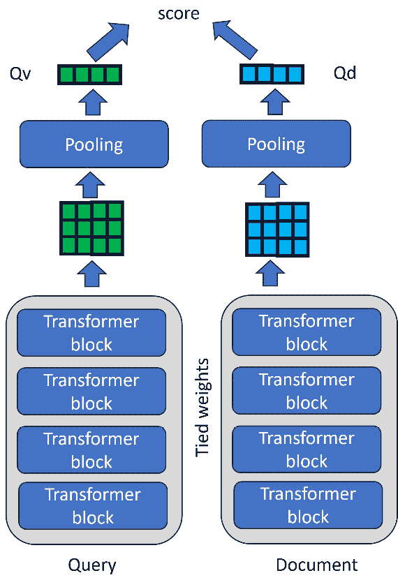

**图 5.13 – 用于生成嵌入向量的双编码器**

如**图 5**.13 所示的双编码器生成一个查询向量和文档向量。在这两个向量上，我们可以计算相似度。

或者，可以从零开始训练一个模型来完成这个任务。通常，最好使用一个未经监督训练的 LLM，然后对其进行嵌入和检索的适配。通常，这种模型是通过对比学习进行适配的。正如我们在*第三章*中看到的，对比学习是一种用于学习以嵌入形式表示的语义表示的技术。在第三章*中，我们使用了 CLIP，它是通过图像和标题进行训练的。在这种情况下，我们希望训练一个模型，生成嵌入，使我们能够找到与我们查询最相似的文档。最常用的数据集之一是多体裁自然语言推理（MultiNLI）语料库，它包含 433,000 个句子对，这些句子对带有文本蕴涵信息进行了标注。给定一个假设，第二个句子代表一个蕴涵、一个矛盾或两者都不是（中性）。

在对比学习中，我们需要正例和负例。在取了一个句子之后，我们希望我们的句子嵌入尽可能接近正例，并且与负例尽可能不同。在这种情况下，我们可以从 MultiNLI 中为我们的一个句子推导出正例和负例。实际上，蕴涵句子代表一个正例，而矛盾是一个负例。

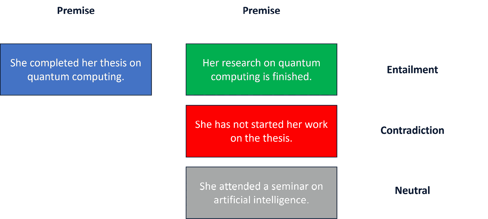

图 5.14 – 包含可用于训练编码器的蕴涵或矛盾句子的示例

一旦我们有了数据集，这些模型就使用适合任务的损失函数进行训练：

+   `1` 表示相似句子（原始句子和正例）和 `0` 表示不相似句子（原始句子和负例）。作为损失函数，我们计算两个句子之间的相似度，然后将其与预测标签进行比较。

+   **多个负例排序损失**：这是另一种流行的替代方案（也称为**InfoNCE**）。仅使用正例来计算这种类型的损失。在这种情况下，我们有原始句子和相应的正例（蕴涵句子）。对于负例，我们取原始句子和另一个句子的蕴涵句子。然后，我们计算嵌入和相似度。想法是最大化句子与其相关句子（其正例）之间的相似度，同时最小化与不相关例子（我们的负例）之间的相似度。通过这种方式，这个任务变成了一个分类任务，我们可以使用交叉熵。然而，负例是完全不相关的，因此这个任务对于模型来说可能太容易了（相反，最好添加相关但不是正确答案的负句子）。

选择嵌入器是一个关键决策，将对我们的系统性能产生重大影响。一个差的嵌入器会导致检索效果差，上下文与查询不相关，这反而可能增加幻觉的风险。编码器选择影响以下方面：

+   **成本**：嵌入器是一个转换器。它越大，计算成本就越高。另一方面，封闭源编码器相对于 API 有成本，因此使用得越多，成本就越高。此外，嵌入文档和每个查询都与计算成本相关。

+   **存储成本**：嵌入向量的尺寸越大，我们向量的存储成本就越高。

+   **延迟**：更大的模型具有更高的延迟。

+   **性能**：如果我们的主要关注点是性能，那么某些选择的花费是合理的。通常，更大的模型具有更好的性能。

+   **领域需求**：现在有一些领域（如金融、医学、科学、编程等）有专门的编码器，其中一些是多语言的（大多数只支持英语，但其他支持多达一百种语言）。一些领域有不同的文本粒度，需要针对长文本进行专门设计的模型。

决定使用哪个编码器模型并不容易，这取决于各种因素。一个好的开始是 Hugging Face 上的 **MTEB 排行榜**（[`huggingface.co/spaces/mteb/leaderboard`](https://huggingface.co/spaces/mteb/leaderboard)），这是一个编码模型及其在不同基准和任务上的性能的最新列表。然而，通常这些结果是自行报告的，并且是在标准基准上获得的（其中一些基准数据可能已泄露到训练数据中，从而高估了模型的能力）。因此，我们不应只选择一个模型，而应在自己的数据集上测试几个模型。然而，排行榜提供了一些重要信息，这有助于我们指导选择：

+   **检索平均数**：计算多个数据集上的**归一化折现累积增益**（**NDCG**）（用于对检索系统进行排名的评价指标）

+   **模型大小**：这让我们了解到使用该模型所需的计算成本和资源

+   **最大标记数**：可以在上下文长度中使用的标记数

+   **嵌入维度**：考虑嵌入后向量的大小

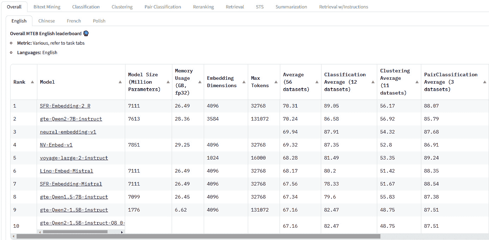

图 5.15 – 专注于嵌入模型及其性能的 MTEB 排行榜

还应注意的是，排行榜在通用领域上进行衡量。这意味着它衡量的是一般性能，这可能导致我们在感兴趣的领域或任务中的性能不佳。

一旦我们选择了编码器，我们就可以在不影响性能的情况下降低这种成本。关于成本和可扩展性，对于向量嵌入的每个维度，如果它们以浮点格式存在，则需要 4 字节内存。这可能导致存储成本过高。在*第三章*中，我们讨论了量化——这也可以应用于嵌入模型。**二进制量化**（将模型减少到每个维度 1 位）可以将内存和存储减少高达 32 倍。最简单的二进制量化是使用零阈值：

<mrow><mrow><mi>f</mi><mfenced close=")" open="("><mi>x</mi></mfenced><mo>=</mo><mfenced close="" open="{"><mtable columnalign="center" columnwidth="auto" rowalign="baseline baseline" rowspacing="1.0000ex"><mtr><mtd><mrow><mn>0</mn><mi>i</mi><mi>f</mi><mi>x</mi><mo>≤</mo><mn>0</mn></mrow></mtd></mtr><mtr><mtd><mrow><mn>1</mn><mi>i</mi><mi>f</mi><mi>x</mi><mo>></mo><mn>0</mn></mrow></mtd></mtr></mtable></mfenced></mrow></mrow>

然后，我们可以使用 `float32` 格式转换为 `int8`（一种使用 256 个不同级别表示值的格式）。如我们之前所述，这是通过在转换期间重新校准向量来实现的。

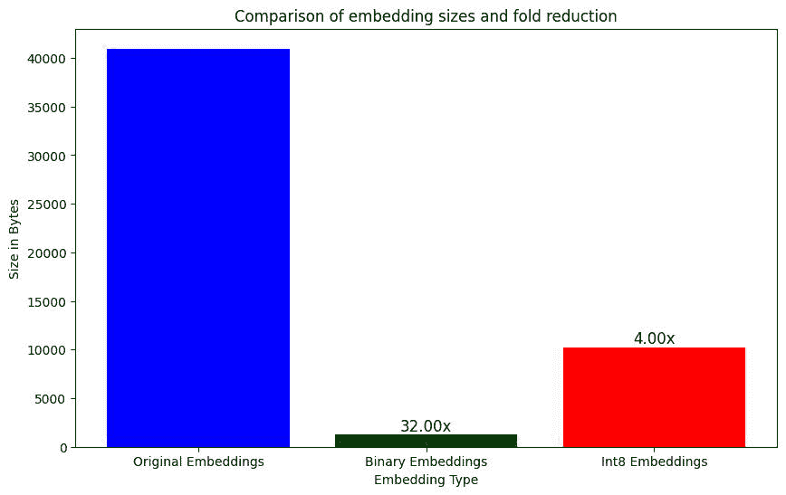

图 5.16 – 显示量化后内存减少的图表

一种替代技术是套娃表示学习。深度学习模型倾向于在整个向量上分散信息；这种技术试图通过几个维度更少的表示来压缩信息。换句话说，它逐步减少向量嵌入的划分，同时不会损失太多性能。在套娃嵌入中，可以获得较小的嵌入，这些嵌入可以用作较大的嵌入。这是因为系统试图将最重要的信息存储在早期维度，而将不太重要的信息存储在后期维度（这样，我们可以在保持下游任务性能的同时截断向量）。为了训练编码器，我们为一批文本生成嵌入，然后计算损失。对于套娃嵌入模型，损失还考虑了不同维度嵌入的质量。这些值在最终损失中相加。因此，模型试图以最优化模型权重的方式，将最重要的信息（对于嵌入向量）定位在第一维度。

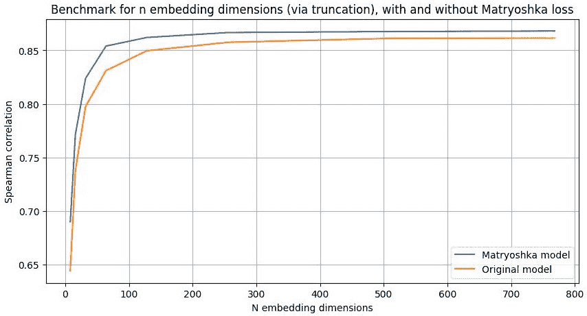

图 5.17 – 套娃与原始嵌入质量在维度数量上的基准比较

一旦我们有了向量，我们需要存储它们。在下一节中，我们将讨论存储它们的位置。

## 嵌入数据库

向量数据库是一种专门用于存储高维向量的数据库。因此，它针对处理非结构化和半结构化数据（如向量）进行了优化。该数据库的功能是允许高效地存储、索引和搜索。我们选择的向量数据库也会对 RAG 性能产生重大影响。如今，有数十种可能的向量数据库，因此选择最佳解决方案可能是一项艰巨的任务。幸运的是，有一些网站会对可能的系统进行对比。


图 5.18 – 向量数据库排行榜，解决向量数据库选择的一个实用来源 ([`superlinked.com/vector-db-comparison`](https://superlinked.com/vector-db-comparison))

可能没有最好的向量数据库，但肯定会有一个适合我们项目的。以下是一些可以指导我们选择的准则：

+   **开源或私有源**：开源数据库提供透明度和定制系统的能力。它们通常有一个活跃的社区且没有相关成本。相反，私有源数据库可能是一个昂贵的解决方案，但通常有专门的支持。同样，检查许可证也很重要；它可能不适合您的产品。

+   **语言支持**：向量数据库通常与主要的编程语言（Python、Java 和 C）兼容，但对我们项目来说，我们可能需要一个兼容其他语言（Rust、Go、Scala 等）的数据库。此外，并非所有数据库都与所有库兼容。因此，确保系统与我们的项目兼容是很好的。

+   **成熟度**：特别是对于以生产为导向的项目，系统的稳定性、可扩展性和可靠性至关重要。同样，系统必须得到支持，被行业采用，并且需要经常维护。

+   **性能**：这受两个参数的影响：

    +   **插入速度**：向量添加到数据库中的速率（这会影响延迟）。这特别影响实时应用或用户基数大的应用。一些数据库实现了批处理（各种数据包的有效分区）、并行化（任务在各个节点上的分布，对于云特别重要）或数据分区（数据集被分成段以同时进行插入和删除）等技术。

    +   **查询速度**：这指的是响应查询时找到向量的时间。这直接影响延迟时间。

    存在着诸如索引结构（构建索引以加快搜索速度）、缓存系统（频繁访问的数据被单独保存）或特定算法等优化技术。然后是特定产品相关的性能问题，例如可以向数据集发出的并发请求数量。法规遵从性和隐私问题也是关键。数据库应该能够允许差异化的访问（访问授权）并保护向量免受未经授权用户访问。

+   **组件集成**：我们的系统除了 LLM 和嵌入器之外，还可以有多个组件（我们将在下一章中更详细地讨论这一点）。我们需要确保数据库可以与我们的编码器（以及我们用于编码器的库）集成。此外，并非所有数据库都接受其他组件，如再排序器、混合搜索等。

+   **成本**：云解决方案可能具有非常高的成本，因此建议事先决定你的预算。成本还可能与保持系统运行所需的维护和支持相关。例如，向量是宝贵的数据，备份的成本可能会迅速增长。

例如，有些向量库是静态的（索引数据是不可变的），这使得添加新数据变得困难。例如**FAISS**（**Facebook AI Similarity Search**）并不是为**创建、读取、更新和删除**（**CRUD**）操作设计的，因此它们不适合有多个用户访问和执行操作的动态系统。相比之下，如果我们的数据库是不可变的，并且我们只授予访问权限，FAISS 可以是一个好的解决方案。有些 SQL 数据库允许支持向量（经典数据库的扩展）。这些数据库允许对相关元数据进行高效的索引。然而，这些数据库不可扩展，通常对向量大小（最大维度数）有限制，并且性能较低。SQL 数据库是连接到现有企业数据库（可能已经是 SQL）的内部项目的良好选择，但不是当可扩展性和性能很重要时的选择。

专门针对向量的数据库通常是最佳解决方案，尤其是在性能方面。实际上，它们通常实现了针对搜索和索引向量的专用和高效算法。其中一些算法是**近似最近邻**（**ANN**）算法的变体。ANN 通常在效率、存储和准确性之间提供了良好的权衡。近似搜索加快了搜索速度，同时试图保持准确性（HNSW（分层可导航小世界）牺牲了一些准确性，但比像 Flat 索引这样的准确算法快得多）。这些数据库也与主要语言和库（LlamaIndex、LangChain 等）兼容。

一旦我们的向量数据库用我们的向量填充完毕，我们需要评估我们的系统有多好。现在，我们将看看我们如何做到这一点。

# 评估输出

在信息检索中，我们感兴趣的是衡量找到的文档是相关还是不相关。因此，最常用的评估指标是精确率和召回率。精确率是检索到的相关文档的比例，而召回率是成功检索到的相关文档的比例。考虑一个查询，其中*R*代表语料库中所有相关文档，*NR*代表无关文档，*Rq*代表找到的相关文档，*Dq*是系统返回的文档。我们可以定义这两个指标如下：

<mrow><mrow><mi>p</mi><mi>r</mi><mi>e</mi><mi>c</mi><mi>i</mi><mi>s</mi><mi>i</mi><mi>o</mi><mi>n</mi><mo>=</mo><mfrac><mrow><mi>R</mi><mi>q</mi></mrow><mrow><mi>D</mi><mi>q</mi></mrow></mfrac><mi>r</mi><mi>e</mi><mi>c</mi><mi>a</mi><mi>l</mi><mi>l</mi><mo>=</mo><mfrac><mrow><mi>R</mi><mi>q</mi></mrow><mi>R</mi></mfrac></mrow></mrow>

这两个指标的问题在于，它们不返回排名的好坏，只告诉我们是否找到了所有相关文档或总相关文档的百分比。通常，当我们使用检索器时，我们会选择一个数字（*k*）的文档作为上下文（top-k），因此我们需要一个考虑排名的指标。

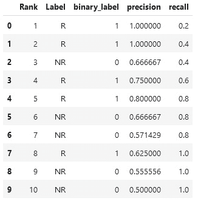

图 5.19 – 假设在一个语料库中有五个相关文档，计算特定排名的精确率和召回率

我们可以使用精确率-召回率曲线来完成这个目的。每当我们在排名中找到一个相关文档时，召回率就会增加。另一方面，精确率随着文档的增加而增加，但每个无关文档都会使其降低。通过绘制一个曲线图，我们可以看到这种行为：

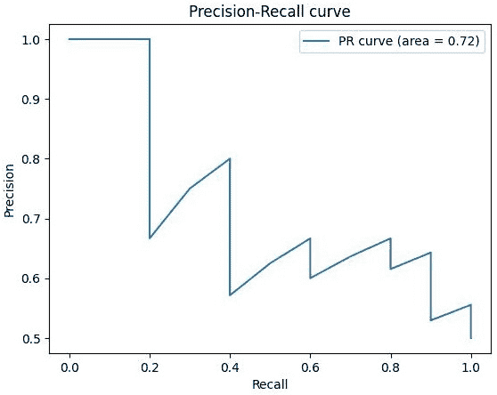

图 5.20 – 显示图 5.19 中数据的精确率和召回率的曲线图

由于精确率上下波动，我们可以使用一个插值曲线。这个曲线不如曲线精确，但能更好地理解系统的行为（并且能够通过比较曲线来比较不同的系统）。

另一个使用的指标是**平均平均精确率**（**MAP**）。我们在检索到相关项的点处计算精确率值（**平均精确率**或**AP**），然后平均这些 AP 值。假设我们检索到了以下文档列表：*[1, 0, 1, 0, 1]*，其中*1*表示相关，*0*表示不相关。每个相关项的精确率如下：

+   第一份相关文档位于位置 1：精确率（*N*个相关文档检索到的总数/检索到的文档总数）= 1/1 = 1

+   第二相关文档（位置 3）：精确度 = 2/3 ≈ 0.67

+   第三相关项目（位置 5）：精确度 = 3/5 = 0.6

单个查询的平均精确度（AP）值是：

<mrow><mrow><mi>A</mi><mi>P</mi><mo>=</mo><mfrac><mrow><mo>∑</mo><mi>p</mi><mi>r</mi><mi>e</mi><mi>c</mi><mi>i</mi><mi>s</mi><mi>i</mi><mi>o</mi><mi>n</mi><mi>a</mi><mi>t</mi><mi>e</mi><mi>a</mi><mi>c</mi><mi>h</mi><mi>r</mi><mi>e</mi><mi>l</mi><mi>e</mi><mi>v</mi><mi>a</mi><mi>n</mi><mi>t</mi><mi>i</mi><mi>t</mi><mi>e</mi><mi>m</mi></mrow><mrow><mi>T</mi><mi>o</mi><mi>t</mi><mi>a</mi><mi>l</mi><mi>n</mi><mi>u</mi><mi>m</mi><mi>b</mi><mi>e</mi><mi>r</mi><mi>o</mi><mi>f</mi><mi>r</mi><mi>e</mi><mi>l</mi><mi>e</mi><mi>v</mi><mi>a</mi><mi>n</mi><mi>t</mi><mi>i</mi><mi>t</mi><mi>e</mi><mi>m</mi><mi}s</mi></mrow></mfrac><mo>=</mo><mfrac><mrow><mo>∑</mo><mrow><mrow><mo>(</mo><mn>1</mn><mo>+</mo><mn>0.67</mn><mo>+</mo><mn>0.6</mn><mo>)</mo></mrow></mrow></mrow><mn>3</mn></mfrac><mo>=</mo><mn>0.76</mn></mrow></mrow>

MAP 是所有查询的 AP 值的平均值。这里，我们假设我们有 3 个查询 – *0.76*，*0.5*，和*0.67*：

<mrow><mrow><mi>M</mi><mi>A</mi><mi>P</mi><mo>=</mo><mfrac><mrow><mo>∑</mo><mi>a</mi><mi>v</mi><mi>e</mi><mi>r</mi><mi>a</mi><mi>g</mi><mi>e</mi><mi>p</mi><mi>r</mi><mi>e</mi><mi>c</mi><mi>i</mi><mi>s</mi><mi>i</mi><mi>o</mi><mi>n</mi><mi>f</mi><mi>o</mi><mi>r</mi><mi>e</mi><mi>a</mi><mi>c</mi><mi>h</mi><mi>q</mi><mi>u</mi><mi>e</mi><mi>r</mi><mi>y</mi></mrow><mrow><mi>T</mi><mi>o</mi><mi>t</mi><mi>a</mi><mi>l</mi><mi>n</mi><mi>u</mi><mi>m</mi><mi>b</mi><mi>e</mi><mi>r</mi><mi>o</mi><mi>f</mi><mi>q</mi><mi>u</mi><mi>e</mi><mi>r</mi><mi>i</mi><mi>e</mi><mi>s</mi></mrow></mrow><mrow><mo>=</mo><mfrac><mrow><mo>∑</mo><mrow><mrow><mo>(</mo><mn>0.76</mn><mo>+</mo><mn>0.5</mn><mo>+</mo><mn>0.67</mn><mo>)</mo></mrow></mrow></mrow><mn>3</mn></mfrac><mo>=</mo><mn>0.64</mn></mrow></mrow>

一个特定于问答的指标是**平均倒数排名**（**MRR**）。MRR 旨在评估包含正确答案（通常为人工标签）的短排名列表的质量。倒数排名是第一个与问题相关的项目的排名的倒数。对于查询集*Q*，我们取倒数排名并计算平均值：

<mrow><mrow><mi>M</mi><mi>R</mi><mi>R</mi><mo>=</mo><mfrac><mn>1</mn><mi>Q</mi></mfrac><mrow><munderover><mo>∑</mo><mrow><mi>i</mi><mo>=</mo><mn>1</mn></mrow><mi>Q</mi></munderover><mfrac><mn>1</mn><msub><mrow><mi>r</mi><mi>a</mi><mi>n</mi><mi>k</mi></mrow><mi>i</mi></msub></mfrac></mrow></mrow></mrow>

或者，我们可以将生成后的响应作为分类任务来评估。

最近，评估 RAG 管道的一种新方法是使用一个大型语言模型（LLM）作为管道的评判者。通常，我们必须有一个包含真实数据的集合，以便 LLM 评估 RAG 管道是否找到了必要的步骤，并且生成的结果是否正确。例如，有一些不同的指标利用 LLM 作为评判者：

+   **忠实度**：这个指标（也称为扎根性）衡量生成答案的事实一致性（范围在 0 到 1 之间）。如果一个答案中的陈述可以从上下文中推断出来，那么这个答案是忠实的。忠实度是生成答案中可以从上下文中推断出的陈述数量与生成答案中总陈述数量的比率。为了找到这些陈述，我们需要一个 LLM 来评估响应和上下文中的陈述。

+   **上下文召回率**：这个指标指的是相对于真实数据找到的上下文量（范围在 0 到 1 之间）。理想情况下，系统应该找到真实数据中的所有句子。

+   **上下文精确度**：这个指标衡量上下文中与真实数据相关的内容，这些内容被排序得更高（相关片段在检索后应该找到自己更高的位置）。

+   **上下文相关性**：这个指标衡量上下文与查询的相关性。理想情况下，我们的系统应该只找到与查询相关的信息。

+   **上下文实体召回率**：这个指标通过特别分析找到的实体来提供上下文召回的度量。换句话说，它衡量真实数据中上下文中找到的实体所占的比例。当我们对系统特别寻找实体感兴趣时（例如，上下文需要找到医疗实体，如疾病、药物或其他参数），这个指标很有用。

+   **答案正确性**：这个指标侧重于批判性地评估答案是否正确。为了获得高分数，系统必须生成与真实数据在语义上相似但也是事实正确的答案。

+   **摘要分数**：这个指标评估摘要如何捕捉上下文中存在的重要信息。答案是上下文的一种摘要，一个好的摘要必须包含重要信息。

+   **答案相关性**：这个指标计算生成的响应对提示的相关性。低分意味着响应不完整或包含冗余信息。

+   **流畅度**：这个指标评估生成单个句子的质量。

+   **连贯性**：这个指标评估整个响应是否是一个连贯的语料库（避免响应成为一组不相连的句子）。

这些指标要求有一个评判者，这个人可以是人类或 LLM。它们不仅仅是统计值，还需要对响应（和/或找到的上下文）进行批判性评估。

RAG 也经常被讨论为微调的替代方案；因此，比较它们很重要，我们将在下一部分进行。

# RAG 和微调的比较

RAG 和微调经常被比较，并被视为对立的技术。微调和 RAG 都有类似的目的，即向模型提供它在训练期间没有获得的知识。一般来说，我们可以这样说，有两种类型的微调：一种是为了适应特定领域（如医学、金融或其他）的模型，另一种是为了提高 LLM 执行特定任务或任务类的能力（如数学问题解决、问答等）。

微调和 RAG 之间存在几个差异：

+   **知识更新**：RAG 允许直接更新知识（包括结构和非结构化信息）。这种更新对于 RAG 来说是动态的（信息可以实时保存和删除）。相比之下，微调需要重新训练，因为更新是静态的（对于频繁更改来说不切实际）。

+   **数据处理**：对于 RAG，数据处理量最小，而微调则需要高质量的数据集（示例不足的数据集将无法帮助实现明显的改进）。

+   **模型定制**：RAG 向 LLM 提供额外的信息，但不会改变其行为或写作风格。微调允许改变模型行为、写作风格，甚至新技能。

+   **可解释性**：RAG 增加了系统的可解释性，并允许追踪响应和使用的来源。微调使模型的可解释性降低，并使得追踪行为是否来自微调或原始模型变得更加困难。

+   **计算资源**：RAG 与编码器和数据库相关联，存在额外的成本（查找信息、嵌入数据、存储信息等）。这可能会增加延迟成本（你必须将检索时间添加到生成时间）。微调需要准备和整理高质量的数据集（获取某些数据集可能既昂贵又费时）。此外，微调与模型重新训练相关联的计算成本，但它提供了更低的延迟。此外，与微调相比，RAG 需要的技术专业知识更少。

+   **减少幻觉**：RAG 本身对幻觉的倾向性较低，并允许追踪使用了哪些上下文。微调可以减少幻觉（但，通常，微调后的 LLM 仍然会表现出幻觉）。

+   **伦理和隐私问题**：在 RAG 的情况下，我们必须小心如何保存存储在数据库中的信息。数据库必须受到潜在入侵的保护，并防止泄露。对于微调，重要的是要关注训练数据集，并防止其包含敏感数据。

RAG 是在需要一种能够适应实时数据或我们拥有大量未良好结构化的内部数据时的最佳系统。同样，当需要最小化幻觉并确保透明度至关重要时，RAG 也是首选。当我们需要模型发展特定技能或希望将模型与特定的写作风格或词汇表对齐时，微调是优先选择。

一些实际例子显示了在何种情况下最好选择微调或 RAG：

+   **摘要**对于高度专业化的领域尤为重要。模型最好理解上下文更为关键，因此微调更为合适。

+   **问答**是一个极其相关的任务，常用于不同领域（如关于文档、产品等问题）。在这种情况下，减少幻觉和透明度是关键方面，但定制化则不那么重要。因此，RAG 是更好的选择。

+   **代码生成**是一个需要代码库动态的任务；同时，减少幻觉和错误也很重要。另一方面，我们需要模型尽可能适应任务。因此，RAG 和微调都将是有益的。

如最后一个例子所示，在某些情况下，微调和 RAG 都是有益的。这两个系统并不一定是对立的。我们可以对 LLM 和嵌入器都进行微调。因此，拥有一个结合了 RAG 和对 LLM（甚至 RAG 编码器）进行微调的系统将是有益的。针对我们数据领域特定任务的能力进行针对性微调可以带来更好的性能。这允许我们有一个动态的信息系统（我们在这里进行 RAG 更新），但同时也使 LLM 的风格适应该领域。LLM 也将更有能力理解和利用 RAG 提供的上下文。另一个微调模型有益的案例是当找到的数据具有特定格式（代码、表格、XML 或其他格式）时——我们就可以使用适应这些特定格式的 LLM（而不是一个天真的 LLM）。此外，我们可以通过利用提供的上下文来优化 LLM 以生成答案的任务。在这种情况下，LLM 可以被推动充分利用找到的上下文。

编码器也可以进行微调。使用特定数据集微调嵌入器可以增加模型对上下文的理解（记住，编码器是一个对数据有一定上下文理解的语模型）。这允许 LLM 更好地理解数据的特定领域细微差别，从而实现更好的上下文检索（与查询更相关的块）。当然，并非总是能够获得用于此任务的数据集。然而，存在一些方法，可以通过生成合成数据或使用大型 LLM 创建适合编码器微调的数据集。

与从头开始训练相比，微调嵌入器成本更低。今天，许多模型可供选择，例如 Sentence Transformer 之类的库简化了微调过程。这些模型已经被预先训练为嵌入器，但在微调过程中，我们希望更好地将它们适配到我们特定的数据类型或领域。通常，这种微调是通过使用与嵌入器训练相似的监督学习数据集来进行的（包含正例和反例）。

现在我们已经看到了主要组件，在下一节中，我们将组装系统。

# 使用 RAG 构建电影推荐代理

在前面的章节中，我们讨论了 RAG 是什么以及如何使用这个系统来减少幻觉或扩展模型知识。正如我们提到的，这个系统由以下组件组成：

+   一个用于生成答案的 LLM

+   将查询和文档转换为向量的编码器/检索器

+   一个向量数据库，我们在这里保存我们的向量

在这个例子中，我们有一个电影及其描述的数据集，我们想要创建一个系统，通过提出一个自然语言问题，将根据我们提供的信息建议最合适的电影。我们的 LLM 对电影没有特定的知识，其参数化记忆不包含有关最新发布的任何信息。因此，RAG 是一个很好的系统来补充其知识。

1.  第一步是获取一个块语料库。在获取了一组文档后，我们必须将其缩减为块。一个好的折衷方案是使用保留语义信息（无需使用 LLM）的文本分割器。在这种情况下，我们使用一个 1500 字符大小的块分割器。我们将其应用于我们的数据框的列：

    ```py
    text_splitter = NLTKTextSplitter(chunk_size=1500)
    def split_overview(overview):
        if pd.isna(overview):
            return []
        return text_splitter.split_text(str(overview))
    df['chunks'] = df['text_column'].apply(split_overview)
    ```

1.  接下来，我们需要将我们的块转换为向量。在这种情况下，我们使用`all-MiniLM-L6-v2`作为嵌入器。`all-MiniLM-L6-v2`是一个在嵌入质量和速度之间取得良好平衡的小型模型。实际上，该模型只有 2270 万个参数，这使得它非常快，是测试 RAG 管道的初始选择。

    在这个例子中，我们执行以下操作：

    +   加载模型（嵌入器）

    +   创建一个执行嵌入的函数

    +   执行各种向量的嵌入

        ```py
        embedder = SentenceTransformer('all-MiniLM-L6-v2')
        def encode_chunk(chunk):
            if not isinstance(chunk, str) or chunk.strip() == "":
                return None
            return embedder.encode(chunk).tolist()
        chunked_df['embeddings'] = chunked_df['chunks'].apply(encode_chunk)
        ```

1.  在这一点上，我们需要将我们创建的向量保存到数据库中。作为向量数据库的一个流行选择是 Chroma。在这种情况下，我们需要执行以下操作：

    +   启动 Chroma 客户端

    +   创建一个新的集合

    +   插入块

        ```py
        chunked_df.dropna(subset=['embeddings'], inplace=True)
        client = chromadb.Client()
        collection = client.create_collection(name='movies')
        for idx, row in chunked_df.iterrows():
            collection.add(
                ids=[str(idx)],
                embeddings=[row['embeddings']],
                metadatas=[{
                    'original_title': row['original_title'],
                    'chunk': row['chunks']
                }]
            )
        ```

重要提示

注意，我们可以添加元数据（在这种情况下，电影的标题）。

我们现在只实现了我们之前描述的管道的第一部分。目前，我们有一个包含 RAG 向量的数据库。

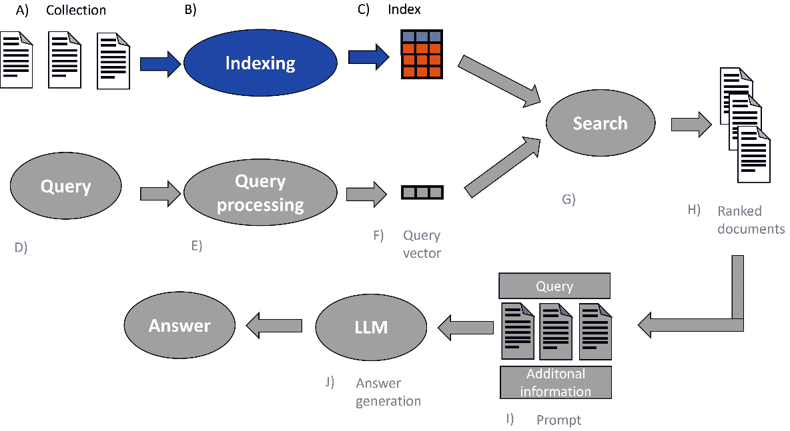

图 5.21 – 向量数据库管道

现在，当查询到达时（在推理中），我们需要创建一个管道。在这种情况下，我们想要为查询创建一个向量，并在我们的向量数据库中搜索最相似的 *k* 个向量。这将返回文本给 LLM，然后生成对查询的答案。

1.  尽管我们使用与找到块相同的嵌入器模型，但我们需要一个执行以下操作的功能：

    +   为查询创建一个向量

    +   找到最相似的文档

    +   返回关联文本

        ```py
        def retrieve_documents(query, collection, top_k=5):
            query_embedding = embedder.encode(query).tolist()
            results = collection.query( query_embeddings=[query_embedding], n_results=top_k )
            chunks = []
            titles = []
            for document in results['metadatas'][0]:
                chunks.append(document['chunk'])
                titles.append(document['original_title'])
            return chunks, titles
        ```

    在这一点上，我们需要生成答案，因此我们需要一个 LLM。想法是向 LLM 提供清晰的指令，因此我们创建一个简单的提示来解释任务给模型。我们还向模型提供上下文和问题：

    ```py
    tokenizer = AutoTokenizer.from_pretrained("mistralai/Mistral-7B-Instruct-v0.1")
    model = AutoModelForCausalLM.from_pretrained(
        "mistralai/Mistral-7B-Instruct-v0.1",
        device_map='auto')
    text_generation_pipeline = pipeline(
        model=model,
        tokenizer=tokenizer,
        task="text-generation",
        return_full_text=True,
        max_new_tokens=800)
    def generate_answer(query, chunks, titles, text_generation_pipeline):
        context = "\n\n".join([f"Title: {title}\nChunk: {chunk}" for title, chunk in zip(titles, chunks)])
        prompt = f"""[INST]
        Instruction: You're an expert in movie suggestions. Your task is to analyze carefully the context and come up with an exhaustive answer to the following question:
        {query}
        Here is the context to help you:
        {context}
        [/INST]"""
        generated_text = text_generation_pipeline(prompt)[0]['generated_text']
        return generated_text
    ```

现在，我们可以测试它。我们可以向系统提问，看看它是否生成一个响应：

```py
client = chromadb.Client()
collection = client.get_collection(name='movies')
query = "What are some good movies to watch on a rainy day?"
top_k = 5
chunks, titles = retrieve_documents(query, collection, top_k)
print(f"Retrieved Chunks: {chunks}")
print(f"Retrieved Titles: {titles}")
if chunks and titles:
    answer = generate_answer(query, chunks, titles, text_generation_pipeline)
    print(answer)
else:
    print("No relevant documents found to generate an answer.")
```

现在我们有一个完整的系统。这个原则适用于任何文档集合。

# 摘要

RAG 是 LLM 领域中增长最快的范式之一。消除幻觉是 LLM 和代理投入生产的最重要挑战之一，也是最具挑战性的约束之一。RAG 也是一个灵活的系统，与微调相比具有几个优点。正如我们所见，这个系统可以以最低的成本频繁更新，并且与不同类型的数据兼容。简单的 RAG 是基本系统，由三个主要组件组成：一个 LLM、一个嵌入器和向量数据库。

在下一章中，我们将看到这个系统是如何演变的。现在有许多新的附加组件，我们也将对其进行研究。尽管有 RAG，但有时模型仍然像忽略上下文一样产生幻觉。这就是为什么发展了复杂组件，我们将详细探讨。我们还将讨论参数记忆和上下文之间微妙的相互作用。

# 进一步阅读

+   Lewis, *Retrieval-Augmented Generation for Knowledge-Intensive NLP Tasks*, 2020, [`arxiv.org/abs/2005.11401`](https://arxiv.org/abs/2005.11401)

+   *ANN-Benchmarks*, 2024, [`ann-benchmarks.com/index.html`](https://ann-benchmarks.com/index.html)

+   *两个字符串之间的汉明距离*：[`www.geeksforgeeks.org/hamming-distance-two-strings/`](https://www.geeksforgeeks.org/hamming-distance-two-strings/)
