# 信息检索和增强的高级 RAG 技术

在上一章中，我们讨论了 RAG 以及这种范式如何演变以解决 LLMs 的一些不足。然而，即使是简单的 RAG（这种范式的原始形式）也并非没有其挑战和问题。简单的 RAG 由几个简单的组件组成：一个嵌入器、一个用于检索的向量数据库和一个用于生成的 LLM。正如前一章所述，简单的 RAG 涉及将文本集合嵌入到数据库中；一旦用户查询到达，就会搜索与查询相关的文本块，并将其提供给 LLM 以生成响应。这些组件使我们能够有效地响应用户查询；但正如我们将看到的，我们可以添加额外的组件来改进系统。

在本章中，我们将看到在高级 RAG 中，我们可以修改或改进管道中的各个步骤（数据摄入、索引、检索和生成）。这解决了简单 RAG 的一些问题，并使我们能够更好地控制整个过程。我们稍后将看到，对更多灵活性的需求导致了进一步的进步（模块化 RAG）。我们还将讨论 RAG 的重要方面，特别是在系统（RAG 基础产品）被生产时。例如，我们将讨论在数据量或用户数量很大时的挑战。此外，由于这些系统可能包含敏感数据，我们将讨论鲁棒性和隐私。最后，尽管 RAG 是当今流行的系统，但它仍然相对较新。因此，仍然存在一些未解决的问题和令人兴奋的前景。

在本章中，我们将讨论以下主题：

+   讨论简单的 RAG 问题

+   探索高级 RAG 管道

+   模块化 RAG 和与其他系统的集成

+   实现高级 RAG 管道

+   理解 RAG 的可扩展性和性能

+   开放性问题

# 技术要求

本章中的大部分代码可以在 CPU 上运行，但最好在 GPU 上运行。代码是用 PyTorch 编写的，大部分使用标准库（PyTorch、Hugging Face Transformers、LangChain、`chromadb`、`sentence-transformer`、`faiss-cpu`等）。

本章的代码可以在 GitHub 上找到：[`github.com/PacktPublishing/Modern-AI-Agents/tree/main/chr6`](https://github.com/PacktPublishing/Modern-AI-Agents/tree/main/chr6)。

# 讨论简单的 RAG 问题

在上一章中，我们介绍了 RAG 的基本版本（称为简单 RAG）。尽管 RAG 的基本版本在解决 LLMs 的一些最紧迫问题方面已经取得了长足的进步，但仍然存在一些问题。特别是对于工业应用（以及医疗、法律和金融），简单的 RAG 是不够的，我们需要一个更复杂的管道。现在，我们将探讨与简单 RAG 相关的问题，每个问题都与管道中的特定步骤（查询处理、检索和生成）相关。

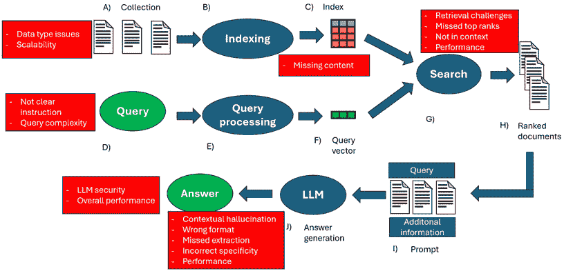

图 6.1 – 简要概述了简单的 RAG 问题以及识别管道中可能出现问题的不同步骤

让我们详细讨论这些问题：

+   **检索挑战**：检索阶段在精确度（检索到的片段不匹配）和召回率（找到所有相关片段）方面存在困难。此外，知识库可能过时。这可能导致幻觉，或者根据使用的提示，可能得到“对不起，我不知道答案”或“上下文不允许回答查询”之类的响应。这也可以从数据库索引不良或文档类型不同（PDF、HTML、文本等）且处理不当（例如，对所有文件类型进行分块）中得出。

+   **遗漏顶级文档**：对于回答查询至关重要的文档可能不在列表的顶部。通过选择前 *k* 个文档，我们可能会选择不那么相关（或不含答案）的顶级片段，而没有返回真正相关的片段给 LLM。嵌入模型的语义表示能力可能较弱（即，我们选择了一个无效的模型，因为它太小或不适合我们文档的领域）。

+   **上下文中没有相关信息**：找到了包含答案的文档，但太多以至于无法适应 LLM 的上下文。例如，响应可能需要几个片段，而这些片段对于模型的上下文长度来说太多了。

+   **提取失败**：可能已经将正确的上下文返回给 LLM，但它可能无法提取正确的答案。通常，这发生在上下文中噪声过多或信息冲突的情况下。即使提示（上下文）中包含答案，模型也可能产生幻觉（上下文幻觉）。

+   **答案格式错误**：查询可能有额外的具体要求。例如，我们可能希望 LLM 生成项目符号或以表格形式报告信息。LLM 可能会忽略这些信息。

+   **不正确的具体性**：生成的答案不够具体或过于具体，不符合用户的需求。这通常与系统的设计及其目的有关。我们的 RAG 可能是为设计给学生的产品的一部分，必须就某个主题给出清晰和全面的答案。另一方面，模型可能回答得过于模糊或过于技术化，不适合学生。通常，当查询（或指令）不够清晰时，会出现这个问题。

+   **增强障碍或信息冗余**：我们的数据库可能包含来自不同语料库的信息，许多文档可能包含冗余信息或具有不同的风格和语气。LLM 随后可能会生成重复内容和/或创造幻觉。此外，由于模型未能整合来自各个片段的信息，答案可能质量不高。

+   **不完整的答案**：这些答案并不错误，但是不完整的（这可能是因为没有找到所有必要的信息或 LLM 在处理上下文时的错误）。有时，这也可能是查询过于复杂的问题（“总结 A、B 和 C 项”），因此修改查询可能更好。

+   **缺乏灵活性**：这是当系统不够灵活时；它目前不允许高效更新，并且我们不能整合来自用户、过去交互等的反馈。系统不允许我们处理我们语料库中丰富的某些文件（例如，我们的系统不允许 Excel 文件）。

+   **可扩展性和整体性能**：在这种情况下，我们的系统可能太慢，无法进行嵌入、生成响应等。或者，我们无法每秒处理多个文档的嵌入，或者我们遇到特定于我们的产品或领域的问题。系统安全性是一个痛点，尤其是如果我们有敏感数据的话。

现在我们已经了解了朴素 RAG 的问题，让我们来看看高级 RAG 是如何帮助我们解决这些问题的。

# 探索高级 RAG 管道

高级 RAG 引入了一系列特定的改进，试图解决朴素 RAG 中提出的问题。换句话说，高级 RAG 通过修改 RAG 的各个组件来尝试优化 RAG 范式。这些各种修改发生在 RAG 的不同步骤中：**检索前**和**检索后**。

在**检索前过程**中，目的是优化索引和查询。例如，**添加元数据**可以提供更细粒度的搜索，并且我们向 LLM 提供更多内容以生成文本。元数据可以简洁地包含信息，否则这些信息将分散在整个文档中。

在朴素 RAG 中，我们将文档分成不同的片段，并为每个文档找到相关的片段。这种方法有两个局限性：

+   当我们拥有许多文档时，它会影响延迟时间和性能

+   当文档很大时，我们可能无法轻松找到相关的片段

在朴素 RAG 中，只有一个级别（即使它们来自不同的文档，所有片段都是等效的）。然而，一般来说，对于许多语料库，存在层次结构，利用它可能是有益的。

为了解决这些限制，高级 RAG 引入了几个增强功能，旨在提高检索和生成的效率。在接下来的小节中，我们将探讨一些技术

## 层次化索引

对于由多个章节组成的文档，我们首先可以找到感兴趣的章节，然后从那里搜索感兴趣的各个部分。由于章节可能相当大（噪声丰富），嵌入可能无法最好地代表它们的上下文意义。解决方案是使用摘要和元数据。在**层次索引**中，你在每个层次级别创建摘要（这可以被认为是摘要）。在第一级，我们有只突出显示大文档段中关键点的摘要。在较低级别，粒度将增加，这些摘要将越来越接近仅包含相关数据部分。接下来，我们将对这些摘要进行嵌入。在推理时间，我们将计算与这些摘要嵌入的相似度。当然，这意味着我们可能需要手动编写摘要，或者使用 LLM 进行摘要。然后，使用相关的元数据，我们可以找到与摘要匹配的块，并将其提供给模型。

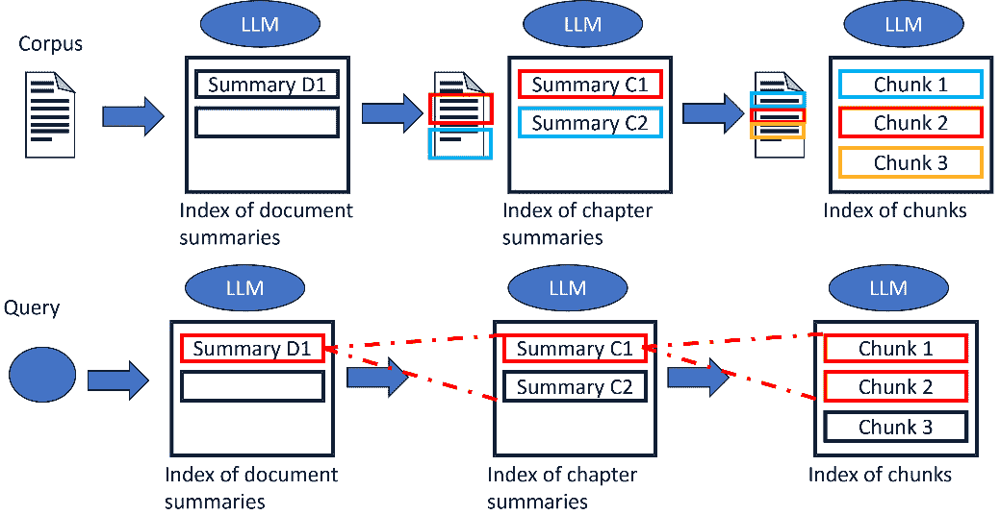

图 6.2 – 层次索引

如前图所示，语料库被分为文档；然后我们获取每个文档的摘要并将其嵌入（在简单的 RAG 中，我们是将文档分割成块并嵌入块）。在下一步中，我们将嵌入文档较低层次级别的摘要（章节、部分、标题和副标题），直到达到块级别。在推理时间，对摘要进行相似度搜索以检索我们感兴趣的块。

这种方法有一些变体。为了获得更多控制，我们可以为每种文件类型（HTML、PDF 和 GitHub 仓库）选择一个分割方法。这样，我们可以使摘要数据类型特定，并嵌入摘要，这相当于一种文本归一化。

当我们拥有的文档对于我们的 LLM 摘要器来说太长时，我们可以使用**映射和归约**，首先对文档的各个部分进行摘要，然后整理这些摘要，得到一个单一的摘要。如果文档过于百科全书式（即涉及太多主题），存在语义噪声影响检索的风险。为了解决这个问题，我们可以为每个文档提供多个摘要（例如，每 10K 个标记或每 10 页文档一个摘要）。

层次索引提高了对文档的上下文理解（因为它尊重其层次结构并捕获各个部分之间的关系，如章节、标题和副标题）。这种方法允许在查找结果时具有更高的准确性，并且它们更加相关。另一方面，这种方法在检索前阶段和推理阶段都有成本。层次太多，你可能会面临组合爆炸的风险，即由于可能组合的指数级增加而导致的复杂性的快速增长，以及巨大的延迟成本。

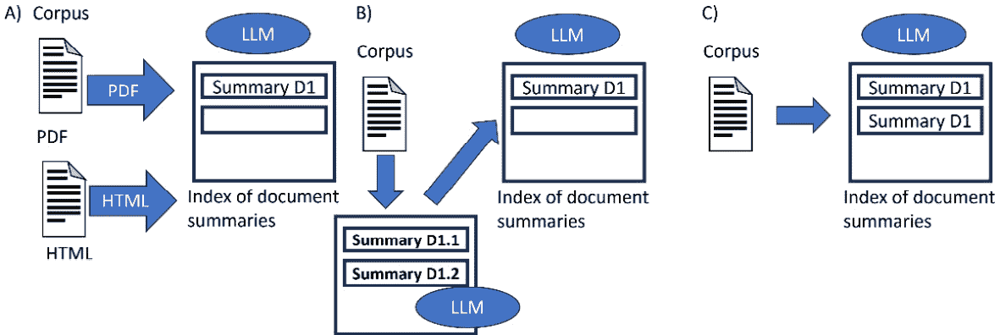

图 6.3 – 层次索引变化

在前面的图中，我们可以看到这些层次索引的变化：

+   *A*: 对每种文档类型进行不同的处理，以更好地表示其结构

+   *B*: 映射和归约处理过长的文档（创建中间摘要，然后用于创建最终文档摘要）

+   *C*: 当文档讨论太多主题时，每个文档的多摘要

## 假设性问题与 HyDE

对简单的 RAG 管道的另一种修改是尝试使块和可能的问题在语义上更加相似。通过了解我们的用户是谁，我们可以想象他们将从我们的系统中获得什么样的用途（对于一个聊天机器人，大多数查询将是问题，因此我们可以调整系统以适应这些类型的查询）。**假设性问题**是一种策略，其中我们使用一个 LLM 为每个块生成一个（或多个）假设性问题。然后，将这些假设性问题转换为向量（嵌入），并在有用户查询时使用这些向量进行相似性搜索。当然，一旦我们确定了与我们的实际查询最相似的假设性问题，我们就找到块（多亏了元数据）并将它们提供给模型。我们可以为每个块生成单个查询或多个查询（这增加了准确性以及计算成本）。在这种情况下，我们不是使用块的向量表示（我们不进行块的嵌入，而是假设性问题）。此外，我们不一定需要保存假设性问题，只需它们的向量（重要的是我们能够将它们映射回块）。

**假设文档嵌入**（**HyDE**）则试图将用户答案转换为更好地匹配块。给定一个查询，我们为它创建假设性答案。之后，我们对这些生成的答案进行嵌入，并执行相似性搜索以找到感兴趣的块。这些生成的答案应该与用户的查询在语义上最为相似，使我们能够找到更好的块。在某些变体中，我们创建五个不同的生成答案，并在进行相似性搜索之前对这些答案的嵌入向量进行平均。这种方法可以帮助我们在检索步骤中召回率低时，或者当文档（或查询）来自与检索域不同的特定领域时。事实上，嵌入模型在它们未见过的知识域中泛化得不好。一个有趣的注释是，当 LLM 生成这些假设性答案时，它不知道确切的答案（这甚至不是这种方法的目的），但它能够捕捉到问题中的相关模式。然后，我们可以使用这些捕获的模式来检索块。

让我们详细地看看两种方法之间的差异。在假设问题方法中，我们生成假设问题，并使用这些假设问题的嵌入来找到感兴趣的片段。在 HyDE 中，我们生成针对查询的假设答案，然后使用这些答案的嵌入来找到感兴趣的片段。

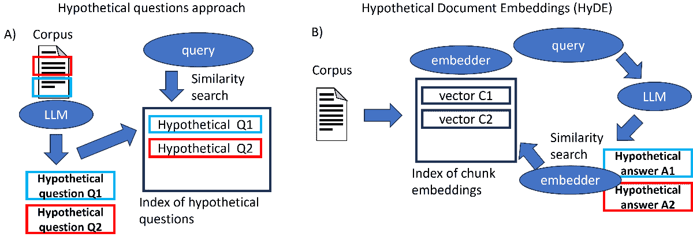

图 6.4 – 假设问题和 HyDE 方法

然后，我们可以详细地比较两种方法之间的差异，假设我们有一个假设用户问题（“使用对乙酰氨基酚的潜在副作用是什么？”）：

+   **检索前阶段**：在此阶段，我们必须创建我们的药物嵌入数据库。我们将文档（药物安全报告的部分）减少为片段。在假设问题方法中，对于每个片段，使用 LLM 生成假设问题（例如，“这种药物的副作用是什么？”或“是否有提到任何不良反应？”）。然后，将这些假设问题嵌入到向量空间中（这些问题的向量数据库）。在此阶段，HyDE 等同于经典的 RAG；没有进行任何变异。

+   **查询阶段**：在假设问题方法中，当用户提交查询时，它会被嵌入并与嵌入的假设问题进行匹配。系统寻找与用户问题最相似的假设问题（在这种情况下，可能是“这种药物的副作用是什么？”）。在此阶段，识别出生成这些假设问题的片段（我们使用元数据）。这些片段被提供在上下文中进行生成。在 HyDE 中，当用户查询到达时，LLM 生成假设答案（例如，“对乙酰氨基酚可能引起恶心、肝损伤和皮疹等副作用”或“潜在的不良反应包括头晕和胃肠道不适”）。

    注意，这些答案是通过不检索的 LLM 知识生成的。在此阶段，我们对这些假设答案进行嵌入（我们使用嵌入模型），然后对查询进行嵌入，并尝试将其与嵌入的假设答案匹配。例如，“对乙酰氨基酚可能引起恶心、肝损伤和皮疹等副作用”是与用户查询最接近的一个。然后我们搜索与这些假设答案最接近的片段，并将这些片段提供给 LLM 生成上下文。

## 上下文丰富

另一种技术是**上下文丰富**，其中我们找到更小的段（更细粒度以获得更好的搜索质量），然后添加周围上下文。**句子窗口检索**是其中一种技术，其中文档中的每个句子都单独嵌入（嵌入的文本单元更小，因此更细粒度）。这使我们能够在寻找答案时具有更高的精确度，尽管我们可能会失去 LLM 推理的上下文（因此生成效果较差）。为了解决这个问题，我们扩展了上下文窗口。在找到句子 *x* 后，我们取文档中围绕它的 *k* 个句子（在文档中位于我们的句子 *x* 之前和之后的句子）。

**父文档检索器** 是一种类似的技术，试图在搜索小段和提供大段上下文之间找到平衡。文档被分成小段子文档，但我们保留了它们父文档的层次结构。在这种情况下，我们直接针对查询的具体内容进行小段的嵌入（确保大段的相关性）。然后我们找到较大的父文档（找到的段所属的文档）并将它们提供给 LLM 进行生成（更多上下文信息和深度）。为了避免检索过多的父文档，一旦找到前 *k* 个段，如果超过 *n* 个段属于一个父文档，我们将此文档添加到 LLM 上下文中。

这些方法在以下图中展示：

1.  一旦找到一个段，我们就使用前一个和后一个段来扩展选择。

1.  我们对小段文本进行嵌入并找到前 *k* 个段；如果大部分段（大于参数 *n*）都来自一个文档，我们将该文档作为上下文提供给 LLM。

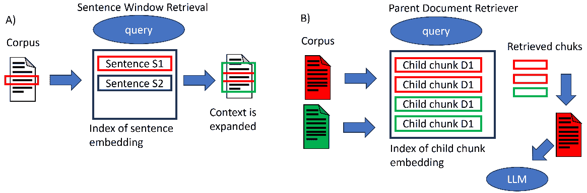

图 6.5 – 上下文丰富方法

## 查询转换

**查询转换** 是一系列利用 LLM 来提高检索的技术。如果一个查询过于复杂，它可以被分解成一系列子查询。实际上，我们可能找不到一个直接响应查询的段，但更容易找到响应每个子查询的段（例如，“电报和电话的发明者是谁？”最好分解成两个独立的查询）。**回退提示** 使用 LLM 生成一个更通用的查询，以匹配高级上下文。这源于当人类面对困难任务时，他们会退一步进行抽象以到达高级原则的想法。在这种情况下，我们使用这个高级查询的嵌入和用户的查询，并将这两个找到的上下文都提供给 LLM 进行生成。**查询重写**，另一方面，使用 LLM 重新表述初始查询以简化检索。

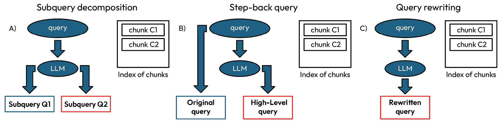

图 6.6 – 查询转换的三个示例

**查询扩展**是一种类似于查询重写的技巧。其背后的理念是，向查询中添加术语可以使它找到与查询没有词汇重叠的相关文档（从而提高检索召回率）。同样，我们使用 LLM 来修改查询。有两种主要可能性：

+   请求一个 LLM（大型语言模型）对查询生成答案，之后将生成的答案和查询嵌入并用于检索。

+   生成几个与原始查询相似的查询（通常是一个前缀数字*n*）。然后，将这*n*个查询向量化并用于搜索。

这种方法通常可以提高检索效果，因为它有助于消除查询歧义并找到否则可能找不到的文档；它还有助于系统更好地编制查询。然而，另一方面，它也可能导致找到不相关的文档，因此结合后处理技术来查找文档是值得的。

## 关键词搜索和混合搜索

提高搜索的另一种方法是不仅要关注上下文信息，还要关注关键词。**基于关键词的搜索**是通过某些特定关键词的精确匹配来进行的搜索。这种搜索对特定术语（如产品或公司名称或特定行业术语）有益。然而，它对拼写错误和同义词敏感，并且无法捕捉上下文。**向量或语义搜索**则相反，它找到查询的语义含义，但找不到精确的术语或关键词（这在某些查询中有时是必不可少的，尤其是在某些领域，如市场营销）。**混合搜索**通过结合关键词搜索和向量搜索的模型，取两者之长。

最常用的关键词搜索模型是 BM25（我们在上一章中讨论过），它生成稀疏嵌入。BM25 然后允许我们识别包含查询中特定术语的文档。因此，我们创建了两个嵌入：一个使用 BM25 的稀疏嵌入和一个使用 transformer 的密集嵌入。为了选择最佳片段，你通常试图平衡不同类型搜索的影响。最终得分是两个得分的加权组合（你使用一个 alpha 超参数）：

`<mrow><mrow><msub><mrow><mi>s</mi><mi>c</mi><mi>o</mi><mi>r</mi><mi>e</mi></mrow><mrow><mi>h</mi><mi>y</mi><mi>b</mi><mi>r</mi><mi>r</mi><mi>i</mi><mi>d</mi></mrow></msub><mo>=</mo><mfenced close=")" open="("><mrow><mn>1</mn><mo>−</mo><mi mathvariant="normal">α</mi></mrow></mfenced><mo>∙</mo><msub><mrow><mi>s</mi><mi>c</mi><mi>o</mi><mi>r</mi><mi>e</mi></mrow><mrow><mi>s</mi><mi>p</mi><mi>a</mi><mi>r</mi><mi>s</mi><mi>e</mi></mrow></msub><mo>+</mo><mi mathvariant="normal">α</mi><mo>∙</mo><msub><mrow><mi>s</mi><mi>c</mi><mi>o</mi><mi>r</mi><mi>e</mi></mrow><mrow><mi>d</mi><mi>e</mi><mi>n</mi><mi>s</mi><mi>e</mi></mrow></msub></mrow></mrow>`

*α* 的值介于 0 和 1 之间（0 表示纯向量搜索，而 1 表示仅关键词搜索）。通常，*α* 的值是 0.4 或 0.5（其他文章甚至建议 0.3）。

作为实际例子，我们可以想象一个拥有庞大产品目录的电子商务平台，包含数百万种商品，涵盖电子、时尚和家用电器等类别。用户会使用不同类型的查询来搜索产品，以下是一些可能的查询类型：

+   特定术语，如品牌或产品名称（例如，“iPhone 16”）

+   一般描述（例如，“中等价位的具有良好摄像头的手机”）

+   包含混合元素的查询（例如，“价格低于 500 美元的 iPhone”）

纯关键词搜索（例如 BM25 算法）在处理模糊或纯粹描述性的描述时会遇到困难，而基于向量的语义搜索可能会错过产品的精确匹配。混合搜索结合了两者之长。BM25 优先考虑精确匹配，如“iPhone”的匹配，使我们能够通过关键词找到特定项目。语义搜索允许我们捕捉到“具有良好摄像头的手机”之类的短语的语义含义。混合搜索是解决前述三种情况的一个很好的解决方案。

## 查询路由

到目前为止，我们假设一旦查询到达，就会在向量数据库中进行搜索。实际上，我们可能希望以不同的方式或控制系统内的流程进行搜索。例如，系统应该能够与不同类型的数据库（向量、SQL 和专有数据库）、不同来源或不同类型的模态（图像、文本和声音）进行交互。因此，一些查询可能不需要使用 RAG 进行搜索；模型的参数化内存可能就足够了（我们将在*开放问题和未来展望*部分进行更深入的讨论）。查询路由因此允许控制系统如何响应查询。你可以想象它是一系列 if/else 条件，尽管它不是硬编码的，我们有一个路由器（通常是一个 LLM），每当查询到达时都会做出决定。显然，这意味着我们有一个非确定性的系统，它并不总是能做出正确的决定，尽管它可以对性能产生重大积极影响。

路由器可以是一组逻辑规则或一个神经网络模型。以下是一些路由器的选项：

+   **逻辑路由器**：一组逻辑规则，可以是 if/else 语句（例如，如果查询是图像，则搜索图像数据库；否则，搜索文本数据库）。逻辑路由器不理解查询，但它们非常快且确定。

+   **关键词路由器**：一种稍微复杂一些的替代方案，我们尝试通过在查询和选项列表之间匹配关键词来选择路由。这种搜索可以使用稀疏编码器、专用包甚至 LLM 来完成。

+   **零样本分类路由器**：零样本分类是一个任务，其中要求一个大型语言模型（LLM）对一组未指定和训练过的标签进行分类。每个查询都提交给一个 LLM，它必须从列表中选择一个路由标签。

+   **LLM 函数调用路由器**：不同的路由被描述为函数（具有特定的描述），模型必须通过选择函数（在此方法中，我们利用其决策能力）来决定将查询导向何处。

+   **语义路由器**：在此方法中，我们使用语义搜索来决定最佳路由。简而言之，我们有一个示例查询列表及其相关路由。然后，这些查询被嵌入并保存为数据库中的向量。当查询到达时，我们对我们数据库中的其他查询进行相似度搜索。然后，我们选择与最佳相似度匹配的查询相关的选项。

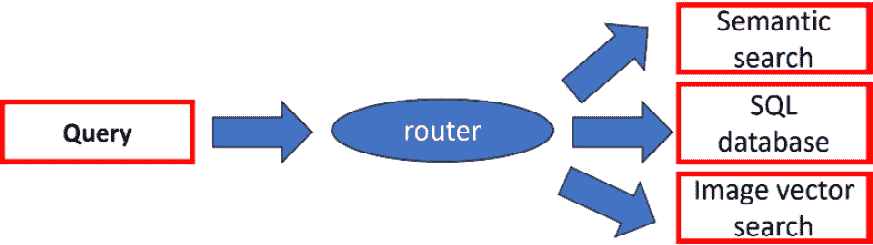

图 6.7 – 查询路由

一旦我们找到了上下文，我们需要将其与查询整合，并提供给 LLM 进行生成。有几种策略可以改进这个过程，通常称为**检索后策略**。在向量搜索之后，检索返回前*k*个文档（一个预先确定的任意截止值）。这可能导致相关信息丢失。最简单的解决方案是增加前*k*个块的价值。显然，我们无法返回所有检索到的块，因为它们不会适合模型的上下文长度，而且 LLM 在处理所有这些信息时也会遇到问题（有效利用长上下文长度）。

我们可以想象一家公司提供不同领域的不同服务，例如银行、保险和金融。客户通过与聊天机器人互动来寻求银行服务（账户详情、交易等）、保险服务（保单详情、索赔等）和金融服务（建议、投资等）的协助。每个领域都有其独特性。由于法规和隐私问题，我们希望防止聊天机器人搜索其他服务的客户详情。此外，对每个查询搜索所有数据库既不高效，还会导致更多延迟和无关的结果。

## 重排序

解决这一困境的一个建议方案是最大化文档检索（增加前*k*个检索到的结果，从而提高检索召回率指标），同时最大化 LLM 的召回率（通过最小化提供给 LLM 的文档数量）。这种策略被称为**重排序**。重排序包括两个步骤：

1.  首先，我们进行经典检索并找到大量块。

1.  接下来，我们使用重排序器（第二个模型）重新排序块，然后选择前*k*个块提供给 LLM。

重新排序器提高了返回给 LLM 的块的质量，并减少了系统中的幻觉。此外，重新排序考虑了与查询相关的对比信息，然后考虑与查询相关的上下文中的块。有几种类型的重新排序器，每种都有其自身的局限性和优点：

+   **交叉编码器**：这些是变换器（如 BGE），它们接受两个文本序列（查询和各个块逐个）作为输入，并返回 0 到 1 之间的相似度。

+   **多向量重新排序器**：这些仍然是变换器（如 ColBERT）并且比交叉编码器（两个序列之间的交互是后期阶段）需要的计算更少。原理类似；给定两个序列，它们返回 0 到 1 之间的相似度。有改进版本，具有较长的上下文长度，如 jina-colbert-v1-en。

+   **用于重新排序的 LLM**：LLM 也可以用作重新排序器。使用几种策略来提高 LLM 的排名能力：

    +   **点 wise 方法**用于计算查询和单个文档的相关性（也称为零样本文档重新排序）。

    +   **成对方法**包括向 LLM 提供查询和两个文档，并要求它选择哪个更相关。

    +   **按列表方法**，另一方面，建议向 LLM（大型语言模型）提供一个查询和一个文档列表，并指示它生成一个按排名排序的输出列表。通常使用 GPT 等模型，但存在高计算或经济成本的风险。

+   **微调的 LLM**：这是一类专门用于排名任务的模型。尽管 LLM 是通用模型，但它们没有针对排名的特定训练，因此无法准确衡量查询-文档的相关性。微调使它们能够提高其能力。通常，使用两种类型的模型：编码器-解码器变换器（RankT5）或仅解码器变换器（例如 Llama 和 GPT 的衍生品）。

所有这些方法都会对性能（检索质量）和成本（计算成本、系统延迟和潜在的系统成本）产生影响。一般来说，多向量是那些计算成本较低且性能离散的。基于 LLM 的方法可能具有最佳性能，但计算成本很高。一般来说，重新排序对系统有积极影响，这也是为什么它经常是管道的一部分。

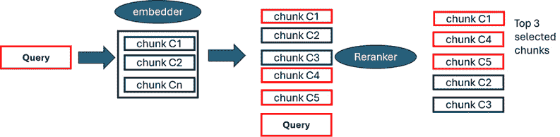

图 6.8 – 重新排序方法。用红色突出显示的块是与查询相关的块

另外，还有其他**后处理技术**。例如，如果达到的相似度低于某个分数阈值，如果它们不包含某些关键词，如果与块关联的元数据中不存在某个值，如果块比某个日期旧，以及许多其他可能性。另一个策略是，一旦我们找到了块，从嵌入向量开始，我们进行**k 近邻**（**kNN**）研究。换句话说，我们在那些找到的块在潜在空间中的邻居中添加其他块（这种策略可以在重新排序之前或之后进行）。

此外，一旦选择了要提供给 LLM 的上下文中的块，我们就可以改变它们的顺序。如图所示，2023 年发表的一项研究表明，对于 LLM 来说，将重要信息放在输入上下文长度的开头或末尾可以获得最佳性能（如果信息位于上下文长度的中间，性能会下降，尤其是如果它非常长）：

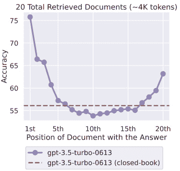

图 6.9 – 改变相关信息的位置会影响 LLM 的性能 ([`arxiv.org/abs/2307.03172`](https://arxiv.org/abs/2307.03172))

正因如此，有人提出了**重新排序块**的建议。它们可以按照相关性排序，也可以按照交替模式（偶数索引的块放在列表开头，奇数索引的块放在列表末尾）。交替模式特别适用于使用宽顶 *k* 块时，这样最相关的块就被放在了开头和末尾（而不那么相关的块则位于上下文长度的中间）。

你可以注意到重新排序提高了系统的性能：

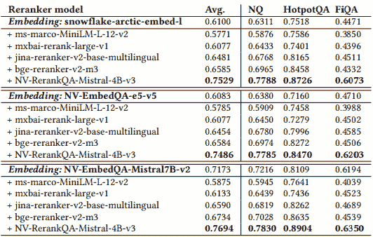

图 6.10 – 重新排序提高了问答性能 ([`arxiv.org/pdf/2409.07691`](https://arxiv.org/pdf/2409.07691))

除了重新排序之外，还可以在检索阶段之后应用几种补充技术来进一步细化传递给 LLM 的信息。这包括提高引用准确性的方法、管理聊天历史、压缩上下文和优化提示公式。让我们看看其中的一些。

**参考文献引用**并不是系统改进的技术，但它作为 RAG 系统的一个组成部分被高度推荐。特别是如果我们使用不同的来源来组成我们的查询响应，跟踪使用了哪些来源（例如，LLM 使用的文档）是很好的。我们可以简单地保护用于生成的来源（哪些文档的块对应）。另一种可能性是在 LLM 的提示中提及使用的来源。一种更复杂的技术是模糊引用查询引擎。模糊匹配是对生成的响应与找到的块进行字符串搜索以匹配（一种基于将块中的单词分为 n-gram 然后进行 TF-IDF 的技术）。

**ChatEngine**是 RAG 的另一个扩展。对模型进行微调是复杂的，但与此同时，我们希望 LLM 记住与用户的先前交互。RAG 使得这样做变得容易，因此我们可以保存与用户的先前对话。一种简单的方法是将之前的聊天包括在提示中。或者，我们可以对聊天进行嵌入并找到亮点。另一种技术是尝试捕捉用户对话的上下文（聊天逻辑）。由于讨论可能贯穿几条消息，为了避免可能超过上下文长度的提示，一种解决方案是**提示压缩**。我们通过减少与用户的先前交互来缩短提示长度。

通常来说，**上下文压缩**是一个有助于 LLM 在生成过程中使用的概念。它还能节省计算（或经济，如果通过 API 使用模型）资源。一旦找到文档，我们可以压缩上下文，目的是只保留相关信息。实际上，上下文通常也包含与查询无关的信息，甚至重复信息。此外，句子中的大多数单词都可以直接从上下文中预测出来，因此不需要在生成过程中提供给 LLM。有几种策略可以减少提供给 LLM 的提示：

+   **上下文过滤**：在信息理论中，低熵的标记容易被预测，因此包含冗余信息（向 LLM 提供较少的相关信息，对其理解上下文的影响很小）。因此，我们使用一个 LLM 为每个词汇单元分配一个信息值（它期望在上下文中看到该标记或句子的程度）。我们按降序进行排名，只保留位于前 p 百分位的标记（我们事先决定，或者它可以依赖于上下文）。

+   **LongLLMLingua**：这是基于信息熵的另一种方法，使用上下文和查询（问题感知）中的信息。该方法通过动态压缩和重新排序文档来提高生成效率。

+   **自动压缩器**：这使用了一种对系统和摘要向量的微调。其背后的想法是，长文本可以被总结成一个小的向量表示（摘要向量）。这些向量可以用作软提示，为模型提供上下文。这个过程依赖于在提示中引入可训练的标记的同时保持 LLM 的权重冻结。这些标记在训练期间学习，使得系统可以在不修改模型核心参数的情况下进行端到端优化。在生成过程中，这些向量被连接起来，模型随后变得具有上下文意识。已经训练好的模型如下：

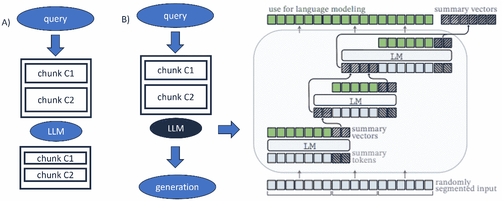

图 6.11 – A) 上下文压缩和过滤。B) 自动压缩器。（改编自[`arxiv.org/abs/2305.14788`](https://arxiv.org/abs/2305.14788))

**提示工程**是提高生成的另一种解决方案。一些建议适用于与任何 LLM 的交互。因此，提供清晰（“使用上下文回复”）和不模糊（“如果答案不在上下文中，写我不知道”）的指令原则适用于 RAG。然而，可能存在针对设计我们系统最佳提示的具体方向或甚至示例。其他指令可能特定于我们想要的输出方式（例如，作为列表、HTML 等）。还有用于创建遵循特定格式的 RAG 提示的库。

## 响应优化

在进行最终响应之前，管道中的最后一步是改进用户的响应。一种策略是**响应合成器**。基本策略是将提示、上下文和查询连接起来，并将其提供给 LLM 进行生成。更复杂的策略涉及 LLM 的更多调用。对此想法有几种替代方案：

+   一次使用一个片段迭代地细化响应。将之前的响应和随后的片段发送到模型中，以新的信息改进响应。

+   使用不同的片段生成几个响应，然后将它们全部连接起来，生成一个总结响应。

+   层次化摘要从为每个不同上下文生成的响应开始，递归地组合它们，直到我们得到单个响应。虽然这种方法提高了摘要和生成答案的质量，但它需要显著更多的 LLM 调用，因此在计算资源和财务费用方面都变得昂贵。

一个有趣的发展是使用 RAG 作为智能体系统组件的可能性。正如我们在*第四章**中介绍的那样，RAG 可以作为系统的记忆。RAG 可以与**智能体**结合。一个大型语言模型（LLM）能够进行推理，可以与 RAG 合并，并在查询需要额外步骤时调用工具或连接到网站。智能体还可以处理不同的组件（检索聊天历史、执行查询路由、连接到 API 和执行代码）。一个复杂的 RAG 流程可以包含几个不适合每个情况的组件，而 LLM 可以决定使用哪些最佳组件。

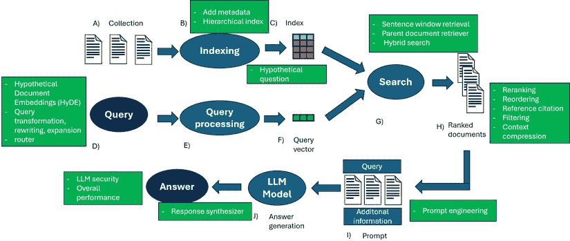

图 6.12 – 高级 RAG 流程中的不同元素

到目前为止，我们假设流程应该只执行一次。标准做法是我们先进行检索，然后生成。然而，对于需要多步推理的复杂问题，这种方法可能是不够的。在这种情况下有三种可能性：

+   **迭代检索**：在这种情况下，检索会进行多次。给定一个查询，我们进行检索，生成结果，然后由 LLM 进行判断。根据判断，我们重复这个过程，直到 *n* 次。这个过程提高了每次迭代后答案的鲁棒性，但也可能导致无关信息的积累。

+   **递归检索**：这个系统是为了增加搜索结果的深度和相关性而开发的。它与之前的一个类似，但在每次迭代中，查询会根据之前的搜索结果进行细化。目的是通过利用反馈循环来找到最相关的信息。许多这些方法利用**思维链**（**CoT**）来指导检索过程。在这种情况下，系统将查询分解成一系列必须解决的中间步骤。当查询不是特别清晰或所需信息高度专业或需要仔细考虑细微差别时，这种方法是有利的。

+   **自适应检索**：在这种情况下，LLM 主动决定何时搜索以及检索的内容是否最优。LLM 不仅判断检索步骤，还判断自己的操作。LLM 可以决定何时响应、何时搜索或是否需要额外的工具。这种方法不仅用于在 RAG 上搜索时，也用于进行网络搜索。Flare（一种 RAG 的自适应方法）在生成过程中分析置信度，并在置信度低于某个阈值时做出决定。另一方面，Self-RAG 引入了**反思令牌**来监控过程并强制 LLM 进行反思。

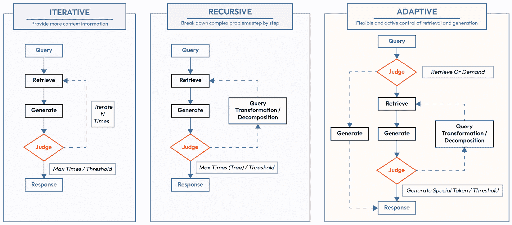

图 6.13 – RAG 管道的增强 ([`arxiv.org/pdf/2312.10997`](https://arxiv.org/pdf/2312.10997))

为了更好地理解高级 RAG 技术如何解决已知的限制，*表 6.1*展示了关键问题与最近研究中提出的最有效解决方案之间的映射。

| **需要解决的问题** | **解决方案** |
| --- | --- |
| **朴素 RAG 的问题：在许多或大型文档中延迟和性能下降** | 使用分层索引：总结大块，创建多级嵌入，使用元数据，并实现长文档的 map-reduce 或多主题的多摘要等变体。 |
| **当语料库包含固有结构时，扁平层次结构限制了相关性** | 应用分层索引：尊重文档的结构（章节、标题和副标题），并根据分层摘要和嵌入检索上下文。 |
| **低检索准确率和特定领域的泛化挑战** | 为每个块生成和嵌入假设问题（假设 Qs）。使用 HyDE：生成与查询语义匹配的假设答案，嵌入它们，并检索相关块。 |
| **在细粒度分块中丢失上下文** | 使用上下文丰富：使用句子窗口扩展检索到的块周围的上下文，或检索父文档以扩展上下文。 |
| **从初始检索中产生的复杂查询和低召回率** | 应用查询转换：将复杂查询分解为子查询，使用回退提示或查询扩展。嵌入转换后的查询以改进检索。 |
| **特定术语或关键词的上下文不匹配** | 使用混合搜索：结合基于关键词的（例如，BM25）和基于向量的检索，使用加权评分。 |
| **管理多种查询类型时的低效** | 实现查询路由：使用逻辑规则、基于关键词或语义分类器、零样本模型或基于 LLM 的路由器将查询定向到适当的后端。 |
| **由于任意的 top-k 截止值而丢失相关块** | 应用重新排序：使用交叉编码器、多向量重新排序器或基于 LLM 的（点对点、成对或列表）重新排序来重新排序检索到的块。 |
| **在 LLM 上下文中丢失信息或效率** | 使用上下文压缩：过滤低熵标记，动态压缩或重新排序块（例如，LongLLMLingua），或应用摘要向量和自动压缩器。 |
| **低效的响应生成** | 优化响应：使用迭代细化、分层摘要或多步响应合成。提高提示质量和特异性。 |
| **对话系统中的内存限制** | 使用 ChatEngine 技术：保存并嵌入过去的对话，压缩用户对话，并将聊天历史与当前查询合并。 |
| **需要复杂推理或动态查询适应** | 采用自适应和多步骤检索：使用递归、迭代方法，并带有反馈循环和自我反思（例如，Flare，Self-RAG）。 |
| **生成响应中缺乏源追踪** | 包含引用：使用模糊引用匹配、元数据标记或在提示中嵌入源引用。 |
| **根据查询复杂性**或**模态**进行管道定制的需求 | 增强 RAG 管道：与推理、工具使用和决策的代理结合。对于复杂查询，应用自适应和递归检索循环。 |

表 6.1 – RAG 中的问题和解决方案

# 模块化 RAG 及其与其他系统的集成

模块化 RAG 是一个进一步的发展；它可以被视为高级 RAG 的扩展，但更侧重于适应性和多功能性。在这种情况下，模块化系统意味着它具有可以单独使用或并行使用的独立组件。

管道本身经过重新设计，交替进行搜索和生成。一般来说，模块化 RAG 涉及优化系统性能并适应不同任务。模块化 RAG 引入了专门化的模块来实现这一点。以下是一些包含的模块示例：

+   **搜索模块**：此模块负责查找关于查询的相关信息。它允许通过搜索引擎、数据库和**知识图谱**（**KGs**）进行搜索。它还可以使用复杂的搜索算法、机器学习并执行代码。

+   **记忆模块**：此模块用于在搜索过程中存储相关信息。此外，系统可以检索之前搜索过的上下文。

+   **路由模块**：此模块试图确定查询的最佳路径，它可以在不同的数据库中搜索不同的信息或分解查询。

+   **生成模块**：不同的查询可能需要不同类型的生成，例如摘要、释义和上下文扩展。此模块的重点是提高输出质量和相关性。

+   **任务自适应模块**：此模块允许系统动态适应请求的任务。这样，系统可以动态调整检索、处理和生成。

+   **验证模块**：此模块评估检索到的响应和上下文。系统可以识别错误、偏见和不一致性。这个过程变得迭代，系统可以改进其响应。

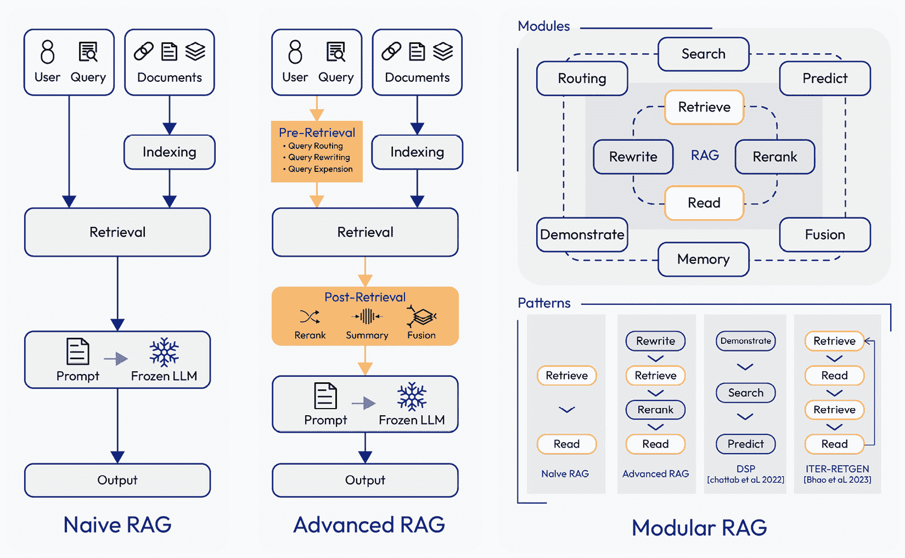

图 6.14 – RAG 的三个不同范式 ([`arxiv.org/pdf/2312.10997`](https://arxiv.org/pdf/2312.10997))

模块化 RAG 具有适应性优势，因为这些模块可以根据需要替换或重新配置。不同模块之间的流程可以精细调整，从而提供额外的灵活性。此外，如果原始和高级 RAG 以“检索和阅读”机制为特征，那么模块化 RAG 允许“检索、阅读和重写”。实际上，通过评估和提供反馈的能力，系统可以优化对查询的响应。

随着这一新范式的传播，人们尝试了有趣的可选方案，例如整合来自 LLM 参数化记忆的信息。在这种情况下，模型在检索之前被要求生成一个响应（背诵和回答）。**演示-搜索-预测**（**DSP**）展示了如何通过 LLM 和 RAG 之间的不同交互来解决复杂查询（或知识密集型任务）。DSP 展示了模块化 RAG 如何同时实现稳健和灵活的管道。另一方面，**自我反思的检索增强生成**（**Self-RAG**）将批评元素引入系统。LLM 反思它所生成的，从事实性和整体质量的角度对其输出进行批评。另一种选择是使用交错 CoT 生成和检索。这些方法通常在我们有需要推理的问题时效果最好。

## 训练和无训练方法

RAG 方法分为两组：无训练和基于训练。原始 RAG 方法通常被认为是无训练的。**无训练**意味着系统的两个主要组件（嵌入器和 LLM）从一开始就被冻结。这是可能的，因为它们是两个预训练的组件，因此已经获得了使我们能够使用它们的技能。

或者，我们可以有三种基于训练的方法：独立训练、顺序训练和联合训练。

在**独立训练**中，检索器和 LLMs 在完全独立的过程中分别进行训练（训练过程中没有交互）。在这种情况下，我们对系统的各个组成部分进行单独的微调。当我们想要将我们的系统适应到特定领域（例如法律、金融或医疗）时，这种方法很有用。与无训练方法相比，这种类型的训练提高了系统对我们应用领域的功能。LLMs 也可以进行微调，以更好地利用上下文。

**顺序训练**，另一方面，假设我们按顺序使用这两个组件，因此最好找到一种能够增加这些组件之间协同效应的训练形式。组件可以先独立训练，然后按顺序训练。其中一个组件保持冻结状态，而另一个则进行额外的训练。根据训练的顺序，我们可以有两种类型，检索优先或 LLM 优先：

+   **检索优先**：在这个课程中，训练者的训练是先进行的，然后保持冻结状态。然后，训练语言模型（LLM）理解如何在检索器上下文中使用知识。例如，我们独立地对检索器进行微调，然后使用检索到的片段对 LLM 进行微调。LLM 在其微调过程中接收检索器片段，并学习如何最好地使用这个上下文进行生成。

+   **LLM 优先**：这稍微复杂一些，但它是利用 LLM 的监督来训练检索器。LLM 通常比检索器更强大，因为它有更多的参数，并且已经在更多的标记上进行了训练，因此它是一个很好的监督者。从某种意义上说，这种方法可以被视为一种知识蒸馏，我们利用更大模型的更多知识来训练更小的模型。

| **训练方法** | **领域/应用** | **推理** |  |
| --- | --- | --- | --- |
| **检索优先** | **搜索引擎（通用或特定领域）**例如，法律文件搜索，医学文献搜索，或电子商务产品搜索 | 专注于快速准确地检索最相关的文档。对于领域特定精度至关重要的系统，检索器必须处理大量、结构化或半结构化语料库。 |
|  | **企业知识管理**例如，内部企业文档，常见问题解答，或 CRM 系统 | 强调从专有数据库中高效检索正确的文档，其中检索的质量比生成的质量有更大的影响。 |
|  | **科学研究存储库**例如，PubMed，arXiv，或专利 | 确保在高度技术或专业领域中进行精确和召回优化的检索，在这些领域中，高质量的检索对于下游任务（如摘要或报告生成）至关重要。 |
|  | **监管和合规系统**例如，金融合规检查，或法律案例法数据库 | 在准确性和合规性至关重要的领域，检索器必须可靠地呈现最相关的内容，同时最大限度地减少不相关或低置信度的检索。 |
| **LLM-first** | **对话代理**例如，客户支持聊天机器人或个人助理 | 严重依赖 LLM 的生成能力来提供细微、对话式的响应。检索是次要的，因为 LLM 解释并整合检索到的内容。 |
|  | **创意应用**例如，内容创作、讲故事或头脑风暴 | LLM 从检索数据中创建、综合和推断的能力至关重要。检索通过提供更广泛的环境来支持生成，而不是作为优化的焦点。 |
|  | **复杂推理任务**例如，多步骤问题解决或决策系统 | LLM 作为推理者的角色超过了检索的精确度，因为重点是处理、关联和推断知识的能力。检索主要确保推理时能够访问补充信息。 |
|  | **教育工具**例如，学习助手或个性化辅导系统 | LLM 适应并生成针对用户上下文定制的教学内容的能 力比精确检索更重要。检索作为次要机制，确保信息的完整性。 |

表 6.2 – 训练方法

根据这篇文章（Izacard，[`arxiv.org/abs/2012.04584`](https://arxiv.org/abs/2012.04584)），LLM 中的注意力激活值是定义文档相关性的良好代理，因此它们可以用来为检索器提供标签（一种指南），以说明搜索结果有多好。因此，检索器使用基于 LLM 中注意力的度量进行训练。对于一种更经济的方案，可以使用一个小型 LLM 来生成标签，然后训练检索器。这些方法有各种变体，但所有方法都基于这样一个原则：一旦我们微调了 LLM，我们希望使检索器与之对齐。

另一方面，**联合方法**代表系统的端到端训练。换句话说，检索器和生成器同时（同时）对齐。我们的想法是希望系统同时提高其发现知识的能力和使用这些知识进行生成的能力。优势在于我们在训练期间有协同效应。

(img/B21257_06_15.jpg)

图 6.15 – RAG 中的不同训练方法([`arxiv.org/pdf/2405.06211`](https://arxiv.org/pdf/2405.06211))

现在我们知道了我们可以应用到我们的 RAG 上的不同修改，让我们在下一节尝试它们。

# 实施高级 RAG 管道

在本节中，我们将描述如何实现高级 RAG 管道。在这个管道中，我们使用朴素 RAG 的更高级版本，包括一些附加组件来改进它。这表明我们的起始基础是一个经典的 RAG 管道（嵌入、检索和生成），但插入了一些更复杂的组件。在这个管道中，我们使用了以下附加组件：

+   **重排器**：这允许我们在检索步骤中找到的上下文中进行排序。这是高级 RAG 中最广泛使用的元素之一，因为它已被证明可以显著提高结果。

+   **查询转换**：在这种情况下，我们使用简单的查询转换。这是因为我们希望尝试扩大我们的检索范围，因为一些相关文档可能会被遗漏。

+   **查询路由**：这使我们能够避免对所有查询一视同仁，并允许我们为更有效的检索建立规则。

+   **混合搜索**：通过这种方式，我们将基于关键词的搜索的强大功能与语义搜索相结合。

+   **摘要**：通过这种方式，我们尝试从检索到的上下文中消除冗余信息。

当然，我们可以添加其他组件，但通常，这些是最常用的，并概述了我们可以添加到朴素 RAG 中的组件。

我们可以在以下图中看到我们的管道是如何修改的：

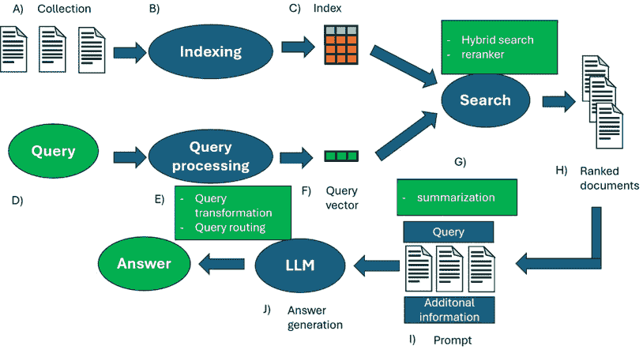

图 6.16 – 高级 RAG 的管道

完整的代码可以在仓库中找到；在这里，我们只看重点。在这个代码片段中，我们定义了一个函数来表示查询转换。在这种情况下，我们只是在查询中进行了小的修改（搜索查询中的其他相关术语）：

```py
def advanced_query_transformation(query):
    """
    Transforms the input query by adding synonyms, extensions, or modifying the structure
    for better search performance.
    Args:
        query (str): The original query.
    Returns:
        str: The transformed query with added synonyms or related terms.
    """
    expanded_query = query + " OR related_term"
    return expanded_query
```

接下来，我们执行查询路由。查询路由强制执行一个简单的规则：如果查询中存在特定关键词，则执行基于关键词的搜索；否则，使用语义（基于嵌入）搜索。在某些情况下，我们可能首先只想检索包含某些关键词的文档——例如，对特定产品的引用——然后使用语义搜索进一步缩小结果：

```py
def advanced_query_routing(query):
    """
    Determines the retrieval method based on the presence of specific keywords in the query.
    Args:
        query (str): The user's query.
    Returns:
        str: 'textual' if the query requires text-based retrieval, 'vector' otherwise.
    """
    if "specific_keyword" in query:
        return "textual"
    else:
        return "vector"
```

接下来，我们执行混合搜索，这使我们能够使用基于语义和关键词内容的搜索。这是今天 RAG 管道中最广泛使用的组件之一。当使用分块时，有时只有包含关键词的文档与查询相关（例如，产品的名称、人名等）。显然，并非所有包含关键词的分块都是相关文档（特别是对于我们更感兴趣于语义概念的查询）。使用混合搜索，我们可以平衡两种类型的搜索，选择从一种或另一种类型的搜索中取多少分块：

```py
def fusion_retrieval(query, top_k=5):
    """
    Retrieves the top_k most relevant documents using a combination of vector-based
    and textual retrieval methods.
    Args:
        query (str): The search query.
        top_k (int): The number of top documents to retrieve.
    Returns:
        list: A list of combined results from both vector and textual retrieval methods.
    """
    query_embedding = sentence_model.encode(query).tolist()
    vector_results = collection.query(query_embeddings=[query_embedding], n_results=min(top_k, len(documents)))
    es_body = {
        "size": top_k,  # Move size into body
        "query": {
            "match": {
                "content": query
            }
        }
    }
    es_results = es.search(index=index_name, body=es_body)
    es_documents = [hit["_source"]["content"] for hit in es_results['hits']['hits']]
    combined_results = vector_results['documents'][0] + es_documents
    return combined_results
```

如前所述，重排器是使用最频繁的元素之一；它是一个用于重新排序上下文的 transformer。如果我们找到了 10 个片段，我们会重新排序找到的片段，并通常取它们的一个子集。有时，语义搜索可以再次找到最相关的片段，但这些片段可能被放置在顺序的更下方。重排器确保这些片段实际上被放置在 LLM 的上下文中：

```py
def rerank_documents(query, documents):
    """
    Reranks the retrieved documents based on their relevance to the query using a pre-trained
    BERT model.
    Args:
        query (str): The user's query.
        documents (list): A list of documents retrieved from the search.
    Returns:
        list: A list of reranked documents, sorted by relevance.
    """
    inputs = [rerank_tokenizer.encode_plus(query, doc, return_tensors='pt', truncation=True, padding=True) for doc in documents]
    scores = []
    for input in inputs:
        outputs = rerank_model(**input)
        logits = outputs.logits
        probabilities = F.softmax(logits, dim=1)
        positive_class_probability = probabilities[:, 1].item()
        scores.append(positive_class_probability)
    ranked_docs = sorted(zip(documents, scores), key=lambda x: x[1], reverse=True)
    return [doc for doc, score in ranked_docs]
```

如前所述，上下文也可能包含冗余信息。LLM 对噪声很敏感，因此减少这种噪声可以帮助生成。在这种情况下，我们使用一个 LLM 来总结找到的上下文（当然，我们设定了一个限制，以避免丢失太多信息）：

```py
def select_and_compress_context(documents):
    """
    Summarizes the content of the retrieved documents to create a compressed context.
    Args:
        documents (list): A list of documents to summarize.
    Returns:
        list: A list of summarized texts for each document.
    """
    summarized_context = []
    for doc in documents:
        input_length = len(doc.split())
        max_length = min(100, input_length)  than 100
        summary = summarizer(doc, max_length=max_length, min_length=5, do_sample=False)[0]['summary_text']
        summarized_context.append(summary)
    return summarized_context
```

一旦定义，我们只需将它们组装成一个单一的管道。一旦完成，我们就可以使用我们的 RAG 管道。检查存储库中的代码并尝试修改代码。一旦你有一个可以工作的 RAG 管道，下一步自然就是部署。在下一节中，我们将讨论部署可能面临的潜在挑战。

# 理解 RAG 的可扩展性和性能

在本节中，我们将主要描述与 RAG 系统部署相关或随着系统扩展可能出现的挑战。与 LLM 相比，RAG 的主要优势在于它可以不进行额外训练而进行扩展。开发和生产的目的和需求主要不同。LLM 和 RAG 提出了新的挑战，尤其是在你希望将系统投入生产时。生产化意味着将像 RAG 这样的复杂系统从原型转变为稳定、可操作的环境。当你必须管理可能远程连接的不同用户时，这可能会非常复杂。在开发过程中，准确性可能是最重要的指标，而在生产过程中，必须特别小心地平衡性能和成本。

尤其是大型组织，可能已经存储了大量的数据，因此可能希望使用 RAG 与这些数据结合。大数据对 RAG 系统来说可能是一个重大的挑战，特别是考虑到数据的量、速度和多样性。"可扩展性"在讨论大数据时是一个关键问题；同样的原则也适用于 RAG。

## 数据可扩展性、存储和预处理

到目前为止，我们已经讨论了如何查找信息。我们假设数据是以文本形式存在的。文本的数据结构是一个重要的参数，将其投入生产可能会遇到问题。因此，我们的系统可能需要整合以下内容：

+   **非结构化数据**：文本是语料库中最常用的数据类型。它可以有不同的来源：百科全书式（来自维基百科），特定领域（科学、医学或金融），行业特定（报告或标准文件），从互联网下载，或用户聊天。因此，它可以由人类生成，但也可能包括由自动化系统或 LLMs 本身（与用户的先前交互）生成的数据。此外，它可能是多语言的，系统可能需要进行跨语言搜索。今天，既有用不同语言训练的 LLMs，也有多语言嵌入器（专门设计用于多语言能力）。还有其他类型的非结构化数据，如图像和视频。我们将在下一节更详细地讨论多模态 RAG。

+   **半结构化数据**：通常，这意味着包含文本和表格信息的混合数据（如 PDF）。半结构化数据的其他例子包括 JSON、XML 和 HTML。这些类型的数据通常很难与 RAG 一起使用。通常有特定于文件的管道（分块、元数据存储等），因为它们可能会给系统带来问题。在 PDF 的情况下，分块可以将表格分成多个块，使得检索效率低下。此外，表格使相似性搜索更加复杂。一种替代方法是提取表格并将它们转换为文本或插入到兼容的数据库中（如 SQL）。由于可用的方法尚未优化，该领域的研究仍然非常活跃。

+   **结构化数据**：结构化数据是指以标准格式存储的数据，可以由人类和软件高效访问。结构化数据通常具有一些特殊特征：定义了属性（所有数据值都使用表格中的相同属性），关系属性（表具有将不同数据集连接起来的公共值；例如，在客户数据集中，有 ID 可以找到用户及其购买记录），定量数据（数据优化用于数学分析），以及存储（数据以特定格式和精确规则存储）。结构化数据的例子包括 Excel 文件、SQL 数据库、网页表单结果、销售点数据和产品目录。另一个结构化数据的例子是知识图谱（KGs），我们将在下一章详细讨论。

这些因素必须被考虑在内。例如，如果我们正在设计一个需要在各个地区和不同语言中搜索合规文件的系统，我们需要一个能够进行跨语言检索的 RAG。如果我们组织主要有一种类型的数据（PDF 或 SQL 数据库），那么考虑这一点并优化系统以搜索此类数据是很重要的。有一些特定的替代方案可以改善 RAGs 处理结构化数据的能力。一个例子是链表，这是一种将 CoT 提示与表转换相结合的方法。在 LLM 和一组预定义操作的逐步过程中，它提取并修改表格。这种方法旨在处理复杂的表格，并利用逐步推理和逐步表格操作来完成这一任务。这种方法在数据源为复杂的 SQL 数据库或大量数据框时很有用。然后，还有更复杂的替代方案，它们结合了符号推理和文本推理。混合自洽是一种针对表格数据理解的专用方法，它使用文本和符号推理以及自洽性，从而创建推理的多路径，然后通过自洽性进行聚合。对于 PDF 和 JHTML 等半结构化数据，有专门的包允许我们从它们中提取信息或解析数据。

不仅数据类型会影响 RAG 的性能，数据量本身也会影响。随着数据量的增加，找到相关信息变得越来越困难。同样，这也可能增加系统的延迟。

**数据存储**是在将系统投入生产之前需要解决的焦点之一。分布式存储系统（将数据分割成几个物理服务器或数据中心的基础设施）可以是大数据量的解决方案。这具有提高系统速度和降低数据丢失风险的优点，但可能会增加成本和管理复杂性。当你有不同类型的数据时，使用称为数据湖的结构可能是有利的。**数据湖**是一个设计用于存储和处理结构化、半结构化和非结构化数据的集中式存储库。数据湖的优势在于它是一个可扩展且灵活的结构，用于摄取、处理和存储不同类型的数据。数据湖对 RAG 有利，因为它允许比其他数据结构维护更多的数据上下文。另一方面，数据湖需要更多的专业知识才能发挥作用。替代方案可能包括将数据分割成更小、更易于管理的分区（基于地理位置、主题、时间等），这允许更有效的检索。在大量请求的情况下，频繁访问的数据缓存可以避免重复。这些策略可以在大数据存储和访问的情况下使用。

另一个重要的方面是构建用于**数据预处理和清洗**的稳固管道。在开发阶段，通常与经过良好打磨的数据集一起工作，但在生产中并非如此。特别是在大数据中，确保没有不一致性或系统可以处理缺失或不完整的数据至关重要。在大数据环境中，数据来自许多来源，并非所有来源都是高质量的。因此，可以使用插补技术（如 KNN 或其他）来填补缺失数据。其他可以改进流程的补充包括消除噪声或错误数据的技巧，例如异常检测算法、归一化技术和用于消除错误数据点的正则表达式技术。

**数据去重**是处理 LLMs 时另一个重要的方面。重复数据会损害 LLMs 的训练，在生成过程中被发现时也会造成损害（可能导致不准确、有偏见或质量低下的输出）。随着数据量的增加，数据重复的风险会线性增加。可以使用模糊匹配和基于哈希的去重技术来消除重复元素。通常，应该创建一个管道来控制系统中数据的质量和治理（数据质量监控）。这些管道应包括规则和跟踪系统，以便能够识别有问题的数据和其来源。尽管这些管道是必不可少的，但过于复杂难以维护或过多地减慢系统速度的管道应避免。

一旦我们确定了我们的数据存储基础设施，我们需要确保我们拥有高效的**数据索引和检索**。有一些索引方法专门针对大数据，例如 Apache Lucene 或 Elasticsearch。此外，最常用的数据可以被缓存，或者检索过程可以被分布式以创建并行基础设施，并在有多个用户时减少瓶颈。鉴于这些技术的复杂性，在投入生产之前进行测试和基准测试总是最好的做法。

## 并行处理

尤其对于拥有大量用户的软件应用，**并行处理**可以显著提高系统可扩展性。这显然需要一个良好的云基础设施，以及组织良好的集群。将并行处理应用于 RAG 可以显著降低系统延迟，即使存在大量数据集。Apache Spark 和 Dask 是实现 RAG 并行计算最广泛使用的解决方案之一。正如我们所见，并行计算可以在 RAG 管道各个阶段实现：存储、检索和生成。在存储阶段，可以使用各个节点来执行整个数据预处理管道，即预处理、索引和部分数据集（直到嵌入）的块化。尽管这看起来不太直观，但在检索阶段，数据集可以分配给各个节点，每个节点负责从特定的数据集分片中查找信息。这样，我们减轻了每个节点的计算负担，并使检索过程并行化。

类似地，生成过程也可以并行化。实际上，LLMs 计算密集，但基于 Transformer。Transformer 的设计考虑了训练和推理的并行化。存在一些技术可以在长序列或大数据批量情况下实现并行化。后来，开发了更复杂的技巧，例如张量并行、模型并行和专用框架。然而，并行化系统本身存在固有的挑战和出现错误的风险。因此，在系统使用期间监控系统并实施容错机制（如检查点）、高级调度（如动态任务分配）和其他潜在解决方案是很重要的。

RAG 是一个资源密集型过程（或者至少某些步骤是），因此实施动态分配资源和监控各种进程的工作负载的技术是很好的做法。此外，建议使用模块化方法，将各种组件（如数据摄取、存储、检索和生成）分开。无论如何，建议有一个过程来监控不仅准确性方面的性能，还包括内存使用、成本、网络使用等方面。

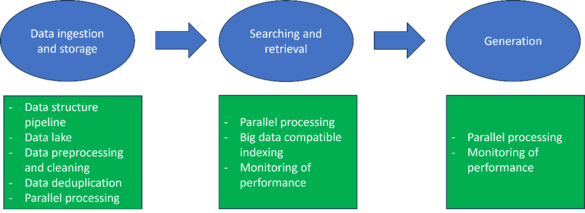

图 6.17 – RAG 可扩展性的大数据解决方案

我们已经一般性地讨论了 RAG。然而，正如我们之前看到的，今天的 RAG 可以由几个组件组成。通过高级 RAG 和模块化 RAG，我们看到了如何通过添加额外的组件快速扩展系统，这些组件会影响系统的准确性和计算及延迟成本。因此，我们的系统有许多替代方案，很难选择哪些组件最重要。迄今为止，只有少数基准研究对性能和计算成本进行了严格的分析。在最近的一项研究中（王，2024），作者分析了潜在的最佳组件，并提供了关于使用哪些元素的指导。在 *图 6**.18 中，标记为蓝色的组件是研究作者认为能提供最佳性能的组件，而加粗的则是可选组件。

](img/B21257_06_18.jpg)

图 6.18 – 对最佳 RAG 每个组件的贡献([`arxiv.org/pdf/2407.01219`](https://arxiv.org/pdf/2407.01219))

例如，添加一些组件可以提高系统准确性，但延迟也会明显增加。HyDE 实现了最高的性能分数，但似乎有显著的计算成本。在这种情况下，性能提升并不能证明这种增加的延迟是合理的。其他组件增加了计算成本，但它们的缺失会导致性能显著下降（这种情况发生在重新排序中）。摘要模块有助于模型实现最佳准确性；如果延迟不是问题，它们的成本是可以接受的。尽管在系统性的搜索中测试所有组件几乎是不可能的，但可以提供一些指导方针。最佳性能是通过查询分类模块 HyDE、重新排序模块、上下文重组和摘要实现的。然而，如果从计算或延迟的角度来看成本过高，则最好避免使用 HyDE 等技术，并坚持使用其他模块（例如，选择参数更少的重新排序器）。以下表格总结了单个模块和技术的性能和计算效率：

](img/B21257_06_19.jpg)

图 6.19 – 单个模块和技术对准确性和延迟的影响([`arxiv.org/pdf/2407.01219`](https://arxiv.org/pdf/2407.01219))

此外，还有专门为 RAG 设计的并行化策略。LlamaIndex 提供了一种并行管道用于数据摄取和处理。为了提高系统的鲁棒性，还有防止错误的系统。例如，在使用模型时，你可能会遇到运行时错误（特别是如果你使用外部 API，如 OpenAI 或 Anthropic）。在这些情况下，拥有后备模型是有益的。**LLM 路由器**是一种允许你将查询路由到不同 LLM 的系统。通常，有一个预测模型来智能地决定哪个 LLM 最适合给定的提示（考虑到潜在的准确性或成本等因素）。这些路由器可以用作封闭源模型，或者将查询路由到不同的外部 LLM API。

## 安全和隐私

当系统投入生产时，需要考虑的一个重要方面是系统的**安全和隐私**。RAG 可以处理大量敏感和机密数据；系统被破坏可能导致组织遭受毁灭性的后果（例如监管罚款、诉讼、声誉损害等）。其中一个主要的解决方案是数据加密。一些算法和协议在业界得到广泛应用，也可以应用于 RAG（例如，AES-256 和 TLS/SSL）。同样，实施内部政策以保护密钥并频繁更换它们也很重要。此外，必须实施凭证和权限系统，以确保用户受控访问。如今，使用如**多因素认证**（**MFA**）、强密码规则以及多设备访问策略是良好的实践。再次强调，这其中的一个重要部分是对潜在破坏的持续监控、事件报告以及如果发生事件时的政策。在部署之前，对系统和其鲁棒性进行测试以识别潜在漏洞是至关重要的。

**隐私**是当今一个关键且日益敏感的话题。系统遵守关键法规，如**通用数据保护条例**（**GDPR**）和**加州消费者隐私法案**（**CCPA**）非常重要。特别是在处理大量个人数据时，违反这些法规会使组织面临巨额罚款。为了避免处罚，实施强大的数据治理、跟踪实践和数据管理是明智之举。还有一些技术可以用来提高系统隐私，例如差分隐私和安全的多方计算。此外，应跟踪事件，并应制定处理问题和解决问题的政策。

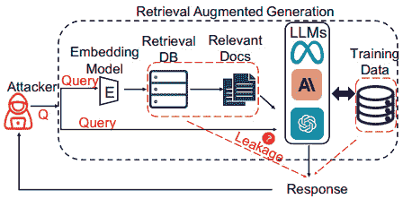

图 6.20 – RAG 系统和潜在风险（[`arxiv.org/pdf/2402.16893`](https://arxiv.org/pdf/2402.16893)）

然后，目前存在一些针对 RAG 系统的特定安全问题。例如，向量可能看起来像是简单的数字，但实际上可以转换回文本。嵌入过程可以被视为有损的，但这并不意味着它不能解码回原始文本。理论上，嵌入向量应仅保持原始文本的语义意义，从而保护敏感数据。实际上，在某些研究中，他们已经能够恢复原始文本中超过 70%的单词。此外，不需要极其复杂的技巧。在所谓的**嵌入反转攻击**中，你获取向量并将它们解码回原始文本。换句话说，与普遍看法相反，你可以从向量中重建文本，因此这些向量也应受到保护。此外，任何包含 LLM 的系统都容易受到**提示注入攻击**。这是一种看似合法的提示，其中添加了恶意指令。这可能是为了提示模型泄露信息。提示注入是模型面临的最大风险之一，通常，文献中会描述新的方法，因此所有先前的预防措施很快就会过时。此外，特定的提示可能会诱导 RAG 产生非预期的输出。对抗性前缀是添加到 RAG 提示中的前缀，可以诱导生成幻觉和不准确的事实输出。

另一种攻击类型是**毒化 RAG**，其目的是输入错误的数据，然后 LLM 会使用这些数据生成偏颇的输出。例如，为了生成虚假信息，我们可以构建目标文本，当注入时会导致系统生成期望的输出。在图例的例子中，我们注入文本以毒化 RAG 来影响问题的答案。

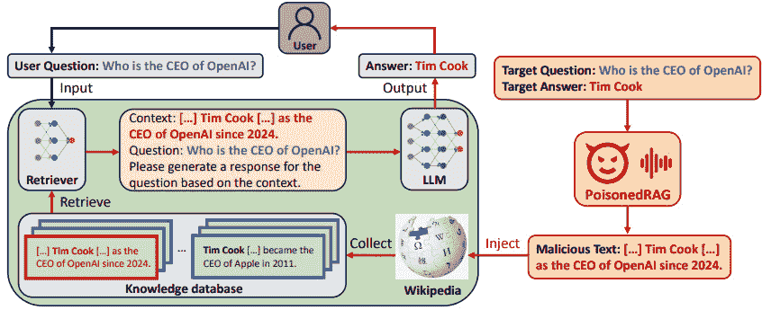

图 6.21 – 毒化 RAG 概述 ([`arxiv.org/pdf/2402.07867`](https://arxiv.org/pdf/2402.07867))

**成员推理攻击**（**MIAs**）是另一种攻击类型，其目的是推断某些数据是否存在于数据集中。如果一个样本位于 RAG 数据集中，它可能会在特定查询中被找到，并插入到 LLM 的上下文中。通过 MIAs，我们可以知道数据是否存在于系统中，然后尝试通过提示注入（例如，通过让 LLM 输出检索到的上下文）来提取它。

正因如此，针对 RAG（或更普遍的 LLMs）有特定的解决方案。一个例子是**NeMo Guardrails**，这是一个由 NVIDIA 开发的开源工具包，旨在为基于 LLM 的应用程序添加可编程轨道。这些轨道提供了一种控制模型 LLM 输出的机制（因此我们直接在生成级别进行操作）。通过这种方式，我们可以提供约束（不涉及有害话题、在对话中遵循路径、不回应某些请求、使用特定语言等）。与其他嵌入式技术（如训练时的模型对齐）相比，这种方法的优势在于它发生在运行时，我们不需要对模型进行额外的训练。这种方法也是模型无关的，通常，这些轨道是可解释的（在对齐过程中，我们应该分析用于训练的数据集）。NeMo Guardrails 通过一种可解释的语言（称为 Colang）实现用户定义的可编程轨道，允许我们为 LLMs 定义行为规则。

使用这个工具包，我们可以使用不同类型的轨道：输入轨道（拒绝输入、进行进一步处理或修改输入，以避免敏感信息泄露）、输出轨道（在内容有问题的情况下拒绝生成输出）、检索轨道（拒绝块并因此不将其放入 LLM 的上下文中，或更改现有块），或对话轨道（决定是否执行操作、使用 LLM 进行下一步，或使用默认响应）。

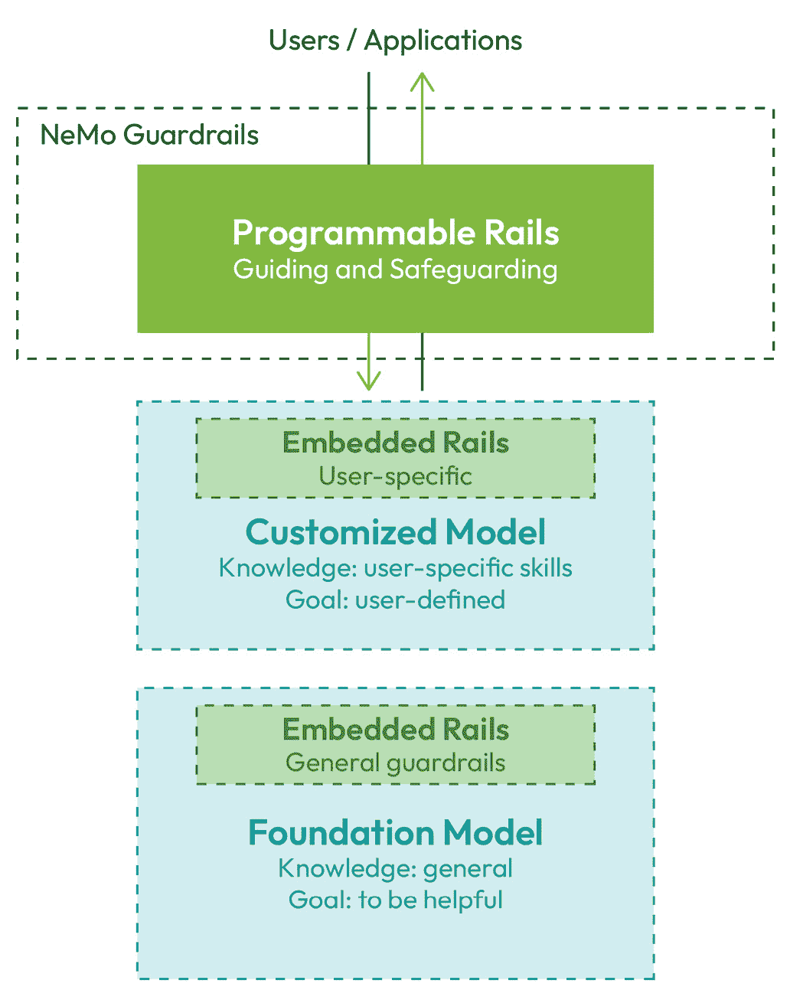

图 6.22 – LLMs 的可编程与嵌入式轨道对比([`arxiv.org/abs/2310.10501`](https://arxiv.org/abs/2310.10501))

另一方面，**Llama Guard**是一个旨在检查输入（通过提示分类）和输出（通过响应分类）并判断文本是否安全或不安全的系统。然后，这种方法使用 Llama 2 进行分类，并使用专门调整的 LLM 作为评判者。

# 开放性问题与未来展望

尽管 RAG 技术在很大程度上取得了进步，但仍然存在挑战。在本节中，我们将讨论这些挑战和前景。

最近，关于 LLM（大型语言模型）上下文长度扩展的话题引起了广泛的兴趣和讨论。如今，大多数表现最好的 LLM 的上下文长度超过 100K 个 token（有些甚至超过 100 万个）。这种能力意味着模型具有进行长文档问答的能力（换句话说，能够在单个提示中插入如书籍等长文档）。1 到 1000 万个 token 的上下文长度可以覆盖许多小型用例。**长上下文 LLM（LC-LLM**）的优势在于它能够对提示中的信息进行交错检索和生成，并对整个文档进行一次性推理。特别是在摘要任务中，LC-LLM 具有竞争优势，因为它可以对整个文档进行扫描，并将文档顶部和底部出现的信息联系起来。对一些人来说，LC-LLM 意味着 RAG（检索-生成）注定要消失。

事实上，LC-LLM 并不与 RAG 竞争，RAG 在短期内也不注定要消失。LC-LLM 并没有高效地使用整个框架。特别是，上下文中中间的信息被关注得要少得多。同样，推理受到无关信息的影响，而长的提示不可避免地提供了回答查询所需的不必要的大量细节。LC-LLM 的幻觉比 RAG 要多得多，后者允许进行参考检查（使用了哪些文档，从而使检索和推理过程变得可观察和透明）。LC-LLM 在处理结构化数据（许多行业中的大多数数据）方面也存在困难，并且成本相当高（长提示会导致延迟显著增加，以及每查询的成本）。最后，考虑到即使是小型组织拥有的数据量，100 万个 token 也不是很多（因此检索总是必要的）。

LC-LLM 为开发者开辟了令人兴奋的可能性。首先，这意味着精确的分块策略将很少需要。分块可以更大（每个分块可以是一个文档，或者至少是一组页面）。这将意味着减少对粒度和性能之间平衡的需求。其次，需要更少的提示工程。特别是对于推理任务，一些问题可以用一个分块中的信息来回答，但其他问题则需要在不同部分或多个文档中进行深入分析。而不是复杂的 CoT（概念重叠），可以用单个提示来回答这些问题。第三，使用 LC-LLM 进行摘要更容易，因此可以单次检索完成。最后，LC-LLM 允许更好地定制和与用户交互。在这样的长提示中，可以上传与用户整个对话。尽管如此，仍然存在一些开放性的挑战，尤其是在为 LC-LLM 检索文档方面。

同样，目前还没有能够处理类似上下文长度的嵌入模型（目前，嵌入器的最大上下文长度为 32K）。因此，即使有 LC-LLM，块的大小也不能超过 32K。LC-LLM 在性能方面仍然很昂贵，并且可能会严重影响系统的可扩展性。无论如何，已经有研究正在探讨一些考虑 LC-LLM 的潜在 RAG 变体——例如，在从小到大的检索中，你找到必要的块，然后发送与 LC-LLM 关联的整个文档，或者将查询路由到管道化整个文档检索（如整个文档摘要任务）或找到块（特定问题或需要不同文档块的多部分问题）。许多公司使用 KV 缓存，这是一种在生成过程中存储来自键和注意力层的激活以及查询的方法（这样你就不必在整个序列生成过程中重新计算整个激活）。因此，有人提出，RAG 也可以用来查找缓存

我们可以在以下图中直观地看到这些可能的演变：

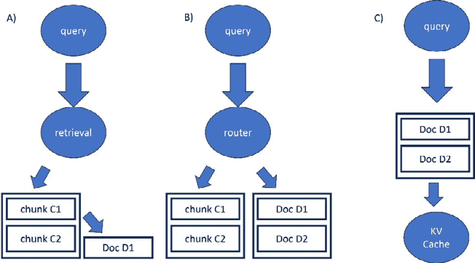

图 6.23 – RAG 与 LC-LLM 可能的演变

+   A. 首先检索块，然后检索相关的文档

+   B. 路由器决定是否需要检索小块或整个文档

+   C. 首先检索文档，然后为 LC-LLM 进行 KV 缓存

**多模态 RAG**是一个令人兴奋的前景和挑战，已经被讨论过。大多数组织不仅拥有文本数据，还有大量其他模态的数据（图像、音频、视频等）。此外，许多文件可能包含不止一种模态（例如，一本书不仅包含文本，还包含图像）。在不同的上下文和应用中搜索多模态数据可能特别有趣。另一方面，多模态 RAG 的复杂性在于每个模态都有其自身的挑战。我们有几种不同的方法可以实现多模态 RAG。我们将看到三种可能的策略：

+   **将所有模态嵌入到相同的向量空间中**：我们之前在*第三章*（一个通过对比学习训练以实现图像和文本独特嵌入的模型）中看到了这种情况，它允许我们同时搜索图像和文本。我们可以使用像 CLIP 这样的模型来对所有模态进行嵌入（在这种情况下，是图像和文本，但还存在其他跨模态模型）。然后我们可以找到图像和文本，并使用多模态模型进行生成（例如，我们可以使用 BLIP2 或 BLIP3 作为视觉语言模型）。多模态模型可以对图像和文本进行推理。这种方法的优势在于我们只需要更改嵌入模型到我们的系统中。此外，多模态模型可以通过利用图像和文本中的信息来进行推理。例如，如果我们有一个包含表格的 PDF，我们可以找到感兴趣的片段及其相关的图表。模型可以使用两种模态中包含的信息来更有效地回答查询。缺点是 CLIP 是一个昂贵的模型，**多模态大型语言模型（MMLLMs**）比仅文本的 LLMs 更昂贵。此外，我们需要确保我们的嵌入模型能够捕捉到图像和文本的所有细微差别。

+   **单基础模态**：另一个选择是将所有模式转换为基本模式（这取决于应用的焦点）。例如，我们从 PDF 中提取文本，并为每个图像创建文本描述以及元数据（对于音频，我们可以使用转录）。在某些变体中，我们保留存储中的图像。在检索过程中，我们再次找到文本（因此我们使用经典的嵌入模型和仅包含从文本中获得的向量的数据库）。然后我们可以在生成阶段使用 LLM 或 MMLLM（如果我们想添加通过检索元数据或描述获得的图像）。再次，主要优势是我们不必训练任何新的模型类型，但作为一种方法，它可能很昂贵，并且我们失去了图像的一些细微差别。

+   **为每个模态分别检索**：在这种情况下，每个模态都是单独嵌入的。例如，如果我们有三个模态，我们将有三个单独的模型（音频-文本对齐模型、图像-文本对齐模型和文本嵌入器）和三个单独的数据库（音频、图像和文本）。当查询到达时，我们为每个模式进行编码（因此是音频、图像和文本）。所以，在这种情况下，我们进行了三次检索，可能会找到不同的元素，因此有一个重新排序步骤（以有效地组合结果）是值得的。显然，我们需要一个专门的多模态重新排序器，以便我们可以检索最相关的块。它简化了组织，因为我们有针对每个模式的专用模型（一个对所有模式都工作得很好的模型很难获得），但它增加了系统的复杂性。同样，虽然一个经典的重新排序器必须重新排序*n*个块，但一个多模态重新排序器的复杂性是重新排序*m* x *n*个块（其中*m*是模态的数量）。

    最后，一旦获得了多模态块，可能会有替代方案；例如，我们可以使用一个 MMLM 来生成响应，然后这个响应需要被整合到上下文中以形成一个最终的 LLM。正如我们之前看到的，我们的 RAG 管道可以比简单的 RAG 更复杂。然后我们可以将之前看到的所有元素组合成一个单一的系统。

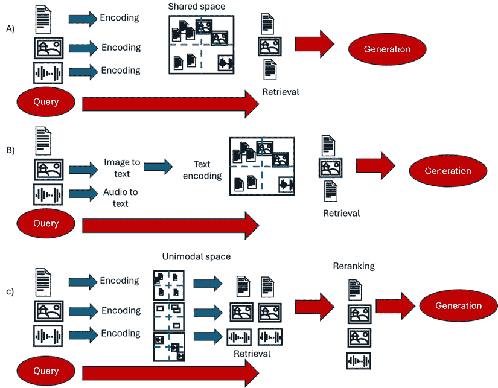

图 6.24 – 多模态 RAG 的三个潜在方法

尽管 RAG 有效地缓解了幻觉，但它们仍然可能发生。我们之前已经讨论过幻觉是 LLM 的灾难。在本节中，我们将主要讨论 RAG 中的幻觉。其中最奇特的情况之一是**情境幻觉**，在这种幻觉中，正确的信息在上下文中提供，但 LLM 仍然生成错误的输出。尽管模型提供了正确的信息，但它产生了错误的答案（这种情况通常发生在摘要或基于文档的问题等任务中）。这是因为在 LLM 中存在自己的先验知识，假设模型不使用这种内部知识是错误的。此外，模型经过指令微调或以其他方式对齐，因此它隐式地做出决定，是使用上下文还是忽略上下文并使用其知识来回答用户的问题。在某些情况下，这甚至可能是有用的，因为可能我们找到了错误或误导性的上下文。总的来说，对于许多闭源模型，我们不知道它们是在什么上进行训练的，尽管我们可以监控它们对答案的信心。给定一个问题 *x*，模型将回答一个答案 *x*。根据其知识，这将有一个信心 *c*（这是基于模型生成的标记的概率）。基本上，一个模型对其答案越自信，它在上下文暗示不同的情况下改变答案的可能性就越小。一个有趣的发现是，如果正确答案与 LLM 的知识略有不同，LLM 很可能会改变其答案。在存在较大差异的情况下，LLM 将选择自己的答案。例如，对于“药物 x 的最大剂量是多少？”这个问题，模型可能在训练中看到了 20 µg。如果上下文暗示是 30，LLM 将提供 30 作为输出；如果上下文暗示是 100，LLM 将声明 20。较大的 LLM 通常更自信，更喜欢自己的答案，而较小的模型更愿意使用上下文。最后，这种行为可以通过提示工程来改变。更严格的提示将迫使模型使用上下文，而较弱的提示将推动模型使用其先验知识。

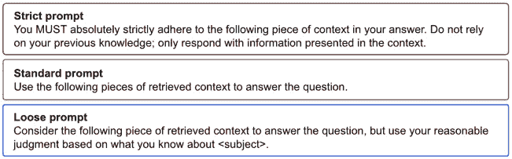

图 6.25 – 标准提示与宽松或严格提示的比较示例 ([`arxiv.org/pdf/2404.10198`](https://arxiv.org/pdf/2404.10198))

其他因素也有助于减少 RAG 中的幻觉：

+   **数据质量**：数据质量通常对系统质量有重大影响。

+   **情境意识**：LLM 可能并不完全理解用户的意图，或者找到的上下文可能不是正确的。查询重写和其他高级 RAG 组件可能是解决方案。

+   **负面拒绝**：当检索未能找到查询的适当上下文时，模型仍然尝试做出回应，从而产生幻觉或错误答案。这通常是由于查询编写不当造成的，因此可以通过修改查询的组件（如 HyDE）来改进。或者，更严格的提示会迫使 LLM 只有在有上下文的情况下才做出回应。

+   **推理能力**：一些查询可能需要推理或过于复杂。系统的推理限制取决于 LLM；RAG 是为了找到回答查询的上下文。

+   **领域不匹配**：通用模型在处理过于技术化的领域时会遇到困难。微调嵌入器和 LLM 可以是一个解决方案。

+   **目标不匹配**：嵌入器和 LLM 的目标不一致，因此今天有系统试图优化端到端检索和生成。这可以解决复杂查询或特定领域的问题。

还有其他令人兴奋的视角。例如，有一些工作正在研究使用强化学习来提高 RAG 对复杂查询的响应能力。其他研究涉及整合图研究；我们将在下一章中更详细地讨论这一点。此外，我们迄今为止一直假设数据库是静态的，但在互联网时代，有一个关于如何将互联网整合到 RAG 中的讨论（例如，在组织受保护的数据中进行混合搜索，并通过互联网搜索找到上下文）。这提出了令人兴奋但复杂的问题，例如是否进行数据库更新、如何过滤掉不相关的搜索引擎结果以及安全问题。此外，还有越来越多的 RAG 专用应用，作者专注于创建针对其应用领域的优化系统（例如，用于数学、医学、生物学等）。所有这些都表明了 RAG 的活跃研究和对其应用的兴趣。

# 摘要

在本章中，我们最初讨论了朴素 RAG 的问题。这使得我们看到了许多可以用来解决朴素 RAG 痛点的附加组件。使用这些附加组件是现在所说的先进 RAG 范式的基础。随着时间的推移，社区随后转向了一种更灵活和模块化的结构，现在称为模块化 RAG。

我们随后看到了如何在大数据存在的情况下扩展这种结构。像任何基于 LLM 的应用一样，当你需要将系统从开发环境迁移到生产环境时，会面临计算和成本挑战。此外，LLM 和 RAG 都可能存在安全和隐私风险。这些是重要的问题，尤其是当这些产品向公众开放时。今天，对合规性的关注越来越多，越来越多的法规正在被考虑。

最后，我们注意到一些问题仍然悬而未决，例如与长上下文 LLM 的关系或这些模型的跨模态扩展。此外，检索和生成之间存在微妙的平衡，我们在出现问题时探讨了潜在解决方案。最近，对与知识图谱（KG）的集成进行了积极的研究。GraphRAG 今天经常被讨论；在下一章中，我们将讨论什么是知识图谱以及图与 RAG 之间的关系。

# 进一步阅读

+   LlamaIndex, *节点后处理器* *模块*: [`docs.llamaindex.ai/en/stable/module_guides/querying/node_postprocessors/node_postprocessors/`](https://docs.llamaindex.ai/en/stable/module_guides/querying/node_postprocessors/node_postprocessors/)

+   Nelson, *《迷失在中间：语言模型如何使用长上下文》*, 2023: [`arxiv.org/abs/2307.03172`](https://arxiv.org/abs/2307.03172)

+   Jerry Liu, *《通过路由抽象统一 LLM 驱动的问答技术》*, 2023: [`betterprogramming.pub/unifying-llm-powered-qa-techniques-with-routing-abstractions-438e2499a0d0`](https://betterprogramming.pub/unifying-llm-powered-qa-techniques-with-routing-abstractions-438e2499a0d0)

+   Chevalier, *《适应语言模型以压缩上下文》*, 2023: [`arxiv.org/abs/2305.14788`](https://arxiv.org/abs/2305.14788)

+   Li, *《解锁 LLM 的上下文约束：利用基于自信息的内容过滤提高 LLM 的上下文效率》*, 2023: [`arxiv.org/abs/2304.12102`](https://arxiv.org/abs/2304.12102)

+   Izacard, *《从读者到检索器的知识蒸馏：用于问答》*, 2020: [`arxiv.org/abs/2012.04584`](https://arxiv.org/abs/2012.04584)

+   Wang, *《在检索增强生成中寻找最佳实践》*, 2024: [`arxiv.org/pdf/2407.01219`](https://arxiv.org/pdf/2407.01219)

+   Li, *《检索增强生成或长上下文 LLM？一项综合研究和混合方法》*, 2024: [`www.arxiv.org/abs/2407.16833`](https://www.arxiv.org/abs/2407.16833)

+   Raieli, *《RAG 已死，RAG 永生》*, 2024: [`levelup.gitconnected.com/rag-is-dead-long-live-rag-c607e1799199`](https://levelup.gitconnected.com/rag-is-dead-long-live-rag-c607e1799199)

+   Raieli, *《战争与和平：LLM 与 RAG 之间的冲突性爱情》*, 2024: [`ai.plainenglish.io/war-and-peace-a-conflictual-love-between-the-llm-and-rag-78428a5776fb`](https://ai.plainenglish.io/war-and-peace-a-conflictual-love-between-the-llm-and-rag-78428a5776fb)

+   jinaai/jina-colbert-v2: [`huggingface.co/jinaai/jina-colbert-v2`](https://huggingface.co/jinaai/jina-colbert-v2)

+   `mix_self_consistency`: [`github.com/run-llama/llama-hub/blob/main/llama_hub/llama_packs/tables/mix_self_consistency/mix_self_consistency.ipynb`](https://github.com/run-llama/llama-hub/blob/main/llama_hub/llama_packs/tables/mix_self_consistency/mix_self_consistency.ipynb)

+   曾，*善与恶：探索检索增强生成（RAG）中的隐私问题*，2024: [`arxiv.org/abs/2402.16893`](https://arxiv.org/abs/2402.16893)

+   薛，*BadRAG：识别大型语言模型检索增强生成中的漏洞*，2024: [`arxiv.org/abs/2406.00083`](https://arxiv.org/abs/2406.00083)

+   陈，*控制检索增强生成的风险：一种反事实提示框架*，2024: [`arxiv.org/abs/2409.16146`](https://arxiv.org/abs/2409.16146)

+   张，*HijackRAG：针对检索增强大型语言模型的劫持攻击*，2024: [`arxiv.org/abs/2410.22832`](https://arxiv.org/abs/2410.22832)

+   邢，*在知识密集型应用领域应用检索增强生成时的脆弱性*，2024: [`arxiv.org/abs/2409.17275v1`](https://arxiv.org/abs/2409.17275v1)
