# 第八章：强化学习与 AI 代理

在*第 5-7 章*中，我们讨论了如何让我们的模型访问外部记忆。这种记忆存储在另一种类型的数据库中（向量或图），通过搜索，我们可以查找回答问题所需的信息。然后，模型将接收到在特定环境中所需的所有信息，然后回答，提供明确和离散的现实世界信息。

然而，正如我们在*第七章*中稍后看到的，LLMs 对现实世界的知识和理解有限（无论是常识推理还是空间关系）。

人类通过探索学习在空间中移动并与环境互动。在这个过程中，我们通过试错学习，人类知道我们不能触摸火或如何找到回家的路。同样，我们通过与他们的互动学习如何与其他人类建立联系。我们与真实世界的互动使我们能够学习并改变我们的环境。环境通过感知为我们提供信息，我们处理并从中学习这些信息，最终用于改变环境。这是一个循环过程，其中我们感知环境的变化并做出反应。

我们不能仅仅通过读书来学习所有这些技能；这是不可能的。因此，与环境互动对于学习某些技能和知识至关重要。没有这一点，我们将发现很难完成某些任务。所以，我们需要一个系统，允许人工智能通过探索与环境互动和学习。**强化学习**（**RL**）是一种范式，它专注于描述智能代理如何在动态环境中采取行动。RL 控制代理的行为，在给定环境中采取哪些行动（以及该环境的状况），以及如何从中学习。

因此，在本章中，我们将讨论 RL。我们将从该主题的一些理论开始。我们将从一个简单的案例开始，其中代理需要理解如何平衡探索与利用，以找到解决问题的获胜策略。一旦定义了基础知识，我们将描述如何使用神经网络作为代理。我们将查看目前用于与环境交互和学习的最流行的一些算法。此外，我们将展示如何使用代理来探索环境（例如训练代理解决视频游戏）。在最后一节中，我们将讨论**大型语言模型**（**LLMs**）与 RL 的交集。

在本章中，我们将讨论以下主题：

+   强化学习简介

+   深度强化学习

+   LLM 与 RL 模型的交互

# 技术要求

大部分代码可以在 CPU 上运行，但最好在 GPU 上运行。当我们讨论如何训练一个代理学习如何玩电子游戏时，这一点尤其正确。代码是用 PyTorch 编写的，大部分使用标准库（PyTorch、OpenAI Gym）。代码可以在 GitHub 上找到：[`github.com/PacktPublishing/Modern-AI-Agents/tree/main/chr8`](https://github.com/PacktPublishing/Modern-AI-Agents/tree/main/chr8)。

# 强化学习简介

在前面的章节中，我们讨论了一个从大量文本中学习的模型。人类——以及越来越多的 AI 代理——通过试错学习得最好。想象一个孩子学习堆叠积木或骑自行车。没有明确的老师指导每一个动作；相反，孩子通过行动、观察结果并调整来学习。这种与环境互动——其中行动导致结果，而这些结果又塑造未来的行为——是我们学习的关键。与被动地从书籍或文本中学习不同，这种学习是有目标的，并且基于经验。为了使机器能够以类似的方式学习，我们需要一种新的方法。这种学习范式被称为强化学习（RL）。

更正式地说，婴儿通过与环境互动，从行为及其效果之间的因果关系中学到东西。孩子的学习不仅仅是探索性的，而是有特定目标的；他们学习必须采取哪些行动才能实现目标。在我们的一生中，我们的学习往往与我们的环境互动以及环境如何对我们的行为做出反应有关。这些概念被视为学习理论和一般智能的基础。

强化学习被定义为机器学习的一个分支，其中系统必须做出决策，以在给定情况下最大化累积奖励。与监督学习（其中模型从标记的例子中学习）或无监督学习（其中模型通过在数据中检测模式来学习）不同，在强化学习中，模型从经验中学习。事实上，系统没有被告知必须执行哪些动作，而是必须探索环境并找出哪些动作可以使它获得奖励。在更复杂的情况下，这些奖励可能不是立即的，而是稍后才会到来（例如，在棋盘上牺牲一个棋子但最终获胜）。因此，在更广泛的意义上，我们可以说强化学习的基本原理是试错和延迟奖励的可能性。

从这个基础上，我们推导出两个重要的概念，这些概念将成为我们讨论强化学习（RL）的基础：

+   **探索与利用**：模型必须利用之前获得的知识来实现其目标。同时，它必须探索环境以便在未来做出更好的选择。在这两个方面之间必须取得平衡，因为解决问题可能不是最明显的路径。因此，模型必须在利用最佳行动（利用）之前测试不同类型的行动（探索）。即使今天，选择最佳平衡仍然是强化学习理论的一个开放挑战。理解这一点的有用方法是想象有人在新的城市尝试不同的餐厅。一开始，他们可能会尝试各种地方（探索）以了解有什么可用的。在发现几个喜欢的餐厅后，他们可能会开始更频繁地去同一个地方（利用）。但如果他们总是坚持去熟悉的地方，他们可能会错过发现更好的餐厅的机会。挑战在于知道何时尝试新事物，何时坚持有效的方法——这仍然是强化学习中的一个开放问题。

+   **在不确定的环境中实现全局目标**：强化学习专注于实现目标，而不需要将问题重新构造成子问题。相反，它解决了一个经典的监督机器学习挑战，这涉及到将复杂问题分解成一般子问题，并制定一个有效的计划。在强化学习的情况下，另一方面，直接定义一个代理必须解决的问题。这并不意味着必须只有一个代理，但可以有多个具有明确目标的代理相互交互。一个相关的例子是学习在新城市高效通勤。一开始，你不会将任务分解成“学习公交时刻表”、“估计步行时间”或“优化天气暴露”这样的子问题。相反，你将目标视为整体：每天按时到达工作地点。通过试错——尝试不同的路线、尝试火车与公交车的对比、调整交通状况——你学会了哪些选项最有效。随着时间的推移，你制定了一个策略，而无需明确标记问题的每个部分。如果你与室友或朋友住在一起，他们也在做同样的事情，你们可能会交换建议或为了最快的路线而竞争，就像强化学习中的多个代理相互作用一样。

强化学习系统中存在几个元素：一个 **代理**，一个 **环境**，一个 **状态**，一个 **策略**，一个 **奖励信号**，和一个 **价值函数**。代理显然是学习者或决策者（与环境交互、做出决策并采取行动的模型）。另一方面，环境是与环境交互的一切。状态代表在特定时间环境的一个特定条件或配置（例如，在移动之前棋盘上棋子的状态）。给定一个状态，代理必须做出选择并选择一个要采取的动作。并非所有空间总是可观察的；我们的代理只能访问状态的局部描述。例如，在一个迷宫中导航的机器人代理只能通过摄像头获取信息，因此只能观察到它面前的东西。从摄像头获得的信息是观察结果，因此模型将只使用状态的一个子集。

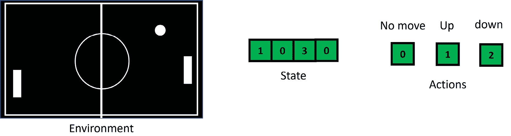

图 8.1 – 强化学习系统中元素的表现

在前面的图中，我们可以看到环境（在这种情况下，游戏屏幕）是如何以向量形式表示的（这就是状态）。此外，三种可能的行为在这个例子中以标量表示。这使我们能够训练一个算法。

**动作**是代理在环境中可以执行的可能决策或移动（棋盘上的棋子只能向特定方向移动：主教只能斜着走，车可以垂直或水平移动，等等）。动作集可以是离散的（迷宫中的移动）但也可以是连续的动作空间（在这种情况下，它将是实值向量）。这些动作是实现特定目标策略的一部分，根据环境的状态和政策。


图 8.2 – 代理与环境交互选择动作

在前面的图中，我们可以看到时间 0 (*t0*) 对应于状态 *t0*；如果我们的代理执行一个动作，这将改变环境。在时间 *t1*，环境将不同，因此我们将拥有不同的状态，*t1*。

**策略**定义了代理在特定时间的行为方式。给定环境的状态和可能的行为，策略将行为映射到系统的状态。策略可以是一组规则、查找表、函数或其他东西。策略也可以是随机的，通过为每个行为指定一个概率。从某种意义上说，策略是强化学习的心脏，因为它决定了代理的行为。在心理学中，这可以定义为一系列刺激-反应规则。例如，一个策略可能是每当有机会时吃掉对手的棋子。更常见的是，策略是参数化的：策略的输出是一个可计算的函数，它依赖于一组参数。最广泛使用的系统之一是神经网络，其参数通过优化算法进行优化。

**奖励**是从环境中接收到的正或负信号。它是一个关键因素，因为它为代理在每个时间步提供了目标。这个奖励被用来定义代理的局部和全局目标。换句话说，在每个时间步，代理从环境中接收一个信号（通常是一个数字），而在长期，代理的目标是优化这个奖励。奖励然后使我们能够确定模型是否表现正确，并使我们能够理解正负事件之间的差异，理解我们与环境的互动以及对于系统状态的适当响应。例如，失去一个棋子可以被视为局部负奖励，而赢得游戏则是全局奖励。奖励通常用于改变策略并对其环境进行校准。

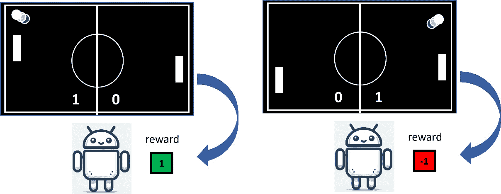

图 8.3 – 正负奖励的示例

然而，奖励虽然告诉我们即时什么是正确的，而**价值函数**则定义了长期的最佳方法。用更技术性的术语来说，状态的价值是一个代理从该状态开始可以期望在未来获得的奖励总量（例如，从该位置开始，代理在游戏中可以收集多少分数）。简单来说，价值函数帮助我们理解如果我们考虑该状态及其后续状态会发生什么，以及未来可能发生什么。然而，奖励和价值之间存在依赖关系；没有前者，我们无法计算后者，尽管我们的真正目标是价值。例如，牺牲一个棋子可能有低奖励，但最终可能是赢得游戏的关键。显然，建立奖励要容易得多，而建立价值函数则很困难，因为我们不仅要考虑当前状态，还要考虑代理所做的所有先前观察。

强化学习的一个经典例子是必须导航迷宫的智能体。状态 *S* 定义了智能体在迷宫中的位置；这个智能体有一个可能的动作集 *A*（向东、西、北或南移动）。策略 *π* 指示智能体在特定状态下必须采取什么动作。奖励 *R* 可以是当智能体选择不允许的动作时的惩罚（例如撞墙），而价值是走出迷宫。在 *图 8**.4* 中，我们展示了智能体与其环境之间的交互：

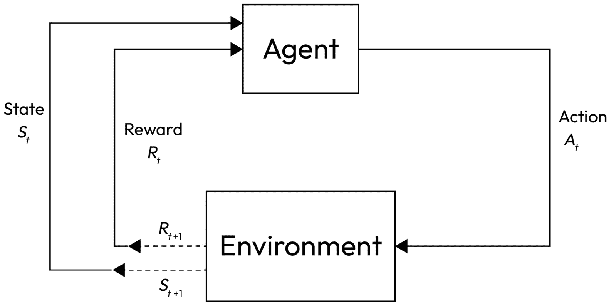

图 8.4 – 强化学习系统概述模型 ([`arxiv.org/pdf/2408.07712`](https://arxiv.org/pdf/2408.07712))

在给定的时间步 (*t*), 智能体观察到环境的当前状态 (*S*t)，根据策略 *π* 选择动作 (*A*t)，并获得奖励 (*R*t)。此时，循环在新状态 (*S*t+1*) 上重复。策略可以是静态的，也可以在每个循环结束时更新。

在下一节中，我们将开始讨论强化学习的初始示例，从经典的多臂老虎机开始。

## 多臂老虎机问题

**k-armed bandit problem** 可能是介绍强化学习最经典的例子。在所有那些模型必须从其动作中学习而不是从正例中接受指导的问题中，都需要强化学习。在 *k*-armed bandit 问题中，我们有一个具有 *n* 个独立臂（带枪）的老虎机，每个带枪都有自己的成功概率分布。每次拉动臂时，我们都有随机概率要么获得奖励要么失败。在每次动作中，我们必须选择拉动哪个杠杆，奖励就是我们获得的。目标是最大化在一定时期内（例如，1,000 个动作或时间步）的期望总奖励。换句话说，我们必须找出哪些杠杆给我们带来最好的回报，并将最大化我们的动作（即，我们将更频繁地拉动它们）。

问题可能看起来很简单，但它远非微不足道。我们的智能体无法访问真正的带枪概率分布，必须通过试错来学习最有利的带枪。此外，尽管这个问题很简单，但它与几个现实世界的案例场景有相似之处：为患者选择最佳治疗方案、A/B 测试、社交媒体影响等等。在每一个时间步 *t*，我们可以选择一个 *A*t 动作并获得相应的奖励 (*R*t)。任意动作 *a* 的价值，定义为 *q**⇤**(a)*，是在时间步 *t* 选择此动作时的期望奖励：

<mml:math display="block"><mml:msub><mml:mrow><mml:mi>q</mml:mi></mml:mrow><mml:mrow><mml:mi>*</mml:mi></mml:mrow></mml:msub><mml:mfenced separators="|"><mml:mrow><mml:mi>a</mml:mi></mml:mrow></mml:mfenced><mml:mo>=</mml:mo><mml:mi mathvariant="double-struck">E</mml:mi><mml:mo>[</mml:mo><mml:msub><mml:mrow><mml:mi>R</mml:mi></mml:mrow><mml:mrow><mml:mi>t</mml:mi></mml:mrow></mml:msub><mml:mo>|</mml:mo><mml:msub><mml:mrow><mml:mi>A</mml:mi></mml:mrow><mml:mrow><mml:mi>t</mml:mi></mml:mrow></mml:msub><mml:mo>=</mml:mo><mml:mi>a</mml:mi><mml:mo>]</mml:mo></mml:math>

如果我们知道每个动作的价值，我们实际上已经解决了这个问题（我们会总是选择价值最高的那个）。然而，我们并不知道动作的价值，但我们可以计算一个估计值，定义为 *Q*t(a)，我们希望它接近 *q*(a)*。在每一步，我们都有估计值 *Q*t(a)，这些值比其他值大；选择这些动作（拉动杠杆）被称为贪婪动作和利用当前知识。相反，选择估计值较低的动作被称为探索（因为它允许我们探索其他动作会发生什么，从而提高我们对这些动作的估计）。

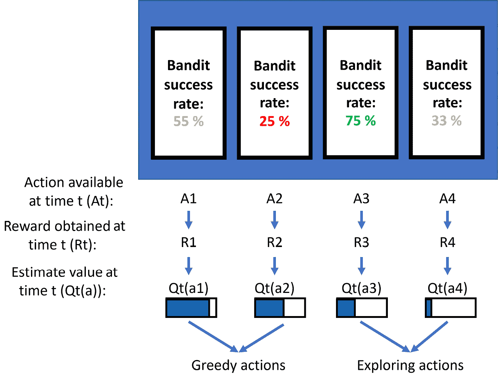

图 8.5 – 多臂老虎机

探索可能会在后续步骤中减少收益，但保证长期收益更大。这是因为我们的估计可能不正确。探索允许我们纠正动作的估计值。特别是在早期步骤中，探索更为重要，以便系统可以了解哪些动作最好。在最后一步，模型应该利用最好的动作。为此，我们需要一个系统，允许我们平衡探索和利用。

为了得到价值的初始估计，我们可以取收到的奖励的平均值：

<mrow><mrow><msub><mi>Q</mi><mi>t</mi></msub><mfenced close=")" open="("><mi>a</mi></mfenced><mo>=</mo><mfrac><mrow><mi>s</mi><mi>u</mi><mi>m</mi><mi>o</mi><mi>f</mi><mi>r</mi><mi>e</mi><mi>w</mi><mi>a</mi><mi>r</mi><mi>d</mi><mi>s</mi><mi>w</mi><mi>h</mi><mi>e</mi><mi>n</mi><mi>t</mi><mi>h</mi><mi>e</mi><mi>a</mi><mi>c</mi><mi>t</mi><mi>i</mi><mi>o</mi><mi>n</mi><mi>a</mi><mi>i</mi><mi>s</mi><mi>t</mi><mi>a</mi><mi>k</mi><mi>e</mi><mi>n</mi><mi>p</mi><mi>r</mi><mi>i</mi><mi>o</mi><mi>r</mi><mi>t</mi><mi>o</mi><mi>t</mi><mi>i</mi><mi>m</mi><mi>e</mi><mi>s</mi><mi>t</mi><mi>e</mi><mi>p</mi><mi>t</mi></mrow><mrow><mi>n</mi><mi>u</mi><mi>m</mi><mi>b</mi><mi>e</mi><mi>r</mi><mi>o</mi><mi>f</mi><mi>t</mi><mi>i</mi><mi>m</mi><mi>e</mi><mi>s</mi><mi>t</mi><mi>h</mi><mi>e</mi><mi>a</mi><mi>c</mi><mi>t</mi><mi>i</mi><mi>o</mi><mi>n</mi><mi>a</mi><mi>i</mi><mi>s</mi><mi>t</mi><mi>a</mi><mi>k</mi><mi>e</mi><mi>n</mi><mi>p</mi><mi>r</mi><mi>i</mi><mi>o</mi><mi>r</mi><mi>t</mi><mi>o</mi><mi>t</mi><mi>i</mi><mi>m</mi><mi>e</mi><mi>s</mi><mi>t</mi><mi>e</mi><mi>p</mi><mi>t</mi></mrow></mrow></mfrac><mo>=</mo><mfrac><mrow><msubsup><mo>∑</mo><mrow><mi>i</mi><mo>=</mo><mn>1</mn></mrow><mrow><mi>t</mi><mo>−</mo><mn>1</mn></mrow></msubsup><mrow><msub><mi>R</mi><mi>i</mi></msub><mo>·</mo><msub><mn>1</mn><mrow><mo>{</mo><msub><mi>A</mi><mi>i</mi></msub><mo>=</mo><mi>a</mi><mo>}</mo></mrow></msub></mrow></mrow><mrow><msubsup><mo>∑</mo><mrow><mi>i</mi><mo>=</mo><mn>1</mn></mrow><mrow><mi>t</mi><mo>−</mo><mn>1</mn></mrow></msubsup><msub><mn>1</mn><mrow><mo>{</mo><msub><mi>A</mi><mi>i</mi></msub><mo>=</mo><mi>a</mi><mo>}</mo></mrow></msub></mrow></mfrac></mrow></mrow>

在这个简单方程中，*1*代表一个变量，表示在时间步长中是否使用了动作（使用时为 1，未使用时为 0）。

<mrow><mrow><msub><mn>1</mn><mrow><mo>{</mo><msub><mi>A</mi><mi>i</mi></msub><mo>=</mo><mi>a</mi><mo>}</mo></mrow></msub><mo>=</mo><mfenced close="" open="{"><mtable columnalign="center" columnwidth="auto" rowalign="baseline baseline" rowspacing="1.0000ex"><mtr><mtd><mrow><mn>1</mn><mi>i</mi><mi>f</mi><mi>a</mi><mi>c</mi><mi>t</mi><mi>i</mi><mi>o</mi><mi>n</mi><mi>a</mi><mi>i</mi><mi>s</mi><mi>t</mi><mi>a</mi><mi>k</mi><mi>e</mi><mi>n</mi><mi>a</mi><mi>t</mi><mi>t</mi><mi>i</mi><mi>m</mi><mi>e</mi><mi>s</mi><mi>t</mi><mi>e</mi><mi>p</mi><mi>i</mi></mrow></mtd></mtr><mtr><mtd><mrow><mn>0</mn><mi>o</mi><mi>t</mi><mi>h</mi><mi>e</mi><mi>r</mi><mi>w</mi><mi>i</mi><mi>s</mi><mi>e</mi></mrow></mtd></mtr></mtable></mfenced></mrow></mrow>

如果动作从未被使用过，分母将为零；为了避免结果为无穷大，我们使用默认值（例如，0）。如果步数趋于无穷大，估计值应收敛到真实值。一旦获得这些估计值，我们就可以选择动作。选择动作最简单的方法是选择最大值（贪婪动作）。`arg max`函数正是如此：

<mrow><mrow><msub><mi>A</mi><mi>t</mi></msub><mo>=</mo><mi>a</mi><mi>r</mi><mi>g</mi><munder><mi>max</mi><mi>a</mi></munder><msub><mi>Q</mi><mi>t</mi></msub><mfenced close=")" open="("><mi>a</mi></mfenced></mrow></mrow>

正如我们之前所说的，我们并不总是想选择贪婪动作，但我们希望模型也能探索其他动作。为此，我们可以引入一个概率 *ε*，这样智能体将以相等的概率从其他动作中选择。简单来说，模型几乎总是选择贪婪动作，但以概率 *ε* 选择其他动作（无论其值如何）。通过增加步骤数，其他动作也将被测试（在无限大时，它们将被测试无限多次），确保 *Q* 收敛到 *q**。同样，选择最佳动作的概率收敛到 *1 - ε*。这种方法被称为 **ε-greedy** 方法，它允许在利用和探索之间进行一些平衡。

举一个简单的例子，我们可以想象一个有 10 个臂的老虎机（*k*=10），其中我们有一个动作值 *q*，我们有一个正态分布来表示每个动作的真实值。在这里，我们绘制了 1,000 个示例：

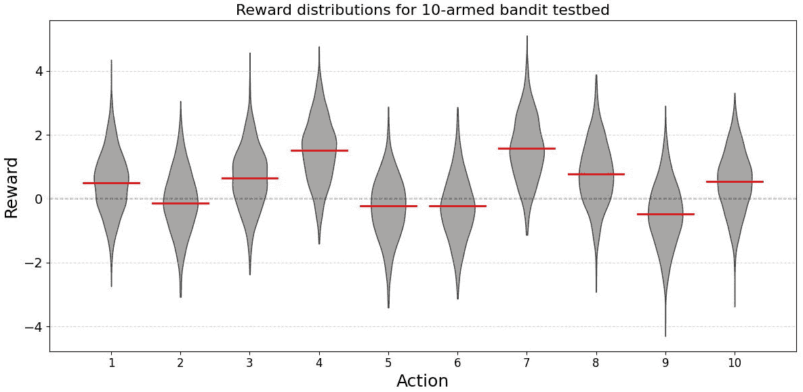

图 8.6 – 动作值分布

在以下示例中，我们比较了不同的 *ε*-贪婪方法。奖励随着智能体经验的增加而增加，然后达到平台期。与允许探索的方法相比，纯贪婪方法次优。同样，选择一个过高的 *ε* 常数（*ε*=0.5）会导致比纯贪婪方法更差的结果。

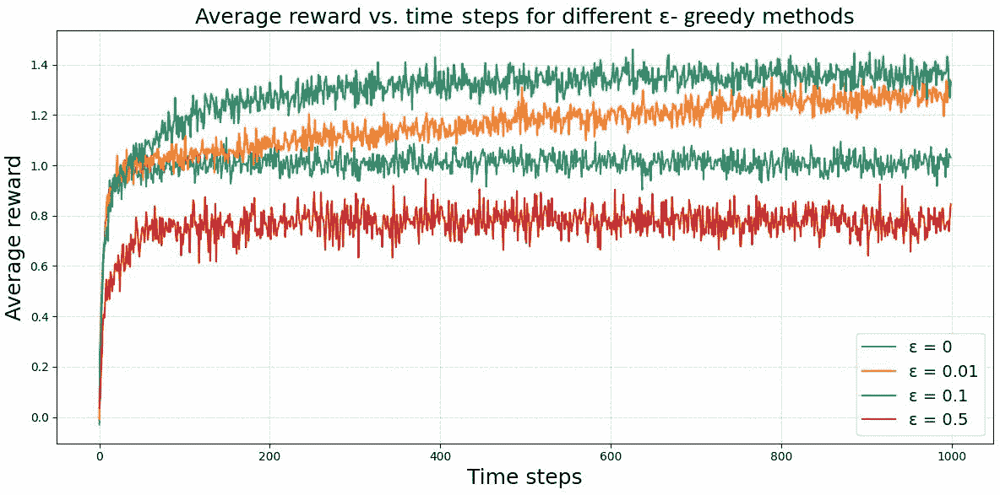

图 8.7 – 不同贪婪方法的时间步平均奖励

为了研究这种现象，我们可以查看智能体的最优选择（*图 8**.8*）。

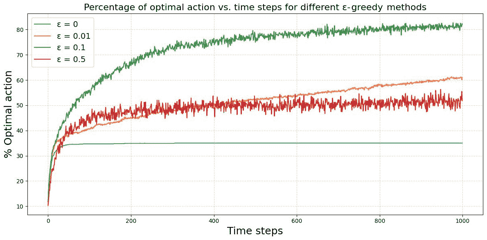

图 8.8 – 不同贪婪方法的时间步最优选择百分比

贪婪方法只有三分之一的时间选择最优选择，而包含一些探索的方法有 80%的时间（ε=0.1）%选择最优选择。这个结果表明，能够探索环境的智能体可以达到更好的结果（可以识别最优动作），而长期贪婪的智能体会选择次优动作。此外，*ε*-贪婪方法比贪婪方法更快地找到最优动作。

在这个例子中，我们探索了简单的方法，其中 *ε* 是常数。在某些变体中，*ε* 随着步骤数的增加而减少，允许智能体在环境被充分探索后从探索转移到利用。ε-greedy 方法在几乎所有情况下都表现最佳，尤其是在存在更大的不确定性（例如，更大的方差）或系统非平稳时。

到目前为止，我们看到的系统在样本数量较多时并不高效。因此，我们不是取观察到的奖励的平均值，而是可以使用一种逐步方法（目前最广泛使用的方法）。对于一个被选择*i*次的动作，奖励将是*R*i*，我们可以计算估计值*Q*n*如下：

<mrow><mrow><msub><mi>Q</mi><mi>n</mi></msub><mo>=</mo><mfrac><mrow><msub><mi>R</mi><mn>1</mn></msub><mo>+</mo><msub><mi>R</mi><mn>2</mn></msub><mo>+</mo><mo>⋯</mo><mo>+</mo><msub><mi>R</mi><mi>n</mi></msub></mrow><mrow><mi>n</mi><mo>−</mo><mn>1</mn></mrow></mfrac></mrow></mrow>

在这一点上，我们不必每次都重新收集平均值，而是可以记录计算结果，并以这种方式逐步进行更新：

<mml:math display="block"><mml:msub><mml:mrow><mml:mi>Q</mml:mi></mml:mrow><mml:mrow><mml:mi>n</mml:mi><mml:mo>+</mml:mo><mml:mn>1</mml:mn></mml:mrow></mml:msub><mml:mo>=</mml:mo><mml:msub><mml:mrow><mml:mi>Q</mml:mi></mml:mrow><mml:mrow><mml:mi>n</mml:mi></mml:mrow></mml:msub><mml:mo>+</mml:mo><mml:mfrac><mml:mrow><mml:mn>1</mml:mn></mml:mrow><mml:mrow><mml:mi>n</mml:mi></mml:mrow></mml:mfrac><mml:mo>[</mml:mo><mml:msub><mml:mrow><mml:mi>R</mml:mi></mml:mrow><mml:mrow><mml:mi>n</mml:mi></mml:mrow></mml:msub><mml:mo>-</mml:mo><mml:msub><mml:mrow><mml:mi>Q</mml:mi></mml:mrow><mml:mrow><mml:mi>n</mml:mi></mml:mrow></mml:msub><mml:mo>]</mml:mo></mml:math>

这可以简单地看作是一种逐步调整期望值：

<mrow><mrow><mrow><msub><mrow><mi>E</mi><mi>s</mi><mi>t</mi><mi>i</mi><mi>m</mi><mi>a</mi><mi>t</mi><mi>e</mi><mi>d</mi></mrow><mrow><mi>n</mi><mi>e</mi><mi>w</mi></mrow></msub><mo>←</mo><msub><mrow><mi>E</mi><mi>s</mi><mi>t</mi><mi>i</mi><mi>m</mi><mi>a</mi><mi>t</mi><mi>e</mi><mi>d</mi></mrow><mrow><mi>n</mi><mi>e</mi><mi>w</mi></mrow></msub><mo>+</mo><mi>s</mi><mi>t</mi><mi>e</mi><mi>p</mi><mo>_</mo><mi>s</mi><mi>i</mi><mi>z</mi><mi>e</mi><mo>[</mo><mi>T</mi><mi>a</mi><mi>r</mi><mi>g</mi><mi>e</mi><mi>t</mi><mo>−</mo><msub><mrow><mi>E</mi><mi>s</mi><mi>t</mi><mi>i</mi><mi>m</mi><mi>a</mi><mi>t</mi><mi>e</mi><mi>d</mi></mrow><mrow><mi>o</mi><mi>l</mi><mi>d</mi></mrow></msub><mo>]</mo></mrow></mrow></mrow>

实际上，我们可以将[*目标 - 估计旧值*]视为一种我们在尝试逐步纠正并使其接近真实目标的估计误差。智能体试图将价值估计移动到真实值。

我们可以测试这种逐步实现，并看到在初始的探索阶段之后，智能体开始利用最优选择：

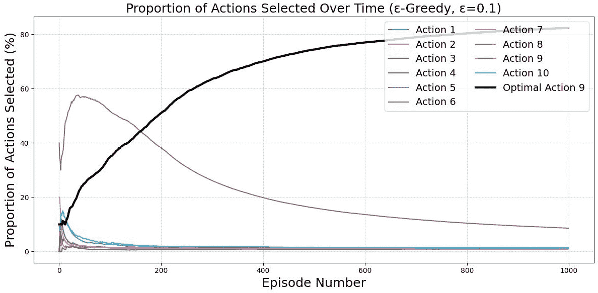

图 8.9 – 逐步实现

*1/n*可以被替换为一个固定的步长参数*α*。

<mml:math display="block"><mml:msub><mml:mrow><mml:mi>Q</mml:mi></mml:mrow><mml:mrow><mml:mi>n</mml:mi><mml:mo>+</mml:mo><mml:mn>1</mml:mn></mml:mrow></mml:msub><mml:mo>=</mml:mo><mml:msub><mml:mrow><mml:mi>Q</mml:mi></mml:mrow><mml:mrow><mml:mi>n</mml:mi></mml:mrow></mml:msub><mml:mo>+</mml:mo><mml:mi>α</mml:mi><mml:mo>[</mml:mo><mml:msub><mml:mrow><mml:mi>R</mml:mi></mml:mrow><mml:mrow><mml:mi>n</mml:mi></mml:mrow></mml:msub><mml:mo>-</mml:mo><mml:msub><mml:mrow><mml:mi>Q</mml:mi></mml:mrow><mml:mrow><mml:mi>n</mml:mi></mml:mrow></mml:msub><mml:mo>]</mml:mo></mml:math>

使用*α*不仅简化了计算，还减少了这种方法固有的偏差。实际上，对于动作的初始值估计*Q*1(a)，的选择可以显著影响早期决策和收敛行为。*α*还允许你更好地处理非平稳问题（其中奖励概率随时间变化）。初始期望值通常设置为 0，但可以选择大于 0 的值。这种替代方案称为乐观贪婪策略；这些乐观值刺激智能体更多地探索环境（即使我们使用ε=0 的纯贪婪方法）。缺点是我们必须测试不同的初始*Q*值，而在实践中，几乎所有从业者都将其设置为 0 以方便。

通过测试乐观贪婪方法，我们可以看到它的行为与*ε*-贪婪方法相似：

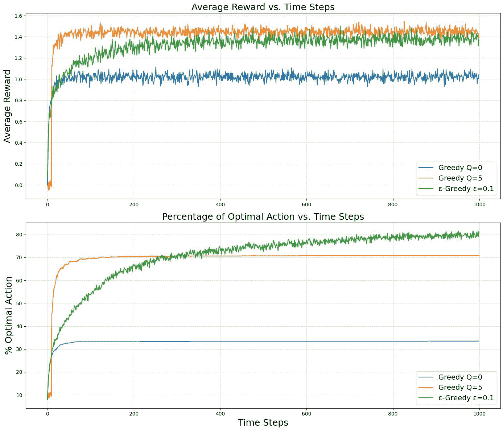

图 8.10 – 乐观贪婪与ε-贪婪方法的比较

在非平稳问题中，*α*可以设置为给予近期奖励比先前奖励更大的权重。

最后一点：到目前为止，我们选择了具有更高估计值的贪婪动作。相比之下，我们随机选择非贪婪动作。我们不仅可以随机选择它们，还可以根据它们的潜在最优性和不确定性来选择。这种方法称为**上置信界**（**UCB**），其中动作*A*的选择基于：

<mrow><mrow><msub><mi>A</mi><mi>t</mi></msub><mo>=</mo><mi>a</mi><mi>r</mi><mi>g</mi><munder><mi>max</mi><mi>a</mi></munder><mrow><mrow><mo>[</mo><msub><mi>Q</mi><mi>t</mi></msub><mfenced close=")" open="("><mi>a</mi></mfenced><mo>+</mo><mi>c</mi><msqrt><mfrac><mrow><mi>ln</mi><mi>t</mi></mrow><mrow><msub><mi>N</mi><mi>t</mi></msub><mo>(</mo><mi>a</mi><mo>)</mo></mrow></mfrac></msqrt><mo>]</mo></mrow></mrow></mrow></mrow>

其中 *ln*(*t*) 代表 *t* 的自然对数，*c> 0* 控制探索，而 *N*t 是动作 *A* 被测试的次数。这种方法意味着所有动作都将被测试，但那些估计值较低（并且已被频繁测试）的动作将以递减的方式再次被选择。想象一下在挑选不同的餐厅。UCB 帮助你在去你已经喜欢的餐厅（高估计值）和尝试可能更好但尚未访问过的餐厅（高不确定性）之间取得平衡。随着时间的推移，它自然会减少对表现不佳的选项的探索，同时继续测试那些尚未充分探索但可能很好的选项。UCB 工作得非常好，尽管它在除了多臂老虎机以外的其他方法中很难应用。

如您所见，UCB 通常给出更好的结果：

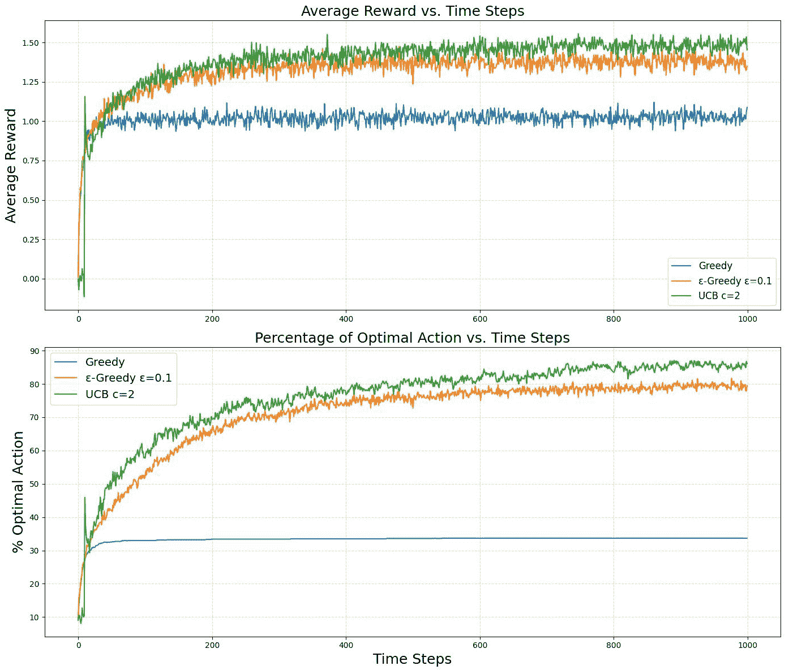

图 8.11 – UCB 对贪婪方法的改进

多臂老虎机是强化学习的一个经典例子，但它允许人们开始理解强化学习是如何工作的。

多臂老虎机已被用于多个应用，但它是一个过于简化的系统，不能应用于不同的现实世界情况。例如，在棋局中，目标不是吃掉棋子，而是赢得比赛。因此，在下一小节中，我们将开始探讨考虑比即时收益更早目的的方法。

## 马尔可夫决策过程

**马尔可夫决策过程**（**MDPs**）是动作不仅影响即时奖励，还影响未来结果的问题。在 MDPs 中，延迟奖励比我们在多臂老虎机问题中看到的权重更大，而且在决定不同情况下的适当动作时也是如此。

想象你正在穿越迷宫。你进入的每个交叉点或走廊都是一个状态，你做出的每个转弯都是一个改变你状态的行动。一些路径会带你更接近出口（最终奖励），而其他路径可能会让你绕圈子或走到死胡同。每一步的奖励可能不是即时的——你只有在到达终点时才会得到大奖励。因此，你采取的每个行动都需要考虑它如何影响你后来达到目标的机会。

在马尔可夫决策过程（MDP）中，这个想法被形式化：智能体必须在每个状态下决定最佳动作，而不仅仅是即时奖励，还要最大化长期成功，这使得它们比像多臂老虎机这样的简单问题更复杂，在多臂老虎机问题中，只考虑即时奖励。

之前我们只是估计 *q*(a)*。现在，我们想要在状态 *s* 的存在下估计动作 *a* 的价值，即 *q*(s,a)*。在每个时间步，智能体接收环境的表示 *S*t 并执行动作 *A*t，获得奖励 *R*，并移动到新的状态 *S*t+1*。可以看出，智能体的动作可以改变环境的状态。

在有限的 MDP 中，状态、动作和奖励的集合包含有限数量的元素。变量 *R* 和 *S* 是依赖于先前状态和动作的概率分布。我们可以使用状态转移概率函数 *p(s’， r | s, a)* 来描述这个系统的动力学：

<mrow><mrow><mrow><mi>p</mi><mfenced close=")" open="("><mrow><mrow><mi>s</mi><mo>′</mo></mrow><mo>,</mo><mi>r</mi><mo>|</mo><mi>s</mi><mo>,</mo><mi>a</mi></mrow></mfenced><mo>=</mo><mi>Pr</mi><mfenced close="|" open="{"><mrow><msub><mi>S</mi><mi>t</mi></msub><mo>=</mo><mrow><mi>s</mi><mo>′</mo></mrow><mo>,</mo><msub><mi>R</mi><mrow><mi>t</mi><mo>=</mo><mi>r</mi></mrow></msub></mrow></mfenced><msub><mi>S</mi><mrow><mi>t</mi><mo>−</mo><mn>1</mn></mrow></msub><mo>=</mo><mi>s</mi><mo>,</mo><msub><mi>A</mi><mrow><mi>t</mi><mo>−</mo><mn>1</mn></mrow></msub><mo>=</mo><mi>a</mi><mo>}</mo></mrow></mrow></mrow>

换句话说，状态和奖励取决于先前的状态和动作。在每一步，新的状态和奖励将来自前一个周期。这将重复有限的一系列事件。因此，每个状态将总结所有先前信息（例如，在井字棋中，新的系统配置给我们关于先前移动的信息），并被称为马尔可夫状态，具有马尔可夫属性。马尔可夫状态的优势在于每个状态都包含我们预测未来的所有所需信息。前面的函数描述了当我们执行动作时，一个状态如何演变到另一个状态。遵循此属性的 RL 问题被称为 MDP。因此，从这个函数中，我们可以推导出关于环境的任何我们关心的事情。然后我们可以推导出状态转移概率：

<mrow><mrow><mrow><mi>p</mi><mfenced close=")" open="("><mrow><mrow><mi>s</mi><mo>′</mo></mrow><mo>|</mo><mi>s</mi><mo>,</mo><mi>a</mi></mrow></mfenced><mo>=</mo><mi>Pr</mi><mfenced close="|" open="{"><mrow><msub><mi>S</mi><mi>t</mi></msub><mo>=</mo><mrow><mi>s</mi><mo>′</mo></mrow></mrow></mfenced><msub><mi>S</mi><mrow><mi>t</mi><mo>−</mo><mn>1</mn></mrow></msub><mo>=</mo><mi>s</mi><mo>,</mo><msub><mi>A</mi><mrow><mi>t</mi><mo>−</mo><mn>1</mn></mrow></msub><mo>=</mo><mi>a</mi><mo>}</mo><mo>=</mo><mrow><munder><mo>∑</mo><mrow><mi>r</mi><mo>∈</mo><mi>R</mi></mrow></munder><mrow><mi>p</mi><mfenced close=")" open="("><mrow><mrow><mi>s</mi><mo>′</mo></mrow><mo>,</mo><mi>r</mi><mo>|</mo><mi>s</mi><mo>,</mo><mi>a</mi></mrow></mfenced></mrow></mrow></mrow></mrow></mrow>

我们还可以推导出状态-动作对的预期奖励：

<mml:math display="block"><mml:mi>r</mml:mi><mml:mfenced separators="|"><mml:mrow><mml:mi>s</mml:mi><mml:mo>,</mml:mo><mml:mi>a</mml:mi></mml:mrow></mml:mfenced><mml:mo>=</mml:mo><mml:mi mathvariant="double-struck">E</mml:mi><mml:mfenced close="]" open="[" separators="|"><mml:mrow><mml:msub><mml:mrow><mml:mi>R</mml:mi></mml:mrow><mml:mrow><mml:mi>t</mml:mi></mml:mrow></mml:msub></mml:mrow><mml:mrow><mml:msub><mml:mrow><mml:mi>S</mml:mi></mml:mrow><mml:mrow><mml:mi>t</mml:mi><mml:mo>-</mml:mo><mml:mn>1</mml:mn></mml:mrow></mml:msub><mml:mo>=</mml:mo><mml:mi>s</mml:mi><mml:mo>,</mml:mo><mml:msub><mml:mrow><mml:mi>A</mml:mi></mml:mrow><mml:mrow><mml:mi>t</mml:mi><mml:mo>-</mml:mo><mml:mn>1</mml:mn></mml:mrow></mml:msub><mml:mo>=</mml:mo><mml:mi>a</mml:mi></mml:mrow></mml:mfenced><mml:mo>=</mml:mo><mml:mrow><mml:munder><mml:mo stretchy="false">∑</mml:mo><mml:mrow><mml:mi>r</mml:mi><mml:mo>∈</mml:mo><mml:mi>R</mml:mi></mml:mrow></mml:munder><mml:mrow><mml:mi>r</mml:mi></mml:mrow></mml:mrow><mml:mrow><mml:munder><mml:mo stretchy="false">∑</mml:mo><mml:mrow><mml:mi>s</mml:mi><mml:mo>∈</mml:mo><mml:mi>S</mml:mi></mml:mrow></mml:munder><mml:mrow><mml:mi>p</mml:mi><mml:mfenced separators="|"><mml:mrow><mml:msup><mml:mrow><mml:mi>s</mml:mi></mml:mrow><mml:mrow><mml:mi>'</mml:mi></mml:mrow></mml:msup><mml:mo>,</mml:mo><mml:mi>r</mml:mi></mml:mrow><mml:mrow><mml:mi>s</mml:mi><mml:mo>,</mml:mi>a</mml:mi></mml:mrow></mml:mfenced></mml:mrow></mml:mrow></mml:math>

我们可以推导出状态-动作-下一个状态三元组的期望奖励：

<mrow><mrow><mi>r</mi><mfenced close=")" open="("><mrow><mi>s</mi><mo>,</mo><mi>a</mi><mo>,</mo><mi>s</mi><mi mathvariant="normal">ʹ</mi></mrow></mfenced><mo>=</mo><mi mathvariant="double-struck">E</mi><mfenced close="]" open="["><mrow><msub><mi>R</mi><mi>t</mi></msub><mo>|</mo><msub><mi>S</mi><mrow><mi>t</mi><mo>−</mo><mn>1</mn></mrow></msub><mo>=</mo><mi>s</mi><mo>,</mo><msub><mi>A</mi><mrow><mi>t</mi><mo>−</mo><mn>1</mn></mrow></msub><mo>=</mo><mi>a</mml:mi><mo>,</mo><msub><mi>S</mi><mi>t</mi></msub><mo>=</mo><mrow><mi>s</mi><mo>′</mo></mrow></mrow></mfenced><mo>=</mo><mrow><munder><mo>∑</mo><mrow><mi>r</mi><mo>∈</mml:mi>R</mml:mi></mrow></munder><mrow><mi>r</mi><mfrac><mrow><mi>p</mi><mfenced close=")" open="("><mrow><mrow><mi>s</mi><mo>′</mo></mrow><mo>,</mo><mi>r</mi><mo>|</mo><mi>s</mi><mo>,</mo><mi>a</mi></mrow></mfenced></mrow><mrow><mi>p</mi><mfenced close=")" open="("><mrow><mrow><mi>s</mi><mo>′</mo></mrow><mo>|</mo><mi>s</mi><mo>,</mo><mi>a</mi></mrow></mfenced></mrow></mfrac></mrow></mrow></mrow></mrow>

这展示了该框架的灵活性。简而言之，*t* 不一定是时间步，而是一系列状态（一系列决策、机器人的移动等），这使得 MDP 成为一个灵活的系统。毕竟，在 MDP 中，每个问题都可以归结为三个信号：动作、状态和奖励。这使我们能够更好地抽象化，以表示以目标为导向的学习。

对于一个智能体来说，其目标显然是在长时间内最大化累积奖励（而不是立即收益）。这个系统已被证明非常灵活，因为许多问题都可以用这种方式形式化（只需要找到一种定义奖励的方法，以便智能体学会如何最大化它们）。有一点需要注意的是，智能体会尝试以任何可能的方式最大化奖励；如果目标定义不明确，可能会导致意想不到的结果（例如，在棋类游戏中，目标是赢得游戏；如果奖励是吃掉一个棋子而不是赢得游戏，那么智能体将尝试最大化吃掉的棋子数量，即使这可能导致输掉游戏）。

这可以更正式地表达，其中*G*是从步骤*t*开始并在此之后收到的累积奖励总和：

`<mrow><mrow><msub><mi>G</mi><mi>t</mi></msub><mo>=</mo><msub><mi>R</mi><mrow><mi>t</mi><mo>+</mo><mn>1</mn></mrow></msub><mo>+</mo><msub><mi>R</mi><mrow><mi>t</mi><mo>+</mo><mn>2</mn></mrow></msub><mo>+</mo><mo>…</mo><mo>+</mo><msub><mi>R</mi><mi>T</mi></msub></mrow></mrow>`

因此，我们的目标是最大化*G*。对于有明确结束的序列来说，这更容易定义（例如，只能进行有限次移动的游戏）。一系列定义明确的步骤被称为一个回合，最后一个状态被称为终止状态。请注意，每个回合都是相互独立的（输掉一局不会影响下一局的结果）。当然，这并不总是可能的；还有一些明确的连续任务，其中没有净结束（例如，在环境中移动的机器人），对于这些任务，前面的方程不适用。在这种情况下，我们可以使用所谓的折现率*γ*。这个参数允许我们决定智能体的行为：当*γ*接近 0 时，智能体将尝试最大化即时奖励，而当*γ*接近 1 时，智能体将更加重视未来的奖励：

`<mrow><mrow><msub><mi>G</mi><mi>t</mi></msub><mo>=</mo><msub><mi>R</mi><mrow><mi>t</mi><mo>+</mo><mn>1</mn></mrow></msub><mo>+</mo><mi>γ</mi><msub><mi>R</mi><mrow><mi>t</mi><mo>+</mo><mn>2</mn></mrow></msub><mo>+</mo><msup><mi>γ</mi><mn>2</mn></msup><msub><mi>R</mi><mrow><mi>t</mi><mo>+</mo><mn>3</mn></mrow></msub><mo>+</mo><mo>…</mo><mo>=</mo><mrow><munderover><mo>∑</mo><mrow><mi>k</mi><mo>=</mo><mn>0</mn></mrow><mi mathvariant="normal">∞</mi></munderover><mrow><msup><mi>γ</mi><mi>k</mi></msup><msub><mi>R</mi><mrow><mi>t</mi><mo>+</mo><mi>k</mi><mo>+</mo><mn>1</mn></mrow></msub></mrow></mrow></mrow></mrow>`

正如我们在*多臂老虎机问题*部分所看到的，我们可以估计价值函数（一个智能体处于某个状态的好坏）。考虑策略*π*，状态*S*的价值是从*S*开始并遵循策略*π*的期望回报：

<mrow><mrow><msub><mi>v</mi><mi>π</mi></msub><mfenced close=")" open="("><mi>s</mi></mfenced><mo>=</mo><msub><mi mathvariant="double-struck">E</mi><mi>π</mi></msub><mfenced close="]" open="["><mrow><msub><mi>G</mi><mi>t</mi></msub><mo>|</mo><msub><mi>S</mi><mi>t</mi></msub><mo>=</mo><mi>s</mi></mrow></mfenced><mo>=</mo><msub><mi mathvariant="double-struck">E</mi><mi>π</mi></msub><mfenced close="]" open="["><mrow><mrow><munderover><mo>∑</mo><mrow><mi>k</mi><mo>=</mo><mn>0</mn></mrow><mi mathvariant="normal">∞</mi></munderover><mrow><msup><mi>γ</mi><mi>k</mi></msup><msub><mi>R</mi><mrow><mi>t</mi><mo>+</mo><mi>k</mi><mo>+</mo><mn>1</mn></mrow></msub></mrow></mrow><mo>|</mo><msub><mi>S</mi><mi>t</mi></msub><mo>=</mo><mi>s</mi></mrow></mfenced><mi>f</mi><mi>o</mi><mi>r</mi><mi>a</mi><mi>l</mi><mi>l</mi><mi>s</mi><mo>∈</mo><mi>S</mi></mrow></mrow>

这被称为策略 π 的状态-价值函数，*G*t 是期望回报。同样，我们可以在策略 π 下定义在状态 S 中采取动作 *A* 的价值：

<mrow><mrow><msub><mi>q</mi><mi>π</mi></msub><mfenced close=")" open="("><mrow><mi>s</mi><mo>,</mo><mi>a</mi></mrow></mfenced><mo>=</mo><msub><mi mathvariant="double-struck">E</mi><mi>π</mi></msub><mfenced close="]" open="["><mrow><msub><mi>G</mi><mi>t</mi></msub><mo>|</mo><msub><mi>S</mi><mi>t</mi></msub><mo>=</mo><mi>s</mi><mo>,</mo><msub><mi>A</mi><mi>t</mi></msub><mo>=</mo><mi>a</mi></mrow></mfenced><mo>=</mo><msub><mi mathvariant="double-struck">E</mi><mi>π</mi></msub><mfenced close="]" open="["><mrow><mrow><munderover><mo>∑</mo><mrow><mi>k</mi><mo>=</mo><mn>0</mn></mrow><mi mathvariant="normal">∞</mi></munderover><mrow><msup><mi>γ</mi><mi>k</mi></msup><msub><mi>R</mi><mrow><mi>t</mi><mo>+</mo><mi>k</mi><mo>+</mo><mn>1</mn></mrow></msub></mrow></mrow><mo>|</mo><msub><mi>S</mi><mi>t</mi></msub><mo>=</mo><mi>s</mi><mo>,</mo><msub><mi>A</mi><mi>t</mi></msub><mo>=</mo><mi>a</mi></mrow></mfenced></mrow></mrow>

这被称为策略 *π* 的动作-价值函数。我们可以通过经验（与环境交互）来估计这些函数，并且在无限远处，它们应该接近真实值。这种进行许多实际回报随机样本平均的方法被称为蒙特卡洛方法。

为了提高效率，我们可以将其重写为递归形式（使用折现）：

<mrow><mrow><msub><mi>v</mi><mi>π</mi></msub><mfenced close=")" open="("><mi>s</mi></mfenced><mo>=</mo><msub><mi mathvariant="double-struck">E</mi><mi>π</mi></msub><mfenced close="]" open="["><mrow><msub><mi>G</mi><mi>t</mi></msub><mo>|</mo><msub><mi>S</mi><mi>t</mi></msub><mo>=</mo><mi>s</mi></mrow></mfenced><mo>=</mo><msub><mi mathvariant="double-struck">E</mi><mi>π</mi></msub><mfenced close="]" open="["><mrow><msub><mrow><msub><mi>R</mi><mrow><mi>t</mi><mo>+</mo><mn>1</mn></mrow></msub><mo>+</mo><mi>γ</mi><mi>G</mi></mrow><mrow><mi>t</mi><mo>+</mo><mn>1</mn></mrow></msub><mo>|</mo><msub><mi>S</mi><mi>t</mi></msub><mo>=</mo><mi>s</mi></mrow></mfenced><mo>=</mo><mrow><munder><mo>∑</mo><mi>a</mi></munder><mrow><mi>π</mi><mo>(</mo><mi>a</mi><mo>|</mo><mi>s</mi><mo>)</mo></mrow></mrow><mrow><munder><mo>∑</mo><mrow><mrow><mi>s</mi><mo>′</mo></mrow><mo>,</mo><mi>r</mi></mrow></munder><mrow><mi>p</mi><mfenced close=")" open="("><mrow><mrow><mi>s</mi><mo>′</mo></mrow><mo>,</mo><mi>r</mi><mo>|</mo><mi>s</mi><mo>,</mo><mi>a</mi></mrow></mfenced><mfenced close="]" open=""><mrow><mi>r</mi><mo>+</mo><mi>γ</mi><msub><mi>v</mi><mi>π</mi></msub><mfenced close=")" open="("><mrow><mi>s</mi><mo>′</mo></mrow></mfenced></mrow></mfenced></mrow></mrow><mi>f</mi><mi>o</mi><mi>r</mi><mi>a</mi><mi>l</mi><mi>l</mi><mi>s</mi><mo>∈</mo><mi>S</mi></mrow></mrow>

这种简化的形式被称为 Bellman 方程。这可以表示为从上一个状态向前思考下一个状态。从一个具有策略的状态，我们选择一个动作，并按照给定的概率获得奖励（或不获得）。Bellman 方程对这些概率进行平均，给它们发生的可能性赋予权重。这个方程是许多优秀强化学习算法的基础。

![图 8.12 – Bellman 回退图

图 8.12 – Bellman 回退图

现在我们既有状态值函数 *vπ(s)* 和动作值函数 *qπ(s, a)*，我们可以评估策略并选择最好的策略。动作值函数允许我们根据状态选择最佳动作。例如，考虑德克萨斯扑克游戏的情况。一个玩家有 100 美元，必须从状态 *π* 出发选择策略。策略 *π*1 的状态值函数返回 10，而 *π*2 的回报为 -2。这意味着第一个策略带来期望收益 10，而 *π*2 带来期望损失 2。给定一个状态 *s*，玩家想要弄清楚选择哪个动作。例如，选择是否下注 10 或 5，*q*π (s, a) 告诉我们从这个动作中期望累积奖励是多少。因此，前面的方程使我们能够确定选择哪个动作或策略以最大化奖励。

从**图 8.12**可以理解，解决强化学习任务意味着找到一种最优策略，在长期内成功收集到许多奖励。对于马尔可夫决策过程（MDPs），我们可以定义一个最优策略，因为我们可以在所有状态下评估一个策略是否比另一个策略更好，如果它对所有状态的预期回报更高。*π** 表示最优策略，它是所有可能策略中具有最大值函数的那个：

<mrow><mrow><msub><mi>v</mi><mi mathvariant="normal">*</mi></msub><mfenced close=")" open="("><mi>s</mi></mfenced><mo>=</mo><munder><mi>max</mi><mi>π</mi></munder><msub><mi>v</mi><mi>π</mi></msub><mfenced close=")" open="("><mi>s</mi></mfenced><mi>f</mi><mi>o</mi><mi>r</mi><mi>a</mi><mi>l</mi><mi>l</mi><mi}s</mi><mo>∈</mo><mi>S</mi></mrow></mrow>

最优策略共享相同的最佳动作值函数 *q**，它被定义为所有可能策略中最大动作值函数：

<mrow><mrow><msub><mi>q</mi><mi mathvariant="normal">*</mi></msub><mfenced close=")" open="("><mrow><mi>s</mi><mo>,</mo><mi>a</mi></mrow></mfenced><mo>=</mo><munder><mi>max</mi><mi>π</mi></munder><msub><mi>q</mi><mi>π</mi></msub><mfenced close=")" open="("><mrow><mi>s</mi><mo>,</mo><mi>a</mi></mrow></mfenced><mi>f</mi><mi>o</mi><mi>r</mi><mi>a</mi><mi>l</mi><mi>l</mi><mi}s</mi><mo>∈</mo><mi>S</mi></mrow></mrow>

这两个函数之间的关系可以总结如下：

<mrow><mrow><msub><mi>q</mi><mi mathvariant="normal">*</mi></msub><mfenced close=")" open="("><mrow><mi>s</mi><mo>,</mo><mi>a</mi></mrow></mfenced><mo>=</mo><mi mathvariant="double-struck">E</mi><mfenced close="]" open="["><mrow><mrow><mrow><msub><mrow><msub><mi>R</mi><mrow><mi>t</mi><mo>+</mo><mn>1</mn></mrow></msub><mo>+</mo><mi>γ</mi><msub><mi>v</mi><mi mathvariant="normal">*</mi></msub><mo>(</mo><mi>S</mi></mrow><mrow><mi>t</mi><mo>+</mo><mn>1</mn></mrow></msub><mo>)</mo></mrow></mrow><mo>|</mo><msub><mi>S</mi><mi>t</mi></msub><mo>=</mo><mi>s</mi><mo>,</mo><msub><mi>A</mi><mi>t</mi></msub><mo>=</mo><mi>a</mi></mrow></mfenced></mrow></mrow>

该方程表示给定一个状态-动作对时的累积回报。然而，在强化学习（RL）中，最优值函数是一个理想的状态，但找到最优策略尤其困难，尤其是在任务复杂或计算成本高昂时。因此，强化学习试图通过使用**动态规划**（**DP**）等方法来近似它们。动态规划的目的就是利用值函数来寻找好的策略（即使不是精确解）。在这个阶段，我们可以推导出最优状态值函数 *v*(s)* 和最优动作值函数 *q*∗ *(**s, a)* 的贝尔曼最优方程：

<mrow><mrow><msub><mi>q</mi><mi mathvariant="normal">*</mi></msub><mfenced close=")" open="("><mrow><mi>s</mi><mo>,</mo><mi>a</mi></mrow></mfenced><mo>=</mo><mi mathvariant="double-struck">E</mi><mfenced close="]" open="["><mrow><mrow><mrow><msub><mrow><msub><mi>R</mi><mrow><mi>t</mi><mo>+</mo><mn>1</mn></mrow></msub><mo>+</mo><munder><mrow><mi mathvariant="normal">m</mi><mi mathvariant="normal">a</mi><mi mathvariant="normal">x</mi></mrow><mrow><mi>a</mi><mi mathvariant="normal">ʹ</mi></mrow></munder><msup><mi>q</mi><mi mathvariant="normal">*</mi></msup><mo>(</mo><mi>S</mi></mrow><mrow><mi>t</mi><mo>+</mo><mn>1</mn></mrow></msub><mo>,</mo><mi>a</mi><mi mathvariant="normal">ʹ</mi><mo>)</mo></mrow></mrow><mo>|</mo><msub><mi>S</mi><mi>t</mi></msub><mo>=</mo><mi>s</mi><mo>,</mo><msub><mi>A</mi><mi>t</mi></msub><mo>=</mo><mi>a</mi></mrow></mfenced><mo>=</mo><mrow><munder><mo>∑</mo><mrow><mrow><mi>s</mi><mo>′</mo></mrow><mo>,</mo><mi>r</mi></mrow></munder><mrow><mi>p</mi><mo>(</mo><mrow><mi>s</mi><mo>′</mo></mrow><mo>,</mo><mi>r</mi><mo>|</mo><mi>s</mi><mo>,</mo><mi>a</mi><mo>)</mo></mrow></mrow><mfenced close="]" open="["><mrow><mi>r</mi><mo>+</mo><mi>γ</mi><munder><mrow><mi mathvariant="normal">m</mi><mi mathvariant="normal">a</mi><mi mathvariant="normal">x</mi></mrow><mrow><mi>a</mi><mo>′</mo></mrow></munder><msup><mi>q</mi><mi mathvariant="normal">*</mi></msup><mo>(</mo><mrow><mi>s</mi><mo>′</mo></mrow><mo>,</mo><mi>a</mi><mi mathvariant="normal">ʹ</mi><mo>)</mo></mrow></mfenced></mrow></mrow>

对于有限马尔可夫决策过程（MDP），贝尔曼最优性方程只有一个解，如果我们知道系统的动态特性，那么它们是可以被解决的。一旦我们得到 *v*，就很容易识别出最优策略 *q*；拥有最优的 *q*，我们就可以识别出最优动作。*v* 的美妙之处在于它允许我们在考虑长期目标的同时选择最佳动作。为一个问题求解这些方程就是通过强化学习（RL）来解决问题。另一方面，对于许多问题，解决它们意味着计算所有可能性，因此计算成本过高。在其他情况下，我们可能无法确定环境的动态特性，或者状态可能不具有马尔可夫性质。然而，这些方程是强化学习的基础，许多方法都是这些方程的近似，通常使用先前状态的经验。因此，这些算法并不识别最佳策略，而是识别一个近似。例如，许多算法学习最频繁状态的最优动作，但可能对不常见或罕见的状态选择次优动作。技巧是这些选择不应影响未来的奖励量。例如，即使代理在罕见情况下没有做出最佳动作，它仍然可能赢得游戏。

DP 指的是一组算法，这些算法用于在给定环境的完美模型作为马尔可夫决策过程（MDP）的情况下计算最佳策略。现在，这些算法需要大量的计算，并且完美模型的假设并不总是成立。因此，这些算法不再实际使用；同时，今天可以将算法定义为受 DP 算法启发，目的是减少计算量，即使在环境完美模型的假设不成立的情况下也能工作。简而言之，DP 算法是通过将贝尔曼方程转换为更新规则来改进所需价值函数的近似而获得的。这允许使用价值函数来组织对良好策略的搜索。为了评估策略，我们可以使用状态价值函数，并评估遵循策略 *π* 从每个状态预期的回报：

<mrow><mrow><mrow><msub><mi>v</mi><mi>π</mi></msub><mfenced close=")" open="("><mi>s</mi></mfenced><mo>=</mo><mi mathvariant="double-struck">E</mi><mfenced close="]" open="["><mrow><mrow><mrow><msub><mrow><msub><mi>R</mi><mrow><mi>t</mi><mo>+</mo><mn>1</mn></mrow></msub><mo>+</mo><mi>γ</mi><msub><mi>v</mi><mi>π</mi></msub><mo>(</mo><mi>S</mi></mrow><mrow><mi>t</mi><mo>+</mo><mn>1</mn></mrow></msub><mo>)</mo></mrow></mrow><mo>|</mo><msub><mi>S</mi><mi>t</mi></msub><mo>=</mo><mi>s</mi><mo>,</mo><msub><mi>A</mi><mi>t</mi></msub><mo>=</mo><mi>a</mi></mrow></mfenced><mo>=</mo><mrow><munder><mo>∑</mo><mi>a</mi></munder><mrow><mi>π</mi><mo>(</mo><mi>a</mi><mo>|</mo><mi>s</mi><mo>)</mo></mrow></mrow><mrow><munder><mo>∑</mo><mrow><mrow><mi>s</mi><mo>′</mo></mrow><mo>,</mo><mi>r</mi></mrow></munder><mrow><mi>p</mi><mo>(</mo><mrow><mi>s</mi><mo>′</mo></mrow><mo>,</mo><mi>r</mi><mo>|</mo><mi>s</mi><mo>,</mo><mi>a</mi><mo>)</mo></mrow></mrow><mo>[</mo><mi>r</mi><mo>+</mo><mi>γ</mi><msub><mi>v</mi><mi>π</mi></msub><mo>(</mo><mrow><mi>s</mi><mo>′</mo></mrow><mo>)</mo><mo>]</mo></mrow></mrow></mrow>

计算策略的价值函数旨在识别更好的策略。对于一个状态 *s*，我们想知道是否应该保持该策略，改进它，或者选择另一个策略。记住，策略的选择决定了智能体将采取哪些行动。为了回答“改变策略是否更好？”这个问题，我们可以考虑在状态 *s* 下遵循策略 *π* 选择一个动作会发生什么：

<mrow><mrow><mrow><msub><mi>q</mi><mi>π</mi></msub><mfenced close=")" open="("><mrow><mi>s</mi><mo>,</mo><mi>a</mi></mrow></mfenced><mo>=</mo><mi mathvariant="double-struck">E</mi><mfenced close="]" open="["><mrow><mrow><mrow><msub><mrow><msub><mi>R</mi><mrow><mi>t</mi><mo>+</mo><mn>1</mn></mrow></msub><mo>+</mo><mi>γ</mi><msub><mi>v</mi><mi>π</mi></msub><mo>(</mo><mi>S</mi></mrow><mrow><mi>t</mi><mo>+</mo><mn>1</mn></mrow></msub><mo>)</mo></mrow></mrow><mo>|</mo><msub><mi>S</mi><mi>t</mi></msub><mo>=</mo><mi>s</mi><mo>,</mo><msub><mi>A</mi><mi>t</mi></msub><mo>=</mo><mi>a</mi></mrow></mfenced><mo>=</mo><mrow><munder><mo>∑</mo><mrow><mrow><mi>s</mi><mo>′</mo></mrow><mo>,</mo><mi>r</mi></mrow></munder><mrow><mi>p</mi><mo>(</mo><mrow><mi>s</mi><mo>′</mo></mrow><mo>,</mo><mi>r</mi><mo>|</mo><mi>s</mi><mo>,</mo><mi>a</mi><mo>)</mo></mrow></mrow><mo>[</mo><mi>r</mi><mo>+</mo><mi>γ</mi><msub><mi>v</mi><mi>π</mi></msub><mo>(</mo><mrow><mi>s</mi><mo>′</mo></mrow><mo>)</mo><mo>]</mo></mrow></mrow></mrow>

一个更好的策略 *π’* 应该为我们提供更好的 *v*π*(s)* 值。如果 *π’* 小于或等于 *v*π*(s)*，我们可以继续相同的策略。换句话说，根据具有更好 *v*π*(s)* 的策略 *π’* 来选择动作比另一个策略 *π* 更有益。

在本节中，我们看到了经典的强化学习算法，但它们都没有使用神经网络或其他机器学习模型。这些算法在简单情况下表现良好，而对于更复杂的情况，我们希望有一个更复杂和适应性强的系统。在下一节中，我们将看到如何将神经网络集成到强化学习算法中。

# 深度强化学习

**深度强化学习**（**深度强化学习**）是强化学习的一个子领域，它将强化学习与深度学习相结合。换句话说，其背后的思想是利用神经网络的学习能力来解决强化学习问题。在传统的强化学习中，策略和价值函数由简单的函数表示。这些方法在低维状态和动作空间中表现良好（即当环境和代理可以轻松建模时）。当环境变得更加复杂或更大时，传统方法无法泛化。在深度强化学习中，策略和价值函数由神经网络表示。理论上，神经网络可以表示任何复杂的函数（通用逼近定理），这使得深度强化学习方法能够解决具有高维状态空间的问题（如呈现图像、视频或连续任务）。通过建模复杂函数，这使得代理能够学习到更通用和灵活的策略，这在复杂情况下是必要的，在这些情况下，使用传统方法定义函数是不可能的。这种学习能力使得深度强化学习方法能够解决视频游戏、移动机器人等问题。

(img/B21257_08_13.jpg)

图 8.13 – 深度强化学习概述 ([`arxiv.org/abs/1708.05866`](https://arxiv.org/abs/1708.05866))

在接下来的小节中，我们将讨论如何对这些算法进行分类以及它们之间的区别。

## 无模型与基于模型的比较方法

目前深度强化学习的方法如此之多，以至于很难对这些模型进行分类。尽管如此，深度强化学习方法可以大致分为两大类：无模型和基于模型。这种划分可以通过回答以下问题来表示：智能体是否有权访问（或学习）环境的模型？

+   **无模型方法**：这些方法在不需要构建环境模型的情况下确定最优策略或价值函数。这些模型直接从观察到的状态、动作和奖励中学习。智能体直接从试错中学习，从环境中获得反馈，并使用这些反馈来改进其策略或价值估计。这些方法通常更容易实现和进行参数调整（它们只需要观察状态-动作-奖励序列或转换）。它们也更容易扩展，计算复杂度更低。

+   **基于模型的方法**：这些方法依赖于环境内部模型来预测给定任何状态-动作对的未来状态和奖励。这个模型可以在训练前学习或预先定义。拥有模型允许智能体在类似情况下进行规划和为未来场景（例如，游戏中对手的未来动作以及预测它们）制定计划。基于模型的方法的优势在于它们可以减少与真实环境的交互，并且在规划复杂任务方面表现更好。潜在的改进性能是以增加复杂性（构建准确的环境模型可能具有挑战性，尤其是在高维环境中）和增加计算成本为代价的。

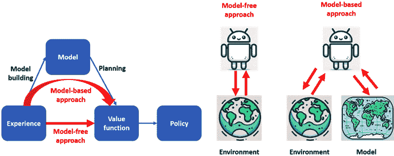

图 8.14 – 无模型与基于模型的比较方法

基于模型强化学习方法的主要优势在于其规划和前瞻性思考的能力。通过利用模型（通常是一个神经网络）来模拟环境的动态，它可以预测未来场景，这在复杂环境或需要考虑长期结果的情况下特别有用。例如，当奖励稀疏或延迟——如在国际象棋中，只有赢得游戏才能获得奖励——模型可以模拟各种路径以优化智能体达到奖励的策略。

在动态环境中，规划也证明是有益的。模型可以快速更新其内部表示，使智能体能够调整其策略而无需从头开始重新学习。这最小化了大量重新训练的需求，如在自动驾驶等应用中，智能体可以调整其策略而无需大量新的数据集。从这种规划中获得的认识可以随后被提炼成学习策略，随着时间的推移提高智能体的性能。

此外，模拟与环境交互减少了大量现实世界探索的需求，这在交互成本高、危险或耗时的情况下至关重要，例如在机器人或自动驾驶汽车中。通过利用其内部模型，智能体可以优先考虑行动并优化其探索过程，以更有效地更新或改进其对环境的理解。

这有助于智能体优化长期目标，因为它可以模拟其行动的长期后果，监控其向更远目标的进展，并使其行动与遥远的目标保持一致。

模型构建可能是一项复杂的任务。然而，环境的确切模型并不总是对智能体可用。在这种情况下，智能体被迫仅从经验中学习以创建自己的模型。这可能导致智能体模型中的偏差。因此，智能体可能在学习的模型上表现最优，但在真实环境中表现极差（或次优）。

## 在策略方法和离策略方法之间

在强化学习（RL）中，另一个重要的分类是模型如何从经验中学习，以及它们是否从当前策略或不同策略中学习（它们根据策略与策略更新的关系进行分类）：

+   **策略学习方法**：这些方法从代理当前策略中学习到的动作中进行学习（因此代理既收集数据又从同一策略中学习）。策略学习方法评估和改进用于决策的策略；这是基于遵循当前策略时采取的动作和收到的奖励（代理通过直接评估和改进策略来执行策略更新）。因此，代理不使用来自其他策略的数据。其优点是代理往往更稳定，且不太容易受到变化的影响（优化的策略实际上是用来与环境交互的策略）。策略学习方法效率不高，因为它们丢弃了从先前策略中获得的数据（样本效率低下），这限制了它们在复杂环境中的应用，因为它们需要大量的数据。此外，这些方法不太具有探索性，因此在需要更多探索的地方不太有益（它们更适用于稳定的环境）。一个例子是聊天机器人，它学习给出更好的答案来回答用户的问题：聊天机器人使用特定的策略来给出答案，并通过利用从用户那里收到的反馈来优化这个策略。策略学习方法确保学习到的策略与聊天机器人采取的动作以及与用户的真实互动相关联（这确保了稳定性）。

+   **离策略方法**：离策略方法独立于智能体的动作学习最优策略的价值（智能体从由不同策略生成并由学习策略使用的经验中学习）。因此，这些方法可以从过去的数据或由其他策略生成的数据中学习。离策略方法将行为策略（用于收集数据）与目标策略（正在学习策略）分开。换句话说，行为策略用于探索环境，而目标策略用于提高智能体的性能（在学习最优目标策略的同时确保更多的探索行为）。离策略方法具有更高的样本效率，因为它们可以重用数据并允许更好的探索，这可以导致更快地收敛到最优策略。另一方面，它们不太稳定（因为它们不学习当前策略已经采取的动作，行为策略和目标策略之间的差异可能导致更新中的更高方差）并且可能更加复杂。一个例子是音乐推荐系统，它向用户推荐新的标题，并必须探索不同的流派和新发行的音乐。行为策略鼓励探索，因此生成关于用户偏好的数据，而目标策略寻求优化用户的推荐性能。将这两种策略分开可以尝试不同的推荐策略，而不会影响最终推荐的品质。这些方法的优势在于它们允许广泛的探索，这对于复杂和动态环境非常有用。

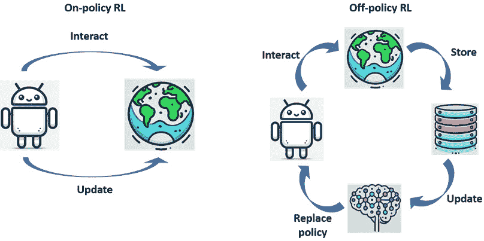

图 8.15 – 在策略和离策略方法

在下一个子节中，我们将开始详细讲解深度强化学习是如何工作的。

## 详细探索深度强化学习

我们将从定义开始，以便更好地理解深度强化学习。在一个系统中的状态 *s* 通常是一个向量、矩阵或其他张量。在每个时间步 *t*，我们可以将环境描述为张量的形式（例如，棋盘上棋子的位置可以用矩阵表示）。同样，智能体可以选择的动作 *a* 也可以用张量表示（例如，每个动作可以关联到一个独热向量、一个矩阵等）。所有这些都是机器学习中已经常见的结构，我们可以将它们作为深度学习模型的输入。

到目前为止，我们泛泛地讨论了策略，但我们使用什么函数来建模它们？通常，我们使用神经网络。因此，在本节中，我们将积极探讨神经网络如何在强化学习算法中使用。我们现在看到的是基于本章的内容，但我们将使用神经网络来决定采取什么行动（而不仅仅是函数）。正如我们在*第一章*中看到的，神经网络由一系列按层次组织在一起的神经元组成。神经网络以张量作为输入并产生张量作为输出。在这种情况下，神经网络的输出是选择一个动作。在这种情况下，优化策略意味着优化神经网络的参数。基于经验的强化学习算法可以改变策略函数的参数，使其产生更好的结果。

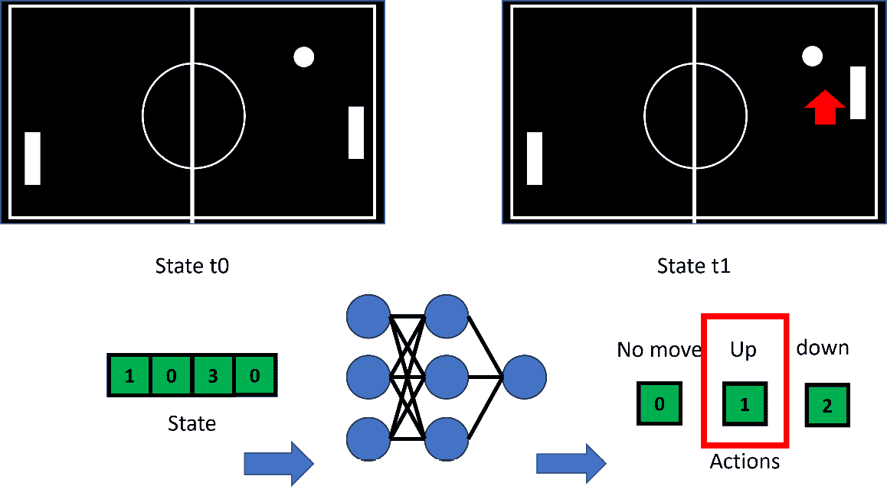

图 8.16 – 作为强化学习策略的神经网络

神经网络是众所周知的深度学习模型，我们了解如何优化它们。使用基于梯度的方法使我们能够理解参数变化如何影响函数的输出。在这种情况下，我们想知道我们应该如何更新我们的策略 *P*（神经网络模型）的参数，以便在将来收集更多的奖励。因此，有一个函数告诉我们策略的预期奖励，我们可以使用梯度来改变策略的参数，从而最大化回报。

在强化学习中使用神经网络作为策略有几个优点：

+   神经网络是高度表达的功能逼近器，因此它们可以映射输入（状态）和输出（动作）之间的复杂非线性关系。这对于复杂环境非常有用，例如玩电子游戏或控制 3D 环境中的机器人。此外，神经网络对于具有大而复杂的状态和动作空间的环境具有良好的扩展性。

+   神经网络具有将情况推广到他们之前未遇到的情况的能力。这种能力使它们在处理意外状态变化时特别有用，从而促进了智能体的适应性。所有这些都使神经网络能够灵活适应不同范围的任务和环境。

+   神经网络可以处理连续的动作而不是离散的动作，从而使其能够在现实世界问题中使用（在现实世界中，动作通常不受离散集合的限制）。

+   神经网络是通用的。它们可以与不同类型的数据一起使用，并且不需要特征工程。当特征可能很复杂或状态表示很复杂（传感器、图像、视频等）时，这一点很重要。

+   它们可以产生概率分布，因此可以与随机策略一起使用。当我们想要添加随机性和鼓励探索时，这一点很重要。

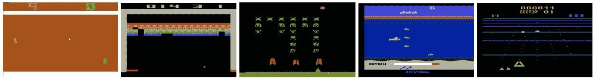

图 8.17 – 使用神经网络学习如何玩 Atari 游戏的截图示例 ([`arxiv.org/abs/1312.5602`](https://arxiv.org/abs/1312.5602))

我们现在将介绍五种不同的算法，以便了解不同类型方法之间的差异（离政策和在线策略、无模型和基于模型的方法）。

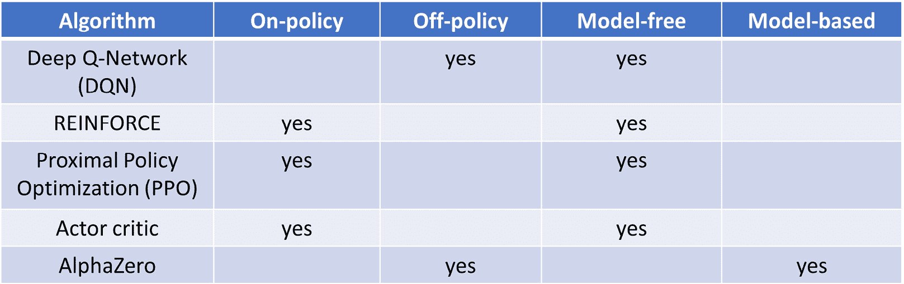

图 8.18 – 强化学习方法的总结表

### Q 学习与深度 Q 网络（DQN）

**Q 学习**是**深度 Q 网络**（**DQN**）的基础，这是一种由 DeepMind 使用的算法，用于训练一个能够解决视频游戏的智能体。在 Q 学习算法中，我们有一个**状态-动作值 Q 表**，其中每一行代表一个状态，每一列代表一个动作，每个单元格包含对应状态-动作对的估计 Q 值。Q 值最初被设置为 0。当智能体从与环境交互中接收反馈时，我们迭代地更新这些值（直到它们收敛到最优值）。请注意，此更新使用贝尔曼方程进行（表中的 Q 值代表智能体从该状态采取该动作并随后遵循最佳策略时的预期未来奖励）。

Q 学习通过学习每个状态-动作对的优化 Q 值来找到最优策略。最初，智能体随机选择动作，但通过与环境的交互和接收反馈（奖励），它学会了哪些动作是最好的。在每次迭代中，它使用贝尔曼方程进行表格更新。智能体通常选择具有最高 Q 值的动作（贪婪策略），但我们可以通过控制探索程度（*ε*-贪婪策略）来控制。随着时间的推移，这些估计变得越来越准确，模型收敛到最优 Q 值。

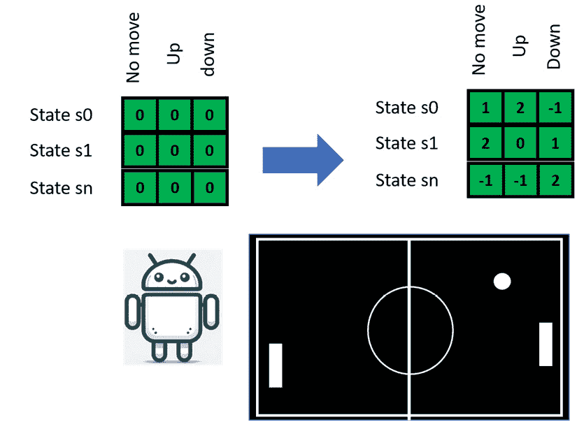

图 8.19 – Q 学习示例

在复杂环境中，由于可能的大规模和计算不可行性，使用表格存储值变得不切实际。相反，我们可以使用 Q 函数，它将状态-动作对映射到 Q 值。鉴于神经网络可以有效地模拟复杂函数，它们可以用来有效地近似 Q 函数。通过提供状态*S*作为输入，神经网络提供状态-动作对的 Q 值作为输出（换句话说，从该状态可以采取的所有动作的 Q 值）。原理与 Q 学习算法非常相似。我们开始时对 Q 值进行随机估计，使用*ε*-贪婪策略探索环境，并更新估计。

DQN 架构由三个主要组件组成：两个神经网络（Q 网络和目标网络）以及一个经验回放组件。Q 网络（一个经典的神经网络）是训练用来产生最优状态-动作值的代理。另一方面，经验回放用于生成训练神经网络所需的数据。

Q 网络在多个时间步和多个回合上进行训练，目的是最小化预测 Q 值和目标 Q 值之间的差异。在代理与环境交互的过程中，每个经验（状态、动作、奖励和下一个状态的元组）都存储在这个经验回放缓冲区中。在训练过程中，从缓冲区中随机选择经验批次（新旧经验的混合）来更新 Q 网络。这有助于打破连续经验之间的相关性（有助于稳定训练）并多次重用过去经验（提高数据效率）。目标网络是用于生成训练目标 Q 值的 Q 网络的副本。定期（例如每几千步）通过复制 Q 网络权重来更新目标网络权重；这稳定了训练。在训练过程中，Q 网络预测给定状态的行动 Q 值（预测 Q 值），目标网络预测给定状态的行动目标 Q 值。预测 Q 值、目标 Q 值和观察到的奖励用于计算损失并更新 Q 网络的权重。

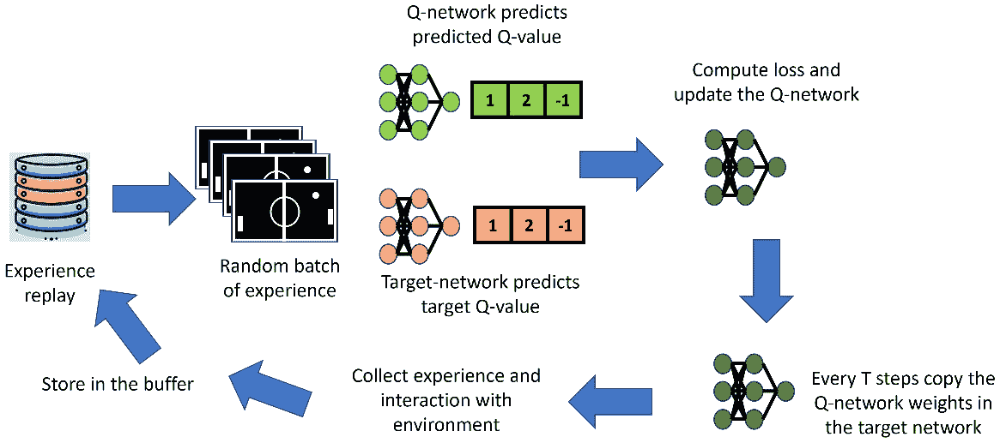

图 8.20 – DQN 训练算法

DQN 有许多创新和优势：

+   经验回放使训练更加稳定和高效。神经网络通常以一批数据作为输入，而不是单个状态，因此在训练过程中，梯度将具有更小的方差，权重收敛更快。经验回放还可以在训练过程中减少噪声，因为我们可以对经验进行一种“洗牌”，从而更好地实现泛化。

+   目标网络的概念引入减轻了非平稳目标的问题，这可能导致训练不稳定。目标网络未经训练，因此目标 Q 值稳定且波动很小。

+   DQN 在处理高维空间如图像时非常有效，能够自行提取特征并学习有效的策略。这些能力使得 DQN 能够通过输入原始像素来掌握 Atari 游戏。

当然，也存在一些缺点：

+   虽然它比 Q 学习更高效，但 DQN 仍然需要大量的样本来有效地学习；这限制了它在数据很少的任务中的应用（样本效率低）

+   当动作空间是连续的时，它不稳定，而对于离散动作空间则表现良好

+   它对超参数的选择（如学习率、重放缓冲区大小和目标网络更新频率）敏感

### REINFORCE 算法

DQN 专注于在不同状态下学习动作的价值。**REINFORCE**则是一种基于策略的方法。这些方法直接学习策略，将状态映射到动作而不学习价值函数。核心思想是通过最大化代理在一段时间内收到的期望累积奖励来优化策略。REINFORCE 是学习如何训练代理处理复杂、连续动作空间的基础算法。

策略由一个神经网络表示，它以当前状态作为输入并产生一个关于所有可能动作的概率分布（代理执行特定动作的概率）。这被称为随机策略，因为我们没有直接输出动作，而是输出概率。策略梯度方法试图直接改进策略（通过在训练期间改变参数），以便策略产生更好的结果。因此，我们再次从一个随机策略（神经网络权重随机初始化）开始，让代理根据其策略在环境中行动，这会导致产生一个轨迹（一系列状态和动作）。如果这个轨迹收集到高奖励，我们将更新权重，使得这个轨迹在未来更有可能被产生。相反，如果代理表现不佳，权重的更新将指导使该轨迹不太可能发生。

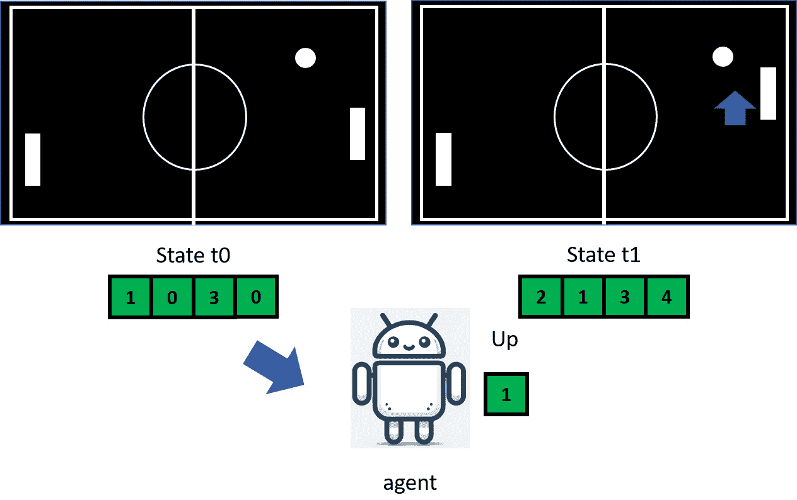

图 8.21 – 轨迹示例

因此，这个过程的第一步是初始化一个神经网络（策略*P*）及其参数*θ*。由于这些权重最初是随机的，以状态作为输入的策略将导致随机动作。然后我们生成一个轨迹*τ*，让代理与环境交互。从状态*s*0 开始，我们让代理根据策略*P*和参数*θ*进行移动。在实践中，状态*S*被作为输入给神经网络，并生成一个动作分布。我们从这个分布中采样一个动作*a*0。这个过程会尽可能重复（例如，直到游戏结束），状态和动作的集合就是我们的轨迹。

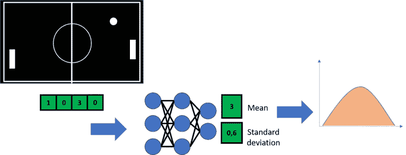

图 8.22 – 从神经网络获取分布

在轨迹过程中，我们收集奖励（称为奖励到去或也称为回报 *G*t）。回报是从时间步 *t* 到剧集结束所收到的总累积奖励，通过一个因子 *γ* 进行折现。折现因子决定了未来奖励相对于即时奖励的重要性。在这种情况下，我们有一个函数，它为我们提供给定策略的预期回报，我们希望最大化它。因此，我们计算梯度，并通过梯度上升修改我们神经网络的参数。

REINFORCE 算法在概念上简单且易于实现，适用于连续动作空间（因为它直接学习策略），并支持端到端学习（算法直接从原始数据中学习）。然而，这个算法的一些挑战包括策略更新的高方差（它依赖于完整剧集的返回，更新可能嘈杂且不稳定），需要大量数据（因为它在每次更新后丢弃数据且不重复使用经验，所以需要大量的剧集），它不适用于数据昂贵的环境，并且在存在延迟奖励的情况下表现不佳。

注意，REINFORCE 算法是一个基于策略的算法，因为策略只根据使用相同策略收集的经验进行更新。在每次迭代中，智能体使用更新的策略并使用它来收集经验以进行更新。在离策略方法的情况下，也会使用使用其他策略收集的经验。例如，这就是我们在 DQN 中看到的情况，我们使用的是使用不同策略收集的批次经验。

### 近端策略优化（PPO）

**近端策略优化**（**PPO**）是强化学习中最广泛引用和使用的算法之一。由 OpenAI 于 2017 年引入，PPO 旨在平衡策略梯度方法（如 REINFORCE）的简单性与更复杂算法（如**信任域策略优化**（**TRPO**））的稳定性。本质上，PPO 是一个实用且高效的算法，在基准测试中表现良好，同时相对容易实现和调整。

PPO 与 REINFORCE 相似，但包括重要的改进，使训练更加稳定。基于策略的方法中的一个挑战是超参数的选择（尤其是学习率）以及不稳定权重更新的风险。PPO 的关键创新在于确保策略更新不要太大，因为这可能会破坏训练的稳定性。PPO 通过使用一个限制目标函数的约束来实现这一点，该约束限制了策略在单个更新中可以改变的程度，从而避免了网络权重的剧烈变化。

传统策略梯度方法的一个重大问题是它们无法从较差的更新中恢复。如果一个策略表现不佳，智能体可能在下一次迭代中生成稀疏或低质量的训练数据，从而形成一个难以摆脱的自我强化循环。PPO 通过稳定策略更新来解决这一问题。

在 PPO 中，策略由一个神经网络表示，*πθ(a*|*s)*，其中*θ*代表网络的权重。网络将当前状态*s*作为输入，并输出一个关于可能动作*a*的概率分布。最初，权重是随机初始化的。随着智能体与环境交互，它根据当前策略生成经验批次（状态、动作、奖励）。智能体还计算优势估计，这衡量所选动作相对于状态期望值的优劣。

与简单的策略梯度方法的主要区别在于 PPO 使用**剪辑目标函数**。这个函数确保策略更新是稳定的，并防止出现大的、破坏性的变化。如果新旧策略之间的概率比*rt(θ)*超出范围[1−*ϵ*,1+*ϵ*]，其中*ϵ*是一个小的超参数（例如，0.2），则更新将被剪辑。这种剪辑机制确保策略更新保持在安全范围内，防止策略在单次更新中偏离太多。

PPO 的一种常见变体使用**actor-critic 架构**，其中 actor 学习策略，而 critic 学习价值函数。critic 提供关于动作质量的反馈，有助于减少更新方差并提高学习效率（我们稍后会更详细地讨论这一点）。

总体而言，PPO 是一个既稳定又鲁棒的算法，比简单的策略梯度方法更不容易不稳定，比 TRPO 等更复杂的算法更容易使用。它不需要解决复杂的优化问题或计算二阶梯度，使其成为许多应用的实用选择。然而，PPO 仍然需要仔细调整超参数，例如剪辑参数*ϵ*、学习率和批量大小。此外，它可能在具有长周期或延迟奖励的环境中出现高方差。

### Actor-critic 算法

Actor-critic 算法是 RL 中另一种流行的方法，它结合了两种不同方法的优势：基于价值的方法（如 Q-learning）和基于策略的方法。actor-critic 模型由两个组件组成：

+   **Actor**：actor 负责决定在环境当前状态下应该采取什么动作。策略通常是一个产生动作概率分布的神经网络。actor 通过优化策略来最大化期望回报。

+   **评价者**：评价者通过估计价值函数来评估动作评价者采取的动作。这个函数表示一个动作在预期未来奖励方面的好坏。价值函数可以是状态价值函数 *V(s)* 或动作价值函数 *Q(s,a)*。

这种方法背后的洞察是，动作评价者是决策者，他学习如何随着时间的推移改进决策。另一方面，评价者是一种顾问，他评估动作的好坏，并对策略提供反馈。

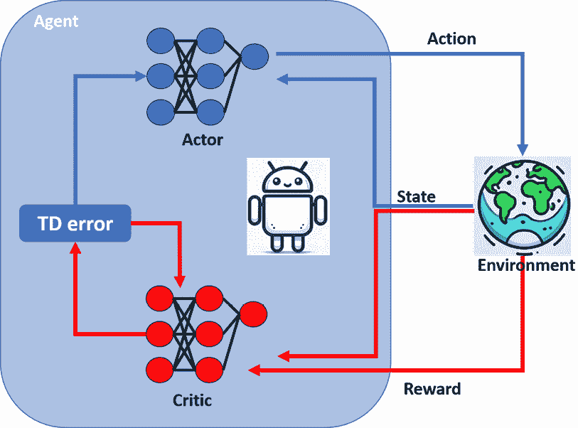

图 8.23 – 动作-评价者方法

该过程可以定义为四个步骤：

1.  代理与环境交互，并根据其策略，基于当前状态选择一个动作。然后它从环境中以奖励和新的状态的形式接收反馈。

1.  在第二步中，评价者使用奖励和新的状态来计算一个**时间差分**（**TD**）误差。TD 误差衡量评价者当前对价值函数的估计与观察结果之间的差距。TD 误差然后是时间步长 *t* 的奖励（加上评价者对下一个状态价值 *V(st+1)* 的估计的折扣因子 *γ*，以平衡即时和未来奖励的影响）与评价者对当前状态价值 *V(st)* 的估计之间的差异。

1.  评价者通过梯度下降更新其价值函数参数以最小化 TD 误差。

1.  动作评价者也会更新。动作评价者使用 TD 误差作为反馈信号。如果误差为正，这意味着动作比预期的好，动作评价者应该更频繁地采取这个动作（增加未来采取这个动作的概率）。如果误差为负，动作评价者应该减少概率。动作评价者使用梯度上升来最大化策略；我们希望最大化期望回报。

动作-评价者方法在连续动作空间中表现良好，而基于价值的方法存在问题。它是一个稳定且高效的方法，并减少了策略梯度更新的方差。另一方面，它对超参数敏感，你必须训练两个网络，并且它比 Q 学习或 REINFORCE 更复杂。

**优势动作-评价者**（**A2C**）是一个流行的变体，其中多个代理并行地与环境的多个实例交互。这允许更快地训练。

### AlphaZero

**AlphaZero** 是 DeepMind 在 2017 年开发的一个开创性的基于模型的强化学习算法，能够掌握国际象棋、将棋（日本象棋）和围棋。它已经达到了超人类的表现，在这些游戏中击败了人类冠军。AlphaZero 的成功在于其创新性地结合了深度学习和**蒙特卡洛树搜索**（**MCTS**），这使得它能够在没有人类专业知识或手工制定的规则的情况下有效地学习和规划。

AlphaZero 完全通过**自我对弈**进行学习，除了游戏的基本规则外，没有任何先验知识。它与自己进行数百万次对弈，通过试错逐渐理解什么构成好或坏的走法。这种自我对弈的方法使得 AlphaZero 能够发现最优策略，通常甚至超过由专家人类玩家开发出的策略。此外，它还使模型能够生成大量的训练数据，远远超过仅通过分析人类游戏所能获得的数据。该算法使用深度神经网络来表示策略（采取哪些行动）和价值函数（从给定状态出发游戏的预期结果）。

传统的国际象棋引擎曾经依赖于游戏树搜索技术。在每一步，它们会构建一个表示从当前位置出发所有可能合法走法的游戏树，并执行到一定深度的**深度优先搜索（DFS）**。这种蛮力搜索检查了所有合法走法，根据由棋类社区制定的启发式评估为最终节点分配值。这些启发式，如国王安全、兵的结构和中心控制，模仿了人类棋手用来判断走法质量的因素。

在评估最终节点后，传统引擎会回溯并分析位置，剪枝较少有希望的分支以简化搜索。尽管有这些优化，这种方法仍然有限制，往往导致次优走法，并且计算成本高昂。这就是 MCTS（蒙特卡洛树搜索）的用武之地。

MCTS 是一种算法，用于在需要提前规划数步的环境中进行决策，特别是在具有大状态空间的游戏中，其中全面搜索是不可行的。MCTS 通过多次模拟游戏来构建搜索树，逐渐通过经验改进对最佳行动的理解。

MCTS 通过以下四个主要步骤操作，重复以细化搜索树：

1.  **选择**：从根节点（当前状态）开始，算法使用一种平衡探索（尝试较少探索的走法）和利用（选择已显示出希望的走法）的策略选择子节点。这通常使用**树的上界置信度（UCT**）公式来完成，该公式考虑了每个节点的平均奖励和访问次数。

1.  **扩展**：如果选定的节点不是终端状态（游戏的结束），算法会添加一个或多个子节点，代表从该状态出发的可能行动。这种扩展使得搜索能够覆盖新的潜在走法和结果。

1.  **模拟（滚动出**）：从新添加的节点开始，MCTS 通过使用简单或随机策略将游戏玩到终端状态来进行模拟，或称为“滚动出”。这个模拟的结果（赢、输或平局）提供了一个奖励，作为对采取的行动价值的估计。

1.  **反向传播**：然后，将模拟的奖励反向传播到树中，更新从根节点到路径上每个节点的值。这包括更新每个节点的平均奖励和访问次数。随着时间的推移，这些更新帮助算法确定哪些移动最有希望。

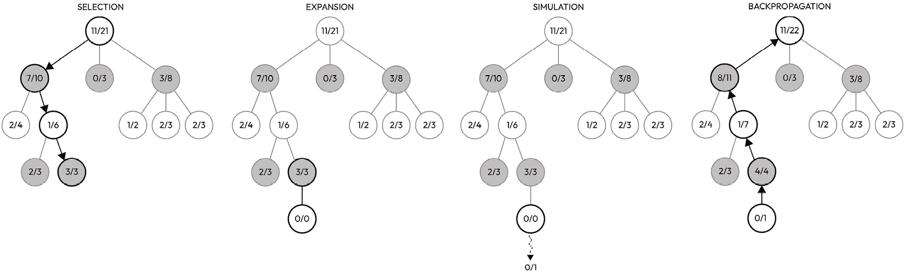

图 8.24 – 蒙特卡洛树搜索 ([`en.wikipedia.org/wiki/Monte_Carlo_tree_search`](https://en.wikipedia.org/wiki/Monte_Carlo_tree_search))

AlphaZero 随后使用一个神经网络（一个以棋盘上棋子排列为输入的卷积神经网络）并产生两个输出：策略头（所有可能移动的概率分布，指导智能体考虑哪些移动）和价值头（从当前棋盘位置获胜的可能性，帮助智能体评估各种状态的力量）。AlphaZero 使用 MCTS 来模拟潜在的移动及其结果（智能体在游戏中计划数步）。通过 MCTS，模型探索看似最有希望的移动，并逐渐提高其对游戏的理解。树搜索使用神经网络的策略和价值输出来优先考虑探索树的哪些分支。AlphaZero 通过自我对弈（自我玩耍）来学习。在每一场比赛中，智能体使用 MCTS 来决定移动并保存状态（棋盘上的位置）、选择的移动和结果。这些数据用于改进策略和价值估计（神经网络权重更新）。

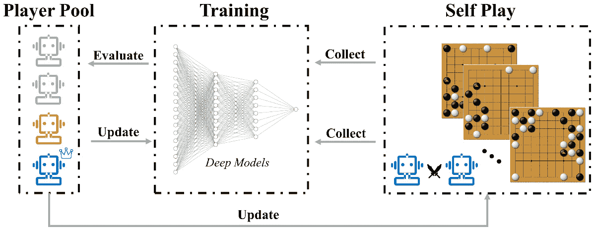

图 8.25 – AlphaZero 流程 ([`www.mdpi.com/2079-9292/10/13/1533`](https://www.mdpi.com/2079-9292/10/13/1533))

因此，AlphaZero 提出了三个主要创新：

+   **跨游戏泛化**：相同的算法用于三种不同的游戏（国际象棋、将棋和围棋），无需针对特定游戏进行调整。

+   **无需人类知识**：与使用大量人类游戏和策略数据库的传统棋类引擎不同，AlphaZero 自行学习游戏。该模型优先考虑在游戏中提供长期奖励的策略，而不是仅仅关注单个移动的即时收益。这种方法使模型能够发现人类或传统棋类引擎未曾探索的创新策略。

+   **高效的搜索和学习**：使用 MCTS 和深度学习允许更有效地使用计算资源。AlphaZero 不是对所有可能的移动进行广泛的搜索，而是仅关注最有希望的移动。

当然，AlphaZero 也不是没有缺陷。该算法的计算成本巨大，因为它必须与自己玩数百万场比赛。此外，该算法在游戏（或信息完全的环境）中表现良好，但将其适应到信息不完整的环境则更困难。最后，关于实际上理解游戏或学习抽象概念存在讨论，因为模型在某些对人类来说很容易的棋类谜题上失败了。

在下一个子节中，我们将讨论强化学习（RL）的挑战以及新的、令人兴奋的研究方向。

## 深度 RL 的挑战和未来方向

尽管 RL 取得了重大进展，但仍然存在一些挑战和活跃的研究方向：

+   **在未见过的环境中的泛化**：在智能体未见过的环境中的泛化仍然是一个复杂任务。智能体通常在模拟环境中或特定设置中进行训练，在训练后能够表现出色。然而，将学习到的技能转移到新环境、动态环境或变化条件下是困难的。这限制了深度 RL 算法在现实世界中的应用，因为现实环境很少是静态或完全可预测的。真正的泛化要求模型不仅学习特定任务的解决方案，而且能够适应各种情况（即使这些情况在训练期间没有发生）。

+   **奖励函数设计**：奖励函数控制智能体的行为、学习和表现。设计奖励函数很困难，尤其是在复杂、分散的环境中。在稀疏奖励设置中，由于反馈有限且通常延迟，定义奖励和函数是复杂但至关重要的。即便如此，仍然存在创建偏差的风险，导致策略过度拟合或出现意外行为，或者使其次优。

+   **基于模型的规划中的复合误差**：基于模型的 RL 存在复合误差的风险。预测的视野越长，模型预测中的错误积累越多，导致与最优轨迹的显著偏差。这在复杂或高维空间环境中尤其如此，因此限制了它们在现实环境中的应用。

+   **多任务学习**：创建一个可用于多个任务的智能体仍然很困难，存在风险是智能体只学会了较容易的任务而忽略了更复杂（或表现非常差的）任务。此外，多任务模型通常的表现远低于针对单个任务优化的智能体。因此，设计可用于多任务 RL 的智能体是困难的，并且仍然是一个活跃的研究领域。

+   **多模态强化学习**：随着计算机视觉和自然语言处理技术的进步，现在有一些深度学习模型可以单独处理一种模式，或者同时处理多种模式。这就是为什么越来越多的讨论使用多模态强化学习，其中智能体可以在多模态环境中移动，并整合来自各种模态的信息。例如，机器人可以从图像中获取环境信息，并以自然语言接收命令或指令。在视频游戏中，智能体接收视觉信息，但也会从与角色的对话或其他玩家那里获取信息。多模态学习仍然很复杂，因为智能体必须同时学习如何处理多模态信息并优化策略以在复杂环境中交互。同样，为这些情况设计奖励函数仍然很困难。

在下一节中，我们将看到如何使用神经网络来学习如何玩视频游戏。

## 使用强化学习学习如何玩视频游戏

在本小节中，我们将讨论如何训练智能体来玩视频游戏。在这种情况下，智能体将由神经网络参数化。遵循此策略，它将在视频游戏允许的动作中进行选择，从环境中获得反馈，并使用这些反馈进行参数更新。一般来说，视频游戏提供复杂和动态的环境，模拟现实世界场景，因此它们是强化学习算法的优秀测试平台。视频游戏提供高维状态空间（基于像素的状态，详细的世界）和丰富的动作空间（离散或连续），灵感来源于现实世界，可以提供即时和延迟的奖励（例如，某些动作可能导致主角直接死亡，而解决谜题或赢得游戏则需要长期策略）。此外，许多游戏要求用户在掌握环境之前先探索环境。敌人通常是动态的，模型必须学习如何击败对手或理解复杂行为以克服它们。游戏还提供清晰的奖励（通常是频繁的或可以加速的），这使得奖励函数可以轻松定义，从而成为一个安全的游乐场（例如，用于机器人算法）。此外，还有明确的基准，可以快速比较新算法的质量。

我们选择 actor-critic 方法进行此训练，因为它具有以下特点：

+   Actor-critic 可以处理复杂和连续的动作空间（例如控制 3D 环境中的角色），因此可以用于各种游戏。

+   系统中的 actor 直接学习策略，这使得在找到策略至关重要的场景中效率更高。这在需要快速决策和战略规划的视频游戏中是必要的。

+   与纯粹基于策略的方法相比，评论家提供了反馈并加快了学习速度。使用价值函数（评论家）来评估动作减少了策略更新的方差，因此在奖励分散的环境中更加稳定和高效。

+   行为者-评论家允许高效地管理探索和利用之间的平衡，其中行为者通过探索环境，而评论家通过提供反馈来引导它。对于更复杂的环境，行为者-评论家可能不足以满足需求，尽管它是一个良好的初始选择，并且通常足够用。

+   行为者-评论家（Actor-critic）也可以处理长期规划。在视频游戏中，往往存在长期奖励；评论家的价值函数帮助代理理解其行动的长期影响。

+   一些变体在并行化和使用数据方面效率很高。A2C 是并行化环境和收集更多数据的良好选择，从而加快训练和收敛速度。

我们选择超级马里奥作为我们的游戏，因为它提供了一个丰富且复杂的环境。这个环境类似于现实世界，像素观察作为输入的表示与真实世界计算机视觉任务相似，这使得超级马里奥成为需要从视觉数据中提取有意义特征的强化学习代理的良好测试平台。这个环境也是部分可观察的，因此需要代理去探索和学习环境。不同的关卡可能需要不同的策略，因此模型必须能够平衡探索和利用。

在游戏中，存在不同种类的挑战，例如导航障碍、面对不同种类的敌人，以及学习最优和动态地跳跃。这些不同的挑战代表了代理应该发展的不同技能：测试代理做出精确和及时行动的能力（跳过障碍或缺口），评估威胁并决定何时避免或参与（避免或参与敌人），以及空间意识和战略规划（导航复杂关卡）。关卡是逐步增加的，因此难度随着代理的学习而增加。此外，既有即时奖励（收集金币），也有延迟奖励（例如，完成关卡），从而允许评估长期策略。

最后，超级马里奥在强化学习研究社区中被广泛采用作为基准。主要的库都支持它，或者它被直接集成，从而允许快速测试算法或进行比较。同时，也有已经深入研究过的策略；游戏文档详尽，是强化学习初学者和专家的良好示例。此外，还有一些可并行化的实现，从而允许有效且快速的训练。


图 8.26 – 超级马里奥训练截图

所有代码都可以在以下链接的仓库中找到：[`github.com/PacktPublishing/Modern-AI-Agents/tree/main/chr8/RL_SuperMario`](https://github.com/PacktPublishing/Modern-AI-Agents/tree/main/chr8/RL_SuperMario)

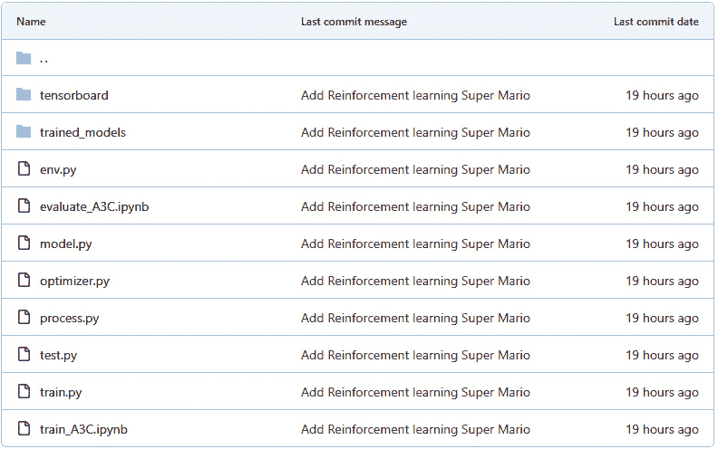

图 8.27 – 仓库截图

### 脚本描述

为了执行训练，我们将使用一些流行的强化学习库（OpenAI 的 Gym 和 PyTorch）。在仓库中，有一些用于训练智能体的不同脚本：

+   `env`：此脚本定义了我们的智能体行动的环境（超级马里奥），并允许我们记录智能体玩游戏的视频，预处理模型图像，定义奖励函数，设置世界，设置虚拟摇杆等。

+   `model`：此脚本定义了一个用于演员-评论家架构的 PyTorch 神经网络模型。该模型旨在处理类似图像的输入，提取特征，然后使用这些特征输出动作概率（演员）和状态价值估计（评论家）。

+   `optimizer`：此代码定义了一个名为 `GlobalAdam` 的自定义优化器类，它扩展了 PyTorch 内置的 Adam 优化器的功能。

+   `train`：此脚本使用**异步优势演员-评论家**（**A3C**）方法设置和运行一个分布式强化学习系统，以训练一个能够玩超级马里奥兄弟的智能体。

+   `test`：模型测试在单独的脚本中。此脚本允许您加载训练好的模型来玩游戏，同时渲染游戏过程。

+   `process`：此脚本作为连接件，将所有前面的组件集成到一个统一的强化学习系统中，用于训练和测试玩超级马里奥兄弟的智能体。

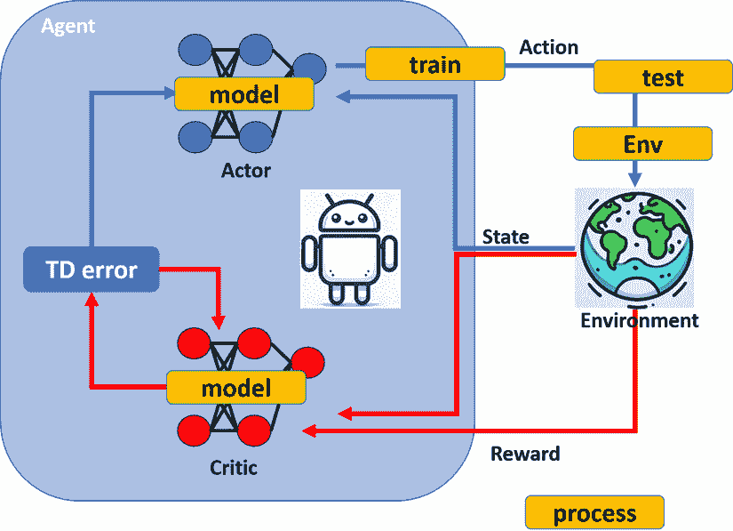

图 8.28 – 脚本的全局视图

### 设置环境

`env` 脚本允许我们设置环境，特别是对于深度 Q 学习或演员-评论家等强化学习算法。在脚本中，我们导入所需的库，之后有一些用于创建世界和定义智能体如何与之交互的函数：

+   `Monitor`：`Monitor` 类允许用户保存智能体游戏过程的视觉记录，这对于调试、分析智能体性能和分享结果非常有用。此函数允许我们使用 `.ffmpeg` 保存游戏视频。

+   `process_frame`：`process_frame` 函数用于预处理游戏帧，使其更适合训练强化学习智能体。此函数检查帧是否为正确格式，将其转换为灰度并减小尺寸，然后进行归一化（简化输入）。这允许智能体专注于视觉信息的重要细节。

+   `CustomReward`：这是对奖励的修改，以鼓励有用的行为，跟踪当前分数，添加奖励，检查代理是否完成关卡，如果没有完成则对其进行惩罚。这样，它试图通过惩罚失败来激励完成关卡并取得进步。

+   `CustomSkipFrame`：这个功能通过允许跳过帧来加速训练，从而减少计算量（更少的环境更新）。

+   `create_train_env`：这个函数设置了一个完全定制和优化的超级马里奥环境，使其准备好用高效的预处理、奖励塑造和帧跳过训练 RL 代理。

### 定义模型

在`model`脚本中，我们定义了算法的架构。`ActorCritic`类控制着架构，作为一个神经网络，它基于 PyTorch（实际上，我们使用`nn.Module`，这是 PyTorch 中的一个经典神经网络）。该类有两个组件代表`Actor`（负责选择动作）和`Critic`，它提供反馈。你可以看到我们有一个共享的特征提取器：

```py
self.conv1 = nn.Conv2d(num_inputs, 32, 3, stride=2, padding=1)
self.conv2 = nn.Conv2d(32, 32, 3, stride=2, padding=1)
self.conv3 = nn.Conv2d(32, 32, 3, stride=2, padding=1)
self.conv4 = nn.Conv2d(32, 32, 3, stride=2, padding=1)
self.lstm = nn.LSTMCell(32 * 6 * 6, 512)
```

这里，我们有一个卷积网络来从游戏中提取空间特征；然后这个输出被重塑成一个 2D 张量，传递给 LSTM。LSTM 更新隐藏状态`hx`和细胞状态`cx`（我们在*第一章*中详细描述了 LSTM），从而管理游戏记忆。

之后，我们初始化这两个组件：

```py
self.critic_linear = nn.Linear(512, 1)
self.actor_linear = nn.Linear(512, num_actions)
```

使用单个特征提取器允许我们节省计算资源。两个组件产生两个不同的输出：`actor_linear`为 actor 生成输出，它是一个大小为`num_actions`的向量。这代表了采取每个动作的概率。`critic_linear`组件为 critic 生成输出，它是一个单一的标量值。这个值代表了当前状态的估计值（从这个状态期望的回报）。这种分离确保了两个层有各自的目标和不同的学习信号。

接下来，我们将定义不同的损失函数，以便允许不同的学习。正如我们所见，两个组件产生不同的输出：

```py
def forward(self, x, hx, cx):
        x = F.relu(self.conv1(x))
        x = F.relu(self.conv2(x))
        x = F.relu(self.conv3(x))
        x = F.relu(self.conv4(x))
        hx, cx = self.lstm(x.view(x.size(0), -1), (hx, cx))
        return self.actor_linear(hx), self.critic_linear(hx), hx, cx
```

由于我们希望我们的进程针对分布式学习进行优化，我们使用 Adam 的自定义版本。Adam 是一种经典的优化器，用于更新神经网络的参数。`GlobalAdam` 类是为分布式强化学习设计的，其中多个进程或智能体共享相同的优化器。关键思想是使优化器状态的一部分在进程间共享，允许智能体高效地协调对模型参数的更新。这特别适用于演员-评论家和特别是有多个智能体在相同环境中行动的变体。想法是我们异步玩几轮游戏，然后进行全局更新，减少计算。`GlobalAdam` 脚本简单地将 Adam 适配到强化学习问题，允许从不同进程中进行平均和学习：

```py
import torch
class GlobalAdam(torch.optim.Adam):
    def __init__(self, params, lr):
        super(GlobalAdam, self).__init__(params, lr=lr)
        for group in self.param_groups:
            for p in group['params']:
                state = self.state[p]
                state['step'] = 0
                state['exp_avg'] = torch.zeros_like(p.data)
                state['exp_avg_sq'] = torch.zeros_like(p.data)
                state['exp_avg'].share_memory_()
                state['exp_avg_sq'].share_memory_()
```

### 训练模型

`train` 脚本允许我们使用不同的进程异步训练模型。脚本允许我们提供几个参数（默认参数已经输入）。例如，我们可以决定游戏的难度级别（`--world` 和 `--stage`），动作的类型（`--action_type`），优化器的学习率（`--lr`），针对算法和强化学习（RL）的特定超参数（`--gamma`，`--tau`，`--beta`），或者与进程及其并行化相关的参数（`--num_processes`，`--num_local_steps` 和 `--num_global_steps`）。

`train` 函数允许我们初始化训练环境，初始化策略，并使用 GPU。`global_model.share_memory()` 方法允许全局模型的参数对所有进程可访问，从而实现并行更新。您可以看到我们使用 `GlobalAdam` 来更新全局模型的参数。`torch.multiprocessing` 包装器（是对多进程模块的包装）允许我们创建多个异步操作的多进程。然后，此脚本定义了使用多个并行进程训练我们的模型。同时，脚本允许轻松配置和定制：

```py
def train(opt):
    torch.manual_seed(123)
    if os.path.isdir(opt.log_path):
        shutil.rmtree(opt.log_path)
    os.makedirs(opt.log_path)
    if not os.path.isdir(opt.saved_path):
        os.makedirs(opt.saved_path)
    mp = _mp.get_context("spawn")
    env, num_states, num_actions = create_train_env(opt.world, opt.stage, opt.action_type)
    global_model = ActorCritic(num_states, num_actions)
    if opt.use_gpu:
        global_model.cuda()
    global_model.share_memory()
    if opt.load_from_previous_stage:
        if opt.stage == 1:
            previous_world = opt.world - 1
            previous_stage = 4
        else:
            previous_world = opt.world
            previous_stage = opt.stage - 1
        file_ = "{}/A3CSuperMarioBros{}_{}".format(opt.saved_path, previous_world, previous_stage)
        if os.path.isfile(file_):
            global_model.load_state_dict(torch.load(file_))
    optimizer = GlobalAdam(global_model.parameters(), lr=opt.lr)
    processes = []
    for index in range(opt.num_processes):
        if index == 0:
            process = mp.Process(target=local_train, args=(index, opt, global_model, optimizer, True))
        else:
            process = mp.Process(target=local_train, args=(index, opt, global_model, optimizer))
        process.start()
        processes.append(process)
    process = mp.Process(target=local_test, args=(opt.num_processes, opt, global_model))
    process.start()
    processes.append(process)
    for process in processes:
        process.join()
```

### 测试系统

`test` 脚本允许定制，例如决定一些参数，如游戏难度、动作等。一旦我们训练了我们的模型，我们就可以加载它，玩游戏，并注册正在玩游戏的智能体。然后，模型根据其策略进行游戏，在此脚本中没有进行优化，因此允许我们观察智能体的表现。

### 连接所有组件

`process` 脚本将我们迄今为止看到的所有脚本连接成一个系统。此脚本使用 `env` 模块中的 `create_train_env` 函数来设置超级马里奥兄弟游戏环境。这是我们代理与环境交互并学习的地方。脚本还初始化了 `ActorCritic` 模型（包括演员和评论家），并使用此模型做出决策和评估游戏状态。`local_train` 函数负责训练，需要 `GlobalAdam` 优化器。此脚本还用于评估训练模型性能，因此它使用了我们在测试脚本中定义的元素。因此，这个脚本是我们拥有一个完全功能性的强化学习系统的核心部分。它协调环境、模型和训练算法，使一切协同工作以训练一个能够玩超级马里奥兄弟的代理。

`local_train` 函数使代理能够在更新共享的全局模型的同时并行训练。此函数为可重复性设置了一个种子，因此我们可以重现结果。之后，我们初始化环境（`create_train_env`）和模型（`ActorCritic`）；如果有 GPU，我们将模型移动到 GPU 并初始化 TensorBoard：

```py
def local_train(index, opt, global_model, optimizer, save=False):
    torch.manual_seed(123 + index)
    if save:
        start_time = timeit.default_timer()
    writer = SummaryWriter(opt.log_path)
    env, num_states, num_actions = create_train_env(opt.world, opt.stage, opt.action_type)
    local_model = ActorCritic(num_states, num_actions)
    if opt.use_gpu:
        local_model.cuda()
```

在这个点上，我们开始训练循环，其中每个迭代代表一次游戏回合。局部参数与全局参数同步，在每个回合结束时，LSTM 的隐藏和细胞状态被重置：

```py
local_model.train()
    state = torch.from_numpy(env.reset())
    if opt.use_gpu:
        state = state.cuda()
    done = True
    curr_step = 0
    curr_episode = 0
    while True:
        if save:
            if curr_episode % opt.save_interval == 0 and curr_episode > 0:
                torch.save(global_model.state_dict(),
                           "{}/a3c_super_mario_bros_{}_{}".format(opt.saved_path, opt.world, opt.stage))
            print("Process {}. Episode {}".format(index, curr_episode))
        curr_episode += 1
        local_model.load_state_dict(global_model.state_dict())
        if done:
            h_0 = torch.zeros((1, 512), dtype=torch.float)
            c_0 = torch.zeros((1, 512), dtype=torch.float)
        else:
            h_0 = h_0.detach()
            c_0 = c_0.detach()
        if opt.use_gpu:
            h_0 = h_0.cuda()
            c_0 = c_0.cuda()
```

在这个阶段，我们开始收集多个步骤（`opt.num_local_steps`）的经验。然后，对于某个状态，模型（局部模型）生成一组概率，并从这些概率中采样一个动作。选择了一个动作后，我们与环境交互，从而获得奖励和新的状态。对于这些步骤中的每一个，我们记录以下内容：是否结束了一个回合，动作的对数概率，价值估计，奖励和政策熵。如果回合结束，状态被重置，隐藏状态被断开以防止梯度反向传播：

```py
for _ in range(opt.num_local_steps):
            curr_step += 1
            logits, value, h_0, c_0 = local_model(state, h_0, c_0)
            policy = F.softmax(logits, dim=1)
            log_policy = F.log_softmax(logits, dim=1)
            entropy = -(policy * log_policy).sum(1, keepdim=True)
            m = Categorical(policy)
            action = m.sample().item()
            state, reward, done, _ = env.step(action)
            state = torch.from_numpy(state)
            if opt.use_gpu:
                state = state.cuda()
            if curr_step > opt.num_global_steps:
                done = True
            if done:
                curr_step = 0
                state = torch.from_numpy(env.reset())
                if opt.use_gpu:
                    state = state.cuda()
            values.append(value)
            log_policies.append(log_policy[0, action])
            rewards.append(reward)
            entropies.append(entropy)
            if done:
                break
        R = torch.zeros((1, 1), dtype=torch.float)
        if opt.use_gpu:
            R = R.cuda()
        if not done:
            _, R, _, _ = local_model(state, h_0, c_0)
```

现在，是计算损失和进行反向传播的时候了。在这里，我们使用**广义优势估计**（**GAE**）来平衡偏差和方差，从而使训练更加高效。简单来说，优势函数 *A(s,a)* 衡量了一个动作 *a* 相对于给定状态 *s* 中平均动作的好坏。在下一个脚本中，GAE 用于计算推动演员策略更新的优势值。我们使用 GAE 在演员损失中更新策略，以最大化期望回报但保持方差低。换句话说，我们希望使训练更加稳定。通过添加 GAE，训练过程变得更加高效，并且对高方差回报的噪声或偏差价值估计的不准确性的敏感性降低：

```py
        gae = torch.zeros((1, 1), dtype=torch.float)
        if opt.use_gpu:
            gae = gae.cuda()
        actor_loss = 0
        critic_loss = 0
        entropy_loss = 0
        next_value = R
        for value, log_policy, reward, entropy in list(zip(values, log_policies, rewards, entropies))[::-1]:
            gae = gae * opt.gamma * opt.tau
            gae = gae + reward + opt.gamma * next_value.detach() - value.detach()
            next_value = value
            actor_loss = actor_loss + log_policy * gae
            R = R * opt.gamma + reward
            critic_loss = critic_loss + (R - value) ** 2 / 2
            entropy_loss = entropy_loss + entropy
        total_loss = -actor_loss + critic_loss - opt.beta * entropy_loss
        writer.add_scalar("Train_{}/Loss".format(index), total_loss, curr_episode)
        optimizer.zero_grad()
        total_loss.backward()
        for local_param, global_param in zip(local_model.parameters(), global_model.parameters()):
            if global_param.grad is not None:
                break
            global_param._grad = local_param.grad
        optimizer.step()
        if curr_episode == int(opt.num_global_steps / opt.num_local_steps):
            print("Training process {} terminated".format(index))
            if save:
                end_time = timeit.default_timer()
                print('The code runs for %.2f s ' % (end_time - start_time))
            return
```

注意，我们有三个独立的损失。第一个是演员损失，它鼓励导致更高奖励的动作。评论员损失惩罚价值估计中的错误，熵损失通过惩罚过于自信的动作分布（在其他过于贪婪的惩罚策略中）来鼓励探索。一旦我们计算了总损失，我们就像任何神经网络一样执行反向传播。目前，我们已经完成了本地训练，因此我们使用本地模型的梯度来进行全局模型更新。每隔一定时间间隔，我们保存模型并将损失日志发送到 TensorBoard。当达到总的全局步数时，过程结束。

`local_test` 函数允许我们评估训练好的模型。它作为一个独立的过程运行，以测试代理使用学习到的策略的表现：

```py
def local_test(index, opt, global_model):
    torch.manual_seed(123 + index)
    env, num_states, num_actions = create_train_env(opt.world, opt.stage, opt.action_type)
    local_model = ActorCritic(num_states, num_actions)
    local_model.eval()
    state = torch.from_numpy(env.reset())
    done = True
    curr_step = 0
    actions = deque(maxlen=opt.max_actions)
    while True:
        curr_step += 1
        if done:
            local_model.load_state_dict(global_model.state_dict())
        with torch.no_grad():
            if done:
                h_0 = torch.zeros((1, 512), dtype=torch.float)
                c_0 = torch.zeros((1, 512), dtype=torch.float)
            else:
                h_0 = h_0.detach()
                c_0 = c_0.detach()
        logits, value, h_0, c_0 = local_model(state, h_0, c_0)
        policy = F.softmax(logits, dim=1)
        action = torch.argmax(policy).item()
        state, reward, done, _ = env.step(action)
        env.render()
        actions.append(action)
        if curr_step > opt.num_global_steps or actions.count(actions[0]) == actions.maxlen:
            done = True
        if done:
            curr_step = 0
            actions.clear()
            state = env.reset()
        state = torch.from_numpy(state)
```

再次，我们进行设置和初始化，并在评估模式（实际上，在推理模式下，模型在此过程中不会更新）下加载本地的 `ActorCritic` 模型。此时，我们开始循环，从全局模型中加载最后一步的权重。对于某个状态，我们计算每个动作的概率，并选择概率最高的动作。注意，在训练过程中，我们进行了动作的采样；而在评估模式下，我们则采用贪婪策略选择动作。我们与环境交互，渲染游戏，进行动作跟踪，并检查代理是否陷入困境或无限重复相同的动作。如果代理超过最大步数或陷入困境，则剧集结束，我们重置状态。此函数评估训练代理的性能，渲染游戏玩法，以便用户可以观察代理学习玩超级马里奥兄弟的情况。它确保策略有效，并提供视觉反馈。

运行脚本，我们可以看到训练是并行进行的：

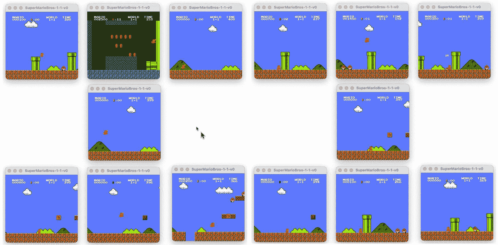

图 8.29 – 脚本运行截图

您可以在此处查看视频：[`www.youtube.com/watch?v=YWx-hnvqjr8`](https://www.youtube.com/watch?v=YWx-hnvqjr8)

总结来说，我们使用了几个脚本来实现动作-评论家算法（A3C 方法）的一个变体。这种方法涉及并行训练多个代理以探索环境、收集经验并异步更新共享的全局模型。换句话说，我们使用了一个允许我们加快训练速度并学习更鲁棒模型的变体，因为它从不同的代理那里检索不同的经验。为了更清晰的组织，我们将过程分解为几个脚本，然后将它们链接成一个单一的脚本（过程脚本）。我们定义了具有两个组件的公共提取器，以便我们可以节省一些计算。此外，我们使用 LSTM 来处理一个状态与另一个状态之间存在的时序依赖性。我们必须修改我们的优化器，因为我们需要共享内存来处理多个进程以更新全局模型。异步训练确实具有更高的复杂性，其中每个代理都需要访问和更新全局模型。之后，我们定义了如何通过收集一些经验来训练我们的模型。收集经验后，我们更新模型权重，计算损失并执行反向传播。定期地，我们同步全局和局部模型，对全局模型进行更新。之后，我们定义了如何使用全局模型的参数来评估我们的代理。代理使用学到的策略来玩游戏。

这些脚本由于采用了 A3C 方法，因此能够实现高效的并行训练。实际上，我们可以使用多个代理并行地探索环境、收集经验，然后导致全局模型更新。使用并行系统使得代理探索环境的不同部分，导致更多样化的经验，从而产生更通用的策略。一般来说，这是有利的，因为在视频游戏中可能需要不同的策略。同样地，我们添加了熵损失来鼓励探索并防止代理陷入次优策略。该脚本旨在高效利用资源，减少计算，并实现快速训练（我们没有添加经验回放缓冲区以节省内存，从而消耗更少的 RAM）。使用全局模型确保一个代理学到的知识立即对所有代理可用；这通常促进快速收敛。

选择在线策略学习方法如 A3C 可能会导致策略更新的高方差。这种方差随后可能被异步性放大，这可能会使得在运行之间获得一致的结果变得困难。实际上，异步方法引入了非确定性，意味着结果可能在运行之间有显著差异。这使得过程更不可预测，并复杂化了超参数的选择（这就是为什么我们提供了默认参数，尽管可以尝试调整它们）。虽然我们已经尝试优化此脚本的资源消耗，但整个过程仍然资源密集（就像 RL 一般）。

A3C 主要依赖于基于 CPU 的并行性；然而，采用对 GPU 友好的方法可以显著提高训练效率。例如 PPO 这样的算法可以利用 GPU 优化训练过程。有效使用 GPU 可以更高效地进行批量处理，允许积累经验并对模型进行批量更新。对于有兴趣探索基于 GPU 优化方法的读者，以下是一些潜在的想法：

+   测试不同的超参数并改变它们的值，以更好地理解它们的影响。在脚本中，您可以轻松地设置和更改超参数。我们邀请您测试 lambda (*λ*) 以找到偏差和方差之间的更好平衡。

+   尝试 PPO。PPO 是 A3C 的一个流行替代方案，它利用多个 epoch 的 mini-batch 更新。正如我们所见，它是一种促进稳定性且在许多情况下表现良好的算法。它也不需要很多超参数，默认参数通常效果良好。

+   采用同步 A2C，因为它是一个更简单、同步的 A3C 版本。这种方法并行收集经验，并使用批量进行更新。它通常较慢但更容易调试。

本项目中展示的模型可以应用于其他几个视频游戏，展示了 RL 算法如何解决实际任务。

# LLM 与 RL 模型之间的交互

RL 算法对于能够导航复杂环境、优化策略和做出决策的智能体至关重要，在机器人技术和视频游戏等领域取得了成功。另一方面，LLMs 对**自然语言处理**（**NLP**）产生了重大影响，使机器能够理解人类语言和指令。尽管可以想象潜在的协同效应，但到目前为止，这两种技术是并行发展的。然而，近年来，随着对 LLMs 兴趣的增加，这两个领域越来越多地交叉。在本节中，我们将讨论 RL 和 LLMs 之间的交互。

我们可以有三种交互情况：

+   **RL 增强 LLM**：使用 RL 增强一个 LLM 在一个或多个 NLP 任务中的性能

+   **LLMs 增强 RL**：使用 LLMs 训练一个执行非必要是 NLP 任务的 RL 算法

+   **RL 和 LLMs**：结合 RL 模型和 LLMs 来规划技能集，而不使用任一系统来训练或对另一个系统进行微调

让我们详细讨论这些内容。

## RL 增强的 LLMs

我们已经在*第三章*中讨论了对齐和提示工程。然后，RL 被用于微调、提示工程和 LLMs 的对齐。如*第三章*中提到的，LLMs 被训练来预测序列中的下一个单词，导致 LLMs 的训练目标与人类价值观之间存在不匹配。这可能导致 LLMs 生成带有偏见或其他不安全内容的文本，同样也可能在遵循指令方面表现不佳。对齐的作用是将模型重新对齐到人类价值观，或者使 LLM 在更安全的部署中更有效。最广泛使用的技术之一是**从人类反馈中进行强化学习**（**RLHF**），其中奖励是从人类偏好中推断出来的，然后用于训练 LLM。这个过程遵循三个步骤：收集人类反馈数据，在此数据上训练奖励模型，以及使用 RL 对 LLM 进行微调。通常，最受欢迎的 RL 算法选择是 PPO 或其衍生方法。实际上，我们不希望我们的对齐模型与原始模型有显著差异，这是 PPO 保证的。

与 LLMs 的交互通过提示进行，提示应浓缩我们希望 LLM 完成的任务的全部指令。一些研究工作集中在使用 RL 来设计提示。提示优化可以表示为一个 RL 问题，其目标是将人类知识融入其中，从而生成可解释和可适应的提示。代理被用来构建查询依赖和优化的提示。一个人也可以训练一个策略网络来生成期望的提示，其优点是提示通常可以在 LLMs 之间迁移。这种方法的一个有趣方面是，其中一些优化提示在语法上是“胡言乱语”，这表明对于任务的优质提示不一定需要遵循人类语言模式。

## LLM 增强的 RL

**LLM 增强的 RL**指的是使用预训练的 LLM 的多模态信息处理、生成、推理或其他高级认知能力来辅助 RL 代理的方法。换句话说，与传统 RL 的不同之处在于使用了 LLM，并以某种方式利用其知识和能力。以某种形式添加 LLM 具有双重优势：首先，LLM 拥有推理和规划技能，这有助于提高学习效率，其次，它具有更强的泛化能力。此外，LLM 在预训练阶段获得了广泛的知识，这些知识可以跨领域和任务进行迁移，从而更好地适应尚未见过的环境。通常，预训练的模型无法扩展其知识或获取新的能力（持续学习是深度学习的开放挑战），因此使用大量知识训练的模型可以帮助这一方面（LLMs 是通才，在记忆中拥有不同领域的海量信息）。

LLM 可以插入到经典 RL 系统（代理与环境交互并接收反馈）的多个点。LLM 可以集成以提取信息、重新处理状态、重新设计奖励、做出决策、选择动作、解释策略、分析世界相似性等。

(img/B21257_08_30.jpg)

图 8.30 – 经典代理-环境交互中 LLM 增强的 RL 框架([`arxiv.org/pdf/2404.00282`](https://arxiv.org/pdf/2404.00282))

因此，LLM 可以作为信息处理器、奖励设计师、决策者和生成器在系统中使用。

### 信息处理器

当一个任务需要文本信息或视觉特征时，代理同时理解信息和优化策略可能会很复杂。正如我们之前看到的，卷积神经网络可以用来处理图像，使模型能够与视频游戏或棋盘游戏交互。在聊天机器人的情况下，我们可以使用一个理解语言的模式。或者，我们可以在不直接使用语言模型的情况下，使用 LLM 提取特征，使代理能够更快地学习。LLMs 可以作为好的特征提取器，从而降低信息的维度和复杂性。或者 LLMs 可以将自然语言翻译成代理能够理解的特定形式化语言。例如，在机器人案例中，不同用户的自然语言可能不同且不统一，这使得代理难以学习。LLM 可以将指令转换成标准、形式化的语言，使代理更容易学习。

一个广泛的预训练模型学习数据的表示，然后可以用于后续的应用。因此，一个模型可以用来提取我们可以用来训练智能体的数据表示。一个 LLM 可以被冻结使用（即，不需要进一步训练）来提取环境的压缩历史表示。一些研究使用 LLM 来总结提供给智能体的过去视觉观察，这样我们就可以为智能体提供一个记忆。使用冻结的模型显然是最简单的替代方案，但当智能体在现实世界中部署时，由于现实世界的变化与训练环境之间的差异，性能可能会迅速下降。因此，我们可以对智能体和 LLM 进行微调。使用特征提取器（一个 LLM 或其他大型模型）使智能体更容易学习，因为这些特征对环境变化（亮度、颜色等变化）的鲁棒性更强，但另一方面，它们有额外的计算成本。

LLM 的能力可以用来使任务更清晰。例如，自然语言中的指令可以通过 LLM 调整为对智能体更清晰的指令集（例如，在玩视频游戏时，任务的文本描述可以转换为一套关于如何移动角色的指令）。LLM 还可以用来将智能体的环境翻译成可用的信息。这些方法特别有前景，但目前范围有限。

(img/B21257_08_31.jpg)

图 8.31 – LLM 作为信息处理器([`arxiv.org/pdf/2404.00282`](https://arxiv.org/pdf/2404.00282))

### 奖励设计师

当问题知识可用，或者当奖励可以通过一个清晰且确定性的函数定义（例如游戏得分或胜负条件）时，设计奖励函数是直接的。例如，在 Atari 游戏（或其他游戏）中，很容易绘制出奖励函数（例如，胜利代表一个积极信号，失败代表一个消极信号）。在许多应用中，这是不可能的，因为任务既长又复杂，奖励分散，等等。在这种情况下，LLM 固有的知识（在预训练期间获得的知识、编码能力和推理技能）可以用来生成奖励。它可以间接使用（隐式奖励模型）或直接使用（显式奖励模型）。例如，用户可以在提示中定义期望的行为，LLM 可以在训练期间评估智能体的行为，提供奖励和惩罚。因此，你可以使用 LLM 的直接反馈，或者 LLM 可以生成奖励函数的代码。在第二种方法中，函数可以在训练期间由 LLM 修改（例如，在智能体获得一些技能后，使其更难获得奖励）。

一个 LLM 可以是一个隐式奖励模型，它根据任务描述提供奖励（或辅助奖励）。实现这一点的技术之一是直接提示，其中向 LLM 提供指令以评估代理的行为或决定奖励。这些方法可以模拟人类反馈以实时评估代理的行为。或者，可以使用对齐分数，例如，在动作结果和目标之间（换句话说，评估预期结果与现实之间的相似性）。在某些方法中，使用语言指令和代理的图像观察之间的对比对齐，从而利用多模态模型。显然，对齐人类意图和 LLM 奖励生成的过程并不容易。可能会有歧义，系统并不总是能够处理低质量的指令，但这似乎是一条有希望的途径。

显式奖励模型利用了 LLM 生成代码的能力，从而生成一个函数（使 LLM 的决策和奖励生成过程更加透明）。这允许自动生成子目标的函数（例如，让机器人通过使用 LLM 翻译成奖励函数的高级指令来学习低级任务）。这种方法的主要局限性是 LLMs 的常识推理限制。LLMs 无法进行真正的推理或真正的泛化，因此它们受限于预训练期间所见的内容。在预训练期间，LLMs 没有看到高度专业化的任务，因此限制了这些方法在选定任务集上的适用性。添加上下文和附加信息可以缓解这个问题。

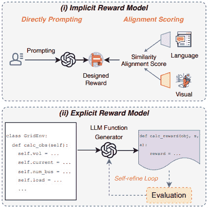

图 8.32 – LLM 作为奖励设计师 ([`arxiv.org/pdf/2404.00282`](https://arxiv.org/pdf/2404.00282))

### 决策者

由于在许多情况下 RL 存在样本和探索效率低下的问题，LLMs 可以在决策中使用，从而帮助选择行动。LLMs 可以用来减少某个状态下的动作集合（例如，当存在许多可能的动作时）。减少动作集合减少了探索空间，从而提高了探索效率。例如，LLM 可以用来训练机器人在世界中的行动，减少探索时间。

变换器（或其衍生模型）在强化学习（RL）中显示出巨大的潜力。其背后的想法是将这些问题视为序列建模问题（而不是试错）。因此，LLM 可以被看作是一个决策模型，它必须决定一系列问题（正如我们在*第二章*中提到的，变换器是在一系列问题上进行训练的，因此对一系列状态做出决策符合其训练）。一个 LLM 可以被微调以利用模型的内部表示。实际上，通过这种方式，我们利用从 LLM（使用大量文本进行训练，LLM 已经积累了大量可以应用于任务的已知知识）学习到的表示来决定一个动作。使用先验知识减少了数据收集和探索的需求（因此，提高了样本效率），并使系统在长期奖励或稀疏奖励环境中更加高效。一些研究表明，不仅从 LLM 学习到的知识可以转移到其他模型，而且整个系统在不同基准上的性能也得到了提高。此外，视觉-语言模型可以用来使系统能够适应多模态环境。将 LLM 用作决策者仍然计算成本高昂（即使仅在推理中使用且不需要微调）。因此，当前的研究正致力于尝试降低这些方法的计算成本。

或者，LLM 可以通过生成合理的动作候选或专家动作来引导智能体选择动作。例如，在基于文本的游戏等环境中，动作空间非常大，而目前只有一小部分动作可用，因此智能体可以通过广泛的试错来学习；然而，这种探索效率非常低。LLM 可以通过理解任务来生成动作集，从而减少动作空间。这使得减少探索并使其更有效率、收集更多奖励和加快训练成为可能。通常，在这些方法中，我们有一个生成动作集的 LLM 和另一个生成候选动作 Q 值的神经网络。相同的方法已经扩展到需要遵循人类指令的机器人，其中 LLM 生成可能的动作。这种方法由于 LLM 的偏差和局限性的继承而受到限制（因为 LLM 决定动作空间并根据其知识和偏差生成它）。


图 8.33 – 作为决策者的 LLM ([`arxiv.org/pdf/2404.00282`](https://arxiv.org/pdf/2404.00282))

### 生成器

基于模型的 RL 依赖于世界模型来学习环境的动态并模拟轨迹。LLM 的能力可以是生成准确的轨迹或解释策略选择。

LLM 具有固有的生成能力，使其可以用作生成器。然后，LLM 可以用作世界模型模拟器，系统生成智能体用于学习和规划的准确轨迹。这已经在视频游戏中得到应用，其中 LLM 可以生成轨迹，从而减少智能体学习游戏所需的时间（提高样本效率）。LLM 的生成能力还可以用于预测未来。尽管前景看好，但仍然难以将 LLM 的抽象知识与环境现实对齐，限制了其生成能力的影响。

另一种有趣的方法是使用一个大型语言模型（LLM）来解释强化学习（RL）系统的策略。**可解释的强化学习**（**XRL**）是可解释机器学习和强化学习交叉领域的一个新兴子领域。XRL 旨在向人类清晰地解释智能体的行为。然后，LLM 可以用来用自然语言解释智能体为何做出某种决策或对环境变化做出某种反应。作为一个策略解释器，给定一个状态和一个动作，LLM 应该解释智能体的行为。这些解释应该对人类来说是可理解的，从而允许检查智能体的安全性。当然，解释的质量取决于 LLM 理解环境特征表示和政策隐含逻辑的能力。使用领域知识或例子来提高对复杂策略（尤其是对复杂环境）的理解是困难的。

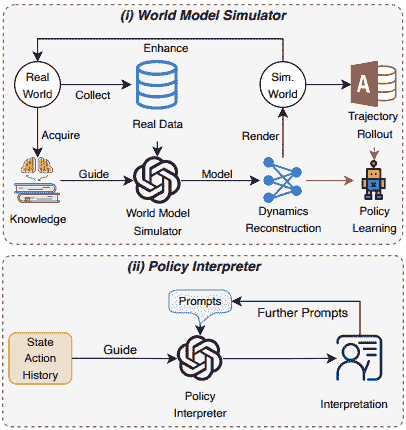

图 8.34 – LLM 作为生成器 ([`arxiv.org/pdf/2404.00282`](https://arxiv.org/pdf/2404.00282))

LLM 增强的 RL 可以在各种应用中发挥作用：

+   **机器人技术**：使用 LLM 可以提高人类与机器人之间的交互，帮助机器人更好地理解人类需求或人类逻辑，并提高它们的决策和规划能力。

+   **自动驾驶**：在自动驾驶中，强化学习用于在复杂环境中做出决策，这些环境复杂，需要分析来自不同传感器（视觉、激光雷达、雷达）的输入，并考虑上下文信息（交通法规、人类行为、意外问题）。LLM 可以提高处理和整合这种多模态信息的能力，更好地理解指令，并改善目标和奖励（例如，设计考虑安全、乘客舒适度和发动机效率的奖励函数）。

+   **医疗建议**：在医疗保健中，强化学习用于学习建议和推荐。LLM 可以用于其广泛的知识和能够分析大量患者数据和医疗数据的能力，加速智能体的学习过程，或为更好的学习提供信息。

+   **能源管理**：强化学习用于提高能源的使用、运输、转换和储存。此外，它预计将在未来的技术（如核聚变）中发挥重要作用。LLM 可用于提高样本效率、多任务优化等。

尽管有这些机会，但在强化学习中使用 LLM 也存在一些局限性。第一个挑战是 LLM 增强的 RL 范式高度依赖于 LLM 的能力。LLM 存在偏差并且可能产生幻觉；智能体随后从 LLM 继承了这些问题。此外，LLM 还可能误解任务和数据，尤其是在它们复杂或嘈杂时。此外，如果任务或环境没有在它们的预训练中表示，LLM 在适应新环境和任务时会有问题。为了限制这些影响，已经提出了使用合成数据、微调模型或使用持续学习的方法。持续学习可能允许模型适应新任务和新环境，而不会忘记模型之前学到的内容。然而，到目前为止，持续学习和灾难性遗忘仍然是深度学习中的开放性问题。

此外，添加一个大型语言模型（LLM）会带来更高的计算成本（在训练和推理过程中），以及延迟时间的增加。可以使用几种技术来降低这种计算成本，例如量化、剪枝或使用小型模型。一些方法使用*专家混合*，允许条件计算、变换器变体（状态空间模型）、缓存策略等。

最后，不应忘记使用 LLM 也引发了道德、法律和安全问题。我们在*第三章*中看到的问题也适用于这些系统。例如，数据隐私和知识产权仍然是敏感领域（如医疗保健或金融）应用中的开放性问题。

# 关键要点

由于本章在理论方面内容密集，我们决定添加一个小结部分。本章介绍了强化学习（RL）作为使智能体通过与环境交互并通过试错来学习的一种核心方法，类似于人类通过行动、观察结果和调整行为来学习的方式。RL 与监督学习不同，它侧重于从奖励而非标记数据中学习，并且特别适合具有延迟反馈和演变决策序列的任务。

强化学习是一种机器学习范式，其中智能体通过与环境的交互来学习做出决策，以最大化累积奖励。它通过试错来学习，平衡探索（尝试新动作）和利用（使用已知策略）。

总结来说，我们有以下几类方法：

+   **无模型与** **基于模型** **的强化学习**：

    +   **无模型方法**（例如，DQN、REINFORCE）直接从交互中学习，而不对环境进行建模。它们更简单且更具可扩展性。

    +   **基于模型的方法**使用内部模型来模拟结果并提前规划。它们更有效率，适用于规划至关重要的环境，但设计和计算更困难。

+   **策略方法与离策略方法的比较**：

    +   **离策略方法**从当前策略生成的数据中学习（例如 REINFORCE、PPO），这使得它们更稳定但样本效率较低。

    +   **离策略方法**（例如 DQN）可以从过去或替代策略中学习，从而提高样本效率和探索灵活性。

+   **讨论的主要算法**：

    +   **Q-Learning 和 DQN**：使用查找表或神经网络学习价值函数。

    +   **REINFORCE**：使用随机策略的基本策略梯度方法。

    +   **PPO**：通过剪辑策略更新来平衡稳定性和性能。

    +   **Actor-Critic**：结合价值估计和政策学习，以实现更稳健的更新。

    +   **AlphaZero**：将深度学习与蒙特卡洛树搜索相结合，用于复杂游戏中的基于自我对弈的策略优化。

+   **实际应用案例**：

    +   **游戏**：例如 AlphaZero 和 DQN 这样的强化学习代理已经掌握了围棋、象棋和 Atari 游戏等。

    +   **机器人技术**：强化学习允许机器人通过模拟和现实世界的反馈学习复杂的运动和交互策略。

    +   **自动驾驶汽车**：强化学习使代理能够在动态和不确定的环境中学习驾驶策略。

    +   **优化和控制**：应用于金融、医疗保健、物流和工业自动化中的顺序决策。

# 摘要

在前几章中，主要问题是如何找到信息以及如何有效地将信息传递给一个语言模型（LLM）。在这种情况下，模型是一个被动代理，接收信息并做出响应。在本章中，我们试图摆脱这种范式，转向一个理念，即代理探索环境，通过这种探索学习，执行动作，并从环境提供的反馈中学习。在这种观点下，模型是一个主动组件，与环境互动并可以对其进行修改。这种观点也与人类学习的方式更为接近。在我们对外部世界的探索中，我们接收到的反馈引导我们的学习。尽管世界的大部分内容已经在文本中被记录下来，但现实世界不能简化为文本描述。因此，代理在与世界互动之前无法学习某些知识和技能。强化学习是人工智能的一个领域，它关注代理与环境之间的互动以及它如何从中学习。

因此，在本章中，我们介绍了强化学习（RL）的基础知识。在第一部分，我们讨论了 RL 系统的基本组成部分（代理、环境、奖励和动作）。然后，我们讨论了 RL 的主要问题，即如何平衡探索和利用。实际上，代理有一个目标（完成任务），但通过探索来学习如何完成这个任务。例如，我们在多臂老虎机示例中看到，贪婪模型的表现不如探索所有可能性的模型。当我们定义代理来解决复杂问题，如解决视频游戏时，这一原则仍然是基本的。为了解决复杂任务，我们引入了神经网络（深度强化学习）的使用。我们看到了不同类型的算法具有不同的优缺点，并看到了我们如何将其中之一设置为在经典视频游戏中获胜。一旦我们训练了我们的模型，我们就讨论了 LLM 和 RL 领域如何日益交叉。这样，我们就看到了两个领域的优势如何协同作用。

从本章开始，重点将更加应用性。我们将看到代理通常如何完成任务。在接下来的章节中，代理将主要是一个 LLM，它将使用工具执行动作和完成任务。因此，代理的选择将不是采取哪个动作，而是选择哪个工具来完成一个任务。尽管 LLM 代理与环境交互，但一个主要区别是不会有训练。训练 LLM 是一个复杂任务，因此在这些系统中，我们尽量减少训练。如果在之前的章节（*5–7*）中，我们试图利用 LLM 的理解能力，那么在接下来的章节中，我们将尝试利用 LLM 与环境或与其他代理交互的技能——这些技能无论如何都是可能的，因为 LLM 可以理解任务和指令。

# 进一步阅读

+   Ghasemi, *《强化学习导论：基本概念与实际应用*》，2024 年，[`arxiv.org/abs/2408.07712`](https://arxiv.org/abs/2408.07712)

+   Mnih, *《使用深度强化学习玩 Atari 游戏*》，2013 年，[`arxiv.org/abs/1312.5602`](https://arxiv.org/abs/1312.5602)

+   Hugging Face, *《近端策略优化（**PPO**）*》，[`huggingface.co/blog/deep-rl-ppo`](https://huggingface.co/blog/deep-rl-ppo)

+   Wang, *通过* *LearningREINFORCE* *学习强化学习*，[`www.cs.toronto.edu/~tingwuwang/REINFORCE.pdf`](https://www.cs.toronto.edu/~tingwuwang/REINFORCE.pdf)

+   Kaufmann, *《基于人类反馈的强化学习概述*》，2024 年，[`arxiv.org/pdf/2312.14925`](https://arxiv.org/pdf/2312.14925)

+   Bongratz, *《如何选择强化学习算法*》，2024 年，[`arxiv.org/abs/2407.20917v1`](https://arxiv.org/abs/2407.20917v1)

+   Schulman, *《近端策略优化算法*》，2017 年，[`arxiv.org/abs/1707.06347`](https://arxiv.org/abs/1707.06347)

+   OpenAI, *《近端策略优化》*, [`openai.com/index/openai-baselines-ppo/`](https://openai.com/index/openai-baselines-ppo/)

+   OpenAI Spinning UP, *《近端策略优化》*, [`spinningup.openai.com/en/latest/algorithms/ppo.html`](https://spinningup.openai.com/en/latest/algorithms/ppo.html)

+   Bick, *《迈向对近端策略优化的连贯自包含解释》*, 2021, [`fse.studenttheses.ub.rug.nl/25709/1/mAI_2021_BickD.pdf`](https://fse.studenttheses.ub.rug.nl/25709/1/mAI_2021_BickD.pdf)

+   Silver, *《通过通用强化学习算法自我博弈掌握国际象棋和将棋》*, 2017, [`arxiv.org/abs/1712.01815`](https://arxiv.org/abs/1712.01815)

+   McGrath, *《AlphaZero 中棋类知识的获取》*, 2021, [`arxiv.org/abs/2111.09259`](https://arxiv.org/abs/2111.09259)

+   DeepMind, *《AlphaZero：对国际象棋、将棋和围棋的新见解》*, 2018, [`deepmind.google/discover/blog/alphazero-shedding-new-light-on-chess-shogi-and-go/`](https://deepmind.google/discover/blog/alphazero-shedding-new-light-on-chess-shogi-and-go/)

+   Gao, *《利用领域知识高效掌握 NoGo 游戏与深度强化学习》*, 2021, [`www.mdpi.com/2079-9292/10/13/1533`](https://www.mdpi.com/2079-9292/10/13/1533)

+   Francois-Lavet, *《深度强化学习导论》*, 2018, [`arxiv.org/abs/1811.12560`](https://arxiv.org/abs/1811.12560)

+   Tang, *《机器人深度强化学习：现实世界成功案例综述》*, 2024, [`arxiv.org/abs/2408.03539`](https://arxiv.org/abs/2408.03539)

+   Mohan, *《深度强化学习中的结构：综述与开放性问题》*, 2023, [`arxiv.org/abs/2306.16021`](https://arxiv.org/abs/2306.16021)

+   Cao, *《关于大型语言模型增强的强化学习综述：概念、分类法和方法》*, 2024, [`arxiv.org/abs/2404.00282`](https://arxiv.org/abs/2404.00282)

# 第三部分：创建解决复杂场景的复杂 AI

本最后一部分专注于将前几章中介绍的部分组件组装起来，以构建完全成熟、适用于生产的 AI 系统。它从单代理和多代理系统的设计和编排开始，其中 LLMs 与工具、API 和其他模型协作，以解决复杂的多步骤任务。该部分随后引导您了解使用现代工具（如 Streamlit、异步编程和 Docker 等容器化技术）构建和部署 AI 代理应用程序的实际方面。最后，本书以对 AI 代理未来的展望结束，讨论其在医疗保健和法律等行业的跨行业影响，以及未来面临的伦理和技术挑战。本部分使您能够从实验过渡到现实世界的部署，为参与下一波智能系统做好准备。

本部分包含以下章节：

+   *第九章**，创建单代理和多代理系统*

+   *第十章**，构建人工智能代理应用*

+   *第十一章**，未来的展望*
