# 创建单代理和多代理系统

在前面的章节中，我们讨论了许多可以与 LLMs 相关联的组件或工具，以扩展其功能。在*第五章*和*第六章*中，我们详细讨论了如何使用外部记忆来丰富上下文。这允许模型获得额外的信息，以便在它不知道答案时（当它在预训练期间没有看到文档或它涉及训练日期之后的信息）回答用户的问题。同样，在*第七章*中，我们看到了知识图谱可以用来扩展模型的知识。这些组件试图解决 LLMs 最令人头疼的限制之一，即幻觉（模型产生的非事实正确的输出）。此外，我们还看到，使用图可以使模型进行图推理，从而增加新的能力。

在*第八章*中，我们看到了强化学习（RL）和 LLMs 的交集。与 LLMs 相关的一个问题是它们可能会产生有害内容（如偏见或有害内容或错误信息）。RL 算法使我们能够使模型的行为与人类偏好保持一致，从而降低有害内容的风险。

我们可以使用类似的方法使模型更擅长执行任务或遵循指令。在未来，这些强化学习算法可能有助于克服 LLMs 的一个重要限制：缺乏持续学习。

正如我们将看到的，工具的定义相当广泛。实际上，任何软件或算法都可以是工具。正如我们在前面的章节中已经看到的，LLMs 可以执行代码或连接到**应用程序编程接口**（**APIs**）。但这意味着它们也可以调用其他模型来执行它们自己无法完成的任务。

在任何情况下，所有这些元素都为所谓的代理革命奠定了基础，在这个革命中，LLM 可以与环境交互并在现实世界中执行任务（无论是互联网还是未来，超越计算机的限制）。

在本章中，我们专注于大型语言模型（LLMs），其各种工具，以及如何将这些工具结合起来与环境交互。我们将从自主代理的定义开始，然后继续讨论工具（APIs、模型等）是什么以及它们如何被组织。我们将看到使用提示工程技巧（我们在*第三章*中讨论过）如何使我们能够创建不同类型的代理。之后，我们将讨论文献中先前使用的一些策略，这些策略用于将 LLM 连接到其工具。

这将使我们能够详细了解一些技术限制和挑战是如何被解决的。然后，我们将详细讨论 HuggingGPT（一个连接到数百个模型的 LLM），这是代理创建的一个转折点。我们将看到 HuggingGPT 如何允许 LLM 使用其他专家模型解决复杂任务。然后，我们将看到如何创建多代理平台，而不是单个代理。不同代理的交互将使我们能够解决越来越复杂的问题。此外，我们将看到这些方法如何应用于复杂领域，如医疗保健、化学和法律。然后，我们将使用 HuggingGPT 将我们所学的内容付诸实践。接下来，我们将通过一个多代理平台扩展这一概念，这将使我们能够理解现代系统是如何工作的。

一旦我们了解了代理或多代理的工作方式，我们将详细讨论新兴的新商业模式，例如**软件即服务**（**SaaS**）、**模型即服务**（**MaaS**）、**数据即服务**（**DaaS**）和**结果即服务**（**RaaS**）或**成果即服务**（**OaaS**）。正如我们将在本章中看到的，这些商业模式各有优缺点。

在本章中，我们将涵盖以下主题：

+   自主代理简介

+   HuggingGPT 和其他方法

+   与 HuggingGPT 一起工作

+   多代理系统

+   SaaS、MaaS、DaaS 和 RaaS

# 技术要求

本章中的代码需要使用 GPU。特别是对于使用 HuggingGPT 的部分，需要 GPU 和硬盘驱动器上的大量空间（将下载多个模型，包括扩散模型。为此，将需要使用 Git **大型文件存储**（**LFS**），它允许通过 Git 下载大文件）。应安装 Anaconda 以获取各种库（必要的库将在安装过程中直接设置）。对于没有这些资源的读者，*使用 HuggingGPT 在网络上*部分展示了如何在网上使用 HuggingGPT。对于本地使用 HuggingGPT，需要 OpenAI 令牌，而对于网络使用，也需要 Hugging Face 令牌。多代理系统基于 Python 库（NumPy、scikit-learn、SentenceTransformers 和 Transformers）。

HuggingGPT 应在 GPU 上运行。多代理系统应在 GPU 上运行，但也可以在 CPU 上运行；然而，这被高度不建议。代码可以在 GitHub 上找到：[`github.com/PacktPublishing/Modern-AI-Agents/tree/main/chr9`](https://github.com/PacktPublishing/Modern-AI-Agents/tree/main/chr9)。

# 自主代理简介

在人工智能的背景下，**自主代理**指的是可以独立执行任务或做出决策的系统或实体，而无需人类干预。这些代理被设计为感知其环境，对其进行分析，根据其目标做出决策，并据此采取行动以实现这些目标。自主代理被认为是通往**通用人工智能**（AGI）的重要一步，AGI 预计将进行自主规划和行动。

使用 LLMs 作为代理的主要原因在于 LLMs 已经显示出一些推理和规划能力。LLMs 使用推理来解释输入，进行推理，并做出决策（显示出一定程度的演绎、归纳和类比推理）。这使得 LLMs 能够将一般规则应用于特定情况（演绎推理），从例子中学习模式（归纳推理），并从不完全数据中推断解释（类比推理）。此外，LLMs 能够通过串联想法进行逐步推理，从而使其能够解决方程或调试代码。解决某些问题（如数学问题）需要遵循一系列步骤。本质上，一个 LLM 必须经常将任务分解成一系列动作，预测这些动作的结果，并根据结果调整其行为。然而，这些能力仅限于用户提供的上下文或预训练期间获得的知识，对于医学或金融等领域，这不足以解决大多数问题。因此，对此限制的自然反应是扩展 LLM 的能力，使用外部工具，或者将 LLM 连接到外部环境。

因此，一些研究和研究的目的是通过一系列工具来扩展大型语言模型（LLMs）的能力。这些工作和由此产生的库试图为 LLMs 配备人类能力，例如记忆和规划，使它们的行为像人类一样，并有效地完成各种任务。

随着 LLMs 能力的不断发展，对这些代理的兴趣也在增长，已经发表了众多文章和框架。

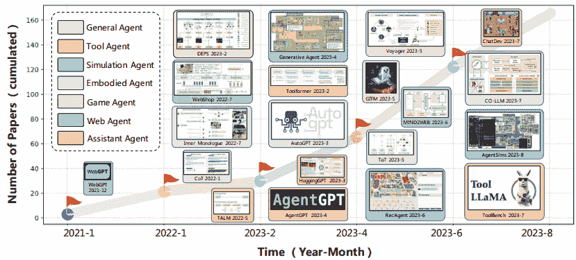

图 9.1 – 对 LLM 自主代理的兴趣日益增长 ([`arxiv.org/pdf/2308.11432`](https://arxiv.org/pdf/2308.11432))

在构建这些类型的系统时，首先要考虑的是架构的设计以及如何使用它来执行任务。自主代理必须执行不同的角色，感知环境，并从中学习。架构的目的是帮助 LLM 最大化其能力，以便用作代理。为此，已经开发出几个模块，可以分为四个主要组：配置文件、记忆、规划和行动。

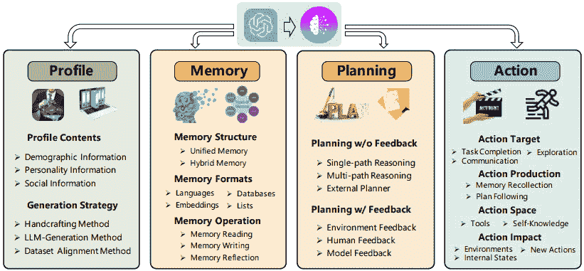

图 9.2 – 构建基于 LLM 的自主代理的可能模块 ([`arxiv.org/pdf/2308.11432`](https://arxiv.org/pdf/2308.11432))

让我们更详细地逐一介绍这些内容：

+   **配置文件模块**：通常，代理在特定的角色（也称为角色扮演）中执行任务，例如编码者、领域专家、教师或助手。配置文件模块负责在给定的 LLM 特定提示中定义这些角色（特征、角色、心理和社会信息，以及与其他代理的关系）。然后，这些配置文件可以是手写的（手写配置文件是由开发者或领域专家手动制作的个人或角色定义）；例如，对于软件开发系统，我们可以创建不同的工作角色（“你是一名负责代码审查的软件工程师”）。手写配置文件允许高度的控制、丰富上下文，并且可以高度特定于领域（解决细微差别、软技能、复杂知识）。尽管手写方法非常灵活，但它耗时且可扩展性有限。因此，一些研究探索了 LLM 自动生成配置文件的系统（使用少量示例、规则和模板，或特定外部数据集作为工作描述）。这种方法具有更高的可扩展性和对不同情况的适应性（特别是如果系统需要动态或如果收到用户反馈）。然而，另一方面，控制程度较低（系统失去了细微差别和深度，存在变得通用的风险），质量参差不齐（取决于提示工程技术，一些示例可能质量较差），并且仍然需要人工验证。

+   **记忆模块**：记忆模块存储系统从环境或其他来源感知到的信息；这些记忆随后有助于未来的行动。专门的记忆组件也可以是复杂的，并受到人类认知的启发，具有针对感知、短期或长期信息的组件。常见的记忆随后被输入到系统提示中（因此 LLM 的上下文长度是可用于代理的记忆的限制）。例如，完成任务所需的与用户的聊天历史。作为另一个例子，协助游戏开发的代理将具有刚刚发生的事件和其他描述作为短期记忆。**混合记忆**是一种扩展记忆的方法，其中过去的事件和思想被保存并再次找到，以促进代理的行为。混合记忆结合了短期（在 LLM 上下文中）和长期（外部）记忆，以扩展代理的能力，使其超越 LLM 的上下文窗口。这些思想、对话或其他信息可以通过 RAG 或其他系统（数据库、知识图谱等）保存。当需要时，相关信息被检索并注入到 LLM 提示中，使代理能够根据先前知识行事，而不超过上下文限制。例如，在 RAG 中，搜索机制根据当前查询检索相关的文档或记忆片段，使响应在时间上更加知情和一致。此外，此模块应涵盖三个操作：记忆读取（提取对代理行动有用的信息）、记忆写入（存储可能对未来有用的环境信息，同时避免重复和内存溢出），以及记忆反思（评估和推断更抽象、复杂和高级的信息）。具体来说，记忆读取检索信息以支持代理的决策（增加上下文的连续性和一致性），记忆写入允许保存对代理与环境交互有用的信息（从而减少冗余并允许克服不可编辑记忆的限制），而记忆反思允许从存储信息的分析中得出见解，从而允许调整行为以实现目标。

+   **规划模块**：规划模块通常用于将复杂任务分解成更易于管理的任务，以使大型语言模型（LLM）的行为更加合理、强大和可靠。规划模块可以包含或不包含反馈。

    在没有反馈的规划中，代理在执行行动后不会收到影响其未来行为的反馈。在单路径推理中，任务被分为几个中间步骤，这些步骤以级联序列连接。**思维链**（**CoT**）推理通常用于为这种策略制定逐步计划。相比之下，多路径推理涉及一个树状结构，其中每个中间步骤都可以分支成多个后续步骤。这些方法通常利用**自洽思维链**（**CoT-SC**）或**思维树**（**ToT**）框架，以评估所有中间步骤以确定最佳策略。该树甚至可以与复杂的策略相结合，如**蒙特卡洛树搜索**（**MCTS**）或外部规划器。

    带反馈的规划主要用于长期任务，在这种情况下，从开始就难以生成有效的计划，或者动态可能发生变化。因此，你可以结合来自环境和观察的反馈。例如，ReAct 框架使用思考-行动-观察三元组。另一种选择是使用人类反馈或另一个模型来提高代理的规划能力。

(img/B21257_09_03.jpg)

图 9.3 – 单路径和多路径推理策略的比较([`arxiv.org/pdf/2308.11432`](https://arxiv.org/pdf/2308.11432))

+   **动作模块**：动作模块负责将规划转化为特定的结果；然后该模块负责交互。一般来说，该模块专注于任务的执行以及具有特定目标的行为。该模块还负责与其他代理（如果存在）通信、探索环境、寻找必要的记忆以及执行计划。为了实现这些目标，LLM 可以使用在预训练阶段从 LLM 获得的知识或外部工具（外部模型、API、数据库或其他工具）。预训练知识允许 LLM 使用学习到的信息执行许多任务，例如生成文本、回答问题或根据先前数据做出决策。然而，对于更动态、实时或专业的任务，动作模块使用外部工具，如 API、数据库、软件应用程序或其他模型。这些工具使代理能够访问最新信息、操作数据、执行计算或在外部系统中触发操作。预训练知识和外部工具共同使代理能够与环境进行有意义的交互，实现目标，并根据其行动的结果进行适应。模型的行为对环境或模型内部状态有影响，并由该模块评估和考虑。

除了系统架构之外，我们还应该考虑开发更好代理的策略。通常，最常用的策略之一是对模型进行微调。微调通过将通用 LLM 适应特定任务、领域或行为目标，在提高代理性能方面发挥着关键作用。它有助于使模型与人类价值观（安全性）保持一致，提高指令遵循性，或在教育或电子商务等领域进行专业化。在大多数情况下，用于特定任务的数据集都是人工标注的。正如我们在*第三章*中讨论的那样，这可能是出于安全原因（与人类价值观保持一致）、使其更易于遵循指令（指令调整）或训练特定领域或任务。以 WebShop 为例([`arxiv.org/pdf/2308.11432`](https://arxiv.org/pdf/2308.11432))，论文的作者们收集了来自 [amazon.com](http://amazon.com) 的 120 万个世界产品，并创建了一个模拟的电子商务网站。之后，他们收集了网站上的用户行为（当用户在网站上浏览和执行操作时，他们的行为会被记录），从而创建了一个专门用于帮助产品选择的代理的微调数据集。或者，在 EduChat 的例子([`arxiv.org/pdf/2308.11432`](https://arxiv.org/pdf/2308.11432))中，为了创建一个用于教育场景的代理，作者们收集了一个覆盖各种教育场景的标注数据集（数据集由心理学家等专业人士评估和编辑）。

收集这些数据集成本高昂，并且在某些情况下需要专业的技术人员。因此，一个替代方案是使用大型语言模型（LLM）来标注数据集。当采用这种方法时，质量和成本之间存在权衡：数据集不如人工标注的好，但成本大幅降低。例如，在 ToolBench（一个将 LLM 连接到 API 的代理系统）中，该工作的作者们([`arxiv.org/pdf/2308.11432`](https://arxiv.org/pdf/2308.11432))收集了超过 16,000 个真实世界的 API，然后使用 ChatGPT 对此数据集进行标注。然后，他们在该数据集上微调了 LLaMA。微调后的模型在使用这些 API 时表现更出色。

(img/B21257_09_04.jpg)

图 9.4 – ToolBench 的构建([`arxiv.org/pdf/2307.16789`](https://arxiv.org/pdf/2307.16789))

或者，你可以收集大量未标注的数据，这样模型就可以在微调过程中自行找出。例如，Mind2Web 收集了大量用于网络浏览的数据([`arxiv.org/abs/2306.06070`](https://arxiv.org/abs/2306.06070))。

标注数据集和自标注数据集之间的权衡在于，LLM 标注的数据可能缺乏人类标注的准确性、细微差别或可靠性，这可能会影响性能。然而，它允许更广泛的覆盖范围和更快的迭代。在实践中，结合这两种方法——使用 LLM 进行大量标注，而人类进行验证或高风险任务——在质量和成本之间提供了平衡，使微调更加容易，同时仍然增强了代理的能力。

由于与模型的交互通常是通过提示进行的，因此许多开发者简单地使用提示工程，而不需要微调。其理由是必要的知识已经存在于 LLM 的参数中，我们希望使用一个提示，使模型能够最大限度地利用它。其他方法添加了充当评论家的代理、进行辩论的其他代理或其他变体。

我们迄今为止所看到的内容使我们能够理解什么是自主代理以及它是如何构成的。正如我们所见，一个代理的核心是一个 LLM，以及围绕它的复杂生态系统，这些元素可以根据研究者的选择进行组合。在接下来的章节中，我们将详细探讨不同的自主代理方法，这些方法使我们能够理解文献中实施的一些解决方案。

## Toolformer

Toolformer（Schick, 2023）是一项开创性的工作，它采用了这样的想法：一个大型语言模型（LLM）可以访问外部工具来解决任务（如搜索引擎、计算器和日历）而不牺牲其通用性或需要大规模的人类标注。Toolformer 的关键创新在于将工具使用视为一种可推广的技能，而不是局限于特定任务。Toolformer 不是为每个工具或任务设计独立的系统，而是教会模型在统一的语言建模框架内做出关于使用哪个工具、何时使用以及如何使用工具的智能决策。

根据作者的观点，一个大型语言模型（LLM）应该根据两个原则来学习工具的使用：以自监督的方式学习，并保持模型的一般性。Toolformer 旨在以大量自监督的方式进行学习，解决了人工智能发展中的一大瓶颈：人工标注数据的成本和努力。模型不是通过手动标注工具使用的数据，而是被展示了一些工具（API 调用）的工作示例。然后，它在语言建模过程中自动标注了一个大型、未标记的数据集，其中包含工具使用的机遇。这些标注序列被用来微调模型，使其能够自然地学习工具交互。这一点很重要，因为标注数据集是有成本的，但它也教会了 LLM 如何使用工具。一个核心目标是确保 LLM 在执行不同任务时保持其广泛的技能，同时获得使用工具的能力。工具的使用不是为特定提示硬编码的——它成为模型一般技能集的一部分。LLM 学习何时工具可以提高性能，并只在必要时调用它，以保持灵活性并避免过度依赖。简而言之，工具的使用与特定任务无关，而成为一个一般概念。Toolformer 背后的理念是将工具视为对 API 的调用。这种抽象简化了集成，并且可以轻松扩展到不同的工具。例如，当面对数学问题时，模型可能会决定调用计算器 API，或者当需要外部知识时，调用搜索引擎。在给出一系列人类编写的 API 使用示例后，作者使用 LLM 对大量语言建模数据集进行了标注，其中包含潜在的 API 调用。之后，作者对模型进行了微调，以提升模型的能力。采用这种方法，LLM 学习如何控制各种工具，以及何时应该使用它们。

](img/B21257_09_05.jpg)

图 9.5 – Toolformer 方法 ([`arxiv.org/pdf/2302.04761`](https://arxiv.org/pdf/2302.04761))

## HuggingGPT

HuggingGPT (Shen, 2023) 提出了一个强大的概念：将语言作为一种通用接口，使大型语言模型（LLM）能够与各种模态的外部 AI 模型协作，例如视觉、语音和结构化数据。LLM 不再局限于文本任务，而是获得了管理和协调其他模型以解决复杂、现实世界问题的能力。HuggingGPT 基于两个想法：如果 LLM 无法访问文本之外的信息（如视觉和语音），则其能力有限；在现实世界中，复杂任务可以分解为更易于管理的较小任务。对于特定任务，LLM 在零样本或小样本学习方面表现出色，但通用模型的能力不如特定训练模型。因此，对于作者来说，解决方案是 LLM 必须能够与外部模型协调以利用它们的强大功能。在文章中，他们专注于寻找合适的中间件来连接 LLM 和 AI 模型之间的联系。换句话说，这个想法是 LLM 可以与其他模型进行对话，从而利用它们的特性。其背后的直觉是每个 AI 模型都可以通过总结其功能来用语言描述。换句话说，每个模型都可以从功能上和文本上进行描述。这种描述可以被 LLM 使用。对于作者来说，这代表了新概念的引入：*语言作为 LLM 与 AI 模型协作的通用接口*。在这个系统中，LLM 充当“大脑”，负责解释用户请求，将其分解为子任务，根据它们的文本描述选择适当的模型，调度和协调模型执行，整合结果，并生成最终响应。

由于与 LLM 的交互是通过提示进行的，因此可以将模型的功能描述输入到 LLM 提示中。然后，LLM 可以被视为管理 AI 模型以进行规划、调度和协作的“大脑”。因此，LLM 不是直接完成任务，而是调用特定模型来解决任务。例如，如果用户问，“*图片中有什么动物？*”，LLM 会处理这个问题，并推理出它应该使用哪种类型的模型（即图像分类器）；模型被调用，返回输出（出现的动物），然后 LLM 生成文本输出以回答“*这只动物是* *一只鸡*。”

到目前为止，主要问题在于收集这些模型功能的文本描述。幸运的是，**机器学习**（**ML**）社区为特定任务及其使用的模型（语言、视觉、语音等）提供了高质量的描述。因此，我们需要将 LLM 与社区（GitHub、Hugging Face 等）联系起来。

简而言之，HuggingGPT 是一个由 LLM 驱动的代理，旨在自主解决各种复杂任务。HuggingGPT 将 LLM（原文中是 ChatGPT）与 ML 社区（Hugging Face，但原理可以推广）连接起来；LLM 可以接受不同模态作为输入并完成不同的任务。LLM 充当大脑，将用户的请求分解为子任务，然后将它们分配给专业模型（根据模型描述）；然后执行这些模型并整合结果。以下图示强调了这些原则：

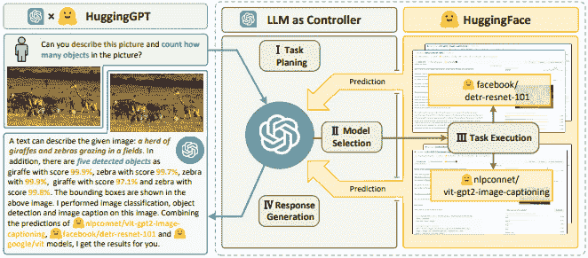

图 9.6 – HuggingGPT 总体方案([`arxiv.org/pdf/2303.17580`](https://arxiv.org/pdf/2303.17580))

整个 HuggingGPT 过程可以分成四个步骤：

1.  任务规划：ChatGPT 分析用户请求（理解意图）并将问题转化为可能可解的任务。

1.  模型选择：ChatGPT 选择 Hugging Face 中存在的适当模型（专家模型）（模型的选择基于提供的描述）。

1.  任务执行：模型被调用并执行，然后将结果返回给 ChatGPT。

1.  响应生成：ChatGPT 整合模型的结果并生成答案。

在 Toolformer 中，我们有一个 LLM，模型通过 API 调用调用工具。HuggingGPT 采用类似的方法，但无需微调。在 HuggingGPT 中，一个 LLM 可以被视为一个控制器，将用户请求路由到专家模型。换句话说，LLM 理解任务并规划行动，但这个行动由专家模型（LLM 只是整合结果）执行。这里的 LLM 只是一个促进者，组织不同模型在不同领域解决不同任务的协作。LLM 随后保持其通用性，并可以选择使用哪个工具以及何时使用它（在这种情况下，模型就是工具）。例如，如果一个 LLM 在某个模式下没有能力，它将利用专家模型的能力来完成该任务。LLM 只需要知道调用哪个模型来解决特定任务。因此，HuggingGPT 代表了一个灵活的系统，我们只需要向 LLM 提供文本描述，然后 LLM 就会整合不同的专家模型。

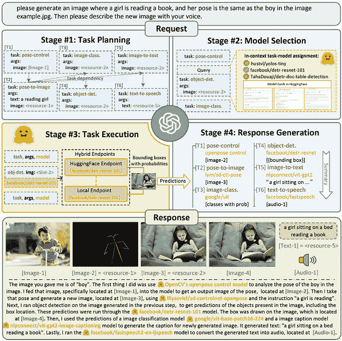

图 9.7 – HuggingGPT 过程([`arxiv.org/pdf/2303.17580`](https://arxiv.org/pdf/2303.17580))

### 任务规划

在第一步，**任务规划**，LLM 必须理解任务并将其分解为子任务。在现实世界中，用户请求可能很复杂，其意图复杂，需要任务分解。这是因为单个模型可能无法解决整个任务；相反，可能需要多个模型来处理不同的方面。然后，LLM 需要将任务分解为一系列子任务，并理解这些任务之间的依赖关系以及它们应该执行的顺序。这是通过创建一个特定的提示来完成的。

为了标准化系统，HuggingGPT 的作者使用了一套特定的指令。然后，LLM 必须遵守这些规范以进行任务规划。他们设计了一个标准化的任务模板，并指示 LLM 通过槽位填充进行任务解析。LLM 在槽位填充的指导下填写此模板，从而实现子任务的持续解析和执行。模板必须填充以下四个槽位：

+   **任务 ID**：模型为每个任务提供唯一的标识符。此 ID 用于识别任务及其依赖任务，以及所有生成的资源。

+   **任务类型**：此槽位包括任务类型；每个任务可以是各种类型（语言、视觉、视频、音频等）。

+   **任务依赖关系**：此槽位定义了每个任务的前提条件（模型只有在所有前提条件都完成的情况下才会启动任务）。

+   **任务参数**：此槽位包含执行任务所需的所有参数（从文本到图像或其他资源）。这些内容可以来自用户的查询或其他任务的输出。

(img/B21257_09_08.jpg)

图 9.8 – HuggingGPT 类型的任务 ([`arxiv.org/pdf/2303.17580`](https://arxiv.org/pdf/2303.17580))

作者使用演示来指导模型执行任务（如图像到文本、摘要等）。正如我们在*第三章*中看到的，添加演示允许模型将任务（少样本提示和情境学习）映射。这些演示告诉模型如何划分任务，顺序如何，以及是否存在依赖关系。此外，为了支持复杂任务，作者包括聊天记录（与用户进行的先前讨论）作为一种工具。这样，模型就可以知道是否已经指示了可以有助于任务的其他资源或请求。

提示提供了 LLM 所需的所有信息。在提示中，我们提供了关于其任务的说明（规划任务分解）、信息检索的位置、如何执行任务的示例以及我们期望的输出。

(img/B21257_09_09.jpg)

图 9.9 – HuggingGPT 中提示设计的细节 ([`arxiv.org/pdf/2303.17580`](https://arxiv.org/pdf/2303.17580))

### 模型选择

在规划任务之后，模型开始选择适合任务的适当模型，或**模型选择**。一旦我们有一个子任务的列表，我们需要选择适当的模型。这是可能的，因为我们有模型及其功能的描述。这项工作的作者已经从机器学习社区（例如，Hugging Face）收集了专家模型的描述。实际上，在 Hugging Face 上，通常是模型的开发者自己用功能、架构、支持的语言和领域、许可等方面的术语来描述模型。

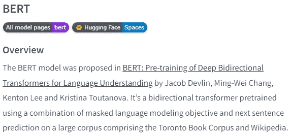

图 9.10 – Hugging Face 上模型描述示例的截图 ([`huggingface.co/docs/transformers/model_doc/bert`](https://huggingface.co/docs/transformers/model_doc/bert))

因此，模型分配被表述为一个单选模型，其中 LLM 必须在给定的特定上下文中从可用的模型中选择最佳模型。然后，考虑到用户的需求和上下文，LLM 可以选择最适合执行任务的专家模型。当然，上下文长度是有限的，你不能输入所有模型描述而不超过这个长度。为了解决这个问题，HuggingGPT 系统应用了一个两阶段过滤和排名过程。首先，根据任务规划期间识别的任务类型（例如，语言、视觉或音频）对模型进行过滤。只有与特定子任务类型相关的模型被保留，显著缩小了模型池。在过滤后的模型中，系统根据下载量对它们进行排序，这作为质量、可靠性和社区信任的代理。假设广泛使用的模型更有可能表现良好。最后，系统选择前 k 个模型描述（其中 k 是一个可配置的超参数）并将它们包含在提示中。然后，LLM 执行单选模型选择，评估上下文和用户需求，从候选列表中选择最合适的模型。这种策略提供了一个平衡的权衡：它保持了提示在可管理的令牌限制内，同时仍然允许 LLM 有足够的选择来做出明智和有效的模型选择。

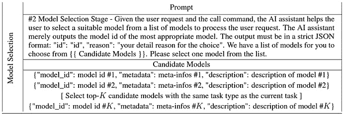

图 9.11 – HuggingGPT 中用于模型选择的提示设计细节 ([`arxiv.org/pdf/2303.17580`](https://arxiv.org/pdf/2303.17580))

### 模型执行

一旦将特定模型分配给特定任务，就必须执行该模型。请注意，这些模型仅在推理中使用。这些模型通过 Hugging Face API 使用。为了加快执行速度，HuggingGPT 使用混合推理端点。选定的模型将任务参数作为输入，然后将结果发送回语言模型（ChatGPT）。此外，如果没有资源依赖关系，其推理可以并行化。换句话说，相互不依赖的任务可以同时执行。否则，系统会考虑一个模型的输出与另一个模型的输入之间有多少关联（例如，如果一个任务必须有一个子任务的输出才能执行）。为了进行推理，HuggingGPT 使用混合推理端点，主要依赖于 Hugging Face API。当模型通过这些 API 可用且功能正常时，系统会远程执行它们。然而，如果 API 端点不可用或速度慢或遇到网络问题，则使用本地推理作为后备。这种混合设置确保了执行过程中的灵活性和鲁棒性。

作者指出：“*尽管 HuggingGPT 能够通过任务规划来开发任务顺序，但在任务执行阶段，仍然可能难以有效管理任务之间的资源依赖关系*。”为了解决这个问题，作者简单地使用了一个独特的符号 `<resource>` 来处理依赖关系。`<resource>` 是一个特殊标记，代表任务所需的资源（这与任务标识符相匹配），如果所需的任务已完成，则该标记将被资源替换。

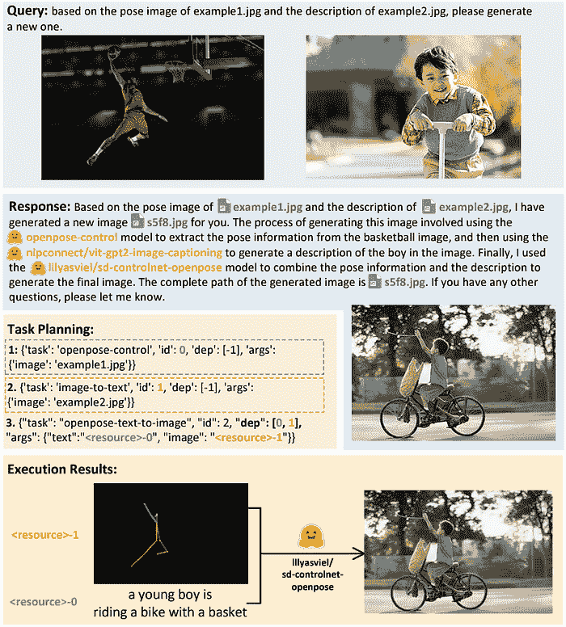

图 9.12 – 模型执行（[`arxiv.org/pdf/2303.17580`](https://arxiv.org/pdf/2303.17580)）

### 响应生成

一旦所有任务都执行完毕，就必须生成响应。HuggingGPT 将之前步骤中获得的所有信息（任务规划、模型选择和任务执行）整合成一种简明的摘要（任务、使用的模型和模型的结果）。请注意，模型整合了多个其他模型的结果，特别是通过推理获得的结果，这些结果可能具有不同的格式。这些结果以结构化格式呈现（例如，边界框、概率等），HuggingGPT 将这些结果转换为自然语言以响应用户。因此，HuggingGPT 不仅为任务获取结果，而且以人性化的方式响应用户。

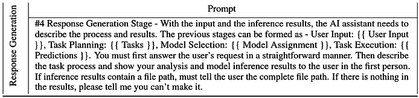

图 9.13 – 响应生成（[`arxiv.org/pdf/2303.17580`](https://arxiv.org/pdf/2303.17580)）

定性来看，我们可以看到模型能够解决多个任务。因此，模型能够将任务分解成各种子任务，选择合适的模型，检索结果并有效地整合它们。例如，模型可以进行图像标题、姿态生成，甚至姿态条件图像生成任务。不仅如此，任务可以是多模态的（如文本到视频生成、为视频添加音频等）。其中最有趣的一个方面是，所有这些都是在没有任何额外 LLM 训练的情况下完成的。事实上，所有这些都是在推理过程中完成的（对于 LLMs 和推理中的模型）。优势在于，你可以不进行任何训练就集成额外的模型以处理额外任务；你只需要添加新模型的函数描述。

例如，在这种情况下，我们可以看到多模态任务（文本、视频和音频）的执行。模型被要求执行两个任务：根据描述生成视频和为视频配音。模型并行执行这两个动作。在以下图的底部部分，模型必须依次执行这两个任务：模型首先从图像生成文本，然后生成音频。

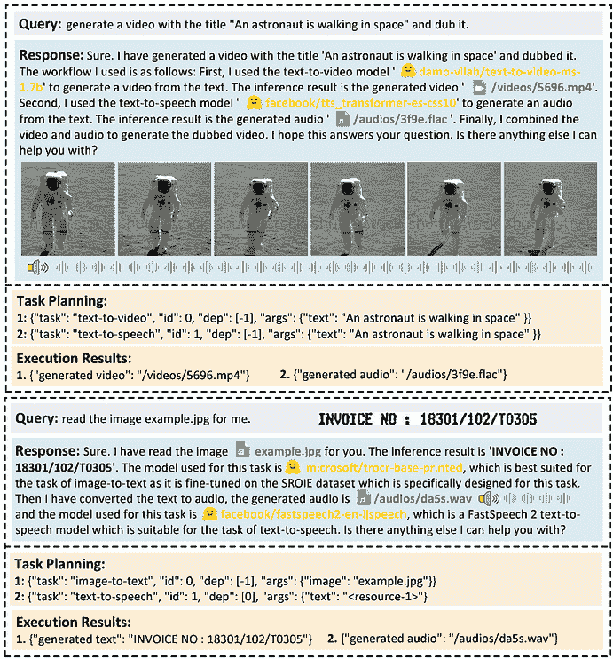

图 9.14 – 视频和音频模态多模型合作的定性分析 ([`arxiv.org/pdf/2303.17580`](https://arxiv.org/pdf/2303.17580))

研究的作者还探索了更复杂的任务，在这些任务中，一个大型语言模型必须组织多个模型的合作才能成功解决问题。HuggingGPT 可以通过任务规划步骤来组织多个模型的合作。结果显示，HuggingGPT 能够在多轮对话场景（用户将请求分成几个轮次）中应对复杂任务。此外，该模型可以通过为每个任务分配一个专家模型来解决复杂任务。例如，“尽可能详细地描述图像”需要模型解决五个任务（图像标题、图像分类、目标检测、分割和视觉问答任务）。这五个任务不是由一个模型解决，而是由五个不同的模型调用和执行。然后，这些模型各自提供必须整合到详细答案中的信息。这些模型在推理过程中并行工作，然后合并最终信息。

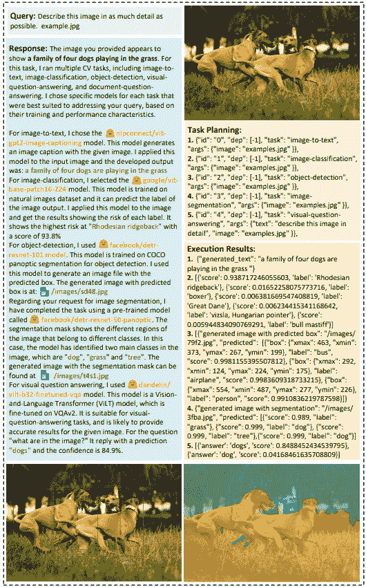

图 9.15 – 复杂任务案例研究 ([`arxiv.org/pdf/2303.17580`](https://arxiv.org/pdf/2303.17580))

### HuggingGPT 的局限性

然而，仍存在一些局限性：

+   **效率**：HuggingGPT 需要从 LLM 中进行多次调用；这发生在四个过程中的三个步骤中（任务规划、模型选择和响应生成）。这些交互成本高昂，可能导致响应延迟和用户体验下降。此外，原始文章中使用了闭源模型（GPT-3.5 和 GPT-4），这导致了额外的成本。技术上，可以使用开源模型以相同的方法进行操作。

+   **规划**：规划取决于 LLM 的能力。显然，LLM 的能力越强，系统的能力就越好，但 LLM 的推理能力有限，因此规划可能并不总是最优或可行的。您可以选择测试不同的 LLM 或使用经过微调以创建高效计划的 LLM，或者使用经过推理链微调的模型。

+   **上下文长度**：模型的上下文长度有一个明确的限制，对于复杂任务来说，这是一个问题。在原始文章中，作者指出，对于某些任务来说，32K 就足够了（特别是如果连接了多个模型）。因此，解决方案可能是使用上下文长度更长的模型。然而，到目前为止，似乎模型并没有有效地使用长上下文。另一个解决方案可能是使用摘要。

+   **不稳定性**：这源于 LLM 的随机性质。尽管 LLM 被训练生成文本，并且在这种情况下我们提供了上下文，但模型可以忽略上下文并产生幻觉。文章的作者指出，模型在预测过程中可能无法遵守指令或给出错误答案。这会产生程序流程错误或错误答案。幻觉仍然是 LLM 的一个开放性问题，但有一些策略可以减轻它们。

那么，HuggingGPT 是一个能够通过使用语言作为接口来协调不同专家模型以解决复杂任务的系统。在这里，LLM 仅作为各种 AI 模型的控制器和管理者。它的唯一任务就是协调模型并生成响应。然后模型生成计划，选择模型，并将结果整合到最终响应中。LLM 本身不执行任何任务，而是要求各种专家模型提供解决方案。所有这些都是在推理过程中进行的，而不涉及任何训练。用户提出问题后，系统执行过程，并以自然语言进行响应，从而使交互人性化且流畅。

在以下子节中，我们将探讨各种旨在克服 HuggingGPT 局限性或解决其他专业领域关键挑战的模型。通过这些探索，您将深入了解不同的策略，并学习如何将这些代理应用于现实世界场景。

## ChemCrow

我们之前将 HuggingGPT 视为一个协调不同工具（模型）的系统，作为一个通用型模型用于通用任务。在本小节中，我们想要讨论一个应用于专门领域的类似系统。ChemCrow（Bran，2023）遵循与 HuggingGPT 相似的设计理念，但将其应用于专门领域——化学。

通用型大型语言模型（LLM）的局限性在于它们具有通用知识，因此既未针对特定领域进行专门化，也未更新最新信息。这对于许多应用领域（尤其是科学、金融和医疗保健等专门领域）可能是一个问题。此外，LLM 使用一组启发式方法进行计算，而不是通过严格的过程。对于化学等领域的应用，这是一个问题，因此自然想到通过外部工具扩展模型的能力。外部工具提供确切答案，并弥补 LLM 在特定领域的不足。因此，将 LLM 与多个工具集成可以使 LLM 在即使其固有特性构成其适用性限制的领域也能被使用。

一个可以从 LLM 的使用中受益的领域是科学研究。一方面，LLM 已经显示出理解化学的能力，另一方面，有许多针对化学的专门模型，或者至少是针对特定应用的模型。许多这些工具都是由开源社区开发的，并且可以通过 API 访问。尽管如此，整合这些工具并不容易，需要计算编码方面的专业知识，而这通常不是化学研究者的技能之一。受先前工作的启发，本研究（Bran，2023）的作者们提出了他们所谓的 LLM 驱动的化学引擎（ChemCrow），旨在“*简化跨药物和材料设计及合成等领域的各种常见化学任务的推理过程*。”ChemCrow 与我们所看到的 HuggingGPT 非常相似，其中我们有一个中央 LLM（GPT-4），协调多个工具（在这种情况下，高度专门化于化学）。中央 LLM 被提示特定的指令和信息，以便执行特定任务并以特定格式响应。为了指导 LLM 的推理和工具使用，ChemCrow 采用了一种称为“思考、行动、行动输入和观察”的结构化提示格式，以提示模型对任务（及其当前状态）进行推理，当前状态如何与最终目标相关联，以及如何规划下一步：

+   **思考**：模型反思当前问题，考虑其进展，并概述通向最终目标的推理

+   **行动**：它选择下一个要使用的适当工具（例如，分子生成器或反应预测器）

+   **行动输入**：它指定应发送到所选工具的输入

+   **观察**：它记录工具的输出，然后将其纳入下一个推理周期

(img/B21257_09_16.jpg)

图 9.16 – ChemCrow 概述([`arxiv.org/pdf/2304.05376`](https://arxiv.org/pdf/2304.05376))

因此，在这个系统中，模型通过一个思维步骤（可以将其视为行动规划）并使用工具及其输入（选择和使用模型）来进行。模型获取结果，观察它们，然后再次进行思维步骤，直到达到答案。这个过程与我们之前看到的类似，但更加重视推理和模型的专门化。此外，工具不仅包括模型，还包括搜索互联网或文献的能力；模型还可以运行代码。因此，我们也有系统能力和灵活性的扩展。因此，该研究的作者将这个系统视为一种化学任务的科研助手。

(img/B21257_09_17.jpg)

图 9.17 – 人/模型交互导致新分子的发现([`arxiv.org/pdf/2304.05376`](https://arxiv.org/pdf/2304.05376))

因此，想法是将 LLM 的推理技能与专业知识以及化学计算工具相结合。结果显示，类似的方法可以导致特定领域的实际应用，例如化学。

## SwiftDossier

SwiftDossier 是应用基于代理系统在科学和医疗领域的一个显著例子，特别关注解决这些领域中最关键的挑战之一：幻觉。在医学和制药等领域，幻觉输出——即自信但错误或无法验证的信息——可能导致严重的法律、伦理和安全风险。LLM 拥有巨大的内存，但生成文本是随机的，没有明显验证其来源。这对制药行业或潜在的医疗用途来说是个问题。为了在 SwiftDossier 中解决这个问题，使用了 RAGs 和 LLM 驱动的代理来强制模型生成。该系统不是仅仅依赖 LLM 的内部知识——虽然知识量巨大，但生成是随机的且没有来源验证——而是迫使模型将其响应建立在外部、可靠的数据源上。系统使用不同的工具集来回答不同的问题：科学文章、互联网访问、数据库和其他 ML 模型。使用这一套工具，LLM 可以成功生成报告并最小化幻觉的风险。

(img/B21257_09_18.jpg)

图 9.18 – SwiftDossier 架构([`arxiv.org/pdf/2409.15817`](https://arxiv.org/pdf/2409.15817))

## ChemAgent

在之前看到的两个例子中，我们有一个添加了工具的代理来弥补通用 LLM 的知识缺陷。换句话说，我们试图通过使用外部信息或工具来执行操作来弥补 LLM 的不足。此外，如果任务本身很复杂，几种方法试图将其分解成更可管理的子任务。代理首先生成一个日程表，然后执行各种子任务，从而结合推理和执行。尽管如此，LLM 仍然可能产生错误，尤其是在化学等复杂领域。

LLMs，虽然作为强大的通用工具，在化学领域面临一些挑战，在这些领域中，任务需要精确推理、准确计算和深厚的领域知识。这些挑战源于 LLMs 生成文本和代码的局限性，并且在科学应用中更为明显，因为小的错误可能导致重大不准确：

+   **在特定领域公式上的挣扎**：LLMs 可能会误解或错误地应用专业的化学方程式或符号，尤其是在所需的公式在一般训练数据中不常见的情况下

+   **中间推理步骤错误**：在复杂的多步骤任务中（例如，合成规划或性质预测），仅一步的错误可能会级联并导致最终输出错误

+   **代码生成错误**：当将文本推理与代码（通常是 Python）结合时，LLMs 经常虚构函数、使用错误的库、产生语法错误或生成无法执行的代码——尤其是对于需要精确库调用和数值稳定性的科学计算

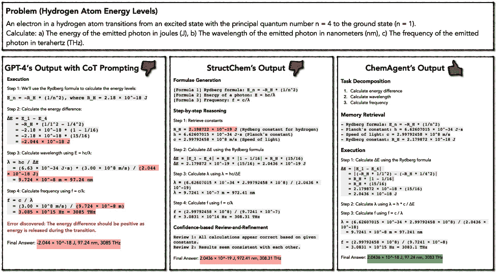

图 9.19 – 化学领域 LLM 失败示例 ([`arxiv.org/pdf/2501.06590`](https://arxiv.org/pdf/2501.06590))

与 LLMs 不同，人类从过去的经验和错误中学习。对于 LLMs 来说，在预训练结束后无法进行学习（微调是一种昂贵的方法，且不能重复使用），因此持续学习仍然是人工智能的一个开放性问题。另一方面，人类可以记住用于类似问题的策略；一旦遇到新问题，他们会学习新的策略，这些策略可以在未来使用。因此，在 ChemAgent 中，作者试图找到一种模拟这一过程的方法。他们提出一个动态库，允许通过持续更新和改进其内容来促进迭代问题解决。该库作为分解化学任务的存储库。换句话说，一个任务被分解成各种子任务，然后解决方案被保存在库中以备将来使用。一旦出现新的任务，库就会更新新的子任务和相应的解决方案，保持库的相关性，并随着时间的推移提高其有用性。受人类认知的启发，该系统有三个不同的记忆组件：计划记忆（高级策略）、执行记忆（特定任务解决方案）和知识记忆（基本的化学原理）。这些记忆组件存储在外部，允许系统在需要时再次找到信息，并且是动态更新的。

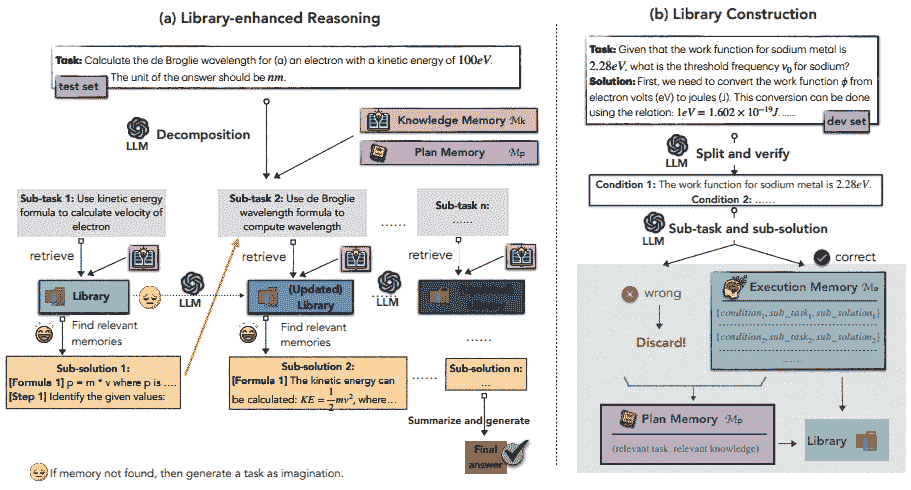

图 9.20 – ChemAgent 框架([`arxiv.org/pdf/2501.06590`](https://arxiv.org/pdf/2501.06590))

因此，ChemAgent 不仅被动地使用它在记忆中找到的内容，而且允许系统动态地更新记忆。它还使用内存分区来改进问题解决的各个阶段。ChemAgent 将过程分为计划和执行（为每个步骤关联一个特定的记忆）并添加一个作为基本化学原理和公式的参考的记忆。当出现问题时，它被分解成一系列子任务，这些子任务被解决，这些解决方案被保存在记忆中。

## 法律领域的多代理

另一个可能从代理的使用中受益的领域是法律行业。法律服务对于保护公民权利至关重要，但它们可能特别昂贵，而且律师的数量并不总是足够。此外，公正的判决是一项基本权利，但人类也表现出偏见。在这个领域使用代理可以通过降低成本和允许更公平的访问来彻底改变法律服务。在法律领域，幻觉尤其成问题，如果不是消除，也应尽可能减少。幻觉既源于模型的随机性，也源于训练它们的数据质量。因此，必须从两个轴向上采取行动，以减轻这种现象。

在本小节中，我们希望介绍两种以法律为中心的方法来展示一些已经使用过的有趣元素。再次强调，原则是相同的：一切围绕一个中心元素展开，这个元素是一个 LLM。例如，Chatlaw 关注数据质量以减轻 LLM 幻觉的风险。此外，为了充分利用作者收集到的质量数据集，他们使用了一个知识图谱。此外，他们没有使用单个智能体，而是使用了一个多智能体系统。使用多个智能体使得系统能够模拟与 LLM 交互时不同领域的专业知识，这得益于提示的灵活性。使用多智能体使得在律师事务所内部模拟过程成为可能。作者开发了一个协议，以允许智能体之间有效协作：“*四个独立的智能体角色，分别负责初步信息收集、深入材料研究、法律咨询和最终咨询报告撰写*。”这样，过程就更加彻底。再次强调，他们为整个系统只使用了一个 LLM（作者使用了 GPT-4）。

(img/B21257_09_21.jpg)

图 9.21 – Chatlaw，多智能体协作([`arxiv.org/pdf/2306.16092v2`](https://arxiv.org/pdf/2306.16092v2))

另一种有趣的方法是作者（Hamilton，2023；[`arxiv.org/pdf/2301.05327`](https://arxiv.org/pdf/2301.05327)）使用 LLM 模拟法院的判决。在这里，同样使用了一个多智能体系统，其中每个智能体代表一位法官。每位法官提出一个意见，然后得出多数意见。因此，当案件被发送给九位法官时，系统收到九个意见，然后产生一个单一的意见。这种方法依赖于并行进行九次评估以及这些评估的一致性（多数票获胜）。

(img/B21257_09_22.jpg)

图 9.22 – 多法官系统([`arxiv.org/pdf/2301.05327`](https://arxiv.org/pdf/2301.05327))

这项工作展示了如何利用 LLM 创建多个智能体，它们可以协同工作以减轻幻觉。作者进一步证明了使用 LLM 作为系统中心可以实现的灵活性。这项研究的局限性在于使用了同质化的法官（最好是构建由不同模型组成的集成，以避免不同法官具有相同的偏见），这可能导致重复的意见。

## 多智能体在医疗应用中的使用

跨学科研究是复杂的，通常需要由不同领域专家组成的研究团队。通常，科学研究是由每个研究人员处理特定方面并掌握不同技术的团队进行的。例如，AlphaFold 2 是 34 位不同专业知识（计算机科学、生物信息学和结构生物学）的研究人员的成果。显然，招募大量专家团队需要时间（而且并不总是容易找到具有正确专业知识的人），而且成本高昂。只有少数机构和公司能够承担最雄心勃勃的项目。然而，最近创建的 LLM 在科学主题上的知识越来越广泛，我们之前已经看到这种知识可以与工具的使用联系起来。ChemCrow 是解决化学问题的例子，但它无法处理开放式的跨学科研究问题。最近，人们已经通过创建可以处理端到端过程的管道来解决这一问题。例如，一位 AI 科学家（Lu，2024）进行了一个从构思想法开始，以在机器学习上撰写科学论文结束的过程。AI 科学家被赋予了一个广泛的研究方向，产生了一个想法，进行文献搜索，规划并执行实验，撰写手稿，最后校对。所有这些工作都是由一个类似于 LLM 的代理完成的，该代理连接到工具并按顺序进行。

(img/B21257_09_23.jpg)

图 9.23 – AI 科学家过程的说明([`arxiv.org/pdf/2408.06292`](https://arxiv.org/pdf/2408.06292))

其他研究也展示了类似的过程，但它们仍然局限于特定的领域和线性过程。对于科学研究，我们希望找到结合不同专业知识的方法。因此，Swanson (2024) 提出了一种旨在对复杂问题进行跨学科科学研究的虚拟实验室，用于人机协作。在虚拟实验室中，人类引导一组跨学科代理来管理复杂过程。不同的代理拥有不同的专业知识，并由一个 LLM 运行。每个代理都与其他代理和人类进行交互。通过这种方式，研究的作者构建了一个灵活的架构。在这里，人类为代理提供指导，而代理则决定搜索方向和设计解决问题的方案。每个代理都由一个提供给 LLM（文章中为 GPT-4）的提示（包含关于角色、专业知识、目标和可用工具的信息）控制。然后，虚拟实验室通过小组或个人会议进行研究。

人类提供问题和议程以启动讨论。在团队会议中，代理讨论研究问题并共同努力实现全局目标。在个人会议中，单个代理必须解决一个任务（例如编写代码），代理可以单独工作或与另一个提供关键反馈的代理一起工作。通过一系列全局和个人会议，团队解决研究问题。

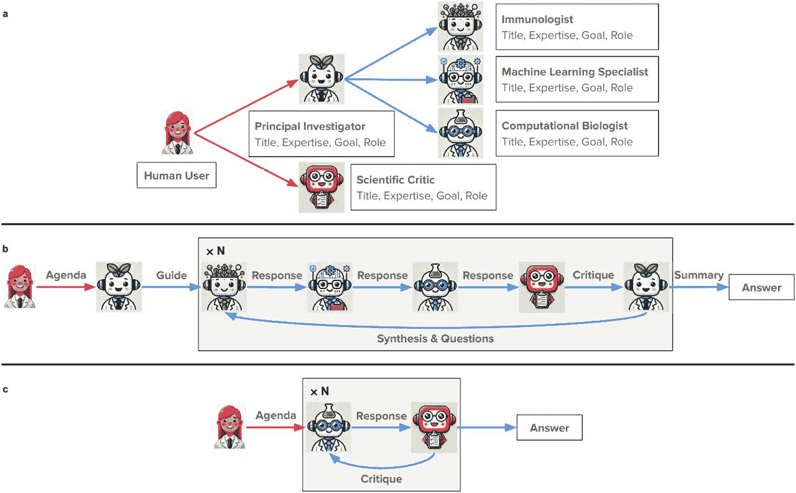

图 9.24 – 虚拟实验室架构 ([`www.biorxiv.org/content/10.1101/2024.11.11.623004v1.full`](https://www.biorxiv.org/content/10.1101/2024.11.11.623004v1.full))

在虚拟实验室中，有一个**主要研究员**（**PI**），其目的是最大化研究的影响力，并自动为项目创建一组适当的科学家代理（生物学家或计算机科学家）（基于 PI 提供的项目描述）。PI 在提示中定义每个代理的角色、专业知识和目标。此外，还可能有一个专门用于项目批评的代理。之后，会议开始。每次会议都遵循一组组织成结构的输入：议程（讨论内容的描述）、议程问题（会议中要回答的问题集）、议程规则（使会议更顺畅的可选规则）、摘要（前次会议的可选摘要）、背景（有助于会议的额外信息）和回合（讨论回合的数量，以防止讨论无休止地进行）。在团队会议中，所有代理都参与讨论，人类编写议程（可选地，包括规则和问题），然后进行不同回合的讨论。PI 开始，然后每位科学家代理（加上批评代理）对讨论发表意见。最后，PI 总结代理提出的问题点，对代理的输入做出决定，并提出后续问题。经过各种回合后，PI 编写一个人类可以阅读的最终摘要。

在个人会议中，人类提供议程并选择代理，代理执行任务（此外，还可能有批评代理，提供批评）。在代理和批评者之间经过一系列回合后，代理提供回应。此外，还可以进行并行会议，其中多个代理执行相同任务，并在与 PI 的最终会议中得出最终答案。

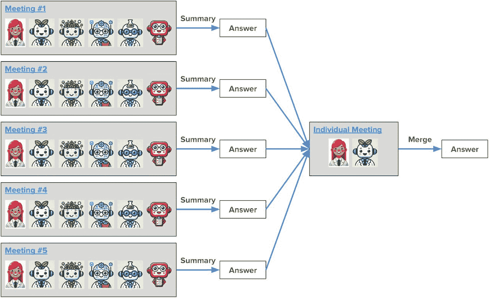

图 9.25 – 虚拟实验室并行会议 ([`www.biorxiv.org/content/10.1101/2024.11.11.623004v1.full`](https://www.biorxiv.org/content/10.1101/2024.11.11.623004v1.full))

以这种方式，作者创建了一个灵活的框架，结合了在单人和协作环境中工作的异构代理。需要注意的是，在这种方法中，有一个人类参与其中；也就是说，人类是系统的中心，并积极与 AI 合作。这个过程模仿（尽管当然是以简化的方式）了人类团队在解决复杂问题时的工作和决策过程。为了测试这项工作的实用性，作者测试了虚拟实验室在设计和结合 SARS-CoV-2 KP.3 变异株刺突蛋白的抗体或纳米抗体方面的能力。这是一个复杂的问题，因为 SARS-CoV-2 进化迅速，因此必须找到一个快速的系统来设计可以阻止它的抗体。虚拟实验室首先创建了一个能够应对这个问题的团队（PI 为这个问题组建了合适的研究人员团队）。在团队会议上，项目方向被描述，并讨论了主要细节。然后，举行了一次关于可以使用哪些工具以及如何选择的团队会议，以及一系列个人会议，研究人员使用各种工具创建抗体设计工作流程。在与 PI 的会议中，定义了工作流程。

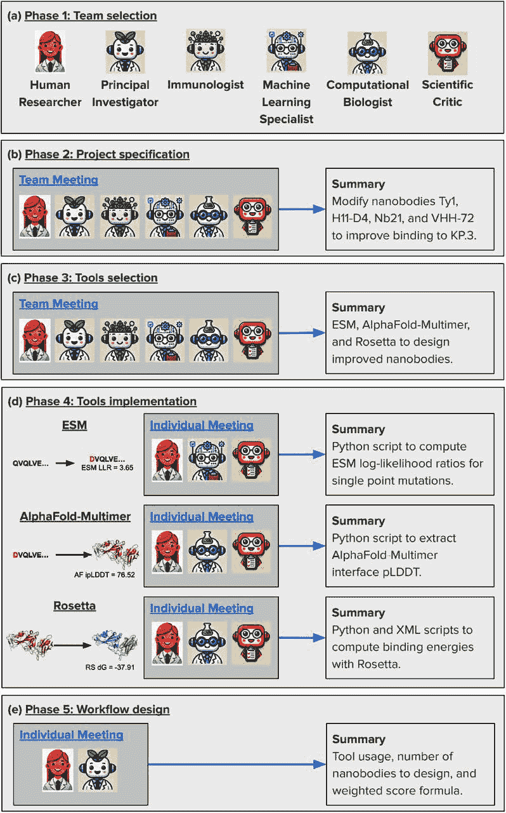

图 9.26 – 抗体设计虚拟实验室 ([`www.biorxiv.org/content/10.1101/2024.11.11.623004v1.full`](https://www.biorxiv.org/content/10.1101/2024.11.11.623004v1.full))

虚拟实验室成功地设计出了抗体，随后通过实验进行了验证。该系统成功地创建了一个复杂的流程，使用序列模型来设计抗体（从而解决了一个真实且复杂的问题）。构建这样的系统通常需要一个跨学科团队，因为需要用不同的专业知识来解决问题。因此，拥有不同专业知识的代理可以从前不同的角度讨论问题，从而为科学研究的基本要素（批判性）增添了内容。这是通过一系列会议来完成的，其中 AI 是人类合作伙伴。我们看到的是，通过多轮会议（小组和个人）的创建，形成了一个既灵活又复杂的系统。

在这个阶段仍然存在一些限制。例如，模型的知识截止到某个点，因此它们可能不知道最新发布的工具，因此可能会建议旧模型（或实现中存在问题的模型）。解决这个问题的一个方法可能是使用 RAG 或互联网搜索。另一个限制是，该系统并不完全自包含；它附带了一个议程和一组经过精心设计的提示。在这个系统中，人类仍然参与其中，必须提供指导。没有指导，AI 模型可能会给出模糊的答案，或者除非特别要求，否则不会做出决定。有时它们无法完成任务，或者偏离了它们应该做的事情。无论如何，这个系统是灵活的，可以无差别地应用于许多其他问题。

将不同领域的专业知识与人类反馈相结合似乎是取得更好成果的关键。在这方面，代理实验室被设计用来生成整个研究工作流程（从文献综述和实验到报告撰写），这一切都基于人类提供的初始研究想法。在这个系统中，过程从收集和分析相关论文开始，接着是协作规划和数据准备，一系列实验，以及报告生成。这个过程可以分为三个阶段：

+   **文献综述阶段**：在这个阶段，为给定的研究想法收集文章。博士代理利用 arXiv API 检索相关论文，综合它们，并提供见解。这个代理使用搜索 API、摘要模型和文献管理系统作为工具。这个过程会迭代，直到达到一定数量的相关文章。

+   **实验阶段**：第一步是制定计划，根据文献综述和研究目标生成一个计划。在这个阶段，博士和博士后代理进行协作和讨论如何实现目标，生成一个定义了要实施哪些机器学习模型、使用哪些数据集以及其他必要实验步骤的计划。一旦计划确定，数据准备阶段就开始了，在这个阶段，根据定义的计划生成数据准备代码。机器学习工程师代理可以访问 Hugging Face 数据集，然后代码被编译并提交。在运行实验阶段，机器学习工程师代理执行实验计划。在这个阶段，代码被生成、测试和改进。然后对结果进行解释。在这个阶段结束时，博士和博士后代理讨论结果。如果他们同意发现的有效性，他们将提交结果，这些结果将成为报告的基础。

+   **报告撰写**：在报告撰写阶段，博士和教授代理将研究结果综合成一份全面的学术报告。从初始框架（摘要、引言、背景、相关工作、方法、实验设置、结果和讨论）开始，他们开始生成文本（使用 LaTeX 编写，以便于修订和校正）。在撰写过程中，系统访问文献，并迭代地纠正文章以确保准确性、清晰度和与研究目标的契合度。最后，进行一种论文审查以确保文章的正确性。请注意，在此过程中，系统会收到来自人类的反馈。

该系统的关键特性是代理能够自主执行重复性任务（例如，文献检索和编码），但在需要创造力和判断力的情况下允许人类输入。代理之间通过沟通中间结果来确保各方之间的协同。在每一个阶段，通过反思和反馈进行迭代改进。

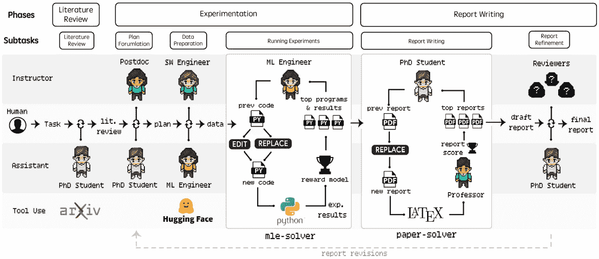

图 9.27 – 代理实验室工作流程 ([`arxiv.org/pdf/2501.04227`](https://arxiv.org/pdf/2501.04227))

代理实验室旨在快速探索想法并帮助研究人员能够同时探索多个研究方向。代理实验室的结构允许它从由人类研究人员提出的一个想法开始，执行整个工作流程。在这项工作中，他们不仅关注结果的准确性，还试图找到一种更有效率的任务解决方法（先前的工作需要过多的计算成本）。

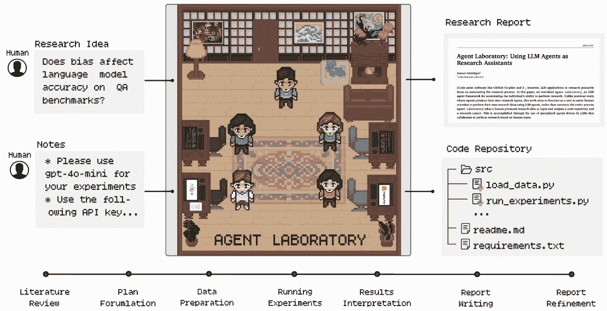

图 9.28 – 代理实验室方案 ([`arxiv.org/pdf/2501.04227`](https://arxiv.org/pdf/2501.04227))

作者指出，在各个阶段融入人类反馈显著提高了研究成果的质量。此外，他们还表示，由代理实验室生成的机器学习代码达到了现有最先进方法的性能，并且为人类阅读的报告质量显著良好。

这些系统表明，通过结合人类反馈，可以解决复杂任务。然而，这些系统依赖于人类反馈，因为截至目前，大型语言模型（LLMs）尚不具备真正的推理能力。这有几个局限性：系统可能在设计超出标准方法的创新实验方面遇到困难，尤其是在需要创造性问题解决或新颖方法的应用领域。系统仍然会在代码中产生错误（错误或低效），它继续维持高计算成本（多个 LLM 调用），智能体之间的通信尚未完美，与专家相比，报告生成仍然不够优化，它对高度专业化的或利基研究领域的泛化能力较差（它们在训练数据和文献中表现不佳），并且存在几个尚未解决的伦理问题。

在本节中，我们探讨了具有单个智能体或多个智能体的不同系统。在下一节中，我们将看到 HuggingGPT 的实际工作方式以及我们如何创建多智能体系统。

# 与 HuggingGPT 一起工作

您可以使用两种方式使用 HuggingGPT：

+   在本地克隆仓库

+   使用网络服务

在这里，我们将探讨两种方法。主要区别在于，当我们本地克隆仓库时，我们会下载所有模型，系统执行将在本地进行。相比之下，网络服务方法要求执行在服务中进行。在两种情况下，所有模型都用于推理；区别在于模型的执行位置和使用的资源。此外，两种方法都支持使用基于网络的图形用户界面。

## 在本地使用 HuggingGPT

要克隆 HuggingGPT（相应的仓库称为 Jarvis），使用 Git LFS 非常有用。Git LFS 是 Git 的开源扩展。Git 旨在管理代码仓库，但不处理大型二进制文件（如视频、数据集或高分辨率图像）。Git LFS 对于包含大型资产（例如，数据集、视频或二进制文件）的仓库至关重要，因为否则 Git 在处理大文件时效率低下。Git LFS 通过在常规仓库对象之外存储大文件并替换 Git 仓库中的轻量级引用（指针）来解决此问题。Git LFS 通过在仓库的常规对象之外存储大文件，使使用大型对象时标准化更好，并在与 GitHub 仓库（如克隆、推送和拉取）操作时提高性能。指针包含有关文件的各种元数据（例如，大小、哈希和位置），当我们克隆一个仓库时，Git LFS 通过利用这些指针中的信息下载文件。这使我们能够将代码操作与对大文件的操作分开。一般来说，对于涉及机器学习、游戏开发或视频编辑的项目，通常使用 Git LFS，因为它可以简化并加快下载过程。在机器学习项目中，模型权重非常大且经常更新；使用 Git LFS 允许我们高效地跟踪和管理这些文件——例如下载的模型——而不会使主仓库膨胀。正如我们提到的，HuggingGPT 使用几个大型模型（例如，有不同类型的扩散模型，可能占用几个 GB），Git LFS 允许更容易地管理。

要安装 Git LFS，您可以访问官方网站 ([`git-lfs.github.com/`](https://git-lfs.github.com/)) 并下载适用于您操作系统的安装程序（Windows、macOS 或 Linux）。运行下载的安装程序。在 macOS 上，双击`.pkg`文件或使用 Homebrew 包管理器：

```py
brew install git-lfs
```

运行以下命令以启用 Git LFS 对您的用户：

```py
git lfs install
```

一旦您将 Git LFS 作为 Git 扩展安装到您的计算机上，它将自动识别和跟踪仓库中是否存在大文件，并对其进行管理。它修改或创建一些 Git 配置条目（例如在`~/.gitconfig`中），以便您创建的未来克隆和仓库可以无额外麻烦地使用 LFS。

克隆启用了 LFS 的仓库就像它是一个常规仓库一样简单（Git LFS 会在后台处理文件，并自动管理大文件）：

```py
git clone https://github.com/example/repo.git
```

如果我们想，我们可以轻松地进行大文件跟踪：

```py
git lfs track "*.bin"
git add .gitattributes
git commit -m "Track large .bin files with LFS"
```

Git LFS 与经典 Git 命令兼容。拉取/推送操作与正常 Git 工作流程中的操作一样——除非仓库需要特定的凭据或令牌，否则不需要特殊步骤。

到目前为止，我们可以继续安装 HuggingGPT。HuggingGPT 仓库存储在[`github.com/microsoft/JARVIS`](https://github.com/microsoft/JARVIS)。

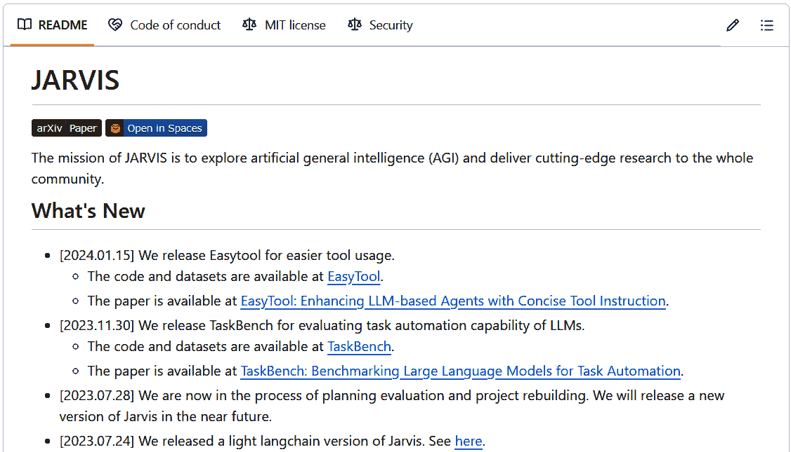

图 9.29 – Microsoft HuggingGPT

第一步是克隆仓库：

```py
git clone https://github.com/example/microsoft/JARVIS.git
```

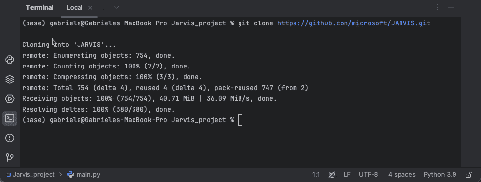

图 9.30 – Microsoft HuggingGPT 克隆

`git clone`命令从远程 URL 启动仓库的下载。终端输出指示正在下载的仓库：对象（元数据和更改）和差异压缩（一个通过仅发送版本之间的差异来最小化传输数据量的过程）。注意以下内容：

+   `接收对象：100% (150/150)，完成。`：这确认了所有对象（文件和历史记录）都已接收

+   `解析差异：100% (85/85)，完成。`：Git 通过应用接收到的更改（差异）来重建实际的仓库状态

一旦我们克隆了仓库，我们就可以转到本地仓库（本地文件夹）：

```py
cd JARVIS/hugginggpt/server
```

这一步是为创建或管理`conda`环境做准备，确保操作在相关项目目录的上下文中执行。

然后，我们创建一个新的名为`jarvis`的`conda`环境（或我们可以选择其他名称），并指定它应使用 Python 版本 3.8：

```py
conda create -n jarvis python=3.8
```

注意，`-n`表示我们想要为我们的项目创建一个新的环境，而`python=3.8`表示我们明确指定此环境的 Python 版本为 3.8：

`conda`环境允许我们隔离依赖关系，避免与全局 Python 安装或其他项目发生冲突。

注意`conda`正在处理以下过程：

+   `conda`从其仓库中检索有关所需包和依赖项的信息。这确保了 Python 3.8 与任何其他要安装的库之间的兼容性。

+   `conda`解决潜在的依赖冲突，并最终确定要安装的包列表。

由于你可能之前已经安装了`conda`，我们只需要更新它：

```py
conda update -n base -c defaults conda
```

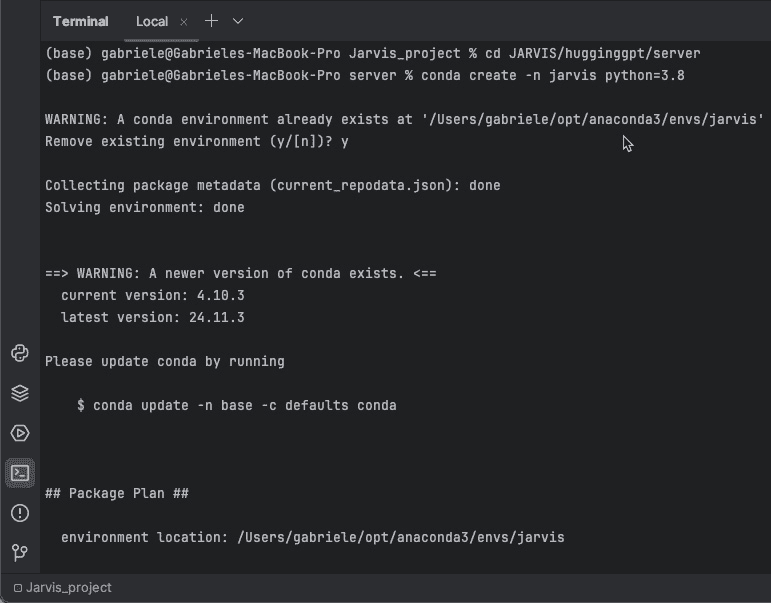

图 9.31 – 更新 conda

在解决环境并准备创建它之后，`conda`安装新环境所需的基本包。每个包都列在仓库（`pkgs/main`）及其特定版本（在这种情况下，我们使用 macOS）旁边。

终端提示我们`继续([y]/n)?`。请记住，用`y`响应以确认安装这些包。

注意以下元素：

+   `conda`确保必要的依赖关系准备就绪，且无冲突

+   **验证交易**：它检查包元数据的完整性，并确保所有包之间的兼容性

+   `conda`将包安装到指定的环境中

一旦完成这些步骤，新的环境（`jarvis`）就准备好使用了。

成功创建后，`conda`为用户提供管理新环境的命令。

要激活此环境，请使用以下命令：

```py
conda activate jarvis
```

要停用活动环境，请使用以下命令：

```py
conda deactivate
```

记住，激活操作会将用户的终端会话切换到使用`jarvis`环境，隔离其依赖和 Python 版本。注意，提示符从`(base)`变为`(jarvis)`，表示终端现在正在`jarvis`环境中运行。该环境的隔离 Python 版本（3.8）及其依赖现在正在使用。从此点开始安装的任何库或工具都将局限于该环境，避免与其他项目发生干扰。

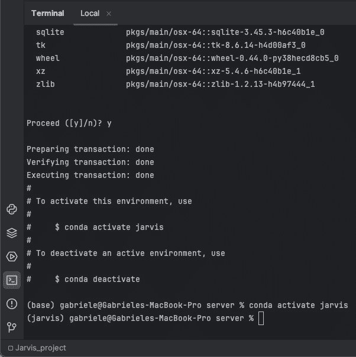

图 9.32 – conda 激活

在这一点上，我们开始安装各种需求：

```py
conda install pytorch torchvision torchaudio pytorch-cuda=11.7 -c pytorch -c nvidia
```

以下命令使用`pip`安装`requirements.txt`文件中列出的依赖项（通常，在需求文件中提供了一个包列表）。这些需求是安装 HuggingGPT 所必需的：

```py
pip install -r requirements.txt
```

HuggingGPT 中的以下注释强调必须安装 Git LFS。此脚本（作为项目的一部分提供）自动化下载本地或混合推理模式所需的模型文件。提醒一下，本地意味着模型完全在本地机器上运行，混合意味着推理涉及本地和远程执行的混合，正如 HuggingGPT 论文（[`arxiv.org/abs/2303.17580`](https://arxiv.org/abs/2303.17580)）和前述章节所述：

```py
# download models. Make sure that `git-lfs` is installed.
bash download.sh # required when `inference_mode` is `local` or `hybrid`
```

一旦安装完毕，我们就可以开始执行：

```py
python model_server.py --config config/config.default.yaml # required when `inference_mode` is `local` or `hybrid`.
python awesome_chat.py --config config/config.default.yaml --mode server # for text-davinci-003
```

仓库中有不同的脚本：

+   `model_server.py`：此脚本运行一个模型服务器，根据配置文件（`config/config.default.yaml`）处理机器学习模型。配置文件指定了参数，例如推理模式（本地或混合）、模型路径和硬件要求。

+   `awesome_chat.py`：此脚本启动一个用于文本生成或聊天机器人功能的服务器。

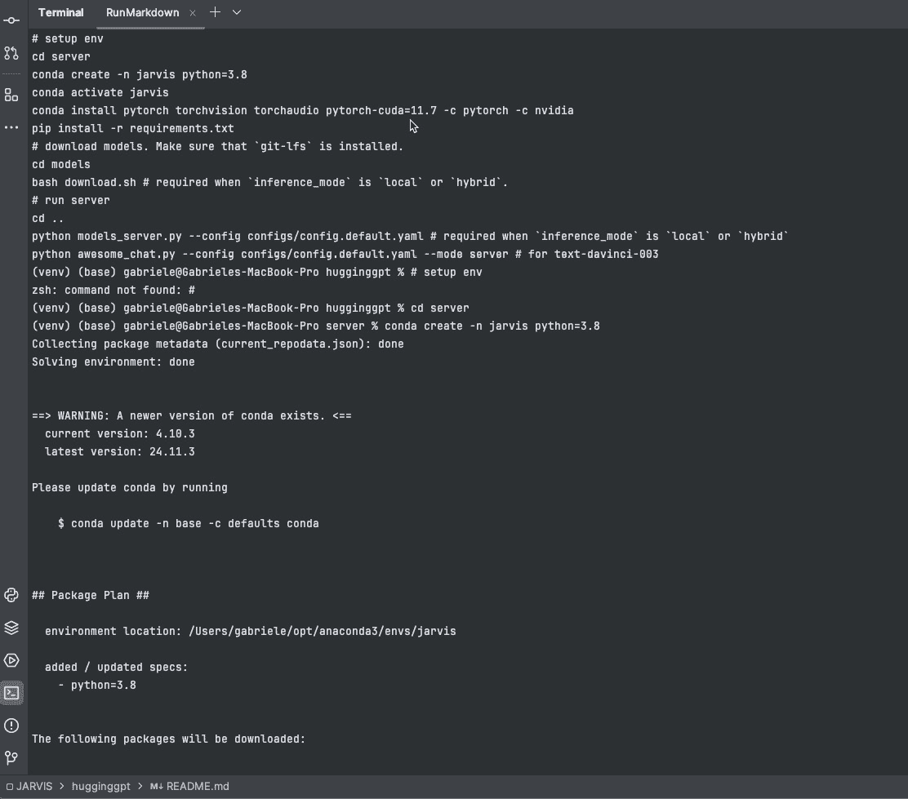

图 9.33 – Microsoft HuggingGPT 完成安装

由于我们已经初始化了`awesome_chat.py`，我们可以使用一个用户友好的网页。

## 在网上使用 HuggingGPT

如果您不想安装 HuggingGPT，可以使用在线套件（在 Hugging Face Gradio 上：[`huggingface.co/gradio`](https://huggingface.co/gradio)）。**Hugging Face Gradio**是一个 Python 库，简化了创建用户友好的基于 Web 的界面以供机器学习模型和其他 Python 应用程序使用的流程。

使用 Gradio，开发者可以快速构建交互式演示，例如文本生成、图像分类和音频处理等任务。这些界面允许用户通过提供输入（例如文本、图像或音频）并在浏览器中查看实时输出，直接在浏览器中测试模型。Gradio 高度可定制，支持与流行的 ML 框架（如 PyTorch、TensorFlow 和 Hugging Face 模型）集成，并可通过公共链接或嵌入到 Web 应用程序中轻松共享演示。

作者创建了一个 Gradio 界面（从本地启动 Jarvis 允许此类界面）。Gradio 空间可以通过以下链接访问：[`huggingface.co/spaces/microsoft/HuggingGPT`](https://huggingface.co/spaces/microsoft/HuggingGPT)。

正如之前在系统及其安装描述中所述，HuggingGPT 是一个将 LLM 与 ML 社区连接起来的系统。在 Web 界面上，它也执行了完全相同的功能：将一个 LLM 与托管在 Hugging Face 上的 ML 模型集连接起来。由于硬件限制，Web 界面仅在`local/inference`端点部署了少量模型（此界面作为了解和查看系统工作原理的示例）。 

注意，我们需要两个令牌，用户需要从每个网站获取：

+   **Hugging Face 令牌**：这是一个个人认证密钥，允许用户安全地访问 Hugging Face 的服务，包括其 API、模型、数据集以及平台托管的其他资源。此令牌作为您账户的标识符，确保您的请求得到 Hugging Face 系统的授权并与您的账户关联。该令牌随后用于验证和使用推理中的模型。Hugging Face 对某些服务实施速率限制，尤其是对 Web 推理。

+   **OpenAI 密钥**：这是 OpenAI 提供的唯一认证密钥，允许开发者安全地访问和交互 OpenAI 的 API 和服务，例如 GPT（例如 GPT-3.5 或 GPT-4）、DALL·E、Codex 和 Whisper。此密钥作为个性化凭证，用于识别您的账户并授权您使用 OpenAI 的平台。该密钥是向 OpenAI API 端点发送请求进行验证所必需的。OpenAI 使用您的 API 密钥跟踪您的使用情况（例如，API 调用次数和处理的令牌数）并相应地向您收费。在这种情况下，使用的是 GPT-4 的连接。

一旦我们准备好了令牌，我们就可以输入我们的问题并点击**提交**。

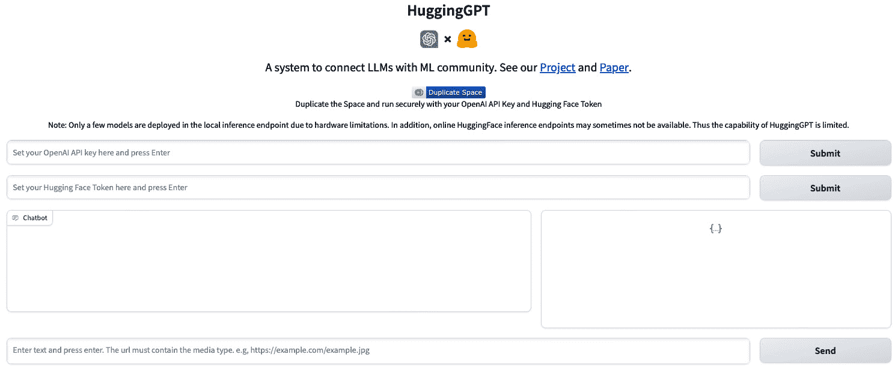

图 9.34 – HuggingGPT 界面

我们可以看到有两个主要面板：

+   **左侧面板**：提供了一个标记为**聊天机器人**的文本输入框。该字段用于用户输入，例如问题或命令，以与 HuggingGPT 系统交互。

+   **右侧面板**：在聊天机器人旁边预留了一个空白的框，用于显示 HuggingGPT 生成的响应或输出。

在聊天框下方，有一个标有**发送**的按钮，允许用户将他们的查询提交给 HuggingGPT。

注意，系统已经提供了我们可以使用的现成示例：

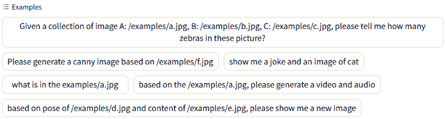

图 9.35 – HuggingGPT 提供的示例

我们输入 OpenAI 和 Hugging Face 的标记。使用标有**聊天机器人**的文本输入框，我们可以向 HuggingGPT 发送自然语言查询（“*你能告诉我你在图片中看到哪种披萨吗？*”）并通过**发送**按钮发送查询。此外，还可以添加图像或其他多媒体元素（在我们的案例中，我们添加了一张披萨的图片）：

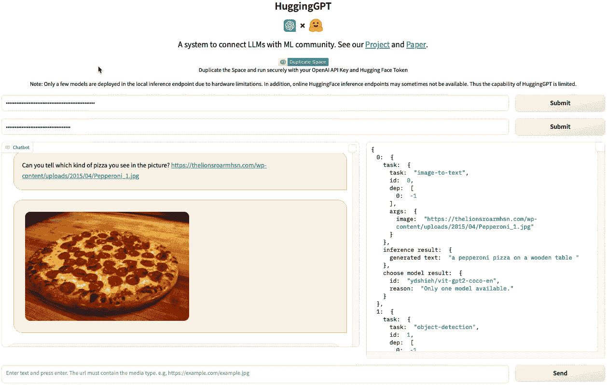

图 9.36 – HuggingGPT 交互示例

在图右侧的面板上，我们看到系统正在处理的过程：*1 个放在木桌上的意大利辣香肠披萨.* 这表明系统成功处理了输入图像，并识别出描绘为*意大利辣香肠披萨*的对象。这是一个典型的目标检测任务，系统正在使用一个模型来识别对象（这并不是一个进行图像识别的 LLM，而是一个由 LLM 调用的专门模型）。

聊天机器人根据推理结果提供详细的答案：

```py
Sure, based on the inference results, the pizza in the picture is a pepperoni pizza.
```

HuggingGPT 解释了过程：

1.  第一步涉及使用图像到文本模型来获取图像的描述。**ViT-GPT2-COCO-EN** 是一个视觉语言模型，它结合了一个用于图像编码的**视觉 Transformer**（**ViT**）和一个用于自然语言生成的**GPT-2**，在**COCO 数据集**上进行了图像标题任务的微调。该模型为输入图像生成英文描述性标题，有效地将视觉内容转换为连贯的文本描述。它利用 ViT 提取详细图像特征，并利用 GPT-2 的语言生成能力来生成准确且上下文丰富的标题。

1.  然后，HuggingGPT 使用一个目标检测模型来识别图像中的对象。这个目标检测模型也提供了类似的响应，因为它识别了披萨和餐桌。**DETR-ResNet-101** 是一个用于目标检测和图像分割的视觉模型。它结合了一个用于特征提取的**ResNet-101** 主干（卷积神经网络）和一个用于检测和定位图像中对象的**基于 transformer 的架构**。**DEtection TRansformer**（**DETR**）使用 transformer 来建模图像中的全局关系，从而在不需要传统区域提议网络的情况下实现更准确的目标检测。

1.  然后，一个视觉回答模型确认图像中是哪种披萨。**ViLT-B/32-Finetuned-VQA** 是一个针对**视觉问答**（**VQA**）任务进行微调的视觉和语言转换器模型。它结合了一个轻量级的**视觉和语言转换器**（**ViLT**）架构、基于补丁的图像分词器和转换器层，以联合处理视觉和文本输入。B/32 指的是使用 32 x 32 像素的补丁大小进行图像编码。该模型专门针对 VQA 数据集进行微调，旨在通过推理视觉和文本信息来回答关于输入图像的自然语言问题。

1.  最后，LLM 观察到三个模型意见一致，因此对响应有信心。

回顾一下，HuggingGPT 接收用户的请求并选择模式。这些模式被执行，输出被收集。系统分析这些输出是什么，并生成最终响应。

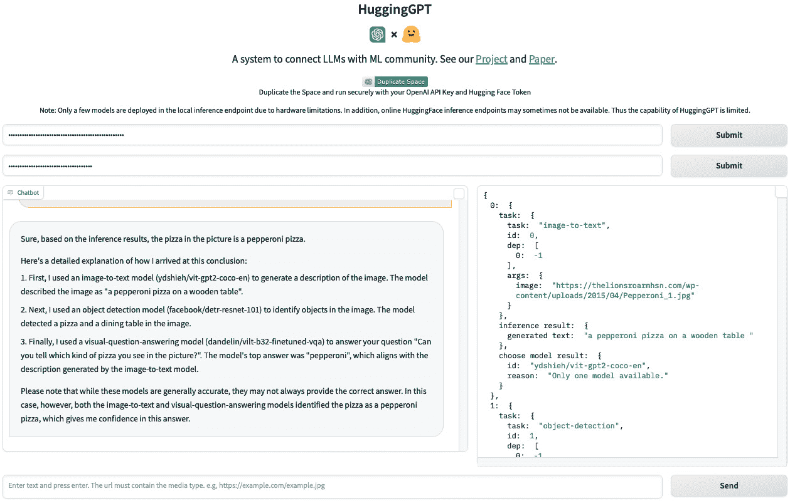

图 9.37 – HuggingGPT 响应示例

HuggingGPT 通过一个简单的例子展示了如何使用 LLM 解决多模态任务。这一切都是使用提示中的信息和一系列工具完成的。

在本节中，我们看到了一个单个 LLM（单个代理）处理任务，将其分解为子任务，并执行不同的模型。一个更优雅的方法是使用多个代理从不同的角度处理任务，协作并交互以解决问题。在下一个小节中，我们将看到如何实现这一点。

# 多代理系统

在本节中，我们看到了如何创建一个考虑不同代理和一系列工具（如 ML 模型）的系统。整个代码可以在`Multi_Model–Travel_Planning_System.py`脚本中找到。

作为一般概述，该系统实现了一个使用多个代理创建个性化旅行计划的旅行规划助手。然后，系统结合天气预测、酒店推荐、行程规划和电子邮件摘要。换句话说，我们有四个不同的代理，每个代理处理旅行规划的不同方面：

+   `WeatherAnalysisAgent`：使用随机森林回归器根据历史天气数据预测最佳访问地点的时间。在过去的天气数据（月份、纬度、经度和天气评分）上训练，并根据天气评分预测最佳的旅行月份。然后，该代理使用一个 ML 模型进行预测（一个专门为系统训练的模型）。

+   `HotelRecommenderAgent`：使用句子转换器嵌入根据用户偏好查找酒店。存储酒店描述并将它们转换为嵌入，然后使用语义相似性将用户偏好与最相关的酒店匹配。基于用户偏好，该代理在其库中搜索可能的解决方案。

+   `ItineraryPlannerAgent`：使用 GPT-2（文本生成管道）创建个性化的旅行行程。代理根据目的地、天气预测和酒店推荐生成行程计划。

+   `SummaryAgent`：使用 GPT-2 为客户生成摘要电子邮件。此摘要包括酒店费用（每晚费用×持续时间）和额外的每日费用。之后，它生成包含旅行详情、费用细分和行程高光的个性化电子邮件。

下图展示了代理和流程的架构：

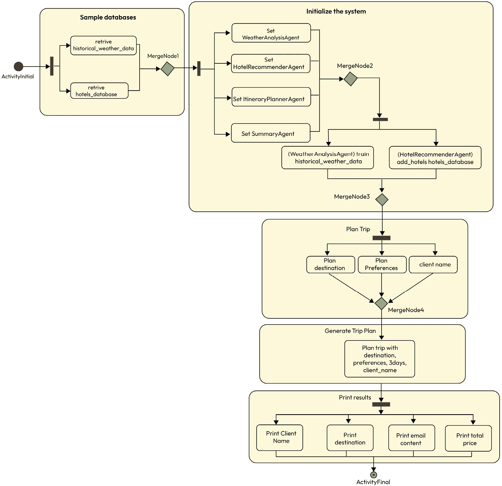

图 9.38 – AI 旅行规划系统工作流程的活动图，显示了从数据加载和代理初始化到行程规划和结果输出的完整序列

`TravelPlanningSystem`将所有代理连接在一起，基本上是系统的主控制器。因此，系统模仿了以下流程：

1.  用户提供目的地、偏好和持续时间。

1.  天气代理预测最佳访问时间。

1.  酒店代理找到匹配的住宿。

1.  行程代理创建每日计划。

1.  摘要代理生成电子邮件并计算费用。

详细来说，我们可以看到这里的代理被定义为类。`WeatherAnalysisAgent`是一个基于机器学习的组件，它分析历史天气数据并预测给定位置的最好访问月份。它使用随机森林回归器来完成这项工作。我们可以将其视为一个使用机器学习模型执行任务的代理。此片段正在初始化代理：

```py
class WeatherAnalysisAgent:
def __init__(self):
           self.model = RandomForestRegressor(n_estimators=100)
```

此代理创建一个`RandomForestRegressor`模型（`n_estimators=100`表示模型由 100 个决策树组成），必须从历史天气数据中学习模式，然后必须预测不同月份和位置的天气分数：

```py
def train(self, historical_data: Dict):
        X = np.array([[d['month'], d['latitude'], d['longitude']] for d in historical_data])
        y = np.array([d['weather_score'] for d in historical_data])
        self.model.fit(X, y)
```

如前所述，此模型不是预先训练的（即，它不用于推理）而是在现场训练的。为此，我们类中有一个`train`方法。随机森林使用月份、纬度和经度来学习预测一个`weather_score`值（表示该月天气好坏的数值分数）。在这个片段中，数据被处理，模型被训练。

在这一点上，我们可以使用`predict_best_time`作为方法，根据训练的天气模型预测最佳访问月份。在这种情况下，该方法只接受两个输入（位置的纬度和经度）并返回其预测：

```py
def predict_best_time(self, location: Dict) -> Dict:
        # Predicts the best time to visit a location based on weather patterns
        predictions = []
        for month in range(1, 13):
            # predict returns a 2D array, we take the first (and only) element
            prediction = self.model.predict([[
                month,
                location['latitude'],
                location['longitude']
            ]]).item()  # .item() converts numpy array to scalar
            predictions.append({'month': month, 'score': float(prediction)})
        return {
            'best_months': sorted(predictions, key=lambda x: x['score'], reverse=True)[:3],
            'location': location
        }
```

注意，我们初始化预测，它将包含 12 个月的所有分数（实际上，预测是通过循环所有 12 个月进行的，从一月到十二月）。最后，我们将列表从最好到最坏排序，以确定最佳访问月份。然后，该方法返回具有最高预测天气分数的前三个月份的列表。

`HotelRecommenderAgent`是一个酒店推荐系统，它利用语义相似性将酒店与用户偏好相匹配，并使用自然语言处理（**NLP**）来理解和比较酒店描述和用户偏好：

```py
class HotelRecommenderAgent:
    def __init__(self):
        self.encoder = SentenceTransformer('all-MiniLM-L6-v2')
        self.hotels_db = []
        self.hotels_embeddings = None
```

在代理初始化期间，加载了`all-MiniLM-L6-v2`（一个为语义相似性设计的预训练 NLP 模型）。这个模型是一个嵌入器（如*第五章*中所述），将文本（酒店描述和用户偏好）转换为向量嵌入（多维空间中的数值表示）。一旦我们有了向量，我们就可以测量两个向量之间的相似度（用户偏好和酒店描述）。代理检索可用的酒店（`self.hotels_db`）并可以存储所有酒店描述的预计算嵌入（数值向量）。

接下来，在下面的代码片段中，我们有一个`add_hotels`函数，它将酒店添加到数据库中，并计算描述的嵌入，然后将它添加到我们的嵌入数据库中。`find_hotels`函数通过语义相似性找到符合用户偏好的酒店：

```py
def add_hotels(self, hotels: List[Dict]):
        self.hotels_db = hotels
        descriptions = [h['description'] for h in hotels]
        self.hotels_embeddings = self.encoder.encode(descriptions)
    def find_hotels(self, preferences: str, top_k: int = 5) -> List[Dict]:
        pref_embedding = self.encoder.encode([preferences])
        similarities = np.dot(self.hotels_embeddings, pref_embedding.T).flatten()
        top_indices = similarities.argsort()[-top_k:][::-1]
        return [
            {**self.hotels_db[i], 'similarity_score': float(similarities[i])}
            for i in top_indices
        ]
```

发生的情况是我们对用户的偏好进行嵌入，然后计算与所有存储的酒店向量的余弦相似度。在这种情况下，我们选择与我们的酒店描述最接近的五个酒店（`top_k=5`表示选择前五个酒店）。

`ItineraryPlannerAgent`负责根据目的地信息（城市或景点）、天气预测（最佳访问月份）、酒店推荐（选择的住宿）和旅行时长（天数）自动生成旅行行程。它使用自然语言模型（GPT-2）根据这些输入生成定制的旅行行程：

```py
class ItineraryPlannerAgent:
    def __init__(self):
        # Uses a language model for generating itineraries
        self.planner = pipeline(
            "text-generation",
            model="gpt2",  # In production, use a more powerful model
            max_length=500,
            truncation=True,
            pad_token_id=50256
        )
```

代理使用 Hugging Face transformers 库初始化一个 NLP 模型（GPT-2 模型，这是一个用于文本生成的预训练语言模型）。我们选择一个专注于文本生成的管道（`"text-generation"`表示模型将根据提示生成文本）。其他参数意味着我们将生成的文本限制在 500 个标记以内（`max_length=500`）并确保截断。

由于我们通过提示与 LLMs 交互，我们有一个方法允许我们创建一个结构化的提示，然后我们将使用这个提示与模型交互。这个提示被设计成能够生成一个旅行计划，其中它输入一些特定的信息：停留时长（持续时间）、目的地、天气信息（我们之前确定的最佳月份）、酒店选择（由之前的代理识别），以及一个景点列表：

```py
def _create_prompt(self, destination_info: Dict, weather_info: Dict,
                   hotel_info: Dict, duration: int) -> str:
    return f"""Create a {duration}-day itinerary for {destination_info['name']}.
Weather: {weather_info['best_months'][0]['month']} is the best month.
Hotel: Staying at {hotel_info[0]['name']}.
Attractions: {', '.join(destination_info['attractions'])}."""
```

在这一点上，我们可以创建行程；`create_itinerary` 方法精确地接受包含我们所需所有信息的先前提示（目的地、天气、酒店选择和旅行时长）。在 `create_itinerary` 方法内部有一个名为 `_create_prompt` 的方法来生成提示。GPT-2 模型接受输入提示并生成详细的行程：

```py
def create_itinerary(self, destination_info: Dict, weather_info: Dict,
                     hotel_info: Dict, duration: int) -> Dict:
    prompt = self._create_prompt(destination_info, weather_info, hotel_info, duration)
    #Generate the itinerary
    response = self.planner(prompt)[0]['generated_text']
    return {
        'itinerary': response,
        'duration': duration,
        'destination': destination_info['name']
    }
```

最后一个代理，即 `SummaryAgent`，负责总结旅行详情，计算总估算成本，并使用 GPT-2 为客户生成个性化电子邮件。我们的代理初始化与之前的代理类似；唯一的区别在于，在这种情况下，生成长度更大（`max_length=1000`）：

```py
class SummaryAgent:
    def __init__(self):
        # In production, use a more powerful LLM like GPT-4 or Claude
        self.llm = pipeline(
            "text-generation",
            model="gpt2",
            max_length=1000,
            truncation=True,
            pad_token_id=50256
        )
```

`calculate_total_price` 是代理用来计算旅行总成本的工具（记住，LLMs 在算术方面并不擅长，因此最好使用外部工具）：

```py
def calculate_total_price(self, hotel_info: Dict, duration: int) -> float:
        # Calculate total trip price
        hotel_cost = hotel_info[0]['price'] * duration
        # Estimate additional costs (activities, meals, transport)
        daily_expenses = 100  # Simplified example
        additional_costs = daily_expenses * duration
        return hotel_cost + additional_costs
```

代理执行一系列非常简单的计算：

+   每晚的酒店价格乘以停留时间

+   使用固定的每日费用 $100 来估算餐饮、交通、活动和观光门票的成本

+   将酒店和额外费用添加以返回最终估算

`create_email` 允许您创建将发送给客户的电子邮件摘要：

```py
def create_email(self, trip_data: Dict, client_name: str) -> Dict:
        total_price = self.calculate_total_price(
            trip_data['recommended_hotels'],
            trip_data['itinerary']['duration']
        )
        prompt = f"""
        Dear {client_name},
        Based on your preferences, I'm pleased to present your travel plan:
        Destination: {trip_data['itinerary']['destination']}
        Duration: {trip_data['itinerary']['duration']} days
        Best time to visit: Month {trip_data['weather_analysis']['best_months'][0]['month']}
        Recommended Hotel: {trip_data['recommended_hotels'][0]['name']}
        Itinerary Overview:
        {trip_data['itinerary']['itinerary']}
        Estimated Total Cost: ${total_price}
        Please let me know if you would like any adjustments.
        """
        # Generate email using LLM
        response = self.llm(prompt)[0]['generated_text']
        return {
            'email_content': response,
            'total_price': total_price,
            'summary_data': {
                'destination': trip_data['itinerary']['destination'],
                'duration': trip_data['itinerary']['duration'],
                'hotel': trip_data['recommended_hotels'][0]['name'],
                'best_month': trip_data['weather_analysis']['best_months'][0]['month']
            }
        }
```

如我们所见，电子邮件将被结构化以包含成本（我们使用之前描述的方法）以及我们之前获得的其他信息。请注意，我们使用了一个模板。

记住，`TravelPlanningSystem` 是主控制器，它集成了所有 AI 代理以实现自动旅行规划：

```py
class TravelPlanningSystem:
    def __init__(self):
        self.weather_agent = WeatherAnalysisAgent()
        self.hotel_agent = HotelRecommenderAgent()
        self.itinerary_agent = ItineraryPlannerAgent()
        self.summary_agent = SummaryAgent()
```

在第一步中，我们初始化我们的四个代理。每个代理将处理一个特定的任务。如果您注意到了，我们使用了一个模块化系统。其优势如下：

+   每个组件独立运行，使系统可扩展

+   组件可以更新或替换，而不会影响其他组件

+   它遵循 **单一职责原则**（**SRP**）以实现干净的代码架构

在这一点上，我们可以开始设置——获取最佳酒店和最佳访问月份：

```py
def setup(self, historical_weather_data: Dict, hotels_database: List[Dict]):
        # Initialize and train the models
        self.weather_agent.train(historical_weather_data)
        self.hotel_agent.add_hotels(hotels_database)
```

最后，您必须协调整个旅行并生成包含成本估算和行程安排的总结电子邮件：

```py
def plan_trip(self, destination: Dict, preferences: str, duration: int, client_name: str) -> Dict:
        # 1\. Weather analysis and best time prediction
        weather_analysis = self.weather_agent.predict_best_time(destination)
        # 2\. Hotel search
        recommended_hotels = self.hotel_agent.find_hotels(preferences)
        # 3\. Itinerary creation
        itinerary = self.itinerary_agent.create_itinerary(
            destination,
            weather_analysis,
            recommended_hotels,
            duration
        )
        # 4\. Create summary email and calculate price
        trip_data = {
            'weather_analysis': weather_analysis,
            'recommended_hotels': recommended_hotels,
            'itinerary': itinerary
        }
        summary = self.summary_agent.create_email(trip_data, client_name)
        return {
            **trip_data,
            'summary': summary
        }
```

现在我们已经创建了多代理平台，我们必须执行它。`main()` 函数作为运行 *旅行规划系统* 的入口点。它通过以下方式演示了系统的功能：

1.  初始化样本数据（天气历史和酒店）

1.  设置和训练 AI 模型

1.  执行旅行规划过程

1.  打印生成的旅行摘要

我们向系统提供了有关天气、目的地、酒店等方面的各种信息。之后，系统被初始化并执行。此时，它打印旅行摘要详情和由 GPT-2 生成的个性化电子邮件，并显示估计的总旅行成本：

```py
def main():
    # Example data with a full year of weather information
    historical_weather_data = […    ]
    # Sample hotel database
    hotels_database = […]
    # Initialize the system
    system = TravelPlanningSystem()
    system.setup(historical_weather_data, hotels_database)
    # Plan a trip
    destination = {
        'name': 'Rome',
        'latitude': 41.9028,
        'longitude': 12.4964,
        'attractions': ['Colosseum', 'Vatican', 'Trevi Fountain']
    }
    preferences = """Looking for a luxury hotel in the city center,
    preferably with spa facilities and fine dining options"""
    client_name = "John Smith"
    # Generate trip plan
    trip_plan = system.plan_trip(destination, preferences, duration=3, client_name=client_name)
    # Print results in a readable format
    print("\nTRAVEL PLANNING RESULTS:")
    print("-" * 50)
    print(f"Client: {client_name}")
    print(f"Destination: {destination['name']}")
    print("\nGenerated Email:")
    print("-" * 20)
    print(trip_plan['summary']['email_content'])
    print("\nEstimated Total Price:")
    print(f"${trip_plan['summary']['total_price']}")
```

确保只有当脚本直接执行时，`main()` 脚本才运行：

```py
if __name__ == "__main__":
    main()
```

到目前为止，我们只需要对其进行测试。一旦运行了脚本，结果应该是这样的：

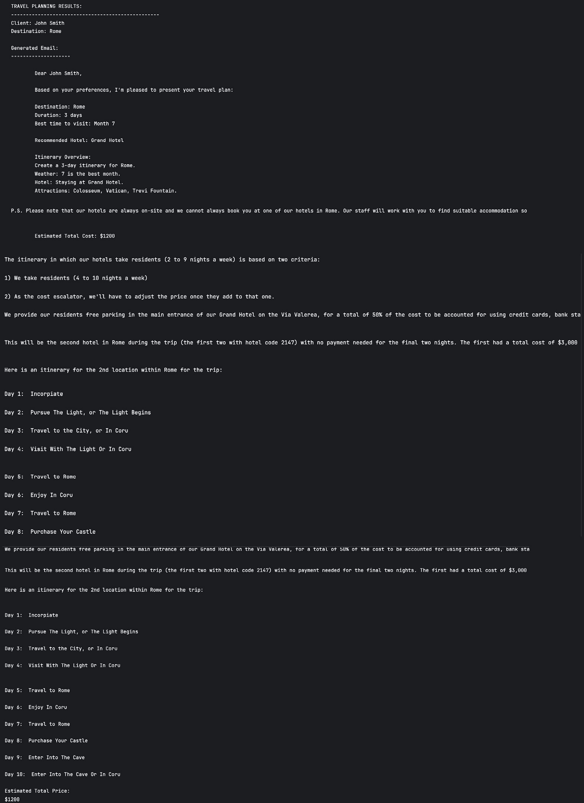

图 9.39 – 展示执行的截图

这个**旅行规划系统**是一个原型，展示了 AI 智能体如何协作来自动化现实世界的问题。

当然，可以对系统进行一系列改进，使其更有用：

+   使用的数据是静态的（这是一个玩具示例）。你可以连接到多个 API 以获取实时数据，例如天气（OpenWeatherMap 或 AccuWeather）、酒店（Booking.com 或 Expedia API）和目的地（Google Places API 或 Yelp）。还可以添加扩展，如航班和交通（Google Flights API 或 Rome2Rio）。

+   GPT-2 已经过时了（我们使用它是因为它比其他模型小得多）并且没有针对旅行进行微调。你可以用更大的或针对旅行优化的模型替换 GPT-2。例如，你可以使用更大的模型，如 GPT-4 或 Claude，或者开源替代品，如 LLaMA。此外，开源模型可以在 Tripadvisor、Lonely Planet 或 Reddit 的真实旅行行程上进行微调。

+   行程是通用的，不能适应不同类型的旅行者。你可以向旅行者询问不同的信息，例如预算偏好、他们喜欢什么样的活动（文化、冒险、美食、家庭友好型等），或者他们是否需要特殊住宿（轮椅、与老年人同行或宠物友好型）。这需要一个更大的模型，你也可以测试推荐模型。此外，还有实现**多标准决策制定**（**MCDM**）的方法和模型，以进行更复杂的排名。

在任何情况下，尽管这个系统很简单，但它让我们看到了几个有趣的因素：

+   与使用一个大型的单体 AI 模型不同，该系统被分解为专门的智能体。这个想法对于现代软件设计来说非常有用。

+   这个简单的例子模拟了多智能体 AI 平台在自动驾驶汽车、金融、医疗保健和机器人技术中的工作方式。实际上，多智能体协作是一个旨在考虑可扩展性、模块化和效率的系统，这对于现实世界的应用是必要的。

+   该系统可以动态生成个性化推荐（尽管在我们的案例中是硬编码的，我们模拟了用户输入偏好时发生的情况）。

+   该系统还分析了多个因素（天气、酒店和景点）并优化旅行计划。类似地做这件事的现代系统使用精确的机器学习模型（在我们的例子中，我们使用了随机森林），拥有庞大的数据库（在我们的案例中，我们模拟了一个酒店数据库），考虑用户偏好，并使用自动化系统响应用户（我们的电子邮件）。

尽管这是一个非常简单的系统，但我们可以思考一个类似的系统如何在其他各种行业中得到应用：

+   AI 医疗助手推荐治疗方案、优化医院日程安排并预测疾病风险

+   基于用户偏好和购买历史推荐产品的 AI 购物助手

+   用于自动驾驶汽车的多智能体 AI 系统（导航、行人检测或交通优化）

+   由人工智能驱动的顾问，帮助制定投资策略、风险管理以及欺诈检测

+   一个由人工智能驱动的城市规划师，优化交通、能源使用和公共交通路线

在本节中，我们探讨了如何创建一个多智能体系统。在下一节中，我们将讨论多智能体系统如何适应今天存在或正在进一步发展的各种商业模式。这将提供一个重要的视角，因为它将使你能够了解如何调整你的多智能体平台以满足企业的需求。

# 软件即服务（SaaS）、移动即服务（MaaS）、数据即服务（DaaS）和机器人即服务（RaaS）

在本节中，我们将探讨受最近人工智能进步影响的多种商业模式。虽然多智能体 LLM 代表了尖端技术，但它们的价值在于能够适应满足商业需求，使它们能够有效地打包、营销并交付给企业和消费者。考虑到这些系统开发和维护成本极高，读者了解收入模式非常重要，这样他们就可以思考、设计和开发与公司战略一致的产品。理解这些模式使我们能够理解多智能体系统不是一个独立的项目，而应该被视为一个产品，并且这个产品可以通过多种方式来营销。此外，LLM 是极其昂贵的产品，并且每个商业模式在持续更新、可扩展性和人工智能部署的灵活性方面都有其优势和劣势。同时，这些商业模式规范了技术访问，无论你是想开发人工智能模型还是作为客户。在产品开发之前必须做出这些选择（关于平台、商业模式等），因为成本不允许试错。商业模式的选择由产品的结构和多智能体系统，以及公司的经济可行性所定义。

## 软件即服务（SaaS）

SaaS 是一种服务模式，其中软件由提供商托管在云端，并通过互联网向用户提供服务。在传统模式中，软件提供给用户安装和本地使用（在用户的设备上）。另一方面，SaaS 允许通过互联网访问，通常是通过网页浏览器或移动应用。通常，SaaS 是通过订阅而不是一次性购买来提供的。SaaS 范式始于 1999 年，当时 Salesforce 推出了其**客户关系管理**（**CRM**）作为云托管服务。SaaS 现在是不同公司最广泛使用的销售范式，特别是对于**企业对企业**（**B2B**）应用。其受欢迎程度正在增长，预计未来几年 SaaS 软件的收入将不断增长。

SaaS 应用通常是为了托管在云端而构建的（它们被称为云原生）。开发这些应用的公司可以决定是否在自己的基础设施上托管，或者利用云服务提供商的基础设施（例如 Google Cloud、IBM Cloud、OVH、Aruba、**亚马逊网络服务**（**AWS**）和 Microsoft Azure）。鉴于对应用提供商的需求，一些提供商为托管这些应用创建了专门的基础设施，因此我们也谈论**平台即服务**（**PaaS**）。

在 PaaS 解决方案中，提供商通过专用基础设施托管硬件和软件，这些基础设施可供产品开发者使用。这允许开发者专注于编码，而无需担心维护或管理其背后的基础设施。该平台允许托管应用程序和数据，甚至训练模型，只留下编码工作给开发者。这已经使许多企业能够加速产品开发，他们设法避免了投资昂贵的基础设施（尽管广泛使用这些平台可能成本高昂，尤其是在应用是生成式 AI 时）。尽管 PaaS 简化了流程，但开发者被迫使他们的应用程序符合平台和环境的要求。这并不总是可能的，导致部署或其他问题。因此，出现了一种新的范式，使用户具有更大的灵活性、控制和适应性，尤其是在应用程序或业务需要时。这种范式被称为**基础设施即服务**（**IaaS**）并大约在 2010 年出现。在 IaaS 中，用户可以通过网络服务访问计算资源，从而能够根据需要租赁基础设施（服务器、网络和存储）。用户对基础设施的控制更多，而提供商则专注于硬件（例如 Google Compute Engine、DigitalOcean 和 Amazon Elastic Compute Cloud）。因此，PaaS 和 IaaS 可以被视为 SaaS 的扩展，或为需要支持生态系统的企业提供服务。

(img/B21257_09_40.jpg)

图 9.40 – 不同范式的比较([`arxiv.org/pdf/2311.05804`](https://arxiv.org/pdf/2311.05804))

因此，SaaS 应用程序被设计为可以通过互联网连接从必须连接到互联网才能访问应用程序的设备（未连接的设备无法访问应用程序，并且允许本地访问不是必需的）进行访问。软件是开发用来通过网络浏览器或特定应用程序（移动软件）使用的。某些 SaaS 应用程序（例如 Adobe Acrobat）可能要求用户在他们的计算机上下载并安装一个专用的客户端（一个轻量级程序，不是完整的应用程序，需要安装在本地 PC 上），但这通常是少数情况。SaaS 应用程序通常是一个 **多租户软件架构**，其中软件应用程序的单个实例（包括其数据库和硬件）为不同的用户账户（或多个租户）提供服务。租户就是所谓的软件用户，它是一个组织内的单个用户或用户组。

在 SaaS 中，拥有一个确保每个租户的数据被隔离且对其他租户不可访问的架构至关重要。这种方法通过使软件能够针对单一硬件和基础设施进行优化，然后由所有用户共享，从而降低了成本。它还允许实现更大的可扩展性、更易于定制的维护（提供商可以在自己的基础设施和单一架构上自行进行更新）。

SaaS 因此成为最广泛使用的范式之一，因为它具有许多优势：

+   **成本效益**：客户无需承担任何前期成本，例如硬件或软件许可的费用。在 SaaS 中，客户可以选择按订阅或按使用付费。

+   **可扩展性**：SaaS 对客户来说易于扩展，且不需要额外的硬件。同样，软件的结构使得扩展客户变得容易。在人工智能模型的情况下，客户不需要大型硬件，可以直接利用提供商提供的硬件。

+   **可访问性**：客户可以通过互联网连接从世界任何地方访问应用程序。此外，使用网络浏览器，软件针对客户拥有的任何硬件进行了优化。SaaS 还通过使用模板、API 和框架，降低了客户访问人工智能的门槛（资源较少且对专业知识的需求较低）。

+   **集成和定制的便捷性**：从资源和时间方面来看，开发者提供更新、安全补丁和维护要容易得多。通常以更简单的方式为客户提供定制管理的能力，同时保持控制。同样，对于 AI 系统，可以提供更新的模板。

+   **快速部署**：SaaS 通过在市场上立即可用来减少部署和市场接入时间。

+   **数据和模型共享**：模型和数据的访问可以轻松地同时允许来自不同团队或不同地点的用户，并且高效且有效地进行。

当然，SaaS 也有一些限制和缺点：

+   **对互联网连接的依赖**：SaaS 需要稳定的连接，连接中断可能会停止关键流程并引发错误。农村地区和基础设施薄弱的国家可能无法覆盖。

+   **定制有限**：SaaS 解决方案是在一个产品中尽可能覆盖更多业务的想法下开发的。通常，它们提供有限的定制选项，可能无法满足特定企业的所有需求。在 AI 系统的案例中也是如此；客户对模型的控制很少，模型可能无法满足客户的要求。

+   **数据安全和隐私问题**：托管在第三方服务器上带来了数据泄露或未经授权访问的风险。此外，可能与欧盟等国家的法规不符（例如，数据必须存储在特定国家的服务器上）。训练或使用 AI 模型可能需要共享敏感数据，这可能违反 GDPR 或其他法规（以及额外的隐私风险）。

+   **供应商锁定**：企业可能依赖于特定的 SaaS 提供商，然后由于成本和复杂性而无法迁移到其他平台。此外，不同的提供商可能会终止服务（或被收购），突然增加成本，或取消被认为至关重要的功能。随着时间的推移，SaaS 可能会变得昂贵，尤其是当基于订阅时（一些提供商随着用户数量的增加而收费更多）。

+   **性能问题**：在多租户架构中共享资源可能导致高峰时段性能变慢。此外，可能会有意外的服务器停机或维护计划，这会损害业务（例如，如果维护在太平洋时间晚上进行，将干扰欧洲的业务时间），而客户对此无能为力。必须实时运行的 AI 系统可能存在延迟或性能问题（无论是在训练还是在推理）。此外，提供商可能不提供最先进的 AI，或者尚未实施（或者他们可能使用不适合客户需求的模型）。

+   **高计算成本**：SaaS 对开发者来说有基础设施成本，在 AI 的情况下，这种成本可能更高（使用 GPU 或大存储成本）。其中一些服务对用户来说特别昂贵。

## 模型即服务 (MaaS)

MaaS 是随着大数据、AI 和 Web 3.0 的发展而产生的一种新范式。MaaS 是一种基于云计算的服务范式，为开发者和企业提供 AI 和 ML 模型以及相关的 IaaS。

MaaS 旨在简化那些既没有专业知识也没有基础设施来训练生成 AI 或一般模型的企业的 AI 访问。MaaS 通过简单的界面、API 或浏览器使用预训练的 ML 模型和算法。就像 SaaS 一样，模型的访问是通过互联网进行的（并且要求企业有互联网连接）。然后，提供商必须托管模型并允许开发者访问已训练的模型。开发者可以使用这些模型将 AI 功能添加到他们的系统和应用中。MaaS 通常是一个平台，用于托管在大量数据上训练或针对可能任务优化的模型。MaaS 减少了管理这些模型的复杂性（尤其是培训和部署），并允许开发者专注于使用模型或如何将它们集成到特定应用中。由于开发者不必从头开始训练这些模型，因此他们节省了时间和资源。因此，MaaS 在某些方面与 PaaS 和 IaaS 相似，但进行了一个额外的抽象级别，并专注于 AI 解决方案。从某种意义上说，MaaS 可以被视为 SaaS 和 PaaS 或 IaaS 之间的中间解决方案。它不仅提供了一种服务，还提供了一种基础设施，使定制产品的开发成为可能。

SaaS 和 MaaS 之间的另一个区别在于两种范式的底层架构。SaaS 侧重于应用程序（应用层），这些应用程序依赖于一个操作系统（无论是移动还是桌面应用程序）来运行，以及一个允许应用程序托管的层。在 MaaS 的情况下，架构侧重于需要特定框架来托管的模型。

(img/B21257_09_41.jpg)

图 9.41 – 传统技术与基于模型的技术堆栈的比较([`arxiv.org/pdf/2311.05804`](https://arxiv.org/pdf/2311.05804))

在 MaaS 中，以下元素通常存在：

+   **云计算**：MaaS 基于云上的基础设施，其中维护和部署了各种模型。这使得对模型的访问变得容易，并实现了更大的可扩展性。

+   **模型训练和优化**：MaaS（模型即服务）提供商负责在大数据集上训练大型模型。他们还负责整个生态系统，以实现模型更有效的利用。例如，他们可以提供不同大小的模型，包括针对特定应用的量化或微调版本。

+   **API 和开发工具**：MaaS 提供商还提供 API 和工具，允许开发者轻松地将模型用于其应用程序。目的是允许轻松地将模型集成到其他应用程序和基础设施中。因此，API 作为端点，接收数据，并返回预测。

+   **监控和分析**：迄今为止，越来越多的关注点是如何在生产环境中监控模型。MaaS 提供商通常提供一系列工具来监控模型性能、识别问题存在、集成反馈或改进资源分配。

+   **可扩展性、安全性和隐私性**：MaaS 提供商通过允许客户同时管理多个用户（从而根据需要分配不同的带宽、计算能力或存储）来关注其系统的可扩展性。同时，今天对隐私和安全性的关注越来越多（尤其是在有更多监管的情况下）。平台通常有一系列工具，可以增加集成其模型的应用的隐私性和安全性。

Hugging Face 是一个 MaaS 提供商的例子。Hugging Face 为计算机视觉、NLP、音频、视频等领域提供数千个预训练模型（来自公司本身、其他公司或用户）。这些模型托管在其模型中心，可以通过 API 使用或本地安装。因此，不想下载模型的用户可以使用推理 API，而不需要拥有管理模型所需的基础设施（此 API 使用按使用付费系统）。没有专业知识或资源的开发者可以直接使用端点 API，将其应用程序中的 AI 模型直接集成。此外，Hugging Face 还提供了一个平台，用于托管和部署模型以及应用程序，扩展 MaaS 功能，并为希望使用自定义模型的客户提供灵活性。Hugging Face 还提供工具以提高模型的可扩展性，开源库以促进模型开发或集成（例如，Transformers、Datasets、Diffusers、句子嵌入等），以及提供论坛以促进用户交流、用户教育资源和其他服务。还有其他 MaaS 提供商，例如 Google AI（提供 NLP（自然语言 API）、视觉（视觉 API）、语音转文本、翻译或使用 Vertex AI 的自定义模型训练）和 AWS（提供语言、图像和文本（例如，AWS Comprehend、Rekognition 和 Translate）的预训练模型或自定义模型的基础设施）。

MaaS 在 AI 领域具有以下优势：

+   **简化的模型开发和部署**：MaaS 降低了使用生成式人工智能的技术门槛。公司不需要对技术或不同算法有专长的开发者，因为大多数模型都是通过端点交付的。这使得公司能够专注于其产品的应用和模型集成。如果需要，MaaS 还简化了为应用微调模型的方法。与 SaaS 不同，MaaS 针对整个 AI 工作流程进行了定制，并提供用于部署、训练、管理和扩展模型的工具，从而为有兴趣使用人工智能的公司提供更好的支持。

+   **高性能和可扩展性**：云计算的使用促进了系统扩展。实际上，使用人工智能可能需要高昂的成本和大量的资源（尤其是在使用大型语言模型时），而 MaaS 通过便于访问大型模型而无需不同企业承担初始进入成本，从而实现了更好的资源管理。通常，用户根据其需求支付消费费用并接收计算服务，从而实现更好的性能和可扩展性。由于 MaaS 针对人工智能工作负载进行了优化，因此当计算需求波动时，它可以轻松扩展（SaaS 通常侧重于分配可变数量的用户，但用户对计算的需求可能因模型的不同使用而不同）。

+   **共享知识和协作**：MaaS 建立在收集大量数据集和训练大型模型的基础上。这些预训练模型随后可以被对将模型适应特定应用感兴趣的开发商微调。这意味着开发商需要收集的数据量更少，也不必从头开始训练大型模型。这节省了资源和成本（微调的计算成本远低于预训练）。此外，MaaS 允许标准化，从而降低了使用这些模型所需的技术知识，并允许轻松获取信息和教程。模型还可以在平台上由社区共享，这些平台上也交换信息和经验（这促进了协作环境并加速了新模型的发展）。

+   **商业支持**：MaaS 采用灵活的支付模式，例如基于订阅的支付方式，您只需为当前消费付费。通常，这种解决方案对许多小型企业来说既经济又实惠。对提供商来说很方便，因为一旦他们选择了一种技术并将其集成到他们的产品中，用户就会保持忠诚。模型集成使企业能够以简单且经济的方式获得洞察力（用于预测或其他预测的模型、报告编写和可视化）。

+   **灵活性**：MaaS 为大量应用程序提供模型，并允许企业集成大量潜在模型，提供广泛的灵活性（例如，自然语言处理、计算机视觉、时间序列等众多其他应用）。此外，开发者可以快速测试许多预训练模型，而无需更改设置（例如，Hugging Face 提供了数千个只需少量管道即可使用的模型）。同样，MaaS 提供商通常提供许多工具来简化 AI 生命周期（数据标注、数据格式集成、监控工具等），从训练到部署。

MaaS 是一种新的范式，生成式 AI 领域也在积极发展中，因此存在需要解决的一些挑战和可能的缺点：

+   **安全和隐私**：通常，在模型训练过程中会传输大量数据，这可能会被拦截。此外，基于敏感数据训练的模型最终可能会输出敏感数据。这些模型也可能是在受版权保护的数据上训练的，而使用此类数据进行训练的立法并不完全明确。因此，坚持特别受监管行业的组织可能不会采用 MaaS。数据是这些模型的基础，但模型可能是基于低质量数据进行训练的，或者可能因为低质量数据而出现偏差。通常，没有关于这些模型训练数据的信息。在这些情况下，平台和这些模型的使用企业都可能面临罚款或其他监管。

+   **供应商锁定**：MaaS 提供商使用专有工具和 API，这使得从一个提供商切换到另一个提供商变得困难（例如，更换提供商会复杂化模型集成或导出经过微调的模型）。这种困难可能会降低灵活性和创新，并使企业依赖于单一提供商。可能会有停机或服务中断，这会影响构建的应用程序。这也使得本地实验更加困难。

+   **有限的定制性**：并非所有 MaaS（移动即服务）提供商都允许对预训练模型进行微调或修改。预训练模型可能不适合某些特定操作，或者企业可能需要控制超参数和基础设施。此外，MaaS 提供商可能会进行更改或计划更新，这可能会影响业务或不再允许其应用程序的一些核心功能。

+   **模型和结果的解释性**：模型通常是一个黑盒，用户无法访问决策过程。特别是对于生成式 AI 模型，很难理解模型如何处理输入并得到输出。对于敏感应用，这可能会引起问题，特别是当模型产生幻觉或错误的输出时。此外，平台的缺乏透明度可能会影响诊断错误或了解如何纠正它们的能力。

+   **性能和成本**：延迟指的是请求与相应响应之间经过的时间。模型的延迟取决于底层基础设施，在高峰使用期间可能会承受压力。在 MaaS 平台中的共享多租户环境在高峰使用时段可能会导致资源瓶颈。企业可能会遇到延迟显著增加的情况，使得他们的应用程序无法使用。MaaS 允许按需付费，但大规模训练或推理可能会迅速变得昂贵。

MaaS 对于许多企业来说仍然是一个不断发展的范式。例如，在医疗保健领域，由于存在大量数据，并且已经开发了许多模型，MaaS 可能会产生重大影响。这些模型可以在平台上提供，并在需要时由从业者或制药公司使用。显然，在医疗保健领域，数据安全和输出一致性至关重要（尤其是如果这些应用程序用于医院或其他医疗机构）。MaaS 在其他领域也在增长，例如金融、区块链和 Web 3.0。

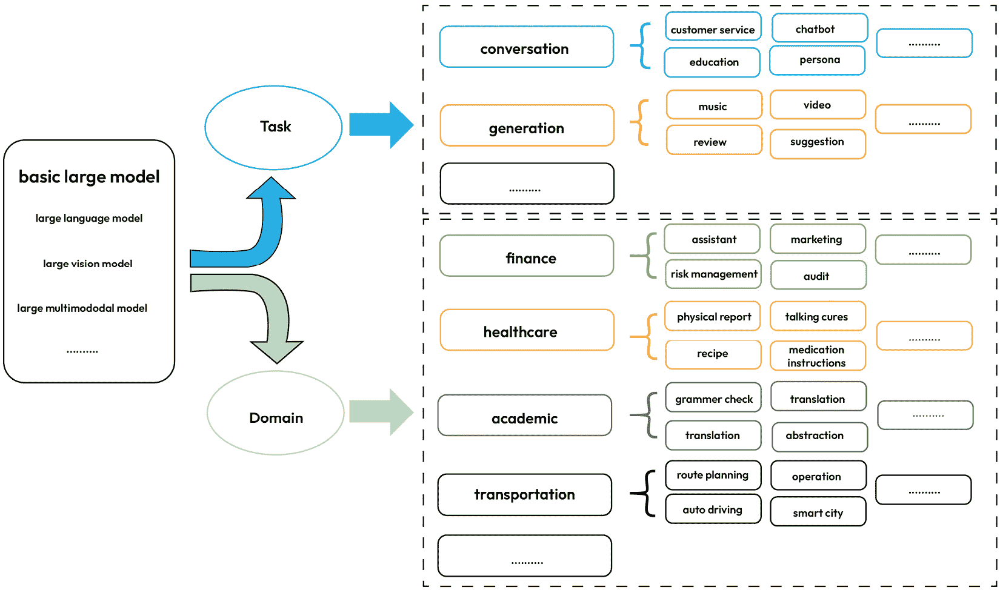

图 9.42 – MaaS 中各种行业的应用（[`arxiv.org/pdf/2311.05804`](https://arxiv.org/pdf/2311.05804)）

## 数据即服务（DaaS）

DaaS 是一种商业模式，无论用户地理位置或组织边界如何，都可以按需向用户提供数据。在 DaaS 中，数据存储在云端，客户可以通过向提供商支付订阅费来访问它（无论是否需要额外工具）。因此，DaaS 围绕数据是资产并且可以按需提供给用户的概念构建。这种访问可以通过平台、API 的使用或其他方式来实现。此外，提供商可以提供原始数据或经过标准化以供机器读取或准备好的数据。

人工智能模型以数据需求量大而闻名，获取高质量数据可能并不容易。因此，有一些参与者专注于收集难以获取的数据，然后将它们卖给其他参与者。例如，患者数据可能难以收集，一家公司可能会收集和处理数据，然后将数据卖给制药公司。或者，DaaS 允许公司创建新的商业模式，利用他们在正常运营期间收集的数据作为可以出售的资产。例如，一家收集了其用户数据的电信公司可以将匿名数据卖给零售商。这些数据通过安全门户出售，可以按访问次数收费或通过订阅收费。订阅通常是最受欢迎的方法，可以分为三种子类别：时间模型、基于数量的定价模型和按呼叫或数据类型付费的模型。

DaaS 提供商可能只是销售其收集的原始数据，但更常见的是，它还会对其进行处理，使其可以通过模型进行分析。一些 DaaS 提供商汇总不同的来源，进行处理，从而简化了客户的分析过程。实际上，这些数据的目的在于改善客户的业务流程和决策，或者允许客户训练他们的 AI 模型。

还可能存在双向性，其中提供商收集数据并将其协调以与自己的数据集成，然后再将其提供给客户端。通过将其与其他数据相关联，客户端可以从其自身数据中提取额外的价值。

DaaS 有一些优点：

+   **成本效益**：DaaS 减少了客户构建和维护数据基础设施和团队的需求。由于其灵活性，它还降低了数据访问的成本。客户不需要存储数据；他们可以在需要时直接访问数据流。

+   **易于访问**：按需提供数据允许实时访问，节省了获取数据信息的时间和专业知识。用户不需要了解数据及其背后的结构，但可以轻松学习如何使用它。此外，只要有互联网连接，客户端就可以始终访问数据。

+   **可扩展性**：它易于扩展以适应不断增长的数据需求，而无需额外的基础设施投资。客户可以轻松选择他们需要或能够处理的数据工作量。

+   **集中式数据管理**：DaaS 实现了一致和集中的数据存储，减少了数据的不一致性和冗余。这简化了数据治理并符合法规要求。

+   **专注于核心活动**：DaaS 节省资源和时间，使企业能够专注于从数据中提取价值，而不是管理数据。此外，它还促进了不同团队成员和协作者的更好合作，他们可以访问相同的数据（以相同的格式）。

+   **与其他服务的集成**：DaaS 使数据与业务中的其他服务集成变得容易，尤其是在分析平台、可视化工具和其他云服务方面。同样，它还促进了数据集的定期更新，并使用户能够访问最准确和最新的数据。

+   **数据质量**：由于数据集中，数据质量往往得到改善。一旦这些数据经过测试，如果没有更新，就无需进一步测试。

DaaS 的缺点与其他与云计算相关的模型类似：

+   **数据安全和隐私风险**：显然，数据在云上的位置可能意味着敏感和专有数据可以被第三方访问或面临泄露风险。提供商必须遵守日益严格的法规。保护基础设施的成本正在增加，数据盗版攻击也在上升。此外，尽管数据以匿名方式出售，但在某些情况下，有可能重建信息。

+   **对提供商的依赖性**：DaaS 导致对外部提供商的临界数据产生依赖。提供商端的服务中断或故障会影响客户以及所有与访问此数据相关的服务。客户通常可以访问数据流，但不会下载数据，因此可能会被切断对其业务必要的数据。

+   **有限的定制性**：DaaS 可能无法提供所需格式的数据或具有正确的粒度。提供商有提供对尽可能多的客户有用的数据的兴趣，但特定客户可能有不同的需求。不合适的格式使得将其集成到现有系统或自己的工作流程中变得更加复杂，需要承担适应系统或数据的成本。

+   **质量保证**：在 DaaS 中，数据的准确性方面的质量至关重要，低质量的数据可能导致决策失误或相关服务中的错误。数据的质量、准确性和可靠性取决于提供商。因此，提供商必须确保数据的相关性、更新性和高质量。

+   **延迟和性能问题**：通过互联网访问数据可能导致引入延迟（尤其是在连接不好或数据集非常大时）。此外，这种延迟如果数据流嵌入到其他服务中，可能会降低性能。

## 结果即服务（RaaS）

RaaS，或 OaaS，是近年来发展起来的一种新范式。RaaS 是一种商业模式，服务提供商提供特定的结果或成果，而不是提供工具、平台或原始数据。这种模式在数据分析、人工智能和自动化等领域引起了人们的关注。在 RaaS 中，提供商使用人工智能（包括 LLMs 和代理）为顾客提供个性化的见解。虽然提供商进行整个分析，但客户可以专注于业务洞察，无需专门的技术人员。一般来说，客户不是一次性支付服务费用，而是通过订阅定期接收分析。

由于客户越来越要求模型的价值（企业对模型获得的价值比对额外工具的兴趣更大），RaaS 专注于提供结果，而不是模型（或数据）。此外，客户正在寻找降低采用技术成本但保留其价值的方法，因此 RaaS 寻求将企业的初始成本降至最低。提供商专注于确定实现结果所需的技术或工具，而客户则说明他们的需求和需求。

RaaS 的目的是建立客户忠诚度，因此提供商有每个兴趣自动化分析过程。因此，可以设想 AI 代理成为这种商业模式的新核心组件。LLM 本身能够几乎瞬间生成可能的报告，从而为客户生成见解。这些报告可以使用 LLM 进行个性化，并提供针对客户的定制见解。添加工具和数据库既可添加定量组件，又可扩展 LLM 的功能。然后，代理允许自动和常规地完成任务。实际上，代理可以分析大量数据，并可以补充额外的模型。生成的报告（甚至演示）可用于做出明智的决策。

因此，RaaS 具有以下优势：

+   **以结果为导向的方法**：企业只为结果（以及交付的价值）付费，而不是为工具、基础设施和专业知识付费。这降低了企业的风险，因为它对使用软件或进行分析没有责任。

+   **成本效益**：对于客户来说，无需花费金钱来构建基础设施和专业知识。相反，服务提供商可以自动化流程并降低成本（对于小企业来说可能相当昂贵）。此外，客户可以以商定的价格采用订阅计划（附带的好处是结果导向的定价模型直接将成本与实现的结果相匹配），而服务提供商则获得稳定的月收入。

+   **关注核心竞争力**：由于公司不必投资资源来构建和维护系统或管理流程，RaaS 提供了巨大的时间优势。这也允许企业实施新能力，只需从提供商那里执行。然后，客户可以专注于其核心竞争力，并将结果直接纳入其流程中。

+   **可扩展性、准确性和灵活性**：该系统具有可扩展性和灵活性，因为提供商可以为不同的客户重复使用这项技术。由于他们的支付或声誉取决于服务的成功，因此提供商有动力提供高质量的结果。

RaaS 也可能存在一些劣势：

+   **控制权丧失**：客户对如何实现这些结果的控制有限。他们无法跟踪过程或诊断过程中出现的潜在问题。此外，还可能存在客户可能没有注意到的合规性、质量或道德实践方面的潜在问题。总的来说，RaaS 不促进透明度，它依赖于客户对提供商的信任。

+   **对提供商的依赖**：对于客户来说，RaaS 意味着对服务提供商的高度依赖，这可能导致供应商锁定、更换供应商困难或更换供应商成本高昂。任何提供商方面的失败或低效都会直接影响客户运营。在这些情况下，客户的选择有限。

+   **数据安全和隐私风险**：敏感数据可能需要与服务提供商共享，从而产生隐私和安全方面的担忧。由于监管规定，企业可能无法共享这些数据，这可能导致潜在的安全漏洞和巨额罚款。同时，如果敏感数据被截获，企业可能会面临严重的声誉损害或罚款。因此，RaaS 服务提供商需要承担大量成本来维护系统安全、数据存储和连接。

+   **衡量结果复杂性**：定义明确、可衡量的结果可能具有挑战性，尤其是在目标或分析复杂的情况下。客户和提供商之间的期望不一致可能导致关于是否实现结果的争议。这些争议可能变成昂贵的诉讼，并影响提供商的声誉。

+   **潜在的高成本**：一方面，RaaS 可以降低前期成本，但从长远来看，这项服务对于企业来说可能会变得昂贵。此外，还可能产生进一步分析的成本，或者如果性能和目标不一致，也可能产生额外成本。

+   **有限的定制性**：RaaS 解决方案可能由广泛的应用定义，可能无法满足企业特定的、细分的需求。服务提供商有自动化任务和创建对最多客户有用的解决方案的强烈兴趣。这意味着特定客户的需求可能需要额外成本，可能不会被解决，或者可能不被提供商充分理解。

+   **质量保证挑战**：提供商有降低成本的兴趣；这是通过自动化和尝试实现适合所有客户的解决方案来实现的。提供商可能会为了快速实现结果而走捷径，这可能会损害长期价值。

在任何情况下，RaaS 都是一个不断发展的商业模式，尤其是在对 AI 和生成式 AI 的兴趣日益增长的情况下（许多企业希望整合 AI 服务，但既没有专业知识也没有基础设施来实现这一点）。许多公司只对模型的结果（如维护预测或患者的预后）感兴趣，而不是模型本身。许多企业会对结果进行定制，以满足他们的特定需求，而不需要开发整个流程。因此，随着竞争加剧，不同的提供商开始为不同类型的行业提供高度专业化的产品。这推动了创新，因为公司努力满足目前尚未满足的需求。随着提供的产品增多，客户的需求也将不断发展，使公司能够专注于改善其业务的关键要素。

## 不同范例的比较

我们可以将范例的选择总结如下：

+   **SaaS**：当提供商希望通过订阅提供稳定和可预测的收入流时，应选择 SaaS；他们的产品可扩展到大量客户（从而降低解决方案的成本），易于支持更新和维护，他们有利用云基础设施来最小化硬件成本的能力，可以保证频繁的软件改进，并确保客户忠诚度。当客户需要快速访问软件而不必投资硬件或维护时，应选择 SaaS；软件的灵活性和可扩展性至关重要，或者他们更愿意按订阅方式支付软件费用而不是进行大量前期投资。当客户更喜欢由外部提供商处理更新、维护和安全时，或者他们对远程可访问的应用程序感兴趣（例如，他们有分布在不同国家或不同地点的团队），SaaS 也是一个不错的选择。使用 SaaS 的例子包括 Salesforce（一个在各个行业广泛使用的基于云的 CRM 系统）、Microsoft 365（通过云订阅提供 Word、Excel 和 Teams 等生产力工具）、Adobe Creative Cloud（提供 Photoshop 和 Illustrator 等创意工具的访问权限，并持续进行云更新），以及 Slack（一个由分布式团队用于消息和协作的通信平台）。

+   **MaaS**: 当提供商能够与其他合作伙伴（或拥有稳固的基础设施）降低模型交付成本时，应考虑采用 MaaS；如果他们已经开发出高性能的 AI/ML 模型，这些模型可以服务于多个行业（例如，医疗保健、金融或零售），希望在不共享算法的情况下货币化开发出的模型或专业知识，并且能够安全可靠地保证模型访问，也应考虑 MaaS。当用户需要高级 AI/ML 模型但缺乏内部构建或训练的资源，或者更愿意外包模型维护、再培训和优化而不是内部管理时，应考虑这些解决方案。当成本效益和灵活性是优先考虑的因素时，特别是对于正在尝试 AI/ML 的初创公司和企业，以及当 AI/ML 驱动应用的上市时间至关重要时，也应考虑这些模型。使用 MaaS 的例子包括 OpenAI（通过 API 提供 GPT 模型的访问权限，用于文本生成或摘要等任务）、Google Cloud AI 平台（提供翻译、视觉、语音识别等模型）、AWS SageMaker JumpStart（允许企业快速部署预训练模型，用于欺诈检测等任务），以及 Hugging Face（通过其推理 API，提供数千个开源模型的托管访问权限）。

+   **DaaS**: 如果提供商能够访问高价值、独特的数据集，这些数据集可以惠及多个行业，他们希望利用对数据在决策和数据分析中日益增长的依赖性，他们希望为公司创造额外的商业机会（例如，销售随着时间的推移所获得的数据），他们能够确保符合数据保护法规（例如，GDPR 或 CCPA），他们拥有进行数据共享的基础设施，或者他们提供（或打算提供）超出原始数据的价值，例如见解、可视化或与工具的集成，应选择 DaaS。如果客户需要大量数据但不想投资于存储和处理基础设施，他们的业务依赖于外部或专业数据集（例如，市场数据、天气数据、地理位置数据、财务数据、医疗保健数据等），他们更喜欢访问不同数据集的灵活性和可扩展性，或者他们不想处理数据合规性、维护和安全，应考虑 DaaS。例子包括 Snowflake（一个云数据平台，允许组织之间安全地共享数据）、Quandl by Nasdaq（为分析师和机构提供金融、经济和替代数据）、Clearbit（提供 B2B 数据以丰富销售和营销）、以及 Copernicus 的气候数据存储（提供用于科学和商业用途的环境和气候数据集）。

+   **RaaS**：如果提供商拥有适当的基础设施来保证向客户提供可靠和可衡量的结果，并倾向于通过专注于提供价值和结果来区分自己，能够衡量性能并向客户保证结果，并且有专业知识来减轻风险和保证性能，他们可能会考虑 RaaS。当客户希望实现特定结果而不需要管理底层流程、基础设施或技术；当他们的重点是结果（例如，性能改进或运营效率）而不是工具或输入；当他们希望通过仅支付成功的成果或结果来最小化风险；当他们缺乏实现某些复杂和特定结果的专业知识；或者当他们希望降低成本并在一段时间内分散成本时，他们应该选择 RaaS。使用 RaaS 的公司的例子包括 Pymetrics（基于神经科学和 AI 提供招聘建议，而不暴露内部机制）、Afiniti（使用 AI 优化呼叫中心配对并基于改进的性能收费）、Uptake（在工业环境中提供与正常运行时间或效率提升相关的预测性维护）和 ZS Associates（在医疗保健和制药领域提供基于 KPI 和性能改进的分析驱动解决方案）。

下表提供了每个范例对提供商和用户的优缺点总结：

| **类别** | **SaaS** | **MaaS** | **DaaS** | **RaaS** |
| --- | --- | --- | --- | --- |
| **优点（****提供商）** | - 可重复收入模式。- 可扩展的基础设施。- 更容易的软件更新。- 成本效益的开发生命周期。 | - 使 AI/ML 模型货币化。- 可扩展的计算资源分配。- 支持医疗保健和金融等各个行业。- 减少基础设施需求（例如，云托管 ML 模型）。- 扩展到利基 AI/ML 应用的机会。 | - 数据货币化机会。- 数据集中管理。- 可预测的收入。- 利用现有数据集的能力。- 为不同行业提供服务时的灵活性。 | - 稳定且可预测的收入流。- 鼓励基于结果的定价。- 在竞争市场中区分产品。- 使提供商能够专注于交付结果而不是销售产品。- 提高客户保留率。 |
| **优点（****用户）** | - 低前期成本。- 容易访问最新的软件版本。- 从任何地方都可以访问。- 订阅的灵活性以适应业务需求。 | - 无需构建或训练即可访问高级模型。- 可扩展的计算能力以高效处理模型。- 使用模型进行预测或自动化的灵活性。- 通过避免构建内部 AI/ML 基础设施节省成本- 使 AI 应用更快上市。 | - 容易且快速访问经过策划、可用的数据。- 数据系统的拥有成本较低。- 消除了需要大型数据存储/处理基础设施的需求。- 可伸缩性。 | - 基于结果的支付降低了风险。- 专注于结果，无需担心底层基础设施。- 可预测的性能和价值。- 无需进行大量初始投资。- 在专家支持下简化实现预期结果。 |
| **缺点（****提供者）** | - 竞争激烈和客户流失。- 基础设施和更新的持续成本。- 与区域法规和合规性方面的挑战。 | - 模型的初始开发成本高。- 确保 AI/ML 模型中的公平性、可靠性和合规性具有挑战性。- 管理模型在多种用例中的性能预期。- 资源密集型的模型更新和再训练。 | - 数据使用中的隐私/安全问题。- 实时数据交付的基础设施。- 需要遵守复杂的数据法规（例如，GDPR）。 | - 收入取决于结果的成功交付。- 为性能保证而支付的高前期成本。- 测量和问责制指标复杂。- 如果结果难以交付或期望不一致，则存在利润率降低的风险。 |
| **缺点（****用户）** | - 依赖互联网连接。- 数据安全和隐私风险。- 长期成本可能超过直接购买软件。 | - 依赖第三方模型。- AI/ML 模型中可能存在偏差或错误。- 如果经常需要，可能会产生长期成本。- 有限的能力为高度特定的需求定制模型。- 在某些 AI/ML 应用中存在隐私问题。 | - 对数据所有权和供应商锁定问题的担忧。- 可能存在高额的长期成本。- 可能过度依赖第三方数据。- 敏感数据的安全风险。 | - 依赖于供应商以实现结果的成功。- 过程如何实现结果缺乏透明度。- 在合同期间修改结果的能力有限。- 可能不适合具有高度特定、非标准化需求的用户。- 如果结果定义不明确，成本可能会上升。 |

表 9.1 – 提供者和用户的优缺点

商业范式的选择非常重要。每个范式都会对用户和业务产生影响。找到正确的范式可以节省资源并增加收入。范式的选择会影响开发多智能体系统的技术选择。

# 摘要

在本章中，我们看到了如何将之前章节中讨论的工具添加到 LLM 中。我们了解到 LLM 具有规划和推理的能力，但在执行方面产生的结果较弱。LLM 能够生成文本，但与此同时，学习到的海量信息也允许它发展超越文本生成的技能。虽然要求 LLM 对图像进行分类是一种计算上的浪费，但 LLM 可以使用专门的模型来完成任务。正如我们通过 HuggingGPT 所看到的，一个模型可以调用其他模型来识别图像中的披萨。在这种情况下，我们看到了 LLM 调用多个模型，收集它们的输出，并对结果进行推理（注意，模型在图像中披萨的类型上达成一致）。然后 LLM 可以进行推理，选择需要运行的模型，收集输出，并观察任务是否完成。

这个概念使得彻底改变各种工业应用成为可能。例如，客户可以通过电子邮件请求更换商品，因为他们购买的商品尺寸太小。大型语言模型（LLM）能够理解投诉，制定计划并执行它。该模型可以使用工具来验证购买，另一个工具来查看是否备有所需尺寸的商品，软件来安排发货，一旦订单完成，就向客户回复他们的请求已经得到满足。因此，代理能够自动化各种任务，因为它们允许 LLM 使用完成任务所需的其它工具。正如我们所看到的，这种方法可以扩展到许多其他应用：法律领域的代理，化学和生物学研究中的代理，等等。例如，人工智能代理可以作为法律助理帮助撰写论文，协助教授创建讲座，或者帮助研究人员定义科学假设。

虽然这些看起来像是高级场景，但必须理解 LLMs 在推理方面的局限性，并且目前它们可以自动化简单任务，但还不能满足复杂的商业需求。为此，需要有人工监督，并且开发者需要意识到系统的局限性。此外，LLMs 消耗资源，这些系统可能计算成本高昂。可扩展性是想要采用代理的企业面临的主要问题之一。因此，在本章的最后部分，我们讨论了随着 LLMs 的到来而开放的多种商业范式。SaaS 是过去三十年中主导的经典范式；它是在互联网革命期间构思的，但在 AI 作为大众产品到来之前。DaaS 专注于 AI 和企业在做出明智决策时对高质量数据的需求。MaaS 致力于那些想要提供 ML 和 AI 模型的公司，而 RaaS 则仅关注这些模型的输出。SaaS 和这些范式之间存在明显的相似之处，但它们考虑了两个因素：AI 模型需要基础设施和资源来训练和使用，而开发和维护这些模型需要相当的专业知识。因此，MaaS 和 RaaS 允许企业减少在基础设施、培训和专业知识方面的初始投资。根据他们的需求和资源，提供者或客户的选择是不同的，因此我们提供了一张比较表和一些指导方针。

因此，在本章中，我们定义了在实践中什么是代理（或对于多代理平台而言，一组代理）以及这些代理如何被整合到商业活动中。换句话说，我们定义了一个基于代理的系统。这个系统不是一个孤立的实体；在下一章中，我们将关注代理周围的生态系统以及代理如何融入其中。

# 进一步阅读

+   Shen, *HuggingGPT: 使用 Hugging Face 中的 ChatGPT 及其朋友解决 AI 任务*, 2023, [`arxiv.org/abs/2303.17580`](https://arxiv.org/abs/2303.17580)

+   Wang, *基于大型语言模型的自主导航代理综述*, 2023, [`arxiv.org/abs/2308.11432`](https://arxiv.org/abs/2308.11432)

+   Raieli, *HuggingGPT: 给你的聊天机器人配备一个 AI* *军队*, [`levelup.gitconnected.com/hugginggpt-give-your-chatbot-an-ai-army-cfadf5647f98`](https://levelup.gitconnected.com/hugginggpt-give-your-chatbot-an-ai-army-cfadf5647f98)

+   Schick, *Toolformer: 语言模型可以教会自己使用工具*, 2023, [`arxiv.org/abs/2302.04761`](https://arxiv.org/abs/2302.04761)

+   Bran, *ChemCrow: 增强大型语言模型中的化学工具*, 2023, [`arxiv.org/abs/2304.05376`](https://arxiv.org/abs/2304.05376)

+   Cui, *Chatlaw: 基于知识图谱增强混合专家大型语言模型的多人协作法律助手*, 2023, [`arxiv.org/abs/2306.16092v2`](https://arxiv.org/abs/2306.16092v2)

+   Hamilton, *盲判：基于 GPT 的基于代理的最高法院建模*，2023，[`arxiv.org/abs/2301.05327`](https://arxiv.org/abs/2301.05327)

+   Cheng, *探索基于大型语言模型的智能代理：定义、方法和前景*，2024，[`arxiv.org/pdf/2401.03428`](https://arxiv.org/pdf/2401.03428)

+   Swanson, *虚拟实验室：AI 代理设计新的 SARS-CoV-2 纳米抗体，并进行实验验证*，2024，[`www.biorxiv.org/content/10.1101/2024.11.11.623004v1.full`](https://www.biorxiv.org/content/10.1101/2024.11.11.623004v1.full)

+   Lu, *AI 科学家：向完全自动化的开放式科学发现迈进*，2024，[`arxiv.org/abs/2408.06292`](https://arxiv.org/abs/2408.06292)

+   Fossi, *SwiftDossier：使用 LLM 和代理为药物发现量身定制的自动档案*，2024，[`arxiv.org/abs/2409.15817`](https://arxiv.org/abs/2409.15817)

+   Si, *大型语言模型能否生成新颖的研究想法？一项包含 100+ NLP 研究者的大规模人类研究*，2024，[`arxiv.org/abs/2409.04109`](https://arxiv.org/abs/2409.04109)

+   Raieli, *AI 规划或偶然？最佳研究想法从何而来*，[`ai.gopubby.com/ai-planning-or-serendipity-where-do-the-best-research-ideas-come-from-f8e5e6692964`](https://ai.gopubby.com/ai-planning-or-serendipity-where-do-the-best-research-ideas-come-from-f8e5e6692964)

+   Raieli, *科学发现的崭新世界：AI 研究想法* *是否更好*？，[`levelup.gitconnected.com/a-brave-new-world-for-scientific-discovery-are-ai-research-ideas-better-5692c5aa8182`](https://levelup.gitconnected.com/a-brave-new-world-for-scientific-discovery-are-ai-research-ideas-better-5692c5aa8182)

+   Schmidgall, *代理实验室：使用 LLM 代理作为研究助手*，2024，[`arxiv.org/abs/2501.04227`](https://arxiv.org/abs/2501.04227)

+   Tang, *ChemAgent：大型语言模型中的自更新库，提高化学推理能力*，2025，[`arxiv.org/abs/2501.06590`](https://arxiv.org/abs/2501.06590)

+   Raieli, *能否用 AI 取代人类研究者*，[`levelup.gitconnected.com/can-ai-replace-human-researchers-50fcc43ea587`](https://levelup.gitconnected.com/can-ai-replace-human-researchers-50fcc43ea587)

+   *欧洲* *云计算* *平台*，[`european-alternatives.eu/category/cloud-computing-platforms`](https://european-alternatives.eu/category/cloud-computing-platforms)

+   IBM, *什么是* *多租户*？，[`www.ibm.com/topics/multi-tenant`](https://www.ibm.com/topics/multi-tenant)

+   Gan, 2023，*模型即服务（MaaS）*，[`arxiv.org/pdf/2311.05804`](https://arxiv.org/pdf/2311.05804)

+   Abe, *基于 GPU 的数据分析的数据即服务（DaaS）模型*，2018，[`arxiv.org/abs/1802.01639`](https://arxiv.org/abs/1802.01639)

+   Forbes，*人工智能代理：智能* *自动化* *的下一个前沿*，[`www.forbes.com/councils/forbestechcouncil/2025/01/02/ai-agents-the-next-frontier-in-intelligent-automation/`](https://www.forbes.com/councils/forbestechcouncil/2025/01/02/ai-agents-the-next-frontier-in-intelligent-automation/)

+   世界经济论坛，*为什么* *制造商现在* *应该拥抱人工智能的下一个前沿* *– 人工智能代理 –* *？*，[`www.weforum.org/stories/2025/01/why-manufacturers-should-embrace-next-frontier-ai-agents/`](https://www.weforum.org/stories/2025/01/why-manufacturers-should-embrace-next-frontier-ai-agents/)

+   邓某，2023，*Mind2Web：迈向网络* *通用代理*，[`arxiv.org/abs/2306.06070`](https://arxiv.org/abs/2306.06070)
