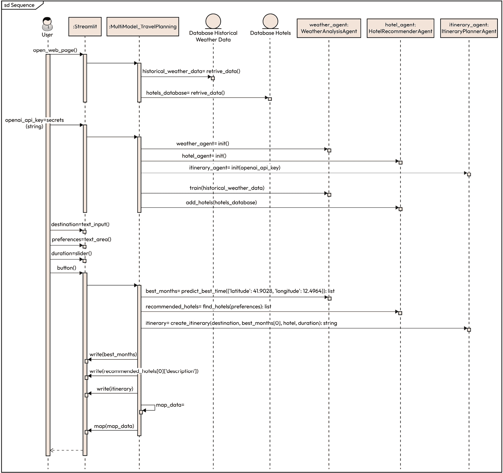
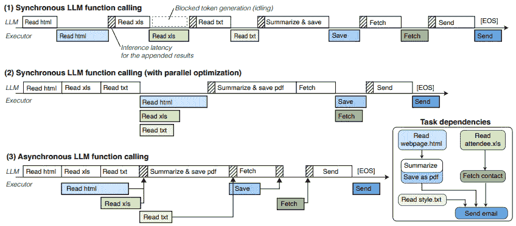

# 10

# 构建人工智能智能体应用

在前一章中，我们讨论了大型语言模型如何通过使用其他工具来扩展其功能。我们还看到了一些示例，说明了同时使用多个智能体（而不是一个）如何解决更复杂的问题。我们广泛讨论了这些方法如何在各个行业中使用，以及它们如何对许多应用产生革命性的影响。然而，我们也指出了智能体的两个局限性：可扩展性和将智能体与不同工具连接的复杂性。

在本章中，我们将进一步探讨这些挑战，并展示如何克服它们。我们将从这两个限制开始。到目前为止，我们将多智能体系统视为在个人计算机上独立运行的实体。在前一章的最后部分，我们探讨了随着人工智能的出现而兴起的令人兴奋的新商业模式。智能体在未来各个行业中都准备发挥重要作用，但为了实现这一点，智能体系统必须为生产部署做好准备。将多智能体系统投入生产意味着我们必须解决之前提到的可扩展性和复杂性等问题，以避免损害客户体验。

在本章中，我们将采用渐进式方法。我们将使用 Streamlit，这是一个简单但灵活的框架，允许我们管理围绕智能体创建应用程序的整个流程。它允许我们快速原型设计我们的应用程序，测试不同的选项，直到达到概念验证。使用 Streamlit，我们可以无缝地与后端（智能体运行的地方）和前端（塑造用户体验的地方）一起工作，所有这些都在一个框架内完成。

接下来，我们将更详细地讨论使大型语言模型和智能体功能所需的全部操作。无论您是否有机会从头开始训练模型，本节都将帮助您了解如何提高可扩展性以及行业如何处理过程的复杂性。此外，我们将讨论异步编程和容器化，这两个概念不仅对扩展多智能体应用，而且对任何机器学习项目都很有用。

本章将涵盖以下主题：

+   Streamlit 简介

+   使用 Streamlit 开发我们的前端

+   使用 Streamlit 和人工智能智能体创建应用程序

+   机器学习操作和大型语言模型操作

+   异步编程

+   Docker

# 技术要求

本章的大部分代码都可以在 CPU 上运行。*Streamlit 简介*和*Streamlit 前端*部分不需要 GPU。需要安装的库如下：

+   **Streamlit**: 用于管理我们应用程序的前端和后端

+   **pandas**: 用于处理 DataFrame

+   **Matplotlib**: 用于绘制图表

+   **Folium**: 用于绘制地图

+   **time**: 用于监控运行时间

+   **NumPy**: 用于数值计算

+   **pydeck**: 用于地图表示

+   **OpenAI**：用于使用其 LLMs 构建代理

+   **Sentence Transformer**：用于执行嵌入

“使用 Streamlit 和 AI 代理创建应用程序”这一部分可以在 CPU 上运行，但最好是在 GPU 上运行。

OpenAI 库需要使用 OpenAI 令牌，您应该注册 OpenAI 以获取它。接下来的部分可以在 CPU 上运行，主要基于 AsyncIO 库的使用。代码可以在 GitHub 上找到：[`github.com/PacktPublishing/Modern-AI-Agents/tree/main/chr10`](https://github.com/PacktPublishing/Modern-AI-Agents/tree/main/chr10)。

# Streamlit 简介

如果读者熟悉 Streamlit，他们可以直接跳转到“使用 Streamlit 和 AI 代理创建应用程序”这一部分。

公司在数据科学和人工智能方面投入了大量资金。训练的模型可以指导业务决策并提供不同的见解。训练模型、使用它和提取见解需要专业知识，并非每个人都有。一个真正对公司有用的模型必须提供结果，然后其他利益相关者也可以使用。例如，当您训练一个模型时，它应该生成其他人可用的结果。可以创建数据的静态可视化（导出图表），但它们只能传达有限的信息。有人可能会提供信息在 Jupyter 笔记本中，但并非每个人都能使用这样的工具。一个可能允许其他人更容易访问的选项是创建仪表板或网络应用程序。

这正是 Streamlit 发挥作用的地方。

## 从 Streamlit 开始

Streamlit 是一个网络应用程序框架，允许用户使用 Python 轻松直观地创建网络应用程序。它的库为后端和前端提供了许多内置组件。它还与领先的机器学习、图形和绘图库兼容。

本节的目标是了解 Streamlit 的工作原理以及它如何成为一个强大的工具。

Streamlit 的一个优点是它易于使用和安装。Streamlit 可以简单地从终端安装，并在 Anaconda 分发中可用：

```py
pip install streamlit
```

使用 Streamlit 组织应用程序是一个简单的 Python 脚本，通常包含后端和前端。这个脚本可以在本地或云端运行。例如，`my_app.py` 应该包含构建网络应用程序所需的所有元素。在最简单的情况下，只需几行代码，我们就可以构建一个网络应用程序。一旦我们定义了我们的应用程序，在本地运行它就非常简单：

```py
streamlit run my_app.py
```

我们需要做的是调用 Streamlit 和我们应用程序的名称（显然，如果我们使用终端，我们需要在正确的目录中）。实际上，脚本不必在您的本地目录中；它可以在互联网上。例如，我们的脚本在我们的 GitHub 仓库中，我们想在本地运行它：

```py
streamlit run https://raw.githubusercontent.com/streamlit/my_apps/master/my_app.py
```

在底层，Streamlit 会遍历文件并按顺序执行它找到的元素。完成后，将初始化一个本地 Streamlit 服务器，并在默认的网页浏览器的新标签页中打开你的应用程序。请注意，我们编写的一切都是 Python 代码，不需要其他语言。当我们进行更改时，我们必须保存我们的源代码。Streamlit 会检测任何修改并提示我们重新运行应用程序。这允许我们快速迭代，并立即观察效果，确保编写和运行应用程序之间的无缝反馈循环。

简单应用程序的一个例子如下：

```py
import streamlit as st
import pandas as pd
import matplotlib.pyplot as plt
# Title for the app
st.title("Simple Streamlit App with Box Plot")
# Create a sample DataFrame
data = {
    'Category': ['A', 'A', 'A', 'B', 'B', 'B', 'C', 'C', 'C'],
    'Values': [10, 20, 15, 25, 30, 20, 35, 40, 45]
}
df = pd.DataFrame(data)
# Display the DataFrame
st.write("Here is the sample DataFrame:")
st.dataframe(df)
# Create a box plot
fig, ax = plt.subplots()
df.boxplot(column='Values', by='Category', ax=ax, grid=False)
plt.title("Box Plot of Values by Category")
plt.suptitle("")  # Remove the automatic subtitle
plt.xlabel("Category")
plt.ylabel("Values")
# Display the plot in Streamlit
st.pyplot(fig)
```

我们生成的应用程序简单地做了三件事：使用 pandas 创建一个 DataFrame，绘制它，然后生成箱线图。在几行代码中，我们创建了一个可在浏览器上访问的微型网络应用程序。一旦编写完成，我们只需运行它，然后 Streamlit 就会处理其他所有事情。


图 10.1 – 网络应用程序示例

让我们更详细地看看代码块：

+   `st.title`：这是一个文本元素，允许我们显示应用程序的标题。在应用程序中始终包含它是好主意。

+   `st.write`：这被认为是 Streamlit 的瑞士军刀。其主要目的是写入文本和其他元素。在这种情况下，我们展示了如何将 DataFrame 以良好的格式写入到应用程序中。此外，这个元素是交互式的。换句话说，它的行为取决于它所接收的输入。`write()` 函数不仅限于文本，还可以与图像、其他 Python 元素（如列表和字典）、模板等一起使用。它还允许我们在想要编辑文本时插入 HTML 命令。

+   `st.pyplot`：这显示了一个 Matplotlib 图形——在我们的例子中是一个箱线图。正如你所见，我们首先生成了图形，然后调用 `pyplot()` 进行后续绘图。图形在显示之前就已经生成。换句话说，图形已经在内存中；我们需要 `pyplot()` 来在应用程序中向用户显示图形。实际上，我们也可以直接使用 Matplotlib 进行绘图，但这样做不推荐，因为它可能导致意外的行为。

注意，我们只展示了基本命令，但 Streamlit 非常灵活。例如，DataFrame 可以以不同的方式写入到应用程序中。使用 `st.write()` 只是一种方法：`st.dataframe()` 与 `st.write()` 做同样的事情，`st.table()` 允许我们静态渲染表格，直接写入 `'df'` 就像我们使用 `st.write()` 一样。建议使用内置方法，因为其行为已知，我们还可以使用额外的参数来处理输出。

例如，我们可以使用内置方法 `st.dataframe()` 提供的灵活性来突出显示 DataFrame 中的元素：

```py
df = pd.DataFrame(data)
st.dataframe(df.style.highlight_max(axis=0))
```


图 10.2 – DataFrame 渲染风格的变化

此外，Streamlit 还使得将地图添加到我们的应用变得容易。只需提供坐标，`st.map()` 就能神奇地让我们在应用中拥有地图（一个可以放大和移动的地图）。在这种情况下，我们提供了西西里岛一些城市的坐标：

```py
city_data = {
    'City': ['Palermo', 'Syracuse', 'Catania', 'Agrigento'],
    'latitude': [38.1157, 37.0757, 37.5079, 37.2982],
    'longitude': [13.3615, 15.2867, 15.0830, 13.5763]
}
city_data = pd.DataFrame(city_data)
st.map(city_data)
```


图 10.3 – 使用 Streamlit 绘制地图

如所见，我们在我们的应用中添加了一些元素并做了一些修改（添加了地图）。每次我们修改代码时，都应该记得保存脚本中的更改；然后，我们进入我们的应用并按 *R* 键，这将使用更新重新加载应用。

如果有任何错误，Streamlit 将提供错误信息，指示我们需要纠正的内容。以下图示了一个错误示例（在这种情况下，关于要使用的变量名）：


图 10.4 – 错误示例

对于调试，我们广泛使用 `st.write()`；这个简单的函数可以通过引导我们理解错误来打印几乎任何 Python 对象。例如，我们可以在这个情况下使用它。如我们所见，我们在列名中有一个错误（*Latitude* 应该是小写；因此，我们用正确的名称替换它）：

```py
st.write(city_data)
```


图 10.5 – 使用 st.write() 调试

## 缓存结果

缓存允许我们的应用即使在从网络加载数据时也能保持性能（我们将在后面讨论如何从网络或用户那里添加数据）。它还允许它操作大型数据集或使用机器学习模型。到目前为止，我们一直在使用小型数据集，因此我们可以加载任何东西，但如果我们开始在应用中放置数百万参数的模型呢？我们的应用可能会崩溃。如果我们使用需要长时间计算的计算模型或其他元素，我们需要通过在内存中缓存结果并避免重复计算来优化我们应用的高效性。我们可以将缓存视为一种短期记忆，其中我们保存经常使用或认为有用的信息以保护。缓存允许我们重用这些信息并节省计算。如果我们有一个执行大型计算的功能，我们可以使用两种替代方案：

+   `st.cache_data`: 这是 Streamlit 中的一个装饰器，用于缓存函数的结果，以便在应用程序重新运行时（例如，当用户与小部件交互或应用程序重新加载时）无需重新计算函数。此装饰器建议用于缓存返回数据的计算。当函数返回可序列化的数据对象（例如，`str`、`int`、`float`、`DataFrame`、`dict` 或 `list`）时，应使用 `st.cache_data`。当函数用 `@st.cache_data` 包装时，第一次调用该函数时，Streamlit 会根据配置将其结果存储在内存或磁盘缓存中。在后续调用中，如果使用相同的参数，Streamlit 会返回缓存的結果，这比重新计算它要快得多。它通过防止重复工作来加快应用程序的速度，特别是对于执行时间较长的函数。如果函数的输入发生变化，Streamlit 将使缓存失效并重新计算函数。

+   `st.cache_resource`: 这是在 Streamlit 中引入的另一个装饰器，用于处理资源的缓存——具体来说，是指那些不依赖于函数参数但代表可重用资源的对象或昂贵的操作，这些资源可以在应用程序的生命周期内进行缓存。虽然 `st.cache_data` 用于缓存基于输入的计算结果或数据加载，但 `st.cache_resource` 被设计用来缓存诸如数据库连接、模型对象或其他创建或初始化成本高昂但每次函数调用不发生变化的任何对象。使用此装饰器来缓存数据库连接、机器学习模型、网络连接或任何需要在应用程序多次运行中重复使用的昂贵资源。如果一个对象或资源（例如，一个预训练模型）创建成本高昂，可以使用 `st.cache_resource` 来避免多次重新加载或重新初始化它。

例如，对于 `st.cache_data`，在以下代码中，我们模拟了一个慢速操作，并展示了缓存如何节省时间：

```py
import streamlit as st
import time
# Use @st.cache_data to cache the result
@st.cache_data
def load_data():
    time.sleep(3)  # Simulate a slow operation (e.g., loading a large dataset)
    return "Data loaded!"
# Call the function
st.write(load_data())
in a similar way for st.cache_resource:
import streamlit as st
import time
# Example: A resource-intensive function (e.g., loading a model)
@st.cache_resource
def load_model():
    time.sleep(5)  # Simulate a slow operation like loading a model
    return "Model loaded!"  # This could be a model object in a real scenario
# Call the function
st.write(load_model())
```

在前面的代码片段中，在运行函数之前，Streamlit 会检查其缓存以查找之前保存的结果。如果找到了，它会使用该结果而不是运行函数；如果没有找到，它会运行函数并将其保存到缓存中。缓存会在执行过程中更新，尤其是在代码发生变化时。

默认情况下，Streamlit 不会在应用程序重新运行之间保存信息，但每次重新运行时，它都会从头到尾重新运行应用程序。通常，Streamlit 在每次交互时都会重新运行整个脚本（例如，当用户调整滑块或点击按钮时）。使用会话状态，您可以存储在重新运行期间持续存在的数据，这样在脚本重新运行时就不会丢失值。每个用户都有自己的独立会话状态，因此会话状态中存储的数据与其他用户隔离。您可以使用会话状态来存储诸如表单输入、计数器、身份验证数据或中间计算结果等。

让我们尝试构建一个制作购物清单的应用程序；我们将展示如何保存会话信息：

```py
import streamlit as st
# Define a list of grocery items (the initial list of items to buy)
grocery_items = ['Apple', 'Banana', 'Carrot', 'Milk', 'Eggs']
# Streamlit app interface
st.title('Grocery List App')
# Text input to add a new item to the list
new_item = st.text_input("Add a new item to your grocery list:")
# Button to add the new item to the list
if st.button('Add Item'):
    if new_item:
        grocery_items.append(new_item)
        st.success(f"'{new_item}' has been added to your list!")
    else:
        st.warning("Please enter an item to add.")
# Display the current list of grocery items
st.write("### Items to Buy:")
for item in grocery_items:
    st.write(f"- {item}")
```

这是我们最初的应用程序；我们将在之后立即看到我们如何查看用户保存的信息：


图 10.6 – 购物清单应用示例

如果我们通过点击**添加项目**来添加对象，它们将被添加到列表中（此时，信息尚未保存；它仅保留在当前会话中）：


图 10.7 – 购物清单应用中添加对象的示例

然而，如果我们按下*R*并重新运行我们的应用程序，我们将丢失这些信息，元素将消失（因为信息没有保存到任何地方）。

现在，让我们尝试`session_state`：

```py
import streamlit as st
# Initialize session state for grocery_items if it doesn't exist yet
if 'grocery_items' not in st.session_state:
    st.session_state.grocery_items = ['Apple', 'Banana', 'Carrot', 'Milk', 'Eggs']
# Streamlit app interface
st.title('Grocery List App')
# Text input to add a new item to the list
new_item = st.text_input("Add a new item to your grocery list:")
# Button to add the new item to the list
if st.button('Add Item'):
    if new_item:
        # Append the new item to the list stored in session state
        st.session_state.grocery_items.append(new_item)
        st.success(f"'{new_item}' has been added to your list!")
    else:
        st.warning("Please enter an item to add.")
# Display the current list of grocery items
st.write("### Items to Buy:")
for item in st.session_state.grocery_items:
    st.write(f"- {item}")
```

当我们使用`st.session_state`时，我们添加的项目将在当前会话中保留。在第一次运行时，列表将包含初始元素，随着用户添加更多项目，列表将相应增长。

然而，一旦页面重新加载或会话结束，除非我们将数据存储在持久位置（例如文件或数据库），否则列表将重置。


图 10.8 – 更新后的列表

虽然`st.session_state`允许在用户会话期间临时存储值——随着交互的发生逐渐填满——但在完整页面重新加载或应用程序重启时，这些数据会丢失。相比之下，`st.connection`使 Streamlit 能够维持对外部资源的持久访问，确保数据在会话和重新加载之间保持可用。这使得它非常适合需要与长期数据持续交互的应用程序，克服了内存会话状态的限制。`st.connection`允许维护和重用与外部服务的连接，并且在与每个用户交互时都高效地做到这一点。

让我们看看`st.connection`在实际中的工作方式：

```py
import streamlit as st
conn = st.connection("my_database_sql")
df = conn.query("select * from my_beautiful_table")
st.dataframe(df)
```

在本节中，我们讨论了 Streamlit 应用程序的主要组件。在下一节中，我们将讨论如何美化我们的应用程序并改善用户体验。

# 使用 Streamlit 开发我们的前端

在本节中，我们将开始讨论一些允许我们改善与我们的应用程序交互时用户体验的元素。

我们将展示各种前端元素以及如何将它们组合成复杂的应用程序。

## 添加文本元素

为了改善用户体验，我们可以从改善文本元素开始。我们首先添加的元素如下：

+   `st.title()`: 这个函数设置 Streamlit 应用的主标题。它是最大的文本元素，通常用于应用的主要标题。每个应用都应该至少有一个标题，这在 GitHub 风格的 Markdown 中也有显示。这个函数显然接受一个字符串。

+   `st.header()`: 这个函数为您的应用添加标题。它比标题小，但仍然作为一个重要的部分标题突出。这也在 GitHub 中有对应的功能，目的相似。您可以添加一个属性`divider`，在标题下方显示一个彩色分隔符（我们可以指定颜色）。我们还可以添加一个`help`字符串，在标题旁边提供工具提示。

+   `st.subheader()`: 这个函数添加一个副标题，它比标题小，通常用于子部分或为内容提供额外的结构。副标题也可以有一个彩色分隔符，如果您需要的话。还可以添加一个`help`字符串。

下面是一些如何插入这些元素的示例：

```py
st.title("Your Title Here")
st.header("Your Header Here")
st.header("Your Header Here", divider=True, help ="bla bla")
st.subheader("Your Subheader Here")
```

现在，我们可以在我们的应用中直接测试它们：

```py
import streamlit as st
# Initialize session state for grocery_items if it doesn't exist yet
if 'grocery_items' not in st.session_state:
    st.session_state.grocery_items = ['Apple', 'Banana', 'Carrot', 'Milk', 'Eggs']
# Streamlit app interface
st.title('Grocery List App :banana: :apple: :egg:')  # Main title of the app
# Display a header for the section where the user can add items
st.header('Add new item')
# Text input to add a new item to the list
new_item = st.text_input("Type an item to add to your grocery list:")
# Button to add the new item to the list
if st.button('Add Item'):
    if new_item:
        # Append the new item to the list stored in session state
        st.session_state.grocery_items.append(new_item)
        st.success(f"'{new_item}' has been added to your list!")
    else:
        st.warning("Please enter an item to add.")
# Display a subheader for the current grocery list
st.subheader('Current Grocery List')
# Display the current list of grocery items
for item in st.session_state.grocery_items:
    st.write(f"- {item}")
```

这段代码展示了如何将风格元素开始添加到我们的应用中。以下图显示了这些改进后的结果：


图 10.9 – 更新后的应用

## 在 Streamlit 应用中插入图片

接下来，我们开始定制我们的应用，添加一个标志和一张图片。为此，我们将使用几个元素：

+   `st.set_page_config(...)`: 这个函数用于配置 Streamlit 应用的页面设置，例如页面的标题、favicon（浏览器标签中的图标）和布局偏好。在这种情况下，我们将使用它来添加一个小的图标，它将作为浏览器标签元素显示。

+   `st.image(...)`: 这个函数在 Streamlit 应用中显示图片。它接受图片的 URL 或路径，并且可以通过设置`use_column_width=True`来调整图片宽度以适应屏幕。作为输入，`st.image`可以接受 URL（正如我们在这个例子中所做的那样）或指向本地图片的路径或`numpy.array`（图片可以以数字格式存在）。

    关键词之一是 `caption`，它允许我们直接为图片提供说明。然而，在我们的情况下，我们将单独添加说明。

+   `st.caption(...)`: 这个函数为元素（如图片或图表）添加下方的简短说明或描述性文本。在我们的应用中，它提供图片的来源信息。

+   `st.sidebar.image(...)`: 这个函数在侧边栏中放置一个图片，它将是应用左侧的可折叠菜单。侧边栏对于放置导航、设置或附加内容非常有用。

我们现在将插入一张图片：

```py
# Set the page configuration to include a logo
st.set_page_config(page_title="Grocery List App", page_icon="https://github.com/SalvatoreRa/tutorial/blob/main/images/vegetable_basket_logo.jpg?raw=true")
# Display the title image
st.image("https://github.com/SalvatoreRa/tutorial/blob/main/images/vegetables.jpg?raw=true", use_column_width=True)
st.caption("Image from [here](https://unsplash.com/it/@randyfath)")
# Add logo to the sidebar
st.sidebar.image("https://github.com/SalvatoreRa/tutorial/blob/main/images/vegetable_basket_logo.jpg?raw=true", use_column_width=True)
```

上一段代码展示了如何使用适当的说明插入图片。以下图显示了结果：


图 10.10 – 应用外观变化

这是我们的浏览器图标：


图 10.11 – 浏览器图标

到目前为止，我们已经探索了 Streamlit 的基本功能，并使用它们构建了一个简单且静态的应用程序。现在，是时候超越这些功能，开始探索使 Streamlit 应用程序动态、响应和与实际使用相连的因素。

## 创建动态应用程序

我们可以进一步修改我们的应用程序，使其更加动态。到目前为止，我们的用户只能将项目添加到列表中，然后显示列表。这个应用程序用处不大，所以我们希望使其更加动态，并允许用户添加数量。因此，我们将执行以下操作：

+   允许用户添加要购买的项目。一旦添加了项目，就会创建两个滑块，分别代表用户家中拥有的数量和需要购买的数量。为了避免创建无限长的列表，我们将使用两列。此外，我们还将添加一个按钮来选择用户是否已取用该成分。

+   制作一个交互式的表格显示，显示成分，包括购买的数量、已取用的数量以及是否已取用，以及一个显示已取用项目和缺失项目的完成条。

+   在侧边栏中添加一个按钮以下载列表。

让我们从使用两列以结构化的方式显示杂货清单项目开始，确保更紧凑和视觉上平衡的布局：

```py
data = []
for i, item in enumerate(st.session_state.grocery_items):
    with col1 if i % 2 == 0 else col2:
        st.markdown(f"**{item}**")
        quantity_at_home = st.slider(f"Quantity at home", 0, 12, st.session_state.quantity_at_home[item], key=f"home_{item}")
        st.session_state.quantity_at_home[item] = quantity_at_home
        quantity_to_take = st.slider(f"Quantity to take", 0, 12, st.session_state.quantity_to_take[item], key=f"take_{item}")
        st.session_state.quantity_to_take[item] = quantity_to_take
        taken = st.checkbox(f"Taken", st.session_state.taken[item], key=f"taken_{item}")
        st.session_state.taken[item] = taken
        data.append([item, quantity_at_home, quantity_to_take, "Yes" if taken else "No"])
```

对于每个项目，我们根据索引 `i` 是偶数还是奇数来确定它是否应该放在第一列 (`col1`) 或第二列 (`col2`) 中。这确保了项目在两列之间均匀分布，防止出现长的垂直列表。

在选定的列中，项目名称使用 `st.markdown()` 以粗体显示。名称下方创建了两个滑块：一个用于用户家中拥有的数量，另一个用于需要携带的数量。每个滑块根据项目名称分配一个唯一的键，以确保正确跟踪和持久化值。这些滑块的值存储回会话状态，以便在应用交互中保持更新。此外，每个项目还包括一个复选框。每个项目的收集数据，包括其名称、选定的数量以及是否已取用，被附加到数据列表中。


图 10.12 – 应用重设计

注意到应用程序是交互式的（我们可以与滑块交互）：


图 10.13 – 交互元素

前面的图示展示了如何插入交互元素以及我们如何与之交互。Streamlit 在后台允许这样做，无需我们编写这些复杂元素，我们可以使用简单的命令。

我们可以显示表格：

```py
df = pd.DataFrame(data, columns=["Name", "Quantity at Home", "Quantity to Take", "Taken"])
st.table(df)
```


图 10.14 – 获得表格

在这一点上，我们可以创建我们的进度条：

```py
# Progress bar
taken_count = sum(1 for item in st.session_state.taken.values() if item)
total_items = len(st.session_state.grocery_items)
progress = taken_count / total_items if total_items > 0 else 0
st.subheader("Grocery Completion Progress")
st.progress(progress)
st.write(f"{taken_count} out of {total_items} items taken ({progress*100:.2f}%)")
```


图 10.15 – 进度条

接下来，我们定义了一个函数 `generate_pdf()`，它创建一个包含购物清单数据的 PDF 文档，并允许用户下载它：

```py
# Function to generate PDF
def generate_pdf():
    pdf = FPDF()
    pdf.set_auto_page_break(auto=True, margin=15)
    pdf.add_page()
    pdf.set_font("Arial", size=12)
    logo_path = "logo.jpg"  # Add logo to PDF
    response = requests.get(logo_url)
    with open(logo_path, "wb") as f:
        f.write(response.content)
    pdf.image(logo_path, 10, 10, 30)  # Position and size of the logo
    pdf.cell(200, 10, "Grocery List", ln=True, align='C')
    pdf.ln(20)  # Added extra spacing to prevent text overlapping the logo
    for index, row in df.iterrows():
        pdf.cell(0, 10, f"{row['Name']} - At Home: {row['Quantity at Home']} - To Take: {row['Quantity to Take']} - Taken: {row['Taken']}", ln=True)
    pdf_output = os.path.join(os.getcwd(), "grocery_list.pdf")
    pdf.output(pdf_output)
    return pdf_output
# Directly download the PDF when the button is clicked
if st.sidebar.button("Download List as PDF"):
    pdf_file = generate_pdf()
    with open(pdf_file, "rb") as f:
        st.sidebar.download_button("Download Grocery List PDF", f, file_name="grocery_list.pdf", mime="application/pdf", key="download_pdf", on_click=None)
```

首先，我们使用自动分页的 `FPDF` 对象初始化一个新的页面，并将字体设置为 `Arial`，字号为 `12` 以保持格式的一致性。为了增强 PDF 的视觉效果，`generate_pdf()` 函数从指定的 URL 下载一个标志，将其本地保存为 `logo.jpg`，并将其嵌入到页面的左上角。接着添加一个居中的标题“购物清单”，并留出一些空白以确保文本不会与标志重叠。然后，该函数遍历存储在 `DataFrame (df)` 中的购物清单，添加每个项目的名称、家中和要携带的数量，以及该项目是否已被标记为已取。一旦文档内容填充完毕，它就被保存在当前工作目录下，文件名为 `grocery_list.pdf`，并返回。


图 10.16 – PDF 按钮

这里是生成的 PDF：


图 10.17 – 获得的 PDF 文件

我们的用户可能想要添加备注；为此，我们可以利用 Streamlit 允许添加其他页面以创建备注部分的事实。请注意，我们现在有一个可以通过侧边栏访问的第二页。这样，我们可以输入备注并保存它们：

```py
elif page == "Notes":
    st.title("Notes")
    st.session_state.notes = st.text_area("Write your notes here:", st.session_state.notes)
    if st.button("Save Notes"):
        st.success("Notes saved successfully!")
```


图 10.18 – 向应用添加另一页

现在，我们还可以注意到信息已经更新到我们的 PDF 中：


图 10.19 – 更新的 PDF

如果我们的用户想知道最近的超市在哪里，我们可以在我们的应用中添加以下功能：

```py
elif page == "Find Supermarkets":
    st.title("Find Nearby Supermarkets (OSM)")
        # Get user's location
    location_input = st.text_input("Enter your location (City, Address, or Coordinates):")
    if st.button("Find Supermarkets") and location_input:
        geolocator = Nominatim(user_agent="grocery_app")
        location = geolocator.geocode(location_input)
        if location:
            st.success(f"Location found: {location.address}")
            # Create map
            m = folium.Map(location=[location.latitude, location.longitude], zoom_start=14)
            folium.Marker([location.latitude, location.longitude], tooltip="Your Location", icon=folium.Icon(color="blue")).add_to(m)
            # Use Overpass API to find nearby supermarkets
            overpass_url = "http://overpass-api.de/api/interpreter"
            overpass_query = f"""
            [out:json];
            node"shop"="supermarket";
            out;
            """
            response = requests.get(overpass_url, params={'data': overpass_query})
            data = response.json()
            for element in data["elements"]:
                lat, lon = element["lat"], element["lon"]
                name = element.get("tags", {}).get("name", "Unnamed Supermarket")
                folium.Marker([lat, lon], tooltip=name, icon=folium.Icon(color="green")).add_to(m)
            folium_static(m)
        else:
            st.error("Location not found. Please try a different input.")
```

在代码中，我们向 Streamlit 应用添加了一个新页面，用户可以使用 `geopy` 库中的 `Nominatim` 地理编码器将位置输入转换为经纬度坐标，以查找附近的超市。如果找到有效的位置，我们向用户确认，并使用 Folium 创建一个以给定坐标为中心的交互式地图。添加一个标记来指示用户的位置。接下来，我们使用 Overpass API，该 API 查询 OSM 数据，以找到半径为 5 公里的超市。我们向 Overpass API 发送请求，并解析 JSON 响应以提取附近超市的坐标和名称。然后，每个超市都被添加到地图上的绿色标记。最后，我们使用 `folium_static` 在 Streamlit 应用中显示生成的地图。如果位置输入无效或未找到，我们显示一个错误消息，提示用户再次尝试。


图 10.20 – 查找超市页面

当我们点击 **查找超市** 时，我们得到以下内容：


图 10.21 – 超市地图

现在我们知道了如何构建应用程序，我们可以使用代理来构建一个。

# 使用 Streamlit 和 AI 代理创建应用程序

在本节中，我们将探讨将第九章中描述的多代理系统集成到 Streamlit 应用程序中。在这里，我们只描述我们更改的代码部分；结构保持不变。在前一章中，我们构建了一个脚本，允许定义旅行程序；在本章中，输出相同，但系统被封装在应用程序中。换句话说，我们的应用程序将在浏览器中运行，甚至可以供不懂得编程的用户使用。

作为简要回顾，多模型*旅行规划系统*是一个由 AI 驱动的助手，它集成了多个专业模型以生成个性化的旅行计划。它包括四个关键代理：

+   `WeatherAnalysisAgent`：使用历史天气数据预测最佳的旅行月份

+   `HotelRecommenderAgent`：使用转换器模型找到符合用户偏好的住宿

+   `ItineraryPlannerAgent`：使用 GPT-2 生成详细的每日旅行计划

+   `SummaryAgent`：创建专业的旅行总结和成本估算

系统遵循结构化的数据流，其中用户输入他们的目的地、偏好和持续时间，代理协作以提供完整的旅行计划。核心 AI 模型包括用于天气预测的`RandomForestRegressor`、用于酒店推荐的`SentenceTransformer`以及用于行程和总结生成的 GPT-2。

为了更好地理解*旅行规划系统*的内部结构，本节提供了三个 UML 图。这些可视化展示了本章所述应用程序的架构、执行流程和系统交互：

+   `WeatherAnalysisAgent`和`ItineraryPlannerAgent`）、底层模型（`RandomForest`、`SentenceTransformer`和`OpenAI` GPT）以及连接用户界面到后端逻辑的 Streamlit 应用程序： 


图 10.22 – 多模型旅行规划系统的结构 UML 图

+   **活动图**：活动图描述了应用程序的控制流程，从用户输入收集到生成完整的旅行计划。它说明了每个代理是如何被触发的以及它们的输出是如何合并的：


图 10.23 – 多模型旅行规划系统的 UML 活动图

+   **序列图**：最后，序列图概述了 Streamlit 前端、数据库和 AI 代理之间的基于时间的交互。它显示了方法调用的顺序、交换的数据以及系统等待响应的点。它清楚地说明了每个代理何时以及如何被调用：



图 10.24 – 多模型旅行规划系统的 UML 序列图

首先，我们开始导入所需的库：

```py
import streamlit as st
import numpy as np
import pandas as pd
import pydeck as pdk
import openai
from sklearn.ensemble import RandomForestRegressor
from sentence_transformers import SentenceTransformer
```

+   `streamlit`: 我们用于创建交互式 Web 应用的库

+   `numpy`: 用于所有数值运算的库

+   `pandas`: 用于处理数据框的库

+   `pydeck`: 基于 Deck.gl 构建的可视化库，专门用于渲染大规模地理数据

+   `openai`: 提供对 GPT-3.5 和 GPT-4 等模型访问的 OpenAI Python 库，用于**自然语言处理**（**NLP**）任务。

+   `RandomForestRegressor`: 我们在应用中使用的 scikit-learn 模型

+   `SentenceTransformer`: 用于嵌入的库（参见上一章）

代理的代码相同，除了`ItineraryPlannerAgent`。为了获得更好的响应，我们在这里使用 OpenAI 的 GPT-4 模型：

```py
class ItineraryPlannerAgent:
    def __init__(self, api_key):
        self.api_key = api_key
    def create_itinerary(self, destination, best_month, hotel, duration):
        client = openai.OpenAI(api_key=self.api_key)
        prompt = f"""
        Create a {duration}-day travel itinerary for {destination} in the best month: {best_month}.
        Recommended Hotel: {hotel['name']}.
        """
        response = client.chat.completions.create(
            model="gpt-4",
            messages=[
                {"role": "system", "content": "You are an expert travel planner."},
                {"role": "user", "content": prompt}
            ],
            max_tokens=300
        )
        return response.choices[0].message.content
```

操作方式相同：它接受旅行目的地、最佳旅行时间、推荐酒店和旅行时长，随后生成一个结构化的行程。请注意，我们需要使用 API 密钥来验证对 OpenAI API 的请求。同样，代理所做的只是根据相同的输入生成行程：旅行地点、最佳旅行月份、酒店详情和旅行天数。GPT-4 也类似于 GPT-2：我们必须提供一个包含信息的提示，然后模型会自回归地生成旅行行程

在这里，我们提供与之前提供给系统相同的数据（你可以在存储库中找到它）：


图 10.25 – 代码截图

到目前为止，我们可以初始化我们的代理，每个代理都有自己的不同目的：

```py
openai_api_key = st.secrets["general"]["openai_api_key"]
weather_agent = WeatherAnalysisAgent()
hotel_agent = HotelRecommenderAgent()
itinerary_agent = ItineraryPlannerAgent(api_key=openai_api_key)
weather_agent.train(historical_weather_data)
hotel_agent.add_hotels(hotels_database)
Your API should be in a file TOML, like this:
[general]
openai_api_key = "YOUR_API"
```

注意，`openai_api_key = st.secrets["general"]["openai_api_key"]`使用 Streamlit 的密钥管理器来安全地访问 OpenAI API 密钥。实际上，`st.secrets`是一种在 Streamlit 应用中存储和检索敏感凭证的方式。API 密钥存储在`st.secrets["general"]["openai_api_key"]`下，表示它被保存在`secrets`配置中的`"general"`部分内。`st.secrets`的目的在于防止敏感凭证在脚本中以硬编码的形式存储，从而降低隐私泄露的风险。

现在，让我们开始构建我们的界面：

```py
st.title("AI Travel Planner ✈️")
st.write("Find the best time to travel and discover the perfect hotel!")
destination = st.text_input("Enter your destination (e.g., Rome):", "Rome")
preferences = st.text_area("Describe your ideal hotel:", "Luxury hotel in city center with spa.")
duration = st.slider("Trip duration (days):", 1, 14, 5)
```

首先，我们添加一个标题：`st.title()` 设置 Streamlit web 应用的标题。这个标题将显示在页面顶部。在这个阶段，我们使用 `st.write()` 提供对应用目的的简要说明。接下来，`st.text_input()` 用于创建一个用户可以输入目的地的框。请注意，我们提供了一个关于用户可以输入的内容的提示——“`输入你的目的地（例如，罗马）：`”——并且有一个默认值“`罗马`”（如果用户没有输入任何内容，则默认为`罗马`）。`st.text_area()` 创建一个多行文本框，用户可以在其中描述他们理想的酒店。我们使用 `text_area` 允许用户提供详细的酒店偏好。`st.slider()` 创建一个滑块输入，用于选择旅行时长（有参数定义了最小时长为`1`天，最大为`14`天，默认时长为`5`天）。


图 10.26 – 应用中的输入偏好

在这一点上，我们将处理用户添加信息并按下按钮之后发生的事情。为了回顾，系统根据天气条件（通过使用历史数据和随机森林算法）预测最佳旅行月份，找到符合用户偏好的酒店（使用酒店数据和嵌入相似度），最后，使用 OpenAI 的 GPT-4 创建个性化行程。

我们已经创建了框架来可视化结果：最佳旅行月份、推荐酒店、AI 生成的行程，最后是目的地的地图可视化。所有这些只有在我们的用户按下按钮时才会发生，我们将在下一部分创建这个按钮：

```py
if st.button("Generate Travel Plan ✨"):
    best_months = weather_agent.predict_best_time({'latitude': 41.9028, 'longitude': 12.4964})
    best_month = best_months[0]['month']
    recommended_hotels = hotel_agent.find_hotels(preferences)
    itinerary = itinerary_agent.create_itinerary(destination, best_month, recommended_hotels[0], duration)
    st.subheader("📆 Best Months to Visit")
    for m in best_months:
        st.write(f"Month {m['month']}: Score {m['score']:.2f}")
    st.subheader("🏨 Recommended Hotel")
    st.write(f"**{recommended_hotels[0]['name']}** - {recommended_hotels[0]['description']}")
    st.subheader("📜 Generated Itinerary")
    st.write(itinerary)
    # -------------------------------
    # Interactive Map
    # -------------------------------
    st.subheader("🗺 Destination Map")
    map_data = pd.DataFrame(
        {'lat': [41.9028], 'lon': [12.4964]},
    )
    st.map(map_data)
```

`if st.button("生成旅行计划✨"):` 创建了一个交互式按钮，标签为 `best_months = weather_agent.predict_best_time({'latitude': 41.9028, 'longitude': 12.4964})`。请注意，我们输入了罗马的目的地纬度（`41.9028`）和经度（`12.4964`），根据天气得分获得了最佳月份，并选择了最佳月份。在这个阶段，我们使用 `hotel_agent.find_hotels(preferences)` 根据用户的偏好确定最佳酒店。这个代理将返回一个与用户描述相匹配的酒店列表。

由于我们拥有所有详细信息，我们可以生成我们的行程。`itinerary = itinerary_agent.create_itinerary(destination, best_month, recommended_hotels[0], duration)` 正是如此操作；它接受之前定义的输入并生成一个结构化的 AI 生成的行程。一旦我们有了行程，我们就开始向用户展示它。我们使用 `st.subheader("``📆` `最佳访问月份")` 创建一个子部分，然后遍历 `best_months` 并打印出每个月及其天气评分。在此阶段，我们在 `st.subheader("``🏨` `推荐酒店")` 之后显示最佳酒店。最后，`st.subheader("``📜` `生成的行程")` 允许我们在其中插入行程的子部分。在最后一部分，我们展示城市地图。


图 10.27 – 生成的输出（第一部分）


图 10.28 – 生成的输出（第二部分）


图 10.29 – 生成的输出（第三部分）

在本节中，我们创建了一个多智能体系统并将其嵌入到应用程序中。这样，即使是没有编程知识的用户也可以与我们的系统交互。用户可以通过点击一个简单的按钮来运行系统。

我们讨论了应用程序作为一个孤立系统；在下一节中，我们将看到模型不是一个孤立的概念，而是生态系统的一部分。必须考虑到这种复杂性，在下一节中，我们将讨论模型的生命周期，从构思到部署。

# 机器学习操作和 LLM 操作

我们已经看到了如何创建一个包含多智能体系统的应用程序。当我们用 Python 编写脚本时，我们创建了一个可以在我们的计算机上运行的元素，但这不是一个产品。将脚本转换成应用程序允许用户即使不知道如何编程也能与我们的应用程序交互。Streamlit 允许我们快速原型化我们的应用程序。这并不适合产品，尤其是当它要被多个用户使用时。在本节中，我们将讨论所有必要的操作，以使我们的模型作为一个产品运行。

**机器学习操作**（**MLOps**）是一套旨在简化和管理生产中机器学习模型生命周期的实践和工具。它结合了机器学习、DevOps 和数据工程实践，以确保机器学习系统的**持续集成/持续交付**（**CI/CD**）、监控和扩展。


图 10.30 – MLOps 组合 ([`arxiv.org/pdf/2202.10169`](https://arxiv.org/pdf/2202.10169))

MLOps 在将模型转化为现实世界中有用的应用中发挥着关键作用。简而言之，MLOps 涵盖了在生产环境中模型的发展、监控和维护，使得从研究产品到功能产品的转变成为可能。以下是涉及的各个阶段：

1.  **模型开发**：这是第一步，其中设计并训练了机器学习模型。通常，在这个阶段，数据科学家和数据工程师在模型选择、数据集以及训练和测试过程中进行合作。

1.  **测试**：通常，测试阶段是模型开发的一部分；然而，今天，对模型的测试更加重视。因此，我们将其视为一个单独的阶段。实际上，特别是复杂模型可能会表现出意外的行为，因此测试通常被视为一个单独的阶段。

1.  **部署**：一旦模型开发和测试完成，它可以在生产环境中部署。这一微妙的步骤要求模型与其他现有系统（先前已开发）集成，并且能够实时使用。

1.  **监控和维护**：一旦模型部署，我们必须确保其性能不会下降，并防止运营问题。同时，我们可能需要更新模型或确保与新的系统元素兼容。


图 10.31 – MLOps 的高级流程视图 ([`arxiv.org/pdf/2202.10169`](https://arxiv.org/pdf/2202.10169))

**大型语言模型操作**（**LLMOps**）是 MLOps 的一个扩展，专门关注 LLMs 的部署、维护和管理。它结合了 MLOps 的原则，但也解决了与大规模 NLP 模型工作相关的独特挑战和需求。

然而，LLMOps 增加了额外的复杂性。原因如下：

+   **模型大小和复杂性**：在 MLOps 中，模型的大小和复杂性可能有所不同，但通常它们不需要像 LLMs 那样多的计算能力或内存。模型可能包括传统的机器学习算法、较小的深度学习模型或针对结构化数据的专用模型。LLMs 可能有数十亿个参数，因此需要优化的基础设施（通常涉及专门的硬件，如 GPU 或 TPU）或分布式训练。这意味着需要更多的专业知识和专用基础设施（专用硬件和存储），这可能非常昂贵。

+   **训练和微调**：在 MLOps 中，训练要容易得多。许多模型体积较小，因此可以轻松重新训练。重新训练本身可以程序化进行。微调 LLMs 更复杂且资源密集。收集和处理 LLM 所需的数据集是资源密集型的。

+   **可扩展性和部署**：在 MLOps 中，将模型部署到生产环境通常是直接的。另一方面，扩展 LLM 需要能够确保在高需求时提供必要支持的专用基础设施。实际上，当有大量用户时，延迟可能会显著增加。优化推理过程中的延迟可能是一个微妙的过程，可能会降低性能。

+   **监控和维护**：在生产环境中监控 ML 模型涉及跟踪关键指标，如准确率、精确率和召回率，以及模型漂移或数据漂移。监控 LLM 不仅包括通常的性能指标，还包括文本生成的质量、用户反馈以及如偏见或有害输出等伦理问题。虽然从准确率的角度评估输出是直接的，但评估 LLM 是否产生幻觉或不适或有害的内容则更为复杂。一些偏见可能很微妙，但仍可能被用户注意到。

+   **模型治理和合规性**：虽然治理和合规性在任何 ML 部署中都至关重要，但 MLOps 主要关注确保数据隐私和模型透明度，尤其是在处理敏感或受监管的数据时。对于 LLMOps，不仅涉及隐私问题，而且还可以用于生成涉及广泛主题的文本，存在生成不适当内容的风险。随着法规的发展，评估偏见、公平性和伦理问题既复杂又不断演变。

在执行 LLMOps 时，涉及到的附加复杂性可以通过以下例子来展示。如果我们想要从头开始训练一个模型，我们就需要检索至少包含 10 亿个标记的语料库。这些标记需要从不同的来源收集（如书籍、网站、文章、代码库等）。在 MLOps 中，我们通常在数据集已经存在的情况下创建模型（例如，通过用户与我们的网站互动）。为经典模型（图像或表格）预处理数据集的步骤比大型语料库（如去偏、消除重复等步骤）要简单得多。此外，由于我们的数据集可能超过数百个 TB，因此复杂性也更大。虽然我们可以轻松地训练一个 ML 模型（甚至是在消费级计算机上），但 LLM 则不再如此。特别是对于更大的模型，我们必须使用专用基础设施，并且无法进行许多实验（测试不同的超参数或不同的架构组合）。同样，微调将比重新训练我们的模型更受欢迎。

测试也不再依赖于简单的度量（如准确率），而是需要人工参与的评价。鉴于系统的语言中心特性，准确率这样的指标只能为我们提供关于模型输出的部分信息。只有人类（即使我们使用其他大型语言模型进行大规模检查）才能从创造力、偏见、质量和不适当内容的存在等方面评估大型语言模型的输出。此外，在预训练之后，通常有一个步骤会使用人类反馈来进一步提高模型的输出。此外，我们还必须继续评估我们的 LLM，因为流量可能会增长，或者我们的模型必须具备的语言和知识可能会发生变化。例如，用于医疗用途的 LLM 需要更新新的治疗方法。

在下一节中，我们将从开发像 LLM 这样复杂的模型所面临的复杂性开始。

## 模型开发

模型的开发始于语料库的收集。这种收集通常分为两种类型：通用数据和专用数据。通用数据代表网页、书籍和对话文本等数据。另一方面，专用数据是为特定任务设计的，例如多语言数据、科学数据和代码：

+   **通用数据**：考虑到互联网上数据量巨大，现在数据收集通常从使用下载的页面数据集或进行爬取以收集新数据开始。此外，还有对话数据集（如 Reddit 或其他平台上的讨论）、与 LLM 的聊天和其他来源。书籍也是训练的另一个流行来源，因为它们通常包含关于不同主题的连贯、高质量的文本。这些数据集包含质量数据（如维基百科和博客文章）的混合，但也包含大量需要删除的数据，如垃圾邮件、有毒帖子等。

+   **专用文本数据**：今天，向 LLM 添加多语言语料库以改善其语言能力是很常见的（例如，由于添加了多语言语料库，PaLM 覆盖了 122 种语言）。

    添加科学文本可以改善科学和推理任务的表现。今天存在大量可供使用的文章数据集，可以直接添加。几乎所有现代预训练数据集也插入代码。代码和其他结构化数据的添加似乎与某些推理任务性能的提高有关。


图 10.32 – 现有 LLM 预训练数据中各种数据源的比例（[`arxiv.org/pdf/2303.18223`](https://arxiv.org/pdf/2303.18223)）

数据收集完毕后，必须进行预处理以去除不必要的标记，如 HTML 标签或其他展示元素，减少文本变化，并消除重复数据。如今，我们尝试使用启发式算法或分类器消除低质量数据。例如，我们可以在维基百科等质量数据上训练一个分类器，以识别我们想要保留的内容。另一方面，启发式算法依赖于上游定义的一系列规则（如统计属性、关键词的存在或不存在等）。去重是一个重要的步骤，因为它会影响模型多样性和训练稳定性。通常，使用不同的粒度，如句子或文档级别，以避免重复的单词模式。此外，今天另一个常见的步骤是隐私降低，其中试图通过一系列上游定义的规则来移除**个人身份信息**（**PII**）。一旦进行这些步骤，就可以进行分词。分词被认为是一个关键步骤，因为它在很大程度上影响模型性能。**字节对编码**（**BPE**）分词通常是最广泛使用的方法之一。

(img/B21257_10_33.jpg)

图 10.33 – 预训练 LLMs 典型数据预处理流程的示意图([`arxiv.org/pdf/2303.18223`](https://arxiv.org/pdf/2303.18223))

一旦我们预处理了语料库，我们就可以在下一阶段训练模型。为了训练模型，我们需要定义一个策略来安排之前引入的多源（如维基百科、互联网上的文本、书籍等不同类型的数据）。实际上，有两个重要方面被确定：每个数据源的比例（数据混合）以及每个数据源在训练中安排的顺序（数据课程）。由于每种类型的数据都会影响性能，数据必须按照精确的分布混合。这种分布可以是全局的或局部的（在特定的训练步骤）。为此，我们可以决定对各种来源进行上采样和下采样，以尊重我们决定的数据混合。例如，在 LLaMA 预训练的情况下，作者选择以下比例进行训练（基于实验结果，表明这个比例效果良好）：80%网页，6.5%来自 GitHub 和 Stack Exchange 的与代码相关的数据，4.5%来自书籍，以及 2.5%来自 arXiv 的科研数据。这些值加起来并不正好是 100%，因为剩余的部分包括原始论文中未明确详细说明的其他一些小来源。如今，这个配方已被用于许多不同类型的 LLMs，而具有特定目的的 LLMs 则有不同的代码和科学文章的比例。

通常，异构语料库更受欢迎，因为多样性增强了模型跨领域的泛化能力。相比之下，过度同质的数据集可能会阻碍泛化。此外，数据呈现的顺序——通常被称为数据课程——至关重要。因此，训练数据通常组织起来，首先发展基础技能，然后是更专业的技能。

要做到这一点，你首先使用简单/通用的例子，然后添加更复杂或更具体的例子。例如，对于像`CodeLLaMA-Python`这样的代码特定模型，顺序如下：2T 通用标记，500B 代码密集型标记，以及 100BPython 密集型标记。

通常，创建允许我们收集和组织数据的管道非常重要。通常，这类管道被称为**提取、转换、加载**（**ETL**）管道。因此，如果我们想下载一组网页，我们需要创建一个 ETL 管道，使我们能够下载页面并将它们以及一组元数据加载到数据库中。这些元数据将用于数据清洗和数据调度。一旦数据下载完毕，就需要对其进行转换。因为我们的语料库包含不同类型的数据，所以为不同类型的数据预处理设置不同的管道是很好的（例如，从网页中删除 HTML 标签，从代码中删除注释等）。

此外，数据是一个重要的资源，必须控制访问。确实，我们需要防止数据泄露并确保我们的语料库符合如**通用数据保护条例**（**GDPR**）等规定。通常，还会实施**基于角色的访问控制**（**RBAC**），其中不同用户控制不同的数据语料库。例如，管理员或分析师可能拥有不同的权限，以避免数据污染或数据问题。

一旦我们有了数据并且已经清理了它，我们就创建特征（即用于训练的数据）。特征存储通常是优化以支持训练的数据库。想法是拥有一个专门的数据库，我们可以高效地用于训练。


图 10.34 – 持续训练的机器学习管道自动化（[`cloud.google.com/architecture/mlops-continuous-delivery-and-automation-pipelines-in-machine-learning`](https://cloud.google.com/architecture/mlops-continuous-delivery-and-automation-pipelines-in-machine-learning)）

## 模型训练

一旦我们确定了特征，我们需要决定我们的基础模型将是什么。有两种选择：使用已经训练好的 LLM 或者对已经训练好的模型进行微调。在前一种情况下，今天的大多数模型都是因果解码器（正如我们在**第二章**和**第三章**中看到的）。尽管结构仍然是基础，但现在有不同替代方案和修改（例如专家混合架构）以及修改注意力机制以增加上下文和减少计算成本。然而，从头开始训练一个 LLM 是非常昂贵的，因此大多数公司专注于使用预训练模型并进行微调。

因此，选择基础模型将是一项重要任务。首先，我们必须选择一个在输出质量方面具有所需性能的模型。显然，所选模型必须与我们可用的资源（硬件和成本）兼容。此外，我们可能希望选择在通用基准测试中表现较低但在其他方面表现优异的模型。例如，如果我们的应用侧重于拥有代码助手，那么拥有在编码基准测试中表现优异的 LLM（大型语言模型）比拥有更广泛能力的 LLM 更好。

在选择模型时，我们需要考虑到其大小会影响其内存占用和存储。更大的尺寸通常意味着更高的成本，尤其是如果我们使用云服务提供商。此外，并非所有模型都适用于所有应用（例如，我们不能使用大型模型针对特定设备）。此外，更大的模型也有更高的延迟（处理输入并产生输出的时间）。高延迟会破坏用户体验，并可能导致用户选择竞争对手。正如我们在*第三章*中看到的，目前存在一些技术（蒸馏、量化和剪枝）可以在保持性能的同时减少模型大小。另一个重要点是模型的许可。并非所有模型都有开源许可；一些模型可能在存储库中可用，但可能不可用于商业用途。

微调的目的是使模型能够获得特定的技能或某些特定的知识。在前一种情况下，它通常被称为指令微调。指令微调是监督训练过程的一个子类别，旨在使模型更能够遵循指令或为特定任务进行训练。在存储库中，通常有只是预训练或已经经过指令微调步骤的模型。如果我们希望模型获得一组特定的技能，那么收集用于指令微调的数据集可能对我们更有趣。再次提醒，以下是一些注意事项：

+   **数据分布**：指令微调考虑了不同任务混合，因此我们的数据集应该遵循这一原则，并包含多个示例。理想情况下，这些示例应该涉及不同主题、不同上下文、不同长度、不同风格和不同类型的任务。

+   **数据集质量**：通常，在这一步（质量检查）中，使用不仅在实际正确性方面正确，而且确保任务完成正确且解释充分的示例非常重要。例如，目前使用的是思维链示例，其中解释的是中间思考过程，而不是仅仅解决方案。这些示例是由人类生成的；然而，为了节省成本，最初可以使用较大的模型来创建指令微调的数据集。例如，一个 70 亿参数的模型可以用来准备调整 70 亿参数模型的数据集。

+   **复杂性**：一般来说，我们希望我们的模型获得能力。通过简单的示例，模型将学习结构并获得对任务的总体理解。然而，数据集中也应该包含一些困难的示例，需要多步推理或本质上复杂。这些示例反映了现实世界问题的复杂性，并且已被证明有助于模型提高其推理技能。

+   **数量**：与数量相关联的也有一个论点。根据一些研究，较大的模型可能需要更少的示例。例如，具有 700 亿参数的模型可能只需要 1000 个高质量的示例。相比之下，较小的模型可能需要更多的示例。较小的模型可能需要很多示例来理解任务，而要掌握它可能需要更多。一个 70 亿参数的模型可能需要多达一百万个示例。

构建包含数千个示例的数据集可能特别昂贵。在许多研究中，只有一小部分是由人类创建的。为了达到所需的示例数量，可以使用模型生成它们或整合现有的数据集。Hugging Face 包含许多用于指令微调的数据集，包括通用目的和特定领域的数据集。


图 10.35 – 构建指令微调数据集 ([`arxiv.org/pdf/2303.18223`](https://arxiv.org/pdf/2303.18223))

这些数据集的构建，尤其是针对特定领域，也需要专家的参与（例如，如果数据集是针对金融或医学领域，与该领域或其它机构的专家合作是常见的）。与预训练数据集类似，这个数据集也将进行预处理。例如，低质量示例将被过滤掉（最常用的方法之一是有一个关键词列表，这些关键词表示不适当的内容、离题示例等），并且将使用长度（例如，对于模型来说太短或太长的示例）和格式（对于某些任务，示例以特定方式格式化，不符合格式的示例将被移除）过滤器。此数据集也将进行去重，过于相似的示例也经常被移除（如果你让一个大型语言模型生成示例，可能会发生生成过于相似示例的情况）。可以使用嵌入等模式进行这项任务，其中过滤掉相似度过高的示例。**MinHash**是减少任务计算成本的另一种流行选择。MinHash 生成模式的紧凑表示（向量的模式），然后通过相似度函数进行比较。

由于我们对特定任务的模型性能感兴趣，因此还会进行一个额外的步骤：**数据净化**。这是一个确保我们的指令微调数据集不包含与评估或测试集中相同或过于相似的示例的过程。实际上，一旦我们对模型进行了指令微调，我们希望在预留的测试集上对其进行测试。如果有过于相似的示例，我们就无法验证过拟合或存储现象。数据净化使用与数据去重类似的技术进行。

在进行实际训练之前，通常还会进行一个额外的步骤，即**数据质量评估**。数据集将根据质量、准确性、复杂性等几个标准进行评估。通常，会计算一些统计参数（如损失）并对一些示例进行人工检查。最近，使用**LLM 作为评判者**的策略越来越受欢迎，这是一种 LLM 评估某些示例质量的方法。在这种情况下，LLM 被提供一种模板，通过提供分数来检查示例的质量。或者，今天也有专门训练的模板来提供质量分数。例如，**ArmoRM-Llama3-8B-v0.1**等奖励模型被训练来生成一个输出，该输出代表文本的质量，从有用性、正确性、连贯性、复杂性和冗长性等方面来衡量。

## 模型测试

一旦我们有了我们的数据集，我们就可以进行微调。微调允许我们引导 LLM 的能力和知识。我们必须记住，微调不是灵丹妙药；它既有风险也有好处。例如，微调利用了模型预先存在的知识，但也为特定领域进行了重新聚焦。这可能导致性能下降和幻觉。因此，在*第 5*章到*第 7*章中，我们探讨了替代方案（RAG 和 GraphRAG）。在*第 3*章中，我们看到了现在也有像 LoRA 和 QLoRA 这样的高效微调技术，这使得整个过程成本大大降低。今天，不同的库可以对这些模型进行微调，例如由 Hugging Face 创建的 TRL 库、基于 Unsloth 的 Unsloth 和 Axolotl；这些库还具有其他功能。

训练之后，关键步骤是 LLM 评估。通常，评估分为三个阶段：

+   **在预训练期间**：在这一步中，监控模型的训练，通常评估的指标包括训练损失（基于交叉熵的指标）、验证集上的损失、困惑度（训练损失的指数，最常用的指标之一）和梯度范数（指示训练中是否存在任何不稳定性）。

+   **在预训练之后**：一旦预训练完成，就会在基准数据集上对能力进行分析。在这些数据集中，评估了模型的知识和解决某些问题的能力。例如，MMLU 测试了模型在大量领域上的知识，而像 HellaSwag 这样的数据集则测试了模型的推理技能。

+   **在微调之后**：在指令微调之后，通常会对 LLM 的遵循指令、对话和使用工具等能力进行评估。由于微调允许您将模型适应特定领域，在这种情况下使用专门的基准是有益的。例如，对于医学知识，可以使用 Open Medical-LLM Leaderboard 这样的数据集，或者对于编码技能，BigCodeBench Leaderboard 是一个流行的选择。

(img/B21257_10_36.jpg)

图 10.36 – LLM 评估分类([`arxiv.org/pdf/2310.19736`](https://arxiv.org/pdf/2310.19736))

最后两个步骤（*在预训练之后*和*在微调之后*）也可以通过人工检查或使用 LLM 作为裁判来进行。例如，对于开放式文本生成，使用标准指标评估模型的能力更为困难。此外，在特定领域评估模型的能力需要更深入的分析。

如果我们的 LLM 是 RAG 等系统的一个组件，那么不仅应该评估 LLM 的能力，还应该评估整个系统。实际上，我们可以单独评估模型的推理或幻觉能力，但由于模型将成为系统的一部分，我们需要评估整个产品。例如，我们应该评估 RAG 系统在检索和响应生成方面的准确性。即使是对于 RAG，也有评估系统的指标和特定库。例如，RAGAS（检索增强生成评估）使用 LLM 来评估 RAG 响应。ARES（通过合成数据自动评估 RAG）是一个综合工具，它利用合成数据生成来评估模型质量。

## 推理优化

我们的 LLM 必须部署并消耗资源；我们的目标现在是将推理过程优化，以避免用户遇到延迟并减少我们的成本。基本上，推理过程中发生三个过程：

1.  **分词和嵌入**：输入被转换为数值表示，然后转换为向量。

1.  **计算**：为每个多头注意力计算一个键和一个值。

1.  **生成**：输出是顺序产生的。

前两个步骤成本较高，但可以在 GPU 上轻松并行化。另一方面，第三个步骤是顺序的，因为每个输出标记都依赖于前一个标记。推理优化的目的是加快这三个步骤，在本小节中，我们将探讨一些技术。

### 模型推理优化

要生成一个标记输出，我们需要所有先前的上下文。例如，对于产生的第 15 个标记，我们应该计算所有标记（1 到 14）的 **键值**（**KV**）乘积。这使得整个过程非常缓慢，随着时间的推移，注意力的成本呈二次方增长（*O(n²)*）。KV 缓存缓存并重用先前标记的键（*K*）和值（*V*）张量，从而允许更快地计算注意力分数。这减少了内存和计算成本，使得推理接近线性时间（*O(n)*)。通常，这个过程是这样的：对于第一个标记，我们计算并存储 *(K,V)*。对于第二个标记，我们再次找到 *(K,V)* 并添加 *K,V*。换句话说，注意力只应用于新标记。正如我们在 *第二章* 中看到的，这是注意力的计算：


图 10.37 – 注意力计算

在 KV 缓存中，我们计算 KV 乘积，然后将乘积结果保存在内存中。在新的标记出现时，我们检索这条信息（KV 乘积），并只为该标记计算 KV 乘积。


图 10.38 – KV 缓存过程

KV 缓存通过消除一些冗余计算（它阻止我们重新处理序列的所有先前部分）来加速推理，与长上下文窗口具有良好的扩展性，并且现在已针对主要库和硬件进行了优化。当然，使用 KV 缓存意味着我们使用更多的内存。实际上，这意味着我们必须为每个标记、每个注意力头和每层保留每个 KV 缓存的内存。在实践中，这也限制了我们可以使用的上下文窗口的大小。显然，在模型训练期间，它几乎没有用处，因为我们必须进行参数更新。因此，今天，有一些方法试图压缩 KV 缓存，以减少内存成本。

用于加速推理的另一种技术是**连续批处理**。这种技术的主要目的是并行化各种查询，然后将模型内存成本分摊到批处理中，并将更多数据传输到 GPU。传统的批处理会导致输入处理速度变慢，并且不适合推理，因为各种查询的大小可能不同。相反，连续批处理允许动态处理多个用户请求，允许并行处理多个推理请求，即使它们在不同时间到达。不同时间到达的请求会动态地组合成一系列批次，而不是有一个固定的批次来填充。批处理引擎将多个用户的提示合并成一个批次。不需要等待整个批次，当资源可用时就会处理新的标记。这种技术也与 KV 缓存兼容；一些标记可能已经被处理，我们可以从内存中召回它们以进一步加快处理速度。连续批处理因此允许更低的延迟，允许同时为多个用户提供流式传输，并提高资源利用率。当然，它比标准的注意力实现更复杂，需要不同的实现：我们必须优化用户管理，并对 KV 缓存进行大量请求。

**推测解码**是自回归语言模型中用于加速文本生成的另一种优化技术。经典的 LLM 一次只生成一个标记，标记生成不可并行化，导致推理效率低下。在推测解码中，我们有两个模型协同工作：

+   一个小型、快速的“草案”模型，生成多个候选标记

+   主要的、更大的 LLM 用于验证候选者，并接受或纠正它们

草稿模型（与主模型具有相同 LLM 架构但参数更少的小模型）一次生成多个推测性标记。主 LLM 检查这些提议的标记；如果它们与较大 LLM 的输出匹配，则被接受。然而，如果没有匹配，LLM 将丢弃它们并继续生成。这个过程会迭代进行，直到输出完成。推测性解码使得减少推理中的顺序步骤数量、加快响应速度以及在不降低质量的情况下最大化 GPU 消耗成为可能。当然，草稿模型必须生成好的候选者；如果小模型不准确，我们将失去加速的优势，这意味着我们需要另一个模型。这种方法在长文本输出上比在小输出上效果更好。

加速推理的另一种方法是使用特定的注意力形式。**分页注意力**是一种优化内存管理技术，用于在 LLM 推理过程中高效地处理大型 KV 缓存。它通过动态管理内存分配和防止碎片化，像虚拟内存系统一样工作。它受到计算机内存系统管理的启发，而不是将 KV 缓存存储在连续的内存块中（这可能导致碎片化），而是将它们存储在较小的内存页中。这使得从 KV 缓存中更快地检索信息（以及仅必要的信息）成为可能。因此，分页注意力可以防止 GPU 内存碎片化，使系统在长上下文中更加高效（减少用户和系统之间长聊的内存消耗），并通过允许更容易地从 KV 缓存中获取信息来降低延迟。**FlashAttention**是另一种使推理过程更有效的方法，通过减少内存消耗来加快注意力的处理速度。它通过处理小块中间矩阵而不是存储大型中间矩阵来实现这一点。这样，它更有效地利用了 GPU 资源。在 FlashAttention 中，只有各种标记的小块存储在 RAM 中。如今，许多模型在训练期间使用旨在加快推理的注意力形式。**多组注意力**（**MGA**）是**多头注意力**（**MHA**）和稀疏注意力之间的混合。MGA 不是每个注意力头都关注所有标记，而是将多个头组合在一起以实现更有效的计算。在 MGA 中，头不是分开的，而是分组到特定的簇中，并处理一组字符。这使得降低计算成本成为可能，对于稀疏注意力形式更加灵活，并使加速训练和推理成为可能。另一种流行的替代方案是**多头潜在注意力**（**MLA**），它用于现代 LLM 中。在标准的 MHA 中，我们明确计算所有头的注意力。在 MLA 中，我们使用潜在的头，这些头间接编码标记之间的关系，而无需进行完整的成对注意力计算。通过这种方式，模型通过学习压缩表示来提高泛化能力，而不会牺牲准确性。这需要推理期间更少的注意力，并节省内存。

(img/B21257_10_39.jpg)

图 10.39 – 加速推理方法概述([`arxiv.org/pdf/2407.18003`](https://arxiv.org/pdf/2407.18003))

这些技术，如图*图 10**.39*所示，展示了如何通过多个阶段——压缩、缓存和内存优化——提高推理效率。有了这个基础，我们现在可以探索这些优化如何在现实世界的部署场景中应用。

### 数据、管道和张量并行性

另一种使训练更有效的方法是并行化。对于神经网络，**模型并行**是将模型分布到多个设备（如 GPU 或 TPU）以克服内存和计算限制。虽然这可以用来加速训练，但在其他情况下，这是必要的，因为模型太大，无法适应单个设备。有几种方法可以并行化模型，我们将在下面看到：

+   **数据并行**被认为是 simplest 的方法，其中模型的副本被分布到多个计算设备（例如，GPU、TPU 或甚至不同的机器）上，不同的训练数据集子集被输入到每个副本中。在训练过程中，对各种 GPU 的梯度进行平均；这用于模型更新。然后，每个模型在工人（GPU/TPU）之间进行复制，输入数据批次被分割成分配给不同工人的小批次。在正向传播过程中，每个工人计算其小批次的预测和损失。随后，每个工人为其分配的数据计算梯度。这些梯度可以通过平均或使用更复杂的方法进行聚合，聚合后的梯度用于更新所有模型副本，确保工人在同步。数据并行可以以多种方式实现，最常见的是同步数据并行，其中所有设备在同步之前计算梯度。一旦所有梯度都可用，就进行平均。尽管这种方法确保了一致性，但一个工人可能会减慢训练速度。为了克服这一点，我们有了异步数据并行，其中每个设备独立进行本地模型更新，这可能会引入过时的梯度（过时的更新）。还有一种中间方法（过时同步数据并行），其中工人在与其他人同步之前执行多个本地更新。数据并行也可以通过中央服务器集中化，或者通过各种工人在环形拓扑中交换梯度进行去中心化。数据并行允许将工作负载分配到不同的设备上，从而提高训练速度，当有多个设备时扩展良好，实现起来不复杂，并且效率高，因为模型保持在各种设备上，而不需要交换。另一方面，由于通信开销，梯度同步可能会很慢，尤其是如果通信效率不高。设备速度的变化，例如使用不同的硬件或 GPU 版本，可能会进一步加剧这个问题。此外，大批次大小可能会导致收敛问题，随着设备数量的增加，管理同步变得越来越复杂。


图 10.40 – 数据并行中随时间处理的迷你批次。每个 GPU 拥有所有层的副本（以不同颜色显示）以及不同编号的迷你批次由不同的 GPU 处理([`arxiv.org/pdf/2111.04949`](https://arxiv.org/pdf/2111.04949))

+   **管道并行**是一种分布式训练技术，其中深度学习模型的不同层被分配到不同的设备（例如，GPU 或 TPU），并且迷你批次通过管道顺序处理。这项技术有助于训练不适合单个设备内存的极大型模型。管道并行通常用于 GPT-3、GPT-4、LLaMA 和 DeepSeek 等转换器模型，其中模型大小超过了单个 GPU 的内存容量。模型被分成多个阶段，每个阶段代表连续层的子集，并分配给不同的 GPU。一个批次被分成迷你批次，而一个迷你批次被分成微批次。然后，一个微批次从第一阶段开始处理并传递到下一阶段。在第一个微批次完成所有阶段之前，第二个微批次就开始处理（一旦第一阶段清除，就可以开始处理第二个微批次，而第一个微批次不需要通过所有层，从而允许以高效的方式并行化处理）。反向传播遵循正向传播相同的管道，但顺序相反；梯度从最后阶段到第一阶段。一旦所有微批次都完成，就可以进行模型更新。

(img/B21257_10_41.jpg)

图 10.41 – 单个微批次的正向和反向更新([`arxiv.org/pdf/2403.03699v1`](https://arxiv.org/pdf/2403.03699v1))

(img/B21257_10_42.jpg)

图 10.42 – 并行处理两个微批次([`arxiv.org/pdf/2403.03699v1`](https://arxiv.org/pdf/2403.03699v1))

管道并行可以在不同的方式下进行，例如**前向一次，后向一次**（**1F1B**）调度，其中每个 GPU 同时进行一次前向传播和一次后向传播。或者，每个设备可以包含多个模型分区，从而进行更灵活的调度。管道并行允许训练不适合单个 GPU 的非常大的模型，允许更好地利用各种设备（每个设备持续处理微批），降低内存瓶颈的风险，并且非常适合 Transformer。另一方面，它是一个更复杂的系统，其中必须管理阶段，以确保其中一些阶段没有计算密集型层，从而成为瓶颈（仔细分层以平衡各种设备之间的工作负载）。在最初的迭代中，系统效率较低，因为它等待被微批填充（第一阶段在其它阶段之前开始工作），由于梯度聚合，通信更加复杂，并且在设计系统时增加了复杂性。

+   **张量并行**是一种模型并行技术，其中模型中单个权重张量（矩阵）被分割到多个 GPU 上。与传统模型并行不同，后者将整个层分配到不同的 GPU 上，张量并行将单个层内的计算分解并分布到多个设备上。这种方法对于大规模的转换器模型特别有用，因为某些操作（如注意力层中的矩阵乘法）需要巨大的内存和计算能力。张量并行不是在单个 GPU 上计算和存储整个权重矩阵，而是将它们分割到多个 GPU 上。例如，一个全连接层将权重矩阵*W*应用于输入*X*以获得输出*Y*。如果*W*太大以至于无法在一个 GPU 上处理，我们可以将其分割到多个 GPU 上。然后每个 GPU 将只进行部分计算，产生部分输出，之后再将这些输出聚合。同样，在反向传播过程中，我们必须重新分配梯度计算，以便正确更新各种矩阵*W*的权重。列向张量并行是转换器中最广泛使用的一种，其中权重矩阵按列分割到多个 GPU 上，然后每个 GPU 计算部分输出，之后再将这些输出连接。考虑到模型的自我注意力机制，查询(*Q*)、键(*K*)和值(*V*)矩阵按列分割到多个 GPU 上。然后每个 GPU 计算部分注意力分数，随后将各种结果在 GPU 之间聚合以重建最终的输出。这种方法的优点是，不需要存储整个权重矩阵，每个 GPU 只存储一部分。此外，大型矩阵的乘法可以分布，从而加快计算速度，这使得它对于大型模型特别高效。另一方面，始终存在通信开销的风险（GPU 必须频繁交换部分结果，这可能会减慢训练速度），实现起来可能很复杂，并且除非是大型模型，否则不值得。


图 10.43 – 张量并行 ([`arxiv.org/pdf/2311.01635`](https://arxiv.org/pdf/2311.01635))

下表比较了张量并行、数据并行和流水线并行在内存使用、通信开销和复杂性等关键维度上的差异：

| **特性** | **张量并行** | **数据并行** | **流水线并行** |
| --- | --- | --- | --- |
| **如何工作** | 在 GPU 之间分割单个张量 | 在每个设备上复制完整模型；分割数据 | 在 GPU 之间分割模型层 |
| **内存使用** | 低（权重被分割） | 高（完整模型存储在每个 GPU 上） | 中等（层分布） |
| **通信开销** | 高（频繁的跨 GPU 通信） | 高（梯度同步） | 中等（微批处理传递） |
| **最佳适用** | 非常大的模型，具有巨大的权重矩阵 | 中等大小的模型，具有大量数据集 | 深度模型，如变换器 |
| **复杂性** | 高 | 低 | 中等 |

表 10.1 – 大规模模型训练中张量、数据和管道并行性的比较

**混合并行性**通过整合不同类型的并行性，试图优化跨多个 GPU 的训练。通常，可以将各种方法结合起来，尽管这需要更多的复杂性。例如，数据并行性确保 GPU 处理不同的批次，而模型并行性（张量或管道并行性）确保模型在多个 GPU 上得到优化。例如，如果模型太大，无法在一个 GPU 上运行，我们可以使用模型并行性并将模型分割到多个 GPU 上。然后我们可以使用 16 个 GPU 将数据批次分割到模型的 4 个副本中。

到目前为止，我们已经探讨了如何构建一个完全工作的 AI 驱动 Streamlit 应用程序，该应用程序集成了多个代理和外部 API，如 OpenAI。然而，当应用程序从开发阶段转移到生产阶段时，需要考虑一些重要的挑战。

## 生产环境中的错误处理

在本节中，我们将探讨我们可以采用的一些方法来处理当应用程序从开发阶段转移到生产阶段时可能遇到的问题。你可能会遇到的一些典型问题包括：

+   OpenAI API 暂时不可用

+   间歇性网络故障或超过速率限制

+   不完整或缺失的日志系统

让我们看看如何有效地缓解这些问题：

+   `try`/`except` 块。以下是如何在调用 OpenAI API 时处理不同类型错误的示例：

    ```py
    try:
         response = client.chat.completions.create(
             model="gpt-4",
             messages=[...],
             timeout=10           # optional timeout
         )
         return response.choices[0].message.content
    except openai.RateLimitError:
         st.error("Rate limit exceeded. Please try again later.")
    except openai.APIError as e:
         st.error(f"OpenAI API error: {str(e)}")
    except Exception as e:
         st.error(f"Unexpected error: {str(e)}")
    ```

+   **临时问题**：当出现间歇性网络故障或外部 API 暂时不可用时，应用程序不应立即失败，而是可以尝试操作几次：

    ```py
    import time
     import random
    def call_openai_with_retry(prompt, retries=3):
         for i in range(retries):
             try:
                 return client.chat.completions.create(
                     model="gpt-4",
                     messages=[ {"role": "user", "content": prompt}]
                 )
            except openai.APIError:
                 wait = 2 ** i + random.random()
                 time.sleep(wait)
        st.error("Failed after multiple retries.")    return None
    ```

+   `st.write()` 对于快速调试来说很好，但在生产环境中，你需要一种更持久和结构化的方式来跟踪应用程序中发生的事情。

    基本的日志系统可以帮助你记录重要事件并捕获可能不在 UI 中出现的错误：

    ```py
    import logging
     logging.basicConfig(level=logging.INFO)
     logger = logging.getLogger(__name__)
    try:
         logger.info("Calling OpenAI API")
         response = client.chat.completions.create(...)
    except Exception as e:
         logger.exception("API call failed")
         st.error("Something went wrong.")
    ```

## 生产环境的安全考虑

部署在生产环境中的应用程序通常涉及 API 密钥和可能敏感的用户数据，因此必须从一开始就仔细处理安全问题。

最基本的实践之一是避免将凭证（如 API 密钥）直接硬编码到源代码中。相反，应使用环境变量或专门的密钥管理系统安全地管理凭证。

生产环境中的安全通常涉及三个关键领域：

+   管理密钥

+   防止数据泄露

+   保护你的部署环境

让我们讨论这些问题。

### 生产环境中的密钥管理

在生产环境中安全地管理密钥的两种常见方法：

+   `st.secrets`：这对于部署在 Streamlit Cloud 上的应用程序来说很理想

+   **使用环境变量**：这适用于 Docker 容器或本地服务器部署

这两种方法都可以让你将敏感信息从源代码中排除出去，但正确的选择取决于你的部署环境。

这里为每种方法提供了一些示例：

+   `st.secrets`：当使用 Streamlit 时，创建一个`.streamlit/secrets.toml`文件，让你可以将其中的秘密定义到其中。以下是一个示例：

    ```py
    [general]
     openai_api_key = "application-api-key"
    ```

    在你的代码中这样访问它：

    ```py
    import openai
     openai.api_key = st.secrets["general"]["openai_api_key"]
    ```

+   **使用环境变量**：对于 Docker 化或本地部署，建议将秘密作为环境变量存储，将它们与源代码分开。要使用环境变量，你必须在运行应用程序之前在终端或部署环境中定义它们。

    例如，在基于 Unix 的终端（Linux、macOS 或 WSL）中，你可以这样定义变量：

    ```py
    export OPENAI_API_KEY="your-api-key"
    ```

    然后，在你的 Python 代码中，如下访问变量：

    ```py
    import os
    openai.api_key = os.getenv("OPENAI_API_KEY")
    ```

    `export`命令只为当前终端会话设置环境变量。这意味着它只在你关闭终端时保持活动状态。要使用变量启动应用程序，你必须在该 shell 会话中运行它：

    ```py
    export OPENAI_API_KEY="your-api-key"
     streamlit run app.py
    nano ~/.bashrc
    ```

    然后，保存并关闭它。从现在开始，每次从新的终端会话启动应用程序时，你的应用程序将自动找到 API 密钥。

### 防止数据泄露

在生产环境中，最容易被忽视的安全风险之一是通过日志记录、错误消息或配置错误的 URL 无意中泄露敏感数据。

虽然日志记录对于调试和可观察性至关重要，但如果在不适当的过滤下捕获了秘密、令牌或用户数据，它很容易变成一种负担。

以下是一些最佳实践，以最大限度地降低风险：

+   **避免记录秘密**：即使在调试模式下，也永远不要将 API 密钥、访问令牌或密码打印到日志中。这适用于客户端和服务器端日志。

+   **清理用户数据**：如果你的应用程序记录了包含用户提供的输入或错误跟踪的日志（例如，表单提交、头信息和有效负载），请确保对敏感字段（如电子邮件地址、信用卡号码或个人标识符）进行遮蔽或删除。

+   `INFO`、`WARNING`、`ERROR`或`DEBUG`）并限制生产环境中的调试级别日志。仅启用诊断问题所必需的内容，而不过度暴露内部信息。

+   **处理错误**：避免直接向用户发送原始堆栈跟踪或系统错误消息。这些可能会泄露有关你的后端、框架或数据库的详细信息。

防止数据泄露是设计系统，假设秘密和用户数据必须始终受到保护，即使在边缘情况或故障中也是如此。

### 保护你的部署环境

即使你的代码避免了数据泄露并且你的秘密得到了适当的管理，如果你的应用程序运行的环境配置不当，它仍然可能存在漏洞。

例如，在现代工作流程中，容器化是打包和部署应用程序最常见的方式之一。实际上，容器提供了跨环境的可移植性和一致性，但它们也引入了特定的安全风险。

错误或较差的 Dockerfile 配置可能会引入多个漏洞，例如以下内容：

+   如果镜像包含不必要的软件包或工具，则会增加对已知漏洞的暴露。

+   如果秘密直接存储在镜像中，则可能发生凭证泄露

+   如果容器以 root 用户运行，则可能发生权限提升

+   如果卷没有被适当限制，则可能对主机资源进行不安全访问

为了减轻这些风险，遵循一系列容器安全最佳实践非常重要。让我们看看一些简单的指南，以使你的基于 Docker 的部署更加安全并准备好生产：

+   使用`python:3.11`镜像而不是`python:3.11-slim`可能包含数十个不必要的系统工具。如果其中任何一个有已知的漏洞，它们就会成为意外的攻击，即使你的应用程序没有使用它们。

+   将`.env`文件放入 Docker 镜像允许任何有权访问镜像的人提取并使用它们。

+   `root`用户和`root`权限，如果与 Python 依赖项中的漏洞利用相结合，这可能会使攻击者完全控制容器，甚至可能控制主机。

+   `/`：主机文件系统的根。授予对整个主机文件系统的完全访问权限，包括敏感的系统目录、用户数据和配置文件。

+   `/etc`：系统配置目录。包含关键配置文件，包括`/etc/passwd`、`/etc/shadow`、网络设置和用户权限。暴露这些文件可能允许操纵主机系统的行为。

+   `/var/run/docker.sock`：Docker 守护进程套接字。赋予容器对在主机上运行的 Docker 引擎的直接控制权。这允许容器启动、停止和管理其他容器，包括挂载卷和在主机上执行代码。

下面是一个最小化和安全的 Dockerfile 示例：

```py
# Minimal python image
 FROM python:3.11-slim
WORKDIR /app
COPY requirements.txt .
 RUN pip install --no-cache-dir -r requirements.txt
COPY . .
# Create and use a non-root user through the keyword USER
 RUN useradd -m appuser
 USER appuser
CMD ["streamlit", "run", "app.py"]
```

为了在运行时安全地注入秘密，请使用`docker run`传递的环境变量或使用如**Docker secrets**之类的秘密管理工具：

```py
# Runtime execution
 docker run -e OPENAI_API_KEY="your-api-key" my-streamlit-app
```

MLOPs 和 LLMOPs 是任何希望在生产中使用 ML 模型或 LLM 的人的重要概念。在下一节中，我们将讨论生产部署中的其他重要概念，例如异步编程，它允许我们处理多个并发用户请求。

# 异步编程

到目前为止，你已经看到了任务依次执行示例。但如果某些任务在等待时不需要阻塞整个程序的流程呢？这就是异步编程发挥作用的地方。

异步编程允许任务协作共享 CPU。不是每个任务都等待前一个任务完成，任务可以自愿暂停并让其他任务运行，从而更好地利用单个处理器的时间。这并不表示同时执行；相反，它表示它们操作的智能交织；这在等待 I/O 操作等事物时特别有用。

想象一下，一个人在与多个人进行多个对话时切换，高效且礼貌。在 Python 中，这是通过使用`asyncio`模块实现的，该模块支持单个 CPU 上的协作多任务。

正如你在比较表中看到的，异步代码与使用线程或多个进程不同。它只在单个核心上运行，但仍然可以感觉很快，尤其是在处理许多 I/O-bound 任务时。

| **Python 模块** | **CPU 数量** | **任务切换风格** | **切换决策** |
| --- | --- | --- | --- |
| `asyncio` | 单一 | 协作多任务 | 任务通过`await`关键字自愿交出控制权 |
| `threading` | 单一 | 预先多任务 | 操作系统决定何时切换线程 |
| `multiprocessing` | 多个 | 预先多任务 | 独立运行的进程，但位于同一台机器上；操作系统决定何时切换 |

表 10.2 – Python 中的并发机制：asyncio、线程和进程之间的差异

并发在两种类型的场景中特别有用：当程序等待外部系统的响应（I/O-bound）时，以及当它处理高计算负载（CPU-bound）时。

在 I/O-bound 情况下，脚本的大部分时间都在等待从文件系统、网络连接、数据库或 API 等来源的数据到达。在这段时间里，CPU 通常处于空闲状态，这使得并行运行其他任务成为完美的机会。

相比之下，CPU-bound 任务使处理器完全忙于计算，如渲染图像、解析大型数据集或执行加密操作。在这些情况下，并发通过在多个 CPU 核心上分配工作负载，实现真正的并行执行。这种并发（更准确地说是并行）可以显著减少重计算的总处理时间。

| **任务类型** | **主要限制** | **示例** | **并发优势** | **执行风格** |
| --- | --- | --- | --- | --- |
| I/O-bound | 慢速外部系统 | 读取文件、API 请求、数据库查询 | 在等待 I/O 时保持 CPU 忙碌 | 协作（`asyncio`） |
| CPU-bound | 繁重计算 | 数据处理、图像处理、加密 | 在多个核心上分配负载以实现真正的并行性 | 预先（`threading`、`multiprocessing`） |

表 10.3 – I/O-bound 与 CPU-bound：任务类型和最佳并发模型

以下图表说明了在处理 I/O-bound 操作时，同步和异步任务执行的不同之处。


图 10.44 – 阻塞与非阻塞 I/O 执行的比较

在第一行，每个请求会阻塞 CPU 直到 I/O 完成。在第二行（异步），CPU 在 I/O 等待时间内在任务之间切换，提高单核效率并最小化空闲时间。

当多个 I/O 密集型请求按顺序到达时，使用单个线程逐个处理每个请求会在 I/O 等待时阻塞程序。

为了提高响应性，可以使用 `threading` 模块将每个请求委托给单独的线程。

在以下图中，每个进入的请求被分配给四个工作线程之一。实际的工作负载（T1, T2, T3, ...）代表短期的 CPU 活动与 I/O 等待的交错：


图 10.45 – 使用四个工作线程和交错 CPU/I/O 工作负载的并发请求处理

当你的程序在与慢速的外部系统（如 API、数据库、文件系统或甚至 GUI）交互时必须保持响应性时，这种模式很有用。

异步编程是一种并行编程类型，它允许程序在不阻塞主执行线程的情况下并发执行任务。例如，当有多个用户同时与系统交互时，我们将同时处理更多任务，其中一些任务由于阻塞我们的代理而需要更多时间。在传统的同步编程中，任务一个接一个地执行，每个任务必须等待前一个任务完成才能开始；任务按照它们被编写的顺序顺序执行。每个任务必须完全完成，下一个才开始，如果任务涉及等待，如文件 I/O 或网络操作，这可能会导致延迟。另一方面，异步编程允许可能阻塞执行的任务被并发启动和处理。程序不需要等待任务完成，可以继续执行其他任务，一旦准备就绪，再回到阻塞的任务。这种方法通过更好地利用系统资源，尤其是在涉及高延迟操作的场景中（如网络请求或数据库查询），提高了效率，使应用程序更加响应和高效。

讨论异步编程有一些关键概念：

+   **并发性**：这指的是同时处理不同任务的能力；然而，这并不意味着任务会同时处理。任务是在重叠的时间段内启动和完成的，但不是同时。

+   **并行性**：这指的是同时完成任务的能力，通常是通过使用多个处理器或核心来实现的。虽然并发性可能涉及或不涉及并行性，但并行性总是涉及并发性。

+   **阻塞操作**：这些是在开始新操作之前等待任务完成的操作（例如，在开始处理文本之前从磁盘读取文件）。

+   **非阻塞操作**：这指的是启动一个任务并继续程序执行其他任务，而无需等待该任务完成的能力（例如，在等待 HTTP 请求响应的同时，使用大型语言模型生成更多文本）。

+   **回调**：这些是作为参数传递给其他函数的函数，在任务完成时执行。

+   **承诺和未来**：这些是表示异步操作最终结果的抽象。承诺是一个值（或结果），在那时可能不可用，但将在稍后的某个时刻可用。未来与承诺相同，但在 Python 和 Java 等语言中更常用。

+   **事件循环**：这是异步程序的基本组件，其中任务、事件或信号被列出并安排在资源可用时执行。换句话说，我们使用事件循环来允许任务在没有阻塞主程序的情况下运行。事件循环等待事件发生，并在此时调用适当的回调函数。

+   **协程**：这些是可以在执行过程中暂停和恢复的特殊函数。换句话说，一个函数可以开始，然后暂停以等待另一个任务的结果。例如，当我们开始分析某些文档时，函数会暂停，以便我们进行 HTTP 请求以找到完成函数所需的信息。当 HTTP 请求的结果到达时，函数会继续执行。

异步编程如何使代码执行更快可能看起来有些反直觉（毕竟，没有使用额外的资源）。我为了简洁和清晰在这里做了大量的修改。请确认你的意图是否得到了保留。在同步格式中，她在开始下一轮游戏之前，会先完成每一轮游戏。每次移动需要她 10 秒，而对手需要 60 秒，每位玩家 30 步（总共 60 步）的完整游戏需要 2,100 秒。连续玩 24 场比赛需要 50,400 秒，即大约 14 小时。

相比之下，异步格式中，Judit 在棋盘之间移动，每轮游戏移动一次，而对手在她轮换时思考。一整轮 24 步需要 240 秒，由于每位玩家响应需要 60 秒，Judit 在对手准备好的时候回到每个棋盘。在 30 轮比赛中，整个会话仅持续 7,200 秒，即大约 2 小时——这使得异步游戏在时间效率上显著更高。

在异步编程中，我们做的是完全相同的，事件循环允许我们以最优的时间管理方式管理各种任务。当需要运行其他任务时，一个可能会阻塞其他任务的功能可以被最优地阻塞，从而优化整个程序的管理。在这里，我们不想优化每场比赛的时间，而是整个表演的时间。

我们可以以不同的方式同时管理多个进程：

+   **多个进程**：进程是执行中的独立程序。每个进程都有自己的内存、资源和执行上下文。以最简单的方式，我们可以同时管理不同的进程（例如，几个玩家同时玩 24 游戏是性能期间同时发生多个进程的简单例子）。在编程的情况下，这意味着不同的脚本或进程可以同时运行（例如，四个函数，每个函数在不同的 CPU 上运行）。然而，这种方法非常低效。

+   **多个线程**：这是先前方法的变体。线程是进程内的最小执行单元。多个线程可以位于同一进程内并共享相同的内存，但每个线程都有自己的执行栈。在这种情况下，同时执行多个线程。

+   `asyncio` 通过利用协程和未来来简化异步代码，正是这样做的。

因此，异步编程在有些任务耗时且可能阻塞程序执行时可以提高性能。这样，系统可以在等待它们完成的同时继续执行其他任务。它还允许更好地利用系统资源（例如，在等待网络请求时，程序可以进行计算或处理其他请求）。异步编程还有助于实现更可扩展的系统，可以并行处理多个请求，减少线程数量。

## asyncio

`async`/`await` 语法。它提供了一个运行异步操作的框架，而不依赖于多线程或多进程。`asyncio` 的核心是事件循环，它在后台调度和执行异步任务（称为协程）。协程在 Python 中类似于生成器：它可以暂停执行，让其他任务运行，然后稍后继续。事件循环跟踪这些协程及其结果的状态，这些结果以 `futures` 的形式呈现。

下面是一个协程的基本示例：

```py
import asyncio
async def my_coroutine():
    print("Hello, world!")
# Create an event loop and run the coroutine
asyncio.run(my_coroutine())
```

虽然这段代码展示了如何通过事件循环定义和运行协程，但它还没有利用并发执行。事实上，为了并发执行多个异步任务，我们可以使用 `asyncio.gather()` 或 `asyncio.create_task()`。

虽然`gather()`在你想要运行多个协程并等待它们全部完成时很有用，但`create_task()`提供了更多的灵活性。它允许你在后台启动协程，并在你的程序中决定何时（或是否）等待它们的结果。让我们一起来查看一些示例。

以下示例使用`asyncio.gather()`来并发执行多个协程：

```py
async def task1():
    await asyncio.sleep(2)
    print("Task 1 completed!")
async def task2():
    await asyncio.sleep(1)
    print("Task 2 completed!")
async def main():
    await asyncio.gather(task1(), task2())  # Run both tasks concurrently
asyncio.run(main())
```

在这种情况下，两个任务都是并发执行的，总执行时间将接近 2 秒：最长任务的执行时间。

我们可以使用`asyncio.create_task()`达到相同的结果，它提供了对任务调度的更多控制。与将协程分组并一起等待所有协程的`asyncio.gather()`不同，`create_task()`允许我们单独启动协程，并决定何时等待它们的结果。这在我们需要在执行其他工作的同时运行后台任务时特别有用。

下面是使用`create_task()`重写的相同示例：

```py
import asyncio
async def task1():
    await asyncio.sleep(2)
    print("Task 1 completed!")
async def task2():
    await asyncio.sleep(1)
    print("Task 2 completed!")
async def main():
    t1 = asyncio.create_task(task1())
    t2 = asyncio.create_task(task2())
    # Both tasks start running in the background immediately
    await t1
    await t2
asyncio.run(main())
```

每次调用`create_task()`都会返回一个`Task`对象，它代表正在运行的协程，可以被等待、取消或监控。

结果是相同的：两个任务都是并发运行的，每个任务完成时都会打印输出。然而，使用`create_task()`，我们获得了更多的灵活性。

例如，我们可以启动几个后台任务，并在`main()`中继续执行其他逻辑。然后，我们可以在工作流程的特定点等待我们需要的仅有的结果。这种灵活性使得`create_task()`在复杂的工作流程中特别有用，在这些工作流程中，并非所有任务都同等重要或时间敏感。

为了更好地理解异步编程在现实世界中的影响，让我们比较一下同步与异步执行的示例。具体来说，我们将通过使用 Python `requests`库模拟从网站获取数据来使用 HTTP 请求。这将突出异步代码在处理 I/O 密集型任务（如网络调用）时如何显著提高性能。

下面是同步代码：

```py
import requests
import time
def fetch_url(url):
    response = requests.get(url)
    return f"Fetched {url}"
def sync_fetch():
    urls = ['https://httpbin.org/get'] * 5  # Simulating 5 requests to the same URL
    results = [fetch_url(url) for url in urls]
    for result in results:
        print(result)
def main():
    start_time = time.time()
    sync_fetch()
    end_time = time.time()
    print(f"Synchronous version took {end_time - start_time:.4f} seconds")
# Run the synchronous example
main()
```

下面是异步代码：

```py
import asyncio
import aiohttp
import time
async def fetch_url(session, url):
    async with session.get(url) as response:
        await response.text()  # Simulate processing the response
        return f"Fetched {url}"
async def async_fetch():
    urls = ['https://httpbin.org/get'] * 5  # Simulating 5 requests to the same URL
    async with aiohttp.ClientSession() as session:
        tasks = [fetch_url(session, url) for url in urls]
        results = await asyncio.gather(*tasks)
        for result in results:
            print(result)
async def main():
    start_time = time.time()
    await async_fetch()
    end_time = time.time()
    print(f"Asynchronous version took {end_time - start_time:.4f} seconds")
# Directly calling the asynchronous function in Jupyter
await main()
```

以下图示展示了上述所述的同步和异步实现的输出，分别。如图所示，同步版本依次执行 HTTP 请求，导致总执行时间更长。另一方面，异步版本并发发送所有请求，显著减少了所需的总时间。


图 10.46 – 同步结果


图 10.47 – 异步结果

## 异步编程与机器学习

在 Python 中将异步编程与机器学习（ML）结合可以是一种强大的组合。异步编程可以通过允许非阻塞操作来提高性能，例如加载大型数据集、运行超参数调整或与 API 交互。例如，我们可以看到不同的可能性：

+   **数据加载**：在机器学习工作流程中，尤其是在处理大型数据集时，加载数据和预处理数据往往是一个瓶颈。异步编程可以通过并发加载数据的不同部分来加速这个过程。例如，您可以在同时执行一些 I/O 密集型任务（如数据增强、清理或转换）的同时异步加载数据集的多个块。

+   **超参数调整**：超参数调整是耗时最长且速度最慢的过程之一，可以从异步执行一些任务中受益。例如，当对超参数进行网格或随机搜索时，可以同时评估不同的配置，而不是按顺序进行。

+   **异步推理**：您可以使用异步编程创建一个非阻塞 API 来服务训练好的机器学习模型。这在部署模型进行实时推理并希望同时处理多个查询时特别有用。

+   **模型训练**：尽管训练通常是在不同的 GPU/CPUs 上并行进行的，但异步调度可以结合使用，以在训练并行进行的同时更好地加载数据和预处理数据。这在我们需要检索不同数据时特别有用。

我们可以观察到超参数调整的经典示例。在这个使用经典 Iris 数据集和简单模型的简单例子中，我们将展示如何使用`asyncio`节省一些时间。

下面是同步代码：

```py
import time
from sklearn.ensemble import RandomForestClassifier
from sklearn.datasets import load_iris
from sklearn.model_selection import train_test_split
from sklearn.metrics import accuracy_score
def train_and_evaluate_model(n_estimators, max_depth, min_samples_split, min_samples_leaf):
    # Load dataset
    data = load_iris()
    X_train, X_test, y_train, y_test = train_test_split(data.data, data.target, test_size=0.2, random_state=42)
        # Initialize and train the model
    model = RandomForestClassifier(
        n_estimators=n_estimators,
        max_depth=max_depth,
        min_samples_split=min_samples_split,
        min_samples_leaf=min_samples_leaf
    )
    model.fit(X_train, y_train)
     # Evaluate the model
    predictions = model.predict(X_test)
    accuracy = accuracy_score(y_test, predictions)
        return (n_estimators, max_depth, min_samples_split, min_samples_leaf, accuracy)
def tune_hyperparameters():
    n_estimators_values = [10, 50, 100, 150, 200]  # Hyperparameter values to tune
    max_depth_values = [5, 10, None]
    min_samples_split_values = [2, 5]
    min_samples_leaf_values = [1, 2, 4]
    results = []
    for n_estimators in n_estimators_values:
        for max_depth in max_depth_values:
            for min_samples_split in min_samples_split_values:
                for min_samples_leaf in min_samples_leaf_values:
                    results.append(train_and_evaluate_model(n_estimators, max_depth, min_samples_split, min_samples_leaf))
        # Find the best hyperparameters and accuracy
    best_params = max(results, key=lambda x: x[4])
    print(f"Best hyperparameters: {best_params[:4]} with accuracy: {best_params[4]:.4f}")
# Measure time for synchronous execution
start_time = time.time()
tune_hyperparameters()
end_time = time.time()
print(f"Synchronous version took {end_time - start_time:.4f} seconds")
```

在前面的脚本中，我们运行了一个机器学习模型并搜索最佳参数。这个脚本展示了即使是小型模型也需要花费很多时间来执行。


图 10.48 – 同步结果

下面是异步代码：

```py
import asyncio
import time
from sklearn.ensemble import RandomForestClassifier
from sklearn.datasets import load_iris
from sklearn.model_selection import train_test_split
from sklearn.metrics import accuracy_score
async def train_and_evaluate_model(n_estimators, max_depth, min_samples_split, min_samples_leaf):
    # Load dataset
    data = load_iris()
    X_train, X_test, y_train, y_test = train_test_split(data.data, data.target, test_size=0.2, random_state=42)
    # Initialize and train the model
    model = RandomForestClassifier(
        n_estimators=n_estimators,
        max_depth=max_depth,
        min_samples_split=min_samples_split,
        min_samples_leaf=min_samples_leaf
    )
    model.fit(X_train, y_train)
    # Evaluate the model
    predictions = model.predict(X_test)
    accuracy = accuracy_score(y_test, predictions)
    return (n_estimators, max_depth, min_samples_split, min_samples_leaf, accuracy)
async def tune_hyperparameters():
    n_estimators_values = [10, 50, 100, 150, 200]  # Hyperparameter values to tune
    max_depth_values = [5, 10, None]
    min_samples_split_values = [2, 5]
    min_samples_leaf_values = [1, 2, 4]
    tasks = []
    for n_estimators in n_estimators_values:
        for max_depth in max_depth_values:
            for min_samples_split in min_samples_split_values:
                for min_samples_leaf in min_samples_leaf_values:
                    tasks.append(train_and_evaluate_model(n_estimators, max_depth, min_samples_split, min_samples_leaf))
        results = await asyncio.gather(*tasks)
        # Find the best hyperparameters and accuracy
    best_params = max(results, key=lambda x: x[4])
    print(f"Best hyperparameters: {best_params[:4]} with accuracy: {best_params[4]:.4f}")
# Measure time for asynchronous execution
start_time = time.time()
await tune_hyperparameters()
end_time = time.time()
print(f"Asynchronous version took {end_time - start_time:.4f} seconds")
```

在这种情况下，我们使用异步编程训练了相同的模型。这种方法使我们能够节省时间，从而减少执行时间。


图 10.49 – 异步结果

这也可以应用于作为代理的 LLM。传统上，函数调用会阻塞 LLM 推理，使得过程效率低下，因为每个函数调用必须完成才能进行下一个。一些作者提出，即使是在代理工具连接的情况下，也可以为 LLM（或生成令牌和执行函数调用）实现异步方法。例如，可以考虑可中断的 LLM 解码，其中函数执行器异步地通知 LLM，允许它在等待函数调用结果的同时继续生成令牌。这种方法的目的是通过重叠函数执行和令牌生成来减少延迟。

(img/B21257_10_50.jpg)

图 10.50 – 同步与异步函数调用([`arxiv.org/pdf/2412.07017`](https://arxiv.org/pdf/2412.07017))

因此，从理论上讲，我们可以为 LLM 代理采用三种方法：

+   **同步 LLM 函数调用**：每个函数依次执行。LLM 必须等待每个函数完成，才能继续执行下一个。这种方法是最简单的，但它会增加系统的延迟，因为它必须等待每个操作完成（例如，读取 HTML、读取 XLS 文件、生成令牌等）才能继续。这导致效率低下，尤其是在有多个函数或某些函数花费大量时间的情况下。

+   **同步 LLM 函数调用与并行优化**：这个过程试图并行优化每个任务（例如，同时读取 HTML、读取 XLS 和读取文本），但每个任务仍然会阻塞下一个任务。与之前的方法相比，优势在于每个函数可以并发执行，速度比之前的方法有所提高。需要同步以正确顺序执行任务。尽管任务已优化，但它们仍然是同步的，因此我们必须等待一个函数完成才能完成某些任务。

+   **异步 LLM 函数调用**：在这种方法中，任务异步执行，意味着函数不会相互阻塞。系统可以在同时执行其他操作（如总结或保存数据）的同时读取 HTML、读取 XLS 和读取文本。这导致延迟显著改善，提高了资源利用率。系统确保在必要数据（例如，读取文本）可用后，才执行依赖任务（例如，总结和保存 PDF）。依赖关系动态管理，而不会停止其他操作。多进程并行化（先前的方案）创建不同的进程或线程以并发处理任务，从而分配资源和内存。这导致比异步版本更多的资源消耗，并且消耗量会根据我们拥有的函数数量而爆炸式增长。此外，这种方法更具可扩展性。

图 10.51 – LLM 执行器交互比较([`arxiv.org/pdf/2412.07017`](https://arxiv.org/pdf/2412.07017))

一旦我们使我们的系统（我们的应用程序）高效，它应该被放置在隔离的环境中，以避免外部问题。在下一节中，我们将详细解释 Docker 如何使我们能够做到这一点。

# Docker

**Docker**是一个开源平台，它使开发人员和系统管理员能够在容器中创建、部署和运行应用程序。容器允许软件及其所有依赖项（如库、配置等）打包在一起，并在不同的环境中一致运行，无论是开发人员的笔记本电脑、测试服务器还是生产机器。

容器可以被视为虚拟机，从而减少开销，更好地利用资源和系统本身（尤其是如果我们需要在多个系统上使用单个模型时）。其理念是，我们的软件（其中我们的模型或一个 LLM 加上代理是一个组件）可以独立运行，以防止出现影响其执行和性能的问题。虚拟机的使用是系统如何在客户操作系统（**OS**）中运行并使用资源的例子。然而，为虚拟机优化系统需要相当多的资源。容器试图减少资源消耗和开销，以便运行应用程序。容器提供了一种打包应用程序的方法，使其从运行环境抽象出来。这种解耦使得容器可以在任何目标环境中运行，可预测且与其他应用程序隔离。同时，容器提供了以细粒度控制我们环境的能力。Docker 容器轻量级且便携，确保应用程序在任何地方的行为都相同。鉴于这些好处，许多公司已经采用了 Docker 容器。

Docker 基于几个主要概念：

+   **容器**：这些是 Docker 的基本单元，包含一个应用程序及其依赖项的单个包，可以在不同环境中轻松移动。容器还包含操作系统内核，以减少所需资源。与包含整个操作系统的虚拟机不同，Docker 容器只包含运行应用程序所需的信息。这使得 Docker 容器运行得更快、更高效。 

+   **镜像**：镜像是一个只读模板，用于创建容器。它包含应用程序代码、运行时、库和环境变量。Docker 镜像包含应用程序的蓝图——所有能够执行代码所需的信息。Docker Hub 中有许多现成的镜像，可以用来高效地创建容器，并减少从头开始的需求。

+   **Docker Engine**：这是负责管理和运行容器（Docker 的运行环境）的组件。Docker Engine 在 Linux 和 Windows 操作系统上运行。

+   **Dockerfile**：Dockerfile 是一个包含构建 Docker 镜像指令的脚本。此文件指定了要使用的基础镜像、如何安装依赖项、环境配置和其他细节。

+   **Docker Compose**：这是一个用于定义和运行多容器 Docker 应用程序的工具。

Docker 容器因此具有许多优势：

+   **可移植性**：Docker 容器将应用程序及其依赖项封装在一个单一、可移植的单元中。通过这种方式，系统抽象了环境之间的差异，使得部署更加可靠和一致。

+   **效率**：与传统的虚拟机相比，该系统更加高效。通过仅使用内核，系统使用 fewer 资源，因此更容易部署和扩展。Docker 与 Kubernetes 和 Docker Swarm 等其他编排工具集成良好，这使得水平扩展（更多容器）和垂直扩展（增加容器可用的资源）应用程序变得更加容易。

+   **隔离**：Docker 在容器之间提供了强大的隔离，允许它们独立运行，不会相互干扰，从而提高安全性并避免不同应用程序之间的冲突。

+   **版本控制和可重复性**：容器允许你存储、共享和部署应用程序的特定版本，确保在不同环境中使用的是单个版本，从而提高可重复性。

就像任何系统一样，也存在一些缺点：

+   **安全担忧**：它可能会引入一些漏洞，尤其是如果你不熟悉且不擅长使用 Docker。它有一定的学习曲线，尤其是如果你想高效地使用系统的话。

+   **数据管理**：容器的设计是短暂的，这意味着如果容器被销毁，容器内的任何数据都将丢失。尽管有解决这个问题的方案，但它比传统系统需要更多的复杂性。

+   **复杂性**：Docker 使得部署和管理单个容器变得容易；在许多节点上跨大量容器进行扩展和编排可能会变得复杂。Docker 的网络模型虽然灵活，但设置和管理可能很困难，尤其是当容器分布在多个主机上时。此外，如果有多个容器和相关工具，复杂性会增加。还有，操作系统内核有限，使得调试和实现某些功能变得更加复杂。

虽然 Docker 容器提供了许多优势，如便携性、效率、隔离性和可伸缩性，但它们也带来了挑战，尤其是与安全、复杂性和数据管理相关。

有时，我们的系统可能特别复杂，并且有多个容器；在以下小节中，我们将讨论 Kubernetes，它允许我们编排多个容器。

## Kubernetes

**Kubernetes**是一个开源的容器编排平台，它自动化了容器化应用程序的部署、扩展、管理和操作。它在生产环境中管理和编排容器。

在 Kubernetes 中，Pod 是一组一个或多个相互关联并共享资源（如网络和存储）的容器。Pod 中的容器总是一起部署并共享相同的环境。服务是一种抽象，它定义了一组 Pod 的逻辑集合以及访问它们的策略。服务允许我们管理 Pod 如何在内部连接或对外部世界（在生产部署期间）开放。另一方面，节点是一个运行 Kubernetes 集群中容器的物理或虚拟机。集群中的每个节点至少运行一个 kubelet（运行容器的代理）和一个 kube-proxy（用于管理容器之间通信的网络代理）。节点的一组被称为集群，集群是提供 CPU、内存和存储等资源给应用的 Kubernetes 环境的骨干。Kubernetes 简化了容器的部署和维护，允许更容易地扩展和生成应用。它还允许我们更好地管理敏感数据配置以及一般的数据管理。

Kubernetes 被广泛用于部署、管理和扩展基于微服务的应用。它也是 DevOps 实践中的一种流行选择，因为它能够自动化部署并扩展应用。

## Docker 与机器学习

多年来，Docker 在机器学习模型方面得到了广泛的应用，无论是用于运行模型还是用于基于机器学习的创作。它允许你设置一个准备好编码的工作空间，其中所有需要的依赖项都得到管理，从而加快了使用模型的过程。Docker 还允许提高模型的复现性，无论是训练还是推理。


图 10.52 – 使用 Docker 进行基于机器学习的软件项目目的概述 ([`arxiv.org/pdf/2206.00699`](https://arxiv.org/pdf/2206.00699))

Docker 可以与任何机器学习（ML）应用一起使用，包括使用大型语言模型（LLMs）和代理。例如，Ollama 在 Docker Hub 上提供了自己的 Docker 镜像，这使得创建使用 LLMs 的应用变得容易，并且可以直接部署到服务器上。我们的应用也可以包含 RAG 或其他组件。

此外，由于 Docker 容器现在被用于各种应用程序，而大型语言模型（LLM）被用于生成代码，因此 LLM 可以用于解决软件开发中环境配置的挑战，尤其是在使用 Docker 进行容器化时。事实上，许多软件仓库需要特定的依赖项才能正常运行，正确设置环境可能会出错、耗时且对用户来说困难重重。Docker 允许过程更加稳健和可重复，但 Dockerfile 必须手动配置，当项目有多个依赖项或配置涉及需要按特定顺序执行的多步操作时，可能会变得复杂。因此，有人提出使用 LLM 作为智能代理，理解仓库的依赖项和需求，并能够生成在 Docker 容器中工作的完全自动化的配置。**Repo2Run** 是一种利用 LLM 作为代理来控制过程并确保在部署前环境得到正确配置的方法。

Repo2Run 自动生成 Dockerfile，用于配置 Docker 容器。Dockerfile 包含设置 Docker 容器环境的指令集，包括安装依赖项和设置必要的配置。系统检查给定的 Python 仓库，检测其依赖项（例如，来自 `requirements.txt` 或 Pipfile 等文件），然后制定一个 Dockerfile 来重新创建必要的环境。Repo2Run 的核心创新在于其使用 LLM 驱动配置过程。LLM 智能地理解仓库的结构及其依赖项，减少了手动干预的需求。它自动化了传统上繁琐且容易出错的步骤，例如依赖项解析和配置设置。


图 10.53 – Repo2Run 的示例过程([`www.arxiv.org/pdf/2502.13681`](https://www.arxiv.org/pdf/2502.13681))

将 Docker 容器迁移到 Kubernetes 需要一组配置文件，这些文件描述了应用程序如何在 Kubernetes 集群（Kubernetes 清单）中运行。这种迁移可能很复杂，尤其是对于包含多个容器和服务的应用程序。执行此过程可能会出错，耗时且难以管理，尤其是对于缺乏深入 Kubernetes 专业知识的小组。因此，一些研究（如 Ueno，2024）建议使用大型语言模型（LLM）来协助此过程并生成清单。

**LLMSecConfig**框架旨在解决容器化应用程序和**容器编排器**（**COs**）如 Kubernetes 的安全中的关键问题。CO 工具用于管理容器化应用程序的部署、扩展和网络。然而，由于它们的复杂性，许多可能的配置错误可能会暴露安全漏洞。例如，配置错误的访问控制、不恰当的资源限制或不安全的网络策略可能会使应用程序容易受到攻击。

这些配置错误很常见，因为该过程需要高水平的专业知识和手动操作。**静态分析工具**（**SATs**）通过分析容器化应用程序的配置文件，如 Kubernetes YAML 文件或 Dockerfile，来检测配置错误。尽管 SATs 是检测漏洞的好方法，但它们缺乏自动化，需要手动操作。LLMSecConfig 提出使用 RAG 和 LLM 从外部来源查找相关信息以识别配置错误。目标是将过程自动化，在这个过程中，同时识别和修复漏洞，同时保持操作容器的正常运行。

(img/B21257_10_54.jpg)

图 10.54 – LLMSecConfig 框架的自动化 Kubernetes 安全配置架构概述([`arxiv.org/pdf/2502.02009`](https://arxiv.org/pdf/2502.02009))

这些方法表明，不仅 Docker 可以用于 LLM 应用，相反，LLM 也可以用来增强容器使用，尤其是在应用程序进入生产阶段时。

# 摘要

本章重点介绍了我们规划多代理系统的一个重要方面。无论我们的系统采取何种形式，它最终都必须进入生产阶段并供用户使用。用户的使用体验对我们心中的任何项目都至关重要。这就是为什么我们首先使用 Streamlit，这是一个允许我们快速实验并获得初步概念验证的框架。能够获得我们系统的原型使我们能够在投入大量资源进行扩展之前，了解其优势和劣势。Streamlit 的优势在于它允许我们分析后端和前端，使我们能够像用户一样与应用程序互动。Streamlit 允许我们在进行扩展和系统优化之前测试一个完整产品可能的样子。

显然，一个应用必须通过这个原型阶段才能进入生产。这一步要求我们对我们应用进行扩展。LLMs 是复杂的产物，需要大量资源，因此在本章的后半部分，我们处理了所有那些使训练成为可能以及之后发生的事情的操作。尽管我们主要关注 LLMs，但我们看到的一切都可以用于任何 ML 应用。

在本书的下一章和最后一章中，我们将讨论一个不断发展的领域的视角。我们将讨论一些重要的开放性问题，以及这个令人兴奋的代理领域为我们带来的未来机会和发展。

# 进一步阅读

+   赫瓦格，**机器学习操作：关于 MLOps 工具支持的综述**，2022，[`arxiv.org/abs/2202.10169`](https://arxiv.org/abs/2202.10169)

+   帕克，**LlamaDuo：无缝迁移从服务 LLMs 到小型本地 LLMs 的 LLMOps 管道**，2024，[`arxiv.org/abs/2408.13467`](https://arxiv.org/abs/2408.13467)

+   赵一，**大型语言模型综述**，2023，[`arxiv.org/abs/2303.18223`](https://arxiv.org/abs/2303.18223)

+   张，**关于大型语言模型评估的综述**，2023，[`arxiv.org/abs/2307.03109`](https://arxiv.org/abs/2307.03109)

+   IBM，**LLM 评估：为什么** **测试 AI 模型** **很重要**，[`www.ibm.com/think/insights/llm-evaluation`](https://www.ibm.com/think/insights/llm-evaluation)

+   郭一鸣，**评估大型语言模型：全面综述**，2023，[`arxiv.org/abs/2310.19736`](https://arxiv.org/abs/2310.19736)

+   石，**降低成本：关于优化 LLM 的 KV-Cache 消耗方法的综述**，2024，[`arxiv.org/abs/2407.18003`](https://arxiv.org/abs/2407.18003)

+   李，**基于 KV 缓存管理的大型语言模型加速综述**，2024，[`arxiv.org/abs/2412.19442`](https://arxiv.org/abs/2412.19442)

+   周一，**关于大型语言模型高效推理的综述**，2024，[`arxiv.org/abs/2404.14294`](https://arxiv.org/abs/2404.14294)

+   Leviathan，**回顾** **投机解码**，2024，[`research.google/blog/looking-back-at-speculative-decoding/`](https://research.google/blog/looking-back-at-speculative-decoding/)

+   决定性 AI，**三个难度级别的** **张量并行**，[`www.determined.ai/blog/tp`](https://www.determined.ai/blog/tp)

+   Geeksforgeeks，**Python 中的** **asyncio**，[`www.geeksforgeeks.org/asyncio-in-python/`](https://www.geeksforgeeks.org/asyncio-in-python/)

+   吉姆，**异步 LLM 函数调用**，2024，[`arxiv.org/abs/2412.07017`](https://arxiv.org/abs/2412.07017)

+   **异步** **计算**，[`d2l.ai/chapter_computational-performance/async-computation.html`](https://d2l.ai/chapter_computational-performance/async-computation.html)

+   Openja，**研究在 Docker 上部署机器学习项目的实践**，2022，[`arxiv.org/abs/2206.00699`](https://arxiv.org/abs/2206.00699)

+   Muzumdar，*导航 Docker 生态系统：一个全面的分类和调查*，2024，[`arxiv.org/abs/2403.17940`](https://arxiv.org/abs/2403.17940)

+   Saha，*评估云中科学工作负载的 Docker 容器*，2019，[`arxiv.org/abs/1905.08415`](https://arxiv.org/abs/1905.08415)

+   鲁某，*基于语言学习的可靠 Docker 环境配置代理*，2025，[`www.arxiv.org/abs/2502.13681`](https://www.arxiv.org/abs/2502.13681)

+   上野，*将现有容器工作负载迁移到 Kubernetes —— 基于语言学习的迁移方法与评估*，2024，[`arxiv.org/abs/2408.11428v1`](https://arxiv.org/abs/2408.11428v1)

+   叶，*LLMSecConfig：一种基于语言学习的修复软件容器配置错误的方案*，2025，[`arxiv.org/abs/2502.02009`](https://arxiv.org/abs/2502.02009)

+   Docker，*LLM 到处都是：Docker 用于本地和 Hugging Face 存储*，[`www.docker.com/blog/llm-docker-for-local-and-hugging-face-hosting/`](https://www.docker.com/blog/llm-docker-for-local-and-hugging-face-hosting/)
