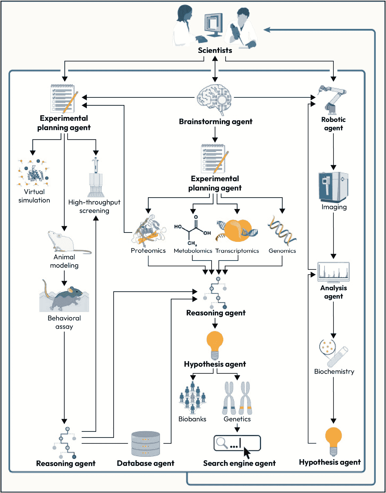
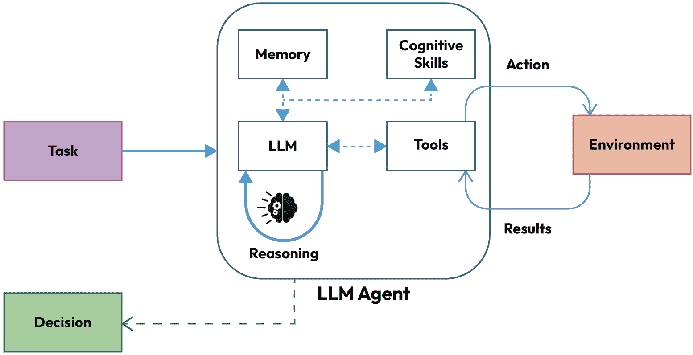
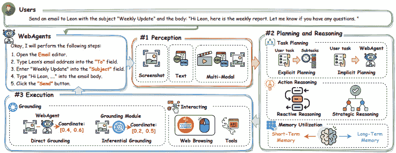
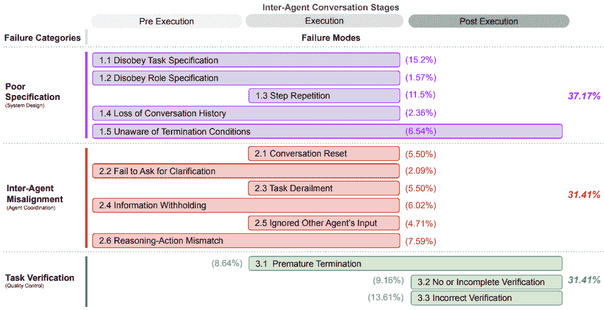
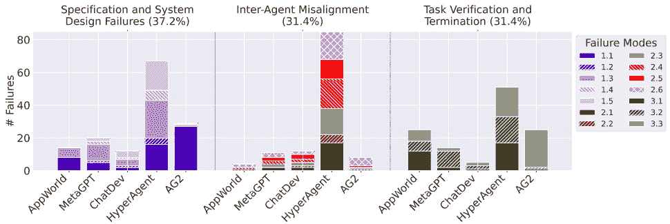
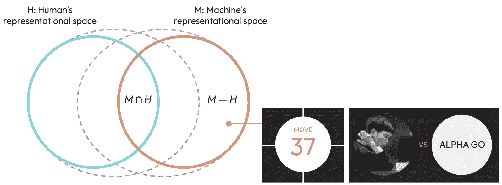
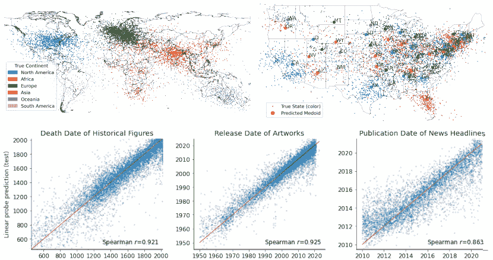
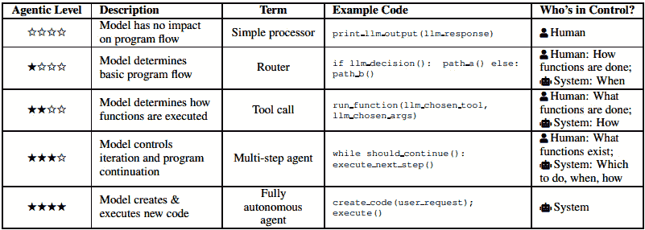
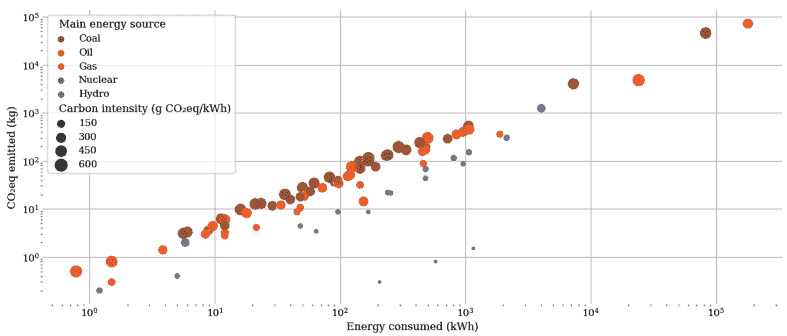

# 前方的未来

在这本书中，我们首先介绍了神经网络如何处理文本。正如我们所见，神经网络本身并不具备这种能力，但需要处理文本。简单的神经网络可以用于一些基本任务，如分类，但人类语言承载着大量的复杂信息。

在第二章和第三章中，我们看到了为了使用语义和句法信息，我们需要复杂的模型。Transformer 和 LLMs 的出现使得拥有能够推理和存储大量事实知识的模型成为可能。这些多功能知识和技能使得 LLMs 能够解决他们未经训练的任务（如编码、解决数学问题等）。尽管如此，LLMs 仍然存在一些问题，如缺乏专业领域知识、持续学习、能够使用工具等。因此，从第四章开始，我们描述了扩展 LLMs 能力并旨在解决 LLMs 问题的系统。

在本章中，我们将讨论一些问题尚未解决，以及未来将面临什么。我们将首先介绍代理在不同行业中的应用以及代理带来的革命。然后，我们将讨论一些在技术和伦理方面都十分紧迫的问题。

在本章中，我们将涵盖以下主题：

+   人工智能代理在医疗保健领域

+   人工智能代理在其他领域

+   挑战和开放性问题

# 人工智能代理在医疗保健领域

人工智能发展中最令人兴奋的前景之一是拥有能够自行进行科学发现的自主系统。这种新范式被称为“人工智能科学家”。在这本书的整个过程中，我们看到了一些被认为符合这一理念的系统示例（ChemCrow、虚拟实验室等）。在本节中，我们将更详细地讨论这一范式：研究将走向何方，面临的挑战以及未来的发展。

人工智能代理背后的理念是利用我们迄今为止所看到的 LLMs（大型语言模型）与工具（代理）的结合。在未来，研究人员希望向这些系统添加一个实验平台（一个能够自行进行实验的自主系统），以便它们能够独立进行实验。这样，就可以通过一系列可执行的任务来接近生物学的复杂性，其中 LLM 可以将问题分解成一系列子任务并自主解决它们。目标将是不仅更快，而且更有效地实现发现。这样，人工智能科学家就能够以人类无法达到的速度和规模产生研究成果。

在第一阶段，人类将是项目的中心。科学家将为 LLMs 提供输入和批评，并将这些反馈纳入到过程中。在这个过程中，模型将分析问题，在人类监督下（或使用手工提示来引导其通过过程）搜索互联网上的信息，并制定计划。在这种场景中，LLM 将是人类的助手，它提出解决方案和假设。最终目标是有望实现一个自主代理。

这个愿景是几十年来生物医学研究持续过程的结晶。事实上，自 20 世纪 90 年代初以来，人们一直在谈论一种新的范式：数据驱动模型的运用。这种范式转变是由于技术进步和数据的广泛可用性所引起的。生物医学研究产生了大量数据，在过去的三十年里，这些信息已经开始集中存储在一系列数据库中。随着这种整合和信息的新可访问性，研究人员开发出各种工具。最初，这些计算工具是模型和统计方法，但逐渐，生物医学研究也从机器学习和 AI 模型中受益。从某种意义上说，一个领域的成功推动了另一个领域的成功，反之亦然。数据越集中，对社区的可访问性越高，就越能促进新模型的开发。通过新模型和方法获得的新发现促使新的实验和新数据的产生。例如，转录组实验允许产生大型数据集，这对于开发新的机器学习模型和工具是完美的。这些模型允许回答一些生物学问题，而这些答案又导致了新的实验和新数据的产生。AlphaFold2 之所以成为可能，仅仅是因为**蛋白质数据银行**（**PDB**）上数百万的结构。AlphaFold2 允许研究人员提出新的假设，这些假设后来通过 PDB 上的新实验和新结构得到了证实。此外，AlphaFold2 的局限性促使研究人员为特定问题收集新的数据。这些新数据和实验验证导致了新模型的出现，形成了正反馈。

如您所见，当大型语言模型（LLMs）出现时，已经存在进一步革命肥沃的土壤。首先，大量数据（数百万篇文章和庞大的实验数据库）可用，从而允许模型在这份数据上进行训练，或者能够通过专用数据库搜索信息。例如，一个模型可以通过专用 API 搜索它在生物序列中遗漏的信息。或者，一个 LLM 可以使用 RAG 搜索关于新文章的信息。其次，社区产生了数千个模型来解决特定任务。LLM 不需要知道如何解决一个任务；有一个经过精选的资源列表，它可以用于一系列子任务。因此，LLM 不需要额外的训练，只需知道如何协调这些特定的任务工具和模型。到这一点，我们已经拥有了创建代理系统所需的一切。代理可以在生物医学研究过程的每个步骤中找到，从而在更短的时间内促进药物开发，并节省重要资源。

图 11.1 – 利用 AI 代理赋能生物医学研究 ([`www.cell.com/cell/fulltext/S0092-8674(24)01070-5`](https://www.cell.com/cell/fulltext/S0092-8674(24)01070-5))

## 生物医学 AI 代理

ChemCrow 是这类代理的一个例子，它针对特定的案例和领域进行了定义。该系统的推理仅限于特定任务；代理必须使用实验数据和现有知识。假设和任务都是由研究人员定义的；系统只需完成它们。第 1 级可以在人类监督下被视为协调者。

例如，ChemCrow 在研究自动化方面已经取得了具体的成果：根据发表在 *自然机器智能* 上的研究，ChemCrow 自动规划和执行了昆虫驱避剂和三种有机催化剂的合成，并指导了新型发色团（*自然机器智能*，2024）的筛选和合成。此外，通过整合 18 个专业工具，ChemCrow 简化了复杂的化学研究流程，显著提高了专家和非专家用户的工作效率和可及性（*科学日报*，2024）。

大多数代理方法都是基于使用一个中心 LLM。LLM 经过预训练，具有一般知识，然后与人类偏好对齐，以充分利用其知识和在预训练期间学习到的技能。生物医学领域需要专业知识和技能。因此，经常进行各种实验，其中 LLM 被微调以专门从事医学（例如，BioGPT、NYUTron 和 MedPalm）。这种方法显然成本高昂，并且模型很快就会过时（每天有数千篇论文发表）。因此，寻求不同的方法，在这些方法中不需要进行重复的微调。

一种选择是尝试使用一个模型（一个 LLM），但具有不同的专业领域（在每一轮分配一个特定的角色）。想法是使用一个模型，但设计提示来分配 LLM 的角色（生物学家、临床医生、化学家等）。还有其他替代方案，例如，使用指令微调来创建一个特定领域的专家（因此，与其将模型与特定知识对齐，不如将其与专家会执行的具体任务对齐）。例如，我们可以要求模型执行一个任务（*为具有功能 Y 的蛋白质 X 编写一个序列*）或提供特定的角色（*你是专门研究蛋白质组学的生物学家；你的任务是：为具有功能 Y 的蛋白质 X 编写一个序列*）。一个复杂任务可以由多个专家完成；例如，我们可以直接向模型提供任务（*识别与呼吸道细胞相互作用的新冠病毒基因；设计抗体来阻断它*）或将它分解成几个后续任务（第一个任务具有第一个角色，例如*你是具有 Covid19 病毒专业知识的专业病毒学家；你的任务是：识别与呼吸道细胞相互作用的新冠病毒基因*，然后分配模型第二个任务：*你是具有设计阻断抗体专业知识的计算免疫学家；你的任务是：设计抗体来阻断它*）。与之前的学习方法相比，这种方法（解决任务）不会像领域知识那样迅速过时。其他作者建议，人们可以简单地使用上下文学习。

这种策略意味着在上下文中向模型提供一系列所需的信息，以便扮演专家的角色（关于模型将要模仿的角色具体信息：定义、技能、特定知识等）。这种策略与通过提示分配角色的方法非常相似，但我们提供了更多的信息。尽管这些提示充满了信息和指令，但模型并不总是遵循它们。此外，在提示中描述专家的角色也很困难。因此，我们采取的另一种策略是模型独立生成和细化角色提示。

因此，智能体可能具有不同的工具和不同的目的。这种多角色方法的理由是，大型语言模型对规划和推理没有深入的理解，但仍然显示出获得的能力。因此，而不是一个智能体必须处理整个流程，我们有一个智能体池，其中每个智能体必须负责一个有限的子任务。通常，除了定义不同类型的智能体外，还需要定义工作协议（例如，在虚拟实验室中，除了智能体外，还定义了团队和个人会议的协议）。

在任何情况下，尽管人们对一个大型语言模型与几个人一起工作的多智能体方法抱有很大期望，但一些研究给出了混合的结果。事实上，一些作者表示，形式上称为“角色”（为大型语言模型分配角色）的东西并不提供特定的优势，除非在罕见的情况下。无论如何，到目前为止，有必要精确设计这些提示以使其有效（这是一个费时且反复试验的过程）。

由于大型语言模型具有良好的批判性思维能力，因此有人建议它们可以用于头脑风暴。尽管大型语言模型没有推理技能和有限的创造力，但它们可以快速浏览文献。然后可以使用智能体提出想法、评估最佳方案、细化并优先排序、提供批判性意见以及讨论可行性。一个有趣的可能性是使用一个智能体池，其中每个智能体具有不同的专业知识，这模仿了头脑风暴讨论过程。

可以创建不同的框架，其中智能体可以与人类或其他智能体进行交互。例如，利用批判能力可以促进具有不同目标的智能体的创建，以促进辩论。一组智能体可能专注于批判和挑战观点，而另一组可能旨在说服并为其观点辩护。每个智能体可能具有不同的专业知识和可用的不同工具。因此，这种方法从不同的角度评估研究命题。然后可以将研究想法视为一个优化问题，其中智能体试图找到最佳解决方案。除了智能体竞争的设置外，还可以利用合作的可能性。智能体可以对一个命题进行顺序反馈，目的是改进一个想法。这两个框架不一定是对立的，但可以在每个想法都经过反馈循环和批判的系统中进行调和。由于框架是用自然语言提示组织的，因此多智能体系统提供了独特的灵活性。

同样，并非所有代理都必须是平等的伙伴；可以组织层级结构。例如，一个代理可能扮演促进讨论或拥有更大决策权的作用。在虚拟实验室中，有一个代理扮演主要研究员的角色，负责发起讨论并拥有决策权。因此，可以建立多个决策层级，这些层级由复杂的架构管理。

注意，代理可以设计实验，并且结合经验工具，这些实验可以完成。这将提供一个新的能力水平，使整个过程成为端到端。

在这方面，高([`www.cell.com/cell/fulltext/S0092-8674(24)01070-5`](https://www.cell.com/cell/fulltext/S0092-8674(24)01070-5))为生物医学研究中的代理系统定义了三个自主级别：

+   **级别 0**：机器学习模型被研究者用作工具。研究者定义假设，使用模型完成特定任务，并评估输出。*级别 0* 系统是诸如在生物领域进行预测的模型之类的工具。

+   **级别 1**：这也可以定义为 *AI 代理作为研究助理*；研究者定义假设，指定需要执行以达成目标的任务，代理使用一组受限的工具。ChemCrow 是这种类型代理的一个例子，它针对特定案例和领域进行定义。系统的推理局限于特定任务；代理必须使用实验数据和现有知识。定义假设和任务的是研究者；系统只需完成它们。*级别 1* 可以被认为是人类监督下的协调者。

+   **级别 2**：也称为 *AI 代理作为合作者*，系统帮助研究者重新定义假设，部分得益于其庞大的工具集。尽管它对假设有所贡献，但其理解科学现象和生成创新假设的能力仍然有限。与 *级别 1* 区别开来的是，它参与假设改进和任务定义以测试它们。

+   **级别 3**：这是最后一个级别，定义为 *AI 代理作为科学家*。在这种情况下，代理必须能够发展和外推新的假设，并定义无法仅从文献中推断出的发现之间的联系。一个 *级别 3* 代理随后可以与研究者平等合作，或者可以自行提出假设，定义测试假设的任务，并完成它们。

到目前为止，我们没有超越*第 1 级*的代理，我们可能需要为*第 2 级*和*第 3 级*开发新的架构和训练系统。*第 0 级*是一组研究人员使用的工具，但缺乏任何自主性。一个*第 1 级*代理可以编写代码进行生物信息学分析以处理数据，进行统计分析或使用其他工具。一个*第 1 级*代理使用*第 0 级*工具来完成这些任务，从而允许它测试一个假设。一个*第 2 级*代理不应仅仅执行人类指示的狭窄任务，而应该能够在给定初始假设的情况下对其进行细化、做出决定并自主执行任务。我们预计，在给出假设后，*第 2 级*代理还能够细化实验，并批判性地评估以最大化目标。另一方面，*第 3 级*代理应与人类合作生成假设，实际上可以被视为其同伴。*第 3 级*代理应能够评估现有挑战并预测未来的研究方向。此外，*第 3 级*代理应与实验平台集成，以便能够从头到尾执行整个过程。

# 其他领域的 AI 代理

在本节中，我们将讨论 LLM 代理如何以及将在各个行业中产生和产生全球影响。

## 物理代理

物理 AI 代理（例如，机器人）是能够导航现实世界并执行动作的 LLM 代理。因此，它们可以被视为将 AI 与物理世界结合在一起的具身系统。这些系统中的 LLM 为推理和上下文理解提供基础。在此基础上，可以添加其他模块，如记忆、额外技能和工具。

图 11.2 – 基于 LLM 的代理 ([`arxiv.org/pdf/2501.08944v1`](https://arxiv.org/pdf/2501.08944v1))

与虚拟代理不同，物理 AI 代理还必须理解和适应物理动态，如重力、摩擦和惯性。能够理解物理定律使其能够导航环境并执行任务。

使用 LLM 作为物理代理有几个优点：

+   **人机交互**：LLM 允许人们通过自然语言的使用更轻松地互动。此外，LLM 的使用促进了更好的沟通和情绪管理，使得接受度更高。同样，人们已经习惯了与 LLM 协作，因此用户更容易与机器人协作解决问题、生成计划并执行任务。

+   **灵活性和适应性**：今天的 LLM 具有多功能和通用能力，这使得它们更容易适应不同的任务和环境。此外，对于特定任务和环境，LLM 可以被微调以获取在不同环境中操作所需的新技能和知识。LLM 还具有推理能力和查找信息的能力；在预训练期间获得的知识和技能可以用来解决它们未被编程的任务。此外，LLM 可以通过自然语言被引导执行任务，这使得向机器人解释它们需要完成的任务变得容易。

+   **多模态能力**：如今，多个大型语言模型（LLM）能够接受不同类型的模态作为输入。这种能力使它们能够整合来自不同类型传感器的信息，从而理解它们所处的环境。

近年来，将 LLM 与机器人结合的想法已经被探索。例如，PaLM-SayCan 是一个实验，其中他们使用 Google PaLM 来控制机器人。后来，谷歌使用了 PaLM-E 模型，它本身就是一个多模态模型。此外，今天正在测试新的替代方案，其中使用**强化学习**（**RL**）来改善 LLM 与环境的交互。

目前，由 LLM 控制的机器人仍存在一些挑战：

+   **数据集和训练**：LLM 需要使用大量数据进行广泛的训练。收集这些数据集并不容易；迄今为止，还没有用于在环境中训练机器人的高质量数据集（需要大量图像和文本的数据集）。机器人必须通过任务描述和执行方式来训练，这使得获取这些多模态数据集变得昂贵。使用 RL 需要你获取有关系统采取的行动和环境影响的数据库。用于一个任务的数据集可能对另一个任务的训练没有用。例如，用于训练狗机器人的数据集不能用于训练类人机器人）。机器人训练需要与环境的交互；这是一个费时费力的过程。人们正在努力通过游戏和模拟来克服这个问题。然而，这种替代方案是对真实环境的简化，可能不足以满足需求。

+   **机器人的结构**：机器人可以是任意形状。今天，运动机器人被设计成人类形状，但这并不是严格必要的。实际上，特定应用的机器人可能会有不同的形状。例如，如果一个机器人被设计成厨师，那么如果它被设计成适应其特定环境，它可能会有一个更好的形状。

+   **LLM 的部署**：在这些系统中，最佳方案是将 LLM 放置在机器人内部。将 LLM 部署在机器人内部是当前 LLM 的一个限制。许多 LLM 需要相当多的硬件资源（单个 LLM 需要不同的 GPU），这使得在本地大脑中部署 LLM 不可行。相比之下，今天，机器人的大脑位于云端。这显然有几个限制，尤其是在信号丢失的情况下。

+   **安全性**：LLM 由于预训练而产生的偏差和误解。此外，LLM 也可能产生幻觉或犯错误。这些因素在执行任务时可能导致错误。一个能够控制物理动作的 LLM 可能会造成伤害。例如，机器人可能在烹饪时烧毁房屋。同时，LLM 也可能被黑客攻击，存在私人数据泄露或故意破坏的风险。

(img/B21257_11_03.jpg)

图 11.3 – 实体智能的挑战([`arxiv.org/pdf/2311.07226`](https://arxiv.org/pdf/2311.07226))

## 游戏中的 LLM 代理

基于 LLM 的 AI 代理在游戏领域是另一个有趣的领域，其中模型的推理能力被用来与环境（游戏）交互。一般来说，一个专门用于游戏的框架需要一套组件，如 LLM、内存以及与游戏交互的工具。通常，系统使用 RL（其中游戏是一个场景）进行训练。然后，LLM 可以分析之前游戏中进行的动作，并推理出最佳行动。

(img/B21257_11_04.jpg)

图 11.4 – 基于 LLM 的游戏整体框架([`arxiv.org/pdf/2404.02039`](https://arxiv.org/pdf/2404.02039))

尤其是今天，许多游戏相当复杂，与环境和其他角色有复杂的交互。LLM 可以据此推理文本信息的丰富性（对象描述、任务描述、与角色的对话等），以决定行动计划或策略。例如，在宝可梦战斗中，每个玩家都有几个不同种类的宝可梦。每种种类都有不同的能力和统计数据；了解游戏知识是赢得战斗的必要条件。使用 LLM 可以让你利用模型的隐含知识来选择有效的策略（例如，使用电攻击对地面类型的宝可梦不会造成伤害）。此外，LLM 可以利用如思维链（CoT）等技术将不同元素整合到行动选择中（特别是如果它需要提前几步思考）。

(img/B21257_11_05.jpg)

图 11.5 – 利用语义知识制定有效策略 ([`arxiv.org/pdf/2404.02039`](https://arxiv.org/pdf/2404.02039))

基于 LLM 的代理对游戏来说是一个有趣的展望，因为它们可以丰富玩家的体验。例如，LLM 可以创建与玩家更自然交流的角色，在游戏过程中提供提示，与他们合作，并引导他们完成冒险。或者，它们可以用来生成更复杂且与玩家水平相匹配的对手。

## 网络代理

网络代理是专门设计用来与网络交互并协助人类完成繁琐和重复性任务的 AI 代理。因此，这些代理的目的在于自动化这些任务，提高生产力和效率。再次强调，大脑是一个 LLM，它允许进行推理和任务理解。网络代理的架构与本书中看到的类似。网络代理包含一个专门用于感知（来自网络的输入）、推理（LLM）以及一个专门用于与网络交互的模块。感知模块需要通过 HTML（读取并处理 HTML 文档的基于文本的代理）或通过网站截图（使用多模态 LLM）与网络进行交互。一旦 LLM 接收到一个任务，它就可以浏览网络、安排子任务、从记忆中检索信息，并执行计划。

图 11.6 – 网络代理框架 ([`arxiv.org/pdf/2503.23350`](https://arxiv.org/pdf/2503.23350))

AI 代理是 AI 的一个新前沿，它有望迅速产生实际影响。尽管它们具有潜力，但仍然存在一些挑战和问题，我们将在下一节中讨论。

# 挑战和开放性问题

在本节中，我们将讨论关于代理和 LLM 能力的一些开放性问题。尽管该领域取得了进展，但仍有几个问题需要解决，以确保 AI 代理的安全使用。

## 人机通信的挑战

一旦它们在现实世界中部署，代理可以执行可能导致问题性失败的行为。例如，购物代理可能会意外地花费金钱或无意中泄露敏感信息。编码代理可能会执行或产生病毒，删除重要文件，或将充满错误的代码库推入生产。与用户的沟通是避免此类问题的关键。代理的使用应基于两个关键原则：透明度和控制。确实，用户的目标和代理的行为之间必须保持一致；用户必须能够控制过程并访问其进度。人类与代理之间的沟通使我们能够推进这两个原则，但仍然存在一些开放性的挑战。

现代代理还不够完美，可能会犯错（尤其是对于复杂或包含多个步骤的目标）。因此，我们能够验证代理的行为，包括其工作结果以及它是否理解了任务，这一点非常重要。因此，必须找到一种方法来验证代理是否真正理解了目标，以及其计划和行动是否针对这个目标。验证代理真正理解了目标可以让我们避免代价高昂的错误，并节省计算和时间。

此外，LLMs 有一个随机组件。这个组件源于模型输出函数的概率性质（随机解码）以及任务执行过程中可能出现的复杂交互性质（意外事件）。因此，模型的结果和行为可能不一致。即使在确定性设置（温度 0）中，任务执行期间环境的变化可能会导致意外或不希望的结果。不一致性也可能来自 LLM 中过时的模型知识或存在的不完美的世界模型。例如，由于代理对现实世界的知识不匹配，它可能会购买超出预算或不符合用户需求的物品。

类似地，与用户和外部世界的交互会产生大量信息。这个广泛的背景对于指导代理的行为非常重要，这些行为随后可以从过去的交互中学习。尽管这个背景对于有效地执行任务至关重要，但它可能会随着时间的推移变得过于宽泛且难以管理。同时，现代大型语言模型存在噪声问题，当相关信息散布在不必要的细节中时，它们很难找到相关信息。因此，必须找到有效的方法，使代理能够专注于与用户最后一次交互的相关部分。此外，一些信息不应能够被重复使用（隐私和伦理问题），因此需要找到一种简单的方法来管理、编辑和删除过去的信息。

我们所讨论的是用户代理通信的一般挑战。我们还可以定义用户与代理之间以及反之亦然的开放挑战。首先，我们需要确保我们可以设计出通过解决这些点来使用户能够有效沟通的代理：

+   **明确的目标获取**：系统的重点是让代理理解目标，并让用户能够清楚地提供目标。为了避免代价高昂的错误，我们需要设计用户可以明确定义目标的代理。一些可能性已经在某些领域进行了研究：逻辑规则集和形式语言的使用。为了使这项技术对每个人都是可用的，我们需要使用自然语言。自然语言在细微差别和歧义性方面都很丰富，它允许使用模糊和不完整的定义来定义复杂的目标。因此，必须定义机制来消除不明确的目标或允许代理从上下文（或过去的交互）中推断。

+   **尊重用户偏好**：可以通过多种路径实现目标，但其中一些比其他路径更优（既有效率，也尊重用户的偏好）。用户的偏好可能与 LLM 的价值观不一致（在训练后，模型与人类偏好一致，但这并不一定反映普通用户的偏好，而只是反映了一组选定的注释者的偏好）。例如，如果用户请求一条路线，他们可能更喜欢更环保的交通工具。代理应尽可能遵守这些偏好，或者在无法遵守时中断流程以通知用户。模型对齐可能是一种考虑用户偏好的可能方法。然而，当前的对齐方法主要考虑的是总体偏好，而满足个人偏好的方法尚未开发。更普遍地说，代理也可以通过产生伤害（即使是以无意的方式）来实现目标，而且如果它有能力使用工具，这种风险就更大。

+   **整合反馈**：我们知道代理容易出错，虽然我们可以制定策略来减少错误，但完全消除它们可能是不可能的。代理可能会在重复的交互中继续使用次优工具（不理解目标或设置错误的计划），从而让用户感到沮丧。纠正这种行为的一种方法是从用户那里获取反馈。现在有关于如何整合这种反馈以及如何以更有效的方式向代理表示这种反馈的研究（例如，将其转换为一级逻辑）。

与代理与用户沟通的方式相关的一些挑战也存在，特别是关于他们的能力、他们采取或将要采取的行动、目标实现和意外事件：

+   **代理的能力**：用户必须能够理解代理的全部能力（和限制）才能进行明智的决策。应该清楚代理可以访问哪些信息，它将如何使用这些信息，它如何可以修改外部环境，它可以使用哪些工具，以及它是否可以连接到互联网。

+   **代理将采取哪些行动**：为了解决目标，代理可以详细制定一个复杂的计划，这可能特别昂贵（时间、资源或金钱），并且可能违反一些用户的偏好。然后，用户应该了解代理采取的行动，并能够提供反馈。当然，必须找到一种有效的沟通形式，以避免传达无关紧要的细节，并确保用户完全理解代理的行动。此外，还应明确是否有些行动需要用户的明确批准。

+   **监控进度**：对于一个在动态环境中移动的代理，完成任务的计划需要几个步骤；对于用户来说，了解代理正在做什么以及是否需要修改过程或停止它是很有用的。同时执行多个行动的代理可能导致意外和有害的行为。例如，一个构建新闻报告并在市场上进行投资的代理可能会阅读虚假新闻并执行一系列不良投资。

+   **环境和副作用的变化**：代理必须监控环境的变化或其操作可能产生的潜在副作用。例如，一个被分配以最低价格在线购买产品的代理可能会在网上找到具有非常具有竞争力的价格的产品并下单。然而，该报价可能需要订阅或其他隐藏费用，这会使购买比用户的偏好或预算高得多。用户必须意识到代理行为产生的副作用。

+   **目标达成**：用户指定一个目标，代理规划行动并执行它们。在这个过程中，用户必须清楚代理是否实现了目标（或部分实现）。因此，需要一种方法来评估目标是否已经实现。例如，目标可能是以某种性能类型购买最便宜的移动电话。代理可以引导购买，但我们还需要评估代理是否满足其他条件。因此，我们需要一种方法来验证目标是否已经完全且令人满意地实现。

与代理的沟通是一个复杂但关键的话题。沟通不畅可能导致系统故障，这是需要考虑的重要问题。在本节中，我们提供了一份从不同角度评估用户-代理沟通的重要元素列表。在下一小节中，我们将看到使用多代理是否比单代理更优越。一些研究对此观点提出了质疑。

## 多代理没有明显的优势

如前所述，基于 LLM 的代理可以被识别为一个具有初始状态（通常是在提示中指定其初始状态的描述），可以跟踪其产出（状态），并且可以通过使用工具与环境交互（动作）。**多代理系统**（MAS）被定义为一系列以协调方式相互交互以解决任务的代理。

MASs 是单代理系统的扩展，旨在创建一个更复杂的框架，能够解决复杂问题。显然，这意味着更高的计算成本（推理中更多的 LLM 调用）。这种更高的计算成本应该通过显著的性能提升来证明。事实上，一些研究表明情况并非如此。与单代理系统相比，MASs 在性能上仅提供微小的提升。

概述单代理和多代理设计之间的架构权衡是有用的。虽然 MASs 在模块化和并行性方面提供了潜在的优势，但它们也引入了额外的复杂性、协调开销和成本。以下表格总结了关键差异：

|  | **单代理设计** | **多代理设计** |
| --- | --- | --- |
| **成本** | 较低：较少的推理步骤和较少的编排 | 较高：更多代理，更多 LLM 调用和工具使用 |
| **延迟** | 通常较低，流程简化 | 由于代理间通信可能较高 |
| **容错性** | 较低：代理故障通常会导致系统崩溃 | 较高：故障可以包含在单个代理内 |
| **模块化** | 单一且难以扩展 | 模块化：代理可以独立添加或替换 |
| **可扩展性** | 有限：代理处理所有逻辑 | 较高：并行代理允许分布式问题解决 |
| **通信开销** | 无（内部推理） | 显著：需要显式的代理间消息传递 |
| **可解释性** | 较易：单一路径决策链 | 较难：分布式推理可能会降低透明度 |

表 11.1 – 多代理系统故障的潜在原因

如前表所示，多代理架构引入了一系列必须仔细平衡的权衡。虽然它们提供了模块化和潜在的故障隔离，但它们通常遭受更高的延迟、通信开销和协调挑战。这些权衡在 MASs 的经验评估中得到了反映。

图 11.7 – 五个流行的多代理 LLM 系统的故障率([`arxiv.org/pdf/2503.13657`](https://arxiv.org/pdf/2503.13657))

MASs 应该带来众多好处，例如更高的准确性、处理更复杂任务的能力、创建更复杂的计划或找到更好的解决方案。如果 MASs 没有带来所有这些好处，实际上往往还会失败，我们就需要了解其中的原因。在最近的一项研究中，Cemri 等人（2025）通过分析 150 个对话记录（每个平均超过 15,000 行文本）来对 MAS 失败进行详细的分类，并使用专家注释员识别失败及其原因。在他们的工作中，他们确定了 14 个原因，分为 3 个主要类别：

图 11.8 – MAS 失败模式的分类 ([`arxiv.org/pdf/2503.13657`](https://arxiv.org/pdf/2503.13657))

因此，三个主要类别如下：

+   **规范和系统设计失败**：失败源于 MAS 设计的不足。对于作者来说，许多失败源于架构选择不当、代理之间对话管理不善、任务规范不良、违反约束以及代理角色和责任规范不良。换句话说，如果代理的指令不明确，系统可能会失败。即使指令明确，MAS 也可能不符合用户指令。

+   **代理间不匹配**：失败源于无效的通信、合作不足、代理之间的冲突行为以及逐渐偏离初始任务。正如我们之前提到的，实现代理之间的高效通信并不容易。因此，一些代理可能无法高效地沟通，从而浪费资源。

+   **任务验证和终止**：第三个重要类别包括未能完成任务或其过早终止。MASs 往往缺乏一种验证机制，该机制检查并确保交互、决策和结果的真实性、完整性和可靠性。简单来说，许多系统没有包括一个专门的代理（或其他机制）来监控过程并验证任务是否成功执行。

他们的调查结果显示，这些原因没有哪一个特别普遍，而是在各个系统中均匀分布。此外，一些原因之间存在相关性，产生了一种连锁反应。例如，错误的架构设计可能导致代理之间通信效率低下。

图 11.9 – 按类别和系统分布的失败模式 ([`arxiv.org/pdf/2503.13657`](https://arxiv.org/pdf/2503.13657))

这项工作的结果表明，通过更仔细的设计可以避免失败。改进提示、代理通信以及添加代理（或其他验证机制）可以显著提高性能并降低失败的风险。在两个案例研究中，作者展示了这种情况。另一方面，这些建议不足以解决所有代理问题，但将进一步的技术进步。

除了系统本身之外，许多代理的限制也源于代理本身（即用于代理的模型）。在下一小节中，我们将讨论 LLMs 的推理限制。

## 推理的局限性

推理是人类的基本认知功能，很难给出一个精确的定义。维基百科这样定义推理：“*推理是通过从新信息或现有信息中得出有效结论，有意识地应用逻辑，以寻求真理的能力。它与哲学、宗教、科学、语言、数学和艺术等具有人类特征的活动相关联，通常被认为是人类所拥有的区分能力*。”

很长一段时间以来，人们都说只有人类才具备推理能力。然而，如今已经证明，灵长类动物、章鱼和鸟类也表现出基本的推理形式，例如做决定或解决问题。推理的一个问题是难以对其进行评估。通常，为了做到这一点，人们会评估解决复杂问题或做出决策的能力。复杂的解决问题需要识别问题、将其分解为子问题、寻找模式，然后选择最佳解决方案。决策同样需要识别问题和模式，并在选择最佳解决方案之前评估替代方案。

在 LLMs 的情况下，人们试图通过评估问题解决能力的基准数据集来衡量推理能力（例如 GLUE、SuperGLUE 和 Hellaswag）。如今，在这些数据集的许多情况下，人类已经被下一代 LLMs 超越。这些新的推理能力主要归因于三个因素：

+   在所有针对推理的基准测试中，大型语言模型（LLMs）都表现出色。这些基准测试包含需要推理技能的数学或编码问题。这些基准测试的结果表明，LLMs 具有推理能力。

+   随着参数、标记数量和计算预算的增加，新特性的出现。

+   使用 CoT 等技术，这些技术允许模型发挥其潜力。

有的人质疑这种观点，声称这些基准测试中取得的成绩有其他解释。毕竟，许多作者认为 LLMs 不过是一群随机的鹦鹉。江在 2022 年([`arxiv.org/pdf/2406.11050`](https://arxiv.org/pdf/2406.11050))提出，这些模型仅仅是模式匹配机器：“*强烈的标记偏差表明模型依赖于输入中的表面模式，而不是真正理解底层* *推理任务*。”

在同一项研究中，观察到当 LLMs 遇到在预训练阶段未见过的、表现出与预训练阶段不同模式的新的示例时，它们无法泛化。如果我们更改示例中的标记，模式映射就会失败（一个通过上下文学习尝试在其知识中找到与用户提出的问题相似的示例的 Transformer）。当模型找不到示例时，模型就无法解决该问题。这种脆弱性和对训练示例的依赖性可以解释为什么模型在解决复杂问题时能够成功（它找到了模式），甚至在一些非常简单的问题上也会失败（它找不到示例）。这一点通过训练数据中示例频率与测试性能之间的相关性得到了证实。

例如，当模型被要求解决经典的“25 匹马”图论问题时，模型能够成功解决。如果将“马”标记改为“兔子”，模型就无法解决它。标记的改变与问题的底层逻辑无关，但模型因为难以映射问题而无法解决它。GPT-4 和 Claude 都因为动物名称和数字的扰动而出现了显著的性能下降。

图 11.10 – 使用经典问题进行标记偏差 ([`arxiv.org/pdf/2406.11050`](https://arxiv.org/pdf/2406.11050))

这种现象被称为**提示敏感性**（对语义上等同于另一个提示的不同响应）。这一点通过 LLMs 对噪声敏感的事实得到了证实。它们很容易被不相关的上下文所干扰，这使得找到模式变得更加困难。这种敏感性并不能通过专门用于提高推理能力的提示技术得到解决，这表明干扰模式匹配活动会破坏推理能力。以下是一个不相关上下文干扰模式但不影响实际解决问题的例子：

图 11.11 – 不相关上下文干扰 LLMs ([`arxiv.org/pdf/2302.00093`](https://arxiv.org/pdf/2302.00093))

一些作者建议，智能可以被视为一种涌现属性。生物系统自然倾向于变得更加复杂，这个过程是由自然选择驱动的。进化表明，随着时间的推移，智能有所增加，因为它促进了各种物种的适应性。当然，智能不是一个经济过程，大脑体积越大，消耗的资源（代谢消耗）就越多。损失函数可以被视为进化压力。由此可以推断，模型容量（就参数数量而言）的增加将与动物大脑中神经元数量的增加相平行，而损失函数将推动这些参数被有效地使用。通过扩大模型和训练（参数和训练令牌），LLMs 中也可能出现智能。因此，推理被视为从模型规模扩展中涌现出的属性。然而，后来的研究表明，LLMs 中的涌现属性可能是测量误差，并且整个理论与推理的涌现有关。

在下一张图中，你可以看到一些属性似乎随着模型规模的增加而出现。

(img/B21257_11_12.jpg)

图 11.12 – 涌现推理属性的示例([`arxiv.org/abs/2304.15004`](https://arxiv.org/abs/2304.15004))

根据其他作者的观点，大型语言模型（LLMs）具有推理能力，但需要被解锁。因此，CoT 提示（CoT prompting）通过中间推理帮助模型解锁其潜力，从而引导它在算术问题中找到正确答案。CoT 是今天的提示工程技术，也用于训练深度推理模型（如 ChatGPT-o1 或 DeepSeek R1）。实际上，这些模型是在用于进行监督微调的长 CoTs 上训练的。这些模型探索不同的推理路径来得出答案，显示出在推理基准测试中的显著提升。然而，一些研究表明，这些模型同时存在过度思考和思考不足的问题。

过度思考是一种奇特的现象，在这些模型解决特别简单的问题时，它们会进行比必要更长的时间的推理。模型会探索不同推理路径来回答简单问题。这表明模型无法理解哪些问题需要更多的努力。而思考不足则是其对立面，其中模型可能会放弃有希望的思考路径。这表明推理深度明显不足，模型没有完全达到正确解决方案。

同时，CoT 的好处也受到了质疑([`arxiv.org/pdf/2409.12183`](https://arxiv.org/pdf/2409.12183))：“*在 MMLU 上，高达 95% 的总性能提升归因于包含“=”的问题或生成的输出。对于非数学问题，我们发现没有特征可以指示 CoT* *何时会有帮助*。”

(img/B21257_11_13.jpg)

图 11.13 – CoT 的改进仅限于符号和数学推理([`arxiv.org/pdf/2409.12183`](https://arxiv.org/pdf/2409.12183))

CoT 似乎有助于模型解决问题，因为它允许它利用在预训练期间学到的技能。CoT 简单地帮助制定计划，但然后 LLM 可能无法执行它。因此，CoT 可以用来获取计划，但要获得最大利益，必须添加外部工具（如 Python 解释器）。

(img/B21257_11_14.jpg)

图 11.14 – 一个 LLM 可以制定计划，但需要外部工具来更好地解决一些问题([`arxiv.org/pdf/2409.12183`](https://arxiv.org/pdf/2409.12183))

这些模型都是在与 **Grade School Math 8K** (**GSM8K**) 数据集相同的基准上测试的，该数据集提供了复杂的算术问题，但存在数据泄露的风险（考虑到训练一个 LLM 需要数十亿个标记，模型可能已经在训练中看到了答案）。

因此，在他们的研究中，Mirzadeh 等人修改了 GSM8K，保持了相同的问题，但使统计模式匹配变得困难。如果模型能够进行真正的推理，它应该能够轻松解决它；相反，如果它依赖于模式匹配，它就会失败。

在下面的图中，请注意 GSM8K 示例是如何修改的，以更好地控制 LLM 的响应。使用这个数据集，我们可以正式调查 LLM 的推理，并强调最先进的 LLM 表现出显著的性能变化；这表明 LLM 的推理是脆弱的。

(img/B21257_11_15.jpg)

图 11.15 – 这个数据集作为研究 LLM 假定的推理能力的一种工具([`arxiv.org/pdf/2410.05229`](https://arxiv.org/pdf/2410.05229))

在测试最先进的 LLM 时，Mirzadeh 等人发现语言模型中没有形式推理的证据。当数值发生变化时，这些模型不够稳健，性能会下降，并且随着问题复杂性的增加，它们的性能会急剧下降。实际上，模型被添加的无关短语所欺骗。相反，模型考虑了这些短语，试图将它们映射到模型中，有时甚至将它们转化为操作。Mirzadeh 等人建议，这发生是因为他们的训练数据集中包含了需要转换为数学运算的类似示例：“*例如，我们观察到的常见情况是，模型将关于“折扣”的陈述解释为“乘法”，无论上下文如何。这引发了这些模型是否真正充分理解数学概念的疑问*。”

图 11.16 – 错误示例（[`arxiv.org/pdf/2410.05229`](https://arxiv.org/pdf/2410.05229)）

最近在 CoT（如 GPT4-o1）上训练的 LLM 也在这项任务中失败了。这表明 LLM 是复杂的统计模式机器，但并不具备真正的推理能力。

## LLM 中的创造力

创造力与推理一起被认为是使人类成为人类的一种技能。如果量化推理是困难的，那么量化创造力是一项更加困难的任务。然而，创造力在我们成为人类的过程中扮演着非常重要的角色，它涉及到诸如写诗或书籍、创作艺术作品，甚至生成理论和实现突破性发现等活动。这就是为什么人们提出了 LLM 是否具有创造力的疑问。

调查 LLM 的创造力的问题在于我们没有明确的创造力定义。在研究领域，创造力通常被用作 Margaret Boden 选择的定义：“*提出新颖、令人惊讶且有价值的思想或作品的能力*。”尽管这个定义被接受，但评估其元素是困难的：

+   **价值**：这是最容易定义的元素。例如，如果一个 LLM 生成的代码能够以自己的方式工作，那么它可以被认为是具有价值的。

+   **新颖性**：对于一个对象要被认为是新颖的，它应该与已经创造出的东西不同。对于文本来说，新颖性可以被认为是与其他文本输出之间的差异。一个可能的定义是生成一个嵌入与其他不同文本距离较远的文本。

+   **令人惊讶**：这被认为是定义中最重要且最困难的部分。随机重组的单词可以被认为是新的（或不同的），但肯定不是令人惊讶的（或是有价值的）。*令人惊讶*通常被理解为新颖的，但不是简单的变化或重组。

同时，Boden 描述了她认为与惊喜概念相关的三种创造性类型：

+   **组合性创造性**：以不熟悉的方式组合熟悉元素（例如，将以前未结合过的两种类型）

+   **探索性创造性**：以新的思维方式探索新的解决方案（例如，新的叙述风格，或对尚未探索的叙述风格的转折）

+   **转化性创造性**：改变当前的叙述风格或当前思维方式

与这些定义一致，一些作者试图理解 LLM 是否具有创造性，如果是的话，它们能表现出什么样的创造性。这项研究的主要问题在于尝试量化 LLM 的创造性。一种方法就是评估 LLM 的输出是否可以映射到网络上的现有文本片段。人类的创造性受到先前作家的启发，但当作家创作原创作品时，这不能映射到先前作品中。如果 LLM 生成的每个文本都可以映射到其他文本，这将是缺乏创造性的压倒性证据。在一项最近发表的研究中，Lu（2024）分析了 LLM 生成的内容中有多少可以映射到互联网上的文本。这项研究的目的是精确地创建一个创造性指数，并比较 LLM 和人类。

图 11.17 – 将 LLM 输出映射到互联网文本（[`arxiv.org/pdf/2410.04265`](https://arxiv.org/pdf/2410.04265)）

这种方法的成果表明，人类在创造性（基于独特的单词和句子组合）方面比 LLM（大型语言模型）表现得更为出色。LLM 中那微小的残余创造性可能仅仅源于随机过程以及我们不知道整个预训练数据集的事实。

图 11.18 – 人类与 LLM 的创造性指数比较（[`arxiv.org/pdf/2410.04265`](https://arxiv.org/pdf/2410.04265)）

Lou 等人提出一个有趣的类比：“*正如 DJ 混音现有曲目而作曲家创作原创音乐一样，我们推测 LLM 更像 DJ，将现有文本混合以产生令人印象深刻的新输出，而熟练的人类作者，类似于音乐作曲家，创作原创作品*。”

尽管 LLM 无法实现真正的创造性，但有几项研究试图提高模型的伪创造性（从长远来看，LLM 可能特别重复）。这里有三种潜在的策略：

+   **对 LLM 超参数的操作**：第一种策略与提高 LLM 的温度相一致。温度控制生成过程中的不确定性或随机性。调整温度会影响模型生成，在低温（例如，0.1–0.5）下，模型生成确定性、专注和可预测的输出。提高温度会生成更不可预测的输出。超过 2.0 后，过程变得混乱，模型生成无意义的内容。因此，对于需要创造力的应用，你可以探索更高的温度，但请记住，这通常也会导致一致性的降低。

+   **对 LLM 进行额外训练**：使用后训练技术是今天广泛探索的一条途径。后训练技术用于模型对齐和使模型更易于执行任务。一些作者提出了使用旨在激励输出多样性的技术。

+   **提示策略**：使用试图迫使模型更具创造性的提示。然而，提示策略似乎没有取得很好的效果。

## 机制可解释性

人工智能的最近进展意味着模型能力迅速提升。矛盾的是，自监督学习的范式意味着即使模型是由人类设计的，LLM 的能力也不是预先设计的。理论上，开发者只需要了解过程，而不必理解模型是如何工作的，因为期望的特性在训练过程中出现。换句话说，LLM 不是为展示的特性而设计的；这些特性是通过扩展获得的，而它如何到达那里的大部分内容是不清晰的。重建它们出现的方式和这些能力背后的机制不是一项容易的任务，尤其是在训练了数十亿参数的模型之后。这些模型被认为是黑盒，最近，有一些关于如何分析它们的讨论。

模型（如以下列表和图所示）有几种可解释性类型。这些可解释性的类型各自关注不同的方面。

图 11.19 – 模型的逐步解释级别([`arxiv.org/pdf/2404.14082`](https://arxiv.org/pdf/2404.14082))

我们可以将各种可解释性方法分为以下几类：

+   **行为**：将模型视为一个黑盒，并关注输入和输出之间的关系。这种范式考虑了那些对模型无差别的可解释性经典方法。

+   **归因**：这些方法试图通过跟踪输入的每个组件的贡献来理解模型的决策过程，并基于梯度偏移。

+   **基于概念**：使用探针来尝试更好地理解模型学习到的表示。

+   **机制**：这是一种对组件及其组织方式的细粒度分析，试图识别因果关系。

机制可解释性旨在通过识别产生其输出的机制来揭示神经网络的内部决策过程。我们关注这种方法，因为它强调理解模型的各个组成部分及其对整体行为的影响。这种视角很有价值，因为它使我们能够通过全面和透明的视角来分析模型。

机制可解释性超越了之前的方法，因为它寻求识别导致神经网络泛化的因果机制，以及背后的决策过程。随着模型及其能力的增长，人们提出了一个问题，即这些模型是如何获得这些泛化能力的，因此需要全局解释。

尽管大型语言模型（LLMs）生成的文本与人类产生的文本相似，但这并不意味着概念和认知过程的表示是相同的。这一点可以通过以下事实得到证明：LLMs 在某些任务上表现出超越人类的能力，而在对人类来说简单的其他任务上，它们却表现得非常糟糕。我们需要一种方法来解决这个悖论，那就是通过机制可解释性。为了尝试解决这种不一致，提出了对 LLMs 的反向工程。反向工程（一种机制可解释性方法）包括三个步骤：将模型分解成更简单的部分，描述这些部分如何工作以及它们如何相互作用，并测试这些假设是否正确。虽然机制可解释性旨在揭示网络内部的逻辑和因果机制，但基于概念的可解释性则侧重于理解模型如何表示高级、人类可理解的概念，以及这些概念如何影响模型的决定，从而为预测背后的推理提供洞察，并弥合人类认知与机器学习过程之间的差距。这两种方法在以下图中展示：

图 11.20 – 反向工程 ([`arxiv.org/pdf/2501.16496`](https://arxiv.org/pdf/2501.16496))

这种方法的缺点是难以将神经网络分解为功能组件。实际上，在神经网络中，神经元是多义的，代表多个概念。因此，单个组件的解释并不很有用，反而可能具有误导性。作者们现在专注于尝试将多个神经元甚至多层神经元分解为功能单元。由于这些概念由多个神经元（叠加假设）表示，因此尝试使用强制稀疏性的工具来分解这种稀疏表示。

(img/B21257_11_21.jpg)

图 11.21 – 使用 SDL 分解叠加表示([`arxiv.org/pdf/2501.16496`](https://arxiv.org/pdf/2501.16496))

这种将模型分解为包含多个神经元和层的功能单元的转变需要新的技术。

**稀疏字典学习**（**SDL**）包括多种方法，允许对模型学习的内容进行稀疏表示。**稀疏自动编码器**（**SAEs**）是这种方法之一，它允许我们学习与模型特性相关联的稀疏特性，并使模型学习的内容更加易于访问。SAEs 使用编码器和解码器来稀疏化模型内的叠加表示。

(img/B21257_11_22.jpg)

图 11.22 – 将 SAE 应用于 LLM 的示例([`arxiv.org/pdf/2404.14082`](https://arxiv.org/pdf/2404.14082))

SAEs 允许我们识别出可被人理解的特性，并通过稀疏性，我们尝试学习少量特性。在基本层面上，SAEs 可以提取与单个单词或标记相关的特性，例如单词频率特性（对应于高频与低频单词的激活），以及词性特征（选择性激活名词、动词或形容词）。SAEs 通常捕捉 LLMs 中嵌入的句法规则，例如为某些句法模式（例如主语-谓语-宾语结构）触发的激活，或对应于句法依赖性的特征，例如一个单词是否是修饰另一个名词的名词。此外，还可以识别高级特性，例如针对特定领域（例如政治、科学或体育）的文本触发的神经元，以及句子是否表达积极、消极或中性情感。最后，一些特性也可能与写作风格和话语结构相关，例如区分学术写作和日常对话，编程语言与人类语言，或特定作者的独特写作风格（例如莎士比亚与 X/Twitter 帖子）。

(img/B21257_11_23.jpg)

图 11.23 – SAE 训练概述 ([`arxiv.org/pdf/2309.08600`](https://arxiv.org/pdf/2309.08600))

SAEs 学习到的某些特征可能并不反映真实知识，而是模型嵌入的随机统计属性。此外，SAEs 有时在隐藏层中学习到虚假的相关性，而不是有意义的概念结构。还有，SAEs 只关注一次一层，没有考虑到不同层的不同神经元可能对同一概念进行交互。尽管存在相关成本，但 SAEs 被认为是一种分析模型行为的很有前途的方法。同时，提出了以更可解释和分散的方式训练 LLMs。在模型权重中使用稀疏性有助于可解释性。例如，剪枝和其他类似技术将零引入模型权重，有效地将其擦除。稀疏性消除了神经元之间的连接；这使得跟踪信息流和更好地理解模型的决策过程（或连接输入和输出的关系）变得更加容易。专家混合（Mixture-of-experts）也有类似的效果，因此使其更具可解释性。

可解释性技术现在是理解 LLMs 行为和防止危险行为出现的关键，例如欺骗用户、显示偏见、给出错误答案以取悦用户的信仰（称为“拍马屁”）以及学习虚假的相关性。随着参数和训练的增加，模型在响应上变得越来越复杂，越来越冗长，具有说服力，这使得用户难以理解答案是否正确。此外，这些模型现在已向公众部署，这意味着有恶意意图的用户可以进行数据中毒、越狱、对抗性攻击等攻击。可解释性有助于监控模型与公众互动时的行为，突出失败的地方，并在实时中解决它们。可解释性是模型安全的重要要求，因为它不仅允许我们识别问题行为，还可以识别哪些组件负责这些行为。一旦我们确定了与意外行为相关的组件，我们就可以进行干预。

此外，如今对隐私的关注越来越多，*机器反学习*是处理清除特定数据点对训练的机器学习模型影响的领域。例如，监管问题可能要求我们从模型中删除有关个人的信息。机器反学习涉及尝试删除这些信息，而无需从头开始训练模型。机器反学习与可解释性相关，因为分解技术使我们能够在模型参数中定位概念和信息。更普遍地说，我们希望有能力编辑模型知识（例如纠正事实错误、删除受版权保护的内容或消除有害信息，如武器制造说明）。编辑需要能够以手术般的方式干预模型参数，而不会破坏额外的知识和其他能力。编辑比反学习更复杂，因为它意味着重写模型知识。可解释性技术使我们能够了解编辑或反学习是否成功，然后监控整个过程。

可解释性在尝试预测模型在新情况下将如何表现，从而避免安全风险方面也很有用。实际上，模型的某些行为可能仅在未预料到的情况下出现，而在进行标准评估时可能不会表现出来。例如，我们可以在用户发现之前识别出易受攻击性或潜在的后门。考虑到今天的 LLMs 越来越多地与工具连接，任何滥用都可能产生传播效应。例如，如果 LLM 连接到金融数据库，它可能被用来提取有关用户的信息。或者，一个在线购物的 LLM 可能被用来进行欺诈和购买假冒产品。微调和其他训练后步骤可能导致在预训练模型中不存在的行为出现或加剧。此外，一些属性似乎在规模上出现，而在我们训练较小模型时难以预测。在为新架构设计时，通常训练最终架构的较小版本。较小的模型可能不会出现仅在规模上出现的问题。

可解释性也有值得称赞的重要方面；理解模型及其组件的行为使我们能够加快推理速度。例如，如果某些计算是不必要的，我们可以将其关闭，或者利用获得的知识提炼出一个更有效的模型。此外，我们还可以识别出影响正面或负面推理的组件。

可解释性的另一个有趣方面是它可以用于新的发现（通常称为**显微镜 AI**）。换句话说，你可以调查一个在特定数据上训练过的模型，并可以使用可解释性技术来深入了解它。你可以使用这些技术来识别可能逃过了人类注意力的模式。例如，在 AlphaZero 在象棋中击败人类成功之后，研究人员考虑从模型中提取信息以识别人类可以学习到的关于牺牲的概念。在这篇论文中（[`arxiv.org/abs/2310.16410`](https://arxiv.org/abs/2310.16410)），Schut 等人（2023）确定了这些概念或模式，以了解模型对游戏的表示有何不同。

图 11.24 – 从机器独特知识中学习 ([`arxiv.org/pdf/2310.16410`](https://arxiv.org/pdf/2310.16410))

大型语言模型（LLMs）拥有庞大的记忆，人类通过语言来表达自己；这使得它们能够分析和进行关于人类心理的假设。因此，可解释性是一种让我们不仅能更好地理解模型，还能将模型作为工具更好地理解人类的方法。在下一节中，我们将讨论模型如何有可能接近人类智能。

## 通往通用人工智能之路

*“通用人工智能（AGI）是一种假设的高度自主的人工智能（AI）类型，它将在大多数或所有具有经济价值的认知工作中匹配或超越人类的能力。它与窄 AI 形成对比，后者仅限于特定任务。另一方面，人工超级智能（ASI）指的是大大超出人类认知能力的人工智能。AGI 被认为是强人工智能的一种定义。”*

这是维基百科对**通用人工智能**（AGI）的定义。在想象能够超越人类的 AI 之前，我们必须问一问 AI 是否已经赶上了人类的能力。一般来说，在 ChatGPT 出现之前，这场辩论并未开始（至少对于公众来说是这样）。这是因为之前的模型仅在特定应用中具有超越人类的能力。例如，AlphaGo 能够相对容易地击败人类冠军，但没有人认为我们之所以是人类是因为我们懂得如何下围棋。另一方面，DALL-E 和 ChatGPT 等模型已经开始在公众中引发疑问。毕竟，创作艺术或创意写作是与人类普遍相关的技能。当 ChatGPT 和其他大型语言模型能够通过大学或医学和法医执照考试时，这种感觉得到了加强。

我们在之前的子节中讨论了创造力和推理。目前的共识是，LLMs 没有展现出真正的推理或创造力技能。它们是复杂的随机模式机器，它们在整个人类知识中寻找模式的能力使它们非常有效。

如果 LLMs 今天无法展现出人类智能的水平，人们可能会想知道这会对 AGI 带来什么。到目前为止，人们一直认为，通过扩展参数和训练就可以实现 AGI。根据涌现属性的理念，推理和创造力应该在扩展过程中某个时刻出现（通过增加模型的大小和用于训练的标记数量，尽管我们无法预测，模型应该开始显示出真正的推理）。今天，大多数研究人员都不相信这是可能的，也不认为后训练技术足够。

此外，扩展并不是无限可能的。即使我们能够投入巨额资金和资源，也无法创造出线性增长的模型所需的足够文本。实际上，人类产生的文本数量是有限的，我们正在接近人类产生文本量的极限。

(img/B21257_11_25.jpg)

图 11.25 – 公共文本和数据使用量的预测([`epoch.ai/blog/will-we-run-out-of-data-limits-of-llm-scaling-based-on-human-generated-data`](https://epoch.ai/blog/will-we-run-out-of-data-limits-of-llm-scaling-based-on-human-generated-data))

解决这个问题的方法可能是使用合成数据。然而，合成数据可以被看作是一种“知识蒸馏”，可能会导致模型崩溃。使用合成数据进行训练的模型会进入崩溃状态，显示出性能迅速下降。

(img/B21257_11_26.jpg)

图 11.26 – 不同重训练数据集组成下迭代重训练后生成的示例，从 0%合成数据到 100%合成数据([`arxiv.org/pdf/2311.12202`](https://arxiv.org/pdf/2311.12202))

如果扩展不是解决方案，一些研究人员提出，关键在于开发一个“世界模型”。也就是说，就像人脑构建外部环境的内部表示一样，构建这样的结构化表示可能是提高 LLMs 能力的关键。这种表示用于想象可能的行为或行为的后果。此模型还将用于将我们在一个领域中学到的任务泛化并应用于另一个领域。今天，一些研究人员认为 LLMs 有一个基本的世界模型，并且这也可以被可视化。例如，Gurnee（2023）指出，LLMs 在训练期间形成了一个基本的世界模型，并且它显示了时空表示。

图 11.27 – Llama-2-70b 的空间和时间世界模型 ([`arxiv.org/pdf/2310.02207`](https://arxiv.org/pdf/2310.02207))

这些时空表示远未构成一个动态因果世界模型，但它们似乎是其演化的第一个元素。然而，关于这些世界模型是否能够演变成可以用于进行模拟或学习因果关系的稳健和可靠模型，还没有达成共识。例如，在一项研究中（Vafa，2024），变压器未能创建一个可靠的纽约市地图，该地图可用于进行预测，然后用于引导。

图 11.28 – 由三个模型生成的序列重建的曼哈顿地图 ([`arxiv.org/pdf/2406.03689`](https://arxiv.org/pdf/2406.03689))

当然，语言中有大量的信息可以学习，这使得 LLMs 能够解决大量任务。然而，一些研究人员认为这还不够，并且模型应该被具身化（在物理代理中使用并能够与物理环境进行交互），以便真正实现质的飞跃（包括能够学习更稳健的世界模型）。迄今为止，这还是一个假设，仍然是一个未解决的问题。

## 伦理问题

最近发表的一篇文章建议不应开发完全自主的人工智能代理（Mitchell，2025）。虽然这听起来可能有些极端，但它仍然强调了自主代理可能带来的风险：

*人工智能代理的发展是人工智能中的一个关键转折点。正如历史所证明的，即使是精心设计的自主系统也可能因为微不足道的原因而犯下灾难性的错误。虽然增加自主性可以在特定环境中提供真正的益处，但人类的判断力和情境理解仍然至关重要，尤其是在高风险决策中。*

作者为智能体定义了一系列级别，其中人类逐渐将过程控制权让渡给智能体，直到 AI 智能体完全接管。人工智能的最新进展展示了我们正逐步接近创造由智能体负责整个过程的流程。

图 11.29 – 智能体级别([`arxiv.org/pdf/2502.02649`](https://arxiv.org/pdf/2502.02649))

在*第三章*中，我们讨论了与大型语言模型（LLMs）相关的风险，而在这个小节中，我们想要详细讨论与 AI 智能体相关的风险。显然，许多智能体系统的风险源于 LLMs（LLM 是智能体系统的核心），但通过工具扩展 LLM 的能力会创造或加剧新的风险。

在详细讨论一些风险之前，我们想讨论生成式 AI 中一个最不被低估的风险：即拟人化智能体的风险。正如我们之前提到的，LLMs 没有意识水平，也不会产生真实情感。LLMs 模仿它们训练时所使用的分布；这使得它们看起来好像可以模仿情感（这显然并不意味着它们实际上拥有或表达情感）。在与包含 LLM 的聊天机器人或其他社交应用互动时，必须考虑到这一点。“感知到的情感”不仅影响用户，还影响必须解释智能体结果的研究人员。它们模仿情感的能力可以成为模拟人类行为的研究的有效工具，但过度拟人化可能会产生错误信息和结果归因的错误。此外，拟人化可能导致用户与 AI 智能体之间形成准社会关系（当智能体具有实体形态并能够进行物理交互时，这种风险将更大）。

与拟人化风险相关的是对用户过度影响的风险。存在用户过度依赖和过度自信于智能体的风险。无论是由于错误（如幻觉）还是恶意行为（投毒或黑客攻击），用户都应该对智能体的行为持足够的怀疑态度。影响风险被认为是一组影响用户行为和信念的风险：

+   **说服力**：指的是模型影响用户行为的能力。当智能体强迫用户做出变革性选择或请求有害行为时，这可能会特别有问题。

+   **操纵**：指的是绕过个人的理性能力（如信息误述或利用认知偏差）以影响决策的代理人。这种行为也可能作为不良设计选择的结果出现，创造一个让用户保持参与的产品，或者为了创造信任而进行个性化。这在道德上是存在问题的，因为它不尊重用户的自主权，并可能迫使用户采取对自己有害的行为。

+   **欺骗**：指的是导致个人形成错误信念的策略。这很可能会推动用户采取可能对自己有害的行为，因为他们被错误的信念所迷惑。

+   **胁迫**：意味着个人选择某事物是因为他们没有其他可接受的替代方案。这种风险可以是物理的（具有具身化代理）或心理的（也是聊天机器人）。

+   **剥削**：意味着利用个人的情况获得不公平的便利。AI 代理可以被编程为具有剥削性（我们可以想象一个在赌场中试图推动用户尽可能多花钱的 AI 代理）。

这些行为可以被恶意行为者利用。例如，代理人的说服技巧可以被用来在网络上传播错误信息。LLM 能够生成大量的文本，看起来似乎具有权威性。一个 LLM 本身可以产生幻觉，但它可以被用来有目的地生成具有特定目的的虚假新闻。使用代理允许 LLM 使用额外的工具（生成图像和视频以及检索信息）并将它们直接输入到通信渠道。矛盾的是，由于这种虚假新闻难以被人类拦截，因此代理也可以被用来对抗 AI 生成错误信息的传播。代理可以用来大规模生成错误信息，生成成本逐渐降低（并且仍然低于雇佣人类）。此外，代理使得搜索有关受害者的信息成为可能，从而生成定制内容以更有效地传播。

错误信息可以被用来加强个人或群体的偏见。这种内容（文本、图像、音频和视频）可以被用来影响政治选举或激起公民的愤怒。此外，除了虚假信息之外，代理人还可以产生其他类型的有害内容，包括裸露、仇恨或暴力的描绘。

图 11.30 – 在 LLM 时代对抗错误信息的机遇与挑战（[`arxiv.org/pdf/2311.05656`](https://arxiv.org/pdf/2311.05656)）

恶意行为者也可以利用代理进行其他目的，如网络钓鱼攻击、网络攻击或诈骗。事实上，LLMs 也可以生成有害代码，可用于窃取金钱或信息。聊天机器人可以用于赢得信任并说服某人分享信息或收益。还有狡猾的方法攻击代理；例如，我们可以想象一个为用户进行购买的代理可能被恶意行为者渗透，并诱使它进行欺诈性购买。计划在医疗保健、法律、教育和科学等领域部署 AI 助手，将增加可能造成的风险和严重性。此外，许多 AI 代理今天都是原生的多模态（多种可能的输入和输出类型）并利用能够进行更多推理和规划的深度推理模型。此外，与 LLMs 不同，它们还集成了记忆系统，所有这些都增加了风险。例如，一个负责进行网络攻击的代理可以从记忆中检索成功的过去攻击或丢弃过时的技术，搜索在线漏洞的信息，生成和执行代码，并制定多步骤策略。正如所见，恶意行为者可以通过多种方式干扰 LLM，例如通过提示注入或信息提取。LLM 在训练期间获取敏感信息，这些信息可以被提取。代理可以连接到敏感数据库，并且有技术使 LLMs 提取内容。此外，代理的滥用还可以由威权政府进行。例如，政府可能使用代理生成虚假信息或审查，并可能用于监视、追踪和压制异见。高级代理系统可以从手机、汽车、物联网等更多地方提取数据，使控制人口变得更加容易。

另一个风险是这些代理的经济影响。AI 预计将在生产率、就业、工作质量和不平等等方面对经济产生重大影响。代理和 AI 的普遍使用与不同的相关风险相关：

+   **就业**: 不同的研究估计，47%的工作面临自动化的风险，尤其是那些以常规和体力劳动为特征的工作，如驾驶和制造业。LLMs（大型语言模型）的进步也引起了人们对涉及生成和操作信息的工作的担忧，这些工作通常与较高的教育水平相关，如翻译、税务顾问，甚至是软件工程师。因此，AI 可能会加速对需要熟练劳动力的职位造成的工作流失，而不会创造足够多的职位来吸收这些被取代的工作。

+   **工作质量**：一些初步研究表明，使用人工智能可以使工人更有效率，并提高工人的工资。然而，一些研究却强调，雇主可能更有效地以更大的压力监控他们的员工。其他研究指出，机器人的引入可能会减少制造业的体力劳动，但会迫使工人更快地工作，减少人际接触并增加监督。

+   **不平等现象**：一方面，技术发展已经缩小了不同国家之间的不平等。同时，国内收入不平等加剧，贫富差距更加明显。关于人工智能可能如何影响不平等的研究不多，但一些研究表明，企业能够通过提高生产力和收入来更好地利用人工智能，而工人则面临被取代的风险，从而收入减少。一些研究提出，高收入职业可能从使用人工智能中受益，而另一些职业则可能受到影响。例如，人工智能助手似乎通过减少初级职位来影响这些职位。此外，大多数领先的 AI 研究实验室、初创公司和企业都位于某些地理区域，存在高薪职位集中的风险。相反，人工智能也创造了低薪工作，尤其是在数据创建和数据采集方面。

到目前为止，人工智能工具还不够复杂，无法取代人类，但一些对就业的影响已经显现。例如，ChatGPT 和 DALL-E 等工具已经对“创意经济”（包括作家、艺术家、设计师、摄影师、内容创作者等）产生了影响，减少了职位和收入。

另一个风险是生成式人工智能的环境影响。数据和计算是 AI 系统训练和使用的基础。因此，需要硬件和基础设施（包括数据中心和电信）来创建和使用代理。创建必要的硬件会产生环境影响（稀土元素的开采、运输所需的能源、工厂用水以及化学物质的使用）。然后，一个模型需要能源来抽取、构建和部署（运营成本）。除了训练之外，推理部署也需要资源和能源消耗。与 LLM 训练相关的能源消耗和相应的二氧化碳排放量随着时间的推移而增加。如图所示，二氧化碳的产生与训练能耗呈线性增长（直接相关于参数数量和训练的增加）：

图 11.31 – 不同模型估计的能耗（千瓦时）和二氧化碳（千克）([`arxiv.org/pdf/2302.08476`](https://arxiv.org/pdf/2302.08476))

考虑到每天使用 LLM（或包含 LLM 的服务）的用户数量不断增加，训练对排放的影响只是其中的一小部分。今天，推理被认为越来越重要（据估计，2019-2021 年间谷歌 60%的机器学习能源消耗归因于推理）。

这些是 LLM 和代理可能存在的风险。截至目前，正在研究策略来尝试解决和减轻这些风险。

# 摘要

本章介绍了某些行业将如何被代理所革新。人工智能革命不仅限于这些行业，还将产生大规模的影响。然而，本书提供了一个严肃且结构化的技术组件介绍，这将推动这场革命，为您提供理解未来（以及已经到来的未来）的工具。除了这种技术革命可能激发的惊奇感之外，我们还想提醒您，仍然存在不应忽视的技术和伦理挑战。

本章结束了这本书，但为未来留下了一系列问题和挑战。跟随我们到这一点的读者可以在最后一章中找到关于如何利用他们在行业和研究层面所学到的知识的建议。

# 进一步阅读

+   [Luo, *BioGPT:* *Generative Pre-trained Transformer for Biomedical Text Generation and Mining*, 2022](https://academic.oup.com/bib/article/23/6/bbac409/6713511)

+   [Yao, *Health System-scale Language Models are All-purpose Prediction Engines*, 2023](https://www.nature.com/articles/s41586-023-06160-y)

+   [Singhal, *Towards* *Exper-level* *Medical Question Answering with Large Language Models*, 2023](https://arxiv.org/abs/2305.09617)

+   [Gao, *Empowering* *Biomedical Discovery with AI Agents,* 2024](https://www.cell.com/cell/fulltext/S0092-8674(24)01070-5)

+   [Gu, *A Survey on LLM-as-a-Judge*, 2024](https://arxiv.org/abs/2411.15594)

+   [Ning, *A Survey of WebAgents: Towards Next-Generation AI Agents for Web Automation with Large Foundation Models*, 2025](https://arxiv.org/abs/2503.23350)

+   [Xu, *A Survey on Robotics with Foundation Models:* *Toward* *Embodied AI*, 2024](https://arxiv.org/pdf/2402.02385)

+   [Hu, *A Survey on Large Language Model Based Game Agents*, 2025](https://arxiv.org/pdf/2404.02039)

+   [Bousateouane, *Physical AI Agents: Integrating Cognitive Intelligence with Real-World Action*, 2025](https://arxiv.org/pdf/2501.08944v1)

+   [Zeng, *Large Language Models for Robotics: A Survey*, 2023](https://arxiv.org/pdf/2311.07226)

+   Bansal, *人类-智能体通信的挑战*, 2024, [`www.microsoft.com/en-us/research/uploads/prod/2024/12/HCAI_Agents.pdf`](https://www.microsoft.com/en-us/research/uploads/prod/2024/12/HCAI_Agents.pdf)

+   Raieli, *天才综合征：模式识别等同于智能吗？*, 2024, [`medium.com/towards-data-science/the-savant-syndrome-is-pattern-recognition-equivalent-to-intelligence-242aab928152`](https://medium.com/towards-data-science/the-savant-syndrome-is-pattern-recognition-equivalent-to-intelligence-242aab928152)

+   Lu, *寻找令人惊叹的有序提示及其所在之处：克服少样本提示顺序敏感性*, 2022, [`aclanthology.org/2022.acl-long.556/`](https://aclanthology.org/2022.acl-long.556/)

+   Zhao, *使用前校准：提高语言模型的少样本性能*, 2021, [`proceedings.mlr.press/v139/zhao21c.html`](https://proceedings.mlr.press/v139/zhao21c.html)

+   Raieli, *AI 中的涌现能力：我们是在追逐一个神话吗？*, 2023, [`towardsdatascience.com/emergent-abilities-in-ai-are-we-chasing-a-myth-fead754a1bf9`](https://towardsdatascience.com/emergent-abilities-in-ai-are-we-chasing-a-myth-fead754a1bf9)

+   Raieli, *关注人工智能中的涌现特性*, 2025, [`github.com/SalvatoreRa/artificial-intelligence-articles/blob/main/articles/emergent_properties.md`](https://github.com/SalvatoreRa/artificial-intelligence-articles/blob/main/articles/emergent_properties.md)

+   Xu, *迈向大型推理模型：基于大型语言模型的强化推理综述*, 2025, [`arxiv.org/abs/2501.09686v3`](https://arxiv.org/abs/2501.09686v3)

+   Sprague, *是否需要思维链？思维链主要在数学和符号推理上有所帮助*, 2024, [`arxiv.org/pdf/2409.12183`](https://arxiv.org/pdf/2409.12183)

+   Raieli, *是否需要思维链？LLM 们真的需要思维链吗？*, 2024, [`levelup.gitconnected.com/to-cot-or-not-to-cot-do-llms-really-need-chain-of-thought-5a59698c90bb`](https://levelup.gitconnected.com/to-cot-or-not-to-cot-do-llms-really-need-chain-of-thought-5a59698c90bb)

+   Mirzadeh, *GSM-Symbolic: 理解大型语言模型中数学推理的局限性*, 2024, [`arxiv.org/pdf/2410.05229`](https://arxiv.org/pdf/2410.05229)

+   Sharkey, *机制可解释性的开放性问题*, 2025, [`arxiv.org/abs/2501.16496`](https://arxiv.org/abs/2501.16496)

+   Bereska, *AI 安全中的机制可解释性综述*, 2025, [`arxiv.org/abs/2404.14082`](https://arxiv.org/abs/2404.14082)

+   Cemri, *为什么多智能体 LLM 系统会失败？*, 2025, [`arxiv.org/pdf/2503.13657`](https://arxiv.org/pdf/2503.13657)

+   Raieli, *大型语言模型中的创造力：优化多样性和独特性*，2025，[`medium.com/data-science-collective/creativity-in-llms-optimizing-for-diversity-and-uniqueness-f5c7208f4d99`](https://medium.com/data-science-collective/creativity-in-llms-optimizing-for-diversity-and-uniqueness-f5c7208f4d99)

+   Boden, *创造性思维*，2003，[`www.routledge.com/The-Creative-Mind-Myths-and-Mechanisms/Boden/p/book/9780415314534`](https://www.routledge.com/The-Creative-Mind-Myths-and-Mechanisms/Boden/p/book/9780415314534)

+   Peeperkorn, *温度是大型语言模型的创造力参数吗？*，2024，[`arxiv.org/abs/2405.00492`](https://arxiv.org/abs/2405.00492)

+   Benedek, *创造还是回忆？产生创新新想法背后的神经机制*，2014，[`www.sciencedirect.com/science/article/pii/S1053811913011130`](https://www.sciencedirect.com/science/article/pii/S1053811913011130)

+   Raieli, *你不是作家，ChatGPT — 但你听起来像一位*，2024，[`levelup.gitconnected.com/youre-not-a-writer-chatgpt-but-you-sound-like-one-75fa329ac3a9`](https://levelup.gitconnected.com/youre-not-a-writer-chatgpt-but-you-sound-like-one-75fa329ac3a9)

+   Raieli, *人工智能距离人类智能有多远？*，2025，[`levelup.gitconnected.com/how-far-is-ai-from-human-intelligence-6ab4b2a5ce1c`](https://levelup.gitconnected.com/how-far-is-ai-from-human-intelligence-6ab4b2a5ce1c)

+   Villalobos, *我们会耗尽数据吗？基于人类生成数据的 LLM 扩展的限制*，2022，[`arxiv.org/abs/2211.04325`](https://arxiv.org/abs/2211.04325)

+   Feng, *我们离通用人工智能还有多远：LLM 是我们需要的全部吗？*，2024，[`arxiv.org/abs/2405.10313`](https://arxiv.org/abs/2405.10313)

+   Karvonen, *在棋类语言模型中涌现世界模型和潜在变量估计*，2024，[`arxiv.org/pdf/2403.15498v2`](https://arxiv.org/pdf/2403.15498v2)

+   Li, *涌现世界表示：探索在合成任务上训练的序列模型*，2022，[`arxiv.org/abs/2210.13382`](https://arxiv.org/abs/2210.13382)

+   Bowman, *关于大型语言模型你应该知道的八件事*，2023，[`arxiv.org/abs/2304.00612`](https://arxiv.org/abs/2304.00612)

+   Shumailov, *当在递归生成数据上训练时，AI 模型会崩溃*，2024，[`www.nature.com/articles/s41586-024-07566-y`](https://www.nature.com/articles/s41586-024-07566-y)

+   LessWrong, *具身对于通用人工智能的必要性*，2022，[`www.lesswrong.com/posts/vBBxKBWn4zRXwivxC/embodiment-is-indispensable-for-agi`](https://www.lesswrong.com/posts/vBBxKBWn4zRXwivxC/embodiment-is-indispensable-for-agi)

+   Tan, *通往通用人工智能的道路需要通过具身*，2023，[`ojs.aaai.org/index.php/AAAI-SS/article/view/27485`](https://ojs.aaai.org/index.php/AAAI-SS/article/view/27485)

+   Mitchell, *不应开发完全自主的 AI 代理*，2025，[`arxiv.org/pdf/2502.02649`](https://arxiv.org/pdf/2502.02649)

+   Diamond, *关于生成式代理的伦理考量*, 2024, [`arxiv.org/abs/2411.19211`](https://arxiv.org/abs/2411.19211)

+   Siqueira de Cerqueira, *我们能否信任 AI 代理？关于构建可信赖的基于 LLM 的多智能体系统以实现 AI 伦理的实验研究*, 2024, [`arxiv.org/abs/2411.08881`](https://arxiv.org/abs/2411.08881)

+   Chaffer, *自主 AI 代理的去中心化治理*, 2024, [`arxiv.org/abs/2412.17114v3`](https://arxiv.org/abs/2412.17114v3)

+   Gabriel, *高级 AI 助手的伦理学*, 2024, [`arxiv.org/pdf/2404.16244`](https://arxiv.org/pdf/2404.16244)

+   Chen, *在 LLM 时代对抗虚假信息：机遇与挑战*, 2023, [`arxiv.org/abs/2311.05656`](https://arxiv.org/abs/2311.05656)

+   Luccioni, *计算碳足迹：影响机器学习排放的因素综述*, 2023, [`arxiv.org/abs/2302.08476`](https://arxiv.org/abs/2302.08476)
