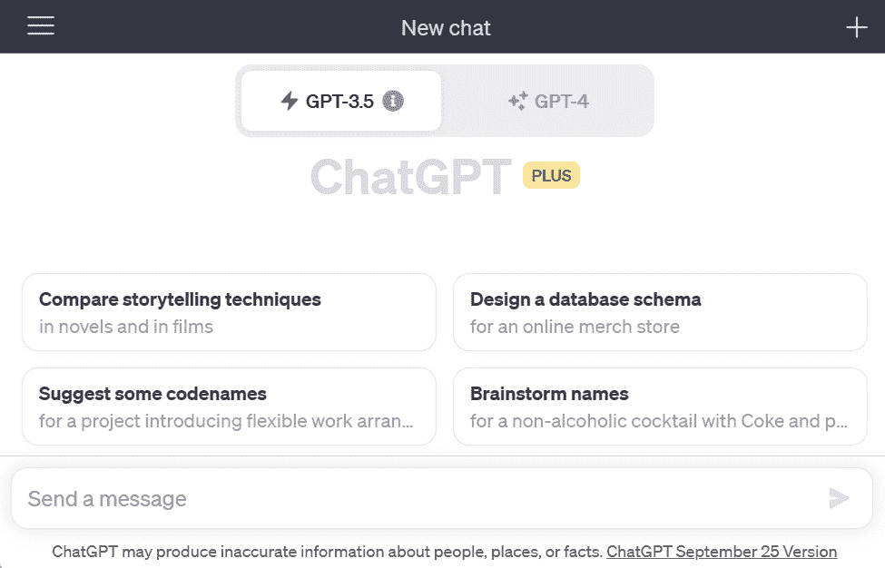
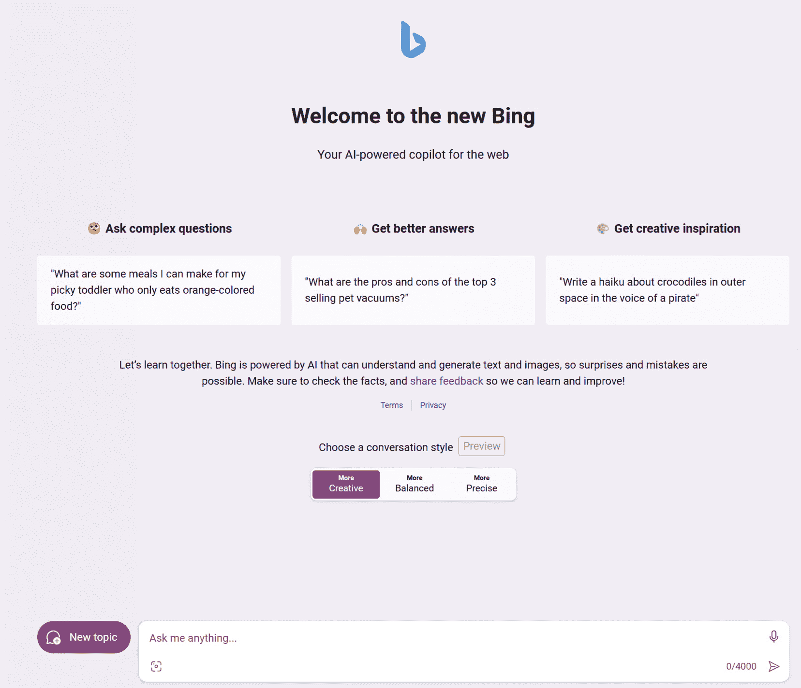
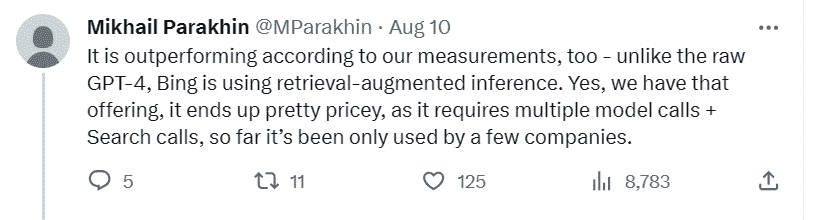
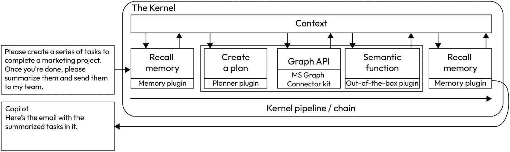

# 第一章：介绍微软语义内核

**生成式人工智能**（**GenAI**）领域正在快速发展，每周都有数十种新产品和服务推出；对于开发者来说，跟上每个服务不断变化的特性和**应用程序编程接口**（**API**）变得越来越困难。在这本书中，你将了解**微软语义内核**，这是一个 API，它将使你作为开发者使用 GenAI 变得更加容易，使你的代码更短、更简单、更易于维护。微软语义内核将允许你作为开发者使用一个单一接口连接到多个不同的 GenAI 提供商。微软使用语义内核开发了其协同飞行员，例如微软 365 协同飞行员。

数亿人已经作为消费者使用 GenAI，你可能就是其中之一。我们将通过展示一些你作为消费者可以使用 GenAI 的例子来开始本章。然后，你将学习如何作为开发者开始使用 GenAI，将 AI 服务添加到你的应用程序中。

在本章中，你将学习使用 GenAI 作为用户和作为开发者的区别，以及如何使用微软语义内核创建和运行一个简单的端到端请求。这将帮助你看到语义内核是多么强大和简单，并将作为所有后续章节的框架。它将使你能够立即开始将 AI 集成到自己的应用程序中。

在本章中，我们将介绍以下主题：

+   理解像 ChatGPT 这样的生成式 AI 应用的基本用法

+   安装微软语义内核

+   配置语义内核以与 AI 服务交互

+   使用语义内核运行简单任务

# 技术要求

要完成本章，你需要拥有你首选的 Python 或 C#开发环境的最新、受支持的版本：

+   对于 Python，最低支持的版本是 Python 3.10，推荐版本是 Python 3.11

+   对于 C#，最低支持的版本是.NET 8

重要提示

示例以 C#和 Python 展示，你可以选择只阅读你偏好的语言的示例。偶尔，某个功能只在一个语言中可用。在这种情况下，我们提供另一种语言中的替代方案，以实现相同的目标。

在本章中，我们将调用 OpenAI 服务。鉴于公司在训练这些大型语言模型（LLMs）上花费的金额，使用这些服务不是免费的也就不足为奇了。你需要一个**OpenAI API**密钥，可以通过**OpenAI**或**微软**直接获得，或者通过**Azure** **OpenAI**服务。

重要：使用 OpenAI 服务不是免费的

本书将运行的示例将调用 OpenAI API。这些调用需要付费订阅，并且每次调用都会产生费用。通常，每个请求的费用很小（例如，GPT-4 每千个标记的费用高达 0.12 美元），但它们可能会累积。此外，请注意，不同模型的价格不同，GPT-3.5 的每标记价格比 GPT-4 低 30 倍。

OpenAI 的定价信息可在此处查看：[`openai.com/pricing`](https://openai.com/pricing)

Azure OpenAI 的定价信息可在此处查看：[`azure.microsoft.com/en-us/pricing/details/cognitive-services/openai-service/`](https://azure.microsoft.com/en-us/pricing/details/cognitive-services/openai-service/)

如果您使用 .NET，本章的代码位于[`github.com/PacktPublishing/Building-AI-Applications-with-Microsoft-Semantic-Kernel/tree/main/dotnet/ch1`](https://github.com/PacktPublishing/Building-AI-Applications-with-Microsoft-Semantic-Kernel/tree/main/dotnet/ch1)。

如果您使用 Python，本章的代码位于[`github.com/PacktPublishing/Building-AI-Applications-with-Microsoft-Semantic-Kernel/tree/main/python/ch1`](https://github.com/PacktPublishing/Building-AI-Applications-with-Microsoft-Semantic-Kernel/tree/main/python/ch1)。

您可以通过访问 GitHub 仓库并使用以下命令安装所需的软件包：`pip install -r requirements.txt`。

## 获取 OpenAI API 密钥

1.  访问 OpenAI 平台网站([`platform.openai.com`](https://platform.openai.com))。

1.  注册新账户或使用现有账户登录。您可以使用电子邮件或现有的 Microsoft、Google 或 Apple 账户。

1.  在左侧侧边栏菜单中选择 **API 密钥**。

1.  在 **项目 API 密钥** 界面中，点击标有 **+ 创建新的密钥** 的按钮（可选，为其命名）。

重要

您必须立即复制并保存密钥。一旦点击 **完成**，它就会消失。如果您没有复制密钥或丢失了密钥，您需要生成一个新的。生成新密钥没有费用。请记住删除旧密钥。

## 获取 Azure OpenAI API 密钥

目前，您需要提交申请以获取访问 Azure OpenAI 服务的权限。要申请访问权限，您需要在[`aka.ms/oai/access`](https://aka.ms/oai/access)填写表格。

获取 Azure OpenAI API 密钥的说明可在[`learn.microsoft.com/en-us/azure/ai-services/openai/how-to/create-resource`](https://learn.microsoft.com/en-us/azure/ai-services/openai/how-to/create-resource)找到。

# 生成式 AI 及其使用方法

生成式 AI 指的是一类人工智能程序，这些程序能够创建与人类生产的内容相似的内容。这些系统使用来自非常大数据集的训练来学习它们的模式、风格和结构。然后，它们可以生成全新的内容，例如合成的图像、音乐和文本。

使用 GenAI 作为消费者或最终用户非常简单，作为一个技术人员，你可能已经这样做了。有许多面向消费者的 AI 产品。最著名的是 OpenAI 的 **ChatGPT**，但还有许多其他产品，每天有数亿用户，例如 Microsoft Copilot、Google Gemini（以前称为 Bard）和 Midjourney。截至 2023 年 10 月，Facebook、WhatsApp 和 Instagram 的母公司 Meta 正在将其 GenAI 服务提供给所有用户，使 GenAI 的日用户数量增加到数十亿。

虽然 GenAI 的概念已经存在了一段时间，但它在 2022 年 11 月 OpenAI 发布 ChatGPT 后获得了大量用户。ChatGPT 的初始版本是基于名为 **生成式预训练转换器**（**GPT**）的 3.5 版本。这个版本在模仿人类写作的任务上比早期版本要好得多。此外，OpenAI 通过添加类似聊天机器人的界面并使其对公众开放，使其易于使用。这个界面被称为 ChatGPT。有了 ChatGPT，用户可以轻松地用自己的话启动任务。在发布时，ChatGPT 是历史上采用速度最快的产品。

GenAI 概念随着 Midjourney 的发布而进一步普及，Midjourney 是一个应用程序，允许用户通过 Discord（一个流行的聊天应用）提交提示来生成高质量的图像，以及 Microsoft Copilot（一个免费的网络应用），它可以通过使用 OpenAI 的 GPT-4（OpenAI 的 GPT 最新版本）生成文本，并通过使用名为 DALL-E 3 的 OpenAI 模型生成图像。

在接下来的小节中，我们将讨论使用 GenAI 应用程序生成文本和图像，并解释使用 ChatGPT 等应用程序与作为开发人员使用 API 生成它们之间的区别。

## 文本生成模型

GenAI 的初始用例是根据一个简单的指令生成文本，这个指令被称为 **prompt**。

大多数基于文本的 GenAI 产品背后的技术被称为 **transformer**，它在 2017 年的论文 *Attention is All you Need* [1] 中被引入。transformer 极大地提高了生成文本的质量，仅在几年内，文本看起来就非常类似于人类生成的文本。transformer 在训练了大量的文档（一个 **语料库**）后，极大地提高了 AI 在短语中猜测被掩盖的单词的能力。在非常大的语料库上训练的模型被称为 **大型语言模型**（**LLMs**）。

如果给 LLMs 一个像“*我去快餐店去 <X>*”这样的短语，它们可以为 *X* 生成好的选项，例如“*吃*”。重复应用 transformer 可以生成连贯的短语甚至故事。下一个迭代可能是“*我去快餐店去吃 <X>*”，返回“*a*”，然后“*我去快餐店去吃 a <X>*”，可能会返回“*burger*”，形成完整的短语“*我去快餐店去吃* *一个汉堡*”。

LLM 模型的性能取决于参数数量，这大致与模型一次可以进行的比较数量、上下文窗口、一次可以处理的文本最大尺寸以及用于训练模型的训练数据成正比，这些数据通常由创建 LLM 的公司保密。

GPT 是由 OpenAI 创建的一个使用 Transformer 的模型，擅长生成文本。GPT 有许多版本：

2018 年 2 月发布的 GPT-1 拥有 1.2 亿个参数和一个 512 个标记的上下文窗口。

2019 年 2 月发布的 GPT-2，参数数量增加到 15 亿，上下文窗口增加到 1024 个标记。到目前为止，尽管它们有时会产生有趣的结果，但这些模型主要被学者们使用。

这种情况在 2020 年 6 月发布的 GPT-3 中发生了变化，它有几个尺寸：小型、中型、大型和超大型。超大型拥有 1750 亿个参数和 2048 个标记的上下文窗口。生成的文本在大多数情况下难以与人类生成的文本区分开来。OpenAI 随后发布了 GPT-3.5，于 2022 年 11 月发布，参数数量仍为 1750 亿，上下文窗口为 4096 个标记（现在已扩展到 16384 个标记），并推出了名为 ChatGPT 的用户界面。

ChatGPT 是一个使用后台 GPT 模型的网页和移动应用程序，允许用户向 GPT 模型提交提示并在线获取响应。它与 GPT-3.5 同时发布，当时是采用率最快的消费产品，不到两个月就达到了一亿用户。

2023 年 2 月，微软发布了 Bing Chat，该产品也使用 OpenAI 的 GPT 模型作为后端，进一步普及了 Transformer 模型和 AI 的使用。最近，微软将其更名为 Microsoft Copilot。

仅仅一个月后，在 2023 年 3 月，OpenAI 发布了 GPT-4 模型，该模型很快就被集成到 ChatGPT 和 Bing 等消费产品的后端。

关于 GPT-4 模型的所有细节尚未向公众发布。已知其上下文窗口可达 32,768 个标记；然而，其参数数量尚未公开，但据估计为 1.8 万亿。

GPT-4 模型在涉及文本生成的类似人类任务方面表现突出。GPT-4 技术报告学术论文 [2] 中展示的基准测试显示了 GPT-3.5 和 GPT-4 在考试中的表现。GPT-4 可以通过许多高中和大学水平的考试。您可以在 [`doi.org/10.48550/arXiv.2303.08774`](https://doi.org/10.48550/arXiv.2303.08774) 阅读这篇论文。

## 理解应用和模型之间的区别

包括你在内的大多数人可能都使用过 GenAI 应用程序，例如 ChatGPT、Microsoft Copilot、Bing Image Creator、Bard（现在更名为 Gemini）或 Midjourney。这些应用程序在其后端使用 GenAI 模型，但它们也添加了用户界面和配置，这些配置限制了并控制了模型的输出。

当你在开发自己的应用程序时，你需要自己完成这些事情。你可能还没有意识到像 Bing 和 ChatGPT 这样的应用程序在幕后执行了多少工作。

当你向应用程序提交提示时，应用程序可能会在你提交的提示中添加几个额外的指令。最典型的是添加限制某些类型输出的指令，例如：“*你的回复不应包含脏话*。”例如，当你向 ChatGPT 这样的应用程序提交“*讲一个笑话*”的提示时，它可能会修改你的提示为“*讲一个笑话。你的回复不应包含脏话*”，并将这个修改后的提示传递给模型。

应用程序还可能添加你已经提交的问题和已经给出的答案的摘要。例如，如果你问，“*巴西里约热内卢在夏天有多热？*”，答案可能是，“*里约热内卢在夏天通常在 90 到 100 华氏度（30-40 摄氏度）之间*。”如果你接着问，“*从纽约到那里的航班有多长？*”，像 ChatGPT 这样的应用程序不会直接将“*从纽约到那里的航班有多长？*”提交给模型，因为答案可能类似于“*我不明白你说的‘那里’是什么意思*。”

解决这个问题的直接方法是将用户输入的每一项内容以及提供的所有答案保存下来，并在每次新的提示中重新提交它们。例如，当用户在询问温度之后提交“*从纽约到那里的航班有多长？*”时，应用程序会在提示前添加之前的问题和答案，实际提交给模型的内容是：“*巴西里约热内卢在夏天有多热？里约热内卢在夏天通常在 90 到 100 华氏度（30-40 摄氏度）之间。从纽约到那里的航班有多长？*”现在，模型知道“*那里*”指的是“*里约热内卢*”，答案可能类似于“*大约* *10 小时*。”

将所有之前的提示和响应附加到每个新提示的后果是，它会在上下文窗口中消耗大量空间。因此，已经开发了一些技术来压缩添加到用户提示中的信息。最简单的技术是只保留早期的用户问题，但不包括应用程序给出的答案。在这种情况下，例如，修改后的提示可能类似于“*之前我说过：‘巴西里约热内卢夏天有多热？’，现在只需回答：‘从纽约到那里的航班有多长？’*”。请注意，提示需要告诉模型只对用户提交的最后一个问题进行响应。

如果您使用消费者应用程序测试您的提示，了解应用程序会修改您的提示将是有意义的，因为您从它们那里获得的输出可能与您直接通过 API（如 Microsoft Semantic Kernel）使用模型时获得的输出大不相同。通常无法知道应用程序是如何修改您的提示的，因为提供商通常不会透露所有他们的技术。

此外，您作为应用程序开发者将要做的大部分工作将是创建与您自己的应用程序相匹配的提示修改。因此，当您的用户提交他们的提示时，您将添加自己的提示修改以确保他们获得适当的结果。修改用户提示的技术被称为**提示工程**，我们将在下一章中简要探讨。

## 使用消费者应用程序生成文本

让我们探索两个最受欢迎的文本生成应用程序：ChatGPT 和 Microsoft Copilot。如果您不熟悉 GenAI 的力量，尝试它们将让您了解它们可以做什么以及它们的强大之处。我们还将简要讨论它们的配置参数和架构，这可以帮助您决定自己应用程序的适当架构。

### OpenAI ChatGPT

如果您从未使用过 GenAI 应用程序，ChatGPT 可能是开始的最佳选择。ChatGPT 的默认后端模型是 GPT 3.5，这是一个快速且非常强大的模型。当 OpenAI 的服务器上有可用容量时，ChatGPT 是免费的。您还可以每月支付 20 美元购买 ChatGPT Plus 订阅，这将使您能够使用他们最强大的模型（目前是 GPT-4），并确保您始终有容量。

要使用 ChatGPT，请访问[`chat.openai.com`](https://chat.openai.com)。

ChatGPT 的界面非常简单。它允许你在顶部选择后端模型，中间提供一些提示建议，底部有一个文本框用于输入提示。它还包括一个通知，指出生成的输出可能包含错误信息：



图 1.1 – 使用 Web 界面向 ChatGPT 提交请求

我将在**发送消息**文本框中提交以下提示：

`纽约市和里约热内卢之间的航班有多长？`

使用 GPT-3.5 模型的 ChatGPT 提供了以下答案：

```py
The flight duration between New York City and Rio de Janeiro can vary depending on several factors, including the specific departure and arrival airports, the flight route, and any layovers or stopovers. On average, a non-stop flight between John F. Kennedy International Airport (JFK) in New York City and Rio de Janeiro-Galeão International Airport (GIG) in Rio de Janeiro takes approximately 9 to 10 hours.
Keep in mind that flight durations can vary, so it's always a good idea to check with airlines for the most up-to-date and accurate flight schedules and durations for your specific travel dates and routes. Additionally, if you have layovers or stopovers, the total travel time will be longer.
```

### 微软 Copilot

另一个免费的选择是微软 Copilot，之前称为 Bing Chat。它可以从[www.bing.com](http://www.bing.com)页面访问，但也可以直接从[`www.bing.com/chat`](https://www.bing.com/chat)访问。

微软 Copilot 的用户界面类似于 ChatGPT 的界面。屏幕中间有一些提示建议，以及一个文本框，用户可以在底部输入提示。微软 Copilot 的 UI 还显示了一些在使用模型编程时相关的选项。

第一是对话风格。Copilot 提供了更创意、更平衡或更精确的选项。这与将传递给底层模型的温度参数相关。我们将在*第三章*中讨论温度参数，但简而言之，温度参数决定了 LLM 选择的单词有多常见。

微软 Copilot 的参数

虽然微软 Copilot 没有透露确切的配置值（例如`0`和`0.2`），这导致对下一个词的猜测非常安全。对于`0.4`和`0.6`），结果*主要*是安全的猜测，但偶尔会有一些罕见的猜测。`0.8`。大多数猜测仍然会是安全的，但会有更多罕见的单词。由于 LLM 按顺序猜测短语中的单词，先前的猜测会影响后续的猜测。在生成短语时，每个罕见的单词都会使整个短语更加不寻常。

UI 中另一个有趣的组件是文本框的右下角显示了已经输入了多少个字符，这让你对将消耗多少底层模型的上下文窗口有一个大致的了解。请注意，你无法确切知道你会消耗多少，因为 Copilot 应用程序会修改你的提示。



图 1.2 – 微软 Copilot 用户界面

2023 年 8 月 11 日，必应前 CEO 米哈伊尔·帕拉欣在 X/Twitter 上发帖称，微软 Copilot 的表现优于 GPT-4，因为它使用了**检索增强**的**推理**([`x.com/MParakhin/status/1689824478602424320?s=20`](https://x.com/MParakhin/status/1689824478602424320?s=20))：



图 1.3 – 必应前 CEO 关于微软 Copilot 使用 RAG 的帖子

我们将在第六章和第七章中更详细地讨论检索增强推理，但就我们当前的目的而言，这意味着微软 Co-Pilot 不会直接将您的提示提交给模型。必应尚未公开其架构的细节，但很可能是必应修改了您的提示（在 UI 中的**搜索中**显示了修改后的提示），使用修改后的提示进行常规的必应查询，收集该查询的结果，将它们连接起来，并将连接的结果作为大提示提交给 GPT 模型，要求它将结果组合起来输出一个连贯的答案。

使用检索增强允许必应更容易地添加引用和广告。在下图中，请注意我的提示`How long is the flight between New York City and Rio de Janeiro?`被 Co-Pilot 修改为`Searching for flight duration New York City Rio de Janeiro`：


图 1.4 – 使用微软 Co-Pilot 的示例

如您所见，您可以使用 ChatGPT 和 Microsoft Copilot 等消费级应用程序来熟悉 LLMs 在 GenAI 中的应用，并对您的提示进行一些初步测试，但请注意，您提交的提示可能会被应用程序大量修改，并且从底层模型获得的响应可能与您实际创建自己的应用程序时获得的响应非常不同。

## 生成图像

除了生成文本，AI 还可以根据文本提示生成图像。用于从提示生成图像的过程细节超出了本书的范围，但我们将提供一个简要概述。图像生成领域的主要模型包括 Midjourney，它可通过 Discord 中的 Midjourney 机器人访问；开源的 Stable Diffusion，它也被 OpenAI 的 DALL-E 2 使用；以及 2023 年 10 月发布的 DALL-E 3，可通过 Bing Chat（现在称为 Microsoft Copilot）和 ChatGPT 应用程序访问。

在撰写本文时，微软语义内核仅支持 DALL-E；因此，这是我们将要探讨的示例。DALL-E 3 可通过 Microsoft Copilot 应用程序免费使用，但有一些限制。

如果您正在使用前面示例中的 Microsoft Copilot 应用程序，请确保通过点击文本框左侧的**新主题**按钮重置您的聊天历史。要生成图像，请确保您的对话风格设置为**更富有创意**，因为图像生成仅在创意模式下工作：


图 1.5 – 选择对话风格

我将使用以下提示：

`create a photorealistic image of a salt-and-pepper standard schnauzer on a street corner holding a sign "Will do tricks for cheese."`

微软 Co-Pilot 将调用 DALL-E 3 并根据我的要求生成四幅图像：


图 1.6 – 由 Microsoft Copilot 生成的图像

DALL-E 3 比其他图像生成模型更好的一个方面是它可以正确地将文本添加到图像中。DALL-E 的早期版本和大多数其他模型都不能正确拼写单词。

图片以网格形式展示，总分辨率为 1024 x 1024 像素（每张图片为 512 x 512 像素）。如果您选择一张图片，该图片将被放大到 1024 x 1024 像素的分辨率。在我的情况下，我将选择左下角的图片。您可以在下一张图中看到最终结果：


图 1.7 – 由 Microsoft Copilot 生成的高分辨率图像

如您所见，生成式 AI 也可以用来生成图像，现在您已经了解到它有多么强大。我们将在*第四章*中探讨如何使用 Microsoft 语义内核生成图像。在达到那里之前，还有很多东西可以探索，我们将从对 Microsoft 语义内核的快速全面浏览开始。

# Microsoft 语义内核

Microsoft 语义内核([`github.com/microsoft/semantic-kernel`](https://github.com/microsoft/semantic-kernel))是一个轻量级的开源**软件开发工具包**（SDK），它使得使用 C#和 Python 开发的应用程序与 AI 服务（如通过 OpenAI、Azure OpenAI 和 Hugging Face 提供的 AI 服务）交互变得更加容易。语义内核可以接收来自您应用程序的请求并将它们路由到不同的 AI 服务。此外，如果您通过添加自己的函数扩展了语义内核的功能，我们将在*第三章*中探讨这一点，语义内核可以自动发现哪些函数需要使用以及使用顺序，以满足请求。请求可以直接来自用户并通过您的应用程序直接传递，或者您的应用程序可以在将其发送到语义内核之前修改和丰富用户请求。

它最初是为了为不同版本的 Microsoft Copilot 提供动力，例如 Microsoft 365 Copilot 和 Bing Copilot，然后作为开源软件包发布给开发者社区。开发者可以使用语义内核创建插件，这些插件可以使用 AI 服务执行复杂操作，并且只需几行代码就可以组合这些插件。

此外，Semantic Kernel 可以通过使用 **规划器** 自动编排不同的插件。使用规划器，用户可以让您的应用程序实现一个复杂的目标。例如，如果您有一个识别图片中是哪种动物的功能，以及另一个讲打趣笑话的功能，您的用户可以说，“*告诉我一个关于这个 URL 中图片中动物的打趣笑话*”，规划器将自动理解它需要首先调用识别功能，然后是“讲笑话”功能。Semantic Kernel 将自动搜索和组合您的插件以实现该目标并创建一个计划。然后，Semantic Kernel 将执行该计划并向用户提供响应：



图 1.8 – Microsoft Semantic Kernel 的结构

在接下来的章节中，我们将快速浏览 Semantic Kernel 的端到端流程，包括 *图 1**.8* 中的大多数步骤。我们将发送请求，创建计划，调用 API，调用本地函数和语义函数。这些组合起来将为用户提供答案。首先，我们将手动逐步完成这个过程，然后我们将使用规划器一次性完成所有操作。您将看到 Semantic Kernel 只需少量代码就能多么强大。

在我们开始使用 Microsoft Semantic Kernel 进行实验之前，我们需要安装它。

## 安装 Microsoft Semantic Kernel 包

要使用 Microsoft Semantic Kernel，您必须在您的环境中安装它。请注意，Microsoft Semantic Kernel 仍在积极开发中，不同版本之间可能存在差异。

### 在 Python 中安装 Microsoft Semantic Kernel

要在 Python 中安装 Microsoft Semantic Kernel，请在一个新目录中开始，并按照以下步骤操作：

1.  使用 `venv` 创建一个新的虚拟环境：

    ```py
    python -m venv .venv
    ```

1.  激活您刚刚创建的新环境。这将确保 Microsoft Semantic Kernel 只为此目录安装：

    +   在 PowerShell 中，使用以下命令：

        ```py
        pip:

        ```

        pip install semantic-kernel

        ```py

        ```

### 在 C# 中安装 Microsoft Semantic Kernel

要在 C# 中安装 Microsoft Semantic Kernel，请按照以下步骤操作：

1.  创建一个以 .NET 8 为目标的新项目：

    ```py
    dotnet new console -o ch1 -f net8.0
    ```

1.  切换到应用程序目录：

    ```py
    Microsoft.SemanticKernel NuGet package:

    ```

    dotnet add package Microsoft.SemanticKernel --prerelease

    ```py

    The kernel object itself is very lightweight. It is simply a repository of all the services and plugins that are connected to your application. Most applications start by instantiating an empty kernel and then adding services and functions to it.
    ```

使用以下简单指令运行程序以确保安装成功：

+   在 Python 中实例化内核：

    ```py
    import semantic_kernel as sk
    kernel = sk.Kernel()
    ```

+   在 C# 中实例化内核：

    ```py
    using Microsoft.SemanticKernel;
    Kernel kernel = Kernel.CreateBuilder().Build()
    ```

现在我们已经将 Semantic Kernel 安装到您的环境中，现在我们准备将其连接到 AI 服务并开始使用它们。

# 使用 Semantic Kernel 连接到 AI 服务

要完成本节，您必须有一个 API 密钥。获取 API 密钥的过程在本章开头已描述。

在接下来的子章节中，我们只将连接到 OpenAI 的文本模型 GPT-3.5 和 GPT-4。如果您通过 Azure 访问 OpenAI 模型，您需要对您的代码进行一些小的修改。

虽然连接到单个模型会更简单，但我们已经展示了简单但强大的 Microsoft Semantic Kernel 功能：我们将连接到两个不同的模型，并使用更简单但成本更低的模型 GPT-3.5 运行一个简单的提示，并在更先进但成本更高的模型 GPT-4 上运行一个更复杂的提示。

向更简单的模型发送更简单的请求，向更复杂的模型发送更复杂的请求，这是您在创建自己的应用程序时经常会做的事情。这种方法被称为 **LLM 级联**，它在 FrugalGPT [3] 论文中被普及。它可以带来实质性的成本节约。

重要：顺序很重要

加载您的服务的顺序很重要。对于 Python（*在 *使用 Python 连接到 OpenAI 服务* 部分的 *步骤 3* 中）和 C#（*在 *使用 C# 连接到 OpenAI 服务* 部分的 *步骤 4* 中），我们首先将 GPT-3.5 模型加载到内核中，然后加载 GPT-4 模型。这将使 GPT-3.5 成为默认模型。稍后，我们将指定哪个模型将用于哪个命令；如果没有指定，则使用 GPT-3.5。如果您首先加载 GPT-4，您将承担更多费用。

我们假设您正在使用 OpenAI 服务而不是 Azure OpenAI 服务。您将需要您的 OpenAI 密钥和组织 ID，这些可以在 [`platform.openai.com/account/api-keys`](https://platform.openai.com/account/api-keys) 的左侧菜单下的 **设置** 中找到。所有示例都适用于 Azure OpenAI；您只需使用 Azure 连接信息而不是 OpenAI 连接信息。

## 使用 Python 连接到 OpenAI 服务

本节假设您正在使用 OpenAI 服务。在连接到 OpenAI 服务之前，在 ch1 目录下创建一个 .env 文件，其中包含您的 OpenAI 密钥和您的 OpenAI 组织 ID。组织 ID 可以在 [`platform.openai.com/account/api-keys`](https://platform.openai.com/account/api-keys) 的左侧菜单下的 **设置** 中找到。

您的 .env 文件应如下所示，以下示例中的 x 应由适当的值替换：

```py
OPENAI_API_KEY="sk-xxxxxxxxxxxxxxxxxxxxxxxxxxxxxxxxxxxxxx"
OPENAI_ORG_ID="org-xxxxxxxxxxxxxxxxxxxxxxxx"
```

要使用 Python 连接到 OpenAI 服务，请执行以下步骤：

1.  加载一个空内核：

    ```py
    import semantic_kernel as sk
    kernel = sk.Kernel()
    ```

1.  使用 `semantic_kernel_utils.settings` 包中的 `openai_settings_from_dot_env` 方法将您的 API 密钥和组织 ID 加载到变量中：

    ```py
    from semantic_kernel.utils.settings import openai_settings_from_dot_env
    api_key, org_id = openai_settings_from_dot_env()
    ```

1.  使用 `OpenAIChatCompletion` 方法创建到聊天服务的连接：

    ```py
    from semantic_kernel.connectors.ai.open_ai import OpenAIChatCompletion
    gpt35 = OpenAIChatCompletion("gpt-3.5-turbo", api_key, org_id, service_id = "gpt35")
    gpt4 = OpenAIChatCompletion("gpt-4", api_key, org_id, service_id = "gpt4")
    kernel.add_service(gpt35)
    kernel.add_service(gpt4)
    ```

    如果您通过 Azure 使用 OpenAI，而不是使用 `OpenAIChatCompletion`，则需要使用 `AzureOpenAIChatCompletion`，如下所示：

    ```py
    kernel.add_service(
        AzureChatCompletion(
            service_id=service_id,
            deployment_name=deployment_name,
            endpoint=endpoint,
            api_key=api_key,
        ),
    )
    ```

您的 Semantic Kernel 现在已准备好进行调用，我们将在 *运行简单提示* 部分中这样做。

## 使用 C# 连接到 OpenAI 服务

在连接到 OpenAI 服务之前，在 `ch1/config` 目录下创建一个 `config.json` 文件，其中包含您的 OpenAI 密钥和您的 OpenAI 组织 ID。

为了避免在代码中保留密钥，我们将从配置文件中加载您的密钥。您的`config/settings.json`文件应类似于以下示例，其中`apiKey`和`orgId`字段包含适当的值（`orgId`是可选的。如果您没有`orgId`，请删除该字段。空字符串不起作用）：

```py
{
    "apiKey": "... your API key here ...",
    "orgId": "... your Organization ID here ..."
}
```

要在 C#中连接到 OpenAI 服务，请执行以下步骤：

1.  由于我们将多次重用 API 密钥和组织 ID，我们在`Settings.cs`中创建一个类来加载它们：

    ```py
    using System.Text.Json;
    public static class Settings {
      public static (string apiKey, string? orgId)
            LoadFromFile(string configFile = "config/settings.json")
        {
            if (!File.Exists(configFile))
            {
                Console.WriteLine("Configuration not found: " + configFile);
                throw new Exception("Configuration not found");
            }
            try
            {
                var config = JsonSerializer.Deserialize<Dictionary>(File.ReadAllText(configFile));
                // check whether config is null
                if (config == null)
                {
                    Console.WriteLine("Configuration is null");
                    throw new Exception("Configuration is null");
                }
                string apiKey = config["apiKey"];
                string? orgId;
                // check whether orgId is in the file
                if (!config.ContainsKey("orgId"))
                {
                    orgId = null;
                }
                else
                {
                    orgId = config["orgId"];
                }
                return (apiKey, orgId);
            }
            catch (Exception e)
            {
                Console.WriteLine("Something went wrong: " + e.Message);
                return ("", "");
            }
        }
    }
    ```

    上述代码是读取 JSON 文件并将其属性加载到 C#变量中的样板代码。我们正在寻找两个属性：`apiKey`和`orgID`。

1.  从`config/settings.json`加载设置。我们将创建一个类来简化这个过程，因为我们将会经常这样做。该类非常简单。它首先检查配置文件是否存在，如果存在，则类使用 JSON 反序列化器将内容加载到`apiKey`和`orgId`变量中：

    ```py
    using Microsoft.SemanticKernel;
    var (apiKey, orgId) = Settings.LoadFromFile();
    ```

1.  接下来，使用`OpenAIChatCompletion`方法创建到聊天服务的连接。请注意，我们使用`serviceID`来为模型提供一个快捷名称。

    在您加载组件后，使用`Build`方法构建内核：

    ```py
    Kernel kernel = Kernel.CreateBuilder()
            .AddOpenAIChatCompletion("gpt-3.5-turbo", apiKey, orgId, serviceId: "gpt3")
            .AddOpenAIChatCompletion("gpt-4", apiKey, orgId, serviceId: "gpt4")
                            .Build();
    ```

    如果您通过 Azure 使用 OpenAI，而不是使用`AddOpenAIChatCompletion`，则需要使用`AddAzureOpenAIChatCompletion`，如下所示：

    ```py
    Kernel kernel = Kernel.CreateBuilder()
                          .AddAzureOpenAIChatCompletion(modelId, endpoint, apiKey)
                          .Build();
    ```

您的 Semantic Kernel 现在已准备好进行调用，我们将在下一节中这样做。

# 运行一个简单的提示

本节假设您已完成前面的部分，并在此基础上构建相同的代码。到目前为止，您应该已经实例化了 Semantic Kernel，并按顺序将其中的 GPT-3.5 和 GPT-4 服务加载进去。当您提交提示时，它将默认使用第一个服务，并在 GPT-3.5 上运行提示。

当我们将提示发送到服务时，我们还会发送一个名为`0.0`到`1.0`的参数，它控制响应的随机性。我们将在后面的章节中更详细地解释温度参数。温度参数为`0.8`会产生更具创造性的响应，而温度参数为`0.2`会产生更精确的响应。

要将提示发送到服务，我们将使用名为`create_semantic_function`的方法。现在，您不必担心什么是语义函数。我们将在*使用生成式 AI 解决简单* *问题*部分中解释它。

## 在 Python 中运行一个简单的提示

要在 Python 中运行提示，请按照以下步骤操作：

1.  在一个字符串变量中加载提示：

    ```py
    prompt = "Finish the following knock-knock joke. Knock, knock. Who's there? Dishes. Dishes who?"
    ```

1.  通过使用内核的`add_function`方法创建一个函数。`function_name`和`plugin_name`参数是必需的，但它们不会被使用，因此您可以给函数和插件取任何您想要的名称：

    ```py
    prompt_function = kernel.add_function(function_name="ex01", plugin_name="sample", prompt=prompt)
    ```

1.  调用函数。请注意，所有调用方法都是异步的，因此您需要使用`await`来等待它们的返回：

    ```py
    response = await kernel.invoke(prompt_function, request=prompt)
    ```

1.  打印响应：

    ```py
    print(response)
    ```

响应是随机的。以下是一个可能的响应示例：

```py
Dishes the police, open up!
```

## 在 C#中运行一个简单的提示

要在 C#中运行提示，请按照以下步骤操作：

1.  在一个字符串变量中加载提示：

    ```py
    string prompt = "Finish the following knock-knock joke. Knock, knock. Who's there? Dishes. Dishes who?";
    ```

1.  使用`Kernel.InvokePromptAsync`函数调用提示：

    ```py
    var joke = await kernel.InvokePromptAsync(prompt);
    ```

1.  打印响应：

    ```py
    Console.Write(joke)
    ```

响应是非确定性的。以下是一个可能的响应：

```py
Dishes a very bad joke, but I couldn't resist!
```

我们现在已连接到 AI 服务，向其提交了一个提示，并获得了响应。我们现在可以开始创建我们自己的函数。

# 使用生成式 AI 解决简单问题

Microsoft Semantic Kernel 区分可以加载到其中的两种类型的函数：**语义函数**和**原生函数**。

语义函数是与 AI 服务（通常是 LLMs）连接以执行任务的函数。该服务不是你代码库的一部分。原生函数是用你的应用程序语言编写的常规函数。

将原生函数与你的代码中的任何其他常规函数区分开来的原因是，原生函数将具有额外的属性，这些属性将告诉内核它做什么。当你将原生函数加载到内核中时，你可以在结合原生和语义函数的链中使用它。此外，Semantic Kernel 规划器可以在创建计划以实现用户目标时使用该函数。

## 创建语义函数

我们已经在上一节中创建了一个语义函数（`knock`）。现在，我们将向其中添加一个参数。所有语义函数的默认参数称为`{{$input}}`。

### 修改后的 Python 语义函数

我们将对之前的代码进行一些小的修改，以允许语义函数接收一个参数。同样，以下代码假设你已经实例化了一个内核并连接到了至少一个服务：

```py
    from semantic_kernel.functions.kernel_arguments import KernelArguments
    args = KernelArguments(input="Boo")
    response = await kernel.invoke(prompt_function, request=prompt, arguments=args)
    print(response)
```

与之前的代码相比，唯一的区别是现在我们有一个变量`{{$input}}`，并且我们使用参数字符串`"Boo"`来调用函数。为了添加变量，我们需要从`semantic_kernel_functions.kernel_arguments`包中导入`KernelArguments`类，并创建一个具有我们想要值的对象实例。

响应是非确定性的。以下是一个可能的响应：

```py
Don't cry, it's just a joke!
```

### 修改后的 C#语义函数

要在 C#中创建一个函数，我们将使用`CreateFunctionFromPrompt`内核方法，并使用`KernelArguments`对象来添加参数：

```py
string prompt = "Finish the following knock-knock joke. Knock, knock. Who's there? {{$input}}, {{$input}} who?";
KernelFunction jokeFunction = kernel.CreateFunctionFromPrompt(prompt);
var arguments = new KernelArguments() { ["input"] = "Boo" };
var joke = await kernel.InvokeAsync(jokeFunction, arguments);
Console.WriteLine(joke);
```

在这里，与之前的代码相比，唯一的区别是现在我们有一个变量`{{$input}}`，并且我们使用参数字符串`"Boo"`来调用函数。

响应是非确定性的。以下是一个可能的响应：

```py
Don't cry, it's just a joke!
```

## 创建原生函数

原生函数是在与你的应用程序相同的语言中创建的。例如，如果你正在用 Python 编写代码，原生函数可以用 Python 编写。

虽然你可以直接调用原生函数而不将其加载到内核中，但加载可以使它对规划器可用，这一点我们将在本章的最后部分看到。

我们将在 *第三章* 中更详细地探讨原生函数，但就目前而言，让我们在内核中创建和加载一个简单的原生函数。

我们将要创建的原生函数为笑话选择一个主题。目前，主题有 `Boo`、`Dishes`、`Art`、`Needle`、`Tank` 和 `Police`，函数简单地随机返回这些主题中的一个。

### 在 Python 中创建原生函数

在 Python 中，原生函数需要位于一个类内部。这个类曾经被称为 **技能**，在某些地方，这个名字仍然在使用。这个名字最近已改为 **插件**。插件（以前称为技能）只是一个函数集合。你无法在同一个技能中混合原生和语义函数。

我们将把我们的类命名为 `ShowManager`。

要创建原生函数，你将使用 `@kernel_function` 装饰器。装饰器必须包含 `description` 和 `name` 字段。要添加装饰器，你必须从 `semantic_kernel.functions.kernel_function_decorator` 包中导入 `kernel_function`。

函数体紧随装饰器之后。在我们的例子中，我们只是将有一个主题列表，并使用 `random.choice` 函数从列表中返回一个随机元素：

```py
import random
class ShowManager():
    @kernel_function(
    description="Randomly choose among a theme for a joke",
    name="random_theme"
  )
  def random_theme(self) -> str:
      themes = ["Boo", "Dishes", "Art",
              "Needle", "Tank", "Police"]
      theme = random.choice(themes)
      return theme
```

然后，为了将插件及其所有功能加载到内核中，我们使用内核的 `add_plugin` 方法。当你添加插件时，你需要给它一个名字：

```py
theme_choice = kernel.add_plugin(ShowManager(), "ShowManager")
```

要从插件中调用原生函数，只需在括号内放置函数名，如下所示：

```py
    response = await kernel.invoke(theme_choice["random_theme"])
    print(response)
```

函数不是确定的，但可能的结果可能是：

```py
Tank
```

### 在 C# 中创建原生函数

在 C# 中，原生函数需要位于一个类内部。这个类曾经被称为技能，这个名字在某些地方仍然在使用；例如，在 SDK 中，我们需要导入 `Microsoft.SemanticKernel.SkillDefinition`。技能最近已被重命名为插件。插件只是一个函数集合。你无法在同一个技能中混合原生和语义函数。

我们将把我们的类命名为 `ShowManager`。

要创建原生函数，你将使用 `[KernelFunction]` 装饰器。装饰器必须包含 `Description`。函数体紧随装饰器之后。在我们的例子中，我们只是将有一个主题列表，并使用 `Random().Next` 方法从列表中返回一个随机元素。我们将我们的类命名为 `ShowManager`，我们的函数命名为 `RandomTheme`：

```py
using System.ComponentModel;
using Microsoft.SemanticKernel;
namespace Plugins;
public class ShowManager
{
    [KernelFunction, Description("Take the square root of a number")]
    public string RandomTheme()
    {
        var list = new List { "boo", "dishes", "art", "needle", "tank", "police"};
        return list[new Random().Next(0, list.Count)];
    }
}
```

然后，为了将插件及其所有功能加载到内核中，我们使用 `ImportPluginFromObject` 方法：

```py
string prompt = "Finish the following knock-knock joke. Knock, knock. Who's there? {{$input}}, {{$input}} who?";
KernelFunction jokeFunction = kernel.CreateFunctionFromPrompt(prompt);
var showManagerPlugin = kernel.ImportPluginFromObject(new Plugins.ShowManager());
var joke = await kernel.InvokeAsync(jokeFunction, arguments);
Console.WriteLine(joke);
```

要从插件中调用原生函数，只需在括号内放置函数名。你可以通过使用 `KernelArguments` 类来传递参数，如下所示：

```py
var result = await kernel.InvokeAsync(showManagerPlugin["RandomTheme"]);
Console.WriteLine("I will tell a joke about " + result);
var arguments = new KernelArguments() { ["input"] = result };
```

函数不是确定的，但可能的结果可能是以下内容：

```py
I will tell a joke about art
```

现在你可以从你的代码中运行简单的提示，让我们学习如何通过使用插件将提示配置与调用它的代码分开。

# 插件

微软语义内核的一个最大优势是您可以创建与语言无关的语义插件。语义插件是语义函数的集合，可以导入到内核中。创建语义插件允许您将代码与 AI 函数分离，这使得您的应用程序更容易维护。它还允许其他人处理提示，使得实现提示工程更容易，这将在*第二章*中探讨。

每个函数都由一个包含两个文本文件的目录定义：`config.json`，其中包含语义函数的配置，以及`skprompt.txt`，其中包含其提示。

语义函数的配置包括要使用的首选引擎、温度参数以及语义函数做什么以及其输入的描述。

文本文件包含将发送到 AI 服务以生成响应的提示。

在本节中，我们将定义一个包含两个语义函数的插件。第一个语义函数是一个熟悉的函数：knock-knock 笑话生成器。第二个函数是接收一个笑话作为输入并尝试解释为什么它好笑的函数。由于这是一个更复杂的任务，我们将使用 GPT-4 来完成。

```py
Let's take a look at the directory structure:└───plugins
    └───jokes
        |───knock_knock_joke
        |    ├───config.json
        |    └───skprompt.txt
        ├───explain_joke
             ├───config.json
             └───skprompt.txt
```

我们现在将看到如何创建`config.json`和`skprompt.txt`文件以及如何将插件加载到我们的程序中。

## knock-knock 笑话功能的 config.json 文件

以下配置文件显示了为生成 knock-knock 笑话的语义函数的可能配置：

```py
{
    "schema": 1,
    "type": "completion",
    "description": "Generates a knock-knock joke based on user input",
    "default_services": [
        "gpt35",
        "gpt4"
    ],
    "execution_settings": {
        "default": {
            "temperature": 0.8,
            "number_of_responses": 1,
            "top_p": 1,
            "max_tokens": 4000,
            "presence_penalty": 0.0,
            "frequency_penalty": 0.0
        }
    },
    "input_variables": [
        {
            "name": "input",
            "description": "The topic that the joke should be written about",
            "required": true
        }
    ]
}
```

`default_services`属性是一个首选引擎的数组（按顺序）。由于 knock-knock 笑话很简单，我们将使用 GPT-3.5。前一个文件中的所有参数都是必需的。在未来的章节中，我们将详细解释每个参数，但现在，您只需复制它们即可。

`description`字段很重要，因为它可以在稍后的规划器中使用，这将在本章的最后部分进行解释。

## knock-knock 笑话功能的 skprompt.txt 文件

由于我们稍后要解释这个笑话，我们需要我们的应用程序返回整个笑话，而不仅仅是结尾。这将使我们能够保存整个笑话并将其作为参数传递给解释笑话函数。为此，我们需要修改提示。您可以在以下位置看到最终的提示：

```py
You are given a joke with the following setup:
Knock, knock!
Who's there?
{{$input}}!
{{$input}} who?
Repeat the whole setup and finish the joke with a funny punchline.
```

## 解释笑话的语义功能的 config.json 文件

您现在应该为解释笑话的函数创建一个文件。由于这是一个更复杂的任务，我们应该将`default_services`设置为使用 GPT-4。

此文件几乎与用于 knock-knock 笑话功能的`config.json`文件完全相同。我们只做了三项更改：

+   描述

+   `input`变量的描述

+   `default_services`字段

这可以在以下内容中看到：

```py
{
    "schema": 1,
    "type": "completion",
    "description": "Given a joke, explain why it is funny",
    "default_services": [
        "gpt4"
    ],
    "execution_settings": {
        "default": {
            "temperature": 0.8,
            "number_of_responses": 1,
            "top_p": 1,
            "max_tokens": 4000,
            "presence_penalty": 0.0,
            "frequency_penalty": 0.0
        }
    },
    "input_variables": [
        {
            "name": "input",
            "description": "The joke that we want explained",
            "required": true
        }
    ]
}
```

## 解释笑话功能的 skprompt.txt 文件

解释笑话的函数提示非常简单：

```py
You are given the following joke:
{{$input}}
First, tell the joke.
Then, explain the joke.
```

## 将插件从目录加载到内核中

现在语义函数已定义在文本文件中，您可以通过指向它们所在的目录来将它们加载到内核中。这也可以帮助您将提示工程函数与开发函数分开。提示工程师可以在不接触您应用程序代码的情况下与文本文件一起工作。

### 使用 Python 加载插件

您可以使用内核对象的 `add_plugin` 方法加载插件目录中的所有函数。只需将第一个参数设置为 `None`，并将 `parent_directory` 参数设置为插件所在的目录：

```py
jokes_plugin = kernel.add_plugin(None, parent_directory="../../plugins", plugin_name="jokes")
```

您可以通过将函数名放在括号内的方式，像调用原生插件中的函数一样调用这些函数：

```py
knock_joke = await kernel.invoke(jokes_plugin["knock_knock_joke"], KernelArguments(input=theme))
print(knock_joke)
```

前一个调用的结果是不可预测的。以下是一个示例结果：

```py
Knock, knock!
Who's there?
Dishes!
Dishes who?
Dishes the police, open up, we've got some dirty plates to wash!
```

我们可以将前一个调用的结果传递给 `explain_joke` 函数：

```py
explanation = await kernel.invoke(jokes_plugin["explain_joke"], KernelArguments(input=knock_joke))
print(explanation)
```

请记住，此函数配置为使用 GPT-4。此函数的结果是不可预测的。以下是一个示例结果：

```py
This joke is funny because it plays off the expectation set by the traditional "knock, knock" joke format. Typically, the person responding sets up a pun or a simple joke with their question ("...who?"), but instead, the punchline in this joke is a whimsical and unexpected twist: the police are here not to arrest someone, but to wash dirty plates. This absurdity creates humor. Also, the word 'dishes' is used in a punning manner to sound like 'this is'.
```

### 使用 C# 加载插件

您可以加载插件目录中的所有函数。首先，我们获取目录的路径（您的路径可能不同）：

```py
var pluginsDirectory = Path.Combine(System.IO.Directory.GetCurrentDirectory(),
        "..", "..", "..", "plugins", "jokes");
```

然后，我们使用 `ImportPluginFromPromptDirectory` 将函数加载到一个变量中。结果是函数的集合。您可以通过在括号内引用它们来访问它们：

```py
var jokesPlugin = kernel.ImportPluginFromPromptDirectory(pluginsDirectory, "jokes");
```

最后一步是调用函数。要调用它，我们使用内核对象的 `InvokeAsync` 方法。我们再次将参数通过 `KernelArguments` 类传递：

```py
var result = await kernel.InvokeAsync(jokesPlugin["knock_knock_joke"], new KernelArguments() {["input"] = theme.ToString()});)
```

前一个调用的结果是不可预测的。以下是一个示例结果：

```py
Knock, knock!
Who's there?
Dishes!
Dishes who?
Dishes the best joke you've heard in a while!
```

要获取解释，我们可以将前一个调用的结果传递给 `explain_joke` 函数：

```py
var explanation = await kernel.InvokeAsync(jokesPlugin["explain_joke"], new KernelArguments() {["input"] = result});
Console.WriteLine(explanation);
```

以下是一个示例结果：

```py
Knock, knock!
Who's there?
Dishes!
Dishes who?
Dishes the best joke you've heard in a while!
Now, let's break down the joke:
The joke is a play on words and relies on a pun. The setup follows the classic knock, knock joke format, with the person telling the joke pretending to be at the door. In this case, they say "Dishes" when asked who's there.
Now, the pun comes into play when the second person asks "Dishes who?" Here, the word "Dishes" sounds similar to the phrase "This is." So, it can be interpreted as the person saying "This is the best joke you've heard in a while!"
The punchline subverts the expectation of a traditional knock, knock joke response, leading to a humorous twist. It plays on the double meaning of the word "Dishes" and brings humor through wordplay and cleverness.
```

现在您已经看到了如何创建和调用插件的一个函数，我们将学习如何使用规划器从不同的插件中调用多个函数。

# 使用规划器运行多步骤任务

您不必自己调用函数，可以让 Microsoft Semantic Kernel 为您选择函数。这可以使您的代码更加简单，并让您的用户能够以您未曾考虑过的方式组合您的代码。

目前，这看起来可能不太有用，因为我们只有少数几个函数和插件。然而，在一个大型应用程序中，例如 Microsoft Office，您可能有数百甚至数千个插件，并且您的用户可能希望以您目前无法想象的方式将它们结合起来。例如，您可能正在创建一个辅助程序，帮助用户在了解某个主题时更加高效，因此您编写了一个从网络上下载该主题最新新闻的函数。您也可能已经独立创建了一个向用户解释文本的函数，以便用户可以粘贴内容以了解更多信息。用户可能会决定将它们两者结合起来，例如“*下载新闻并为我撰写解释它们的文章*”，这是您从未想过并且没有添加到代码中的事情。语义内核将理解它可以按顺序调用您编写的两个函数来完成该任务。

当您允许用户请求他们自己的任务时，他们会使用自然语言，您可以让语义内核检查所有加载到其中的函数，并使用规划器来决定处理用户请求的最佳方式。

目前，我们只展示使用规划器的快速示例，但我们将更深入地探讨这个主题，见*第五章*。规划器仍在积极开发中，随着时间的推移可能会有所变化。目前，预计语义内核将有两个规划器：适用于 Python 和 C#的**函数调用逐步规划器**，以及仅适用于 C#的**Handlebars 规划器**（在撰写本文时）。

尽管以下示例非常简单，并且两个规划器表现相同，但我们将展示如何使用 Python 的逐步规划器（函数调用逐步规划器）和 C#的 Handlebars 规划器。

## 使用 Python 调用函数调用逐步规划器

要使用逐步规划器，我们首先创建一个`FunctionCallingStepwisePlanner`类的对象并向其发出请求。在我们的例子中，我们将要求它选择一个随机主题，创建一个敲门笑话，并解释它。

我们将修改我们之前的程序，删除函数调用，并添加对规划器的调用：

```py
ask = f"""Choose a random theme for a joke, generate a knock-knock joke about it and explain it"""
options = FunctionCallingStepwisePlannerOptions(
  max_iterations=10,
  max_tokens=4000)
planner = FunctionCallingStepwisePlanner(service_id="gpt4", options=options)
result = await planner.invoke(kernel, ask)
print(result.final_answer)
```

有几个细节需要注意。第一个细节是，我使用了`FunctionCallingStepwisePlannerOptions`类来向规划器传递`max_tokens`参数。在幕后，规划器将创建一个提示并将其发送到 AI 服务。大多数 AI 服务的默认`max_tokens`通常较小。在撰写本文时，它是`250`，如果规划器生成的提示太大，可能会导致错误。第二个需要注意的细节是，我打印了`result.final_answer`而不是`result`。`result`变量包含整个计划：函数的定义、与 OpenAI 模型的对话，解释如何进行等。打印`result`变量很有趣，可以了解规划器是如何内部工作的，但要查看规划器执行的结果，您只需要打印`result.final_answer`。

这里是一个示例响应，首先讲述笑话然后解释它：

```py
First, the joke:
Knock, knock!
Who's there?
Police!
Police let me in, it's cold out here!
Now, the explanation:
The humor in this joke comes from the play on words. The word "police" is being used in a different context than typically used. Instead of referring to law enforcement, it's used as a pun to sound like "Please". So, when the jokester says "Police let me in, it's cold out here!", it sounds like "Please let me in, it's cold out here!". Knock, knock jokes are a form of humor that relies on word play and puns, and this joke is a standard example of that.
```

如您所见，规划器生成了笑话和解释，正如预期的那样，我们无需告诉语义内核调用函数的顺序。

### 在 C#中调用 Handlebars 规划器

在撰写本文时，Handlebars 规划器处于 1.0.1-preview 版本，尽管它在 C#中仍然是实验性的，但很可能很快就会提供一个发布版本。

要使用 Handlebars 规划器，您首先需要安装它，您可以通过以下命令完成（您应该使用可用的最新版本）：

```py
dotnet add package Microsoft.SemanticKernel.
s.Handlebars --version 1.0.1-preview
```

要使用 Handlebars 规划器，您需要在代码中使用以下`pragma`警告。Handlebars 规划器代码仍然是实验性的，如果您不添加`#pragma`指令，您的代码将失败，并显示包含实验性代码的警告。您还需要导入`Microsoft.SemanticKernel.Planning.Handlebars`包：

```py
#pragma warning disable SKEXP0060
using Microsoft.SemanticKernel;
using Microsoft.SemanticKernel.Planning.Handlebars;
```

我们像往常一样进行，实例化我们的内核并向其中添加原生和语义函数：

```py
var (apiKey, orgId) = Settings.LoadFromFile();
Kernel kernel = Kernel.CreateBuilder()
        .AddOpenAIChatCompletion("gpt-3.5-turbo", apiKey, orgId, serviceId: "gpt3")
        .AddOpenAIChatCompletion("gpt-4", apiKey, orgId, serviceId: "gpt4")
                        .Build();
var pluginsDirectory = Path.Combine(System.IO.Directory.GetCurrentDirectory(),
        "..", "..", "..", "plugins", "jokes");
```

现在出现了重大差异——我们不再告诉调用哪些函数以及如何调用，我们只是简单地要求规划器做我们想要的事情：

```py
var goalFromUser = "Choose a random theme for a joke, generate a knock-knock joke about it and explain it";
var planner = new HandlebarsPlanner
(new HandlebarsPlannerOptions() { AllowLoops = false });
var plan = await
planner.CreatePlanAsync(kernel, goalFromUser);
```

我们可以通过从`plan`对象调用`InvokeAsync`来执行计划：

```py
var result = await plan.InvokeAsync(kernel);
Console.WriteLine(result);
```

结果是非确定性的。以下是一个示例结果，首先讲述笑话然后解释它：

```py
Knock, knock!
Who's there?
Police!
Police who?
Police let me know if you find my sense of humor arresting!
Explanation:
This joke is a play on words and relies on the double meaning of the word "police."
In the setup, the person telling the joke says "Knock, knock!" which is a common way to begin a joke. The other person asks "Who's there?" which is the expected response.
The person telling the joke then says "Police!" as the punchline, which is a word that sounds like "please." So it seems as if they are saying "Please who?" instead of "Police who?"
Finally, the person telling the joke completes the punchline by saying "Police let me know if you find my sense of humor arresting!" This is a play on words because "arresting" can mean two things: first, it can mean being taken into custody by the police, and second, it can mean captivating or funny. So the person is asking if the listener finds their sense of humor funny or engaging and is also using the word "police" to continue the play on words.
```

如您所见，规划器生成了笑话和解释，正如预期的那样，我们无需告诉语义内核调用函数的顺序。

# 摘要

在本章中，您了解了生成式 AI 和 Microsoft 语义内核的主要组件。您学习了如何创建提示并将其提交给服务，以及如何将提示嵌入到语义函数中。您还学习了如何通过使用规划器来执行多步请求。

在下一章中，我们将通过一个名为**提示工程**的主题来学习如何使我们的提示更好。这将帮助您创建能够更快地为用户提供正确结果并使用更少标记的提示，从而降低成本。

# 参考资料

[1] A. Vaswani 等人，“Attention Is All You Need”，2017 年 6 月。

[2] OpenAI, “GPT-4 技术报告.” arXiv, 2023 年 3 月 27 日\. doi: 10.48550/arXiv.2303.08774.

[3] L. Chen, M. Zaharia, 和 J. Zou, “FrugalGPT: 如何在降低成本和提高性能的同时使用大型语言模型.” arXiv, 2023 年 5 月 9 日\. doi: 10.48550/arXiv.2305.05176.
