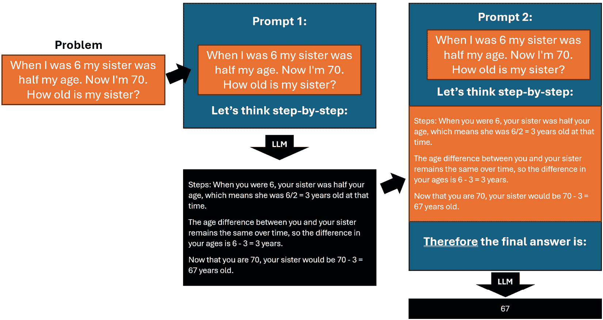

# 2

# 创建更好的提示

作为开发者，你可以通过向大型语言模型提交提示来请求它完成一项任务。在上一章中，我们看到了一些提示的例子，例如“*讲一个敲门笑话*”和“*纽约市和里约热内卢之间的飞行时间是多少？*”。随着大型语言模型变得更加强大，它们能够完成的任务也变得更加复杂。

研究人员发现，使用不同的技术构建提示会产生截然不同的结果。提高获得期望答案可能性的提示构建过程被称为提示工程，而创建更好的提示的价值催生了一个新的职业：**提示工程师**。这样的人不需要知道如何用任何编程语言编码，但可以使用自然语言创建提示，以返回期望的结果。

Microsoft Semantic Kernel 使用 **提示模板** 的概念，为包含特定类型信息和指令的提示创建结构化模板，这些信息和指令可以由用户或开发者填充或自定义。通过使用提示模板，开发者可以在提示中引入多个变量，将提示工程功能与编码功能分离，并使用高级提示技术来提高响应的准确性。

本章中，你将了解几种技术，这些技术将使你的提示更有可能在第一次尝试中返回你希望用户看到的预期结果。你将学习如何使用具有多个变量的提示，以及如何创建和使用具有多个参数的提示以完成更复杂的任务。最后，你将发现将提示以创造性的方式结合起来的技术，以在大型语言模型不太准确的情况下提高准确性——例如，在解决数学问题时。

本章将涵盖以下主题：

+   提示工程

+   多变量提示

+   多阶段提示

# 技术要求

要完成本章，你需要拥有你首选的 Python 或 C# 开发环境的最新、受支持的版本：

+   对于 Python，最低支持的版本是 Python 3.10，推荐版本是 Python 3.11

+   对于 C#，最低支持的版本是 .NET 8

你还需要一个 **OpenAI API** 密钥，可以通过 **OpenAI** 或通过 **Microsoft** 的 **Azure OpenAI** 服务获得。如何获取这些密钥的说明可以在*第一章*中找到。

如果你正在使用 .NET，本章的代码可以在[`github.com/PacktPublishing/Building-AI-Applications-with-Microsoft-Semantic-Kernel/tree/main/dotnet/ch2`](https://github.com/PacktPublishing/Building-AI-Applications-with-Microsoft-Semantic-Kernel/tree/main/dotnet/ch2)找到。

如果你使用 Python，本章的代码可以在[`github.com/PacktPublishing/Building-AI-Applications-with-Microsoft-Semantic-Kernel/tree/main/python/ch2`](https://github.com/PacktPublishing/Building-AI-Applications-with-Microsoft-Semantic-Kernel/tree/main/python/ch2)找到。

你可以通过访问 GitHub 仓库并使用以下命令安装所需的包：`pip install -r requirements.txt`。

# 一个简单的插件模板

创建提示模板有两种简单的方法。

第一种方法是从代码中的字符串变量生成提示。这种方法简单方便。我们在*第一章*的*运行简单提示*部分介绍了这种方法。

第二种方法是使用 Semantic Kernel 来帮助将开发功能与提示工程功能分开。正如你在*第一章*中看到的，你可以在插件中创建对 LLMs 的请求作为函数。插件是一个包含多个子目录的目录，每个子目录对应一个功能。每个子目录将恰好有两个文件：

+   一个包含提示的文本文件`skprompt.txt`

+   一个名为`config.json`的配置文件，其中包含将用于 API 调用的参数

由于提示与代码分开维护，因此作为应用开发者，你可以专注于你的应用程序代码，让专门的提示工程师处理`skprompt.txt`文件。

在本章中，我们将重点关注第二种方法——在专用目录中创建插件，因为这种方法对变化更加稳健。例如，如果你从 Python 切换到 C#或使用.NET 库的新版本，并且这些更改需要对你代码进行大量修改，至少你不需要更改你的提示和功能配置。

这个提示插件的代码与我们在上一章中使用的是一样的。我们将对*第一章*中构建的插件进行一些修改，对`skprompt.txt`文件进行更改，以观察结果并学习不同的提示技术如何显著改变结果。

我们在本章的开头再次详细地介绍这个过程，尽管我们在*第一章*中已经介绍过类似的内容，因为在我们探索提示工程的过程中，我们将多次使用这些步骤。

对于我们将要介绍的内容，你可以使用 GPT-3.5 和 GPT-4，但请记住，GPT-4 的价格是 GPT-3.5 的 30 倍。除非另有说明，否则显示的结果来自 GPT-3.5。

## `skprompt.txt`文件

我们将从一个非常简单的提示开始，直接询问我们想要的内容，没有任何额外的上下文：

```py
Create an itinerary of three must-see attractions in {{$city}}.
```

就这些了——这就是整个文件。

## `config.json`文件

`config.json`文件与我们*第一章*中使用的非常相似，但我们更改了三件事：

+   函数的描述

+   在 `input_variables` 下的输入变量名称

+   在 `input_variables` 下的输入变量描述

```py
{
    "schema": 1,
    "type": "completion",
    "description": "Creates a list of three must-see attractions for someone traveling to a city",
    "default_services": [
        "gpt35"
    ],
    "execution_settings": {
        "default": {
            "temperature": 0.8,
            "number_of_responses": 1,
            "top_p": 1,
            "max_tokens": 4000,
            "presence_penalty": 0.0,
            "frequency_penalty": 0.0
        }
    },
    "input_variables": [
        {
            "name": "city",
            "description": "The city the person wants to travel to",
            "required": true
        }
    ]
}
```

现在我们已经定义了函数，让我们来调用它。

## 从 Python 调用插件

我们在这里使用的代码与我们*第一章*中使用的非常相似。我们做了三个小的改动：只使用 GPT-3.5，指向适当的插件目录 `prompt_engineering`，并将输入变量的名称从 `input` 改为 `city`：

```py
import asyncio
from semantic_kernel.connectors.ai.open_ai import OpenAIChatCompletion
from semantic_kernel.utils.settings import openai_settings_from_dot_env
import semantic_kernel as sk
from semantic_kernel.functions.kernel_arguments import KernelArguments
async def main():
    kernel = sk.Kernel()
    api_key, org_id = openai_settings_from_dot_env()
    gpt35 = OpenAIChatCompletion("gpt-3.5-turbo", api_key, org_id, "gpt35")
    kernel.add_service(gpt35)
    pe_plugin = kernel.add_plugin(None, parent_directory="../../plugins", plugin_name="prompt_engineering")
    response = await kernel.invoke(pe_plugin["attractions_single_variable"], KernelArguments(city="New York City"))
    print(response)
if __name__ == "__main__":
    asyncio.run(main())
```

现在，让我们学习如何从 C# 调用插件。请注意，我们没有对 `skprompt.txt` 或 `config.json` 进行任何修改。我们可以使用相同的提示词和配置，不受语言限制。

## 从 C# 调用插件

就像我们在 Python 中做的那样，我们只需要做三个小的改动：只使用 GPT-3.5，指向适当的插件目录 `prompt_engineering`，并将输入变量的名称从 `input` 改为 `city`：

```py
using Microsoft.SemanticKernel;
var (apiKey, orgId) = Settings.LoadFromFile();
Kernel kernel = Kernel.CreateBuilder()
                        .AddOpenAIChatCompletion("gpt-3.5-turbo", apiKey, orgId, serviceId: "gpt35")
                        .Build();
var pluginsDirectory = Path.Combine(System.IO.Directory.GetCurrentDirectory(),
        "..", "..", "..", "plugins", "prompt_engineering");
var promptPlugin = kernel.ImportPluginFromPromptDirectory(pluginsDirectory, "prompt_engineering");
var result = await kernel.InvokeAsync(promptPlugin["attractions_single_variable"], new KernelArguments() {["city"] = "New York City"});
Console.WriteLine(result);
```

让我们看看结果。

## 结果

而不是给出我想看的三个顶级景点，在一次调用中，GPT-3.5 创建了一个 3 天的景点列表，并给了我一个包含六个景点的列表。这是当提示词不够具体时可能发生的典型问题。景点列表非常好，并考虑到了由于交通拥堵，在纽约市移动的难度：同一天的景点彼此靠近，或者至少有足够的时间在它们之间旅行。由于大量的 GPT-3.5 训练是在 COVID 期间进行的，行程甚至还包括了检查 COVID 关闭的备注。

注意，你的结果可能会有所不同，在某些情况下，你可能得到一个看起来像原始意图的响应，只有三个必看的景点：

```py
Itinerary: Must-See Attractions in New York City
Day 1:
1\. Statue of Liberty and Ellis Island: Start your visit to New York City by taking a ferry to the Statue of Liberty and Ellis Island. Explore the grounds of Lady Liberty, marvel at this iconic symbol of freedom and take in stunning views of the city skyline from the observation deck. Then, head to Ellis Island to learn about the millions of immigrants who passed through its gates and contributed to the cultural fabric of America.
2\. Times Square: In the afternoon, immerse yourself in the vibrant energy of Times Square. This bustling, neon-lit intersection is known for its towering billboards, dazzling Broadway theaters, and bustling crowds. Take a stroll along the pedestrian-friendly plazas, snap photos in front of iconic landmarks like the TKTS booth, and soak up the excitement of this iconic New York City landmark.
Day 2:
3\. The Metropolitan Museum of Art (The Met): Spend the morning exploring one of the world's largest and most famous art museums, The Met. This cultural treasure houses an extensive collection spanning 5,000 years of human history, encompassing art from various regions and civilizations. Admire masterpieces from ancient Egypt, classical antiquity, European Renaissance artists, and contemporary art. Don't miss the rooftop garden for panoramic views of Central Park and the Manhattan skyline.
4\. Central Park: After the museum, take a leisurely stroll through Central Park, an urban oasis in the heart of the city. This sprawling green space offers a refreshing break from the bustling streets. Enjoy a picnic near the Bethesda Terrace and Fountain, rent a rowboat on the lake, visit the Central Park Zoo, or simply relax and people-watch in this iconic park.
Day 3:
5\. The High Line: Start your day with a visit to the High Line, a unique elevated park built on a historic freight rail line. This linear park stretches for 1.45 miles and offers stunning views of the city, beautifully landscaped gardens, public art installations, and a variety of seating areas. Take a leisurely walk along the promenade, enjoy the greenery, and appreciate the innovative urban design.
6\. The 9/11 Memorial & Museum: In the afternoon, visit the 9/11 Memorial & Museum, a deeply moving tribute to the victims of the September 11, 2001, terrorist attacks. The memorial features two reflecting pools set in the footprints of the Twin Towers, surrounded by bronze parapets inscribed with the names of those who lost their lives. Inside the museum, you'll find artifacts, multimedia displays, and personal accounts that document the events and aftermath of 9/11.
Note: This itinerary includes popular attractions in New York City, but it's always worth checking for any COVID-19-related restrictions or closures before planning your visit.
```

这个快速、简单的提示词并没有像预期的那样始终如一地工作，所以让我们通过在提示词中添加更多信息来探索如何让事情变得更好。

# 提高提示词以获得更好的结果

如果你主要通过 ChatGPT 或 Microsoft Copilot 与 LLM 交互，你可能会有这样的印象：你可以使用非常短的提示词来得到你想要的结果。如*第一章*中所述，这些应用程序修改了你的提交，并在提示词中添加了大量指令。作为一个开发者，你也必须这样做。以下是一些改进提示词并获得更好结果的建议：

+   **提供上下文**：而不仅仅是要求三个必看的景点，尽可能多地提供上下文。想想如果你被问同样的问题，你会问些什么——例如，“*你将停留多少天？*”，“*你喜欢和不喜欢什么？*”，或者“*你将如何四处走动？*”

+   **明确响应的格式**：如果你想以特定的格式得到答案，确保你告诉 LLM 这一点。你甚至可以提供一些示例——例如，“*用单个词回答——‘是’* 或 ‘否。’*”

+   **指定响应的长度**：如果你想得到一个简洁的回答，指定所需的长度——例如，“*两句话*”如果你想得到一个更长的回答，要明确指出——例如，“*600 字*”或“*五段*”

## 修订 skprompt.txt 文件

使用这些提示，我们将重写提示以查看我们是否可以得到一致的改进响应：

```py
I am traveling to {{$city}} and staying only 24 hours.
I am afraid of heights.
I will be downtown.
I like movies and TV shows a lot.
I am traveling by myself.
I will get around using public transportation or Uber.
I will be there on a Saturday.
Create an itinerary of three attractions for me to visit.
The attractions should be listed in the following format:
- Attraction name: [name]
- What is the best thing to see there: [one sentence description]
Your whole answer should be less than 500 words.
```

## 结果

这是提示返回的响应：

```py
Itinerary for a 24-hour trip to New York City:
Attraction 1: Times Square
- What is the best thing to see there: The vibrant neon lights, billboards, and bustling atmosphere of one of the world's most famous intersections.
Start your day by visiting Times Square, the iconic heart of New York City. Immerse yourself in the vibrant energy and larger-than-life atmosphere of this bustling area. Marvel at the enormous billboards and screens displaying advertisements for Broadway shows, movies, and various brands. While you're there, make sure to take a stroll along the pedestrian plazas, people-watch, and soak in the bustling activity. Don't forget to snap some photos to capture the essence of this iconic location.
Attraction 2: Central Park
- What is the best thing to see there: Explore the beautiful green landscape, visit popular landmarks like Bethesda Terrace and Strawberry Fields, and enjoy a peaceful escape from the city.
Escape the concrete jungle and head to Central Park, an oasis of tranquility and natural beauty right in the heart of Manhattan. Take a leisurely walk through the park's lush greenery, visit famous spots such as Bethesda Terrace and Bethesda Fountain, and enjoy the peacefulness that surrounds you. If you're a fan of movies or TV shows, keep an eye out for locations you may recognize from various film shoots. Grab a coffee or snack from one of the park's vendors and find a cozy spot to relax and people-watch, or rent a bike and explore the park's vast expanse at your own pace.
Attraction 3: Museum of the Moving Image
- What is the best thing to see there: Delve into the world of movies and TV shows through interactive exhibits, iconic props, and behind-the-scenes insights.
As a movie and TV show enthusiast, a visit to the Museum of the Moving Image in Queens is a must. This unique museum offers a fascinating exploration of the history, art, and technology behind the moving image. Get a glimpse of iconic props, costumes, and memorabilia from beloved films and TV shows. Engage in interactive exhibits that allow you to create your own animations or dub your voice into famous movie scenes. Learn about the evolution of filmmaking techniques and gain behind-the-scenes insights into the process of creating the entertainment you love. With its fascinating exhibits and hands-on experiences, the Museum of the Moving Image is a perfect destination for any movie and TV aficionado.
Remember to plan your itinerary in a way that allows for travel time between attractions, especially if you're relying on public transportation or Uber. Be sure to check opening hours and any reservation requirements for the attractions you wish to visit, as they may vary. Enjoy your 24-hour adventure in the vibrant city of New York!
```

注意，我们创建的提示是这样的，你可以用它来应对不同的城市。这里是一个使用伦敦的示例。注意，响应承认了我对高度恐惧，但只是告诉我克服它：

```py
Attraction 1: Warner Bros. Studio Tour London - The Making of Harry Potter
- What is the best thing to see there: Immerse yourself in the magical world of Harry Potter by exploring the actual sets, costumes, and props used in the film series.
Start your day by visiting the Warner Bros. Studio Tour London - The Making of Harry Potter. As a fan of movies and TV shows, this attraction will be a dream come true for you. Located just outside of London, this studio tour offers a unique behind-the-scenes experience of the Harry Potter film series.
Attraction 2: The British Museum
- What is the best thing to see there: Discover the vast collection of art and artifacts from around the world, including the Rosetta Stone and the Egyptian mummies.
Next, head to The British Museum, located in the heart of downtown London. This world-renowned museum houses a vast collection of art and historical artifacts, spanning over two million years of human history. As a lover of movies and TV shows, you'll appreciate the opportunity to see real-life artifacts and treasures from various civilizations.
Attraction 3: The London Eye
- What is the best thing to see there: Overcome your fear of heights and enjoy breathtaking panoramic views of London's iconic landmarks.
To end your day, challenge yourself and conquer your fear of heights by visiting the London Eye. This giant Ferris wheel, located on the South Bank of the River Thames, offers spectacular views of the city's skyline. Take a ride in one of the glass capsules and enjoy a 30-minute rotation, offering uninterrupted 360-degree views of London.
With 24 hours in London, these three attractions will provide you with a well-rounded experience that combines your love for movies and TV shows with iconic landmarks and breathtaking views. Don't forget to make use of public transportation or Uber to efficiently move between these attractions and make the most of your limited time in the city. Enjoy your adventure!
```

对于许多应用，你需要使你的提示更加可配置，这将需要添加更多变量。我们将在下一节中这样做。

# 带有多个变量的提示

你可以在提示中参数化很多信息。例如，在我们的最佳景点查找提示中，你可以添加多个变量，例如这个人停留的天数、他们喜欢和不喜欢的事物，以及他们想看多少个景点。

在这种情况下，我们的提示将变得更加复杂，因此我们需要创建一个新的 `skprompt.txt` 文件。由于我们的提示将是一个新的函数并且有多个参数，我们还需要创建一个新的 `config.json` 文件。

这两个文件可以在 `plugins/prompt_engineering/attractions_multiple_variables` 文件夹中找到。

Skprompt.txt

要向提示中添加更多变量，只需在双大括号内添加它们，并在变量名前加上美元符号。以下代码展示了如何将多个变量（`city`、`n_days`、`likes`、`dislikes` 和 `n_attractions`）添加到单个提示中：

```py
I am traveling to {{$city}} and staying {{$n_days}} days.
I like {{$likes}}.
I dislike {{$dislikes}}.
I am traveling by myself.
Create an itinerary of up to {{$n_attractions}} must-see attractions for me to visit.
The attractions should be listed in the following format:
- Attraction name: [name]
- What is the best thing to see there: [one sentence description]
Your whole answer should be less than 300 words.
```

现在，让我们看看函数配置的变化。

Config.json

我们用于多个变量的 `config.json` 文件几乎与用于单个变量的文件相同，但我们需要为所有变量添加详细信息：

```py
    "input_variables": [
        {
            "name": "city",
            "description": "The city the person wants to travel to",
            "required": true
        },
        {
            "name": "n_days",
            "description": "The number of days the person will be in the city",
            "required": true
        },
        {
            "name": "likes",
            "description": "The interests of the person traveling to the city",
            "required": true
        },
        {
            "name": "dislikes",
            "description": "The dislikes of the person traveling to the city",
            "required": true
        },
        {
            "name": "n_attractions",
            "description": "The number of attractions to recommend",
            "required": true
        }
    ]
```

现在我们已经配置了新的函数，让我们学习如何在 Python 和 C# 中调用它。

## 使用 Python 请求复杂行程

与调用单个参数的提示相比，调用多个参数的提示所需做的唯一更改是在 `KernelArguments` 对象上。当将 `KernelArguments` 作为参数传递给 `kernel.invoke` 时，我们必须将所有需要的参数添加到对象中，如这里所示。需要注意的是，参数都是字符串，因为 LLMs 在处理文本时表现最佳：

```py
        response = await kernel.invoke(pe_plugin["attractions_multiple_variables"], KernelArguments(
        city = "New York City",
        n_days = "3",
        likes = "restaurants, Ghostbusters, Friends tv show",
        dislikes = "museums, parks",
        n_attractions = "5"
    ))
```

让我们看看 C# 代码。

## 使用 C# 请求复杂行程

这次，我们将在函数调用外部创建一个名为 `function_arguments` 的 `KernelArguments` 对象，并预先填充我们想要的内容的五个变量。然后，我们将把这个对象传递给调用调用：

```py
 var function_arguments = new KernelArguments()
    {["city"] = "New York City",
    ["n_days"] = "3",
    ["likes"] = "restaurants, Ghostbusters, Friends tv show",
    ["dislikes"] = "museums, parks",
    ["n_attractions"] = "5"};
var result = await kernel.InvokeAsync(promptPlugin["attractions_multiple_variables"], function_arguments );
```

现在，让我们看看结果。

## 复杂行程的结果

结果考虑了所有输入变量。它建议一个公园——高线公园——尽管我告诉了 LLM 我不喜欢公园。它确实解释说这是一个非常不寻常的公园，如果你了解纽约，它根本不像一个公园。我认为一个不喜欢传统公园体验的人会喜欢高线公园，所以 LLM 在获得更多上下文后做得非常好：

```py
Itinerary for Three Days in New York City:
Day 1:
1\. Attraction name: Ghostbusters Firehouse
   What is the best thing to see there: Visit the iconic firehouse featured in the Ghostbusters movies and take pictures in front of the famous logo.
2\. Attraction name: Friends Apartment Building
   What is the best thing to see there: Pay a visit to the apartment building that served as the exterior shot for Monica and Rachel's apartment in the beloved TV show Friends.
Day 2:
3\. Attraction name: Restaurant Row
   What is the best thing to see there: Explore Restaurant Row on West 46th Street, known for its diverse culinary scene, offering a plethora of international cuisines to satisfy your food cravings.
4\. Attraction name: High Line Park
   What is the best thing to see there: Although you mentioned disliking parks, the High Line is a unique urban park built on a historic freight rail line, offering beautiful views of the city and a different experience compared to traditional parks.
Day 3:
5\. Attraction name: Times Square
   What is the best thing to see there: Immerse yourself in the vibrant atmosphere of Times Square, known for its dazzling billboards, bustling streets, and renowned theaters, making it a must-see destination in NYC.
This itinerary focuses on your interests while also incorporating some iconic NYC experiences. You can explore famous film locations like the Ghostbusters Firehouse and Friends Apartment Building. Since you enjoy restaurants, Restaurant Row will offer a variety of dining options to suit your taste. Although you specified disliking parks, the High Line Park provides a unique urban green space experience. Finally, no trip to NYC would be complete without a visit to the energetic Times Square. Enjoy your trip!
```

有了这些，我们已经学会了如何改进我们的提示以获得更好的结果。然而，有些情况下，即使我们使用了之前提到的所有技术，LLMs 也未能提供好的答案。一个非常常见的情况是解决数学问题。我们将接下来探讨这个问题。

# 回答数学问题时的问题

虽然 LLMs 的结果令人印象深刻，但有时模型会被看似简单的问题搞混。当问题涉及数学时，这种情况更为常见。例如，我在 GPT-3.5 上运行了以下提示五次：

```py
When I was 6 my sister was half my age.
Now I'm 70\. How old is my sister?
```

我用来运行此提示的插件位于`plugins/prompt_engineering/solve_math_problem`。

正确答案是 67，因为当我 6 岁时，我妹妹是 3 岁。现在，64 年后，我 70 岁，所以她会是 67 岁。

这里是 GPT-3.5 上五次运行的成果。第一次结果是错误的，说“*我的妹妹比她现在的年龄小 64 岁*：”

```py
If your sister was half your age when you were 6, that means she was 3 years younger than you at that time (6/2 = 3).
Since then, you have aged 64 years (70 - 6 = 64). Therefore, your sister would also be 64 years younger than her current age, which would make her 70 - 64 = 6 years old.
So, your sister is currently 6 years old.
```

第二次和第三次尝试给出了正确答案。这是第二次尝试：

```py
If your sister was half your age when you were 6, it means she was 6/2 = <<6/2=3>>3 years old at that time.
Since then, there is a constant age difference of 3 years between the two of you.
Now that you are 70, your sister would be 70 - 3 = <<70-3=67>>67 years old.
```

这是第三次尝试：

```py
If your sister was half your age when you were 6, that means she was 3 years old at that time.
Since then, the age difference between you and your sister remains constant.
Therefore, if you are currently 70 years old, your sister would be 67 years old.
```

但第四次和第五次尝试又给出了错误答案。这是第四次尝试：

```py
If your sister was half your age when you were 6, that means she was 3 years old at that time. Since then, the age difference between you and your sister remains constant. Therefore, if you are currently 70 years old, your sister is 73 years old.
```

这是第五次尝试：

```py
If your sister was half your age when you were 6, that means she was 3 years younger than you at that time.
Now, you are 70, which means there is a 67-year age difference between when you were 6 and now.
So, if your sister was 3 years younger than you when you were 6, she would be 67 years younger than you now.
Therefore, your sister would be 70 - 67 = 3 years old.
```

因此，在五次尝试中，只有两次（40%）返回了正确答案，这不是你希望用户拥有的体验。

我们将在下一节中学习如何解决这个问题。

# 多阶段提示

在进行数学时提高 LLMs 准确性的一个方法是多阶段提示。在这个技术中，第一次提示的答案作为参数传递给第二次。我们将使用**思维链**（**CoT**）技术来展示这一点。

## CoT – “让我们一步一步思考”

在论文《大型语言模型是零样本推理者》[1]中，作者发现，在问题后简单添加“让我们一步一步思考”可以大大提高 LLMs 的准确性。他们提出的过程如下：

1.  提出你想要的问题，但不是要求 LLM 回答，而是在结尾简单地添加“*让我们一步一步思考*”。

1.  LLM 将以回答问题的过程来回答。

1.  将步骤 1 中的问题与步骤 2 中的过程结合到一个新的提示中，并以“*因此，答案是…*”结束。



图 2.1 – Zero-shot-CoT 方法

他们将他们的过程称为 *Zero-shot-Chain-of-Thought* 或 *Zero-shot-CoT*。*Zero-shot* 部分意味着你不需要向 LLM 提供任何示例答案；你可以直接提出问题。这是为了区分与 **few-shot** 的过程，few-shot 是你在提示中提供 LLM 几个预期答案的示例，使提示变得更大。*CoT* 部分描述了要求 LLM 提供推理框架的过程，并将 LLM 的推理添加到问题中。

作者测试了几个不同的短语来从 LLM 获取 CoT，例如“*让我们逻辑地思考它*”和“*让我们像侦探一样一步一步思考*”，并发现简单地“*让我们一步一步思考*”产生了最佳结果。

### 实现 Zero-shot-CoT

我们需要两个提示 - 一个用于两个步骤。对于第一步，我们将调用 `solve_math_problem_v2`。提示简单地重申了问题，并在最后添加了“*让我们一步一步思考*”：

```py
{{$problem}}
Let's think step by step.
```

第二步的提示，我们将称之为 `chain_of_thought`，重复了第一个提示，包括第一个提示的答案，然后要求提供解决方案：

```py
{{$problem}}
Let's think step by step.
{{$input}}
Therefore, the answer is…
```

给定这个提示，`config.json` 文件需要两个 `input_variables`：

```py
    "input_variables": [
        {
            "name": "problem",
            "description": "The problem that needs to be solved",
            "required": true
        },
        {
            "name": "input",
            "description": "The steps to solve the problem",
            "required": true
        }
    ]
```

让我们学习如何调用提示。

## 使用 Python 实现 CoT

为了使步骤明确，我将程序分成两部分。第一部分请求 CoT 并显示它：

```py
    problem = """When I was 6 my sister was half my age. Now I'm 70\. How old is my sister?"""
    pe_plugin = kernel.add_plugin(None, parent_directory="../../plugins", plugin_name="prompt_engineering")
    solve_steps = await kernel.invoke(pe_plugin["solve_math_problem_v2"], KernelArguments(problem = problem))
    print(f"\n\nSteps: {str(solve_steps)}\n\n")
```

第二部分展示了答案。如果你只关心答案，你不需要打印步骤，但你仍然需要使用 LLM 来计算步骤，因为它们是 CoT 的必需参数：

```py
    response = await kernel.invoke(pe_plugin["chain_of_thought"], KernelArguments(problem = problem, input = solve_steps))
    print(f"\n\nFinal answer: {str(response)}\n\n")
```

## 使用 C# 实现 CoT

就像我们在 Python 中做的那样，我们可以将 C# 程序分成两部分。第一部分将展示由 CoT 提示引发的推理步骤：

```py
var problem = "When I was 6 my sister was half my age. Now I'm 70\. How old is my sister?";
var chatFunctionVariables1 = new KernelArguments()
{
    ["problem"] = problem,
};
var steps = await kernel.InvokeAsync(promptPlugin["solve_math_problem_v2"], chatFunctionVariables1);
```

第二部分解析并报告答案：

```py
var chatFunctionVariables2 = new KernelArguments()
{
    ["problem"] = problem,
    ["input"] = steps.ToString()
};
var result = await kernel.InvokeAsync(promptPlugin["chain_of_thought_v2"], chatFunctionVariables2);Console.WriteLine(steps);
```

让我们看看结果。

## CoT 的结果

我运行了程序五次，每次都得到了正确答案。答案不是确定的，所以你可能在你的机器上运行它时得到一两个错误答案。在论文中，作者声称这种方法在类似类型的问题上实现了 78.7% 的成功率，而 LLM 的通常准确率约为 17.7%。

让我们看看两个示例响应。首先是：

```py
Steps: When you were 6, your sister was half your age, which means she was 6/2 = 3 years old at that time.
The age difference between you and your sister remains the same over time, so the difference in your ages is 6 - 3 = 3 years.
Now that you are 70, your sister would be 70 - 3 = 67 years old.
Final answer:
Your sister is 67 years old.
```

这是第二个：

```py
Steps: When you were 6, your sister was half your age, so she was 6/2 = <<6/2=3>>3 years old.
Since then, the age difference between you and your sister remains constant, so your sister is 3 years younger than you.
Therefore, if you are now 70, your sister would be 70 - 3 = <<70-3=67>>67 years old.
```

我们可以自动化程序而不是手动运行它。让我们看看如何做。

## 答案集合

虽然 CoT 技术帮助很大，但我们仍然有 78.7% 的平均准确率，这可能还不够。为了解决这个问题，常用的一个技术是多次向模型提出相同的问题，并仅编译最频繁给出的答案。

为了实现这一点，我们将对我们的 CoT 提示进行微小修改，并将其称为 `chain_of_thought_v2`。我们将简单地要求 LLM 使用阿拉伯数字回答，以便在后续步骤中更容易比较答案：

```py
{{$problem}}
Let's think step by step.
{{$input}}
Using arabic numerals only, the answer is…
```

我们还需要更改程序并要求它运行多次。对于下一个示例，我选择了*N* = 7。我们将收集答案并选择出现频率更高的答案。请注意，使用此方法每次调用都比单次调用贵*N*倍，耗时也长*N*倍。准确性不是免费的。

### 使用 Python 自动运行集成

让我们运行 CoT 七次。每次运行它，我们将结果添加到一个列表中。然后，我们将利用`set`数据结构来快速获取最常见的元素：

```py
    responses = []
    for i in range(7):
        solve_steps = await kernel.invoke(pe_plugin["solve_math_problem_v2"], KernelArguments(problem = problem))
        response = await kernel.invoke(pe_plugin["chain_of_thought_v2"], KernelArguments(problem = problem, input = solve_steps))
        responses.append(int(str(response)))
    print("Responses:")
    print(responses)
    final_answer = max(set(responses), key = responses.count)
    print(f"Final answer: {final_answer}")
```

让我们看看如何在 C#中实现这一点。

### 使用 C#自动运行集成

C#代码与 Python 代码使用相同的思想：我们运行模型七次并存储结果。然后，我们在结果中搜索最频繁的答案：

```py
var results = new List<int>();
for (int i = 0; i < 7; i++)
{
    var chatFunctionVariables1 = new KernelArguments()
    {
        ["problem"] = problem,
    };
    var steps = await kernel.InvokeAsync(promptPlugin["solve_math_problem_v2"], chatFunctionVariables1);
    var chatFunctionVariables2 = new KernelArguments()
    {
        ["problem"] = problem,
        ["input"] = steps.ToString()
    };
    var result = await kernel.InvokeAsync(promptPlugin["chain_of_thought_v2"], chatFunctionVariables2);
    var resultInt = int.Parse(result.ToString());
    results.Add(resultInt);
}
var mostCommonResult = results.GroupBy(x => x)
    .OrderByDescending(x => x.Count())
    .First()
    .Key;
Console.WriteLine($"Your sister's age is {mostCommonResult}");
```

将 CoT 和集成方法结合起来，大大增加了获得正确响应的可能性。在论文中，作者们以每题 10 次 LLM 调用的代价，获得了 99.8%的正确结果。

# 摘要

在本章中，你学习了你可以利用的几种技术来改进你的提示以获得更好的结果。你学习了使用更长的提示，确保 LLM 有必要的上下文来提供所需的响应。你还学习了如何向提示添加多个参数。然后，你学习了如何链式使用提示以及如何实现 CoT 方法以帮助 LLM 提供更准确的结果。最后，你学习了如何集成多个响应以提高准确性。然而，这种准确性是有代价的。

现在我们已经掌握了提示，在下一章中，我们将探讨如何自定义插件及其原生和语义函数。

# 参考文献

[1] T. Kojima, S. S. Gu, M. Reid, Y. Matsuo, and Y. Iwasawa, “Large Language Models are Zero-Shot Reasoners.” arXiv, Jan. 29, 2023\. 访问时间：Jun. 06, 2023\. [在线]. 可用：[`arxiv.org/abs/2205.11916`](http://arxiv.org/abs/2205.11916)

# 第二部分：使用语义内核创建 AI 应用

在这部分，我们将深入了解语义内核，学习如何使用它来解决问题。我们首先向内核添加函数，然后使用函数解决问题。真正的力量在于当我们要求内核自己解决问题时。最后，我们学习如何使用内存为我们的内核保存历史记录。

这一部分包括以下章节：

+   *第三章**，扩展语义内核*

+   *第四章**，通过链式函数执行复杂操作*

+   *第五章**，使用规划器编程*

+   *第六章**，将记忆添加到您的 AI 应用中*
