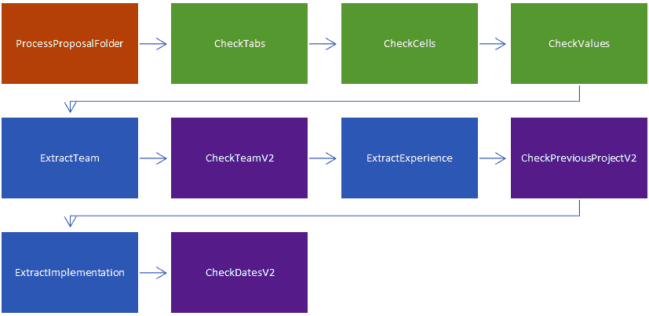

# 通过链式连接函数执行复杂操作

在上一章中，我们学习了如何创建本地插件，我们使用它们来检查 Excel 和 Word 文档的格式，以及语义插件，我们使用它们来验证文档内容是否符合我们的要求。

在本章中，我们将首先创建一个简单的管道，该管道生成图像。该管道将接收包含关于动物线索的文本，然后生成一个根据线索猜测动物的文本，以及生成该动物的图片。

在本章的后面部分，我们将继续应用上一章的内容：验证资助请求是否符合某些要求。为此应用，资助请求将包含文件夹内的两个文件：一个 Word 文档和一个 Excel 电子表格。

我们的应用程序检查 Word 文档是否包含疫苗接种活动的提案，包括将执行该活动的团队及其经验，以及包含其预算的 Excel 文件。

这种场景在企业中很常见：政府和企业必须优先处理项目请求，编辑必须批准或拒绝书籍提案，律师必须核实他们提交给法庭的文件是否符合法律要求。需要核实数千或数万份文件的情况并不少见。这类工作直到最近都是手工完成的。我们将编写一个自动化此过程的管道。

在本章中，我们将涵盖以下主题：

+   创建生成图像的本地插件

+   将输出文本的语义插件与生成图像的本地插件链式连接

+   运行复杂的多步骤管道

到本章结束时，您将拥有构建能够执行许多协调功能的核心所需工具，它可以作为副驾驶或集成到其他工具中，例如规划器。

# 技术要求

为了完成本章，您需要拥有您首选的 Python 或 C# 开发环境的最新、受支持的版本：

+   对于 Python，最低支持的版本是 Python 3.10，推荐版本是 Python 3.11

+   对于 C#，最低支持的版本是 .NET 8

在本章中，我们将调用 OpenAI 服务。鉴于公司在训练这些大型语言模型（LLM）上花费的金额，使用这些服务不是免费的。您需要一个 **OpenAI API** 密钥，无论是直接通过 **OpenAI** 还是 **Microsoft**，通过 **Azure** **OpenAI** 服务。

如果您使用 .NET，本章的代码位于 [`github.com/PacktPublishing/Building-AI-Applications-with-Microsoft-Semantic-Kernel/tree/main/dotnet/ch4`](https://github.com/PacktPublishing/Building-AI-Applications-with-Microsoft-Semantic-Kernel/tree/main/dotnet/ch4)。

如果你使用 Python，本章的代码位于 [`github.com/PacktPublishing/Building-AI-Applications-with-Microsoft-Semantic-Kernel/tree/main/python/ch4`](https://github.com/PacktPublishing/Building-AI-Applications-with-Microsoft-Semantic-Kernel/tree/main/python/ch4)。

你可以通过访问 GitHub 仓库并使用以下命令安装所需的包：`pip install -r requirements.txt`。

# 创建一个生成图像的原生插件

要了解函数链的强大功能，我们将创建执行非常不同动作的函数。我们将从创建生成图像的函数并将它们放入插件开始。然后，我们将学习如何将这些函数整合到一个更复杂的链中。

在某些应用中，你可能希望使用 AI 生成图像。例如，带有图像的社交媒体帖子往往能获得更多的互动，但如果没有 AI 或找到图像，创建图像可能会很耗时且成本高昂。

与非 AI 图像的市场价格相比，使用 AI 生成图像非常便宜。另一方面，使用 AI 生成图像仍然是计算密集型活动之一。来自 Hugging Face 的最新研究 [1] 表明，生成一张图像在碳排放方面的成本是生成一个文本答案的 2,000 倍。这些成本将转嫁给你们。

OpenAI 图像生成的成本

如果你想复制本节的内容，请注意图像生成比文本生成成本高得多。你需要一个 API 密钥，以下示例中，每生成一张图像的成本为 0.04 美元，如果你想要创建更高分辨率、更高质量的图像，每张图像的成本可能高达 0.12 美元。

价格经常变动，你可以在 [`openai.com/pricing`](https://openai.com/pricing) 查看最新的价格。

在 *图 4**.1 中，我们展示了两个使用 AI 生成的图像示例，我创建这些图像是为了增强我的几篇社交媒体帖子。第一个，我作为一个牛仔，是为了关于亿万富翁戴牛仔帽的帖子。第二个，我作为一个浪漫小说封面的角色，是为了关于写小说的帖子。每个图像使用 AI 生成的时间不到一分钟。我在 Threads 上进行了一次测试，Threads 是 Instagram 的新微型博客应用，我有超过 10,000 名关注者，带有图像的帖子比只有文字但没有图像的帖子获得了多倍的互动。


图 4.1 – 用于社交媒体帖子的 AI 生成的图像

Microsoft Semantic Kernel 中的图像生成支持并不一致。C# API 有一个名为 `TextToImage` 的对象，可以使用 2022 年 11 月发布的 DALL-E 2 模型生成图像，但该 API 不可用于 Python。这个图像生成模型现在已经过时，因为 2023 年 10 月被 DALL-E 3 取代；然而，在撰写本文时，Semantic Kernel 并没有提供一种现成的访问 DALL-E 3 的方法。

我们将创建两个本地插件，一个用于 C#，一个用于 Python，这样我们就可以从 Semantic Kernel 访问 DALL-E 3。

向内核添加新模型

尽管我们使用的是 DALL-E 3，作为一个有趣且新颖的模型，作为我们添加到内核的示例，但创建本地插件包装器的方法适用于任何具有 API 的模型，包括 Anthropic 的 Claude、Google 的 Gemini 以及来自 Hugging Face 的数百个模型。任何通过 REST API 提供的 AI 服务都可以以这种方式添加。

## 在 Python 中编写 DALL-E 3 包装器

在 Python 中编写 DALL-E 3 包装器比在 C# 中更容易，因为 OpenAI 提供并支持一个名为 openai 的 Python 包，允许开发者在新功能发布时立即访问任何新功能。我们只需创建一个使用 OpenAI 包的本地函数并向 DALL-E 3 发送请求：

```py
from dotenv import load_dotenv
from openai import OpenAI
import os
from semantic_kernel.skill_definition import kernel_function
class Dalle3:
    @kernel_function(
        description="Generates an with DALL-E 3 model based on a prompt",
        name="ImageFromPrompt",
        input_description="The prompt used to generate the image",
    )
    def ImageFromPrompt(self, input: str) -> str:
        load_dotenv()
        client = OpenAI(api_key=os.getenv("OPENAI_API_KEY"))
```

正如我们在 *第三章* 中所看到的，我们使用 `kernel_function` 装饰器声明一个本地函数。然后我们只需使用我们的 API 密钥实例化一个 OpenAI 客户端对象。

现在，让我们提交请求：

```py
        response = client.images.generate(
            model="dall-e-3",
            prompt=input,
            size="1024x1024",
            quality="standard",
            n=1,
        )
        image_url = response.data[0].url
        return image_url
```

Python OpenAI 客户端包含 `images.generate` 方法，该方法将调用 DALL-E 3 并返回生成的 URL。我们只需调用它并返回 URL。

现在，我们将创建一个简单的脚本，实例化插件并调用它：

```py
import asyncio
import semantic_kernel as sk
from OpenAiPlugins import Dalle3
async def main():
    kernel = sk.Kernel()
    animal_str = "A painting of a cat sitting in a sofa in the impressionist style"
    dalle3 = kernel.import_skill(Dalle3())
    animal_pic_url = await kernel.run_async(
        dalle3['ImageFromPrompt'],
        input_str=animal_str
    )
    print(animal_pic_url)
if __name__ == "__main__":
    asyncio.run(main())
```

上述代码实例化了 `Dalle3` 本地插件，并使用 `"A painting of a cat sitting on a sofa in the impressionist style"` 输入参数调用其 `ImageFromPrompt` 函数。一个示例输出在 *图 4**.2* 中：


图 4.2 – 由 Python 生成的 DALL-E 3 的印象派风格猫

现在我们已经看到了如何在 Python 中实现这一点，接下来让我们看看如何在 C# 中实现。

## 在 C# 中编写 DALL-E 3 包装器

OpenAI 没有为 C# 提供受支持的包，该包允许该语言的用户与服务进行交互。对于 C# 用户来说，与 OpenAI 服务交互的最佳方式是使用 Microsoft Semantic Kernel，它具有 `TextToImage` 功能，但在撰写本文时，它仅提供对 DALL-E 2 的连接。

大多数 AI 服务都会公开 REST API。因此，要将 Microsoft Semantic Kernel 连接到它们，一个解决方案是编写一个本地插件，该插件包装 REST API。我们在这里展示了如何为 DALL-E 3 实现这一点：

```py
using System.ComponentModel;
using System.Net.Http.Headers;
using System.Net.Http.Json;
using Microsoft.SemanticKernel;
using System.Text;
using System.Text.Json;
using System.Text.Json.Nodes;
namespace Plugins;
public class Dalle3
{
    [KernelFunction, Description("Generate an image from a prompt")]
    async public Task ImageFromPrompt([Description("Prompt describing the image you want to generate")] string prompt)
    {
```

制作 REST `POST` 请求需要几个包，例如 `System.Text.Json` 和 `System.Net`。就像我们在*第三章*中所做的那样，我们使用一个装饰器，`KernelFunction`，来指示该函数对语义内核是可访问的，并使用`Description`属性来描述我们的函数功能。

然后，我们创建一个`HttpClient`对象。此对象将执行 REST API 调用。我们需要使用我们的 API 密钥作为`Bearer`令牌来设置它，并将其头设置为接受“`application/json`”，因为 OpenAI API 将以这种方式响应：

```py
        HttpClient client = new HttpClient
        {
            BaseAddress = new Uri("https://api.openai.com/v1/")
        };
        var (apiKey, orgId) = Settings.LoadFromFile();
        client.DefaultRequestHeaders
            .Accept
            .Add(new MediaTypeWithQualityHeaderValue("application/json"));
        client.DefaultRequestHeaders.Authorization = new AuthenticationHeaderValue("Bearer", apiKey);
        client.DefaultRequestHeaders.Accept.Add(new MediaTypeWithQualityHeaderValue("application/json"));
```

下一步是向 API 提交`POST`请求：

```py
        var obj = new {
            model = "dall-e-3",
            prompt = prompt,
            n = 1,
            size = "1024x1024"};
        var content = new StringContent(JsonSerializer.Serialize(obj), Encoding.UTF8, "application/json");
        var response  = await client.PostAsync("images/generations", content);
```

我们使用 OpenAI API 所需的字段创建了一个 JSON 对象，`obj`。`model`字段说明了我们正在使用什么模型，在这里我们确保指定`"dall-e-3"`以使用 DALL-E 3。所有可能参数的文档可以在这里找到：[`platform.openai.com/docs/api-reference/images/create`](https://platform.openai.com/docs/api-reference/images/create)。

最后一步是从 OpenAI 返回的 JSON 中恢复`url`字段。该`url`字段指向图像：

```py
        if (!response.IsSuccessStatusCode)
        {
            return $"Error: {response.StatusCode}";
        }
        string jsonString = await response.Content.ReadAsStringAsync();
        using JsonDocument doc = JsonDocument.Parse(jsonString);
        JsonElement root = doc.RootElement;
        return root.GetProperty("data")[0]!.GetProperty("url")!.GetString()!;
    }
}
```

接下来，让我们看看如何调用该插件：

```py
using Microsoft.SemanticKernel;
using Plugins;
var (apiKey, orgId) = Settings.LoadFromFile();
var builder = Kernel.CreateBuilder();
builder.Plugins.AddFromType<Dalle3>();
var kernel = builder.Build();
string prompt = "A cat sitting on a couch in the style of Monet";
string? url = await kernel.InvokeAsync(
    "Dalle3", "ImageFromPrompt", new() {{ "prompt", prompt }}
);
Console.Write(url);
```

要调用插件，我们在源文件中添加了对`Plugins`的引用，使用`AddFromType`实例化了`Dalle3`插件，并调用了它的`ImageFromPrompt`方法，将`prompt`作为参数传递。

生成的图片如下：


图 4.3 – 由 C# 本地插件生成的印象派风格的猫

现在我们已经创建了一个可以访问新服务的函数，让我们将其整合到使用它的解决方案中。

# 使用多个步骤解决问题

虽然逐步编程解决方案可能非常有帮助，但语义内核提供给用户的最优秀的能力之一是允许他们使用自然语言进行请求。这需要使用**规划器**，我们将在*第五章*中使用它，将用户请求分解成多个步骤，然后自动按适当顺序调用每个步骤。

在本节中，我们将通过告诉语义内核调用哪些函数来解决问题。这有助于确保我们提供给规划器的解决方案是有效的，并且当我们要显式控制执行方式时也很有帮助。

为了说明手动方法，我们将展示如何向语义内核提供关于动物的线索，使用语义函数猜测它，然后使用我们在上一节中创建的本地函数生成动物的图像。

## 从线索生成图像

在下面的代码中，我们有两个步骤。在第一步中，我们将使用 GPT-3.5 从线索中猜测一个动物。为此，我们将创建一个名为`AnimalGuesser`的语义插件。

重要提示：使用 OpenAI 服务并非免费

语义函数将调用 OpenAI API。这些调用需要付费订阅，并且每次调用都会产生费用。通常，每个请求的费用很小。GPT 3.5 每千个标记的费用为 $0.0002，但如果进行大量调用，费用可能会累积。价格经常变动，因此请确保在以下网站上检查最新的价格：

OpenAI 定价：[`openai.com/pricing`](https://openai.com/pricing)

Azure OpenAI 定价：[`azure.microsoft.com/en-us/pricing/details/cognitive-services/openai-service/`](https://azure.microsoft.com/en-us/pricing/details/cognitive-services/openai-service/)

语义插件，一如既往，由两个文件组成，`config.json` 和 `skprompt.txt`，如下所示：

config.json

```py
{
    "schema": 1,
    "name": "GuessAnimal",
    "type": "completion",
    "description": "Given a text with clues, guess the animal",
    "execution_settings": {
        "default": {
            "temperature": 0.8,
            "number_of_responses": 1,
            "top_p": 1,
            "max_tokens": 4000,
            "presence_penalty": 0.0,
            "frequency_penalty": 0.0
        }
    },
    "input_variables": [
        {
            "name": "input",
            "description": "CLues about an animal",
            "required": true
        }
    ]
}
```

skprompt.txt

```py
Below, there's a list of clues about an animal.
{{$input}}
From the clues above, guess what animal it is.
Provide your answer in a single line, containing just the name of the animal.
```

如我们通常所做的那样，我们必须确保 `config.json` 文件中的 `description` 字段设置正确。现在这不会有任何影响，但当我们开始使用规划器或让语义内核自动调用函数时，内核将使用 `description` 字段来确定每个函数的功能并决定调用哪些函数。

现在，让我们看看如何告诉内核按顺序调用函数。

## 使用 C# 链接语义和本地函数

在 C# 中，你需要使用 `KernelFunctionCombinators` 类来创建函数管道。该类的代码在 GitHub 仓库中提供。

实现函数管道的代码如下：

```py
using Microsoft.SemanticKernel;
using Plugins;
var (apiKey, orgId) = Settings.LoadFromFile();
var builder = Kernel.CreateBuilder();
builder.Plugins.AddFromType<Dalle3>();
builder.AddOpenAIChatCompletion("gpt-3.5-turbo", apiKey, orgId);
var kernel = builder.Build();
KernelPlugin animalGuesser = kernel.ImportPluginFromPromptDirectory("../../../plugins/AnimalGuesser");
string clues = "It's a mammal. It's a pet. It meows. It purrs.";
```

在前面的代码片段中，我们创建了我们的内核，向其中添加了一个 OpenAI 服务，并添加了 `AnimalGuesser` 和 `Dalle3` 插件。

接下来，我们将要调用的函数 `AnimalGuesser.GuessAnimal` 和 `Dalle3.ImageFromPrompt` 分配给 `KernelFunction` 变量：

```py
KernelFunction guessAnimal = animalGuesser["GuessAnimal"];
KernelFunction generateImage = kernel.Plugins["Dalle3"]["ImageFromPrompt"];
KernelFunction pipeline = KernelFunctionCombinators.Pipe(new[] {
    guessAnimal,
    generateImage
}, "pipeline");
```

最后，我们创建一个名为 `context` 的 `KernelArguments` 对象，并将其作为参数传递给 `InvokeAsync`：

```py
KernelArguments context = new() { { "input", clues } };
Console.WriteLine(await pipeline.InvokeAsync(kernel, context));
```

`context` 对象的属性必须与第一个函数期望的属性相匹配。在我们的例子中，`AnimalGuesser.GuessAnimal` 函数期望一个名为 `input` 的参数。从那时起，管道将调用每个函数，将输出作为文本字符串，并将该文本字符串作为下一个函数的第一个参数传递。在我们的例子中，尽管 `Dalle3.ImageFromPrompt` 函数的第一个参数名为 `prompt` 而不是 `input`，但调用仍然会正常进行。你只需要提供在管道第一步中使用的参数的正确名称。

如果你运行前面的程序，你将得到一张猫的图片：


图 4.4 – 通过 AI 从线索中猜测动物生成的猫的图片

## 使用 Python 链接语义和本地函数

与 C# 中的做法一样，让我们使用 Python 创建一个脚本，该脚本从一个线索列表开始，猜测线索所指的动物，然后生成该动物的图片。

我们将基于我们已有的插件进行构建。我们将重用我们创建的用于使用 DALL-E 3 生成图像的原生插件。

新的一件事是我们将创建一个名为`pipeline`的函数，它接收一个函数列表和一个输入参数，然后调用列表中的每个函数，将调用的输出作为下一个函数的输入参数传递。

函数的定义如下：

```py
async def pipeline(kernel, function_list, input):
    for function in function_list:
        args = KernelArguments(input=input)
        input = await kernel.invoke(function, args)
    return input
```

我们像往常一样开始，创建一个内核并向其中添加一个 AI 服务。在这里，我们将插件分配给变量，这将使我们能够在下一步中引用函数：

```py
import asyncio
from semantic_kernel.connectors.ai.open_ai import OpenAIChatCompletion
import semantic_kernel as sk
from OpenAiPlugins import Dalle3
async def main():
    kernel = sk.Kernel()
    api_key, org_id = sk.openai_settings_from_dot_env()
    gpt35 = OpenAIChatCompletion("gpt-3.5-turbo", api_key, org_id)
    kernel.add_chat_service("gpt35", gpt35)
    generate_image_plugin = kernel.import_skill(Dalle3())
    animal_guesser = kernel.import_semantic_skill_from_directory("../../plugins", "AnimalGuesser")
```

有了这些，我们现在可以给我们的模型提供线索并要求它猜测：

```py
    clues = """
    I am thinking of an animal.
    It is a mammal.
    It is a pet.
    It is a carnivore.
    It purrs."""
    function_list = [
        animal_guesser['GuessAnimal'],
        generate_image_plugin['ImageFromPrompt']
    ]
    animal_pic_url = await pipeline(kernel, function_list, clues)
    print(animal_pic_url)
if __name__ == "__main__":
    asyncio.run(main())
```

如前一个代码片段所示，要运行管道，我们创建一个我们想要按顺序调用的函数列表，将其添加到`function_list`变量中，然后调用`pipeline`函数。`pipeline`函数将使用您传入的输入参数运行第一个函数，然后它将使用第一个函数的输出作为第二个函数的参数，依此类推。

就像在 C#示例中发生的那样，输出将是一个指向新生成的猫的图片的 URL（未显示）。

现在我们已经完成了一个简单的管道示例，让我们回到我们在*第三章*中解决的问题，并在本章引言中进行了描述：验证疫苗接种活动提案是否满足基本要求。

# 处理更大、更复杂的链

在上一章中，我们创建了三个插件：

+   `CheckSpreadsheet`：一个原生插件，用于检查 Excel 电子表格是否包含所需的字段，并且它们满足某些规则

+   `ParseWordDocument`：一个原生插件，用于从 Word 文档中提取文本

+   `ProposalChecker`：一个语义插件，用于检查文本块是否满足某些要求，例如“*这个文本块是否描述了一个拥有博士学位和* *医学博士* *的团队？”

使用这三个插件，您已经可以通过分别调用每个插件并编写处理是否有错误的逻辑来解决检查提案的业务问题。这可能对于只有少量步骤的问题来说是足够的。

虽然我们仍然会为了教学目的使用少量步骤和少量文档，但本章中介绍的针对大量文档进行分析和做出决策的方法，在有许多步骤和许多文档需要处理时表现得尤为出色。

让我们看看如何实现它。

## 准备我们的目录结构

在开始之前，我们需要确保我们已经将提案数据加载到`data/proposals`文件夹中。我们还将通过将它们放在与我们的主程序相同的目录中来重用原生插件。语义插件将放在`plugins`目录中。

我们将对我们在上一章中做的本地和语义函数进行轻微的修改。主要的变化是我们将直接在语义函数中引入错误处理，这将使我们能够通过单个调用处理许多文档。

下面是我们解决方案的目录结构。每个提案在 `proposals` 目录下都有一个目录表示，每个目录应恰好包含两个文件，一个是扩展名为 `.xlsx` 的 Excel 文件，另一个是扩展名为 `.docx` 的 Word 文件：

```py
└───data
    └───proposals
    |   |───correct
    |   |    ├───correct.docx
    |   |    └───correct.xlsx
    |   ├───incorrect01
    |   |    ├───missing_experience.docx
    |   |    └───incorrect_template.xlsx
    |   ├───incorrect02
    |   |    ├───missing_qualifications.docx
    |   |    └───over_budget.xlsx
    |   └───(...)
    |   ├─── incorrect10
    └───plugins
         └───ProposalCheckerV2
              ├───CheckDatesV2
              |     ├───skprompt.txt
              |     └───config.json
              ├───CheckPreviousProjectV2
              |     ├───skprompt.txt
              |     └───config.json
              └───CheckTeamV2
                    ├───skprompt.txt
                    └───config.json
└───ch4
    └───code
          ├───python
          |    ├───ch4.py
          |    ├───ParseWordDocument.py
          |    └───CheckSpreadsheet.py
          └───dotnet
               ├───Program.cs
               ├───ParseWordDocument.cs
              └───CheckSpreadsheet.cs
```

这遵循了我们之前使用的相同结构：一个包含代码的主要文件（`ch4.py` 或 `Program.cs`），同一目录下的附加文件，每个文件包含一个本地插件（`ParseWordDocument` 和 `CheckSpreadsheet`），以及所有语义插件在一个专门的目录 `plugins` 中。我们根据语言分隔文件夹，因为这使得管理按文件夹安装的包的虚拟环境变得更加简单。语义插件是语言无关的，并且可以有自己的目录。

现在我们已经描述了预期的目录结构，让我们来看看我们流程的高级流程。

## 理解我们流程的流程

我们将首先编写一个名为 `Helpers` 的本地插件，其中包含一个名为 `ProcessProposalFolder` 的本地函数，当给定一个表示文件夹的路径时，检查它是否恰好包含一个 Excel 文件和一个 Word 文档。如果是，它返回文件夹的路径，如果不是，它返回一个包含错误的字符串。

一旦我们创建了 `Helpers` 插件，我们几乎就可以调用我们在 *第三章* 中开发的函数了。我们将对现有的 `ParseWordDocument` 和 `CheckSpreadsheet` 文件进行两项修改。

我们将对两个文件进行的修改之一是检查输入是否处于错误状态。如果是，我们简单地传递错误状态。如果我们不在错误状态中，我们继续传递文件夹路径。我们需要对所有本地函数和语义函数进行这些简单的修改。

第二次也是最后一次修改将是 `ParseWordDocument` 本地插件。我们将添加三个单独的辅助函数，每个函数解析文档的三个不同必需部分（`团队`、`经验`和`实施`细节）。新函数将简单地调用现有的函数，每个函数用一个参数表示一个部分。

做所有这些的原因是为了在管道中只保留具有单个参数的函数。这使得每个函数的返回值可以作为参数传递给下一个函数，这将使事情变得更加简单。

完整的管道，包含 10 个步骤，在下图中表示。



图 4.5 – 管道的视觉表示

在*图 4**.5*中，橙色框表示处理文件系统的本地函数，绿色框表示处理 Excel 的本地函数，蓝色框表示处理 Word 的本地函数，紫色框表示语义函数。

现在我们已经理解了管道的所有步骤，让我们创建新的插件和函数，并进行必要的修改。

## 创建处理文件夹的本地函数

为了启动管道，我们需要一个插件来确保我们想要处理的文件夹包含正确的文件。由于这是一个需要与操作系统交互的活动，我们需要创建一个本地函数，我们将将其托管在我们将称为`Helpers`的插件中。

插件的代码如下：

C#

```py
using Microsoft.SemanticKernel;
using System.ComponentModel;
using System.ComponentModel.DataAnnotations;
public class Helpers
{
    [KernelFunction, Description("Checks that the folder contains one Word and one Excel file")]
    public static string ProcessProposalFolder([Description("Folder potentially containing")] string folderPath)
    {
```

如同往常，由于我们希望这个函数对 Semantic Kernel 可用，我们使用`KernelFunction`装饰器和`Description`变量下的函数功能描述。

现在，我们只是简单地计算文件夹中可用的文件数量。请记住，我们希望恰好有一个以`.docx`扩展名和一个以`.xlsx`扩展名的文件：

```py
        string result = folderPath;
        if (!Directory.Exists(folderPath))
        {
            return "Error: Folder does not exist";
        }
        var files = Directory.GetFiles(folderPath);
        int wordCount = files.Count(f => Path.GetExtension(f).ToLower() == ".docx");
        int excelCount = files.Count(f => Path.GetExtension(f).ToLower() == ".xlsx");
        if (wordCount == 1 && excelCount == 1)
        {
            return result;
        }
        else if (wordCount == 0 && excelCount == 0)
        {
            return "Error: Folder does not contain one Word and one Excel file";
        }
        else if (wordCount == 0)
        {
            return "Error: Folder missing Word file";
        }
        else if (excelCount == 0)
        {
            return "Error: Folder missing Excel file";
        }
        return "Error: Folder contains more than one Word or Excel file";
    }
}
```

函数的逻辑部分非常简单。它计算目录中`.docx`和`.xlsx`扩展名的文件数量。如果目录中每种文件恰好有一个，调用成功。我们通过传递文件夹作为返回结果来指示成功。在任何其他情况下，我们生成一个包含错误信息的字符串。我们将使用约定，该管道中的错误信息以`Error`开头。

现在让我们看看 Python 中插件代码：

Python

```py
from typing_extensions import Annotated
from semantic_kernel.functions.kernel_function_decorator import kernel_function
import os
class Helpers:
    @kernel_function(
        description="Checks that the folder contains the expected files, an Excel spreadsheet and a Word document",
        name="ProcessProposalFolder"
    )
    def ProcessProposalFolder(self, input: Annotated[str, "The file path to the folder containing the proposal files"]) -> str:
```

在 Python 中，我们使用`kernel_function`装饰器来指示这个函数可以被 Semantic Kernel 使用。我们还为参数添加了一个`Annotated`描述。

然后，函数代码非常简单。类似于上面的 C#函数，我们计算目录中`.docx`和`.xlsx`扩展名的文件数量。如果每种文件恰好有一个，我们通过返回文件夹名称来指示成功。任何其他情况都将导致失败，将通过以`Error`开头的字符串来指示：

```py
    def ProcessProposalFolder(self, folder_path: str) -> str:
        xlsx_count = 0
        docx_count = 0
        for file in os.listdir(folder_path):
            if file.endswith(".xlsx"):
                xlsx_count += 1
            elif file.endswith(".docx"):
                docx_count += 1
        if xlsx_count == 1 and docx_count == 1:
            return "Success"
        elif xlsx_count == 0 and docx_count == 0:
            return "Error: No files found"
        elif xlsx_count == 0:
            return "Error: No Excel spreadsheet found"
        elif docx_count == 0:
            return "Error: No Word document found"
        else:
            return "Error: multiple files found"
```

现在我们有了启动管道的函数，让我们看看为了使我们在*第三章*中编写的插件可用于此管道，我们需要对它们进行哪些操作。

## 修改 Excel 本地插件

我们需要对为*第三章*创建的 Excel 插件进行一些修改：

+   将错误信息标准化，使其始终以`Error`开头

+   将成功信息标准化，使其始终返回文件夹

+   在每个函数的开始处，如果输入以`Error`开头，则不执行任何操作，只需简单地将接收到的输入传递下去

为了节省空间，以下代码仅展示了函数`CheckTabs`的更改。完整的修改后的代码可在 GitHub 仓库中找到。

C#

```py
    [KernelFunction, Description("Checks that the spreadsheet contains the correct tabs, 2024 and 2025")]
    public string CheckTabs([Description("The file path to the spreadsheet")] string folderPath)
    {
        if (folderPath.StartsWith("Error"))
        {
            return folderPath;
        }
```

上述代码检查接收到的输入是否包含错误。由于这将在管道中使用，因此之前步骤中的任何错误都将在这里接收。

如果我们遇到错误，我们将在以下代码中简单地将错误传递下去：

```py
        string filePath = GetExcelFile(folderPath);
        try
        {
            FileInfo fileInfo = new FileInfo(filePath);
            if (!fileInfo.Exists)
            {
                return "Error: File does not exist.";
            }
```

注意，我们确保任何错误信息都以 `Error` 开头，以确保它们在由其他管道函数接收时易于检测。

我们现在检查文件中有多少个工作表：

```py
            using (var package = new ExcelPackage(fileInfo))
            {
                ExcelPackage.LicenseContext = OfficeOpenXml.LicenseContext.NonCommercial;
                var workbook = package.Workbook;
                if (workbook.Worksheets.Count != 2)
                {
                    return "Error: Spreadsheet does not contain 2 tabs.";
                }
                if (workbook.Worksheets.Any(sheet => sheet.Name == "2024") && workbook.Worksheets.Any(sheet => sheet.Name == "2025"))
                {
                    return folderPath;
                }
```

在成功的情况下，我们只需将文件夹传递下去。

否则，以下代码将错误传递下去：

```py
                else
                {
                    return "Error: Spreadsheet does not contain 2024 and 2025 tabs.";
                }
            }
        }
        catch (Exception ex)
        {
            return $"Error: An error occurred: {ex.Message}";
        }
    }
```

让我们看看 Python 中的变化。为了节省空间，我们只展示了 `CheckTabs` 函数的变化。所有函数的完整代码可以在 GitHub 仓库中找到。

Python

```py
        @kernel_function(
        description="Checks that the spreadsheet contains the correct tabs, 2024 and 2025",
        name="CheckTabs",
    )
    def CheckTabs(self,
                  input: Annotated[str, "The path to the spreadsheet"]) -> Annotated[str, "The result of the check"]:
        if path.startswith("Error"):
            return path
```

如果上一个函数发送给我们一个错误，我们只需将其传递下去。

否则，我们继续：

```py
        try:
            filePath = self.GetExcelFile(path)
            workbook = openpyxl.load_workbook(filePath)
            sheet_names = workbook.sheetnames
            if sheet_names == ['2024', '2025']:
                return path
```

为了表示成功，我们只需返回我们接收到的输入文件夹：

```py
            else:
                return "Error: the spreadsheet does not contain the correct tabs"
        except Exception as e:
            return f"Error: an exception {e} occurred when trying to open the spreadsheet"
```

现在我们已经标准化了函数的输入和输出，这使得扩展管道变得更加容易，因为所有函数都期望相同的输入，一个文件夹，当函数成功时，它只需将文件夹传递给下一个函数。

在出现错误的情况下，作为输入传递的字符串将以 `Error` 开头，所有函数将简单地将其传递下去。这些更改使得更改步骤顺序以及添加或删除步骤变得更加容易。

现在我们已经完成了 Excel 插件中的更改，让我们对提取 Word 文档文本的 `ParseWordDocument` 插件进行修改。

## 修改 Word 原生插件

对 Word 原生插件进行的修改非常简单。在 *第三章* 中，当我们直接调用原生插件时，我们创建了一个名为 `ExtractTextUnderHeading` 的函数，该函数接收两个参数：一个文件的路径和我们想要提取的标题，我们调用了该函数三次，以便提取我们想要的三个标题下的文本。

在管道中，由于我们只能有一个参数，我们将创建三个名为 `ExtractTeam`、`ExtractExperience` 和 `ExtractImplementation` 的函数，这些函数接收文件夹作为参数，并分别使用适当的标题参数调用我们在 *第三章* 中创建的 `ExtractTextUnderHeading` 函数，分别是 `"Team"`、`"Experience"` 和 `"Implementation"`。

就像我们对 Excel 插件所做的那样，我们也将进行以下更改：

+   将错误信息标准化，使其始终以 `Error` 开头

+   将成功信息标准化，使其始终返回文件夹

+   在每个函数的开始处，如果输入以 `Error` 开头，则不执行任何操作，只需简单地将接收到的输入传递下去

为了节省空间，我们在这里只展示一个函数。包括 `ExtractTextUnderHeading` 函数中的修改在内的完整代码可以在 GitHub 仓库中找到：

C#

```py
    [KernelFunction, Description("Extracts the text under the Team heading in the Word document")]
    public static string ExtractTeam(string folderPath)
    {
        if (folderPath.Contains("Error"))
        {
            return folderPath;
        }
        string text = ExtractTextUnderHeading(folderPath, "Team");
        return $"FolderPath: {folderPath}\n"  + text;
    }
```

Python

```py
    def ExtractTeam(self, folder_path: str) -> str:
        if folder_path.startswith("Error"):
            return folder_path
        doc_path = self.get_first_docx_file(folder_path)
        text = self.ExtractTextUnderHeading(doc_path, 'Team')
        return f"FolderPath: {folder_path}\n{text}"
```

在这两种情况下，除了为`ExtractTextUnderHeading`创建三个函数包装器以提取文本外，我们还执行了两个额外的任务。第一个任务是检查管道的上一阶段是否发送了错误消息。如果是，我们直接传递它。第二个任务是将文件夹路径添加到名为`FolderPath`的行中。这将在语义函数中使用。当语义函数决定读取的文本满足要求时，它将返回文件夹路径，正如管道中的函数所期望的那样。

让我们着手处理语义函数。

## 修改语义函数

我们需要对语义函数进行的主要修改是确保它们理解输入并提供适当的输出——在成功的情况下返回文件夹，在失败的情况下返回错误消息。

做这件事的一种方法是将输入编码成标签，然后告诉 AI 服务对标签内容执行操作。没有必要修改`config.json`文件，只需修改`skprompt.txt`文件。

CheckTeamV2: skprompt.txt

```py
=====
 {{$input}}
=====
Check the contents of the text between the ===== and =====.
If the contents are an error message, respond with the error message, including the word "Error:" at the beginning.
Otherwise, the first line of the text between the ===== and ===== will contain the FolderPath.
The other lines will contain the team's experience.
We require the team's experience to have at least one person with a Ph.D. and at least one person with a degree in the medical sciences.
Think carefully about the team's experience.
If the team fulfills the requirements, your answer should be the contents of the FolderPath field, nothing more.
If the team does not fulfill the requirements, reply with "Error: Team does not meet requirements."
```

在这个语义函数中，我们告诉 AI 检查`=====`之间的文本内容是否存在错误，如果找到错误，则直接传递。如果`=====`标签之间的内容不是错误，它们将包含我们正在处理的文件夹，在 Word 文档的`FolderPath`行中开始，以及来自`Team`标题的文本。我们告诉 AI，如果团队满足我们列出的要求，则返回文件夹，如果不满足，则返回错误消息：

CheckDatesV2: skprompt.txt

```py
=====
 {{$input}}
=====
Check the contents of the text between the tags ===== and =====.
If the contents are an error message, respond with the error message, including the word "Error:" at the beginning.
Otherwise, the text between the tags ===== and ===== will contain
a line starting with FolderPath and the rest of the field will contain
a description of a timeline for vaccine implementation.
Think carefully about the following question:
Ignoring the FolderPath line, does the timeline contain dates?
If there are no dates listed, say "Error: No dates listed" .
If the dates are outside of the 2024-2025 range, say "Error: dates out of range".
If there are dates between 2024 and 2025, respond only with the contents of the FolderPath field, nothing more.
```

现在，我们要求 AI 检查`=====`标签之间的内容是否存在错误。与之前一样，如果我们找到错误，我们直接传递它。然后，我们检查为疫苗接种活动提出的日期是否在我们的预期范围内。如果是，我们返回标签内`FolderPath`行中包含的文件夹。如果不是，我们返回一个错误消息：

CheckPreviousProjectV2: skprompt.txt

```py
=====
 {{$input}}
=====
Check the contents of the text between the ===== and =====.
If the contents are an error message, respond with the error message, including the word "Error:" at the beginning.
Otherwise, the text between the ===== and ===== will contain a line starting with FolderPath and the rest of the field will contain a description of the teams experience.
Ignoring the FolderPath line, does the description of the teams experience
indicate they have enough experience to conduct a massive vaccination campaign in a new country?
If they have had a successful experience in Atlantis or another large country, respond only with the
contents of the FolderPath field, nothing more.
Otherwise, respond with "Error: Not enough experience."
```

最后一个语义函数与前两个非常相似。我们要求 AI 检查`=====`标签之间的内容，如果请求资金的团队没有足够的经验（如前一个项目所示），则返回错误消息。

现在我们已经完成了我们流程的所有步骤，让我们将它们组装成一个管道并运行它。

# 创建和调用管道

调用管道需要创建一个内核，用我们想要的函数加载它，然后按顺序调用它们。由于我们将使用语义函数，我们还需要将 AI 服务添加到内核中。对文本进行需求评估可能是一项复杂的任务，因此我们将使用 GPT-4 来执行它。如果文档简单，GPT 3.5 可以工作，但我们的某些文档有多页，这可能对 GPT 3.5 来说处理起来过于复杂。

C#

在以下代码块中，我们将所有原生和语义插件加载到我们的内核中：

```py
using Microsoft.SemanticKernel;
using Plugins.ProposalChecker;
using System;
using System.IO;
var (apiKey, orgId) = Settings.LoadFromFile();
var builder = Kernel.CreateBuilder();
builder.AddOpenAIChatCompletion("gpt-4", apiKey, orgId);
builder.Plugins.AddFromPromptDirectory("../../../plugins/ProposalCheckerV2");
builder.Plugins.AddFromType<Helpers>();
builder.Plugins.AddFromType<ParseWordDocument>();
builder.Plugins.AddFromType<CheckSpreadsheet>();
var kernel = builder.Build();
```

然后，我们为每个函数创建变量：

```py
KernelFunction processFolder = kernel.Plugins["Helpers"]["ProcessProposalFolder"];
KernelFunction checkTabs = kernel.Plugins["CheckSpreadsheet"]["CheckTabs"];
KernelFunction checkCells = kernel.Plugins["CheckSpreadsheet"]["CheckCells"];
KernelFunction checkValues = kernel.Plugins["CheckSpreadsheet"]["CheckValues"];
KernelFunction extractTeam = kernel.Plugins["ParseWordDocument"]["ExtractTeam"];
KernelFunction checkTeam = kernel.Plugins["ProposalCheckerV2"]["CheckTeamV2"];
KernelFunction extractExperience = kernel.Plugins["ParseWordDocument"]["ExtractExperience"];
KernelFunction checkExperience = kernel.Plugins["ProposalCheckerV2"]["CheckPreviousProjectV2"];
KernelFunction extractImplementation = kernel.Plugins["ParseWordDocument"]["ExtractImplementation"];
KernelFunction checkDates = kernel.Plugins["ProposalCheckerV2"]["CheckDatesV2"];
```

为每个函数创建变量并不是严格必要的——你只需将代码直接放入每个先前赋值右侧的管道调用中即可。

例如，而不是

```py
KernelFunctionCombinators.Pipe(new[] {
    processFolder,
    checkTabs}
```

你可以写：

```py
KernelFunctionCombinators.Pipe(new[] {
kernel.Plugins["ProposalCheckerV2"]["ProcessProposalFolder"]}
    kernel.Plugins["ProposalCheckerV2"]["CheckTabs"]}
```

将其分配给变量可以使管道调用中的内容更短，这可以使其更容易维护。

接下来，我们使用 `KernelFunctionCombinators` 的 `Pipe` 方法创建一个管道，简单地列出我们希望它们按顺序调用的步骤：

```py
KernelFunction pipeline = KernelFunctionCombinators.Pipe(new[] {
    processFolder,
    checkTabs,
    checkCells,
    checkValues,
    extractTeam,
    checkTeam,
    extractExperience,
    checkExperience,
    extractImplementation,
    checkDates
}, "pipeline");
```

下一步将是调用管道：

```py
var proposals = Directory.GetDirectories("../../../data/proposals");
// print each directory
foreach (var proposal in proposals)
{
    // convert to absolute path
    string absolutePath = Path.GetFullPath(proposal);
    Console.WriteLine($"Processing {absolutePath}");
    KernelArguments context = new() { { "folderPath", absolutePath } };
    string result = await pipeline.InvokeAsync(kernel, context);
    Console.WriteLine(result);
    if (result == absolutePath)
    {
        Console.WriteLine("Success!");
    }
    Console.WriteLine();
}
```

我们获取包含我们提案的 `data/proposals` 文件夹的路径。每个提案都是该文件夹的子文件夹。我们遍历 `data/proposal` 文件夹的每个子文件夹并调用我们的管道。如果我们没有发现任何错误，我们打印 `Success`。否则，我们列出我们找到的错误。

Python

我们首先创建我们的内核，向其中添加 GPT-4 服务，并添加所有本地和语义插件：

```py
import asyncio
from semantic_kernel.connectors.ai.open_ai import OpenAIChatCompletion
import semantic_kernel as sk
from CheckSpreadsheet import CheckSpreadsheet
from ParseWordDocument import ParseWordDocument
from Helpers import Helpers
import os
async def pipeline(kernel, function_list, input):
    for function in function_list:
        args = KernelArguments(input=input)
        input = await kernel.invoke(function, args)
    return input
async def main():
    kernel = sk.Kernel()
    api_key, org_id = sk.openai_settings_from_dot_env()
    gpt4 = OpenAIChatCompletion("gpt-4", api_key, org_id)
    kernel.add_chat_service("gpt4", gpt4)
    parse_word_document = kernel.import_skill(ParseWordDocument())
    check_spreadsheet = kernel.import_skill(CheckSpreadsheet())
    helpers = kernel.import_skill(Helpers())
    interpret_document = kernel.import_semantic_skill_from_directory("../../plugins", "ProposalCheckerV2")
```

注意，我们添加了上一节中创建的管道函数。

最后一步是创建一个函数列表并调用每个文档的管道：

```py
    data_path = "../../data/proposals/"
    for folder in os.listdir(data_path):
        if not os.path.isdir(os.path.join(data_path, folder)):
            continue
        print(f"\n\nProcessing folder: {folder}")
        function_list = [
            helpers['ProcessProposalFolder'],
            check_spreadsheet['CheckTabs'],
            check_spreadsheet['CheckCells'],
            check_spreadsheet['CheckValues'],
            parse_word_document['ExtractTeam'],
            interpret_document['CheckTeamV2'],
            parse_word_document['ExtractExperience'],
            interpret_document['CheckPreviousProjectV2'],
            parse_word_document['ExtractImplementation'],
            interpret_document['CheckDatesV2']
        ]
        process_result = await pipeline(kernel, function_list, os.path.join(data_path, folder))
        result = (str(process_result))
        if result.startswith("Error"):
            print(result)
            continue
        else:
            print("Success")
```

完整的管道获得了预期的结果，满足所有要求的提案返回成功，有问题的提案返回描述问题的错误消息。

结果在此显示：

```py
Processing folder: correct
Success
Processing folder: incorrect01
Error: the spreadsheet does not contain the correct tabs
Processing folder: incorrect02
Error: Sum of values in year 2025 exceeds 1,000,000.
Processing folder: incorrect03
Error: More than 10% growth found from B2 to B3 in sheet 2024.
Processing folder: incorrect04
Error: non-numeric inputs
Processing folder: incorrect05
Error: No Word document found
Processing folder: incorrect06
Error: No Excel spreadsheet found
Processing folder: incorrect07
Error: Not enough experience.
Processing folder: incorrect08
Error: Team does not meet requirements.
Processing folder: incorrect09
Error: dates out of range
Processing folder: incorrect10
Error: multiple files found
```

# 摘要

在得到 AI 的帮助之前，阅读和解释文档需要使用人的时间，或者编写专门的机器学习模型。语义内核允许你编写代码来分析大型和复杂的文档。

在我们的管道中，`CheckSpreadsheet` 本地插件并不严格需要语义内核，可以在单独的步骤中完成，因为它只运行 AI 永远不会读取的代码。我们将其添加到管道中，以使我们的端到端解决方案更加流畅。

与之相反，`ParseWordDocument` 本地插件帮助语义内核以部分形式接收信息。将文档拆分为部分使得语义功能更简单：每个功能只需评估文档的一部分。例如，评估文档 *Teams* 部分的函数只需检查团队资格。这使得函数的编写比一次性读取整个文档并决定所有部分的单步函数要简单得多。

因此，AI 为这个过程增加的实际价值在于语义插件。由 `ProposalCheckerV2` 插件中的语义函数实现的评估文档部分的任务，以前可能需要大量的人工努力或专门的机器学习模型。本章展示了如何仅通过在三个简短的 `skprompt.txt` 文件中描述要求来执行这些任务。

在本章中，我们手动创建了我们的流程，明确命名了我们想要调用的函数以及它们的调用顺序。在下一章中，我们将学习如何使用规划器。规划器将接收用户请求并决定调用哪些函数以及它们的调用顺序。

# 参考文献

[1] A. S. Luccioni, Y. Jernite, 和 E. Strubell, “Power Hungry Processing: Watts Driving the Cost of AI Deployment?” arXiv, Nov. 28, 2023\. doi: 10.48550/arXiv.2311.16863.
