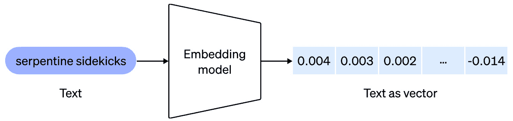

# 第五章：将记忆添加到你的 AI 应用程序中

在上一章中，我们学习了如何使用规划器让我们的用户能够要求我们的应用程序执行我们没有明确编程的动作。在本章中，我们将学习如何使用外部数据，这样我们就可以带来最新的信息并在用户会话之间保持信息。目前，我们将使用用户通过将其保存到**内存**中可能给我们提供的少量外部数据。学习如何使用内存将使我们能够极大地扩展 AI 模型的功能。

这是下一章的构建块，我们将学习使用超过现有模型上下文窗口的数据量的技术。如你所记得，**上下文窗口**是你可以向 AI 服务发送的输入的最大大小。通过使用内存，你可以保存大量数据，并在每次调用中只发送数据的一部分。

我们将首先了解 LLMs 如何通过使用**嵌入**将单词转换为意义，然后比较具有相似意义的短语以从记忆中召回数据。在章节的后面部分，我们将看到如何在聊天应用中保存历史数据。

在本章中，我们将涵盖以下主题：

+   为文本数据创建嵌入

+   在内存中存储数据并在需要时恢复以用于提示

+   使用插件跟踪用户与你的应用程序进行的聊天

+   使用摘要来跟踪长聊天

到本章结束时，你将学会如何帮助你的应用程序记住用户输入的信息，并在需要时检索它。

# 技术要求

为了完成本章，你需要拥有你首选的 Python 或 C#开发环境的最新、受支持的版本：

+   对于 Python，最低支持的版本是 Python 3.10，推荐版本是 Python 3.11

+   对于 C#，最低支持的版本是.NET 8

在本章中，我们将调用 OpenAI 服务。鉴于公司在这类 LLMs 训练上的支出，使用这些服务不是免费的也就不足为奇了。你需要一个**OpenAI API**密钥，无论是直接通过**OpenAI**还是通过**Microsoft**的**Azure OpenAI**服务。

如果你使用.NET，本章的代码位于[`github.com/PacktPublishing/Building-AI-Applications-with-Microsoft-Semantic-Kernel/tree/main/dotnet/ch6`](https://github.com/PacktPublishing/Building-AI-Applications-with-Microsoft-Semantic-Kernel/tree/main/dotnet/ch6)。

如果你使用 Python，本章的代码位于[`github.com/PacktPublishing/Building-AI-Applications-with-Microsoft-Semantic-Kernel/tree/main/python/ch6`](https://github.com/PacktPublishing/Building-AI-Applications-with-Microsoft-Semantic-Kernel/tree/main/python/ch6)。

你可以通过访问 GitHub 仓库并使用以下命令安装所需的包：`pip install -r requirements.txt`。

# 定义内存和嵌入

由 OpenAI 等 AI 服务提供的 LLMs 是**无状态的**，这意味着它们不保留任何先前交互的记忆。当你提交一个请求时，请求本身包含了模型将用于响应的所有信息。你之前提交的任何请求都已经由模型遗忘。虽然这种无状态的性质允许许多有用的应用，但某些情况需要模型在多个请求之间考虑更多的上下文。

尽管它们具有巨大的计算能力，但大多数 LLMs 一次只能处理少量文本，大约一页，尽管最近这一数字有所增加——2023 年 11 月发布的 GPT-4 Turbo 可以接收 128,000 个标记作为输入，这大约是 200 页文本。然而，有时有一些应用需要模型考虑超过 200 页的文本——例如，一个回答关于大量学术论文问题的模型。

记忆是帮助语义内核工作的强大方式，它通过为您的请求提供更多上下文来实现。我们通过使用一个称为**语义记忆搜索**的概念来向语义内核添加记忆，其中文本信息由称为**嵌入**的数字向量表示。自从计算机诞生以来，文本就被转换为数字，以帮助计算机比较不同的文本。例如，将字母转换为数字的 ASCII 表最早于 1963 年发布。LLMs 一次转换的不仅仅是单个字符，而是使用嵌入。

嵌入以单词和短语作为输入，并输出一个长长的数字列表来表示它们。列表的长度取决于嵌入模型。重要的是，含义相似的单词和短语在数值上彼此靠近；如果计算两个相似短语嵌入的数值组件之间的距离，它将小于两个含义非常不同的句子之间的距离。

我们将在*嵌入应用*部分看到一个完整的示例，但为了快速示例，单词短语“*queen*”和“*king*”之间的差异远小于单词短语“*camera*”和“*dog.*”之间的差异。

让我们深入了解一下。

## 语义记忆是如何工作的？

嵌入是将单词或其他数据表示为高维空间中的向量的方式。嵌入对 AI 模型很有用，因为它们可以以计算机可以处理的方式捕捉单词或数据的含义和上下文。嵌入模型接受一个句子、段落，甚至一些页面的文本，并输出相应的嵌入向量：



图 6.1 – 嵌入模型

OpenAI 目前提供给用户的当前最高性能的嵌入模型被称为`text-embedding-3-large`，可以将多达 8,191 个标记（大约 12 页文本）转换为 3,072 维的实数向量。

OpenAI 还提供了不同价格和性能点的额外嵌入模型，例如`text-embedding-3-small`和`text-embedding-ada-2`。在撰写本文时，`text-embedding-3-small`模型提供的性能优于`text-embedding-ada-2`模型，并且它便宜五倍。

作为开发者，你可以将文本数据（包括 AI 服务提供的用户请求和响应）作为嵌入向量存储。重要的是要知道，这并不一定会使数据变小。对于给定的嵌入模型，嵌入向量始终是相同的长度。例如，对于`text-embedding-3-large`模型，嵌入向量长度始终是 3,072。如果你使用这个模型存储单词“*No*”，它将使用一个包含 3,072 个实数的向量，这将占用 12,228 字节的内存，比字符串“`No`”多得多，后者通常可以存储在两个字节中。另一方面，如果你嵌入 12 页的文本，它们的嵌入向量长度也将是 3,072，并占用 12,228 字节的内存。

你可以使用嵌入来回忆在请求之前很久就给应用程序提供的上下文。例如，你可以在数据库中存储与用户的所有对话。如果用户几个月前告诉你他们最喜欢的城市是法国的巴黎，这条信息可以被保存。稍后，当用户询问他们最喜欢的城市中最大的景点是什么时，你可以在你创建的数据库中搜索他们的最爱城市。

向量数据库与 KernelContext 有何不同？

在前面的章节中，我们使用了`KernelContext`类型的变量来向函数传递信息。一个`KernelContext`变量可以被序列化到磁盘上，因此，你可以用它来存储和记住应用程序已经被告知的事情。

差异在于，`KernelContext`变量是一系列键/值对的集合。对于你存储的每条信息，你必须提供一个键，稍后，你必须使用相同的键来检索它。另一方面，向量数据库通过相似性来检索信息，因此即使你不知道存储它的键，你也可以检索到一条信息。

另一个不同之处在于，如果你想的话，向量数据库可以只返回与请求的信息相似的信息子集，而如果你有一个`KernelContext`变量，你需要始终保留所有信息可用，这在你有大量信息时可能会导致性能和容量问题。

当用户与应用程序聊天时，你可以将用户在聊天中输入的每个命令作为嵌入存储，即其数值表示。然后，当用户输入新命令时，你可以通过比较用户刚刚输入的内容的嵌入与之前输入的内容来搜索用户之前输入的所有内容。

因为应用程序使用编码意义的嵌入表示，用户可能几个月前说过“*我最喜欢的城市是巴黎*”，现在可能问“*我最喜欢的城市里最大的景点是什么*”。字符串搜索不会在“*我最喜欢的城市*”和“*最喜欢的城市*”之间找到匹配，但这两个句子将具有彼此接近的嵌入向量，语义搜索会返回“*最喜欢的城市*”作为“*我最喜欢的城市*”的接近匹配。在这种情况下，接近匹配正是你所需要的。

让我们通过一个例子看看如何创建嵌入。

## 嵌入应用

本小节只包含 Python 代码，因为 OpenAI 没有提供 C# API，我们需要直接调用 REST API。本小节将展示嵌入值以帮助你理解嵌入概念，但你不需要实现代码来理解它。

首先，我们需要导入一些库。在 Python 中，线性代数计算在`numpy`库中，因此我们需要导入它：

```py
from openai import OpenAI
from typing import Tuple
import numpy as np
from numpy.linalg import norm
import os
```

在这里，我们将为三个句子生成嵌入，并将它们相互比较。

首先，我们将编写一个函数（`get_embedding`）来生成嵌入：

```py
def get_embedding(text: str) -> Tuple[float]:
    client = OpenAI(api_key=os.getenv("OPENAI_API_KEY"))
    response = client.embeddings.create(
        input=text,
        model="text-embedding-3-small"
    )
    return response.data[0].embedding
```

前面的函数是一个简单的函数调用，只是实例化了一个与 OpenAI 的连接，并调用了`embeddings.create`方法，使用`text-embedding-3-small`模型。

然后，为了比较一个嵌入与另一个嵌入的相似度，我们将使用`0.0`和`1.0`，其中`1.0`表示它们非常相似。

```py
def similarity(A: np.array, B: np.array) -> float:
    # compute cosine similarity
    cosine = np.dot(A,B)/(norm(A)*norm(B))
    return cosine
```

最后一步是调用函数，使用我们想要检查的短语：

```py
if __name__ == "__main__":
    load_dotenv()
    king = get_embedding("The king has been crowned")
    queen = get_embedding("The queen has been crowned")
    linkedin = get_embedding("LinkedIn is a social media platform for professionals")
    print(similarity(king, queen))
    print(similarity(king, linkedin))
    print(similarity(queen, linkedin))
```

三个短语是`"The king has been crowned"`、`"The queen has been crowned"`和`"LinkedIn is a social media platform for professionals"`。我们预计前两个短语是相似的，并且两者都与第三个短语不同。

如预期，这就是我们得到的结果，记住数字在`0.0`和`1.0`之间，其中`0.0`表示不相似，`1.0`表示完美匹配：

```py
0.8684853246664367
0.028215574794606412
0.046607036099519175
```

如果你想查看嵌入本身，你可以打印它们，记住它们使用 1,536 个实数来表示`text-embedding-3-small`模型。

以下代码打印了前 10 个嵌入值：

```py
    for i in range(0, 10):
        print(king[i])
```

下面是结果：

```py
-0.009829566814005375
-0.009656181558966637
0.024287164211273193
0.01408415473997593
-0.03662413731217384
-0.0040411921218037605
-0.00032176158856600523
0.046813808381557465
-0.03235621005296707
-0.04099876061081886
```

现在我们对嵌入的工作原理有了更多的了解，让我们看看如何使用它们与 LLM 结合。

# 在聊天和 LLM 中使用内存

如我们之前所见，模型有一个称为上下文窗口的大小限制。大小限制包括用户请求的提示和响应。例如，GPT-3.5 等模型的默认上下文窗口为 4,096 字节，这意味着你的提示（包括用户请求）和 GPT-3.5 提供的答案最多可以有 4,096 字节；否则，你会得到错误，或者响应会在中间被截断。

如果你的应用程序使用大量文本数据，例如，一本 10,000 页的操作手册，或者允许人们搜索和询问包含数百份文档的数据库，每份文档有 50 页，你需要找到一种方法，只将相关部分的数据集包含在你的提示中。否则，提示本身可能比上下文窗口大，导致错误，或者剩余的上下文窗口可能太短，以至于没有空间让模型提供好的答案。

解决这个问题的方法之一是将每一页总结成一个较短的段落，并为每个摘要生成一个嵌入向量。你不需要在提示中包含所有页面，可以使用余弦相似度等工具通过比较请求嵌入与嵌入向量来搜索相关页面，然后只将相关页面的摘要包含在提示中，这样可以节省很多空间。

使用内存的另一个原因是保持会话之间或提示之间的数据。例如，正如我们在 *语义记忆是如何工作的？* 部分中建议的，用户可能已经告诉过你他们最喜欢的城市是巴黎，当用户要求获取他们最喜欢的城市的指南时，你不需要再次询问；你只需要搜索他们的最喜欢的城市。

要找到与我们的提示相关的内存中的数据，我们可以使用之前章节中展示的余弦距离等工具。在实践中，Semantic Kernel SDK 已经为你提供了搜索功能，因此你不需要自己实现它。此外，你还可以使用几个第三方向量数据库，每个数据库都有自己的搜索功能。

这里是一个你可以直接使用的所有数据库的列表：

| **数据库名称** | **Python** | **C#** |
| --- | --- | --- |
| Azure Cosmos DB for MongoDB vCore |  | ✅ |
| Azure AI Search | ✅ | ✅ |
| Azure PostgreSQL Server | ✅ |  |
| Chroma | ✅ | ✅ |
| DuckDB | ✅ |  |
| Milvus |  | ✅ |
| MongoDB Atlas Vector Search | ✅ | ✅ |
| Pinecone | ✅ | ✅ |
| PostgreSQL | ✅ | ✅ |
| Qdrant | ✅ |  |
| Redis | ✅ |  |
| SQLite | ✅ |  |
| Weaviate | ✅ | ✅ |

表 6.1 — 向量数据库与 Semantic Kernel 的兼容性

除了列出的数据库之外，还有一个叫做 `VolatileMemoryStore` 的数据库，它代表你运行代码的机器的 RAM。这个数据库不是持久的，其内容在代码运行完成后将被丢弃，但它速度快且免费，可以在开发过程中轻松使用。

## 使用 Microsoft Semantic Kernel 的内存

在以下示例中，我们将存储一些关于用户的信息，然后使用 `TextMemorySkill` 核心技能在提示中直接检索它。核心技能是 Semantic Kernel 自带的功能。`TextMemorySkill` 具有将文本放入内存和检索文本的功能。

在以下示例中，我们的用例将是一个用户告诉我们他们的最喜欢的城市和最喜欢的活动。我们将将这些信息保存到内存中，然后检索它们，并根据保存的信息提供行程。

我们首先导入我们通常导入的库，以及一些将在后面描述的内存库。

Python

```py
import asyncio
import semantic_kernel as sk
from semantic_kernel.connectors.ai.open_ai import OpenAITextEmbedding, OpenAIChatCompletion, OpenAIChatPromptExecutionSettings
from semantic_kernel.functions import KernelArguments, KernelFunction
from semantic_kernel.prompt_template import PromptTemplateConfig
from semantic_kernel.utils.settings import openai_settings_from_dot_env
from semantic_kernel.memory.volatile_memory_store import VolatileMemoryStore
from semantic_kernel.memory.semantic_text_memory import SemanticTextMemory
from semantic_kernel.core_plugins.text_memory_plugin import TextMemoryPlugin
```

C#

```py
using Microsoft.SemanticKernel;
using Microsoft.SemanticKernel.Memory;
using Microsoft.SemanticKernel.Plugins.Memory;
using Microsoft.SemanticKernel.Connectors.OpenAI;
#pragma warning disable SKEXP0003, SKEXP0011, SKEXP0052
```

注意，Python 中的内存函数是异步的，因此我们必须包含 `asyncio` 库。此外，在撰写本文时，C# 中的内存函数被标记为实验性，因此您必须使用 `#pragma` 命令禁用实验性警告。

现在，让我们创建一个内核：

Python

```py
def create_kernel() -> tuple[sk.Kernel, OpenAITextEmbedding]:
    api_key, org_id =  openai_settings_from_dot_env()
    kernel = sk.Kernel()
    gpt = OpenAIChatCompletion(ai_model_id="gpt-4-turbo-preview", api_key=api_key, org_id=org_id, service_id="gpt4")
    emb = OpenAITextEmbedding(ai_model_id="text-embedding-ada-002", api_key=api_key, org_id=org_id, service_id="emb")
    kernel.add_service(emb)
    kernel.add_service(gpt)
    return kernel, emb
async def main():
    kernel, emb = create_kernel()
    memory = SemanticTextMemory(storage=VolatileMemoryStore(), embeddings_generator=emb)
    kernel.add_plugin(TextMemoryPlugin(memory), "TextMemoryPlugin")
```

C#

```py
var builder = Kernel.CreateBuilder();
builder.AddOpenAIChatCompletion("gpt-4-turbo-preview", apiKey, orgId);
var kernel = builder.Build();
var memoryBuilder = new MemoryBuilder();
memoryBuilder.WithMemoryStore(new VolatileMemoryStore());
memoryBuilder.WithOpenAITextEmbeddingGeneration("text-embedding-3-small", apiKey);
var memory = memoryBuilder.Build();
```

注意，我们已经向我们的内核添加了三个项目：

+   一个嵌入模型，它将帮助我们加载内容到内存中。对于 C#，我们可以使用 `text-embedding-3-small`，但在撰写本文时，尽管 Python 可以像上一节那样使用 `text-embedding-3-small`，但核心 Python 插件仅与模型 `text-embedding-ada-002` 兼容。

+   内存存储；在这种情况下，`VolatileMemoryStore`，它只是在您的计算机 RAM 中临时存储数据。

+   一个用于生成行程的 GPT 模型；我们正在使用 GPT-4

还要注意，在 C# 中，内存和内核是分别构建的，而在 Python 中，它们是一起构建的。

现在，让我们创建一个向内存添加数据的函数：

Python

```py
 async def add_to_memory(memory: SemanticTextMemory, id: str, text: str):
    await memory.save_information(collection="generic", id=id, text=text)
```

C#

```py
const string MemoryCollectionName = "default";
await memory.SaveInformationAsync(MemoryCollectionName, id: "1", text: "My favorite city is Paris");
await memory.SaveInformationAsync(MemoryCollectionName, id: "2", text: "My favorite activity is visiting museums");
```

向内存添加数据的函数简单地调用 Python 中的 `memory.save_information` 和 C# 中的 `memory.SaveInformationAsync`。您可以使用集合将不同组的信息分开，但在我们的简单案例中，我们将使用 `"generic"` 作为 Python 的默认集合，以及 `"default"` 作为 C# 的默认集合，因为这些是插件的默认集合。`id` 参数不必有任何意义，但它必须对每个项目是唯一的。如果您使用相同的 `id` 参数保存多个项目，则最后保存的项目将覆盖前面的项目。通常生成 GUID 以确保一定程度的唯一性，但如果您只是手动添加少量项目，则可以手动确保 id 不同。

我们现在可以创建一个生成旅行行程的函数：

Python

```py
async def tour(kernel: sk.Kernel) -> KernelFunction:
    prompt = """
    Information about me, from previous conversations:
    - {{$city}} {{recall $city}}
    - {{$activity}} {{recall $activity}}
    """.strip()
    execution_settings = kernel.get_service("gpt4").instantiate_prompt_execution_settings(service_id="gpt4")
    execution_settings.max_tokens = 4000
    execution_settings.temperature = 0.8
    prompt_template_config = PromptTemplateConfig(template=prompt, execution_settings=execution_settings)
    chat_func = kernel.add_function(
        function_name="chat_with_memory",
        plugin_name="TextMemoryPlugin",
        prompt_template_config=prompt_template_config,
    )
    return chat_func
```

C#

```py
kernel.ImportPluginFromObject(new TextMemoryPlugin(memory));
const string prompt = @"
Information about me, from previous conversations:
- {{$city}} {{recall $city}}
- {{$activity}} {{recall $activity}}
Generate a personalized tour of activities for me to do when I have a free day in my favorite city. I just want to do my favorite activity.
";
var f = kernel.CreateFunctionFromPrompt(prompt, new OpenAIPromptExecutionSettings { MaxTokens = 2000, Temperature = 0.8 });
var context = new KernelArguments();
context["city"] = "What is my favorite city?";
context["activity"] = "What is my favorite activity?";
context[TextMemoryPlugin.CollectionParam] = MemoryCollectionName;
```

`TextMemoryPlugin` 允许您在提示中使用 `{{recall $question}}` 来检索内存中的内容，而无需编写任何代码。

例如，假设我们已经将 `My favorite city is Paris` 加载到我们的内存中。当我们用 `"What's my favorite city"` 加载 `$city` 变量并在提示中写入 `{{$city}} {{recall $city}}` 时，Semantic Kernel 将在提示中将该行替换为 `"What's my favorite city? My favorite city is Paris"`。

在内存中存储数据

注意，我们在内存中存储数据时没有使用有意义的键名（我们使用了`"1"`和`"2"`）。您也不需要在存储之前对信息进行分类。一些应用程序只是简单地存储所有内容，而其他应用程序则使用语义函数询问 Semantic Kernel 用户输入是否包含个性化信息，并在这些情况下存储它。

现在，让我们加载内存并调用提示：

Python

```py
    await add_to_memory(memory, id="1", text="My favorite city is Paris")
    await add_to_memory(memory, id="2", text="My favorite activity is visiting museums")
    f = await tour(kernel)
    args = KernelArguments()
    args["city"] = "My favorite city is Paris"
    args["activity"] = "My favorite activity is visiting museums"
    answer = await kernel.invoke(f, arguments=args)
    print(answer)
if __name__ == "__main__":
    asyncio.run(main())
```

C#

```py
await memory.SaveInformationAsync(MemoryCollectionName, id: "1", text: "My favorite city is Paris");
await memory.SaveInformationAsync(MemoryCollectionName, id: "2", text: "My favorite activity is visiting museums");
var result = await f.InvokeAsync(kernel, context);
Console.WriteLine(result);
```

在代码中，我们使用`add_to_memory`函数将信息加载到内存中，并立即调用我们的语义函数`f`。如果您使用除`VolatileMemoryStore`之外的其他任何内存存储，您不需要在同一个会话中实现这两个步骤。我们将在*第七章*中的**RAG**（**检索增强生成**）示例中看到一个持久化内存的例子。

结果

注意，模型回忆起用户最喜欢的城市是巴黎，以及他们最喜欢的活动是去博物馆：

```py
Given your love for Paris and visiting museums, here's a personalized itinerary for a fulfilling day exploring some of the most iconic and enriching museums in the City of Light:
**Morning: Musée du Louvre**
Start your day at the Louvre, the world's largest art museum and a historic monument in Paris. Home to thousands of works of art, including the Mona Lisa and the Venus de Milo, the Louvre offers an unparalleled experience for art lovers. Arrive early to beat the crowds and spend your morning marveling at the masterpieces from across the world. Don't forget to walk through the Tuileries Garden nearby for a peaceful stroll.
**Afternoon: Musée d'Orsay**
Next, head to the Musée d'Orsay, located on the left bank of the Seine. Housed in the former Gare d'Orsay, a Beaux-Arts railway station, the museum holds the largest collection of Impressionist and Post-Impressionist masterpieces in the world. Spend your afternoon admiring works by Monet, Van Gogh, Renoir, and many others.
**Late Afternoon: Musée de l'Orangerie**
Conclude your day of museum visits at the Musée de l'Orangerie, located in the corner of the Tuileries Gardens. This gallery is famous for housing eight large Water Lilies murals by Claude Monet, displayed in two oval rooms offering a breathtaking panorama of Monet's garden-inspired masterpieces. The museum also contains works by Cézanne, Matisse, Picasso, and Rousseau, among others.
**Evening: Seine River Walk and Dinner**
After an enriching day of art, take a leisurely walk along the Seine River. The riverside offers a picturesque view of Paris as the city lights begin to sparkle. For dinner, choose one of the numerous bistros or restaurants along the river or in the nearby neighborhoods to enjoy classic French cuisine, reflecting on the beautiful artworks and memories created throughout the day.
```

注意，如果您为*表 6.1*中列出的任何矢量数据库提供商支付订阅费，您可以直接用他们的构造函数替换`VolatileMemoryStore`构造函数；例如，如果您使用 Pinecone，您将使用`Pinecone(apiKey)`，内存将保存在该数据库中，并在用户下次运行您的应用程序时可供用户使用。我们将在*第七章*中看到一个使用 Azure AI Search 的示例。

现在，让我们看看我们如何在一个与用户的聊天中使用内存。

## 在聊天中使用内存

内存通常用于基于聊天的应用程序。我们在前几章中构建的所有应用程序都是*单次*的——完成任务所需的所有信息都是用户提交的请求的一部分，以及我们在自己的代码中对提示所做的任何修改，例如，通过在`skprompt.txt`中的变量内包含用户提交的提示，或使用字符串操作修改他们的提示。所有之前发生的问题和答案都被忽略。我们说 AI 服务是*无状态的*。

然而，有时我们希望 AI 服务记住之前做出的请求。例如，如果我询问应用程序关于印度人口最多的城市，应用程序将回答它是*Mumbai*。如果然后我询问“*夏天那里的温度如何*”，我期望应用程序意识到我是在询问 Mumbai 的温度，即使我的第二个提示没有包含城市的名字。

正如我们在*第一章*中提到的，暴力解决方案是简单地重复整个聊天历史与每个新的请求。因此，当用户提交第二个请求时，我们可以静默地附加他们的第一个请求以及我们的 AI 服务提供的响应，然后再次将所有内容一起提交给 AI 服务。

让我们看看如何做到这一点。我们首先进行常规导入：

Python

```py
import asyncio
import semantic_kernel as sk
from semantic_kernel.connectors.ai.open_ai import OpenAIChatCompletion, OpenAIChatPromptExecutionSettings
from semantic_kernel.functions import KernelFunction
from semantic_kernel.prompt_template import PromptTemplateConfig, InputVariable
from semantic_kernel.core_plugins import ConversationSummaryPlugin
from semantic_kernel.contents.chat_history import ChatHistory
from semantic_kernel.utils.settings import openai_settings_from_dot_env
```

C#

```py
using Microsoft.SemanticKernel;
using Microsoft.SemanticKernel.Connectors.OpenAI;
using Microsoft.SemanticKernel.Plugins.Core;
#pragma warning disable SKEXP0003, SKEXP0011, SKEXP0052, SKEXP0050
```

注意，在 C#中，由于 Semantic Kernel 包的几个组件仍在预发布阶段，你需要使用`#pragma`指令禁用实验性警告。

在导入库之后，我们创建内核：

Python

```py
def create_kernel() -> sk.Kernel:
    api_key, org_id =  openai_settings_from_dot_env()
    kernel = sk.Kernel()
    gpt = OpenAIChatCompletion(ai_model_id="gpt-4-turbo-preview", api_key=api_key, org_id=org_id, service_id="gpt4")
    kernel.add_service(gpt)
    # The following execution settings are used for the ConversationSummaryPlugin
    execution_settings = OpenAIChatPromptExecutionSettings(
        service_id="gpt4", max_tokens=ConversationSummaryPlugin._max_tokens, temperature=0.1, top_p=0.5)
    prompt_template_config = PromptTemplateConfig(
        template=ConversationSummaryPlugin._summarize_conversation_prompt_template,
        description="Given a section of a conversation transcript, summarize it",
        execution_settings=execution_settings,
    )
    # Import the ConversationSummaryPlugin
    kernel.add_plugin(
        ConversationSummaryPlugin(kernel=kernel, prompt_template_config=prompt_template_config),
        plugin_name="ConversationSummaryPlugin",
    )
    return kernel
```

C#

```py
var (apiKey, orgId) = Settings.LoadFromFile();
var builder = Kernel.CreateBuilder();
builder.AddOpenAIChatCompletion("gpt-4-turbo-preview", apiKey, orgId);
var kernel = builder.Build();
kernel.ImportPluginFromObject(new ConversationSummaryPlugin());
```

我们的内核只需要一个聊天完成服务。我正在使用 GPT-4，但 GPT-3.5 也适用。我还添加了`ConversationSummaryPlugin`，它将在本章的最后一个小节*使用摘要减少历史大小*中使用。我们将在稍后详细解释它，但正如其名称所暗示的，它总结了对话。

现在，让我们创建主要的聊天函数：

Python

```py
async def create_chat_function(kernel: sk.Kernel) -> KernelFunction:
    # Create the prompt
    prompt = """
    User: {{$request}}
    Assistant:  """
    # These execution settings are tied to the chat function, created below.
    execution_settings = kernel.get_service("gpt4").instantiate_prompt_execution_settings(service_id="gpt4")
    chat_prompt_template_config = PromptTemplateConfig(
        template=prompt,
        description="Chat with the assistant",
        execution_settings=execution_settings,
        input_variables=[
            InputVariable(name="request", description="The user input", is_required=True),
            InputVariable(name="history", description="The history of the conversation", is_required=True),
        ],
    )
    # Create the function
    chat_function = kernel.add_function(
        prompt=prompt,
        plugin_name="Summarize_Conversation",
        function_name="Chat",
        description="Chat with the assistant",
        prompt_template_config=chat_prompt_template_config,)
    return chat_function
```

C#

```py
const string prompt = @"
Chat history:
{{$history}}
User: {{$userInput}}
Assistant:";
var executionSettings = new OpenAIPromptExecutionSettings {MaxTokens = 2000,Temperature = 0.8,};
var chatFunction = kernel.CreateFunctionFromPrompt(prompt, executionSettings);
var history = "";
var arguments = new KernelArguments();
arguments["history"] = history;
```

现在，让我们编写我们程序的主循环：

Python

```py
async def main():
    kernel = create_kernel()
    history = ChatHistory()
    chat_function = await create_chat_function(kernel)
    while True:
        try:
            request = input("User:> ")
        except KeyboardInterrupt:
            print("\n\nExiting chat...")
            return False
        except EOFError:
            print("\n\nExiting chat...")
            return False
        if request == "exit":
            print("\n\nExiting chat...")
            return False
        result = await kernel.invoke(
            chat_function,
            request=request,
            history=history,
        )
        # Add the request to the history
        history.add_user_message(request)
        history.add_assistant_message(str(result))
        print(f"Assistant:> {result}")
if __name__ == "__main__":
    asyncio.run(main())
```

C#

```py
var chatting = true;
while (chatting) {
    Console.Write("User: ");
    var input = Console.ReadLine();
    if (input == null) {break;}
    input = input.Trim();
    if (input == "exit") {break;}
    arguments["userInput"] = input;
    var answer = await chatFunction.InvokeAsync(kernel, arguments);
    var result = $"\nUser: {input}\nAssistant: {answer}\n";
    history += result;
    arguments["history"] = history;
    // Show the bot response
    Console.WriteLine(result);
}
```

我们程序的主循环会一直运行，直到用户输入单词`"exit"`。否则，我们将用户请求提交给 AI 服务，收集其答案，并将两者都添加到`history`变量中，我们也将它作为请求的一部分提交。

虽然这解决了总是需要整个历史的问题，但随着提示变得越来越大，这变得过于昂贵。当用户提交其请求编号*N*时，`history`变量包含他们的请求`1`，…，*N*-`1`，以及聊天机器人随附的答案`1`，…，*N*-`1`。对于大的*N*，除了成本高昂之外，这还可能超过 AI 服务的上下文窗口，你将得到一个错误。

解决方案是只向 AI 服务传递历史摘要。幸运的是，总结对话是即使是较老模型也能做得很好的事情。让我们看看如何使用 Semantic Kernel 轻松完成它。

## 使用摘要减少历史大小

如果你想要在不丢失太多上下文的情况下减少提示，可以使用 AI 服务总结对话中已经发生的内容。为此，你可以使用我们在创建内核时导入的`ConversationSummaryPlugin`的`SummarizeConversation`函数。现在，不再需要在提示中重复整个历史，摘要将根据对话大小最多包含 1,000 个 token，这对于大多数用例应该足够了。要总结`$history`变量中的历史，只需在提示中调用`{{ConversationSummaryPlugin.SummarizeConversation $history}}`即可。

即使在过度总结之后，仍然可能丢失细节。如果你试图用 1,000 个单词总结 1,000 页的内容，某些东西将会丢失。为了防止这个问题，大多数应用程序都对对话的长度有限制。例如，在撰写本文时，Microsoft Copilot 对话的限制为 20 次交互，在那之后你必须重新开始对话（带有空内存）。

代码的更改如下所示；你只需更改`prompt`变量的内容。此更改将在提示中添加一个对话摘要，这将提醒 LLM 之前发生的一切。摘要将不会显示给用户。

Python

```py
prompt = """
Chat history:
{{ConversationSummaryPlugin.SummarizeConversation $history}}
User: {{$userInput}}
Assistant:
"""
```

C#

```py
const string prompt = @"
Chat history:
{{ConversationSummaryPlugin.SummarizeConversation $history}}
User: {{$userInput}}
ChatBot:";
```

结果

```py
User:> What is the largest city by population in Western Europe?
Assistant:> The largest city by population in Western Europe is London, United Kingdom.
```

注意，在下一个问题中，我将使用“那里”这个词来指代伦敦。由于历史摘要被包含在对话中，尽管我的下一个问题没有明确提到伦敦，但发送给 AI 的提示中包含了这个信息：

```py
User:> Are there any famous people who lived there?
Assistant:> Yes, London has been home to many famous people throughout history. Some notable individuals include:
1\. **William Shakespeare** - The renowned playwright and poet lived in London for most of his career.
2\. **Charles Dickens** - The famous novelist, known for works like "Oliver Twist" and "A Christmas Carol," spent much of his life in London.
3\. **Winston Churchill** - The iconic British Prime Minister during World War II was born in Woodstock but lived and worked in London for much of his life.
```

注意，上一个问题的答案是正确的。莎士比亚、狄更斯和丘吉尔都住在伦敦。现在，我将通过其在列表中的位置来提及莎士比亚，并将伦敦简单地称为`那个城市`，因为我们正在追踪历史，内核将知道我指的是莎士比亚和伦敦：

```py
User:> What is a famous play from the first one set in that city?
Assistant:> A famous play from William Shakespeare that is set in London is "Henry V." This historical play, part of Shakespeare's series on the English monarchs, includes scenes that are set in London, notably the English court. It portrays the events before and after the Battle of Agincourt during the Hundred Years' War, with significant portions reflecting on the life and times in London during the early 15th century.
```

再次，AI 给出了正确的答案。《亨利五世》这部戏剧实际上是在伦敦上演的。

让我们退出聊天：

```py
User:> exit|
Exiting chat...
```

# 摘要

在本章中，我们学习了如何添加和检索信息，以及如何轻松地将记忆包含在提示中。LLMs 是无状态的，并且受到其提示大小的限制，在本章中，我们学习了在会话之间保存信息并减少提示大小，同时仍然在提示中包含相关对话部分的技术。

在下一章中，我们将看到如何使用向量数据库从记忆中检索更多信息，并使用称为**检索增强生成**（**RAG**）的技术以有用的方式组织和展示这些信息。这种技术通常用于企业应用，因为你在 LLMs 提供的创造性上做出一些妥协，但获得了额外的精确性、展示参考文献的能力以及使用你拥有和控制的大量数据的能力。

对于我们的应用程序，我们将把数千篇学术论文加载到向量数据库中，并让语义内核搜索一个主题，并为我们总结研究。

# 第三部分：现实世界用例

在这部分，我们看到了语义内核如何在现实世界问题中得到应用。我们学习了如何使用检索增强生成（RAG）技术，使 AI 模型能够使用大量数据，包括在 AI 服务训练时不可用的非常最新的数据。我们通过学习如何使用 ChatGPT 将我们编写的应用程序分发给数亿用户来结束本部分。

本部分包括以下章节：

+   *第七章*，*现实世界用例 – 检索增强生成*

+   *第八章*，*现实世界用例 – 在 ChatGPT 上使你的应用程序可用*
