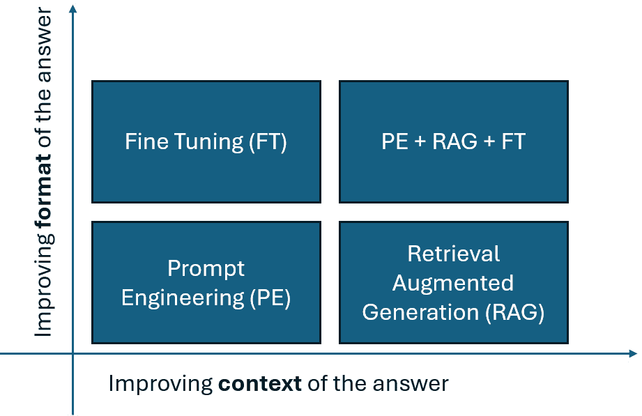
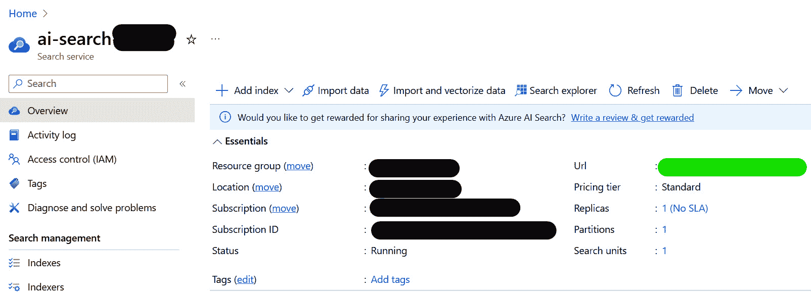

# 真实世界用例 - 检索增强生成

在上一章中，我们学习了如何通过在内存中保留小块知识并将其按需检索来增强我们的内核，这使得我们的应用程序能够更加个性化。基于云的 AI 模型，如 OpenAI 的 GPT，通常具有知识截止日期，大约是几个月前。它们通常也没有特定领域的知识，例如您公司制造产品的用户手册，也不知道用户的偏好，例如他们最喜欢的编程语言或他们最喜欢的城市。上一章向您介绍了通过在内存中保留小块知识并将其按需检索来增强模型知识的方法。

在本章中，我们将向您展示如何扩展可供您的 AI 应用程序使用的数据。我们不会使用适合提示的小量数据，而是将使用大量数据，通过一个 **检索增强生成**（**RAG**）应用程序来实现，该应用程序结合了最新的生成式 AI 模型与最近的专业信息，以回答关于特定主题的问题——在我们的案例中，是关于 AI 的学术论文。

RAG 利用大量机构拥有有用的数据这一事实，这些数据并未用于训练 OpenAI 的 GPT。这为这些机构提供了一种将这些数据投入使用的同时，还能利用 GPT 的生成能力的方法。

在本章中，我们将涵盖以下主题：

+   使用 Azure AI 搜索服务创建文档索引

+   将大量文档加载到索引中

+   创建一个搜索索引并使用 AI 基于找到的数据编写答案的应用程序

到本章结束时，您将创建一个应用程序，该应用程序使用大量最近的数据，并使用 AI 以用户友好的方式查找和组合数据。

# 技术要求

要完成本章，您需要拥有您首选的 Python 或 C# 开发环境的最新、受支持的版本：

+   对于 Python，最低支持的版本是 Python 3.10，推荐版本是 Python 3.11

+   对于 C#，最低支持的版本是 .NET 8。

在本章中，我们将调用 OpenAI 服务。鉴于公司在训练这些大型语言模型（LLM）上所花费的金额，使用这些服务并非免费也就不足为奇了。您需要获取一个 **OpenAI API** 密钥，可以通过直接从 **OpenAI** 或 **Microsoft** 获取，或者通过 **Azure OpenAI** 服务。

如果您使用 .NET，本章的代码位于 [`github.com/PacktPublishing/Building-AI-Applications-with-Microsoft-Semantic-Kernel/tree/main/dotnet/ch7`](https://github.com/PacktPublishing/Building-AI-Applications-with-Microsoft-Semantic-Kernel/tree/main/dotnet/ch7)。

如果您正在使用 Python，本章的代码位于[`github.com/PacktPublishing/Building-AI-Applications-with-Microsoft-Semantic-Kernel/tree/main/python/ch7`](https://github.com/PacktPublishing/Building-AI-Applications-with-Microsoft-Semantic-Kernel/tree/main/python/ch7)。

要创建文档索引，您需要 Microsoft Azure AI Search 的免费试用版。

您可以通过访问 GitHub 仓库并使用以下命令安装所需的包：`pip install -r requirements.txt`。

# 为什么您需要自定义 GPT 模型？

GPT 模型在未经任何自定义的情况下已经非常有用。当您的用户输入请求时，作为程序员的您可以将请求简单地转发给 GPT 模型（如 GPT-3.5 或 GPT-4），在许多情况下，模型未经修改的响应已经足够好。然而，在许多情况下，响应并不足够好。响应问题可以分为三类：

+   **非文本功能**：在某些情况下，您想要的响应不是基于文本的。例如，您可能希望允许您的用户打开或关闭灯光，执行复杂的数学运算，或将记录插入数据库。

+   **缺乏上下文**：如果模型没有接触过包含答案的数据，它们就无法准确回答问题。尽管经过大量数据的训练，但仍有大量数据 LLM 尚未接触过。撰写本文时，用于训练 GPT 3.5 和 GPT-4 的数据截止日期为 2021 年 9 月，尽管有一个名为 GPT-4 Turbo 的 GPT-4 预览版本，其截止日期为 2023 年 12 月（您可以在[`platform.openai.com/docs/models/`](https://platform.openai.com/docs/models/)上查看模型的截止日期）。此外，模型无法访问专有数据，例如贵公司的内部文件。

+   `仅用 Y 或 N 回答您的提示`，但某些请求返回的响应可能是`Yes`（而不是*Y*）或`答案是肯定的`，这需要添加代码来验证答案。

我们向您展示了如何使用语义内核通过原生函数解决第一个问题（非文本功能），如*第三章*中所示。然而，如果您收到的响应问题在于缺乏上下文或格式，您可以使用以下图表中描述的技术：



图 7.1 – 提高响应的技术

您应该始终尝试的第一个技术是**提示工程**，我们在*第二章*中详细介绍了这一技术。提示工程既容易做又容易测试：它可以用来向 LLM 提供新数据（改善上下文），也可以提供一些示例，说明您希望答案看起来如何（改善格式）。

例如，假设你正在构建一个应用程序，为你的团队提供午餐地点的建议，这对于开发团队来说总是一个挑战。与其简单地问“我们午餐去哪里？”，不如通过添加上下文和格式规范来获得更好的结果，例如：“我们是一支由六个 25-38 岁的开发者组成的团队，其中两人是素食主义者，我们想在周五靠近埃菲尔铁塔的地方吃午餐。我们希望每人花费不超过 20 欧元，并且我们不想花费超过 90 分钟吃午餐。请以地点名称、网站、平均价格和街道地址的形式提供你的答案。”格式规范是最后一句话。

主要的缺点是，你想要提供的数据越多，指令越复杂，你的提示就会变得越大，从而导致额外的成本和延迟。

除了通过提示工程提供示例之外，你还可以使用微调模型来改进你答案的格式。微调允许你向现有的模型（例如 GPT-3.5）提供成百上千个问题和答案的示例，并保存一个新的、经过微调的模型。

成功微调的一个例子是展示成千上万种你期望 JSON 输出应该呈现的方式。由于你提供了成千上万的示例，你不能将这些示例传递给每个提示，因为提示会变得太大。你可以创建一个包含成千上万问题和 JSON 答案的文件，并使用 OpenAI 微调 API 或微调 UI 创建一个经过你额外示例训练的定制 GPT 模型。结果将是一个在提供 JSON 答案方面表现得更好，而在其他方面表现更差的模型。

如果你的应用程序只需要提供 JSON 格式的答案，这正是你所需要的。Microsoft Semantic Kernel 并不帮助进行微调，因此微调技术不在此书的范围之内。如果你想了解更多关于微调的信息，Sebastian Raschka（Packt 作者）的这篇在线文章可能会有所帮助：[`magazine.sebastianraschka.com/p/finetuning-large-language-models`](https://magazine.sebastianraschka.com/p/finetuning-large-language-models)。

在实践中，最常见的问题之一是 LLM 可能没有足够的上下文来提供你想要的答案。即使提供答案所需的数据已经被用于训练模型，这也可能发生：由于 LLM 是用大量数据进行训练的，你可能需要向你的请求中添加相关数据，以帮助模型从它训练的大量数据中回忆起与你的请求相关的数据。例如，如果你只是问 GPT “谁是史上最佳足球运动员？”，它可能不知道你指的是足球（足球）还是 NFL（美国足球）。

在某些其他情况下，正如我们之前在提到截止日期和私人数据示例时讨论的那样，模型从未见过回答问题所需的数据，你需要在你提出请求时将其展示给模型。

在一定程度上，你可以通过提示工程来解决这两个问题：

+   你可以指示模型扮演一个角色。例如，你可以添加 `你是一名 Python 软件工程师` 来引导模型以更技术性的方式回答，或者添加 `你是一个五岁的孩子` 来引导模型以更简单的方式回答。

+   你可以向模型提供一些数据示例。例如，你可以在提示中直接添加 `如果用户说'地球是平的'，回复'错误信息'；如果用户说'登月是假的'，回复'错误信息'；如果用户说'鸟是真实的'，回复"真实"`，或者通过使用语义函数中的提示模板。

+   你可以在提示模板中添加一些字段并在实时填充它们。例如，你可以从系统中获取今天的日期并创建一个提示，声明 `从今天到 1776 年 7 月 4 日，相差的天数是……"`，动态地替换 `$today`，因此将最近的信息传递给模型。

提示工程的第一个缺点是，你需要传递的数据越多，你的提示就会越大，这会使提示更昂贵。它还会增加延迟，因为 LLM 处理长提示需要更长的时间。

即使你的预算可以支持额外的成本，并且你的用户非常耐心，不介意等待答案，仍然存在两个问题。第一个问题是，随着提示的增大，LLMs 的准确性会降低[1]。第二个问题是，在某个时候，你可能会耗尽模型上下文窗口的空间。例如，假设你为一家制造汽车的公司工作，你想帮助用户在用户手册中找到关于他们汽车的答案，但手册有 300 页长。即使你解决了所有之前的问题，你也不能在提示中传递整个手册，因为它放不下。

最好的解决方案是将用户手册分成几个部分，并将这些部分保存到索引中。当用户提问时，你可以使用搜索算法通过使用诸如余弦相似度等方法返回最相关的部分，如*第六章*所示。然后，你只需要将相关的部分传递给提示。这种技术的名称是 RAG，并且它被广泛使用。Semantic Kernel 使其易于实现，但你还需要一个索引。让我们深入了解细节。

# 检索增强生成

RAG 是一种结合预训练语言模型的力量和信息检索来根据大量文档生成响应的方法。这对于生成基于外部知识（不包含在模型训练数据集中）的知情响应特别有用。

RAG 涉及三个步骤：

+   **检索**：给定一个输入查询（例如，一个问题或提示），你使用一个系统从你的数据源中检索相关文档或段落。这通常是通过嵌入来完成的。

+   **增强**：检索到的文档随后被用来增强输入提示。通常这意味着创建一个结合检索步骤中的数据并添加一些提示工程的提示。

+   **生成**：增强后的提示随后被输入到一个生成模型，通常是 GPT，它生成输出。因为提示包含了检索到的文档中的相关信息，模型可以生成受外部知识启发的外部知识。

除了向 AI 服务提供额外的和更近期的信息外，RAG 还可以帮助进行**扎根**。扎根是将语言模型的响应与准确、可靠和上下文适当的知识或数据联系起来的过程。这在事实准确性和相关性至关重要的场景中尤为重要，例如回答有关科学、历史或当前事件的问题。扎根有助于确保模型提供的信息不仅合理，而且正确，并且适用于现实世界。

当你使用 RAG 时，你向 LLM 提供你希望它用来生成你响应的数据。如果你的数据是准确、可靠和上下文适当的，那么 LLM 使用这些数据生成的文本很可能也是准确、可靠和上下文适当的。你甚至可以要求生成步骤提供它使用的文档的链接。我们将在我们的示例中看到这一点。

假设你想要总结关于具有大上下文窗口的模型最新发现的内容。首先，你需要通过进行网络搜索或使用学术论文数据库来检索关于最新发现的信息。

要实现 RAG，你需要一些额外的组件：

+   `numpy`具有免费的优势。

+   **检索系统**：用于根据输入查询从文档存储中找到最相关文档的软件。

大多数向量数据库供应商提供与他们的服务兼容的算法，最近，大多数解决方案都采用了向量比较，如余弦相似度。例如，Pinecone 和 Azure AI Search 等服务提供文档和嵌入存储和检索算法。

在我们的例子中，我们将创建一个应用程序，允许你搜索和询问来自 ArXiV 数据库的 AI 论文。我们下载了 2021 年及以后提交的 *计算与语言* 类别中所有论文的 ArXiV ID、作者、标题和摘要列表。这个数据集可以在本书的 GitHub 仓库中找到：[`github.com/PacktPublishing/Microsoft-Semantic-Kernel/blob/b1187f88f46589f14a768e3ee7b89bef733f1263/data/papers/ai_arxiv_202101.json`](https://github.com/PacktPublishing/Microsoft-Semantic-Kernel/blob/b1187f88f46589f14a768e3ee7b89bef733f1263/data/papers/ai_arxiv_202101.json)。

数据集包含总共 36,908 篇科学文章。它们的摘要内容位于 `abstract` 字段中，包含超过 4000 万个字符，这大约需要 1000 万个标记，即使是最大的 AI 模型也无法处理。

我们将把所有这些数据加载到 Azure AI 搜索索引中。但在加载文章之前，我们必须创建索引。

## 创建索引

为了存储和检索大量数据，我们需要创建一个索引。为此，你必须有一个 Azure 账户，并必须创建一个 Azure AI 搜索服务。只需搜索 `Azure AI Search` 并点击 **创建**；你将被要求输入一个名称。你需要服务的端点，你可以在 **配置** 选项卡中找到它，如图 *7**.2* 所示。或者你创建的 Azure AI 搜索服务。*图 7**.2* 显示了你在 **Url** 字段中创建的服务端点，用绿色标记：



图 7.2 – Azure AI 搜索配置屏幕

你还需要一个管理密钥，你可以在 Azure AI 搜索服务的 **密钥** 选项卡下找到。

创建服务只是第一步：服务只是一个存储一个或多个索引的地方，而索引是我们将存储数据的地方。现在我们有了服务，我们需要编写代码来创建索引。

字段名称值得提及。如果你能使用一些标准名称——即 `Id`、`AdditionalMetadata`、`Text`、`Description`、`ExternalSourceName`、`IsReference` 和 `Embedding`，你的生活将会轻松很多。字段名称应使用特定的首字母大写。如果你使用这些名称，你可以轻松地使用 Azure AI 搜索语义内核连接的预览版本，这将使你的代码更小。你将用于搜索的文本（在我们的例子中是摘要）应该是 `Text`。在下面的代码中，我将将这些字段映射到我们需要的内容。

那么，让我们看看如何在 Python 中实现这一点。稍后，我们将学习如何在 C# 中实现。

### 使用 Python 创建索引

在 Python 脚本中编写以下代码以创建索引：

```py
from azure.core.credentials import AzureKeyCredential
from azure.search.documents.indexes import SearchIndexClient
```

首先，你需要导入 `AzureKeyCredential` 函数来读取你的管理密钥，以及 `SearchIndexClient` 来创建一个对象，该对象将允许你与 Azure AI 搜索服务交互。

接下来，我们将导入我们将要在索引中使用的一些类：

```py
from azure.search.documents.indexes.models import (
    SearchIndex,
    SearchField,
    SearchFieldDataType,
    SimpleField,
    SearchableField,
    VectorSearch,
    HnswAlgorithmConfiguration,
    HnswParameters,
    VectorSearchAlgorithmKind,
    VectorSearchProfile,
    VectorSearchAlgorithmMetric,
)
```

对于我们想要使用嵌入进行搜索的字段，我们使用`SearchField`类型。对于其他字段，如果我们不打算在它们内部搜索内容，则使用`SimpleField`类型，如果我们希望它们可以通过字符串比较进行搜索，则使用`SearchableField`类型。

接下来，让我们使用`SearchIndexClient`类创建一个 API 客户端，该客户端将使用`SearchIndexClient`类向索引集合中添加一个新的索引：

```py
def main() -> None:
    index_name = os.getenv("ARXIV_SEARCH_INDEX_NAME")
    service_name = os.getenv("ARXIV_SEARCH_SERVICE_NAME")
    service_endpoint = f"https://{service_name}.search.windows.net/"
    admin_key = os.getenv("ARXIV_SEARCH_ADMIN_KEY")
    credential = AzureKeyCredential(admin_key)
    # Create a search index
    index_client = SearchIndexClient(
        endpoint=service_endpoint, credential=credential)
    index_client.delete_index(index_name)
```

在开发阶段，需要通过添加或删除字段、更改嵌入的大小等方式重新设计索引的情况并不少见。因此，我们通常在脚本中删除并重新创建字段。在前面的代码片段中，我们使用`delete_index`方法删除了一个字段。

以下代码指定了字段及其属性，以帮助描述索引将包含哪些字段：

```py
fields = [
    SimpleField(name="Id", type=SearchFieldDataType.String, key=True, sortable=True, filterable=True, facetable=True),
    SearchableField(name="AdditionalMetadata", type=SearchFieldDataType.String),
    SearchableField(name="Text", type=SearchFieldDataType.String),
    SearchableField(name="Description", type=SearchFieldDataType.String),
    SearchableField(name="ExternalSourceName", type=SearchFieldDataType.String),
    SimpleField(name="IsReference", type=SearchFieldDataType.Boolean),
    SearchField(name="Embedding", type=SearchFieldDataType.Collection(SearchFieldDataType.Single),
                searchable=True, vector_search_dimensions=1536, vector_search_profile_name="myHnswProfile"),
]
```

在这里，我们将数据集中已有的字段添加到索引中：`id`、`authors`、`title`和`abstract`。此外，我们还在索引中添加了一个名为`Embedding`的字段，我们将在此字段中放置文章摘要的嵌入向量。对于该字段，我们需要指定一个向量搜索算法配置文件和一个向量搜索维度。维度是嵌入的大小。由于我们正在使用新的`OpenAI text-embeddings-3-small`，因此嵌入的大小为 1,536。

这些嵌入用于搜索算法。Azure AI Search 使用一个名为**分层可导航小世界**（**HNSW**）的算法，这是一个灵活的算法，与高维空间（如我们嵌入的维度数）的最近邻算法密切相关。我们将稍后使用此算法在我们的索引中搜索项目，并检索与搜索内容更相关的项目。让我们将其添加到我们的嵌入字段中：

```py
    # Configure the vector search configuration
    vector_search = VectorSearch(
        algorithms=[
            HnswAlgorithmConfiguration(
                name="myHnsw",
                kind=VectorSearchAlgorithmKind.HNSW,
                parameters=HnswParameters(
                    m=10,
                    ef_construction=400,
                    ef_search=500,
                    metric=VectorSearchAlgorithmMetric.COSINE
                )
            )
        ],
        profiles=[
            VectorSearchProfile(
                name="myHnswProfile",
                algorithm_configuration_name="myHnsw",
            )
        ]
    )
```

在前面的代码片段中，我们使用了余弦相似度作为度量标准，该标准决定了索引中与用户搜索内容更相关的项目。目前，我们使用了默认参数`m=10`、`ef_construction=400`和`ef_search=500`。参数中的`ef`代表*探索因子*。

`m`参数控制索引的密度——在索引中，每条记录将具有`m`个邻居。`ef_construction`参数增加了用于为每条记录找到邻居的候选者数量：此参数越高，搜索就越彻底。`ef_search`参数控制运行时搜索的深度——也就是说，当执行搜索时，从索引中检索多少结果进行比较。

增加`ef_construction`会导致索引构建时间更长，而增加`ef_search`会导致运行时搜索时间更长。在大多数情况下，这些数字可以非常接近，但如果你计划频繁更新索引且不想构建时间变长，你可以增加`ef_search`。另一方面，如果你的搜索在运行时已经足够长，并且你想提高其质量，你可以增加`ef_construction`，因为它会使结果更好，但只会增加构建索引的时间，而不会增加执行搜索的时间。

这些参数的值越高，索引在查找记录方面表现得越好，但它们也会使构建和搜索索引的时间更长。我们在这里使用的参数对示例来说效果很好，但当你使用自己的数据集为你的应用程序时，务必对参数进行实验。

最后，我们只需调用`create_or_update_index`并传入我们指定的所有参数。这个命令将创建索引：

```py
    # Create the search index with the semantic settings
    index = SearchIndex(name=index_name, fields=fields,
                        vector_search=vector_search)
    result = index_client.create_or_update_index(index)
    print(f' {result.name} created')
if __name__ == '__main__':
    load_dotenv()
    main()
```

现在我们有了索引，我们可以将数据集中的记录（每条记录称为文档）上传到其中。

接下来，我们将学习如何使用 C#创建索引。

### 使用 C#创建索引

使用 C#创建索引要简单得多。首先，我们必须在类中定义字段，我选择将其称为`SearchModel`：

```py
using Azure.Search.Documents.Indexes;
using Azure.Search.Documents.Indexes.Models;
public class SearchModel
{
    [SimpleField(IsKey = true, IsSortable = true, IsFilterable = true, IsFacetable = true)]
    public string Id { get; set; }
    [SearchableField]
    public string AdditionalMetadata { get; set; }
    [SearchableField]
    public string Text { get; set; }
    [SearchableField]
    public string Description { get; set; }
    [SearchableField]
    public string ExternalSourceName { get; set; }
    [SimpleField(IsFilterable = true)]
    public bool IsReference { get; set; }
}
```

在这里，我们使用与 Python 相同的字段名。请注意，我们没有创建一个`Embedding`字段，就像在 Python 中那样。这将在我们加载文档时动态创建。

让我们看看如何创建索引：

```py
using Azure;
using Azure.Search.Documents;
using Azure.Search.Documents.Indexes;
using Azure.Search.Documents.Indexes.Models;
var (apiKey, orgId, searchServiceName, searchServiceAdminKey, searchIndexName) = Settings.LoadFromFile();
string indexName = searchIndexName;
AzureKeyCredential credential = new AzureKeyCredential(searchServiceAdminKey);
SearchIndexClient indexClient = new SearchIndexClient(new Uri(searchServiceName), credential);
indexClient.DeleteIndex(indexName);
var fields = new FieldBuilder().Build(typeof(SearchModel));
SearchIndex index = new SearchIndex(indexName)
{
    Fields = fields,
    // Add vector search configuration if needed
};
var result = indexClient.CreateOrUpdateIndex(index);
```

代码很简单：首先，我们使用`FieldBuilder`类在`SearchModel`中创建字段列表；然后，我们使用`SearchIndex`类创建一个`index`对象；最后，我们调用`CreateOrUpdateIndex`在云服务中创建索引。

## 将文档上传到索引

虽然将文档加载到索引中也很直接，但还有一些细节我们需要注意。

第一个细节是文档的唯一标识符。在我们的案例中，那就是`Id`字段。在理想情况下，你想要加载的数据将有一个唯一且不可变的标识符。

幸运的是，ArXiV 数据库就是这样：ArXiV 数据库中的`Id`字段是唯一且不可变的，并且可以始终用于在线搜索文章。例如，ID 为`2309.12288`的文章将始终是*《逆转诅咒：在“A 是 B”上训练的 LLMs 无法学习“B 是 A”》*文章的最新版本[2]，该文章讨论了 LLMs 的一个怪癖：当被问及汤姆·克鲁斯的母亲是谁时，它有 79%的概率给出正确答案，玛丽·李·佩菲弗，79 岁。当被问及玛丽·李·佩菲弗的著名演员儿子是谁时，它只有 33%的概率给出正确答案，汤姆·克鲁斯。

`Id` 字段的唯一性和不可变性使我们能够根据需要更新索引以包含新信息。然而，有一个注意事项：在索引中，`Id` 字段只能包含数字、字母和下划线，因此我们需要将点替换为下划线。

第二个细节是我们需要加载嵌入。对于 Python 来说，在撰写本文时，这将需要我们手动计算嵌入，就像我们在 *第六章* 中所做的那样。不同的嵌入模型会产生具有不同含义的数据向量，通常大小也不同，即使大小相同，除非明确说明，否则嵌入是不兼容的。

因此，你不能使用一个模型创建嵌入，然后使用另一个嵌入模型进行搜索。这也意味着编写执行搜索代码的人需要知道用于加载索引数据的确切嵌入模型。在 C# 中，我们可以使用名为 `Microsoft.SemanticKernel.Connectors.AzureAISearch` 的连接器。虽然该连接器目前仍处于预览阶段，但它将大大简化事情。这应该很快就会对 Python 可用，但在撰写本文时还没有。

现在我们已经了解了这些细节，让我们编写一些代码来将文档加载到索引中。

### 使用 Python 上传文档

我们首先导入几个包：

```py
from azure.core.credentials import AzureKeyCredential
from azure.search.documents import SearchClient
```

第一组包用于连接到 Azure AI Search 索引。这些包与我们创建索引时使用的包类似，但请注意，我们正在使用一个不同的类，`SearchClient`，而不是 `SearchIndexClient`。

现在，让我们加载语义内核包：

```py
import asyncio
import semantic_kernel as sk
import semantic_kernel.connectors.ai.open_ai as sk_oai
```

这些语义内核包将被用来连接到 OpenAI 服务并生成嵌入。

最后，我们将导入一些包来帮助我们控制程序的流程：

```py
from tenacity import retry, wait_random_exponential, stop_after_attempt
import pandas as pd
import os
from dotenv import load_dotenv
```

当你需要调用可能会失败的功能时，`tenacity` 库非常有用，因为它为你提供了自动重试的功能。`pandas` 库用于加载 CSV 文件。它不是严格必要的；即使没有它，你也可以直接操作 CSV 文件，但 `pandas` 库使这个过程更容易。

接下来，让我们定义一个辅助函数来生成嵌入：

```py
@retry(wait=wait_random_exponential(min=1, max=5), stop=stop_after_attempt(3))
async def generate_embeddings(kernel: sk.Kernel, text):
    e = await kernel.get_service("emb").generate_embeddings(text)
    return e[0]
```

此函数假设我们有一个名为 `emb` 的服务的内核，它可以生成给定文本的嵌入。我们使用了 `retry` 装饰器来尝试生成嵌入三次，如果失败则放弃，每次尝试之间等待 `1` 到 `5` 秒，随着尝试次数的增加而增加间隔。

由于我们将要用于生成嵌入的 OpenAI 服务是一个在线服务，而我们需要为超过 30,000 篇文章生成嵌入，因此我们将调用它超过 30,000 次。在如此多的调用中，偶尔由于网络连接问题或服务过于繁忙而导致某些调用失败并不罕见。因此，添加`retry`功能可以帮助你避免在调用第 29,000 次时出现错误，从而破坏你的程序。

重要提示——使用 OpenAI 服务不是免费的

要生成嵌入，我们必须调用 OpenAI API。这些调用需要付费订阅，并且每次调用都会产生费用。通常，每个请求的费用很小——在撰写本书时，嵌入模型版本 3 每百万个标记的费用为 0.02 美元，但费用可能会累积。

OpenAI 定价详情可在[`openai.com/pricing`](https://openai.com/pricing)找到。

Azure OpenAI 定价详情可在[`azure.microsoft.com/en-us/pricing/details/cognitive-services/openai-service/`](https://azure.microsoft.com/en-us/pricing/details/cognitive-services/openai-service/)找到。

我们将遵循的过程来创建索引搜索客户端以加载文档，与我们创建索引时所做的非常相似。`SearchClient`类比我们用于创建索引的`SearchIndexClient`多一个参数：我们之前创建的`index_name`属性：

```py
async def main():
    kernel = sk.Kernel()
    api_key = os.getenv("OPENAI_API_KEY")
    embedding_gen = sk_oai.OpenAITextEmbedding(service_id="emb", ai_model_id="text-embedding-3-large", api_key=api_key)
    kernel.add_service(embedding_gen)
    index_name = os.getenv("ARXIV_SEARCH_INDEX_NAME")
    service_name = os.getenv("ARXIV_SEARCH_SERVICE_NAME")
    service_endpoint = f"https://{service_name}.search.windows.net/"
    admin_key = os.getenv("ARXIV_SEARCH_ADMIN_KEY")
    credential = AzureKeyCredential(admin_key)
    # Create a search index
    index_client = SearchClient(index_name=index_name,
        endpoint=service_endpoint, credential=credential)
```

让我们加载数据：

```py
    df = pd.read_json('ai_arxiv_202101.json', lines=True)
    count = 0
    documents = []
    for key, item in df.iterrows():
        id = str(item["Id"])
        id = id.replace(".", "_")
```

在这里，我们将数据文件读入一个`pandas` DataFrame，并为每条记录创建一个名为`document`的字典。请注意，我们必须在`Id`字段中将句点替换为下划线，因为 Azure AI Search 要求键字段只能包含数字、字母、破折号和下划线。

现在我们已经将数据放入字典中，我们准备上传它，这将在以下代码中完成：

```py
        embeddings = await generate_embeddings(kernel, item["abstract"])
        # convert embeddings to a list of floats
        embeddings = [float(x) for x in embeddings]
        document = {
            "@search.action": "upload",
            "Id": id,
            "Text": item["title"],
            "Description": item["abstract"],
            "Embedding": embeddings
        }
        documents.append(document)
```

文档字典中的字段与我们创建索引时使用的字段相匹配：`Id`、`Text`、`Description`和`Embedding`。`Embedding`字段的值是通过调用我们之前创建的`generate_embeddings`函数生成的。

此外，请注意额外的字段`@search.action`。该字段包含有关将该项提交到索引时将发生什么的说明。"upload"是一个好的默认选项，因为它在不存在该 ID 时创建记录，如果存在则更新索引中的内容。

最后，一旦我们创建了`document`字典项，我们就将其追加到`documents`列表中。

现在，我们准备将其上传到索引：

```py
    N = 100
    for i in range(0, len(documents), N):
        result = index_client.upload_documents(documents[i:i+N])
        print(f"Uploaded {len(documents[i:i+N])} records")
    print(f"Final tally: inserted or updated {len(documents)} records")
```

在向索引上传数据时，每个操作的限制为 16 MB。因此，我们一次只能上传少量记录。在先前的代码中，我将上传的记录数限制为`100`。然而，任何足够小的数字都适用，因为我们只将记录插入索引一次。上传操作不会花费很长时间，一次上传少量记录并稍微延长上传时间比一次尝试上传大量记录并冒着出错的风险更好。

最后一步是调用`main`函数：

```py
if __name__ == "__main__":
    load_dotenv()
    asyncio.run(main())
```

注意，在调用`main`函数之前，我们调用了`load_dotenv`来获取包含索引名称、服务名称、管理员密钥和 OpenAI 密钥的环境变量的值。

运行此程序将花费大约 1.50 美元，因为它将生成嵌入。由于我们将生成数十万个嵌入，所以运行时间大约为两小时半。如果你想减少实验的成本或时间，你可以简单地只加载文档的一部分。

一旦程序运行完成，你将看到以下打印消息：

```py
Final tally: inserted or updated 35,808 records.
```

现在，我们可以使用索引来查找文章。稍后，我们将用它来回答关于 AI 论文的问题。但在我们这样做之前，让我们学习如何使用 C#将文档上传到索引。

### 使用 C#上传文档

在撰写本文时处于预览状态的`Microsoft.SemanticKernel.Connectors.AzureAISearch`包，使得使用 C#上传文档变得容易得多。为了使用它，我们必须安装它：

```py
dotnet add package Microsoft.SemanticKernel.Connectors.AzureAISearch --prerelease
```

还需要添加 OpenAI 连接器包：

```py
dotnet add package Microsoft.SemanticKernel.Connectors.OpenAI
```

现在，我们将使用这些包将以下文档加载到索引中：

```py
using Microsoft.SemanticKernel.Connectors.AzureAISearch;
using Microsoft.SemanticKernel.Memory;
using Microsoft.SemanticKernel;
using Microsoft.SemanticKernel.Connectors.OpenAI;
using System.Text.Json;
```

由于该包处于预发布形式，我们需要添加几个`pragma`指令来让 C#知道我们正在使用预发布功能：

```py
#pragma warning disable SKEXP0020
#pragma warning disable SKEXP0010
#pragma warning disable SKEXP0001
ISemanticTextMemory memoryWithCustomDb;
```

到目前为止，我们可以获取我们的环境变量。我已经修改了`Settings.cs`文件，以便将额外的 Azure AI Search 变量存储和读取自`config/settings.json`。为了简洁，我不会在这里放置文件，但你可以在本章节的 GitHub 仓库中查看它：

```py
var (apiKey, orgId, searchServiceName, searchServiceAdminKey, searchIndexName) = Settings.LoadFromFile();
```

接下来，我们必须使用`MemoryBuilder`创建一个`Memory`对象。我们将使用`AzureAISearchMemoryStore`类连接到 Azure AI Search：

```py
memoryWithCustomDb = new MemoryBuilder()
                .WithOpenAITextEmbeddingGeneration("text-embedding-3-small", apiKey)
                    .WithMemoryStore(new AzureAISearchMemoryStore(searchServiceName, searchServiceAdminKey))
                        .Build();
```

下一步是从`ai_arxiv.json`文件中读取数据。尽管它的扩展名是.json，但它不是一个 JSON 文件；它是一个每行一个 JSON 对象的文本文件，因此我们将逐行解析：

```py
string data = File.ReadAllText("ai_arxiv.json");
int i = 0;
foreach (string line in data.Split('\n'))
{
    i++;
    var paper = JsonSerializer.Deserialize<Dictionary>(line);
    if (paper == null)
    {
        continue;
    }
    string title = paper["title"]?.ToString() ?? "No title available";
    string id = paper["id"]?.ToString() ?? "No ID available";
    string abstractText = paper["abstract"]?.ToString() ?? "No abstract available";
    id = id.Replace(".", "_");
```

下一步是使用`MemoryStore`对象的`SaveInformationAsync`方法将文档上传到索引：

```py
    await memoryWithCustomDb.SaveInformationAsync(collection: searchIndexName,
        text: abstractText,
        id: id,
        description: title);
    if (i % 100 == 0)
    {
        Console.WriteLine($"Processed {i} documents at {DateTime.Now}");
    }
}
```

现在我们已经将文档加载到索引中，我们可以学习如何使用索引来运行简单的搜索。稍后，我们将使用搜索结果和语义内核来组装答案。

## 使用索引查找学术论文

本小节假设在上一步骤中已加载索引。现在，索引包含来自 ArXiV 的关于 LLMs 的数千篇学术论文的标题、摘要和嵌入。请注意，ArXiV 中的论文不一定经过同行评审，这意味着一些文章可能包含错误信息。无论如何，ArXiV 通常是关于 AI 学术论文的可靠数据源，许多经典论文都可以在那里找到，包括*Attention is All You Need* [3]，这篇论文向世界介绍了 GPT。该文章不是我们数据集的一部分，因为我们的数据集始于 2021 年，而该文章是 2017 年的。

我们将使用此索引来帮助我们找到给定搜索字符串的论文。这将确保搜索正在工作，并且我们对结果感到满意。在下一小节中，我们将使用 GPT 来组合搜索结果并总结发现。让我们看看如何在 Python 和 C#中实现这一点。

### 在 Python 中搜索文章

我们必须做的第一件事是加载所需的库：

```py
import asyncio
import logging
import semantic_kernel as sk
import semantic_kernel.connectors.ai.open_ai as sk_oai
from azure.core.credentials import AzureKeyCredential
from azure.search.documents import SearchClient
from azure.search.documents.models import VectorizedQuery
from dotenv import load_dotenv
from tenacity import retry, wait_random_exponential, stop_after_attempt
import pandas as pd
import os
@retry(wait=wait_random_exponential(min=1, max=5), stop=stop_after_attempt(3))
async def generate_embeddings(kernel: sk.Kernel, text):
    e = await kernel.get_service("emb").generate_embeddings(text)
    # convert e[0] to a vector of floats
    result = [float(x) for x in e[0]]
    return result
```

没有新的库，我们使用与之前相同的`generate_embeddings`函数。用于在搜索时生成嵌入的函数必须与用于在向量数据库中存储嵌入的函数兼容。如果您使用相同的模型，该函数将是兼容的。

在以下代码中，我们创建一个内核并将嵌入模型加载到其中：

```py
def create_kernel() -> sk.Kernel:
    kernel = sk.Kernel()
    api_key = os.getenv("OPENAI_API_KEY")
    embedding_gen = sk_oai.OpenAITextEmbedding(service_id="emb", ai_model_id="text-embedding-3-small", api_key=api_key)
    kernel.add_service(embedding_gen)
    return kernel
async def main():
    kernel = create_kernel()
    ais_index_name = os.getenv("ARXIV_SEARCH_INDEX_NAME")
    ais_service_name = os.getenv("ARXIV_SEARCH_SERVICE_NAME")
    ais_service_endpoint = f"https://{ais_service_name}.search.windows.net/"
    ais_admin_key = os.getenv("ARXIV_SEARCH_ADMIN_KEY")
    credential = AzureKeyCredential(ais_admin_key)
    search_client = SearchClient(ais_service_endpoint, ais_index_name, credential=credential)
```

除了加载内核中的嵌入模型外，我们还加载了所有环境变量，包括我们的 OpenAI 连接和 Azure AI Search 连接的配置。

现在，我们可以执行查询：

```py
    query_string = "<your query here>"
    emb = await generate_embeddings(kernel, query_string)
    vector_query = VectorizedQuery(vector=emb, k_nearest_neighbors=5, exhaustive=True, fields="Embedding")
    results = search_client.search(
        search_text=None,
        vector_queries= [vector_query],
        select=["Id", "Text", "Description"]
    )
```

执行此查询包括几个步骤。首先，我们使用`generate_embeddings`函数从查询字符串中计算嵌入。然后，在执行查询之前，我们使用`SearchClient`的`search`方法创建`VectorizedQuery`，并使用嵌入。我们的查询的`k_nearest_neighbors`参数决定了我们希望返回多少个结果。在这种情况下，我正在返回前`5`个。

结果以字典形式返回，包含索引中的列。我们还将检索一个额外的特殊列`@search.score`，该列在搜索过程中动态创建，显示每个结果的余弦相似度：

```py
    pd_results = []
    for result in results:
        d = {
            "id": result['Id'],
            "title": result['Description'],
            "abstract": result['Text'],
            "score": f"{result['@search.score']:.2f}"
        }
        pd_results.append(d)
```

可以使用`@search.score`字段的值按相似度顺序排序结果，也可以用于丢弃低于截止点的结果。

让我们打印结果：

```py
    pd_results = pd.DataFrame(pd_results)
    # print the title of each result
    for index, row in pd_results.iterrows():
        print(row["title"])
if __name__ == "__main__":
    load_dotenv()
    asyncio.run(main())
```

在前面的代码中，我在打印之前将结果加载到`pandas` DataFrame 中，这使得在结果太多时排序和过滤结果变得更容易。这不是必需的——您也可以简单地使用字典。在这种情况下，我们限制结果只包含五个，因此我们也可以直接从我们创建的`pd_results`字典列表中打印它们。例如，假设我们有以下查询：

```py
query_string = "models with long context windows lose information in the middle"
```

我们将在学习如何在 C#中实现搜索之后查看结果。

### 使用 C#搜索文章

我们可以像加载文档一样创建我们的`memoryWithCustomDb`对象。到目前为止，代码是相同的。然而，我们现在将搜索文档而不是加载它们。我们可以通过`memoryWithCustomDb`对象的`SearchAsync`方法来完成。我们只需要传递我们的索引名称，该名称存储在配置中的`searchIndexName`变量中，我们想要进行的查询，我们在`query_string`中指定了它，以及我们想要检索的文章数量，我们在`limit`中指定了它。我们将`minRelevanceScore`设置为`0.0`，这样我们总是检索前五个结果。如果您只想返回超过最小余弦相似度的结果，可以将其设置为更高的数字：

```py
IAsyncEnumerable<MemoryQueryResult> memories = memoryWithCustomDb.SearchAsync(searchIndexName, query_string, limit: 5, minRelevanceScore: 0.0);
int i = 0;
await foreach (MemoryQueryResult item in memories)
{
    i++;
    Console.WriteLine($"{i}. {item.Metadata.Description}");
}
```

使用专门的`memoryWithCustomDb` C#对象，查询内存非常简单，我们只需通过一个`SearchAsync`调用即可获取我们的结果。

让我们查看结果。

### 搜索结果

对于 Python 和 C#，我们得到的结果如下：

```py
1\. Lost in the Middle: How Language Models Use Long Contexts
2\. Parallel Context Windows for Large Language Models
3\. Revisiting Parallel Context Windows: A Frustratingly Simple Alternative and Chain-of-Thought Deterioration
4\. "Paraphrasing The Original Text" Makes High Accuracy Long-Context QA
5\. Emotion Detection in Unfix-length-Context Conversation
```

现在我们已经看到搜索在 C#和 Python 中工作，我们可以使用 RAG 根据我们将要进行的搜索自动生成几篇论文的摘要。

## 使用 RAG 创建关于一个主题的几篇文章的摘要

我们将使用上一步的搜索结果，并通过使用通常的语义函数提示模板将它们添加到提示中。提示将指示一个模型——在我们的情况下，是 GPT-4——总结我们搜索返回的论文。

让我们从语义函数开始，我们将称之为`summarize_abstracts`。这是它的元提示：

skprompt.txt

```py
You are a professor of computer science writing a report about artificial intelligence for a popular newspaper.
Keep the language simple and friendly.
Below, I'm going to give you a list of 5 research papers about artificial intelligence. Each paper has a number and an abstract.
Summarize the combined findings of the paper. When using the abstracts, refer to them by using their number inside [] brackets.
Your summary should be about 250 words.
Abstracts:
{{$input}}
```

提示的关键部分是，当我们要求摘要时，我要求 GPT 参考摘要的编号。为了使其工作，我们将生成一个包含编号和摘要的列表，这与我们在*使用索引查找学术论文*部分生成的结果非常相似。不同之处在于，我们不会有一个编号和文章标题，而是一个编号和文章摘要。让我们看看配置文件：

config.json

```py
{
    "schema": 1,
    "type": "completion",
    "description": "Summarize abstracts of academic papers",
    "execution_settings": {
       "default": {
         "max_tokens": 4000,
         "temperature": 0.5
       }
     },
    "input_variables": [
       {
         "name": "input",
         "description": "A numbered list of abstracts to summarize.",
         "required": true
       }
    ]
}
```

在这里，您必须确保的最重要的事情是确保`max_tokens`字段中有足够的标记。您将发送五篇摘要，每篇摘要可能很容易达到 200 个标记，所以您至少需要 1,000 个标记来处理摘要，还需要更多来处理指令和响应。

### 使用 Python 检索数据并调用语义函数

我们需要做的第一件事是向我们的内核添加一个生成模型。我已经修改了`create_kernel`函数，以便添加`gpt-4-turbo`模型：

```py
def create_kernel() -> sk.Kernel:
    kernel = sk.Kernel()
    api_key = os.getenv("OPENAI_API_KEY")
    embedding_gen = sk_oai.OpenAITextEmbedding(service_id="emb", ai_model_id="text-embedding-3-small", api_key=api_key)
    gpt_gen = sk_oai.OpenAIChatCompletion(service_id="gpt-4-turbo", ai_model_id="gpt-4-turbo-preview", api_key=api_key)
    kernel.add_service(gpt_gen)
    kernel.add_service(embedding_gen)
    return kernel
```

您可以使用任何您想要的模型，但我决定使用 gpt-4-turbo，因为它在成本和性能之间提供了良好的平衡。

下一步是创建一个用于总结文档的函数：

```py
async def summarize_documents(kernel: sk.Kernel, df: pd.DataFrame) -> str:
    doc_list = ""
    i = 0
    doc_list += "Here are the top 5 documents that are most similar to your query:\n\n"
    for key, row in df.iterrows():
        i = i + 1
        id = row["Id"].replace("_", ".")
        doc_list += f"{i}. "
        doc_list += f"{row['Description']} - "
        doc_list += f"https://arxiv.org/abs/{id}\n"
```

函数的第一部分创建一个字符串，指定编号的文档及其 URL。由于 Azure AI Search 存储 ID 的方式，请记住我们不得不将点转换为下划线。为了生成正确的 URL，我们必须将其转换回来。

函数的第二部分生成一个与论文具有相同数字的摘要列表。当我们编写提示时，我们可以要求模型引用这些数字，这些数字反过来又指向文章的标题和 URL：

```py
    a = 0
    abstracts = ""
    for key, row in df.iterrows():
        a = a + 1
        abstracts += f"\n\n{a}. {row['Text']}\n"
```

下一步是从其配置目录中加载语义函数：

```py
    f = kernel.import_plugin_from_prompt_directory(".", "prompts")
    summary = await kernel.invoke(f["summarize_abstracts"], input=abstracts)
```

最后一步是将论文和 URL 列表与生成的摘要结合起来，并返回它：

```py
    response = f"{doc_list}\n\n{summary}"
    return response
```

现在我们知道了如何使用 Python 进行检索，让我们看看如何使用 C# 进行检索。我们将在之后查看结果。

### 使用 C# 获取数据并调用语义函数

要获取数据，我们将从与“使用索引查找学术论文”部分相同的代码开始，直到我们填充`memories`变量：

```py
IAsyncEnumerable<MemoryQueryResult> memories = memoryWithCustomDb.SearchAsync(searchIndexName, query_string, limit: 5, minRelevanceScore: 0.0);
```

我已经通过列出检索到的文档、它们的编号和 URL（所有这些都由`Id`字段构建）开始了响应，这一步不需要使用 AI 模型：

```py
string explanation = "Here are the top 5 documents that are most like your query:\n";
int j = 0;
await foreach (MemoryQueryResult item in memories)
{
    j++;
    string id = item.Metadata.Id;
    id.Replace('_', '.');
    explanation += $"{j}. {item.Metadata.Description}\n";
    explanation += $"https://arxiv.org/abs/{id}\n";
}
explanation += "\n";
```

然后，我们不再像在“使用索引查找学术论文”部分那样创建包含所有标题的字符串，而是将五个摘要（由`i`变量中的数字标识）创建一个名为`input`的字符串。这将被用作语义函数的输入参数：

```py
string input = "";
int i = 0;
await foreach (MemoryQueryResult item in memories)
{
    i++;
    input += $"{i}. {item.Metadata.Text}";
}
```

现在，我们可以创建一个名为`kernel`的语义内核，向其中添加一个 AI 服务，并加载在上一小节中定义的语义函数，我决定将其称为`rag`：

```py
Kernel kernel = Kernel.CreateBuilder()
                        .AddOpenAIChatCompletion("gpt-4-turbo", apiKey, orgId, serviceId: "gpt-4-turbo")
                        .Build();
var rag = kernel.ImportPluginFromPromptDirectory("prompts", "SummarizeAbstract");
explanation += await kernel.InvokeAsync(rag["summarize_abstracts"], new KernelArguments() {["input"] = input});
Console.WriteLine(explanation);
```

让我们运行我们的程序，看看当我们使用与上一小节测试中相同的`query_string`值时，我们得到的结果。

### RAG 结果

我们在这里将使用的查询是：“`具有长上下文窗口的模型在中间会丢失信息`”。

结果不是确定的，但您应该得到以下类似的结果：

```py
Here are the top 5 documents that are most like your query:
1\. Lost in the Middle: How Language Models Use Long Contexts - https://arxiv.org/abs/2307.03172
2\. Parallel Context Windows for Large Language Models - https://arxiv.org/abs/2212.10947
3\. Revisiting Parallel Context Windows: A Frustratingly Simple Alternative and Chain-of-Thought Deterioration - https://arxiv.org/abs/2305.15262
4\. "Paraphrasing the Original Text" Makes High Accuracy Long-Context QA - https://arxiv.org/abs/2312.11193
5\. Emotion Detection in Unfix-length-Context Conversation - https://arxiv.org/abs/2302.06029
In the rapidly evolving field of artificial intelligence, particularly in the realm of language models, recent research has been shedding light on both the capabilities and limitations of these advanced systems. A critical challenge identified is the handling of long text sequences by language models, which is essential for tasks such as multi-document question answering and key-value retrieval [1]. Despite the advancements, it's observed that the performance of these models often diminishes when they need to process relevant information located in the middle of long contexts [1]. This indicates a need for better strategies to enable models to effectively utilize long input contexts.
To address these limitations, a novel method named Parallel Context Windows (PCW) has been introduced, which allows off-the-shelf Large Language Models (LLMs) to process long texts by dividing them into smaller chunks. This method has shown substantial improvements in handling diverse tasks requiring long text sequences without the need for further training [2]. However, further analysis reveals that PCW may not consistently enhance the models' understanding of long contexts in more complex reasoning tasks, suggesting that the method's design might not guarantee significant improvements in practical applications [3].
Another approach to enhancing long-context capabilities involves focusing on the quality of training data. It has been found that "effective" data, which can be achieved through techniques such as original text paraphrasing, is crucial for training models to handle long texts, leading to state-of-the-art performance in multi-document retrieval and question answering tasks [4].
Additionally, research into variable-length context windows for predicting emotions in conversations introduces new modules to better capture conversational dynamics. This approach significantly outperforms existing models by more accurately determining the relevant context for emotion prediction [5].
Collectively, these studies highlight the importance of innovative methods and quality training data in overcoming the challenges of processing long texts. They also underscore the need for continued exploration to enhance the practical applicability of language models in real-world scenarios.
```

如您所见，总结是全面的，捕捉了每篇论文的主要思想，并展示了论文之间的相互关系。

在本节中，我们学习了如何使用外部数据库帮助 LLM 处理比模型上下文窗口能处理的更多信息。

这种方法的优点是生成模型主要使用您提供给它的搜索数据来生成响应。如果您只提供真实、精心整理的数据，您将大大降低它产生*幻觉*的可能性——也就是说，生成不存在的信息。如果您没有使用 RAG，那么生成模型可能会编造不存在的论文和参考文献，只是为了尝试回答我们提出的问题和生成我们要求的摘要。

完全阻止幻觉在理论上是不可行的，但使用 RAG 可以使幻觉发生的概率极低，以至于在实践中，用户可能永远不会看到模型生成的虚假数据。这就是为什么 RAG 模型在生产应用中被广泛使用的原因。

# 摘要

在本章中，我们通过使用 RAG 方法大大扩展了我们 AI 模型可用的数据。除了允许 AI 模型在构建提示时使用大量数据外，RAG 方法还提高了模型的准确性：由于提示包含大量生成答案所需的数据，模型倾向于产生更少的幻觉。

RAG 还允许 AI 提供其用于生成响应的材料的引用。许多现实世界的用例需要模型处理大量数据，需要提供引用，并且对幻觉敏感。RAG 可以帮助轻松克服这些问题。

在下一章中，我们将转换方向，学习如何将语义内核应用程序与 ChatGPT 集成，使其可供数亿用户使用。在我们的示例中，我们将使用我们在*第五章*中构建的应用程序进行家庭自动化，但你也可以使用相同的技巧在你的应用程序中实现这一点。

# 参考文献

[1] N. F. Liu 等人，“迷失在中间：语言模型如何使用长上下文。” arXiv，2023 年 11 月 20 日。doi: 10.48550/arXiv.2307.03172。

[2] L. Berglund 等人，“逆转诅咒：在‘A 是 B’上训练的 LLM 无法学习‘B 是 A。’” arXiv，2023 年 9 月 22 日。doi: 10.48550/arXiv.2309.12288。

[3] A. Vaswani 等人，“Attention Is All You Need，”2017 年 6 月。
