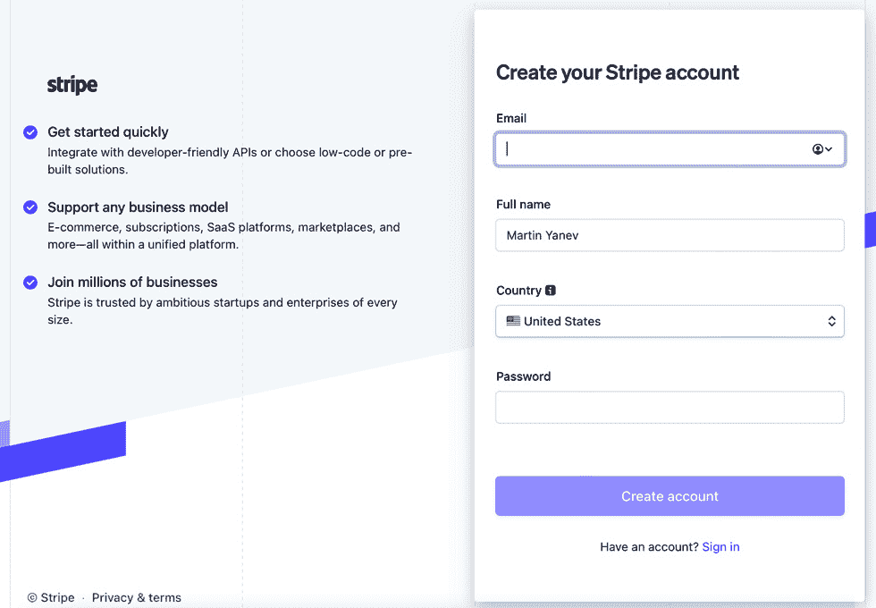
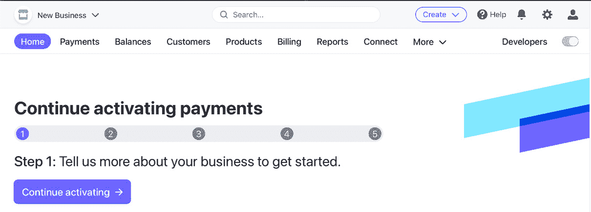
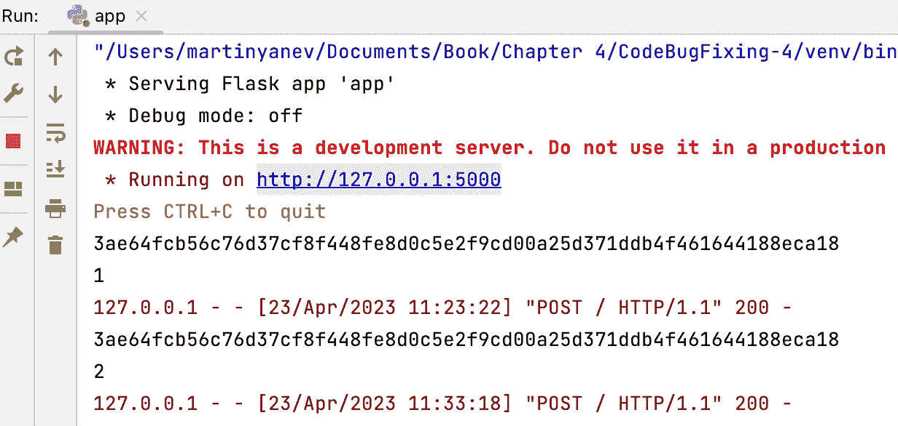
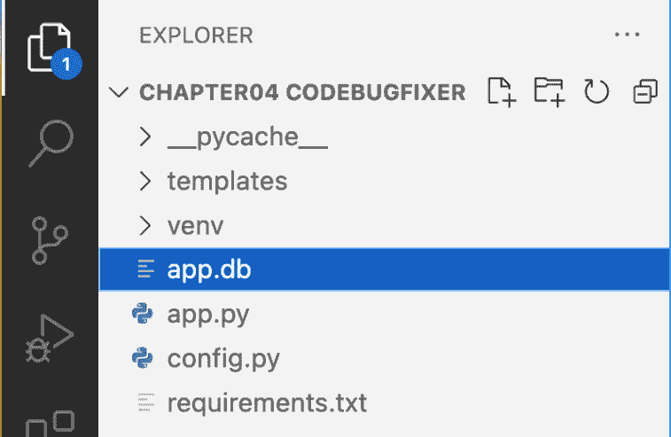
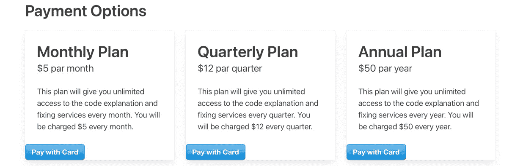
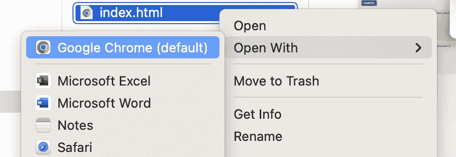
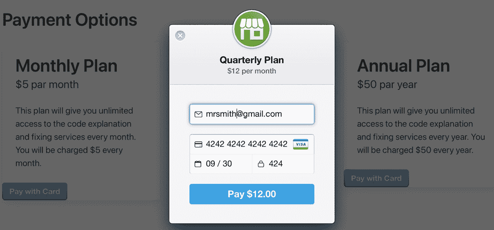
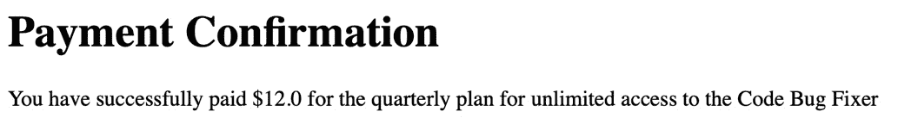

# <st c="0">4</st>

# <st c="2">将代码错误修复应用程序与支付服务集成</st>

<st c="68">在本章中，我们将探讨如何使用</st> **<st c="192">Stripe</st>** <st c="198">API</st> <st c="204">将支付服务集成到您的 ChatGPT 代码错误修复应用程序中</st>，以便您能够跟踪用户在您的 ChatGPT 应用程序上的访问次数，并实现高级功能或内容的支付机制。</st> <st c="373">您还将学习如何在您的 ChatGPT 项目中使用基本数据库，这对于跟踪用户数据和交易至关重要。</st>

<st c="501">首先，我们将介绍 Stripe 并向您展示如何设置账户和 API 密钥。</st> <st c="585">然后，我们将介绍创建用于存储用户数据和交易历史的 SQL 用户数据库的步骤。</st> <st c="715">最后，我们将指导您使用 Stripe API 将支付功能添加到您的 ChatGPT 应用程序中，包括创建结账流程、处理支付 webhook 以及更新</st> <st c="923">数据库。</st>

<st c="934">在本章中，我们将学习如何做</st> <st c="976">以下内容：</st>

+   <st c="990">设置 SQL 用户数据库</st>

+   <st c="1021">向 ChatGPT 应用程序添加支付</st> <st c="1043">功能</st>

<st c="1062">在本章结束时，您将具备添加支付服务到您的 ChatGPT 应用程序并构建成功的</st> <st c="1214">在线业务所需的必要知识和工具。</st>

# <st c="1230">技术要求</st>

<st c="1253">本项目的技术要求如下：</st> <st c="1302">如下：</st>

+   <st c="1313">在您的</st> <st c="1347">机器上安装了 Python 3.7 或更高版本</st>

+   <st c="1359">代码编辑器，例如</st> <st c="1383">VSCode（推荐）</st>

+   <st c="1403">Python</st> <st c="1413">虚拟环境</st>

+   <st c="1432">一个 OpenAI</st> <st c="1443">API 密钥</st>

+   <st c="1450">一个 Stripe 账户和</st> <st c="1472">API 密钥</st>

<st c="1479">在下一节中，您将学习如何集成 Stripe 支付。</st> <st c="1555">您将了解如何创建 Stripe 账户，获取必要的 API 密钥，并在</st> <st c="1668">您的应用程序中设置 Stripe API。</st>

<st c="1685">本章中的代码示例可以在 GitHub 上找到</st> <st c="1745">在</st> [<st c="1748">https://github.com/PacktPublishing/Building-AI-Applications-with-ChatGPT-APIs</st>](https://github.com/PacktPublishing/Building-AI-Applications-with-ChatGPT-APIs)<st c="1825">。</st>

# <st c="1826">介绍和集成 Stripe 支付</st>

**<st c="1875">Stripe</st>** <st c="1882">是一个</st> <st c="1887">流行的支付网关，提供了一种简单的方式来在线接受支付。</st> <st c="1965">它允许企业和个人在网上接受支付、管理订阅和跟踪收入，一切都在一个地方完成。</st> <st c="2098">Stripe 提供了一个易于使用的 API，允许</st> <st c="2140">开发人员将支付功能集成到他们的网站和应用程序中。</st> <st c="2224">我们将从创建一个 Stripe 账户</st> <st c="2267">并配置我们将用于验证对 Stripe API 请求的 Stripe API 密钥开始。</st> <st c="2368">在这里，您将使用 Stripe API 创建一个支付表单，并在您的 Python 代码中安全地处理支付。</st> <st c="2478">与 Stripe 类似的服务还包括 PayPal、Square</st> <st c="2535">和 Braintree。</st>

<st c="2549">接受支付的第一步是在您的</st> <st c="2582">**《代码错误修复器》**</st> <st c="2613">应用程序中创建一个 Stripe 账户。</st> <st c="2657">Stripe 是一个流行的支付处理平台，它使企业能够在线接受支付。</st> <st c="2756">通过设置 Stripe 账户，您可以将其与 ChatGPT 应用程序集成，并开始接受用户的支付。</st> <st c="2885">设置 Stripe 账户既简单又直接，我们将引导您完成所有步骤。</st>

<st c="2982">要开始使用 Stripe，您需要创建一个账户。</st> <st c="3042">按照以下步骤创建一个新的</st> <st c="3077">Stripe 账户：</st>

1.  <st c="3092">访问 Stripe 网站：</st> [<st c="3119">https://stripe.com/</st>](https://stripe.com/)<st c="3138">。</st>

1.  <st c="3139">点击页面右上角的</st> **<st c="3150">登录</st>** <st c="3157">按钮。</st>

1.  <st c="3201">点击</st> **<st c="3212">创建</st>** **<st c="3219">账户</st>** <st c="3226">按钮。</st>

1.  <st c="3234">填写注册表单，提供您的个人或业务信息。</st> <st c="3310">您需要提供您的姓名、电子邮件地址和密码（见</st> *<st c="3377">图 4</st>**<st c="3385">.1</st>*<st c="3387">）。</st>

1.  <st c="3390">通过点击 Stripe 发送给您的验证电子邮件中的链接来确认您的电子邮件地址。</st>

1.  <st c="3487">提供您的</st> <st c="3501">业务详细信息，例如您的</st> <st c="3532">公司名称、地址和税务识别号</st> <st c="3567">（可选）。</st>

1.  <st c="3585">设置您的支付设置。</st> <st c="3616">您可以选择接受所有主要信用卡和借记卡的支付，以及像 Apple Pay 和 Google</st> <st c="3751">Pay 这样的数字钱包支付（可选）。</st>



<st c="4252">图 4.1 – Stripe 注册表单</st>

<st c="4293">一旦你创建了 Stripe 账户，你就可以开始接受客户的支付。</st> <st c="4389">你还可以使用 Stripe 的仪表板，如图</st> *<st c="4438">图 4</st>**<st c="4446">.2</st>**<st c="4448">所示，来管理你的交易，处理退款，并查看你的支付活动报告。</st> <st c="4537">Stripe 对其平台处理的每笔交易都会收取费用，但费用具有竞争力</st> <st c="4640">且透明。</st>



<st c="4896">图 4.2 – Stripe 仪表板</st>

<st c="4929">接下来，你需要</st> <st c="4945">获取访问你的 Stripe API 密钥，这些密钥将在你的应用程序中用于后续的支付处理。</st> <st c="5066">从</st> <st c="5071">仪表板中，点击屏幕左侧的</st> **<st c="5099">开发者</st>** <st c="5109">标签页，然后点击</st> **<st c="5169">API 密钥</st>**<st c="5177">。在这个页面上，你可以看到你的实时和测试 API 密钥，以及显示每个密钥秘密的选项。</st> <st c="5286">请确保复制并安全存储你的密钥，因为你将需要它们从你的</st> <st c="5397">ChatGPT 应用程序</st>向 Stripe 发送 API 请求。

<st c="5417">重要提示</st>

<st c="5432">你的实时 API 密钥应保持私密，不要公开分享，因为它们提供了访问你的 Stripe</st> <st c="5538">账户敏感数据的权限，并允许用户进行更改。</st> <st c="5596">相反，你可以使用你的</st> **<st c="5622">测试 API 密钥</st>** <st c="5635">进行开发和</st> <st c="5656">测试目的。</st>

<st c="5673">Stripe 提供了三种类型的 API 密钥 – **<st c="5716">发布密钥</st>**<st c="5732">，**<st c="5734">秘密密钥</st>**，和**<st c="5751">测试密钥</st>**<st c="5760">：</st>

+   <st c="5762">**<st c="5766">发布密钥</st>** <st c="5781">用于客户端，以安全地向 Stripe 发送请求。</st> <st c="5846">它没有任何访问你账户的权限，可以公开分享。</st> <st c="5918">这个密钥通常放置在</st> <st c="5953">应用程序前端。</st>

+   <st c="5974">**<st c="5979">秘密密钥</st>** <st c="5989">用于服务器端，以向 Stripe 发送请求，并且</st> <st c="6048">具有完全访问你账户的权限，包括进行收费的能力。</st> <st c="6120">它应该保密，并且永远不应该公开分享。</st> <st c="6182">这个密钥通常放置在</st> <st c="6217">应用程序后端。</st>

+   <st c="6237">**<st c="6242">测试密钥</st>** <st c="6250">用于测试环境，以执行测试交易而不收取任何费用。</st> <st c="6262">它像秘密密钥一样工作，但只影响测试数据，并且不应该在生产中使用。</st>

在**<st c="6445">API keys</st>** <st c="6453">页面，您将看到**<st c="6482">publishable</st>** <st c="6493">和**<st c="6498">test</st>** <st c="6502">API keys。</st> <st c="6513">我们将使用**<st c="6529">publishable</st>** <st c="6540">key 来识别您的应用程序前端中的 Stripe 账户，而**<st c="6629">test</st>** <st c="6633">key 用于与 Stripe 的后端通信。</st> <st c="6689">您需要将**<st c="6714">publishable</st>** <st c="6725">key 添加到您的 ChatGPT 应用程序的前端代码中，并将**<st c="6788">test</st>** <st c="6792">key 添加到后端代码中。</st>

您可以使用**<st c="6893">Stripe</st>**<st c="6899">将支付集成到网站或应用程序中，Stripe 是一个流行的支付网关，它提供了一种轻松接受在线支付的方式。<st c="6817">This is how you can</st> <st c="6838">integrate payments into a website or application using</st> **<st c="6893">Stripe</st>**<st c="6899">, a popular payment gateway that provides an effortless way to accept payments online.</st> <st c="6986">在本节中，为了使用 Stripe，您创建了一个 Stripe 账户并获得了 API 密钥，包括可发布密钥和秘密密钥，它们具有不同的访问级别，应该**<st c="7128">have different access levels and should be</st> <st c="7171">kept secure.</st>

在下一节中，您将学习如何为 Code Bug Fixer 应用程序设置 SQL 用户数据库。<st c="7183">In the next section, you will learn about setting up a SQL user database for the Code Bug Fixer application.</st> <st c="7293">We will explore the different payment models and understand how to design a subscription-based</st> <st c="7388">payment plan.</st>

# **<st c="7401">设置 SQL 用户数据库</st>**

在将支付基础设施集成到您的应用程序之前，确定您的业务策略至关重要，这关系到您将如何向您的 Web 应用程序用户收费。<st c="7432">Prior to</st> <st c="7442">implementing the payment infrastructure into your application, it’s essential to determine your business strategy, which pertains to how you’ll charge users of your web application.</st> <st c="7624">There are several ways to</st> <st c="7650">accomplish this:</st>

+   **<st c="7666">订阅计划</st>**<st c="7684">：这是一种定期付款模式，允许用户定期支付服务或产品费用，例如按月或按年支付。<st c="7760">This is a recurring payment model that allows users to pay for a service</st> <st c="7860">or product on a regular basis, such as monthly or yearly.</st> <st c="7818">它是**<st c="7852">软件即服务</st>** <st c="7873">(</st>**<st c="7875">SaaS</st>**<st c="7879">**)产品以及在线出版物中常见的支付选项，用户支付费用以获取服务或内容的访问权限。<st c="7891">It is a common payment option for</st> **<st c="7852">Software-as-a-Service</st>** <st c="7873">(</st>**<st c="7875">SaaS</st>**<st c="7879">**) products <st c="7891">and online publications, where users pay for access to the service <st c="7958">or content.</st>

+   **<st c="7969">一次性付款计划</st>**<st c="7991">：客户为产品或服务支付一次费用。<st c="8004">make a single payment for a product</st> <st c="8040">or service.</st>

+   **<st c="8051">基于使用量的计划</st>**<st c="8068">：客户根据他们对产品或服务的使用情况付费，例如按次付费或按点击付费。<st c="8081">are charged based on their usage of a product or service, such as pay-per-view</st> <st c="8160">or pay-per-click.</st>

<st c="8177">对于我们的代码错误修复应用程序，我们将设计一个订阅模式，为用户提供三个不同的计划进行选择。</st> <st c="8313">此外，为了使用户入门过程更加顺畅，我们将包括一个</st> **<st c="8390">免费试用期</st>** <st c="8400">，允许用户在承诺支付计划之前尝试应用程序一定次数。</st>

<st c="8515">免费试用期</st> <st c="8531">将为用户提供探索应用程序功能并确定其是否符合需求的机会。</st> <st c="8660">在试用期间，用户可以在不收费的情况下使用应用程序特定次数。</st> <st c="8766">试用期结束后，用户将被提示选择一个支付计划以继续使用应用程序。</st> <st c="8873">这种基于订阅的方法对用户和作为应用程序所有者的您都有益。</st> <st c="8971">用户可以选择最适合其预算和使用的订阅计划，而您可以从</st> <st c="9112">订阅费</st>中产生稳定的收入流。

<st c="9130">为了实现我们应用程序的支付机制，我们需要建立一个数据库来跟踪用户访问和使用情况。</st> <st c="9262">数据库需要记录两种类型的信息——</st> **<st c="9326">浏览器 ID</st>** <st c="9336">(见</st> *<st c="9342">表 4.1</st>*<st c="9351">)，这是每个访问应用程序的用户独有的，以及使用计数器，它记录每个用户访问应用程序的次数。</st> <st c="9510">通过跟踪这些信息，我们可以识别唯一用户并确保他们在被提示选择一个</st> <st c="9678">订阅计划</st>之前没有超过允许的免费访问次数。

| **<st c="9696">浏览器 ID</st>** | **<st c="9707">使用计数器</st>** |
| --- | --- |
| <st c="9721">28ec523f092</st> | <st c="9733">3</st> |
| <st c="9735">58c9f5702fd</st> | <st c="9746">6</st> |
| <st c="9748">c59523926d</st> | <st c="9758">10</st> |

<st c="9761">表 4.1 – 数据库中收集的用户数据</st>

<st c="9809">现在我们已经制定了一个稳固的商业计划，我们可以继续前进并深入了解将支付服务集成到我们的 ChatGPT 应用程序中的技术细节。</st> <st c="9822">然而，在我们能够这样做之前，我们需要初始化一个</st> <st c="10038">SQL 数据库</st>。

## <st c="10051">初始化 SQL 数据库</st>

<st c="10079">SQL 数据库对于跟踪用户在我们的应用程序上执行访问次数至关重要，这反过来又使我们能够使用 Stripe API 实现支付机制。</st> <st c="10271">拥有数据库，我们可以轻松地存储和检索与我们的用户</st> `<st c="10352">及其与我们的应用程序的交互相关的数据，使我们能够无缝地管理支付</st> `<st c="10430">过程。</st>`

<st c="10449">现在，让我们打开我们的 Code Bug Fixer 应用程序的</st> `<st c="10499">app.py</st>` <st c="10505">文件，并导入所有必要的库以访问 Stripe 和</st> `<st c="10573">SQL 数据库：</st>`

<st c="10586">app.py</st>

```py
 from flask import Flask, request, render_template
from openai import OpenAI
import config <st c="10684">import hashlib</st>
<st c="10698">import sqlite3</st>
<st c="10778">app.py</st> file:

				*   `<st c="10790">hashlib</st>`<st c="10798">: Provides interfaces to secure hash algorithms.</st> <st c="10848">It is used to generate hash values of data.</st> <st c="10892">In our case, we will use</st> `<st c="10917">hashlib</st>` <st c="10924">to hash user information before storing it in the database for</st> <st c="10988">security purposes.</st>
				*   `<st c="11006">sqlite3</st>`<st c="11014">: This library provides a lightweight disk-based database that doesn’t require a separate server process and allows us to access the database using SQL commands.</st> <st c="11177">We will use it to create and manage a database to store</st> <st c="11233">user information.</st>
				*   `<st c="11250">stripe</st>`<st c="11257">: This is a third-party library that provides a Python client for the Stripe API, which allows us to handle payments in our application.</st> <st c="11395">We will use it to process payments made by users through</st> <st c="11452">our application.</st>

			<st c="11468">While the</st> `<st c="11479">sqlite3</st>` <st c="11486">and</st> `<st c="11491">hashlib</st>` <st c="11498">are built-in libraries in Python, you will need to install</st> `<st c="11558">stripe</st>`<st c="11564">. You can simply do that by opening a new VSCode terminal by going to</st> **<st c="11634">Terminal</st>** <st c="11643">|</st> **<st c="11645">New Terminal</st>** <st c="11657">and typing</st> <st c="11669">the following:</st>

```

$ pip install stripe

```py

			<st c="11704">After successfully</st> <st c="11724">installing Stripe, you can proceed to configure the Stripe test key.</st> <st c="11793">To do so, simply navigate to the Stripe Dashboard, and then head over to the</st> **<st c="11870">Developers</st>** <st c="11881">tab, followed by the</st> **<st c="11902">API keys</st>** <st c="11910">section.</st> <st c="11920">From there, you can click on the option to reveal the test key, which will allow you to copy the test key</st> <st c="12026">for use.</st>
			<st c="12034">To create a new API key entry, make the required modifications to the files listed in your Code Bug</st> <st c="12135">Fixer project:</st>
			<st c="12149">config.py</st>

```

API_KEY = "<YOUR_OPENAI_API_KEY>" <st c="12194">STRIPE_TEST_KEY = "<YOUR_STRIPE_API_TEST_KEY>"</st>

```py

			<st c="12240">app.py</st>

```

client = OpenAI(

api_key=config.API_KEY,

) <st c="12382">config.py</st> 文件，然后在</st> `<st c="12431">app.py</st>` 文件中检索此密钥，允许您的应用程序使用指定的密钥安全地与 Stripe API 通信。

            <st c="12540">下一步是</st> <st c="12561">在</st> `<st c="12569">initialize_database()</st>` <st c="12590">函数下添加到</st> `<st c="12627">app.py</st>`<st c="12633">中。此函数将创建一个 SQLite 数据库和一个包含两个列的用戶表，用于</st> `<st c="12721">指纹</st>` <st c="12732">和</st> `<st c="12741">使用计数器</st>`<st c="12754">，如</st> *<st c="12768">表 4.1</st>*<st c="12777">所示：</st>

```py
 def initialize_database():
    conn = sqlite3.connect('app.db')
    c = conn.cursor()
    c.execute(
        '''CREATE TABLE IF NOT EXISTS users (fingerprint text primary key, usage_counter int)''')
    conn.commit()
    conn.close()
```

            <st c="12985">前面的函数通过使用 Python 中的</st> `<st c="13053">SQLite</st>` <st c="13059">库连接到一个新创建的</st> `<st c="13075">app.db</st>`<st c="13081">数据库，然后</st> <st c="13120">创建一个</st> `<st c="13160">c</st>`<st c="13161">，用于执行 SQL 命令并从数据库中检索结果。</st> <st c="13238">游标对象允许您对数据库执行各种操作，如创建表、插入数据以及</st> <st c="13358">更新数据。</st>

            <st c="13372">然后，我们使用游标对象执行一个创建名为</st> `<st c="13456">users</st>` <st c="13461">的表的 SQL 命令，该表位于连接的 SQLite 数据库中。</st> <st c="13496">此表有两个列，</st> `<st c="13524">fingerprint,</st>` <st c="13536">和</st> `<st c="13541">usage_counter</st>`<st c="13554">；</st> `<st c="13561">fingerprint</st>` <st c="13572">列将存储用户浏览器 ID，而</st> `<st c="13615">usage_counter</st>` <st c="13628">将存储特定用户的程序使用次数。</st> <st c="13693">`<st c="13697">主键</st>` <st c="13708">关键字指定</st> `<st c="13736">fingerprint</st>` <st c="13747">列是表的</st> `<st c="13777">主键。</st>`

            <st c="13787">最后，我们可以</st> `<st c="13804">提交</st>` <st c="13810">之前 SQL 命令对数据库所做的更改，使它们成为永久更改，并且</st> `<st c="13907">关闭</st>` <st c="13912">数据库连接，释放连接所使用的任何资源。</st>

            <st c="13996">这是为 Code Bug Fixer 应用程序初始化 SQL 数据库的方法。</st> <st c="14079">这些都是创建 SQL 数据库和配置 Stripe 测试密钥所必需的库。</st> <st c="14173">在下一步中，您将了解获取</st> `<st c="14238">指纹</st>` <st c="14249">浏览器的过程，这将帮助您识别使用</st> <st c="14322">您的应用程序的个别用户。</st>

            <st c="14339">获取浏览器指纹 ID</st>

            <st c="14372">为了跟踪和识别您 Web 应用程序的独特用户，您需要一种方法来获取他们的</st> <st c="14473">浏览器指纹。</st> <st c="14494">浏览器指纹是基于各种参数（如浏览器类型、屏幕分辨率和已安装字体）由浏览器生成的唯一</st> <st c="14527">标识符。</st> <st c="14655">在本节中，我们将探讨如何在 Python 中获取浏览器指纹 ID</st> <st c="14729">。</st>

            <st c="14739">在我们的应用程序中，为每个单独的任务创建一个专门的 Python 函数被认为是一种良好的实践，生成浏览器指纹也不例外。</st> <st c="14908">因此，在</st> `<st c="14997">initialize_database()</st>` <st c="15018">函数下创建一个名为</st> `<st c="14969">get_fingerprint()</st>` <st c="14986">的新函数是合适的：</st>

```py
 def get_fingerprint():
    browser = request.user_agent.browser
    version = request.user_agent.version and float(
        request.user_agent.version.split(".")[0])
    platform = request.user_agent.platform
    string = f"{browser}:{version}:{platform}"
    fingerprint = hashlib.sha256(string.encode("utf-8")).hexdigest()
    print(fingerprint)
    return fingerprint
```

            <st c="15363">`<st c="15368">get_fingerprint()</st>` <st c="15385">`函数是一个 Flask 视图函数，它负责为与应用程序交互的每个用户生成一个唯一的浏览器指纹（在大多数情况下）。</st> <st c="15550">指纹是根据用户的浏览器类型、版本和平台生成的字符串的散列，用以唯一标识用户。</st>

            <st c="15669">重要提示</st>

            <st c="15684">浏览器指纹并不能保证对每个用户都是 100%唯一的，但浏览器指纹通常可以生成一个相对唯一的标识符，用以区分不同的用户。</st> <st c="15880">如 IP 地址或 MAC 地址这样的标识符更适合</st> <st c="15989">现实世界应用。</st>

            <st c="16013">首先，</st> <st c="16025">函数通过使用</st> `<st c="16091">request.user_agent</st>`<st c="16109">从请求对象中获取</st> `<st c="16043">user_agent</st>` <st c="16053">对象。此对象包含有关用户浏览器、平台和版本的信息。</st>

            <st c="16192">接下来，该函数通过将浏览器、版本和平台信息连接起来，并用冒号（</st>`<st c="16337">:</st>`<st c="16339">）分隔，构建一个字符串。</st> <st c="16342">这个字符串用作输入到</st> `<st c="16382">hashlib.sha256()</st>` <st c="16398">函数的输入，该函数使用</st> `<st c="16599">print()</st>` <st c="16606">语句生成输入字符串的哈希，以便我们可以在我们的</st> <st c="16662">VSCode 日志中验证指纹。</st>

            <st c="16674">该函数返回生成的指纹字符串。</st> <st c="16730">稍后，我们将指纹存储在 SQLite 数据库中，同时存储每个用户的用法计数器，以便应用程序可以跟踪用户访问应用程序的次数。</st> <st c="16928">这些信息用于确定用户是否需要付费才能继续使用</st> <st c="17014">该应用程序。</st>

            <st c="17030">现在，是时候通过获取每个用户在下一节中的应用使用次数来覆盖我们用户跟踪机制的最后一部分。</st>

            <st c="17173">跟踪应用程序用户</st>

            <st c="17200">在本节中，我们将</st> <st c="17221">深入探讨应用程序后端的使用计数器功能。</st> <st c="17299">具体来说，我们将检查</st> `<st c="17333">get_usage_counter()</st>` <st c="17352">和</st> `<st c="17357">update_usage_counter()</st>` <st c="17379">函数，这些函数负责检索和更新与用户浏览器指纹 ID 相关的使用计数器。</st> <st c="17508">这些函数在确定用户是否超出使用限制并应被提示付费以继续使用</st> <st c="17661">应用程序方面起着至关重要的作用。</st>

            <st c="17677">The</st> `<st c="17682">get_usage_counter()</st>` <st c="17701">函数负责从 SQLite 数据库中检索特定浏览器指纹的使用计数器。</st> <st c="17822">计数器跟踪具有该指纹的用户提交了多少次</st> <st c="17909">代码错误：</st>

```py
 def get_usage_counter(fingerprint):
    conn = sqlite3.connect('app.db')
    c = conn.cursor()
    result = c.execute('SELECT usage_counter FROM users WHERE fingerprint=?', [fingerprint]).fetchone()
    conn.close()
    if result is None:
        conn = sqlite3.connect('app.db')
        c = conn.cursor()
        c.execute('INSERT INTO users (fingerprint, usage_counter) VALUES (?, 0)', [fingerprint])
        conn.commit()
        conn.close()
        return 0
    else:
        return result[0]
```

            <st c="18338">The</st> <st c="18342">函数接受</st> `<st c="18358">fingerprint</st>` <st c="18369">作为参数，因为它用于检索给定浏览器指纹的使用计数器。</st> <st c="18469">指纹作为应用程序每个用户的唯一标识符，该函数在数据库中查找与该指纹相关的使用计数器。</st> <st c="18645">它连接到</st> `<st c="18698">app.db</st>` <st c="18704">，然后创建一个可以执行数据库上 SQLite 命令的光标对象。</st>

            <st c="18787">然后，</st> `<st c="18798">c.execute()</st>` <st c="18809">命令创建一个名为</st> `<st c="18854">users</st>` <st c="18859">的新数据库表，其中包含名为</st> `<st c="18883">fingerprint</st>` <st c="18894">和</st> `<st c="18899">usage_counter</st>`<st c="18912">的两列。</st> <st c="18954">它仅在表不存在时创建表。</st>

            <st c="18968">该</st> `<st c="18973">结果</st>` <st c="18979">执行一个 SQL 查询以获取给定</st> `<st c="19027">fingerprint</st>` <st c="19040">的</st> `<st c="19062">usage_counter</st>` <st c="19073">列值</st> `<st c="19083">users</st>` <st c="19088">表。</st> <st c="19096">它是通过使用参数化查询和</st> `<st c="19146">fetchone()</st>` <st c="19156">方法来完成的。</st> <st c="19165">如果对于给定的指纹没有找到记录，结果将被设置为</st> `<st c="19240">None</st>` <st c="19244">对于</st> <st c="19249">新用户。</st>

            <st c="19259">一旦</st> <st c="19264">与数据库的连接关闭，函数将检查之前数据库查询的结果是否为</st> `<st c="19382">None</st>` <st c="19386">。</st> <st c="19395">如果是</st> `<st c="19404">None</st>`<st c="19408">，则意味着在</st> `<st c="19455">fingerprint</st>` <st c="19466">的</st> `<st c="19474">users</st>` <st c="19479">表中没有记录。</st> <st c="19487">在这种情况下，函数将执行以下操作：</st>

                1.  <st c="19533">连接到</st> <st c="19546">数据库。</st>

                1.  <st c="19559">创建一个</st> <st c="19570">游标对象。</st>

                1.  <st c="19584">插入一个新记录用于</st> `<st c="19610">指纹</st>` <st c="19621">，并带有</st> `<st c="19629">usage_counter</st>` <st c="19642">值为</st> `<st c="19649">0</st>`<st c="19653">。</st>

                1.  <st c="19654">将更改提交到</st> <st c="19678">数据库。</st>

                1.  <st c="19691">关闭</st> <st c="19699">连接。</st>

                1.  <st c="19714">返回</st> `<st c="19723">0</st>`<st c="19724">。</st>

            <st c="19725">如果结果不是</st> `<st c="19747">None</st>`<st c="19751">，则意味着在</st> `<st c="19810">fingerprint</st>` <st c="19821">的</st> `<st c="19829">users</st>` <st c="19834">表中已经存在一个记录。</st> <st c="19842">在这种情况下，函数返回记录的</st> `<st c="19894">usage_counter</st>` <st c="19907">列的值。</st> <st c="19930">本质上，这个函数旨在为新用户返回</st> `<st c="19991">0</st>` <st c="19992">的值，或者为那些已经在数据库中的用户返回使用次数。</st>

            <st c="20064">另一方面，</st> `<st c="20069">update_usage_counter()</st>` <st c="20091">函数负责更新给定浏览器指纹的数据库中的使用计数器。</st> <st c="20216">该函数接受两个参数——浏览器指纹和更新的使用</st> <st c="20297">计数器值：</st>

```py
<st c="20311">def</st> update_usage_counter(fingerprint, usage_counter):
    conn = sqlite3.connect(<st c="20389">'app.db'</st>)
    c = conn.cursor()
    c.execute(<st c="20429">'UPDATE users SET usage_counter=?</st> <st c="20464">WHERE fingerprint=?',</st> [usage_counter, fingerprint])
    conn.commit()
    conn.close()
```

            <st c="20542">一旦连接到数据库并创建了一个版本游标，该函数就负责在每次使用我们的 Code Bug Fixer 应用后更新使用计数器。</st> <st c="20716">它使用游标对象的</st> `<st c="20728">execute</st>` <st c="20735">方法执行一个更新用户</st> `<st c="20808">usage_counter</st>` <st c="20821">字段的 SQL 语句，该用户具有提供的</st> `<st c="20850">fingerprint</st>`<st c="20859">。</st>

            <st c="20871">该 SQL 语句使用</st> `<st c="20895">占位符 ?</st>` <st c="20909">来指示</st> `<st c="20942">usage_counter</st>` <st c="20955">和</st> `<st c="20960">fingerprint</st>` <st c="20971">的值应插入的位置。</st> <st c="20992">要插入的值作为列表传递给</st> `<st c="21065">execute()</st>` <st c="21074">的第二个参数，其顺序与 SQL 语句中的顺序相同。</st> <st c="21122">WHERE</st> <st c="21131">子句确保更新仅应用于匹配指定</st> `<st c="21203">fingerprint</st>`<st c="21213">的行。</st>

            <st c="21225">总结来说，</st> `<st c="21241">get_usage_counter()</st>` <st c="21260">函数从 SQLite 数据库中检索用户浏览器指纹 ID 的使用计数器，而</st> `<st c="21370">update_usage_counter()</st>` <st c="21392">函数在每次使用 Code Bug Fixer 应用后更新给定指纹的数据库中的使用计数器值。</st> <st c="21517">这些函数对于确定用户是否已超过使用限制并应提示他们支付以继续使用应用程序至关重要。</st> <st c="21677">我们现在可以将迄今为止创建的所有函数集成到我们的 Code Bug Fixer 应用程序</st> `<st c="21775">index()</st>` <st c="21782">页面中。</st>

            <st c="21788">实现使用计数器</st>

            <st c="21820">在本节中，</st> <st c="21841">我们将把我们之前创建的所有函数集成到我们的 Code Bug Fixer 应用程序的</st> `<st c="21907">index()</st>` <st c="21914">页面中。</st> <st c="21955">通过这样做，我们将能够跟踪用户提交代码错误的次数以及他们是否已达到三次提交的限制，从而需要他们付费才能继续。</st> <st c="22157">此外，我们还将能够将每个提交与一个唯一的浏览器指纹关联起来，以防止用户使用</st> <st c="22305">不同的别名</st> 提交多个错误：

```py
 @app.route("/", methods=["GET", "POST"])
def index(): <st c="22378">initialize_database()</st>
 <st c="22399">fingerprint = get_fingerprint()</st>
 <st c="22431">usage_counter = get_usage_counter(fingerprint)</st>
```

            <st c="22478">前面的代码</st> <st c="22498">片段执行了三个基本任务。</st> <st c="22538">首先，它初始化数据库，然后从数据库中检索用户的浏览器指纹并获取他们的当前使用计数器。</st> <st c="22684">如果用户数据库表不存在，则会创建该表。</st> <st c="22759">指纹变量唯一标识用户，并允许我们跟踪他们的</st> <st c="22842">使用计数器。</st>

            <st c="22856">初始化完成后，我们需要设置一条规则，当使用计数器超过一个特定数字时，将控制权传递到支付页面：</st> <st c="23003"></st>

```py
 if request.method == "POST": <st c="23166">POST</st>, which indicates that the user has submitted a form on the website. In our case, this means that the user has submitted code for fixing in the Code Bug Fixer. Then, our app will check whether the user’s usage counter is greater than <st c="23404">3</st>. If it is, it means the user has exceeded their limit of free usage and should be directed to the payment page. The function returns a rendered template of the <st c="23566">payment.html</st> page. We also add a <st c="23599">print()</st> statement so that we can verify the counter increment in our logs.
			<st c="23673">After the usage counter is initialized and we have a mechanism to check whether it is greater than the allowed number of usages, the last step is to make sure that the usage counter increments every time the user utilizes the Code</st> <st c="23905">Bug Fixer:</st>

```

fixed_code_prompt = (f"修复此代码：\n\n{code}\n\n 错误：\n\n{error}." f" \n 仅回复修复后的代码。")

        fixed_code_completions = client.chat.completions.create(

            model=model_engine,

            messages=[

                {"role": "user", "content": f"{fixed_code_prompt}"},

            ],

            max_tokens=1024,

            n=1,

            stop=None,

            temperature=0.2,

        )

        fixed_code = fixed_code_completions.choices[0].message.content <st c="24289">usage_counter += 1</st>

<st c="24307">print(usage_counter)</st>

<st c="24502">usage_counter</st>变量增加 1，这意味着用户多使用了一次服务。之后，我们将更新数据库中用户的使用计数器值，该用户通过其浏览器指纹识别。这确保了使用计数器在用户会话之间持久存在，并反映了用户使用服务的总次数。我们还添加了一个<st c="24872">print()</st>语句，以便我们可以在日志中验证计数器的增加。

            <st c="24946">现在，您可以运行代码错误修复应用程序来验证您的使用跟踪方法是否成功。</st> <st c="25056">一旦代码错误修复应用程序启动并运行，您可以将一个有错误的代码和一个错误放入相关字段，然后点击</st> **<st c="25191">代码修复</st>** <st c="25199">按钮。</st> <st c="25208">执行此操作两次，以便您的使用计数器增加两次。</st> <st c="25285">一旦您收到 ChatGPT API 的响应以及</st> **<st c="25335">修复代码</st>** <st c="25345">和</st> **<st c="25350">说明</st>** <st c="25361">字段在您的代码错误修复应用程序中已填充，您就可以回到</st> **<st c="25430">终端</st>** <st c="25438">窗口并验证您的指纹和使用计数器是否显示（见</st> *<st c="25516">图 4</st>**<st c="25524">.3</st>*<st c="25526">）。</st>

            

            <st c="26060">图 4.3 – 浏览器指纹和使用计数器记录</st>

            `<st c="26122">3ae64fc…</st>` <st c="26131">这是您的特定浏览器指纹，而数字表示您当前使用该应用程序的次数。</st> <st c="26254">由于您向 ChatGPT API 发出了两次请求，计数器</st> <st c="26319">增加了两次。</st>

            <st c="26337">要确认新数据库的创建，您可以在项目目录中检查名为</st> `<st c="26412">app.db</st>` <st c="26418">的文件（见</st> *<st c="26450">图 4</st>**<st c="26458">.4</st>*<st c="26460">）。</st> <st c="26464">此文件将存储所有用户数据，并且即使您关闭并重新启动</st> <st c="26563">应用程序，它也会持续存在。</st>

            

            <st c="26692">图 4.4 – 数据库显示</st>

            <st c="26725">这是将主要后端功能添加到我们的 Code Bug Fixer 应用程序的</st> <st c="26738">最后一步。</st> <st c="26823">在下一节中，您将学习如何构建</st> `<st c="26876">/charge</st>` <st c="26883">页面，当用户的免费</st> <st c="26937">试用期结束时，用户将被重定向到该页面。</st>

            <st c="26948">向 ChatGPT 应用程序添加付款</st>

            <st c="26989">在本节中，我将指导您完成创建 Code Bug Fixer 中的付款页面和功能的流程。</st> <st c="27110">我们将创建一个与 Stripe 连接的付款页面，为用户提供三种不同的</st> <st c="27194">订阅计划：</st>

                +   **<st c="27213">月度计划</st>**<st c="27226">：用户每月将被收取 5 美元</st> <st c="27253">费用</st>

                +   **<st c="27264">季度计划</st>**<st c="27279">：用户每季度将被收取 12 美元</st> <st c="27307">费用</st>

                +   **<st c="27320">年度计划</st>**<st c="27332">：用户每年将被收取 50 美元</st> <st c="27360">费用</st>

            <st c="27370">我们还将创建一个确认页面，该页面将使用如下的简单声明来确认用户已购买的方案：</st> *<st c="27500">您已成功支付 12 美元用于无限访问 Code</st> * *<st c="27587">Bug Fixer 的季度计划。</st>*

            <st c="27597">接下来，您将学习如何创建</st> `<st c="27637">payment.html</st>` <st c="27649">文件。</st>

            <st c="27655">构建付款页面</st>

            <st c="27682">在这里，我们将创建一个完整的 HTML 文档，其中包含一个用于从用户收集付款信息的表单。</st> <st c="27692">我们将使用</st> **<st c="27809">Bulma CSS</st>** <st c="27818">框架来</st> <st c="27832">美化页面并包含</st> **<st c="27859">jQuery</st>** <st c="27865">以及</st> <st c="27874">Stripe API 来处理</st> <st c="27899">付款处理。</st>

            <st c="27918">页面将被分为三个列，每个列显示不同的支付计划选项。</st> <st c="28013">每个选项包括一个带有标题、副标题和计划描述的卡片。</st> <st c="28094">支付表单位于每个卡片的页脚中，它包括用于计划类型和支付金额的隐藏输入字段。</st> <st c="28224">使用 Stripe API 生成一个支付按钮，该按钮收集支付信息并启动支付处理（见</st> *<st c="28348">图 4</st>**<st c="28356">.5</st>*<st c="28358">）。</st>

            

            <st c="28894">图 4.5 – 支付页面</st>

            <st c="28923">生成</st> <st c="28936">“</st> <st c="28987">模板</st> <st c="28996">”</st> 文件夹。</st> <st c="29005">这两个文件将被命名为</st> `<st c="29035">payments.html</st>` <st c="29048">和</st> `<st c="29053">charge.html</st>`<st c="29064">。一旦完成，Code Bug Fixer 项目的结构将如下所示：</st> <st c="29129">如下：</st>

```py
 CodeBugFixer/
├── templates/
│   ├── charge.html
│   ├── index.html
│   └── payment.html
├── venv/
├── app.db
├── app.py
└── config.py
```

            <st c="29269">我们将从构建我们的</st> `<st c="29312">payments.html</st>` <st c="29325">页面头部开始：</st>

```py
 <!DOCTYPE html>
<html lang="en">
<head>
    <meta charset="UTF-8">
    <meta name="viewport" content="width=device-width, initial-scale=1.0">
    <link rel="stylesheet" href="https://cdn.jsdelivr.net/npm/bulma@0.9.0/css/bulma.min.css">
    <script src="img/jquery.min.js"></script>
    <script src="img/"></script>
    <title>Payment</title>
</head>
</html>
```

            <st c="29733">头部</st> <st c="29743">包含文档正确显示所需的元数据和外部资源。</st> <st c="29845">字符集指定文档中使用的字符编码，在本例中为</st> `<st c="29927">UTF-8</st>` <st c="29932">，而 viewport 元标签确保文档在不同屏幕尺寸的设备上正确显示。</st>

            <st c="30069">`<st c="30074">link</st>`</st> 标签用于导入外部框架。</st> <st c="30078">我们将使用 Bulma CSS 框架，它提供了一套预设计的 CSS 样式，可以快速且容易地构建响应式网页。</st> <st c="30122">我们将使用 Bulma CSS 框架，它提供了一套预设计的 CSS 样式，可以快速且容易地构建响应式网页。</st>

            <st c="30256">然后，我们将导入 jQuery 库，这是一个流行的 JavaScript 库，它简化了操作 HTML 文档和处理事件的过程。</st> <st c="30416">第二个导入是 Stripe API 库，它提供了处理</st> <st c="30501">在线支付</st> 的功能。

            <st c="30517">现在，在</st> `<st c="30529"></head></st>`<st c="30536">，我们可以开始构建 HTML 文件的主体部分，它被包含在</st> `<st c="30620"><</st>``<st c="30621">body></st>` <st c="30626">标签内：</st>

```py
 <body>
    <section class="section">
        <div class="container">
            <h1 class="title">Payment Options</h1>
            <div class="columns">
          </div>
        </div>
    </section>
</body>
```

            `<st c="30783">我们将使用</st>` `<st c="30800"><section></st>` `<st c="30809">元素</st>` `<st c="30809">，表示它是一个可以独立于其他元素进行样式的页面独立部分。</st>` `<st c="30924">有一个</st>` `<st c="30935"><div></st>` `<st c="30940">元素，其类为</st>` `<st c="30965">columns</st>` `<st c="30972">。</st>` `<st c="30972">该元素用于创建一个网格系统，用于在列中布局内容。</st>` `<st c="31050">这是一种创建响应式布局的常见方法，其中列的数量</st>` `<st c="31136">可能根据屏幕大小或使用的设备而变化。</st>` `<st c="31196">在这种情况下，列将包含用户可以选择的不同支付计划选项，每个选项都有其自己的功能和定价。</st>`

            `<st c="31346">现在，在</st>` `<st c="31363">列</st>` `<st c="31370"><div></st>` `<st c="31376">元素内部，我们可以创建三个列，代表之前提到的三个支付计划：</st>` `<st c="31453">：</st>`

            `<st c="31471">您可以在</st>` `<st c="31498">payments.html</st>` `<st c="31511">文件</st>` `<st c="31517">中找到完整的</st>` [<st c="31520">https://github.com/PacktPublishing/Building-AI-Applications-with-ChatGPT-API/blob/main/Chapter04%20CodeBugFixer/templates/payment.html</st>](https://github.com/PacktPublishing/Building-AI-Applications-with-ChatGPT-API/blob/main/Chapter04%20CodeBugFixer/templates/payment.html)<st c="31654">：</st>

```py
 <div class="column">
    <div class="card">
        <div class="card-content">
            <p class="title">Monthly Plan</p>
            <p class="subtitle">$5 par month</p>
            <p>This plan will give you unlimited access
                to the code explanation and fixing services every month. You will be charged $5 every month.</p>
        </div>
        <footer class="card_footer">
            <form action="/charge" method="post">
                <input type="hidden" name="plan" value="monthly">
                <input type="hidden" name="amount" value="500">
                <script
                    src="img/checkout.js"
                    class="stripe-button"
                    data-key=<st c="32193">"<YOUR_PUBLIC_KEY>"</st> data-amount="500"
                    data-name="Monthly Plan"
                    data-description="$5 per month"
                    data-image="https://stripe.com/img/documentation/checkout/marketplace.png"
                    data-locale="auto"
                    data-zip-code="false">
                </script>
            </form>
        </footer>
    </div>
```

            `<st c="32440">重要提示</st>`

            `<st c="32455">请确保将</st>` `<st c="32484">"<YOUR_PUBLIC_KEY>"</st>` `<st c="32503">标签替换为您从</st>` `<st c="32547">Stripe 账户</st>` `<st c="32547">获得的公钥。</st>`

            `<st c="32562">第一个</st>` `<st c="32573"><div></st>` `<st c="32578">具有</st>` `<st c="32594">列</st>` `<st c="32600">类别的元素</st>` `<st c="32660">负责创建一个类似卡片元素，用于展示提供给用户的月度计划信息。</st>` `<st c="32725">该卡片包含计划名称、订阅费用以及用户可以从该计划中期待的内容。</st>`

            `<st c="32849">使用</st>` `<st c="32854"><div></st>` `<st c="32859">具有</st>` `<st c="32875">卡片</st>` `<st c="32879">类别的元素</st>` `<st c="32976">用于创建展示月度订阅计划信息的卡片。</st>` `<st c="32976">在卡片内部，卡片内容使用</st>` `<st c="33030">card-content</st>` `<st c="33042">类</st>` `<st c="33050">定义。</st>` `<st c="33050">卡片内容由三个段落组成，第一个包含计划的标题，</st>` `<st c="33141">月度计划</st>` `<st c="33153">，第二个包含订阅费用，</st>` `<st c="33199">$5 每月</st>` `<st c="33211">，第三个提供计划的描述，突出订阅该计划的好处。</st>`

            <st c="33321">在页脚内部，定义了一个</st> `<st c="33343">表单</st>` <st c="33347">元素，该元素用于将订阅请求提交到服务器。</st> <st c="33432">表单的 action 属性设置为</st> `<st c="33470">/charge</st>`<st c="33477">，这表示订阅请求将被发送到服务器的</st> `<st c="33545">/charge</st>` <st c="33552">路由。</st> <st c="33574">我们将在稍后构建</st> `<st c="33592">/charge</st>` <st c="33599">页面的后端功能。</st> <st c="33629">此功能将确保在购买支付计划后向用户显示确认信息。</st>

            <st c="33736">表单包含两个隐藏的输入字段，用于发送计划的名称和值。</st> <st c="33819">在这种情况下，计划的名称设置为</st> `<st c="33859">monthly</st>`<st c="33866">，而金额属性设置为</st> `<st c="33914">500</st>`<st c="33917">，这代表订阅金额（以分计）。</st> <st c="33970">这些信息将被用于渲染</st> <st c="34014">确认页面。</st>

            <st c="34032">最后，在表单元素内部包含了一个脚本标签，该标签加载 Stripe 结账脚本。</st> <st c="34130">此脚本负责创建一个</st> `<st c="34494">data-locale</st>` <st c="34505">属性并将其设置为</st> `<st c="34519">auto</st>`<st c="34523">，这确保了支付表单的语言将根据用户的地理位置自动设置。</st> <st c="34628">`<st c="34632">data-zip-code</st>` <st c="34645">`属性设置为</st> `<st c="34666">false</st>`<st c="34671">，这意味着支付表单将不需要用户输入他们的</st> <st c="34748">邮编。</st>

            <st c="34757">如代码片段所示，季度计划和年度计划的列是以与月度计划相同的方式构建的。</st> <st c="34888">唯一的区别是计划的名称、副标题和成本值，以及计划隐藏输入字段和要收费的金额值。</st>

            <st c="35057">您可以通过在任何浏览器中显示</st> `<st c="35083">payment.html</st>` <st c="35095">页面来验证您的页面是否正常工作。</st> <st c="35149">您可以从</st> **<st c="35220">打开方式</st>** <st c="35229">选项中选择 HTML 文件并选择您喜欢的浏览器（见</st> *<st c="35243">图 4</st>**<st c="35251">.6</st>*<st c="35253">）。</st> <st c="35257">然后您应该看到一个支付页面，类似于在</st> *<st c="35325">图 4</st>**<st c="35333">.5</st>*<st c="35335">中显示的页面。</st>

            

            <st c="35488">图 4.6 – 在浏览器中显示 HTML</st>

            <st c="35534">这就是您如何构建一个包含收集用户支付信息的表单的支付页面。</st> <st c="35546">我们使用 Bulma CSS 框架设计了支付页面，并使用 jQuery 和 Stripe API 处理支付处理。</st> <st c="35641">页面分为三个列，每列显示不同的支付计划选项，支付表单位于每张卡的页脚中。</st> <st c="35771">Stripe API 用于生成一个收集支付信息并启动</st> <st c="35801">支付处理</st> <st c="35811">的支付按钮。</st>

            <st c="36031">在下一节中，您将学习如何使用 Stripe API 在您的应用程序中创建处理用户支付的收费函数，并返回一个支付</st> <st c="36192">确认页面。</st>

            <st c="36210">确认用户支付</st>

            <st c="36235">在上一个部分中，您了解到当用户选择购买支付计划以访问您的应用程序时，我们将立即触发</st> <st c="36243">/charge</st> <st c="36248">页面，并为其提供所选计划的名称以及相应的支付金额</st> <st c="36289">（以分计）。</st>

            <st c="36294">我们可以在我们的</st> `<st c="36312">app.py</st>` <st c="36318">文件中的</st> `<st c="36335">index()</st>` <st c="36342">函数中构建</st> `<st c="36350">charge()</st>` <st c="36356">函数。</st> <st c="36366">此函数是 Code Bug Fixer 网络应用程序的一部分，负责处理用户选择定价计划并提交其支付信息时的</st> `<st c="36402">收费</st>` <st c="36408">过程。</st> <st c="36449">该函数在用户点击</st> `<st c="36457">payment.html</st>`<st c="36469">:</st>

```py
 @app.route(<st c="36871">"/charge",</st> methods=[<st c="36892">"POST"</st>]) <st c="36903">def</st> charge():
    amount = int(request.form[<st c="36943">"amount"</st>])
    plan = str(request.form[<st c="36980">"plan"</st>])
    customer = stripe.Customer.create(
        email=request.form<st c="37044">["stripeEmail"],</st> source=request.form<st c="37081">["stripeToken"]</st> )
    charge = stripe.Charge.create(
        customer=customer.id,
        amount=amount,
        currency=<st c="37177">"usd",</st> description=<st c="37197">"App Charge"</st> ) <st c="37304">app.py</st> file here: <st c="37322">https://github.com/PacktPublishing/Building-AI-Applications-with-ChatGPT-API/blob/main/Chapter04%20CodeBugFixer/app.py</st>.
			<st c="37441">The</st> `<st c="37446">@app.route("/charge", methods=["POST"])</st>` <st c="37485">decorator creates a route to handle a</st> `<st c="37524">POST</st>` <st c="37528">request sent to the</st> `<st c="37549">/charge</st>` <st c="37556">endpoint.</st> <st c="37567">This means that when the form in the HTML template</st> <st c="37618">is submitted, it will send a</st> `<st c="37647">POST</st>` <st c="37651">request to</st> <st c="37663">this endpoint.</st>
			<st c="37677">Both the</st> `<st c="37687">amount</st>` <st c="37693">and</st> `<st c="37698">plan</st>` <st c="37702">variables are assigned values that were previously sent by the user via a payment form, and they are used later in the function to create a new customer and charge the customer the appropriate amount based on the</st> <st c="37916">selected plan.</st>
			<st c="37930">Then, we can create a new Stripe customer object using the Stripe API.</st> <st c="38002">The</st> `<st c="38006">stripe.Customer.create()</st>` <st c="38030">method takes two arguments – the email address of the customer and the payment source.</st> <st c="38118">In this case, the email address is obtained from the</st> `<st c="38171">stripeEmail</st>` <st c="38182">parameter in the</st> `<st c="38200">POST</st>` <st c="38204">request sent by the Stripe checkout form, and the payment source is obtained from the</st> `<st c="38291">stripeToken</st>` <st c="38302">parameter.</st>
			<st c="38313">The</st> `<st c="38318">stripeToken</st>` <st c="38329">parameter</st> <st c="38339">is a unique identifier for the payment information provided by the user in the checkout form, such as credit card details or a payment app.</st> <st c="38480">Stripe uses this token to securely charge the user’s payment method for the specified amount.</st> <st c="38574">By passing the</st> `<st c="38589">stripeToken</st>` <st c="38600">parameter to the source argument of</st> `<st c="38637">stripe.Customer.create()</st>`<st c="38661">, the payment information is associated with the newly created customer object</st> <st c="38740">in Stripe.</st>
			<st c="38750">We can then use the Stripe API to create a charge object that is associated with the customer who provided their payment information.</st> <st c="38885">The</st> `<st c="38889">stripe.Charge.create()</st>` <st c="38911">method creates a new charge object in the Stripe API with the</st> <st c="38974">following arguments:</st>

				*   `<st c="38994">customer</st>`<st c="39003">: This is the ID of the Stripe customer object associated with the payment.</st> <st c="39080">The</st> `<st c="39084">customer.id</st>` <st c="39095">attribute is used to retrieve the ID of the customer object created in the</st> <st c="39171">previous step.</st>
				*   `<st c="39185">amount</st>`<st c="39192">: This is the amount of the charge in cents.</st> <st c="39238">The amount variable is set to the value passed in the</st> `<st c="39292">POST</st>` <st c="39296">request from</st> <st c="39310">the form.</st>
				*   `<st c="39319">currency</st>`<st c="39328">: This is the currency of the charge.</st> <st c="39367">In this case, it is set</st> <st c="39391">to</st> `<st c="39394">USD</st>`<st c="39397">.</st>
				*   `<st c="39398">description</st>`<st c="39410">: This is a brief description of the charge.</st> <st c="39456">In this case, it is set to</st> `<st c="39483">App Charge</st>`<st c="39493">.</st>

			<st c="39494">After creating the charge, the function uses Flask’s</st> `<st c="39548">render_template()</st>` <st c="39565">function to render the</st> `<st c="39589">charge.html</st>` <st c="39600">template and pass in the amount and plan variables.</st> <st c="39653">The</st> `<st c="39657">charge.html</st>` <st c="39668">template will be used to display a message to the user, indicating that their payment</st> <st c="39755">was successful.</st>
			<st c="39770">Our final task when building the application is to create the</st> `<st c="39833">charge.html</st>` <st c="39844">file.</st> <st c="39851">This file will be used to display a confirmation message to the user after a successful charge has been made.</st> <st c="39961">The</st> `<st c="39965">render_template</st>` <st c="39980">function used in the charge function of the</st> `<st c="40025">app.py</st>` <st c="40031">file specifies that the</st> `<st c="40056">charge.html</st>` <st c="40067">file will be used to render</st> <st c="40096">the message.</st>
			<st c="40108">You can now open the</st> `<st c="40130">charge.html</st>` <st c="40141">file that we created in the</st> `<st c="40170">templates</st>` <st c="40179">folder and add the</st> <st c="40199">following code:</st>

```

<!DOCTYPE html>

<html lang="en">

<head>

    <meta charset="UTF-8">

    <title>支付确认</title>

</head>

<body>

<h1>支付确认</h1>

<p>您已成功支付${{ amount / 100 }}美元用于{{ plan }}计划，以获得对 Code Bug Fixer 的无限制访问</p>

</body>

</html>

```py

			<st c="40495">In this simple HTML page, the</st> `<st c="40526"><body></st>` <st c="40532">section contains a heading that says</st> `<st c="40570">Payment Confirmation</st>`<st c="40590">. The</st> <st c="40596">paragraph below the heading uses curly braces to display the amount and plan variables passed from the</st> `<st c="40699">charge()</st>` <st c="40707">function.</st> <st c="40718">Specifically, it displays the amount variable divided by</st> `<st c="40775">100</st>` <st c="40778">(because the amount variable is in cents) and the</st> `<st c="40829">plan</st>` <st c="40833">variable for the user to confirm the payment they</st> <st c="40884">have made.</st>
			<st c="40894">When the</st> `<st c="40904">charge()</st>` <st c="40912">function is called and executed, it returns the</st> `<st c="40961">charge.html</st>` <st c="40972">file as a response, with the amount and plan variables passed as arguments to be rendered in the appropriate places in the</st> <st c="41096">HTML code.</st>
			<st c="41106">Now that the payments infrastructure has been added to your app, you can test it by navigating to the relevant pages and clicking on the payment buttons.</st> <st c="41261">You can follow the</st> <st c="41280">following steps:</st>

				1.  <st c="41296">Run the</st> `<st c="41305">app.py</st>` <st c="41311">file to start up your Code Bug</st> <st c="41343">Fixer app.</st>
				2.  <st c="41353">Create more than three bug-fixing requests to the ChatGPT API to be prompted to the</st> `<st c="41438">Payments</st>` <st c="41446">page (see</st> *<st c="41457">Figure 4</st>**<st c="41465">.5</st>*<st c="41467">).</st>
				3.  <st c="41470">Click on the</st> **<st c="41484">Pay with Card</st>** <st c="41497">button on one of the</st> <st c="41519">payment plans.</st>
				4.  <st c="41533">Enter the following sample credit</st> <st c="41567">card details in the pop-up window (see</st> *<st c="41607">Figure 4</st>**<st c="41615">.7</st>*<st c="41617">):</st>
    *   `<st c="41629">mrsmith@gmail.com</st>`
    *   `<st c="41661">4242 4242</st>` `<st c="41671">4242 4242</st>`
    *   `<st c="41695">09 /</st>` `<st c="41700">30</st>`
    *   `<st c="41719">424</st>`
				5.  <st c="41722">Click the</st> **<st c="41733">Pay</st>** <st c="41736">button:</st>

			

			<st c="41845">Figure 4.7 – Stripe payment information</st>
			<st c="41884">Once you have submitted your payment, you should be redirected to a payment confirmation page that displays a message indicating that your payment has been successfully processed, as shown in</st> *<st c="42077">Figure 4</st>**<st c="42085">.8</st>*<st c="42087">:</st>
			

			<st c="42209">Figure 4.8 – The confirmation page</st>
			<st c="42243">In this section, you</st> <st c="42265">saw how to confirm user payments using the Stripe API in a Code Bug Fixer web application.</st> <st c="42356">We built</st> `<st c="42365">charge()</st>` <st c="42373">to handle the charge process when a user selects a pricing plan and submits their payment information.</st> <st c="42477">We also tested the payment infrastructure of the app using sample credit</st> <st c="42550">card details.</st>
			<st c="42563">Summary</st>
			<st c="42571">This chapter focused on the implementation of a payment infrastructure into a web application using the Stripe API.</st> <st c="42688">It provided instructions on how to set up a Stripe account, create API keys, and configure the payment settings.</st> <st c="42801">You saw the importance of selecting the appropriate business strategy, such as subscription or one-time payment, before implementing payment options.</st> <st c="42951">You also saw how to track user visits and usage using a SQL database and how to create payment plans on a payment page.</st> <st c="43071">Additionally, the chapter outlined the functions required to retrieve and update the usage counter and described how to implement them to track a user’s</st> <st c="43224">payment status.</st>
			<st c="43239">You learned how to build the</st> `<st c="43269">charge()</st>` <st c="43277">function, which handles the payment process when a user selects a pricing plan and submits their payment information.</st> <st c="43396">We covered the use of the Stripe API to create a new customer and charge object and render the</st> `<st c="43491">charge.html</st>` <st c="43502">template to display a confirmation message to the user.</st> <st c="43559">This section also provided instructions on how to test the payment feature using sample credit card details.</st> <st c="43668">The chapter provided a comprehensive guide on implementing a payment infrastructure in a web application, integrating the Stripe API and the ChatGPT API, from creating a Stripe account to handling payments and confirming</st> <st c="43889">user payments.</st>
			<st c="43903">In</st> *<st c="43907">Chapter 5</st>*<st c="43916">,</st> *<st c="43918">Quiz Generation App with ChatGPT and Django</st>*<st c="43961">, you will learn how to integrate the ChatGPT API with</st> **<st c="44016">Django</st>**<st c="44022">, a full stack web framework that comes with many built-in features and is designed to handle larger and more complex web applications than Flask.</st> <st c="44169">Django includes everything, from URL routing, database ORM, and an admin interface to authentication and security features, providing a more comprehensive framework for</st> <st c="44338">web development.</st>

```

```py

```

```py

```
