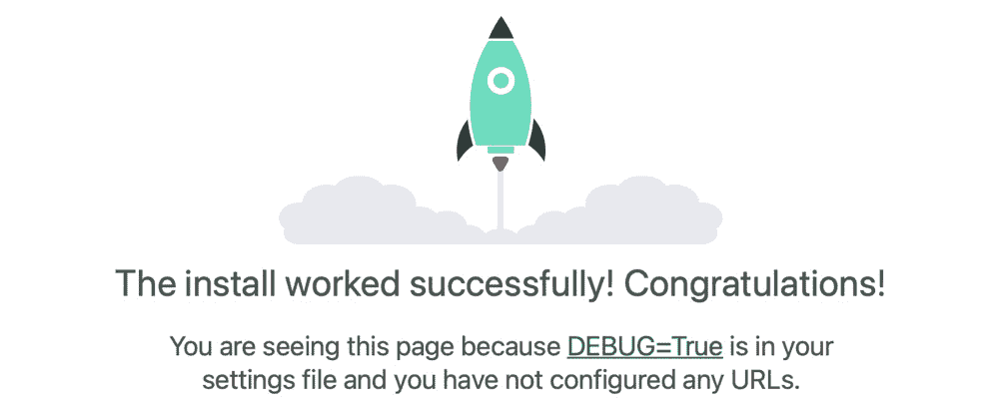
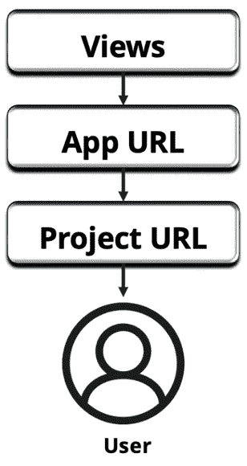
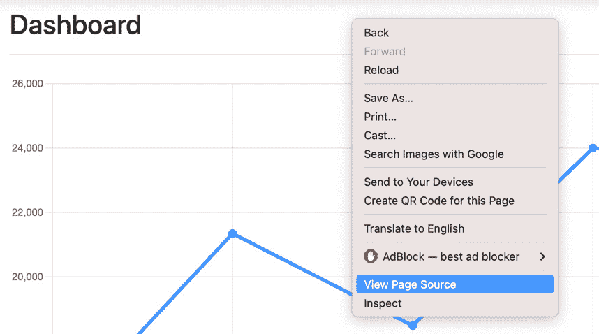
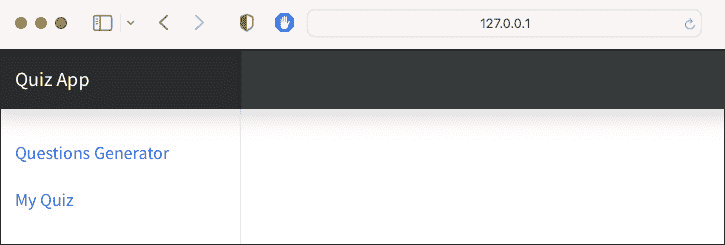
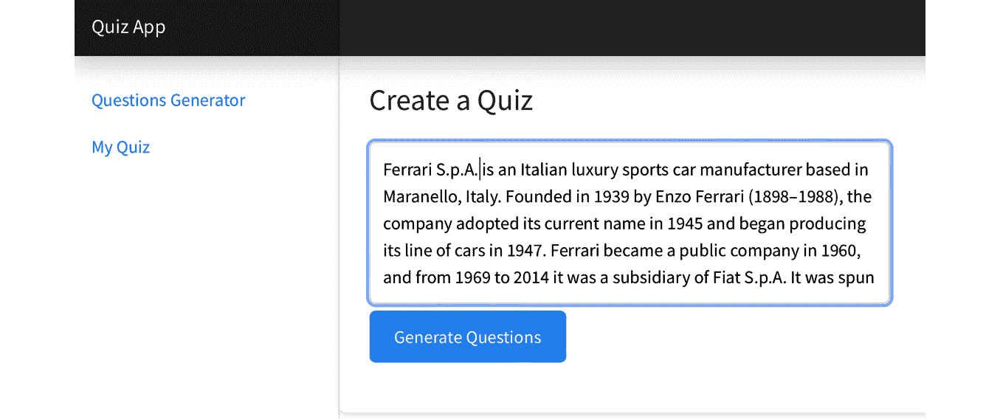
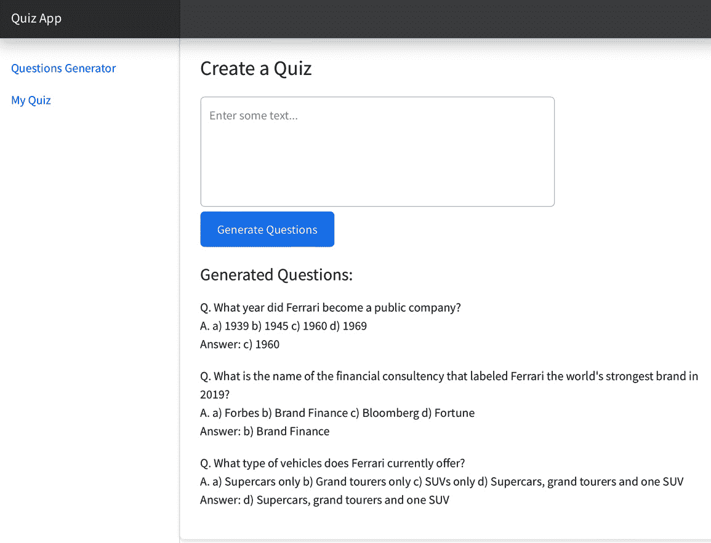
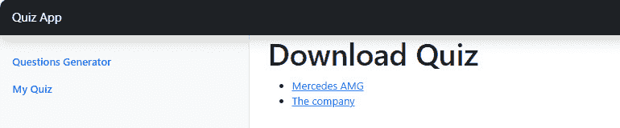

# <st c="0">5</st>

# <st c="2">使用 ChatGPT 和 Django 创建问答应用</st>

<st c="45">在本章中，我们将深入探讨将</st> **<st c="127">ChatGPT</st>**<st c="134">，一个前沿的</st> <st c="150">语言</st> <st c="160">模型</st>，与</st> **<st c="172">Django</st>**<st c="178">，广受赞誉的 Python 应用开发框架</st> <st c="239">相结合的激动人心的世界。</st> <st c="309">我们将探索如何构建一个动态且交互式的考试</st> <st c="347">生成应用</st>，该应用利用</st> **<st c="358">人工智能</st>** <st c="370">(</st>**<st c="372">AI</st>**<st c="374">)。</st>

在前几章中，我们主要关注了 Flask，一个轻量级和基本的 Web 框架。</st> <st c="474">然而，在本章中，我们将重点关注 Django，一个强大且高级的框架，它在构建一些最著名和最广泛使用的应用程序中发挥了关键作用，包括 Instagram、Dropbox 和 Pinterest。</st> <st c="701">您将有机会探索 Django 的功能，包括数据库管理、认证系统、管理界面以及</st> <st c="872">表单处理。</st>

<st c="886">您将学习如何从头开始构建 Django 项目，包括设置环境和创建应用程序的基础组件。</st> <st c="1046">我们将专注于创建问答应用的框架和视图。</st> <st c="1123">您将探索 ChatGPT 和 Django 的集成，使您能够使用 AI 进行问答生成。</st> <st c="1223">为了确保全面的学习体验，我们将介绍应用中的两个基本视图。</st> <st c="1328">一个视图将允许用户通过输入学习材料和执行 ChatGPT API 来生成问答，相关的问题将被存储在数据库中。</st> <st c="1518">另一个视图将使用户能够方便地下载之前</st> <st c="1591">生成的测试。</st>

<st c="1607">在本章中，您将探索开发健壮的 Django 应用程序所必需的几个关键主题。</st> <st c="1715">您将从安装 Django 并创建您的第一个运行项目开始，为您的应用程序打下基础。</st> <st c="1836">之后，您将构建针对考试生成应用程序定制的 Django 视图，然后与 Django 集成 ChatGPT API 以在后台拦截响应。</st> <st c="2025">为了提升用户体验，您将利用 Bootstrap 模板创建一个视觉上吸引人的界面。</st> <st c="2136">此外，您将学习如何安全地将 ChatGPT 响应在数据库中存储和检索，确保数据完整性和安全性。</st> <st c="2267">最后，本章将指导您将文件下载功能添加到您的应用程序中，完善您的技能集，并使您能够交付一个全面且功能齐全的</st> <st c="2454">网络应用程序。</st>

<st c="2470">在本章中，我们将涵盖以下</st> <st c="2506">主题：</st>

+   <st c="2523">构建一个</st> <st c="2535">Django 项目</st>

+   <st c="2549">创建考试应用框架</st> <st c="2578">和视图</st>

+   <st c="2587">将 ChatGPT 和 Django 集成用于</st> <st c="2623">测验生成</st>

+   <st c="2638">存储和下载</st> <st c="2663">生成的测验</st>

<st c="2680">在本章结束时，您将具备使用 ChatGPT API 生成任何提供的</st> <st c="2834">学习材料派生的考试问题的知识和技能。</st>

# <st c="2849">技术要求</st>

<st c="2872">在继续本章内容之前，您需要完成一些基本软件的安装。</st> <st c="2967">此外，Django 网络框架的安装将在下一节中演示。</st>

<st c="3066">该项目有以下</st> <st c="3097">技术先决条件：</st>

+   <st c="3121">在您的</st> <st c="3169">本地机器上安装 Python 3.7 或更高版本</st>

+   <st c="3182">一个代码编辑器，推荐使用 VSCode 以获得</st> <st c="3229">最佳体验</st>

+   <st c="3247">一个 OpenAI API 密钥，用于访问必要的</st> <st c="3290">API 功能</st>

<st c="3309">您可以在提供的</st> <st c="3390">存储库</st> <st c="3402">https://github.com/PacktPublishing/Building-AI-Applications-with-ChatGPT-API</st>](https://github.com/PacktPublishing/Building-AI-Applications-with-ChatGPT-API)<st c="3478">中访问本章使用的代码示例。</st>

# <st c="3479">构建 Django 项目</st>

<st c="3505">在本节中，我们将开始一段激动人心的旅程，构建一个作为我们测验生成应用基础的 Django 项目。</st> <st c="3525">我们将引导您逐步设置和构建您的 Django 项目，确保您有一个坚实的基础来继续。</st> <st c="3653">在本节结束时，您将拥有一个功能齐全的 Django 项目，可以基于</st> <st c="3812">学习材料自动生成测验。</st>

<st c="3969">我们的冒险从</st> <st c="3996">安装 Django 和创建新的 Django 项目开始。</st> <st c="4065">我们将向您介绍设置开发环境的过程，包括 Python 和 Django 框架的安装。</st> <st c="4209">在 Django 设置完成后，我们将使用命令行界面生成一个新的 Django 项目，为您提供必要的目录结构和初始</st> <st c="4369">配置文件。</st>

<st c="4389">我们可以先创建一个名为</st> `<st c="4443">QuizApp</st>`<st c="4450">的新 VSCode 项目。</st> 现在，让我们点击 VSCode 的</st> `<st c="4651">pip</st>`<st c="4654">：</st>

```py
 $pip install Django
```

<st c="4676">接下来，您可以在终端中运行以下命令来创建一个新的 Django 项目：</st>

```py
 $django-admin startproject quiz_project
```

<st c="4804">当您运行此命令时，Django 的命令行工具，称为</st> `<st c="4870">django-admin</st>`<st c="4882">，将创建一个具有指定名称的新项目目录，</st> `<st c="4941">quiz_project</st>`<st c="4953">。此目录将包含启动 Django 项目所需的文件和文件夹。</st>

<st c="5041">`<st c="5046">startproject</st>` <st c="5058">命令</st> <st c="5066">通过生成以下文件来初始化项目结构：</st> <st c="5119">以下文件：</st>

+   `<st c="5135">manage.py</st>`<st c="5145">：一个命令行工具，允许您与各种 Django 命令交互并管理</st> <st c="5239">您的项目。</st>

+   `<st c="5252">quiz_project</st>`<st c="5265">：项目目录，其名称将与命令中指定的名称相同。</st> <st c="5358">此目录作为您 Django 项目的根目录，包含配置文件和其他</st> <st c="5458">项目特定组件。</st>

在项目目录内，您将找到以下文件和目录：

+   `<st c="5567">__init__.py</st>`<st c="5579">：一个空文件，标记目录为一个</st> <st c="5626">Python 包</st>

+   `<st c="5640">settings.py</st>`<st c="5652">：配置文件，您在其中定义 Django 项目的各种设置，包括数据库设置、中间件和</st> <st c="5782">已安装的应用程序</st>

+   `<st c="5796">urls.py</st>`<st c="5804">: 定义您项目 URL 与视图之间映射的 URL 配置文件。</st>

+   `<st c="5898">wsgi.py</st>`<st c="5906">: 用于部署的**<st c="5913">Web 服务器网关接口</st>** <st c="5941">(</st>**<st c="5943">WSGI</st>**<st c="5947">) 配置文件。</st>

<st c="5988">您可以通过定义模型、视图和模板以及根据应用程序的需求配置设置来进一步自定义和开发您的 Django 项目。</st>

<st c="6154">在 Django 中，一个项目是一组设置、配置和多个应用程序的集合，这些应用程序协同工作以创建一个网络应用程序。</st> <st c="6287">另一方面，应用程序是 Django 项目中的一个模块化组件，它服务于特定的目的或功能。</st> <st c="6410">因此，在我们的</st> `<st c="6434">quiz_project</st>`<st c="6446">中，我们可以创建一个新的应用程序</st> <st c="6480">如下：</st>

```py
 $cd quiz_project
$python manage.py startapp quiz_app
```

<st c="6544">我们新创建的应用程序的目的将是生成 AI 问题并允许用户下载它们。</st> <st c="6658">将根据指定的应用程序名称生成一个新目录，</st> `<st c="6716">quiz_app</st>`<st c="6724">。 此目录包含开发您的 Django 应用程序所需的必要文件和文件夹。</st> <st c="6810">让我们探索</st> <st c="6875">应用程序目录</st> 内的典型项目结构和文件：</st>

+   `<st c="6889">admin.py</st>`<st c="6898">: 此文件用于将您的应用程序模型注册到 Django 管理界面。</st> <st c="6982">您可以根据需要自定义模型在管理站点上的显示和交互方式。</st>

+   `<st c="7068">apps.py</st>`<st c="7076">: 此文件定义了应用程序配置，包括应用程序的名称，并在应用程序启动时使用初始化函数。</st>

+   `<st c="7217">models.py</st>`<st c="7227">: 在这里，您可以使用</st> <st c="7275">Django</st> **<st c="7285">对象关系映射</st>** <st c="7310">(</st>**<st c="7312">ORM</st>**<st c="7315">) 来定义您的应用程序的数据模型。</st> <st c="7319">模型代表您数据的结构，并定义了数据库中的表。</st>

+   `<st c="7402">tests.py</st>`<st c="7411">: 此文件用于编写您应用程序的测试。</st> <st c="7424">您可以创建测试用例并运行它们，以确保应用程序的功能。</st>

+   `<st c="7540">views.py</st>`<st c="7549">: 此文件定义了处理 HTTP 请求并返回 HTTP 响应的函数或类。</st> <st c="7648">该文件处理数据，与模型交互，并渲染模板以生成显示给用户的内 容。</st>

+   `<st c="7764">migrations/</st>`<st c="7776">: 该文件夹用于存储数据库迁移文件。</st> <st c="7833">迁移是管理数据库模式随时间变化的一种方式。</st> <st c="7907">它们允许您跟踪和应用数据库结构的增量更改，例如创建新表、修改现有表以及添加或</st> <st c="8059">删除列。</st>

<st c="8076">测验生成应用程序的完整高级项目结构如下：</st> <st c="8149">如下：</st>

```py
 quiz_project/
├── quiz_app
│   ├── migrations/
│   ├── __init__.py
│   ├── admin.py
│   ├── apps.py
│   ├── models.py
│   ├── tests.py
│   └── views.py
├── quiz_project/
│   ├── settings.py
│   ├── urls.py
│   ├── wsgi.py
│   └── __init__.py
└──  manage.py
```

<st c="8394">默认情况下，Django 包含几个内置应用程序，例如</st> `<st c="8454">auth</st>`<st c="8458">,</st> `<st c="8460">admin</st>`<st c="8465">,</st> `<st c="8467">contenttypes</st>`<st c="8479">，和</st> `<st c="8485">sessions</st>`<st c="8493">。这些应用程序都有自己的迁移需要应用以在数据库中创建包含默认用户数据的所需表。</st>

<st c="8632">Django 使用默认的 SQLite 数据库来存储数据。</st> <st c="8690">我们可以运行以下命令来使用所有</st> <st c="8705">现有模型初始化数据库：</st> <st c="8759">现有模型初始化数据库：</st>

```py
 $python manage.py migrate
```

<st c="8801">当你运行此命令时，Django 将检查这些默认应用中是否有任何挂起的迁移，并在必要时应用它们。</st> <st c="8924">这确保了数据库模式被正确设置以支持 Django 内置功能，并由</st> <st c="9041">命令输出进行验证：</st>

```py
 Operations to perform:
  Apply all migrations: admin, auth, contenttypes, sessions
Running migrations:
  Applying contenttypes.0001_initial... OK
  Applying auth.0001_initial... OK
  Applying admin.0001_initial... OK
  Applying admin.0002_logentry_remove_auto_add... OK
  Applying admin.0003_logentry_add_action_flag_choices... OK
  Applying contenttypes.0002_remove_content_type_name... OK
  Applying auth.0002_alter_permission_name_max_length... OK
  Applying auth.0003_alter_user_email_max_length... OK
  Applying auth.0004_alter_user_username_opts... OK
  Applying auth.0005_alter_user_last_login_null... OK
  Applying auth.0006_require_contenttypes_0002... OK
  Applying auth.0007_alter_validators_add_error_messages... OK
  Applying auth.0008_alter_user_username_max_length... OK
  Applying auth.0009_alter_user_last_name_max_length... OK
  Applying auth.0010_alter_group_name_max_length... OK
  Applying auth.0011_update_proxy_permissions... OK
  Applying auth.0012_alter_user_first_name_max_length... OK
  Applying sessions.0001_initial... OK
```

<st c="10069">一旦迁移都设置好了，你就可以启动开发服务器来</st> <st c="10142">在本地运行你的 Django</st> <st c="10159">项目：</st>

```py
<st c="10175">$python manage.py runserver</st> Watching for file changes with StatReloader
Performing system checks... System check identified no issues (0 silenced). May 26, 2023 - 18:59:08
Django version 4.2.1, using settings quiz_project.settings'
Starting development server at http://127.0.0.1:8000/
Quit the server with CONTROL-C.
```

<st c="10493">当你在终端中运行此命令时，Django 的</st> `<st c="10546">manage.py</st>` <st c="10555">脚本启动一个轻量级 Web 服务器，允许你在本地运行和测试你的 Django 应用程序。</st> <st c="10660">要访问你的应用程序，你可以点击终端输出中提供的链接（http://127.0.0.1:8000/）或在浏览器中输入它。</st> <st c="10791">此链接包含一个本地 IP 地址和一个端口，你可以通过该端口访问你的新应用程序（见</st> *<st c="10882">图 5</st>**<st c="10890">.1</st>*<st c="10892">）。</st>



<st c="11053">图 5.1 – Django 欢迎屏幕</st>

<st c="11091">在浏览器中看到 Django 欢迎页面意味着我们已经成功创建了我们的 Django 项目和应用。</st> <st c="11110">在下一节中，我们将根据我们的</st> <st c="11360">项目需求，通过定义模型、视图和模板以及配置 URL 路由来开始构建我们的应用程序。</st>

# <st c="11381">创建考试应用程序框架和视图</st>

在本节中，我们将<st c="11419">关注构建我们的 Django 应用程序的基本结构。</st> <st c="11439">我们将从探索 Django 设置开始，在那里你将学习如何配置重要方面，例如数据库连接和中间件组件。</st> <st c="11516">理解和正确设置这些配置对于应用程序的平稳运行至关重要。</st> <st c="11773">你的应用程序。</st>

我们还将了解 Django 中的 URL 处理。<st c="11790">你将发现如何使用</st> `<st c="11895">urls.py</st>` <st c="11902">文件定义 URL 模式，从而实现应用程序内的无缝导航。</st> <st c="11963">我们还将介绍使用正则表达式进行动态 URL，以实现灵活和动态的路由。</st> <st c="12065">此外，我们将指导你通过将基础模板集成到应用程序中，这将提供一致菜单、侧边栏和视图。</st> <st c="12219">你的应用程序。</st>

## 连接 Django 视图和 URL

<st c="12269">在 Django 中，视图、应用 URL 和项目 URL 之间的关系构成了处理和路由 Web 请求的关键结构。</st> <st c="12396">流程从视图开始，视图是负责处理特定 HTTP 请求并返回适当响应的 Python 函数或类。</st> <st c="12549">每个视图对应于应用程序中的特定功能或页面。</st> <st c="12634">这些视图可以通过分配唯一的 URL 向用户展示。</st> <st c="12700">由于在 Django 中，一个项目可以有多个应用程序，因此这些 URL 首先在</st> `<st c="12812">quiz_app/urls.py</st>`<st c="12828">中的应用级别定义。然后，这些 URL 被传递到位于</st> `<st c="12878">urls.py</st>` <st c="12885">文件中的项目级别，该文件位于我们的项目目录</st> `<st c="12906">quiz_project</st>` <st c="12918">中（参见</st> *<st c="12950">图 5</st>**<st c="12958">.2</st>*<st c="12960">）。</st>



图 5.2 – Django 视图/URL 架构

`<st c="13024">默认情况下，Django 在初始化项目时会自动生成</st>` `<st c="13072">quiz_project/urls.py</st>` `<st c="13092">文件。</st> `<st c="13132">然而，需要注意的是，我们将在</st>` `<st c="13208">urls.py</st>` `<st c="13215">文件中手动创建一个新文件，该文件位于</st>` `<st c="13232">quiz_app</st>` `<st c="13240">文件夹内。</st> `<st c="13249">与项目级别的</st>` `<st c="13274">urls.py</st>` `<st c="13281">文件不同，应用级别的</st>` `<st c="13292">urls.py</st>` `<st c="13299">文件不会自动生成，并且组织并定义特定于</st>` `<st c="13453">quiz_app</st>` `<st c="13461">内部功能的 URL 模式是至关重要的。</st>

`<st c="13462">现在，您可以打开</st>` `<st c="13481">quiz_app/views.py</st>` `<st c="13498">并编写以下</st>` `<st c="13523">Python 代码：</st>

```py
 from django.shortcuts import render
def home(request):
    return render(request, 'base.html')
```

`<st c="13626">此代码</st>` `<st c="13637">演示了一个名为</st>` `<st c="13686">home</st>` `<st c="13690">的简单 Django 视图函数。</st> `<st c="13637">该视图函数负责处理特定类型的请求，通常是 HTTP</st>` `<st c="13785">GET</st>` `<st c="13788">请求，并生成适当的响应。</st>

在函数内部，Django 快捷方式 `<st c="13837">render</st>` `<st c="13879">函数用于渲染 HTML 模板。</st> `<st c="13931">第一个参数，</st>` `<st c="13952">request</st>` `<st c="13959">，代表传入的 HTTP 请求对象。</st> `<st c="14006">该对象包含有关请求的信息，例如头部、数据和用户会话详情。</st> `<st c="14107">第二个参数，</st>` `<st c="14129">base.html</st>` `<st c="14138">，指定要渲染的模板。</st>

`<st c="14178">在构建</st>` `<st c="14199">base.html</st>` `<st c="14208">文件之前，我们需要确保用户可以访问</st>` `<st c="14242">home</st>` `<st c="14246">视图。</st> `<st c="14281">为了实现这一点，我们需要在我们的</st>` `<st c="14337">quiz_app/urls.py</st>` `<st c="14353">文件中指定一个唯一的 URL：</st>

```py
 from django.urls import path
from . import views
urlpatterns = [
    path('', views.home, name='home'),
]
```

`<st c="14461">在这里，</st>` `<st c="14472">urlpatterns</st>` `<st c="14483">变量是一个包含应用程序定义的 URL 模式的列表。</st> `<st c="14560">目前，已指定了一个 URL 模式。</st> `<st c="14623">` `<st c="14627">path</st>` `<st c="14631">函数用于定义 URL 模式。</st> `<st c="14674">它接受三个参数 - 第一个参数是 URL 模式本身，在本例中由空字符串</st>` `<st c="14788">''</st>` `<st c="14790">表示。</st> `<st c="14806">这个空字符串表示应用程序的根 URL 或基本 URL。</st>

<st c="14882">第二个参数,</st> `<st c="14904">views.home</st>`<st c="14914">, 指的是将处理此 URL 模式请求的视图函数。</st> <st c="14995">第三个参数,</st> `<st c="15015">name='home'</st>`<st c="15026">, 为此 URL 模式提供了一个唯一的名称。</st> <st c="15073">此名称可用于从应用程序的其他部分</st> <st c="15141">引用 URL 模式，例如模板或其他</st> <st c="15188">URL 配置。</st>

<st c="15207">最后，我们可以通过</st> <st c="15284">修改</st> `<st c="15294">quiz_project/urls.py</st>`<st c="15314">:</st>

```py
<st c="15316">from django.contrib import admin</st> from django.urls import <st c="15373">include</st>, path
urlpatterns = [
 <st c="15403">path('admin/', admin.site.urls),</st>
 <st c="15435">path('', include('quiz_app.urls')),</st> ]
```

<st c="15473">提供的代码展示了我们 Django 项目中 URL 模式的配置。</st> <st c="15558">就像在应用级别的 URL 文件中一样，这里</st> `<st c="15612">urlpatterns</st>` <st c="15623">变量包含项目 URL 名称的列表。</st> <st c="15676">在这种情况下，指定了两个 URL</st> <st c="15708">模式。</st>

<st c="15727">第一个 URL 模式是使用</st> `<st c="15771">path</st>` <st c="15775">函数和</st> `<st c="15794">admin/</st>` <st c="15800">参数定义的。</st> <st c="15811">这将</st> `<st c="15831">admin/</st>` <st c="15837">URL 模式与 Django 管理界面关联起来，从而允许访问管理仪表板和相关功能。</st> <st c="15951">Django 管理页面通常默认设置，与我们</st> <st c="16046">的 quiz 应用程序的功能无关。</st>

<st c="16063">`<st c="16068">path('', include('quiz_app.urls'))</st>` <st c="16102">path 函数从</st> `<st c="16147">quiz_app/urls.py</st>`<st c="16163">获取应用级别的 URL。第一个参数，一个空字符串</st> `<st c="16202">''</st>`<st c="16204">，表示应用程序的根 URL 或基本 URL。</st> <st c="16261">这意味着当用户访问项目的根 URL 时，此 URL 模式将被</st> <st c="16349">匹配。</st>

<st c="16360">第二个参数,</st> `<st c="16382">include('quiz_app.urls')</st>`<st c="16406">, 指示 Django 包含在</st> `<st c="16468">quiz_app.urls</st>` <st c="16481">模块中定义的 URL 模式。</st> <st c="16490">这意味着任何在</st> `<st c="16536">quiz_app</st>` <st c="16544">应用程序中指定的 URL 都将被匹配并</st> <st c="16577">相应处理。</st>

<st c="16597">这是 URL 处理分层结构的模样。</st> <st c="16666">我们从处理应用级 URL 的视图开始，这些 URL 定义了特定的 URL 模式，最终到项目级 URL，这些 URL 将请求路由到适当的应用级 URL。</st> <st c="16854">这个过程通过代码示例进行了说明，突出了在应用和项目级别正确配置 URL 对于在 Django 应用程序中实现顺畅导航和功能的重要性。</st> <st c="17046">Django 应用程序。</st>

<st c="17065">在接下来的部分中，我们将深入探讨构建 HTML 模板，包括必要的</st> `<st c="17159">base.html</st>` <st c="17168">文件。</st> <st c="17175">模板在定义 Django 应用程序中网页的视觉结构和布局方面发挥着至关重要的作用。</st> <st c="17252">通过构建和定制 HTML 模板，我们可以为我们的</st> <st c="17408">测验应用程序</st> <st c="17425">创建一个一致且视觉上吸引人的用户界面。</st>

## <st c="17425">开发 Django 模板</st>

<st c="17453">在本节中，我们将专注于构建</st> `<st c="17501">base.html</st>` <st c="17510">模板并将 CSS 集成到我们的 Django 应用程序中。</st> <st c="17571">`<st c="17575">base.html</st>` <st c="17584">模板是我们网页视觉结构和布局的基础。</st> <st c="17673">为了增强我们应用程序的设计和样式，我们将利用外部 CSS 资源。</st> <st c="17767">一个宝贵的资源是 Bootstrap 框架，它提供了一系列预设计的模板和组件。</st> <st c="17885">我们将通过从官方 Bootstrap 网站（</st>[<st c="17983">https://getbootstrap.com/docs/5.3/examples/</st>](https://getbootstrap.com/docs/5.3/examples/)<st c="18027">）中寻找合适的模板的过程，您可以在那里探索各种示例并选择与您期望的美学</st> <st c="18130">和功能相匹配的模板。</st>

<st c="18148">如果您使用</st> **<st c="18229">Google Chrome</st>**<st c="18242">，可以轻松访问任何 Bootstrap 模板背后的代码。例如，对于这个项目，我们可以使用</st> **<st c="18291">Dashboard</st>** <st c="18301">模板，您可以通过以下链接访问：</st> [<st c="18338">https://getbootstrap.com/docs/5.3/examples/dashboard/</st>](https://getbootstrap.com/docs/5.3/examples/dashboard/)<st c="18391">。正如您在</st> *<st c="18411">图 5.3</st>**<st c="18419">.3</st>*<st c="18421">中可以看到的，可以通过右键单击</st> **<st c="18478">Dashboard</st>** <st c="18487">模板并选择</st> **<st c="18514">查看页面</st>** **<st c="18524">源代码</st>** <st c="18530">选项来访问 HTML 代码。</st>



<st c="18768">图 5.3 – 在 Chrome 中查看页面源代码</st>

<st c="18814">通过这种方式</st> <st c="18832">，你可以从该模板中提取特定部分并将其集成到自己的应用程序中，从而实现易于定制和扩展。</st> <st c="18991">这个过程为你的</st> <st c="19044">Django 应用程序</st> 奠定了坚实的基础。

<st c="19055">首先，你可以在应用程序和项目文件夹之外的一个单独位置创建一个</st> `<st c="19083">templates</st>` <st c="19092">文件夹，遵循以下概述的推荐结构。</st> <st c="19236">这种有组织的设置确保了你的</st> <st c="19294">模板文件</st> 的有效管理：

```py
 quiz_project/
├── quiz_app
├── quiz_project/
└──  templates
```

<st c="19368">在</st> `<st c="19380">templates</st>` <st c="19389">目录中，你将创建一个名为</st> `<st c="19439">base.html</st>`<st c="19448">的新 HTML 文件，作为应用程序结构的基石。</st> <st c="19510">在这个文件中，你可以开始包括相关的链接并定义设置应用程序整体上下文的头部部分：</st>

```py
 
<html lang="en" data-bs-theme="auto">
<head>
  <script src="img/color-modes.js"></script>
  <meta charset="utf-8">
  <meta name="viewport" content="width=device-width, initial-scale=1">
  <title>Quiz App</title>
  <!-- Bootstrap CSS -->
  <link href="" rel="stylesheet" />
<!--  ; Custom styles for this template &ndash;&gt;-->
  <link href="" rel="stylesheet" />
</head>
```

<st c="20108">第一</st> <st c="20118">行</st> `<st c="20125"></st>`<st c="20142">，是一个 Django 模板标签，允许我们加载静态文件，例如 CSS 样式表和 JavaScript 脚本，到我们的 HTML 模板中。</st> <st c="20279">它使我们能够在 Django 项目中访问和使用这些文件。</st> <st c="20354">在本节后面的内容中，我们将创建</st> `<st c="20396">.css</st>` <st c="20400">文件，并且它们将被自动传递到</st> <st c="20449">HTML 中。</st>

<st c="20458">然后，</st> `<st c="20469">data-bs-theme</st>` <st c="20482">属性用于自动主题处理。</st> <st c="20531">此属性通常与 Bootstrap（一个流行的 CSS 框架）一起使用，根据用户的</st> <st c="20675">设备设置自动在浅色和深色主题之间切换。</st>

<st c="20691">`<st c="20696">head</st>` <st c="20700">部分包含各种元标签和外部脚本和样式表引用。</st> <st c="20784">这些元标签提供了有关网页字符编码和视口设置的详细信息。</st> <st c="20889">它们确保网页正确渲染，并调整其布局以适应不同的</st> <st c="20980">屏幕尺寸。</st>

<st c="20993">接下来，我们包含外部 CSS 样式表。</st> <st c="21038">`<st c="21042"></st>` <st c="21078">和`<st c="21083"></st>` <st c="21115">标签指的是我们将在 Django 项目中创建的静态 CSS 文件。</st> <st c="21194">这些 CSS 文件提供了样式规则和格式化指令，定义了网页上元素的视觉外观。</st>

<st c="21322">一旦完成头部</st> <st c="21338">，我们可以使用以下代码片段来构建页面的主体：</st>

```py
 <body>
  <header class="navbar navbar-dark sticky-top bg-dark flex-md-nowrap p-0 shadow">
    <a class="navbar-brand col-md-3 col-lg-2 me-0 px-3 fs-6" href="#">Quiz App</a>
    <div class="navbar-nav">
    </div>
  </header>
  <div class="container-fluid">
    <div class="row">
      <nav id="sidebarMenu" class="col-md-3 col-lg-2 d-md-block bg-body-tertiary sidebar collapse">
      <div class="position-sticky pt-3 sidebar-sticky">
        <ul class="nav flex-column">
          <li class="nav-item">
            <a class="nav-link active" aria-current="page" href="">
              <span data-feather="home" class="align-text-bottom"></span>
              Questions Generator
            </a>
          </li>
          <li class="nav-item">
            <a class="nav-link active" aria-current="page" href="/history">
              <span data-feather="file" class="align-text-bottom"></span>
              My Quiz
            </a>
          </li>
        </ul>
      </div>
    </nav>
    </div>
  </div>
  </body>
</html>
```

<st c="22235">在这里，主体</st> <st c="22251">由一个</st> `<st c="22265"><header></st>` <st c="22273">部分组成，其中包含一个导航栏。</st> <st c="22314">导航栏包含测验应用的商标名称。</st> <st c="22373">元素可以用来添加额外的导航项</st> <st c="22401">（如果需要的话）。</st>

<st c="22467">在这个导航中，有一个</st> `<st c="22503"><nav id="sidebarMenu"></st>` <st c="22525">元素，它充当侧边菜单。</st> <st c="22565">它包含可以按需定制的导航项列表。</st> <st c="22638">每个导航项都由</st> `<st c="22677"><li class="nav-item"></st>` <st c="22698">及其关联的链接表示。</st> <st c="22724">侧边栏内部我们将有两个主要链接：</st> <st c="22759">。</st>

+   **<st c="22771">“问题生成器”标签页</st>**<st c="22799">：此标签页显示了 ChatGPT 测验生成工具</st> <st c="22830">。

+   **<st c="22845">“我的测验”标签页</st>**<st c="22861">：此标签页显示了用户迄今为止创建的所有测验，准备好</st> <st c="22934">下载</st>

<st c="22947">现在我们已经完成了</st> `<st c="22979">base.html</st>`<st c="22988">，我们可以添加样式文件。</st> <st c="23018">为此，在你的</st> `<st c="23087">quiz_project</st>`<st c="23099">中创建两个新的目录，分别命名为</st> `<st c="23064">static/css</st>` <st c="23074">，如下所示：</st>

```py
 quiz_project/
├── quiz_app
├── quiz_project/
│   ├── static/
│   └── css/
│      ├── dashboard.css
│      └── bootstrap.min.css
└──  templates
```

<st c="23243">我们不必自己编写样式文件，可以直接从</st> `<st c="23433">css</st>` <st c="23436">文件夹中下载 CSS 文件。</st> <st c="23445">您可以在以下位置找到我们项目所需的每个 CSS 文件的链接：</st>

+   `<st c="23523">dashboard.css</st>`<st c="23537">:</st> [<st c="23540">https://getbootstrap.com/docs/5.3/examples/dashboard/dashboard.css</st>](https://getbootstrap.com/docs/5.3/examples/dashboard/dashboard.css)

+   `<st c="23606">bootstrap.min.css</st>`<st c="23624">:</st> [<st c="23627">https://getbootstrap.com/docs/5.3/dist/css/bootstrap.min.css</st>](https://getbootstrap.com/docs/5.3/dist/css/bootstrap.min.css)

<st c="23687">或者，您可以从我们的 GitHub</st> <st c="23756">仓库</st> <st c="23768">https://github.com/PacktPublishing/Building-AI-Applications-with-ChatGPT-API</st><st c="23844">访问所有项目文件。</st>

现在，让我们看看如何将这些 HTML 和 CSS 文件集成到我们的 Django 项目中。通过修改`<st c="23945">settings.py</st>` `<st c="23956">文件</st>`，我们可以指定 Django 应该查找静态文件（包括 HTML 模板和 CSS 文件）的目录。这种配置将确保我们的 Django 应用程序可以访问和利用所需的模板和 CSS 样式，在整个应用程序中提供视觉上吸引人且统一的用户体验。

首先，要将 HTML 文件添加到你的项目中，你可以在`<st c="24400">settings.py</st>` `<st c="24411">文件</st>`中简单地引用`<st c="24369">templates</st>` `<st c="24378">目录</st>`。为此，找到`<st c="24439">TEMPLATES</st>` `<st c="24448">字典</st>`并编辑`<st c="24473">DIRS</st>` `<st c="24477">键</st>`，如下所示：

```py
 TEMPLATES = [
    {
        'BACKEND': 'django.template.backends.django.DjangoTemplates', <st c="24573">'DIRS': [os.path.join(BASE_DIR, 'templates')],</st> 'APP_DIRS': True,
        'OPTIONS': {
            'context_processors': [
                'django.template.context_processors.debug',
                'django.template.context_processors.request',
                'django.contrib.auth.context_processors.auth',
                'django.contrib.messages.context_processors.messages',
            ],
        },
    },
]
```

这用于构建 Django 项目内`<st c="24929">templates</st>` `<st c="24938">目录</st>`的绝对路径。《st c="24977">BASE_DIR</st>` `<st c="24985">指的是你的 Django 项目的基础目录，而`<st c="25043">templates</st>` `<st c="25052">是存储你的模板文件的目录名称。</st>` 

通过设置`<st c="25135">DIRS</st>` `<st c="25139">键</st>`，你告诉 Django 将`<st c="25176">templates</st>` `<st c="25185">目录</st>`作为搜索模板文件的位置之一。这允许你将模板文件与你的应用程序目录分开组织，并提供一个中心位置来存储你的`<st c="25389">HTML 模板</st>`。

我们还需要在`<st c="25472">setting.py</st>` `<st c="25482">文件</st>`的开头导入`<st c="25437">os</st>` `<st c="25482">库</st>`：

```py
<st c="25488">import os</st> from pathlib import Path
```

其次，要将所有 CSS 文件传递到你的 Django 项目中，你可以滚动到`<st c="25612">settings.py</st>` `<st c="25623">文件</st>`的底部并添加以下内容：

```py
 # Static files (CSS, JavaScript, Images)
# https://docs.djangoproject.com/en/4.2/howto/static-files/
STATIC_URL = 'static/' <st c="25771">STATICFILES_DIRS = [os.path.join(BASE_DIR, 'quiz_project/static')]</st>
<st c="25837">STATIC_ROOT = os.path.join(BASE_DIR, 'static')</st> # Default primary key field type
# https://docs.djangoproject.com/en/4.2/ref/settings/#default-auto-field
DEFAULT_AUTO_FIELD = 'django.db.models.BigAutoField'
```

在这里，`<st c="26050">STATICFILES_DIRS</st>` `<st c="26066">告诉 Django 在开发期间在哪里查找静态文件，而`<st c="26133">STATIC_ROOT</st>` `<st c="26144">指定了静态文件将被收集以供部署的目录。</st>` 这些设置确保了你的静态文件在开发和生产环境中都组织良好且可访问。这将使我们能够选择项目中的那些 CSS 文件。

<st c="26413">本节解释了通过构建</st> `<st c="26494">base.html</st>` <st c="26503">模板，整合 CSS 资源如 Bootstrap，以及配置</st> `<st c="26581">settings.py</st>` <st c="26592">文件</st> <st c="26598">来管理 Django 项目中的静态文件和模板的过程。</st> <st c="26656">完成这些步骤后，您现在可以进入下一节运行您的 Django 应用程序。</st>

## <st c="26762">运行您的 Django 应用程序</st>

<st c="26794">一旦您完成了上一节中涵盖的步骤，您就可以运行您的 Django 项目。</st> <st c="26808">要运行 Django 应用程序，您需要再次访问您的终端或导航到您的 Django 项目的根目录，</st> `<st c="27003">quiz_project</st>`<st c="27015">，。</st> <st c="27041">这是包含</st> `<st c="27081">manage.py</st>` <st c="27090">文件</st> <st c="27097">的目录。</st> <st c="27147">一旦您处于正确的目录，请执行以下命令：</st>

```py
 $python manage.py runserver
```

<st c="27193">此命令启动开发服务器，允许您在本地运行 Django 应用程序进行测试和</st> <st c="27310">开发。</st>

<st c="27331">重要提示</st>

<st c="27346">一个需要注意的重要提示是，Django 的开发服务器有一个有用的功能</st> <st c="27438">称为</st> **<st c="27445">自动重新加载</st>**<st c="27459">。这意味着您可以在修改代码的同时让服务器运行，服务器将自动检测这些更改并应用它们，而无需手动重启。</st>

<st c="27652">一旦 Django 开发服务器启动，您可以通过打开网页浏览器并输入以下 URL 来访问您的应用程序：</st> `<st c="27789">http://127.0.0.1:8000/</st>` <st c="27811">(见</st> *<st c="27817">图 5.4</st>**<st c="27825">.4</st>*<st c="27827">)。</st> <st c="27831">默认情况下，Django 在本地主机</st> `<st c="27879">127.0.0.1</st>` <st c="27888">上运行并使用端口</st> `<st c="27903">8000</st>`<st c="27907">。前面的</st> <st c="27923">URL 将使您的浏览器指向 Django 应用程序的首页。</st>



<st c="28028">图 5.4 – Quiz 应用初始页面视图</st>

<st c="28071">在我们的 Django 应用程序中，我们可以观察到三个不同的部分：</st>

+   <st c="28139">首先，在最上面，我们有一个标题区域，显示名称</st> **<st c="28204">Quiz App</st>** <st c="28212">在深色背景上。</st>

+   <st c="28240">在左侧，我们找到了一个导航栏，其中包含两个标签，我们将其整合到了</st> `<st c="28332">base.html</st>` <st c="28341">文件中 –</st> **<st c="28349">问题生成器</st>** <st c="28368">和</st> **<st c="28373">我的测验</st>**<st c="28380">。这些标签便于在应用程序的不同功能之间进行导航。</st> **<st c="28471">问题生成器</st>** <st c="28490">标签将用户引导到一个可以构建测验的区域，而</st> **<st c="28566">我的测验</st>** <st c="28573">标签则提供了一个下载测验的视图。</st>

+   <st c="28615">最后，在导航栏的右侧，我们有工作区，用户可以与之交互并探索</st> **<st c="28758">我的测验</st>** <st c="28765">和</st> **<st c="28770">问题生成器</st>** **<st c="28780">功能。</st>

<st c="28806">这是您应用程序的初始视图，它展示了一个时尚现代的界面，具有用户友好的设计。</st> <st c="28938">在下一节中，我们的注意力现在可以转向</st> <st c="29000">开发应用程序的基本方面，这涉及到创建核心的 ChatGPT 测验</st> <st c="29092">生成组件。</st>

# <st c="29113">集成 ChatGPT 和 Django 用于测验生成</st>

<st c="29164">在本节中，我们将探讨使用 ChatGPT</st> <st c="29184">API 在 Django 应用程序中生成问题的激动人心的</st> <st c="29210">任务。</st> <st c="29258">这项强大的功能将允许你根据用户提供的文本输入创建交互式测验。</st> <st c="29294">通过处理用户发出的</st> `<st c="29414">POST</st>` <st c="29418">请求并利用 ChatGPT API 的功能，你将能够动态生成有洞察力的提问，从而增强用户参与度和</st> <st c="29589">知识获取。</st>

<st c="29611">该过程首先在你的 Django 应用程序中引入一个字段，用户可以在其中输入文本。</st> <st c="29711">一旦用户通过点击提交按钮提交文本，应用程序就会利用 ChatGPT API 根据提供的文本生成相关且上下文准确的提问，魔法随之展开。</st> <st c="29921">这些问题无缝地显示给用户，从而提供了一种互动和教育的体验。</st> <st c="30027">通过自动化提问生成过程，你可以节省时间和精力，同时为用户提供有价值的内容。</st> <st c="30151">因此，让我们深入探讨处理</st> `<st c="30212">POST</st>` <st c="30216">请求、构建用于提问创建的 ChatGPT API 函数以及最终以用户友好和直观的方式向用户展示生成的提问所涉及的步骤。</st>

## `<st c="30390">构建测验生成文本区域和提交按钮</st>`

在对时间顺序略有偏离的情况下，我们将首先对`<st c="30549">base.html</st>` `<st c="30558">文件进行修改，以包含我们问题生成功能所需的组件。</st>` `<st c="30641">具体来说，我们将添加一个文本区域，用户可以在其中输入他们希望输入的文本，以及一个提交按钮，该按钮将触发问题生成过程。</st>`

`<st c="30788">您可以在导航栏菜单代码（在` `<st c="30859"></nav></st>` `<st c="30865">标签下）下添加这些字段，如下所示：</st>` `<st c="30888"></st>`

`<st c="30903">base.html</st>`

```py
 </nav> <st c="30921"><main class="col-md-9 ms-sm-auto col-lg-10 px-md-4"></st><st c="30973"></st><st c="30993"><h1>Create a Quiz</h1></st><st c="31016"><form method="post" action=""></st><st c="31047"></st><st c="31064"><textarea name="text" rows="5" cols="50" placeholder="Enter some text..."></textarea></st><st c="31150"><br></st><st c="31155"><input type="submit" value="Generate Questions"></st><st c="31204"></form></st><st c="31212"></st><st c="31231"><h2>Generated Questions:</h2></st><st c="31261">{{ questions|linebreaks }}</st><st c="31288"></st><st c="31300"></st><st c="31315"></main></st> </div>
  </div>
  </body>
</html>
```

`<st c="31353">这代表了</st>` `<st c="31373">` `<st c="31389">base.html</st>` `<st c="31398">文件中的部分，负责显示我们测验生成应用程序中与问题生成功能相关的用户界面元素。</st>` `<st c="31522"></st>`

`<st c="31545">在代码中，我们可以观察到 HTML 标签和 Django 模板语法的使用。</st>` `<st c="31625">` `<st c="31629"><main></st>` `<st c="31635">标签定义了主要内容区域。</st>` `<st c="31671">在` `<st c="31682"><main></st>` `<st c="31688">标签内部，我们有一个由` `<st c="31737"></st>` `<st c="31756">和` `<st c="31761"></st>` `<st c="31775">` 定义的 Django 模板块，这允许动态内容插入。</st>` `<st c="31821">这将确保我们可以稍后连接此块与我们的 Django` `<st c="31885">视图。</st>`

`<st c="31897">在这个块中，我们首先显示一个标题，` `<st c="32147"></st>` `<st c="32163">模板标签确保表单提交的安全性。</st>`

`<st c="32221">在表单内部，我们发现` `<st c="32247">textarea</st>` `<st c="32255">，它作为输入字段，用户可以输入他们希望生成问题的文本。</st>` `<st c="32368">它指定了行和列属性来定义文本输入区域的大小。</st>` `<st c="32454">此外，还有占位文本，` `<st c="32495">Enter some text...</st>` `<st c="32513">，为用户提供说明。</st>` `<st c="32542"></st>`

`<st c="32551">在` `<st c="32562">textarea</st>` `<st c="32570">之后，我们有一个标题为` `<st c="32611">生成问题</st>` `<st c="32629">的提交按钮，用户可以点击它来启动问题生成过程。</st>` `<st c="32698">当表单提交时，用户的输入将被发送到适当的视图进行进一步处理。</st>` `<st c="32784"></st>`

<st c="32803">在表单之后，有一个</st> `<st c="32832"></st>` <st c="32850">语句，用于检查是否有生成的问答题。</st> <st c="32924">如果有，则会出现一个标题，</st> `<st c="33057">{{ questions|linebreaks }}</st>`<st c="33083">。这种语法确保生成的问答题中的换行符在文本字段下正确显示。</st> <st c="33186">。

<st c="33197">最后，我们可以将</st> <st c="33218">一个新的</st> <st c="33223">样式表（稍后我们将构建它）添加到</st> `<st c="33271">base.html</st>` <st c="33280">文件中的</st> `<st c="33293">head</st>`<st c="33301">部分：</st>

```py
 <!--  &lt;!&ndash; Custom styles for this template &ndash;&gt;-->
  <link href="" rel="stylesheet" /> <st c="33435"><link rel="stylesheet" type="text/css" href=""></st> </head>
```

<st c="33523">当你此时启动你的测验生成器时，你会看到虽然所有字段都是可见的，但它们的视觉呈现可能并不美观。</st> <st c="33688">这是因为我们迄今为止只包含了 HTML 元素。</st> <st c="33754">为了增强它们的视觉效果，我们需要引入一些 CSS 样式。</st> <st c="33822">为此，你可以在</st> `<st c="33871">quiz_style.css</st>` <st c="33885">文件中创建一个新的 CSS 文件，该文件位于</st> `<st c="33897">quiz_project/static/css</st>` <st c="33920">目录下。</st> <st c="33932">你可以在这里找到 CSS 文件的内容</st> <st c="33966">：</st> [<st c="33972">https://github.com/PacktPublishing/Building-AI-Applications-with-ChatGPT-API/blob/main/Chapter05%20QuizApp/quiz_project/quiz_project/static/css/quiz_style.css</st>](https://github.com/PacktPublishing/Building-AI-Applications-with-ChatGPT-API/blob/main/Chapter05%20QuizApp/quiz_project/quiz_project/static/css/quiz_style.css)<st c="34130">。</st>

<st c="34131">在这里，我们定义了</st> `<st c="34167">body</st>`<st c="34171">、</st> `<st c="34173">container</st>`<st c="34182">和</st> `<st c="34188">main</st>` <st c="34192">元素的风格。</st> <st c="34203">`<st c="34207">body</st>` <st c="34211">元素被设置为使用 Arial 字体家族，并具有白色背景。</st> <st c="34284">`<st c="34288">container</st>` <st c="34297">类指定最大宽度为</st> `<st c="34333">960px</st>`<st c="34338">，而包含我们的应用程序的`<st c="34350">main</st>` <st c="34354">元素，也具有阴影效果和</st> `<st c="34442">5px</st>`<st c="34445">的边框半径。</st>。

<st c="34449">然后，我们可以定义</st> `<st c="34489">textarea</st>` <st c="34497">和</st> `<st c="34502">submit</st>` <st c="34508">按钮元素的样式。</st> <st c="34526">`<st c="34530">textarea</st>` <st c="34538">元素被设置为具有其父容器宽度的</st> `<st c="34573">70%</st>` <st c="34576">，颜色为浅灰色。</st> <st c="34626">代表提交按钮的`<st c="34630">input[type="submit"]</st>` <st c="34650">元素具有蓝色背景色，当鼠标悬停</st> <st c="34773">在其上时，光标变为指针。</st>

<st c="34781">`<st c="34786">响应式样式</st>` <st c="34803">部分使用媒体查询在视口的最大宽度为</st> `<st c="34898">767px</st>` <st c="34903">或更小时应用特定样式。</st> <st c="34913">在这种情况下，它减少了`.container` <st c="34957">和</st> `<st c="34972">main</st>` <st c="34976">元素的填充，将标题的字体大小减少到</st> `<st c="35026">20px</st>`<st c="35030">，并调整了`<st c="35063">textarea</st>` <st c="35071">和</st> `<st c="35076">input[type="submit"]</st>` <st c="35096">元素的填充。</st> <st c="35107">这些样式确保了测验生成应用程序在视觉上吸引人，并能很好地适应不同的屏幕尺寸，提供更好的</st> <st c="35247">用户体验。</st>

<st c="35263">到目前为止，我们已经</st> <st c="35279">成功</st> <st c="35292">构建了我们应用程序测验生成功能的整个用户界面。</st> <st c="35383">我们的下一步是集成 ChatGPT API 服务并实现必要的视图。</st> <st c="35455">正确答案应该在哪里以及如何显示</st>

## <st c="35471">使用 Django 创建 ChatGPT API 视图</st>

<st c="35510">现在我们已经</st> <st c="35527">完成了前端开发，我们将</st> <st c="35560">探索如何将这个强大的 ChatGPT API 集成到我们的 Django 视图中，使我们能够利用 ChatGPT 的能力来生成</st> <st c="35699">测验问题。</st>

<st c="35714">要求 ChatGPT 以特定结构生成响应可能是一项具有挑战性的任务，因为我们需要定义非常具体的指令，说明我们的测验中的问题应该如何生成。</st> <st c="35909">考虑到这一点，我们的 ChatGPT 提示应该满足以下要求：</st> <st c="35965">以下要求：</st>

+   <st c="35988">一个变量应该传递我们想要创建问题的文本。</st> <st c="36095">这将使我们的应用程序能够处理不同类型的</st> <st c="36149">文本。</st>

+   <st c="36157">提示应该包含以下指令，以指定</st> <st c="36213">以下：</st>

    +   <st c="36227">问题的数量</st> <st c="36239">个

    +   <st c="36251">提示应该包含以下指令：</st> <st c="36213">以下：</st>

    +   <st c="36304">ChatGPT 应生成哪种类型的问题（多项选择、开放式回答等）</st>

<st c="36387">每次您想要设计一个 ChatGPT 提示并测试 API 响应是否符合您的提示定义时，创建这样的要求是一个好习惯。</st> <st c="36401">基于您的</st> <st c="36562">提示定义</st>，检查 API 响应是否符合预期。</st>

<st c="36580">在您的 Django 项目中的`<st c="36592">quiz_app</st>` `<st c="36600">文件夹内，您需要创建两个基本文件——</st> `<st c="36678">config.py</st>` `<st c="36687">和</st> `<st c="36692">services.py</st>`<st c="36703">。` `<st c="36709">config.py</st>` `<st c="36718">文件作为存储您的 ChatGPT API 密钥的容器，允许您在应用程序中安全地存储和访问它。</st> <st c="36842">此密钥对于建立与 ChatGPT API 服务的连接至关重要。</st> <st c="36918">另一方面，`<st c="36922">services.py</st>` `<st c="36933">文件在容纳必要的函数中扮演着关键角色，这些函数将使您能够在 Django 视图中与 ChatGPT API 交互。</st> <st c="37015">这些函数将促进与 API 的通信，允许您根据</st> <st c="37216">用户输入</st> 动态生成测验问题：</st>

<st c="37227">services.py</st>

```py
 from openai import OpenAI
from . import config
# API Token
client = OpenAI(
  api_key=config.API_KEY,
)
def generate_questions(text):
    # Define your prompt for generating questions
    prompt = f"Create a practice test with multiple choice questions on the following text:\n{text}\n\n" \
             f"Each question should be on a different line. Each question should have 4 possible answers. " \
             f"Under the possible answers we should have the correct answer." # Generate questions using the ChatGPT API
    response = client.chat.completions.create(
        model="gpt-3.5-turbo",
        messages=[{"role": "user", "content": f"{prompt}"}],
        max_tokens = 3500,
        stop = None,
        temperature = 0.7
    )
    # Extract the generated questions from the API response
    questions = response.choices[0].message.content
    return questions
```

<st c="38017">config.py</st>

```py
 API_KEY = "YOUR_API_KEY"
```

<st c="38052">在这里，我们有一个</st> <st c="38069">Python 函数，它使用 OpenAI 库与</st> <st c="38135">ChatGPT API 交互，以生成测验问题。</st> <st c="38179">首先，导入必要的依赖项，包括 OpenAI 库和本地的</st> `<st c="38270">config</st>` `<st c="38276">模块</st>，该模块包含 API 密钥。</st> <st c="38310">使用导入的</st> `<st c="38348">config.API_KEY</st>` `<st c="38362">值设置 API 密钥，以建立与</st> `<st c="38404">ChatGPT API</st>` 的连接。</st>

<st c="38416">The</st> `<st c="38421">generate_questions</st>` <st c="38439">函数接受一个文本输入作为参数，该参数表示将从中生成问题的内容或上下文。</st> <st c="38564">该函数通过将提供的文本整合到特定格式中，为 AI 模型创建基于给定内容的多个选择题做好准备。</st> <st c="38731">该格式指导 AI 模型根据给定内容创建多项选择题。</st>

<st c="38745">正如您所看到的，给定 ChatGPT 提示的设计重点在于提供清晰的指令，以根据给定文本生成包含多项选择题的练习测试。</st> <st c="38924">以下是设计背后的原因：</st>

+   **<st c="38963">清晰的指令</st>**<st c="38982">：提示语首先明确说明任务的目的是创建一个包含多项选择题的练习测试。</st> <st c="39106">这有助于设定生成内容的上下文和期望。</st>

+   `<st c="39228">{text}</st>` <st c="39234">占位符表示应在该位置插入给定的文本。</st> <st c="39313">这允许用户提供基于该文本的问题。</st>

+   **<st c="39400">结构化格式</st>**<st c="39418">：提示指定每个问题应单独一行。</st> <st c="39491">这有助于创建练习测试的结构化布局，使其更容易被人类和其他</st> <st c="39612">Python 脚本</st> <st c="39612">理解。</st>

+   **<st c="39627">多项选择题格式</st>**<st c="39650">：提示中说明，每个问题应有四个可能的答案。</st> <st c="39725">这表明生成的题目应遵循在测试和测验中常用的多项选择题格式</st> <st c="39842">。</st>

+   **<st c="39854">指示正确答案</st>**<st c="39884">：提示中提到，在可能的答案下，应提供正确答案。</st> <st c="39979">这确保了生成的题目包括正确答案和选项，使学习者能够轻松地识别</st> <st c="40113">正确答案。</st>

<st c="40130">使用 ChatGPT</st> <st c="40149">API，该函数</st> <st c="40167">将带有准备好的提示的请求发送到 API。</st> <st c="40220">API 响应包含生成的题目。</st> <st c="40271">该函数从 API 响应中提取这些问题，并将它们作为</st> <st c="40353">字符串变量</st> <st c="40353">返回。</st>

<st c="40369">“</st> `<st c="40374">问题</st>` <st c="40383">变量现在可以在</st> `<st c="40420">views.py</st>` <st c="40428">文件中使用，以便将生成的题目传递到我们</st> `<st c="40489">base.html</st>` <st c="40498">前端文件中：</st>

```py
 from django.shortcuts import render <st c="40550">from .services import generate_questions</st> def home(request): <st c="40610">if request.method == 'POST':</st><st c="40638">text = request.POST['text']</st><st c="40666">questions = generate_questions(text)</st><st c="40703">context = {'questions': questions}</st><st c="40738">return render(request, 'base.html', context)</st> return render(request, 'base.html')
```

<st c="40819">在这里，我们升级了</st> `<st c="40841">home</st>` <st c="40845">函数，该函数处理主页的渲染和基于用户输入生成测验问题。</st> <st c="40959">收到请求后，</st> `<st c="40989">view</st>` <st c="40993">函数检查请求的 HTTP 方法。</st> <st c="41042">如果是</st> `<st c="41053">POST</st>` <st c="41057">请求，表示用户已提交表单，该函数将继续从请求的</st> `<st c="41181">POST</st>` <st c="41185">数据中提取文本输入，使用</st> `<st c="41201">text</st>` <st c="41205">键。</st> <st c="41211">实际上，提交是通过选择我们的问题</st> `<st c="41308">text</st>` <st c="41312">文件来启动的。</st>

<st c="41350">然后，提取的文本被传递给</st> <st c="41377">generate_questions</st> <st c="41425">函数，该函数我们之前在</st> `<st c="41471">services.py</st>` <st c="41482">文件中定义。</st> <st c="41489">此函数利用 ChatGPT API 根据提供的文本生成测验问题。</st> <st c="41583">生成的测验问题存储在</st> `<st c="41625">questions</st>` <st c="41634">变量中。</st>

<st c="41644">为了在网页上显示生成的测验问题，创建了一个名为</st> `<st c="41717">context</st>` <st c="41724">的字典，其中包含</st> `<st c="41745">questions</st>` <st c="41754">键和包含生成的测验问题的相应值。</st> <st c="41823">此</st> `<st c="41828">context</st>` <st c="41835">字典作为参数传递给</st> `<st c="41879">render</st>` <st c="41885">函数，以及</st> `<st c="41911">request</st>` <st c="41918">对象和模板文件</st> `<st c="41949">base.html</st>`<st c="41958">。渲染的页面将能够访问</st> `<st c="42002">questions</st>` <st c="42011">变量并适当地显示它。</st>

<st c="42054">通过在你的 Django 应用程序的</st> `<st c="42110">views.py</st>` <st c="42118">文件中实现此代码，</st> `<st c="42129">home</st>` <st c="42133">视图函数将根据用户输入处理测验问题的生成，并在收到</st> `<st c="42284">POST</st>` <st c="42288">请求时显示生成的测验问题。</st>

<st c="42309">在测试你的 Django 应用程序并使用 ChatGPT API 之前，你需要确保已安装</st> `<st c="42408">openai</st>` <st c="42414">库。</st> <st c="42437">OpenAI 库提供了与 ChatGPT API 交互所需的工具和功能。</st> <st c="42539">要安装库，你可以在终端窗口中键入以下命令：</st>

```py
 pip install openai
```

<st c="42640">为了测试你的测验生成器应用程序，请按照以下步骤操作：</st> <st c="42689">这些步骤：</st>

1.  <st c="42701">请确保你的 Django 开发服务器正在运行。</st> <st c="42709">如果尚未运行，请在终端或命令提示符中导航到你的 Django 项目根目录，并执行以下命令：</st> <st c="42757">以下命令：</st>

    ```py
    <st c="42975">http://127.0.0.1:8000/</st>. This will direct you to the home page of your quiz generator application.
    ```

1.  <st c="43072">在主页上，你会看到一个文本区域，你可以输入一些文本。</st> <st c="43147">粘贴或输入你想要生成测验问题的文本（见</st> *<st c="43229">图 5</st>**<st c="43237">.5</st>*<st c="43239">）。</st>



<st c="43633">图 5.5 – 向测验生成应用程序添加文本</st>

1.  <st c="43684">一旦你</st> <st c="43698">输入了文本，点击</st> `<st c="43794">POST</st>` <st c="43798">请求到</st> <st c="43810">服务器。</st>

1.  <st c="43821">服务器将处理请求并根据提供的文本使用 ChatGPT API 生成测验问题。</st> <st c="43937">生成的测验问题将在文本区域下方显示（见</st> *<st c="44004">图 5</st>**<st c="44012">.6</st>*<st c="44014">）。</st>



<st c="44584">图 5.6 – 测验生成应用程序显示的问题</st>

<st c="44643">遵循这些</st> <st c="44666">步骤后，你现在可以测试你的测验生成应用程序</st> <st c="44722">并查看它是如何根据文本输入生成问题的。</st> <st c="44782">请随意尝试不同的输入来探索你应用程序的功能。</st>

<st c="44876">在本节中，我们探讨了 ChatGPT 和 Django 在测验生成中的集成。</st> <st c="44965">我们涵盖了创建用于生成问题的用户界面，包括 CSS 样式以增强视觉效果，使用 Django 实现 ChatGPT API 视图，并通过输入文本并基于它生成问题来测试测验生成应用程序</st> <st c="45167">。</st> <st c="45222">现在，我们可以构建一个数据库来存储生成的测验，并允许用户下载它们，这将在下一节中介绍。</st> <st c="45345">。</st>

# <st c="45358">存储和下载生成的测验</st>

<st c="45400">在本节中，你</st> <st c="45422">将学习如何为你的测验生成应用程序构建测验下载功能。</st> <st c="45508">通过集成数据库并为下载测验创建一个专门的页面，你将赋予用户访问和使用他们生成的测验的能力。</st> <st c="45668">此功能将通过提供一种无缝保存和检索测验的方式，增强整体用户体验，使用户能够轻松地回顾和分享他们生成的</st> <st c="45832">内容。</st>

<st c="45853">我们将探讨使用 Django 的模型和数据库管理功能将生成的测验保存到数据库中的过程。</st> <st c="45984">通过定义适当的数据库结构和实现必要的视图和模板，你将能够创建一个用户友好的页面，用户可以在其中浏览和下载他们生成的测验。</st> <st c="46192">有了这个功能，你的测验生成应用程序将提供一种全面的解决方案来生成、存储和访问测验，进一步丰富用户的互动和教育体验。</st>

## <st c="46403">将测验保存到 SQLite 数据库</st>

<st c="46443">构建测验下载功能的关键方面之一是能够将生成的测验保存到数据库中。</st> <st c="46571">SQLite 为此提供了一个简单</st> <st c="46596">且高效的解决方案。</st> <st c="46637">SQLite 是一个轻量级、无服务器、自包含的数据库引擎，它需要最少的设置和配置。</st> <st c="46756">它非常适合小型应用，并且与 Python 无缝集成</st> <st c="46831">。</st> \

<st c="46843">首先，您需要修改</st> `<st c="46882">generate_questions()</st>` <st c="46902">函数以包含数据库功能。</st> <st c="46951">在此函数中，您可以包含代码将生成的测验问题和选项保存到 SQLite 数据库中。</st> <st c="47069">通过使用 Django 的模型定义适当的表结构，您可以轻松地将测验数据映射到数据库中的相应字段。</st> <st c="47197">。</st> \

<st c="47210">除了修改</st> `<st c="47240">generate_questions()</st>` <st c="47260">函数外，您还需要创建一个单独的函数来初始化数据库。</st> <st c="47348">此函数将处理创建必要表和建立数据库连接等任务。</st> <st c="47458">要创建它，请打开您的</st> `<st c="47482">services.py</st>` <st c="47493">文件，您可以在您的</st> `<st c="47559">API_KEY</st>` <st c="47566">定义下编写初始化函数：</st> \

```py
<st c="47578">import sqlite3</st> from openai import OpenAI
from . import config
# API Token
client = OpenAI(
  api_key=config.API_KEY,
) <st c="48001">initialize_database()</st> function is responsible for setting up the SQLite database to store the generated quizzes. It begins by establishing a connection to the SQLite database named <st c="48182">questions.db</st>. Then, the cursor serves as a handle for executing SQL statements and fetching results from the database. It allows us to execute SQL commands and retrieve data from the database.
			<st c="48374">The function then checks whether a table named</st> `<st c="48422">questions</st>` <st c="48431">exists in the database.</st> <st c="48456">This statement creates a table with three columns –</st> `<st c="48508">id</st>`<st c="48510">,</st> `<st c="48512">key</st>`<st c="48515">, and</st> `<st c="48521">value</st>`<st c="48526">. The</st> `<st c="48532">key</st>` <st c="48535">column will later take the first two words from the text you pass to ChatGPT and use them as the quiz name, while the</st> `<st c="48654">value</st>` <st c="48659">column will hold the</st> <st c="48681">complete quiz.</st>
			<st c="48695">After executing the table creation statement, the changes are committed to the database using</st> `<st c="48790">conn.commit()</st>`<st c="48803">. This ensures that the table creation is finalized and persisted in the database before the connection to the database is closed, using</st> `<st c="48940">conn.close()</st>` <st c="48952">to free up system resources and maintain good</st> <st c="48999">coding practices.</st>
			<st c="49016">Additionally, make sure to import the SQLite package to enable the utilization of the</st> <st c="49103">database functionalities.</st>
			<st c="49128">Now, we</st> <st c="49137">can modify our</st> `<st c="49152">generate_questions()</st>` <st c="49172">function to incorporate</st> <st c="49197">the database:</st>

```

def generate_questions(text): <st c="49241">initialize_database()</st><st c="49262"># 连接到 SQLite 数据库</st><st c="49295">conn = sqlite3.connect('questions.db')</st><st c="49334">cursor = conn.cursor()</st> # 定义用于生成问题的提示

    prompt = f"根据以下文本创建一个包含多项选择题的练习测试：\n{text}\n\n" \

            "每个问题应该单独占一行。每个问题应该有 4 个可能的答案。" \

            "在可能的答案下方，我们应该有正确答案。" # 使用 ChatGPT API 生成问题 \

    response = client.chat.completions.create( \

        model="gpt-3.5-turbo", \

        messages=[{"role": "user", "content": f"{prompt}"}], \

        max_tokens = 3500, \

        stop = None, \

        temperature = 0.7 \

    ) \

    # 从 API 响应中提取生成的问答 \

    questions = response.choices[0].message.content <st c="49987"># Generate a unique key for the question</st><st c="50027">base_key = ' '.join(text.split()[:2])</st><st c="50065">key = base_key</st><st c="50080">index = 1</st><st c="50090">while key_exists(cursor, key):</st><st c="50121">key = f"{base_key} {index}"</st><st c="50149">index += 1</st><st c="50160"># Insert the questions into the database</st><st c="50201">value = questions</st><st c="50219">cursor.execute("INSERT INTO questions (key, value) VALUES (?, ?)", (key, value))</st><st c="50300">conn.commit()</st> return questions <st c="50332">def key_exists(cursor, key):</st><st c="50360">cursor.execute("SELECT COUNT(*) FROM questions WHERE key = ?", (key,))</st><st c="50431">count = cursor.fetchone()[0]</st><st c="50460">return count > 0</st>

```py

			<st c="50477">Here is how the</st> <st c="50494">database</st> <st c="50503">implementation works:</st>

				1.  <st c="50524">Firstly, the function establishes a connection to the SQLite database named</st> `<st c="50601">questions.db</st>` <st c="50613">using the</st> `<st c="50624">sqlite3.connect()</st>` <st c="50641">method, similar to the</st> <st c="50665">previous function.</st>

    <st c="50683">To ensure the uniqueness of each question, the function generates a unique key by combining the first two words of the input text.</st> <st c="50815">If a question with the same key already exists in the database, it appends a numerical index to the key until a unique key is obtained.</st> <st c="50951">We verify the key by using the</st> `<st c="50982">key_exists()</st>` <st c="50994">method.</st>

				2.  <st c="51002">The</st> <st c="51007">function then inserts the generated questions into the SQLite database using the</st> `<st c="51088">cursor.execute()</st>` <st c="51104">method.</st> <st c="51113">The key and value (</st>`<st c="51132">questions</st>`<st c="51142">) are passed as parameters to the SQL query.</st> <st c="51188">Once the insertion is complete, the function calls</st> `<st c="51239">conn.commit()</st>` <st c="51252">to save the changes made to</st> <st c="51281">the database.</st>
				3.  <st c="51294">The</st> `<st c="51299">key_exists()</st>` <st c="51311">function takes a cursor object and a key as parameters, executes a SQL query to count the number of rows with the given key in the</st> `<st c="51443">questions</st>` <st c="51452">table, and returns</st> `<st c="51472">True</st>` <st c="51476">if a key exists in the table, or</st> `<st c="51510">False</st>` <st c="51515">otherwise.</st> <st c="51527">This function provides a convenient way to check for the existence of a key in the database before inserting new data or performing</st> <st c="51659">other operations.</st>
				4.  <st c="51676">To fetch the database, we can create the</st> `<st c="51718">print_all_questions()</st>` <st c="51739">function.</st> <st c="51750">It retrieves all the rows from the</st> `<st c="51785">questions</st>` <st c="51794">table in the SQLite database and returns them as</st> <st c="51844">a result:</st>

    ```

    def print_all_questions():

        initialize_database()

        conn = sqlite3.connect('questions.db')

        cursor = conn.cursor()

        # Retrieve all rows from the database

        cursor.execute("SELECT * FROM questions")

        rows = cursor.fetchall()

        return rows

    ```py

			<st c="52081">First, the function executes a</st> `<st c="52113">SQL SELECT</st>` <st c="52123">statement using the</st> `<st c="52144">SELECT * FROM questions</st>` <st c="52167">query.</st> <st c="52175">This query selects all the columns from the</st> `<st c="52219">questions</st>` <st c="52228">table.</st>
			<st c="52235">After executing the</st> `<st c="52256">SELECT</st>` <st c="52262">statement, the</st> <st c="52277">function retrieves all the rows returned by the query.</st> <st c="52333">The</st> `<st c="52337">fetchall()</st>` <st c="52347">method returns the result as a list of tuples, where each tuple represents a row from the table.</st> <st c="52445">Later, we will use this function as a part of the download functionality to download our quizzes from</st> <st c="52547">the database.</st>
			<st c="52560">Building the download quiz view</st>
			<st c="52592">Now, it’s time to explore the process of</st> <st c="52634">integrating download quiz views into your Django application.</st> <st c="52696">Download quiz views are essential to enable users to access and obtain the quizzes generated by the quiz generation app.</st> <st c="52817">First, navigate to the</st> `<st c="52840">views.py</st>` <st c="52848">file and add the following code under the</st> `<st c="52891">home</st>` <st c="52895">function:</st>

```

def history(request):

    return render(request, 'donwload.html')

data = print_all_questions()

class TestListView(TemplateView):

    template_name = 'download.html'

    def get_context_data(self, **kwargs):

        context = super().get_context_data(**kwargs)

        context['data'] = data

        return context

def download(request, test_id):

    test = next((t for t in data if t[0] == test_id), None)

    if test:

        header = test[1]

        questions = test[2]

        filename = f'test_{test_id}.txt'

        with open(filename, 'w') as f:

            f.write(questions)

        file_path = os.path.join(os.getcwd(), filename)

        response = HttpResponse(open(file_path, 'rb'), content_type='text/plain')

        response['Content-Disposition'] = f'attachment; filename="{header}.txt"'

        return response

    else:

        return HttpResponse("Test not found.")

```py

			<st c="53656">The provided</st> <st c="53670">code demonstrates the additional functions included in the</st> `<st c="53729">views.py</st>` <st c="53737">file of our Django quiz generator.</st> <st c="53773">Let’s go through each function and</st> <st c="53808">its purpose:</st>

				1.  <st c="53820">The</st> `<st c="53825">history</st>` <st c="53832">function is a view function that renders the</st> `<st c="53878">download.html</st>` <st c="53891">template, which we will build in the next section.</st> <st c="53943">When a user visits the specified URL associated with this function, the template will be displayed, allowing them to view the history of quizzes available</st> <st c="54098">to download.</st>
				2.  <st c="54110">The</st> `<st c="54115">data</st>` <st c="54119">variable is assigned the value returned by the</st> `<st c="54167">print_all_questions()</st>` <st c="54188">function.</st> <st c="54199">This function retrieves all the rows from the database containing the generated quizzes.</st> <st c="54288">By storing the data in the</st> `<st c="54315">data</st>` <st c="54319">variable, it can be used later to populate the context for the</st> `<st c="54383">TestListView</st>` <st c="54395">view.</st>
				3.  <st c="54401">The</st> `<st c="54406">TestListView</st>` <st c="54418">class is a subclass of</st> `<st c="54442">TemplateView</st>`<st c="54454">, which provides a generic class-based view.</st> <st c="54499">It defines the template that will be used to display the downloaded quizzes – in this case, the</st> `<st c="54595">download.html</st>` <st c="54608">template.</st> <st c="54619">The</st> `<st c="54623">get_context_data()</st>` <st c="54641">method is overridden to add the</st> `<st c="54674">data</st>` <st c="54678">variable to the context, making it available in the template</st> <st c="54740">for rendering.</st>
				4.  <st c="54754">The</st> `<st c="54759">download()</st>` <st c="54769">function handles the download functionality for a specific quiz, identified by its</st> `<st c="54853">test_id</st>`<st c="54860">. It first searches for the quiz in the</st> `<st c="54900">data</st>` <st c="54904">variable using</st> `<st c="54920">test_id</st>`<st c="54927">. If the quiz is found, the header, questions, and filename are extracted.</st> <st c="55002">The questions are then written to a text file with the appropriate filename.</st> <st c="55079">The file path is determined, and an</st> `<st c="55115">HttpResponse</st>` <st c="55127">object is created with the file content and content type.</st> <st c="55186">The Content-Disposition header is set to</st> <st c="55227">specify the filename for the downloaded file.</st> <st c="55273">Finally, the response is returned to initiate the file download.</st> <st c="55338">If the quiz is not found, an</st> `<st c="55367">HttpResponse</st>` <st c="55379">object is returned, with a message indicating that the test was</st> <st c="55444">not found.</st>

			<st c="55454">At the beginning of the</st> `<st c="55479">views.py</st>` <st c="55487">file, you can add all the necessary imports for those functions to</st> <st c="55555">operate properly:</st>

```

import os

from django.http import HttpResponse

from django.shortcuts import render

from django.views.generic import TemplateView

from .services import generate_questions, print_all_questions

```py

			<st c="55763">As you can see, the</st> `<st c="55784">HttpResponse</st>` <st c="55796">and</st> `<st c="55801">render</st>` <st c="55807">functions are imported from the Django framework.</st> <st c="55858">These functions are essential to generate and return HTTP responses.</st> <st c="55927">The</st> `<st c="55931">HttpResponse</st>` <st c="55943">class allows you to create custom HTTP responses, while the</st> `<st c="56004">render</st>` <st c="56010">function is used to render HTML templates and return the result as an</st> `<st c="56081">HttpResponse</st>` <st c="56093">object.</st> <st c="56102">The</st> `<st c="56106">TemplateView</st>` <st c="56118">class will be used later as a class-based view that will render the templates for the</st> <st c="56205">download view.</st>
			<st c="56219">By adding these functions to your</st> `<st c="56254">views.py</st>` <st c="56262">file, you enable the rendering of the download</st> `<st c="56357">download.html</st>` <st c="56370">template.</st> <st c="56381">In the next section, we will create the download template and add all necessary URLs to make the</st> **<st c="56478">My Quiz</st>** <st c="56485">download page accessible</st> <st c="56511">to users.</st>
			<st c="56520">Designing the download template</st>
			<st c="56552">If you have a close look at your</st> `<st c="56586">base.html</st>` <st c="56595">file, you</st> <st c="56606">will see that there are two buttons displayed inside the navigation bar –</st> `<st c="56799">home</st>` <st c="56803">view, allowing them to generate quizzes using the ChatGPT API.</st> <st c="56867">In this section, we will focus on the</st> **<st c="56905">My Quiz</st>** <st c="56912">page.</st> <st c="56919">We will ensure that once the user clicks the</st> **<st c="56964">My Quiz</st>** <st c="56971">button, they are sent to the</st> **<st c="57001">127.0.0.1/history</st>** <st c="57018">page.</st> <st c="57025">This page will show all views related to our download functionality, which we built in the</st> <st c="57116">previous section.</st>
			<st c="57133">To do that, we</st> <st c="57149">need to create a new HTML file that will be rendered once the user clicks on the</st> `<st c="57288">base.html</st>`<st c="57297">, with the only difference being that it will run a different set of functions (the download functions) in its</st> `<st c="57408">main</st>` <st c="57412">area.</st> <st c="57419">You can create your</st> `<st c="57439">downloads.html</st>` <st c="57453">inside the</st> `<st c="57465">templates/</st>` <st c="57475">directory:</st>

```



<html lang="en" data-bs-theme="auto">

<head>

<script src="img/color-modes.js"></script>

<meta charset="utf-8">

<meta name="viewport" content="width=device-width, initial-scale=1">

<title>Quiz App</title>

<!-- Bootstrap CSS -->

<link href="" rel="stylesheet" />

<!-- 为此模板自定义样式 -->

<link href="" rel="stylesheet" />

</head>

<body>

<header class="navbar navbar-dark sticky-top bg-dark flex-md-nowrap p-0 shadow">

    <a class="navbar-brand col-md-3 col-lg-2 me-0 px-3 fs-6" href="#">Quiz App</a>

    <div class="navbar-nav">

    </div>

</header>

<div class="container-fluid">

    <div class="row">

    <nav id="sidebarMenu" class="col-md-3 col-lg-2 d-md-block bg-body-tertiary sidebar collapse">

    <div class="position-sticky pt-3 sidebar-sticky">

        <ul class="nav flex-column">

        <li class="nav-item">

            <a class="nav-link active" aria-current="page" href="/">

            <span data-feather="home" class="align-text-bottom"></span>

            Questions Generator

            </a>

        </li>

        <li class="nav-item">

            <a class="nav-link active" aria-current="page" href="/history">

            <span data-feather="file" class="align-text-bottom"></span>

            我的测验

            </a>

        </li>

        </ul>

    </div>

    </nav>

```py

			<st c="58717">After the</st> <st c="58728">navigation bar, where our working area is located, we can create a section where users can download quizzes.</st> <st c="58837">We can generate a list of quiz download links based on the data provided, displaying the quiz headers as clickable links for users to access and download</st> <st c="58991">the quizzes.</st>
			<st c="59003">Inside the</st> `<st c="59015"><main></st>` <st c="59021">element, there is an</st> `<st c="59043"><h1></st>` <st c="59047">heading tag that displays the text</st> `<st c="59083">Download Quiz</st>`<st c="59096">. This heading provides a clear title for the section, indicating its purpose to</st> <st c="59177">the users:</st>

```

<st c="59187"><main class="col-md-9 ms-sm-auto col-lg-10 px-md-4"></st><st c="59240"><h1>下载测验</h1></st><st c="59263"><ul></st><st c="59268"></st><st c="59291"><li><a href="/download/{{ test.0 }}" class="test-header">{{ test.1 }}</a></li></st><st c="59370"></st><st c="59383"></ul></st><st c="59389"></main></st> </div>

</div>

</body>

</html>

```py

			<st c="59427">Below the heading, there is an</st> `<st c="59459"><ul></st>` <st c="59463">element that represents an unordered list.</st> <st c="59507">Within this list, there is a loop construct using Django’s template syntax, denoted by</st> `<st c="59594"></st>` <st c="59616">and</st> `<st c="59621"></st>`<st c="59633">. This loop iterates over the</st> `<st c="59663">data</st>` <st c="59667">variable, which contains a list of quizzes or</st> <st c="59714">test data.</st>
			<st c="59724">For each iteration of the loop, a new list item,</st> `<st c="59774"><li></st>`<st c="59778">, is generated.</st> <st c="59794">Inside the list item, there is an anchor (</st>`<st c="59836"><a></st>`<st c="59840">) tag that serves as a hyperlink.</st> <st c="59875">The</st> `<st c="59879">href</st>` <st c="59883">attribute of the anchor tag is dynamically generated using Django’s template syntax and the</st> `<st c="59976">test</st>` <st c="59980">variable.</st> <st c="59991">This link points to the</st> `<st c="60015">/download/</st>` <st c="60025">URL, followed by</st> <st c="60043">the test.</st>
			<st c="60052">This section</st> <st c="60065">of</st> `<st c="60069">download.html</st>` <st c="60082">generates a main content area with a heading and a list of quiz download links.</st> <st c="60163">The loop ensures that each quiz in the</st> `<st c="60202">data</st>` <st c="60206">variable is represented as a separate list item with an appropriate hyperlink and</st> <st c="60289">display text.</st>
			<st c="60302">As a final step to set up the</st> `<st c="60392">urls.py</st>` <st c="60399">files.</st> <st c="60407">Those files are responsible for routing requests to the appropriate views.</st> <st c="60482">You need to define a URL pattern that maps to the history view, which will display the</st> `<st c="60599">urls.py</st>` <st c="60606">files, users will be able to access the</st> **<st c="60647">My Quiz</st>** <st c="60654">page and view their</st> <st c="60675">downloaded quizzes:</st>
			<st c="60694">quiz_project/urls.py</st>

```

from django.contrib import admin

from django.urls import include, path

urlpatterns = [

    path('admin/', admin.site.urls),

    path('', include('quiz_app.urls')),

    path('history/', include('quiz_app.urls')),

]

```py

			<st c="60917">quiz_app/urls.py</st>

```

from django.urls import path

from . import views

from .views import TestListView, download

urlpatterns = [

    path('', views.home, name='home'),

    path('history/', TestListView.as_view(), name='test_list'),

    path('download/<int:test_id>', download, name='test_download'),

]

```py

			<st c="61202">In the</st> `<st c="61210">quiz_project/urls.py</st>` <st c="61230">file, we define the URL patterns for the entire project.</st> <st c="61288">The</st> `<st c="61292">history/</st>` <st c="61300">path is mapped to the</st> `<st c="61323">quiz_app.urls</st>` <st c="61336">module, which contains the URL patterns specific to the quiz application.</st> <st c="61411">This configuration allows users to access the</st> **<st c="61457">My</st>** **<st c="61460">Quiz</st>** <st c="61464">page.</st>
			<st c="61470">In the</st> `<st c="61478">quiz_app/urls.py</st>` <st c="61494">file, we define the URL patterns for the quiz application specifically.</st> <st c="61567">We add the</st> `<st c="61578">history/</st>` <st c="61586">path that is mapped to the</st> `<st c="61614">TestListView</st>` <st c="61626">view class, which is responsible for displaying the</st> `<st c="61711">download/<int:test_id></st>` <st c="61733">path is mapped to the download view function, which handles the downloading of specific quizzes that the</st> <st c="61839">user selects.</st>
			<st c="61852">By</st> <st c="61856">configuring the URL patterns in these files, you enable users to navigate to different pages of your quiz app, such as the</st> **<st c="61979">Question Generator</st>** <st c="61997">page or the</st> **<st c="62010">My Quiz</st>** <st c="62017">page, from which the download page can be activated by accessing the</st> <st c="62087">corresponding URLs.</st>
			<st c="62106">Configuring the URL files marks the final stage in the creation of your application.</st> <st c="62192">To test the Django quiz app, you can run it from the terminal using the</st> <st c="62264">following command:</st>

```

`$python manage.py runserver`

```py

			<st c="62310">Once the application is up and running, you can access it through your web browser.</st> <st c="62395">Start by navigating to the</st> **<st c="62422">Question Generator</st>** <st c="62440">page, where you can generate a few quizzes by providing the necessary inputs.</st> <st c="62519">After generating the quizzes, you can reboot the application by restarting</st> <st c="62594">the server.</st>
			<st c="62605">Next, navigate to the</st> **<st c="62628">My Quiz</st>** <st c="62635">tab, which should be available in the navigation menu.</st> <st c="62691">Clicking on this tab will take you to the page where you will see the names of all the quizzes you previously generated.</st> <st c="62812">This list will be populated based on the quizzes stored in the database.</st> <st c="62885">It provides a convenient overview of the quizzes you have created (see</st> *<st c="62956">Figure 5</st>**<st c="62964">.7</st>*<st c="62966">).</st>
			

			<st c="62989">Figure 5.7 – Downloading quizzes from the My Quiz page</st>
			<st c="63043">To download a</st> <st c="63058">specific quiz as a text file, simply click on the desired quiz from the list.</st> <st c="63136">This action will trigger the download functionality implemented in the application.</st> <st c="63220">The quiz will be downloaded as a text file, which you can save to your local machine.</st> <st c="63306">This allows you to access and review the quiz offline, print it, or share it with others</st> <st c="63395">if needed.</st>
			<st c="63405">This is how we integrated the download quiz views into our Django application.</st> <st c="63485">We added functions to the</st> `<st c="63511">views.py</st>` <st c="63519">file, such as</st> `<st c="63534">history</st>` <st c="63541">to render the download</st> `<st c="63579">TestListView</st>` <st c="63591">to display downloaded quizzes, and</st> `<st c="63627">download</st>` <st c="63635">to handle quiz downloads.</st> <st c="63662">These functions enable users to access and obtain quizzes generated by the quiz generation app.</st> <st c="63758">We also created the</st> `<st c="63778">downloads.html</st>` <st c="63792">template, modified from</st> `<st c="63817">base.html</st>`<st c="63826">, to display the download functionality.</st> <st c="63867">The</st> `<st c="63871">urls.py</st>` <st c="63878">files were modified to define URL patterns, allowing access to the</st> **<st c="63946">My Quiz</st>** <st c="63953">page and quizzes to be downloaded.</st> <st c="63989">To test the application, we generated quizzes using the</st> **<st c="64045">Question Generator</st>** <st c="64063">page, and then we navigated to the</st> **<st c="64099">My Quiz</st>** <st c="64106">page to view and download</st> <st c="64133">our quizzes.</st>
			<st c="64145">Summary</st>
			<st c="64153">In this chapter, the focus was on building a Django project for a quiz generation application.</st> <st c="64249">We provided a step-by-step guide to set up and structure the project, including the installation of Django and important aspects such as database initialization, running a development server, and understanding the flow of views and URLs in Django.</st> <st c="64497">We also explored the concept of templates and demonstrated how to incorporate external CSS resources such as the</st> <st c="64610">Bootstrap framework.</st>
			<st c="64630">We also explained how to integrate ChatGPT and Django for quiz generation.</st> <st c="64706">We illustrated the process of adding a text input field and a submit button to the application’s interface, enabling users to generate relevant questions using the ChatGPT API.</st> <st c="64883">We also discussed how to test the quiz generator application and outlined the next steps, which involve building a database to store the generated questions.</st> <st c="65041">You learned how to store the generated quizzes in a SQLite database, using Django’s models and database management capabilities, and download the</st> <st c="65187">stored quizzes.</st>
			<st c="65202">This project was a comprehensive guide to building a Django-based quiz generation application, integrating ChatGPT for question generation, and implementing the functionality to download generated quizzes.</st> <st c="65409">You gained valuable experience in creating your own interactive applications</st> <st c="65486">with Django.</st>
			<st c="65498">In the next chapter,</st> *<st c="65520">Chapter 6</st>*<st c="65529">,</st> *<st c="65531">Language Translation Desktop App with the ChatGPT API and Microsoft Word</st>*<st c="65603">, you will learn how to create a language translation desktop app using Python and the ChatGPT API.</st> <st c="65703">We will explain how to integrate the ChatGPT API with Microsoft Word to translate Word documents into different languages.</st> <st c="65826">The chapter will cover the creation of a user interface using the</st> *<st c="65892">tkinter</st>* <st c="65899">library, allowing users to choose a target language and view real-time translations.</st> <st c="65985">It will also provide information on implementing language selection and file-browsing features, emphasizing the use of the powerful gpt-3.5-turbo language model for</st> <st c="66150">accurate translations.</st>

```

# <st c="0">第三部分：用于桌面应用程序开发的 ChatGPT、DALL-E 和 Whisper API</st>

<st c="71">在本部分，您的注意力将转向桌面应用程序的创建，扩展您在一系列人工智能 API 方面的专业知识。</st> <st c="234">您将通过无缝集成 ChatGPT 和 DALL-E API 来探索人工智能艺术，为您的应用程序注入吸引人的艺术能力。</st> <st c="380">此外，您将通过使用 Whisper API 探索语言翻译和转录领域。</st> <st c="507">在本部分中，您将接触到各种桌面应用程序框架，如 Tkinter、PyQt 和 Microsoft Office API，使您能够构建强大且功能丰富的应用程序。</st>

<st c="704">本部分包含以下章节：</st> <st c="723">：</st>

+   *<st c="742">第六章</st>*<st c="752">，</st> *<st c="754">使用 ChatGPT API 和 Microsoft Word 构建语言翻译桌面应用程序</st>*

+   *<st c="826">第七章</st>*<st c="836">，</st> *<st c="838">使用 PyQt 和 ChatGPT API 构建 Outlook 电子邮件回复生成器</st>*

+   *<st c="879">第八章</st>**<st c="889">，使用 PyQt 和 ChatGPT API 构建论文生成工具</st>*

+   *<st c="942">第九章</st>**<st c="952">，集成 ChatGPT 和 DALL-E API：构建端到端演示文稿生成器</st>*

+   *<st c="1051">第十章</st>**<st c="1062">，使用 Whisper API 进行语音识别和语音合成</st>*
