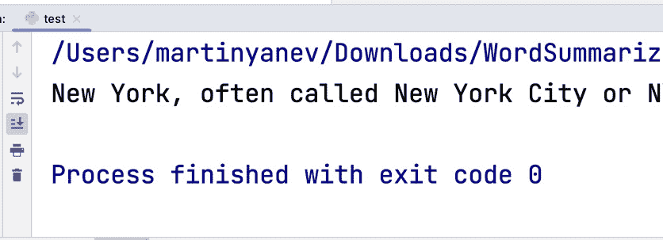
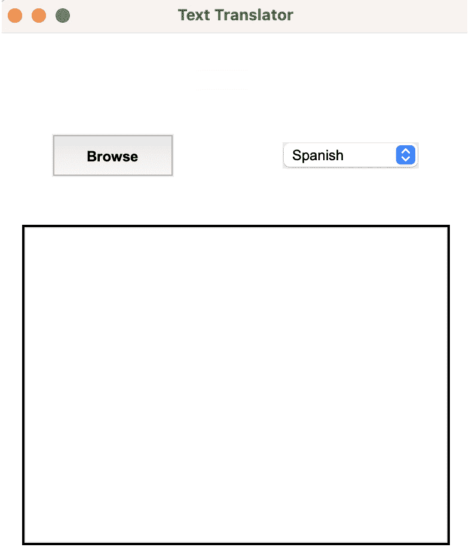
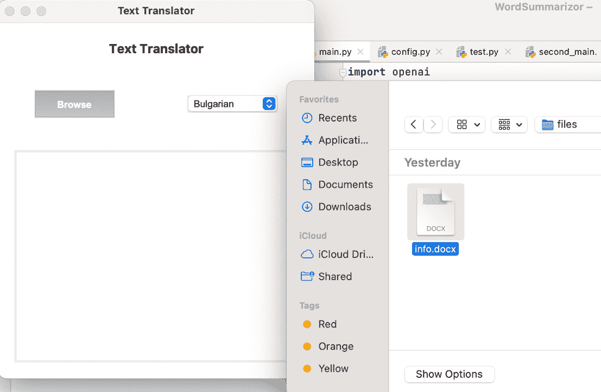
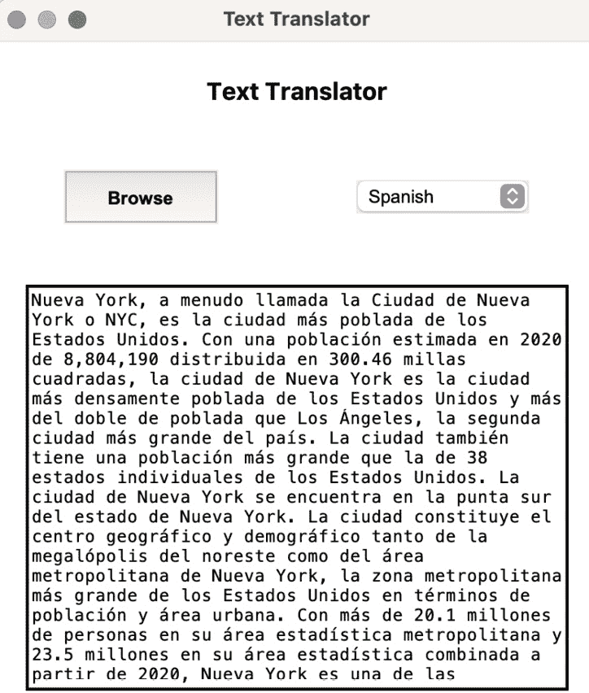

# <st c="0">6</st>

# <st c="2">使用 ChatGPT API 和 Microsoft Word 的桌面语言翻译应用</st>

<st c="74">在当今全球化的世界中，语言翻译已成为企业和个人有效跨越国界沟通的必要工具。</st> <st c="228">幸运的是，随着</st> **<st c="265">自然语言处理</st>** <st c="292">(</st>**<st c="294">NLP</st>**<st c="297">)和机器学习技术的进步，语言翻译比以往任何时候都更加准确和易于访问。</st> <st c="414">在本章中，我们将探讨如何使用 OpenAI ChatGPT API 和 Microsoft Word 构建语言翻译桌面应用程序。</st>

<st c="543">在本章中，您将学习如何创建一个桌面应用程序，该程序可以使用强大的 ChatGPT API 实时翻译文本。</st> <st c="681">我们将逐步介绍将 API 与 Microsoft Word 集成的过程，使用户能够上传 Word 文档并将其翻译成多种语言。</st> <st c="846">我们还将介绍如何使用 Python tkinter 库构建简单的用户界面，使用户能够选择目标语言并查看翻译后的文本。</st> <st c="1013">掌握这些技能后，您将能够开发自己的语言翻译应用，并提高您的 NLP 和机器学习能力。</st> <st c="1128">学习</st>

<st c="1147">在本章中，我们将学习如何</st> <st c="1189">执行以下操作：</st>

+   <st c="1203">将 ChatGPT API 与</st> <st c="1237">Microsoft Office</st>集成

+   使用 Tkinter<st c="1253">构建用户界面</st> <st c="1280">的</st>

+   <st c="1292">将 Microsoft Word 文本与</st> <st c="1334">ChatGPT API</st>集成

<st c="1345">到本章结束时，您将掌握开发一个简单但功能齐全的桌面应用程序的基本知识，通过无缝集成 ChatGPT API 与 Tkinter 和 Microsoft Word。</st> <st c="1550">掌握这些技能后，您将能够利用 AI 驱动的语言翻译功能，并将其无缝集成到您选择的任何应用程序中，为您提供一种有效的工具，与来自不同语言背景的个人进行有效沟通。</st> <st c="1798">的</st>

# <st c="1821">技术要求</st>

<st c="1844">为了完成语言翻译桌面应用程序项目，以下是需要满足的</st> <st c="1927">技术要求：</st>

+   在您的机器上安装了<st c="1950">Python 3.7 或更高版本</st> <st c="1984">的</st>

+   <st c="1996">代码编辑器，例如</st> <st c="2020">VSCode（推荐）</st>

+   <st c="2040">Python</st> <st c="2050">虚拟环境</st>

+   <st c="2069">OpenAI</st> <st c="2080">API 密钥</st>

+   <st c="2087">您的设备上可用的 Microsoft Word</st>

<st c="2127">在下一节中，您将了解如何有效地使用</st> `<st c="2201">docx</st>` <st c="2205">Python 库来访问和提取 Word 文档中的信息。</st> <st c="2276">这将使您能够无缝地将数据传递到 ChatGPT API 并利用其功能进行翻译。</st>

<st c="2391">您可以通过此</st> <st c="2490">链接</st> 在 GitHub 平台上找到本章中演示的代码片段：[<st c="2496">https://github.com/PacktPublishing/Building-AI-Applications-with-ChatGPT-API</st>](https://github.com/PacktPublishing/Building-AI-Applications-with-ChatGPT-API)<st c="2572">。</st>

# <st c="2573">将 ChatGPT API 与 Microsoft Office 集成</st>

<st c="2623">在本节中，我们将探讨如何设置我们的项目和安装</st> `<st c="2699">docx</st>` <st c="2703">Python 库</st> <st c="2719">以从</st> `<st c="2760">docx</st>` <st c="2764">库是一个 Python</st> <st c="2785">包，它允许我们读取和写入 Microsoft Word (</st>`<st c="2842">.docx</st>`<st c="2847">) 文件，并提供一个方便的接口来访问存储在这些文件中的信息。</st>

<st c="2936">第一步是通过创建一个名为</st> `<st c="3012">Translation App</st>` <st c="3027">的新目录并使用 VSCode 加载它来启动您的作品。</st> <st c="3056">这将使您拥有一个专门区域来构建和系统化您的翻译应用代码。</st> <st c="3154">按照</st> *<st c="3245">第一章</st>*<st c="3254">中概述的步骤，从终端窗口激活您的虚拟环境，*《st c="3256">使用 ChatGPT API 开始 NLP 任务</st>*<st c="3306">。</st>

<st c="3307">要运行语言翻译桌面应用，您需要安装以下库：</st>

+   `<st c="3402">openai</st>`<st c="3409">：该</st> `<st c="3416">openai</st>` <st c="3422">库允许您与 OpenAI API 交互并执行各种</st> <st c="3494">NLP 任务</st>

+   `<st c="3503">docx</st>`<st c="3508">：该</st> `<st c="3515">docx</st>` <st c="3519">库允许您使用 Python 读取和写入 Microsoft Word</st> `<st c="3572">.docx</st>` <st c="3577">文件</st> <st c="3584">。

+   `<st c="3596">tkinter</st>`<st c="3604">：该</st> `<st c="3611">tkinter</st>` <st c="3618">库是一个内置的 Python 库，允许您为您的</st> **<st c="3682">图形用户界面</st>** <st c="3707">(</st>**<st c="3709">GUIs</st>**<st c="3713">) 创建</st> <st c="3720">桌面应用</st>

由于`tkinter`是一个内置库，因此无需安装，因为它已经存在于您的 Python 环境中。要安装`openai`和`docx`库，请访问 VSCode 终端，然后执行以下命令：

```py
 pip install openai
pip install python-docx
```

要访问和读取 Word 文档的内容，您需要在项目中创建一个示例 Word 文件。以下是创建新 Word 文件的步骤：

1.  在您的项目中，右键单击项目目录，选择`files`。

1.  右键单击`files`文件夹并选择**New File**。

1.  在出现的编辑字段中，输入一个带有`.docx`扩展名的文件名——例如，`info.docx`。

1.  按下*Enter*键来创建文件。

1.  文件创建后，使用 Microsoft Word 打开它。

您现在可以向该文件添加一些文本或内容，稍后我们将使用 Python 中的`docx`库来访问和读取这些内容。例如，我们创建了一篇关于纽约市的文章。您可以在以下链接中找到完整的文章：[纽约市](https://en.wikipedia.org/wiki/New_York_City)。然而，您可以选择任何包含您想要分析的文本的 Word 文档：

*`<st c="4874">The United States’ most populous city, often referred to as New York City or NYC, is New York.</st>` `<st c="4970">In 2020, its population reached 8,804,190 people across 300.46 square miles, making it the most densely populated major city in the country and over two times more populous than the nation’s second-largest city, Los Angeles.</st>` `<st c="5195">The city’s population also exceeds that of 38 individual U.S.</st>` `<st c="5257">states.</st>` `<st c="5265">Situated at the southern end of New York State, New York City serves as the Northeast megalopolis and New York metropolitan area’s geographic and demographic center - the largest metropolitan area in the country by both urban area and population.</st>` `<st c="5512">Over 58 million people also live within 250 miles of the city.</st>` `<st c="5575">A significant influencer on commerce, health care and life sciences, research, technology, education, politics, tourism, dining, art, fashion, and sports, New York City is a global cultural, financial, entertainment, and media hub.</st>` `<st c="5807">It houses the headquarters of the United Nations, making it a significant center for international diplomacy, and is often referred to as the</st>`* *`<st c="5949">world’s capital.</st>`*

`<st c="5965">Now that you have created the Word file inside your project, you can move on to the next step, which is to create a new Python file called</st>` `<st c="6105">app.py</st>` <st c="6111">inside the</st>` `<st c="6123">Translation App</st>` <st c="6138">root directory.</st>` `<st c="6155">This file will contain the code to read and manipulate the contents of the Word file using the</st>` `<st c="6250">docx</st>` <st c="6254">library.</st>` `<st c="6264">With the Word file and the Python file in place, you are ready to start writing the code to extract data from the document and use it in</st>` `<st c="6401">your application.</st>`

`<st c="6418">To test whether</st>` `<st c="6435">we can read Word files with</st>` `<st c="6463">the</st>` `<st c="6467">docx-python</st>` `<st c="6478">library, we can implement the following code in our</st>` `<st c="6531">app.py</st>` `<st c="6537">file:</st>`

```py
 import docx
doc = docx.Document("<full_path_to_docx_file>")
text = ""
for para in doc.paragraphs:
    text += para.text
print(text)
```

请确保将 `<st c="6671">Make sure to replace</st>` `<st c="6693"><full_path_to_docx_file></st>` <st c="6717">with the actual path to your Word document file.</st>` <st c="6767">Obtaining the file path is a simple task, achieved by right-clicking on your</st>` `<st c="6844">.docx</st>` <st c="6849">file in VSCode and selecting the</st>` **<st c="6883">Copy Relative Path</st>` <st c="6901">option from the</st>` `<st c="6918">drop-down menu.</st>`

<st c="6933">完成选择后，运行</st> `<st c="6967">app.py</st>` <st c="6973">文件并验证输出。</st> <st c="7002">此代码将读取您的 Word 文档内容并将其打印到控制台。</st> <st c="7088">如果文本提取正确工作，您应该在控制台中看到文档的文本（见</st> *<st c="7197">图 6</st>**<st c="7205">.1</st>*<st c="7207">)。</st> <st c="7211">现在</st> `<st c="7215">text</st>` <st c="7219">变量包含</st> `<st c="7253">info.docx</st>` <st c="7262">作为</st> <st c="7268">Python 字符串。</st>



<st c="7416">图 6.1 – Word 文本提取控制台输出</st>

<st c="7464">本节</st> <st c="7478">提供了一个逐步指南，说明如何设置项目和安装用于从 Word 文档中提取文本的</st> `<st c="7551">docx</st>` <st c="7555">Python 库。</st> <st c="7608">本节还包括有关如何创建新的 Word 文件以及如何使用</st> `<st c="7692">docx</st>` <st c="7696">库通过 Python 读取和操作其内容的说明。</st> <st c="7742">使用 Python。</st>

<st c="7755">在下一节中，我们将深入探讨构建 Tkinter 应用程序框架的过程。</st> <st c="7846">您将学习如何创建一个带有小部件的基本窗口，以及如何使用几何管理器将它们定位在</st> <st c="7956">屏幕上。</st>

# <st c="7967">使用 Tkinter 构建用户界面</st>

<st c="8006">在本节中，我们将学习如何使用</st> `<st c="8053">Tkinter</st>` <st c="8060">库为我们文本翻译应用程序创建一个 GUI。</st> <st c="8110">Tkinter 是 Python 的标准库，用于创建 GUI，它提供了一个简单高效的方式来创建窗口、按钮、文本字段和其他</st> <st c="8270">图形元素。</st>

<st c="8289">如图</st> *<st c="8331">图 6</st>**<st c="8339">.2</st>* <st c="8341">所示的文本翻译应用程序将被设计成一个简单且用户友好的界面。</st> <st c="8405">当您运行应用程序时，将有一个标签为</st> **<st c="8466">浏览</st>** <st c="8472">的按钮和一个包含要翻译成语言的列表的下拉菜单：</st>

1.  <st c="8535">要将文本翻译，用户可以从</st> <st c="8627">下拉菜单中选择他们想要翻译成的语言。</st>

1.  <st c="8642">一旦选择了语言，用户可以点击</st> **<st c="8700">浏览</st>** <st c="8706">按钮并选择他们想要翻译的 Word 文件。</st>

1.  <st c="8762">选择后，文件内容将使用 ChatGPT API 进行翻译，翻译后的文本将显示在窗口中央的大文本框中。</st> <st c="8941">然后，用户可以复制并粘贴翻译后的文本，按需使用。</st>

<st c="9014">文本翻译应用被设计成一个简单高效的工具，用于将一种语言中的文本翻译成另一种语言。</st>



<st c="9177">图 6.2 – 文本翻译应用 UI</st>

<st c="9224">重要提示</st>

<st c="9239">我们不需要指定要翻译的文本，因为 ChatGPT 语言模型被设计成能够自动识别</st> <st c="9381">提示语言。</st>

<st c="9397">现在我们已经明确了基本设计，我们可以用 Tkinter 将其实现。</st>

<st c="9480">为了开始，我们需要从我们的</st> `<st c="9567">app.py</st>` <st c="9573">文件中删除之前添加的示例代码。</st> <st c="9580">只需删除包含示例代码的所有代码行，这样我们就可以从一个干净的状态开始。</st>

<st c="9684">创建 Tkinter</st> <st c="9704">窗口是构建我们的文本翻译应用的下一步。</st> <st c="9773">您可以通过在</st> `<st c="9827">app.py</st>`<st c="9833">中编写以下代码来实现这一点，该代码初始化了 Tkinter 类的新实例并设置了</st> <st c="9875">应用程序窗口：</st>

```py
 from openai import OpenAI
import docx
import tkinter as tk
from tkinter import filedialog
root = tk.Tk()
root.title("Text Translator")
root.configure(bg="white")
header_font = ("Open Sans", 16, "bold")
header = tk.Label(root,
                  text="Text Translator",
                  bg="white",
                  font=header_font,
                  )
header.grid(row=0, column=0, columnspan=2, pady=20)
root.mainloop()
```

<st c="10266">要开始构建 Tkinter 应用，我们首先需要导入必要的库。</st> <st c="10351">我们将使用</st> `<st c="10367">openai</st>`<st c="10373">,</st> `<st c="10375">docx</st>`<st c="10379">, 和</st> `<st c="10385">tkinter</st>` <st c="10392">库来完成这个项目。</st>

<st c="10420">接下来，我们需要创建我们应用程序的主窗口。</st> <st c="10481">我们将使用</st> `<st c="10507">Tk()</st>` <st c="10511">方法来创建主窗口，这是</st> `<st c="10526">tkinter</st>` <st c="10533">库的一部分。</st> <st c="10543">我们还将为我们的应用程序设置一个标题并将其背景颜色设置为白色。</st>

<st c="10623">我们还可以使用</st> <st c="10631">`<st c="10679">Label()</st>` <st c="10686">`方法来为我们的应用程序设置标题，该方法属于</st> `<st c="10697">tkinter</st>`<st c="10704">。`我们可以将其文本设置为`<st c="10729">文本翻译器</st>`<st c="10744">，背景颜色设置为`<st c="10770">白色</st>`<st c="10775">，字体设置为`<st c="10793">Open Sans</st>`<st c="10802">，大小为`<st c="10819">16</st>` <st c="10821">，并且为`<st c="10828">粗体</st>` <st c="10832">字体。</st> `<st c="10841">然后我们将使用`<st c="10862">grid()</st>` <st c="10868">方法通过指定`<st c="10963">行</st>` <st c="10966">和`<st c="10971">列</st>` <st c="10977">值将标题放置在我们的应用程序窗口的特定位置，跨越两列，并具有`<st c="11018">小的填充。</st>

<st c="11032">我们将使用</st> `<st c="11071">mainloop()</st>` <st c="11081">方法来运行我们的应用程序，该方法属于</st> `<st c="11092">tkinter</st>`<st c="11099">。`<st c="11105">mainloop()</st>` <st c="11115">方法是一个无限循环，用于运行应用程序，监听事件，如按钮点击或窗口大小调整，并在需要时更新显示。`<st c="11266">它将持续监听事件，直到用户关闭窗口或退出</st> <st c="11343">应用程序。</st>

<st c="11359">在创建应用程序窗口之后，下一步是向其中添加元素。</st> <st c="11431">这些元素之一将是</st> **<st c="11465">浏览</st>** <st c="11471">按钮：</st>

```py
 browse_button = tk.Button(root, text="Browse",
                          bg="#4267B2", fg="black", relief="flat",
                          borderwidth=0, activebackground="#4267B2",
                          activeforeground="white")
browse_button.config(font=("Arial", 12, "bold"), width=10, height=2)
browse_button.grid(row=1, column=0, padx=20, pady=20)
```

<st c="11759">重要提示</st>

<st c="11774">在调用`<st c="11829">mainloop()</st>` <st c="11839">方法之前添加所有元素是很重要的，以确保它们被正确地包含在应用程序窗口中。</st> `<st c="11905">mainloop()</st>` <st c="11915">应该始终是您的`<st c="11955">app.py</st>` <st c="11961">文件中的最后一行。</st>

<st c="11967">要创建一个按钮小部件，您可以在</st> `<st c="12011">tk.Button()</st>` <st c="12022">方法中，该方法属于</st> `<st c="12037">tkinter</st>` <st c="12044">库。</st> `<st c="12054">按钮放置在根窗口中，其`<st c="12139">bg</st>` <st c="12141">参数将按钮的背景颜色设置为深蓝色，而`<st c="12214">fg</st>` <st c="12216">设置前景颜色为`<st c="12246">黑色</st>`<st c="12251">。</st>

<st c="12252">同时，</st> `<st c="12264">relief</st>` <st c="12270">被设置为</st> `<st c="12281">flat</st>` <st c="12285">以创建平面外观，并且</st> `<st c="12319">borderwidth</st>` <st c="12330">被设置为</st> `<st c="12341">0</st>` <st c="12342">以移除按钮的边框。</st> `<st c="12379">然后，我们使用</st> `<st c="12395">activebackground</st>` <st c="12411">和</st> `<st c="12416">activeforeground</st>` <st c="12432">参数来设置按钮在被点击或</st> `<st c="12498">悬停</st>` <st c="12432">时的颜色。</st>

<st c="12511">在</st> **<st c="12522">浏览</st>** <st c="12528">按钮下方，我们可以创建一个包含语言列表的下拉菜单：</st>

```py
 languages = ["Bulgarian", "Hindi", "Spanish", "French"]
language_var = tk.StringVar(root)
language_var.set(languages[0])
language_menu = tk.OptionMenu(root, language_var, *languages)
language_menu.config(font=("Arial", 12), width=10)
language_menu.grid(row=1, column=1, padx=20, pady=20)
```

<st c="12881">语言列表包含用户可以选择的语言列表。</st> <st c="12961">您可以将任何语言添加到该列表中，并且它将在</st> <st c="13045">下拉菜单中显示给用户。</st>

<st c="13060">`<st c="13065">language_var</st>` <st c="13077">变量被创建为一个</st> `<st c="13103">StringVar</st>` <st c="13112">对象，并将其设置为列表中的第一种语言。</st> `<st c="13163">language_var</st>` <st c="13167">对象的</st> `<st c="13172">set()</st>` <st c="13172">方法随后被用来将其初始值设置为语言列表的第一个元素。</st> <st c="13289">这样做是为了使语言下拉菜单的默认值为列表中的第一种语言，在本例中是</st> `<st c="13403">Bulgarian</st>` <st c="13412">。</st>

<st c="13426">然后，使用</st> `<st c="13431">OptionMenu</st>` <st c="13441">小部件和</st> `<st c="13474">language_var</st>` <st c="13486">变量以及</st> `<st c="13504">*languages</st>` <st c="13514">语法创建小部件，该语法将</st> `<st c="13541">languages</st>` <st c="13550">列表解包为单独的参数。</st> <st c="13581">这将为下拉菜单设置可用选项为语言列表中的语言。</st> <st c="13631">然后，我们在</st> <st c="13676">应用程序窗口的第一行的第二列中配置和定位一个选项菜单小部件。</st>

<st c="13795">下一步是将文本字段添加到我们的 GUI 中。</st> `<st c="13847">为此，您可以在</st> `<st c="13922">app.py</st>` <st c="13928">文件下方添加以下代码。</st> `<st c="13935">此代码创建了一个具有特定尺寸、颜色和属性的文本字段，然后使用</st> `<st c="14059">grid positioning</st>` <st c="14059">将其放置在窗口中：</st>

```py
 text_field = tk.Text(root, height=20, width=50, bg="white", fg="black",
                     relief="flat", borderwidth=0, wrap="word")
text_field.grid(row=2, column=0, columnspan=2, padx=20, pady=20)
text_field.grid_rowconfigure(0, weight=1)
text_field.grid_columnconfigure(0, weight=1)
root.grid_rowconfigure(2, weight=1)
root.grid_columnconfigure(0, weight=1)
root.grid_columnconfigure(1, weight=1)
```

<st c="14457">此代码将在 GUI 窗口中添加一个文本字段，该字段将用于显示 Word 文档的 ChatGPT 翻译。</st> <st c="14585">在此，</st> `<st c="14595">Text</st>` <st c="14599">小部件对象名为</st> `<st c="14620">text_field</st>` <st c="14630">，放置在根窗口内部。</st> <st c="14665">此</st> `<st c="14669">Text</st>` <st c="14673">小部件用于显示和编辑多行文本。</st> <st c="14733">然后，我们使用</st> `<st c="14750">grid()</st>` <st c="14756">方法将</st> `<st c="14780">Text</st>` <st c="14784">小部件定位在 GUI 上。</st> <st c="14804">此</st> `<st c="14808">padx</st>` <st c="14812">和</st> `<st c="14817">pady</st>` <st c="14821">参数在窗口中为小部件添加填充，以在它与其他小部件之间创建一些空间。</st>

<st c="14927">您可以通过使用</st> `<st c="14946">text_field</st>` <st c="14956">的配置来使主窗口在水平和垂直方向上扩展，使用</st> `<st c="15022">grid_rowconfigure()</st>` <st c="15041">和</st> `<st c="15046">grid_columnconfigure()</st>` <st c="15068">方法。</st> <st c="15078">这允许文本字段填充窗口中的可用空间。</st> <st c="15151">然后，您还可以配置主窗口，</st> `<st c="15197">root</st>`<st c="15201">，以扩展它。</st> <st c="15217">这些设置确保文本字段保持在窗口中心，并填充可用空间。</st>

<st c="15323">一旦您的</st> <st c="15334">GUI 完成，您就可以启动应用程序，并确认您的 GUI 与</st> *<st c="15465">图 6</st>**<st c="15473">.2</st>*<st c="15475">中显示的样式和属性完全一致。</st> 通过单击**<st c="15494">语言</st>** <st c="15503">菜单，您可以访问并选择任何语言</st> <st c="15569">。</st>

<st c="15577">这就是如何使用 Tkinter 库创建文本翻译应用的 GUI。</st> <st c="15674">我们已经创建了主窗口、标题、</st> **<st c="15723">浏览</st>** <st c="15729">按钮，以及包含语言列表的下拉菜单。</st>

<st c="15786">尽管您已经完成了 GUI，但单击</st> **<st c="15838">浏览</st>** <st c="15844">按钮不会触发任何操作，因为它尚未连接到任何活动的 Python 函数。</st> <st c="15959">我们将在下一节中修复这个问题，我们将创建两个核心函数，分别负责打开 Microsoft Word 文件和执行</st> <st c="16109">翻译。</st>

# <st c="16125">将 Microsoft Word 文本与 ChatGPT API 集成</st>

在本节中，我们将逐步指导你如何使用 Python 创建两个核心函数，这些函数对于构建文本翻译应用程序至关重要。</st> <st c="16359">第一个函数，`<st c="16379">translate_text()</st>`<st c="16395">，使用 `<st c="16545">browse_file()</st>`<st c="16558">，允许用户从他们的本地系统中浏览并选择一个 Word 文件，并触发文本翻译过程。</st> <st c="16672">这两个函数将通过代码示例进行详细解释，以帮助你理解和在自己的项目中实现它们。</st>

## `<st c="16797">使用 gpt-3.5-turbo 翻译 Word 文本</st>`

在本节中，你将学习如何构建 `<st c="16888">translate_text()</st>` <st c="16904">函数。</st> <st c="16915">此函数负责将 Microsoft Word 文件的文本翻译成用户通过 GUI 选择的语言。</st> <st c="16974">我们将使用 OpenAI API，特别是 gpt-3.5-turbomodel，来翻译 <st c="17126">文本。</st>

<st c="17135">在构建 `<st c="17156">translate_text()</st>` <st c="17172">函数之前，你需要在你的项目根目录下创建一个名为 `<st c="17221">config.py</st>` <st c="17230">的文件。</st> <st c="17263">此文件将包含你的 OpenAI API 令牌，这是使用 OpenAI API 所必需的。</st> <st c="17350">API 令牌应分配给名为 `<st c="17404">API_KEY</st>` <st c="17411">的变量，在 `<st c="17419">config.py</st>` <st c="17428">文件中：</st>

`<st c="17434">config.py</st>`

```py
 API_KEY = "<YOUR_CHATGPT_API_KEY>"
```

`<st c="17479">app.py</st>`

```py
 import openai
import docx
import tkinter as tk
from tkinter import filedialog <st c="17565">import config</st>
<st c="17578">client = OpenAI(</st>
 <st c="17595">api_key=config.API_KEY,</st>
<st c="17619">)</st>
```

<st c="17621">此步骤是必要的，以保持 API 令牌的安全，并防止其意外上传到 <st c="17726">公共仓库。</st>

在设置好 API 密钥后，你现在可以继续在 `<st c="17838">app.py</st>`<st c="17844">中实现 `<st c="17809">translate_text()</st>` <st c="17825">函数，如下面的 <st c="17879">代码片段</st> <st c="17879">所示：</st>

```py
 def translate_text(file_location, target_language):
    doc = docx.Document(file_location)
    text = ""
    for para in doc.paragraphs:
        text += para.text
    model_engine = "gpt-3.5-turbo"
    response = client.chat.completions.create(        model=model_engine,
        messages=[
            {"role": "user", "content": "You are a professional language translator. "
                                        "Below I will ask you to translate text. "
                                        "I expect from you to give me the correct translation"
                                        "Can you help me with that?"},
            {"role": "assistant", "content": "Yes I can help you with that."},
            {"role": "user", "content": f"Translate the following text in {target_language} : {text}"}
        ]
    )
    translated_text = response.choices[0].message.content
    return translated_text
```

`<st c="18583">The</st>` `<st c="18588">translate_text()</st>` `<st c="18604">函数接受两个参数 –</st>` `<st c="18637">file_location</st>` `<st c="18650">，这是要翻译的 Microsoft Word 文件的位置，以及</st>` `<st c="18723">target_language</st>` `<st c="18738">，这是要将文本翻译成的语言。</st>` `<st c="18790">函数的第一行使用</st>` `<st c="18830">docx</st>` `<st c="18834">模块打开位于</st>` `<st c="18876">at</st>` `<st c="18879">file_location</st>` `<st c="18892">的 Word 文档。</st>` `<st c="18895">接下来的几行代码创建一个空字符串 text，然后遍历文档中的每个段落，将每个段落的文本连接到文本字符串中。</st>` `<st c="19066">换句话说，我们可以从 Word 文档中提取所有文本并存储在一个</st>` `<st c="19151">单独的字符串中。</st>`

`<st c="19165">然后，使用 GPT-3.5 API 模型来翻译文本。</st>` `<st c="19225">将</st>` `<st c="19229">model_engine</st>` `<st c="19241">变量设置为 GPT-3.5 模型。</st>` `<st c="19280">创建一个</st>` `<st c="19282">response</st>` `<st c="19290">变量，通过调用</st>` `<st c="19326">client.chat.completions.create()</st>` `<st c="19358">方法，向 API 发送提示信息，请求将给定的文本翻译成</st>` `<st c="19467">指定的</st>` `<st c="19477">target_language</st>` `<st c="19492">。</st>`

`<st c="19493">` `<st c="19498">messages</st>` `<st c="19506">参数是一个字典列表，代表用户和语言翻译器之间的对话。</st>`

`<st c="19619">` `<st c="19624">messages</st>` `<st c="19632">变量用于将对话历史传递给语言模型进行翻译。</st>` `<st c="19718">对话</st>` `<st c="19735">由用户和助手使用</st>` `<st c="19808">ChatGPT API</st>` `<st c="19812">交换的消息组成。</st>`

`<st c="19820">让我们分解一下</st>` `<st c="19856">messages</st>` `<st c="19864">变量的设计：</st>`

1.  `<st c="19874">该变量是一个字典列表，其中每个字典代表一个包含两个</st>` `<st c="19967">键值对的消息：</st>`

    +   `<st c="19983">role</st>` `<st c="19988">：这代表对话中参与者的角色。</st>` `<st c="20056">它可以是</st>` `<st c="20073">user</st>` `<st c="20077">或</st>` `<st c="20081">assistant</st>` `<st c="20090">。</st>`

    +   `<st c="20091">content</st>` `<st c="20099">：这代表消息的实际内容。</st>`

1.  `<st c="20152">对话遵循一个模式，前两条消息建立上下文，最后一条消息提供要</st>` `<st c="20285">翻译的文本：</st>`

    +   `<st c="20299">第一条消息来自用户的角色，解释了交互的</st>` `<st c="20370">上下文</st>`

    +   <st c="20385">第二条消息来自助手的角色，并确认其帮助</st>

    +   <st c="20466">第三条消息来自用户的角色，包含要翻译的文本，包括</st> <st c="20563">目标语言</st>

<st c="20578">对话格式旨在为语言模型提供关于其需要执行的任务的上下文，使明确用户</st> <st c="20680">希望助手将给定的文本翻译成指定的</st> <st c="20786">目标语言。</st>

<st c="20802">The</st> `<st c="20807">role</st>` <st c="20811">键指定消息是否来自用户或助手，而</st> `<st c="20889">content</st>` <st c="20896">键包含实际的消息文本。</st> <st c="20935">最终的翻译文本是从</st> `<st c="20982">response</st>` <st c="20990">对象中获取并由函数返回的。</st>

<st c="21027">在将包含要翻译的文本和目标语言的文本发送到 GPT-3.5 API 模型后，响应将是一个包含模型生成的响应各种信息的 JSON 对象。</st> <st c="21244">对于此模型，实际的翻译存储在响应的</st> `<st c="21300">content</st>` <st c="21307">字段中，该字段位于</st> `<st c="21341">choices</st>` <st c="21348">列表的第一个选择中。</st> <st c="21371">因此，代码通过访问第一个选择的</st> `<st c="21437">content</st>` <st c="21444">字段来提取翻译文本，并将其分配给</st> `<st c="21493">translated_text</st>` <st c="21508">变量，然后该函数返回。</st>

<st c="21558">一旦我们将翻译文本处理成 Python 字符串，我们就可以将其显示给用户。</st> <st c="21655">除此之外，我们还需要实现一个函数，使用</st> `<st c="21805">browse_file()</st>` <st c="21818">函数</st> <st c="21805">建立我们的 Word 文件的路径：</st>

```py
 def browse_file():
    file_location = filedialog.askopenfilename(initialdir="/",
                                               title="Select file",
                                               filetypes=(("Word files", "*.docx"), ("all files", "*.*")))
    if file_location:
        # Get the selected language from the dropdown menu
        target_language = language_var.get()
        translated_text = translate_text(file_location, target_language)
        text_field.delete("1.0", tk.END)
        text_field.insert(tk.END, translated_text)
```

<st c="22234">The</st> `<st c="22239">browse_file()</st>` <st c="22252">函数创建一个文件对话框窗口，允许用户选择要翻译的 Word 文件。</st> <st c="22334">如果用户选择了一个文件，该函数会从下拉菜单中检索所选语言，然后调用</st> `<st c="22470">translate_text()</st>` <st c="22486">函数，并将文件位置和目标语言作为参数。</st> <st c="22554">一旦文本被翻译，该函数会清除文本字段，并将翻译后的文本</st> <st c="22656">插入其中。</st>

<st c="22664">该函数打开一个文件对话框，让用户选择要翻译的 Word 文件。</st> <st c="22754">其中，</st> `<st c="22758">initialdir</st>` <st c="22768">参数设置文件对话框打开时显示的初始目录，而</st> `<st c="22858">title</st>` <st c="22863">参数设置文件对话框窗口的标题。</st> <st c="22916">`<st c="22920">filetypes</st>` <st c="22929">参数指定用户可以在文件对话框中选择的文件类型。</st> <st c="23010">在这种情况下，用户可以选择具有</st> `<st c="23057">.docx</st>` <st c="23062">扩展名的文件。</st> <st c="23074">所选文件的路径存储在</st> `<st c="23121">file_location</st>` <st c="23134">变量中。</st>

<st c="23144">然后，我们检查是否已选择了一个文件；如果是的话，我们可以使用</st> `<st c="23276">language_var.get()</st>` <st c="23294">函数从下拉菜单中检索所选语言。</st> <st c="23305">接着调用</st> `<st c="23309">translate_text()</st>` <st c="23325">函数，并将所选文件位置和目标语言作为参数传递，以将文件中的文本翻译为目标语言。</st> <st c="23452"></st>

<st c="23468">文本翻译完成后，我们可以删除文本字段中可能存在的任何文本，并将翻译后的文本插入到文本字段中。</st> <st c="23604">文本字段是我们应用程序中显示翻译文本的 GUI 小部件。</st>

<st c="23682">最后，你可以向</st> `<st c="23725">browse_button</st>`<st c="23738">添加另一个参数，确保在</st> `<st c="23758">browse_file()</st>` <st c="23771">函数被激活时，只需点击</st> `<st c="23817">按钮：</st>

```py
 browse_button = tk.Button(root, text="Browse",
                          bg="#4267B2", fg="black", relief="flat",
                          borderwidth=0, activebackground="#4267B2",
                          activeforeground="white", <st c="24011">command=browse_file</st> parameter associates the <st c="24056">browse_file()</st> function with the <st c="24088">tk.Button</st> widget. When the button is clicked, the <st c="24138">browse_file()</st> function will be executed.
			<st c="24178">You can now run your application to start it and display its GUI window.</st> <st c="24252">From there, you can select the target language from the drop-down menu and click on the</st> **<st c="24340">Browse</st>** <st c="24346">button to select a Word file (see</st> *<st c="24381">Figure 6</st>**<st c="24389">.3</st>*<st c="24391">).</st>
			

			<st c="24709">Figure 6.3 – Browsing a Word file with the Text Translator app</st>
			<st c="24771">Once the file is</st> <st c="24789">selected, the ChatGPT API will</st> <st c="24820">process your request, and the translated text will be displayed in the text field below the buttons, as shown in</st> *<st c="24933">Figure 6</st>**<st c="24941">.4</st>*<st c="24943">.</st>
			

			<st c="25939">Figure 6.4 – Text translated using the Text Translator app</st>
			<st c="25997">In this section, you learned</st> <st c="26027">how to build</st> <st c="26040">the</st> `<st c="26044">translate_text()</st>` <st c="26060">function in Python using OpenAI’s GPT-3.5 Turbo model, translating text in a Microsoft Word file into a language selected by the user through a GUI.</st> <st c="26210">We also discussed how to build the</st> `<st c="26245">browse_file()</st>` <st c="26258">function to get the path to the Word file using the</st> **<st c="26311">Browse</st>** <st c="26317">button, displaying the translated text to</st> <st c="26360">the user.</st>
			<st c="26369">Summary</st>
			<st c="26377">In this chapter, you learned how to develop a text translation application that can translate text from a Microsoft Word file into a target language selected by the user.</st> <st c="26549">The chapter covered the integration of Microsoft Word with the ChatGPT API</st> <st c="26624">using Python.</st>
			<st c="26637">We learned how to use Tkinter to create a user interface for the text translation application.</st> <st c="26733">The user interface comprised a simple and user-friendly design that included a drop-down menu, with a list of languages to translate to, and a</st> **<st c="26876">Browse</st>** <st c="26882">button that allowed users to select a Word file.</st> <st c="26932">Once the user selected a file, the contents of the file were translated using the ChatGPT API, and the translated text was displayed in the large text field in the center of</st> <st c="27106">the window.</st>
			<st c="27117">We also saw how to set up a</st> `<st c="27146">docx</st>` <st c="27150">Python library to extract text from Word documents.</st> <st c="27203">The</st> `<st c="27207">docx</st>` <st c="27211">library provided an interface to access information stored in</st> <st c="27274">Word files.</st>
			<st c="27285">In the next chapter,</st> *<st c="27307">Chapter 7</st>*<st c="27316">,</st> *<st c="27318">Building an Outlook Email Reply Generator</st>*<st c="27359">, you will learn how to build an</st> **<st c="27392">Outlook</st>** <st c="27399">email reply generator application using the most advanced ChatGPT model –</st> **<st c="27474">GPT-4</st>**<st c="27479">. You will learn how to pass email data from Outlook to the ChatGPT API and use it to generate an original reply to a specific email.</st> <st c="27613">You will also learn how to automate the ChatGPT API prompt to get relevant</st> <st c="27688">email replies.</st>

```
