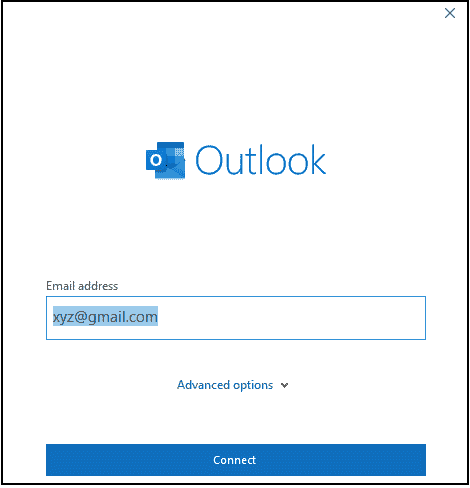
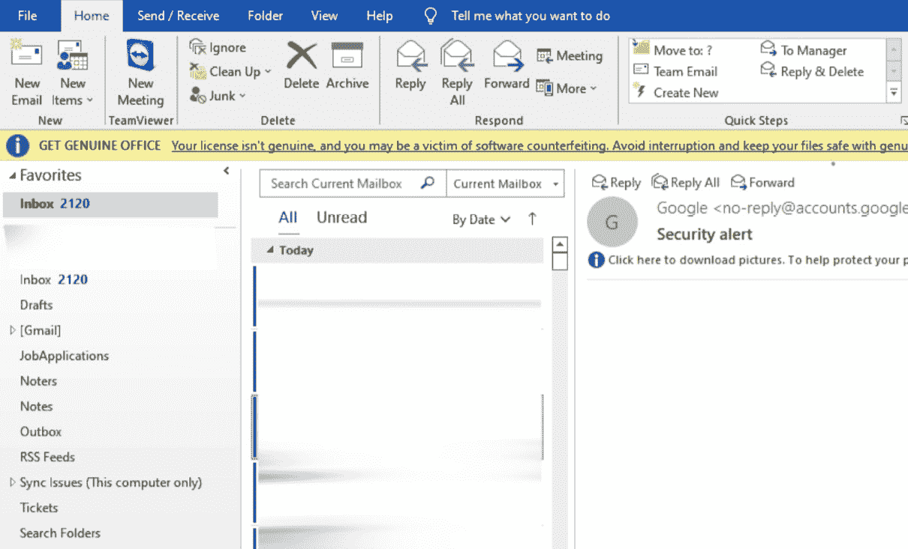
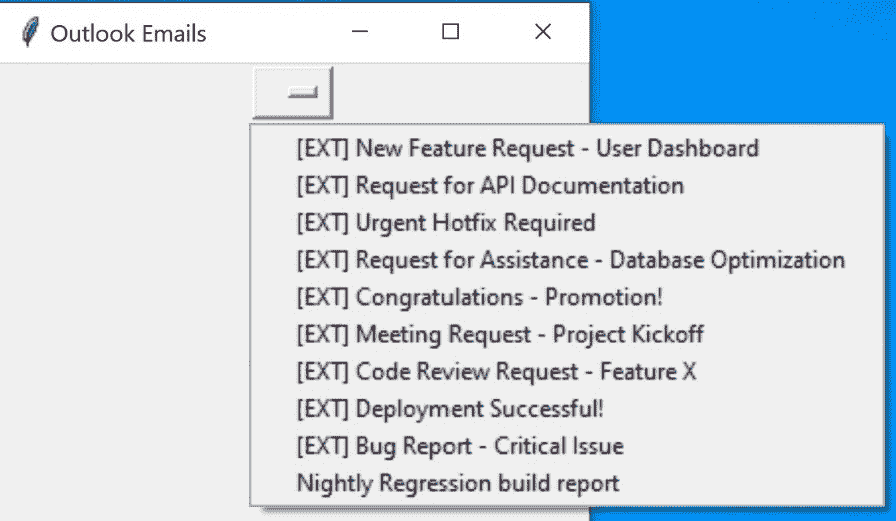
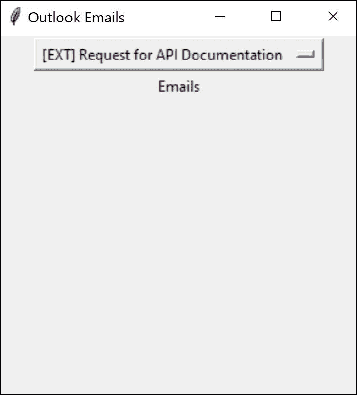
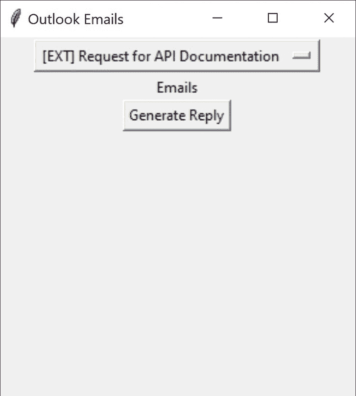
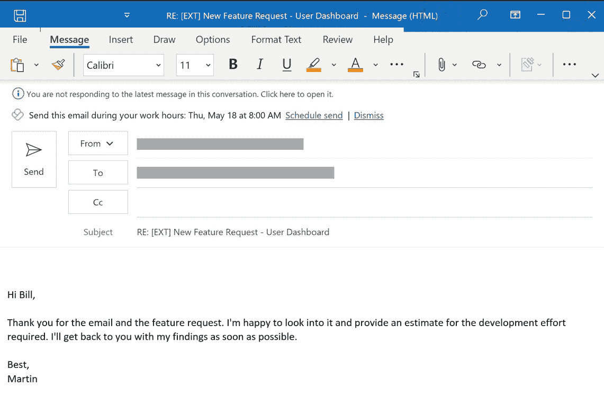

# <st c="0">7</st>

# <st c="2">构建 Outlook 电子邮件回复生成器</st>

<st c="43">电子邮件沟通是我们个人和职业生活中不可或缺的一部分。</st> <st c="125">然而，撰写完美的电子邮件回复可能是一项耗时且具有挑战性的任务。</st> <st c="216">这就是人工智能</st> **<st c="230">（AI）</st> **<st c="253">（</st>**<st c="255">AI</st>**<st c="257">）**可以派上用场的地方。</st> <st c="279">使用</st> <st c="285">ChatGPT API</st> **<st c="289">，你将学习如何生成既相关又个性化的自动电子邮件回复，这些回复与</st> <st c="404">发件人的消息</st>相关。</st>

许多公司已经开始使用人工智能来生成电子邮件回复以节省时间和提高生产力。</st> <st c="533">例如，谷歌的智能回复功能使用机器学习算法生成简短、简洁的电子邮件回复，这些回复与当前消息的内容上下文相关。</st> <st c="706">同样，我们</st> <st c="719">可以使用 OpenAI 最强大的</st> **<st c="751">自然语言处理</st>** <st c="778">(</st>**<st c="780">NLP</st>**<st c="783">) 模型，GPT-4，与 GPT-3 相比生成更复杂的回复，帮助我们开发个性化的</st> <st c="884">电子邮件回复。</st>

<st c="898">在本章中，你将学习如何</st> <st c="935">构建</st> **<st c="945">Outlook 电子邮件回复生成器</st>** <st c="974">使用 OpenAI 的 GPT-4 语言模型。</st> <st c="1012">你将能够构建一个应用程序，该应用程序可以自动生成针对特定电子邮件的原创</st> <st c="1083">回复</st> <st c="1110">集成</st> **<st c="1126">Outlook API</st>** <st c="1137">和 OpenAI 的 GPT-4。</st> <st c="1158">这将帮助你通过自动化撰写精心设计的电子邮件回复的过程来节省时间和提高你的生产力。</st> <st c="1289">你还将学习如何使用 Outlook API 将数据发送到 ChatGPT API，以及如何自动化 ChatGPT API 提示以获取相关的</st> <st c="1425">电子邮件回复。</st>

<st c="1439">对于这个项目，除了</st> `<st c="1477">tkinter</st>` <st c="1484">和</st> `<st c="1489">openai</st>` <st c="1495">库之外，我们还将使用 Python 中的</st> `<st c="1521">win32com</st>` <st c="1529">库来与</st> `<st c="1796">win32com</st>` <st c="1804">交互，我们可以轻松检索电子邮件消息的主题和正文，并将其用作 OpenAI 的 GPT-4 语言模型的输入。</st> <st c="1925">与</st> `<st c="1939">tkinter</st>` <st c="1946">和</st> `<st c="1951">openai</st>` <st c="1957">一起，</st> `<st c="1959">win32com</st>` <st c="1967">为我们提供了一套全面的工具，用于构建功能强大且用户友好的电子邮件</st> <st c="2058">回复生成器。</st>

<st c="2074">通过利用</st> `<st c="2093">win32com</st>` <st c="2101">库与 Microsoft Outlook 交互，您可以有效地使用 Outlook API 将数据发送到 ChatGPT API。</st> <st c="2219">这种集成允许创建自动电子邮件回复，可以通过设计有效的提示进行增强。</st> <st c="2342">为了简化流程，可以使用</st> `<st c="2413">tkinter</st>`<st c="2420">构建一个简单的 GUI 桌面应用程序，使电子邮件回复生成器用户友好且高效。</st>

<st c="2483">在本章中，我们将涵盖以下主题：</st>

+   <st c="2536">将 Outlook 数据传递到</st> <st c="2565">ChatGPT API</st>

+   <st c="2576">生成自动</st> <st c="2598">电子邮件回复</st>

<st c="2519">在本章结束时，您将能够使用 NLP 技术和用户友好的</st> <st c="2742">图形界面生成和发送原始电子邮件回复。</st>

# <st c="2762">技术要求</st>

<st c="2785">为了完成本章，我们假设您已在您的设备上安装了 Microsoft Office 和 Outlook。</st> <st c="2891">您可以在以下链接中学习如何安装 Microsoft Office：</st> [<st c="2943">https://learn.microsoft.com/en-us/microsoft-365/admin/setup/install-applications?view=o365-worldwide</st>](https://learn.microsoft.com/en-us/microsoft-365/admin/setup/install-applications?view=o365-worldwide)<st c="3043">。</st>

<st c="3044">然而，我们将逐步讲解 Outlook API 的完整安装过程。</st> <st c="3108">您的设备上安装了最新的 Microsoft Office 365 应用程序（Outlook）。</st>

<st c="3120">您需要以下内容：</st>

+   <st c="3152">您的计算机上安装了 Python 3.11 或更高版本</st> <st c="3187">。</st>

+   <st c="3200">一个 OpenAI</st> <st c="3211">API 密钥</st>

+   <st c="3218">一个代码编辑器，例如 VS</st> <st c="3245">Code（推荐）</st>

+   <st c="3263">一个 Windows</st> <st c="3274">操作系统</st>

+   <st c="3290">您的设备上安装的</st> <st c="3351">最新 Microsoft Office 365 应用程序（Outlook）</st>

<st c="3362">在下一节中，您将学习如何安装 Microsoft Outlook 和</st> `<st c="3440">win32com</st>` <st c="3448">库。</st> <st c="3458">您还将学习如何将电子邮件数据从 Outlook 传递到 ChatGPT API 以实现自动电子邮件回复生成。</st>

<st c="3570">*《Outlook 电子邮件回复生成器》* <st c="3588">项目的代码可以在 GitHub 上找到</st> <st c="3617">，地址为</st> [<st c="3651">https://github.com/PacktPublishing/Building-AI-Applications-with-ChatGPT-API</st>](https://github.com/PacktPublishing/Building-AI-Applications-with-ChatGPT-API)<st c="3728">。</st>

# <st c="3729">将 Outlook 数据传递到 ChatGPT API</st>

<st c="3769">要开始，我们将首先介绍设置开发环境的基本步骤</st> <st c="3865">以构建 Outlook 邮件回复生成器。</st> <st c="3913">在这里，你将开始安装 Microsoft Outlook 到你的电脑上，并</st> <st c="3987">设置一个电子邮件账户。</st> <st c="4016">一旦安装了所有库，我们将向你展示如何使用</st> `<st c="4091">win32com</st>` <st c="4099">库从 Outlook 提取电子邮件数据并将其传递给 ChatGPT API 以生成自动</st> <st c="4199">电子邮件回复。</st>

<st c="4211">让我们设置你的项目以</st> <st c="4241">构建 Outlook 邮件回复生成器。</st> <st c="4282">为此，创建一个名为</st> `<st c="4324">EmailReplyGenerator</st>` <st c="4343">的新目录，并在 VS Code 中打开它。</st> <st c="4368">一旦项目创建，你可以激活你的虚拟环境，创建一个名为</st> `<st c="4472">app.py</st>`<st c="4478">的新 Python 文件，并开始编写从 Outlook 提取电子邮件数据并将其传递给 ChatGPT API 的代码。</st>

<st c="4573">为了完成项目设置，你还需要安装两个 Python 库。</st> <st c="4657">你可以使用</st> `<st c="4699">pip</st>` <st c="4702">包管理器来安装这些库。</st> <st c="4720">要开始，打开命令提示符或你的机器上的终端，并输入以下命令来安装</st> <st c="4828">这两个库：</st>

```py
 $pip install openai
$pip install pywin32
```

<st c="4884">安装这些库后，我们现在可以继续安全地处理 ChatGPT API 密钥，这将使我们能够在连接到 AI 时进行身份验证。</st> <st c="5059">为此，让我们在我们的项目中创建一个名为</st> `<st c="5117">config.py</st>`<st c="5126">的新文件。正如前一个项目所示，此文件将安全地存储项目中使用的所有 API 密钥。</st> <st c="5239">现在，你可以在适当的文件中包含 API 令牌和必要的库。</st>

<st c="5325">使用此代码用于</st> <st c="5348">API 令牌：</st>

<st c="5358">config.py</st>

```py
 API_KEY = "<YOUR_CHATGPT_API_KEY>"
```

<st c="5403">使用此代码用于</st> <st c="5422">库：</st>

<st c="5436">app.py</st>

```py
 from openai import OpenAI
import win32com.client
import tkinter as tk
import config
client = OpenAI(
  api_key=config.API_KEY,
)
```

<st c="5570">`<st c="5575">config.py</st>` <st c="5584">文件安全地存储了 ChatGPT API 密钥，该密钥被导入到</st> `<st c="5654">app.py</st>` <st c="5660">文件中。</st> <st c="5667">然后，API 密钥通过 `<st c="5758">openai</st>` <st c="5764">库与 ChatGPT API 建立安全连接。</st> <st c="5774">此外，还导入了 `<st c="5792">win32com.client</st>` <st c="5807">和 `<st c="5812">tkinter</st>` <st c="5819">库，分别用于处理 Outlook 电子邮件数据和创建图形用户</st> <st c="5905">界面。</st>

<st c="5929">通过这些步骤，您可以确保项目得到正确设置，从而可以顺利地在您的设备上启动已安装的 Outlook 应用程序。</st> <st c="6082">设备上启动已安装的 Outlook 应用程序。</st>

## <st c="6098">设置 Outlook 应用程序</st>

<st c="6125">在本节中，我们将</st> <st c="6146">指导您完成设置 Microsoft Outlook 应用程序的过程。</st> <st c="6223">Microsoft Outlook 是由 Microsoft 开发的一款广泛使用的电子邮件客户端和个人信息管理器。</st> <st c="6328">它是 Microsoft Office 应用程序套件的一部分，其中包括 Word、Excel 和 PowerPoint 等流行的生产力工具。</st> <st c="6465">虽然 Microsoft Outlook 通常与 Microsoft 电子邮件服务相关联，但重要的是要注意，Outlook 可以与任何电子邮件账户一起使用，无论电子邮件提供商是谁。</st> <st c="6650">这意味着即使用户来自 Gmail、Yahoo 或其他任何电子邮件服务提供商，他们也可以利用 Outlook 的功能和优势。</st> <st c="6804">电子邮件服务。</st>

<st c="6818">要使用安装在您计算机上的 Outlook 打开并登录到您的电子邮件账户，请按照</st> <st c="6841">以下步骤操作：</st> <st c="6909">这些步骤：</st>

1.  **<st c="6921">启动 Microsoft Outlook</st>**<st c="6946">：在您的计算机上找到 Outlook 应用程序图标，双击它以打开</st> <st c="7032">程序。</st>

1.  **<st c="7044">设置新账户</st>**<st c="7065">：首次打开 Outlook 时，您将能够登录到您的电子邮件地址。</st> <st c="7159">只需输入您的电子邮件地址，然后点击</st> **<st c="7207">连接</st>** <st c="7214">按钮开始设置过程（见 <st c="7254">图 7</st>**<st c="7262">.1</st>**<st c="7264">）。</st>



<st c="7326">Figure 7.1 – The Outlook email setup window</st>

1.  **<st c="7369">遵循屏幕提示</st>**<st c="7397">：Outlook 将尝试根据您的电子邮件地址自动配置账户设置。</st> <st c="7498">您将看到确认消息，并且您的电子邮件账户将被添加到 Outlook。</st>

1.  **<st c="7583">访问您的电子邮件</st>**<st c="7601">：设置过程完成后，您可以在 Outlook 导航面板中访问您的电子邮件。</st> <st c="7699">您将能够在 Outlook 应用程序内查看、发送、接收和管理您的电子邮件消息，如图 <st c="7815">图 7</st>**<st c="7823">.2</st>**<st c="7825"> 所示。</st>



<st c="8445">Figure 7.2 – The Outlook desktop interface</st>

<st c="8487">到达 Outlook 应用程序界面后，您现在可以使用 Outlook API 来访问和使用 <st c="8587">win32com.client</st> <st c="8602">来管理您的</st> <st c="8618">电子邮件数据。</st>

## <st c="8629">使用 win32com 客户端访问电子邮件数据</st>

<st c="8675">在本节中，我们将指导您通过检索 Outlook 账户中最后 10 封电子邮件的主题，并在用户友好的下拉菜单中显示它们的过程。</st> <st c="8695">您将学习如何使用</st> `<st c="8883">win32com</st>` <st c="8891">库与 Outlook 交互，访问电子邮件数据，并在</st> `<st c="9027">tkinter</st>`<st c="9034">中填充下拉</st> <st c="8972">菜单。这将使用户能够方便地选择他们想要生成回复的电子邮件。</st>

<st c="9125">为了实现这一点，我们将使用</st> `<st c="9162">last_10_emails()</st>` <st c="9178">函数。</st> <st c="9189">在这个函数内部，我们将利用</st> `<st c="9231">win32com.client</st>` <st c="9246">库。</st> <st c="9256">我们将连接到 Outlook 应用程序并访问默认的电子邮件收件箱文件夹。</st> <st c="9342">从那里，我们将检索收件箱中的电子邮件消息集合：</st>

```py
 def last_10_emails():
    outlook = win32com.client.Dispatch("Outlook.Application").GetNamespace("MAPI")
    inbox = outlook.GetDefaultFolder(6)
    messages = inbox.Items
    emails = [messages.GetLast().Subject]
    email_number = 10
    for i in range(email_number):
        emails.append(messages.GetPrevious().Subject)
    return emails
```

<st c="9723">前面的代码演示了如何使用</st> `<st c="9811">win32com.client</st>` <st c="9826">模块与 Outlook 应用程序交互，访问和操作电子邮件消息，具体步骤如下：</st>

1.  <st c="9902">首先，我们将使用</st> `<st c="9926">win32com.client.Dispatch()</st>` <st c="9952">函数来创建与 Outlook 应用程序的连接。</st> <st c="10013">此函数接受一个字符串参数，</st> `<st c="10052">Outlook.Application</st>`<st c="10071">，以指定我们想要访问的应用程序。</st>

1.  <st c="10118">然后，我们将使用</st> `<st c="10141">GetNamespace()</st>` <st c="10155">方法，并使用</st> `<st c="10172">MAPI</st>` <st c="10176">参数来检索 Outlook 中的消息和协作服务命名空间。</st> <st c="10265">此命名空间提供了访问各种 Outlook 对象</st> <st c="10323">和文件夹的权限。</st>

1.  <st c="10335">通过调用</st> <st c="10339">`<st c="10347">GetDefaultFolder(6)</st>`</st> <st c="10366">，我们检索默认的电子邮件</st> `<st c="10398">收件箱</st>` <st c="10403">文件夹。</st> <st c="10412">参数</st> `<st c="10416">6</st>` <st c="10417">对应于 Outlook 命名空间中</st> `<st c="10459">收件箱</st>` <st c="10464">文件夹的索引。</st> <st c="10502">这确保了我们访问正确的文件夹。</st> <st c="10550">通过将结果分配给</st> `<st c="10581">inbox</st>` <st c="10586">变量，我们现在有了对</st> `<st c="10628">收件箱</st>` <st c="10633">文件夹的引用，这允许我们检索电子邮件消息并对它们进行操作。</st> `<st c="10717">inbox.Items</st>` <st c="10728">检索收件箱文件夹中的项目或电子邮件消息集合。</st> <st c="10806">此集合被分配给</st> `<st c="10841">messages</st>` <st c="10849">变量。</st>

1.  <st c="10859">要检索最新电子邮件的主题，</st> `<st c="10910">messages.GetLast().Subject</st>` <st c="10936">将被使用。</st> `<st c="10951">GetLast()</st>` <st c="10960">返回集合中的最后一个电子邮件项，而</st> `<st c="11014">.Subject</st>` <st c="11022">检索该电子邮件的主题。</st> `<st c="11060">我们现在可以将电子邮件主题包裹在一个列表中，以确保它是一个包含单个主题的列表。</st> `<st c="11161">我们还可以定义一个名为</st> `<st c="11198">email_number</st>`<st c="11210">的变量，它代表我们想要</st> <st c="11280">检索主题的前置电子邮件数量。</st>

<st c="11298">除了</st> `<st c="11318">GetList</st>` <st c="11325">方法之外，您还可以使用以下</st> `<st c="11387">win32com</st>` <st c="11395">方法获取特定的电子邮件项：</st>

+   `<st c="11404">FindNext</st>`<st c="11413">: 此方法用于检索与指定</st> <st c="11519">搜索条件</st> 匹配的电子邮件集合中的下一个电子邮件项

+   `<st c="11534">GetFirst</st>`<st c="11543">: 使用此方法，您可以从电子邮件集合中检索第一个电子邮件项，从而能够访问其内容</st> <st c="11663">或属性</st>

+   `<st c="11676">GetNext</st>`<st c="11684">: 与</st> `<st c="11712">GetFirst</st>`<st c="11720">结合使用，此方法检索集合中的下一个电子邮件项，便于对集合中所有电子邮件进行顺序访问</st> <st c="11837">。

+   `<st c="11851">GetPrevious</st>`<st c="11863">: 此方法补充</st> `<st c="11890">GetFirst</st>` <st c="11898">，并允许您检索电子邮件集合中当前访问项之前的电子邮件项，从而实现电子邮件的顺序向后访问</st> <st c="12053">。

<st c="12063">我们现在可以遍历前 10 个先前电子邮件的主题范围。</st> `<st c="12071">在循环中，我们使用</st> `<st c="12172">GetPrevious().Subject</st>` <st c="12193">来访问迭代中当前电子邮件之前的电子邮件的主题。</st> `<st c="12273">此方法将指针移动到集合中的上一个电子邮件，并且</st> `<st c="12348">.Subject</st>` <st c="12356">检索电子邮件的</st> `<st c="12380">主题。</st>

<st c="12390">对于每次迭代，我们使用</st> `<st c="12471">append()</st>` <st c="12479">方法将检索到的主题追加到电子邮件列表中。</st> `<st c="12488">这将从最新开始构建一个电子邮件主题列表，并按时间顺序回溯。</st>

<st c="12606">循环完成后，我们就有了一个包含 10 个电子邮件主题的列表存储在电子邮件列表中。</st> `<st c="12695">然后我们可以从</st> `<st c="12751">last_10_emails()</st>` <st c="12767">函数中返回此电子邮件主题列表，使其可用于我们的 Outlook 电子邮件</st> `<st c="12822">回复生成器。</st>`

<st c="12838">现在，我们可以专注于创建用户界面来显示电子邮件主题，并允许用户选择一个来生成</st> <st c="12963">回复：</st>

```py
 root = tk.Tk()
root.title("Outlook Emails")
root.geometry("300x300")
email_subjects = last_10_emails()
selected_subject = tk.StringVar()
dropdown = tk.OptionMenu(root, selected_subject, *email_subjects)
dropdown.pack()
label = tk.Label(root, text="")
label.pack()
root.mainloop()
```

<st c="13251">让我们分析一下前面</st> <st c="13301">代码的每个部分：</st>

1.  <st c="13311">首先，我们将使用</st> `<st c="13410">tkinter</st>` <st c="13417">库来初始化和配置应用程序的主要图形窗口。</st>

    `<st c="13426">root = tk.Tk()</st>` <st c="13441">创建了一个主窗口对象，通常被称为根或顶级窗口。</st> <st c="13541">此对象代表包含我们应用程序用户界面元素的</st> <st c="13629">主窗口。</st>

1.  <st c="13645">然后，我们可以将窗口的标题</st> <st c="13673">设置为</st> `<st c="13690">Outlook Emails</st>`<st c="13704">。这个标题将在窗口的标题栏中显示。</st> <st c="13767">我们还将设置窗口的尺寸为</st> `<st c="13816">300</st>` <st c="13819">像素宽和</st> `<st c="13836">300</st>` <st c="13839">像素高。</st> <st c="13853">这决定了窗口首次在</st> <st c="13930">屏幕上显示时的初始大小。</st>

1.  <st c="13941">在完成窗口模板后，我们可以初始化用于在用户界面中管理电子邮件主题的变量。</st> <st c="14084">这里使用的</st> `<st c="14088">last_10_emails()</st>` <st c="14104">函数用于检索电子邮件主题列表。</st> <st c="14167">该函数将 Outlook 应用程序中的最后 10 个电子邮件主题返回到</st> `<st c="14263">email_subjects</st>` <st c="14277">变量中。</st>

1.  <st c="14287">`<st c="14292">selected_subject</st>` <st c="14308">变量从</st> `<st c="14328">StringVar</st>` <st c="14337">对象创建了一个</st> `<st c="14354">tkinter</st>` <st c="14361">库。</st> <st c="14371">此对象是一种特殊的变量类型，可以与各种 GUI 小部件相关联。</st> <st c="14459">通过创建一个</st> `<st c="14473">StringVar</st>` <st c="14482">对象，我们有一个可以存储字符串值并轻松与 GUI 元素（如按钮或下拉菜单）相关联的变量。</st> <st c="14619">这使我们能够在</st> <st c="14692">我们的应用程序中跟踪和操作所选电子邮件主题。</st>

1.  <st c="14708">然后，我们在用户界面中创建一个下拉菜单来显示邮件主题列表。</st> <st c="14803">`<st c="14807">OpenMenu</st>` <st c="14815">小部件代表一个下拉菜单，用户可以从列表中选择一个选项。</st> <st c="14900">`<st c="14904">root</st>` <st c="14908">参数指定下拉菜单应放置在我们的应用程序的主窗口中，而`<st c="15022">selected_subject</st>` <st c="15038">参数指定了将与下拉菜单关联的变量。</st> <st c="15120">它表示将持有从下拉菜单中当前选中的邮件主题的变量。</st>

    <st c="15222">`<st c="15227">*email_subjects</st>`</st> <st c="15242">参数使用`<st c="15261">*</st>` <st c="15262">运算符将`<st c="15286">email_subjects</st>` <st c="15300">列表解包成单独的项目。</st> <st c="15329">这允许每个邮件主题都被视为`<st c="15405">OptionMenu</st>` <st c="15415">小部件的一个单独的参数，为下拉菜单提供选项列表。</st>

1.  <st c="15477">然后，我们可以构建一个标签小部件并启动应用程序的主事件循环。</st> <st c="15561">`<st c="15565">label</st>` <st c="15570">变量创建了一个标签小部件，用于在用户界面中显示文本或其他信息。</st> <st c="15669">`<st c="15673">text</st>` <st c="15677">参数指定了标签中要显示的初始文本，在这种情况下是一个空字符串。</st> `<st c="15783">label.pack()</st>` <st c="15795">将小部件打包到主窗口中。</st>

1.  <st c="15837">最后，`<st c="15847">root.mainloop()</st>` <st c="15862">启动主事件循环。</st> <st c="15891">此方法负责处理用户事件，如鼠标点击或按钮按下，并相应地更新 GUI。</st> <st c="16018">程序将保持在这个循环中，直到用户关闭应用程序窗口，确保应用程序保持响应性和交互性。</st>

<st c="16166">为了测试应用程序，让我们想象我们是一名软件工程师，收到了来自</st> <st c="16271">我们同事的 10 封工作邮件。</st>

<st c="16286">现在，您可以执行您当前版本的 Outlook 邮件回复生成器。</st> <st c="16367">一旦代码开始运行，将出现一个标题为</st> **<st c="16409">Outlook 邮件</st>** <st c="16423">的窗口。</st> <st c="16437">此窗口包含一个下拉菜单，列出了来自</st> *<st c="16519">Outlook</st>* <st c="16526">应用程序的最后 10 封邮件主题，如图 7*<st c="16552">.3</st>*<st c="16560">.3</st>所示。</st>



<st c="16950">图 7.3 – 电子邮件回复生成器的最后 10 封电子邮件下拉菜单</st>

<st c="17020">你现在可以从下拉菜单中选择一个电子邮件主题。</st> <st c="17082">选择后，所选电子邮件主题的文本将被存储在</st> `<st c="17159">selected_subject</st>` <st c="17175">变量中，并在下拉菜单按钮内显示（见</st> *<st c="17237">图 7</st>**<st c="17245">.4</st>*<st c="17247">）。</st>



<st c="17318">图 7.4 – 下拉菜单按钮内的所选电子邮件主题</st>

<st c="17388">这些</st> <st c="17395">是设置构建 Outlook 电子邮件回复生成器开发环境的必要步骤。</st> <st c="17501">我们通过使用`<st c="17562">win32com</st>` <st c="17570">库从 Outlook 提取电子邮件数据并将其传递给 ChatGPT API 来演示了这一过程。</st> <st c="17614">你还学习了如何使用`<st c="17678">win32com</st>` <st c="17686>`和`<st c="17691">tkinter</st>` <st c="17698">库来访问和显示电子邮件数据，以创建</st> `<st c="17719">GUI</st>`。</st>

<st c="17725">在下一节中，你将使用 ChatGPT API 生成用户选择的特定电子邮件的 AI 回复，从而完成你的 Outlook 电子邮件回复生成器。</st> <st c="17890">我们还将构建相应的按钮，让用户可以从桌面应用程序访问该功能。</st>

# <st c="18002">生成自动电子邮件回复</st>

<st c="18037">现在，让我们</st> <st c="18049">深入了解我们应用程序中自动回复 Outlook 电子邮件的关键功能实现。</st> <st c="18168">我们将逐步讲解构建应用程序最后部分的过程，该部分利用 Outlook API 检索电子邮件数据，并利用上一节获取的数据，通过 ChatGPT API 生成原创回复。</st> <st c="18415">在这里，你将学习如何无缝地将 ChatGPT API 集成到你的</st> <st c="18490">Outlook 应用程序中。</st>

<st c="18511">我们将构建</st> `<st c="18530">reply()</st>` <st c="18537">函数，该函数是生成电子邮件回复的核心组件。</st> <st c="18625">在这个函数中，你将从用户界面检索所选电子邮件主题，并使用它从 Outlook 获取相应的电子邮件内容。</st> <st c="18782">我们将演示如何利用 ChatGPT API 根据电子邮件内容生成 AI 驱动的响应。</st> <st c="18895">通过这个过程，你将获得在 ChatGPT 和 Outlook 之间传递数据的实践经验。</st>

<st c="18995">您可以在</st> <st c="19016">`reply()`</st> <st c="19023">函数上方</st> <st c="19044">`root.mainloop()`</st> <st c="19059">内部</st> <st c="19072">`app.py</st> <st c="19078">文件</st> <st c="19085">中包含该函数。</st> <st c="19085">请注意，</st> <st c="19099">`root.mainloop()`</st> <st c="19114">函数调用应该是</st> <st c="19177">`tkinter</st> <st c="19184">应用程序</st> <st c="19198">中的最后一行代码。</st> <st c="19198">这是因为</st> `<st c="19214">root.mainloop()</st> <st c="19229">启动了主事件循环，该循环负责处理用户事件并更新</st> <st c="19320">GUI：</st>

```py
 def reply():
    email = win32com.client.Dispatch("Outlook.Application").GetNamespace("MAPI").\
        GetDefaultFolder(6).Items.Item(selected_subject.get())
    response = client.chat.completions.create(
        model="gpt-4",
        max_tokens=1024,
        n=1,
        messages=[
            {"role": "user", "content": "You are a professional email writer"},
            {"role": "assistant", "content": "Ok"},
            {"role": "user", "content": f"Create a reply to this email:\n {email.Body}"}
        ]
    )
    reply = email.Reply()
    reply.Body = response.choices[0].message.content
    reply.Display()
    return
```

<st c="19849">在这里，我们可以使用</st> <st c="19858">`win32com</st> <st c="19946">库</st> <st c="19956">从 Outlook 应用程序中检索选定的电子邮件内容。</st> <st c="19956">我们将通过</st> <st c="20007">`Dispatch</st> <st c="20015">方法</st> <st c="20024">访问 Outlook 应用程序。</st> <st c="20024">从那里，我们使用</st> <st c="20052">`GetDefaultFolder(6)</st> <st c="20057">检索</st> <st c="20052">`Inbox</st> <st c="20057">电子邮件文件夹，并根据从</st> <st c="20170">`selected_subject</st> <st c="20186">`获得的主题检索特定的电子邮件项。生成的</st> <st c="20202">`email</st> <st c="20207">对象代表用户指定的主题的电子邮件，并且可以进一步用于生成回复或访问其他</st> <st c="20339">电子邮件属性。</st>

<st c="20356">然后，我们可以利用 ChatGPT API 来生成对电子邮件的回复。</st> <st c="20434">我们将调用</st> <st c="20451">`client.chat.completions.create()`</st> <st c="20483">方法，并提供几个参数来生成回复。</st> <st c="20546">`max_tokens`</st> <st c="20550">参数限制了生成的电子邮件回复的长度为 1,024 个标记。</st> <st c="20635">通过调整此参数，您可以增加或减少标记的数量，以达到您所需的电子邮件回复长度。</st>

<st c="20765">正如您在这里所看到的，我们正在使用</st> <st c="20804">最先进的 ChatGPT 模型</st>，**<st c="20833">GPT-4</st>**<st c="20838">。与 GPT-3 相比，该模型训练的数据量显著更多，因此在解决复杂任务方面更加准确、事实性强、可靠性高，包括个性化的</st> <st c="21006">电子邮件文案。</st>

<st c="21024">`client.chat.completions.create()`</st> <st c="21029">方法是实现的关键部分，因为它利用 ChatGPT API 来生成自动电子邮件回复。</st> <st c="21179">`prompt`</st> <st c="21183">参数尤其重要，因为它设置了语言模型接收的初始输入。</st> <st c="21287">在这种情况下，提示包括从 Outlook 获得的电子邮件内容，这作为生成</st> <st c="21402">回复的上下文。</st>

为了提高回复的质量和多样性，开发者可以尝试不同的提示。</st> <st c="21412">通过制定更具体或多样化的提示，可以引导模型输出满足特定标准或针对不同情境定制的回复。</st> <st c="21514">以下是一些替代方案：</st>

+   **<st c="21698">上下文提示</st>**： “你收到一位同事的邮件，请求你参加一个会议。</st> <st c="21716">撰写一个</st> <st c="21803">礼貌且简洁的回复，确认</st> <st c="21849">你的出席。”</st>

    在这个提示中，模型被明确指示回应同事的会议请求。</st> <st c="21866">通过提供具体场景并要求“礼貌且简洁”的回复，生成的回复更有可能与期望的情境</st> <st c="21968">和语气相符。</st>

+   **<st c="22127">情感提示</st>**： “你刚刚收到一封来自亲密朋友的邮件，分享了一些令人兴奋的消息。</st> <st c="22150">草拟一个</st> <st c="22229">温暖且热情的回复，向他们表示祝贺并分享</st> <st c="22296">你的想法。”</st>

    通过在提示中融入情感关键词，如“令人兴奋的消息”、“温暖”和“热情”，模型被鼓励产生传达快乐和支持感的回复，使其听起来更真实、更像人类。

+   **<st c="22545">正式商务提示</st>**： “作为客户服务代表，你收到一封来自对近期产品问题不满的</st> <st c="22652">客户的邮件。</st> <st c="22695">撰写一个专业且富有同理心的回复，以解决他们的担忧并提供</st> <st c="22776">解决方案。”</st>

    在这里，提示设定了一个正式的商务背景，指示模型以</st> <st c="22788">客户服务代表的身份回应处理不满的客户。</st> <st c="22874">使用“同理心”一词强调了回复中表现出同情和帮助的重要性，这可能导致更真实和</st> <st c="22946">体贴的回复。</st>

+   **<st c="23098">个性化提示</st>**： “你的最佳朋友给你发了一封邮件，分享了一些关于他们最近度假的令人兴奋的更新。</st> <st c="23118">回复</st> <st c="23213">时，用你真诚的兴奋之情，提出后续问题，并分享一些你生活中的事情。”</st>

    <st c="23336">这个提示</st> <st c="23349">鼓励更个性化的回复，因为它具体说明了回复应该表达真诚的兴奋之情，并涉及提出后续问题。</st> <st c="23495">通过强调分享发件人生活信息的互惠性，生成的回复可能会感觉更自然，更像是真实的对话。</st>

+   **<st c="23657">教学提示</st>**<st c="23678">：“您收到一封来自同事的邮件，询问如何使用</st> <st c="23769">一款新软件工具的详细说明。</st> <st c="23789">如有必要，请提供带有清晰解释和视觉辅助的逐步指南。”</st>

    <st c="23875">在这种情况下，提示为模型生成包含详细说明的回复设置了明确的指令。</st> <st c="23994">使用“逐步指南”和“清晰解释”等术语指导模型提供更信息丰富和</st> <st c="24121">结构化的响应。</st>

<st c="24142">主题和邮件内容在生成回复中起着至关重要的作用。</st> <st c="24215">选定的邮件主题作为用户想要回复的邮件的关键标识符。</st> <st c="24318">一旦识别出邮件，其内容正文就被用作生成回复的上下文。</st> <st c="24411">通过利用主题和邮件内容，回复函数确保 ChatGPT 生成的响应相关且具有上下文。</st> <st c="24554">邮件内容提供了有关发件人查询或消息的必要信息，模型使用这些信息来构建连贯且</st> <st c="24700">适当的回复。</st>

<st c="24718">与 ChatGPT 或任何外部 API 分享邮件内容，或任何此类事宜，都会引发有效的安全担忧。</st> <st c="24823">这可以通过适当的隐私政策和用户同意机制来防止。</st> <st c="24911">此外，使用安全的通信协议（例如 HTTPS）并与值得信赖的 API 提供商（如 OpenAI）合作，可以在传输</st> <st c="25089">和处理过程中帮助保护数据。</st>

<st c="25104">在获取 ChatGPT API 响应后，我们可以通过使用</st> `<st c="25213">email.Reply()</st>`<st c="25226">创建回复对象来准备邮件回复。然后，将回复的主体文本分配为从 ChatGPT</st> `<st c="25321">response</st>` <st c="25329">参数中提取的响应文本。</st> <st c="25341">这确保了 AI 生成的内容包含在回复中。</st>

<st c="25409">然后调用 `<st c="25414">reply.Display()</st>` <st c="25429">函数以在单独的窗口中显示回复，使用户能够在发送之前进行审查和可能的必要编辑。</st> <st c="25585">`<st c="25589">return</st>` <st c="25595">语句表示 reply() 函数的结束，并将控制权返回到主程序，在那里我们将构建</st> **<st c="25713">回复</st>** <st c="25718">按钮：</st>

```py
<st c="25726">button = tk.Button(root, text="Generate Reply",</st>
 <st c="25774">command=reply)</st>
<st c="25789">button.pack()</st> root.mainloop()
```

<st c="25819">该按钮与根窗口相关联，并显示文本</st> `<st c="25921">command</st>` <st c="25928">参数指定当按钮被点击时，之前构建的</st> `<st c="25975">reply()</st>` <st c="25982">函数应该被执行。</st> <st c="26039">通过调用</st> `<st c="26050">button.pack()</st>`<st c="26063">，按钮被包装在窗口中，允许它向用户显示。</st> <st c="26146">这就是我们如何设置一个用户界面元素，当点击时触发</st> `<st c="26215">reply()</st>` <st c="26222">函数，从而在用户交互时生成电子邮件回复的方法。</st>

<st c="26320">一旦您启动 Outlook 电子邮件回复生成应用程序，您的应用程序窗口将显示一个名为</st> **<st c="26410">生成回复</st>** <st c="26424">的新按钮（见</st> *<st c="26467">图 7</st>**<st c="26475">.5</st>*<st c="26477">）。</st>



<st c="26569">图 7.5 – 生成回复按钮</st>

<st c="26607">现在，您可以从下拉菜单中选择一封电子邮件，并点击</st> `<st c="26736">reply()</st>` <st c="26743">函数，将电子邮件内容传递给 ChatGPT API，并要求它根据该内容生成回复。</st> <st c="26863">此过程将在</st> <st c="26891">后台进行，几秒钟后，您的应用程序将打开 Outlook 回复窗口。</st> <st c="26980">正如您在</st> *<st c="26998">图 7</st>**<st c="27006">.6</st>*<st c="27008">中看到的那样，回复窗口将填充生成的 ChatGPT 对所选电子邮件的回复。</st>



<st c="27692">图 7.6 – 由 ChatGPT 生成的电子邮件回复</st>

<st c="27740">为了验证生成的回复是否相关，您可以</st> <st c="27792">检查所选电子邮件的内容和 ChatGPT 的回复，例如</st> <st c="27868">以下内容：</st>

+   **<st c="27882">所选</st>** **<st c="27892">电子邮件内容</st>**<st c="27905">：</st>

    **<st c="27907">嗨，马丁，</st>**

    **<st c="27917">我有一个令人兴奋的新功能请求要向您提出。</st> <st c="27966">我们的用户一直在要求一个提供账户活动概述和统计信息的个性化仪表板。</st>** **<st c="28074">。</st>**

    **<st c="28089">如果您能开始这项功能的工作，并给出所需开发</st>** **<st c="28199">工作量估计，我将不胜感激。</st>**

    **<st c="28215">问候，</st>**

    **<st c="28224">比尔。</st>**

+   **<st c="28230">GPT-4</st>** **<st c="28237">API 回复</st>**<st c="28246">：</st>

    **<st c="28248">亲爱的比尔，</st>**

    **<st c="28258">感谢您的邮件和提出如此令人兴奋的新</st>** **<st c="28324">功能请求。</st>**

    **<st c="28340">个性化仪表板确实是一个极好的补充，将显著提升用户体验。</st> <st c="28451">我理解一个能够为我们用户提供其账户活动全面概述的工具的重要性</st>** **<st c="28574">和统计数据。</st>**

    **<st c="28589">我将立即开始初步工作以评估可能性。</st> <st c="28675">这包括深入了解用户需求，定义必要的功能，以及分析工作</st>** **<st c="28784">范围。</st>**

    **<st c="28792">考虑到这个功能的复杂性和范围，我预计初步估计将在一周内完成。</st> <st c="28922">这将帮助我提供一个准确的开发</st>** **<st c="28995">工作量估计。</st>**

    **<st c="29011">我期待着这个新功能可能对我们用户体验带来的积极影响。</st> <st c="29113">感谢您将这项任务</st>** **<st c="29148">交给我。</st>**

    **<st c="29154">最好的祝愿，</st>**

    **<st c="29168">马丁</st>**

<st c="29175">除了生成相关回复外，您的应用程序还赋予用户在发送之前编辑人工智能生成的回复的能力。</st> <st c="29308">此功能还允许他们解决任何小瑕疵或对回复进行调整，以确保电子邮件的最终版本完美无瑕。</st> <st c="29446">通过提供审查和修改人工智能生成的回复的选项，用户对内容有更大的控制权，可以在发送</st> <st c="29618">电子邮件之前根据其特定需求进行定制。</st>

<st c="29628">这标志着我们使用 Outlook 和 ChatGPT API 生成自动电子邮件回复的实现工作告一段落。</st> <st c="29736">现在，您可以从 Outlook 中检索电子邮件数据，使用 ChatGPT API 生成人工智能驱动的回复，并将此功能集成到 Outlook 应用程序中，使用户在</st> <st c="29963">发送之前能够审查和修改生成的回复。</st>

# <st c="29976">摘要</st>

<st c="29984">在本章中，我们介绍了使用 Outlook 和 ChatGPT API 以及最先进的 GPT-4 模型开发 Outlook 电子邮件回复生成器的完整过程。</st> <st c="30149">我们学习了如何使用</st> `<st c="30210">win32com</st>` <st c="30218">库从 Outlook 中检索电子邮件数据，并使用</st> `<st c="30288">tkinter</st>` <st c="30295">库在下拉菜单中显示电子邮件主题。</st> <st c="30305">我们编写了连接到 Outlook 应用程序、访问默认电子邮件收件箱文件夹以及检索最后 10 个电子邮件主题的代码。</st> <st c="30442">我们还介绍了用户界面的创建，包括主窗口、下拉菜单和</st> <st c="30545">标签。</st>

<st c="30553">我们也学习了构建</st> `<st c="30598">reply()</st>` <st c="30605">函数的过程，该函数从 Outlook 中检索电子邮件数据，使用 ChatGPT API 生成 AI 驱动的响应，并在单独的窗口中显示生成的回复以供审查和编辑。</st> <st c="30793">本章还解释了如何将</st> `<st c="30841">reply()</st>` <st c="30848">函数集成到应用程序中，以及如何在用户界面中创建一个触发</st> `<st c="30946">reply()</st>` <st c="30953">函数的按钮。</st> <st c="30964">我们还通过从下拉菜单中选择电子邮件主题并使用</st> <st c="31093">ChatGPT API 生成 AI 回复电子邮件来测试了应用程序。</st>

<st c="31105">在第</st> *<st c="31109">第八章</st>*<st c="31118">中，你将学习如何将 ChatGPT API 与最受欢迎的应用程序开发 Python 框架之一</st> **<st c="31228">PyQT</st>**<st c="31232">集成。你将构建一个能够就任何主题创建论文的论文生成工具。</st> <st c="31323">在这里，我们将更进一步，向你展示如何直接从应用程序前端控制 API 令牌。</st> <st c="31442">这将允许你指定响应的长度，从而确定从</st> <st c="31558">ChatGPT API 收到的生成的论文。</st>
