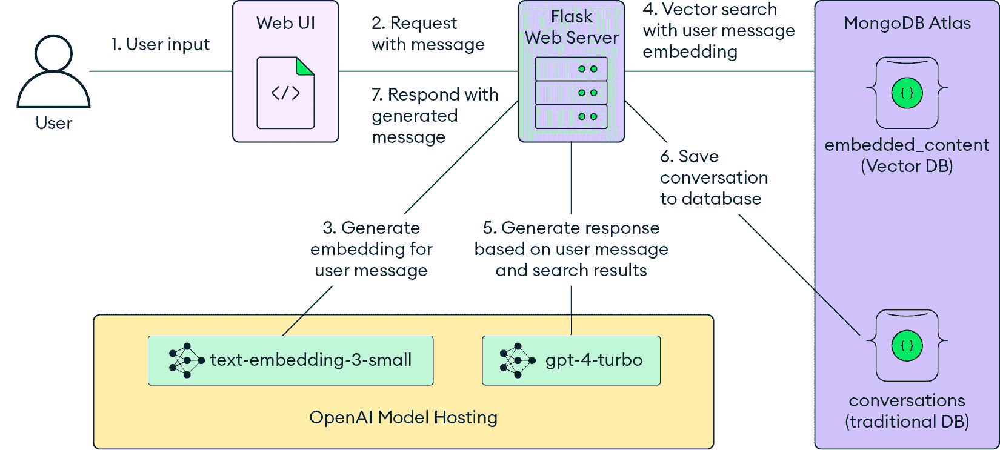
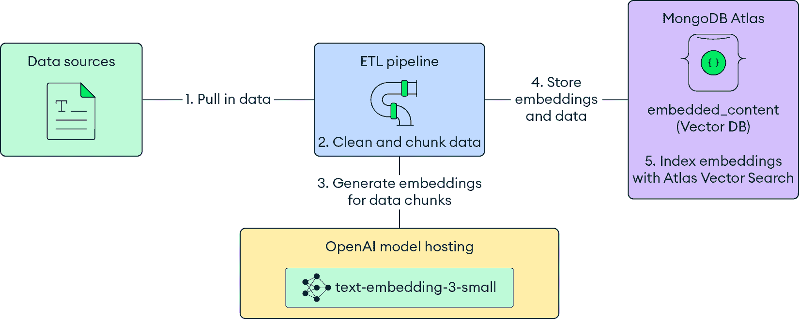

# 2

# 智能应用的基本构建块

在软件开发快速发展的环境中，一类新的应用正在兴起：智能应用。**智能应用**是传统全栈应用的超集。这些应用利用**人工智能**（**AI**）提供高度个性化、上下文感知的体验，超越了传统软件的能力。

智能应用能够理解复杂、非结构化的数据，并利用这种理解来做出决策并创建自然、自适应的交互。

本章的目标是向您提供一个关于智能应用逻辑和技术构建块的概述。本章探讨了智能应用如何扩展传统全栈应用的能力，定义它们的核心理念，以及这些组件如何协同工作以创建动态、上下文感知的体验。到本章结束时，您将了解这些组件如何组合在一起形成一个智能应用。

本章涵盖以下主题：

+   智能应用的基本构建块

+   作为智能应用推理引擎的LLMs

+   向量嵌入模型和向量数据库作为语义长期记忆

+   模型托管基础设施

# 技术要求

本章是理论性的。它涵盖了智能应用的逻辑组件以及它们如何相互配合。

本章假设读者对传统全栈应用开发组件的基本知识有所了解，例如服务器、客户端、数据库和API。

# 定义智能应用

传统应用通常由客户端用户界面、服务器端后端以及用于数据存储和检索的数据库组成。它们按照严格的指令集执行任务。智能应用也需要客户端、服务器和数据库，但它们通过增加AI组件来增强传统的技术栈。

智能应用通过理解复杂、非结构化的数据来脱颖而出，从而实现自然、自适应的交互和决策。智能应用可以参与开放式的交互，生成新颖的内容，并做出自主的决策。

智能应用的例子包括以下内容：

+   基于外部数据使用**检索增强生成**（**RAG**）提供自然语言响应的聊天机器人。例如，Perplexity.ai ([https://www.perplexity.ai/](https://www.perplexity.ai/)) 是一个由AI驱动的搜索引擎和聊天机器人，它根据从网络检索到的来源为用户提供基于AI生成的答案。

+   允许您使用自然语言提示创建媒体内容（如图像、视频和音频）的内容生成器。有各种智能内容生成器专注于不同的媒体类型，例如Suno（[https://suno.com/](https://suno.com/)）提供文本转歌曲，Midjourney（[https://www.midjourney.com/home](https://www.midjourney.com/home)）提供文本转图像，以及Runway（[https://runwayml.com/](https://runwayml.com/)）提供文本转视频。

+   使用客户数据提供基于其偏好和历史记录的个性化建议的推荐系统。这些建议可以通过自然语言进一步个性化客户体验。例如，Spotify的AI DJ（[https://support.spotify.com/us/article/dj/](https://support.spotify.com/us/article/dj/））根据您的收听历史创建个性化的电台，包括由LLM生成的DJ插曲。

这些例子只是对开发者刚开始构建的新类别智能应用的初步探索。在下一节中，您将了解智能应用的核心组件。

## 智能应用的基本构建块

智能应用的核心是两个关键构建块：

+   **推理引擎**：推理引擎是智能应用的头脑，负责理解用户输入、生成适当的响应，并根据可用信息做出决策。推理引擎通常由**大型语言模型**（**LLMs**）驱动——这些是执行文本补全的AI模型。LLMs可以理解用户意图，生成类似人类的响应，并执行复杂的认知任务。

+   **语义记忆**：语义记忆指的是应用存储和检索信息的方式，能够保留其意义和关系，使推理引擎能够根据需要访问相关上下文。

    语义记忆由两个核心组件组成：

    +   **AI向量嵌入模型**：AI向量嵌入模型将非结构化数据（如文本或图像）的语义意义表示为大量数字数组。

    +   **向量数据库**：向量数据库高效地存储和检索向量，以支持语义搜索和上下文检索。

推理引擎可以从语义记忆中检索和存储相关信息，使用非结构化数据来告知其输出。

驱动智能应用的LLMs和嵌入模型与传统应用相比有不同的硬件要求，尤其是在规模上。智能应用需要专门的模型托管基础设施，能够处理AI工作负载的独特硬件和可扩展性要求。智能应用还结合了持续学习、安全监控和人工反馈，以确保质量和完整性。

LLMs是智能应用的重要器官。下一节将更深入地了解LLMs在智能应用中的作用。

# LLMs – 智能应用的推理引擎

LLMs是智能应用的关键技术，解锁了全新类别的AI驱动系统。这些模型在大量文本数据上训练，以理解语言、生成类似人类的文本、回答问题和进行对话。

随着新模型的发布，LLMs不断改进，具有数十亿或数万亿参数，并增强了推理、记忆和多模态能力。

## LLM推理引擎的应用案例

LLMs（大型语言模型）已成为人工智能系统的一种强大通用技术，类似于传统计算中的**中央处理器**（**CPU**）。与CPU类似，LLMs作为通用计算引擎，可以被编程执行许多任务，并在基于语言的推理和生成中扮演相似的角色。LLMs的通用性质使得开发者能够利用其能力进行广泛的推理任务。

一些技术已经出现，以利用LLMs的多样化能力，例如：

+   **提示工程**：通过精心设计的提示，开发者可以引导LLMs执行广泛的语言任务。提示工程的一个关键优势是其迭代性。由于提示本质上只是文本，因此可以快速尝试不同的提示并查看结果。高级提示工程技术，如思维链提示（鼓励模型将推理分解为一系列步骤）和多轮提示（为模型提供示例输入/输出对），可以进一步提高LLM生成文本的质量和可靠性。

+   **微调**：微调涉及从预训练的通用模型开始，并在与目标任务相关的较小数据集上进行进一步训练。这可以比单独的提示工程产生更好的结果，但也有一些缺点，如成本更高、耗时更长。你应该在用尽提示工程所能达到的效果后再进行微调。

+   **检索增强**：检索增强将LLMs与外部知识库接口连接起来，使其能够利用最新的、特定领域的知识。在这种方法中，相关信息从知识库中检索出来并注入到提示中，使LLM能够生成上下文相关的输出。检索增强减轻了LLMs静态预训练的限制，保持其知识更新，并减少模型产生错误信息的可能性。

利用这些技术，你可以使用LLMs执行各种任务。下一节将探讨LLMs的当前应用案例。

## LLMs的多样化能力

尽管本质上只是语言模型，但LLM展现出了令人惊讶的涌现能力([https://arxiv.org/pdf/2307.06435](https://arxiv.org/pdf/2307.06435))。截至2024年春季，最先进的语言模型能够执行以下类别的任务：

+   **文本生成和补全**：给定一个提示，LLM可以生成连贯的后续内容，这使得它们在内容创作、文本摘要和代码补全等任务中非常有用。

+   **开放式对话和聊天**：LLM可以进行双向对话，保持上下文并处理开放式用户查询和后续问题。这种能力是聊天机器人、虚拟助手、辅导系统等应用的基石。

+   **问答**：LLM可以提供直接答案，进行研究和综合信息以回答查询。

+   **分类和情感分析**：LLM可以将文本分类到预定义的类别，并评估情感、情绪和观点。这使得LLM在内容审核和客户反馈分析等应用中变得非常有用。

+   **数据转换和提取**：LLM可以将非结构化文本映射到结构化格式，并提取关键信息，如命名实体、关系和事件。这使得LLM在数据挖掘、知识图谱构建和**机器人流程自动化**（RPA）等任务中非常有价值。

随着LLM在规模和复杂性上的持续增长，新的能力不断涌现，通常以令人惊讶的方式出现，这些方式并非原始训练目标直接意图。

例如，GPT-3生成功能代码的能力是一个意外的发现。随着LLM（大型语言模型）领域的进步，我们可以期待看到更多令人印象深刻且功能多样的能力出现，进一步扩展智能应用的潜力。

## 多模态语言模型

**多模态语言模型**在扩展语言模型能力方面具有特别的前景。多模态模型可以处理和生成图像、语音和视频，除了文本之外，已成为智能应用的重要组成部分。

多模态模型使得以下新的应用类别成为可能：

+   基于多种输入类型创建内容，例如用户可以提供图像和文本作为输入的聊天机器人。

+   高级数据分析，例如分析X光片和医疗记录的医疗诊断工具。

+   实时翻译，将一种语言的音频或图像翻译成另一种语言。

这样的例子突显了多模态语言模型如何增强语言模型的可能用例。

## 人工智能发展的范式转变

LLMs的兴起代表了AI应用开发中的范式转变。以前，许多推理任务需要专门训练的模型，这些模型的创建既耗时又计算量大。开发这些模型通常需要专门的**机器学习**（**ML**）工程团队和专业知识。

相比之下，LLMs的通用性质允许大多数软件工程师通过简单的API调用和提示工程利用其功能。虽然优化基于LLMs的工作流程以实现生产部署仍有一定的艺术性和科学性，但与传统的ML方法相比，这个过程要快得多，也更容易访问。

这种转变显著降低了AI应用的总拥有成本和开发时间表。以前可能需要复杂ML工程团队数月工作的NLP任务，现在可以通过单个软件工程师实现，该工程师可以访问LLM API并具备一些提示工程技能。

此外，LLMs解锁了之前无法或难以开发的新类别应用。LLMs理解和生成类似人类文本、参与开放式对话以及执行复杂推理任务的能力，为跨行业智能应用开辟了广泛的可能性。

你将在[*第3章*](B22495_03.xhtml#_idTextAnchor041)“大型语言模型”中了解更多关于LLMs的内容，该章节讨论了它们的历史和运作方式。

# 嵌入模型和向量数据库——语义长期记忆

除了LLMs提供的推理能力外，智能应用还需要语义长期记忆来存储和检索信息。

语义记忆通常由两个核心组件组成——AI向量嵌入模型和向量数据库。向量嵌入模型将非结构化数据（如文本或图像）的语义意义表示为大量数字的大数组。向量数据库有效地存储和检索这些向量，以支持语义搜索和上下文检索。这些组件协同工作，使推理引擎能够根据需要访问相关上下文和信息。

## 嵌入模型

**嵌入模型**是AI模型，将文本和其他数据类型（如图像和音频）映射到高维向量表示。这些向量表示捕获输入数据的语义意义，允许进行高效的相似性比较和语义搜索，通常使用余弦相似度作为距离度量。

嵌入模型将语义意义编码成机器可解释的格式。通过将类似的概念表示为向量空间中的邻近点，嵌入模型使我们能够测量非结构化数据片段之间的语义相似性，并在大型语料库中执行语义搜索。

预训练的嵌入模型广泛可用，并且可以针对特定领域或用例进行微调。与LLMs相比，嵌入模型通常更经济实惠，并且可以在有限的硬件上运行，这使得它们适用于更广泛的应用。

嵌入模型的一些常见应用包括以下内容：

+   **语义搜索和检索**：嵌入模型可以用作更大AI系统的一个组件，以检索LLMs的相关上下文，特别是在RAG架构中。RAG是本书中讨论的智能应用的一个重要用例，将在第8章[*第8章*](B22495_08.xhtml#_idTextAnchor180)，*在AI应用中实现向量搜索*中更详细地介绍。

+   **推荐系统**：通过将项目和用户偏好表示为嵌入，推荐系统可以识别相似的项目并生成个性化的推荐。

+   **聚类和主题建模**：嵌入模型可以帮助在大数据集中发现潜在的论题和主题，这对于分析用户与智能应用（如识别聊天机器人中的常见问题）的交互非常有用。

+   **异常检测**：通过识别与正常情况在语义上距离较远的异常向量，嵌入模型可以用于各种领域的异常检测。

+   **分析实体之间的关系**：嵌入模型可以根据实体的语义相似性揭示实体之间隐藏的关系和联系。

你将在[*第4章*](B22495_04.xhtml#_idTextAnchor061)，*嵌入模型*中探索嵌入模型的技术细节和实际考虑。

## 向量数据库

**向量数据库**是针对存储和搜索高维向量进行优化的专用数据存储。它们提供了快速、**近似最近邻**（**ANN**）搜索功能，允许智能应用根据空间邻近性快速存储和检索相关信息。

ANN搜索是必要的，因为随着数据库规模的增加，对数据库中每个向量进行精确相似度计算的计算成本变得很高。向量数据库使用诸如**层次可导航小世界**（**HNSW**）之类的算法来有效地找到近似最近邻，使得大规模的向量搜索成为可能。

除了ANN搜索外，向量数据库通常支持对与向量关联的元数据进行过滤和精确搜索。这些功能的精确功能和性能在不同向量数据库产品中有所不同。

向量数据库在给定查询的情况下为智能应用提供低延迟的相关信息检索。使用内容的语义意义进行搜索，向量数据库与LLMs推理信息的方式相一致，使应用能够将相同的不结构化数据格式应用于长期记忆和推理。

在使用RAG的应用中，向量数据库扮演着至关重要的角色。应用生成一个查询嵌入，用于从向量数据库中检索相关上下文。然后，将多个相关片段作为上下文提供给LLM，LLM使用这些信息生成有见地和相关的响应。

您将在[*第5章*](B22495_05.xhtml#_idTextAnchor115) *向量数据库*中了解向量数据库的技术细节和实际考虑。

## 模型托管

要在您的智能应用中实现AI模型，您必须在计算机上托管它们，无论是在数据中心还是云中。这个过程被称为**模型托管**。为应用托管AI模型与托管传统软件相比，有一套不同的要求。大规模运行AI模型需要强大的**图形处理单元**（**GPUs**）并配置软件环境以高效地加载和执行模型。

模型托管的关键挑战包括高计算需求和硬件成本、GPU资源的有限可用性、管理和扩展托管基础设施的复杂性，以及使用专有解决方案时可能出现的供应商锁定或灵活性有限。因此，硬件和成本限制必须比以往任何时候都更多地纳入应用设计过程。

### 自托管模型

**自托管模型**这一术语指的是在组织自己的基础设施和硬件资源上部署和运行AI模型（如LLMs）的做法。在这种方法中，组织负责设置和维护加载和执行模型所需的所有必要的计算资源、软件环境和基础设施。

自托管AI模型需要大量前期投资于专用硬件，这对许多组织来说可能是成本高昂的。管理模型基础设施也带来运营负担，这需要ML专业知识，而许多软件团队缺乏这种知识。这可能会分散对核心应用和业务逻辑的注意力。

将自托管模型扩展以确保可用性可能具有挑战性，因为模型可能很大，并且需要时间加载到内存中。组织可能需要预留大量额外容量来处理峰值负载。此外，维护和更新模型是一项复杂的工作，因为模型可能会随着时间的推移而变得过时，需要重新训练或微调。随着该领域的积极研究，新的模型和技术不断涌现，这使得组织难以跟上。

### 模型托管提供商

与自托管相关的挑战使得模型托管提供商成为智能应用开发的流行选择。

**模型托管提供商** 是基于云的服务，提供在其基础设施上部署、运行和管理 AI 模型（如 LLMs）的平台。这些提供商处理设置、维护和扩展加载和执行模型所需基础设施的复杂性。

模型托管提供商提供以下好处：

+   **外包硬件和基础设施管理**：模型托管提供商处理配置、扩展、可用性、安全性和其他基础设施问题，使应用团队能够专注于其核心产品。

+   **成本效益和灵活定价**：通过模型托管提供商，组织只需为其使用的部分付费，并根据需要调整资源，从而减少前期投资。

+   **访问广泛的模型**：提供商精选并托管许多最先进的模型，持续集成最新研究。他们通常在原始模型上添加额外的功能和优化。

+   **支持和专业知识**：提供商可以就模型选择、提示工程、应用架构提供咨询，并在微调、数据准备、评估和其他 AI 开发方面提供帮助。

+   **快速原型设计和实验**：模型托管提供商使开发者能够快速测试不同的模型和方法，适应快速发展的 AI/ML 领域的新进展。

+   **可扩展性和可靠性**：提供商构建强大、高度可用和自动扩展的基础设施，以满足生产规模智能应用的需求。

模型托管提供商的例子包括来自模型开发者如 OpenAI、Anthropic 和 Cohere 的服务，以及来自云提供商如 AWS Bedrock、Google Vertex AI 和 Azure AI Studio 的产品。

# 您（即将成为的）智能应用

使用 LLMs、嵌入模型、向量数据库和模型托管，您拥有创建智能应用的关键构建块。虽然具体架构将根据您的用例而有所不同，但一个常见的模式出现：

+   **LLMs** 用于推理和生成

+   **嵌入** 和 **向量搜索** 用于检索和记忆

+   **模型托管** 以大规模提供这些组件

此 AI 堆栈与传统应用组件集成，例如后端服务、API、前端用户界面、数据库和数据管道。此外，智能应用通常包括针对 AI 特定关注点的组件，例如提示管理和优化、数据准备和嵌入生成，以及 AI 安全性、测试和监控。

本节剩余部分将介绍一个由 RAG 驱动的聊天机器人示例架构，展示这些组件如何协同工作。后续章节将更深入地探讨构建生产级智能应用的端到端流程。

## 样例应用 – RAG 聊天机器人

考虑一个简单的聊天机器人应用，该应用利用 RAG 允许用户与某些文档进行交流。

该应用程序有七个关键组件：

+   **聊天机器人 UI**：一个具有简单聊天机器人 UI 的网站，与网页服务器通信

+   **Web 服务器**：一个 Python Flask 服务器，用于管理用户和 LLM 之间的对话

+   **数据摄取提取、转换、加载（ETL）管道**：一个 Python 脚本，用于从数据源摄取数据

+   由 OpenAI 托管的 `text-embedding-3-small` 模型

+   由 OpenAI 托管的 `gpt-4-turbo` 模型

+   **向量存储**：MongoDB Atlas 向量搜索

+   **MongoDB Atlas**：用于持久化对话的数据库即服务

注意

这个简单的示例应用程序不包括评估或可观察性模块。

在此架构中，有两个关键的数据流：

+   **聊天交互**：用户使用 RAG 与聊天机器人进行交流

+   **数据摄取**：将数据从其原始来源引入向量数据库

在聊天交互中，聊天机器人 UI 与聊天机器人网页服务器通信，该服务器随后与 LLM、嵌入模型和向量存储进行交互。这发生在用户向聊天机器人发送的每条消息时。*图 2.1* 展示了聊天机器人应用程序的数据流：

图 2.1：基本 RAG 聊天机器人对话数据流示例

*图 2.1* 中所示的数据流可以描述如下：

1.  用户从网页 UI 向聊天机器人发送消息。

1.  网页用户界面向服务器发送包含用户消息的请求。

1.  网页服务器向嵌入模型 API 发送请求以创建用户查询的向量嵌入。嵌入模型 API 返回相应的向量嵌入。

1.  网页服务器使用查询向量嵌入在向量数据库中执行向量搜索。向量存储返回匹配的向量搜索结果。

1.  服务器构建一个 LLM 将会回复的消息。这个消息由系统提示和一个包含用户原始消息和从向量搜索中检索的内容的新消息组成。然后 LLM 回复用户消息。

1.  服务器将对话状态保存到数据库中。

1.  服务器将 LLM 生成的消息作为对网页 UI 原始请求的响应返回给用户。

数据摄取管道准备和丰富数据，使用嵌入模型生成嵌入，并填充向量存储和传统数据库。此管道每 24 小时作为批处理作业运行。*图 2.2* 展示了数据摄取管道的示例：

图 2.2：RAG 聊天机器人数据摄取 ETL 管道示例

让我们看看 *图 2.2* 中所示的数据流：

1.  数据摄取 ETL 管道从各种数据源中提取数据。

1.  ETL 管道将数据清理成一致格式。它还将数据分成数据块。

1.  ETL 管道调用嵌入模型 API 为每个数据块生成向量嵌入。

1.  ETL 管道将数据块及其向量嵌入存储在向量数据库中。

1.  向量数据库为向量搜索索引嵌入。

虽然这种简单的架构可以用来构建引人注目的原型，但从原型过渡到生产并持续迭代应用需要解决许多额外的考虑因素：

+   **数据摄取策略**：获取、清理和准备将被摄取到向量存储或数据库中以供检索的数据。

+   **高级检索模式**：结合从向量存储或数据库中高效准确地检索相关信息的技术，例如将语义搜索与传统过滤、基于AI的重新排序和查询变异相结合。

+   **评估和测试**：添加评估模型输出、测试端到端应用流程和监控潜在偏差或错误的模块。

+   **可扩展性和性能优化**：实施优化措施，如缓存、负载均衡和高效资源管理，以处理不断增长的工作负载并确保一致的响应性。

+   **安全和隐私**：确保应用的安全性，以便用户只能与他们有权限交互的数据进行交互，从而确保用户数据按照相关政策、标准和法律进行处理。

+   **用户体验和交互设计**：结合新的生成式AI界面和交互模式，例如流式响应、答案置信度和来源引用。

+   **持续改进和模型更新**：建立流程和系统以安全可靠地更新智能应用中的AI模型和超参数。

## 智能应用对软件工程的影响

智能应用的出现对软件制作方式产生了重大影响。开发这些智能应用需要扩展传统开发技能。AI工程师必须了解提示工程、向量搜索和评估，以及熟悉最新的AI技术和架构。虽然不需要完全理解底层神经网络，但了解**自然语言处理**（**NLP**）的基本知识是有帮助的。

智能应用开发也引入了新的挑战和考虑因素，例如数据管理、与AI组件的集成、AI驱动功能的测试和调试，以及解决AI输出的伦理、安全和隐私影响。AI工作负载的计算密集型特性也要求关注可扩展性和成本优化。构建传统软件的开发人员通常不需要面对这样的担忧。

为了应对这些挑战，软件开发团队必须调整其流程并采用新颖的方法和最佳实践。这包括实施AI治理、弥合软件与ML/AI团队之间的差距，并调整智能应用需求的发展生命周期。

# 摘要

智能应用代表了软件开发的新范式，将人工智能与传统的应用组件相结合，以提供高度个性化、上下文感知的体验。本章详细介绍了智能应用的核心组件，突出了LLMs作为推理引擎的关键作用。LLMs作为通用设计工具，能够执行各种任务，包括聊天、摘要和分类。

补充这些推理引擎的是嵌入模型和向量数据库，它们作为智能应用的语义记忆。这些组件使推理引擎能够根据需要检索相关的上下文和信息。此外，托管AI模型需要专用基础设施，因为它们的独特硬件需求与传统软件需求差异很大。使用LLMs、嵌入模型、向量数据库和模型托管基础设施等构建块，开发者可以创建能够理解复杂、非结构化数据、进行开放式交互、生成新颖内容并做出自主决策的应用程序。构建这些智能应用需要一套新的工具、方法和最佳实践。

下一章将探讨大型语言模型（LLMs）的工作原理以及它们在构建智能应用中的作用。

# 第一部分

# 人工智能基础：LLMs、嵌入模型、向量数据库和应用设计

这套章节提供了关于支撑AI密集型应用的技术和原理的深入和实践知识。您将迅速从基本概念进步到实际用例，并学习构建您AI解决方案的最佳实践。

本书这部分包括以下章节：

+   [*第3章*](B22495_03.xhtml#_idTextAnchor041), *大型语言模型*

+   [*第4章*](B22495_04.xhtml#_idTextAnchor061), *嵌入模型*

+   [*第5章*](B22495_05.xhtml#_idTextAnchor115), *向量数据库*

+   [*第6章*](B22495_06.xhtml#_idTextAnchor137), *AI/ML应用设计*
