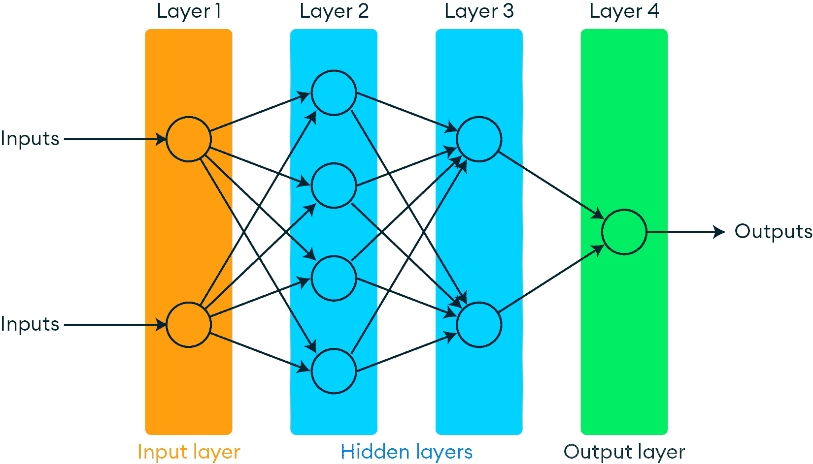
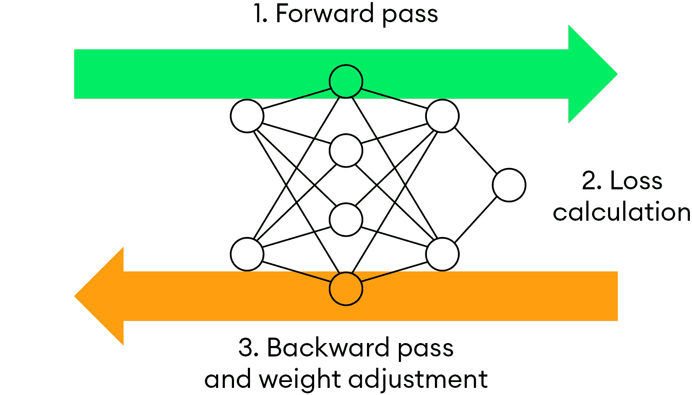
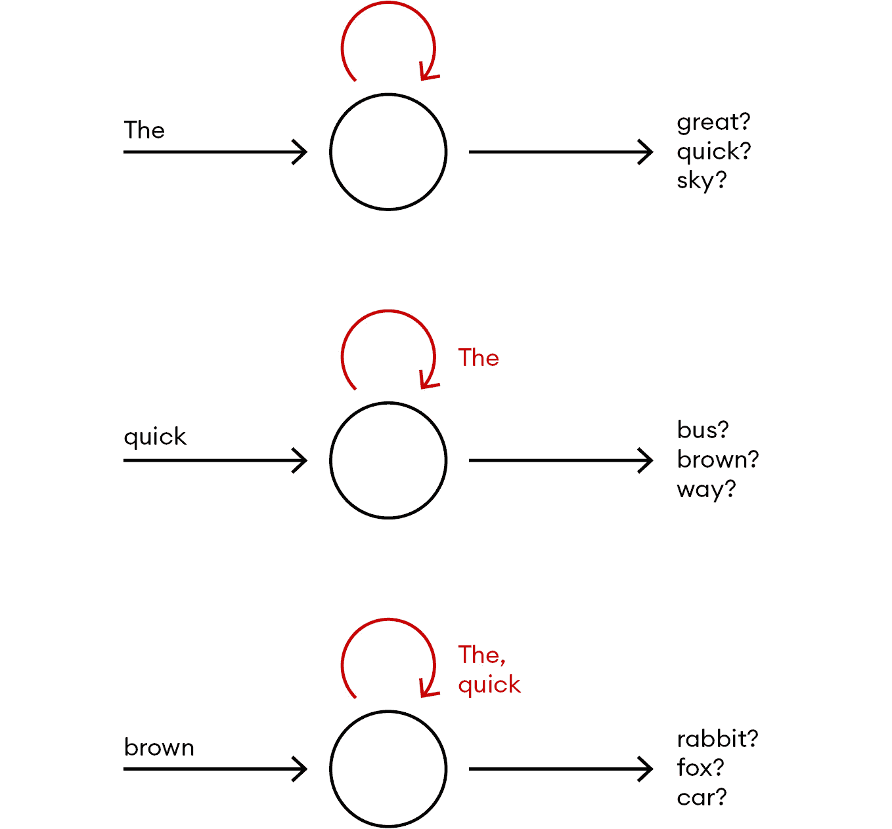

# 第三章：大型语言模型

语言模型是设计用于处理、理解和生成自然语言的计算算法。对这些算法的研究、研究和开发被称为 **自然语言处理**（**NLP**）。NLP 早在 **机器学习**（**ML**）领域之前，可以追溯到 20 世纪 50 年代和第一台计算机的发展。虽然早期的语言模型主要依赖于基于规则的途径，但 NLP 在 20 世纪 80 年代转向了统计方法，并开始与 ML 相汇合。计算能力的提升和文本语料库的增长导致了 21 世纪初深度学习和基于神经网络的深度学习语言模型的发展，这些模型在过去十年中取得了显著进展。

语言模型在 NLP 中有各种应用，用于理解和生成自然语言以及更正式的语言，如编程和数据库查询语言。它们的使用案例包括文本标注、情感分析、翻译、摘要、信息提取和问答等任务。随着 **大型语言模型**（**LLMs**）的出现，应用进一步扩展到开发对话聊天系统、个人助理、软件开发代理和通用问题解决者。在本章中，你将深入了解 LLMs 的基本概念和实现。

本章将涵盖以下主题：

+   使用 n-gram 模型进行语言建模以提供概率观点

+   **人工神经网络**（**ANNs**），其架构和训练范式

+   将 ANNs 应用于语言建模领域

+   Transformer 架构

+   LLMs 的实践应用

# 技术要求

本章主要理论性，包含一段简短的 Python 代码片段来展示 `tiktoken` 标记化库。为了跟上进度，你需要一台装有 Python 3.8 或更高版本的计算机。

要充分利用本章内容，你需要熟练掌握 Python 和 `pip` 软件包管理器。你还需要对概率、微积分以及软件开发概念（如 API）有基本了解。

# 概率框架

当构建与 LLMs 交互的 AI 密集型应用时，你可能会遇到与标记概率相关的 API 参数。为了理解 LLMs 如何与概率概念相关联，本节介绍了支撑语言模型的概率框架。

语言建模通常是以概率观点为前提进行的，而不是绝对的、确定性的术语。这允许算法处理在自然语言中经常遇到的不确定性和歧义。

为了对概率语言建模有一个直观的理解，考虑以下句子的开头，你想要预测下一个单词：

```py

The
```

这显然是一个具有许多可能答案的模糊任务。英语中的 *the* 是一个非常常见和通用的单词，可能性是无限的。任何名词，如 *house*、*dog*、*spoon* 等，都可以是句子的有效可能延续。甚至形容词如 *big*、*green* 和 *lazy* 也可能是可能的候选人。相反，有些词很少出现在冠词之后，包括动词，如 *eat*、*see* 和 *learn*。

为了处理这种不确定性，考虑一个稍微不同的问题：“每个单词接下来出现的概率是多少？”

对于 *this* 这个问题的答案不再是单个单词，而是一个大型的查找表，为词汇表中的每个单词分配一个数字，代表这个单词跟随 *the* 的概率。如果这个查找表代表了英语语言，人们会期望名词和形容词比动词有更高的概率。*表3.1* 展示了这样一个表可能的样子，使用虚构的值来表示 *概率* 列。你很快就会看到这些概率是如何从文本语料库中计算出来的：

| **前一个单词** | **下一个单词** | **概率** |
| --- | --- | --- |
| … | … | … |
| the | house | 0.012% |
| the | dog | 0.013% |
| the | spoon | 0.007% |
| … | … | … |
| the | big | 0.002% |
| the | green | 0.001% |
| the | lazy | 0.001% |
| … | … | … |
| the | eat | 0.000% |
| the | see | 0.000% |
| the | learn | 0.000% |
| …. | .. | … |

表3.1：跟随单词 *the* 的部分查找表

在这个简单的例子中，决定下一个单词的一种方法（但不是唯一的方法）是扫描这个查找表，找到概率最高的单词。这种方法被称为 **贪婪选择**，会建议 *dog* 是句子最可能的延续。然而，重要的是要注意，有许多可能性，每种可能性都有不同的概率。例如，单词 *house* 在概率上也是接近第二的选择，这表明它也可能是句子的一个可能的延续。

为了捕捉自然语言的灵活性和表现力，语言模型以概率为依据进行操作，训练语言模型的过程意味着为到目前为止的句子中的每个单词分配概率。

假设你已经多次进行了选择下一个单词的过程，发现自己已经进一步地沿着句子前进：

```py

The quick brown fox jumps over the
```

这个句子接下来会如何继续？现在的概率分布是什么样的？

如果你熟悉这个句子[1](B22495_03.xhtml#footnote-000)，你会同意在这个点上，单词 *lazy* 的概率将高于所有其他单词。你的内部语言模型无法帮助完成整个句子的自动补全，而 *lazy dog* 这几个词就会突然出现在你的脑海中。

[1](B22495_03.xhtml#footnote-000-backlink) 这句话是一个 pangram。一个 pangram 至少包含字母表中的每一个字母。这句话已经在各种语境中使用，例如打字练习和测试计算机中的文本显示。

但为什么是这样呢？你不是和之前一样，在 *the* 后询问接下来是什么吗？这里的关键区别在于你有了更多的上下文；你看到了更多的句子，这表明仅考虑前面的单词不足以构建对下一个单词的良好预测器。然而，这个基本概念标志着语言模型的起点，可以被视为 ChatGPT 和其他现代 LLM 的远祖。

## n-gram 语言模型

语言模型的第一种形式之一是 **n-gram 模型**，这是一种简单的统计语言模型，首次发表在 1948 年克劳德·香农著名的论文 *《通信的数学理论》* 中 ([https://people.math.harvard.edu/~ctm/home/text/others/shannon/entropy/entropy.pdf](https://people.math.harvard.edu/~ctm/home/text/others/shannon/entropy/entropy.pdf))。

n-gram 语言模型可以被描述为一个巨大的查找表，其中模型考虑最后 `n-1` 个单词来预测下一个单词。对于 `n=2`，你得到一个所谓的二元模型，只回溯一个单词，如 *表 3.1* 所示。

如前例中的句子所示，这样一个简单的二元模型是有限的，无法捕捉自然语言的细微差别。然而，在探索当 `n` 扩展到更大的值时会发生什么之前，让我们简要讨论如何训练一个二元模型，也就是说，如何计算表中每一对单词的概率：

1.  选取一个大型文本语料库，例如所有英文维基百科页面的集合。

1.  扫描此文本，并统计单个单词以及观察到的单词对的出现的次数。

1.  在查找表中记录所有计数。

1.  按如下方式计算单词  在单词  后出现的概率：将单词对  的计数除以单个单词  的计数。

例如，要计算单词 *dog* 在单词 *the* 后出现的概率，按以下方式将配对计数除以单个单词计数：


这里，术语  读作“在 y 的条件下 x 的概率。”换句话说，在已经看到单词 *the* 的情况下看到单词 *dog* 的概率是看到这两个单词组合的计数（分子）除以看到 *the* 单独的所有计数（分母）。

因此，n-gram 语言模型的训练过程只需要对文本进行单次遍历，统计所有出现的 n-gram 和 (n-1)-gram，并将数字存储在表中。

在实践中，一些技巧可以提高n-gram模型的质量，例如在每个句子的开始和结尾包含特殊的`<start>`和`<end>`标记，将单词拆分成更小的子词，例如将`*playing*`拆分成`*play*`和`*-ing*`，以及许多其他改进。你将在后面的`*Tokenization*`部分中回顾一些这些技术，并且它们也适用于现代LLMs。

让我们现在重新审视`n`的选择。正如你所看到的，一个较低的值，例如`n=2`，并不能产生一个非常好的语言模型。这是否仅仅是扩大`n`直到达到所需质量水平的问题？

较大的`n`值可以捕捉到更多的上下文，并导致一个更具预测性的模型。对于`n=8`，模型可以回顾最后七个单词。正如*表3.2*所示，查找表将包含一行，用于捕获以下示例句子：

| **Previous** **7 words** | **Next word** | **Probability** |
| --- | --- | --- |
| … | … | … |
| the quick brown fox jumps over the | lazy | 99.381% |
| …. | .. | … |

表3.2：8-gram查找表中的一个可能条目

然而，将`n`增加到较大的值有几个挑战，这使得这种方法在实践中不可行。

查找表的大小会随着`n`的增大而指数级增长。《牛津高阶英汉双解大词典》包含大约273,000个英语单词([https://en.wikipedia.org/wiki/List_of_dictionaries_by_number_of_words](https://en.wikipedia.org/wiki/List_of_dictionaries_by_number_of_words))，这允许有74.5亿种可能的两个单词组合（尽管这些组合中的许多在文本中永远不会出现）。将n-gram模型增加到`n=8`，八个单词的可能组合增长到天文数字！[](img/B22495_03_Equations6.png)。在表中为每个组合存储条目是不可能的，因为这个数字远远超过了世界上所有可用的硬盘存储空间，尤其是在世界总数据量预计到2025年将达到175泽字节= 字节的情况下([https://www.networkworld.com/article/966746/idc-expect-175-zettabytes-of-data-worldwide-by-2025.html](https://www.networkworld.com/article/966746/idc-expect-175-zettabytes-of-data-worldwide-by-2025.html))。当然，这些单词组合中的大多数永远不会遇到，你可以在表中选择省略未见的n-gram。

这个挑战，被称为`n`，任何单个n-gram出现的概率会指数级下降。大多数`n`个单词的组合在现实规模的训练数据集中永远不会遇到。当处理不属于训练语料库的文本时，模型将为未见的n-gram分配零概率。在这种情况下，模型将无法做出有意义的预测，并且随着`n`的增大，这个问题会加剧。

总结来说，尽管n-gram在某些特定应用和教育目的上有其用途，但今天的语言模型已经超越了纯粹统计方法。大型语言模型（LLMs）使用机器学习技术来解决上述一些问题，你将在下一节中了解到这些内容。

# 语言建模的机器学习

在深入探讨使用机器学习进行语言建模的方法之前，本节首先介绍一些通用的机器学习概念，并对不同的神经网络架构进行高层次概述。

在本质上，机器学习是一个关注开发和研究从数据中学习的算法的领域。系统不是执行硬编码的规则，而是预期通过**示例学习**，查看提供的输入和期望的结果（在机器学习文献中通常称为**目标**）并在训练过程中调整其行为以改变其输出，使其更接近用户提供的目标。

机器学习算法大致可以分为三类：

+   监督学习

+   无监督学习

+   强化学习

这些组别各自有不同的学习目标和问题表述。对于语言建模，你可以主要考虑监督学习（和相关自监督）算法。

## 人工神经网络

一类监督学习算法是**人工神经网络**（**ANNs**）。所有现代LLMs都是基本ANN架构的变体。当你对一个如GPT-4之类的模型进行API调用时，你的问题会通过ANN流过以生成答案。这些模型在几十年的时间里在规模和复杂性上有所发展，但核心原理和构建块保持不变。

人类大脑中发现的神经网络架构可能启发了ANNs的原始设计，但ANNs与其生物对应物有显著不同。

人工神经网络（ANNs）由许多称为神经元的较小单元组成，这些神经元以各种模式相互连接，具体取决于网络架构。每个神经元是一个小的处理单元，从其他神经元接收数值信号，并将一个（修改后的）信号传递给其后续神经元，类似于生物神经元。ANNs具有可调节的参数，称为**权重**，它们位于两个神经元之间的连接上，可以影响它们之间的信号传递。

最基本的ANN架构之一是所谓的**前馈网络**（**FFN**），如*图3.1*所示。在这个架构中，神经元按层排列，从输入层开始，然后是一个或多个隐藏层，最后是输出层。层的大小，即每层的神经元数量，可以变化。输入层和输出层的大小由特定的应用领域决定。例如，你可能想要学习从二维输入（例如，一个人的体重指数和年龄）到一维输出（例如，每天消耗的静息卡路里）的映射。隐藏层的大小通常通过称为**超参数调整**的实验过程任意选择。

在前馈神经网络（FFN）中，每一层的每个神经元都与下一层的所有神经元相连，导致两个连续层之间存在多对多的关系。*图3.1*展示了具有一个输入层（层1）、两个隐藏层（层2和层3）以及一个输出层（层4）的前馈神经网络架构：



自动生成的描述](img/B22495_03_01.png)

图3.1：前馈神经网络架构

放大单个神经元的运作，*图3.2*展示了一个从两个其他神经元（表示为和）接收输入的神经元。连接到神经元的权重（表示为和）。输入首先与相应的权重相乘，然后求和。得到的和通过一个非线性激活函数传递，结果形成神经元的输出（表示为）。从数学的角度来看，这可以表示为以下公式：

尽管本章不涉及激活函数的具体细节，但可以说非线性对于网络能够学习数据中的复杂模式至关重要。


图3.2：具有两个输入的单个神经元的激活

在网络的前向传递过程中，你将输入数据（例如，一个人的BMI和年龄）呈现在输入层，计算该层所有神经元的激活，然后将这些激活传递到下一层，依此类推，直到输出层产生一个结果（在这个例子中，你可以将其解释为模型对一个人燃烧卡路里的预测）。

神经网络中单个神经元所遵循的简单激活函数能够导致复杂的模式识别能力，这似乎令人惊讶。这一现象源于**万能逼近定理**，该定理证明了具有足够隐藏层和神经元的神经网络可以逼近任何连续函数到任何所需的精度。

你现在已经了解了在人工神经网络（ANN）中数据是如何从前向流到输出层的。对于一个未经训练的模型，这仅仅是三个阶段中的第一个。在下一节中，你将学习训练ANN所需的另外两个阶段：损失计算和反向传播。

## 训练人工神经网络

到目前为止，本章已经描述了网络的正向传播，即如何计算给定输入的响应。由于人工神经网络的初始权重是随机选择的，因此未经训练的网络的输出也是随机的、无意义的。在训练过程中需要调整权重。

训练神经网络的目的是使其输出与任何给定输入提供的目标相匹配。因此，对于监督学习，训练数据集由已知正确响应的输入/目标对组成。在预测给定一个人的BMI和年龄所消耗的卡路里的例子中，训练数据集将包括许多人的BMI和年龄（输入）以及他们测量的卡路里消耗（目标）。数据集中的测量越多，模型就能更好地从输入和目标之间的关系中学习模式。

人工神经网络的训练过程可以分为三个阶段，如图*3.3*所示：

1.  **正向传播**：从输入计算输出。

1.  **损失计算**：计算输出和期望目标之间的误差信号。

1.  **反向传播和权重调整**：将错误反向传播通过模型并调整每个权重。



图3.3：训练ANN的三个阶段

此过程在数据集的多次遍历中重复，直到权重参数不再有意义地改变。此时，模型被称为收敛，并准备好进行推理。

训练从数据的前向传播开始，输入数据并记录网络的输出。由于这个输出可能与正确目标不同（特别是对于具有随机权重的未经训练的网络），因此可以计算一个称为**损失**的指标，它是一个反映实际输出和期望输出之间差异的标量数。

损失是执行**反向传播**所必需的。这一步骤将调整网络的所有权重，以便网络将产生一个更接近给定输入目标的输出。每个神经元的激活是一个具有和、积和可微分的激活函数的良好的可微分表达式。这意味着可以通过微积分规则计算权重相对于损失的导数，以确定每个权重参数需要如何调整以最小化损失。

然后，使用微积分的链式法则，将这个梯度计算反向传播到前面的层，直到输入层。以这种方式计算出每个权重的梯度后，权重就可以更新。由一个称为**学习率**的参数控制，权重可以朝着最小化损失的方向移动一小步。

虽然理论上可以为训练集中的每个单独条目执行正向和反向传递的循环，但在实践中，训练集被分成小批次。一个**批次**可能包含数十、数百甚至数千个数据点。**批次大小**是另一个在实际训练过程之前通过超参数调整实验选择的超参数。以这种方式批量处理数据有以下几个目的：

+   这提高了效率，因为批次可以在并行处理，尤其是在专门的硬件上，如**图形处理单元**（**GPU**）。

+   通过网络反向传播的错误梯度在每个批次中平均。这导致训练更加稳定，因为数据中的单个异常值对权重变化的影响较小。

训练会继续进行，直到模型不再在未见过的验证数据上改进。

训练完成后，训练好的模型可以应用于之前未见过的输入。例如，该模型可以集成到健身追踪应用程序中，根据一个人的BMI和年龄预测燃烧的卡路里，预期它不仅适用于训练数据中的测量，而且可以推广到新的数据点。将训练好的模型应用于新数据的应用称为**推理**。

这种训练过程是每个神经网络的核心，包括大型语言模型（LLMs）。由于神经网络在数值数据上操作，下一节将展示语言如何以数值形式表示，以便与人工神经网络的使用兼容。

# 自然语言处理的人工神经网络

前一节展示了人工神经网络如何学习将数值输入映射到数值输出的方法。然而，语言本质上是非数值的：一个句子是从大型词汇表中离散单词的序列。基于神经网络的词预测器提出了以下挑战：

+   模型的输入是离散的单词。由于人工神经网络在数值输入和输出上操作，需要一个合适的从单词到数字以及相反的映射。

+   输入进一步变为序列化。与二元组不同，模型在预测下一个词时应该能够考虑一个以上的单词。

+   语言模型的输出需要是所有可能下一个词的概率分布。为了形成一个合适的分布，输出需要归一化，使其非负并加起来等于一。

以下章节将解释这些挑战，并回顾它们在现代语言模型中的解决方法。

## 分词

将文本转换为数值输入的第一个处理步骤称为**分词**。在这个阶段，单词被分割成常见的子词、字符和标点符号，构成了标记的词汇表。然后，每个标记被分配一个唯一的整数ID。

当与LLM交互，尤其是处理自托管的开源模型时，选择分词器非常重要，并且必须与模型训练期间使用的分词器完全匹配。幸运的是，存在许多常见的开源分词器。甚至像OpenAI这样的商业LLM提供商也已经开源了他们的分词器库，以便更容易地与其模型交互。OpenAI的`tiktoken`库的绑定适用于许多流行的编程语言，包括Python、C#、Java、Go和Rust。

以下代码示例演示了`tiktoken` Python库的使用。在用`pip install tiktoken`安装包之后，你可以创建一个`encoder`对象并编码任何文本，这将返回一个标记ID的列表。以下代码片段将句子 *tiktoken is a popular tokenizer!* 分词，并将每个标记ID解码回其字节字符串：

```py

import tiktoken
# use the gpt-4 tokenizer 'cl100k_base'encoder = tiktoken.get_encoding("cl100k_base")
token_ids = encoder.encode("tiktoken is a popular tokenizer!")
print("Token IDs", token_ids)
tokens = [encoder.decode_single_token_bytes(t) for t in token_ids]print("Tokens", tokens)
```

运行此代码会产生以下输出：

```py

Token IDs [83, 1609, 5963, 374, 264, 5526, 47058, 0]
Tokens [b't', b'ik', b'token', b' is', b' a', b' popular', b' tokenizer', b'!']
```

你可以看到单词 *tiktoken* 被分割成三个标记，*t*、*ik* 和 *token*，这很可能是由于该单词本身并不常见，不足以在词汇表中拥有自己的标记。值得注意的是，空白通常被编码为标记的一部分，例如在“ *is*”的开头。

当通过API与专有模型交互时，分词通常自动且在服务器端进行。这意味着你可以以文本形式提交提示，而无需自己进行分词。然而，`tiktoken`和类似的库在构建AI应用程序时仍然是很有用的工具。例如，你可以使用它们来计算请求的标记数量，因为API调用通常按提交和返回的标记数量计费。此外，语言模型对其输入有一个上限，称为它们的**上下文大小**。请求过大可能会失败或被截断，这会影响模型的响应。

在开发LLM应用程序的目的上，了解分词在文本预处理方面的知识就足够了。然而，这仅仅是使神经网络理解文本输入的第一步。尽管标记ID是数字，但标记到其ID的分配是任意的。神经网络以几何方式解释它们的输入，并且不适合处理大整数。在第二步，称为嵌入，这些整数被转换成高维浮点向量，也称为**嵌入向量**或简称为**嵌入**。

## 嵌入

**嵌入**是将数据映射到高维向量空间的过程。这个概念不仅与语言模型的训练相关，而且对于向量数据库检索语义相似项也将发挥重要作用，我们将在后面的 [*第 5 章*](B22495_05.xhtml#_idTextAnchor115)，*向量数据库* 中讨论。可以为任意数据实体创建嵌入：单词、句子、整个文档、图像，甚至是更抽象的概念，例如在构建推荐系统时上下文中的用户或产品。

嵌入的目的有两个：

+   它们是它们对应实体的固定长度浮点数表示，非常适合由神经网络处理。

+   嵌入是向量空间中的坐标。通过正确的选择（或者更确切地说，是训练），嵌入可以通过数据实体的几何邻近性来表示语义相似性。这使得可以使用几何算法，如聚类或最近邻搜索，在嵌入数据的语义意义上进行操作。

嵌入是语言模型和向量搜索核心的基本概念。为了理解标记如何被嵌入，让我们假设一个只有三个维度的微小向量空间，如图 *图 3**.4* 所示。要将一个标记映射到这个空间，为每个标记分配这个空间中的一个随机点。在这里，标记由其整数 ID 表示，而空间中的随机点由其 x、y 和 z 坐标指示。映射是通过一个由 `n` 行和 `d` 列组成的嵌入矩阵完成的，该矩阵用随机浮点数初始化。在这里，`n` 是词汇表的大小，`d` 是嵌入维度性（在这个例子中，`d` 等于 `3`）。要检索一个标记的坐标，使用标记 ID 作为嵌入矩阵的行索引，返回一个 d 维向量。例如，标记 *fox* 可能被分配以下坐标：`[-0.241, 1.356, -0.7882]`。


图 3.4：嵌入到三维向量空间中的标记的视觉表示

就像在训练之前随机分配神经网络权重一样，嵌入矩阵的值也是随机选择的。此外，这是 LLM 训练中的一个关键步骤，即嵌入矩阵的值被视为神经网络的额外可学习参数。通过允许梯度完全流回嵌入层，模型可以在训练期间更新标记坐标的位置，从而有助于预测任务。

对 LLMs 的完全训练嵌入层的研究表明，模型将语义上相似的标记移动到一起。在早期示例中，您可能会找到一个名词（*狐狸*，*狗*）的簇或一个形容词（*快的*，*懒惰的*，*棕色的*）的簇。然而，只有三个维度，相似性仅限于三个可以比较的属性。LLMs 使用具有更大维度性的向量空间，通常在数百甚至数千维。在这样的高维空间中，标记可以通过多种方式相互关联（并在几何上彼此靠近）。一些维度可能具有可解释的意义，例如一个词的情感。然而，其中大部分可能只有模型内部有意义。

在本节中，您已经了解了如何通过将文本分割成标记并分配标记 ID 来准备文本以供神经网络训练，这些 ID 可以用作索引来在嵌入矩阵中找到相应的嵌入向量。这些向量具有几何意义，可以作为训练阶段的一部分进行更新。接下来，您将学习如何将神经网络的输出解释为选择下一个标记的概率。

## 预测概率分布

正如您在 *n-gram 语言模型* 部分中看到的，模型需要输出下一个标记的概率分布，即词汇表中的每个标记一个数值。通过选择与词汇表大小匹配的输出层大小，神经网络将给出正确的输出 *形状*，但这些数值在理论上可以是任何实数，包括负数或非常大的正数。

为了形成一个合适的概率分布，输出值必须满足两个附加条件：

+   输出值必须为非负。

+   输出值必须总和为 1.0。

为了达到这个目的，设计了一种特殊的激活函数称为 **softmax**，当期望输出概率时用于输出层。

softmax 函数的数学公式如下：![img/B22495_03_Equations14.png]

直观上，分子中使用指数函数将负无穷到正无穷的范围映射到非负数（对所有 x，见 ![img/B22495_03_Equations15.png]），通过除以所有指数的总和，将值归一化，以确保输出值的总和正好为 1。

训练模型的靶标也需要包含相同长度的向量（每个标记一个值）。由于在标记序列的每一步中下一个词是已知的，你可以使用 **one-hot 编码**来编码正确的标记。你可以在向量的正确标记位置分配 1.0 的值，而在所有其他位置分配 0.0，如图 *图 3**.5* 所示。这确保了在反向传播过程中，看到正确下一个标记的概率增加，而所有其他概率减少。

![img/B22495_03_05.jpg]

图3.5：模型预测的示例输出概率和标记*fox*的目标

通过标记化、嵌入和softmax激活，你可以将语言转换为ANN可以理解的数字格式。此外，ANN可以将模型的数字输出解释为下一个标记的离散概率分布。用ANN模型语言所需的最后一部分是处理序列，这将在下一节讨论。

# 处理序列数据

为了产生好的下一个标记预测，语言模型需要能够考虑一个相当大的上下文，回溯许多单词甚至句子。

为了证明这一点，考虑以下文本：

*一只孤独的老虎在茂密的丛林中悄悄跟踪它的猎物。灌木丛在* **它** *攻击时低语，隐藏* **它** *向一只* *毫无戒备的小鹿* *前进的行踪。*

在这个例子中的第二句话包含两个代词，*it* 和 *its*（如上所示加粗），都指代上一句话中的*老虎*，相隔许多单词。但是，如果没有看到第一句话，你可能会假设*it*指的是灌木丛，这将导致一个非常不同的句子结尾，例如这个：

*灌木丛在* **它** *轻轻摇曳于* *柔和的微风* *中低语。*

这表明对于语言建模和下一个标记预测来说，长距离上下文很重要。你可以构建任意长度的例子，其中代词解析依赖于许多句子之前提供的上下文。这些时间依赖性和歧义是自然语言固有的，因此一个好的语言模型需要处理长序列的单词。

然而，之前介绍的FFN架构是无状态的，并且不具备任何先前输入的记忆。它不适合序列任务，在这些任务中，未来的标记依赖于并指向前一个标记。

序列学习是机器学习中的一个基本问题，不仅对NLP，对许多其他领域也是如此，如时间序列预测、语音识别、视频理解、机器人控制等。在某些情况下，输入是序列的，在其他情况下，输出是序列的，甚至两者都是。已经提出了对FFN架构的不同修改来解决这个问题。

## 循环神经网络

一类处理序列数据的ANNs被称为**循环神经网络**（**RNNs**）。与FFNs不同，RNNs在同一层中包括从神经元到自身及其相邻神经元的连接。这些循环连接给模型提供了一个内部状态，其中之前的激活可以以循环方式流动，并在处理下一个输入时留在网络中，如图*图3**.6*所示：



图3.6：循环连接赋予RNNs内部状态

RNN的训练仍然类似于FFNs，其中RNN可以*展开*到时间步，并在概念上转换为一个FFN（尽管有更多层和对应于内部状态的增加输入）。

然而，RNN的一个局限性是，随着每次通过循环连接，梯度会迅速减小。网络往往倾向于*忘记*超过几个时间步的激活，这是一个被称为**梯度消失**的问题。

为了解决这个问题，已经提出了进一步的架构变化，包括**长短期记忆**（**LSTM**）和**门控循环单元**（**GRU**）网络。在这些模型中，引入了由多个神经元组成的细胞，这些细胞可以在数千个时间步内捕获梯度信号，从而缓解梯度消失问题。

LSTM已经在许多序列问题领域得到成功应用，包括机器人技术、语音和手写识别、语言翻译以及玩电子游戏。

然而，循环网络的训练是沿着时间维度顺序进行的，这意味着每个时间步都需要通过网络的单独正向和反向传递。这显著减缓了训练速度，尤其是在处理长序列时。

RNNs还有一个限制。尽管由于循环连接，网络原则上可以记住之前的激活，但这种内部状态需要为每个时间步传递。该模型无法直接访问全局上下文及其先前输入。

这两个限制在2017年的一个突破性发现中得到解决，将在下一节中讨论。

## Transformer架构

2017年，谷歌发布了一种新的网络架构，旨在解决循环网络的一些缺点。这篇现在著名的论文，题为《Attention Is All You Need》（[https://arxiv.org/abs/1706.03762](https://arxiv.org/abs/1706.03762)），介绍了**Transformer**架构，该架构摒弃了循环连接的想法，转而依赖于注意力机制来考虑无状态神经网络中的先前标记。这一发表标志着机器学习和自然语言处理领域的一个重大转变，并为几乎所有现代LLM作为原始Transformer的变体铺平了道路。

与循环网络相比，它们的优点包括能够并行处理序列、长序列的计算复杂度降低以及处理长距离依赖关系的优越性，这些都是Transformer架构在NLP领域以及更广泛领域变得普遍的关键原因。

从高层次来看，原始的变换器模型由两个组件组成：一个编码器和一个解码器。这种架构是为了语言翻译的目的而提出的，这是一个序列到序列的学习任务，输入序列是源语言中的标记序列，由**编码器**处理，输出序列是目标语言中的标记序列，由**解码器**处理。

虽然一些LLMs仍然使用这种编码器/解码器结构，但如今其他一些模型家族使用简化的架构，仅基于编码器（例如BERT语言模型及其变体）或解码器（GPT系列）。包括OpenAI的GPT系列、Meta的Llama、Anthropic的Claude和Google的PaLM模型在内的生成模型，都将语言建模视为下一个标记的预测，其中学习任务是序列到-*单个标记*，与编码器/解码器结构中的序列到序列相比。这允许有一个更简单的架构，去掉了编码器，只使用变换器的解码器部分。

变换器的编码器和解码器都由许多所谓的**变换器块**组成。与FFNs不同，FFNs中的每一层只是下一个神经元的全连接层，变换器块在完全连接层之前还有一个额外的注意力层。

注意力层的目的是在学习处理当前标记时，确定到目前为止看到的序列中哪些标记最为相关。它会给当前上下文中高度相关的单词分配高注意力权重，而对于通用或不相关的单词则分配低注意力权重，正如你在*图3.7*中可以看到的。7*：


图3.7：以*饥饿*结尾与以*美味*结尾的两个句子变体的注意力图

*图3.7*显示了两个句子（只有最后一个单词不同）的注意力图。较深的颜色阴影表示更高的注意力权重。变换器模型会学会更加关注与*饥饿*相关的标记，例如第一个例子中的*猫*，以及在第二个例子中与*美味*相关的标记，例如*食物*。

这种注意力机制是变换器的关键。关于变换器架构的里程碑论文证明了仅此机制就能解决序列数据问题，而无需在架构中引入循环连接。

# 实际中的LLMs

到目前为止，本章主要讨论了LLMs的理论基础。让我们以对当前LLMs景观的概述来结束本章，讨论一些选择合适的LLMs的考虑因素以及不同的技术来调整模型响应以满足你的需求。

## LLMs的发展领域

生成式AI和LLMs是一个快速发展的领域，关于这个主题的新模型、框架和研究论文频繁发布。训练LLM的大部分知识都是公开可用的，但截至写作时，从头开始训练最先进的LLM的成本仍然在数千万到数亿美元之间，这是因为需要大量的GPU计算资源。这种成本使得个人和大多数小型公司无法训练自己的模型，他们必须依赖预训练的LLMs。

截至写作时，最优秀的模型是OpenAI的GPT-4o ([https://openai.com/](https://openai.com/)) 和 Anthropic的Claude 3.5 Sonnet ([https://www.anthropic.com/](https://www.anthropic.com/))，它们仍然是闭源模型，但可以通过API按每个标记的成本模式访问。开源模型，如Meta的Llama 3 ([https://llama.meta.com/](https://llama.meta.com/))，在常见基准测试中仍然落后，但差距正在迅速缩小。根据你的用例和吞吐量要求，自己托管一个开源模型或选择提供模型托管服务的众多提供商之一可能更经济高效。

在选择开源和闭源模型时，其他考虑因素包括安全性和合规性、技术支持和供应商锁定。商业LLM产品通常附带技术支持和审查端点，以过滤非法请求和有害或令人反感的内 容，并提供其API和模型的详细文档。相比之下，开源模型提供更多灵活性和定制化，以及与其他模型的透明度和互操作性，并避免潜在的供应商锁定。

## 提示、微调和RAG

LLMs接受以文本提示（或简称提示）形式输入，可以是问题、陈述或请求，这些可以引导模型生成响应。虽然最好的LLMs在回答各种不同请求方面非常能干且高效，但很可能一个简单的提示不会导致你应用中可接受的结果。你的用例可能需要特殊领域知识或以不常见的（自然或编程）语言进行响应，而这些语言在原始训练数据集中代表性不足，或者你可能正在处理专有且非公开的数据。这不会阻止你将LLMs集成到你的应用中。有几种策略可以应对这种场景：

+   不同的提示策略

+   在自定义数据上微调LLM

+   检索增强生成（RAG）

对LLM进行提示更像是一门艺术而不是一门硬科学，这导致了软件开发中全新的“提示工程师”角色的出现。常见的技巧包括零样本和少量样本提示以及思维链提示。对于更高级的提示技术，您可以参考[https://www.promptingguide.ai/](https://www.promptingguide.ai/)上的*提示工程指南*。你将在[*第9章*](B22495_09.xhtml#_idTextAnchor193)，*LLM 输出评估*中了解更多不同的提示策略。

为了获得更加定制化的响应，可以通过称为**微调**的过程，在您自己的特定数据上进一步训练预训练的LLM。微调允许调整响应的语言和风格，并将领域知识注入到LLM中。然而，这个过程可能因数据集的大小而变得昂贵。微调模型需要仔细评估，因为调整权重可能会导致过拟合，这可能会影响模型在先前任务上的响应。

**检索增强生成**（**RAG**）是将专有数据的外部知识注入到LLM中的另一种策略。在这里，每个请求首先使用外部知识库（例如，一个向量数据库，你将在[*第5章*](B22495_05.xhtml#_idTextAnchor115)，*向量数据库*）进行查询，然后相关的外部数据源信息被包含在LLM提示中。虽然这缓解了一些微调的缺点，但一个限制因素是LLM在单个请求中可以处理的提示长度（上下文大小）。因此，过滤掉无关信息以保持提示大小可管理是很重要的。

# 摘要

本章涵盖了基于现代transformer的LLM的主要组件以及当前LLM景观的快速概述。

它详细说明了如何将文本转换为数值数据，以便由ANN处理。总结来说，大型文本语料库的句子被分词并分配整数分词ID。分词ID索引到嵌入矩阵中，将整数转换为固定长度的实值嵌入向量。为了创建监督训练的目标，输入向右移动一个分词，因此每个位置的目标成为序列中跟随的分词。

序列数据可以通过循环神经网络进行学习，但这些已经被使用注意力机制来学习哪些先前分词与预测下一个分词最相关的transformers所取代。在序列的每一步，模型预测词汇表中每个分词的概率，这些概率可以用来生成下一个分词。

训练数据集，由输入和目标组成，被分成更小的批次。通过在网络中反复进行正向和反向传递、梯度计算和权重调整，网络学会根据先前标记的上下文调整每个标记的概率。你学习了这些机制是如何在现代大型语言模型（LLMs）中得到应用的。你还简要了解了可以帮助你最大限度地发挥语言模型作用的一些方法。

在下一章中，你将带着对嵌入模型及其在机器学习中的关键作用的理解，将这一知识向前推进。
