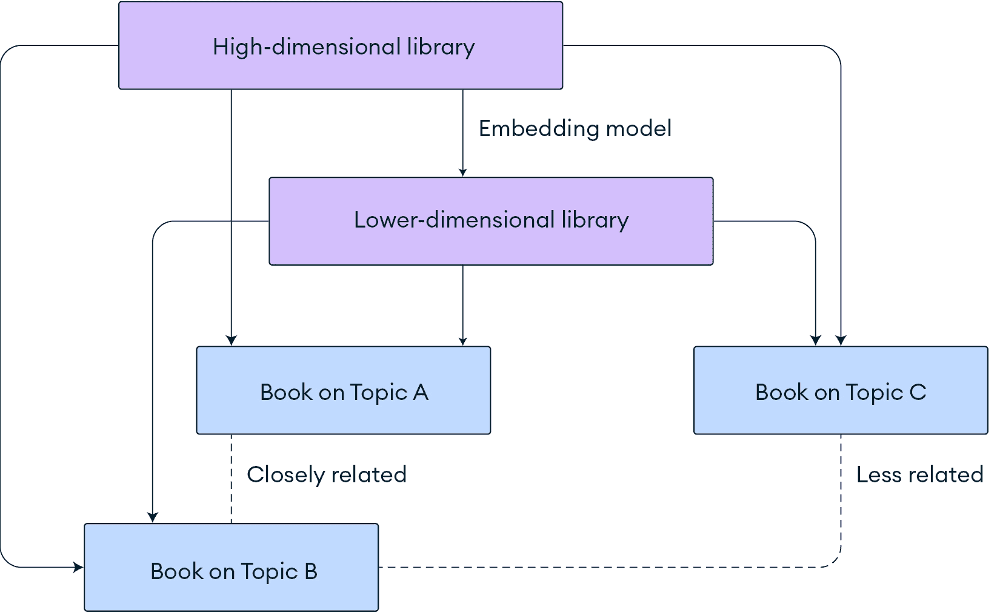
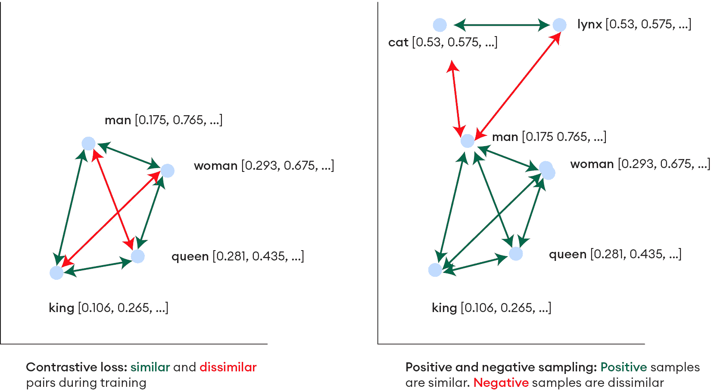
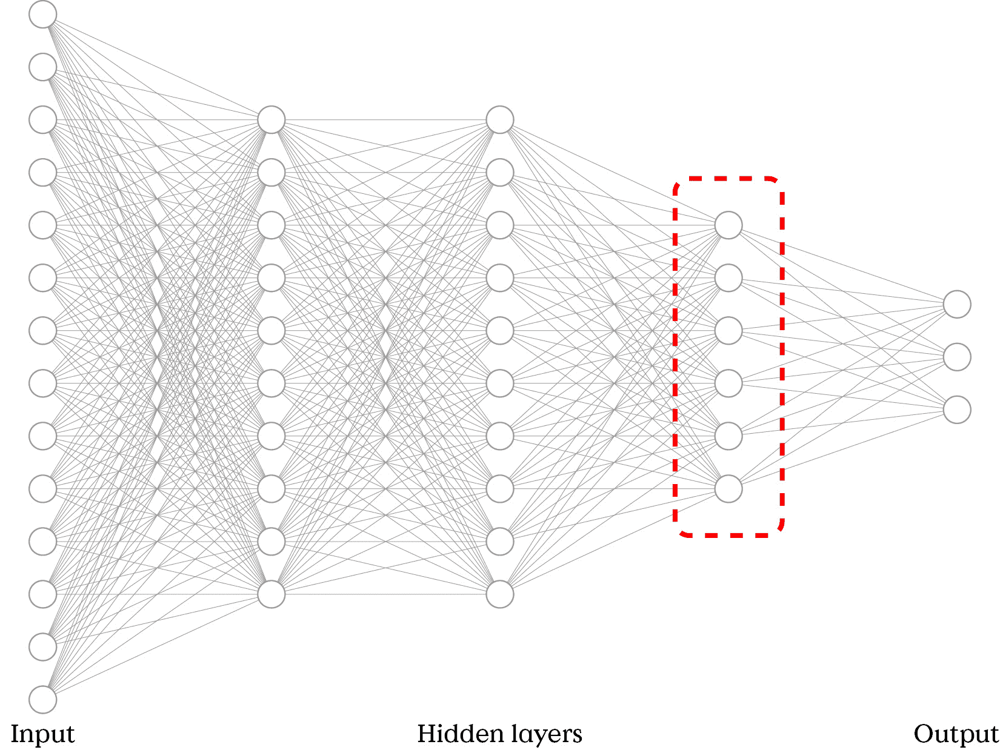
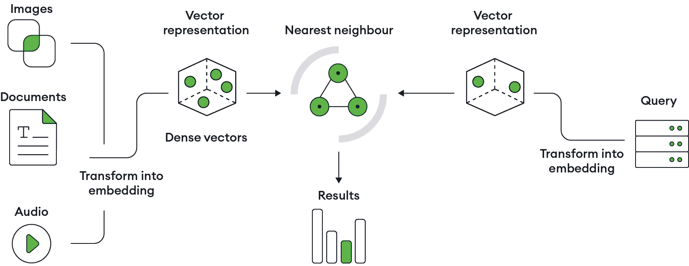

# 4

# 嵌入模型

**嵌入模型**是强大的机器学习技术，它将高维数据简化为低维空间，同时保留基本特征。在**自然语言处理**（**NLP**）中至关重要，它们将稀疏的词表示转换为密集的向量，捕捉词语之间的语义相似性。嵌入模型还可以处理图像、音频、视频和结构化数据，增强推荐系统、异常检测和聚类等应用。

这里是一个嵌入模型实际应用的例子。假设数据库中电影的完整情节已经使用 OpenAI 的 `text-embedding-ada-002` 嵌入模型预先嵌入。您的目标是找到所有与《银河护卫队》相关的电影和动画，但不是通过传统的音韵或词汇匹配（您会输入标题中的某些单词）。相反，您将通过语义方式进行搜索，例如，短语“尴尬的太空防御队”。然后，您将再次使用相同的嵌入模型来嵌入这个短语并查询嵌入的电影情节。*表 4.1* 展示了结果的嵌入片段：

| **维度** | **值** |
| --- | --- |
| 1 | 0.00262913 |
| 2 | 0.031449784 |
| 3 | 0.0020321296 |
| ... | ... |
| 1535 | -0.01821267 |
| 1536 | 0.0014683881 |

表 4.1：嵌入摘录

本章将帮助您深入了解嵌入模型。您还将使用 Python 语言和 `langchain-openai` 库实现一个示例。

本章将涵盖以下主题：

+   区分嵌入模型和 LLM

+   嵌入模型的类型

+   如何选择嵌入模型

+   向量表示

# 技术要求

要跟随本章中的示例，您需要以下先决条件：

+   一个 MongoDB Atlas 集群。一个 `M0` 免费集群应该足够了，因为您将存储一小组文档并仅创建一个向量索引。

+   一个 OpenAI 账户和 API 密钥，可以访问 `text-embedding-3-large` 模型。

+   一个 Python 3 工作环境。

您还需要安装 MongoDB、LangChain 和 OpenAI 的 Python 库。您可以在 Python 3 环境中按照以下步骤安装这些库：

```py
%pip3 install --upgrade --quiet pymongo pythondns langchain langchain-community langchain-mongodb langchain-openai 
```

要成功执行本章中的示例，您需要在 MongoDB Atlas 集群上创建一个 MongoDB Atlas 向量索引。索引名称必须是 `text_vector_index`，在 `embeddings.text` 集合上创建，如下所示：

```py
{
  "fields": [
    {
      "numDimensions": 1024,
      "path": "embedding",
      "similarity": "cosine",
      "type": "vector"
    }
  ]
}
```

# 嵌入模型是什么？

嵌入模型是机器学习和人工智能中用于简化大型和复杂数据的工具类型，将数据简化为更易于管理的形式。这个过程称为**嵌入**，涉及减少数据的维度。

想象一下从包含高速公路、铁路、河流、小径等详细的世界地图，转换到一个只有国家边界和首都的简化、总结版本。这不仅使计算更快、资源消耗更少，还有助于识别和理解数据中的关系。由于嵌入模型简化了大数据集的处理和分析，它们在语言（文本）处理、图像和声音识别以及推荐系统等领域特别有用。

考虑一个庞大的图书馆，其中每本书代表高维空间中的一个点。嵌入模型可以帮助重新组织图书馆，以改善导航的便捷性，例如通过将相关主题的书籍聚集在一起并减少图书馆的整体规模。*图4.1*展示了这一概念：



图4.1：用于图书馆用例的嵌入模型示例

这种从高维或原始表示到低维表示的转换或降低，为自然语言处理（NLP）、计算机视觉等领域的发展奠定了基础。

## 嵌入模型与LLMs有何不同？

嵌入模型是专门算法，可以将高维数据（如文本、图像或声音）降低到密集向量的低维空间。另一方面，LLMs是预先在庞大的文本语料库上训练的有效人工神经网络。

虽然两者都基于神经网络，但它们采用了不同的方法。大型语言模型（LLMs）旨在生成连贯且与上下文相关的文本。LLMs利用大量数据来理解和预测语言模式。它们的基本构建块包括变换器架构、注意力机制以及大规模预训练后进行微调。

相比之下，嵌入模型专注于将单词、短语甚至整个句子映射到密集的向量空间中，其中语义关系得到保留。它们通常使用诸如**对比损失**等技术，这些技术有助于在训练期间区分相似和不同的成对项。正负样本采样是嵌入模型采用的另一种技术。**正样本**是相似项（如同义词或相关句子），而**负样本**是不相似项（如无关的单词或句子）。*图4.2*展示了在二维空间中对比损失和正负样本采样的一个示例。这种采样有助于模型通过最小化正样本对之间的距离并最大化负样本对之间的距离在向量空间中学习有意义的表示。



图4.2：对比损失和正负样本采样的二维可视化

总结来说，虽然 LLMs 在语言生成任务上表现出色，但嵌入模型优化于捕捉和利用语义相似性。两者都通过使机器更有效地理解和生成人类语言来增强自然语言处理（NLP）。现在，让我们看看每个的例子。

**Word2vec**（由 Google 开发）将单词转换为向量，并辨别语义关系，例如“king”对“man”就像“queen”对“woman”。它在情感分析、翻译和内容推荐方面很有用，增强了机器的自然语言理解。

**GPT-4**（由 OpenAI 开发）是一种 LLM，其特点是根据接收到的输入生成类似人类的文本。GPT-4 在一系列基于语言的任务上表现出色，包括对话、内容生成、摘要和翻译。其架构允许它理解语言的复杂细节和细微差别，使其能够执行需要深入理解上下文、幽默、讽刺和文化引用的任务。

## 何时使用嵌入模型与 LLMs

嵌入模型用于那些旨在捕捉和利用数据内部关系的场景。它们是以下任务的理想选择：

+   **语义相似性**：找到或推荐与给定项目类似的项目（如文档或产品）。

+   **聚类**：根据实体的语义属性进行分组。

+   **信息检索**：通过理解查询的语义内容来增强搜索功能。

LLMs 是处理需要文本理解、生成或两者兼备的任务的首选，例如以下任务：

+   **内容创作**：生成连贯、上下文相关且风格适当的文本。例如，从一部电影的完整剧情中生成摘要。

+   **对话式人工智能**：构建能够理解和参与类似人类对话的聊天机器人和虚拟助手，例如回答有关就业政策和员工福利的问题。

+   **语言翻译**：在语言多样化的数据集上进行广泛训练，使得大型语言模型（LLMs）能够处理惯用语、文化细微差别和专门术语。

嵌入模型和 LLMs 都在人工智能中扮演着至关重要的角色。嵌入模型紧凑地捕捉和操作语义属性，而 LLMs 在生成和解释文本方面表现出色。使用两者，并根据您的目标选择合适的嵌入模型，可以释放您项目中人工智能的完整潜力。

## 嵌入模型类型

单词级模型，包括 **全局单词表示向量**（**GloVe**）和 **从 Transformer 获取的双向编码器表示**（**BERT**），捕捉更广泛的文本意义。专门模型如 **fastText** 适应语言挑战。所有这些都反映了嵌入模型不断发展的格局。

在本节中，您将探索许多类型的嵌入模型：单词、句子、文档、上下文、专门化、非文本和多模态。

### 单词嵌入

`n` 个相邻符号按特定顺序排列），这有助于更好地处理前缀、后缀和罕见词语。Word2vec 和 GloVe 是这些模型的例子。

**Word2vec** 是嵌入模型首次尝试根据词语的上下文相似性将词语表示为向量的方法。由谷歌团队开发，它使用两种架构：**连续词袋模型**（**CBOW**），它根据上下文预测一个词语，以及**跳字模型**，它根据一个词语预测上下文。Word2vec 已被证明能够捕捉词语的句法关系，这体现在它能够从与词语向量进行的算术运算中推断出意义。

**GloVe**，由斯坦福大学开发，结合了两种领先的词语表示方法的优点：全局矩阵分解与共现统计和上下文窗口方法。通过从语料库构建共现矩阵并应用降维技术，GloVe 捕捉了全局统计和局部上下文，这对于需要深入理解词语关系的任务来说是无价的。

### 句子和文档嵌入

**句子和文档嵌入模型**通过考虑词语上下文和排列来捕捉文本块的整体语义意义。一种常见的方法是将词语向量聚合为一个连贯的向量，用于整个文本单元。这些模型在文档相似性、信息检索和文本摘要（如摘要与完整电影剧情）等方面非常有用。显著的模型包括 Doc2vec 和 BERT。

基于 Word2vec，**Doc2vec**（也称为**段落向量**），将整个句子或文档封装为向量。引入一个文档 ID 标记，允许模型在词语嵌入的同时学习文档级别的嵌入，这在文档分类和相似性比较等任务中起到了显著的帮助作用。

谷歌的 **BERT** 采用上下文感知嵌入，同时读取整个单词序列，与先前的线性处理文本的前辈不同。这种方法使得 BERT 能够从所有周围词语中理解一个词语的上下文，从而产生更动态和细微的嵌入，并在各种自然语言处理任务中设定了新的标准。

### 上下文嵌入

**上下文嵌入模型**旨在生成根据句子中使用的上下文而变化的词向量。这些模型通过检查整个句子，有时是周围的句子，使用深度学习架构。上下文模型产生动态嵌入，根据单词的特定上下文和语言环境捕捉细微差别。这种类型的模型架构使用双向框架来处理文本的前向和反向，从而捕捉前后的上下文中的精细语义和句法依赖关系。它们在情感分析（如解释IT支持票中的文本语气）和需要精确解释单词意义的问答任务中很有用。ELMo和GPT是两个例子。

**语言模型嵌入（ELMo**）引入了动态、上下文相关的嵌入，根据单词的语言环境产生可变的嵌入。这种方法通过提供更丰富的语言理解，大大提高了下游NLP任务的性能。

OpenAI的**GPT系列**利用转换器技术，在大量文本语料库上预训练嵌入，并针对特定任务进行微调。GPT的成功强调了将大规模语言模型与转换器架构相结合在自然语言处理中的有效性。

### 专用嵌入

**专用嵌入模型**能够捕捉特定语言属性，例如地点、人物、语气和情绪，在向量空间中。有些是针对特定语言或方言的，而有些则分析情感和情感维度。应用包括法律文件分析、支持票务分类、市场营销中的情感分析和多语言内容管理。

**fastText**是专用嵌入模型的一个例子。由Facebook的人工智能研究实验室开发，fastText通过将单词视为字符n-gram的包来增强Word2vec，这对于处理**词汇表外（OOV**）单词特别有帮助。OOV单词是在训练期间没有看到的单词，因此缺乏预学习的向量表示，这对传统模型构成了挑战。fastText通过其子词嵌入的总和来实现OOV单词的嵌入。这使得它特别适合处理罕见单词和形态学复杂的语言，这些语言具有丰富和多样的词结构，使用大量的前缀、后缀和屈折变化来传达不同的语法意义，例如芬兰语、土耳其语和阿拉伯语。

### 其他非文本嵌入模型

嵌入模型不仅限于将文本转换为向量表示。图像、音频、视频，甚至JSON数据本身都可以以向量形式表示：

+   **图像**：例如**视觉几何组**（**VGG**）和**残差网络**（**ResNet**）等模型为将原始图像转换为密集向量设定了基准。这些模型捕捉了重要的视觉特征，如边缘、纹理和颜色梯度，这些特征对于许多计算机视觉任务至关重要，包括图像分类和物体识别。VGG在识别视觉模式方面表现良好，而ResNet在复杂的图像处理任务中提高了准确性，例如图像分割或照片标记。

+   **音频**：OpenL3和VGGish是音频模型。**OpenL3**是一个从L3-Net架构中改编的模型，用于音频事件检测和环境声音分类，将音频嵌入到时间和频谱上下文丰富的空间中。**VGGish**源于图像的VGG架构，因此遵循将声波转换为小型、紧凑向量模式的相同原则。这简化了诸如语音和音乐类型识别等任务。

+   **视频**：**3D卷积神经网络**（**3D CNNs**或**3D ConvNets**）和**膨胀3D**（**I3D**）扩展了图像嵌入在感知动作识别和视频内容分析中至关重要的时间动态的能力。3D ConvNets在三维（高度、宽度、时间）上应用卷积滤波器，捕捉体积数据中的空间和时间依赖性，使它们特别适用于时空数据，如视频分析、医学成像和3D物体识别。I3D使用时空架构，结合两个3D ConvNets的输出：一个处理RGB帧，而另一个处理连续帧之间的光流预测。I3D模型对于体育分析和监控系统很有用。

+   **图数据**：Node2vec和DeepWalk捕捉图中节点的连接模式，并应用于社交网络分析、欺诈检测和推荐系统等领域。**Node2vec**通过在图上执行有偏随机游走来学习节点的连续向量表示，这捕捉了多样的节点关系和社区结构，从而提高了节点分类和链接预测等任务的性能。**DeepWalk**将随机游走视为节点序列，类似于自然语言处理中的句子，通过捕捉节点之间的结构关系并将它们编码为连续向量表示，这些表示可用于节点分类和聚类。

+   **JSON数据**：甚至有JSON数据嵌入模型，例如**Tree-LSTM**，这是一种传统的**长短期记忆**（**LSTM**）网络的变体，专门用于处理具有层次树结构的JSON等数据。与按顺序处理数据的标准LSTM单元不同，Tree-LSTM通过将多个子节点的状态合并到父节点中，在树结构数据上操作，有效地捕捉嵌套结构中的依赖关系。这使得它特别适合语义解析和情感分析等任务，在这些任务中，理解数据中的层次关系可以显著提高性能。**json2vec**是这种嵌入模型的一种实现。

在单模态模型之后，你可以探索多模态模型。这些模型能够同时分析多种数据类型，对于自动驾驶等应用至关重要，在这些应用中，从传感器、摄像头和激光雷达中合并数据可以构建对驾驶环境的全面视图。

### 多模态模型

**多模态嵌入模型**处理和整合来自多种数据源的信息到一个统一的嵌入空间。当不同模态相互补充或加强，并共同导致更好的AI应用时，这种方法非常有用。多模态模型非常适合深入理解多感官输入内容，例如多媒体搜索引擎、自动内容审核和可以通过视觉和语言交互吸引用户的交互式AI系统。以下是一些例子：

+   **CLIP**：OpenAI的一个知名多模态模型。它学习如何将视觉图像与文本描述相关联，以便在训练期间根据自然语言查询识别它从未见过的图像。

+   **LXMERT**：一个专注于处理视觉和文本输入的模型。它可以提高包括目标检测在内的视觉问答等任务的性能。

+   **ViLBERT**：**视觉和语言BERT**（**ViLBERT**）通过使用双流模型扩展了BERT架构，该模型能够同时处理视觉和文本输入。其中一个流使用预训练的**卷积神经网络**（**CNN**或**ConvNet**）从图像中提取视觉特征，另一个流使用交叉注意力层处理文本数据，促进两种模态之间的交互。ViLBERT用于视觉问答和视觉常识推理等任务，在这些任务中，理解图像和文本之间的关系至关重要。

+   **VisualBERT**：通过结合图像特征和来自类似BERT架构的上下文化词嵌入来整合视觉和文本信息。它通常用于图像-文本检索和图像字幕等任务，在这些任务中，对视觉和文本信息的对齐和理解至关重要。

你现在已经探索了单词、图像和多模态嵌入。接下来，你将学习如何根据应用程序的需求选择嵌入模型。

# 选择嵌入模型

嵌入模型影响应用程序的性能、理解语言和其他形式数据的能力，以及最终项目的成功。以下几节将探讨选择与任务需求、数据集特征和计算资源相匹配的正确嵌入模型的参数。本节解释了向量维度和模型排行榜，作为选择嵌入模型时需要考虑的附加信息。为了快速了解本节内容，你可以参考*表 4.2*。

## 任务需求

根据它们处理和表示文本数据的方式，每种任务可能从不同的嵌入模型中受益。例如，文本分类和情感分析等任务通常需要深入理解单词层面的语义关系。在这种情况下，Word2vec 或 GloVe 特别有益，因为它们提供了强大的单词级嵌入，能够捕捉语义含义。

对于更复杂的语言任务，如**命名实体识别**（NER）和**词性标注**（POS），理解单词使用的上下文的能力变得至关重要。在这里，BERT 或 ELMo 等模型显示出它们的优势，因为它们根据周围的文本动态生成嵌入，提供了对每个单词在句子中角色的更丰富和更精确的理解。这种深层次的上下文意识对于准确识别实体和标注词性至关重要，因为它允许模型根据其用法区分具有多个含义的单词。

如 BERT、GPT 和 Doc2vec 这样的高级模型非常适合需要细微语言理解的任务，如问答、机器翻译、文档相似性和聚类。这些模型处理文本中的复杂依赖关系，使它们适合分析整个文档。Doc2vec 在比较文档之间的主题相似性方面表现出色，例如找到相似的新闻或体育文章。

## 数据集特征

在选择嵌入模型时，请考虑数据集的大小和特征。对于形态丰富的语言或包含许多未知单词的数据集，如 fastText 这样的模型具有优势，因为它们能够捕捉子词信息，有效地处理新词或罕见词。对于含有多义词（具有多个含义的词）的文本，如 ELMo 或 BERT 这样的上下文嵌入至关重要，因为它们提供动态的、特定于上下文的表现形式。

数据集的大小影响嵌入模型的选择。大型数据集从复杂模型中受益，如BERT、GPT和OpenAI的`text-embedding-3-large`，这些模型能够捕捉深层次的语用细微差别，但需要大量的计算能力。小型数据集可能从简单模型中受益，如`text-embedding-3-small`，提供稳健的性能，同时计算需求较低。这确保了即使是小型数据集也能通过适当的模型获得重要的见解。

## 计算资源

由于资源需求不同，计算成本在选择嵌入模型时至关重要。像GPT-4这样的大型模型需要大量的计算能力，这使得它们对预算有限的小型组织或项目来说不太容易获得。

选择轻量级模型或针对特定任务进行微调可以减少计算需求，加快开发速度，并提高响应时间。高效模型对于实时任务至关重要，如翻译、语音识别以及游戏、媒体流和电子商务中的即时推荐。

一定程度的迭代实验有助于确定最合适的模型。关注最新发展至关重要，因为新模型经常取代旧模型。模型排行榜可以帮助跟踪该领域的进展，将在本节后面进行介绍。

## 向量表示

嵌入模型中向量的尺寸影响其捕捉数据复杂性的能力。大向量编码更多信息，允许更精细的区分，但需要更多的计算。小向量更高效，但可能会错过细微的差别。选择向量大小需要平衡详细表示与实际约束，如内存和速度。

### 向量维度为什么很重要？

了解向量、其尺寸和神经网络倒数第二层之间的关系对于理解模型输出的质量至关重要。倒数第二层或第二层通常作为特征提取器，其中输出向量的维度代表输入数据学习到的特征，如图*图4**.3*所示。这个向量的尺寸直接影响表示的粒度。



图4.3：神经网络的最后一层

为了获得这些向量，神经网络输出层（最后一层）被移除，并捕获前一层的输出——倒数第二层或第二层。通常，最后一层输出模型的预测，这促使使用其前一层的输出。输入到网络预测层的这些数据被称为**向量嵌入**。

向量嵌入的维度与所使用模型的底层神经网络的倒数第二层的大小相匹配，使其与向量的尺寸或长度同义。例如，384（由SBERT的`all-MiniLM-L6-v2`提供），768（由SBERT的`all-mpnet-base-v2`提供），1,536（由OpenAI的`text-embedding-ada-002`提供），以及2,048（由微软研究机构的ResNet-50提供）是常见的维度。现在，更大的向量也变得可用，例如OpenAI的`text-embedding-3-large`提供的3,072。

### 向量嵌入是什么意思，它通常是如何被使用的？

向量嵌入是嵌入模型的输出，表示为浮点数数组，通常范围从-1.0到+1.0。数组中的每个位置代表一个维度。

向量嵌入在上下文检索用例中扮演着关键角色，例如聊天机器人的语义搜索。数据预先嵌入并存储在向量数据库中，查询必须使用相同的嵌入模型才能获得准确的结果。每个嵌入模型根据其训练数据产生独特的嵌入，这使得它们特定于模型的领域，不可互换。例如，从训练在法律全文上的模型获得的嵌入将与训练在患者病史上的医疗数据模型获得的嵌入不同。

你可能还记得本章开头尝试为*银河护卫队*寻找电影的例子。你现在应该明白为什么你不得不使用相同的嵌入模型来嵌入搜索字符串（也称为查询向量）。这种在AI应用中常见的流程，在*图4.4*中得到了解释。4*：



图4.4：将源数据嵌入向量存储和查询向量的典型数据流

工作流程显示了两次“转换为嵌入”步骤：一次是将现有数据嵌入到向量数据库中（在左侧），另一次是实时嵌入查询（在右侧）。这两个步骤都必须使用相同的嵌入模型。

## 嵌入模型排行榜

面对如此众多的现有模型和不断涌现的新模型，你如何保持更新？**嵌入模型排行榜**，如Hugging Face等平台提供的，有助于评估各种模型在众多任务中的性能。它们基于准确性、效率等标准提供透明且具有竞争力的模型排名。通过将模型与标准数据集和基准任务进行比较，这些排行榜可以精确地指出最先进的模型及其权衡。

Hugging Face的**大规模文本嵌入基准**（**MTEB**）排行榜是一个关键资源。它提供了文本嵌入模型性能基准的全面概述。要查看哪些模型正在设定标准，请访问Hugging Face MTEB排行榜：[https://huggingface.co/spaces/mteb/leaderboard](https://huggingface.co/spaces/mteb/leaderboard)。

在选择您的 AI/ML 应用架构组件时，您还可以参考其他排行榜。Hugging Face 托管了 Open LLM 排行榜（[https://huggingface.co/spaces/open-llm-leaderboard/open_llm_leaderboard](https://huggingface.co/spaces/open-llm-leaderboard/open_llm_leaderboard)）以及特定语言的排行榜，例如 Open 葡萄牙 LLM 排行榜、Open Ko-LLM 排行榜（韩语）和西班牙嵌入排行榜。甚至还有行业特定的排行榜，例如 Open 医疗-LLM 排行榜。

## 嵌入模型概述

*表 4.2* 提供了本章中涵盖的一些嵌入模型的快速概述，重点关注其质量和易用性。每个模型的描述都包括基于下游任务中的准确性、语义表示的丰富性、易用性、文档质量以及计算需求等因素的嵌入质量。

| **嵌入模型** | **嵌入质量** **和易用性** |
| --- | --- |
| Word2vec | 高质量、上下文丰富的嵌入。可在 TensorFlow 等平台上使用，但在线上可用性有限。 |
| GloVe | 强健的嵌入，尤其是对于不常用词汇。可在 TensorFlow 等平台上使用，但在线上可用性有限。 |
| BERT | 丰富且适应性强的上下文嵌入。可在网上找到。 |
| GPT | 在生成和语言理解任务中表现出色的优质嵌入。可在网上找到。 |
| Doc2vec | 适用于文档级任务；嵌入反映了比词级模型更广泛的上下文。 |
| fastText | 有效地捕捉 OOV（Out-of-Vocabulary）词汇。开源且非常轻量级。在标准硬件上运行，可以生成足够小的模型，适用于移动设备。 |
| `text-embedding-3-large` | 适用于复杂 NLP 任务的优质嵌入，能够捕捉细微的上下文。取代了 OpenAI 的 `text-embedding-ada-002`。在保持高嵌入质量的同时，可以生成更小的向量。 |
| `text-embedding-3-small` | 适用于标准 NLP 任务的优质嵌入，平衡性能和计算需求。 |

表 4.2：各种嵌入模型中的嵌入质量和易用性

虽然这个比较应该作为选择最适合特定需求的嵌入模型的指南，但鉴于该领域快速发展的态势，应始终参考之前提到的 MTEB 排行榜以及在线文档。

## 你是否总是需要一个嵌入模型？

不，你并不总是需要一个嵌入模型。并非所有情况都需要嵌入模型的复杂细节来以所需的向量形式表示数据。对于某些应用，更直接的向量化方法就足够了。

在某些情况下，复杂的公共嵌入模型或定制模型是不必要的。那些具有狭窄焦点、明确规则或结构化数据的任务可以在简单的向量表示上蓬勃发展。这种方法适用于简单的聚类、精确的相似度测量以及计算能力有限的场合。

例如，**独热编码**是一种简单技术，将分类数据转换为二进制向量，非常适合那些类别是名义的且没有内在顺序的情况。同样，**词频-逆文档频率**（**TF-IDF**）向量巧妙地传达了文本的重要性，通过突出显示文档中术语与整个语料库的相关性来用于信息检索和排名任务。

这些替代方案可能缺乏嵌入模型的语义深度，但为那些不需要复杂上下文的任务提供了计算效率和简单性。选择简单的向量表示增强了透明度，减少了计算需求或高级科学技能，并且对于快速性能或资源受限的环境（如嵌入式系统或移动设备）来说非常理想。

在你建立了嵌入模型的理解之后，你现在可以继续使用Python、LangChain、MongoDB Atlas和OpenAI进行实际演示。

## 执行LangChain中的代码

现在你已经探索了各种嵌入模型类型，你将看到使用它们的工作代码是什么样的。以下Python脚本（命名为`semantic_search.py`）使用`langchain-openai`库，结合OpenAI的`text-embedding-3-large`模型嵌入文本数据，该模型定制为产生1,024维向量而不是3,072维：

```py
import os, pprint, time
from langchain_mongodb import MongoDBAtlasVectorSearch
from langchain_openai import OpenAIEmbeddings
from pymongo import MongoClient

os.environ["OPENAI_API_KEY"] = "YOUR-OPENAI-API-KEY"
MONGODB_ATLAS_CONNECTION_STRING = "YOUR-MONGODB_ATLAS-CONNSTRING"
client = MongoClient(MONGODB_ATLAS_CONNECTION_STRING, tls=True, tlsAllowInvalidCertificates=True)

db_name = "embeddings"
collection_name = "text"
coll = client[db_name][collection_name]
vector_search_index = "text_vector_index"

coll.delete_many({})

texts = []
texts.append("A martial artist agrees to spy on a reclusive crime lord using his invitation to a tournament there as cover.")
texts.append("A group of intergalactic criminals are forced to work together to stop a fanatical warrior from taking control of the universe.")
texts.append("When a boy wishes to be big at a magic wish machine, he wakes up the next morning and finds himself in an adult body.")
embedding_model = OpenAIEmbeddings(
    model="text-embedding-3-large", 
    dimensions=1024,
    disallowed_special=()
)

embeddings = embedding_model.embed_documents(texts)

docs = []
for i in range(len(texts)):
    docs.append(
        {
            "text": texts[i], 
            "embedding": embeddings[i]
        }
    )

coll.insert_many(docs)
print("Documents embedded and inserted successfully.")

time.sleep(3) # allow vector store (Atlas) to undergo indexing

semantic_queries = []
semantic_queries.append("Secret agent captures underworld boss.")
semantic_queries.append("Awkward team of space defenders.")
semantic_queries.append("A magical tale of growing up.")

vector_search = MongoDBAtlasVectorSearch(
    collection= coll,
    embedding= OpenAIEmbeddings(
      model="text-embedding-3-large", 
      dimensions=1024,
      disallowed_special=()),
    index_name= vector_search_index
)

for q in semantic_queries:
    results = vector_search.similarity_search_with_score(
        query = q, 
        k = 3
    )
    print("SEMANTIC QUERY: " + q)
    print("RANKED RESULTS: ")
    pprint.pprint(results)
    print("")
```

控制台输出将如下所示：

```py
(myenv) % python3 semantic_search.py
0
1
2
Documents embedded and inserted successfully.
SEMANTIC QUERY: Secret agent captures underworld boss.
RANKED RESULTS:
[(Document(metadata={'_id': '66aada5537ef2109b3058ccb'}, page_content='A martial artist agrees to spy on a reclusive crime lord using his invitation to a tournament there as cover.'),
  0.770392894744873),
(Document(metadata={'_id': '66aada5537ef2109b3058ccc'}, page_content='A group of intergalactic criminals are forced to work together to stop a fanatical warrior from taking control of the universe.'),
  0.6555435657501221),
(Document(metadata={'_id': '66aada5537ef2109b3058ccd'}, page_content='When a boy wishes to be big at a magic wish machine, he wakes up the next morning and finds himself in an adult body.'),
  0.5847723484039307)]

SEMANTIC QUERY: Awkward team of space defenders.
RANKED RESULTS:
[(Document(metadata={'_id': '66aada5537ef2109b3058ccc'}, page_content='A group of intergalactic criminals are forced to work together to stop a fanatical warrior from taking control of the universe.'),
  0.7871642112731934),
(Document(metadata={'_id': '66aada5537ef2109b3058ccb'}, page_content='A martial artist agrees to spy on a reclusive crime lord using his invitation to a tournament there as cover.'),
  0.6236412525177002),
(Document(metadata={'_id': '66aada5537ef2109b3058ccd'}, page_content='When a boy wishes to be big at a magic wish machine, he wakes up the next morning and finds himself in an adult body.'),
  0.5492569208145142)]

SEMANTIC QUERY: A magical tale of growing up.
RANKED RESULTS:
[(Document(metadata={'_id': '66aada5537ef2109b3058ccd'}, page_content='When a boy wishes to be big at a magic wish machine, he wakes up the next morning and finds himself in an adult body.'),
  0.7488957047462463),
(Document(metadata={'_id': '66aada5537ef2109b3058ccb'}, page_content='A martial artist agrees to spy on a reclusive crime lord using his invitation to a tournament there as cover.'),
  0.5904781222343445),
(Document(metadata={'_id': '66aada5537ef2109b3058ccc'}, page_content='A group of intergalactic criminals are forced to work together to stop a fanatical warrior from taking control of the universe.'),
  0.5809941291809082)]
```

示例设置了环境，使用API密钥对OpenAI进行身份验证，并连接到MongoDB Atlas。然后嵌入并存储在MongoDB Atlas（向量存储）中的三个电影的图，然后执行不同的向量搜索以展示具有排序结果的语义搜索。

# 最佳实践

选择最合适的嵌入模型和向量大小不仅是一个技术决策，而且是一个战略决策，它符合你项目的独特特征、技术和组织约束以及目标。

维护计算效率和成本是有效使用嵌入模型的另一个基石。由于某些模型可能资源密集，响应时间更长，成本更高，因此优化计算方面而不牺牲输出质量是至关重要的。根据手头的任务设计系统以使用不同的嵌入模型将产生更健壮的应用程序架构。

定期评估您的嵌入模型至关重要，以确保您的AI/ML应用持续按预期表现。这包括定期检查性能指标并进行必要的调整。调整模型使用可能意味着改变向量大小以避免**过拟合**——即模型对训练数据过于精细调整，在未见过的数据上表现不佳。

监控向量搜索响应时间与所使用的嵌入模型和向量大小至关重要，因为这些会影响AI驱动应用的用户体验。同时考虑维护和更新嵌入模型的成本，包括重新嵌入数据的货币、时间和资源费用。为这些计划有助于在需要更新时做出明智的决定，并平衡性能、成本效益和技术进步。

# 摘要

本章涵盖了嵌入模型领域，这些模型是AI/ML应用中的基本工具。它们促进了将高维数据转换为更易于管理的低维空间。这个过程称为嵌入，显著提高了计算效率，并增强了描述和量化数据中关系的能力。为不同类型的数据选择合适的嵌入模型，如文本、音频、视频、图像和结构化数据，对于扩展用例和工作负载至关重要。

本章还强调了咨询排行榜以评估大量可用模型的有效性以及选择向量大小时所需的微妙平衡的重要性，强调了在细节、效率、性能和成本之间的权衡。虽然嵌入模型提供深入、情境化的洞察，但简单的向量化方法可能适用于某些任务。

下一章将深入探讨向量数据库的方面，检查向量搜索在AI/ML应用中的作用，并使用案例研究。
