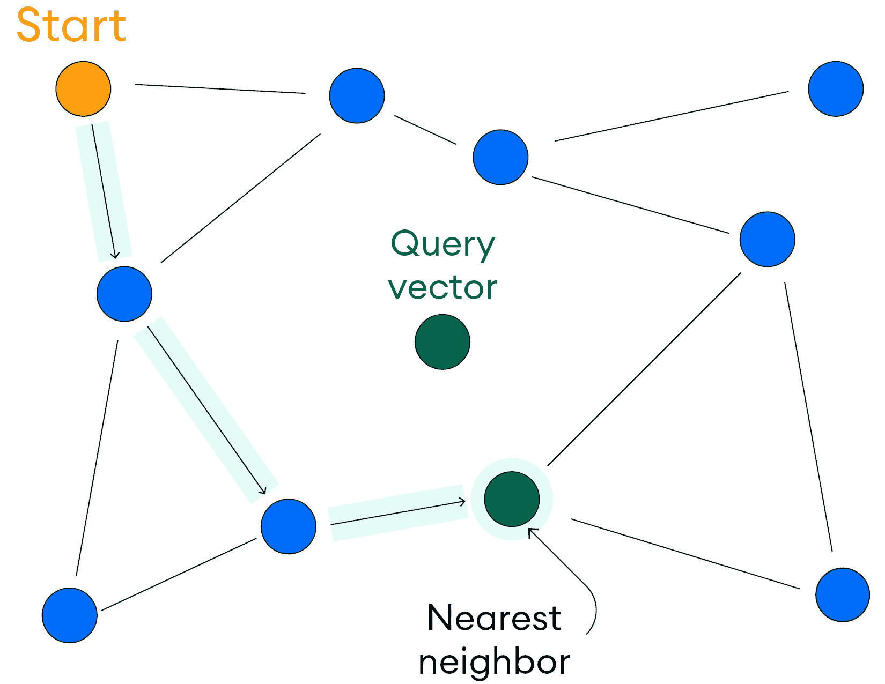
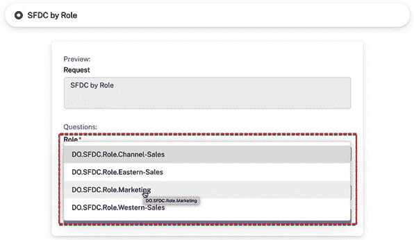
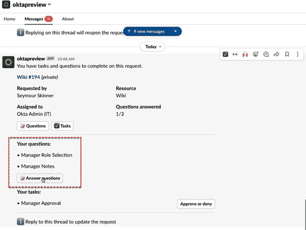
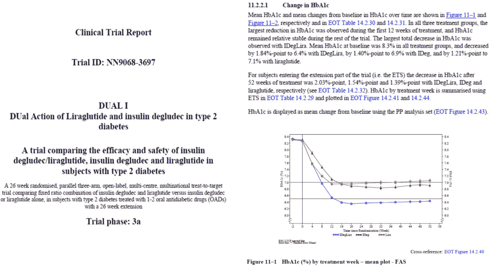
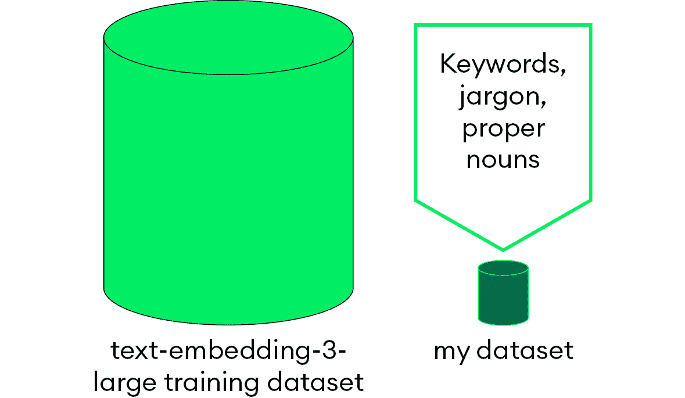

# 第五章：向量数据库

有时，数据信息丰富且结构明确。如果你知道你需要什么，那么在现代数据库系统中处理这些数据就很简单。然而，你通常不知道确切需要什么。没有特定的搜索词或短语，你可能不会收到最佳搜索结果。例如，你可能不知道你挑剔的宠物最喜欢的食物的品牌或名称。在这种情况下，传统的信息搜索和检索方法可能无法满足需求。

现代AI研究催生了一类新的方法，可以编码某物背后的语义含义，而不仅仅是其原始数据。例如，AI模型可以理解，当你要求“那个演员也出演了带有绿色下落数字的电影的新动作片”时，你是在询问最新的*约翰·威克*电影，该片由基努·里维斯主演，他也是*黑客帝国*系列电影的主角。

为了实现这一结果，这些方法将它们的输入转换为一种称为**向量嵌入**的数值格式。**向量数据库**提供了一种有效存储、组织和搜索这些向量表示的方法。这使得向量数据库成为检索任务的宝贵工具，这在AI应用中很常见。在本章中，你将了解向量搜索、与之相关的关键概念和算法，以及向量数据库的重要性。到本章结束时，你将理解图连接性的工作原理及其在RAG等架构模式中的应用。你还将了解构建向量搜索系统的最佳实践。

本章将涵盖以下主题：

+   向量嵌入和相似度

+   最近邻向量搜索

+   向量数据库的需求

+   案例研究和实际应用

+   向量搜索最佳实践

# 技术要求

虽然不是必需的，但了解图数据结构和操作可能会有所帮助。你可能还想知道用于创建向量的嵌入模型，这些模型在[*第4章*](B22495_04.xhtml#_idTextAnchor061)“嵌入模型”中进行了更详细的讨论。

# 什么是向量嵌入？

在最基本层面上，一个**向量**是一系列数字加上一个隐含的结构，该结构决定了这些数字的定义方式以及如何比较它们。向量中的元素数量是向量的维度。

`[年份, 品牌, 型号, 颜色, 行驶里程]`。这些属性组成一个`[2000, 本田, Accord,` `金色, 122000]`。

这是一个有用的模型，可以帮助您建立向量如何编码信息的直观理解。然而，每个元素并不总是对应于一个具有可数可能值的明确概念。在人工智能应用中使用的向量更加抽象，并且具有显著更多的维度。从某种意义上说，它们将具体概念分散到许多维度上，并将每个维度标准化为单一的可能值集合。例如，来自OpenAI的`text-embedding-ada-002`模型的向量总是有1,536个元素，每个元素是介于-1和1之间的浮点数。

在人工智能应用中使用的向量是**嵌入模型**的输出。这些是**机器学习**（**ML**）模型，它们经过预训练，可以将输入（通常是文本标记的字符串）转换为编码输入语义意义的向量。对于人类来说，这些向量的许多维度基本上是无法解读的。然而，嵌入模型在训练过程中为每个维度学习一个隐含的意义，并且可以可靠地为它的输入编码这种意义。

向量的具体结构在不同嵌入模型之间有所不同，但特定模型总是输出相同大小的向量。要使用向量，了解它是由哪个模型创建的是至关重要的。

## 向量相似度

除了存储高维向量数据外，向量数据库还支持各种操作，让您能够查询和搜索向量。

最常见的操作是**最近邻搜索**，它返回与输入查询向量最相似的存储向量的列表。常见的搜索界面是熟悉的领域。例如，电子商务搜索通常会优先显示与您的查询相关的产品，即使它们不是完全匹配。最近邻搜索利用嵌入模型向量的语义特性，使得找到*相似*向量与找到*相关*结果相同。

但两个向量相似意味着什么呢？简而言之，相似的向量彼此靠近，这可以通过距离来衡量。有许多定义**距离**的方法，包括一些在更高维度中变得更加相关的定义。对于高维向量，无法可视化距离如何工作，但对于小向量，这些想法是显而易见的，然后可以将其扩展。

如果您回想起几何课，您会记得您可以使用距离公式找到两个坐标向量之间的距离。例如，二维坐标（x, y）使用距离公式`distance(a, b) = sqrt((a_x - b_x)**2 + (a_y - b_y)**2)`。这也适用于三维坐标，其中公式有一个额外的维度分量：`sqrt((a_x - b_x)**2 + (a_y - b_y)**2 + (a_z - b_z)**2)`。这种模式可以推广到任何数量的维度，被称为两个*n*-维点之间的**欧几里得距离**。

理论上，你也可以使用欧几里得距离来测量用于人工智能应用的高维向量之间的距离。实际上，然而，随着维数的增加，欧几里得距离的有用性会降低。这种在小维度上工作良好而在高维度上失效的直觉和工具模式很常见，通常被称为**维度诅咒**。

与欧几里得距离不同，大多数应用使用一种称为**余弦相似度**的不同距离度量。与测量两个向量**尖端**之间空间的欧几里得距离不同，余弦相似度使用不同的公式来测量共享相同基的两个向量之间的角度大小。它有效地以数学精确的方式确定两个向量是否相同、完全不相关，或者（最可能的情况）在两者之间，如图 *图 5**.1* 所示。相似的向量几乎指向同一方向，不相关的向量是正交的，相反的向量指向相反的方向。


图 5.1：向量测量的比较

余弦相似度为你提供了一个测量两个向量之间距离的工具。由于向量嵌入携带语义信息的本质，它也是一个测量两个向量之间相关度或相关性的工具。如果你将这个想法扩展到更多的向量，你可以找出给定向量与任何其他向量的相关性，甚至可以根据相关性对所有向量进行排名。这是**向量搜索算法**背后的核心思想。

以这种方式比较许多向量会带来其自身的复杂性和挑战。为了应对这些挑战，搜索提供商已经开发了各种最近邻搜索方法，以平衡权衡并针对不同的用例进行优化。下一节将讨论两种处理实际搜索用例的方法。

## 精确搜索与近似搜索

有时候，你的用例需要搜索只返回真正的最近邻。例如，想象一个存储用户生物识别信息（作为嵌入向量）的认证应用，以便他们以后可以识别自己。当他们扫描指纹或面部时，应用会创建扫描数据的向量嵌入，并将其用作最近邻搜索中的查询向量。这样的应用绝不应该将用户误识别为具有相似指纹或面部的人。

这种用例非常适合**精确最近邻**（**ENN**）搜索，它保证了搜索结果是最佳可能的匹配。此类搜索必须始终返回最近的匹配存储向量，并确保它出现在其他相似但更远的匹配之前。

一种直接的方法是暴力解决问题：计算查询向量和每个存储向量的距离，然后返回一个按从近到远排序的结果列表。通过检查每个向量，你可以保证搜索结果精确地包含按顺序排列的最相关向量。虽然这种方法对小型数据集有效，但随着存储向量的数量增加，它很快就会变得计算成本高和时间消耗大。一些巧妙的方法可以帮助精确搜索扩展到更大的数据集，例如使用基于树的索引来避免为每个向量计算相似度。这使得精确搜索对某些额外的应用类型有用，但最终，这个问题扩展性不好，在大数据集上可能需要很长时间。在需要精确性的情况下，你必须接受其约束并找到绕过它们的方法。

对于其他常见情况，只要知道你的搜索结果足够接近以成为最佳匹配就足够了。这种用例被称为**近似最近邻**（**ANN**）搜索，并且对于许多日常应用来说足够强大。

例如，如果你在一个推荐应用中搜索“像《盗梦空间》一样的电影”，你不需要结果中包含特定的电影。相反，你可能只是想要一份包含几部类似科幻惊悚片，具有令人费解情节的电影列表。即使电影《星际穿越》在技术上比返回的结果更接近语义匹配，但像“《少数派报告》、《记忆碎片》、《禁闭岛》”这样的结果列表也是有用的。

精确搜索和近似搜索的选择取决于你的应用需求。你可能对精确搜索有严格的要求。然而，你可能也有一个用例，其中精确搜索虽然有用，但不是提供价值所必需的。或者，可能根本不需要进行精确搜索。在下一节中，你将学习如何评估搜索算法，以帮助你确定你的需求。

## 搜索度量

你可以用精确度、召回率和延迟来描述搜索算法：

+   **精确度**衡量搜索结果的准确性。精确搜索试图只返回与查询相关的匹配项，并且尽可能少地返回无关结果。

+   **召回率**衡量搜索结果的完整性。如果一个搜索返回了所有相关结果的大部分，那么它就有很高的召回率。

+   **延迟**衡量搜索查询从开始到结束所需的时间。每个搜索都需要一定的时间来返回结果。确切的延迟因搜索而异，但平均而言，它是搜索空间中向量的数量以及你的精确度和召回率要求的一个函数。

这些因素紧密相连，需要权衡，这定义了最近邻搜索的性质。例如，一个最近邻搜索（ENN）具有完美的精度，并将包括最相关的结果。然而，为了保持延迟合理，如果结果太多，它可能会省略一些相关的结果。因为它错过了有效结果，这种搜索的召回率相对较低。如果ENN搜索还需要高召回率，那么搜索就需要运行更长的时间以确保包括足够的相关结果。

在人工神经网络（ANN）搜索中，你可以放宽精度要求，这让你可以优化其他因素。你可以通过允许搜索花费更多时间或返回更多可能包含假阳性的结果来获得更完整的结果。例如，如果你可以容忍假阳性，比如在应用中搜索后过滤掉它们，那么你可以使用ANN来运行快速搜索，返回高度相关的结果集。

你应该评估你的应用并确定其对这些因素的最高优先级。然后，你可以选择合适的搜索操作并调整算法，直到其他因素得到适当的平衡。

**调整**搜索算法涉及修改确定其如何构建和遍历其索引数据结构的配置参数。为了更好地理解这意味着什么，你将在接下来的几节中了解用于启用向量搜索操作的概念和数据结构，从连通性的想法开始。

# 图连通性

如果你曾经使用过城市的公共交通网络来出行，你可能想知道城市是如何选择将火车站或公交车站放在那里的。有许多因素在起作用，但如果你看一个理想的情况，那么你可以将选择归结为两个相关的因素：**连通性**和**延迟**。

想想火车乘客的经历，我们称她为Alice，她要访问城市另一边的她的朋友Bob。如果有一个车站就在Bob的家旁边那会很好，因为这样Alice就可以在下车后立即看到他。当然，你不能在每座房子前都建一个火车站，并且在某个点上，增加更多的车站会增加平均旅行时间。

每次你更改车站或连接的数量，你可能会影响系统内任何两个目的地之间的旅行时间。通常，规划公共交通车站位置的工作是由知识渊博的土木工程师、城市规划师和其他利益相关者经过深思熟虑和考虑后完成的。公共交通网络的主要目标是，在合理的时间内将乘客带到相对接近他们真正最终目的地的车站。通过了解他们的目标并应用特定的策略，城市规划者试图以对公共交通乘客有用和高效的方式连接城市的偏远地区。

类似地，人工神经网络搜索的目标是在合理的时间内找到一个接近给定查询向量的向量。如果你能从交通规划者那里得到灵感，你可以利用这种相似性来设计一个有效的ANN索引。

## 可导航小世界

从本质上讲，无论是交通规划还是最近邻搜索，都归结为在连接性和延迟之间进行权衡的图构建和遍历问题。你可以使用一个称为**可导航小世界**（**NSW**）的算法来构建这样的图。它一次处理一个向量，并为每个向量在图中添加一个节点。每个节点也可以与其他节点（称为**邻居**）建立连接，这些连接在图构建过程中分配。

NSW算法旨在平衡一个节点的直接邻居的相关性与该节点与图中其余部分的连接性。它将主要分配与节点紧密相关的邻居。然而，它有时也可能连接两个在图上相对较远的、不太相似的节点。如果你考虑交通示例，这就像有一个有几个在同一社区内的停靠站的公交车路线，但也通往市中心。居民可以轻松到达他们的本地目的地。如果他们需要去社区外，他们仍然可以访问整个城市。

有关NSW图的示例，请参阅*图5.2*。注意，每个节点最多与三个邻居连接，并且通常附近的节点连接紧密。每个节点代表一个向量，用线条连接的节点是邻居。高亮显示的连接显示了贪婪最近邻搜索的路径。



图5.2：一个NSW图

一旦你构建了你的向量的NSW图，你可以将其用作ANN搜索的索引。你可以从一个随机节点开始，并使用搜索算法跟随邻居连接，直到你到达最近邻。这让你可以将相似性比较限制在总搜索空间的一个子集。例如，注意*图5.2*中的搜索路径是如何到达最近邻而不访问图中的每个节点的。

## 如何搜索可导航小世界

你用来遍历NSW图的精确搜索算法可能有所不同，并会影响搜索的整体行为。最常用的算法是简单的**贪婪搜索**，在每一步，你找到并选择最佳的直接选项，而不考虑之前的或未来的步骤。例如，NSW图的贪婪搜索首先随机选择一个节点开始，然后测量该节点与查询向量的接近程度。然后，它测量到每个邻居的距离。如果其中一个邻居比当前节点更近，则搜索转移到该节点，并继续进行测量和比较过程。否则，搜索完成，当前节点是一个近似的最近邻。

在这个基本示例中，使用贪婪搜索的 NSW，*近似*的定义非常广泛，搜索可能会返回次优结果。这归结于图搜索的本质，在这种情况下，它是设计用来找到图的局部最小值的。这个局部最小值不保证是*全局*最小值，这就是为什么搜索是近似的而不是精确的。如果贪婪搜索算法在一个远离全局最小值的局部最小值上定居，它单独返回可能会是错误阳性。

你可以通过调整图的构建参数来部分防止这种情况。然而，由于搜索查询的动态性和搜索的数据基础，你无法完全防止错误阳性局部最小值的存在。相反，你需要找到一种方法来最小化它们的影响。

一种方法是通过从不同的随机入口节点多次运行搜索。这种方法被称为**随机重试**，它从图中收集多个样本，并从所有样本中返回最佳结果。你还可以向算法中添加额外的机制，使其更加健壮。一种常见的架构是将贪婪搜索算法与一个可配置的**优先队列**配对，该队列保持搜索已看到的最近邻的排序列表。如果搜索遇到错误阳性局部最小值，队列允许它回溯并探索可能导致更近邻的其他图分支。

你使用的确切搜索方法取决于数据集和目标。例如，随机重试易于实现且可以并行运行。它们适用于可能匹配许多局部最小值的微妙、探索性搜索。然而，它们的随机性质使它们非确定性，并且每次重试都进行完整搜索，这可能会快速增加你的成本。相反，优先队列是确定性和精确的，但实现和调整起来更困难。

基于这些信息，你有了构建有用向量搜索索引的基础。你可以在这里停止构建索引并开始搜索。然而，你很快会发现这种方法存在问题，尤其是在将搜索空间扩展到在 AI 应用中常见的规模时。随机重试具有显著的计算开销，并且随着数据集的扩展，你必须进行更多的搜索。优先队列可以防止搜索陷入局部最小值，但不会阻止它在到达目标的过程中经过许多节点。

为了解决这些问题，你需要超越单个 NSW 图。在下一节中，你将看到如何将多个 NSW 图组合起来，以绕过迂回搜索并使随机重试变得不那么必要。

## 层次化可导航的小世界

回想一下爱丽丝的公共交通体验。如果她与鲍勃住在国家另一边的不同城市，会怎样？从理论上讲，她可以通过一系列火车、公共汽车、出租车和自行车共享服务穿越全国，从而限制自己使用公共交通服务。这显然会花费很多时间，并在沿途需要许多停靠点。这是因为交通网络仅在单个城市的规模上有效。一旦你放大到更远的范围，你需要一个不同的系统。

除了使用交通方式，爱丽丝还可以从她所在城市的机场出发，飞往鲍勃所在的城市。即使她的旅行包括转机和多次航班，这仍然可能比仅使用交通方式更快。一旦她到达鲍勃所在的城市，她就可以使用地铁系统快速有效地从机场到达他的社区。

爱丽丝的旅行发生在两个不同的层面上。首先，她从机场层面开始，在这个层面上，她可以自由地前往与她的家乡机场相连的任何目的地机场。在这一层，她可以直接访问许多不同的城市，但这种访问仅限于每个城市的一个位置：机场。她利用机场来接近鲍勃，而不必花费太多时间规划路线和旅行。一旦她到达鲍勃最近的城市机场，她就会下降到第二层，并能够访问一个能够让她更接近鲍勃的换乘网络。

这基本上是**分层可导航小世界**（**HNSW**）的概念。你可以创建一个层级的层次结构，其中每一层都是一个NSW图。例如，查看*图5.3*以了解典型的HNSW图结构。顶层有相对较少的节点，它们彼此之间距离较远且连接稀疏。每一层都包含上一层的所有节点，以及额外的节点和连接，使图更密集、更连通。在本章的例子中，交通节点和机场节点之间的区别是分割层的一种自然方式。机场是顶层，下一层包括机场和交通站点。


图5.3：HNSW图结构

实际的HNSW算法会以概率决定每个向量的*顶层*，只有存在于较低层的节点比同时存在于较高层的节点更有可能。搜索从顶层开始，通过找到与查询向量最近的节点。然后，它移动到下一层相同的节点，并从那里继续搜索。这个过程一直持续到达到最接近的邻居在最终层，此时搜索完成。在*图5.3*中，高亮显示的连接显示了跨多个层进行贪婪最近邻搜索的路径。

HNSW 是许多现代向量搜索应用的基础。它经过实战检验，并证明能够在合理的时间内提供有用的结果。该算法非常适合用于具有可配置参数的 ANN 用例，这些参数让你能够控制搜索的表现。

现在你已经了解了向量搜索的内部工作原理，你可以看到它需要专门设计的逻辑和数据结构。在下一节中，你将了解向量数据库如何封装所有技术细节，以便让开发者能够使用向量搜索。

# 向量数据库的需求

向量携带深层次的语义信息，并且有许多潜在的应用场景，在未来几年内将变得越来越普遍。与它们一起工作需要特定的复杂操作，这些操作仅处理向量数据。此外，搜索需求往往与更结构化的数据库查询需求有显著差异。

这些因素共同意味着向量操作和传统数据库工作负载在很大程度上是独立的。这导致了专门设计来处理向量数据、索引和工作负载的向量数据库的概念。从开发者的角度来看，向量数据库可以采取几种形式。

最基本的是一种**独立产品**，它独立于其他操作数据库。这种类型的向量数据库有自由专注于实现和优化向量操作，而不必考虑其他数据库操作。然而，通常，向量搜索应用程序需要额外的过滤或元数据，并且可能基于搜索结果执行更多传统数据库操作。这些用例需要运行时对多个数据库进行多次查询，或者需要一个额外的同步层，该层将数据从操作数据库复制到向量存储中。

或者，向量数据库可以集成到现有的数据库或数据服务中。例如，一个**通用数据库管理系统**可能在其查询语言中支持向量搜索操作，如果你已经定义了适当的向量搜索索引。这允许应用程序利用现有系统的功能，并在同一系统中进行搜索。向量数据库可以在系统中独立扩展和运行，但作为统一 API 的一部分向用户公开，包括传统操作。这使你的向量存储与现有数据库耦合，但导致更简单、更容易维护的架构。

不论形式如何，向量数据库都是人工智能应用中的关键工具。它们专门设计用于存储和查询向量数据。你可以配置它们以提供最佳搜索结果并推动人工智能应用。

下一节将介绍一些使用向量搜索来增强机器学习和人工智能模型的方法，包括在训练、微调和运行时。你还将了解向量搜索本身如何使人工智能应用成为可能，而无需额外的功能或模型。

## 如何向量搜索增强AI模型

AI模型涵盖了一类广泛的数据结构和技术。机器学习（ML）构成了大多数现代基于向量的AI模型的核心，旨在通过训练过程“教导”计算机执行特定任务。一般来说，ML处理过程通过向一个基础模型提供精心挑选的数据集，该模型能够从数据中检测和推断模式。一旦模型学会了这些模式，它就能够重新创建或插值它们以处理新的输入。这些技术和模型在AI世界中无处不在，是推动新型用例的秘密配方。

通常，ML训练和AI应用可以分为两个关注点，如下：

+   **信息检索**涉及找到对AI过程有用的相关信息。向量搜索非常适合这项任务。嵌入模型可以将各种输入的语义编码成标准向量形式。然后，你可以使用搜索来找到与同样广泛的输入的匹配，包括结构化和非结构化输入。

+   **信息综合**将多个信息片段，可能来自不同的来源，综合成一个连贯且有用的结果。这是生成式AI模型（GenAI）的领域。这些模型无法可靠地找到或生成真实事实，但它们可以有效地处理和重新格式化输入信息。

向量搜索通过在每个阶段（从训练到微调再到运行时执行）为ML和AI模型提供访问最相关数据的能力，增强了它们。

在训练过程中，你可以使用向量数据库来存储和搜索你的训练数据。你可以设计一个过程，从语料库中找到与每个训练任务最相关的数据。例如，当训练一个特定领域（如医学）的语言模型时，你可以使用向量搜索来检索每个训练批次中最相关的医学教科书章节。这确保了模型学习到最相关的信息，而不会被噪声所干扰。

你可以在微调阶段应用同样的想法，这本质上是在更通用的基础模型之上的一个次要训练阶段。例如，你可以微调医学语言模型，使其能够使用医院系统首选的风格和结构生成报告。向量搜索可以帮助找到与每个训练主题相关的由人类编写的报告。

不论你的模型是专用型还是通用型，你都可以通过修改提供给它的输入来定制其运行时行为。向量搜索可以分析原始输入并找到相关信息。然后，你可以增强或细化原始输入，以包括检索到的上下文。例如，你可能会维护一个罕见疾病的向量数据库，并搜索任何与用户描述匹配的内容，以便获得更精确的诊断。

人工智能应用形式多样，但现代应用越来越多地采用运行时定制方法，为生成式变换器模型提供相关上下文。这种架构是**检索增强生成**（**RAG**）技术的基础，你将在[*第8章*](B22495_08.xhtml#_idTextAnchor180)，*在AI应用中实现向量搜索*中深入了解。

到目前为止，你已经学习了向量数据库和搜索操作的理论和机制。接下来，你将查看一些真实的向量数据库用例示例，突出向量是现代AI应用的核心。

# 案例研究和实际应用

向量搜索是一个强大的工具，它使你能够构建基于信息意义而不是精确单词的复杂系统来查找信息。通过理解数据点之间的上下文和关系，向量搜索帮助你检索高度相关的结果。到目前为止，你已经了解了向量搜索涉及的不同概念以及市场上的一些不同产品，但企业如何将向量搜索集成到他们的应用程序中呢？

在本节中，你将探索三种利用向量搜索的流行方法：语义搜索、RAG和**机器人流程自动化**（**RPA**）。你将查看适合每个这些类别的现有**MongoDB Atlas向量搜索**案例研究，以及这些应用如何通过更精确的搜索为最终用户提供价值，而这种搜索之前是不可能的。以下每个案例研究最初都是作为*用MongoDB构建AI*系列客户故事的一部分发布的（[https://www.mongodb.com/resources/use-cases/artificial-intelligence?tck=blog-genai&section=resources&contentType=case-study](https://www.mongodb.com/resources/use-cases/artificial-intelligence?tck=blog-genai&section=resources&contentType=case-study)）。这些故事在此处展示，以展示可以在灵活、可扩展和多功能的MongoDB Atlas平台上构建的向量搜索用例的多样性。

## Okta – 自然语言访问请求（语义搜索）

**Okta**，全球领先的身份安全提供商之一，使用自然语言RAG界面，允许用户轻松地在其组织中请求新技术角色。他们利用Atlas向量搜索和自己的定制嵌入模型构建了一个名为**Okta邮箱**的系统，使用户能够将自然语言查询映射到正确的角色。



图5.4：Okta邮箱用户请求表单

这是一个利用语义搜索解决问题的例子，其中Okta数据科学团队训练的嵌入模型能够将自然语言请求映射到应分配的正确用户角色。



图5.5：Okta邮箱管理员视图

这些请求将通过现有的工作流程通过Slack路由给经理。最终结果是简单直观的用户体验，使得请求者和访问管理者之间的身份管理变得更为简单，从而使得Okta作为身份和访问管理解决方案的价值主张更加显著。

Okta选择使用Atlas Vector Search查询这些向量，因为他们已经将Atlas作为他们的操作数据存储使用，这为开发者提供了简化的体验。您可以阅读更多关于此案例研究的资料[https://www.mongodb.com/solutions/customer-case-studies/okta](https://www.mongodb.com/solutions/customer-case-studies/okta)。

## One AI – 基于语言的AI（在业务数据上的RAG）

**One AI**为不同行业提供垂直化的AI代理和聊天机器人。这些服务允许对文档进行详细的AI辅助分析，这些应用范围从金融服务和房地产到制造业和零售业。

One AI提供的聊天机器人都是使用MongoDB Atlas平台构建的，拥有来自20多个不同内部服务的超过1.5亿个索引文档。One AI将AI带入日常生活的目标，通过简单地将向量搜索索引添加到他们在Atlas中存储的数据，并使其可通过嵌入式自然语言输入进行查询，变得可行。

“在语言AI中一个非常常见的用例是创建代表语言的向量。能够在同一数据库中拥有这种向量化的语言表示，然后通过单个查询界面访问，这解决了我们作为API公司的一个核心问题。”

——Amit Ben，One AI的首席执行官和创始人

这是一个多租户RAG应用的典型案例，其中One AI提供的一种AI服务所索引和提供的数据可能对另一种服务不相关。正如本章后面所讨论的，这是一个在Atlas平台内易于构建的常见数据建模模式。您可以进一步阅读有关此案例研究的资料[https://www.mongodb.com/solutions/customer-case-studies/one-ai-success-story](https://www.mongodb.com/solutions/customer-case-studies/one-ai-success-story)。

## 诺和诺德 – 自动临床研究生成（高级RAG/RPA）

**诺和诺德**是全球领先的医疗保健公司之一，其使命是战胜世界上一些最严重的慢性疾病，如糖尿病。作为获取新药批准并交付给患者过程的一部分，他们必须生成一份**临床研究报告**（**CSR**）。这是一份详细记录临床试验的方法、执行、结果和分析的文件，旨在作为监管机构和其他药物审批流程利益相关者的关键真实信息来源。



图5.6：CSR示例

通常，CSR的完成需要大约12周，但诺和诺德的内容数字化团队能够利用Atlas Vector Search构建一个工具，将这个过程缩短到十分钟。他们构建了一个名为**NovoScribe**的RAG工作流程，利用**Claude 3**和**ChatGPT**作为他们的聊天完成模型，以及托管在**Amazon Bedrock**服务上的**Titan**进行文本嵌入。他们使用MongoDB Atlas Vector Search作为知识库，为这些模型提供相关数据。

从功能上讲，NovoScribe使用定义的内容规则和统计输出生成验证过的文本。Atlas Vector Search计算每个文本片段与相关统计数据的相似度，然后将其输入到结构化提示中，供LLM生成一个待专家审查的CSR，包括所有展示数据的来源。

“MongoDB Atlas的伟大之处在于，我们可以将报告的原生向量嵌入与其所有相关的文本片段和元数据一起存储。这意味着我们可以快速运行非常强大和复杂的查询。对于每个向量嵌入，我们可以过滤其来源的源文档、作者以及时间。”

—托比亚斯·克罗佩林博士，诺和诺德

该项目使诺和诺德能够通过在MongoDB中智能地安排数据以正确的格式，并对其定义向量搜索索引，构建一个高级临床报告生成系统。他们能够以更多方式使用新颖的嵌入模型和LLM，利用这些模型显著提高编写CSR的过程。您可以在[https://www.mongodb.com/solutions/customer-case-studies/novo-nordisk](https://www.mongodb.com/solutions/customer-case-studies/novo-nordisk)了解更多关于这个案例研究的详情。

# 向量搜索最佳实践

本节涵盖了通过智能数据建模、部署模型选项以及原型和实际应用案例的考虑来提高向量搜索准确性的最佳实践。通过遵循本节中的指导，您更有可能提高向量搜索结果的质量，并以可扩展、生产就绪的方式运行您的搜索系统。

## 数据建模

在MongoDB的上下文中，`$vectorSearch`查询。

可以广泛地认为，利用元数据是将文档用作将数据返回给用户的方式，而不是向量。将文档作为聚合阶段的输出进行操作意味着不同的聚合阶段可以组合在一起，产生比单个阶段更大的功能，并可以从查询优化中受益。这自MongoDB发明以来一直是文档模型的精髓，在GenAI应用的时代依然如此。

本节将深入探讨在向量搜索之前、期间和之后使用其他数据的方法，以提高您基于向量的信息检索系统的准确性。

### 过滤

最基本且最有效的元数据使用形式是通过考虑仅满足预过滤条件的向量数据来限制向量搜索的范围。这限制了需要考虑的有效文档的范围，对于选择性过滤器（最常见的过滤器类型），这提高了准确性并减少了查询延迟。

在查询时，这些预过滤器可以作为使用`$match` MQL语义的`$vectorSearch`查询的一部分来考虑。这意味着除了点过滤器（如`$eq`）之外，用户还可以定义范围过滤器（如`$gt`或`$lt`），以仅针对符合一系列值的文档进行搜索，而不是匹配特定的一个。这可以显著减少需要搜索的有效文档数量，减少需要完成的工作量，并通常提高搜索的准确性。`$match`过滤器还可以利用逻辑运算符（如`$and`和`$or`），允许用户组合过滤器并构建更复杂的逻辑到他们的搜索应用中。

让我们看看两种常见的过滤器类型，以及何时以及如何使用它们。

#### 动态过滤器

**动态过滤器**是根据搜索查询的内容而变化的元数据片段。这些可以是数据的属性，例如一本书的出版时间或其价格。它们通常在用户执行搜索时与其普通英语查询一起选择。以下是一个示例：

```py
[
    {
        "_id": ObjectID("662043cfb084403cdcf5210a"),
        "paragraph_embedding": [0.43, 0.57, ...],
        "page_number": 12,
        "book_title": "A Philosophy of Software Design",
        "publication_year": 2018
    },
    {
        "_id": ObjectID("662043cfb084403cdcf5210b"),
        "paragraph_embedding": [0.72, 0.63, ...],
        "page_number": 6,
        "book_title": "Design Patterns: Elements of Reusable Object-Oriented  Software",
        "publication_year": 1994
    },
    {
        "_id": ObjectID("662043cfb084403cdcf5210c"),
        "paragraph_embedding": [0.12, 0.48, ...],
        "page_number": 3,
        "book_title": "Guide to Fortran",
        "publication_year": 2008
    }, ...
]
```

动态过滤器在构建语义搜索应用时最常见，因为它们通常在用户在搜索栏中执行查询之前输入。这与完全基于自然语言的RAG界面形成对比。

#### 静态过滤器和多租户

有时候，过滤器与查询的主体无关，而是与用户的个人资料相关。用户可能正在查询只能由他们公司访问的数据，但这些数据以多租户方式存储，与许多其他租户的数据一起存储。在这种情况下，用户所属的用户ID或公司ID可能被用来过滤搜索的结果。对于有大量租户和少量向量的情况，过滤器是建模数据的推荐方法，而不是在多个集合和索引中存储大量数据。

建议在向量数与租户数之间存在高度差异，并且在同一集合或索引中建模了大量的租户时，在`$vectorSearch`中将`exact`标志设置为`true`。这将导致对所有对应于向量索引的所有段并行执行详尽的搜索。在许多情况下，由于过滤器的选择性和在执行过滤HNSW搜索时需要搜索和丢弃的大量潜在向量，这将加速搜索。

### 分块处理

在 RAG 的背景下，出现了一个有趣的类比。正如聊天模型需要智能提示工程一样，嵌入模型需要智能块化。**智能块化**需要找到能够有效映射到搜索或自然语言查询的正确上下文级别。这也可能是提供给 LLM 的正确上下文级别，但正如你将在后面的 *父文档检索* 部分中看到的，如果你智能地建模你的数据，这并不是一个严格的要求。

你将在 [*第 8 章*](B22495_08.xhtml#_idTextAnchor180)，*在 AI 应用中实现向量搜索* 中了解更多关于基本和高级块化策略的内容。为了本节的目的，让我们考虑一种基本的块化策略，**具有重叠的固定标记计数**，以及你如何进行实验来评估在你的数据集上哪种效果最好。

#### 具有重叠的固定标记计数

具有重叠的固定标记计数，这在许多 RAG 集成框架（如 LangChain）中是一个常见的默认设置，它根据每个块指定的最大标记数和块之间的期望重叠将非结构化数据分割成块。这种方法比全页摄入方法更细粒度，它允许你在你的特定数据集上进行更多的实验。它不涉及利用非结构化数据中的任何结构。这在开发简单性方面是一个优点，但当你想要建模的句子、段落或其他边界以某种方式界定语义意义时，这可能会成为一个缺点。

如果你对源数据几乎没有控制权，或者正在处理不适合使用利用文档结构（如 HTML 标签）的边界块化方法的非结构化数据，这种技术可能是一个不错的选择，因为这种技术与任何文本格式兼容。*图 5*.*7* 展示了一个示例，不同的颜色表示不同的块和重叠部分：


图 5.7：基于固定标记计数且存在重叠的块化示例

#### 实验研究

评估哪种块化策略或嵌入模型最适合你的用例，需要整理文档的判断列表以及你预期映射到这些文档的查询。你还可以尝试不同的嵌入模型和块化策略，在嵌入数据之前看看哪种最适合你的用例。

给定的嵌入模型可能在使用固定的块化策略时表现更好或更差。你可以更容易地评估哪种块化和嵌入模型的组合最适合你的用例。你可以有多个相同数据的不同版本，每个版本都分割和处理的有所不同。通过比较这些版本，你可以确定最适合你特定搜索需求的最佳分割方法和嵌入模型。

确定嵌入模型是否有效地将您的文档映射到样本查询的最佳方法是通过检查返回的一组查询文档的相似度得分，并查看它如何与实际问题的良好响应相匹配，如图*5.1*表所示。

| **排名** | **原始文档** | **嵌入** | **余弦相似度** |
| --- | --- | --- | --- |
| 1 | “构建软件的主要挑战之一是管理复杂性。” | [0.23, 0.45, …] | 0.901 |
| 2 | “深度模块在简单界面上提供了深层功能。” | [0.86, 0.34, …] | 0.874 |
| 3 | “软件系统往往由于需求的演变而变得复杂。” | [0.46, 0.51, …] | 0.563 |

表5.1：基于余弦相似度的向量搜索结果

在固定标记计数且重叠策略的情况下，您需要确定您希望开始的标记计数。在信息检索社区中，300-500个标记的范围似乎对于实验来说是足够的。

### 混合

**混合**涉及在单个文档中建模多个相关来源，并在查询时联合考虑它们与单个向量搜索。这种技术体现了MongoDB支持的聚合管道的灵活性，并允许您利用向量搜索、词汇搜索、传统数据库运算符、地理空间查询等对您的搜索系统进行大量的实验和调整。

在接下来的章节中，您将探索一些混合方法中较为流行的技术，以及一些可能对您的用例相关的有希望的探索途径。

#### 向量加词汇

向量搜索是一种利用嵌入模型能力定义的查询与索引文档之间语义相似性的有效方法。像**BM25**这样的词汇搜索系统，**Lucene**和相应的Atlas Search使用，以完全不同的方式有帮助，因为它们直接索引标记并使用一种词袋风格的搜索方法，该方法根据每个文档中出现的查询词对文档集进行排序，而不管这些词在文档中的位置如何。

尽管这种方法基于20世纪80年代开发的原始概率检索框架，但它仍然相当擅长将查询中的关键词映射到文档中的关键词，尤其是在该词在嵌入模型训练的上下文之外使用时。小数据集可能包含训练数据集中未见过或具有不同含义的标记，如图*5.8*所示。



图5.8：样本外的术语

一些向量搜索提供商提供稀疏向量搜索作为词汇搜索的替代方案，它可以被配置得与词汇搜索类似，但被认为不足以满足客户的需求。它还缺乏对许多词汇搜索功能的即插即用支持，例如同义词列表、分页和细分。

较低级别的上下文非常适合嵌入模型，而较高级别的上下文则可以通过关键词搜索很好地表示。MongoDB 允许用户尽可能地在这一方向上进行实验，同时允许在非键（而非简单的文档 `_id`）上联合查询模式。这使得可以为给定文档提供窗口级别的表示，这些表示可以通过不同的方法来考虑。以下代码展示了如何使用向量搜索索引对包含 `paragraph_embeddings` 的某些文档进行索引和查询，而包含 `full_page_content` 的其他文档则可以使用文本搜索索引进行索引和查询：

```py
[
    {
        "_id": ObjectID("662043cfb084403cdcf5210d"),
         "page_number": 81,
        "paragraph_embedding": [0.43, 0.91, ...],
    },
    {
        "_id": ObjectID("662043cfb084403cdcf5210e"),
        "full_page_content": "Pulling complexity down makes the most sense if (a) the complexity being pulled down is closely related to the class's existing functionality, (b) pulling the complexity down will result in many simplifications elsewhere in the application, and (c) pulling the complexity down simplifies the class's interface. ...",
        "page_number": 36,
    }, ...
]
```

联合考虑前面代码中显示的两个查询的结果集，这被称为**混合搜索**，可以使用**互逆排名融合方法**来实现，如[https://www.mongodb.com/docs/atlas/atlas-search/tutorial/hybrid-search/](https://www.mongodb.com/docs/atlas/atlas-search/tutorial/hybrid-search/)中所示。将来，Atlas Vector Search 将提供对专用阶段的支持，这使得基于排名或分数组合结果集变得更加简单。然而，基本概念将保持不变。

#### 向量加向量

在您的数据集中可能存在多个向量相关性来源，您可能希望联合考虑，类似于您可能联合考虑整个页面的段落嵌入和关键词相关性。您正在考虑的二级嵌入字段可能是一个派生字段，例如由 LLM 生成的章节摘要然后嵌入的字段，或者它可能是一个完全不同的数据来源。以下代码展示了一个包含一组可以嵌入和索引使用向量搜索索引的源字段的单个文档：

```py
[
    {
        "_id": ObjectID("662043cfb084403cdcf5210d"),
        "book_title": "A Philosophy of Software Design",
         "book_title_embedding": [0.67, 0.45, ...],
         "chapter_title": "The Nature of Complexity",
         "chapter_title_embedding": [0.51, 0.89, ...],
         "chapter_summary": "This book is about how to design software systems to minimize their complexity. The first step is to understand the enemy. Exactly what is 'complexity'?...",
         "chapter_summary_embedding": [0.36, 0.90, ...],
         "raw_text "System designers sometimes assume that complexity can be measured by lines of code. They assume that if one implementation is shorter than another, then it must be simpler; if it only takes a few lines of code to make a change, then the change must be easy...",
         "raw_text_embedding": [0.43, 0.11, ...],
    }, ...
```

独立的 `$vectorSearch` 查询的结果可以采用与前面章节中看到的向量加词汇搜索查询模式相似的混合和融合模式，这将允许使用多个相关性来源来找到与查询最相关的文档。

在电子商务搜索用例中，单个项目通常有许多可以嵌入并存储在表示该项目的同一文档中的相关性来源。以下是一些例子：

+   产品描述

+   用户评论（以及用户评论的摘要）

+   产品图片

这些相关性的来源都可以通过相同的查询模式嵌入并共同考虑，这种查询模式就像人们用来共同考虑向量和词汇相关性的查询模式一样。

#### 结合用户反馈

`$vectorSearch` 和使用点赞或踩作为用户相关性的代理的 `$sort` 阶段。

```py
[
    {
        "_id": ObjectID("662043cfb084403cdcf5210a"),
        "paragraph_embedding": [0.43, 0.57, ...],
        "page_number": 12,
        "score": 0.95,
        "upvotes": 2,
        "downvotes": 58
    },
    {
        "_id": ObjectID("662043cfb084403cdcf5210b"),
        "paragraph_embedding": [0.72, 0.63, ...],
        "page_number": 6,
        "score": 0.90
        "upvotes": 81,
        "downvotes": 3
    },
    {
        "_id": ObjectID("662043cfb084403cdcf5210c"),
        "paragraph_embedding": [0.12, 0.48, ...],
        "page_number": 3,
        "score": 0.67
        "upvotes": 2,
        "downvotes": 5
    }, ...
]
```

这是一个非常简单的方法，但其背后的原理可以扩展，以允许对内容进行更个性化的定制，其中相似的用户通过他们对不同内容的相似互动来定义，这是流行推荐系统算法——**协同过滤**的基础。

在将用户反馈智能地集成到您的RAG应用方面，尽管目前还处于早期阶段，但文档模型的灵活性应允许您在这个领域进行丰富的实验，随着您的搜索系统以及用户如何随着时间的推移与之互动而演变。

### 文档查找

一旦您有一个排序的文档结果集，可能是通过多种方法以优化方式产生的，仍然可以进行一些额外的操作，这些操作可能利用您数据中固有的关系。通过**文档查找**，某些数据可能更容易使用外键查找键在文档外部进行建模，以在您的数据中建模树结构，例如文档内的层次结构、组织或某些其他分类法。

#### 父文档检索

**父文档检索**涉及在某一层上下文中执行向量搜索，然后通过外键检索与检索到的最相关文档相连的文档。这个外键通常是一个子父关系，例如属于更大文本体特定页面的嵌入段落，其中更大的上下文可能存储在另一份完全不同的文档中。

使用这种模式，您只需在较低级别存储嵌入，然后查找包含大量文本的较高级别的上下文。如果您发现查询更容易将语义映射到更小的文本量，但您希望提供给用户或LLM的数据量很大，这可能很常见，这可能很有用。以下混合词汇和向量搜索的代码示例也是父文档检索的一个例子，因为向量嵌入被搜索以生成一整页内容提供给LLM。外键是`page_number`。

```py
[
    {
        "_id": ObjectID("662043cfb084403cdcf5210d"),
         "page_number": 81,
        "paragraph_embedding": [0.43, 0.91, ...],
    },
    {
        "_id": ObjectID("662043cfb084403cdcf5210e"),
        "full_page_content": "Pulling complexity down makes the most sense if (a) the complexity being pulled down is closely related to the class's existing functionality, (b) pulling the complexity down will result in many simplifications elsewhere in the application, and (c) pulling the complexity down simplifies the class's interface. ...",
        "page_number": 36,
    }, ...
]
```

需要注意的是，与所有其他元数据一样，以这种方式捕获MongoDB文档之间的关系必须在摄取时提取。

#### 图关系

您可以使用`$graphLookup`阶段利用文档之间的更多关系。这允许从`$vectorSearch`的结果跳转到任意数量的跳数。如果客户的数据已经包含可以以分层方式遍历的关系，这将立即为他们带来好处。

正如您可能定义文档和页面之间的关系一样，您可能递归地将文档分割成越来越小的块，使用`parent_id`字段将每个块与父文档相关联，并嵌入这些块。在查询时，您可以针对所有块进行搜索，并递归地跳转到所有`parent_id`值，以达到所需的解析级别，以提供给LLM。

## 部署

成功部署您的AI应用是最后的障碍。本节概述了各种部署选项，并提供了关于估计所需资源以确保最佳性能和可扩展性的指导。

### 部署选项

要开始使用 Atlas 向量搜索，最简单的部署模型是在现有的集群或新集群中定义一个搜索索引定义。这可以通过付费层集群的**搜索索引管理命令**或共享层集群的**UI/Atlas 管理API**进行配置。

当你在向量搜索用例中感到自信，并准备增加使用量或摄入数据的规模时，建议迁移到专用搜索节点。**专用搜索资源**提供了一个强大且可扩展的平台，用于处理需求较高的搜索工作负载。

这将允许实现高可用性向量搜索，更有效的资源利用，以及从核心数据库中隔离资源，这对于生产工作负载来说更为实用，如图 *图 5.9* 所示。


图 5.9：专用搜索节点的优势

迁移到专用搜索节点是一个零停机时间的过程，允许你的现有基础集群在新的资源启动并在此之上构建索引的同时继续服务向量搜索查询。一旦构建过程完成，`$vectorSearch`查询将被路由到你的专用搜索节点，并且原始集群上的索引将被删除。

可以通过以下步骤从**集群配置UI**配置专用搜索节点：

1.  在**创建新集群/编辑配置**页面，将**AWS 或 Google Cloud**的**多云、多区域和工作负载隔离**单选按钮切换到启用状态。

1.  切换到**用于工作负载隔离的搜索节点**单选按钮以启用。在文本框中输入节点数量。

1.  打勾同意框。

1.  选择适合你工作负载的正确节点。

1.  点击**创建集群**。

### 资源需求

在 Atlas 向量搜索中当前支持的索引类型是 HNSW，它是内存驻留的。这意味着你为每个计划索引的 768d 向量需要大约 3 KB 的内存，内存需求与向量的数量和维度成线性关系。

如果你预计你的工作负载查询量较低，建议在`M`层集群中选择最便宜的选项，这些选项可以将 50% 的可用资源分配给存储索引到内存中。当使用专用搜索节点时，90% 的可用 RAM 可以用于托管索引。请注意，当使用`M`层集群时，需要使用代表性查询将索引预热到缓存中。对于专用搜索节点，索引将在索引构建完成后自动加载到缓存中。

如果你预计你的工作负载将具有高索引或查询并发性，建议使用具有高CPU选项的专用搜索节点，或者增加副本集中的专用搜索节点数量。这将增加可用于服务`$vectorSearch`查询的 vCPU 数量，并采用轮询方式。

# 摘要

在本章中，你探索了与向量搜索相关的各种概念。本章深入探讨了从嵌入模型中产生的高维向量如何成为衡量输入到这些模型的无结构数据语义相似度的有用度量。它还考察了HNSW索引及其如何用于加速查询向量和许多索引向量之间的向量相似度比较。

本章随后展示了这种类型的索引如何被大组织应用于各种现实世界场景，包括如RAG、语义搜索和RPA等架构模式。最后，本章回顾了在MongoDB Atlas中构建向量搜索系统的最佳实践，从如元数据提取等摄入时间考虑，到如专用搜索节点等部署模型考虑。

在下一章中，你将了解设计AI/ML应用的关键方面。你将学习如何有效地管理数据存储、流动、新鲜度和保留，以及确保强大安全性的技术。
