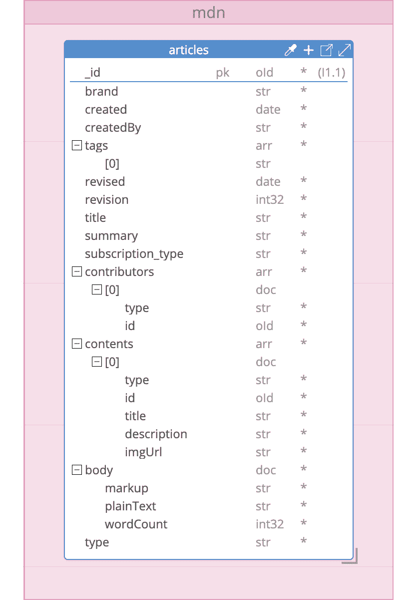
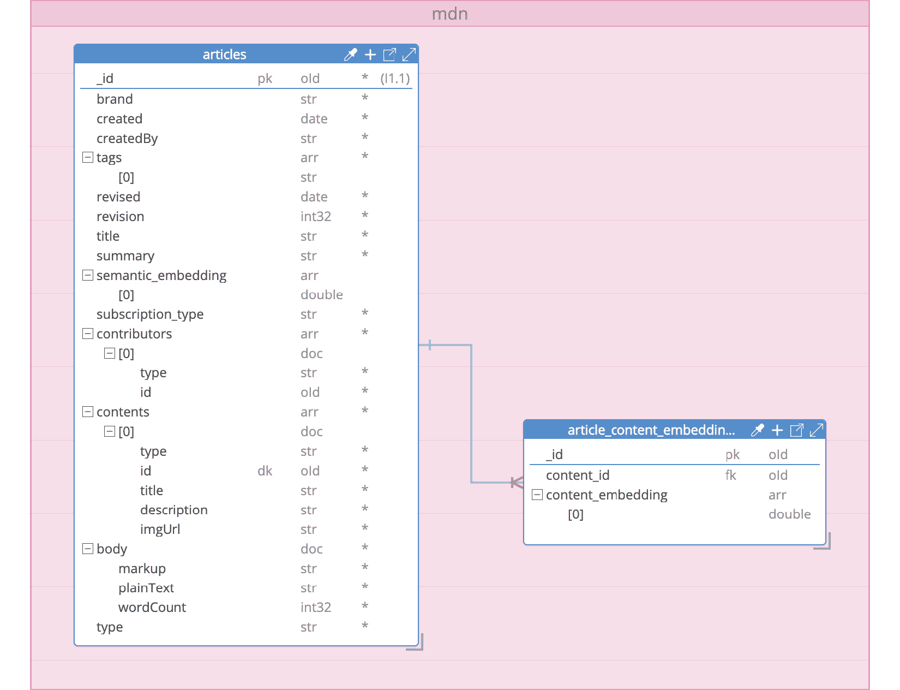
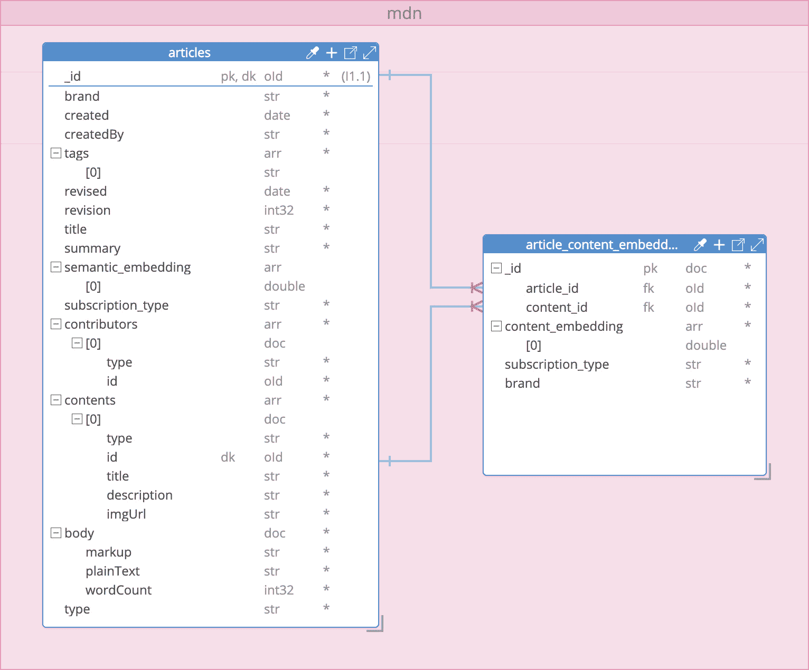
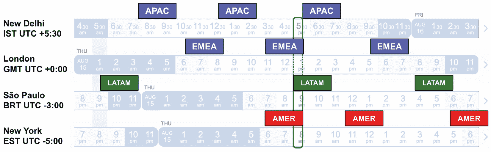
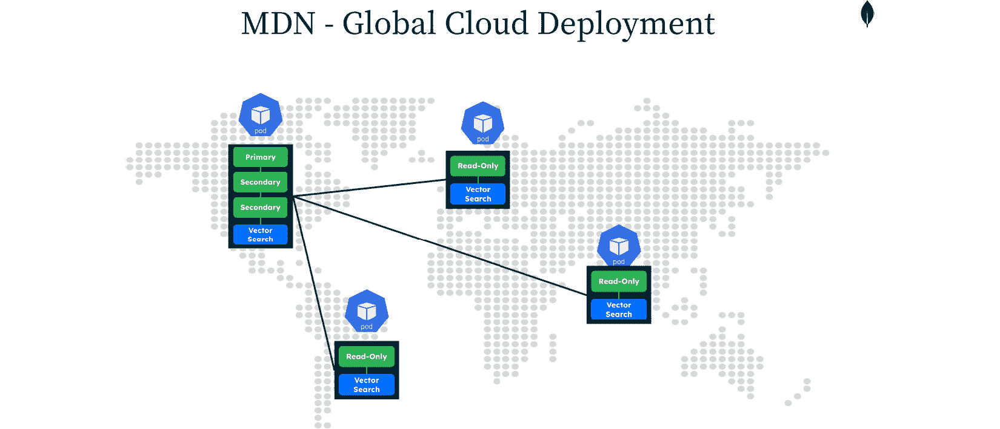
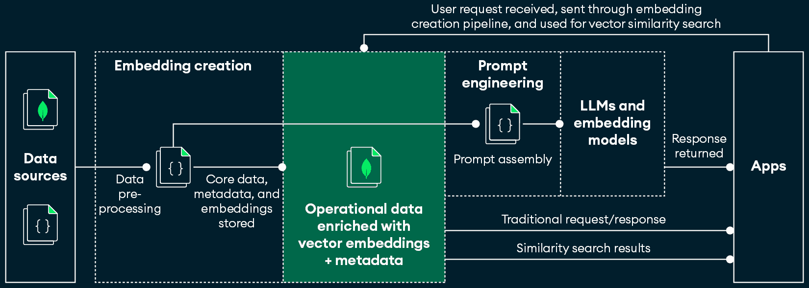

# 第六章：AI/ML应用设计

随着智能应用领域的演变，它们的架构设计对于效率、可扩展性、可操作性和安全性变得至关重要。本章提供了一些建议，帮助你开始创建稳健和响应迅速的AI/ML应用。

本章从**数据建模**开始，探讨如何以最大化三种不同消费者（人类、应用程序和AI模型）的有效性的方式组织数据。你将了解**数据存储**，考虑不同数据类型的影响，并确定最佳存储技术。你将估算存储需求，并确定适用于示例应用的最佳MongoDB Atlas集群配置。

当你学习**数据流**时，你将探索数据通过摄取、处理和输出的详细移动，以保持完整性和速度。本章还讨论了**数据生命周期管理**，包括更新、老化和管理，确保数据保持相关性和合规性。

由于将数据或逻辑暴露给AI模型的风险，AI/ML应用的安全问题进一步扩大。本章讨论了安全措施和**基于角色的访问控制**（**RBAC**）来保护敏感数据和逻辑完整性。你还将了解数据存储、流动、建模和安全的最佳原则，提供避免常见陷阱的实用建议。

在本章中，你将使用一个虚构的新闻应用，称为**MongoDB开发者新闻**（**MDN**），它将类似于Medium.com，通过实际示例让你能够创建智能应用。

本章将涵盖以下主题：

+   数据建模

+   数据存储

+   数据流

+   新鲜度和保持

+   安全性和RBAC

+   最佳实践

# 技术要求

以下是在本章中跟随代码的先决条件：

+   一个MongoDB Atlas集群`M0`层（免费）应该足够

+   一个具有访问`text-embedding-3-large`模型权限的OpenAI账户和API密钥

+   一个Python 3工作环境

+   用于MongoDB、LangChain和OpenAI的已安装Python库

+   在MongoDB Atlas集群上创建的Atlas Search索引和Vector Search索引

# 数据建模

本节深入探讨了AI/ML系统所需的各种类型的数据，包括结构化、非结构化和半结构化数据，以及这些数据如何应用于MDN的新闻文章。以下是对每种数据的简要描述，以建立基本理解：

+   **结构化数据**符合预定义的模式，并且传统上存储在关系数据库中，用于事务信息。它为参与和智能系统提供动力。

+   **非结构化数据**包括二进制资产，如PDF文件、图像、视频等。对象存储，如Amazon S3，允许以较低的成本在灵活的目录结构下存储这些数据。

+   **半结构化数据**，如JSON文档，允许每个文档定义其架构，以适应常见的和独特的数据点，甚至可以处理某些数据的缺失。

MDN将存储新闻文章、订阅者资料、账单信息等。为了简化，在本章中，你将专注于每篇新闻文章及其相关二进制内容（例如图片）的数据。*图6*.1描述了`articles`集合的数据模型。



图6.1：文章集合的架构

文章集合表示新闻文章的元数据，包括创建细节、标签和贡献者。所有文档都包含标题、摘要、HTML和纯文本正文内容，以及相关的媒体元素，如图片。

## 使用嵌入丰富数据

要完成MDN数据模型，你需要考虑将通过嵌入表示和存储的数据。**文本嵌入**用于文章标题和摘要，将实现语义搜索，而**图像嵌入**将有助于找到跨文章使用的相似艺术品。*表6*.1描述了数据字段、要使用的嵌入模型及其向量大小。

| **类型** | **字段** | **嵌入模型** | **向量大小** |
| --- | --- | --- | --- |
| 文本 | `标题` | OpenAI `text-embedding-3-large` | 1,024 |
| 文本 | `摘要` |
| 图片 | `内容` | OpenAI CLIP | 768 |

表6.1：文章集合的嵌入

每篇文章都有一个标题和摘要。为了简化，你将它们连接起来，创建一个文本嵌入。理想情况下，对于图片，你将嵌入存储在每个内容对象数组中的`contents`数组中。然而，MongoDB Atlas目前不支持对象数组内部的字段用于向量索引，这导致了**膨胀文档的反模式**。最佳实践是将图像嵌入存储在单独的集合中，并使用**扩展引用架构设计模式**。你可以从本书*进一步阅读*章节中提供的链接了解更多关于使用MongoDB索引数组、膨胀文档和扩展引用模式的信息。*图6*.2显示了更新的数据模型。



图6.2：具有嵌入的文章架构

*表6*.2显示了相应的向量索引。

| `articles` | `article_content_embeddings` |
| --- | --- |
| `semantic_embedding_vix` | `content_embedding_vix` |

|

```py
{
```

```py
  "fields": [
```

```py
	{
```

```py
  	"numDimensions": 1024,
```

```py
  	"path": "semantic_embedding",
```

```py
  	"similarity": "cosine",
```

```py
  	"type": "vector"
```

```py
	}
```

```py
  ]
```

```py
}
```

|

```py
{
```

```py
  "fields": [
```

```py
	{
```

```py
  	"numDimensions": 768,
```

```py
  	"path": "content_embedding",
```

```py
  	"similarity": "cosine",
```

```py
  	"type": "vector"
```

```py
	}
```

```py
  ]
```

```py
}
```

|

表6.2：向量搜索索引定义

## 考虑搜索用例

在最终确定数据模型之前，让我们考虑文章的搜索用例，并对模型进行进一步的调整。以下是一些更广泛的搜索用例：

+   `标题`和`摘要`字段用于文本搜索，以及`品牌`和`订阅类型`字段用于过滤。

+   `tags`字段。你还需要一个向量搜索索引来覆盖`标题+``摘要`嵌入。

+   将`articles`集合中的`_id`、`brand`和`subscription_type`字段合并到`article_content_embeddings`集合中。由于该集合中已经存在一个`_id`字段，您可以创建一个包含文章`_id`和内容`_id`的复合主键。*图6**.3*显示了更新的数据模型。



图6.3：带有嵌入的更新后的文章模式

*表6.3* 展示了更新的向量索引。

| `articles` | `article_content_embeddings` |
| --- | --- |
| `semantic_embedding_vix` | `content_embedding_vix` |

|

```py
{
```

```py
  "fields": [
```

```py
    {
```

```py
      "numDimensions": 1024,
```

```py
      "path": "semantic_embedding",
```

```py
      "similarity": "cosine",
```

```py
      "type": "vector"
```

```py
    },
```

```py
    {
```

```py
      "path": "brand",
```

```py
      "type": "filter"
```

```py
    },
```

```py
    {
```

```py
      "path": "subscription_type",
```

```py
      "type": "filter"
```

```py
    }
```

```py
  ]
```

```py
}
```

|

```py
{
```

```py
  "fields": [
```

```py
    {
```

```py
      "numDimensions": 768,
```

```py
      "path": "content_embedding",
```

```py
      "similarity": "cosine",
```

```py
      "type": "vector"
```

```py
    },
```

```py
    {
```

```py
      "path": "brand",
```

```py
      "type": "filter"
```

```py
    },
```

```py
    {
```

```py
      "path": "subscription_type",
```

```py
      "type": "filter"
```

```py
    },
```

```py
    {
```

```py
      "path": "_id.article_id",
```

```py
      "type": "filter"
```

```py
    }
```

```py
  ]
```

```py
}
```

|

表6.3：更新的向量搜索索引定义

*表6.4* 展示了新的文本搜索索引。

| `articles` |
| --- |
| `lexical_six` |

|

```py
{
```

```py
  "mappings": {
```

```py
    "dynamic": false,
```

```py
    "fields": {
```

```py
      "brand": {
```

```py
        "normalizer": "lowercase",
```

```py
        "type": "token"
```

```py
      },
```

```py
      "subscription_type": {
```

```py
        "normalizer": "lowercase",
```

```py
        "type": "token"
```

```py
      },
```

```py
      "summary": {
```

```py
        "type": "string"
```

```py
      },
```

```py
      "tags": {
```

```py
        "normalizer": "lowercase",
```

```py
        "type": "token"
```

```py
      },
```

```py
      "title": {
```

```py
        "type": "string"
```

```py
      }
```

```py
    }
```

```py
  }
```

```py
}
```

|

表6.4：文本搜索索引定义

您在[*第4章*](B22495_04.xhtml#_idTextAnchor061)*，嵌入模型*中学习了如何编写向量搜索查询。要了解更多关于混合搜索查询的信息，您可以参考[https://www.mongodb.com/docs/atlas/atlas-vector-search/tutorials/reciprocal-rank-fusion/](https://www.mongodb.com/docs/atlas/atlas-vector-search/tutorials/reciprocal-rank-fusion/)上的教程。

现在您已经了解了您的数据模型和所需的索引，您需要考虑MDN将承载的文章数量（包括嵌入和索引的大小）、峰值每日时间等因素，以确定整体存储和数据库集群需求。

# 数据存储

在本节中，您将进行容量估算，这是一种有根据的估计，用于存储需求。您需要考虑的不仅仅是体积大小和速度，还包括数据库集群的多个其他方面，这些方面对于在遵循预期的数据访问模式的同时利用您应用程序的数据是必需的。

MDN计划每天发布100篇文章。保留过去5年的文章，文章总数将达到182,500篇。有4800万订阅者和2400万每日活跃用户，每天在三个主要时区中，高峰访问时间为30分钟，如*图6**.4*所示。



图6.4：MDN订阅者时区和峰值时间

首先，您将估算总数据量。每篇文章都有一个用于语义搜索的1024维嵌入和五个用于图像搜索的768维嵌入，总共40 KB未压缩（维度使用双精度类型）。加上`标题`、`摘要`、`正文`（带和不含标记）以及其他字段，平均文章大小约为300 KB未压缩。

五年的文章将需要大约100 GB未压缩。使用MongoDB的**WiredTiger**压缩（Snappy、zlib和zstd也是可用的压缩选项），这将在磁盘上减少到大约50 GB。定义的向量索引增加了大约3.6 GB。图像和二进制资产将存储在Amazon S3上。为了简化，您将不会估算搜索和传统索引的大小。您可以放心地说，MDN在MongoDB Atlas上需要80到100 GB的磁盘空间，这在今天的云计算标准下是非常可管理的。

现在，您将确定最合适的MongoDB Atlas集群配置。

## 确定数据库集群类型

MongoDB Atlas提供两种主要的集群类型：

+   **副本集**有一个主节点用于写入，以及用于高可用性的辅助节点，这些节点也可以用于读取。这些集可以垂直扩展，并且可以通过在相同或不同的云区域添加更多节点来水平扩展读取。

+   **分片集群**由多个分片组成，每个分片都是整体数据集的一部分，并且每个分片都是一个副本集。它们在读写方面都可以垂直和水平扩展。分片可以放置在不同的云区域，以增强数据本地性和合规性。

那么，您如何确定副本集是否足够，或者是否需要分片集群？关键因素包括数据集的大小或应用程序的吞吐量，这些可能会挑战单台服务器的容量。例如，高查询率可能会耗尽服务器的CPU容量，而大于系统RAM的工作集大小可能会对磁盘驱动器的I/O容量造成压力。MDN每天发布100篇文章，因此从这个角度来看，分片不是必需的。

分片的其他原因包括数据治理和合规性以及**恢复点目标**（**RPO**）和**恢复时间目标**（**RTO**）策略，这些是灾难恢复和业务连续性规划中的关键指标。这些都不适用于MDN。

考虑到每秒写入次数较少和数据量可管理，使用副本集是合理的。现在您需要确定所需的RAM和IOPS数量；这两个都是快速响应时间的关键组件。

## 确定IOPS

MDN是一个低写入、高读取的使用案例。每天仅添加100篇文章，对存储系统的写入压力很小。*表6.5*显示了MongoDB Atlas提供的存储和IOPS选项。

| **存储类型** | **最低IOPS/存储** | **最高IOPS/存储** |
| --- | --- | --- |
| 标准IOPS | 3,000 IOPS/10 GB | 12,288 IOPS/4 TB 16,000 IOPS/14 TB**扩展存储已启用** |
| 分配IOPS | 100 IOPS/10 GB | 64,000 IOPS/4 TB |
| NVMe | 100,125 100%随机读IOPS 35,000写IOPS 380 GB | 3,300,000 100%随机读IOPS 1,400,000写IOPS 4,000 GB |

表6.5：MongoDB Atlas在AWS上的存储类型

如*图6**.4所示，将有一个30分钟的峰值时段，在此期间预计每天有2400万用户活跃。因此，您需要配置6,000 IOPS，如*表6.6*所示。这是基于订阅者分布、内存与磁盘读取以及每篇文章需要3 IOPS进行磁盘读取（150 KB压缩 ÷ 64 KB亚马逊EBS I/O大小）。

| **区域** | **分配** | **DAU** | **20% 读操作** **来自磁盘** | **高峰时段的磁盘读操作/秒** | **所需的IOPS** |
| --- | --- | --- | --- | --- | --- |
| `AMER`^ | 40% | 9,600,000 | 1,920,000 | 1,067 | 3,200^ |
| `EMEA`^ | 20% | 4,800,000 | 960,000 | 533 | 1,600^ |
| `APAC` | 25% | 6,000,000 | 1,200,000 | 667 | 2,000 |
| `LATAM`^ | 15% | 3,600,000 | 720,000 | 400 | 1,200^ |
| ^ 高峰时段重叠的区域 |  |  |  | 高峰IOPS | 6,000 |

表6.6：MDN全球订阅者分布

在AWS上的任何Atlas集群上的最低标准IOPS为3,000。要达到6,000 IOPS，您需要使用带有2TB磁盘的Atlas `M50` 层，这感觉是过度配置的，并且如果在一个云区域中部署，不会为所有读者提供低延迟。为了解决这个问题，MDN将在主要地理区域部署应用程序堆栈，实现区域配置、工作负载分配和本地读取，以提供最佳客户体验。

使用MongoDB Atlas，您可以在不同地区放置向量搜索节点。`S40` 层提供26,875次读取IOPS，这对于本例来说已经足够了，并且每个区域至少需要2个节点，这确保了高可用性。

虽然向量搜索节点将处理词法、语义和图像搜索，但必须在匹配后从MongoDB数据节点获取完整的JSON文档。为了完全支持本地读取，我们必须在同一地区配置只读节点并满足IOPS要求。我们可以使用Atlas `M40` 层来实现这一点。在确定了所需的IOPS后，您现在需要估计RAM。

## 确定RAM

对于数据节点，Atlas `M40` 层提供16 GB的RAM。MongoDB WiredTiger存储引擎为其缓存保留了(RAM - 1 GB)的50%。考虑到文档平均大小为300 KB，缓存可以存储大约28,000个文档。请注意，传统的索引大小可能会略微减少这个数字。考虑到每天增加100篇文章，`M40` 层的缓存可以容纳大约280天的数据，或大约9个月，这对于本例来说已经足够了。

搜索`S40` 层提供16 GB的RAM、2个vCPU和100 GB的存储。HNSW图或向量索引必须适应内存。

注意

您在[*第5章*](B22495_05.xhtml#_idTextAnchor115) *向量数据库*中学习了**HNSW**或**分层可导航小世界**。

一篇文章使用1 x 1,024向量 + 5 x 768向量 = 19.5 KB。对于182,500篇文章，需要3.5 GB的空间，16 GB的RAM对于向量搜索来说已经足够，并且还留有空间用于词法搜索索引。提供4 GB RAM、1 vCPU和50 GB存储的`S30` 层成本较低，但请注意，更多的CPU允许更多的并发搜索。

## 最终集群配置

您现在已经确定了MDN的集群配置。*表6.7* 描述了MDN的全局云架构，详细说明了Atlas节点在不同地区的分布。`AMER` 区域，被标识为主要区域，使用`M40` 层节点和`S30` 向量搜索节点为美洲提供服务读写和搜索，而`EMEA`、`APAC` 和`LATAM` 区域使用`M40` 只读节点和`S30` 向量搜索节点只为各自区域提供本地搜索。每个区域都需要部署MDN应用程序堆栈，如图*表6.7*中的全局地图所示。

| **区域** | **Atlas 基础** **层节点** | **Atlas** **只读节点** | **Atlas Vector** **搜索节点** |
| --- | --- | --- | --- |
| `AMER`(主要区域) | `M40`(包含三个) |  | `S30` x2 |
| `EMEA` |  | `M40` x2 | `S30` x2 |
| `APAC` |  | `M40` x2 | `S30` x2 |
| `LATAM` |  | `M40` x2 | `S30` x2 |
| **MDN 全球** **云架构** |

表 6.7：MDN 的 MongoDB Atlas 集群配置

## 性能、可用性与成本对比

注意，在 `AMER` 区域没有配置额外的只读节点，而是使用两个辅助节点作为只读节点。这节省了成本，因为 MDN 的写入模式较低，尽管可能存在资源竞争。在其他区域仅配置一个 `M40` 只读节点可以节省更多成本，但会增加维护窗口期间的延迟，因为读取将被重新路由。

为了在遵守最佳实践的同时防止 `AMER` 完全中断，考虑在三个区域中配置五个节点，并在每个区域部署具有两个可选举节点的应用程序堆栈。

# 数据流

**数据流** 涉及数据通过系统的移动，影响提供给消费者的结果的准确性、相关性和速度，这反过来又影响他们的参与度。本节探讨了处理数据源、处理数据、提示 LLM 和嵌入模型以使用 MDN 作为示例来丰富数据的设计考虑因素。*图 6**.5* 展示了此流程。



图 6.5：AI/ML 应用程序中的典型数据流

让我们从处理数据源的设计开始。数据可以以静态（静止）方式直接从文件中导入到 MongoDB Atlas，也可以以动态（移动）方式导入，允许进行持续更新、数据转换和逻辑执行。

## 处理静态数据源

最简单导入静态数据的方式是使用 `mongoimport`，它支持 JSON、CSV 和 TSV 格式。它非常适合初始加载或批量更新，因为它可以处理大型数据集。此外，将插入工作进程的数量增加到与主机 vCPU 相匹配可以提升导入速度。

`mongoimport` 还可以动态地更新外部数据源。您可以在运行时构建调用命令，并将它们作为进程外任务执行。一些视频游戏公司使用这种方法来更新来自移动应用商店的购买数据以更新玩家资料。

以 MDN 为例，用户在订阅时可以提供他们的 GitHub ID。使用 GitHub 的 API，您可以创建一个列表，列出用户拥有或贡献的存储库中使用的编程语言。一个计划的任务可以定期获取这些数据。然后可以将语言列表导入并合并到他们的个人资料中，以便稍后推荐文章。*表 6.8* 展示了如何进行此操作。

| `github-20240719.json` |
| --- |

|

```py
{ "github_id" : "user1", "languages" : ["python", "csharp"], …}
```

```py
{ "github_id" : "user2", "languages" : ["python", "cpp"], …}…
```

|

| `mdn.subscribers` |
| --- |

|

```py
{ "_id" : ObjectId("669…ab8"), "github_id" : "user1", … }
```

```py
{ "_id" : ObjectId("669…ab9"), "github_id" : "user2", … }…
```

|

| `mongoimport` 命令用于合并匹配 `github_id` 字段的数据库数据 |
| --- |

|

```py
mongoimport --uri=<connection string to Atlas cluster>
```

```py
--db=mdn --collection=subscribers --mode=merge
```

```py
--file=github-20240719.json --upsertFields=github_id
```

```py
--numInsertionWorkers=4
```

|

| 合并后的 `mdn.subscribers` |
| --- |

|

```py
{ "_id" : ObjectId("669…ab8"), "github_id" : "user1", "languages" : ["python", "csharp"], … }
```

```py
{ "_id" : ObjectId("669…ab9"), "github_id" : "user2", "languages" : ["python", "cpp"], … }…
```

|

表 6.8：使用 mongoimport 合并数据的示例

虽然 `mongoimport` 是一个适用于各种数据导入需求的通用工具，但它不支持连续同步、逻辑执行或数据转换。现在您将探索一些支持这些功能的方法。

## 存储带有向量嵌入的操作数据

当原始表示存储或更新时，其相应的向量嵌入必须刷新以准确反映内容。这可以通过以下方式完成：

+   **同步**: 在数据库操作之前获取更新的向量嵌入，同时写入数据和嵌入。此方法适用于快速、简单的嵌入模型或当模型在本地托管时。然而，如果嵌入模型的响应时间不同，可能会失败。

+   **异步**: 确保主数据的即时一致性，并允许在之后提示嵌入模型。虽然这提供了可伸缩性和处理不可预测的模型的能力，但它在嵌入数据暂时过时的过程中引入了延迟。

您可以使用以下四种方法在 MongoDB 中异步保持嵌入数据的最新状态：

+   **Kafka 连接器**: 您可以通过 Kafka 连接器促进数据从 Apache Kafka 流入 MongoDB 集合。这是一个经过 Confluent 验证的连接器，允许数据从 Apache Kafka 主题流入 MongoDB 作为 **数据汇**，并将 MongoDB 的更改发布到 Kafka 主题作为 **数据源**。为了保持嵌入数据的最新状态，您将使用汇连接器并在 Java 中开发后处理器。您可以在[https://www.mongodb.com/docs/kafka-connector/v1.3/sink-connector/fundamentals/post-processors/#sink-connector-post-processors](https://www.mongodb.com/docs/kafka-connector/v1.3/sink-connector/fundamentals/post-processors/#sink-connector-post-processors)了解更多有关汇后处理器的信息。

+   **Atlas 流处理**: 此方法使用与 MongoDB Atlas 数据库相同的查询 API 处理复杂的数据流。它支持连续聚合，并包括用于消息完整性和及时问题检测的模式验证。处理后的数据可以写入 Atlas 集合，并且它们集成到 Atlas 项目中，独立于 Atlas 集群。Atlas 流处理逻辑使用 JavaScript 和 MongoDB 聚合语法进行编程。有关使用 Atlas 流处理处理嵌入数据的示例，请参阅 [https://www.mongodb.com/solutions/solutions-library/rag-applications](https://www.mongodb.com/solutions/solutions-library/rag-applications)。

+   **Atlas 触发器**：Atlas 触发器通过响应事件或遵循预定义的日程来执行应用程序和数据库逻辑。每个触发器都监听特定的事件类型，并与 Atlas 函数相关联。当发生匹配的事件时，触发器被触发，并将事件对象传递给相关联的函数。触发器可以响应各种事件，例如集合中的特定操作、用户创建或删除等认证事件，以及预定时间。它们是完全管理的变更流实例，但仅限于 JavaScript。有关使用 Atlas 触发器保持嵌入数据最新的示例，请参阅[https://www.mongodb.com/developer/products/atlas/semantic-search-mongodb-atlas-vector-search/](https://www.mongodb.com/developer/products/atlas/semantic-search-mongodb-atlas-vector-search/)。

+   **变更流**：此方法提供对数据变更的实时访问。应用程序可以订阅集合、数据库或整个部署中的变更，并立即做出反应，事件按顺序处理且可恢复。使用聚合框架，变更流允许过滤和转换通知。它们可以与任何官方 MongoDB 驱动程序支持的编程语言一起使用。然而，它们不是完全管理的，需要维护一个运行的主机，以配合主应用程序。

由于本书是为 Python 开发者编写的，您将学习如何使用用 Python 编写的变更流。*表 6.9* 展示了使用 LangChain 和 OpenAI 将 MDN 文章的标题和摘要嵌入的 Python 3 变更流。它根据 *图 6**.3* 中的数据模型和 *表 6.3* 中的向量索引触发新文章或标题或摘要的更改。 

```py
import os
from langchain_openai import OpenAIEmbeddings
from pymongo import MongoClient
from pymongo.errors import PyMongoError
# Set the OpenAI API key as an environment variable
os.environ["OPENAI_API_KEY"] = "YOUR-OPENAI-API-KEY"
# Define the MongoDB Atlas connection string
ATLAS_CONNECTION_STRING = "YOUR-MONGODB_ATLAS-CONNSTRING"
# Create a MongoClient instance to connect to MongoDB Atlas
client = MongoClient(
    ATLAS_CONNECTION_STRING, tls=True, tlsAllowInvalidCertificates=True
)
# Select the 'articles' collection from the 'mdn' database
coll = client["mdn"]["articles"]
# Instantiate the OpenAIEmbeddings model with specified parameters
embedding_model = OpenAIEmbeddings(
    model="text-embedding-3-large", dimensions=1024, disallowed_special=()
)
# Define a function to handle changes detected in the MongoDB collection
def handle_changes(change):
    # Extract the document ID from the change event
    doc_id = change["documentKey"]["_id"]
    # Create a filter to identify the document in the collection
    doc_filter = {
        "_id": doc_id
    }
    # Combine the title and summary of the document into a single text string
    text = [change["fullDocument"]["title"] + " " + change["fullDocument"]["summary"]]
    # Generate embeddings for the text
    embeddings = embedding_model.embed_documents(text)
    # Create an update document to set the 'semantic_embedding' field with the generated embeddings
    set_fields = {
        "$set": {
            "semantic_embedding": embeddings[0]
        }
    }
    # Update the document in the collection with the new embeddings
    coll.update_one(doc_filter, set_fields)
    print(f"Updated embeddings for document {doc_id}")
# Start monitoring the MongoDB collection for changes
try:
    # Define a stream filter to match insert and update operations affecting the title or summary fields
    stream_filter = [
        {
            "$match": {
                "$or": [
                    {"operationType": "insert"},
                    {
                        "$and": [
                            {"operationType": "update"},
                            {
                                "$or": [
                                    {
                                        "updateDescription.updatedFields.title": {
                                            "$exists": True
                                        }
                                    },
                                    {
                                        "updateDescription.updatedFields.summary": {
                                            "$exists": True
                                        }
                                    },
                                ]
                            },
                        ]
                    },
                ]
            }
        }
    ]
    # Open a change stream to watch for changes in the collection
    with coll.watch(stream_filter, full_document="updateLookup") as stream:
        print("Listening for changes...")
        for change in stream:
            print(f"Change detected: {change}. Processing")
            handle_changes(change)
except PyMongoError as e:
    # Print an error message if a PyMongoError occurs
    print(f"An error occurred: {e}")
finally:
    # Close the MongoDB client connection
    client.close()
```

表 6.9：用于设置或更新嵌入的 Python 编写的变更流

现在您已经学会了如何处理设置或更新嵌入的数据流，您将学习关于数据新鲜度和保留度，这对于提供相关和及时的内容至关重要。

# 新鲜度和保留度

新鲜数据和有效的保留策略确保您的内容相关且及时送达。**新鲜度**使用户保持对最新文章、评论和推荐的参与度。**保留策略**管理数据生命周期，保留有价值的历史数据以供分析，同时清除过时的数据。本节探讨了确保内容更新和高效数据流的方法。

## 实时更新

主要关注的是实时摄取和更新新数据，使其在所有云区域可用。对于新闻网站，这意味着新文章及其向量嵌入应迅速持久化和复制，以便全球访问。

要使用分布式数据模型和应用程序实现这一点，请使用ACID事务来确保文章及其内容嵌入作为一个单一单元一起写入。有关在Python中创建MongoDB事务的示例，请参阅[https://learn.mongodb.com/learn/course/mongodb-crud-operations-in-python/lesson-6-creating-mongodb-transactions-in-python-applications/learn?page=2](https://learn.mongodb.com/learn/course/mongodb-crud-operations-in-python/lesson-6-creating-mongodb-transactions-in-python-applications/learn?page=2)。

接下来，在分布式设置中使用MongoDB的`writeConcern`、`readConcern`和`readPreference`的可调一致性来平衡数据可靠性、一致性和性能。这些修饰符有助于确保数据完整性和快速访问。以下是对这些修饰符的解释，但为了更深入的理解，您可以访问[https://www.mongodb.com/docs/manual/core/causal-consistency-read-write-concerns/](https://www.mongodb.com/docs/manual/core/causal-consistency-read-write-concerns/)：

+   `writeConcern:majority`通过仅在数据写入大多数副本集成员后确认写入操作来确保数据一致性和持久性，从而在故障期间降低数据丢失的风险。这是默认的写入关注点。

+   `readConcern:majority`通过确保读取操作返回大多数副本集成员确认的最最新数据来提供读取一致性，为应用程序提供数据的一致视图。

+   `readPreference:nearest`通过将读取操作定向到具有最低网络延迟的副本集成员来优化延迟。对于MDN，这通过允许每个区域应用程序部署从最近的MongoDB数据和向量节点读取，从而最小化响应时间，并平衡一致性和性能。

现在您已经学会了如何确保数据可用性和速度，接下来的重点是数据生命周期管理，这是数据新鲜度和保留的关键方面。

## 数据生命周期

**数据生命周期**指的是数据从创建到删除所经历的各个阶段，以及数据如何穿越和改变系统或存储格式，包括数据归档或删除时的情况。随着最新内容的添加，旧内容的相关性可能会降低。

例如，旧文章可以移动到存档数据库或冷存储，从而降低存储成本并优化活动数据库的性能。然而，将数据移动到冷存储可能会比操作数据库降低搜索能力。以下是处理数据生命周期的三种方法及其权衡：

+   **操作集群中的所有数据**：将所有数据保留在操作集群中是最高性能但成本最高的方法，适用于大多数数据频繁访问的场景，例如全球在线游戏、身份验证提供商或金融平台。MongoDB Atlas通过分片集群和全局集群支持这一点。全局集群为云区域分配**数据区域**以进行容量管理和数据本地性。

+   **活跃和历史操作数据集群**：这涉及到使用高性能硬件处理最近的数据，使用能力较低的硬件处理旧数据，以平衡功能和成本节约。使用MongoDB Atlas，可以使用集群间同步和TTL索引将数据从活跃集群移动到历史集群。其他平台如Apache Kafka、Confluent和Striim也支持这种方法。

+   **活跃数据集群和历史存储**：可以将全部历史数据卸载到冷存储，同时在操作集群中保留关键字段，从而实现完全或有限的查询和搜索能力。对于MDN来说，这确保了用户可以通过词汇语义搜索找到历史文章，全文存储在冷存储中，并在需要时访问。使用MongoDB Atlas，可以通过在线归档和数据联邦来实现这一点。**在线归档**会根据设定的过期时间自动将数据从集群移动到成本更低的云存储。**数据联邦**允许透明地查询集群和归档，无论数据来源。

本节介绍了数据生命周期管理，强调了数据从创建到归档的管理方式。你学习了三种策略：在操作集群中保留所有数据以实现最佳性能、分离活跃和和历史数据以平衡成本和性能，以及在保留一些搜索功能的同时将历史数据卸载到冷存储。现在，你将学习如何升级嵌入模型。

## 采用新的嵌入模型

OpenAI于2022年12月15日用`text-embedding-ada-002`取代了`text-search-davinci-*-001`模型，随后于2024年1月25日用`text-embedding-small/large`取代。很可能在你阅读这本书的时候，这些模型也会被取代。

正如你在[*第4章*](B22495_04.xhtml#_idTextAnchor061)“嵌入模型”中学习的，从一个模型中提取的嵌入与另一个模型不兼容。随着新模型的采用，可能需要重新嵌入先前索引的数据。这是一个资源密集型活动，需要提前进行设计考虑。

你需要选择一种方法来采用新的嵌入模型。你可以继续使用现有的向量字段并执行长时间的全有或全无升级，暂时进行双重嵌入，或者实施逐步升级。让我们探讨这三种方法：

+   **使用现有的向量字段**：这种方法保持应用程序代码完整，但需要停机时间来重新嵌入数据和替换向量索引。如果重新嵌入和重新索引时间适合您的允许停机窗口，则此方法适用。

+   **临时双重嵌入**：这种方法使用旧模型和新模型双重嵌入新或修改后的字段。它使用后台作业为未修改的数据添加新的嵌入。当所有数据都有双重嵌入时，应用程序将更新并部署以使用新的嵌入。一旦稳定，可以另一个后台作业移除过时的向量和索引。确保有足够的磁盘空间和内存，因为当两组向量共存时。如果停机窗口很小且仅容纳应用程序部署时间，则此方法适用。

+   MongoDB的向量索引的`filter`类型（如*表6.3*所示），您可以引入一个新字段来区分具有旧向量和新向量的文档并实现联合。最终，可以删除旧向量和索引，并可以移除不必要的逻辑。如果允许没有停机时间，则此方法适用。

通过解决这三个主要问题——数据摄取和实时更新、管理数据生命周期和老化、以及升级嵌入模型——您的应用程序可以确保其数据保持新鲜和相关性，提供一个最佳的平台并努力实现最佳的用户体验。现在，您将了解安全和其在人工智能密集型应用中的考虑因素。

# 安全性和RBAC

**安全措施**保护数据免受未经授权的访问和泄露，而RBAC确保基于角色的适当访问级别。以下是保护数据完整性和隐私的关键安全和RBAC策略：

+   **数据加密和安全的存储**：静态和传输中的数据加密对于确保应用程序的安全性至关重要。静态加密保护数据免受未经授权的访问，而传输加密确保数据在用户与应用程序之间移动时的安全性。MongoDB Atlas提供与**AWS密钥管理服务（AWS KMS**）的内置集成，用于静态加密，以及TLS/SSL作为数据传输的默认设置。

+   **访问控制和用户身份验证**：基于角色的访问控制（RBAC）管理权限，确保用户只能访问必要的数据和功能。在MDN的情况下，如编辑者和读者这样的不同角色需要不同级别的访问。根据最小权限原则，可以为MongoDB上的不同数据库用户设置不同级别的权限。例如，仅用于嵌入数据的微服务所使用的应用程序标识符将对存储嵌入的集合具有写入权限，而用于人类操作者的应用程序标识符则只有读取权限。

+   **监控和审计**：持续的监控和审计能够实时检测和响应安全事件。监控工具和审计日志跟踪用户活动并识别异常访问模式。MongoDB Atlas提供高级监控和警报功能，允许管理员为可疑活动设置警报。定期审查审计日志确保符合安全策略，并为改进安全提供见解。

+   **数据备份和恢复**：通过定期备份维护数据完整性和可用性，以最小化安全漏洞或事件期间的中断和损失。MongoDB Atlas提供带有快照的自动化备份解决方案，确保快速恢复。如果启用了静态加密（例如，AWS KMS），则在卷和备份中，嵌入和操作数据都使用相同的密钥进行加密。

虽然有许多与安全相关的关注点，但刚刚提到的那些应该足以开始构建AI应用程序。确保安全是一个组织必须采用并执行的持续努力，以维持合规性、培养用户信任并保护应用程序完整性。

# AI/ML应用程序设计的最佳实践

本节涵盖了本章涵盖的五个关注点——数据建模、数据存储、数据流、数据新鲜度和保留以及安全和RBAC的最佳实践。这些指南将帮助确保您的应用程序高效、可扩展且安全，为构建可靠且高性能的AI应用程序提供坚实的基础。以下是AI/ML应用程序设计每个方面的前两个最佳实践。

1.  **数据建模**：以下技术确保处理嵌入的高效性和性能：

    +   **在单独的集合中存储嵌入**：将嵌入存储在单独的集合中，以避免文档膨胀，尤其是在涉及多个嵌入和嵌套索引限制时。复制字段以确保高效的过滤并保持搜索性能。

    +   **混合搜索**：使用互惠排名融合结合语义和词汇搜索。这种混合方法通过利用两者的优势来提升搜索功能。

1.  **数据存储**：为了优化数据库集群的大小，实施以下最佳实践：

    +   **基于峰值使用情况的足够的IOPS和RAM**：根据峰值访问时间和应用程序的读写模式计算所需的IOPS。确保数据和搜索节点有足够的RAM来处理最请求数据的缓存和索引需求。

    +   **本地读取**：在各个区域部署节点有助于最小化读取延迟并提升用户体验。确保每个区域都有所有必要的节点以完全本地提供服务。

1.  **数据流**：考虑以下策略以有效利用数据流：

    +   **异步嵌入更新**: 通过异步更新向量嵌入来确保主数据一致性。此方法适应可扩展性和不可预测的模型响应时间，尽管它引入了暂时的延迟。

    +   **动态数据处理**: 利用变更流、Atlas触发器、Kafka和Atlas流处理等技术来处理连续更新、转换和逻辑执行。

1.  **数据新鲜度和保留**: 以下最佳实践可以确保您的应用相关且及时：

    +   **最新的嵌入模型**: 一个模型的嵌入与另一个模型不兼容。如果可能，在停机期间计划模型升级，或者考虑逐步升级，这从架构上来说是复杂的，但不需要停机时间。利用MongoDB灵活的数据模型在嵌入之间进行转换。

    +   **数据分层**: 通过将旧数据移动到归档集群或冷存储，同时保持最近的数据在高性能集群中，实现数据老化策略。使用MongoDB Atlas的更广泛功能，如在线归档、数据联邦等，以实现有效的数据分层。

1.  **安全和RBAC（基于角色的访问控制）**: 以下是为确保您的数据安全的最佳实践：

    +   **RBAC（基于角色的访问控制）**: 分配基于角色的权限并遵循**最小权限原则**（**PoLP**），确保用户和实体只能访问必要的数据和操作。例如，代码嵌入数据应仅对嵌入集合具有写入访问权限。

    +   **加密和存储**: 启用静态加密并集成KMS，以确保所有数据卷和备份都使用您自己的密钥进行加密。

实施这些最佳实践可提高您AI/ML应用的效率、可扩展性和安全性。虽然这只是起点，但这些指南为构建可靠、高性能的系统奠定了坚实的基础。有了这些最佳实践，您可以导航现代AI的复杂性，并使您的应用为在快速发展的技术环境中长期成功和适应性做好准备。

# 摘要

本章涵盖了开发智能应用的关键架构考虑因素。您学习了数据建模以及如何使模型适应用例、解决技术限制并考虑模式和反模式。这种方法确保数据不仅有用，而且可访问并在您的AI/ML系统的各个组件中得到优化利用。

数据存储是本章的另一个关键方面，侧重于根据不同的数据类型和应用程序的具体需求选择适当的存储技术。它强调了准确估计存储需求以及选择正确的MongoDB Atlas集群配置的其他方面的重要性。MDN应用程序的虚构示例作为一个实际案例研究，说明了如何在现实世界场景中应用这些原则。

本章还探讨了数据通过摄取、处理和输出的流程，以确保数据完整性并保持数据操作的速度。本章还讨论了数据生命周期管理，包括数据新鲜度和保留的重要性。您学习了管理更新和更改应用程序使用的嵌入模型策略。

在人工智能/机器学习应用中，安全性是一个至关重要的关注点，您学习了关于保护数据完整性和应用程序逻辑的简要但重要的要点。本章以最佳实践的汇编结束，总结了数据建模、存储、流动和安全性方面的关键原则，提供了避免常见陷阱并增强稳健人工智能/机器学习应用程序开发的实用建议。

在下一章中，您将探索不同的AI/ML框架、Python库、公开可用的API和其他工具。

# 第二部分

# 构建您的Python应用程序：框架、库、API和向量搜索

以下章节将为您提供通过详细的说明和示例来增强开发者和使用者体验的必要工具，以用于人工智能开发。

本书本部分包括以下章节：

+   [*第7章*](B22495_07.xhtml#_idTextAnchor162)，*有用的框架、库和API*

+   [*第8章*](B22495_08.xhtml#_idTextAnchor180)，*在人工智能应用中实现向量搜索*
