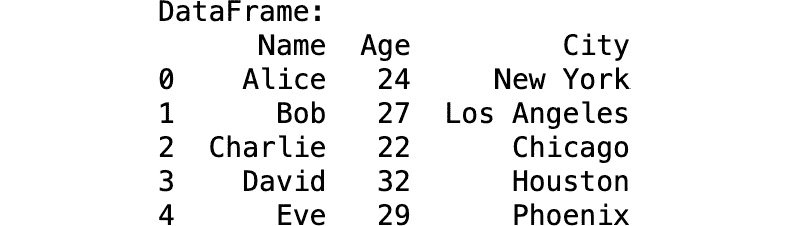
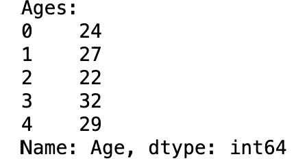
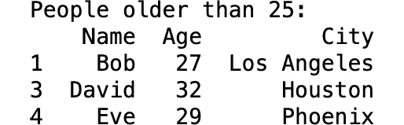
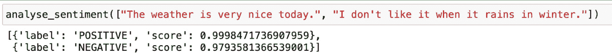
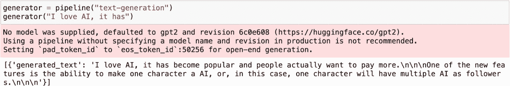
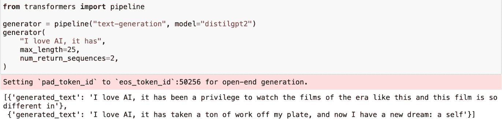

# 有用的框架、库和API

如您所预期，**Python**是构建智能AI应用程序最受欢迎的编程语言。这得益于其灵活性、易用性，以及其庞大的**AI和机器学习**（**ML**）库。Python几乎为构建**生成式AI**（**GenAI**）应用程序所需的全部必要任务提供了专门的库。

在[*第一章*](B22495_01.xhtml#_idTextAnchor009)“开始使用生成式AI”中，您了解了生成式AI堆栈和AI的演变。就像AI景观一样，Python库和框架空间也经历了演变阶段。早期，pandas、NumPy和polars等库用于数据清理和转换工作，而PyTorch、TensorFlow和scikit-learn用于训练机器学习模型。现在，随着生成式AI堆栈、大型语言模型（LLMs）和向量数据库的兴起，一种新的AI框架已经出现。

这些新的库和框架旨在简化由LLMs驱动的应用程序的创建。由于构建生成式AI应用程序需要无缝集成来自多个来源的数据和使用多种AI模型，这些AI框架提供了内置功能，以促进数据的获取、迁移和转换。

本章深入探讨了AI/ML框架的世界，探讨了它们的重要性，并强调了为什么Python成为了AI/ML开发的首选语言。到本章结束时，您将能够理解最流行的框架和库，以及它们如何帮助您——开发者——构建您的生成式AI应用程序。

本章将涵盖以下主题：

+   AI/ML框架

+   Python库

+   公开可用的API和其他工具

# 技术要求

要执行本章中显示的步骤，您需要以下内容：

+   Python的最新主要版本。

+   运行MongoDB版本6.0.11、7.0.2或更高版本的免费层Atlas集群。

+   将您的当前IP地址添加到Atlas项目访问列表中。

+   一个用于在交互式环境中运行Python代码的环境，例如Jupyter Notebook或Colab。本章使用Jupyter Notebook。

# Python用于AI/ML

Python已经在各个领域确立了其作为首选编程语言的地位，但在AI、ML以及构建由**大型语言模型**（**LLMs**）驱动的应用程序方面最为显著。Python提供了简单性、可读性和强大的库生态系统，使其成为所有类型用户的理想选择，无论是开发者、研究人员，还是刚开始接触编程的学生。Python也已成为构建新的LLM驱动应用程序的首选语言，这凸显了Python的有用性、流行性和多功能性。

在本节中，您将了解一些使Python成为构建现代AI驱动应用程序的绝佳选择的理由：

+   **简洁性和可读性**：Python的语法设计旨在直观且清晰，这是其核心优势之一。Python可以用几行易于阅读和理解代码来表示复杂的算法和任务。

+   **丰富的库和框架生态系统**：Python提供了一系列专门为AI/ML用例设计的库和框架。例如，TensorFlow、PyTorch和scikit-learn等库在机器学习任务中一直很受欢迎。Hugging Face的Transformers库也已成为构建现代LLM应用程序的开发者工作流程中不可或缺的一部分。它提供了预训练模型和简单的API，以便针对特定任务微调模型。这些库不仅加速了开发时间，还为全球的开发者提供了前沿的解决方案。

+   **强大的社区和支持**：Python是世界上最受欢迎的编程语言之一，因此拥有庞大的社区。根据Stack Overflow 2023调查([https://survey.stackoverflow.co/2023/](https://survey.stackoverflow.co/2023/))，它是JavaScript（不包括HTML/CSS）之后的第二大受欢迎的编程语言。这个强大且庞大的社区提供了丰富的资源，包括教程、讨论论坛参与和开源项目，为那些致力于构建现代应用程序的人提供了一个有价值的支持系统。

+   **与其他技术的集成**：Python能够无缝集成到其他技术和编程语言中，使其成为AI/ML任务和构建LLM应用程序的绝佳选择。例如，Python可以轻松与C/C++等编程语言接口，用于性能关键任务。它也与Java和C#等语言很好地接口。Python的这种灵活性有助于在多样化的环境中部署LLM应用程序，确保Python可以成为大型异构系统的一部分。

+   **快速原型设计和实验**：构建一个复杂的AI/ML应用程序需要多次测试、实验和微调。Python允许开发者通过几行代码快速构建原型。易于测试和调试也有助于快速原型化解决方案。Python的交互式环境，如Jupyter Notebook，为此提供了一个极好的平台。使用Python，构建LLM应用程序的开发者可以快速测试假设、可视化数据并以交互式方式调试代码。

Python结合了速度、简单性、专业的库和框架以及强大的社区支持，并且易于与其他语言和技术集成，所有这些都使其成为构建现代LLM应用程序的绝佳选择。

# AI/ML框架

**AI/ML 框架**是简化 ML 模型开发和部署的必要工具，提供预构建算法、优化性能和可扩展解决方案。它们使开发者能够专注于优化他们的模型和 GenAI 应用，而不是陷入底层实现的困境。使用框架确保效率、适应性和利用尖端 AI 进步的能力。开发者应该对这些框架感兴趣，因为它们还可以减少开发时间并提高 GenAI 突破的潜力。

MongoDB 与许多开发者可能熟悉的 AI/ML 框架有集成，例如 LangChain、LlamaIndex、Haystack、Microsoft Semantic Kernel、DocArray 和 Flowise。

在本节中，你将了解 **LangChain**，这是最受欢迎的 GenAI 框架之一。尽管它非常受欢迎，但它绝对不是唯一受欢迎的框架。如果你对其他框架感兴趣，你可以查看本书末尾 *附录：进一步阅读* 部分中链接的文档，或者查看 Python 支持的最新 AI/ML 框架列表 [https://www.mongodb.com/docs/languages/python/](https://www.mongodb.com/docs/languages/python/)。

## LangChain

LangChain 是一个用于开发由 LLM 驱动的应用的框架。LangChain 简化了 LLM 应用生命周期的每个阶段。它使构建将外部数据源和计算连接到 LLM 的应用成为可能。基本的 LLM 链仅依赖于提示模板中提供的信息来生成响应，而 *LangChain* 的概念允许你扩展这些链以进行高级处理。

在本节中，你将学习如何使用 LangChain 对你的数据进行语义搜索并构建 **检索增强生成 (RAG**) 实现。在开始之前，请确保你已经安装并设置了本章节 *技术要求* 部分中列出的所有必要工具，作为准备工作。

### 开始使用 LangChain

执行以下步骤以设置 LangChain 的环境：

1.  首先，安装必要的依赖项：

    ```py
    pip3 install --quiet --upgrade langchain==0.1.22 langchain-mongodb==0.1.8 langchain_community==0.2.12 langchain-openai==0.1.21 pymongo==4.5.1 polars==1.5.0 pypdf==3.15.0
    ```

1.  运行以下代码以导入所需的包：

    ```py
    import getpass, os, pymongo, pprint
    from langchain_community.document_loaders import PyPDFLoader
    from langchain_core.output_parsers import StrOutputParser
    from langchain_core.runnables import RunnablePassthrough
    from langchain_mongodb import MongoDBAtlasVectorSearch
    from langchain_openai import ChatOpenAI, OpenAIEmbeddings
    from langchain.prompts import PromptTemplate
    from langchain.text_splitter import RecursiveCharacterTextSplitter
    from pymongo import MongoClient
    ```

1.  在导入必要的包之后，请确保环境变量设置正确。你有两个重要的秘密需要存储为环境变量：你的 **OpenAI API 密钥** 和 **MongoDB Atlas** 连接字符串。

    运行以下命令以将你的 OpenAI API 密钥存储为环境变量：

    ```py
    os.environ["OPENAI_API_KEY"] = getpass.getpass("OpenAI API Key:")
    mongodb+srv://<username>:<password>@<clusterName>.<hostname>.mongodb.net
    ```

    运行以下命令以将你的 MongoDB Atlas 连接字符串存储为环境变量：

    ```py
    ATLAS_CONNECTION_STRING = getpass.getpass("MongoDB Atlas SRV Connection String:")
    ```

    现在，你已经准备好连接到 MongoDB Atlas 集群。

1.  接下来，你需要实例化 `MongoClient` 并将你的连接字符串传递给 MongoDB Atlas 数据库以建立通信。运行以下代码以建立连接：

    ```py
    # Connect to your Atlas cluster
    client = MongoClient(ATLAS_CONNECTION_STRING)
    ```

1.  接下来，您将指定要创建的数据库和集合的名称。在这个例子中，您将创建一个名为 `langchain_db` 的数据库和一个名为 `test` 的集合。您还将定义要创建并使用以下代码的向量搜索索引的名称：

    ```py
    # Define collection and index name
    db_name = "langchain_db"
    collection_name = "test"
    atlas_collection = client[db_name][collection_name]
    vector_search_index = "vector_index"
    ```

通过这些步骤，您已设置连接的基本设置。现在，您有了数据库的骨架，您将想要定义您的应用程序做什么。

在这种情况下，您将执行以下操作：

1.  获取一个公开可访问的 PDF 文档。

1.  将其分割成更小的信息块，以便您的 GenAI 应用程序轻松消费。

1.  将数据上传到 MongoDB 数据库。

此功能不是您必须从头开始构建的。相反，您将使用 LangChain 提供的免费开源库集成，称为 `PyPDFLoader`，您在本文本此部分的 *步骤 2* 中已导入。

### 获取和分割公开 PDF 文档

使用 `PyPDFLoader` 获取公开可用的 PDF 文件相当简单。在以下代码中，您将获取一个公开可访问的 PDF 文档，并将其分割成更小的块，您可以稍后将其上传到您的 MongoDB 数据库中：

```py
# Load the PDF
loader = PyPDFLoader("https://query.prod.cms.rt.microsoft.com/cms/api/am/binary/RE4HkJP")
data = loader.load()
# Split PDF into documents
text_splitter = RecursiveCharacterTextSplitter(chunk_size=200, chunk_overlap=20)
docs = text_splitter.split_documents(data)
# Print the first document
docs[0]
```

然后，您将收到以下输出：

```py
Document(metadata={'source': 'https://query.prod.cms.rt.microsoft.com/cms/api/am/binary/RE4HKJP', 'page': 0}, page_content='Mong oDB Atlas Best Practices January 20 19A MongoD B White P aper')
```

使用此代码，您首先实例化了 `PyPDFLoader`，然后传递了公开可访问的 PDF 文件的 URL：[https://query.prod.cms.rt.microsoft.com/cms/api/am/binary/RE4HkJP](https://query.prod.cms.rt.microsoft.com/cms/api/am/binary/RE4HkJP)。接下来，您将获取的 PDF 文件加载到 `data` 变量中。

之后，您将 PDF 文件的文本分割成更小的块。在这个例子中，您将块大小设置为 200 个字符，并在块之间允许 20 个字符的重叠。重叠保持了块之间的上下文。请注意，这个数字不是随意的，关于您的分块策略应该是什么有很多意见。本书 *附录：进一步阅读* 章节中讨论了一些这些资源。

您将分割的块存储在 `docs` 变量中，并打印了分割文档的第一块。这表明您通过 `print` 命令的输出请求是成功的，您可以轻松地确认此条目中的信息是否正确。

### 创建向量存储

在您将文档分割成块之后，您将使用以下代码实例化向量存储：

```py
# Create the vector store
vector_store = MongoDBAtlasVectorSearch.from_documents(
    documents = docs,
    embedding = OpenAIEmbeddings(disallowed_special=()),
    collection = atlas_collection,
    index_name = vector_search_index
)
```

在前面的代码中，您使用 `MongoDBAtlasVectorSearch.from_documents` 方法创建了一个名为 `vector_store` 的向量存储，并指定了各种参数：

+   `documents = docs`: 您想要存储在向量数据库中的文档名称

+   `embedding = OpenAIEmbeddings(disallowed_special=())`: 使用 OpenAI 的嵌入模型为文档生成向量嵌入的类

+   `collection = atlas_collection`: 文档将存储的 Atlas 集合

+   `index_name = vector_search_index`: 用于查询向量存储的索引名称

您还需要在MongoDB数据库中创建您的**Atlas向量搜索索引**。有关如何操作的详细说明，请参阅[*第8章*](B22495_08.xhtml#_idTextAnchor180)，*在AI应用中实现向量搜索*。这必须在成功运行前面的代码之前完成。在创建向量搜索索引时，请使用以下索引定义：

```py
{
   "fields":[
      {
         "type": "vector",
         "path": "embedding",
         "numDimensions": 1536,
         "similarity": "cosine"
      },
      {
         "type": "filter",
         "path": "page"
      }
   ]
}
```

此索引定义了两个字段：

+   `text-embedding-ada-002`模型。它有1,536个维度，并使用余弦相似度来衡量相似度。您还可能想考虑来自OpenAI的其他一些较新的模型，如`text-embedding-3-small`和`text-embedding-3-large`，这些模型针对不同的用例进行了优化，因此具有不同的维度数。有关更多详细信息以及当前选项，请参阅[https://platform.openai.com/docs/guides/embeddings](https://platform.openai.com/docs/guides/embeddings)。

+   **页面字段**：一种用于根据PDF中的页面编号进行预过滤数据的过滤器类型字段。

现在，您可以成功运行代码，获取一个公开可用的PDF，将其分割成更小的数据部分，并将它们存储在MongoDB Atlas数据库中。完成这些步骤后，您可以执行其他任务，例如运行查询以对您的数据进行语义搜索。您可以在[*第8章*](B22495_08.xhtml#_idTextAnchor180)，*在AI应用中实现向量搜索*和[*第10章*](B22495_10.xhtml#_idTextAnchor214)，*优化语义数据模型以提高准确性*中了解基本语义搜索。

关于这个主题的更多信息，您还可以查阅LangChain的官方文档，可在[https://python.langchain.com/v0.2/docs/integrations/vectorstores/mongodb_atlas/#pre-filtering-with-similarity-search](https://python.langchain.com/v0.2/docs/integrations/vectorstores/mongodb_atlas/#pre-filtering-with-similarity-search)找到。

接下来，让我们探讨一些具体的LangChain功能，这些功能在构建GenAI应用时您会发现非常有用。

## 带分数的LangChain语义搜索

LangChain提供了一些特别有用的方法来对您的数据进行语义搜索并返回一个**分数**。这个分数是指根据语义内容，查询与匹配文档之间的相关性度量。当您想向用户返回多个结果并限制结果数量时，可以使用这个分数。例如，这个分数在返回关于某个主题的前三个最相关内容时可能非常有用。

您将在这里使用的方法是`similarity_search_with_score`：

```py
query = "MongoDB Atlas security"
results = vector_store.similarity_search_with_score(
   query = query, k = 3
)
pprint.pprint(results)
```

您将查询传递给`similarity_search_with_score`函数，并将`k`参数指定为`3`以限制返回的文档数量为3。然后，您可以打印输出：

```py
[(Document (page_content='To ensure a secure system right out of the box, \nauthentication and IP Address whitelist ing are\nautomatically enabled. \nReview the security section of the MongoD B Atlas', metadata={'_id': {'Soid": "667 20a81b6cb1d87043c0171'), 'source': 'https://query.prod.cms.rt.microsoft.com/cms/api/am/binary/RE4HKJP', 'page': 17}),
0.9350903034210205),
(Document(page_content='MongoD B Atlas team are also monitoring the underlying\ninfrastructure, ensuring that it i s always in a healthy state. \nApplication Logs And Database L ogs', metadata={'_id': {'soid': '66720a81b6cb1d87043 c013c'), 'source': 'https://query.prod.cms.rt.microsoft.com/cms/api/am/binary/RE4HKJP', 'page': 15}),
0.9336163997650146),
(Document(page_content="MongoD B.\nMongoD B Atlas incorporates best practices to help keep\nmanaged databases heal thy and optimized. T hey ensure\noperational continuity by converting complex manual tasks', metadata={'_id': {'so id: '66728a81b6cb1d87043c011f'), 'source': 'https://query.prod.cms.rt.microsoft.com/cms/api/am/binary/RE4HKJP', 'p age': 13)),
0.9317773580551147)]
```

正如您在输出中看到的，返回了三个具有最高相关性分数的文档。每个返回的文档都附有一个介于0到1之间的相关性分数。

## 带有预过滤的语义搜索

MongoDB允许你使用match表达式预过滤数据，以在执行更计算密集型的向量搜索之前缩小搜索范围。这为开发者提供了几个好处，例如提高性能、提高准确性和增强查询相关性。在预过滤时，请记住在创建索引时对任何你想要过滤的元数据字段进行索引。

这里有一个代码片段，展示了如何使用预过滤进行语义搜索：

```py
query = "MongoDB Atlas security"
results = vector_store.similarity_search_with_score(
   query = query,
   k = 3,
   pre_filter = { "page": { "$eq": 17 } }
)
pprint.pprint(results)
```

在此代码示例中，你有与之前执行普通语义搜索相同的查询字符串。`k`值设置为`3`，因此它只返回最匹配的前三个文档。你还提供了一个`pre_filter`查询，这基本上是一个MQL表达式，使用`$eq`运算符指定MongoDB应仅返回位于原始PDF文档第`17`页的内容和分块信息。

## 使用LangChain实现基本的RAG解决方案

LangChain的功能不仅限于在存储在向量数据库中的数据上执行语义搜索查询。它还允许你构建强大的GenAI应用程序。以下代码片段将教你一种简单的方法来完成以下操作：

+   设置一个基于相似性的MongoDB Atlas Vector Search检索器。

+   返回最相关的10个文档。

+   使用带有LLM的自定义RAG提示来根据检索到的文档回答问题：

```py
# Instantiate Atlas Vector Search as a retriever
retriever = vector_store.as_retriever(
   search_type = "similarity",
   search_kwargs = { "k": 3 }
)
# Define a prompt template
template = """
Use the following pieces of context to answer the question at the end.If you don't know the answer, just say that you don't know, don't try to make up an answer.
{context}
Question: {question}
"""
custom_rag_prompt = PromptTemplate.from_template(template)
llm = ChatOpenAI()
def format_docs(docs):
   return "\n\n".join(doc.page_content for doc in docs)
# Construct a chain to answer questions on your data
rag_chain = (
   { "context": retriever | format_docs, "question": RunnablePassthrough()}
   | custom_rag_prompt
   | llm
   | StrOutputParser()
)
# Prompt the chain
question = "How can I secure my MongoDB Atlas cluster?"
answer = rag_chain.invoke(question)
print(«Question: « + question)
print(«Answer: « + answer)
# Return source documents
documents = retriever.get_relevant_documents(question)
print(«\nSource documents:»)
pprint.pprint(documents)
```

上一段代码将Atlas Vector Search实例化为`k`值为`3`，以仅搜索最相关的三个文档。

在前面的代码中，注意包含`custom_rag_prompt = PromptTemplate.from_template(template)`的行。它指的是提示模板，这些模板将在下一节中详细介绍。

## LangChain提示模板和链

`context`作为输入变量和LLM的原始查询。

让我们设置一个**链**，这是LangChain的一个关键特性，它指定了三个主要组件：

+   **Retriever**：你将使用MongoDB Atlas Vector Search找到为语言模型提供上下文的文档。

+   **提示模板**：这是你之前创建的用于格式化查询和上下文的模板。

+   **LLM**：你将使用OpenAI聊天模型根据提供的上下文生成响应。

你将使用此链处理有关MongoDB Atlas安全建议的示例输入查询，格式化查询，检索查询结果，然后返回一个响应给用户，并附带用作上下文的文档。由于LLM的变异性，你很可能永远不会收到完全相同的两次响应，但以下是一个显示潜在输出的示例：

```py
Question: How can I secure my MongoDB Atlas cluster?
Answer: To secure your MongoDB Atlas cluster, you can enable authentication and IP Address whitelisting, review the security section of the MongoDB Atlas documentation, and utilize encryption of data at rest with encrypted storage volumes. Additionally, you can set up global clusters with a few clicks in the MongoDB Atlas UI, ensure operational continuity by converting complex manual tasks, and consider setting up a larger number of replica nodes for increased protection against database downtime.
Source documents:
[Document (page_content='To ensure a secure system right out of the box, \nauthentication and IP Address whitelisti ng are\nautomatically enabled.\nReview the security section of the MongoD B Atlas', metadata={'_id': {'$oid': '6672
@a81b6cb1d87043c0171'), 'source': 'https://query.prod.cms.rt.microsoft.com/cms/api/am/binary/RE4HKJP', 'page': 17}),
Document(page_content='MongoD B Atlas team are also monitoring the underlying\ninfrastructure, ensuring that it is always in a healthy state. \nApplication L ogs And Database L ogs', metadata('id': ('soid': '66728a81b6cb1d87043c0 13c'), 'source': 'https://query.prod.cms.rt.microsoft.com/cms/api/am/binary/RE4HKJP', 'page': 15}),
Document(page_content='All the user needs to do in order for MongoD B Atlas to\nautomatically deploy the cluster i s to select a handful of\noptions: \n Instance size\n•Storage size (optional) \n Storage speed (optional)', metadata= {"_id": "soid: '66728a81b6cb1d87043c012a'), 'source': 'https://query.prod.cms.rt.microsoft.com/cms/api/am/binary/ RE4HKJP', 'page': 14)),
```

此输出不仅回答了用户的问题，还提供了来源信息，这不仅增加了用户的信任，还增强了用户根据需要跟进并获得更多细节的能力。

这个对 LangChain 框架的简要概述试图说服您这个框架的实用性和潜力，并为您提供一个其功能的预览，以便在构建您的 GenAI 应用程序时节省宝贵的时间。

# 关键 Python 库

除了 AI/ML 框架之外，还有许多 Python 库可以使构建您的 GenAI 应用程序的过程更加容易。无论您是否需要数据清理、格式化或转换的帮助，都可能有一打潜在的 Python 库可以解决每个问题。以下小节列出了一些最受欢迎的库，并解释了它们如何在您的 GenAI 之旅中帮助您。

对于这本书，您可以将这些库大致分为三个类别：

+   **通用科学库**，如 pandas、NumPy 和 scikit-learn

+   **MongoDB 特定库**，如 PyMongoArrow

+   **深度学习框架**，如 PyTorch 和 TensorFlow

本节的其余部分涵盖了这些类别中每个相关且流行的库

## pandas

pandas 库是一个功能强大且灵活的开源 Python 数据操作和分析库。它提供了 DataFrame 和 Series 等数据结构，这些结构旨在直观且高效地处理结构化数据。当处理存储在电子表格或数据库中的表格数据时，pandas 是数据分析的一个优秀工具。使用 pandas，您可以执行各种操作，包括数据清理、转换和聚合。

在许多其他引人注目的开箱即用功能中，pandas 还提供了对时间序列的出色支持，并有一套广泛的工作于日期、时间和时间索引数据的工具。除了提供广泛的方法来处理数值数据外，pandas 还为基于文本的数据提供了强大的支持。

下面是一个如何使用 pandas 库的简短示例。在下面的示例中，您将从一个 Python 字典创建一个 pandas DataFrame。然后，您将打印整个 DataFrame。接下来，您将选择一个特定的列，即 `Age`，并打印它。然后，您将通过行标签或行的特定位置来过滤数据。

下一个示例显示了如何在 pandas 中使用布尔掩码过滤数据。在这里，您将打印出 DataFrame 格式：

```py
pip3 install pandas==1.5.3
import pandas as pd
# Create a DataFrame
data = {
    'Name': ['Alice', 'Bob', 'Charlie', 'David', 'Eve'],
    'Age': [24, 27, 22, 32, 29],
    'City': ['New York', 'Los Angeles', 'Chicago', 'Houston', 'Phoenix']
}
df = pd.DataFrame(data)
# Display the DataFrame
print("DataFrame:")
print(df)
```

您的输出应采用与 *图 7.1* 类似的 pandas DataFrame 格式：



图 7.1：pandas 的 DataFrame 输出

您可以通过各种方式操作这些数据，每次输出您认为合适的结果，但始终以 pandas DataFrame 的格式输出。要打印用户的年龄，您可以使用以下代码：

```py
# Select a column
print("\nAges:")
print(df['Age'])
```

您将得到 *图 7.2* 中所示的输出：



图 7.2：年龄的 DataFrame 输出

您还可以过滤输出。在这里，您将过滤数据以仅显示年龄大于 25 的人，然后将结果作为 DataFrame 展示：

```py
# Filter data
print("\nPeople older than 25:")
print(df[df['Age'] > 25])
```

此代码将过滤数据，然后将结果以 DataFrame 格式输出，如图 *图 7**.3*：



图 7.3：过滤后的 DataFrame 输出

你也可以以直接的方式使用 pandas 库进行计算。例如，要计算平均年龄，你会使用如下代码：

```py
# Calculate average age
average_age = df['Age'].mean()
print("\nAverage Age:")
print(average_age)
```

你的输出将类似于 *图 7**.4*：


图 7.4：计算字段输出

如你所见，pandas 中的数据处理相当简单，输出立即可读，并且格式良好，便于进一步分析。pandas 直观的语法和强大的功能使其成为 Python 开发者的必备工具，使他们能够轻松且精确地处理大型数据集。对于构建 GenAI 应用程序的开发者来说，pandas 简化了数据预处理步骤，确保数据干净、结构化，并准备好进行模型训练。此外，它与其他 Python 库的强大集成增强了其效用，使复杂的数据分析和可视化变得简单高效。

## PyMongoArrow

**PyMongoArrow** 是一个基于官方 MongoDB Python 驱动程序 **PyMongo** 构建的 Python 库，它允许你将数据从 MongoDB 数据库移动到一些最受欢迎的 Python 库中，如 pandas、NumPy、PyArrow 和 polars，反之亦然。

PyMongoArrow 简化了将数据从 MongoDB 加载到其他支持的数据格式。下面提到的示例展示了如何使用 MongoDB、PyMongoArrow 以及 pandas 和 NumPy 等库。在以下情况下，你可能会在 GenAI 应用程序中找到这很有用：

+   当你需要从 MongoDB 获取特定格式的数据（CSV、DataFrame、NumPy 数组、Parquet 文件等）进行总结和分析时

+   如果你需要合并各种类型的数据进行计算或转换，然后用于 GenAI 分析

例如，如果你有来自 *Application A* 的入境财务数据，来自 *Application B* 的入境销售数据，来自 *Team 1* 的 PDF 文件，以及来自 *Team 2* 的 `.txt` 文件，并且你希望你的 GenAI 应用程序能够总结来自所有这些不同地方年度数据，那么如果所有类型的数据都处于相同的格式，你可能会得到更准确的结果。这将需要一些前期编程工作，而 PyMongoArrow 简化了将 MongoDB JSON 转换为其他数据类型以及将这些其他数据类型转换为 JSON 的过程。

按照以下步骤使用 PyMongoArrow 完成此示例：

1.  首先，安装并导入 PyMongoArrow 的最新版本：

    ```py
    pip3 install PyMongoArrow
    import pymongoarrow as pa
    ```

1.  现在，请确保你手头有 Atlas 集群连接字符串：

    ```py
    import getpass, os, pymongo, pprint
    ```

1.  接下来，您将通过 `pymongoarrow.monkey` 模块扩展 PyMongo 驱动程序。这允许您直接将 PyMongoArrow 功能添加到 Atlas 中的 MongoDB 集合中。通过从 `pymongoarrow.monkey` 调用 `patch_all()`，新的集合实例将包括 PyMongoArrow API，例如 `pymongoarrow.api.find_pandas_all()`。这很有用，因为您现在可以轻松地将数据从 MongoDB 导出为各种格式，如 pandas。

    ```py
    from pymongoarrow.monkey import patch_all
    patch_all()
    ```

1.  向您的集合添加一些测试数据：

    ```py
    from datetime import datetime
    from pymongo import MongoClient
    client = MongoClient(ATLAS_CONNECTION_STRING)
    client.db.data.insert_many([
      {'_id': 1, 'amount': 21, 'last_updated': datetime(2020, 12, 10, 1, 3, 1), 'account': {'name': 'Customer1', 'account_number': 1}, 'txns': ['A']},
      {'_id': 2, 'amount': 16, 'last_updated': datetime(2020, 7, 23, 6, 7, 11), 'account': {'name': 'Customer2', 'account_number': 2}, 'txns': ['A', 'B']},
      {'_id': 3, 'amount': 3,  'last_updated': datetime(2021, 3, 10, 18, 43, 9), 'account': {'name': 'Customer3', 'account_number': 3}, 'txns': ['A', 'B', 'C']},
      {'_id': 4, 'amount': 0,  'last_updated': datetime(2021, 2, 25, 3, 50, 31), 'account': {'name': 'Customer4', 'account_number': 4}, 'txns': ['A', 'B', 'C', 'D']}])
    ```

1.  PyMongoArrow 使用一个 `schema` 对象，并将字段名映射到类型指定符：

    ```py
    from pymongoarrow.api import Schema
    schema = Schema({'_id': int, 'amount': float, 'last_updated': datetime})
    ```

    MongoDB 的关键特性是它能够使用嵌入文档表示嵌套数据，同时支持列表和嵌套列表。PyMongoArrow 默认完全支持这些特性，为处理嵌入文档、列表和嵌套列表提供了第一级功能。

1.  让我们在数据上执行一些 `find` 操作。以下代码演示了使用 PyMongoArrow 将查询结果转换为不同数据格式，查询名为 `data` 的 MongoDB 集合中 `amount` 字段大于 `0` 的文档。用于转换的预定义模式是可选的。如果您省略模式，PyMongoArrow 将尝试根据第一批数据自动应用模式：

    ```py
    df = client.db.data.find_pandas_all({'amount': {'$gt': 0}}, schema=schema)
    arrow_table = client.db.data.find_arrow_all({'amount': {'$gt': 0}}, schema=schema)
    df = client.db.data.find_polars_all({'amount': {'$gt': 0}}, schema=schema)
    ndarrays = client.db.data.find_numpy_all({'amount': {'$gt': 0}}, schema=schema)
    ```

    第一行代码将查询结果转换为 pandas DataFrame。第二行代码将查询结果集转换为 arrow 表。第三行将查询结果集转换为 polars DataFrame，最后，第四行将查询结果集转换为 NumPy 数组。

您不仅限于执行 `find` 操作将查询结果集转换为其他支持的数据格式。PyMongoArrow 还允许您使用 MongoDB 强大的聚合管道对数据进行复杂查询，以在导出到其他数据格式之前过滤出所需的数据。

例如，以下代码在 MongoDB 数据库的数据集合上执行聚合查询，将所有文档分组并计算 `amount` 字段的总额：

```py
df = client.db.data.aggregate_pandas_all([{'$group': {'_id': None, 'total_amount': { '$sum': '$amount' }}}])
```

此代码的结果被转换为包含总计的 pandas DataFrame。

## PyTorch

既然您已经对 pandas 和 NumPy 有了一些了解，那么了解另一个流行的 Python 机器学习库 PyTorch 也是非常重要的。

由 Meta 的 AI 研究实验室开发的 PyTorch 是一个开源的深度学习框架，以其灵活性和易用性而闻名。它因其动态计算图而广受欢迎，这使得代码的直观编码和即时执行成为可能。这一特性对于需要快速实验和迭代的研发人员尤其有用。

在构建 GenAI 应用程序的情况下，PyTorch 是以下方面的强大工具：

+   **模型训练和开发**：PyTorch被用于开发和训练核心生成模型，例如**生成预训练转换器**（**GPT**）变体，这些变体构成了GenAI应用的基础。

+   **灵活性和实时实验**：PyTorch中的动态计算图允许即时修改和实时实验，这对于微调生成模型以产生高质量输出至关重要。

正在将预训练语言模型适应其特定要求或为其独特任务开发自定义模型的开发者可能会对使用此库以及下一节中讨论的一些API感兴趣。

# AI/ML APIs

在开发GenAI应用时，开发者可以访问各种API，这些API可以显著增强他们项目的功能和效率。由于这些API被广泛使用，它们在数千个项目中提供了性能、稳定性和一致性，确保开发者无需重新发明轮子。以下只是这些API提供的一些功能：

+   **文本生成和处理**：如**OpenAI**、**Hugging Face**和**Google Gemini API**等API使开发者能够生成连贯且符合上下文的文本，这对于内容创作、对话系统和虚拟助手等应用至关重要。

+   **翻译功能**：**Google Cloud Translation API**、**Azure AI Translator**和**Amazon Translate API**提供了强大的翻译功能，使GenAI应用能够实现多语言和全球可访问性。

+   **语音合成和识别**：如**Google Text-to-Speech**、**Amazon Polly**和**IBM Watson Text-to-Speech**等服务将生成的文本转换为自然流畅的语音，从而增强用户交互和可访问性。

+   **图像和视频处理**：**Clarifai**和**DeepAI**的API允许GenAI应用创建、修改和分析视觉内容，从而实现从文本生成图像和对象识别等任务。

这些API提供了一系列功能，当结合使用时，可以显著加速GenAI应用的开发并增强其功能。接下来，你将深入了解其中的两个API，即OpenAI API和Hugging Face Transformers API。

## OpenAI API

如您从[*第3章*](B22495_03.xhtml#_idTextAnchor041)“大型语言模型”中回忆起的那样，OpenAI提供了一个基于广泛数据集的基础模型。它通过API提供此模型，允许您利用高级机器学习模型的力量，而无需管理底层基础设施。重新训练或托管针对组织或特定领域信息定制的自定义LLM的计算和财务成本非常高，因此大多数开发者将利用他人的LLM为他们的应用提供GenAI功能。

尽管每个API都有自己的优点和缺点，但OpenAI API目前是最广泛使用的。它为开发者提供了一个简单的接口，以便在他们的应用程序中创建智能层。它由OpenAI最先进的模型和前沿的**自然语言处理**（NLP）能力提供支持，使应用程序能够执行文本生成、摘要、翻译和对话等任务。该API设计得灵活且可扩展，适用于从聊天机器人到内容创作工具的广泛用例。它还拥有良好的文档记录，拥有庞大的社区，并且针对几乎每个用例都有许多教程。

OpenAI API已经成为了某种行业标准，许多生成式AI工具和技术都支持并与它无缝集成。如果你想避免不必要的努力和成本，最佳选择是与OpenAI API合作。

让我们在以下示例中开始使用OpenAI API：

1.  要开始，你需要从终端或命令行安装`openai`：

    ```py
    pip3 install --upgrade openai==1.41.0
    ```

1.  在环境变量文件中包含你的OpenAI API密钥：

    ```py
    export OPENAI_API_KEY='your-api-key-here'
    ```

1.  使用Python库向OpenAI API发送第一个API测试请求。为此，使用终端或IDE创建一个名为`openai-test.py`的文件。然后，在文件内部，复制并粘贴以下示例之一：

    ```py
    from openai import OpenAI
    client = OpenAI()
    completion = client.chat.completions.create(
      model="gpt-4o-mini",
      messages=[
        {"role": "system", "content": "You are a poetic assistant, skilled in explaining complex programming concepts with creative flair."},
        {"role": "user", "content": "Compose a poem that explains the concept of recursion in programming."}
      ]
    )
    print(completion.choices[0].message)
    ```

1.  通过在终端或命令行中输入`python openai-test.py`来运行代码。这将输出一首关于递归的创意诗。每个结果都是不同的，因为GPT会每次都使用创造力来创造新的东西。这是它在这次尝试中创造的：

    ```py
    In code’s endless labyrinth, a tale is spun,
    Of functions nested deep, where paths rerun.
    A whisper in the dark, a loop within,
    Where journeys start anew as they begin.
    Behold the call, a serpent chasing tail,
    The dragon’s circle, a fractal’s holy grail.
    In depths unseen, the echoing refrain,
    A self-same mirror where the parts contain.
    A climb up winding stairs, each step the same,
    Yet every twist, a slight and altered game.
    In finite bounds, infinity unfurls,
    A loop of dreams within its spiral swirls.
    ```

    结果令人惊讶地好。你应该亲自尝试一下，看看会创作出什么样的新创意诗。

GPT擅长回答问题，但仅限于它能从其训练数据中回忆起来的主题。在大多数情况下，你希望GPT回答关于你的业务或产品的问题，或者回答用户经常提出的问题。在这种情况下，你希望添加搜索你自己的文档库中相关文本的能力，然后让GPT使用这些文本作为其响应的参考信息。这被称为RAG，你可以在[*第8章*](B22495_08.xhtml#_idTextAnchor180)，*在AI应用中实现向量搜索*中了解更多信息。

## Hugging Face

**Hugging Face**是一个突出的AI社区和机器学习平台。其生态系统是**Hugging Face Hub**，一个旨在促进AI社区合作和创新的平台。该Hub位于[https://huggingface.co/docs/hub/en/index](https://huggingface.co/docs/hub/en/index)，截至编写时，拥有超过12万个模型、2万个数据集和5万个演示，是可用的最大机器学习资源集合之一。它具有以下特点：

+   **广泛的模型存储库**：Hub包括各种任务的预训练模型，如文本分类、翻译、摘要和问答，为开发者提供了广泛的选择。

+   **数据集**：它提供了对多种数据集的访问，这些数据集对于训练和评估机器学习模型至关重要。数据集涵盖多个领域和语言，支持开发稳健和通用的AI应用。

+   **社区和协作**：该平台通过允许用户共享模型、数据集和代码来支持协作。开发者可以通过上传自己的模型和数据集来为社区做出贡献，营造一个协作的环境。

+   **集成和部署选项**：Hugging Face Hub无缝集成到流行的机器学习框架中，如PyTorch和TensorFlow。Hub还提供部署解决方案，使开发者能够轻松地将模型部署到生产环境中。

GenAI应用开发者可以使用**Hugging Face Transformers API**来访问特定数据集上针对特定任务的数千个预训练机器学习模型。使用transformer模型，您可以使用预训练模型进行推理或使用PyTorch和TensorFlow库用您自己的数据进行微调。

为了说明您的GenAI应用可能实现的功能，让我们看看如何使用预训练的transformer模型进行推理以执行两个任务：基本的情感分析和文本生成。如果您想对客户反馈进行排序或根据情感进行评分并生成响应，这两个任务对您的GenAI项目都可能很有用。

### 情感分析

您将使用`transformers`库来利用共享模型，然后探索`pipeline()`函数，这是`transformers`库的核心组件。此函数无缝地将模型与必要的预处理和后处理步骤集成，允许直接输入文本并生成可理解的响应：

1.  首先，确保您已安装必要的软件包。请注意，至少应安装TensorFlow或PyTorch中的一个。在这里，我们将使用TensorFlow：

    ```py
    pip3 install transformers tensorflow
    ```

1.  接下来，导入`pipeline()`函数。您还将创建一个`pipeline()`函数的实例，并指定您想使用它的任务，即情感分析：

    ```py
    from transformers import pipeline
    analyse_sentiment = pipeline(«sentiment-analysis»)
    analyse_sentiment("The weather is very nice today.")
    ```

    您将收到以下输出：


图7.5：Hugging Face Transformers情感分析输出

该模型执行分析并输出标签和分数。`标签`表示情感类型为正面或负面，而`分数`表示对输出的置信度。

您还可以将多个输入文本作为数组传递给模型进行情感分类：

```py
analyse_sentiment(["The weather is very nice today.", "I don't like it when it rains in winter."])
```

您将收到以下输出：



图7.6：Hugging Face中用于情感分类的多个输入文本

在这种情况下，模型输出一个对象数组。每个输出对象对应于单个文本输入。

你可能正在屏住呼吸，期待事情变得更加复杂——但它们不会。你只需用几行代码就在Hugging Face上完成了第一次情感分析。

### 文本生成

除了情感分析，你还可以使用Transformers库执行许多其他NLP任务，例如文本生成。在这里，你将提供一个提示，模型将通过生成剩余的文本来自动完成它：

```py
generator = pipeline("text-generation")
generator("I love AI, it has")
```

对于前面的代码，你将得到以下输出：



图7.7：使用Hugging Face Transformers进行文本生成

由于你没有为管道实例提供模型名称，它决定使用默认的，在这种情况下是GPT-2。你可能或可能不会得到这里的结果，因为文本生成涉及一些随机性。然而，你仍然可以看到这项任务是多么简单。

接下来，指定在文本生成时`pipeline`函数中要使用的模型名称。以下代码提供了更多自定义细节，例如要生成的不同序列的数量和输出文本的最大长度：

```py
generator = pipeline("text-generation", model="distilgpt2")
generator(
    "I love AI, it has",
    max_length=25,
    num_return_sequences=2,
)
```

在提供这些附加参数后，你现在将收到以下输出：



图7.8：带有参数的Hugging Face文本生成输出

前面的代码输出了两对不同对的文本，每对都少于25个单词。

如你所料，Hugging Face提供了许多更多工具和功能，开发者可以使用它们来构建他们的GenAI应用。凭借其全面的库支持和活跃的社区，Hugging Face继续成为推进NLP和ML项目的关键资源。此外，它与各种AI/ML框架的无缝集成确保了开发者可以以最小的努力和最大的生产力高效地部署和扩展他们的GenAI模型。

# 摘要

在本章中，你了解了Python空间中AI/ML框架的演变，因为LLM驱动的应用已经变得突出。你还学习了为什么Python仍然是构建现代LLM驱动应用的首选。你回顾了最流行的Python框架、库和API，这些可以帮助你在GenAI应用开发的各个阶段。

GenAI领域正在迅速发展，到这本书出版的时候，可能会有更多的库可用，更多的API在应用中，并且框架的功能也将得到扩展。你欠自己一份责任，去深入了解哪个框架最适合你的业务需求，同时也要确保选择一个得到适当支持的框架。正如任何快速发展的技术一样，今天存在的某些工具和技术明天可能就会消失。因此，本章试图只包括那些拥有社区、支持能力和功能集，以确保其长期存在的工具。

毫无疑问，仍有大量的创新工作要做，以及新的工具需要被创造，即使在短期内——本章讨论的工具也只是冰山一角。因此，深吸一口气，开始你自己的探索之旅。你不可避免地会意识到你需要一些工具，并且你有太多的选择来满足这些需求。

在下一章中，你将探索如何利用 MongoDB Atlas 的向量搜索功能来创建智能应用。你将了解 RAG 架构系统，并通过对 MongoDB Atlas 的各种复杂 RAG 架构模式进行深入了解。
