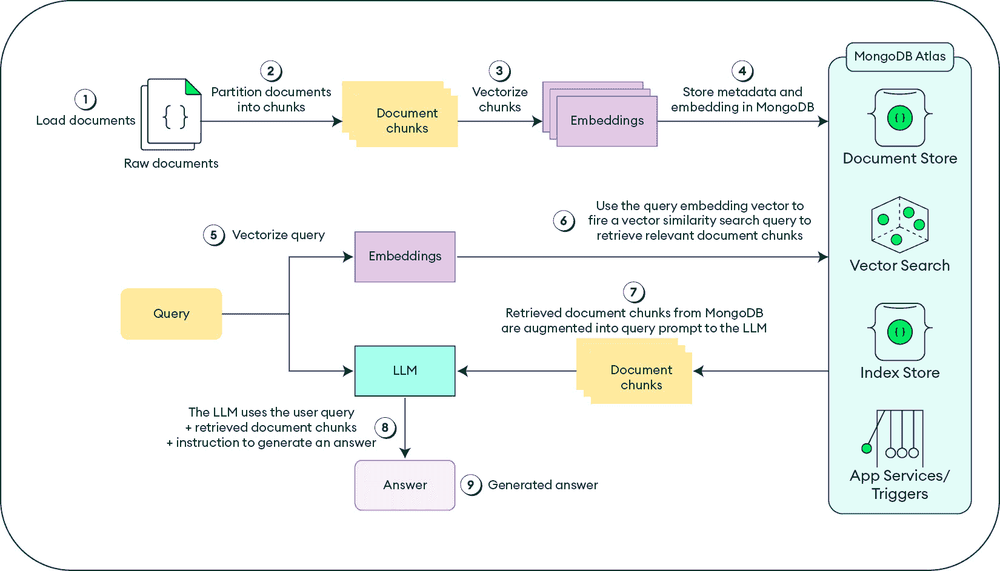
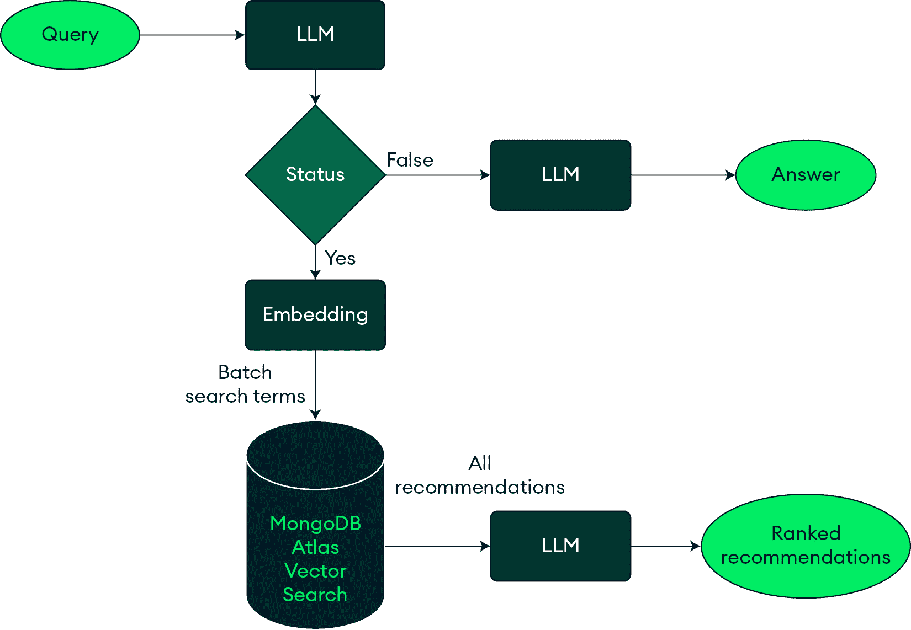

# 8

# 在AI应用中实现向量搜索

向量搜索正在改变人们与AI应用中数据交互的方式。MongoDB Atlas向量搜索允许开发者实现理解发现和检索细微差别的复杂搜索功能。它通过将文本、视频、图像或音频文件转换为数值向量表示，然后可以高效地存储和搜索。MongoDB Atlas可以在您的运营数据旁边执行相似度搜索，使其成为增强从电子商务到内容发现等应用程序用户体验的必备工具。使用MongoDB Atlas，设置向量搜索流程简化，使开发者能够专注于创建动态、响应和智能的应用程序。

在本章中，您将学习如何使用MongoDB Atlas的向量搜索功能构建智能应用程序。您将学习如何构建**检索增强生成**（**RAG**）架构系统，并深入了解使用MongoDB Atlas理解和开发各种复杂RAG架构模式，揭示其联合价值和潜力的协同效应。通过实际用例和实践演示，您将了解这对动态组合如何无缝地改变各行业的业务，推动效率、准确性和运营卓越。

本章涵盖了以下主题：

+   利用MongoDB Atlas的向量搜索和全文搜索，这将有助于您构建一个强大的RAG检索器

+   理解在RAG系统开发中涉及的各个组件

+   了解简单RAG和高级RAG系统开发的过程和步骤。

# 技术要求

本章假设您至少具备Python编码的入门级专业知识。为了跟随演示，您需要通过完成以下步骤来设置您的开发环境：

1.  在您选择的操作系统上安装`python@3.9`或`python@3.11`。

1.  设置并激活Python虚拟环境：

    ```py
    $ python3 -m venv venv
    $ source venv/bin/activate
    ```

1.  您将使用以下包来开发本章中描述的演示：

    +   `pandas`: 帮助进行数据预处理和处理

    +   `numpy`: 处理数值数据

    +   `openai`: 用于嵌入模型和调用LLM

    +   `pymongo`: 用于MongoDB Atlas向量存储和全文搜索

    +   `s3fs`: 允许直接从S3存储桶加载数据

    +   `langchain_mongodb`: 使您能够使用LangChain包装器在MongoDB Atlas中实现向量搜索

    +   `langchain`: 用于构建RAG应用

    +   `langchain-openai`: 使您能够与OpenAI聊天模型交互

    +   `boto3`: 使您能够与AWS s3存储桶交互

    +   `python-dotenv:` 使您能够从`.env`文件中加载环境变量

    要在您的Python虚拟环境中安装所提到的包，请运行以下命令：

    ```py
    pip3 install langchain==0.2.14 langchain-community==0.2.12 langchain-core==0.2.33 langchain-mongodb==0.1.8 langchain-openai==0.1.22 langchain-text-splitters==0.2.2 numpy==1.26.4 openai==1.41.1 s3fs==2024.6.1 pymongo==4.8.0 pandas==2.2.2 boto3==1.35.2 python-dotenv==1.0.1
    ```

    您还需要了解如何设置和运行JupyterLab或Jupyter Notebook。

# 使用MongoDB Atlas Vector Search进行信息检索

信息检索是RAG系统的关键组成部分。它通过从广泛的知识库中获取信息，提高了生成文本的准确性和相关性。这个过程使得RAG系统能够生成既精确又基于事实内容的响应，使其成为各种**自然语言处理**（**NLP**）任务的有力工具。通过有效地结合检索与生成，RAG解决了与偏见和错误信息相关的挑战，为AI相关应用和任务的进步做出了贡献。

在信息检索的背景下，区分*相关性*和*相似性*是至关重要的。虽然**相似性**关注于词匹配，但**相关性**是关于思想的相互联系。虽然向量数据库查询可以帮助识别语义相关的内容，但需要更高级的工具来准确检索相关信息。

在*第5章*，*向量数据库*中，你学习了MongoDB Atlas Vector Search以及它是如何通过允许创建和索引向量嵌入（可以使用机器学习模型，如嵌入模型生成）来增强相关信息的检索。这促进了语义搜索功能，能够识别出在上下文中相似的内容，而不仅仅是基于关键词。全文搜索通过提供强大的文本搜索能力来补充这一点，可以处理拼写错误、同义词和其他文本变化，确保搜索返回最相关的结果。这些工具共同提供了一种全面的搜索解决方案，可以根据术语的相似性和内容的关联性来识别和检索信息。

## Python中的向量搜索教程

通过一个示例，让我们看看如何将小型数据集加载到MongoDB中，以执行向量搜索和全文搜索以进行信息检索。为此演示，你将从一个S3存储桶中加载一个示例电影数据集：

1.  编写一个简单的Python函数，接受搜索词或短语，并将其通过嵌入API再次传递以获取查询向量。

1.  将生成的查询向量嵌入取出来，并使用MongoDB聚合管道中的`$vectorsearch`（[向量搜索](https://www.mongodb.com/docs/atlas/atlas-vector-search/vector-search-stage/)）运算符执行向量搜索查询。

1.  使用元信息对文档进行预过滤，以缩小数据集上的搜索范围，从而加快向量搜索结果的处理速度，同时保持准确性。

1.  此外，如果您想展示对语义搜索行为的更高程度的控制，可以对语义上相似的检索到的文档进行后过滤（基于相关性分数）。

1.  初始化OpenAI API密钥和MongoDB连接字符串：

    ```py
    import os
    import getpass
    # set openai api key
    try:
        openai_api_key = os.environ["OPENAI_API_KEY"]
    except KeyError:
        openai_api_key = getpass.getpass("Please enter your OPENAI API KEY (hit enter): ")
    # Set MongoDB Atlas connection string
    try:
        MONGO_CONN_STR = os.environ["MONGODB_CONNECTION_STR"]
    except KeyError:
        MONGO_CONN = getpass.getpass("Please enter your MongoDB Atlas Connection String (hit enter): ")
    ```

1.  现在，从S3存储桶中加载数据集。在Jupyter Notebook中运行以下代码行以直接从AWS S3存储桶读取数据到`pandas` DataFrame：

    ```py
    import pandas as pd
    import s3fs
    df = pd.read_json("https://ashwin-partner-bucket.s3.eu-west-1.amazonaws.com/movies_sample_dataset.jsonl", orient="records", lines=True)
    df.to_json("./movies_sample_dataset.jsonl", orient="records", lines=True)
    df[:3]
    ```

    执行前面的代码片段后，你应该在你的Jupyter Notebook单元格中看到以下结果。


图8.1：样本电影数据视图

1.  初始化并运行一个嵌入作业以嵌入`sample_movies`数据集。在下面的代码示例中，你创建了一个`final`字段，这是一个从数据集中已存在的`text`和`overview`字段派生出来的字段。

1.  接下来，运行此`final`字段与OpenAI的嵌入API，如图所示：

    ```py
    import numpy as np
    from tqdm import tqdm
    import openai
    df['final'] = df['text'] + "    Overview: " + df['overview']
    df['final'][:5]
    step = int(np.ceil(df['final'].shape[0]/100))
    embeddings_t = []
    lines = []
    # Note that we must split the dataset into smaller batches to not exceed the rate limits imposed by OpenAI API's.
    for x, y in list(map(lambda x: (x, x+step), list(range(0, df.shape[0], step)))):
        lines += [df.final.values[x:y].tolist()]
    for i in tqdm(lines):
        embeddings_t += openai.embeddings.create(
            model='text-embedding-ada-002', input=i).data
    out = []
    for ele in embeddings_t:
        out += [ele.embedding]
    df['embedding'] = out
    df[:5]
    ```

    你应该看到`sample_movies`数据集在`embedding`字段中丰富了OpenAI嵌入，如图*图8**.2*所示。


图8.2：使用OpenAI嵌入的样本电影数据集视图

1.  接下来，初始化MongoDB Atlas并将数据插入MongoDB集合中。

1.  现在你已经为`sample_movies`数据集创建了向量嵌入，你可以初始化MongoDB客户端并将文档插入你选择的集合中，通过运行以下代码行：

    ```py
    from pymongo import MongoClient
    import osmongo_client = MongoClient(os.environ["MONGODB_CONNECTION_STR"])
    # Upload documents along with vector embeddings to MongoDB Atlas Collection
    output_collection = mongo_client["sample_movies"]["embed_movies"]
    if output_collection.count_documents({})>0:
        output_collection.delete_many({})
    _ = output_collection.insert_many(df.to_dict("records"))
    ```

    你已经将测试数据导入以构建向量搜索功能。现在，让我们按照以下步骤构建向量搜索索引。

1.  让我们首先创建向量索引定义。你可以在MongoDB Atlas向量搜索UI中通过遵循*第5章*，*向量数据库*中解释的步骤创建一个向量搜索索引。本演示教程所需的向量索引在此提供：

    ```py
    {
        "fields": [
          {
            "type": "vector",
            "numDimensions": 1536,
            "path": "embedding",
            "similarity": "cosine"
          },
          {
            "type": "filter",
            "path": "year"
          },
        ]
    }
    ```

    一旦在MongoDB Atlas UI中的向量搜索索引JSON编辑器下添加了向量索引定义，创建向量搜索索引的过程就会被触发，并在向量索引定义中指定的`path`字段处创建向量搜索索引。现在，你准备好在MongoDB Atlas中执行向量搜索查询，在存储所有数据的`sample_movies.embed_movies`集合上创建向量索引。

    让我们为向量搜索或检索API配备你的RAG框架。

1.  你可以使用`$vectorSearch`查询MongoDB向量索引。MongoDB Atlas带来了使用向量搜索的同时使用搜索过滤器的灵活性。此外，你还可以使用聚合管道应用范围、字符串和数字过滤器。这允许最终用户控制来自搜索引擎的语义搜索响应的行为。

    下面的代码示例演示了如何执行向量搜索，并在`year`字段上进行预过滤以获取1990年后发布的电影。为了更好地控制返回结果的关联性，你可以使用MongoDB查询API对响应进行后过滤。

    下面的代码演示了如何执行这些步骤：

    1.  将原始文本查询表示为向量嵌入。目前 OpenAI 提供了多种嵌入模型，例如 `text-embedding-3-small`、`text-embedding-3-large`（具有可变维度）和 `text-embedding-ada-002` 模型。

    1.  构建并向 MongoDB Atlas 执行向量搜索查询。

    1.  在对 `year` 字段执行向量搜索之前进行预过滤。

    1.  使用 `score` 字段进行后过滤，以更好地控制返回结果的关联性和准确性。

    运行以下代码以初始化一个可以帮助您实现向量搜索、预过滤和后过滤的函数：

    ```py
    def query_vector_search(q, prefilter = {}, postfilter = {},path="embedding",topK=2):
        ele = openai.embeddings.create(model='text-embedding-ada-002', input=q).data
        query_embedding = ele[0].embedding
        vs_query = {
                    "index": "default",
                    "path": path,
                    "queryVector": query_embedding,
                    "numCandidates": 10,
                    "limit": topK,
                }
        if len(prefilter)>0:
            vs_query["filter"] = prefilter
        new_search_query = {"$vectorSearch": vs_query}
        project = {"$project": {"score": {"$meta": "vectorSearchScore"},"_id": 0,"title": 1, "release_date": 1, "overview": 1,"year": 1}}
        if len(postfilter.keys())>0:
            postFilter = {"$match":postfilter}
            res = list(output_collection.aggregate([new_search_query, project, postFilter]))
        else:
            res = list(output_collection.aggregate([new_search_query, project]))
        return res
    query_vector_search("I like Christmas movies, any recommendations for movies release after 1990?", prefilter={"year": {"$gt": 1990}}, topK=5)
    ```

    您应该得到以下结果：


图 8.3：使用预过滤运行向量搜索查询的示例结果

这是一个示例查询，使用 `year` 作为预过滤和一个基于 `score` 的后过滤来仅保留相关结果：

```py
query_vector_search("I like Christmas movies, any recommendations for movies release after 1990?", prefilter={"year":{"$gt": 1990}}, postfilter= {"score": {"$gt":0.905}},topK=5)
```

您应该得到以下结果：


图 8.4：使用预过滤和后过滤运行向量搜索查询的示例结果

使用此 Python 方法，您能够对 `score` 字段和 `year` 字段进行过滤以生成结果，以及向量相似度的结果。通过使用启发式方法，您能够控制结果的准确性，仅保留最相关的文档，并且还能够应用范围过滤查询（在 `year` 字段上）。

## LangChain 向量搜索教程

利用 **LangChain** 和 MongoDB Atlas 向量搜索构建语义相似度检索器提供了几个优点。以下示例演示了如何使用 LangChain 包装类执行向量相似度搜索：

```py
from langchain_mongodb.vectorstores import MongoDBAtlasVectorSearch
from langchain_openai import OpenAIEmbeddings
import json
embedding_model = OpenAIEmbeddings(model="text-embedding-ada-002")
vector_search = MongoDBAtlasVectorSearch(output_collection, embedding_model, text_key='final')
fquery = {"year": {"$gt": 1990}}
search_kwargs = {
    "k": 5,
    'filter': fquery,
}
retriever = vector_search.as_retriever(search_kwargs=search_kwargs)
docs = retriever.invoke("I like Christmas movies, any recommendations for movies release after 1990?")
for doc in docs:
    foo = {}
    foo['title'] = doc.metadata['title']
    foo['year'] = doc.metadata['year']
    foo['final'] = doc.metadata['text']
    print(json.dumps(foo,indent=1))
```

这是结果：


图 8.5：使用 MongoDB 的 LangChain 模块执行的示例向量搜索查询结果

这展示了更复杂但简单的方法，特别有利于开发 RAG 应用程序的程序员。LangChain 框架提供了一套 API 和包装类，可用于与各种无服务器 LLM 提供商集成，例如 OpenAI，并与 MongoDB Atlas 向量搜索通信，以用很少的代码构建 RAG 框架。它也易于维护和扩展。

在本节中，您已经能够使用 MongoDB Atlas 构建并执行向量相似度搜索。您开发了可重用的包装类和函数，这些将在开发更复杂的应用程序，如聊天机器人时非常有用。

现在，让我们深入探讨理解 RAG 架构是什么以及如何使用您迄今为止创建的资源来开发它。

# 构建 RAG 架构系统

在现代商业的动态景观中，对效率和准确性的不懈追求促使组织采用尖端技术。在这些技术中，自动化是基石，尤其是在处理和自动化工作流程方面。然而，当面对大量复杂任务的数据时，传统方法会受到影响，而以人为中心的过程往往由于易出错的手动干预而不足。

本节探讨了自动化转型的变革性景观，讨论了RAG在革命性改变业务运营中的关键作用。MongoDB以其在数据管理和灵活模式方面的优势而闻名，通过其向量搜索和全文搜索功能，与RAG形成了引人注目的协同效应。深入探讨RAG的架构细节，本节剖析了其构成的基本模块，提供了构建利用LLMs和MongoDB向量搜索全部潜力的自动化文档处理工作流的实用见解。



图8.6：RAG架构的构建块

让我们详细探讨RAG架构的关键组件：

1.  **文档加载**：最初，文档从数据存储中加载。这包括文本提取、解析、格式化和清理，以准备数据以便文档分割。

1.  **文档分割**：下一步是将文档分解成更小、更易于管理的段或片段。分割策略可能有所不同，从固定大小的块分割到考虑内容结构的感知内容分割。

1.  **文本嵌入**：这些文档片段随后使用**OpenAIEmbeddings**、**Sentence e-BERT**和**Instructor Embeddings**等技术转换为向量表示（嵌入）。这一步对于理解片段的语义内容至关重要。

1.  **向量存储**：生成的向量，每个都与独特的文档片段相关联，存储在向量存储中，与文档片段和其他从MongoDB Atlas集合中提取的元数据一起。可以通过**MongoDB Atlas UI**构建Atlas向量搜索索引和Apache Lucene搜索，以便快速检索。

1.  **查询处理**：当用户提交查询时，它也使用与第3步中提到的相同嵌入技术转换为向量表示。

1.  **文档检索**：检索组件定位并获取与查询语义相似的文档片段。此检索过程采用向量相似性搜索技术和MongoDB Atlas，使用**分层可导航小世界**（**HNSW**）算法进行快速最近邻搜索，以检索相关文档，同时不牺牲检索搜索结果的准确性。

1.  **文档块后过滤**：使用**统一查询API**从MongoDB集合中检索相关文档块，并且可以轻松后过滤以将输出文档块转换为所需的格式。

1.  **LLM提示创建**：将检索到的文档块和查询组合以创建LLM的上下文和提示。

1.  **答案生成**：最后，LLM根据提示生成响应，完成RAG过程。

在RAG系统的背景下，有两种主要类型：**简单**（**或天真**）**RAG**和**高级****RAG**。在实际场景中，这种分类有助于解决不同类型的人物和应用程序处理的问题，并且通常在同一个工作流程和同一个人物中会遇到简单和复杂的RAG查询。作为开发者，在决定RAG架构中涉及的构建块之前，重要的是要推理出应用程序预期要提供的功能。

在构建您的RAG架构系统时，考虑以下要点以帮助编程和规划：

+   **工作流程的特定性**：定义您打算使用RAG自动化的特定工作流程；它可能与**问答**（**QA**）、数据增强、摘要、推理或断言相关。也许您的客户经常询问一组特定的三到四种类型的查询。

+   **用户体验**：与您的目标用户群体合作，了解他们可能提出的问题类型，以确定用户群体旅程，这可能是一个简单的单状态响应或一个多状态聊天流程。

+   **数据源**：首先，确定数据源的性质——它是不结构化还是结构化的。接下来，映射这些数据源的位置。一旦完成，根据数据是否用于操作或分析目的对数据进行分类。最后，观察数据模式以确定答案是否在某个位置即可获得，或者您需要从多个来源收集信息。

这些要点将帮助您确定是否需要采用简单RAG系统或高级RAG系统，并帮助您确定构建RAG架构时需要考虑的基本构建块。

现在，让我们通过一些代码示例深入探讨这个架构的构建块，以更好地解释细微差别。然而，在开发RAG应用程序之前，让我们看看如何处理源文档以最大限度地提高RAG应用程序的评分响应准确性的基本原理。以下策略在将文档存储到MongoDB Atlas集合之前处理文档时将非常有用。

## 块化或文档拆分策略

**块划分**或**文档分割**是处理RAG系统中的大量文本的关键步骤。在处理大型文档时，语言模型（如**gpt-3.5-turbo**）施加的标记限制需要将它们划分为可管理的块。然而，简单的固定块大小方法可能导致块之间的句子碎片化，影响后续任务，如问答。

为了解决这个问题，在划分文档时考虑语义。大多数分割算法使用块大小和重叠原则。**块大小**（以字符、单词或标记衡量）决定了段长度，而**重叠**通过在相邻块之间共享上下文来确保连续性。这种方法保留了语义上下文并提高了RAG系统性能。

现在，让我们深入了解文档分割技术的复杂性，特别是关注内容感知的块划分。虽然固定大小块划分与重叠简单且计算效率高，但更复杂的方法提高了文本分割的质量。以下是一些文档分割技术：

+   **递归划分**：这项技术包括以下方法：

    +   **层次方法**：递归划分通过迭代地将输入文本分解成更小的块。它采用层次结构，在每一级使用不同的分隔符或标准。

    +   **可定制结构**：通过调整标准，您可以实现所需的块大小或结构。递归划分很好地适应了不同长度的文档。

+   **句子分割**：句子分割涉及各种策略，如以下所列：

    +   **朴素分割**：这种方法依赖于基本的标点符号（如句号和新行）来将文本划分为句子。虽然简单，但它可能无法很好地处理复杂的句子结构。

    +   **spaCy**：另一个强大的NLP库spaCy提供了准确的句子分割。它使用统计模型和语言规则。

    +   **自然语言工具包（NLTK）**：NLTK是一个强大的Python NLP库，提供了高效的句子分词。它考虑上下文和标点符号模式。

    +   **高级工具**：一些工具使用较小的模型来预测句子边界，确保精确的划分。

+   **专用技术**：专用技术包括以下内容：

    +   **结构化内容**：对于具有特定格式（例如Markdown、LaTeX）的文档，专用技术就派上用场。

    +   **智能划分**：这些方法分析内容的结构和层次。通过理解标题、列表和其他格式提示，它们创建语义上连贯的块。

总结来说，虽然固定大小的分块可以作为基线，但内容感知技术考虑语义、上下文和格式复杂性。选择正确的方法取决于你数据的独特特性和你RAG系统的需求。在选择用于存储和检索这些块的数据检索器时，你可能想要考虑诸如文档层次结构和知识图谱等解决方案。MongoDB Atlas具有灵活的模式和简单的统一查询API，可以从中查询数据。

现在我们使用递归文档拆分策略来构建一个简单的RAG应用。

## 简单RAG

一个简单的RAG架构实现了一种天真方法，其中模型根据与用户查询的相似性从知识库中检索预定的文档数量。然后，这些检索到的文档与查询结合，并输入到语言模型中进行生成，如图*8.7*所示。


图8.7：天真RAG

要构建一个简单的RAG应用，你将使用本章“使用MongoDB向量搜索进行信息检索”部分中加载到MongoDB Atlas集合的数据集。通过这个应用，你将能够对可用的电影进行查询并创建一个推荐系统。

### LLM

此示例将使用OpenAI API和`gpt-3.5-turbo`，但OpenAI还提供了其他LLM模型的变体，例如`gpt-4o`和`gpt-4o-mini`。相同的提示技术也可以用于其他LLM，如`claude-v2`或`mistral8x-7B`，以实现类似的结果。

以下是通过LangChain调用OpenAI LLM的示例代码：

```py
from openai import OpenAI
client = OpenAI()
def invoke_llm(prompt, model_name='gpt-3.5-turbo-0125'):
    """
    Queries with input prompt to OpenAI API using the chat completion api gets the model's response.
    """
    response = client.chat.completions.create(
      model=model_name,
      messages=[
        {
          «role»: «user»,
          «content»: prompt
        }
      ],
      temperature=0.2,
      max_tokens=256,
      top_p=1,
      frequency_penalty=0,
      presence_penalty=0
    )
    chatbot_response = response.choices[0].message.content.strip()
    return chatbot_response
invoke_llm("This is a test")
```

这里是结果：

```py
'Great! What do you need help with?'
```

现在你有了调用MongoDB Atlas向量搜索进行检索的API以及调用LLM的API，你可以结合这两个工具来创建一个RAG系统。

### 提示

对LLM的提示是用户提供的指令或输入，它指导模型的响应。它可以是一个问题、一个声明或一个命令，旨在驱动LLM以特定的输出进行响应。提示的有效性可以极大地影响基于RAG的系统生成结果的质量，使得提示工程与这些模型交互的一个关键方面。好的提示是清晰、具体和结构化的，以便将用户的意图传达给LLM，使其能够生成最准确和最有帮助的响应。

以下是一个在私有知识库上执行QA的提示示例：

```py
def get_prompt(question, context):
    prompt = f"""Question: {question}
            System: Let's think step by step.
            Context: {context}
            """
    return prompt
def get_recommendation_prompt(query, context):
    prompt = f"""
        From the given movie listing data, choose a few great movie recommendations.
        User query: {query}
        Context: {context}
        Movie Recommendations:
        1\. Movie_name: Movie_overview
        """
    return prompt
```

为了展示RAG相对于基础LLM的优势，让我们首先在没有向量搜索上下文的情况下询问LLM一个问题，然后包含它。这将展示你如何通过利用未在私有知识库上训练的基础LLM，如`gpt-3.5-turbo`，来提高结果的准确性并减少幻觉。

这里是未使用向量搜索的查询响应：

```py
print(invoke_llm("In which movie does a footballer go completely blind?"))
```

这是结果：

```py
The Game of Their Lives" (2005), where the character Davey Herold, a footballer, goes completely blind after being hit in the head during a game
```

虽然LLM的响应显示它在事实准确性方面存在困难，但与人类监督一起在企业应用中使用它仍然有希望。这些系统可以协同有效地为商业应用提供动力。为了帮助克服这个问题，你需要通过向量搜索结果向提示中添加上下文。

让我们看看如何使用`invoke_llm`函数和`query_vector_search`方法，将相关上下文与用户查询一起提供，以生成具有事实正确答案的响应：

```py
idea = "In which movie does a footballer go completely blind?"
search_response = query_vector_search(idea, prefilter={"year":{"$gt": 1990}}, postfilter={"score": {"$gt":0.8}},topK=10)
premise = "\n".join(list(map(lambda x:x['final'], search_response)))
print(invoke_llm(get_prompt(idea, premise)))
```

这里是结果：

```py
The movie in which a footballer goes completely blind is "23 Blast."
```

同样，你可以使用`get_recommendation_prompt`方法，通过简单的RAG框架生成一些电影推荐：

```py
question = "I like Christmas movies, any recommendations for movies release after 1990?"
search_response = query_vector_search(question,topK=10)
context = "\n".join(list(map(lambda x:x['final'], search_response)))
print(invoke_llm(get_recommendation_prompt("I like Christmas movies, any recommendations for movies release after 1990?", context)))
```

这里是结果：


图8.8：简单RAG应用的示例输出

你刚刚构建的简单RAG系统可以处理需要直接答案的简单查询。一些例子包括客户服务聊天机器人回答诸如“`班加罗尔的客户服务中心在哪里？`”这样的基本问题，或者帮助你找到在Koramangala提供你最喜欢的美食的所有餐厅。聊天机器人在检索步骤中可以检索到相关的信息片段，并在LLM的帮助下生成对这个问题的答案。

## 高级RAG

高级RAG框架集成了更复杂的检索技术，更好地整合检索到的信息，并且通常能够迭代地改进检索和生成过程。在本节中，你将学习如何构建一个智能推荐引擎，该引擎可以在时尚数据上识别用户的兴趣，并在用户的话语中有购买产品的意图时，仅生成相关的时尚产品或配件推荐。在本节中，你将构建一个利用LangChain、MongoDB Atlas Vector Search和OpenAI的力量的智能对话聊天机器人。

当前示例中的高级RAG系统将展示以下功能：

+   使用LLM根据用户的聊天语句生成多个可搜索的时尚查询

+   将用户的聊天语句分类为是否有购买意图

+   开发一个融合阶段，它还将从多个搜索查询中检索向量相似度搜索结果，并将它们融合为一个单一的推荐集，该推荐集通过LLM的帮助进行重新排序。

用户查询RAG系统时的步骤流程在*图8**.9*中展示：



图8.9：查询处理和推荐的示例高级RAG流程图

让我们逐步分析代码，以加载示例数据集并构建具有本节开头列出的所有功能的先进RAG系统。

### 加载数据集

对于此示例，您将利用来自一家知名电子商务公司的时尚数据。以下代码展示了如何将数据集从S3存储桶加载到`pandas` DataFrame中，然后将这些文档插入到MongoDB Atlas集合`search.catalog_final_myn`中：

```py
import pandas as pd
import s3fs
import os
import boto3
s3_uri= "https://ashwin-partner-bucket.s3.eu-west-1.amazonaws.com/fashion_dataset.jsonl"
df = pd.read_json(s3_uri, orient="records", lines=True)
print(df[:3])
from pymongo import MongoClient
mongo_client = MongoClient(os.environ["MONGODB_CONNECTION_STR"])
# Upload documents along with vector embeddings to MongoDB Atlas Collection
col = mongo_client["search"]["catalog_final_myn"]
col.insert_many(df.to_dict(orient="records"))
```

这里是结果：


图8.10：使用OpenAI嵌入的时尚数据集的示例视图

### 创建向量搜索索引

如您在*图8**.10*中看到的那样，向量嵌入已经作为数据集的一部分提供。因此，下一步是创建向量搜索索引。您可以通过遵循*第5章*，*向量数据库*中详细说明的步骤，使用以下索引映射来创建向量搜索索引：

```py
{
    "fields": [
      {
        "type": "vector",
        "numDimensions": 1536,
        "path": "openAIVec",
        "similarity": "cosine"
      }
    ]
}
```

### 使用高级RAG的时尚推荐

您已成功将新的时尚数据集加载到MongoDB Atlas集合中，并创建了包含所有构建块的向量搜索索引。现在，您可以使用以下代码设置高级RAG系统并构建具有之前提到的功能的推荐系统：

```py
from langchain_core.output_parsers import JsonOutputParser # type: ignore
from langchain_core.prompts import PromptTemplate # type: ignore
from langchain_core.pydantic_v1 import BaseModel, Field # type: ignore
from langchain_openai import ChatOpenAI # type: ignore
from langchain_community.embeddings import OpenAIEmbeddings # type: ignore
from langchain_mongodb.vectorstores import MongoDBAtlasVectorSearch # type: ignore
from pymongo import MongoClient # type: ignore
from typing import List
from itertools import chain
import certifi # type: ignore
import os
from dotenv import load_dotenv # type: ignore
load_dotenv()
from functools import lru_cache
@lru_cache
def get_openai_emb_transformers():
    """
    Returns an instance of OpenAIEmbeddings for OpenAI transformer models.
    This function creates and returns an instance of the OpenAIEmbeddings class,
    which provides access to OpenAI transformer models for natural language processing.
    The instance is cached using the lru_cache decorator for efficient reuse.
    Returns:
        embeddings (OpenAIEmbeddings): An instance of the OpenAIEmbeddings class.
    """
    embeddings = OpenAIEmbeddings()
    return embeddings
@lru_cache
def get_vector_store():
    """
    Retrieves the vector store for MongoDB Atlas.
    Returns:
        MongoDBAtlasVectorSearch: The vector store object.
    """
    vs = MongoDBAtlasVectorSearch(collection=col, embedding=get_openai_emb_transformers(), index_name="vector_index_openAi_cosine", embedding_key="openAIVec", text_key="title")
    return vs
@lru_cache(10)
def get_conversation_chain_conv():
    """
    Retrieves a conversation chain model for chat conversations.
    Returns:
        ChatOpenAI: The conversation chain model for chat conversations.
    """
    llm = ChatOpenAI(model="gpt-3.5-turbo", temperature=0.2, max_tokens=2048)
    # chain = ConversationChain(llm=llm, memory=ConversationBufferWindowMemory(k=5))
    return llm
# Define your desired data structure.
class ProductRecoStatus(BaseModel):
    """
    Represents the status of product recommendations.
    Attributes:
        relevancy_status (bool): Product recommendation status conditioned on the context of the input query.
                                 True if the query is related to purchasing fashion clothing and/or accessories.
                                 False otherwise.
        recommendations (List[str]): List of recommended product titles based on the input query context and
                                     if the relevancy_status is True.
    """
    relevancy_status: bool = Field(description="Product recommendation status is conditioned on the fact if the context of input query is to purchase a fashion clothing and or fashion accessories.")
    recommendations: List[str] = Field(description="list of recommended product titles based on the input query context and if recommendation_status is true.")
class Product(BaseModel):
    """
    Represents a product.
    Attributes:
        title (str): Title of the product.
        baseColour (List[str]): List of base colours of the product.
        gender (List[str]): List of genders the product is targeted for.
        articleType (str): Type of the article.
        mfg_brand_name (str): Manufacturer or brand name of the product.
    """
    title: str = Field(description="Title of the product.")
    baseColour: List[str] = Field(description="List of base colours of the product.")
    gender: List[str] = Field(description="List of genders the product is targeted for.")
    articleType: str = Field(description="Type of the article.")    mfg_brand_name: str = Field(description="Manufacturer or brand name of the product.")
class Recommendations(BaseModel):
    """
    Represents a set of recommendations for products and a message to the user.
    Attributes:
        products (List[Product]): List of recommended products.
        message (str): Message to the user and context of the chat history summary.
    """
    products: List[Product] = Field(description="List of recommended products.")
    message: str = Field(description="Message to the user and context of the chat history summary.")
reco_status_parser = JsonOutputParser(pydantic_object=ProductRecoStatus)
reco_status_prompt = PromptTemplate(    template="You are AI assistant tasked at identifying if there is a product purchase intent in the query and providing suitable fashion recommendations.\n{format_instructions}\n{query}\n\
        #Chat History Summary: {chat_history}\n\nBased on the context of the query, please provide the relevancy status and list of recommended products.",
    input_variables=["query", "chat_history"],
    partial_variables={"format_instructions": reco_status_parser.get_format_instructions()},
)
reco_parser = JsonOutputParser(pydantic_object=Recommendations)
reco_prompt = PromptTemplate(
    input_variables=["question", "recommendations", "chat_history"],
    partial_variables={"format_instructions": reco_parser.get_format_instructions()},
    template="\n User query:{question} \n Chat Summary: {chat_history} \n Rank and suggest me suitable products for creating grouped product recommendations given all product recommendations below feature atleast one product for each articleType \n {recommendations} \n show output in {format_instructions} for top 10 products"
)
def get_product_reco_status(query: str, chat_history: List[str] = []):
    """
    Retrieves the recommendation status for a product based on the given query and chat history.
    Args:
        query (str): The query to be used for retrieving the recommendation status.
        chat_history (List[str]): The chat history containing previous conversations.
    Returns:
        The response containing the recommendation status.
    """
    llm = get_conversation_chain_conv()
    chain = reco_status_prompt | llm | reco_status_parser
    resp = chain.invoke({"query": query, "chat_history": chat_history})
    return resp
def get_sorted_results(product_recommendations):
    all_titles = [rec['title'] for rec in product_recommendations['products']]
    results = list(col.find({"title": {"$in":all_titles}}, {"_id": 0 , "id":1, "title": 1, "price": 1, "baseColour": 1, "articleType": 1, "gender": 1, "link" : 1, "mfg_brand_name": 1}))
    sorted_results = []
    for title in all_titles:
        for result in results:
            if result['title'] == title:
                sorted_results.append(result)
                break
    return sorted_results
def get_product_recommendations(query: str, reco_queries: List[str], chat_history: List[str]=[]):
    """
    Retrieves product recommendations based on the given query and chat history.
    Args:
        query (str): The query string for the recommendation.
        chat_history (List[str]): The list of previous chat messages.
        filter_query (dict): The filter query to apply during the recommendation retrieval.
        reco_queries (List[str]): The list of recommendation queries.
    Returns:
        dict: The response containing the recommendations.
    """
    vectorstore = get_vector_store()
    retr = vectorstore.as_retriever(search_kwargs={"k": 10})
    all_recommendations = list(chain(*retr.batch(reco_queries)))
    llm = get_conversation_chain_conv()
    llm_chain = reco_prompt | llm | reco_parser
    resp = llm_chain.invoke({"question": query, "chat_history": chat_history, "recommendations": [v.page_content for v in all_recommendations]})
    resp = get_sorted_results(resp)
    return resp
```

上述代码执行以下任务：

1.  从各种库中导入必要的模块和函数。这包括用于解析JSON输出的`JsonOutputParser`，用于创建提示的`PromptTemplate`，用于定义数据模型的`BaseModel`和`Field`，以及用于与MongoDB Atlas向量存储交互的`MongoDBAtlasVectorSearch`。它还导入了`MongoClient`以连接到MongoDB，`load_dotenv`以加载环境变量，以及`lru_cache`以缓存函数结果。

1.  它定义了三个函数，每个函数都使用`lru_cache`装饰以缓存其结果以提高效率。`get_openai_emb_transformers`返回一个`OpenAIEmbeddings`实例，该实例提供对OpenAI NLP转换器模型的访问。`get_vector_store`检索MongoDB Atlas的向量存储。`get_conversation_chain_conv`检索用于聊天对话的对话链模型。

1.  使用Pydantic的`BaseModel`和`Field`定义了三个类。这些类代表产品推荐的状态（`ProductRecoStatus`），一个产品（`Product`），以及一组产品推荐和用户消息（`Recommendations`）。

1.  创建用于解析JSON输出和创建提示的`JsonOutputParser`和`PromptTemplate`实例。这些实例用于在下一节中创建对话链。

1.  它定义了两个函数，用于检索产品的推荐状态和基于给定的查询和聊天历史检索产品推荐。`get_product_reco_status`使用会话链根据给定的查询和聊天历史确定产品的推荐状态。`get_product_recommendations`根据给定的查询和聊天历史、过滤查询和推荐查询列表检索产品推荐。它使用向量存储检索器获取每个推荐查询的相关文档，然后使用会话链生成最终的推荐。

让我们现在使用这些方法来创建一个产品推荐示例。输入以下代码，然后检查其输出：

```py
query = "Can you suggest me some casual dresses for date occasion with my boyfriend"
status = get_product_reco_status(query)
print(status)
print(get_product_recommendations(query, reco_queries=status["recommendations"], chat_history=[])
```

这是状态输出：

```py
{'relevancy_status': True,
 'recommendations': ['Floral Print Wrap Dress',
  'Off-Shoulder Ruffle Dress',
  'Lace Fit and Flare Dress',
  'Midi Slip Dress',
  'Denim Shirt Dress']}
```

你可以从前面的示例输出中看到，LLM能够通过在MongoDB Atlas集合上执行向量相似性搜索来将产品意图购买分类为正面，并推荐合适的查询。

这是产品推荐输出：


图8.11：高级RAG聊天机器人根据用户的搜索意图提供的推荐示例输出

相反，你可以测试相同的方法来找到一个适合约会的地点，而不是寻找礼物或着装的建议。在这种情况下，模型将查询分类为具有负面产品购买意图，并且不会提供任何搜索词建议：

```py
query = "Where should I take my boy friend for date"
status = get_product_reco_status(query)
print(status)
print(get_conversation_chain_conv().invoke(query).content)
```

这是状态输出：

```py
{'relevancy_status': False, 'recommendations': []}
```

这是LLM的输出：


图8.12：在查询中没有购买意图时高级RAG系统的示例输出

高级RAG在构建RAG架构系统时引入了模块化的概念。上述示例侧重于为示例高级RAG系统开发基于用户流程的方法。它还探讨了如何利用大型语言模型进行条件决策、推荐生成以及重新排序检索系统检索到的推荐。目标是增强与应用程序交互时的用户体验。

# 摘要

在本章中，你探讨了向量搜索在增强人工智能系统中的关键作用。关键要点是向量搜索在人工智能应用中发挥着至关重要的作用，解决了随着非结构化和多模态数据集的扩展而带来的高效搜索挑战。它对图像识别、自然语言处理和推荐系统都有益。

使用MongoDB Atlas演示了利用其灵活的架构和向量索引功能实现向量搜索的实现。您能够构建一个用于解决问答用例的RAG框架，该框架结合了检索和生成模型，使用了一个简单的RAG系统，该系统利用了来自OpenAI的预训练语言模型和嵌入模型。您还学习了如何构建一个高级RAG系统，该系统利用迭代优化和复杂的检索算法，在LLM的帮助下为时尚行业构建推荐系统。有了这些见解，您现在可以为任何领域或行业构建高效的AI应用。

在下一章中，您将深入了解在RAG应用中评估LLM输出的关键方面，并探讨各种评估方法、指标和用户反馈。您还将了解如何实施安全措施以确保负责任的AI部署，以及如何更好地控制LLM生成的响应的行为。

# 第三部分

# 优化AI应用：扩展、微调、故障排除、监控和分析

这套章节分享了评估您的AI应用的技巧和实践，以及改进应用、避免陷阱和确保应用在快速技术变革中持续最优运行的策略和专家见解。

本书本部分包括以下章节：

+   [*第9章*](B22495_09.xhtml#_idTextAnchor193), *LLM输出评估*

+   [*第10章*](B22495_10.xhtml#_idTextAnchor214), *精炼语义数据模型以提高准确性*

+   [*第11章*](B22495_11.xhtml#_idTextAnchor232), *生成式AI的常见故障*

+   [*第12章*](B22495_12.xhtml#_idTextAnchor253), *优化您的生成式AI应用*
