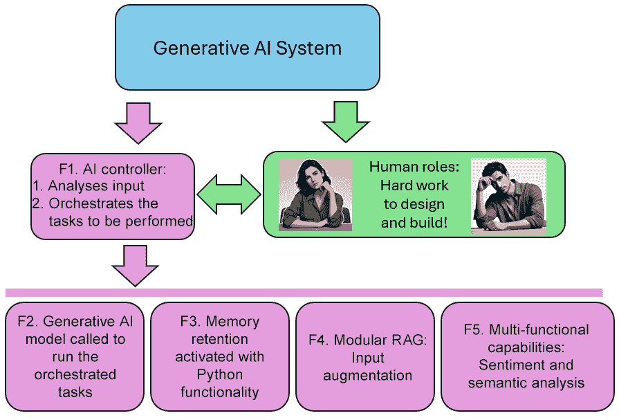
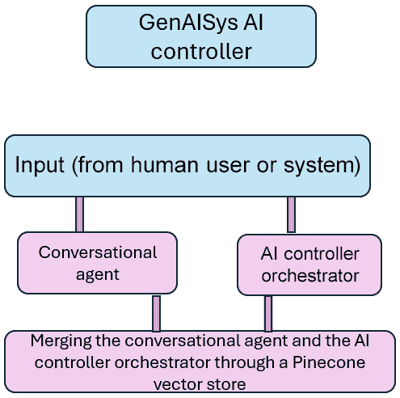
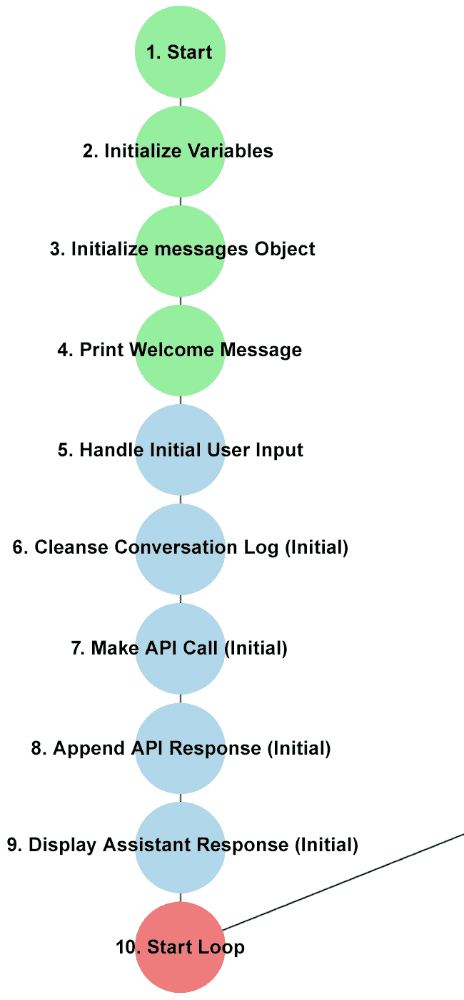
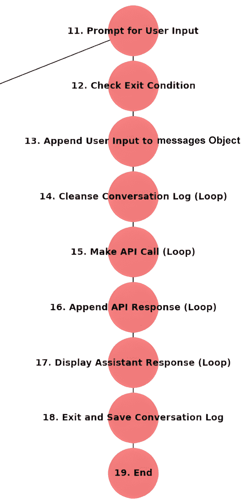
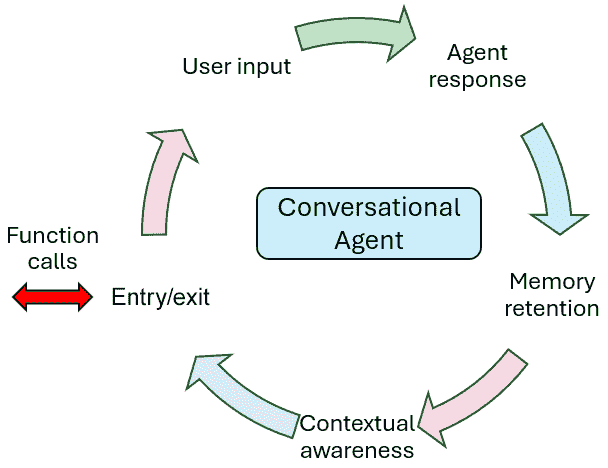
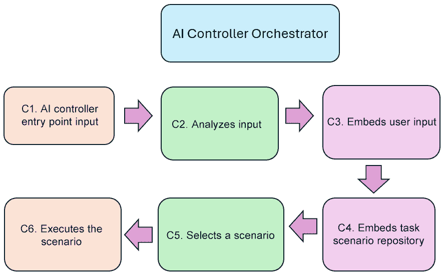
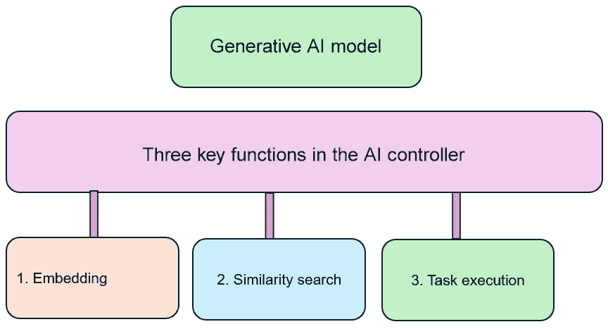

# 第二章：构建生成式 AI 控制器

一个**生成式 AI 系统**（**GenAISys**）的控制器需要两个关键组件：一个**对话代理**和一个**编排器**。对话代理由生成式 AI 模型驱动，与人类用户和系统进程进行交互。另一方面，编排器是一组生成式 AI 和非 AI 功能，例如管理用户角色、内容生成、激活机器学习算法以及运行经典查询。我们需要这两个组件来构建一个功能性的 GenAISys。

如果我们仔细检查这个架构，我们会看到软件编排器和用户界面可以追溯到第一台计算机。任何具有甚至基本功能的操作系统都有编排器，可以触发磁盘空间警报、内存使用和其他数百个功能。今天的用户界面直观且具有事件驱动功能，但在高层次上，GenAISys 的底层架构仍然反映了数十年的软件设计原则。那么，什么是经典软件控制器与 GenAISys 控制器之间的区别呢？

我们可以用一个词来总结这种差异：*适应性*。在经典软件控制器中，一系列任务或多或少是硬编码的。但在 GenAISys 中，用户界面是一个灵活的对话 AI 代理，其背后的生成式 AI 模型经过预训练，可以无需额外编码对广泛的请求做出响应。此外，编排器也没有锁定在静态流程中；它可以根据用户（人类或系统）的提示修改它触发的任务。

在本章中，我们将采取动手实践的方法来构建一个基于前一章中定义的 GenAISys 架构的定制 GenAISys。我们首先将定义我们的 AI 控制器结构，在 Python 中将它分为两部分——对话代理和编排器——并探讨这两个部分如何交互。然后，我们将使用 GPT-4o 构建对话代理。我们将自动化从*第一章*中提到的上下文感知和记忆保持功能。我们的系统将支持短期和长期记忆，以及多用户和跨会话功能——将其推向标准共飞行员通常提供的服务之外。

最后，我们将构建一个 AI 控制器的结构来解释用户输入并触发响应场景。响应将根据 AI 控制器将分析和管理的上下文进行情感分析或语义（硬科学）分析。我们的定制 GenAISys 将为特定领域的 RAG 奠定基础，这是标准 ChatGPT 级系统在处理大量数据时无法提供的，尤其是在每日数据集更新案例中，例如产品或服务的每日销售。到本章结束时，你将了解如何构建 GenAISys AI 控制器的基石，我们将在整本书中对其进行增强。

总结来说，本章涵盖了以下主题：

+   AI 控制器的架构

+   AI 会话代理及其工作流程架构

+   在代码中实现短期和长期记忆会话的存储

+   AI 协调器和意图功能架构

+   创建一个包含指令场景的 GenAI 场景库

+   使用向量搜索处理输入以协调指令

+   使用 GPT-4o 分析处理输入以协调指令

+   根据输入使用多功能协调器选择和执行任务

让我们从定义 AI 控制器的架构开始。

# AI 控制器的架构

我们将继续按照在 *图 1.1* 中定义的架构实现 GenAISys 的架构，第一章。另一方面，*图 2.1* 带我们进一步了解了 GenAISys 的底层功能。



图 2.1：定义要构建的功能

在上一章中，我们确定了人类角色的必要性，前面的图也认可了这一点。无论构建块（模型或框架）多么先进，我们都是 GenAISys 的核心。我们的第一个任务是利用人类的创造力，找到有效的方法来实施 GenAISys 控制器。GenAISys 需要人类的创造力、判断和技术决策。在 ChatGPT、Gemini 和 Microsoft Copilot 等无缝协同驾驶员的底层，隐藏着复杂的 AI 和非 AI 逻辑层。如果我们想构建自己的 ChatGPT 类似系统，我们需要人类付出辛勤的努力！

我们将构建两个独立的程序：

+   使用 GPT-4o 实现的 **会话代理**，它支持短期和长期记忆。这将帮助我们加强多个交流中的上下文意识。它与 *图 2.1* 中的功能 **F3** 保持一致。

+   一个 **AI 控制器协调器**，它也将使用 GPT-4o 分析用户输入，搜索指令库，用适当的指令增强输入，并运行指令中的函数（们）。

在本章中，我们将关注两个场景：情感分析和语义（硬科学）分析，这对应于我们架构中的功能 **F1** 和 **F2**。功能 **F4** 和 **F5** 将在第三章第三章中添加。

虽然这些示例是为 OpenAI 的 API 构建的，但其逻辑是模型无关的。一旦你了解了它的工作原理，你就可以将代码修改为使用任何大型语言模型（LLM），例如 Meta 的 Llama、xAI 的 Grok、Google 的 Gemini 或 Cohere。

一旦我们分别构建了会话代理和控制器协调器程序，我们将它们合并成一个统一的智能 AI 控制器，如图 2.2 所示。



图 2.2：下一步——通过 Pinecone 向量存储整合 AI 控制器功能

现在，我们需要专注于单独构建每个组件，以便我们能够完全理解它们的行为。一旦这个基础建立起来，在 *第三章* 中，我们将通过 Pinecone 向量存储将它们合并。现在让我们直接进入代码，开始开发对话代理。

# 对话人工智能代理

本节的主要目标是构建一个具有以下功能的对话人工智能代理：

+   **短期记忆保留**完整的 ChatGPT 风格对话循环。用户和代理可以进行他们希望的任何数量的交换；他们之间的交互次数没有限制。

+   **长期记忆保留**跨越多个用户和会话。我们将存储内存中的会话并将它们持久化到内存存储（在这种情况下，是一个文本文件）。这将使用户如 John、Myriam 和 Bob 等能够实现多用户上下文感知。我们的对话代理将超越经典的点对点 ChatGPT 风格对话，转向能够处理多会话、多用户交互的定制 GenAISys。

要开始，请在此章节的 GitHub 目录中打开 `Conversational_AI_Agent.ipynb`（[`github.com/Denis2054/Building-Business-Ready-Generative-AI-Systems/tree/main`](https://github.com/Denis2054/Building-Business-Ready-Generative-AI-Systems/tree/main)）。这个笔记本将引导您完成环境设置。

## 设置环境

我们将重用前一章中的设置过程。如果您需要复习，请随时查阅该部分。首先安装 OpenAI 并下载所需的文件：

```py
!curl -L https://raw.githubusercontent.com/Denis2054/Building-Business-Ready-Generative-AI-Systems/master/commons/grequests.py --output grequests.py
from grequests import download
download("commons","requirements01.py")
download("commons","openai_setup.py")
download("commons","openai_api.py") 
```

我们还需要下载两个额外的函数来构建我们的对话代理：

+   `download("commons","conversational_agent.py")`：此文件包含管理完整回合对话循环和记忆对话的功能。

+   `download("commons", "processing_conversations.py")`：此文件包含用于加载、显示和净化过去对话的工具，以增加对话代理在多个会话和用户之间的记忆跨度。这个定制的多会话、多用户功能超出了标准 ChatGPT 风格合作者的范畴。

现在让我们继续在 `conversational_agent.py` 中实现函数，这是我们将在与对话人工智能代理的整个会话中使用的。

## 对话人工智能代理工作流程

对话人工智能代理包含两个主要部分：

+   开始初始对话以与人工智能代理开始对话

+   运行完整回合对话循环，以继续用户希望与人工智能代理进行的内存交换。在每个会话结束时，对话将被保存，以便稍后可以继续——无论是同一用户还是其他用户。

### 开始初始对话

初始对话是新会话的入口点。它由 AI 控制器处理，并在 *图 2.3* 中展示。



图 2.3：初始对话控制器

我们将逐步了解与生成式 AI 模型的初始对话的每个步骤，以详细了解一个小型 ChatGPT-like 对话代理是如何工作的。10 步流程从*开始*开始。

#### 1. 开始对话

程序通过 `openai_api.py` 中的 `run_conversational_agent` 函数从这个入口点开始，该函数将在笔记本中通过 `conversational_agent` 及其参数被调用：

```py
# Start the conversational agent
def run_conversational_agent(
    uinput, mrole, mcontent, user_role, user_name
):
    conversational_agent(uinput, mrole, mcontent, user_role, user_name) 
```

在这种情况下，对话代理将处理的参数如下：

+   `uinput`：包含输入（用户或系统），例如，`夏威夷在哪里？`。

+   `mrole`：定义消息的角色。它可以是 `用户` 或 `系统`。您还可以分配 API 将解释的其他角色，例如定义 AI 的个性，例如，`您是一位地质学专家`。

+   `mcontent`：这是我们期望系统呈现的内容，例如，`您是一位地质学专家`。

+   `user_role`：定义用户的角色，例如，`用户`。

+   `user_name`：用户的姓名，例如，`约翰`。

#### 2–3. 初始化 API 变量和消息对象

`messages_obj` 使用上一步中描述的对话参数初始化，*开始对话*：

```py
messages_obj = [{"role": mrole, "content": mcontent}] 
```

`messages_obj` 关注系统的记忆。此对象将在会话期间与 GPT-4o 模型的交流中附加。它将被用于记录会话之间的对话。第一条消息包含设置代理上下文的角色和内容。

#### 4. 打印欢迎信息

系统现在已准备好与用户互动。代理首先显示欢迎信息，并解释如何在对话结束后退出系统：

```py
print("Welcome to the conversational agent! Type 'q' or 'quit' to end the conversation.") 
```

#### 5. 处理初始用户输入

用户的初始输入被添加到 `messages_obj` 中，以向代理提供记忆并提供代理预期遵循的方向。初始用户输入将由对话代理发送：

```py
if initial_user_input:
    print(f"{user_name}: {initial_user_input}")
    messages_obj.append(
        {"role": user_role, "content": initial_user_input}
    ) 
```

#### 6. 清理初始对话日志

`messages_obj` 以结构化格式保存对话的历史。在我们的应用程序中，对于某些操作，例如生成简化的显示、创建综合日志条目或为基于文本的函数准备输入，我们需要将这个结构化日志转换为单个、连续的字符串。这确保了数据以正确的格式适用于这些特定任务，并有助于解决在组合不同的消息部分时可能出现的任何潜在的标点或格式问题：

```py
conversation_string = cleanse_conversation_log(messages_obj) 
```

清理函数清理对话并返回一个字符串：

```py
def cleanse_conversation_log(messages_obj):
  conversation_str = " ".join(
        [f"{entry['role']}: {entry['content']}" for entry in messages_obj]
    )
    # Remove problematic punctuations
    return re.sub(r"[^\w\s,.?!:]", "", conversation_str) 
```

#### 7. 进行初始 API 调用

清理后的对话字符串被发送到 API 进行处理。API 根据最后输入和对话历史提供响应。现在系统有了记忆：

```py
agent_response = make_openai_api_call(
    input=conversation_string,
    mrole=mrole,
    mcontent=mcontent,
    user_role=user_role
) 
```

#### 8. 添加初始 API 响应

API 的助手响应被处理并附加到 `messages_obj`。我们正在继续增加系统的记忆和，因此，其上下文意识：

```py
messages_obj.append({"role": "assistant", "content": agent_response}) 
```

#### 9. 显示初始助手响应

系统的响应显示给用户分析，并决定是否继续或退出会话：

```py
print(f"Agent: {agent_response}") 
```

#### 10. 开始对话循环

系统现在进入对话循环，其中可以发生多个对话回合，直到用户决定退出会话：

```py
while True:
    user_input = input(f"{user_name}: ")
    if user_input.lower() in ["q", "quit"]:
        print("Exiting the conversation. Goodbye!")
        break 
```

我们现在准备好开始一个完整对话循环。

### 完整对话循环

初始对话现在初始化。我们将从*步骤 11*开始，进入完整对话循环，如图 2.4 所示。



图 2.4：从步骤 11 开始的对话循环

#### 11. 提示用户输入

对话继续初始对话，并通过`messages`对象进行记忆。用户提示触发完整对话循环。第一步是输入用户的名字。这个自定义功能使我们超越了仅限于每个会话一个用户的标准 ChatGPT-like 对话代理。我们正在初始化一个多用户对话：

```py
user_input = input(f"{user_name}: ") 
```

#### 12. 检查退出条件

如果输入`q`或`quit`，会话结束：

```py
if user_input.lower() in ["q", "quit"]:
    print("Exiting the conversation. Goodbye!")
    break 
```

#### 13. 将用户输入附加到消息对象

系统现在具备了一个完整对话循环的记忆。它使用我们定义的通用 API 格式。用户的输入被附加到`messages_obj`：

```py
messages_obj.append({"role": user_role, "content": user_input}) 
```

#### 14. 清理对话日志（循环）

更新的`messages_obj`被清理以确保它符合 API 调用，正如在*步骤 6*，*清理初始对话日志*中所述：

```py
conversation_string = cleanse_conversation_log(messages_obj) 
```

#### 15. 在对话循环中调用 API

在这个完整对话循环中，整个对话被发送到 API。因此，API 将根据整个对话的上下文和新输入返回响应：

```py
agent_response = make_openai_api_call(
    input=conversation_string,
    mrole=mrole,
    mcontent=mcontent,
    user_role=user_role
) 
```

#### 16. 在对话循环中附加 API 响应

在每个对话回合，API 的响应被附加到`messages_obj`：

```py
messages_obj.append({"role": "assistant", "content": agent_response}) 
```

#### 17. 显示助手响应

在循环的每个对话回合中显示 API 响应：

```py
print(f"Agent: {agent_response}") 
```

#### 18. 退出并保存对话日志

当用户退出循环时，对话将被保存。这个功能将复制一个 ChatGPT-like 平台，可以保存同一用户在两个会话之间的对话。然而，正如我们将在“运行对话代理”部分中看到，我们的程序将能够在团队成员之间的对话中保存多用户会话：

```py
with open("conversation_log.txt", "w") as log_file:
    log_file.write("\n".join([f"{(user_name if entry['role'] == 'user' else entry['role'])}: {entry['content']}" for entry in messages_obj])) 
```

#### 19. 结束

对话代理在记忆对话后终止会话：

```py
print("Conversation saved to 'conversation_log.txt'.") 
```

我们已经探讨了对话代理的功能。

现在，让我们继续讨论代表 AI 控制器的 AI 对话代理程序。

### 运行对话 AI 代理

主程序`Conversational_AI_Agent.ipynb`从`conversational_agent.py`调用必要的函数来处理 AI 交互。我们将使用这个场景运行三个用户会话的对话：

1.  约翰开始与对话式人工智能代理进行短期记忆会话。

1.  当会话结束时，约翰的对话将保存在日志文件中。

1.  Myriam 使用相同的日志文件继续会话。

1.  当会话结束时，Myriam 的对话将保存在与约翰相同的日志文件中。

1.  鲍勃将从约翰和 Myriam 离开的地方继续。

1.  当会话结束时，鲍勃的对话将保存在与约翰和 Myriam 相同的日志文件中。

所有三位用户在连续的会话中进行互动。在 *第三章* 中，我们将通过 Pinecone 向量存储将用户分组，以便多个用户可以实时一起参与会话。目前，让我们一步一步地走过这个多用户设置，看看对话式人工智能代理如何处理这些会话。让我们从第一步开始：约翰的短期记忆会话。

#### 短期记忆会话

会话以对话代理的 *步骤 1*，*开始对话* 中描述的参数开始：

```py
uinput = "Hawai is on a geological volcano system. Explain:"
mrole = "system"
mcontent = "You are an expert in geology."
user_role = "user" 
```

我们还在会话中添加了用户名，就像在 ChatGPT 类型的会话中一样：

```py
user_name = "John" 
```

这个简单的添加——`user_name`——使我们的 GenAISys 超越了标准 ChatGPT 类型的平台。它允许我们将记忆与特定用户关联，并在单个系统中扩展到多用户对话。

我们现在将导入第一个函数，即 OpenAI API 功能，按照 *第一章* 中所述向 OpenAI 的 API 发送请求：

```py
from openai_api import make_openai_api_call 
```

程序现在导入第二个函数，即对话代理，并按本节前面所述运行：

```py
from conversational_agent import run_conversational_agent
run_conversational_agent(uinput, mrole, mcontent, user_role,user_name) 
```

让我们逐一查看使用我们两个函数实现的对话的每个步骤。代理首先欢迎我们：

```py
Welcome to the conversational agent! Type 'q' or 'quit' to end the conversation. 
```

约翰，第一个用户，请求关于夏威夷的地质解释：

```py
John: Hawai is on a geological volcano system. Explain: 
```

代理提供了令人满意的回答：

```py
Agent: Hawaii is part of a geological volcanic system known as a "hotspot"… 
```

约翰现在询问“那里”冲浪的情况：

```py
John: Can we surf there? 
```

多亏了代理中内置的记忆，它现在通过记忆保留具有上下文意识。代理正确地回答了关于夏威夷冲浪的问题：

```py
Agent: Yes, you can definitely surf in Hawaii! The Hawaiian Islands are renowned … 
```

约翰现在询问最佳住宿地点，但没有提到夏威夷：

```py
John: Where are the best places to stay? 
```

代理利用上下文意识正确回答：

```py
Agent: Hawaii offers a wide range of accommodations … 
```

约翰然后退出会话：

```py
John: quit 
```

代理退出对话，并将对话保存在对话日志中：

```py
Agent:Exiting the conversation. Goodbye!
Conversation saved to 'conversation_log.txt'. 
```

短期会话结束，但多亏了通过 `conversation_log.txt` 实现的记忆保留，我们可以轻松地从约翰离开的地方继续。因此，我们可以立即或稍后继续对话，利用自动生成的 `conversation_log.txt` 文件实现记忆保留。

#### 长期记忆会话

短期会话已保存。我们有三个选项：

+   现在停止程序。在这种情况下，`conversation_log.txt` 将只包含约翰的会话，可以选择继续或不继续。

+   决定为下一个用户 Myriam 初始化一个单独的 `conversation_log.txt`。

+   通过将约翰的对话加载到 Myriam 的初始对话上下文中，继续进行多用户会话。

本章的程序选择继续一个多会话、多用户场景。

继续与 John 对话的第一步是使用我们在*设置环境*部分下载的`processing_conversations.py`中的函数加载和显示对话日志。我们现在导入并运行我们需要的加载和显示对话日志的函数：

```py
from processing_conversations import load_and_display_conversation_log
conversation_log = load_and_display_conversation_log() 
```

该函数是一个标准的`IPython`过程，使用 HTML 功能读取和显示对话：

```py
from IPython.core.display import display, HTML
import re
# Step 1: Load and Display Conversation Log
def load_and_display_conversation_log():
    try:
        with open("conversation_log.txt", "r") as log_file:
            conversation_log = log_file.readlines()
        # Prepare HTML for display
        html_content = "<h3>Loaded Conversation Log</h3><table border='1'>"
        for line in conversation_log:
            html_content += f"<tr><td>{line.strip()}</td></tr>"
        html_content += "</table>"
        # Display the HTML
        display(HTML(html_content))
        return conversation_log
    except FileNotFoundError:
        print("Error: conversation_log.txt not found. Ensure it exists in the current directory.")
        return [] 
```

输出显示对话中的每个参与者，首先是系统的信息，然后是 John 的请求，接着是 GPT-4o 助手在每个回合的回应：

```py
system: You are an expert in geology.
John: Hawai is on a geological volcano system. Explain:
assistant: Hawaii is part of a geological volcanic system… 
```

在将对话添加到下一个输入的上下文之前，我们将对其进行清理和准备。为此，我们依次导入`cleanse_conversation_log`和从`processing_conversations.py`导入`initialize_uinput`：

```py
from processing_conversations import cleanse_conversation_log
from processing_conversations import initialize_uinput 
```

然后，我们将调用我们定义的两个 Python 函数来清理并准备新的输入：

```py
cleansed_log = cleanse_conversation_log(conversation_log)
nuinput = initialize_uinput(cleansed_log) 
```

`cleanse`函数移除标点符号和可能有问题的人物：

```py
# Step 2: Clean the conversation log by removing punctuations and special characters
def cleanse_conversation_log(conversation_log):
    cleansed_log = []
    for line in conversation_log:
        # Remove problematic punctuations and special characters
        cleansed_line = re.sub(r"[^\w\s,.?!:]", "", line)
        cleansed_log.append(cleansed_line.strip())
    return " ".join(cleansed_log)  # Combine all lines into a single string 
```

最后，我们初始化新的输入：

```py
# Step 3: Initialize `uinput` with the cleansed conversation log to continue the conversation
def initialize_uinput(cleansed_log):
    if cleansed_log:
        print("\nCleansed conversation log for continuation:")
        print(cleansed_log)
        return cleansed_log  # Use the cleansed log as the new input
    else:
        print("Error: No data available to initialize `uinput`.")
        return "" 
```

输出确认对话日志已被清理：

```py
Cleansed conversation log for continuation:
system: You are an expert in geology… 
```

然后，输出确认`nuinput`包含用于继续的对话日志：

```py
# `nuinput` now contains the cleansed version of the conversation log and can be used
print("\nInitialized `nuinput` for continuation:", nuinput) 
```

##### 继续之前的会话

我们现在可以使用`nuinput`作为记忆保留变量来继续 John 开始的对话。我们将使用消息变量将上下文`nuinput`添加到 Myriam 的请求中：

```py
ninput = nuinput+ "What about surfing in Long Beach"
mrole = "system"
mcontent = "You are an expert in geology."
user_role = "user"
user_name = "Myriam" 
```

消息调用包含两个关键特性：

+   `ninput = nuinput+ [user input]`，这表明 AI 控制器现在拥有超越单个会话的长期记忆

+   `user_name = "Myriam"`，这展示了多用户功能，证明了我们定制的 ChatGPT-like AI 控制器比标准机助有更大的灵活性

整个过程与 John 的情况相同。Myriam 提出一个问题：

```py
Myriam: What about surfing in Long Beach 
```

代理回应：

```py
Agent:Long Beach, California, offers a different surfing experience compared to Hawai… 
```

Myriam 退出：

```py
Myriam: quit 
```

代理确认对话已结束并保存在对话日志中：

```py
Agent:Exiting the conversation. Goodbye!
Conversation saved to 'conversation_log.txt'. 
```

AI 控制器现在有了 John 的会话和 Myriam 继续会话的日志。控制器可以进一步操作并添加另一个用户到对话中。

##### 继续长期的多用户记忆

让我们加入 Bob 以继续对话。首先，再次显示对话日志：

```py
# Run the process
conversation_log = load_and_display_conversation_log() 
```

你将看到 John 和 Myriam 的条目：

```py
system: You are an expert in geology.
Myriam: system: You are an expert … 
```

然后将日志清理并准备为对话的下一个回合。`nuinput`现在包含 John 和 Myriam 的会话：

```py
uinput =nuinput+ "Read the whole dialog then choose the best for geology research"
mrole = "system"
mcontent = "You are an expert in geology."
user_role = "user"
user_name = "Bob" 
```

Bob 专注于地质任务，而不是休闲：

```py
Bob:"Read the whole dialog then choose the best for geology research" 
```

AI 代理提供了一个准确的回应：

```py
Agent: For geology research, the most relevant part of the dialogue is the explanation of Hawaii's geological volcanic system. This section provides detailed insights into the Hawaiian hotspot, mantle plumes, volcanic activity,… 
```

Bob 随后退出了会话：

```py
Bob: quit 
```

代理退出对话并将其保存在对话日志中：

```py
Agent:Exiting the conversation. Goodbye!
Conversation saved to 'conversation_log.txt'. 
```

通过这三个场景，我们已经在多用户全回合对话循环中实现了由 AI 控制器管理的对话代理。让我们检查这个对话代理的下一步：

## 下一步

在这个阶段，我们已经拥有了对话代理的基本结构。我们需要将其集成到一个 AI 控制器协调器中。在开始构建 AI 控制器协调器之前，让我们总结一下我们为对话代理所做的工作。



图 2.5：对话代理循环的周期

如前图所示，AI 对话代理执行以下操作：

1.  代理处理输入（系统或人类用户）。

1.  代理做出回应。

1.  激活记忆保留功能。

1.  对话被添加到以下输入作为上下文。

1.  用户可以退出。

然而，入口/出口点是不完整的。我们可以进入和退出对话，但不能调用函数来协调任务，如激活情感分析和语义分析。为了完成 AI 控制器的架构，我们需要开始构建 AI 控制器协调器。

# AI 控制器协调器

在本节中，我们将构建我们的 AI 控制器协调器的第一个组件：选择正确任务执行的能力。我们将开发这个作为独立组件，从*第三章*开始集成，在那里我们将通过 Pinecone 向量存储将对话代理与 AI 控制器协调器连接起来。

*图 2.6*展示了我们将开发的 AI 控制器协调器的工作流程：

+   **C1. AI 控制器入口点输入**触发流程。

+   **C2. 分析输入**，这可能是一个系统或人类用户的提示。

+   **C3. 通过 GPT-4o 的本地功能嵌入用户输入**。

+   **C4. 通过 GPT-4o 的本地功能嵌入任务场景** **存储库**。

+   **C5. 选择一个** **场景** 来执行与输入最匹配的任务。

+   **C6. 执行 AI 控制器协调器选择的场景**。



图 2.6：AI 控制器协调器的工作流程

我们将使用 OpenAI 的 GPT-4o API 和 Python 开发 AI 控制器协调器的这个第一个组件。此外，由于我们的想法是利用生成式 AI 模型的全功能来执行 AI 控制器协调器请求的多个任务，因此我们将避免在协调器上加载额外的库，以专注于 GenAISys 的架构。

在这个笔记本中，GPT-4o 将在程序中执行三个关键功能，如图*图 2.7*所示：

+   **嵌入**：GPT-4o 系统性地将所有通过提示接收到的数据嵌入。输入在通过模型层之前被嵌入。在*第三章*中，我们将通过将可重用数据如指令场景嵌入到 Pinecone 向量存储中进一步扩展这一做法。

+   **相似度搜索**：GPT-4o 可以执行相似度搜索并得到可靠的结果。GPT-4o 没有确定性的固定余弦相似度函数。它通过其复杂的神经网络学习理解关系，以一种更加细腻、不那么确定性的方式模仿相似度判断。

+   **任务执行**：一旦选择了一个场景，GPT-4o 可以执行一系列标准任务，例如情感分析和语义分析。



图 2.7：在指令列表中使用相似度搜索触发任务

我们已经定义了协调器的工作流程和生成式 AI 模型的使用。然而，我们必须检查模型如何识别它预期执行的任务。

## 理解意图功能

无论像 GPT-4o 这样的生成式 AI 模型多么强大，如果没有一个明确表达意图的提示，它就无法猜测用户的需求。我们不能只是说，“大峡谷是亚利桑那州一个伟大的旅游胜地”，并期望模型猜测我们想要对这句话进行情感分析。我们必须通过输入以下内容来明确表达我们的意图：“提供以下文本的情感分析：大峡谷是亚利桑那州一个伟大的旅游胜地。”

为了解决 AI 控制器的意图问题，我们必须找到一个框架来协调其任务。一个好的起点是研究 **文本到文本迁移变换器**（**T5**），这是一个文本到文本模型（Raffel 等人，2020 年）。T5 模型使用 *任务标签* 或 *特定任务的前缀* 来向变换器模型提供提示的意图。任务标签包含总结、翻译和分类等指令。模型将检测标签并知道要做什么，如图 *图 2.8* 所示。


图 2.8：带有任务标签的 T5

训练 T5 模型涉及在创建输入时 *明确地* 添加任务标签，然后提供响应。然而，OpenAI 的 GPT 模型通过分析包含指令和响应的数十亿个语言序列来学习执行哪个任务，而不是显式结构。因此，使用类似 GPT 架构的生成式 AI 模型将通过提示的上下文 *隐式地* 学习执行哪个任务。例如，一个良好解析的提示，如“提供以下文本的情感分析：大峡谷是亚利桑那州一个伟大的旅游胜地。”，为 GPT-4o 提供了足够多的上下文来推断所需的操作——无需显式标签。

让我们通过运行带有 GPT-4o 隐式分析需要执行哪个任务的 T5 风格示例来展示 GPT 模型的工作原理。

## 从 T5 到 GPT 模型

在本节中，我们将编写一个程序来展示 GPT-4o 如何解释指令——这是我们将在编排器中利用的能力。目标是证明，尽管 GPT 风格的模型隐式地推断意图，但它们仍然需要清晰的指令。

我们将首先在 GitHub 上的`Chapter02`目录中打开`T52GPT.ipynb`。设置环境与*设置环境*子节中的*对话式 AI 代理*部分完全一致，仅安装 OpenAI 环境：

```py
download("commons","requirements01.py")
download("commons","openai_setup.py")
download("commons","openai_api.py") 
```

不需要额外的安装。现在让我们开始一个 CoLA 任务。

### 语言学可接受性语料库（CoLA）

**语言学可接受性语料库**（**CoLA**）是一个公共的短英语句子数据集，每个句子都被标记为可接受（语法正确）或不可接受（语法错误）。通过在这些例子上测试 GPT-4o，我们可以展示高级生成模型可以通过理解语言来处理新任务，而无需任何特定任务的微调。这意味着我们可以将高级生成式 AI 模型应用于我们未对其进行训练的广泛任务。

让我们先向 GPT-4o 模型提交以下输入，看看它是否在没有明确任务标签的情况下是可接受的：

```py
input="This aint the right way to talk." 
```

我们将向系统提供最少的信息：

```py
mrole = "system"
user_role = "user"
mcontent = "Follow the instructions in the input" 
```

我们还将使用本章中一直使用的函数调用 OpenAI API：

```py
# API function call
task_response = openai_api.make_openai_api_call(
    input,mrole,mcontent,user_role
)
print(task_response) 
```

输出显示，即使是最强大的生成式 AI 模型在没有任务标签的情况下也没有头绪：

```py
I apologize if my previous response didn't meet your expectations. Please let me know how I can assist you better! 
```

现在，让我们编写一个带有任务标签和相同信息的指令：

```py
input="Is the following sentence gramatically correct:This aint the right way to talk."
mrole = "system"
user_role = "user"
mcontent = "Follow the instructions in the input"
# API function call
task_response = openai_api.make_openai_api_call(
    input,mrole,mcontent,user_role
)
print(task_response) 
```

输入现在包含了对生成式 AI 模型期望的指示。输出现在也是准确的：

```py
The sentence "This aint the right way to talk." is not grammatically correct. The response corrects the sentence:
"This isn't the right way to talk."
Alternatively, if you want to maintain the informal tone, you could write:
"This ain't the right way to talk."
Note that "ain't" is considered informal and nonstandard in formal writing. 
```

现在我们执行一个翻译任务。

### 翻译任务

任务以自然语言表达的任务标签开始：

```py
input=”Translate this sentence into French: Paris is quite a city to visit.”
mrole = “system”
user_role = “user”
mcontent = “Follow the instructions in the input”
# API function call
task_response = openai_api.make_openai_api_call(
    input,mrole,mcontent,user_role
)
print(task_response) 
```

我们得到的输出是准确的：

```py
Paris est vraiment une ville à visiter. 
```

现在我们执行一个**语义文本相似度基准**（**STSB**）任务。

### 语义文本相似度基准（STSB）

STSB 风格的评分是 GenAISys AI 控制器的重要功能，它依赖于相似度搜索来选择正确的指令场景、文档和其他资源。编排器将依赖于这一能力。在接下来的测试中，我们向模型提交两个句子并要求它判断它们的语义相似度：

```py
input=”stsb:Sentence 1: This is a big dog. Sentence 2: This dog is very big.”
mrole = “system”
user_role = “user”
mcontent = “Follow the instructions in the input”
# API function call
task_response = openai_api.make_openai_api_call(
    input,mrole,mcontent,user_role)
print(task_response) 
```

我们得到的输出是准确的：

```py
The sentences "This is a big dog." and "This dog is very big." are semantically similar. Both sentences convey the idea that the dog in question is large in size. The difference in wording does not significantly alter the meaning, as both sentences describe the same characteristic of the dog. 
```

当我们在数据集中搜索与输入匹配的数据时，这个函数将非常有用。现在让我们运行一个摘要任务。

### 摘要

在以下输入中，GPT-4o 可以检测到摘要指令标签，并解释所需的响应最大长度：

```py
input="Summarize this text in 10 words maximum: The group walked in the forest on a nice sunny day. The birds were singing and everyone was happy."
mrole = "system"
user_role = "user"
mcontent = "Follow the instructions in the input"
# API function call
task_response = openai_api.make_openai_api_call(
    input,mrole,mcontent,user_role)
print(task_response) 
```

输出再次是准确的：

```py
Group enjoyed a sunny forest walk with singing birds. 
```

这次探索的要点是，无论我们实施哪种生成式 AI 模型，它都需要任务标签才能按照我们的预期进行反应。接下来，我们将利用这一洞察力在我们的编排器中实现语义文本相似度处理任务标签。

## 实现指令选择的编排器

在本节中，我们将开始构建基于任务标签的两个指令的调度器，如图*2.9*所示：情感分析以确定句子的情感和语义分析以分析句子中的事实。

我们将通过要求生成式 AI 模型根据输入找到最佳任务标签场景（情感或语义分析）来使系统更加复杂。换句话说，任务标签将不会是输入的一部分。我们将使用 GPT-4o 的语义文本相似度功能来选择正确的任务标签本身。


图 2.9：使用隐式任务标签运行任务

最终，我们的调度器将支持任何任务（参见*图 2.9*中的**3. 任何所需任务**），而不仅仅是情感或语义分析。

环境设置与之前相同：

```py
download("commons","requirements01.py")
download("commons","openai_setup.py")
download("commons","openai_api.py") 
```

对于调度器不需要额外的安装。我们将首先实施一个指令场景选择。

## 选择场景

AI 控制器的核心是在接收到输入（系统或人类用户）时决定做什么。任务的选择打开了一个我们将全书探索的可能方法的世界。然而，我们可以将它们分为两类：

+   使用显式任务标签来触发指令。这个标签可以是一个生成式 AI 模型中的上下文，并在提示中以各种方式自由表达。

+   提示没有任务指令，而是一个场景存储库，AI 控制器将根据语义文本相似度从中做出决策。

在这里，我们将探讨第二种更主动的方法。我们将测试两个没有任何指示、没有任务标签和没有任何关于对生成式 AI 模型期望的提示的提示。虽然我们稍后会实施带有任务标签的更明确的方法，但 GenAISys AI 控制器调度器必须能够在某些情况下主动行事。

+   第一个提示是对一部电影的看法，暗示用户可能对情感分析感兴趣：

    ```py
    if prompt==1:
        input = "Gladiator II is a great movie although I didn't like some of the scenes. I liked the actors though. Overall I really enjoyed the experience." 
    ```

+   第二个提示是一个事实，暗示用户可能对语义分析感兴趣：

    ```py
    if prompt==2:
        input = "Generative AI models such as GPT-4o can be built into Generative AI Systems. Provide more information." 
    ```

为了提供 AI 控制器决策能力，我们需要一个指令场景存储库。

### 定义任务/指令场景

场景是一组存在于 GenAISys 内部存储库中的指令。虽然 ChatGPT-like 模型被训练来原生处理许多指令，但特定领域的用例需要定制场景（我们将在*第五章*中深入探讨这些）。例如，GenAISys 可能收到一条消息，例如“客户订单#9283444 延迟”。这条消息可能是关于生产延迟或交付延迟。通过检查发送者的用户名和组（生产或交付部门），AI 控制器可以确定上下文，并选择一个场景，做出适当的决定。

在这个笔记本中，场景存储在内存中。在*第三章*中，我们将组织这些指令集在 Pinecone 向量存储中的存储和检索。

在这两种情况下，我们首先创建一个结构化场景的仓库（市场、情感和语义分析）：

```py
scenarios = [
    {
**"scenario_number"****:** **1****,**
        "description": "Market Semantic analysis.You will be provided with a market survey on a give range of products.The term market must be in the user or system input. Your task is provide an analysis."
    },
    {
**"scenario_number"****:** **2****,**
        "description": " Sentiment analysis  Read the content and classify the content as an opinion  If it is not opinion, stop there  If it is an opinion then your task is to perform a sentiment analysis on these statements and provide a score with the label: Analysis score: followed by a numerical value between 0 and 1  with no + or - sign.Add an explanation."
    },
    {
**"scenario_number"****:** **3****,**
        "description": "Semantic analysis.This is not an analysis but a semantic search. Provide more information on the topic."
    }
] 
```

我们还将添加一个包含相同场景的字典，包含场景的简单定义：

```py
# Original list of dictionaries
scenario_instructions = [
    {
        **"Market Semantic analysis.You will be provided with a market survey on a give range of products.The term market must be in the user or system input. Your task is provide an analysis."**
    },
    {
        **"Sentiment analysis  Read the content return a sentiment analysis on this text and provide a score with the label named : Sentiment analysis score followed by a numerical value between 0 and 1  with no + or - sign and  add an explanation to justify the score."**
    },
    {
        **"Semantic analysis.This is not an analysis but a semantic search. Provide more information on the topic."**
    }
] 
```

我们现在从字典中提取字符串并将它们存储在一个列表中：

```py
# Extract the strings from each dictionary
instructions_as_strings = [
    list(entry)[0] for entry in scenario_instructions
] 
```

到目前为止，我们的 AI 控制器已经拥有了识别意图所需的一切——将任何传入的提示与最佳匹配的场景相匹配。

### 执行意图识别和场景选择

我们首先定义对话人工智能代理的参数，就像我们在*对话人工智能代理*部分所做的那样：

```py
**# Define the parameters for the function call**
mrole = "system"
mcontent = "You are an assistant that matches user inputs to predefined scenarios. Select the scenario that best matches the input. Respond with the scenario_number only."
user_role = "user" 
```

调度器的任务是找到任何给定输入的最佳任务，使人工智能控制器灵活且适应性较强。在某些情况下，调度器可能决定不应用场景，而只是跟随用户的输入。然而，在以下示例中，调度器将选择一个场景并应用它。

我们现在调整输入以考虑调度器的请求：

```py
# Adjust `input` to combine user input with scenarios
selection_input = f"User input: {input}\nScenarios: {scenarios}"
print(selection_input) 
```

GPT-4o 现在将执行文本语义相似度搜索，就像我们在*语义文本相似度基准（STSB）*部分所做的那样。在这种情况下，它不仅执行纯文本比较，而且将一个文本（用户输入）与一系列文本（我们的场景描述）进行匹配：

```py
# Call the function using your standard API call
response = openai_api.make_openai_api_call(
    selection_input, mrole, mcontent, user_role
) 
```

我们的用户输入如下：

```py
User input: Gladiator II is a great movie 
```

然后，选择场景：

```py
# Print the response
print("Scenario:",response ) 
```

然后，选择场景编号，将其与相应的指令一起存储并显示：

```py
scenario_number=int(response)
instructions=scenario_instructions[scenario_number-1]
print(instructions) 
```

对于我们的*Gladiator II*示例，调度器正确地选择了情感分析场景：

```py
{'Sentiment analysis  Read the content return a sentiment analysis on this text and provide a score with the label named : Sentiment analysis score followed by a numerical value between 0 and 1  with no + or - sign and  add an explanation to justify the score.'} 
```

这种自主任务选择能力——让 GenAISys 在没有明确标签的情况下选择正确的分析——将在实际部署中非常有价值（参见*第五章*）。程序现在使用生成式人工智能代理运行场景。

## 使用生成式人工智能代理运行场景

现在人工智能控制器已经识别出正确的`scenario_number`，是时候执行所选任务了。在这个笔记本中，我们将逐步介绍这个过程。我们首先打印输入：

```py
print(input) 
```

使用`scenario_number`值，我们从`instructions_as_strings`列表中访问场景描述：

```py
# Accessing by line number (1-based index)
line_number = scenario_number
instruction = instructions_as_strings[line_number - 1]  # Adjusting for 0-based indexing
print(f"Instruction on line {line_number}:\n{instruction}")
mrole = "system"
user_role = "user"
mcontent = instruction 
```

现在调度器已经准备好运行情感分析了。

### 情感分析

我们将场景描述附加到原始用户提示中，并将组合请求发送给 GPT-4o：

```py
Instruction on line 2:
Sentiment analysis  Read the content return a sentiment analysis nalysis on this text and provide a score with the label named : Sentiment analysis score followed by a numerical value between 0 and 1  with no + or - sign and  add an explanation to justify the score. 
```

```py
# API function call
sc_input=instruction +" "+ input
print(sc_input)
task_response = openai_api.make_openai_api_call(
    sc_input,mrole,mcontent,user_role
)
print(task_response) 
```

对于我们的*Gladiator II*示例，响应可能看起来像这样：

```py
Sentiment analysis score 0.75
The text expresses a generally positive sentiment towards the movie "Gladiator II." The use of words like "great movie," "liked the actors," and "really enjoyed the experience" indicates a favorable opinion. However, the mention of not liking some of the scenes introduces a slight negative element. Despite this, the overall enjoyment and positive remarks about the actors and the movie as a whole outweigh the negative aspect, resulting in a sentiment score leaning towards the positive side. 
```

响应显示调度器找到了与输入匹配的场景并产生了可接受的输出。现在，让我们回到之前，更改提示，看看调度器是否找到了正确的场景。

### 语义分析

目前的目标是验证，在不更改任何一行代码的情况下，协调器能否访问另一个场景。协调器将依赖于 GPT-4o 的本地能力来执行语义文本相似度搜索。

现在我们将激活提示 2：

```py
prompt=2
…
if prompt==2:
    input = "Generative AI models such as GPT-4o can be built into Generative AI Systems. Provide more information." 
```

这个输入明显需要语义分析而不是情感分析。然后我们重复使用与我们的情感分析搜索相同的代码：

```py
# Accessing by line number (1-based index)
line_number = scenario_number
instruction = instructions_as_strings[line_number - 1]  # Adjusting for 0-based indexing
print(f"Instruction on line {line_number}:\n{instruction}")
mrole = "system"
user_role = "user"
mcontent = instruction 
```

输出显示找到了正确的场景：

```py
Instruction on line 3:
Semantic analysis.This is not an analysis but a semantic search. Provide more information on the topic. 
```

任务响应显示：

```py
print(task_response) 
```

输出显示协调器产生了连贯的语义分析：

```py
Generative AI models, like GPT-4, are advanced machine learning models designed to generate human-like text based on the input they receive…. 
```

这表明在某些情况下，协调器将能够在没有任务标签的情况下找到正确的场景。当我们处理更复杂的流程时，例如高级生产和支持，这将非常有用。

# 摘要

本章的第一个要点是人在 GenAISys 中的核心作用。人类设计推动了我们的对话式代理和协调器的创建。我们只是用 OpenAI API 和 Python 开始开发这两个复杂组件，但我们这些“人类”设计了为我们的定制 GenAISys 提供动力的 AI 控制器的初始级别。基本的 GenAISys 规则始终适用：没有人类角色，就没有 GenAISys。我们设计 AI 系统，实施它们，维护它们，并根据持续的反馈进行进化。

第二个要点是如何我们的对话式 AI 代理超越了小型 ChatGPT-like 结构。我们不仅为完整轮对话构建了短期上下文和记忆保留，还添加了跨多个用户和多个主题的长期记忆。我们的对话包括三个用户（John、Myriam 和 Bob）和两个主题（地质学和冲浪）。随着我们阅读这本书的进展，我们将扩大这些多用户、多主题会话的范围，以应用于团队合作至关重要的用例。

第三个要点涉及我们的 AI 控制器协调器。我们为协调器提供了一个包含自定义指令的小型场景数据集，我们可以根据特定用例进行扩展，然后利用 GPT-4o 来选择合适的场景并执行任务本身。

到目前为止，我们有一个对话式代理和一个新兴的 AI 控制器协调器。当我们组装我们的 AI 控制器时，它们将共同形成一个独特的多用户、多领域定制 GenAISys。为了构建我们的多用户、多领域 GenAISys AI 控制器，我们将在下一章构建 Pinecone 向量存储。

# 问题

1.  类似 ChatGPT 的 GenAISys 只需要一个生成式 AI 模型，如 GPT-4o。（对或错）

1.  类似 ChatGPT 的 GenAISys 不需要 AI 控制器。（对或错）

1.  在构建和运行 GenAISys 时，人类角色至关重要。（对或错）

1.  通常情况下，但不总是，一个生成式 AI 模型如 GPT-4o 以一种或另一种形式包含任务标签。（对或错）

1.  有时，但不总是，一个生成模型可以在没有任务标签的情况下找到最可能执行的任务。（对或错）

1.  语义文本相似性不能由 GPT-4o 原生执行。（对或错）

1.  使用 OpenAI API 的 AI 进行全轮生成式人工智能对话需要编码。（对或错）

1.  长期记忆人工智能对话会话从不必要。（对或错）

1.  总结文本只能用英语由 GPT-4o 完成。（对或错）

1.  人工智能控制器协调器是有感知的。（对或错）

# 参考文献

+   Raffel, C., Shazeer, N., Roberts, A., Lee, K., Narang, S., Matena, M., Zhou, Y., Li, W., & Liu, P. J. (2020). *Exploring the Limits of Transfer Learning with a Unified Text-to-Text Transformer.* [`arxiv.org/abs/1910.10683`](https://arxiv.org/abs/1910.10683)

+   Ren, J., Sun, Y., Du, H., Yuan, W., Wang, C., Wang, X., Zhou, Y., Zhu, Z., Wang, F., & Cui, S. (2024). *Generative Semantic Communication: Architectures, Technologies, and Applications.* [`doi.org/10.48550/arXiv.2412.08642`](https://doi.org/10.48550/arXiv.2412.08642 )

# 进一步阅读

+   Koziolek, H., Gruener, S., & Ashiwal, V. (2023). *ChatGPT for PLC/DCS Control Logic Generation.* [`doi.org/10.48550/arXiv.2305.15809`](https://doi.org/10.48550/arXiv.2305.15809)

# 订阅免费电子书

新框架、演进的架构、研究发布、生产分解——*AI_Distilled*将噪音过滤成每周简报，供与 LLMs 和 GenAI 系统实际工作的工程师和研究人员阅读。现在订阅，即可获得免费电子书，以及每周的洞察力，帮助您保持专注并获取信息。

在[`packt.link/TRO5B`](https://packt.link/TRO5B)订阅或扫描下面的二维码。


