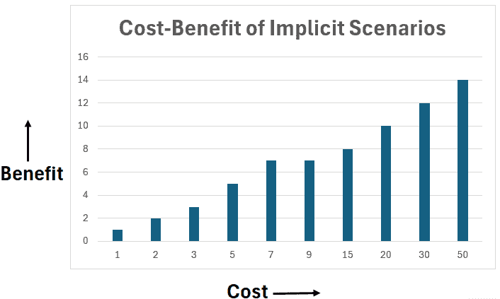
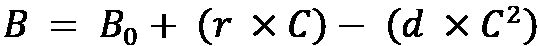
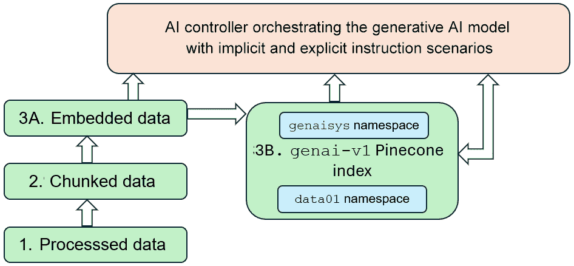
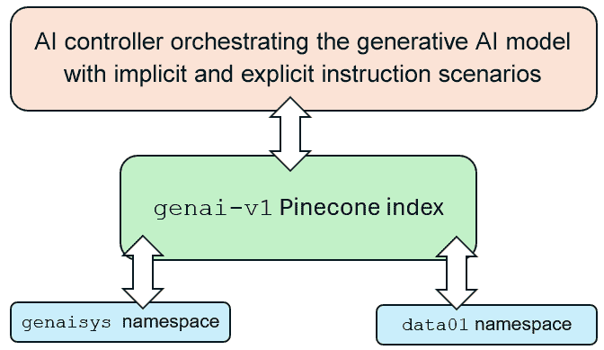
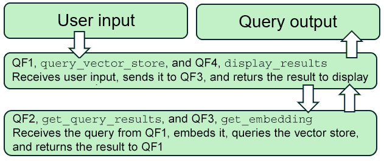

# 将动态 RAG 集成到 GenAISys 中

一个面向商业的**生成式 AI 系统**（**GenAISys**）需要具备灵活性和随时应对 AI 市场快速变化的能力。AI 控制器充当电子营销、生产、存储、分销和支持的适应性协调者，但要满足如此广泛的任务，我们需要一个**检索增强生成**（**RAG**）框架。在前一章中，我们构建了一个用于指令场景（AI 协调器）的对话式 AI 代理和相似性搜索功能，用于生成式 AI 模型。在本章中，我们将增强这个基础，并在 Pinecone 索引中构建一个可扩展的 RAG，以整合指令场景和经典数据，这些数据生成式 AI 模型将与之连接。

在本章中，我们明确区分了**指令场景**——专家精心制作的提示片段（或如前一章所述的*任务标签*），告诉模型*如何*推理或行动，以及**经典数据**——RAG 系统检索以支持其答案的参考材料。

为什么我们需要这样一个动态和自适应的 RAG 框架，其上还有基于经典数据的指令场景向量化？因为全球市场从内部和外部影响实体。例如，一场飓风可能导致电力短缺，使企业的供应链处于危险之中。企业可能不得不重新定位供应路线、生产或分销。通用 AI 云平台可能完成一些工作。但更常见的情况是我们需要提供定制、特定领域的功能。因此，我们需要一个动态的指令集，在向量存储库中，就像我们对 RAG 数据所做的那样。

我们将首先通过 Pinecone 索引定义面向生成式 AI 模型（在本例中为 GPT-4o）的架构驱动任务执行。我们将仔细分析投资于智能场景（通过相似性搜索和检索）的成本效益。我们将介绍一个动态框架，以产生类似 ChatGPT 的能力，这些能力将在接下来的章节中逐步介绍。

一旦定义了架构，我们首先将构建一个 Pinecone 索引来分块、嵌入和更新指令场景。我们将确保 GenAISys 向量存储可以嵌入查询并找到相关的指令场景。这种能力将是我们在设计对话代理的界面和协调器时，在**第四章**（Chapter 4）中构建 AI 控制器协调接口的关键组件。最后，我们将编写一个程序，将经典数据在 RAG 环境中更新到与指令场景相同的 Pinecone 索引。我们将使用不同的命名空间来维护场景和经典数据之间的区分。到本章结束时，我们将构建将指令链接到生成式 AI 模型的主要组件。我们将为**第四章**（Chapter 4）中设计用户界面和 AI 控制器协调器做好准备。

本章涵盖了以下主题：

+   构建用于指令和数据动态检索的 RAG

+   开发相似性搜索时的收益递减定律

+   检查混合 GenAISys CoT 的架构

+   通过分块、嵌入和更新指令场景来创建 Pinecone 索引

+   通过经典数据增强 Pinecone 索引

+   查询 Pinecone 索引

我们的第一项任务是构建一个用于动态检索的 RAG 框架。

# 构建动态检索的 RAG

在本节中，我们将定义一个 Pinecone 索引，该索引存储指令场景和经典数据。这种结构为 GenAISys 提供了动态、成本效益的检索：指令场景引导生成式 AI 模型（以我们为例的 GPT-4o），而经典数据为 RAG 管道使用的实际背景提供信息。

我们将探讨以下组件：

+   **场景驱动任务执行**：设计优化的指导提示（“场景”），我们将将其更新到 Pinecone 索引。

+   **成本效益策略**：考虑收益递减定律，避免过度投资于自动化。

+   **使用命名空间分区 Pinecone**：使用 Pinecone 索引命名空间明确区分指令场景和经典数据。

+   **混合检索框架**：实现隐式向量相似性搜索，但同时也触发生成式 AI 模型（更多内容请参阅**场景驱动任务执行**部分）的显式指令。

+   **CoT loops**：解释场景选择过程的灵活性将如何导致生成式 AI 函数的循环，最终产生输出。

+   **GenAISys 框架**：为我们在整本书中构建的高级 GenAISys 框架奠定基础。

让我们先深入了解场景驱动任务执行。

## 场景驱动任务执行

在上一章中，我们看到了 AI 控制器可以选择下一步做什么的两种互补方式：

+   **隐式选择**：控制器嵌入用户的提示，在其场景库中运行语义相似性搜索，并选择最接近的匹配项，而不需要任何任务标签。这为我们提供了灵活的、无需代码的编排（例如，它自动为“角斗士 II”评论选择了情感分析场景）。

+   **显式选择**：所需任务明确说明，可以是提示中的任务标签，也可以是用户界面操作，例如“运行网络搜索”。在这里，控制器跳过相似性搜索，直接跳到请求的工具或工作流程。

这种相同的模式在本章中继续，但规模更大。我们不是管理几个精选的提示，而是管理存储在向量数据库中的数百甚至数千个专家撰写的指令场景；我们不是支持单个用户实验，而是支持许多并发用户和工作流程。这种以场景驱动的（隐式）方法有三个优点：

+   专业专家通常创建这些高级提示/指令场景，通常超过主流用户的专家水平。

+   这些场景可以由 AI 专家和领域专家共同设计，涵盖公司从销售到交付的广泛活动。

+   场景的执行顺序是由提示驱动的、灵活的且无序的。这种动态方法避免了硬编码任务顺序，尽可能增加了适应性。

然而，尽管隐式任务规划最大化了灵活性，但当我们朝着构建业务就绪系统迈进时，我们必须在灵活性和成本效益之间取得平衡。因此，在某些情况下，*显式*指令，例如通过在用户界面中选择选项来触发网络搜索，可以显著降低潜在成本，如图 *图 3.1* 所示：



图 3.1：成本增加时的收益递减

我们在 Pinecone 指数中自动化的隐式场景越多，即生成式 AI 模型通过向量相似性搜索选择的场景越多，成本就越高。为了管理这一点，我们必须仔细考虑收益递减定律：



在这个方程中，如图 *图 3.1* 所示，在理论单位中，我们有以下内容：

+    表示整体效益，当成本达到 50 时，大约为 15。

+    表示将指令场景存储在 Pinecone 指数中，并通过与用户输入的向量相似性选择一个场景的初始效益。在这种情况下，几乎每个成本单位对应 1 个效益单位。

+    是随着成本增加，效益开始增加的速率。

+    表示以理论单位（货币、人力或计算资源）衡量的成本。

+    表示随着成本增加，收益递减的速率。

例如，当成本达到 7 个理论单位时，收益也达到 7 个理论单位。每单位成本产生 1 单位收益是合理的。然而，当收益达到 10 个单位时，成本可能翻倍达到 14 个单位，这表明出了问题。

减少的  因素对通过平方成本带来的益处有强烈的负面影响 ：


我们将在本书的使用案例中仔细监控  因素。我们将在通过 Pinecone 索引运行隐式自动场景选择和通过提示中的预定义指令显式触发动作之间做出选择。

现在我们来探讨如何在 Pinecone 索引中识别指令场景。

## 混合检索和 CoT

我们的第一步是教会 GenAISys 框架明确区分经典数据和指令场景。为了实现这一点，我们将在同一个 Pinecone 索引中用两个命名空间来区分指令场景和数据，命名为 `genai-v1`：

+   `genaisys` 将包含信息指令向量

+   `data01` 将包含信息数据向量

    我们将在本章的 *创建* *Pinecone 索引* 部分用代码实现 `genai-v1`，并在其中提供额外的解释。

一旦 Pinecone 索引被划分为场景和数据，我们就可以通过混合检索将 GenAISys 提升到另一个层次，如图 *图 3.2* 所示。



图 3.2：AI 控制器编排 GenAISys

前面图中描述的混合检索框架将使 GenAISys 能够执行以下操作：

+   使用处理过的、分块和嵌入的数据内存（见 *图 3.2* 中的 **1**–**3**）直接运行生成式 AI 模型，而不通过 Pinecone 索引（见 **3B**）。这将减少临时数据的成本，例如。

+   在将分块和嵌入的数据更新到 Pinecone 索引后运行生成式 AI 模型，要么作为场景中的一组指令，要么作为经典数据。

+   在 Pinecone 索引（见 **3B**）和生成式 AI 模型控制器之间创建一个 CoT 循环作为编排者。例如，模型的输出可以作为另一个 CoT 循环的输入，该循环将从 Pinecone 索引检索场景或数据。类似于 ChatGPT 的共飞行员通常会展示他们的输出，然后通过询问你是否想进一步探索来结束，有时甚至会建议你可以点击的现成后续提示。

CoT 循环可以通过向量相似度搜索隐式运行，也可以通过直接指令触发或任务标签（例如“运行网络搜索”）显式运行。例如，类似于 ChatGPT 的共飞行员可以直接通过用户界面或 AI 控制器中的规则触发网络搜索。

我们将在本章开始构建我们的 GenAISys，并在接下来的几章中继续对其进行优化。从 *第四章* 开始，*构建 AI 控制器编排接口*，我们将使用这里引入的 RAG 基础来开发 *图 3.2* 中所示的混合检索框架。我们构建的 GenAISys 将包括动态流程管理——这是跟上市场变化趋势的必要条件。具体来说，我们的 GenAISys 将执行以下操作：

+   利用 Pinecone 的向量数据库或内存中的分块和嵌入信息，通过相似性搜索优化检索（指令或数据）

+   明确触发直接指令，例如网络搜索，并将其包含在 CoT 循环中进行总结、情感分析或语义分析

+   将复杂的指令和数据检索组合分解为可管理的步骤

+   在生成输出之前，以类似人类思维过程的方式迭代优化解决方案

+   通过提供优化的指令场景，充分发挥生成式 AI 模型（包括 OpenAI 的推理模型如 o3）的潜力

本章的初始步骤是构建 `genai-v1` Pinecone 索引，AI 控制器将使用它来管理 `genaisys` 命名空间内的指令场景。然后，我们将演示如何将经典数据分块、嵌入并更新到 `data01` 命名空间。让我们开始吧！

# 构建动态 Pinecone 索引

我们将专注于创建一个 Pinecone 索引，用于管理指令场景和经典数据。在接下来的章节中，我们将开始更新指令场景以及经典数据。工作流程分为三个简单的阶段：

+   设置 OpenAI 和 Pinecone 的环境

+   处理数据，将其分块，然后嵌入

+   初始化 Pinecone 索引

在 GitHub 的 Chapter03 目录中打开 `Pinecone_instruction_scenarios.ipynb` 笔记本（[`github.com/Denis2054/Building-Business-Ready-Generative-AI-Systems/tree/main`](https://github.com/Denis2054/Building-Business-Ready-Generative-AI-Systems/tree/main)）。我们的第一个任务是设置环境。

## 设置环境

随着我们阅读本书，我们将不断重用第 *1* 章和 *2* 章中实现的函数和功能，为 Pinecone 添加新的功能，并将安装过程分为两部分：

+   使用与 *第一章* 中相同的流程安装 OpenAI。如有需要，请参阅该章节。

+   为本章和后续章节安装 Pinecone。

首先，通过从 GitHub 仓库检索 `grequests.py` 文件来下载我们需要的文件：

```py
!curl -L https://raw.githubusercontent.com/Denis2054/Building-Business-Ready-Generative-AI-Systems/master/commons/grequests.py --output grequests.py 
```

要安装 OpenAI，请遵循 *第一章* 中的相同步骤。现在我们将继续安装 Pinecone，在本书的后续章节中，我们将多次提及它。

### 安装 Pinecone

下载包含我们想要在整本书中使用的 Pinecone 版本说明的 Pinecone 需求文件。如果需要其他版本，这将是需要更新的唯一文件：

```py
download("commons","requirements02.py") 
```

**快速提示**：使用 **AI 代码解释器** 和 **快速复制** 功能来增强您的编码体验。在下一代 Packt 阅读器中打开此书。点击 **复制** 按钮

（**1**）快速将代码复制到您的编码环境，或点击 **解释** 按钮

（**2**）让 AI 助手为您解释一段代码。


**下一代 Packt 阅读器**随本书免费赠送。扫描二维码或访问 [packtpub.com/unlock](http://packtpub.com/unlock)，然后使用搜索栏通过名称查找此书。请仔细检查显示的版本，以确保您获得正确的版本。


文件包含安装函数，我们将使用以下命令调用它：

```py
# Run the setup script to install and import dependencies
%run requirements02 
```

脚本与在 *第一章* 中描述的 OpenAI 脚本相同，但已调整为适用于 Pinecone。我们首先卸载 Pinecone，然后安装所需的版本：

```py
import subprocess
import sys
def run_command(command):
    try:
        subprocess.check_call(command)
    except subprocess.CalledProcessError as e:
        print(f"Command failed: {' '.join(command)}\nError: {e}")
        sys.exit(1)
# Uninstall the 'pinecone-client' package
print("Uninstalling 'pinecone-client'...")
run_command(
    [sys.executable, "-m", "pip", "uninstall", "-y", "pinecone-client"]
)
# Install the specific version of 'pinecone-client'
print("Installing 'pinecone-client' version 5.0.1...")
run_command(
    [
        sys.executable, "-m", "pip", "install",\
        "--force-reinstall", "pinecone-client==5.0.1"
    ]
) 
```

然后，我们验证安装：

```py
# Verify the installation
try:
    import pinecone
    print(
        f"'pinecone-client' version {pinecone.__version__} is installed."
)
except ImportError:
    print(
        "Failed to import the 'pinecone-client' library after installation."
)
    sys.exit(1) 
```

输出显示我们已成功安装客户端：

```py
Uninstalling 'pinecone-client'...
Installing 'pinecone-client' version 5.0.1...
'pinecone-client' version 5.0.1 is installed. 
```

让我们继续初始化 Pinecone API 密钥。

### 初始化 Pinecone API 密钥

程序现在下载 `pinecone_setup.py`，我们将使用它来初始化 Pinecone API 密钥：

```py
download("commons","pinecone_setup.py") 
```

此设置反映了我们在 *第一章* 中为 OpenAI 使用的基于 Google Colab 秘密的方案，但在此处调整为初始化 Pinecone API：

```py
# Import libraries
import openai
import os
from google.colab import userdata
# Function to initialize the Pinecone API key
def initialize_pinecone_api():
    # Access the secret by its name
    PINECONE_API_KEY = userdata.get('PINECONE_API_KEY')

    if not PINECONE_API_KEY:
        raise ValueError("PINECONE_API_KEY is not set in userdata!")

    # Set the API key in the environment and OpenAI
    os.environ['PINECONE_API_KEY'] = PINECONE_API_KEY
    print("PINECONE_API_KEY initialized successfully.") 
```

如果在 OpenAI 部分的笔记本中将 Google 秘密设置为 `True`，则 Pinecone 设置函数将被调用：

```py
if google_secrets==True:
    import pinecone_setup
    pinecone_setup.initialize_pinecone_api() 
```

如果 Google 秘密设置为 `False`，则可以通过取消注释代码并使用您希望的方法输入 Pinecone API 密钥来实现自定义函数：

```py
if google_secrets==False: # Uncomment the code and choose any method you wish to initialize the Pinecone API key
    import os
    #PINECONE_API_KEY=[YOUR PINECONE_API_KEY]
    #os.environ['PINECONE_API_KEY'] = PINECONE_API_KEY
    #openai.api_key = os.getenv("PINECONE_API_KEY")
    #print("Pinecone API key initialized successfully.") 
```

程序现在已准备好处理我们将要上载到 Pinecone 索引中的数据。

## 处理数据

我们现在的目标是准备存储和检索的场景，以便我们随后可以查询 Pinecone 索引。该过程的主要步骤在 *图 3.2* 中表示，这是后续章节路线图的一层。我们将按以下步骤处理数据：

1.  **数据加载和准备**，其中数据将被分成更小的部分。在这种情况下，每个场景将存储在场景列表的一行中，这将准备分块过程。然而，我们不会总是将文本拆分成行，正如我们将在后面的 *将经典数据插入索引* 部分中看到的。

1.  **分块功能**将场景的每一行存储到块中。

1.  **嵌入**获取的文本块。

1.  **验证**以确保我们嵌入的块数量正确。

现在我们来介绍前两个步骤：加载数据和准备数据，然后进行块分割。

### 数据加载和块分割

我们将使用在 *第二章* 中实现的场景。它们存储在一个文件中，我们现在将其下载：

```py
download("Chapter03","scenario.csv") 
```

在本书的旅程中，我们将添加更多场景以创建 GenAISys。目前，我们的主要目标是让我们的 Pinecone 索引工作。程序首先初始化 `start_time` 用于时间测量。然后我们逐行将场景指令的行直接加载到 `chunks` 中：

```py
import time
start_time = time.time()  # Start timing
# File path
file_path = 'scenario.csv'
# Read the file, skip the header, and clean the lines
chunks = []
with open(file_path, 'r') as file:
    next(file)  # Skip the header line
    chunks = [line.strip() for line in file]  # Read and clean lines as chunks 
```

然后，代码显示块的数量和创建块所需的时间：

```py
response_time = time.time() - start_time  # Measure response time
print(f"Response Time: {response_time:.2f} seconds")  # Print response time 
```

```py
Total number of chunks: 3
Response Time: 0.00 seconds 
```

程序现在验证场景指令的前三个块：

```py
# Optionally, print the first three chunks for verification
for i, chunk in enumerate(chunks[:3], start=1):
    print(chunk) 
```

输出显示了我们将在本章中处理的三个场景：

```py
['ID,SCENARIO\n',
 '100,Semantic analysis.This is not an analysis but a semantic search. Provide more information on the topic.\n',
 '200,Sentiment analysis  Read the content return a sentiment analysis nalysis on this text and provide a score with the label named : Sentiment analysis score followed by a numerical value between 0 and 1  with no + or - sign and  add an explanation to justify the score.\n',
 '300,Semantic analysis.This is not an analysis but a semantic search. Provide more information on the topic.\n'] 
```

数据块现在已准备好进行嵌入。让我们继续进行嵌入。

### 嵌入数据集

为了嵌入数据集，我们首先初始化嵌入模型，然后嵌入块。程序首先初始化嵌入模型。

#### 初始化嵌入模型

我们将使用 OpenAI 嵌入模型来嵌入数据。为了使用 OpenAI 模型嵌入我们的数据，我们可以选择三种主要模型之一：

+   `text-embedding-3-small`，速度快，资源使用量低。这对于实时使用来说足够了。这是一个较小的模型，因此具有成本效益。然而，随着复杂场景的向量存储库增大，它可能在细微的任务中准确性较低。

+   `text-embedding-3-large`，提供高精度和细微的嵌入，对于复杂的语义相似性搜索将非常有效。它需要更多的资源，因此成本更高。

+   `text-embedding-ada-002`，对于高质量的嵌入来说既经济又实惠。然而，它比 `text-embedding-3-small` 和 `text-embedding-3-large` 等模型略慢。

您可以查阅 OpenAI 文档以获取更多信息：[`platform.openai.com/docs/guides/embeddings`](https://platform.openai.com/docs/guides/embeddings)

为了在本章中导入有限数量的场景，我们将使用 `text-embedding-3-small` 来优化速度和成本。程序初始化模型，而其他模型则被注释以供将来使用（如果需要）：

```py
import openai
import time
embedding_model="text-embedding-3-small"
#embedding_model="text-embedding-3-large"
#embedding_model="text-embedding-ada-002" 
```

我们初始化 OpenAI 客户端：

```py
# Initialize the OpenAI client
client = openai.OpenAI() 
```

然后创建一个嵌入函数，该函数将发送给它的文本转换为嵌入。该函数旨在使用我们选择的嵌入模型为一批输入文本（`texts`）生成嵌入，在这种情况下，为 `text-embedding-3-small`：

```py
def get_embedding(texts, model="text-embedding-3-small") 
```

函数首先通过将每个文本中的换行符替换为空格来清理文本：

```py
texts = [text.replace("\n", " ") for text in texts] 
```

然后，该函数执行 API 嵌入调用：

```py
response = client.embeddings.create(input=texts, model=model) 
```

嵌入的向量是从响应中提取的：

```py
embeddings = [res.embedding for res in response.data]  # Extract embeddings 
```

最后，返回嵌入的向量：

```py
return embeddings 
```

程序现在已准备好嵌入块。

#### 将块嵌入

程序首先定义一个函数来嵌入块：

```py
def embed_chunks(
    chunks, embedding_model="text-embedding-3-small",
    batch_size=1000, pause_time=3
): 
```

函数的参数是：

+   `chunks`: 要嵌入的文本部分

+   `embedding_model`: 定义要使用的模型，例如`text-embedding-3-small`

+   `batch_size`: 函数在单个批次中可以处理的块的数量，例如`batch_size=1000`

+   `pause_time`: 以秒为单位的暂停时间，这在速率限制中可能很有用

然后我们初始化计时函数、`embeddings`变量和计数器：

```py
**start_time** = time.time()  # Start timing the operation
**embeddings** = []  # Initialize an empty list to store the embeddings
**counter** = 1  # Batch counter 
```

代码现在已准备好批量处理文本块：

```py
# Process chunks in batches
    for i in range(0, len(chunks), batch_size):
        chunk_batch = chunks[i:i + batch_size]  # Select a batch of chunks 
```

然后将每个批次发送到嵌入函数：

```py
 # Get the embeddings for the current batch
        current_embeddings = get_embedding(
            chunk_batch, model=embedding_model
        ) 
```

嵌入的批次被追加到嵌入列表中：

```py
# Append the embeddings to the final list
        embeddings.extend(current_embeddings) 
```

监控批次的数量并显示，然后激活暂停：

```py
 # Print batch progress and pause
        print(f"Batch {counter} embedded.")
        counter += 1
        time.sleep(pause_time)  # Optional: adjust or remove this depending on rate limits 
```

一旦所有批次都处理完毕，将显示总时间：

```py
 # Print total response time
    response_time = time.time() - start_time
    print(f"Total Response Time: {response_time:.2f} seconds") 
```

嵌入函数现在可以调用带有块列表：

```py
embeddings = embed_chunks(chunks) 
```

输出显示场景数据已嵌入：

```py
Batch 1 embedded.
Total Response Time: 4.09 seconds 
```

首个嵌入用于验证：

```py
print("First embedding:", embeddings[0]) 
```

输出确认嵌入已生成：

```py
First embedding: 0.017762450501322746, 0.041617266833782196, -0.024105189368128777,… 
```

最终验证是检查嵌入的数量是否与块的数量匹配：

```py
# Check the lengths of the chunks and embeddings
num_chunks = len(chunks)
print(f"Number of chunks: {num_chunks}")
print(f"Number of embeddings: {len(embeddings)}") 
```

输出确认分块和嵌入过程很可能成功：

```py
Number of chunks: 3
Number of embeddings: 3 
```

文本块和嵌入现在已准备好更新到 Pinecone 索引。

## 创建 Pinecone 索引

我们将要创建的`genai-v1` Pinecone 索引将包含两个命名空间，如图*图 3.3*所示：

+   `genaisys`: 指令场景的存储库。这些提示驱动生成式 AI 行为，也可以触发传统功能，如网络搜索。

+   `Data01`: RAG 管道查询的经典嵌入数据。

上验证这些服务的费用。本章是自包含的，因此您可以在决定创建 Pinecone 账户之前先阅读内容、评论和代码。

一旦我们的账户设置好，我们需要检索并初始化我们的 API 密钥：

```py
# Retrieve the API key from environment variables
api_key = os.environ.get('PINECONE_API_KEY')
if not api_key:
    raise ValueError("PINECONE_API_KEY is not set in the environment!")
# Initialize the Pinecone client
pc = Pinecone(api_key=api_key) 
```

我们现在导入规范类，定义我们的索引名称（`genai-v1`），并为我们的场景初始化第一个命名空间（`genaisys`）：

```py
from pinecone import ServerlessSpec
index_name = "genai-v1"
namespace="genaisys" 
```

我们现在需要做出一个项目管理决策——使用 Pinecone 云托管我们的索引或**Amazon Web Services**（**AWS**）？

```py
cloud = os.environ.get('PINECONE_CLOUD') or 'aws'
region = os.environ.get('PINECONE_REGION') or 'us-east-1'
spec = ServerlessSpec(cloud=cloud, region=region) 
```

代码首先检查是否设置了环境变量（`PINECONE_CLOUD`）以使用 Pinecone 云。如果没有预定义的环境变量检查设置，则变量默认为 AWS，默认区域为`'aws'`和`'us-east-1'`。

更多信息，请参阅 Pinecone Python SDK 文档[`docs.pinecone.io/reference/python-sdk`](https://docs.pinecone.io/reference/python-sdk)。

在这种情况下，选择 AWS 的原因如下：

+   **市场领导力和可靠性**：AWS 在全球基础设施市场占有超过 30% 的市场份额。因此，它被大量组织认为是可靠的。

+   **合规性和安全标准**：AWS 拥有超过 140 项数据安全和隐私安全标准，包括 PCI-DSS 和 HIPAA/HITECH、FedRAMP、GDPR、FIPS 140-2 和 NIST 800-171。

+   **可扩展性**：AWS 拥有全球数据中心网络，使可扩展性无缝。

或者，您可以在 Pinecone 控制台中手动创建索引以选择嵌入模型和主机，例如 AWS 或 **Google Cloud Platform**（**GCP**）。您还可以选择从 x1 到更多的大小，这将确定您索引的最大大小。每个选择都取决于您的项目和资源优化策略。

在任何情况下，我们需要指标来监控使用情况和成本。Pinecone 通过您的账户提供详细的指标，使您能够有效地管理索引。例如，我们可能想要删除不再需要的信息，添加目标数据，或优化每个用户的使用情况。

Pinecone 提供三个关键指标：

+   **无服务器存储使用量**：以 **千兆时**（**GB-hours**）衡量。成本按每小时 1 GB 存储计算。仔细监控我们存储的数据量是任何 AI 项目的重要因素。

+   **无服务器写入操作单位**：衡量写入到包含我们索引的 Pinecone 数据库的操作消耗的资源。

+   **无服务器读取操作** **单位**：衡量读取操作消耗的资源。

您可以通过访问您的 Pinecone 账户，选择**使用情况**，然后点击此处所示的**下载**按钮来下载您的详细消费信息：


图 3.4：下载 Pinecone 使用数据

下载的文件是 CSV 格式，包含我们 Pinecone 使用情况的详细记录，例如 `BillingAccountId`（账户标识符）、`BillingAccountName`（账户名称）、`OrganizationName`（组织名称）、`OrganizationId`（组织 ID）、`ProjectId`（项目标识符）、`ProjectName`（项目名称）、`ResourceId`（资源标识符）、`ResourceName`（资源名称）、`ChargePeriodStart`（收费开始日期）、`ChargePeriodEnd`（收费结束日期）、`BillingPeriodStart`（账单开始日期）、`BillingPeriodEnd`（账单结束日期）、`SkuId`（SKU 标识符）、`SkuPriceId`（SKU 价格 ID）、`ServiceName`（服务名称）、`ChargeDescription`（收费详情）、`CloudId`（云提供商）、`RegionId`（区域）、`Currency`（货币类型）、`PricingQuantity`（使用量）、`PricingUnit`（使用单位）、`ListCost`（列出的成本）、`EffectiveCost`（计算成本）、`BilledCost`（最终成本）和 `Metadata`（附加数据）。

随着人工智能逐渐进入其工业时代，逐渐远离 2020 年代初的初始兴奋，对这些指标的不断监控变得越来越关键。

我们现在将检查我们选择的索引是否存在。程序导入`pinecone`和`time`类，在检查索引是否存在之前插入一个睡眠时间：

```py
import time
import pinecone
# check if index already exists (it shouldn't if this is first time)
if index_name not in pc.list_indexes().names(): 
```

如果索引已存在，以下代码将被跳过以避免创建重复索引。如果不存在，则创建索引：

```py
 # if does not exist, create index
    pc.create_index(
        index_name,
        dimension=1536,  # dimension of the embedding model
        metric='cosine',
        spec=spec
    )
    # wait for index to be initialized
    time.sleep(1) 
```

参数如下：

+   `index_name`，这是我们的 Pinecone 索引名称，`genai-v1`

+   `dimension=1536`，嵌入向量的维度

+   `metric='cosine'`，这设置了相似度搜索的距离度量标准为余弦相似度

+   `spec=spec`，它定义了我们之前为云服务定义的区域和服务器无规格

+   `time.sleep(1)`，这使得程序等待以确保索引完全创建后再继续

如果索引刚刚创建，输出将显示其详细信息，其中`total_vector_count`设置为`0`（如果您看到除`0`以外的数字，笔记本可能已经运行过）：

```py
{'dimension': 1536,
 'index_fullness': 0.0,
 'namespaces': {},
 'total_vector_count': 0} 
```

如果索引已经存在，将显示统计信息，包括`index_fullness`以监控索引 pod 中使用的空间从 0 到 1：

```py
Index stats
{'dimension': 1536,
 'index_fullness': 0.0,
 'namespaces': {'genaisys': {'vector_count': 3}},
 'total_vector_count': 3} 
```

在这种情况下，我们尚未填充索引。我们可以在填充之前连接到我们刚刚创建的索引并显示其统计信息：

```py
# connect to index
index = pc.Index(index_name)
# view index stats
index.describe_index_stats() 
```

输出显示信息，确认我们已连接：

```py
{'dimension': 1536,
 'index_fullness': 0.0,
 'namespaces': {'genaisys': {'vector_count': 0}},
 'total_vector_count': 0} 
```

选定的嵌入模型必须与 Pinecone 索引的维度（`1536`）匹配。当我们开始处理使用案例时，我们将交互式地创建 Pinecone 索引的参数，见*第五章*。在这里，我们使用`embedding_model="text-embedding-3-small`及其 1,536 维，这与 Pinecone 索引的维度相匹配。

还要注意，我们初始化的`'genaisys'`命名空间被考虑在内。这确保了当我们上载我们设计的场景时，它们不会与另一个命名空间中的经典数据混淆。我们现在已准备好将数据上载到我们的 Pinecone 索引。

# 将指令场景上载到索引

将嵌入块上载到 Pinecone 索引需要成本，如本节开头所述。我们必须仔细决定要上载哪些数据。如果我们上载所有数据，我们可能会做以下操作：

+   过载索引并使检索变得具有挑战性，无论是指令场景还是经典数据

+   提高读写操作的成本

+   添加比可管理的更多的噪声并混淆检索函数

如果我们选择不上载数据，我们有两种选择：

+   **实时内存查询**：将分块嵌入的数据加载到内存中，并实时查询信息可以减轻数据存储的负担，并且是一种处理我们不需要存储的临时信息的实用方法，例如每日天气预报。然而，我们也必须权衡这种方法与我们在从*第五章*开始的工作用例中每一步进行更新时的成本/效益。

+   **微调数据**：这伴随着构建训练数据集的成本，这需要人力和计算资源。在快速变化的市场中，我们可能需要定期进行微调，这需要高额投资。成本/效益将由项目管理团队考虑。将在*第五章*中探讨微调与 RAG 的成本/效益分析。

我们首先初始化库并开始计时器以测量脚本运行所需的时间：

```py
import pinecone
import time
import sys
start_time = time.time()  # Start timing before the request 
```

程序随后必须计算发送到 Pinecone 的批次的最大大小。为了安全起见，它设置为 400,000 字节，或 4 MB。如果达到限制，则返回批次大小：

```py
# Function to calculate the size of a batch
def get_batch_size(data, limit=4000000):  # limit set to 4MB to be safe
    total_size = 0
    batch_size = 0
    for item in data:
        item_size = sum([sys.getsizeof(v) for v in item.values()])
        if total_size + item_size > limit:
            break
        total_size += item_size
        batch_size += 1
    return batch_size 
```

我们现在需要一个`upsert`函数，它在被调用时考虑批次大小：

```py
# Upsert function with namespace
def upsert_to_pinecone(batch, batch_size, namespace="genaisys"):
    """
    Upserts a batch of data to Pinecone under a specified namespace.
    """
    try:
        index.upsert(vectors=batch, namespace=namespace)
        print(
            f"Upserted {batch_size} vectors to namespace '{namespace}'."
        )
    except Exception as e:
        print(f"Error during upsert: {e}") 
```

在生产环境中，我们通常会因错误而退出，但在这个教育笔记中，打印信息有助于我们观察而不停止执行。

注意，我们将把指令场景更新到 Pinecone 索引中的命名空间`genaisys`内。我们现在可以定义主要的批次更新函数：

```py
def batch_upsert(data): 
```

函数首先确定数据的总长度，然后准备与`get_batch_size`函数计算出的批次大小相匹配的批次。然后，它创建一个批次并将其发送到我们定义的`upsert_to_pinecone`函数：

```py
# Function to upsert data in batches
def batch_upsert(data):
    total = len(data)
    i = 0
    while i < total:
        batch_size = get_batch_size(data[i:])
        batch = data[i:i + batch_size]
        if batch:
            upsert_to_pinecone(batch, batch_size, namespace="genaisys")
            i += batch_size
            print(f"Upserted {i}/{total} items...")  # Display current progress
        else:
            break
    print("Upsert complete.") 
```

当更新完成后，输出将显示成功消息，表明我们已准备好准备更新过程。Pinecone 索引需要一个 ID，我们现在将创建它：

```py
# Generate IDs for each data item
ids = [str(i) for i in range(1, len(chunks) + 1)] 
```

一旦每个嵌入块都有一个 ID，我们需要格式化数据以适应 Pinecone 的索引结构：

```py
# Prepare data for upsert
data_for_upsert = [
    {"id": str(id), "values": emb, "metadata": {"text": chunk}}
    for id, (chunk, emb) in zip(ids, zip(chunks, embeddings))
] 
```

数据现在已格式化，带有 ID、值（嵌入）和元数据（块）。让我们调用`batch_upsert`函数，该函数将调用我们创建的相关函数：

```py
# Upsert data in batches
batch_upsert(data_for_upsert) 
```

当更新过程完成后，将显示已更新到命名空间中的向量的数量以及所需时间：

```py
Upserted 3 vectors to namespace 'genaisys'.
Upserted 3/3 items...
Upsert complete.
Upsertion response time: 0.45 seconds 
```

我们还可以显示 Pinecone 索引的统计信息：

```py
#You might have to run this cell after a few seconds to give Pinecone
#the time to update the index information
print("Index stats")
print(index.describe_index_stats(include_metadata=True)) 
```

注意，你可能需要等待几秒钟，以便给 Pinecone 更新索引信息的时间。

输出显示以下信息：

```py
Index stats
{'dimension': 1536,
 'index_fullness': 0.0,
 'namespaces': {'genaisys': {'vector_count': 3}},
 'total_vector_count': 3} 
```

显示的信息如下：

+   `'dimension': 1536`：嵌入的维度。

+   `'index_fullness': 0.0`: 一个介于 0 和 1 之间的值，显示 Pinecone 索引的满载程度。我们必须监控此值以优化我们正在 upsert 的数据，以避免需要增加我们使用的存储容量的尺寸。有关更多信息，请参阅 Pinecone 文档[`docs.pinecone.io/guides/get-started/overview`](https://docs.pinecone.io/guides/get-started/overview)。

+   `'namespaces': {'genaisys': {'vector_count': 3}}`: 显示命名空间和向量数。

+   `'total_vector_count': 3}`: 显示 Pinecone 索引中的总向量数。

现在，我们已经准备好将经典数据上传到其命名空间。

# 将经典数据 upsert 到索引中

构建 GenAISys 需要团队。为了使每个团队能够并行工作以优化生产时间，我们将在一个单独的程序/笔记本中 upsert 经典数据。一个团队可以处理指令场景，而另一个团队可以收集和处理数据。

打开 `Pinecone_RAG.ipynb`。我们将重用本章“构建动态 Pinecone 索引”部分中构建的 `Pinecone_instruction_scenarios.ipynb` 笔记本中的几个组件。设置环境与上一个笔记本相同。Pinecone 索引相同，`genai-v1`。源数据 upsert 的命名空间为 `data01`，正如我们在前面的章节中已经建立的，以确保数据与指令场景分开。因此，唯一的真正区别是我们加载的数据和分块方法。让我们开始吧！

## 数据加载和分块

本节使用与 `Pinecone_instruction_scenarios.ipynb` 中指令场景相同的流程嵌入块。然而，这次，GPT-4o 进行分块。当我们导入指令场景的行时，我们希望在一个块中保持场景的完整性，以便能够向生成 AI 模型提供一组完整的指令。在这种情况下，我们将利用生成 AI 的力量，并使用 GPT-4o 对原始文本进行分块。

我们首先下载数据，而不是场景，并设置文件路径：

```py
download("Chapter03","data01.txt")
# Load the CSV file
file_path = '/content/data01.txt' 
```

现在，文本文件已作为一个大块加载到一个变量中并显示：

```py
try:
    with open(file_path, 'r') as file:
        text = file.read()
    text
except FileNotFoundError:
    text = "Error: File not found. Please check the file path."
print(text) 
```

在生产应用程序中，通常会因关键 `FileNotFoundError` 而退出，但对于这个教育笔记本，打印错误允许我们观察结果而不中断学习流程。

您可以注释 `print(text)` 或只打印几行。在这种情况下，让我们验证我们是否正确地导入了文件。输出显示我们已经这样做：

```py
The CTO was explaing that a business-ready generative AI system (GenAISys) offers functionality similar to ChatGPT-like platforms… 
```

文本包含来自我们上传到自定义 RAG 数据库的公司 CTO 的消息。一家公司可能有数千条这样的内部消息——太多（且太不稳定）以至于无法证明模型微调的合理性。仅在 Pinecone 中存储关键块可以为我们提供可搜索的上下文，而不会使索引充满噪音。

`text` 变量尚未准备好由 GPT-4o 分块。第一步是创建一个 OpenAI 实例并给出 GPT-4o 模型的指令：

```py
# Import libraries
from openai import OpenAI
# Initialize OpenAI Client
client = OpenAI()
# Function to chunk text using GPT-4o
def chunk_text_with_gpt4o(text):
    # Prepare the messages for GPT-4o
    messages = [
        {"role": "system", "content": "You are an assistant skilled at splitting long texts into meaningful, semantically coherent chunks of 50-100 words each."},
        {"role": "user", "content": f"Split the following text into meaningful chunks:\n\n{text}"}
    ]
Now we send the request to the API:
    # Make the GPT-4o API call
    response = client.chat.completions.create(
        model="gpt-4o",  # GPT-4o model
        messages=messages,
        temperature=0.2,  # Low randomness for consistent chunks
        max_tokens=1024  # Sufficient tokens for the chunked response
    ) 
```

我们需要关注 `max_tokens=1024` 设置：GPT-4o 会在达到该限制时停止生成。对于非常大的文档，您可以将文本流式传输为较小的片段——然后让 GPT-4o 精细化每个片段。我们还可以使用现成的分块函数，这些函数将文本分解为优化的 *块*，以在检索数据时获得更细微和精确的结果。然而，在这种情况下，让我们最大限度地使用 GPT-4o；我们通过一个低温度的调用发送整个文件，这样我们可以观察模型从头到尾分割真实世界的文档。

现在，我们可以从响应中检索块，清理它们，将它们存储在块列表中，并返回 `chunks` 变量：

```py
 # Extract and clean the response
    chunked_text = response.choices[0].message.content
    chunks = chunked_text.split("\n\n")  # Assume GPT-4o separates chunks with double newlines
    return chunks 
```

现在，我们可以调用分块函数。我们不需要显示块，并且可以在生产环境中注释代码。然而，在这种情况下，让我们验证一切是否正常工作：

```py
# Chunk the text
chunks = chunk_text_with_gpt4o(text)
# Display the chunks
print("Chunks:")
for i, chunk in enumerate(chunks):
    print(f"\nChunk {i+1}:")
    print(chunk) 
```

输出显示块已成功创建：

```py
Chunks:
Chunk 1:
The CTO was explaining that …
Chunk 2:
GenAISys relies on a generative AI model…
Chunk 3:
We defined memoryless, short-term, long-term… 
```

剩余的嵌入和 Upsert 步骤与 `Pinecone_instruction_scenarios.ipynb` 中的步骤相同——只需记住在写入向量时使用 `namespace="data01"`。之后，我们就准备好查询索引并验证检索。

# 查询 Pinecone 索引

如你所知，我们的向量存储现在有两个逻辑区域—`genaisys` 用于指令场景，`data01` 用于经典数据。在本节中，我们将在将代码集成到 *第四章* 中的多用户界面之前，交互式地查询每个区域以证明检索代码是有效的。我们将在 Pinecone 索引中查询这两个命名空间，如图 *3.5* 所示：



图 3.5：生成式 AI 模型查询指令场景或数据

打开 `Query_Pinecone.ipynb` 运行验证查询。接下来的步骤与 *设置环境* 和 *创建 Pinecone 索引* 部分的步骤相同，除了两个细微的差异：

+   连接到 Pinecone 索引时，我们不提供命名空间，只提供其名称：`index_name = 'genai-v1'`。这是因为查询函数将管理命名空间的选择。

+   笔记本中的 `Upserting` 部分已被移除，因为我们不是进行 Upsert 操作，而是在查询 Pinecone 索引。

笔记本中的 `Query` 部分分为两个子部分。第一个子部分包含查询函数，第二个子部分包含查询请求。让我们从查询函数开始。

## 查询函数

有四个查询函数，如下所示：

+   QF1: `query_vector_store(query_text, namespace)`，它接收查询，将请求发送到 QF2，并返回响应。它将使用 QF4 来显示结果。

+   QF2: `get_query_results(query_text, namespace)`，它接收来自 QF1 的查询，将其发送到 QF3 进行嵌入，执行实际查询，并将响应返回给 QF1。

+   QF3: `get_embedding(text, model=embedding_model)`，它接收来自 QF2 的要嵌入的文本，并将嵌入的文本发送回 QF2。

+   QF4: `display_results(query_results)`，它接收来自 QF1 的结果，处理它们，并将它们返回给 QF1。

我们可以通过创建两个函数组来简化表示，如 *图 3.6* 所示：

+   一个包含 QF1、`query_vector_store` 和 QF4、`display_results` 的组，其中 QF1 通过 QF2 查询向量存储，并将结果返回以显示。

+   一个包含 QF2、`get_query_results` 的组在将查询通过 QF3、`get_embedding` 嵌入后查询向量存储，并将结果返回给 QF1。



图 3.6：使用两组函数查询向量存储

让我们从第一组函数开始。

### 查询向量存储并返回结果

第一个函数，QF1，接收用户输入：

```py
def query_vector_store(query_text, namespace):
    print("Querying vector store...") 
```

然后，函数调用 QF2 的 `query_results`：

```py
 # Retrieve query results
    query_results = get_query_results(query_text, namespace) 
```

QF2 然后返回 `query_results` 中的结果，该结果随后被发送到 `display_results` 以获取文本和目标 ID：

```py
 # Process and display the results
    print("Processed query results:")
    text, target_id = display_results(query_results)
    return text, target_id 
```

`display_results` 处理它接收到的查询结果，并返回结果以及元数据以找到在 Pinecone 索引的元数据中获得的文本。当找到时，函数检索 ID：

```py
def display_results(query_results):
    for match in query_results['matches']:
        print(f"ID: {match['id']}, Score: {match['score']}")
        if 'metadata' in match and 'text' in match['metadata']:
            text=match['metadata']['text']
            #print(f"Text: {match['metadata']['text']}")
            target_id = query_results['matches'][0]['id']  # Get the ID from the first match
            #print(f"Target ID: {target_id}")
        else:
            print("No metadata available.")
      return text, target_id 
```

文本和 ID 返回给 QF1、`query_vector_store`，然后该函数在调用时返回结果。请注意，出于教育目的，此函数假定 `query_results` 将始终至少包含一个具有 `'metadata'` 和 `'text'` 字段的匹配项。现在让我们看看查询是如何处理的。

### 处理查询

程序使用 `get_query_results` 函数查询 Pinecone 索引，输入文本和命名空间提供。但首先，必须将输入文本嵌入，以便在向量存储中进行向量相似度搜索：

```py
def get_query_results(query_text, namespace):
    # Generate the query vector from the query text
    query_vector = get_embedding(query_text)  # Replace with your method to generate embeddings 
```

一旦输入被嵌入，就在指定的命名空间内请求使用向量化的输入进行向量搜索：

```py
 # Perform the query
    query_results = index.query(
        vector=query_vector,
        namespace=namespace,
        top_k=1,  # Adjust as needed
        include_metadata=True
    ) 
```

注意，在这个例子中，`k` 被设置为 `1` 以获取单个最精确的结果，同时，元数据被设置为 `True` 以包含相应的文本。结果返回到 QF2 的 `query_results`：

```py
 # Return the results
    return query_results 
```

嵌入函数与我们用于在 Pinecone 索引中更新数据时使用的函数相同：

```py
import openai
client = openai.OpenAI()
embedding_model = "text-embedding-3-small"
def get_embedding(text, model=embedding_model):
    text = text.replace("\n", " ")
    response = client.embeddings.create(input=[text], model=model)
    embedding = response.data[0].embedding
    return embedding 
```

确保使用与嵌入您已更新的数据相同的模型来嵌入查询，以便嵌入的输入与存储的嵌入数据具有相同的向量格式。这对于进行准确的相似度计算至关重要。

我们现在准备运行两个测试：一个指令场景查询（命名空间 `genaisys`）和一个源数据查询（命名空间 `data01`）。

## 检索查询

要检索一个指令场景，我们将输入用户输入和命名空间，让系统找到最接近的指令来执行：

```py
# Define your namespace and query text
namespace = "genaisys"  # Example namespace
query_text = "The customers like the idea of travelling and learning. Provide your sentiment." 
```

系统应检测到简短提出的任务，并返回一个全面的指令场景。为此，我们将调用函数的入口点`query_vector_store`，并显示返回的输出：

```py
# Call the query function
text, target_id = query_vector_store(query_text, namespace)
# Display the final output
print("Final output:")
print(f"Text: {text}")
print(f"Target ID: {target_id}") 
```

输出令人满意，并准备好在*第四章*的对话循环中使用：

```py
Querying vector store...
Processed query results:
ID: 2, Score: 0.221010014
Querying response time: 0.54 seconds
Final output:
Text: 200,Sentiment analysis  Read the content return a sentiment analysis nalysis on this text and provide a score with the label named : Sentiment analysis score followed by a numerical value between 0 and 1  with no + or - sign and  add an explanation to justify the score.
Target ID: 2 
```

程序现在从 Pinecone 索引中检索数据。由于命名空间是一个变量，查询函数是相同的。让我们只看看查询和输出。查询是针对数据命名空间的：

```py
# Define your namespace and query text
namespace = "data01"  # Example namespace
query_text = "What did the CTO say about the different types of memory?"
The result is printed:
# Display the final output
print("Final output:")
print(f"Text: {text}")
print(f"Target ID: {target_id}") 
```

输出令人满意：

```py
Querying vector store...
Processed query results:
ID: 3, Score: 0.571151137
Querying response time: 0.45 seconds
Final output:
Text: We defined memoryless, short-term, long-term memory, and cross-topic memory. For the hybrid travel marketing campaign, we will distinguish semantic memory (facts) from episodic memory (personal events in time, for example). The CTO said that we will need to use episodic memories of past customer trips to make the semantic aspects of our trips more engaging.
Target ID: 3 
```

因此，我们已经填充了一个 Pinecone 向量存储并对其进行了查询。在我们继续添加更多层到我们的 GenAISys 之前，让我们总结一下 Pinecone 索引的实现。

# 摘要

在本章中，我们通过超越普通的 RAG，将我们的 GenAISys 项目推进了一步。首先，我们在源数据语料库之上叠加了专家编写的指令场景，将静态的 RAG 管道转变为一个动态框架，不仅可以检索事实，还可以检索模型应遵循的确切推理模式。全球市场正在迅速加速，用户现在在需要时立即期望 ChatGPT 级别的帮助；如果我们希望保持同步，我们的架构必须灵活、成本意识强，并且能够实现近乎实时交付。

我们首先概述了该架构，然后介绍了递减回报定律，以确定何时隐式相似性搜索值得其计算成本，何时直接、显式的调用——例如简单的网络搜索——能以更低成本完成任务。在理论确立之后，我们编写了一个程序，用于下载、分块、嵌入并将指令场景更新到一个 Pinecone 索引中的专用命名空间。接下来，我们部署了 GPT-4o 来对源文档执行相同的分块和嵌入流程，并将这些向量存储在第二个命名空间中。一旦两个分区都到位，我们就验证了检索层：现在单个查询函数会将任何提示路由到正确的命名空间，并返回最佳匹配及其元数据。

在场景和数据清晰分离且可即时搜索的情况下，GenAISys 拥有了所需的检索骨干。在下一章中，我们将将这些组件插入到对话循环中，让系统展示其全面、业务就绪的敏捷性。

# 问题

1.  在生成式 AI 系统中自动化所有任务没有限制。（对或错）

1.  递减回报定律在人工智能中毫无用处。（对或错）

1.  分块是将数据分解成更小部分以检索更细微信息的过程。（对或错）

1.  你应该只使用一个嵌入模型。（对或错）

1.  向 Pinecone 索引中上载数据意味着将数据上传到数据库。（对或错）

1.  命名空间是数据库的名称。（对或错）。

1.  命名空间可用于访问不同类型的数据。（正确或错误）

1.  查询 Pinecone 索引需要用户输入进行嵌入。（正确或错误）

1.  查询 Pinecone 索引基于诸如余弦相似度之类的度量。（正确或错误）

1.  Pinecone 索引和查询函数是 GenAISys 的唯一组件。（正确或错误）

# 参考文献

+   OpenAI 嵌入文档：[`platform.openai.com/docs/guides/embeddings`](https://platform.openai.com/docs/guides/embeddings)

+   Pinecone Python SDK 文档：[`docs.pinecone.io/reference/python-sdk`](https://docs.pinecone.io/reference/python-sdk)

+   Pinecone 文档：[`docs.pinecone.io/guides/get-started/overview`](https://docs.pinecone.io/guides/get-started/overview)

# 进一步阅读

+   *AI 开发成本：了解开发 AI 解决方案的因素*：[`www.spaceo.ai/blog/ai-development-cost/`](https://www.spaceo.ai/blog/ai-development-cost/)

+   |

    #### 现在解锁此书的独家优惠

    扫描此二维码或访问 [packtpub.com/unlock](http://packtpub.com/unlock)，然后通过书名搜索此书。 |  |

    | *注意：在开始之前，请准备好您的购买发票。* |
    | --- |
