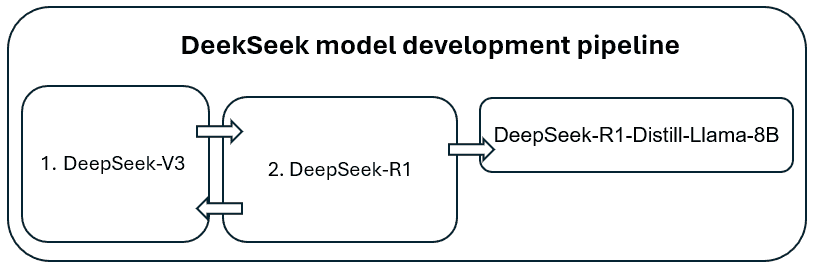
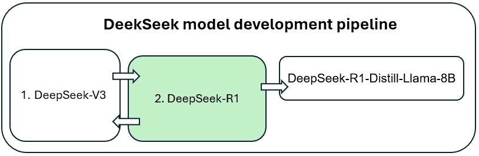
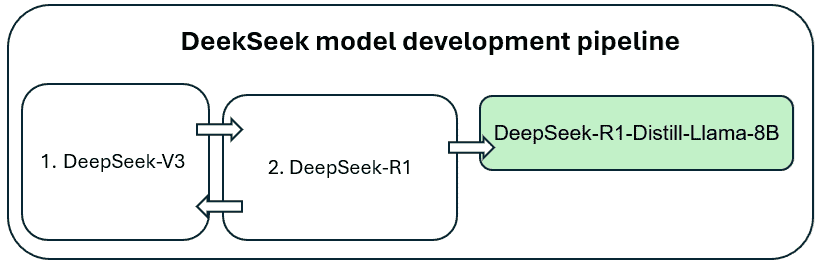
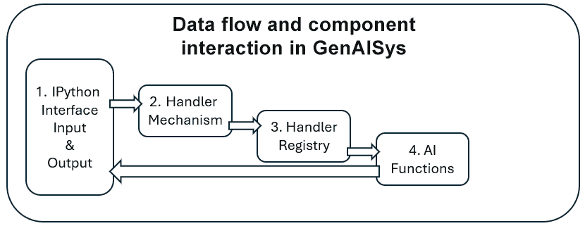
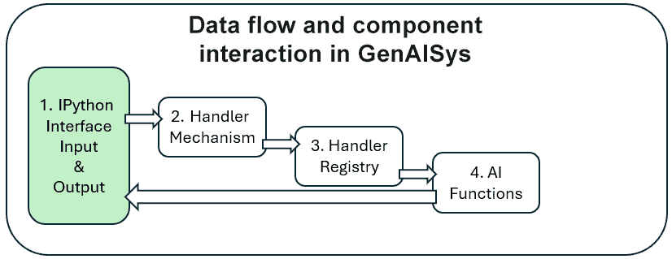
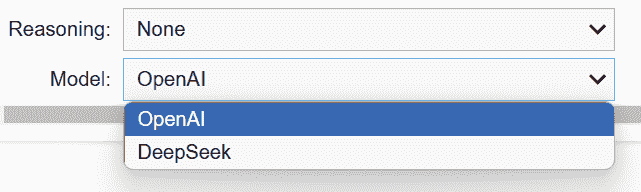
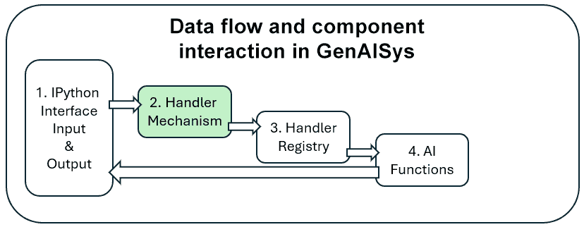
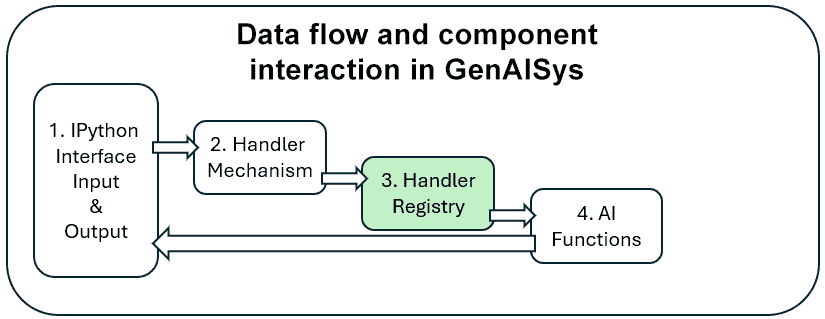
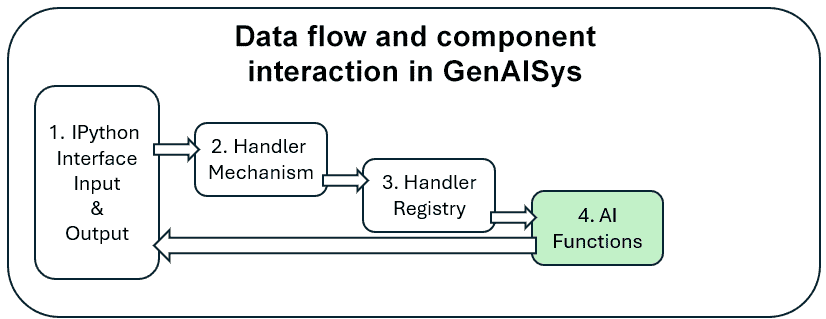

# 第七章：使用 DeepSeek 增强 GenAISys

*DeepSeek-V3 技术报告*于 2024 年 12 月发布，一个月后，**DeepSeek-R1**论文和一套完整的开源资源紧随其后。这一发布在 AI 社区中引起了轩然大波：Hugging Face 上的下载量激增，DeepSeek 应用在商店排行榜上名列前茅，新的 API 提供商一夜之间涌现。政府在辩论暂停令的同时，主要的生成式 AI 玩家——OpenAI、X（带有 Grok 3）和其他人——加快了步伐。在几周内，我们看到了 o3 版本改进了 OpenAI 模型，这是一个明确的信号，表明 AI 竞赛已经进入了一个新的阶段。与此同时，现实世界的 AI 生产团队目睹了这些令人眼花缭乱的创新堆积起来，破坏了现有的 AI 系统。那些花费数月时间调整其系统以适应一个生成式 AI 模型的团队发现自己陷入了系统工作但仍有改进空间的灰色地带。

那么，我们应该怎么做？我们应该以成本和风险为代价，将稳定的 GenAISys 升级以跟随加速的 AI 市场的最新趋势吗？或者，如果我们的系统稳定，我们应该忽略最新的模型吗？如果我们忽略进化，我们的系统可能会过时。如果我们继续跟随趋势，我们的系统可能会变得不稳定！

本章展示了如何找到一个可行的平衡点。我们不是为每个模型升级或新功能重写整个环境，而是引入了一个**处理器选择机制**，该机制将用户请求路由到正确的时间的正确工具。一个**处理器注册表**存储了我们开发的每个 AI 功能；选择层检查每个传入的消息并触发适当的处理器。这种设计使得 GenAISys 可以无限期地进化而不会破坏堆栈。我们将从定义如何在模型演化和实际使用之间找到一个平衡方法开始本章，通过产品设计和生产用例进行说明。接下来，我们将简要介绍 DeepSeek-V3、DeepSeek-R1 以及我们将要实施的精炼 Llama 模型。然后，我们将使用 Hugging Face 本地安装**DeepSeek-R1-Distill-Llama-8B**，将其封装在一个可重用的函数中，并将其插入到我们的 GenAISys 中。到那时，我们将开发灵活、可扩展的处理器选择机制环境，以便我们可以激活每个项目所需的模型和任务。到本章结束时，你将能够完全控制 GenAISys，并准备好应对 AI 市场带来的任何挑战。

本章涵盖了以下主题：

+   人工智能加速与使用的平衡

+   DeepSeek-V3、R1 和蒸馏模型的概述

+   本地安装 DeepSeek-R1-Distill-Llama-8B

+   创建一个运行 DeepSeek-R1-Distill-Llama-8B 的函数

+   在 GenAISys 中部署 DeepSeek-R1-Distill-Llama-8B

+   为所有 AI 功能构建处理器注册表

+   构建处理器选择机制以选择处理器

+   升级 AI 功能以兼容处理器

+   运行产品设计和生产示例

让我们从定义不懈的 AI 进化与日常业务使用之间的平衡开始。

# 平衡模型进化与项目需求

在急于采用每个新模型之前，我们必须根据项目需求来做出决策。到目前为止，我们的 GenAISys 主要服务于在线旅行社的营销功能。现在，想象一下，这家旅行社已经发展壮大，足以资助一系列品牌商品——定制旅行包、手册和其他好东西。为了管理这项新业务，公司雇佣了一位**产品设计师和生产经理**（**PDPM**）。PDPM 研究客户反馈并设计个性化套装，但很快发现 AI 可以提升创造力和效率。

本章中的示例因此专注于产品设计和生产工作流程。我们的目标不是将 DeepSeek（或任何其他模型）强加到每个任务上，而是选择最适合需求的模型。为此，我们将通过一个处理程序选择机制扩展 GenAISys，该机制响应 IPython 界面中的用户选择和每条消息中的关键词。根据具体情况，操作团队可以配置系统将请求路由到 GPT-4o、DeepSeek 或任何未来的模型。

在将 DeepSeek 集成到我们的 GenAISys 之前，让我们回顾一下 DeepSeek 模型家族。

# DeepSeek-V3, DeepSeek-V1, 和 R1-Distill-Llama：概述

DeepSeek 的旅程始于 DeepSeek-V3，发展到 DeepSeek-R1——一个以推理为重点的升级，然后分支到基于 Qwen 和 Llama 架构的蒸馏变体，如图*图 7.1*所示。V3 负责将模型推向市场，而 R1 则带来了强大的推理能力。



图 7.1：DeepSeek 开发周期

根据 DeepSeek-AI 等人（2024）的研究，V3 实现了显著的效率提升。其完整训练预算仅为 2.788 百万 H800 GPU 小时（≈每 GPU 小时 2 美元的 5.6 百万美元）——对于一个现代前沿模型来说，这个成本非常低。即使是按每个 token 计算，成本也很低，只需 180 K GPU 小时就能处理万亿个 tokens。因此，与通常报道的大规模模型相比，成本非常经济。

当我们查看 arXiv 上 DeepSeek-V3 技术报告（2024）的作者名单[`arxiv.org/abs/2412.19437`](https://arxiv.org/abs/2412.19437)时，我们首先注意到超过 150 位专家撰写了这篇论文！仅此一点，就证明了开源方法的有效性，这些方法涉及集体努力，通过向愿意贡献的每个人开放思想来产生效率驱动的架构。《附录 A》中的*贡献和致谢*名单是对开源发展的致敬。



图 7.2：DeepSeek-R1 源自 DeepSeek-V3

DeepSeek-R1 直接从 DeepSeek-V3 发展而来。团队希望拥有 V3 的冲击力，但又要实现轻量级的推理，因此他们在推理时仅激活了专家的最小子集，如图 *图 7.2* 所示。此外，训练过程也保持了简洁。R1 直接进入强化学习，没有进行监督微调。推理能力很高，但面对经典 NLP 任务的限制。引入基于规则的奖励以避免神经网络训练周期。训练提示以整洁的 `<think> … <answer>` 标签结构化，避免将偏见带入模型的最终答案。此外，强化学习过程从包含 **思维链**（**CoT**）示例的 *冷启动* 数据开始，这些示例专注于推理。这种方法减少了训练时间和成本。

DeepSeek 通过优化 MoE 策略和集成多令牌预测，演变为 R1，显著提高了准确性和效率。最终，DeepSeek-R1 被用于增强 DeepSeek-V3 的推理功能。DeepSeek-R1 还被蒸馏成更小的模型，如 Llama 和 Qwen。所使用的技术是知识蒸馏，其中较小的“学生”模型（在本章中为 Llama）从“教师”模型（在本章中为 DeepSeek-R1）学习。这种方法有效，因为它教会学生模型达到与教师模型相似的性能，同时更高效且适合部署在资源受限的设备上，正如您在本章中将会看到的。

让我们安装并运行 DeepSeek-R1-Distill-Llama-8B 并将其连接到我们的 GenAISys。

# 开始使用 DeepSeek-R1-Distill-Llama-8B

在本节中，我们将实现 DeepSeek-RAI-Distill-Llama-8B，这是 DeepSeek-R1 的精简版本，如图 *图 7.3* 所示。我们将安装 Hugging Face 的开源 `Transformers` 库，这是一个用于使用和微调预训练 Transformer 模型的开放框架。



图 7.3：安装 DeepSeek-RAI-Distill-Llama-8B，DeepSeek-R1 的精简版本

我们将使用 Hugging Face 记录的 DeepSeek-RAI-Distill-Llama-8B：[`huggingface.co/deepseek-ai/DeepSeek-R1-Distill-Llama-8B`](https://huggingface.co/deepseek-ai/DeepSeek-R1-Distill-Llama-8B)。Hugging Face 还为此模型提供了推荐：[`huggingface.co/deepseek-ai/DeepSeek-R1-Distill-Llama-8B#usage-recommendations`](https://huggingface.co/deepseek-ai/DeepSeek-R1-Distill-Llama-8B#usage-recommendations)。

我们将下载的版本是由 LLM 加速器 Unsloth 提供的 DeepSeek-R1 的开源蒸馏版本，在 Hugging Face 上：[`unsloth.ai/`](https://unsloth.ai/)。因此，我们将不使用 DeepSeek API，而只使用本地安装的开源版本，该版本不与网络交互，利用 Hugging Face 的 SOC 2 Type 2 认证，符合隐私和安全约束：[`huggingface.co/docs/inference-endpoints/en/security`](https://huggingface.co/docs/inference-endpoints/en/security)。

在本地机器上安装 deepseek-ai/DeepSeek-R1-Distill-Llama-8B，建议拥有大约 20 GB 的 RAM。稍微少一点也是可能的，但最好避免风险。也建议大约 20 GB 的磁盘空间。

在 Google Colab 上安装 DeepSeek-R1-Distill-Llama-8B，建议使用 Google Colab Pro 以获得 GPU 内存和动力。在本节中，Hugging Face 模型是在 Google Drive 上下载的，并通过 Google Colab 挂载。所需的磁盘空间将超过 Google Drive 的免费版本，可能需要 Google Drive 的最小订阅。在 Google Colab 上安装之前请检查费用。

在 GitHub 的 Chapter07 目录中打开 `Getting_started_with_DeepSeek_R1_Distill_Llama_8B.ipynb` ([`github.com/Denis2054/Building-Business-Ready-Generative-AI-Systems/tree/main`](https://github.com/Denis2054/Building-Business-Ready-Generative-AI-Systems/tree/main))。我们将遵循 Hugging Face 框架的标准程序：

+   运行一次笔记本以在本地安装 DeepSeek-R1-Distill-Llama-8B：

    ```py
    install_deepseek=True 
    ```

+   无需安装即可运行笔记本并与模型交互：

    ```py
    install_deepseek=False 
    ```

模型就位后，我们可以在下一节中将它包装在处理器中，并将其插入我们的 GenAISys。

## 设置 DeepSeek Hugging Face 环境

我们将首先安装 DeepSeek-R1-Distill-Llama-8B（本地或 Colab），然后运行快速推理以确认一切正常工作。

我们将在第一个会话中首先安装 DeepSeek：

```py
# Set install_deepseek to True to download and install R1-Distill-Llama-8B locally
# Set install_deepseek to False to run an R1 session
install_deepseek=True 
```

需要激活 GPU，让我们检查一下：

```py
Checking GPU activation
!nvidia-smi 
```

如果我们在安装 Google Colab，我们可以挂载 Google Drive：

```py
from google.colab import drive
drive.mount('/content/drive') 
```

我们现在设置 Google Drive 中的缓存目录并设置相应的环境变量：

```py
import os
# Define the cache directory in your Google Drive
cache_dir = '/content/drive/MyDrive/genaisys/HuggingFaceCache'
# Set environment variables to direct Hugging Face to use this cache directory
os.environ['TRANSFORMERS_CACHE'] = cache_dir
#os.environ['HF_DATASETS_CACHE'] = os.path.join(cache_dir, 'datasets') 
```

我们现在可以安装 Hugging Face 的 `Transformers` 库：

```py
!pip install transformers==4.48.3 
```

这样，我们就准备好下载模型了。

## 下载 DeepSeek

现在，让我们在 Hugging Face 框架内从 `unsloth/DeepSeek-R1-Distill-Llama-8B` 下载模型，包括分词器和模型：

```py
from transformers import AutoTokenizer, AutoModelForCausalLM
import time
if install_deepseek==True:
    # Record the start time
    start_time = time.time()
    model_name = 'unsloth/DeepSeek-R1-Distill-Llama-8B'
    # Load the tokenizer and model
    tokenizer = AutoTokenizer.from_pretrained(model_name)
    model = AutoModelForCausalLM.from_pretrained(
        model_name, device_map='auto', torch_dtype='auto'
    )
    # Record the end time
    end_time = time.time()
    # Calculate the elapsed time
    elapsed_time = end_time - start_time
    print(f"Time taken to load the model: {elapsed_time:.2f} seconds") 
```

下载时间将显示，并取决于您的互联网连接和 Hugging Face 的下载速度。安装完成后，请验证本地目录中是否已安装所有内容。在这种情况下，如下所示：

```py
if install_deepseek==True:
    !ls -R /content/drive/MyDrive/genaisys/HuggingFaceCache 
```

输出应显示下载的文件：

```py
/content/drive/MyDrive/genaisys/HuggingFaceCache:
models--unsloth--DeepSeek-R1-Distill-Llama-8B  version.txt
/content/drive/MyDrive/genaisys/HuggingFaceCache/models--unsloth--DeepSeek-R1-Distill-Llama-8B:
blobs  refs  snapshots
/content/drive/MyDrive/genaisys/HuggingFaceCache/models--unsloth--DeepSeek-R1-Distill-Llama-8B/blobs:
03910325923893259d090bfa92baa4088cd46573… 
```

现在，让我们运行一个 DeepSeek 会话。

## 运行 DeepSeek-R1-Distill-Llama-8B 会话

为了确保模型正确安装，并避免在启动新会话时覆盖安装，请回到笔记本的顶部并设置以下内容：

```py
install_deepseek=False 
```

现在，我们将本地加载 `DeepSeek-R1-Distill-Llama-8B` 分词器和模型：

```py
import time
from transformers import AutoTokenizer, AutoModelForCausalLM
if install_deepseek==False:
    # Define the path to the model directory
    model_path = '/content/drive/MyDrive/genaisys/HuggingFaceCache/models--unsloth--DeepSeek-R1-Distill-Llama-8B/snapshots/71f34f954141d22ccdad72a2e3927dddf702c9de'
    # Record the start time
    start_time = time.time()
    # Load the tokenizer and model from the specified path
    tokenizer = AutoTokenizer.from_pretrained(
        model_path, local_files_only=True
    )
    model = AutoModelForCausalLM.from_pretrained(
        model_path, device_map='auto', torch_dtype='auto', 
        local_files_only=True
    )
    # Record the end time
    end_time = time.time()
    # Calculate the elapsed time
    elapsed_time = end_time - start_time
    print(f"Time taken to load the model: {elapsed_time:.2f} seconds") 
```

加载模型所需的时间将显示，并取决于你的机器配置：

```py
Time taken to load the model: 14.71 seconds 
```

我们可以查看 Llama 模型的配置：

```py
if install_deepseek==False:
    print(model.config) 
```

输出显示了有趣的信息。`LlamaConfig` 的读取确认我们正在运行一个紧凑、范围明确的模型：

```py
LlamaConfig {
  "_attn_implementation_autoset": true,
  "_name_or_path": "/content/drive/MyDrive/genaisys/HuggingFaceCache/models--unsloth--DeepSeek-R1-Distill-Llama-8B/snapshots/71f34f954141d22ccdad72a2e3927dddf702c9de",
  "architectures": [
    "LlamaForCausalLM"
  ],
 … 
```

精炼的 Llama 模型有 32 个 transformer 层和每层 32 个注意力头，总共 1,024 个注意力头。此外，它包含 80 亿个参数。相比之下，其教师模型 **DeepSeek-R1** 是一个 MoE 巨型，有 **61 层** 和庞大的 **6710 亿参数**，其中大约 **370 亿** 在每次前向传递时是活跃的。现在让我们用一个针对生产问题的提示来运行一个示例：

```py
if install_deepseek==False:
    prompt="""
    Explain how a product designer could transform customer requirements for a traveling bag into a production plan.
    """ 
```

我们首先插入时间测量，并使用 GPU 对输入进行分词：

```py
import time
if install_deepseek==False:
    # Record the start time
    start_time = time.time()
    # Tokenize the input
    inputs = tokenizer(prompt, return_tensors='pt').to('cuda') 
```

然后，我们运行生成：

```py
 # Generate output with enhanced anti-repetition settings
    outputs = model.generate(
      **inputs,
        max_new_tokens=1200,
        repetition_penalty=1.5,     # Increase penalty to 1.5 or higher
        no_repeat_ngram_size=3,     # Prevent repeating n-grams of size 3
        temperature=0.6,            # Reduce randomness slightly
        top_p=0.9,                  # Nucleus sampling for diversity
        top_k=50       # Limits token selection to top-k probable tokens
  ) 
```

我们参数的目标是限制重复并保持专注：

+   `max_new_tokens=1200`: 限制输出标记的数量

+   `repetition_penalty=1.5`: 限制重复（可以更高）

+   `no_repeat_ngram_size=3`: 防止重复特定大小的 n-gram

+   `temperature=0.6`: 减少随机性并保持专注

+   `top_p=0.9`: 允许核采样以增加多样性

+   `top_k=50`: 将标记选择限制为 `top_k` 以进行下一个标记选择

这组标记倾向于限制重复，同时允许多样性。现在我们可以使用分词器解码生成的文本：

```py
 # Decode and display the output
    generated_text = tokenizer.decode(
        outputs[0], skip_special_tokens=True
    )
    # Record the end time
    end_time = time.time()
    # Calculate the elapsed time
    elapsed_time = end_time - start_time
    print(f"Time taken to load the model: {elapsed_time:.2f} seconds") 
```

输出显示了模型思考和响应所花费的总时间：

```py
Time taken to load the model: 20.61 seconds 
```

让我们将 `generated_text` 包装并显示：

```py
import textwrap
if install_deepseek==False:
    wrapped_text = textwrap.fill(generated_text, width=80)   
print(wrapped_text) 
```

输出提供了所需的想法。它显示了 DeepSeek-R1 的思考能力：

```py
…Once goals & priorities become clearer, developing
prototypes becomes more focused since each iteration would aim at testing one main feature rather than multiple changes simultaneously—which makes refining individual elements easier before moving towards finalizing designs, When prototyping starts: 1) Start with basic functional mockups using simple tools –… 
```

## 集成 DeepSeek-R1-Distill-Llama-8B

在本节中，我们将通过几个步骤将 DeepSeek-R1-Distill-Llama-8B 添加到我们的 GenAISys 中。打开 `GenAISys_DeepSeek.ipynb`。你可以决定在第一个单元中运行笔记本，这将需要 GPU：

```py
# DeepSeek activation deepseek=True to activate. 20 Go (estimate) GPU memory and 30-40 Go Disk Space
deepseek=True 
```

你也可以选择不在本笔记本中运行 DeepSeek，在这种情况下，你不需要 GPU，可以将运行时更改为 CPU。如果你选择此选项，OpenAI 的 API 将接管，确认不需要 GPU：

```py
deepseek=False 
```

现在，转到笔记本的 *设置 DeepSeek Hugging Face 环境* 子节。我们将简单地从 `Getting_started_with_DeepSeek_R1_Distill_Llama_8B.ipynb` 将以下单元格转移到这个子节。以下代码仅在 `deepseek=True` 时激活：

+   GPU 激活检查：`!nvidia-smi`

+   设置模型的本地缓存：`…os.environ['TRANSFORMERS_CACHE'] =cache_dir…`

+   安装 Hugging Face 库：`!pip install transformers==4.48.3`

+   加载分词器和模型：

    ```py
     from transformers import AutoTokenizer, AutoModelForCausalLM
      # Define the path to the model directory
      model_path = … 
    ```

安装现在已完成。如果`DeepSeek==True`，则 DeepSeek 模型的调用将在*AI 函数*部分进行，参数在*运行 DeepSeek-R1-Distill-Llama-8B 会话*部分中描述：

```py
 if models == "DeepSeek":
      # Tokenize the input
      inputs = tokenizer(sc_input, return_tensors='pt').to('cuda')
….
      task_response =tokenizer.decode(outputs[0],skip_special_tokens=True) 
```

在 DeepSeek 运行的情况下，我们已准备好构建处理器选择机制，该机制将把每个用户请求路由到 GPT-4o、DeepSeek 或任何未来的模型——而不触及堆栈的其余部分。

# 将处理器选择机制作为 GenAISys 的编排器实现

在在线旅行社中，PDPM 正面临日益增长的需求，要求旅行社设计和生产大量商品套装，包括旅行包、手册和笔。PDPM 希望直接参与 GenAISys 的开发，以探索它如何显著提高生产力。

由于系统中 AI 任务的复杂性和多样性不断增加，GenAISys 开发团队已决定使用处理器来组织这些任务，如图*7.4*所示：



图 7.4：GenAISys 数据流和组件交互

因此，我们将定义、实现该处理器选择机制，然后邀请 PDPM 运行增强版的 GenAISys，以评估旨在提高商品设计和生产效率的函数。

*图 7.4*描述了我们将要实施的处理器管道的行为：

1.  **IPython 界面**作为用户交互的入口和出口点，捕获用户输入，对其进行格式化，并显示处理器机制返回的响应。

1.  **处理器机制**解释用户输入，在 IPython 界面、处理器注册表和 AI 函数之间引导数据。它确保由用户消息触发的任务能够顺利执行。

1.  **处理器注册表**维护所有可用处理器及其对应函数的列表。它通过明确处理器注册和检索来支持系统模块化和可扩展性。

1.  **AI 函数**执行核心任务，如自然语言理解和数据分析，执行从处理器机制接收的指令，并将输出返回到 IPython 界面。

在此设置中，用户通过 IPython 界面提供输入。此输入被路由到处理器选择机制，该机制随后评估注册的可用处理器以及特定条件。注册表中的每个条目都是一个（条件，处理器）对，负责不同的操作，如推理、图像生成或数据分析。一旦找到匹配的条件，相应的 AI 函数就会被激活。处理完毕后，它将结果返回到界面。这个结构化的管道——从用户输入到 AI 生成的响应——被优雅地处理，每个处理器都明确定义以提高可读性和效率。

在编码之前，让我们明确定义在 GenAISys 中我们所说的“处理器”是什么。

## 什么是处理器？

处理器本质上是一个专门的功能，用于处理特定的任务或请求类型。每个处理器都与一个条件注册在一起，通常是一个小的函数或 lambda 表达式。当评估为`True`时，这个条件表明应该调用相关的处理器。这种设计巧妙地将决定“哪个”处理器应该运行的逻辑与处理器执行其任务的逻辑分离。

在我们的上下文中，处理器是协调器的构建块——设计用于处理特定输入类型的条件函数。当用户提供输入时，处理器选择机制将其与处理器注册表进行比较，该注册表由条件和处理器成对组成。一旦找到匹配项，相应的处理器就会被触发，调用专门的函数，如`handle_generation`、`handle_analysis`或`handle_pinecone_rag`。这些处理器执行复杂的推理、数据检索或内容生成任务，提供精确和有针对性的输出。

但为什么处理器（handler）比传统的`if…then`条件列表更适合我们的 GenAISys 呢？

## 为什么处理器比传统的 if...then 列表更好？

使用处理器可以提高可维护性和可读性。而不是在代码中分散多个`if...then`检查，每个处理器都是自包含的：它有自己的条件和执行所需操作的单独函数。这种结构使得在不冒险在长条件链中产生意外交互的情况下添加、删除或修改处理器变得更容易。此外，由于它将“我们需要哪个处理器？”的逻辑与“该处理器实际上是如何工作的？”的逻辑分开，我们得到了一个更模块化的设计，这使得扩展变得无缝。

我们将首先介绍我们对 IPython 界面的修改。

# 1. IPython 界面

我们首先回顾一下我们对 IPython 界面的主要更新，它仍然是主要的交互点，如*图 7.5*所示。从用户的角度来看，引入处理器并没有显著改变界面，但需要对一些底层代码进行调整。



图 7.5：IPython 界面处理用户输入并显示输出

IPython 界面像以前一样调用`chat_with_gpt`：

```py
response = chat_with_gpt(
    user_histories[active_user], user_message, pfiles, 
    active_instruct, models=selected_model
) 
```

现在，然而，我们可以明确选择 OpenAI 或 DeepSeek 模型，如下所示：

```py
models=selected_model 
```

要将模型添加到`chat_with_gpt`调用中，我们首先在界面中添加一个下拉模型选择器：

```py
# Dropdown for model selection
model_selector = Dropdown(
    options=["OpenAI", "DeepSeek"],
    value="OpenAI",
    description="Model:",
    layout=Layout(width="50%")
) 
```

模型选择器被添加到界面中的`VBox`实例中：

```py
# Display interactive widgets
display(
    VBox(
        [user_selector, input_box, submit_button, agent_checkbox, 
            tts_checkbox, files_checkbox, instruct_selector, 
            model_selector],
        layout=Layout(display='flex', flex_flow='column', 
            align_items='flex-start', width='100%')
    )
) 
```

用户现在可以直接从界面中选择他们偏好的模型，如图所示：



图 7.6：选择模型

**快速提示**：需要查看此图像的高分辨率版本？在下一代 Packt Reader 中打开此书或在其 PDF/ePub 副本中查看。

**新一代 Packt Reader**随本书免费赠送。扫描二维码或访问[packtpub.com/unlock](http://packtpub.com/unlock)，然后使用搜索栏通过名称查找本书。请仔细核对显示的版本，以确保您获得正确的版本。


已添加一个额外的功能来管理文件显示。

## 文件管理

设计文件管理的方式有很多。在这里，我们将介绍一个可以在项目实施阶段根据需要扩展的功能。我们的文件管理代码有三个函数：

+   管理用户触发的文件删除

+   当复选框取消选中时删除`c_image.png`

+   使用存在性检查来防止删除时的错误

我们将在 Jupyter Notebook 环境中直接通过观察界面复选框小部件的变化来构建处理用户交互的代码。当用户取消选中名为`files_checkbox`的复选框时，该代码将删除特定的图像文件（`c_image.png`）。这确保了当文件不再需要时，文件会被干净地移除，防止杂乱并节省存储空间。

我们首先定义函数：

```py
def on_files_checkbox_change(change): 
```

事件处理函数定义了一个名为`on_files_checkbox_change`的回调函数，当`files_checkbox`的状态发生变化时将执行。`change`由观察者提供，其中包含有关更改事件的信息，包括以下内容：

+   `old`: 复选框的先前状态

+   `new`: 复选框的新状态

```py
 # Only remove images if the checkbox changed from True to False.
    if change['old'] == True and change['new'] == False: 
```

代码验证复选框之前是否被选中（`True`）并且现在已被取消选中（`False`）。这保证了文件删除仅在用户明确取消选中复选框时发生，防止意外删除文件。我们现在删除文件：

```py
 if os.path.exists("c_image.png"):
            os.remove("c_image.png") 
```

我们还需要添加一个观察者，以便在文件状态发生变化时通知`on_files_checkbox_change`函数：

```py
# Attach the observer to files_checkbox
files_checkbox.observe(on_files_checkbox_change, names='value') 
```

`files_checkbox.observe()`函数将`on_files_checkbox_change`函数链接到`files_checkbox`小部件。`names='value'`指定当复选框的值发生变化时（即，当它被选中或取消选中时）应触发该函数。

我们现在将进入管道的下一部分，并实现处理程序选择机制。

# 2. 处理程序选择机制

处理器选择机制根据预定义的条件动态选择并执行适当的处理程序。它遍历可用的处理程序，评估条件直到找到匹配项，确保对用户输入进行高效和结构化的处理。处理器选择机制在我们在前几章中构建的`chat_with_gpt`函数中。然而，现在它包含了一个协调任务，如*图 7.7*所示：

+   `chat_with_gpt`在 GenAISys 中仍然是一个关键功能，并且现在包含处理器机制

+   它按顺序检查条件以决定调用哪个处理器

+   如果没有条件匹配，它将回退到基于内存的处理程序

+   它确保了通过错误处理来保证用户体验的连续性



图 7.7：处理器机制的协调角色

在更广泛的 GenAISys 工作流程中，处理器机制充当协调者。它处理用户输入并识别要激活的 AI 功能。当 IPython 界面捕获用户消息时，处理器机制评估这些输入以确定从处理器注册表中适当的处理器。如果没有特定的处理器匹配，它默认使用基于内存的响应，然后将其返回到 IPython 界面。

`chat_with_gpt`函数封装了这个逻辑。它遍历一个预定义的处理程序列表，每个处理程序都与相应的条件函数配对。当条件评估为真时，将执行相关的处理程序。如果没有匹配项，回退的基于内存的处理程序确保了无缝的响应：

```py
def chat_with_gpt(
    messages, user_message, files_status, active_instruct, models
):
     global memory_enabled  # Ensure memory is used if set globally 
```

让我们来看看函数的参数：

+   `messages`: 用户和 AI 之间的对话历史

+   `user_message`: 用户最新的消息

+   `files_status`: 跟踪涉及对话的任何文件的状态

+   `active_instruct`: 可能影响响应生成的任何指令或模式

+   `models`: 指定正在使用的活动 AI 模型

该函数使用`global memory_enabled`来访问一个全局变量，该变量确定是否应该应用内存来存储/记住用户的完整对话。在本章中，`global memory_enabled=True`。

函数尝试根据提供的条件执行适当的处理程序：

```py
 try:
        # Iterate over handlers and execute the first matching one
        for condition, handler in handlers:
            if condition(messages, active_instruct, memory_enabled, 
                models, user_message):
                return handler(messages, active_instruct, memory_enabled, 
                    models, user_message, files_status=files_status) 
```

如您所见，`for condition, handler in handlers`遍历一个名为`handlers`的列表，其中每个项目都是一个包含以下内容的元组：

+   一个条件函数，用于检查是否应该使用处理程序

+   一个处理器函数，无论条件是否满足都要执行

+   一个通用的`if`条件`(...)`, 用于使用提供的参数评估条件函数

+   如果条件满足，代码将返回相应处理程序的输出，并立即退出函数

现在我们添加一个回退，如果没有任何处理器匹配输入条件：

```py
 # If no handler matched, default to memory handling with full conversation history
        return handle_with_memory(
            messages,  # Now passing full message history
            user_message,
            files_status=files_status,
            instruct=active_instruct,
            mem=memory_enabled,  # Ensuring memory usage
            models=models
        ) 
```

`handle_with_memory`作为默认处理器被调用，执行以下操作：

+   使用完整的对话历史（`messages`）

+   如果 `memory_enabled` 为 true，则考虑内存，在本章中就是这种情况

+   如果执行，则直接返回响应

最后，让我们添加一个异常来捕获返回错误：

```py
 except Exception as e:
        return f"An error occurred in the handler selection mechanism: {str(e)}" 
```

在定义了处理器选择机制之后，我们现在可以继续构建存储这些处理器的处理器注册表。

# 3. 处理器注册表

**处理器注册表**是一个结构化的条件-处理器对集合，其中每个条件都是一个 lambda 函数，它评估用户消息和指令以确定是否满足特定标准。当条件满足时，相应的处理器立即被触发并执行，如图所示：



图 7.8：创建处理器注册表

所有 lambda 函数都有四个参数（`msg`、`instruct`、`mem` 和 `models`）。这确保了当 `chat_with_gpt()` 调用一个处理器时，参数的数量匹配。

处理器注册表有三个主要功能：

+   由处理器机制编排，可以无限扩展

+   根据关键词、指令或模型选择路由输入

+   如果没有条件匹配，则保证有回退响应

我们将按照以下四个关键属性的结构设计我们的处理器注册表：

+   **处理器注册**：创建一个处理器列表，每个处理器都有一个条件函数和一个相应的处理器函数

+   **特定处理器条件**：依次检查输入是否满足任何特定条件

+   **回退处理器**：如果没有条件匹配，则添加一个默认的基于内存的处理器

+   **执行**：当条件满足时，相应的处理器立即执行

代码中 `**kwargs` 的作用提供了一个灵活的方式与 AI 函数交互。`**kwargs` 是 *关键字参数* 的缩写，用于 Python 函数中，允许向函数传递可变数量的参数。在我们的处理器注册表代码中，`**kwargs` 通过允许处理器接受额外的、可选的参数，而不需要在函数中显式定义它们，发挥着至关重要的作用。这使得处理器易于扩展，以便于未来的更新或添加新参数，而无需修改现有的函数签名。

我们现在将开始构建带有 Pinecone/RAG 处理器的处理器注册表。

## Pinecone/RAG 处理器

Pinecone/RAG 处理器管理之前定义的 **检索增强生成**（**RAG**）功能。它在检测到用户消息中包含 `Pinecone` 或 `RAG` 关键词时激活：

```py
 # Pinecone / RAG handler: check only the current user message
    (
        lambda msg, instruct, mem, models, user_message,
        **kwargs: “Pinecone” in user_message or “RAG” in user_message,
        lambda msg, instruct, mem, models, user_message,
        **kwargs: handle_pinecone_rag(user_message, models=models)
    ), 
```

此处理器检查用户消息是否包含“Pinecone”或“RAG”，如果是，则 `lambda:` 返回 `True`；否则，返回 `False`。我们现在将创建推理处理器。

## 推理处理器

我们已经构建了推理函数，但现在我们需要一个处理程序。触发处理程序的关键字是 `Use reasoning`、`customer` 和 `activities`。消息中的任何附加文本都为推理过程提供上下文。处理程序使用 `all()` 确保所有关键字都包含在消息中：

```py
 # Reasoning handler: check only the current user message
    (
        lambda msg, instruct, mem, models, user_message, **kwargs: all(
            keyword in user_message for keyword in [
                “Use reasoning”, “customer”, “activities”
            ]
        ),
        lambda msg, instruct, mem, models, user_message, **kwargs:
            handle_reasoning_customer(user_message, models=models)
    ), 
```

让我们继续创建分析处理程序。

## 分析处理程序

分析处理程序到目前为止已被用于内存分析，并由 `Analysis` 指令触发：

```py
 # Analysis handler: determined by the instruct flag
    (
        lambda msg, instruct, mem, models, user_message,
            **kwargs: instruct == “Analysis”,
        lambda msg, instruct, mem, models, user_message,
            **kwargs: handle_analysis(
                user_message, models=models)
    ), 
```

是时候创建生成处理程序了。

## 生成处理程序

生成处理程序通过要求生成式 AI 模型根据文本的内存分析为顾客生成吸引人的文本，将内存分析提升到了另一个层次。`Generation` 指令触发生成处理程序：

```py
 # Generation handler: determined by the instruct flag
    (
        lambda msg, instruct, mem, models, user_message,
               **kwargs: instruct == “Generation”,
        lambda msg, instruct, mem, models, user_message,
                **kwargs: handle_generation(
                    user_message, models=models)
    ), 
```

现在我们来构建图像创建处理程序。

## 图像处理程序

图像创建处理程序由用户消息中的 `Create` 和 `image` 关键字触发：

```py
 # Create image handler: check only the current user message
    (
        lambda msg, instruct, mem, models, user_message,
        **kwargs: “Create” in user_message and “image” in user_message,
        lambda msg, instruct, mem, models, user_message,
            **kwargs: handle_image_creation(user_message, models=models)
    )
] 
```

我们现在将创建用于没有关键字或指令的情况的自由处理程序。

## 回退内存处理程序

当没有指令或关键字触发特定功能时，此处理程序是一个通用处理程序。让我们相应地附加回退内存处理程序：

```py
# Append the fallback memory handler for when instruct is “None”
handlers.append(
    (
        lambda msg, instruct, mem, models, user_message,
               **kwargs: instruct == “None”,
        lambda msg, instruct, mem, models, user_message,
               **kwargs: handle_with_memory(
            msg,
            user_message,
            files_status=kwargs.get(‘files_status’),
            instruct=instruct,
            mem=memory_enabled,  # Replace user_memory with memory_enabled
            models=models
        )
    )
) 
```

注意，我们已经将 `user_memory` 替换为 `memory_enabled` 以实现内存管理的通用化。

您可以将任意数量的处理程序和 AI 函数添加到处理程序注册表中。您可以根据需要扩展 GenAISys。您还可以通过替换显式指令来修改关键字，就像我们对 `Analysis` 和 `generation` 函数所做的那样。然后，处理程序将调用您需要的所有 AI 函数。

让我们现在来了解 AI 函数的新组织结构。

# 4. AI 函数

我们现在将运行由处理程序注册表激活的 AI 函数。这些函数基于早期章节中的函数，但现在由本章中引入的处理程序选择机制管理。此外，本节中使用的示例基于与产品设计和生产场景相关的典型提示。请记住，由于生成式 AI 模型的随机（概率）性质，每次运行这些任务时输出都可能有所不同。



图 7.9：处理程序选择机制和注册表调用的 AI 函数

我们现在将执行 GenAISys 中目前所有可用的 AI 函数，并在适用的情况下调用 DeepSeek 模型。让我们从 RAG 函数开始。

诸如语音合成、文件管理、对话历史和摘要生成等功能与上一章保持不变。

## RAG

此 RAG 函数可以在用户消息中使用 `Pinecone` 关键字与 OpenAI 或 DeepSeek 运行。RAG 函数的名称已更改，但其查询过程保持不变：

```py
# Define Handler Functions
def handle_pinecone_rag(user_message, **kwargs):
    if "Pinecone" in user_message:
      namespace = "genaisys"
    if "RAG" in user_message:
      namespace = "data01"
    print(namespace)
    query_text = user_message
    query_results = get_query_results(query_text, namespace)
    print("Processed query results:")
    qtext, target_id = display_results(query_results)
    print(qtext)
    # Run task
    sc_input = qtext + " " + user_message 
```

然而，该函数现在包含了一个 DeepSeek 蒸馏 R1 调用。如果没有提供模型或 DeepSeek 被禁用时，该函数默认使用 OpenAI：

```py
 models = kwargs.get("models", "OpenAI")  # Default to OpenAI if not provided
    if models == "DeepSeek" and deepseek==False:
       models="OpenAI"
    if models == "OpenAI":
      task_response = reason.make_openai_api_call(
      sc_input, "system","You are an assistant who executes the tasks you are asked to do.", "user") 
```

如果激活了 DeepSeek，它将在 IPython 界面中为此任务选择时被调用：

```py
 if models == "DeepSeek":
      …
    return f"{namespace}:{models}: {task_response}" 
```

我们将首先进行情感分析。

### 情感分析（genaisys）

PDPM 的以下示例用户输入：

```py
Let's see what Pinecone thinks about this sentence: The customer did not like the design of the traveling bag we gave out because it was not the right color requested. 
```

选择 OpenAI（默认）和勾选`Agent`的输出将如下所示：

```py
Agent: genaisys:OpenAI: Sentiment analysis score: 0.3
Explanation: The sentiment of the text is predominantly negative. The customer expresses dissatisfaction with the traveling bag due to it not being the right color as requested. The use of phrases like "did not like" and "not the right color" indicates a negative sentiment, as the customer's expectations were not met. The score of 0.3 reflects this negative sentiment, though it is not extremely low because the issue is specific to the color and not the overall quality or functionality of the bag. 
```

另一方面，选择 DeepSeek（默认）和勾选`Agent`的输出将如下所示：

```py
**Agent:** genaisys:DeepSeek:
…The numerical value should be between 0 and 1, so let's say 0.2….
Wait, but the user didn't specify a particular method or model for sentiment analysis. Maybe they want a simple rule-based approach? Let's consider the presence of negative words like "did not like" and "not the right color requested." These words indicate dissatisfaction. However, the sentiment isn't extremely negative since it's just one aspect (color) that's the issue, not the entire product or experience. So, a score of 0.2 seems appropriate because it reflects a moderate negative sentiment based on the specific criticism given. 
```

在两种情况下，情感分数和解释分数都是可以接受的。想象一下接收数千条这样的客户反馈消息——GenAISys 会过滤掉低分，并自动提供这些输出，并将它们存储在客户数据库中。

现在，PDPM 检查语义分析。

### 语义分析（genaisys）

考虑 PDPM 的另一个示例输入：

```py
Let's see what meaning analysis Pinecone on this comment: The customer did not accept the traveling bag we gave out for free because the size and colors did not match the order processed. 
```

此 RAG 函数可以与 OpenAI 或 DeepSeek 一起运行，只要用户消息中包含“Pinecone”关键字。

OpenAI 的输出是可以接受的，并且清楚地概述了消息中的语义关系：

```py
**Agent:** genaisys:OpenAI: Semantic analysis involves understanding the meaning and interpretation of words, phrases, and sentences in context. It is a crucial aspect of natural language processing (NLP) that helps in extracting meaningful information from text. In the context of your comment, semantic analysis would involve breaking down the sentence to understand the underlying meaning and the relationships between different components of the sentence.
Here's a breakdown of the semantic elements in the comment:
1\. **Subject**: "The customer" - This refers to the individual who is the focus of the action.
2\. **Action**: "did not accept" - This indicates the customer's refusal or rejection of something.
3\. **Object**: "the traveling bag we gave out for free" - This is the item that was offered to the customer without charge.
4\. **Reason**: "because the size and colors did not match the order processed" - This provides the explanation for the customer's refusal, indicating a mismatch between what was expected (the order) and what was received (the traveling bag).
… 
```

DeepSeek 的输出同样相关：

```py
**Agent:** genaisys:DeepSeek: 300,Semantic analysis…This is not an analysis but a semantic search. Provide more information on the topic. …
The original problem was that the customer didn't accept the travel bag due to mismatched size and color from the ordered one. So, my goal here should be to understand why this happened and perhaps suggest solutions.
I think the first step would be to look into whether there was a miscommunication in the ordering process. Maybe the website had incorrect images or descriptions leading to wrong expectations. Or perhaps during manufacturing, sizes got altered without notice. Another angle could be customer feedback—have others reported similar issues? It might also help to check if there were any system errors in processing orders which caused discrepancies between what was ordered and what was delivered.
…
# Final Answer
After conducting thorough research and identifying potential contributing factors, effective solutions have been implemented to address the discrepancy issues, resulting in improved satisfaction among customers receiving accurate products aligned with their expectations. 
```

DeepSeek 的回答更长且更复杂。然而，团队会偏好哪种？像 OpenAI 那样简短的回答，还是带有更多解释的长回答？这个决定可以通过研讨会和会议达成。

### 数据检索（data01）

OpenAI 和 DeepSeek 都可以用于数据检索。产品设计师的用户输入可能如下所示：

```py
I'm a product designer and am trying to analyze human memory types. Use RAG to tell us what the CTO said about different memory types 
```

输出令人满意：

```py
**Agent:** data01:OpenAI: To analyze the CTO's statement about different memory types using Retrieval-Augmented Generation (RAG), we can break down the information into the relevant memory types and their application in the hybrid travel marketing campaign:
1\. **Memoryless**: This refers to systems or processes that do not retain any information from past interactions. In the context of your campaign, this might relate to interactions that do not require historical data, such as one-time queries or transactions… 
```

因此，在我们的 GenAISys 中，我们有一个灵活的 RAG 系统，可以使用我们想要的模型运行。然而，我们仍然必须评估我们想要执行的每一组任务的模型。

## 思维链

CoT 函数在勾选**Files**并默认使用**OpenAI**作为模型提供者时运行。其实现保持一致，因为它是在上一章中构建和运行的。主要区别在于它现在集成到处理程序选择机制中，该机制基于输入中的特定关键字激活：

```py
def handle_reasoning_customer(user_message, **kwargs):
    initial_query = user_message
    download("Chapter05", "customer_activities.csv")
    reasoning_steps = reason.chain_of_thought_reasoning(initial_query)
    return reasoning_steps 
```

考虑 PDPM 的另一个示例用户输入：

```py
Use reasoning to analyze customer activities so I can design custom travel merchandise kits. 
```

输出看起来是可以接受的：

```py
**Agent:** data01:OpenAI: To analyze the CTO's statement about different memory types using Retrieval-Augmented Generation (RAG), we can break down the memory types mentioned and their relevance to the hybrid travel marketing campaign:
1\. **Memoryless**: This refers to systems or processes that do not retain any information from past interactions. In the context of a marketing campaign, this would mean treating each customer interaction as a standalone event without any historical context…. 
```

现在让我们看看内存分析如何使用这两种模型源（OpenAI 和 DeepSeek）运行。

## 分析（记忆）

OpenAI 和 DeepSeek 模型都使用神经科学风格的分类处理基于记忆的客户档案。该函数已适应处理程序选择过程，并包含一个 DeepSeek 调用：

```py
def handle_analysis(user_message, **kwargs):
    from cot_messages_c6 import system_message_s1
    models = kwargs.get("models", "OpenAI")  # Default to OpenAI if not provided
    if models == "DeepSeek" and deepseek==False:
      models="OpenAI"
    if models == "OpenAI":
      reasoning_steps = reason.make_openai_reasoning_call(
        user_message, system_message_s1)
    if models == "DeepSeek":
   …
    return reasoning_steps 
```

使用`Reasoning`列表中的`Analysis`选项的示例用户输入可以是：

```py
The hotel was great because the view reminded me of when I came here to Denver with my parents. I sure would have like to have received a custom T-shirt as a souvenir. Anyway, it was warm and sunny so we had an amazing time. 
```

OpenAI 的输出包含一个有用的段落，突出了与客户对个性化纪念品愿望相关的情感维度，这可能有助于产品设计师在商品套装生产方面的努力：

```py
…
Segment 2: "I sure would have like to have received a custom T-shirt as a souvenir."
- Memory Tags: [Episodic Memory]
- Dimension: Emotional
- Sentiment Score: 0.4
- Explanation: Here the speaker expresses a personal wish or regret about a missing souvenir from the event. Although it doesn't recount an actual episode in detail, it still connects to the personal event and reflects a feeling of slight disappointment, thereby engaging episodic memory and an emotional dimension with a modestly negative sentiment. 
```

然而，DeepSeek 的输出却偏离了轨道。它首先找到正确的任务去做：

```py
Okay let's see this through step by step now...
Alright, I need to tackle analyzing segments from the given user response according to their detailed tagging system based on cognitive psychology principles regarding STM vs LTM, semantic versus episodic memory, reality vs fiction, among others plus dimensions such as Intellectual, Emotional, Physical, along with assigning sentiments scores ranging from 0-1 reflecting positivity.
Let me start reading carefully paragraph-wise.
First sentence:"The hotel wasgreatbecauseviewremindedmeofwhencyamehere todallas." 
```

但随后它似乎迷失了方向，在格式和连贯性上遇到了困难，引入了不规则的间距甚至外文字符：

```py
…Butwait,theuser later talks about souvenirs wantingcustomTshirtswhichmaybe indicatespositiveintent。…
但此处更多的是体验性的(Eating 和 Enjoying)=所以可能既有知识元素也有身体维度的食物味道。但主要在这里是描述经历，因此属于 Episode 或语义吗？… 
```

DeepSeek 当然可以做得更好，但改善这个结果需要额外的提示改进迭代，或者选择更健壮的 DeepSeek 变体或 API。在提示改进上投入时间存在一些风险，因为即使如此，结果可能也不会达到你的期望。是否改进提示、切换到 DeepSeek API、探索另一个 DeepSeek 变体，还是默认使用 OpenAI，最终应在团队内部协作决定，并基于你的项目需求。

现在让我们继续运行生成函数。

## 生成

生成函数（在`推理`列表中选择`生成`），默认激活，**OpenAI**、**Agent**和**文件**被勾选，支持创建引人入胜、基于记忆的客户消息：

```py
def handle_generation(user_message, **kwargs):
    from cot_messages_c6 import (
    system_message_s1, generation, imcontent4, imcontent4b
)
    reasoning_steps = reason.memory_reasoning_thread(
        user_message, system_message_s1, generation, 
        imcontent4, imcontent4b
    )
    return reasoning_steps 
```

让我们以一个通用用户输入为例：

```py
The hotel was great because the view reminded me of when I came here to Denver with my parents. I sure would have like to have received a custom T-shirt as a souvenir. Anyway, it was warm and sunny so we had an amazing time. 
```

OpenAI 的输出是一个吸引顾客的消息，融合了怀旧和商品建议，并附有合适的定制 T 恤图像：

```py
Customer message: Dear Customer,
Experience the charm of Denver with a nostalgic hotel view and enjoy the sunny weather. Explore the beautiful Denver Botanic Gardens and the iconic Red Rocks Amphitheatre. Don't miss out on exclusive souvenirs from local artists and a personalized T-shirt to remember your trip.
Best regards, 
```


图 7.10：客户的个人图像

现在让我们创建一个图像。

## 创建图像

此功能利用 DALL-E 生成图像，并勾选了**文件**框。该函数在适配处理程序选择机制之外没有变化，该机制通过用户输入中的`Create`和`image`关键字激活此功能：

```py
def handle_image_creation(user_message, **kwargs):
    prompt = user_message
    image_url = reason.generate_image(
        prompt, model="dall-e-3", size="1024x1024", 
        quality="standard", n=1
    )
    # Save the image locally
    save_path = "c_image.png"
    image_data = requests.get(image_url).content
    with open(save_path, "wb") as file:
        file.write(image_data)
    return "Image created" 
```

产品设计师可以利用它来构思商品套装：

```py
Create an image:  Create an image of a custom T-shirt with surfing in Hawaii on big waves on it to look cool. 
```

输出是一个酷炫的 T 恤，生产团队可以使用并适应生产：


图 7.11：定制 T 恤设计

我们现在将创建一些自由风格的提示，这些提示不会被任何关键字或指令触发。

## 回退处理程序（基于内存）

当没有特定指令或关键字与输入匹配时，此通用处理程序会被激活。`handle_with_memory`根据所选模型，与 OpenAI 和 DeepSeek 一起运行。用户对话的内存通过全局变量`memory_enabled`设置，该变量在开始时初始化：

```py
# Global variable to ensure memory is always used
memory_enabled = True  # Set to True to retain conversation memory
def handle_with_memory(messages, user_message, **kwargs):
    global memory_enabled  # Ensure global memory setting is used 
```

如果`memory_enabled`设置为`False`，则函数将返回消息并停止：

```py
 # If memory is disabled, respond with a message
    if not memory_enabled:
        return "Memory is disabled." 
```

它将处理用户从对话历史中的过去消息：

```py
 # Extract all past messages (user + assistant) from the conversation history
    conversation_history = [
        f"{msg['role'].capitalize()}: {msg['content']}"
        for msg in messages if "content" in msg
    ]
    # Combine all conversation history
    combined_history = "\n".join(conversation_history)
    # Append the latest user message to the history
    full_context = f"{combined_history}\nUser: {user_message}" 
```

然后，在 IPython 界面中没有选择其他模型的情况下，默认模型提供者是 OpenAI：

```py
 models = kwargs.get("models", "OpenAI")  # Default to OpenAI if not provided
    if models == "OpenAI":
        task_response = reason.make_openai_api_call(
            full_context, "system",
            "You are an assistant who executes the tasks you are asked to do.", "user"
        )
    elif models == "DeepSeek":
        # Tokenize the full conversation history for DeepSeek
        …
        # Decode the output
        task_response = tokenizer.decode(outputs[0], skip_special_tokens=True) 
```

响应消息将被存储并返回：

```py
 # Store bot response in memory
    messages.append({"role": "assistant", "content": task_response})
    return task_response 
```

PDPM 的一个示例输入可能是以下内容：

```py
We are new to production processes and experience issues with the production of a customized travel bag by Supplier S100 for a trip to Hawaii that should have an image of Hawaii on it with the name of the customer. The production process contained operations 10,20,30,40,50 and 60\. Operation 40 is the operation that prints the image and the name of the customer on the bag. Supplier S100 lacks the special ink to perform the operation. SupplierS200 has the ink but the production of operations 10 to 30 have already been performed. Instructions: think this problem through and provide real-world production ideas to solve this issue. 
```

OpenAI 的回答既可接受又富有成效。花点时间阅读提示和响应，这显示了生成式 AI 从 NLP 通用任务到零样本特定领域任务的转变：

```py
**Agent:** To address the issue of Supplier S100 lacking the special ink needed for operation 40, while Supplier S200 has the ink, consider the following real-world production solutions:
1\. **Outsource Operation 40 to Supplier S200**:
- Coordinate with Supplier S200 to perform operation 40\. This involves transporting the semi-finished bags (after operations 10 to 30) to Supplier S200 for printing.
- Ensure that Supplier S200 is capable of handling the volume and has the necessary equipment to perform the operation to your quality standards.
2\. **Ink Transfer**:
- If feasible, arrange for Supplier S200 to supply the special ink to Supplier S100\. This would allow Supplier S100 to continue with operation 40 without needing to transport the bags.
- Ensure that Supplier S100 has the necessary equipment and expertise to use the ink provided by Supplier S200.
3\. **Collaborative Production**:
- Establish a partnership between Supplier S100 and Supplier S200 where both suppliers work together to complete the production process. This could involve sharing resources, expertise, and logistics.
4\. **Logistics and Scheduling**:
- Plan the logistics for transporting the bags between suppliers efficiently to minimize delays.
- Adjust the production schedule to accommodate the additional time required for transportation and coordination between suppliers.
5\. **Quality Control**:
- Implement a quality control process to ensure that the printing meets the required standards, regardless of which supplier performs the operation.
- Conduct inspections before and after operation 40 to maintain quality consistency.
6\. **Communication and Coordination**:
- Maintain clear communication with both suppliers to ensure that all parties are aligned on timelines, quality expectations, and responsibilities.
- Use project management tools to track progress and address any issues promptly.
7\. **Contingency Planning**:
- Develop a contingency plan in case of further supply chain disruptions, such as identifying alternative suppliers or inks that could be used in the future. 
```

尽管 DeepSeek 的回答包含一些有趣的观点，但它的质量并不相同：

```py
C.), Utilize Alternate Suppliers With Intermediaries Who Could Possibly Acquire Required Inks From Other Sources Perhaps Via Importing Directly Under Different Terms Agreements,
D ). Leverage Existing Inventory Wherever Feasible Reallocating Stockpiles Smartly Across Production Lines Maybe Even Repurposing Materials When Not Used For Primary Function Into Secondary Applications Which May Free Up Costs And Resources While Mitigating Penalties Imposed By Delays, 
```

要获得更好的结果，需要进一步的提示设计和输出分析循环，评估未蒸馏的 DeepSeek 模型，如 DeepSeek-V3 或 DeepSeek-R1。DeepSeek 确实可以做得更好，正如使用 DeepSeek-R1 在[`chat.deepseek.com/`](https://chat.deepseek.com/)上所展示的，它产生了以下输出：

```py
To resolve the production issue with the customized travel bags, consider the following structured solutions:
### 1\. **Outsource Operation 40 to Supplier S200** 
   - **Process**: 
     - S100 ships semi-finished bags (post-operation 30) to S200\. 
     - S200 performs operation 40 (printing) using their special ink. 
     - Bags are returned to S100 to complete operations 50 and 60\. 
   - **Key Considerations**: 
     - Use expedited shipping (e.g., air freight) to minimize delays. 
     - Ensure packaging protects semi-finished goods during transit. 
     - Negotiate cost-sharing for logistics between S100 and S200\. 
### 2\. **Expedite Ink Procurement for S100** 
   - **Action**: 
     - Source the ink directly from S200 or an alternative supplier. 
     - Prioritize urgent delivery (e.g., same-day courier). 
   - **Feasibility Check**: 
     - Verify if the ink is proprietary or available on the open market. 
     - Address contractual barriers if S200 is a competitor. 
### 3\. **Supplier Collaboration for End-to-End Production** 
   - **Option**: 
     - S200 takes over all remaining steps (40, 50, 60) after S100 completes operations 10–30\. 
   - **Requirements**: 
     - Confirm S200's capability to perform operations 50 and 60\. 
     - Align quality standards between suppliers to avoid inconsistencies. 
### 4\. **Process Re-engineering** 
   - **Temporary Workaround**: 
     - Explore alternative printing methods (e.g., heat transfer, patches) if customer specs allow. 
     - Assess feasibility of resequencing operations (e.g., printing later), though this is unlikely. 
### 5\. **Proactive Communication and Risk Mitigation** 
   - **Customer Transparency**: 
     - Inform the customer of potential delays and offer solutions (e.g., partial deliveries, discounts). 
   - **Prevent Future Issues**: 
     - Implement dual sourcing for critical materials (e.g., ink). 
     - Use inventory management tools to track material availability in real-time. 
### **Cost vs. Speed Tradeoff Analysis** 
- **Outsourcing to S200**: Higher logistics costs but faster resolution if suppliers are geographically close. 
- **Expedited Ink**: Higher material costs but avoids production handoffs. 
### **Recommended Approach** 
1\. **Prioritize Outsourcing Operation 40**: 
   - This balances speed and feasibility if S200 can print without disrupting the workflow. 
2\. **Backup Plan**: 
   - If logistics are too slow, expedite ink procurement while negotiating with S200 for a bulk discount. 
By combining supplier collaboration, agile logistics, and proactive planning, the production delay can be minimized while maintaining quality and customer trust. 
```

仔细阅读本节中的提示和输出。出于安全和隐私原因，我们仅使用本地安装的、蒸馏的 Hugging Face 开源版本的 DeepSeek-R1。然而，如果您有必要的权限，您可以使用 DeepSeek 的在线版本执行某些任务，例如本节中的生产示例，就像您使用 ChatGPT 或任何其他在线平台一样。根据您项目的具体要求，您还可以探索基于美国的 DeepSeek API 或替代部署方法。

无论如何，OpenAI 和 DeepSeek 都能够在正确提示和选择最合适的模型版本时提供有效的生产解决方案。生成式 AI 显然已经进入了一个新的阶段！

# 摘要

在本章中，我们进一步深入到生成式 AI 系统的探索之旅。首先，我们花时间消化了 DeepSeek-R1 的问世，这是一个以训练中创新效率提升而闻名的强大开源推理模型。这一发展立即为项目经理们提出了一个关键问题：我们应该不断追随实时趋势，还是优先考虑维护一个稳定的系统？

为了应对这一挑战，我们通过构建一个处理程序选择机制来开发了一个平衡的解决方案。该机制处理用户消息，在处理程序注册表中触发处理程序，然后激活适当的 AI 功能。为了确保灵活性和适应性，我们更新了我们的 IPython 接口，使用户在启动任务之前能够轻松地在 OpenAI 和 DeepSeek 模型之间进行选择。

这种设计允许 GenAISys 管理员在保持对已验证结果访问的同时，引入新的实验模型或任何其他功能（非 AI、ML 或 DL）。例如，在分析用户评论时，管理员可以使用可靠的 OpenAI 模型同时评估 DeepSeek 模型。管理员还可以在必要时禁用特定模型，在稳定性和创新之间提供实际平衡，这在当今快速发展的 AI 环境中至关重要。

为了在实际上实现这种平衡，我们首先在一个独立的笔记本中安装并运行了 DeepSeek-R1-Distill-Llama-8B，通过生产相关示例展示了其能力。然后，我们将这个蒸馏模型集成到我们的 GenAISys 中，这需要增强灵活性和可扩展性。

引入处理器选择机制和结构化处理器注册表确保我们的系统可以有效地无限扩展。每个处理器都遵循统一的、模块化的格式，使得管理员可以轻松地进行管理、激活或停用。我们通过一系列与产品设计和生产相关的实际提示展示了这些处理器。

我们现在处于扩展和扩展 GenAISys 的位置，在这个可适应的框架内添加新功能。在下一章中，我们将继续这一旅程，通过将 GenAISys 连接到更广泛的外部世界。

# 问题

1.  DeepSeek-V3 使用零样本示例进行训练。（对或错）

1.  DeepSeek-R1 是一个推理模型。（对或错）

1.  DeepSeek-R1 首次仅使用强化学习进行训练。（对或错）

1.  DeepSeek-R1-Distill-Llama-8B 是 DeepSeek-R1 的教师。（对或错）

1.  DeepSeek-V3 通过 DeepSeek 衍生的 DeepSeek-R1 进行增强。（对或错）

1.  包含所有 AI 功能处理器的处理器注册表是可扩展的。（对或错）

1.  一个处理用户消息的处理器选择机制使 GenAISys 非常灵活。（对或错）

1.  如 OpenAI 和 DeepSeek 推理模型之类的生成式 AI 模型无需额外训练即可解决广泛的问题。（对或错）

1.  一个具有坚实架构的 GenAISys 在模型和执行任务方面足够灵活，可以扩展。（对或错）

# 参考文献

+   *DeepSeek-V3 技术报告*。[`arxiv.org/abs/2412.19437`](https://arxiv.org/abs/2412.19437)

+   Vaswani, A., Shazeer, N., Parmar, N., Uszkoreit, J., Jones, L., Gomez, A. N., Kaiser, Ł., & Polosukhin, I. (2017). *Attention Is All You Need*. Advances in Neural Information Processing Systems, 30, 5998–6008\. 可在：[`arxiv.org/abs/1706.03762`](https://arxiv.org/abs/1706.03762)

+   DeepSeekAI，郭大亚，杨德建等：[`arxiv.org/abs/2501.12948`](https://arxiv.org/abs/2501.12948)

+   Touvron, H., Lavril, T., Izacard, G., Martinet, X., Lachaux, M.-A., Lacroix, T., Rozière, B., Goyal, N., Hambro, E., Azhar, F., Rodriguez, A., Joulin, A., Grave, E., & Lample, G. (2023). *LLaMA: 开放且高效的基座语言模型*. [`arxiv.org/abs/2302.13971`](https://arxiv.org/abs/2302.13971)

+   Grattafiori, A., Dubey, A., Jauhri, A., Pandey, A., Kadian, A., Al-Dahle, A., Letman, A., Mathur, A., Schelten, A., Vaughan, 等等. (2024). *Llama 3 模型群*. [`arxiv.org/abs/2407.21783`](https://arxiv.org/abs/2407.21783)

+   Hugging Face:

    +   [`huggingface.co/docs/transformers/index`](https://huggingface.co/docs/transformers/index)

    +   [`huggingface.co/deepseek-ai/DeepSeek-R1-Distill-Llama-8B`](https://huggingface.co/deepseek-ai/DeepSeek-R1-Distill-Llama-8B)

    +   [`huggingface.co/docs/inference-endpoints/en/security`](https://huggingface.co/docs/inference-endpoints/en/security)

+   Unsloth AI：[`unsloth.ai/`](https://unsloth.ai/)

# 进一步阅读

+   Frantar, E., Ashkboos, S., Hoefler, T., & Alistarh, D. (2023). *GPTQ: Accurate Post-Training Quantization for Generative Pre-trained Transformers* [`arxiv.org/abs/2210.01774`](https://arxiv.org/abs/2210.01774))

+   NVIDIA 的数据中心 GPU：[`www.nvidia.com/en-us/data-center/`](https://www.nvidia.com/en-us/data-center/)

|

#### 现在解锁这本书的独家优惠

扫描此二维码或访问[packtpub.com/unlock](http://packtpub.com/unlock)，然后通过书名搜索这本书。 |  |

| *注意：开始之前请准备好您的购买发票。* |
| --- |
