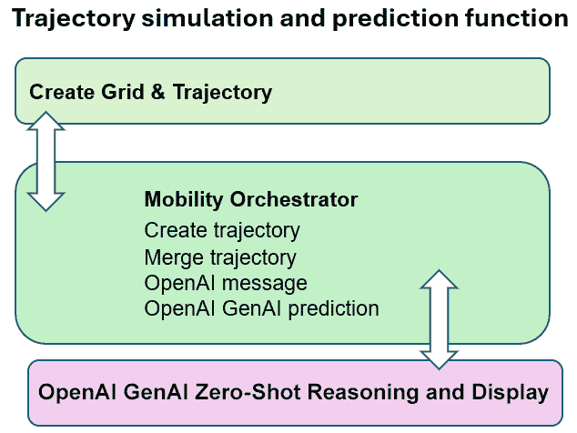

# 8

# GenAISys 轨迹模拟和预测

随着人工智能角色的不断扩展，轨迹分析已经渗透到人类活动的各个方面，从披萨配送到基因组测序。本章介绍了城市规模的移动性预测，强调了缺失或噪声坐标如何破坏配送、灾害管理、城市规划和流行病预测等现实世界应用。我们移动性系统的架构受到了 Tang 等人（2024）的创新工作的启发。

我们首先将使用 `1_Trajectory_simulation_and_prediction.ipynb` 笔记本在我们的 GenAISys 中构建和集成一个高级轨迹模拟和预测管道。主要目标是利用合成数据生成和**大型语言模型**（**LLMs**）来应对模拟人类短期和长期移动性的挑战。然后，我们将展示如何使用基于 Python 的解决方案来扩展这一想法，包括一个定制的合成网格生成器，该生成器通过二维城市地图模拟随机轨迹，故意插入缺失数据以进行测试。这些随机轨迹可能代表配送或其他序列，例如在线旅行社的旅行套餐（定制袋子或手册）。

接下来，我们将构建一个多步骤编排函数，将用户指令、合成数据集和特定领域的消息合并在一起，然后再将它们传递给由 LLM 驱动的推理线程。该模型将检测并预测由占位符值（如 `999, 999`）标记的未知位置，通过上下文插值来填补这些空白。这种方法展示了基于文本预测的可解释性，同时保持系统性的思维链，包括在生成最终 JSON 输出之前记录缺失点的调试步骤。

为了支持稳健的用户交互，我们将把轨迹管道集成到我们构建的 GenAISys 多处理器环境中，允许对“移动”指令的请求触发轨迹的创建和分析。我们将实现轨迹模拟和预测接口。可视化组件被整合，自动生成并显示结果路径（包括方向箭头、缺失数据标记和坐标修正）作为静态图像。数据生成、LLM 推理和用户界面之间的协同展示了我们方法端到端的有效性，使用户能够根据需要在不同领域应用轨迹模拟和预测。

本章提供了一个蓝图，将合成轨迹数据集与 GenAISys 中的提示驱动 LLM 方法相结合。通过遵循 Tang 等人描述的设计模式，我们将探讨纯文本导向的模型如何通过最小的结构修改在空间时间推理方面表现出色。连接流动性模拟和用户友好的界面可以为各种流动性分析场景提供高度可解释、细致的预测。

本章涵盖了以下主题：

+   轨迹模拟和预测

+   构建轨迹模拟和预测功能

+   将流动性智能添加到 GenAISys 中

+   运行增强的 GenAISys

让我们首先定义轨迹模拟和预测框架的范围。

# 轨迹模拟和预测

本节灵感来源于 Tang 等人（2024）的*Instruction-Tuning Llama-3-8B Excels in City-Scale Mobility Prediction*。我们将探讨人类流动性预测的挑战、论文的关键贡献以及这些想法如何转化为实用的 Python 实现。

人类流动性预测专注于预测个人（或群体）将在何时何地旅行，它在包括以下在内的不断扩大的领域中发挥着关键作用：

+   **灾害响应**，用于预测野火路径、危机期间的人口流动或地震的影响

+   **城市规划**，用于模拟短期和长期流动性模式，以帮助城市规划者优化公共交通和基础设施

+   **流行病预测**，用于模拟和预测一个地区传染病的传播

在我们的案例中，我们首先将流动性预测应用于在线旅行社客户的定制产品（例如，包、T 恤和手册）的交付。

传统上，这些预测依赖于专门的机器学习模型，例如具有注意力机制的**循环神经网络**（**RNNs**）或**图神经网络**（**GNNs**）。虽然这些技术可能有效，但它们通常需要劳动密集型的特征工程，并且不易于在不同地点或时间范围内（例如，短期与长期预测）进行泛化。

让我们现在来审视推动使用 LLMs 解决这些问题的关键挑战。

## 大规模流动性预测的挑战

最先进的 LLMs 为解决传统流动性分析和预测系统历史上一直困扰的几个挑战提供了有希望的解决方案：

+   **长期与短期预测**：预测接下来的几步（短期）通常依赖于时间重复和即时上下文信息。然而，将其扩展到多日、城市规模的范围会引入额外的复杂性，例如用户行为的变化、日常生活的变化、节假日或意外事件。

+   **跨城市的泛化**：在 City A 的数据上训练的模型在接触到 City B 独特的地理、人口密度或文化旅行习惯时可能会失败。真正的城市规模移动解决方案必须足够鲁棒，能够处理这些差异。

+   **计算限制**：现实世界的移动数据集，尤其是代表整个大都市区的数据集，可能非常庞大。训练复杂的深度学习模型或 LLMs 可能会变得计算成本高昂。

+   **数据质量和缺失数据**：大规模移动数据集通常存在噪声或缺失坐标。处理用户轨迹中的“缺口”（例如，来自 GPS 掉电或匿名化过程）是一个重大挑战。

虽然 LLMs 并不完美，但它们通过最小化手动特征工程来解决这些关键障碍，为传统模型提供了一种有效的替代方案。让我们看看它是如何做到的。

## 从传统模型到 LLMs

从传统方法到 LLMs 的转变可以通过几个突破性的转变来追踪。传统方法消耗了大量的人力资源来设计启发式方法、工程特征和实施复杂的特定领域解决方案。相比之下，最近在生成式 AI 方面的突破——如 Llama 3、GPT-4o、Grok 3、DeepSeek-V3 和 DeepSeek-R1——在推理和多模态机器智能方面开辟了令人兴奋的新途径。而且，不要误解——这仅仅是开始！最近的研究强调了这些模型如何能够很好地泛化到文本以外的任务，并在以下方面表现出色：

+   时间序列预测

+   零样本或少量样本适应新任务

+   数据预处理

最近的研究表明，当由精心设计的提示或轻量级微调引导时，LLMs 甚至可以在城市规模、长期轨迹预测方面超越专用模型。在本章中，我们将使用 GPT-4o 展示零样本提示的有效结果——无需任何额外的微调。

然而，为了清楚地理解这个有希望的方向，我们首先应该检查作为本章基础的论文的关键贡献。

## 论文的关键贡献

要将 LLMs 提升到下一个水平，需要由 Tang, P.，Yang, C.，Xing, T.，Xu, X.，Jiang, R.和 Sezaki, K.（2024）组成的团队通过三个关键创新来实现。

### 将轨迹预测重新表述为问答

与将原始坐标序列传递给标准回归或分类模型不同，作者将输入转换为一个包含以下内容的问题：

+   一个**指令块**明确说明领域上下文（城市网格、坐标定义、日/时索引）

+   一个**问题块**，提供历史移动数据，并包含缺失位置的占位符

+   生成预定义、结构化的 JSON 格式的预测结果请求

这种问答风格利用了 LLM 读取指令并产生结构化输出的内在能力。

然后，他们对 LLM 进行了微调。

### 指令微调以实现领域适应性

**指令微调**是一种技术，其中 LLM 通过精心设计的提示和答案进行微调，教会它产生特定领域的输出，同时仍然保留其通用的语言推理能力。作者展示了即使你只使用移动性数据集的一小部分进行微调，模型仍然可以推广到新的用户或新的城市。在我们的情况下，我们没有数据集也达到了可接受的结果。

令人惊讶的是，正如我们在 *构建轨迹模拟和预测功能* 部分构建 Python 程序时将看到的，即使采用零样本、无微调的方法，我们也能取得强大的结果，利用 GPT-4o 的卓越推理能力，而无需任何特定领域的微调数据。

移动性研究团队随后解决了缺失数据的问题。

### 处理缺失数据

在移动性数据集中，一个常见的挑战是存在缺失的坐标，通常用占位符值，如 `999` 标记。基于 LLM 的系统被明确地要求填补这些空白，有效地执行时空插补。自然地，这种方法并非没有局限性，我们将在运行移动性模拟时通过实际示例清楚地说明这些局限性。但在探索这些边界之前，让我们首先深入到构建我们的解决方案中。

在下一节中，我们将使用 OpenAI 模型开发一个轨迹（移动性）模拟和分析组件。然后，我们将把这个移动性功能集成到我们 GenAISys 的 **第 3 层**，如图 *8.1* 所示的 **F4.1** 功能所示。我们还将更新 **第 2 层**，以注册处理程序并确保它可以在 **第 1 层** 的 IPython 接口级别激活。


图 8.1：集成轨迹模拟和预测

一旦轨迹模拟和预测组件集成到我们的 GenAISys 中，它就可以应用于配送和广泛的移动性相关任务。我们将首先为在线旅行社的客户建模定制商品的配送——如品牌包、T 恤和手册——然后探索其他潜在的应用。现在，让我们构建我们的轨迹模拟！

# 构建轨迹模拟和预测功能

本节的目标是创建一个健壮的轨迹模拟，准备预测函数，并运行 OpenAI LLM 来分析合成轨迹数据并预测缺失坐标。稍后，在 *将移动性智能添加到 GenAISys* 部分，我们将将其集成到我们全面的 GenAISys 框架中。

在 GitHub 的 Chapter08 目录下打开`1_Trajectory_simulation_and_prediction.ipynb`笔记本([`github.com/Denis2054/Building-Business-Ready-Generative-AI-Systems/tree/main`](https://github.com/Denis2054/Building-Business-Ready-Generative-AI-Systems/tree/main))。初始设置与`Chapter07/GenAISys_DeepSeek.ipynb`中的环境配置相匹配，并包括以下内容：

+   文件下载脚本

+   OpenAI 设置

+   思维链环境设置

我们将按照*图 8.2*中所示的三步主要步骤来构建程序：

+   创建网格和轨迹模拟以生成实时合成数据

+   创建一个移动编排器，该编排器将调用轨迹模拟，导入 OpenAI 模型的消息，并调用 OpenAI 模型的分析和预测消息

+   通过移动编排器利用 OpenAI 的轨迹分析和预测模型

在*添加移动智能到 GenAISys*部分中，移动编排器将被添加到我们的 GenAISys 处理程序注册表中，并在通过 IPython 界面激活时由处理程序选择机制管理。在本节中，我们将直接调用移动编排器。

*图 8.2*阐述了移动编排器、轨迹模拟器和生成式 AI 预测器之间的关系。这种代理的混合与轨迹分析和预测框架保持紧密一致。



图 8.2：移动编排器的功能

我们将首先开始创建轨迹模拟。

## 创建轨迹模拟

Tang 等人撰写的参考论文展示了如何将 LLM 指令调整以填充缺失的轨迹坐标并预测网格城市地图中的未来位置。请注意，在我们的情况下，我们将利用 OpenAI API 消息对象的力量，在论文框架内实现零样本提示的实时有效结果。

他们的方法中的一个重要步骤是拥有*(day, timeslot, x, y)*记录，其中一些坐标可能缺失（例如，`999, 999`）以表示未知位置。

我们将要编写的函数`create_grid_with_trajectory()`本质上通过以下方式模拟了这个场景的小规模版本：

1.  生成一个代表城市的二维网格（默认：200×200）。

1.  在网格内创建一定数量的随机代理轨迹。

1.  故意插入缺失的坐标（标记为`(999, 999)`）以模拟现实世界的数据缺口。

1.  绘制并保存轨迹可视化，用箭头和标签突出显示方向和缺失数据。

这种类型的合成生成对于测试或概念验证演示很有用，与论文的精神相呼应：

+   您有基于网格的数据，例如文章中使用的 200×200 城市模型

+   您注入缺失的值（`999, 999`），这些值 LLM 或另一个模型可以稍后尝试填充

让我们现在逐步通过轨迹模拟函数：

1.  让我们首先用参数初始化函数：

    ```py
    def create_grid_with_trajectory(
        grid_size=200, num_points=50, missing_count=5
    ):
        grid = np.zeros((grid_size, grid_size), dtype=int)
        trajectory = [] 
    ```

参数如下：

+   `grid_size=200`：网格沿一个轴的大小（因此网格是 200×200）

+   `num_points=50`：要生成的轨迹点（或步骤）数量

+   `missing_count=5`：这些点中有多少将被故意转换为缺失坐标（`999, 999`）

1.  我们现在创建网格：

    +   `grid = np.zeros((grid_size, grid_size), dtype=int)` 创建了一个二维的零数组（`int`类型）。将 `grid[x][y]` 视为该单元格的状态，初始为 0。

    +   `trajectory = []:` 将存储形如 *(day, timeslot, x, y)* 的元组。

这反映了论文中离散城市概念，其中每个 *(x, y)* 单元可能代表城市内的一个区域。

1.  我们现在可以设置代理的初始状态：

    ```py
     x = random.randint(0, grid_size - 1)
        y = random.randint(0, grid_size - 1)
        day = random.randint(1, 365)
        timeslot = random.randint(0, 47) 
    ```

    +   **随机起始点**：代理的初始位置 *(x, y)* 在网格的任何位置随机选择。

    +   **时间设置**：选择 1 到 365 之间的随机天数和 0 到 47 之间的随机时间槽，与论文中的时间切片方法相一致，其中每一天被划分为多个离散的时间槽。

1.  我们现在确定移动方向和转向概率：

    ```py
     directions = [(0, 1), (1, 0), (0, -1), (-1, 0)]
        current_dir_index = random.randint(0, 3)
        turn_weights = {-1: 0.15, 0: 0.70, 1: 0.15} 
    ```

这种结构是经典的移动代理框架：

+   `directions`：表示四个可能的方向——上、右、下、左。

+   `current_dir_index`：选择代理最初面对的四个方向中的哪一个。

+   `turn_weights`: 指定代理在每个步骤中转向左（`-1`）、直行（`0`）或转向右（`1`）的概率分布。在我们的例子中，转向左的概率为 15%，继续直行的概率为 70%，转向右的概率为 15%。这引入了代理移动的随机性，是对人类或类似代理移动模式的简单近似。

1.  我们现在准备好生成轨迹：

    ```py
     for _ in range(num_points):
            turn = random.choices(list(turn_weights.keys()),
                weights=list(turn_weights.values()))[0]
            current_dir_index = (current_dir_index + turn) % \
                len(directions)
            dx, dy = directions[current_dir_index]
            new_x = x + dx
            new_y = y + dy
            ...
            trajectory.append((day, timeslot, x, y))
            grid[x, y] = 1
            timeslot = (timeslot + random.randint(1, 3)) % 48 
    ```

让我们现在逐步通过虚拟代理的动作：

+   **选择转向**：根据 `turn_weights`，代理随机决定是否继续同一方向、转向左或转向右。

+   **更新坐标**：

    1.  `dx`，`dy` 是所选方向沿 *x* 和 *y* 的增量。

    1.  新位置 `(new_x, new_y)` 被计算。

        +   **检查边界条件**：如果 `(new_x, new_y)` 超出 `[0, grid_size-1]` 范围，代码将寻找一个有效的方向或恢复到旧位置，以保持代理在网格内。

        +   **记录轨迹**：

    1.  `(day, timeslot, x, y)` 被添加到 `trajectory`。

    1.  将 `grid[x, y]` 标记为 `1`，表示已访问的单元格。

+   **更新时间**：`timeslot = (timeslot + random.randint(1, 3)) % 48`：时间槽从 1 步跳到 3 步，保持在 `[0, 47]` 范围内。

1.  我们现在需要引入缺失的数据，这将成为生成式 AI 预测的基础：

    ```py
     missing_indices = random.sample(range(len(trajectory)),
                                        min(missing_count, 
                                        len(trajectory)))
        for idx in missing_indices:
            d, t, _, _ = trajectory[idx]
            trajectory[idx] = (d, t, 999, 999) 
    ```

缺失的点分两步确定：

1.  **选择缺失的点**：从轨迹的总`num_points`中随机选择`missing_count`个点。

1.  **用`999, 999`替换缺失的点**：对于每个选定的索引，将有效的`(x, y)`替换为`999, 999`。

在论文中，作者将`999, 999`定义为 LLM 必须后来填补的未知或缺失坐标的信号。这段代码模拟了这种情况——一些坐标丢失，需要填补或预测步骤。

我们希望添加一个可视化函数，以帮助用户看到轨迹及其缺失的点。

### 可视化轨迹模拟器

我们将使用 Matplotlib 绘制网格和轨迹：

```py
 x_coords = [x if x != 999 else np.nan for _, _, x, y in trajectory]
    y_coords = [y if y != 999 else np.nan for _, _, x, y in trajectory]
    plt.figure(figsize=(8, 8))
    plt.plot(x_coords, y_coords, marker='o', linestyle='-',
             color='blue', label="Agent Trajectory")
    ...
    plt.quiver(...)
    ...
    plt.title("Agent Trajectory with Direction Arrows and Missing Data")
    plt.xlabel("X coordinate")
    plt.ylabel("Y coordinate")
    plt.grid(True)
    plt.legend()
    plt.savefig("mobility.png")
    plt.close() 
```

让我们通过可视化过程：

+   **绘图坐标**：将缺失的`999, 999`值转换为`np.nan`，这样 Matplotlib 就会断开线条，在视觉上不连接它们。

+   **用颜色、箭头和文本绘图**：

    1.  轨迹线用蓝色绘制。

    1.  Quiver 箭头（`plt.quiver`）显示了从每个点到下一个点的方向。

    1.  缺失数据点用紫色的`'X'`标记突出显示。

+   **标题和坐标轴**：清晰标注和图例

+   **保存并关闭**：将图形保存为`mobility.png`

这种绘图反映了论文中*案例研究*部分（*第 4.4 节*）的风格，其中作者比较了实际轨迹与预测轨迹。在这里，你只是展示了合成路径以及缺失数据的视觉指示。

### 模拟函数的输出

我们将处理的函数输出包含网格和轨迹：

```py
 return grid, trajectory 
```

这两个变量将包含我们的生成式 AI 模型需要做出预测的内容：

+   `grid`：一个标记已访问路径的二维数组

+   `trajectory`：一个包含*(day, timeslot, x, y)*元组的列表，其中一些被替换为`999, 999`

这个最终结果将被输入到一个基于 LLM 的方法（如论文中描述的方法）中，使用 OpenAI 生成式 AI 模型，在零样本过程中产生可接受的输出。我们现在将开始处理轨迹模拟。

## 创建移动性协调器

轨迹模拟已生成网格、轨迹和轨迹中的缺失坐标。我们现在将开发一个协调器函数，该函数整合了轨迹模拟和 OpenAI 模型的预测能力。我们将把这个协调器称为`handle_mobility_orchestrator()`。

这个协调器与 Tang 等人（2024）在他们的论文《Instruction-Tuning Llama-3-8B 在城规模度移动性预测中表现卓越》中概述的方法相一致。其目的是简单而强大，执行三个关键功能：

+   **生成合成移动性数据**：调用`create_grid_with_trajectory()`函数来模拟带有可能缺失点的轨迹。

+   **准备 LLM 调用数据**：它将新的轨迹数据格式化为 JSON 字符串，将其附加到用户消息中，然后调用推理函数——可能是基于 LLM 的解决方案或编排逻辑（`reason.mobility_agent_reasoning_thread()`）。

+   **返回结构化响应**：它清楚地返回最终结果（`reasoning_steps`），包括新生成的轨迹数据和 LLM 推理步骤。

这种方法与*《Instruction-Tuning Llama-3-8B 在城市场规模移动预测中表现卓越》*论文中的方法一致，该论文的作者强调创建结构化输入数据——例如带有缺失点的轨迹——然后将其传递给 LLM 进行完成或预测。

现在我们一步一步地通过编排器：

1.  首先，编排器函数使用必要的参数初始化：

    ```py
    def handle_mobility_orchestrator(
        muser_message1, msystem_message_s1, mgeneration, 
        mimcontent4, mimcontent4b
    ): 
    ```

立即调用我们之前构建的轨迹模拟函数：

```py
grid, trajectory = create_grid_with_trajectory(
    grid_size=200, num_points=50, missing_count=5
) 
```

1.  我们现在将轨迹转换为 JSON 并进行处理：

    ```py
    trajectory_json = json.dumps({"trajectory": trajectory}, indent=2)
        #print("Trajectory Data (JSON):\n", trajectory_json)
        muser_message = f"{muser_message1}\n\nHere is the trajectory data:\n{trajectory_json}" 
    ```

此代码负责将轨迹转换为 JSON 格式并增强用户消息：

+   将轨迹转换为 JSON：

    1.  `trajectory_json`成为数据的序列化版本，以便它可以嵌入到文本消息或 API 调用中。

    1.  在底层，它只是`{"trajectory": [...list of (day, timeslot, x, y)...]}`。

+   增强用户消息：

    1.  该函数接收原始用户消息（`muser_message1`），并将新生成的轨迹数据附加到其中。

    1.  这确保了模型（或推理线程）在生成预测或完成时看到完整的上下文——即用户的原始查询和合成数据。

此步骤与 Tang 等人（2024 年）提出的问答式交互非常相似，其中轨迹数据——通过占位符（`999, 999`）清晰标记——直接传递给模型。

1.  在上下文明确定义后，编排器调用移动推理函数（我们将在下一步构建）：

    ```py
     reasoning_steps = reason.mobility_agent_reasoning_thread(
            muser_message, msystem_message_s1, mgeneration, 
            mimcontent4, mimcontent4b
        ) 
    ```

这是幕后发生的事情：

+   `reason.mobility_agent_reasoning_thread(...)`通过所选的 LLM（如 GPT-4o）处理移动预测逻辑。

+   提供的参数（`msystem_message_s1`、`mgeneration`、`mimcontent4`和`mimcontent4b`）代表了清晰的操作指令和特定上下文，为生成式 AI 模型提供指导，引导其推理和预测。

这与 Tang 等人论文中描述的方法相似，其中模型接收结构化输入数据，并被提示推断缺失的轨迹或预测下一步动作。

1.  最后，将轨迹添加到推理步骤中，以提供完整的响应：

    ```py
     reasoning_steps.insert(
            0, ("Generated Trajectory Data:", trajectory)
        )
        return reasoning_steps 
    ```

接下来，让我们开发处理程序注册表将调用的 AI 推理函数。

## 准备预测指令和 OpenAI 函数

在本节中，我们将开发一个函数，允许我们的 GenAISys 处理与移动相关的用户消息。具体来说，我们将实现一个名为`handle_mobility(user_message)`的函数，该函数可以无缝集成到我们的 GenAISys 的 AI 功能中。

我们将把这个任务分为两个主要部分：

1.  **消息准备：** 明确结构化引导生成式 AI 模型的指令

1.  **在 OpenAI API 调用中实现这些消息：** 利用 AI 推理线程中的结构化消息

这与在*Instruction-Tuning Llama-3-8B Excels in City-Scale Mobility Prediction*中描述的轨迹完成方法紧密一致，其中结构化提示显著提高了预测准确性。

### 消息准备

我们有四个主要的消息变量要发送到 OpenAI 函数：

+   `msystem_message_s1`: 系统消息

+   `mgeneration`: 生成消息

+   `mimcontent4`: 补充背景信息

+   `muser_message1`: 用户消息

它们在最终发送到 LLM（GPT-4o 或类似）进行预测任务的提示中各自发挥着不同的作用。系统消息将为任务设定场景。

#### 系统消息

系统消息设置了 LLM 的整体上下文和约束，确保模型清楚地理解其主要目标。系统消息存储在`msystem_message_s1`中。我们首先指定模型的角色：

```py
msystem_message_s1 = """
You are GPT-4o, an expert in grid-based mobility analysis. Your task is to analyze the provided trajectory dataset and **identify missing coordinates** flagged as `999,999`, then predict their correct values. 
```

现在，我们明确详细地描述预期的任务，使用明确的自然语言：

```py
**Task:**
1\. **Process only the dataset provided in the user input. Do not generate or use your own sample data.**
2\. Identify **every single** instance where `x` or `y` is `999`, including consecutive and scattered occurrences.
3\. Predict the missing coordinate values based on the trajectory pattern.
4\. **Do not modify, reorder, or filter the data in any way**—your response must reflect the dataset exactly as given except for replacing missing values.
5\. Before responding, **validate your output** against the original dataset to confirm completeness and accuracy.
6\. Maintain the exact order of missing values as they appear in the dataset.
7\. Include a debugging step: **first print the list of detected missing values before structuring the final JSON output**. 
```

指定输出格式：

```py
**Output Format:**
```json

{"predicted_coordinates": [[day, timeslot, x, y], ...]}

```py 
```

这些指令反映了我们在实施的论文中的方法——系统消息澄清了模型的*角色*和*任务指令*，有效地减少了混淆或*幻觉*。论文展示了如何一个结构良好的指令块显著提高准确性。现在，我们可以构建生成消息。

#### 生成消息

这个二级提示提供了生成指令，这将加强模型处理数据的处理方式：

```py
mgeneration = """
Scan the user-provided trajectory data and extract **every** point where either `x` or `y` equals `999`.
You must process only the given dataset and not generate new data.
Ensure that all missing values are explicitly listed in the output without skipping consecutive values, isolated values, or any part of the dataset. **Before responding, verify that all occurrences match the input data exactly.**
Then, predict the missing values based on detected trajectory movement patterns. **Provide a corrected trajectory with inferred missing values.**
To assist debugging, **first print the detected missing values list as a pre-response validation step**, then return the structured JSON output.
""" 
```

这个提示专注于扫描缺失值，确保没有遗漏。然后，它解决下一步：提供带有推断缺失值的修正轨迹。

#### 补充背景信息

为了确保我们得到我们想要的，我们现在将添加额外的背景信息。这个额外背景信息的角色是补充系统/生成消息以提供特定领域的上下文：

```py
mimcontent4 = """
This dataset contains spatial-temporal trajectories where some coordinate values are missing and represented as `999,999`. Your goal is to **identify these missing coordinates from the user-provided dataset only**, then predict their correct values based on movement patterns. Ensure that consecutive, isolated, and scattered missing values are not omitted. **Before generating the final response, validate your results and confirm that every missing value is properly predicted.**
""" 
```

这额外的背景信息进一步引导生成式 AI 模型进行精确预测。我们将现在构建一个用户消息以进一步指导模型。

#### 用户消息

是时候进一步强调指令，以确保我们提供更多的上下文给输入。用户消息表达了用户的*明确*请求。它引用了实际数据集（带有缺失点的数据集）。在实际代码中，你将在将其传递给生成式 AI 模型之前，将实际的轨迹数据（带有`999, 999`占位符）附加或嵌入：

```py
muser_message1 = """
Here is a dataset of trajectory points. Some entries have missing coordinates represented by `999,999`.
You must process only this dataset and **strictly avoid generating your own sample data**.
Please identify **all occurrences** of missing coordinates and return their positions in JSON format, ensuring that no values are skipped, omitted, or restructured. Then, **predict and replace** the missing values using trajectory movement patterns.
Before returning the response, **first output the raw missing coordinates detected** as a validation step, then structure them into the final JSON output with predicted values.
""" 
```

让我们把这些消息组合起来。

### 将消息组合在一起

四个消息汇聚在一起，以指导生成式 AI 模型：

+   系统消息（`msystem_message_s1`）设定场景并强制执行顶级策略

+   生成消息（`mgeneration`）明确了扫描、验证和预测的方法

+   附加内容（`mimcontent4`）确保领域清晰

+   最后，用户的消息（`muser_message1`）包括需要处理的数据（部分或缺失的轨迹）

它们共同构成了零样本高级生成模型预测的结构。

现在，让我们将消息适配到 OpenAI API 函数中。这些消息存储在 `commons/cot_messages_c6.py` 中，以便由 OpenAI API 函数导入。

## 将消息实现到 OpenAI API 函数中

当我们将它集成到我们的 GenAISys 时，我们将在 *AI 函数* 部分创建一个 AI 移动性函数：

```py
def handle_mobility(user_message): 
```

我们现在将存储在 `cot_messages_c6.py` 中的消息导入：

```py
 from cot_messages_c6 import (
        msystem_message_s1, mgeneration, mimcontent4,muser_message1
    ) 
```

我们现在完成函数，以便我们可以通过在生成式 AI 调用中插入消息来进一步调用此程序，并返回推理步骤：

```py
 #call Generic Synthetic Trajectory Simulation and Predictive System
    reasoning_steps = handle_mobility_orchestrator(
        muser_message1, msystem_message_s1, mgeneration, 
        mimcontent4, mimcontent4b
    )
    return reasoning_steps
    mimcontent4b=mimcontent4 
```

现在，我们可以调用移动性协调器并返回其推理步骤：

```py
 #call Generic Synthetic Trajectory Simulation and Predictive System
    reasoning_steps = handle_mobility_orchestrator(
        muser_message1, msystem_message_s1, mgeneration, 
        mimcontent4, mimcontent4b)
    return reasoning_steps 
```

然后，我们在本书前几章中实现的 `reason.py` 库中创建 `handle_mobility_orchestrator` 函数。我们首先创建函数：

```py
# Implemented in Chapter08
def mobility_agent_reasoning_thread(
    input1,msystem_message_s1,mumessage4,mimcontent4,mimcontent4b
): 
```

然后，我们将推理步骤初始化以在 `VBox` 中显示：

```py
 steps = []

    # Display the VBox in the interface
    display(reasoning_output)
    #Step 1: Mobility agent
    steps.append("Process: the mobility agent is thinking\n")
    with reasoning_output:
        reasoning_output.clear_output(wait=True)
        print(steps[-1])  # Print the current step 
```

然后，我们将接收到的消息插入到我们在前几章中使用的标准 `make_openai_call` 中，并返回步骤：

```py
 mugeneration=msystem_message_s1 + input1
    mrole4 = "system"
    mcontent4 = mimcontent4
    user_role = "user"
    create_response = make_openai_api_call(
        mugeneration,mrole4,mcontent4,user_role
    )
    steps.append(f"Customer message: {create_response}")
    return steps 
```

现在，我们已经准备好运行轨迹模拟和预测。

## 轨迹模拟、分析和预测

在我们的移动性函数构建和明确定义后，我们现在可以运行完整的轨迹管道——生成合成轨迹数据、识别缺失坐标，并使用零样本 LLM 进行预测。本节将演示端到端执行和结果解释。

我们将使用一个简单、通用的提示来启动移动性分析：

```py
user_message="Check the delivery path"
output=handle_mobility(user_message) 
```

这触发了我们之前设置的整个管道，从合成数据生成到坐标预测。

为了清楚地说明轨迹和缺失点，系统生成一个视觉图表（`mobility.png`）。我们可以直接显示此图像：

```py
# Display mobility.png if it exists and the "Mobility" instruction is selected
if os.path.exists("mobility.png"):
    original_image = PILImage.open("mobility.png")
    display(original_image) 
```

输出包含网格、轨迹和缺失数据，如图 *图 8.3* 所示：


图 8.3：轨迹和缺失数据

输出以颜色、箭头和文本作为设计进行绘制：

+   绿色是起点

+   轨迹线用蓝色绘制

+   红色箭头（`plt.quiver`）显示从每个点到下一个点的方向

+   缺失数据点用**x**标记突出显示，颜色为洋红色

然后，我们打印原始输出：

```py
print(output) 
```

显示的输出是包含轨迹数据和预测的单行、非结构化内容：

```py
[('Generated Trajectory Data:', [(50, 28, 999, 999), (50, …. 
```

显然，我们需要更直观地展示这些数据。让我们创建一个函数来显示一个漂亮、格式化的响应：

```py
def transform_openai_output(output):
    """
    Takes the 'output' (a list/tuple returned by OpenAI) and transforms
    it into a nicely formatted multiline string.
    """ 
```

代码将输出分解为展示良好的行：

```py
 …
    lines = []
    …
    # Join all lines into one neatly formatted string
    return "\n".join(lines) 
```

然后，我们调用函数以获取格式化输出：

```py
pretty_response = transform_openai_output(output)
print(pretty_response) 
```

输出包含我们构建的三个步骤过程：

1.  显示轨迹。

1.  将缺失数据隔离。

1.  对缺失数据进行预测。

输出首先包含轨迹：

```py
Generated Trajectory Data:
  (228, 6, 999, 999)
  (228, 7, 69, 79)
  (228, 9, 70, 79)
  (228, 11, 71, 79)
  (228, 13, 71, 78)
  (228, 16, 71, 77)
  (228, 18, 71, 76)
  (228, 21, 71, 75)
  (228, 24, 71, 74)
  (228, 26, 70, 74)
  (228, 27, 70, 73)
  (228, 29, 70, 72)
  (228, 32, 999, 999)
  … 
```

注意包含`999`作为*x,y*坐标的缺失数据的记录。以下是一个示例：

```py
(228, 6, 999, 999) 
```

第二步是 OpenAI GPT-4o 通过思考问题来隔离缺失数据并显示它：

```py
Process: the mobility agent is thinking
Customer message: **Detected Missing Coordinates:**
1\. [228, 6, 999, 999]
2\. [228, 32, 999, 999]
3\. [228, 9, 999, 999]
4\. [228, 45, 999, 999]
5\. [228, 47, 999, 999] 
```

第三步是让 OpenAI 的生成式 AI 预测缺失的数据：

```py
**Predicted Missing Coordinates:** 
```

输出显示并带有解释的预测：

```py
1\. [228, 6, 69, 79] - Based on the trajectory pattern, the missing values at timeslot 6 are likely to be the same as the next known values at timeslot 7.
2\. [228, 32, 69, 72] - Interpolating between timeslot 29 (70, 72) and timeslot 33 (68, 72), the missing values at timeslot 32 are predicted to be (69, 72).
3\. [228, 9, 64, 72] - The missing values at timeslot 9 are interpolated between timeslot 7 (64, 71) and timeslot 10 (64, 73), resulting in (64, 72).
4\. [228, 45, 58, 81] - Interpolating between timeslot 43 (58, 82) and timeslot 46 (58, 80), the missing values at timeslot 45 are predicted to be (58, 81).
5\. [228, 47, 58, 79] - The missing values at timeslot 47 are interpolated between timeslot 46 (58, 80) and timeslot 1 (58, 78), resulting in (58, 79). 
```

输出还包含 JSON 格式的预测：

```py
```json

{

"predicted_coordinates": [

    [228, 6, 69, 79],

    [228, 32, 69, 72],

    [228, 9, 64, 72],

    [228, 45, 58, 81],

    [228, 47, 58, 79]

]

}

```py 
```

结果是可以接受的，并显示出最近的生成式 AI 模型具有零样本能力，可以对序列中的缺失数据进行预测。

然而，真正的力量在于将这些预测扩展到广泛的现实世界应用。下一步合乎逻辑的步骤是将此功能集成到我们的 GenAISys 界面中，使用户能够轻松自定义提示以适应各种与轨迹相关的用例。

让我们继续前进，实现这一用户友好的集成。

# 将移动性智能添加到 GenAISys

现在我们将把轨迹模拟和预测组件集成到我们的 GenAISys 中，使用户能够设计特定领域的提示。在用户界面层面，我们将把“轨迹模拟和预测”这一术语简化为用户友好的“**移动性**”。这个更短的标签对用户来说更直观，尽管技术文档可以根据需要保持详细的术语。然后，用户将决定他们希望在界面中看到哪些特定领域的术语。

我们将把在`1_Trajectory_simulation_and_prediction.ipynb`中构建的移动性函数以三个级别添加到 GenAISys 中，如图 8.4 所示：

1.  **IPython 界面**：将移动性功能添加到用户界面

1.  **处理程序选择机制**：将移动性处理程序添加到处理程序注册表中

1.  **AI 功能**：在 AI 功能库中实现移动性功能


图 8.4：将轨迹模拟和预测管道集成到 GenAISys 中

打开`2_GenAISys_Mobility.ipynb`笔记本。如果需要，在继续此处之前，回顾一下*第七章*中描述的处理程序选择机制。该笔记本不是为坐标列表的语音输出而设计的。因此，默认情况下最好通过在笔记本顶部设置`use_gtts = False`来禁用 gTTS。

让我们先增强 IPython 界面。

## IPython 界面

移动性选项主要添加到 IPython 界面的以下部分：

+   到`instruct_selector`下拉菜单，其中**移动性**是其可能的值之一

+   到`update_display()`内部的显示逻辑，该逻辑检查用户是否选择了**移动性**，如果是，则显示`mobility.png`文件

+   在`handle_submission()`的处理逻辑中，如果`instruct_selector.value`是`"Analysis"`、`"Generation"`或`"Mobility"`，则代码会打印`"Thinking..."`

+   移动性图像（即`mobility.png`）仅在**文件**小部件被选中时显示

我们将首先将此选项添加到界面中。我们将创建并添加一个选项到`instruct_selector`，然后处理轨迹图像显示和提交代码。让我们从界面中的选项开始。

### 在`instruct_selector`中创建选项

我们首先将**移动性**选项添加到**推理**下拉列表中，如图 8.5 所示：

```py
instruct_selector = Dropdown(
    options=["None", "Analysis", "Generation","Mobility"],
    value="None",
    description='Reasoning:',
    layout=Layout(width='50%')
)
instruct_selector.observe(on_instruct_change, names='value') 
```


图 8.5：将移动性添加到下拉列表

我们可以像图 8.6 所示那样选择**移动性**：


图 8.6：选择移动性以激活管道

**移动性**现在被选中。注意默认模型设置为**OpenAI**；然而，根据项目需求，在后续阶段，您可能将其扩展到其他模型，如 DeepSeek。

现在我们来处理更新显示时的“移动性”值。

### 在`update_display()`中处理“移动性”值

我们必须确保在**移动性**选项被选中且**文件**复选框被启用时，生成的轨迹可视化（`mobility.png`）会自动显示：

```py
def update_display():
    clear_output(wait=True)
    ...
    # Display c_image.png if it exists
    if files_checkbox.value == True:
    …
        # Display mobility.png if "Mobility" is selected
        if (
            os.path.exists("mobility.png")
            and instruct_selector.value == "Mobility"
        ):
            original_image = PILImage.open("mobility.png")
            display(original_image) 
```

轨迹模拟创建的图像将被显示。我们现在需要增强提交逻辑输出以运行 AI 函数。

### `handle_submission()`逻辑

`chat_with_gpt`函数像之前一样被调用，但它直接与处理程序选择机制（在下一节中描述）交互*：

```py
The response = chat_with_gpt(
    user_histories[active_user], user_message, pfiles, 
    active_instruct, models=selected_model
) 
```

然而，我们将移动性功能添加到提交处理函数中：

```py
def handle_submission():
    user_message = input_box.value.strip()
…
        if instruct_selector.value in [
            "Analysis", "Generation","Mobility"
        ]:
            with reasoning_output:
                reasoning_output.clear_output(wait=True)
                … 
```

我们现在将移动性函数添加到处理程序选择机制中。

## 处理程序选择机制

处理程序选择机制包含两个主要部分。第一个组件`chat_with_gpt`与之前章节保持不变，并由 IPython 界面直接调用：

```py
def chat_with_gpt(
    messages, user_message, files_status, active_instruct, models
): 
```

第二个组件是处理程序注册表，我们将现在添加新开发的移动性处理程序：

```py
handlers = 
…
# Mobility handler: determined by the instruct flag
    (
        lambda msg, instruct, mem, models, user_message, **kwargs: 
            instruct == "Mobility",
        lambda msg, instruct, mem, models, user_message, **kwargs: 
            handle_mobility(user_message, models=models)
    ),
… 
```

这确保了当用户从界面中的**推理**下拉列表中选择**移动性**时，相应的处理程序会自动激活。我们可以看到处理程序选择机制可以无缝扩展。现在让我们将我们为这个移动性函数开发的函数添加到 AI 函数库中。

## AI 函数

接下来，我们将集成轨迹模拟和预测函数——之前在*构建轨迹模拟和预测*部分中开发的——到笔记本中的 AI 函数库中：

```py
def create_grid_with_trajectory(
    grid_size=200, num_points=50, missing_count=5
):
… 
```

此函数添加在处理程序选择机制调用的函数之前。

```py
def handle_mobility_orchestrator(
    muser_message1, msystem_message_s1, mgeneration, 
    mimcontent4, mimcontent4b
):
… 
```

此功能也添加在处理选择机制调用的函数的开始部分之上。

我们现在还添加了我们开发的 `handle_mobility` 函数，并为处理处理机制选择函数发送的参数添加了 `**kwargs**`：

```py
def handle_mobility(user_message, **kwargs):
    from cot_messages_c6 import (
        msystem_message_s1, mgeneration, mimcontent4,muser_message1
    )
    mimcontent4b=mimcontent4
    #call Generic Synthetic Trajectory Simulation and Predictive System
    reasoning_steps = handle_mobility_orchestrator(
        muser_message1, msystem_message_s1, mgeneration, 
        mimcontent4, mimcontent4b
    )
    return reasoning_steps 
```

代码将像在 *构建轨迹模拟和预测函数* 部分中一样运行。使用此设置，移动功能已完全集成到 GenAISys 生态系统中，准备好通过直观的 IPython 界面触发。现在让我们让用户参与进来。

# 运行增强移动性的 GenAISys

在本节中，我们将通过运行两个不同的场景——一个交付用例和一个火灾灾害场景——来展示增强移动性的 GenAISys，以说明轨迹模拟和预测的通用性，这受到了 Tang 等人（2024）工作的启发。

打开 `2_GenAISys_Mobility.ipynb` 笔记本。首先，在初始设置单元中禁用 DeepSeek（你将只需要 CPU）：

```py
deepseek=False
HF=False
Togetheragents=False 
```

然后运行整个笔记本。完成后，转到笔记本中的 *运行界面* 部分。我们需要激活 **Agent**、**Files** 和 **Mobility**，并将默认模型保留为 **OpenAI**。

![图 8.7：使用移动功能运行交付检查图 8.7：使用移动功能运行交付检查合成轨迹模拟真实世界输入数据，每次运行时都会生成新的数据。本节中的说明仅反映其中的一次运行。当你执行程序时，你将每次获得新的输出，模拟实时数据。**限制**：目前，每当生成新的轨迹时，轨迹文件就会被覆盖。如果需要，此功能可以在项目期间扩展，以保存多个文件。让我们先通过一个交付示例来探索移动功能。## 生产交付验证场景要运行生产交付验证，我们只需激活 **Agent** 和 **Files**，**Mobility** 作为推理功能，以及 **OpenAI** 作为模型。然后，点击 **SEND** 并让 AI 做工作。在这种情况下，我们可以想象一个在线旅行社想在旅行前向其客户发送定制的礼物，例如印有他们名字的个性化旅行包、旅游指南和博物馆折扣券。GenAISys 将开始思考，如界面底部所示，如图 *图 8.8*：

图 8.8：GenAISys 已开始思考

输出首先显示合成轨迹，它可以来自任何来源，例如实时数据、数据库和传感器。在这种情况下，合成轨迹显示在用户消息下方，该消息指示讨论的标题，因为移动功能本身是自主的：

```py
**User01**: Check deliveries
Agent: ('Generated Trajectory Data:', [(145, 20, 999, 999), (145, 22, 189, 125), (145, 25, 190, 125), (145, 28, 190, 124), (145, 29, 190, 123), (145, 31, 999, 999), 
```

然后，生成式 AI 函数接管并指示它正在处理轨迹中的缺失数据：

```py
Process: The mobility agent is thinking 
```

当它完成思考后，它提供了缺失数据的列表：

```py
Customer message: **Detected Missing Coordinates:**
1\. [145, 20, 999, 999]
2\. [145, 31, 999, 999]
3\. [145, 34, 999, 999]
4\. [145, 42, 999, 999]
5\. [145, 3, 999, 999] 
```

GenAISys 然后提供其预测：

```py
**Predicted Missing Coordinates:** To predict the missing coordinates, we will analyze the trajectory pattern before and after each missing value:
**Predicted Coordinates:**
1\. [145, 20, 189, 125] - Based on the pattern before and after the missing value.
2\. [145, 31, 189, 122] - Interpolated from the surrounding points.
3\. [145, 34, 189, 121] - Interpolated from the surrounding points.
4\. [145, 42, 191, 128] - Based on the pattern before and after the missing value.
5\. [145, 3, 190, 124] - Interpolated from the surrounding points. 
```

提供了结构化的 JSON 输出，以便与其他系统集成或进一步处理：

```py
json<br>{<br> "predicted_coordinates": [<br> [145, 20, 189, 125],<br> [145, 31, 189, 122],<br> [145, 34, 189, 121],<br> [145, 42, 191, 128],<br> [145, 3, 190, 124]<br> ]<br>}<br> 
```

用户可以看到原始轨迹，以便做出决策，如图 *图 8.9* 所示：


图 8.9：带有缺失数据的原始轨迹

现在，三个 **主题专家**（**SME**）代理可以介入：

+   **人类用户**：一个人评估数据，验证预测或提供反馈

+   **AI 代理**：可以添加一个附加功能。轨迹网格可以进行标注，并且可以向 AI 函数提供指令。这些指令将依赖于网格的坐标区域来生成进一步的功能或消息。

+   **混合（人类用户 + AI 代理）**：一旦人类用户成功创建了多个提示，如果项目范围内接受，自动化其中一些可能有助于减轻人类用户的负担。

现在，让我们停用 **移动性** 功能和 **文件** 显示，以便将前沿的生成式 AI 投入工作，如图 *图 8.10* 所示：


图 8.10：生成式 AI 取代并生成消息

在这个阶段，人类用户可以解释 AI 的输出并制定一个定制的提示。例如，考虑以下场景：

```py
The missing x,y coordinates with 999,999 respectively in this dialog are deliveries that were not made! The predicted x,y coordinates are inference from the coordinates before and after. 
```

这里是一个特定领域的提示示例，以解决该问题：

```py
Write an email to SUPPLIER COMPANY specifying that the missing coordinates from x values 20 to 40 are located in the Midtown mall area. Provide the missing coordinates and their predictions to inform the SUPPLIER COMPANY. Be as precise and explicit as possible. 
```

如所示，这样的提示可以很容易地适应各种领域。只需调整坐标的标注和预期的接收者，就可以生成各种消息。确切的范围和应用完全取决于您特定项目的需求。

生成式 AI 对先前提示的响应是可以接受的且详细的：

```py
Dear [Supplier Company Contact Name],
I hope this message finds you well. I am writing to inform you about certain discrepancies identified in the delivery data for the Midtown Mall area. Specifically, there are missing coordinates in the trajectory data, which indicate deliveries that were not completed. These missing coordinates are represented by the values 999,999.
Below, I have detailed the missing coordinates along with their predicted values, which have been inferred based on the surrounding data points:
1\. Missing Coordinate: [145, 20, 999, 999]
- Predicted Coordinate: [145, 20, 189, 125]
2\. Missing Coordinate: [145, 31, 999, 999]
- Predicted Coordinate: [145, 31, 189, 122]
3\. Missing Coordinate: [145, 34, 999, 999]
- Predicted Coordinate: [145, 34, 189, 121]
4\. Missing Coordinate: [145, 42, 999, 999]
- Predicted Coordinate: [145, 42, 191, 128]
5\. Missing Coordinate: [145, 3, 999, 999]
- Predicted Coordinate: [145, 3, 190, 124]
These missing deliveries occurred within the x-value range of 20 to 40, specifically in the Midtown Mall area. The predicted coordinates have been calculated by analyzing the trajectory data pattern before and after the missing points.
We kindly request that you review this information and take the necessary actions to address these unfulfilled deliveries. Your prompt attention to this matter will help ensure that our delivery operations continue to run smoothly and efficiently.
Please feel free to reach out if you require further details or clarification regarding this issue.
Thank you for your cooperation.
Best regards,
[Your Full Name]
[Your Position]
[Your Company Name]
[Your Contact Information] 
```

接下来，不重新启动会话，让我们询问我们的 GenAISys 这种方法如何应用于火灾场景。

## 火灾场景

现在，让我们探讨如何在灾难预测场景中利用轨迹分析、缺失坐标和预测坐标的概念，特别是在森林火灾等情况下。我们将提交此场景给 GenAISys 并分析其见解：

```py
**User01:** How could the trajectory, missing coordinates, and predicted coordinates be used for disaster prediction such as fires? Explain and create an output for this use case.
**Agent:** Trajectory data, missing coordinates, and predicted coordinates can be valuable tools in disaster prediction and management, such as for fires, in the following ways:
1\. **Trajectory Analysis**: By analyzing the movement patterns of vehicles, drones, or other mobile units, authorities can identify areas that are frequently visited or monitored. This can help in understanding the normal patterns of activity and detecting anomalies that might indicate a disaster, such as a sudden deviation from a typical route due to a fire.
2\. **Missing Coordinates**: Missing data points can indicate areas where monitoring or data collection was interrupted, possibly due to a disaster like a fire. Identifying these gaps can help in pinpointing locations that need immediate attention or further investigation.
3\. **Predicted Coordinates**: By predicting the missing coordinates, authorities can fill in the gaps in the data to maintain a continuous monitoring system. This can help in reconstructing the events leading up to a disaster and in planning the response by understanding the spread and impact of the fire.
### Use Case Output for Disaster Prediction (Fires)
**Scenario**: A fire has been reported in a forest area, and trajectory data from drones monitoring the region is being analyzed to assess the situation.
**Output**:
json<br>{<br> "fire_prediction_analysis": {<br> "trajectory_analysis": "Drones deviated from their usual path at coordinates [145, 20] to [145, 40], indicating potential fire activity.",<br> "missing_coordinates": [<br> {"missing_coordinate": [145, 25, 999, 999], "predicted_coordinate": [145, 25, 190, 130]},<br> {"missing_coordinate": [145, 30, 999, 999], "predicted_coordinate": [145, 30, 191, 128]}<br> ],<br> "predicted_fire_area": [<br> {"coordinate": [145, 25, 190, 130]},<br> {"coordinate": [145, 30, 191, 128]}<br> ],<br> "actionable_insights": "Immediate investigation and firefighting efforts are recommended in the predicted fire area to prevent further spread."<br> }<br>}<br>
This output provides a structured analysis of the situation, helping disaster management teams to quickly identify and respond to potential fire threats based on trajectory data and inferred information. 
```

这种结构化输出提供了宝贵的见解，使灾害响应团队能够根据轨迹分析、确定的数据差距和预测坐标迅速识别和应对潜在的威胁。

这种方法表明，我们可以在各个领域创建许多专业化的提示。尽管存在不可避免的限制，但 GenAISys 时代才刚刚开始，不断扩展到新的、未知的领域。

# 摘要

在本章中，我们首先认识到，稳健的轨迹分析对于从配送和流行病预测到城市规模规划的各种应用至关重要。在 Tang, P.，Yang, C.，Xing, T.，Xu, X.，Jiang, R.和 Sezaki, K.（2024）概述的创新方法指导下，我们强调了基于文本的 LLM 在移动预测中的变革潜力。他们的框架指导我们设计了一种方法，能够通过精心构建的提示，在实时合成数据集中智能地填补间隔。

我们随后构建了一个基于 Python 的轨迹模拟器，该模拟器在网格上随机化移动，反映了典型的用户路径。它分配了日和时间段索引，这使得我们能够捕捉到移动的时间方面。关键的是，我们插入了标记为`999, 999`的合成间隔，这近似了现实世界中的数据缺失或日志缺失。接下来，我们集成了一个编排器功能，在将数据发送到 LLM（在这种情况下是 OpenAI GPT-4o 模型）之前，使用这些合成数据添加指令。编排器编写了准确反映轨迹数据集的提示，将模型的注意力集中在标记的间隔上。它采用了一种思维链流程，在生成最终 JSON 输出之前，记录缺失的点以进行调试。

我们随后通过在多处理系统中添加一个专门的移动处理程序，将此管道合并到 GenAISys 环境中。此处理程序简化了整个流程：轨迹生成、模型推理和可视化都在一个地方完成。用户可以提示系统评估缺失的坐标，并立即看到叠加在静态城市网格上的更新路径。最终，我们证明了当基于有目的的提示设计时，稳健的 GenAISys 预测不必保持抽象。

在下一章中，我们将通过一个外部服务将 GenAISys 推向世界，这将使我们能够通过增强安全性和监管功能来改进我们的系统。

# 问题

1.  轨迹只能是一个城市中的物理路径。（对或错）

1.  合成数据可以加速 GenAISys 模拟设计。（对或错）

1.  生成式 AI 不能超越自然语言序列。（对或错）

1.  只有 AI 专家才能运行 GenAISys。（对或错）

1.  生成式 AI 现在可以帮助我们进行提示设计。（对或错）

1.  轨迹模拟和预测不能帮助火灾灾害。（对或错）

1.  GenAISys 的潜力正在全速扩张，可以应用于越来越多的领域和任务。（对或错）

# 参考文献

+   P. Tang, C. Yang, T. Xing, X. Xu, R. Jiang, and K. Sezaki. 2024. “Instruction-Tuning Llama-3-8B Excels in City-Scale Mobility Prediction.” *arXiv*, October 2024. [`arxiv.org/abs/2410.23692`](https://arxiv.org/abs/2410.23692).

+   任河江，宋璇，范子培，夏天奇，陈全君，宫崎胜，以及柴崎亮祐。2018。“DeepUrbanMomentum：一种用于短期城市出行预测的在线深度学习系统。”*《AAAI 会议人工智能论文集》* 32，第 1 期：784–791。[`ojs.aaai.org/index.php/AAAI/article/view/11338`](https://ojs.aaai.org/index.php/AAAI/article/view/11338)。

+   风杰，李勇，张超，孙凤宁，孟凡超，郭昂，以及金德鹏。2018。“DeepMove：使用注意力循环网络预测人类出行。”*《2018 年全球网页会议论文集》*，法国里昂，2018 年 4 月 23 日至 27 日，1459–1468。[`doi.org/10.1145/3178876.3186058`](https://doi.org/10.1145/3178876.3186058)。

# 进一步阅读

+   岛田晴人，玉村直树，塩崎和幸，片山真，浦野健太，米良隆，以及川口信夫。2023。“人类出行预测挑战：使用时空 BERT 进行下一位置预测。”*《第 1 届国际人类出行预测挑战研讨会论文集》*，日本东京，2023 年 9 月 18 日至 21 日，第 1–6 页。[`dl.acm.org/doi/10.1145/3615894.3628498`](https://dl.acm.org/doi/10.1145/3615894.3628498)。

# 免费电子书订阅

新框架、演进的架构、研究论文、生产故障——*AI_Distilled* 将噪音过滤成每周简报，供与 LLM 和 GenAI 系统实际操作的工程师和研究人员阅读。现在订阅，即可获得免费电子书，以及每周的洞察力，帮助您保持专注并获取信息。

在 `packt.link/TRO5B` 或扫描下面的二维码进行订阅。


