# 展示你的商业就绪生成式 AI 系统

仅创建一个创新的 GenAISys 并不能为我们带来客户、资金，甚至可能连认可都不会有。在今天这个竞争激烈的环境中，成百上千的 AI 解决方案、智能体系统和类似产品同时争夺市场的关注。企业、投资者和最终用户面临着来自行业巨头（如谷歌云、微软 Azure、**亚马逊网络服务**（**AWS**）和 IBM）以及不断扩大的初创公司和中等规模公司的压倒性选择。这让我们处于何种境地，我们应该怎么做？

要穿透市场日益厚重的壁垒，我们需要两样东西：*实施*和*盈利性*。到目前为止，在这本书中，我们已经证明了我们能够交付一个有效的 GenAISys，它能够支持供应链中的核心业务功能——从营销和生产到交付和客户服务。但现在，我们必须将我们的技术成就转化为一个引人入胜的故事，以便有效地向利益相关者传达和销售我们的想法——无论是内部团队、雇主、潜在客户还是投资者。为了成功展示我们的 GenAISys，我们需要一个精心设计的演示场景，突出我们的现有能力，并清楚地传达我们进一步创新和扩展的能力。决定何时暂停开发并过渡到展示概念验证至关重要。

在本章中，描述的方法只是众多成功展示 GenAISys 的方法之一，尤其是在激烈的 AI 竞争中。我们将专注于直截了当。鉴于当今 AI 知情受众的注意力有限，吸引观众的注意力将是一项挑战。因此，本章将专注于我们 GenAISys 展示的前七分钟。我们将从本书中开发的基于 IPython 的界面顺利过渡到一个灵活、易于适应的前端网页。这种策略使我们能够快速定制我们的演示，以满足特定的项目需求，并得到我们工作原型 GenAISys 的信誉支持。我们将系统地介绍关键组件：核心功能、向量存储集成、关键**性能指标**（**KPIs**）、外部数据库连接以及安全和隐私的关键方面。此外，我们将强调系统如何通过利益相关者研讨会进行协作定制。

最后，为了展示我们框架的终极灵活性和未来潜力，我们将介绍我们 GenAISys 的预期进化：一个基于群体的**多智能体系统**（**MAS**），展示了人机协作的强大新范式。到本章结束时，你将了解如何将实际的 GenAISys 功能与可以添加到系统中的潜在进化相结合。

本章涵盖了以下主题：

+   设计 GenAISys 的展示

+   构建灵活的前端网页界面

+   展示基本 GenAISys 功能

+   展示在集成、安全和定制方面的可能演变

+   介绍一个多智能体系统（MAS）

让我们从精心设计 GenAISys 的展示开始。

# 设计 GenAISys 的展示

设计本书中构建的教育 GenAISys 展示不仅超越了技术维度。无论您的受众是内部团队、投资者还是客户，您的 GenAISys 的成功在很大程度上将取决于清楚地传达其 *商业价值*。

一个强大的 GenAISys 展示必须从一个引人入胜的介绍开始，尤其是在最初的几分钟内，如图 *图 10.1* 所示：

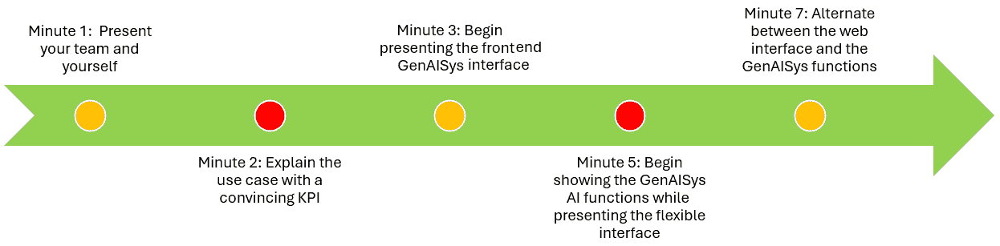

图 10.1：快速通道展示

指示的时间（以分钟计）是灵活的，可以根据您的需求进行调整。然而，现代观众期望简洁、有影响力和有效的展示。通过清楚地展示专业性和效率来保持观众的参与度。为了简单起见，我们将把任何受众——您的内部团队、投资者或客户——称为 *客户*。

客户期望以下时间表：

+   **第 1 分钟 - 展示您的团队和您自己**：简要介绍您的团队和您自己。突出您的优势，然后在他们感到无聊之前开始展示。这个介绍的时间长度由您决定，但不要做得太过分。

+   **第 2 分钟 - 使用有说服力的 KPI 解释用例**：确保您展示的用例是盈利的，无论是市场营销增长、生产资源优化、减少交付时间、更好的客户服务以增加销售额，还是任何其他活动助推器。简要介绍项目的生成式 AI 基础。然后，快速解释如果需要，KPI 可以添加到界面并实时显示，如下所示：

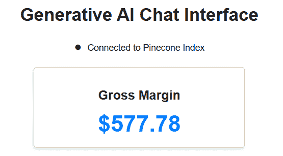

图 10.2：实时 KPI

+   **第 3 分钟 - 开始展示前端 GenAISys 界面**：无论您多么努力工作，总会有所遗漏。此外，我们构建的 GenAISys 需要使用 PowerPoint 展示和前端网页进行更高层次的解释，这些内容我们将从本章的 *构建灵活的 HTML 界面* 部分开始准备。HTML 页面包含了我们在 GenAISys 中构建的功能，并在此基础上加入了我们需要用于展示的想法以及客户想要的想法。展示您能够快速适应灵活的 HTML 页面以满足客户需求，并在研讨会中进行互动，正如我们将在 *6. 定制化* 部分中看到的。

+   **第 5 分钟 – 在展示灵活界面时开始展示 AI 功能**：继续合作完成 GenAISys 界面和集成的概念，采用以人为中心的协作式 AI 方法。强调 GenAISys 中集成的下一代技术的独特融合，如 OpenAI、DeepSeek 和 Pinecone。尽可能使演示以人为中心，展示目标是利用你构建的多用户 GenAISys 的力量，以 AI 作为**副驾驶**而非替代品来提高性能。尽可能多地记住这一点，传达一种协作精神，这将有助于建立对你系统的信任。你可以开始展示这本书中构建的教育型 GenAISys 的一些功能。如果你进一步适应了用例，你也可以展示更多。

+   **第 7 分钟 – 在网页界面和 GenAISys 功能之间交替操作**：现在，是时候展示你的 GenAISys 如何通过结合实施和盈利能力来提供高效服务了。在网页界面和你构建的 GenAISys 之间进行导航。用 GenAISys 组件展示你的专业知识。通过一个可以快速适应客户需求的网页界面，展示你的灵活性和创造力。

通过这样精心构建你的演示，你展示了明确的专家知识和实际灵活性。你已经为有说服力地展示你商业就绪的 GenAISys 做好了准备。

接下来，让我们构建灵活的网页界面，为无缝引导你的观众通过完全集成且用户友好的 GenAISys 打下基础。

# 构建灵活的 HTML 界面

演示网页界面需要灵活且可适应。在某些情况下，我们甚至可能需要在咖啡休息时现场调整代码！客户可能会坚持添加标志、更改字体或更改颜色。如果我们拒绝，这可能会成为绊脚石，给整个演示投下阴影！在这个生成式 AI 意识客户的新时代，我们需要在适应性和稳定性之间走一条细线。因此，在本节中，我们将首先构建一个具有 GenAISys 核心功能的界面，同时考虑到灵活性。如果客户坚持立即看到修改，你可以将网页页面在 HTML 编辑器中打开并实时刷新。记住，每个人都可以访问 AI 副驾驶，并且可以实时超越我们。我们需要比竞争更快，这也可能是最终用户。

目标是表明 IPython 原型界面与底层 AI 编排函数无关。因此，它可以适应任何必要于项目的环境。在这种情况下，我们选择展示一个在专用服务器上的网页看起来会是什么样子。让我们开始，通过在 GitHub 的 Chapter10 目录中打开`GenAISys_Presentation.ipynb`（[`github.com/Denis2054/Building-Business-Ready-Generative-AI-Systems/tree/main`](https://github.com/Denis2054/Building-Business-Ready-Generative-AI-Systems/tree/main)）。

首先，我们下载演示所需的辅助脚本和网页：

```py
!curl -L https://raw.githubusercontent.com/Denis2054/Building-Business-Ready-Generative-AI-Systems/master/commons/grequests.py --output grequests.py
from grequests import download
download("Chapter10","01.html")
download("Chapter10","02.html")
download("Chapter10","03.html")
download("Chapter10","04.html")
download("Chapter10","05.html")
download("Chapter10","06.html") 
```

然后，我们定义一个可重用的 Python 函数，以便在笔记本中方便地加载和显示 HTML 界面：

```py
from IPython.display import HTML, display
def display_interface(filename):
    with open(filename, "r", encoding="utf-8") as file:
        html_content = file.read()
    display(HTML(html_content)) 
```

在本节中，我们将仔细分析`01.html`的代码。目标是确保您清楚地理解界面的结构和逻辑。这种清晰度对于在演示过程中迅速响应潜在客户请求至关重要。

代码从标准的`<head>`部分开始，其中包含元数据（如`<meta charset="UTF-8">`和`<title>`）。CSS，视觉样式，嵌入在``标签中：

```py
<!DOCTYPE html>
<html lang="en">
<head>
  <meta charset="UTF-8">
  <title>Generative AI Chat Interface</title>
  
    body {
      font-family: Arial, sans-serif;
      margin: 20px;
      background: #f4f4f4;
    }
….
  
</head> 
```

`<head>`和`<body>`部分可以根据项目的特定品牌和设计指南进行完全定制。在这种情况下，`<body>`容器将包裹所有内容并应用我们刚刚定义的 CSS 布局样式：

```py
<body>
  <div class="container"> 
```

标题栏不包含“生成式 AI 系统”这一术语。在这种情况下，选择提供一个更广泛的受众可以相关联的术语：

```py
<h1>Generative AI Chat Interface</h1> 
```

用户选择块包含我们在整本书中一直在使用的三个通用用户名。它提供了灵活性，可以根据项目的具体规格适应任何关于他们是谁的问题。您可以选择根据演示的上下文提供特定领域的名称。您也可以添加更多用户。目前，让我们保持简单：

```py
<div class="form-group">
  <label for="userSelector">User:</label>
  <select id="userSelector">
    <option>User01</option>
    <option>User02</option>
    <option>User03</option>
  </select>
</div> 
```

用户输入信息区域包含标准信息。我们可以根据行业或任务对其进行修改。它甚至可能因用户而异，具有特定领域，例如“在此处输入客户的评价。”在这种情况下，我们将显示我们一直在使用的消息来构建我们的 GenAISys：

```py
<div class="form-group">
  <label for="messageInput">Your Message:</label>
  <textarea id="messageInput" placeholder="Type your message here or type 'exit' or 'quit' to end the conversation." rows="4"></textarea>
</div> 
```

然后实现了一个标准的发送按钮，但请记住，在您的演示过程中，它可以根据特定的品牌要求进行视觉定制：

```py
<div class="form-group">
  <button id="sendButton">Send</button>
</div> 
```

现在让我们添加复选框选项/小部件，以便 AI 代理启用语音或激活文件管理：

```py
<div class="checkbox-group">
  <label>
    <input type="checkbox" id="agentCheckbox" checked>
    Agent
  </label>
  <label>
    <input type="checkbox" id="voiceCheckbox">
    Voice Output
  </label>
  <label>
    <input type="checkbox" id="filesCheckbox">
    Files
  </label>
</div> 
```

研究代码，无论其设计如何，以便在显示某物时情况变得紧张时能够实时修改。这将表明您具有灵活性，可以轻松适应客户需求。这可能很棘手，但可能是必要的。只需确保仅在客户坚持修改时才进行修改，以避免承担不必要的风险。

**推理**下拉菜单突显了我们 GenAISys 中强大的推理能力，正如前几章所实现的那样。你可以轻松调整或添加推理选项以匹配你的项目规格：

```py
<div class="form-group">
  <label for="reasoningSelector">Reasoning:</label>
  <select id="reasoningSelector">
    <option value="None" selected>None</option>
    <option value="Analysis">Analysis</option>
    <option value="Generation">Generation</option>
    <option value="Mobility">Mobility</option>
  </select>
</div> 
```

模型选择块包含战略信息。客户想知道模型是否安全且开源，或者它来自哪个国家。我们可以添加其他模型或解释我们如何通过下拉列表的灵活性添加更多模型：

```py
<div class="form-group">
  <label for="modelSelector">Model:</label>
  <select id="modelSelector">
    <option value="OpenAI" selected>OpenAI</option>
    <option value="DeepSeek">DeepSeek</option>
  </select>
</div> 
```

最后，输出区域是一个标准化的部分，用于清晰地显示对话响应：

```py
<div class="output-area">
  <p><em>Conversation output will appear here...</em></p>
</div> 
```

现在，我们已经准备好编写结束标签并打开文件：

```py
 </div>
</body>
</html> 
```

`01.html`文件是用基本文本编辑器创建的，上传到我们的 GitHub 仓库，然后由我们的笔记本自动下载。你可以在浏览器或演示环境中直接打开该文件。在这种情况下，我们现在将在笔记本中打开它。

是否使用 HTML 进行演示的选择权在你。对于这个特定的策略，PowerPoint 演示可能过于静态，而直接运行 Python 代码可能会让高层管理人员分心，无法理解核心概念。HTML 页面提供了一个有效的平衡点——比静态幻灯片更动态，但比实时代码更清晰、更灵活。

然而，我建议你将注意力集中在信息本身，而不是媒介上。清晰地阐述以人为本和自动化的收益，这将把你的观众带到下一个层次。

现在，让我们概述我们将遵循的七个步骤路线图，以在接下来的章节中更深入地探讨每个组件之前，有效地展示我们的 GenAISys：

1.  **展示核心 GenAISys**，专注于 GenAISys 的实用功能。不要陷入 Python、CSS、HTML 或其他低级技术术语中。只有一个目标：向观众展示这个界面如何帮助他们构建以人为本、下一代 GenAISys。

1.  **展示向量存储**以展示一个组织的数据可以以创新的方式安全存储。要传达的概念是数据不是静态的，存储在单一位置，而是动态的。我们可以直接访问数据，就像我们汽车中的 GPS 一样。

1.  **以人为中心的 KPI 方法**以展示尽管我们可以自动化许多任务，但以人为中心系统可以成为一个利润中心。如果人类有实时的 KPI 来证明生产力的实时增长，那么一个强大的人机协作团队将把公司带到下一个层次。

1.  **整合平台和框架**可以是一个选择。这将由公司来决定。我们展示了我们从头开始构建 GenAISys 的专业技能。因此，我们对于部署任何 GenAISys 所需的复杂功能，无论是通过平台还是其他方式，都是宝贵的资产。我们还将展示我们能够整合强大的 MASs 来提高公司的生产力。

1.  **安全和隐私**是项目的关键组成部分。我们将展示我们能够根据市场上现有的最佳实践和法规在这个领域实施标准做法。

1.  **定制**是我们的品牌形象！我们已经展示了从零开始构建尖端 GenAISys 的能力。因此，我们能够定制所需的任何 AI 功能。

1.  **GenAISys 资源（RACI）**是我们的实际接触点。我们知道构建 GenAISys 有多困难。我们认识到从模型到系统的过渡是一个复杂的过程。我们认识到一对一、用户到副驾驶的体验本身是不够的。我们有一个一对多的愿景，一个可以扩展到用户组的架构，这需要仔细的资源规划。

在这个路线图确定之后，让我们首先介绍核心的 GenAISys。

## 1. 展示核心 GenAISys

导航到笔记本中的*1. 生成式 AI 聊天界面*部分，并运行以下单元格以显示`01.html`页面：

```py
display_interface("/content/01.html") 
```

这个输出与我们在本书中精心开发的 IPython 界面完全一致。然而，通过将其显示为网页，我们强调我们的 GenAISys 界面是平台无关的——它可以在任何地方托管，嵌入到演示中，或通过网页浏览器访问，如图*图 10.3*所示：

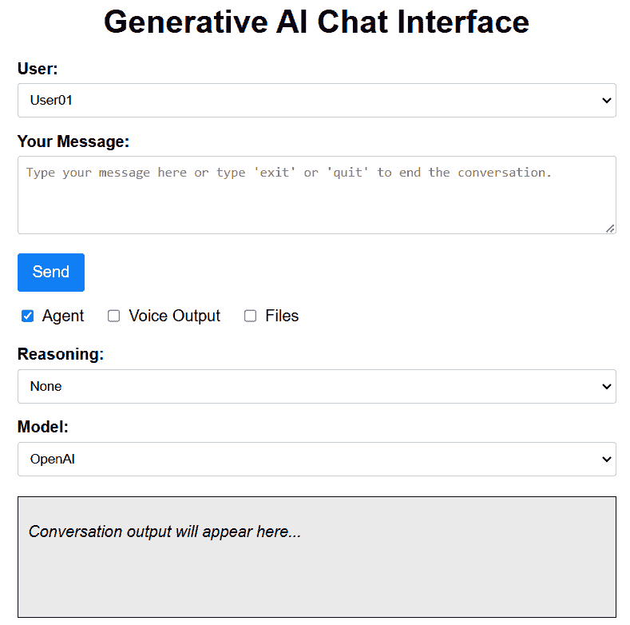

图 10.3：生成式 AI 聊天界面

您在演示中提供的描述需要用户友好且直观。您必须根据观众调整您的技术术语水平。从清晰的术语开始，然后在必要时扩展，以提供更多技术或更直接的解释。我们解释的灵活性必须与我们所构建的 GenAISys 的灵活性相匹配。

以下是一些应对观众可能提出的大量问题和我们必须解决的问题的方法。技术细节已在本书中描述。这里的想法是让您准备好回答棘手的问题。让我们逐一分析每个组件：

+   **生成式 AI 聊天界面**：这个术语很直观。客户可以选择任何适合项目需求的术语。

+   **用户**：解释说您的 GenAISys 具有多用户功能。我们可以限制用户数量到一个人或扩展到*n*个用户。每个用户都可以有一个特定的名字，例如“John Doe”，一个角色，例如“营销”，或任何其他用户名，具体取决于项目。在这种情况下，用户是从列表中选择的：

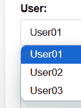

图 10.4：手动或自动用户选择

+   **您的信息**：我们需要解释用户信息可以包含客户决定的关键词。因此，这些信息将触发 AI 行为，如文本生成、图像生成、推理（**思维链**，或**CoT**）和高级文本分析。在此阶段，我们可以参考我们希望展示的用例。根据演示的范围，您可以决定是否深入探讨（切换到 Google Colab 笔记本或您的本地安装）并展示您的用例。别忘了解释完整对话可以被保存和总结。

+   **代理、语音输出和文件复选框**：我们可以解释这些选项，并决定是否深入探讨，这取决于客户兴趣。如果它们在客户寻找的项目范围内，您还可以提出创新的想法。

+   **推理**：推理代理将展示您的 GenAISys 有多有效。确保描述*图 10.5*中的选项，以展示 GenAISys 在神经科学文本分析、CoT 生成或通用移动功能方面的强大能力。简要解释本书中讨论的 CoT 方法。如果被要求，可以使用 Google Pro 或您的本地安装（个人电脑或服务器）进行详细说明。

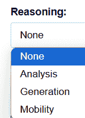

图 10.5：选择推理函数

+   **模型**：如图*图 10.6*所示，模型的选择完美地说明了系统的灵活性。客户可以选择使用 API 或本地安装的开源模型。解释说，如果需要，GenAISys 可以支持其他模型。

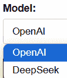

图 10.6：选择生成式 AI 模型

+   **输出区域**：我们可以解释输出生成文本和图像。如果需要，我们可以决定是否展示一个示例。

我们可以通过解释 GenAISys 界面只是前端来得出结论。GenAISys 的概念验证是一个复杂、可扩展和安全的结构。该界面提供了一个无缝、多用户、高性能的系统，允许全球范围内的交互。还解释说，这个概念验证可以无缝部署到云服务，如 AWS、Microsoft Azure、IBM Cloud 或 Google Cloud。在此阶段，我们可以深入了解本书中开发的功能及其针对特定用例的适配。

## 2. 展示向量存储

向量存储是您构建的 GenAISys 的一个重要组成部分。首先，解释 Pinecone 已被实现，但如果需要，您可以实现另一个向量存储。然后，演示如何通过前端界面上的视觉元素通知用户 Pinecone 索引的状态。

首先，将 `01.html` 复制到一个名为 `02.html` 的新文件中，以保持界面初始展示的状态。为什么？一个完全填充的 Web 界面可能会使您的听众感到困惑，但逐步的方法可以确保您不会在过程中失去任何人。此外，也许客户可能不想看到 Pinecone 连接。或者，客户可能不想进一步操作并使用 `01.html` 开始项目。我们必须保持灵活和适应，以应对所有这些情况。

在 `02.html` 中，首先添加一个清晰的 Pinecone 连接指示器：

```py
<div class="container">
  <h1>Generative AI Chat Interface</h1>
  <!-- Pinecone Connection Status -->
  <div id="pineconeStatus" style="text-align: center; margin-bottom: 10px;">
    <span style="color: green;">&#9679;</span> Connected to Pinecone Index
  </div>
  <!-- Existing form elements -->
  ...
</div> 
```

客户也可能希望在增强生成式 AI 模型的输入之前审查 Pinecone 检索。在这种情况下，我们可以添加一个新部分：

```py
<div class="output-area">
  <p><em>Conversation output will appear here...</em></p>
</div>
<div id="pineconeResults" style="background: #fff; padding: 10px; border: 1px solid #ccc; margin-top: 10px;">
  <h3>Context Retrieved from Pinecone</h3>
  <p><em>No results yet.</em></p>
</div> 
```

然后，我们可以运行单元格以显示界面：

```py
display_interface("/content/02.html") 
```

界面现在包含我们可以应用的可能的增强，如下所示：

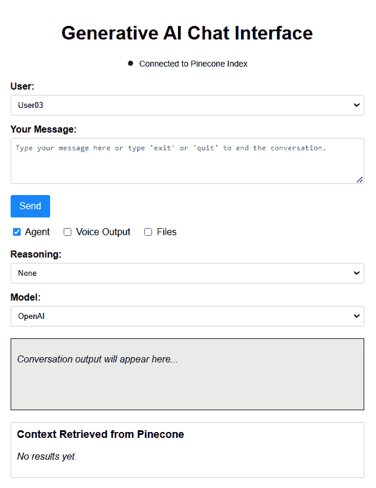

图 10.7：使用 Pinecone 功能增强界面

要介绍 Pinecone，我们可以进一步深入，通过访问我们的 Pinecone 控制台来展示向量存储的结构，控制台地址为 [`www.pinecone.io/`](https://www.pinecone.io/)。您可以在展示笔记本的 `Chapter03/Pinecone_RAG.ipynb` 版本的同时，总结 *第三章* 中涵盖的内容，并使用以下清单之类的检查清单：

+   Pinecone 安装

+   OpenAI 安装

+   分块

+   嵌入

+   Upserting

+   查询

然而，在深入到笔记本之前，确保您的听众理解向量和向量存储的含义。否则，只需简单地解释向量存储提供了一种高效的数据检索方式，并增强生成式 AI 输入以获得更好的结果。

您还可以运行任何其他查询 Pinecone 索引或您构建的笔记本。请注意，本书中的笔记本是教育性的，因此您可能希望在此基础上构建自己的笔记本以用于演示。现在让我们在以人为中心的环境中介绍 KPIs。

## 3. 以人为中心的方法对待关键绩效指标（KPIs）

将 GenAISys 的实现以人为中心仍然是部署 AI 的最佳方式。一开始，以人为中心的方法似乎有些反直觉。为什么不直接替换员工？为什么不裁员所有可以被替换的人？为什么不通过解雇员工获得大量现金？毕竟，为什么不大幅减少劳动力，因为 GenAISys 可以节省大量时间和金钱？为什么不简单地投资并快速获得投资回报率？通过裁员或“替换”的简单、反直觉的 *ROI 情景 1* 将如下所示：


事实上，某些公司已经采取了大规模裁员，选择依赖 AI。他们甚至可能看起来很成功。然而，在跟随这条道路之前，考虑一下我的个人经验和观点，然后选择您希望如何继续前进。让我们通过我的增长投资回报率（ROI）愿景来探讨。

### 通过增长实现投资回报率（ROI）

*图 10.8*展示了基于过去几十年真实人工智能项目的 AI 实施和政策愿景。它通过 GenAISys 神经科学营销增加销售额来表示投资回报率，通过生成式 AI（包括 CoT）缩短从生产到交付的时间，以及通过 GenAISys 提升销售额。


图 10.8：通过增长进化

这怎么可能呢？我是一个理想主义者吗？让我用一个我为一个超过 100,000+平方米的巨型仓库中的配送中心实施的真实人工智能项目来解释这个问题，这个仓库大约有 1.076+百万平方英尺。该项目是一个从头开始的混合人工智能和高级数学项目：

+   人工智能位置优化器通过计算从生产地点（A）到配送中心（B）再到当地客户（C），例如超市和大型商店的数千次配送的质心，确定了仓库应该建在哪个位置，如图*图 10.9*所示：

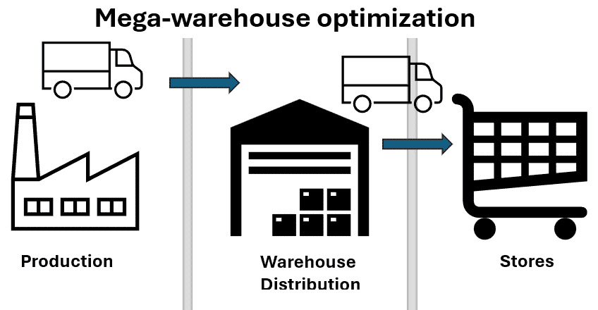

图 10.9：大型仓库人工智能驱动优化

+   内部仓库人工智能代理优化了仓库的设计，包括码头和区域数量。

+   然后，人工智能仓库代理优化了从码头到存储位置（从 A）以及从存储到码头用于交付（C）的流程。

+   关键问题是大量未计划事件的消息数量，例如晚到的卡车（由于交通或天气）和有缺陷的产品。一个 GenAISys，例如我们在本书中构建并适应此用例的 GenAISys，可以在一定程度上自动化这些消息。

那为什么不替换那些 24/7 工作以自动解决这些问题的许多规划者呢？每个人都首先认为这是可能的。我发现这在一定程度上是可行的。然而，我很快发现规划者考虑的许多参数是不可预测的。生成式 AI，甚至基于规则的系统，在检测*模式*方面表现出色，但在没有模式时却不知所措！它们在遇到前所未有的、非重复的场景时会遇到很大的困难。

考虑这个实际的仓库场景：货柜#100234 上缺少标签，而另一个货柜包含有缺陷的产品（#343445）。同时，一个**自动导引车**（**AGV**）无法解释地比平时运行得慢。位于 94 号码头的卡车必须立即出发，因为周六晚上快到 11 点了，而卡车在周日不能使用高速公路。任何延误现在都可能导致严重的罚款和客户不满。

我发现许多类似的问题每天都在发生。所以，是的，一个具有强大数学功能的混合型 GenAISys 可以自动化许多决策过程。而且，是的，这在大仓库中一年内代表了许多毛利润。但是，关于 AI 无法解决的未解决问题怎么办？记住，在分销供应链中，延迟交货会带来严厉的罚款，甚至可能失去客户信任，导致许多合同的损失。

在那个时刻，我全天候工作在另一种方法上。让我们保留人员，特别是规划人员，即使整体上提高生产力需要更少的仓库人员。为什么和怎么做？我设计了一个包含一个 KPI（就像我们将在本节中添加的那样）的界面，以及一个 AI 代理和一名人类专家。*图 10.10*展示了专家如何实时可视化 KPI。每次专家运行 AI 系统并完成决策，考虑到复杂的不计划事件，系统都会显示节省了多少资金，例如不需要使用第二辆卡车，调整订单以优化人员，以及有额外的时间来修复错误。


图 10.10：以人为中心的 GenAISys 协作

因此，专家规划人员提高了进出存储事件的效率。仓库可以处理更多的单位，而无需建造额外的码头，购买新的 AGV 或雇佣更多人力。生产力的提升为超级仓库带来了 3%的毛利润增长。在仓库管理中，毛利润的显著增长产生了可观的利润。

您可以使用您希望的参数设计 ROI 比率，但核心概念是协作的人机增长非常高效。通过增长产生的 ROI，在以人为中心的系统中比裁员产生了更多的利润：


这个成功的项目对我的声誉和销售产生了巨大影响：

+   传言说 Rothman 是道德的，他的 AI 系统是可以信赖的。

+   以人为中心的成功建立了一个 AI 项目形象，这将团结团队，而不是摧毁它们。

+   人工智能专业知识可以 24/7 工作，帮助团队提升绩效，从而产生增长并获得奖金！

最终，在激进裁员和战略增长之间的选择权在你手中。这个例子只是简单地反映了我个人的方法和经验。无论如何，如果客户需要实时 KPI，让我们将其添加到界面中。

### 将实时 KPI 添加到 GenAISys 网络界面

如果您的客户感兴趣，以下是我们将如何将实时 KPI 实现到现有网络界面中的方法，强调以人为中心的做法：

1.  将上一个界面文件（`02.html`）复制到一个新版本（`03.html`）中，以保留之前的界面状态。然后，添加 KPI 面板：

    ```py
     <!-- Gross Margin KPI Panel -->
       <div class="kpi-panel" id="grossMarginKPI">
         <h2>Gross Margin</h2>
         <div class="kpi-value" id="grossMarginValue">Loading...</div>
       </div> 
    ```

1.  然后，我们将添加 CSS 样式：

    ```py
     .kpi-panel {
         background: #fff;
         padding: 15px;
         margin: 20px auto;
         border: 1px solid #ccc;
         border-radius: 5px;
         text-align: center;
         box-shadow: 0 2px 4px rgba(0,0,0,0.1);
         max-width: 300px;
       }
       .kpi-panel h2 {
         margin-bottom: 10px;
         font-size: 20px;
       }
       .kpi-value {
         font-size: 36px;
         font-weight: bold;
         color: #007bff;
       } 
    ```

1.  最后，我们将添加 JavaScript 的实时更新模拟，以展示如果在实际情况下实施，KPI 将会是什么样子：

    ```py
     // Example function to update the KPI
       function updateGrossMargin() {
         // Replace this with your real-time data-fetching logic
         const grossMargin = fetchGrossMarginFromBackend(); // your API call here
         document.getElementById('grossMarginValue').textContent = `$${grossMargin.toFixed(2)}`;
       }
       // Simulate real-time update every 5 seconds
       setInterval(updateGrossMargin, 5000); 
    ```

现在运行显示笔记本中第 *3* 节 *KPI* 部分的 `03.html` 单元格：

```py
display_interface("/content/03.html") 
```

这个模拟显示了毛利润关键绩效指标（KPI）的实时更新，从视觉上强化了人类规划师为 GenAISys 实施带来的价值：

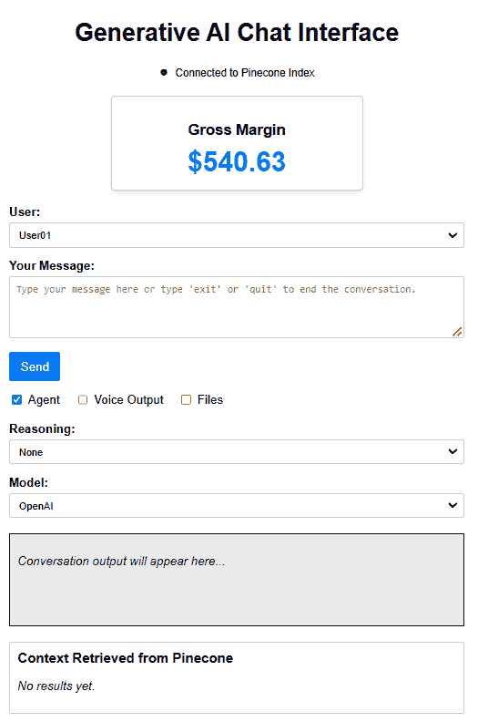

图 10.11：人类与 KPI 的关系

客户可能希望删除此功能或增强它以适应他们的项目。我们的角色是适应项目需求，无论所需的自动化程度如何。我们现在将展示我们的 GenAISys 在客户环境中的集成。

## 4. 集成：平台和框架

集成通常是部署 GenAISys 最具挑战性的阶段之一，尤其是在选择平台、操作系统和框架时。虽然初创公司或内部项目最初可能享有自由选择平台的奢侈，但现实场景往往涉及来自投资者、客户或内部政策的严格限制。以下例子是从现实情况中抽取的，用以说明您可能面临的潜在挑战：

+   “我们公司只与带有 ISO 和原生安全性的 Windows Server 合作。我们不会接受您的 Ubuntu 服务。这不容讨论。这是我们的政策。” ([`www.microsoft.com/en-us/evalcenter/evaluate-windows-server-2025`](https://www.microsoft.com/en-us/evalcenter/evaluate-windows-server-2025))

+   “我们公司只使用 Ubuntu Server。我们不会接受任何 Windows 应用程序。这不容讨论。这是我们的政策。” ([`ubuntu.com/download/server`](https://ubuntu.com/download/server))

+   “作为投资者，我们需要确保您的 GenAISys 符合 AWS 安全和隐私标准，这些标准通过**数据隐私框架**（**DPF**）遵守美国-欧洲法规。我们不在乎您安装的第三方组件。要么您使用 AWS 的框架，要么我们不会投资。” ([`aws.amazon.com/compliance/eu-us-data-privacy-framework/`](https://aws.amazon.com/compliance/eu-us-data-privacy-framework/))

+   “你在开玩笑吗？你真的认为我们会让你们的 GenAISys 进入我们的网络吗？不可能。所以，别再考虑你展示的安全和隐私组件了，包括 AWS 的框架。你在一个高度安全的空间站。我们将在一个完全无法访问网络的隔离虚拟机上安装你们的 GenAISys，而不是你们。只有认证用户才能访问它。我们的安全部门 24/7 实时监控这些连接。任何试图写入未经授权的提示都将被过滤，并在到达你们的系统之前伴随一个高安全警报。我们不会告诉你更多。我们只会给你一个提示。我们的策略之一是 IBM 的**入侵检测和预防系统**（**IDPSs**）。” ([`www.ibm.com/docs/en/snips/4.6.0?topic=introducing-security-network-intrusion-prevention-system-ips-productn`](https://www.ibm.com/docs/en/snips/4.6.0?topic=introducing-security-network-intrusion-prevention-system-ips-productn))

+   “我们与谷歌云合作已有多年，并且只接受符合我们托管、安全和隐私框架的系统。” ([`cloud.google.com/`](https://cloud.google.com/))

+   “我们的一切都只使用 Microsoft Azure：托管、AI、安全和隐私。假设你们有一个创新的 GenAISys。它将如何适应我们的框架？” ([`azure.microsoft.com/en-us/`](https://azure.microsoft.com/en-us/))

可能的托管平台、安全和隐私框架清单是无限的！你们的 GenAISys 概念验证必须保持*灵活*。正是这种灵活性使得我们构建的前端 HTML 页面能够快速适应特定的客户需求——而不需要在后端进行深度修改。然后，你们可以使用这本书中构建的教育组件以及你们添加的专业特定演示准备来满足客户的要求。

但集成并不止于此！可能会出现一些创造性和意外的请求。潜在客户可能会问你以下两个问题：

+   “我们真的很喜欢你们的 GenAISys！多用户功能太棒了，尤其是它支持激活或停用 AI 代理！太好了！如果你们能让它与 Zoom API 兼容，我们会立即购买你们的系统。那将太棒了！你们需要多长时间才能将 GenAISys 与 Zoom 集成？” ([`developers.zoom.us/docs/api/`](https://developers.zoom.us/docs/api/))

+   “我们超级喜欢你们的 Zoom 集成！太棒了！但我们的公司政策是只使用 Microsoft Teams。你们需要多长时间才能将 GenAISys 与 Teams 集成？” ([`learn.microsoft.com/en-us/graph/api/resources/teams-api-overview?view=graph-rest-1.0`](https://learn.microsoft.com/en-us/graph/api/resources/teams-api-overview?view=graph-rest-1.0))

一旦你解决了这些挑战，可能会出现围绕企业级 ERP（如 SAP 或 Oracle）、特定数据库解决方案或甚至认证以验证你的 GenAISys 的合规性和安全措施的需求。为此，我说，欢迎来到现实世界！你必须坚持一个基本原则：无论你如何发展你的 GenAISys，潜在的客户通常会要求更多或以不同的方式实施你的系统。你的 GenAISys 提供了合法性。除此之外，保持灵活的专业性！

让我们现在展示我们适应任何情况的意愿。复制`03.html`并将其命名为`04.html`以保持界面之前的步骤不变。将此部分添加到 HTML 前端页面：

```py
 <!-- ERP Integration Dropdown -->
    <div class="form-group">
      <label for="erpIntegrationSelector">ERP, database, platform and meeting Integration:</label>
      <select id="erpIntegrationSelector">
        <option value="none" selected>Select ERP or Meeting API</option>
        <option value="SAP">SAP</option>
        <option value="Oracle">Oracle</option>
        <option value="Microsoft Dynamics">Microsoft Dynamics</option>
        <option value="NetSuite">NetSuite</option>
        <option value="AWS">AWS</option>
        <option value="Google Cloud">Google Cloud</option>
        <option value="Azure">Azure</option>
        <option value="Zoom API">Zoom</option>
        <option value="Teams API">Teams</option>
        <option value="Other">Other</option>
      </select>
    </div> 
```

现在，运行页面以显示更新后的界面：

```py
display_interface("/content/04.html") 
```

这个新增加的集成选择显示在**推理**下拉菜单下方（如图*图 10.12*所示）。它是讨论多模态 CoT、ERP 集成或特定平台兼容性的优秀视觉辅助工具。

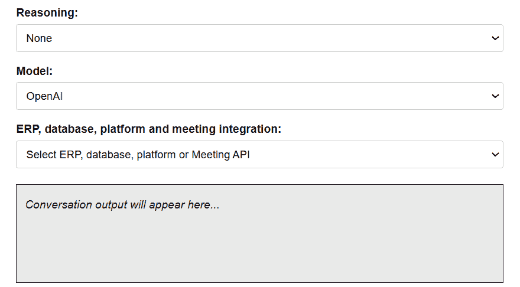

图 10.12：ERP、数据库、平台和会议集成列表

在添加此下拉菜单之前，确保你已经彻底准备就绪。熟悉每个列表中的集成（如图*图 10.13*所示），因为你的受众可能会对每个项目提出具体、详细的问题：

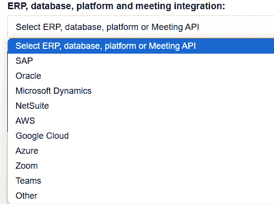

图 10.13：一些可能集成的列表

记住，GenAISys 提供的集成灵活性不仅限于这些示例。甚至可能包括 MAS 实施——这是我们接下来要探索的另一种复杂方法。

### 展示高级框架：一个 MAS

在这次演示的这个阶段，你可以从展示你的 GenAISys 目前能做什么转变为突出它所启用的未来。引入 MAS 不仅仅是新增一个功能——它是对生成式 AI 变革潜力的预览，展示了你的系统核心设计如何处理复杂任务。它捕捉了这本书的哲学：以人为本、可扩展和协作的 AI。

在决定是否展示它时，考虑以下参数：

+   这可能是一个“哇”的时刻，因为你在打开通往未来的大门。

+   这也可能是一个对风险规避的受众来说令人恐惧的时刻，他们可能害怕无论你说什么：工作替代、取代或破坏。

+   即使这是一个“哇”的时刻，内容可能过于复杂，也许应该等到 GenAISys 进入实施阶段。如果发生这种情况，你可以将这个 MAS 添加到 GenAISys 的处理程序注册表中，让用户决定是否激活它。

+   即使这是一个“哇”的时刻，观众想要进一步了解，在让它自行运行之前，提醒他们以人为中心的 GenAISys 具有人机界面，确保专家控制输出，即使在高级 MAS 实现中也是如此。

如果你选择展示 MAS，请明确将其定位为一个创新性的颠覆性产品。它可以自主运行或部分自主运行——无论是独立运行还是通过现有 GenAISys 中的简化界面。

要查看这个 MAS 的完整实现，请打开`GenAISYS_&_MAS.ipynb`笔记本。程序流程和代码设计得非常直观，每个部分都有对其目的的明确解释。我们，即人类作者和 Gemini 2.5 Pro/ChatGPT，这个项目的合作伙伴，已经仔细地在代码中添加了详细的注释，不仅解释了函数的功能，还解释了背后的设计决策——从引导代理的提示工程到使群体高效运行的异步模式。

这个笔记本有三个关键特性：

+   **MAS**：这个笔记本演示了一个教育性的 MAS，如图 10.14 所示。这个 MAS 协调一组 AI 代理进行并发任务处理。程序首先设置异步环境，定义核心组件：独立的工作代理创建和解决任务，一个摘要代理进行综合，以及一个中央协调器来管理两阶段工作流程。最后的单元格执行完整的模拟，展示了高效、并行解决复杂问题的方法。

+   **人机协作悖论**：尽管这个程序展示了 AI 代理自动化任务，一个常与人类替代相关的概念，但这个笔记本本身是对人机协作的证明。它由人类作者撰写，随后经过 ChatGPT 的优化，并与 Gemini 合作演变成这个 MAS。这个过程反映了书籍的核心、以人为本的主题：未来不是 AI 与人类的对抗，而是 AI 作为合作伙伴，增强我们的创造力和生产力。

+   **“从头开始”的方法**：我们故意选择从基础库如`asyncio`和`aiohttp`构建这个系统，而不是使用现有的代理框架。这种从头开始的方法有两个目的。首先，它揭示了多代理协调工作的核心机制，这是这个项目的教育目标之一。其次，它确保生成的框架尽可能灵活和模块化，不受任何单一平台的限制，并准备好适应任何现实世界的商业需求。

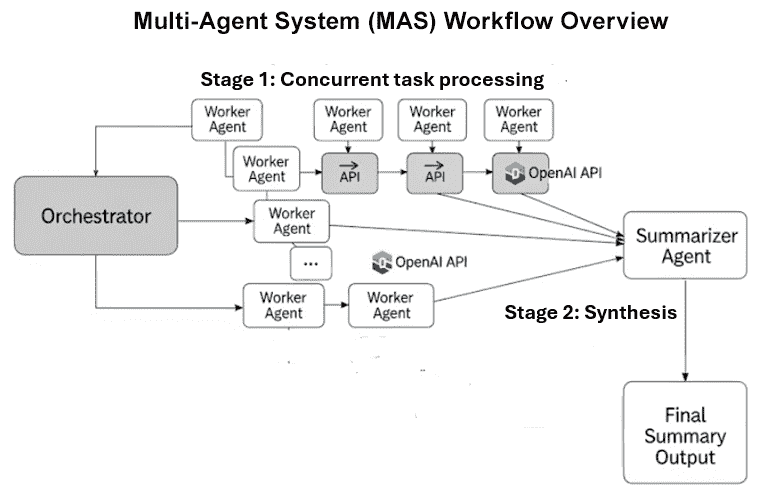

图 10.14：MAS 工作流程概述

前面的图显示了 MAS 的主要组件：

+   **中央编排器**通过在章节笔记本中每个任务少于 1 秒显示代理的输出，指导工作流程。

+   **工作代理**并行处理任务，与 OpenAI 交互

+   **摘要代理**综合响应，使代理能够通过输出进行交互，形成 MAS 工作的摘要

让我们现在来看看战略集成选项。

### MAS 的战略集成选项

既然我们已经确定了 MAS 的**是什么**和**为什么**，那么关键的商业问题是**如何**与我们所展示的 GenAISys 相匹配。

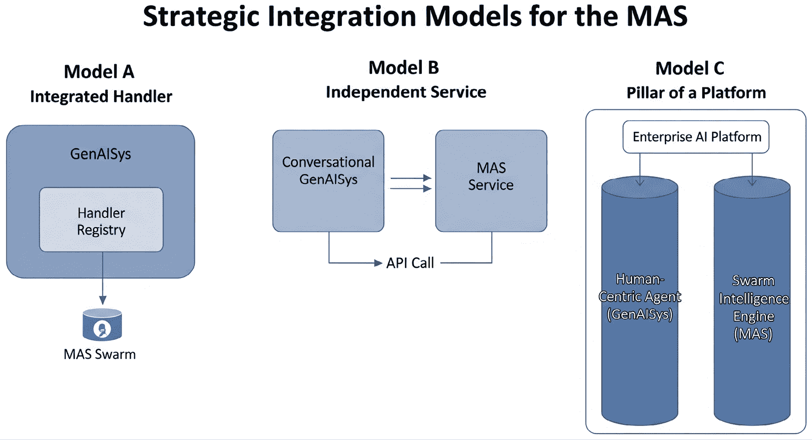

图 10.15：MAS 的战略集成模型

如*图 10.15*所示，我们可以为其部署提供三种战略愿景：

+   **将模型 A 作为集成处理程序**：对于许多用例，整个蜂群过程可以封装为一个新函数，并添加到核心 GenAISys 的处理程序注册表中。用户只需从**推理**下拉菜单中选择**蜂群处理**选项，就可以触发这个大规模并行任务。这展示了主系统的模块化和可扩展性。

+   **模型 B 作为独立、专业的服务**：对于大规模、专用需求（例如，分析数百万份文档或实时数据流），MAS 可以作为单独的、高度优化的服务部署。主要对话 GenAISys 可以在需要时调用此服务。这展示了构建用于企业级问题的强大、微服务式架构的能力。

+   **将模型 C 作为更大 AI 平台的支柱**：我们可以将整个 GenAISys 构建为一个有两个主要支柱的平台。第一个是面向人类协作的对话和推理代理。第二个是用于大规模自动化的**蜂群智能引擎（MAS）**。这展示了这项工作的最宏伟、最强大的愿景，不仅是一个工具，而且是一个全面、商业就绪的 AI 平台。

这种集成愿景将你的 GenAISys 提升到仅仅功能性之上，成为一个完全实现、企业就绪的 AI 生态系统。

在从零开始构建你的 GenAISys 之后，你现在拥有一个强大、灵活的 AI 控制器，能够进行动态编排和高级推理。这个坚实的基础使你能够拥抱新兴标准，如**模型上下文协议（MCP）**和**代理通信协议（ACP）**：

+   **模型上下文协议**：MCP 为你的 GenAISys 提供了一个标准化的方式，以便无缝访问和集成各种外部工具和数据源。如果客户想要实施这一功能，你现在拥有完成这项工作的技能。你可以在这里了解更多关于 MCP 及其规范的信息：[`modelcontextprotocol.io/`](https://modelcontextprotocol.io/)。

+   **代理通信协议**：ACP 为您的复杂 AI 代理与其他专业代理无缝协作提供蓝图。您在本书中构建了许多代理，为这一协议做准备。您可以在 DeepLearning.AI 平台上找到更多关于 ACP 及其课程的信息，通常与 IBM Research 的 BeeAI 合作：[`www.deeplearning.ai/short-courses/agent-communication-protocol/`](https://www.deeplearning.ai/short-courses/agent-communication-protocol/)。

您在设计智能 AI 管道和代理工作流程方面的专业知识意味着您已经准备好利用甚至贡献这些强大的互操作性框架，将您的商业就绪 AI 解决方案提升到下一个层次。现在是一个更具挑战性的方面：安全约束和隐私法规。

## 5. 安全和隐私

安全和隐私通常从所选的托管平台或框架继承约束，这些平台或框架是在初始集成阶段决定的。然而，即使您的系统符合既定标准，您也必须在 GenAISys 中明确展示您的监管和数据安全组件。始终准备好面对这些主题的严格问题。强烈建议在演示过程中有认证的安全专家陪同。如果不可能，确保您表现出根据客户建立的协议和框架调整 GenAISys 的意愿。

这里是 GenAISys 可能需要集成或与之一致的基本安全层——仔细审查它们，以便准备好应对挑战性问题，即使这些安全层由另一个团队或外部服务管理：

+   **加密通信**：说明数据加密是如何管理的。参考 IBM 对加密的概述等稳健资源，以确保您做好准备（[`www.ibm.com/think/topics/encryption`](https://www.ibm.com/think/topics/encryption)）。

+   **审计报告和渗透测试**：客户通常要求提供定期安全测试的证据。确保您了解主要提供商如 AWS 的渗透测试标准（[`aws.amazon.com/security/penetration-testing/`](https://aws.amazon.com/security/penetration-testing/)）。

+   **访问控制和身份验证**：讨论 GenAISys 如何与行业标准访问管理协议集成。熟悉如 Google Cloud 的访问控制方法等框架（[`cloud.google.com/storage/docs/access-control/`](https://cloud.google.com/storage/docs/access-control/)）。

+   **监控和事件响应**：阐述您系统处理安全事件的能力。参考 IBM 的事件响应指南等框架（[`www.ibm.com/think/topics/incident-response`](https://www.ibm.com/think/topics/incident-response)）将大有裨益。

你不必是专家，但至少应该能够舒适地使用准确术语讨论这些领域。仔细审查提供的链接，以确保你了解当代的安全实践。

让我们展示你的系统如何有效地处理实时安全警报。像往常一样，为了避免让你的观众感到不知所措，将`04.html`复制为`05.html`，确保如果你决定不继续演示，之前的演示状态保持不变。

我们将在灵活的 HTML 界面中添加一个简单、直观的红色警报横幅：

```py
<!-- Place this alert banner near the top of your container -->
<div id="securityAlert" style="display:none; background-color: #ffdddd; color: #a94442; padding: 15px; border: 1px solid #ebccd1; border-radius: 4px; margin-bottom: 20px;">
  Security Alert: Suspicious activity detected.
</div> 
```

然后，在你的 JavaScript 中，你可以根据某些条件轻松切换其可见性：

```py
// Example function to display the alert
function showSecurityAlert() {
  document.getElementById('securityAlert').style.display = 'block';
}
// Example function to hide the alert
function hideSecurityAlert() {
  document.getElementById('securityAlert').style.display = 'none';
}
// Simulate a security event after 5 seconds (for demonstration purposes)
setTimeout(showSecurityAlert, 5000);
red alert banner / 5 seconds 
```

在这个例子中，警报横幅在五秒后自动出现，直观地展示了实时安全通知可能的样子。阅读代码以便能够实时修改它，或者至少在会议中如果需要的话快速修改。一些客户可能不喜欢它的显示方式或颜色。

有时，修改前端页面表明你愿意快速适应客户的需求，正如我们现在已经反复强调的那样。另一方面，谨慎和经过深思熟虑的修改则表明谨慎和可靠性。根据你对受众需求和期望的理解做出战略选择。

警报可能来自你的系统或托管环境。现在，让我们运行代码以显示更新的界面：

```py
display_interface("/content/05.html") 
```

如下所示，安全警报将在五秒后显示：

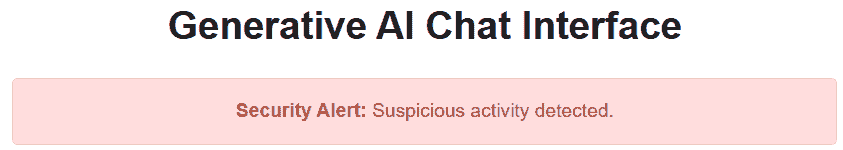

图 10.16：实时安全警报横幅

在项目的实施阶段，必须精确定义安全警报条件，以确保与客户的确切安全策略保持一致。在解决了安全和隐私考虑因素后，我们现在可以继续到定制这个微妙且经常具有挑战性的领域。

## 6. 定制

与大多数软件一样，GenAISys 的成功之路依赖于我们定制应用程序的能力。无论我们多么努力，最终用户都会要求界面和流程进化。我们可以忽略它们或接受它们。中间地带是接受那些可行且在项目范围内的请求，并为需要根本性修改的进化找到尽可能多的现实解决方案。

有许多可能的定制方法；在这里，我们关注一种实用的、以人为本的三阶段定制方法：

+   **第一阶段**：通过头脑风暴研讨会定制前端 HTML 页面，所需组数越多越好

+   **第二阶段**：创建一个隔离的沙盒，逐步向构建的 GenAISys 添加功能

+   **第三阶段**：逐步将沙盒进化集成到 HTML 页面中（文档化和稳定化）

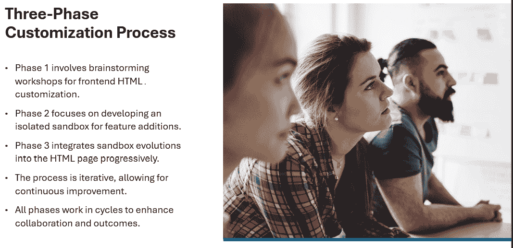

图 10.17：一个以人为中心的三阶段自定义过程

所有三个阶段将在研讨会周期中持续进展。强化你参与者的角色，作为积极的共同创造者，而不是仅仅表达他们愿望的技术被动消费者。

再次，复制`05.html`并将其命名为`06.html`。添加一些图标以触发观众的反应，使他们能够表达他们的创造力、想法和需求。如果你能成功地让观众参与进来，你已经在成功的路上了一半。

这段代码中的图标来自 Font Awesome。它们通过在`<head>`中包含一个链接来提供`Font Awesome` CSS 库。然后，使用带有适当 Font Awesome 类的`<i>`标签在 HTML 中插入图标。以下是你可以在研讨会期间实时或接近实时定制的关键片段：

1.  导入`Font Awesome`库：

    ```py
    <link rel="stylesheet" href="https://cdnjs.cloudflare.com/ajax/libs/font-awesome/6.0.0-beta3/css/all.min.css"> 
    ```

1.  在 HTML 中整合图标：

    +   毛利率 KPI 面板标题：

        ```py
        <h2><i class="fas fa-chart-line"></i> Gross Margin</h2> 
        ```

    +   用户选择器标签：

        ```py
        <label for="userSelector"><i class="fas fa-user"></i> User:</label> 
        ```

    +   消息输入标签：

        ```py
        <label for="messageInput"><i class="fas fa-comment"></i> Your Message:</label> 
        ```

    +   发送按钮：

        ```py
        <button id="sendButton" title="Send your message"><i class="fas fa-paper-plane"></i> Send</button> 
        ```

    +   理由选择器标签：

        ```py
        <label for="reasoningSelector"><i class="fas fa-brain"></i> Reasoning:</label> 
        ```

    +   模型选择器标签：

        ```py
        <label for="modelSelector"><i class="fas fa-robot"></i> Model:</label> 
        ```

```py
fas fa-chart-line, fas fa-user, etc.), ensuring clear visual communication of each component’s purpose. Here, too, you’ll have to be prepared to swiftly modify these icons in real time during workshops to demonstrate your agility in adapting to user feedback.
```

现在，运行网页以可视化你的图标丰富的界面：

```py
display_interface("/content/06.html") 
```

页面现在包含图标，如下面的 HTML 页面摘录所示：

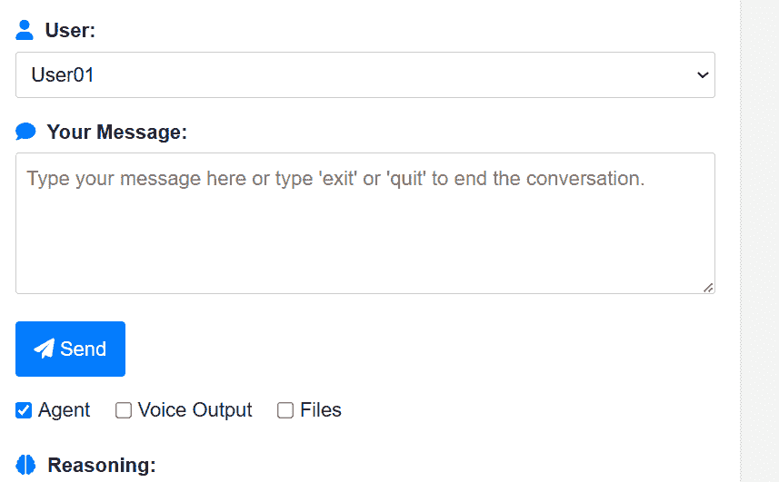

图 10.18：使用图标自定义网页

不要轻视这个话题！最终用户只看到前端网页及其输出（文本、图像和弹出窗口）。花所有必要的时间倾听客户（你的同事或外部客户）。最终用户在这个领域与你合作得越多，它就越成为*他们的* GenAISys。

困难的部分是将第 2 阶段（GenAISys）开发和第 3 阶段（GenAISys 和网页集成）结合起来。你可以通过并行实施所有三个阶段来加速项目，如图*图 10.19*所示。

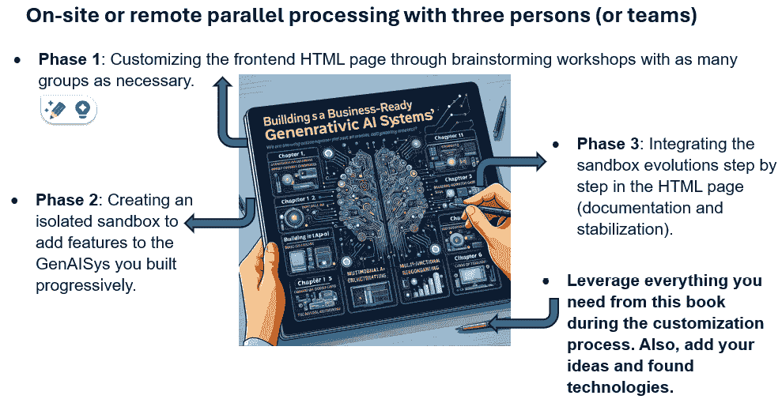

图 10.19：在本地或远程并行处理所有三个阶段的工作团队

选择取决于项目和你的愿景。你的部署方法将创造一个快速、事件丰富、优化上市时间的项目所需的持续动力。然而，每个项目都以自己的速度前进，最佳的速度是用户选择的速度，给他们时间适应你的尖端 GenAISys。

在某个时候，你不可避免地需要解释项目所需的资源和其相关成本。那么，让我们继续讨论这一点。

## 7. GenAISys 资源（RACI）

每个成功的软件项目都明确指定了所需的人类和机器资源。机器资源通常与早期集成讨论中确定的平台紧密一致（参考本章的*集成：平台和框架*部分）。然而，人力资源需要更仔细的考虑和明确的详细说明，可以使用如**RACI 矩阵**这样的结构化方法，如*第一章*中概述的。回想一下，RACI 矩阵将项目责任分为四个类别：

+   **R (Responsible)**: 积极从事任务的人（们）

+   **A (Accountable)**: 对任务的成功或失败负责的人（们）

+   **C (Consulted)**: 在复杂项目中，这是提供输入、建议和反馈以帮助团队中其他人的人（们），但他们不负责执行工作

+   **I (Informed)**: 这些是那些需要了解任务进度或结果的人

笔记本中的*第七部分（RACI）*提供了一个针对本书中开发的 GenAISys 设计的 RACI 矩阵的实际示例。*图 10.20*展示了这个 RACI 构思的摘录，为构建你项目特定的 RACI 提供了一个具体的起点：

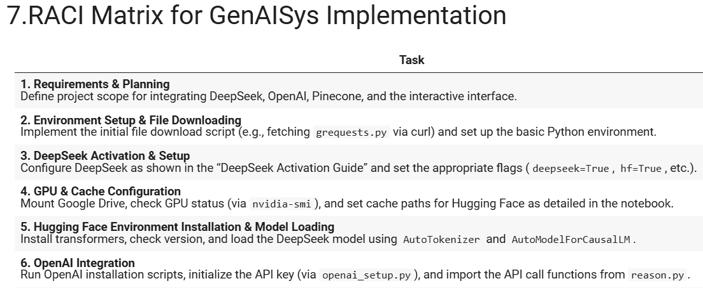

图 10.20：本书中构建的 GenAISys 的 RACI 构思摘录

在演示时，你需要解释**GenAISys 实施 RACI 矩阵**的构思清晰地概述了部署高级 AI 系统的协调、跨职能方法：

+   项目经理提供整体战略监督并领导规划和文档工作

+   同时，AI/ML 工程师推动技术方面的工作——从 DeepSeek 激活和模型集成到 API 设置、机器学习功能以及全面测试

+   DevOps 工程师的职责是搭建环境、配置硬件资源，以及管理部署和可扩展性

+   相比之下，软件开发者专注于编写交互式界面和处理注册表以及支持文本到语音等特性

+   同时，业务/CTO 角色提供战略指导，确保关键决策与组织目标一致，并维护合规性和安全措施，确保每个阶段——从初始设置到持续维护——都得到有效管理

使用 RACI 矩阵作为你的参考点将直接带你到你必须估算和谈判的成本（在你的公司、投资者或客户那里）。明确定义的角色将帮助你量化人力小时数，有效分配预算，并确定需要专业知识的领域。这允许你透明地估算项目成本，内部或外部谈判资源分配，并将你的项目划分为可管理的里程碑或交付成果。

有了这些，你现在就为 GenAISys 做好了商业准备。市场是你的征服之地！

# 摘要

在本章中，我们设计了一个战略框架，在激烈的市场竞争中展示一个商业就绪的 GenAISys。我们看到，技术创新本身不足以确保客户或资金。一个引人入胜的商业叙事必须伴随着技术概念验证，以展示现实世界的价值。一种快速通道的方法是从对团队的简洁介绍开始，迅速建立我们的信誉和专业知识。然后，将演示转向对我们构建的 GenAISys 的明确解释，以实时 KPI 为基础。

我们设计了一个*灵活*的前端网页来展示系统的功能。想法是拥有一个可适应的 HTML 页面，可以根据情况实时或快速修改。前端网页将我们构建的 IPython 界面转换为一个可访问、可定制的 HTML 显示。实时数据更新和实时模拟加强了系统的实际影响。我们设计了一个强调 GenAISys 的适应性和随着客户需求发展能力的叙事。始终，你看到了如何深入挖掘本书中教授的主要概念，并用你的发展来增强它们。你还可以从头开始构建你自己的 GenAISys，并准备好展示，它可以适应你正在工作的项目的规格。

本章青睐以人为中心的方法，确保人工智能增强而非取代专家决策。系统定位为一个旨在提升运营效率的协作工具。实时关键绩效指标可以加强 GenAISys 的盈利能力和加强 GenAISys 与使用它的团队之间的联系。如向量存储等创新功能增强了数据检索，以改善输出。我们展示了如何通过展示系统向基于群体的 MAS 的预期演变来呈现一个前瞻性的愿景，证明了框架的可扩展性，并引入了强大的人机协作合作叙事。我们展示了与主要云平台和 ERP 系统的集成。我们展示了集成服务如 AWS、Google Cloud 和 Microsoft Azure 的可能性，突出了其多功能性。通过可能的实时警报和自适应措施，严格处理了安全和隐私问题。

灵活性仍然是关键，使系统能够满足多样化的企业需求。这种方法平衡了尖端技术与可衡量的商业成果。迭代过程鼓励根据持续的客户反馈进行定制。我们通过提供交互式研讨会作为即时定制系统的方式。引入了 RACI 矩阵来明确界定角色并简化项目管理。最终，本章提供了一个全面蓝图，用于部署动态、市场就绪的 GenAISys 演示。我们平衡了技术深度与清晰的商业效益。

您现在可以设计、构建和交付一个 GenAISys 了！

# 问题

1.  展示一个商业就绪的**生成式 AI 系统**（**GenAISys**）不需要准备。（对或错）

1.  在演示目的上不需要前端 GenAISys。（对或错）

1.  在演示过程中不需要解释什么是向量存储。（对或错）

1.  Pinecone 是市场上最好的向量存储。（对或错）

1.  只有 OpenAI 和 DeepSeek 可以提供生成式 AI 模型。（对或错）

1.  开源生成式 AI 模型优于那些不共享其代码的模型。（对或错）

1.  我们需要为 GenAISys 开发自己的安全和隐私软件。（对或错）

1.  如果我们认为它很好，我们不需要定制我们的 GenAISys。（对或错）

1.  所有定制会议都应该面对面和现场举行。（对或错）

1.  在实施我们的 GenAISys 时不需要展示必要的资源。（对或错）

# 参考文献

+   IBM，*什么是加密？*：[`www.ibm.com/think/topics/encryption`](https://www.ibm.com/think/topics/encryption)

+   AWS，*渗透测试*：[`aws.amazon.com/security/penetration-testing/`](https://aws.amazon.com/security/penetration-testing/)

+   谷歌云，*访问控制概述*：[`cloud.google.com/storage/docs/access-control/`](https://cloud.google.com/storage/docs/access-control/)

+   IBM，*什么是事件响应？*：[`www.ibm.com/think/topics/incident-response`](https://www.ibm.com/think/topics/incident-response)

+   微软团队 API：[`learn.microsoft.com/en-us/graph/api/resources/teams-api-overview?view=graph-rest-1.0`](https://learn.microsoft.com/en-us/graph/api/resources/teams-api-overview?view=graph-rest-1.0)

+   Zoom API：[`developers.zoom.us/docs/api/`](https://developers.zoom.us/docs/api/)

# 进一步阅读

+   亚马逊文档：[`aws.amazon.com/`](https://aws.amazon.com/)

+   微软 Azure：[`azure.microsoft.com/en-us/`](https://azure.microsoft.com/en-us/)

+   谷歌云：[`cloud.google.com/?hl=en`](https://cloud.google.com/?hl=en)

+   IBM 云：[`www.ibm.com/consulting/cloud`](https://www.ibm.com/consulting/cloud)

# 订阅免费电子书

新框架、演进的架构、研究新发现、生产故障分析——*AI_Distilled* 将噪音过滤成每周简报，供实际操作 LLM 和 GenAI 系统的工程师和研究人员阅读。现在订阅，即可获得免费电子书，以及每周的洞察力，帮助您保持专注并获取信息。

订阅请访问 `packt.link/TRO5B` 或扫描下方的二维码。


