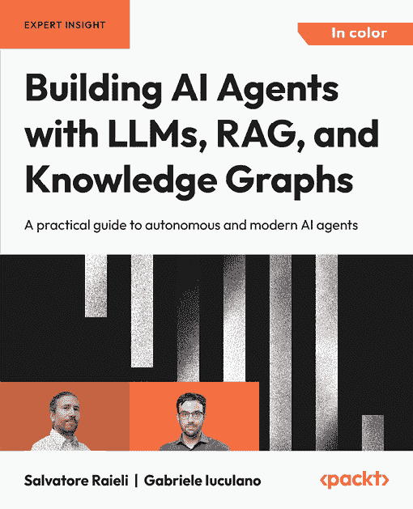
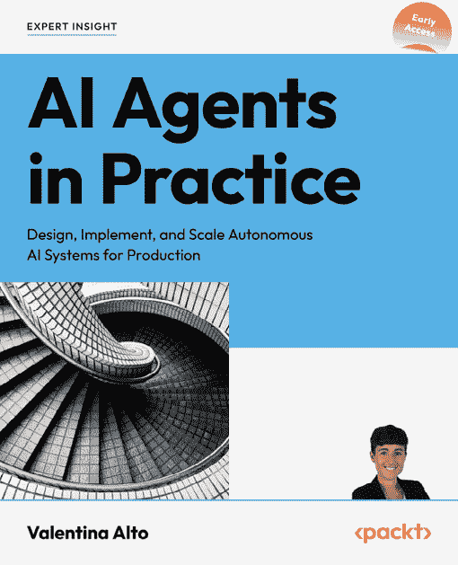

# 答案

# 第一章

1.  不，GPT 模型只执行任务。需要 AI 控制器来动态编排和管理任务。

1.  不，无记忆会话独立处理每个请求并记住什么都不。

1.  是的，RAG 可以从文档中检索特定数据。

1.  是的，从设计到生产和维护，都需要人类的专业知识。

1.  是的，AI 控制器根据输入上下文动态调整任务顺序。

1.  是的，目标是优化开发和时间成本。

1.  是的，这些系统需要计算能力、熟练的团队和大量的预算。

1.  是的，长期记忆可以保留单次会话之外的交流。

1.  是的，向量存储可以存储知识和指令场景。

1.  不，上下文感知对于检测 LLM 请求的关键点至关重要。

# 第二章

1.  错误。类似于 ChatGPT 的 AI 代理是一个高度集成的生成式 AI 系统，具有多个组件。

1.  错误。尽管在线平台有无缝的框架，但系统是使用智能控制器构建的。

1.  真的。在 GenAISys 中的基本规则是：“没有人类，就没有 GenAISys。”

1.  真的。一般来说，GenAISys 的提示将包含一个精确的任务标签，例如“总结此文本。”

1.  真的。在某些情况下，AI 控制器协调者可以根据用户输入确定最可能执行的任务。

1.  错误。GPT-4o 可以原生地执行语义文本相似性任务。

1.  真的。每个项目都不同，需要我们设计和编写的不同类型的对话。

1.  错误。有时，我们需要访问与副驾驶的完整对话历史来做出决定。

1.  错误。GPT-4o 可以在多种语言中运行。

1.  错误。有感知的 AI 代理或自我意识的错觉来自于用户对话的流畅性。

# 第三章

1.  错误。生成式 AI 系统需要 AI 专家团队、ML 专家以及更多专家。此外，计算和因此自动化任务是有成本的。

1.  错误。我们必须持续监控我们构建到 GenAISys 中的功能的成本效益。

1.  真的。当执行向量搜索时，检索系统可以针对数据的具体区域进行定位。

1.  错误。复杂数据可能需要更多维度，但对于简单数据，较小的维度就足够了。

1.  真的。上载向量化数据到 Pinecone 数据库的过程称为 Upserting。

1.  错误。命名空间只是 Pinecone 数据库中记录的一个子集。

1.  真的。命名空间可以用来查询数据集的特定部分。

1.  真的。要执行向量相似度搜索，我们必须将输入嵌入到向量中。

1.  真的。例如，余弦相似度这样的度量标准将使系统能够找到与用户输入数据相似度的向量。然而，根据需要，其他度量标准也是可能的，例如欧几里得距离。

1.  真的。一个全面的 GenAISys 需要一个 AI 控制器、一个 AI 对话代理以及更多。

# 第四章

1.  真。生成式 AI 的复杂性不应成为用户的限制。目标是帮助他们在工作场所。

1.  错误。每个项目都需要特定的接口，这些接口可以用 Web 框架或经典软件接口构建，或者无缝集成到现有软件中。

1.  真假。GenAISys 需要提供 GPT-4o 等生成式 AI 模型无法知道的知识，例如特定公司的数据。然而，在其他情况下，GPT-4o 等模型可以提供足够的信息并很好地完成任务。

1.  错误。你的想象力是无限的！每个项目可能需要标准 ChatGPT 类协作者中不可用的自定义功能。

1.  真。我们可以在 Pinecone 中存储嵌入式指令场景，检索它们，并用这些指令增强生成式 AI 模型的输入。

1.  错误。命名空间可以用来区分指令场景和数据。

1.  真。生成式 AI 模型如 GPT-4o 可以学习一般信息，但不能学习组织内的特定记忆。在模型中微调个人记忆可能成本高昂且耗时。将它们存储在 Pinecone 中并在那里管理可能更有效。

1.  真假。如果用户只想使用具有向量存储的 AI 对话代理，则为真。在多用户对话中，AI 对话代理只是像团队其他成员一样的一个参与者，则为假。

1.  真假。真是因为我们可以向 GenAISys 界面添加查询功能。假是因为我们可以实现响应 RAG 触发器，这些触发器将由对话代理管理。

1.  真。帮助用户最好的方式是提供直观的界面。

# 第五章

1.  错误。无缝的 GenAISys 表明界面是无缝的，但这并不证明完成这项工作没有花费很多努力。

1.  错误。构建 GenAISys 需要大量的工作。

1.  真假。可以构建一个非事件驱动的 AI 应用程序界面，但它可能缺乏灵活性。

1.  真。AI 系统可以模仿人类推理，就像思维链过程一样。

1.  错误。经典的功能序列无法匹配生成式 AI 任务链的创造力，其中每个任务都会对前一个任务的输出做出反应。

1.  错误。CoT 可以是多模态的。

1.  真。CoT 流程可以包括具有中间调用非 AI 函数的 AI 函数。

1.  真。这是推理式 GenAISys 的一个生产性功能。

1.  真。一个不断增长和加速的经济体的挑战需要自动化。AI 是自动化问题解决的有效方式。

1.  真。使用 AI 提高团队的生产力可以减轻困难任务，并为更多决策时间和创造力留出空间。

# 第六章

1.  真。情感记忆在人与促销信息之间建立联系。

1.  真。OpenAI 的 o3 可以进行推理并执行思维链任务。

1.  错误。人类可以在事件发生后多年甚至童年时期记住情感。

1.  错误。例如，像 o3 这样的生成式 AI 模型可以理解复杂的提示和记忆结构。

1.  正确。生成式 AI 模型现在可以在一定程度上处理数值，以及自然语言。

1.  正确。Pinecone 索引可以包含可以用于相似性查询的向量化指令。

1.  正确。早期的生成式 AI 模型只能处理相对简单的提示。现在，它们可以理解任务的复杂步骤并很好地执行。

1.  正确。简单的用户输入可以触发复杂的推理场景。

1.  正确。一个推理模型分析提示并具有通过几个步骤执行复杂任务以处理评论的能力。

1.  错误。生成式 AI 系统可以解释复杂的提示并执行请求的任务集。

# 第七章

1.  错误。DeepSeek 与其他 LLMs 一样进行训练，但采用了高效的技术。

1.  正确。

1.  正确。

1.  错误。DeepSeek-R1 是教师，Llama 模型是学生。

1.  正确。这是一个复杂的循环。R1 是从 V3 中衍生出来的，以学习推理，而 V3 则是从 R1 中学习推理。

1.  正确。处理器注册表可以包含指向 AI 函数的处理器，数量多达我们所需。所有处理器都采用相同的格式使得 GenAISys 高度可扩展和可扩展。

1.  正确。如果我们以独特格式设计处理器，处理器选择机制可以保持不变。如果需要，我们可以增强该机制，但核心过程保持不变。

1.  正确和错误。正确，因为这些模型是在大量数据和上下文中训练的。错误，因为在某些情况下，RAG 将是必要的，例如。在某个时刻，微调也可能有必要，尽管生成式 AI 模型的应用范围持续增长。

1.  正确。一个符合项目规格的良好设计的 GenAISys 将能够根据用户请求和 AI 市场的发展进行扩展。

# 第八章

1.  错误。轨迹可以是任何事件序列。

1.  正确。设计良好的合成数据可以节省许多资源并加速 GenAISys 的发展。

1.  错误。生成式 AI 现在可以解决数学问题和时间序列，并且许多任务已经超越了 LLMs。

1.  错误。扩大 GenAISys 的整个目的就是让每个人都能使用这项技术。

1.  正确。我们可以使用生成式 AI 来设计有效、复杂的提示。

1.  错误。缺失数据的轨迹预测可以应用于广泛的领域，包括火灾灾害。

1.  正确。我们看到 GenAISys 和代理创新不断发布。

# 第九章

1.  正确。向量搜索可以找到其他情况下难以找到的特定单词和表达。

1.  错误。如果检测到不适当的内容，GenAISys 将不会处理。

1.  错误。OpenAI 的 API 提供了广泛的类别。

1.  错误。GenAISys 将标记内容并拒绝请求。

1.  正确。能够适应不断变化的条件的实时服务将给公司带来竞争优势。

1.  正确。生成式 AI 系统正在全速发展，趋势将是多用户、跨领域、多模态，以及更多，因为 AI 正在越来越多地整合传感器。

1.  错误。例如，WhatsApp、Zoom 和 Teams 是经过验证的例子。

1.  正确。通过自动化许多任务并提供交互式 AI 功能，使用 GenAISys 的团队将超越没有这项技术的公司。

1.  正确。客户面板是获取实时反馈的最佳方式。当然，决策权在于开发 GenAISys 的团队。但建议是：如果可能，倾听客户面板所代表的市场的意见。

# 第十章

1.  错误。展示 GenAISys 需要仔细的准备，否则我们将无法应对棘手的问题。

1.  正确和错误。一个可以快速修改的前端界面对于复杂项目的展示可能很有用。然而，如果 GenAISys 已经完全完成，这一步可能就不必要了。这是一个战略性的展示选择。

1.  错误。对于专家来说，一个简单的提醒就足够了。然而，非 AI 专家可能需要一个教育性的解释。

1.  错误。尽管 Pinecone 是一个优秀的向量存储，但最好的向量存储是那个最适合特定项目需求的。

1.  错误。可以在 Hugging Face 和各种平台上找到许多其他模型。最好的模型是那个符合您项目需求的一个。

1.  错误。是否选择开源的生成式 AI 模型取决于我们正在工作的项目的目标。

1.  正确和错误。如果项目需要，我们可能必须实施自己的安全和隐私组件。我们可能开发一切或向现有解决方案添加功能。然而，许多客户可能会要求我们依赖现有的平台框架，如 AWS、Microsoft Azure 和 Google Cloud。

1.  正确和错误。您可能希望通过开发计划控制产品的版本，而不是为每个请求进行定制。然而，某些项目可能需要定制，或者 GenAISys 可能无法覆盖范围。

1.  正确和错误。面对面的会议可以促进更多的人际互动。然而，如果团队分布在不同的地点，远程会议也能完成任务。

1.  错误。在几乎每个项目中，人类和机器资源是我们必须从一开始就解决的约束，以建立我们的信誉。

[packtpub.com](http://packtpub.com)

订阅我们的在线数字图书馆，全面访问超过 7,000 本书和视频，以及行业领先的工具，帮助您规划个人发展并推进您的职业生涯。更多信息，请访问我们的网站。

# 为什么订阅？

+   使用来自 4,000 多位行业专业人士的实用电子书和视频，花更少的时间学习，更多的时间编码。

+   通过为您量身定制的技能计划提高您的学习效果

+   每月免费获得一本电子书或视频

+   完全可搜索，便于轻松访问关键信息

+   复制和粘贴、打印和收藏内容

在[www.packt.com](https://www.packt.com)，您还可以阅读一系列免费技术文章，订阅各种免费通讯，并享受 Packt 书籍和电子书的独家折扣和优惠。

# 其他您可能喜欢的书籍

如果您喜欢这本书，您可能对 Packt 的以下其他书籍感兴趣：

**使用 LLMs、RAG 和知识图谱构建 AI 代理**

Salvatore Raieli, Gabriele Iuculano

ISBN: 978-1-83508-038-2

+   学习 LLMs 的工作原理、结构、用途和限制，并设计 RAG 管道将它们与外部数据链接

+   构建和查询知识图谱以实现结构化上下文和事实基础

+   开发能够规划、推理和使用工具完成任务的人工智能代理

+   将 LLMs 与外部 API 和数据库集成以纳入实时数据

+   应用技术以最小化幻觉并确保输出准确

+   协调多个代理解决复杂的多步骤问题

+   优化提示、内存和上下文处理以适应长期任务

+   在生产环境中部署和监控 AI 代理

**实践中的 AI 代理**

Valentina Alto

ISBN: 978-1-80580-134-4

+   掌握核心代理组件，如 LLMs、内存系统、工具集成和上下文管理

+   使用 LangChain 等框架用代码构建生产就绪的 AI 代理

+   使用问题解决编排模式创建有效的多代理系统

+   实施针对电子商务、客户支持等行业的特定代理

+   为具有短期和长期回忆能力的代理设计健壮的内存架构

+   通过监控、护栏和人工监督应用负责任的 AI 实践

+   优化 AI 代理在 production environments 中的性能和成本

# Packt 正在寻找像您这样的作者

如果您有兴趣成为 Packt 的作者，请访问[authors.packtpub.com](https://authors.packtpub.com)并今天申请。我们已与数千名开发人员和科技专业人士合作，就像您一样，帮助他们将见解分享给全球科技社区。您可以提交一般申请，申请我们正在招募作者的特定热门话题，或提交您自己的想法。

# 分享您的想法

您已完成《构建业务就绪的生成式 AI 系统》，我们非常乐意听到您的想法！如果您从亚马逊购买了这本书，请[点击此处直接转到该书的亚马逊评论页面](https://packt.link/r/1837020698)并分享您的反馈或在该购买网站上留下评论。

您的评论对我们和科技社区非常重要，并将帮助我们确保我们提供高质量的内容。
