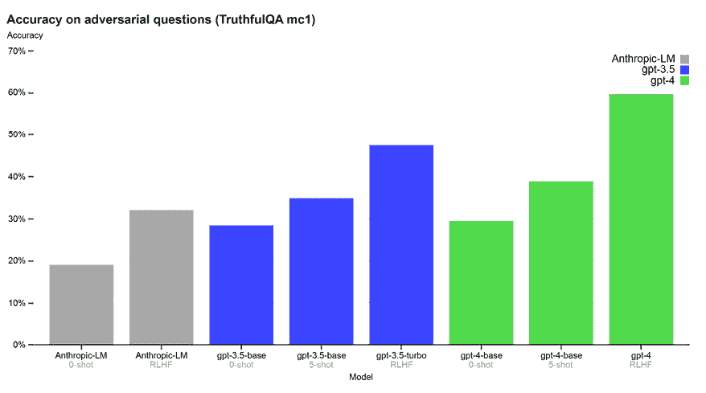
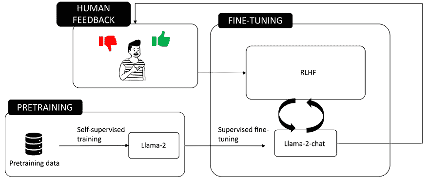
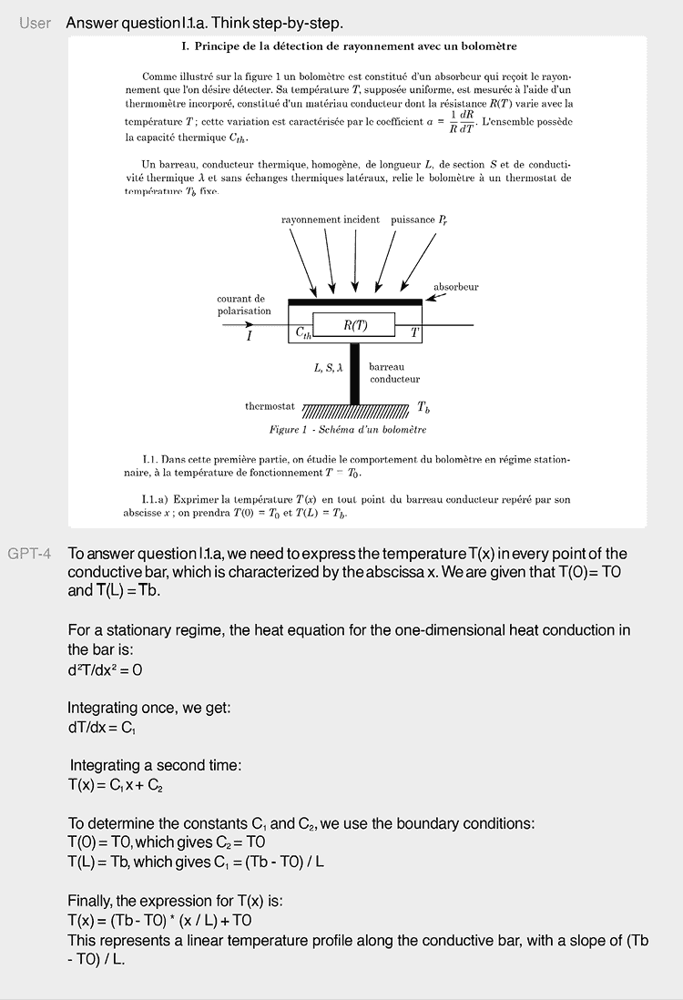

# 第三章：为您的应用选择 LLM

在上一章中，我们看到了在应用中正确编排**大型语言模型**（**LLM**）及其组件是多么关键。事实上，我们看到了并非所有 LLM 都是相同的。下一个关键决策是实际使用哪些 LLM。不同的 LLM 可能具有不同的架构、大小、训练数据、能力和局限性。为您的应用选择正确的 LLM 不是一个简单的决定，因为它可能会对您解决方案的性能、质量和成本产生重大影响。

在本章中，我们将指导你通过选择适合您应用的正确 LLM 的过程。我们将涵盖以下主题：

+   市场上最有前景的 LLM 概述

+   比较 LLM 时使用的主要标准和工具

+   大小与性能之间的权衡

到本章结束时，你应该清楚地了解如何选择适合您应用的正确 LLM，以及如何有效地和负责任地使用它。

# 市场上最有前景的 LLM

过去一年见证了 LLM 研究和开发的空前激增。不同组织发布了或宣布了几个新模型，每个模型都有其独特的特性和功能。其中一些模型是迄今为止最大、最先进的，其性能远远超过了之前的**最先进水平**（**SOTA**）。其他模型则更轻量，但在特定任务上更加专业化。

在本章中，我们将回顾截至 2024 年市场上一些最有前景的 LLM（大型语言模型）。我们将介绍它们的背景、关键发现和主要技术。我们还将比较它们在各种基准和任务上的性能、优势和局限性。我们还将讨论它们在人工智能和社会未来的潜在应用、挑战和影响。

## 专有模型

专有 LLM 是由私人公司开发和拥有的，它们不公开代码。它们通常也需付费才能使用。

专有模型提供一系列优势，包括更好的支持和维护，以及安全性和一致性。由于它们的复杂性和训练数据集，它们在泛化方面通常优于开源模型。另一方面，它们充当一个“黑盒”，这意味着所有者不会向开发者公开源代码。

在接下来的几节中，我们将介绍截至 2023 年 8 月市场上最受欢迎的三种专有 LLM。

### GPT-4

于 2023 年 3 月发布，GPT-4 与其新发布的“堂兄弟”GPT-4 Turbo 一起，是**OpenAI**开发的最新模型之一，在撰写本书时（根据其首席执行官山姆·奥特曼的确认，OpenAI 已经在开发 GPT-5），是市场上表现最好的模型之一。

它属于**生成预训练转换器**（**GPT**）模型类别，这是一种由 OpenAI 引入的仅包含解码器的转换器架构。以下图表展示了基本架构：

图 3.1：仅解码器转换器的高级架构

如前图所示，仅解码器架构仍然包括我们在*第一章*中介绍过的转换器架构的主要元素，包括*位置嵌入*、*多头注意力*和*前馈*层。然而，在这个架构中，模型仅由一个解码器组成，该解码器被训练根据前面的标记来预测序列中的下一个标记。与编码器-解码器架构不同，仅解码器设计缺少一个用于总结输入信息的显式编码器。相反，信息隐含地编码在解码器的隐藏状态中，该状态在生成过程的每一步都会更新。

现在，我们将探讨 GPT-4 相较于先前版本的一些改进。

GPT-4 与 GPT 系列中的先前模型一样，是在公开可用的和 OpenAI 许可的数据集上训练的（OpenAI 没有披露训练集的确切组成）。

此外，为了使模型更符合用户的意图，训练过程还涉及了**基于人类反馈的强化学习**（**RLHF**）训练。

**定义**

RLHF 是一种旨在使用人类反馈作为评估 LLM 生成输出的指标，然后使用该反馈进一步优化模型的技术。实现该目标主要有两个步骤：

1.  基于人类偏好训练奖励模型。

1.  优化 LLM 以适应奖励模型。这一步骤是通过强化学习完成的，它是一种机器学习范式，其中代理通过与环境的交互来学习做出决策。代理根据其行为获得奖励或惩罚的反馈，其目标是通过对行为进行试错来不断调整其行为，以最大化累积奖励。

通过 RLHF（强化学习与人类反馈），得益于奖励模型，LLM 能够从人类偏好中学习，并更符合用户的意图。

以 ChatGPT 为例。该模型集成了各种训练方法，包括无监督预训练、监督微调、指令调整和 RLHF。RLHF 组件涉及通过使用来自人类训练师的反馈来训练模型预测人类偏好。这些训练师审查模型的响应并提供评分或更正，指导模型生成更有帮助、更准确和更符合预期的响应。

例如，如果一个语言模型最初生成的输出不太有帮助或不准确，人类训练师可以提供反馈，表明首选的输出。然后，该模型使用这些反馈来调整其参数并改进未来的响应。这个过程迭代地进行，模型从一系列人类判断中学习，以更好地符合人类标准认为的有用或适当的内容。

GPT-4 在常识推理和分析技能方面表现出卓越的能力。它已经与包括我们在第一章中提到的**大规模多任务语言理解**（MMLU）在内的 SOTA 系统进行了基准测试。在 MMLU 上，GPT-4 不仅在英语上，而且在其他语言上也优于之前的模型。

下面的插图显示了 GPT-4 在 MMLU 上的表现：

图 3.2：GPT-4 在 MMLU 上的 3 次射击准确率（来源：[`openai.com/research/gpt-4`](https://openai.com/research/gpt-4)）

除了 MMLU 之外，GPT-4 在各种最先进（SOTA）系统和学术考试上进行了基准测试，正如您可以从以下图表中看到：

图 3.3：GPT 在学术和专业考试中的表现（来源：[`arxiv.org/pdf/2303.08774.pdf`](https://arxiv.org/pdf/2303.08774.pdf)）

**注意**：在前面的图表中，您可以看到两个版本的 GPT-4，有视觉和无视觉（以及 GPT-3.5 用于基准测试）。这是因为 GPT-4 是一个多模态模型，意味着它可以接受图像作为输入，除了文本。然而，在本章中，我们将仅对其文本能力进行基准测试。

与其前辈（GPT-3.5 和 GPT-3）相比，GPT-4 的一个显著改进是幻觉风险的明显降低。

**定义**

幻觉是一个描述 LLMs 生成不正确、无意义或不真实的文本，但看起来似乎合理或连贯的现象。例如，一个 LLM 可能会虚构一个与来源或常识相矛盾的事实，一个不存在的名字，或者一个没有意义的句子。

幻觉可能发生，因为大型语言模型（LLMs）并非存储或检索事实信息的数据库或搜索引擎。相反，它们是统计模型，从大量文本数据中学习并基于它们学到的模式和概率生成输出。然而，这些模式和概率可能并不反映真相或现实，因为数据可能是不完整、嘈杂或存在偏见的。此外，LLMs 的上下文理解和记忆有限，因为它们一次只能处理一定数量的标记并将它们抽象为潜在表示。因此，LLMs 可能会生成不支持任何数据或逻辑的文本，但这些文本是最可能或与提示最相关的。

事实上，尽管它仍然不是 100%可靠的，但 GPT-4 在 TruthfulQA 基准测试中取得了很大的进步，这些基准测试测试了模型区分事实和错误陈述的能力（我们在*第一章*的*模型评估*部分介绍了 TruthfulQA 基准测试）。

在这里，你可以看到一幅插图，比较了 GPT-4 在 TruthfulQA 基准测试中的结果与 GPT-3.5（OpenAI 的 ChatGPT 背后的模型）和 Anthropic-LM（我们将在下一节中介绍这个模型）的结果。

图 3.4：在 TruthfulQA 基准测试中的模型比较（来源：[`openai.com/research/gpt-4`](https://openai.com/research/gpt-4)）

最后，随着 GPT-4 的推出，OpenAI 做出了额外的努力使其更安全、更对齐，从一开始就组建了一个由 50 多位专家组成的团队，这些专家在 AI 对齐风险、隐私和网络安全等领域，目标是了解这样一个强大模型的风险程度以及如何预防这些风险。

**定义**

对齐是指 LLM（大型语言模型）在多大程度上以对人类用户有用且无害的方式行事。例如，如果一个 LLM 生成的文本是准确、相关、连贯且尊重的，那么它可以被认为是对齐的。如果一个 LLM 生成的文本是虚假的、误导性的、有害的或冒犯性的，那么它可以被认为是未对齐的。

多亏了这次分析，在训练 GPT-4 时收集并使用了更多数据，以减轻其潜在风险，从而使其风险比其前身 GPT-3.5 有所降低。

### Gemini 1.5

Gemini 1.5 是由谷歌开发并于 2023 年 12 月发布的 SOTA（最先进的技术）生成式 AI 模型。与 GPT-4 一样，Gemini 被设计成多模态，这意味着它可以处理和生成各种模态的内容，包括文本、图像、音频、视频和代码。它基于一个**专家混合**（**MoE**）的 transformer。

**定义**

在 transformer 架构的背景下，MoE 指的是在其层中包含多个专门子模型（称为“专家”）的模型。每个专家都是一个神经网络，旨在更有效地处理不同类型的数据或任务。MoE 模型使用门控机制或路由器来确定哪个专家应该处理给定的输入，这使得模型能够动态分配资源并专门处理某些类型的信息。这种方法可以导致更高效的训练和推理，因为它使得模型在规模和复杂性上可以扩展，而不会导致计算成本的成比例增加。

Gemini 有多种尺寸，包括 Ultra、Pro 和 Nano，以满足从数据中心到移动设备的不同计算需求。要使用 Gemini，开发者可以通过为不同模型变体提供的 API 访问它，从而将其功能集成到应用程序中。

与其前一代版本 Gemini 1.0 相比，当前模型在文本、视觉和音频任务上表现更优，如下面的截图所示：

图 3.5：Gemini 1.5 Pro 和 Ultra 与其前一代版本 1.0 的比较（来源：[`storage.googleapis.com/deepmind-media/gemini/gemini_v1_5_report.pdf`](https://storage.googleapis.com/deepmind-media/gemini/gemini_v1_5_report.pdf)）

类似地，它在数学、科学、推理以及编码和多元语言等领域也展现了卓越的能力：

图 3.6：Gemini 1.5 Pro 与 Gemini 1.0 Pro 和 Ultra 在不同基准测试中的比较（来源：[`storage.googleapis.com/deepmind-media/gemini/gemini_v1_5_report.pdf`](https://storage.googleapis.com/deepmind-media/gemini/gemini_v1_5_report.pdf)）

注意，Gemini 1.5 Pro 在多个领域的许多基准测试中表现优于 Gemini 1.0 Ultra（后者体积显著更大）。截至今天，您可以通过 gemini.[google.com](https://google.com) 的网页应用程序免费试用 Gemini Pro，而 Gemini Ultra 则可通过带有月费的付费订阅获得。另一方面，专为移动设备定制的 Gemini Nano 可以通过 Google AI Edge SDK for Android 在具备能力的 Android 设备上运行。请注意，截至 2024 年 4 月，此 SDK 仍处于早期访问预览阶段，您可以在 [`docs.google.com/forms/d/e/1FAIpQLSdDvg0eEzcUY_-CmtiMZLd68KD3F0usCnRzKKzWb4sAYwhFJg/viewform`](https://docs.google.com/forms/d/e/1FAIpQLSdDvg0eEzcUY_-CmtiMZLd68KD3F0usCnRzKKzWb4sAYwhFJg/viewform) 申请早期访问计划。最后，开发人员也可以通过 Google AI Studio 的 REST API 使用 Gemini Pro 和 Ultra。

### Claude 2

Claude 2，代表通过用户数据和专业知识进行宪法规模对齐，是由前 OpenAI 研究员创立的研究公司 Anthropic 开发的 LLM。它于 2023 年 7 月宣布。

Claude 2 是一个基于 transformer 的 LLM，它通过无监督学习、RLHF 和 **宪法 AI**（**CAI**）在互联网上公开可用的信息和专有数据混合训练而成。

CAI 是 Claude 的一个真正独特之处。事实上，Anthropic 对 Claude 2 的安全原则对齐给予了极大的关注。更具体地说，Anthropic 开发了这种独特的 CAI 技术，该技术在 2022 年 12 月发表的论文 *宪法 AI：从 AI 反馈中无害* 中被披露。

CAI 旨在通过防止产生有害或歧视性输出，不帮助人类参与非法或不道德的活动，以及广泛创建一个有益、诚实且无害的 AI 系统，来使模型更安全并与其人类价值观和意图保持一致。为了实现这一点，它使用一系列原则来指导模型的行为和输出，而不是仅仅依赖于人类反馈或数据。这些原则来自各种来源，例如联合国人权宣言、信任和安全最佳实践、其他 AI 研究实验室提出的原则、非西方观点和实证研究。

CAI 在训练过程的两个阶段使用这些原则：

+   首先，该模型被训练使用原则和一些示例来批评和修改自己的响应。

+   第二，该模型通过强化学习进行训练，但不是使用人类反馈，而是使用基于原则生成的 AI 反馈来选择更无害的输出。

以下插图展示了根据 CAI 技术进行的训练过程：

图 3.7：根据 CAI 技术进行的 Claude 的训练过程（来源：[`arxiv.org/abs/2212.08073`](https://arxiv.org/abs/2212.08073))

Claude 2 的另一个特点是上下文长度，其限制为 100,000 个标记。这意味着用户可以输入更长的提示，例如页面的技术文档或甚至一本书，无需嵌入。此外，与其他 LLM 相比，该模型还可以生成更长的输出。

最后，Claude 2 在处理代码时也展示了相关能力，在 HumanEval 基准测试中得分 71.2%。

**定义**

HumanEval 是评估 LLM 代码生成能力的基准。它由 164 个由人类编写的 Python 编码问题组成，每个问题都有一个提示、一个解决方案和一个测试套件。这些问题涵盖了各种主题，如数据结构、算法、逻辑、数学和字符串操作。该基准可以用来衡量 LLM 输出的功能性正确性、语法有效性和语义一致性。

总体而言，Claude 2 是一个非常有趣的模型，也是 GPT-4 的竞争对手，值得关注。它可以通过 REST API 或直接通过 Anthropic 的 beta 聊天体验（截至 2023 年 8 月仅限美国和英国用户）进行消费。

以下比较表展示了三个模型之间的主要区别：

|  | **GPT-4** | **Gemini** | **Claude 2** |
| --- | --- | --- | --- |
| **公司或机构** | OpenAI | Google | Anthropic |
| **首次发布** | 2023 年 3 月 | 2023 年 12 月 | 2023 年 7 月 |
| **架构** | 基于 Transformer，仅解码器 | 基于 Transformer | 基于 Transformer |
| **大小和变体** | 参数未正式公布两种上下文长度变体：GPT-4 8K 标记 GPT-4 32K 标记 | 从最小到最大有三个尺寸：Nano、Pro 和 Ultra | 参数未正式公布 |
| **如何使用** | OpenAI 开发者平台上的 REST API 使用 OpenAI Playground 在[`platform.openai.com/playground`](https://platform.openai.com/playground) | Google AI Studio 上的 REST API 使用 Gemini 在[`gemini.google.com/`](https://gemini.google.com/) | 在[`www.anthropic.com/claude`](https://www.anthropic.com/claude)编译表单后的 REST API |

表 3.1：GPT-4、PaLM 2 和 Claude 2 的比较表

除了专有模型之外，目前市场上还有大量开源的 LLM（大型语言模型）。让我们在下一节中讨论其中的一些。

## 开源模型

开源模型的优势在于，根据定义，开发者可以完全看到并访问源代码。在 LLM 的背景下，这意味着以下内容：

+   你对架构有主要控制权，这意味着你还可以修改你将在项目中使用的本地版本。这也意味着它们不太可能受到模型所有者对源代码进行的潜在更新的影响。

+   有可能从头开始训练你的模型，除了对专有模型也适用的经典微调之外。

+   免费使用，这意味着在使用这些 LLM 时，你不会产生任何费用，与那些按使用付费的专有模型形成对比。

为了比较开源模型，在这本书中，我们将参考独立的 Hugging Face Open LLM 排行榜（你可以在[`huggingface.co/spaces/HuggingFaceH4/open_llm_leaderboard`](https://huggingface.co/spaces/HuggingFaceH4/open_llm_leaderboard)找到），这是一个旨在评估和比较 LLM 在各种**自然语言理解**（**NLU**）任务上性能的项目。该项目托管在 Hugging Face Spaces 上，这是一个用于创建和分享机器学习应用的平台。

Open LLM 排行榜使用四个主要的评估基准，我们在*第一章*的*模型评估*部分进行了介绍：

+   **AI2 推理挑战**（**ARC**）：小学科学问题和复杂的 NLU 任务。

+   **HellaSwag**：常识推理。

+   **MMLU**：包括数学、计算机科学和法律等多个领域的任务。

+   **TruthfulQA**：评估模型在生成答案时的真实性。

尽管这些只是众多 LLM 基准测试中的一部分，但我们将坚持使用这个排行榜作为参考评估框架，因为它被广泛采用。

### LLaMA-2

**大型语言模型 Meta AI 2**（**LLaMA-2**）是 Meta 开发的新一代模型，于 2023 年 7 月 18 日向公众公布，开源且免费（其首个版本最初仅限于研究人员）。

它是一个**自回归**模型，具有优化且仅包含解码器的 transformer 架构。

**定义**

在 Transformer 的上下文中，自回归的概念指的是模型在给定所有先前标记的条件下预测序列中的下一个标记。这是通过在输入中屏蔽未来标记来完成的，这样模型就只能关注过去标记。例如，如果输入序列是“The sky is blue”，模型将首先预测“The”，然后是“sky”，接着是“is”，最后是“blue”，使用掩码隐藏每个预测之后的标记。

LLaMA-2 模型有三种大小：70 亿、130 亿和 700 亿参数。所有版本都在 2000 万亿标记上训练，上下文长度为 4092 个标记。

此外，所有模型大小都附带一个“聊天”版本，称为 LLaMA-2-chat，与基础模型 LLama-2 相比，它在通用对话场景中更加灵活。

**注意**

在 LLM 的背景下，**基础模型**与“聊天”或**助手模型**之间的区别主要在于它们的训练和预期用途：

+   基础模型：这些模型在大量的文本数据上训练，通常来自互联网，其主要功能是在给定上下文中预测下一个单词，这使得它们在理解和生成语言方面非常出色。然而，它们可能并不总是精确或专注于特定指令。

+   助手模型：这些模型最初是基础 LLM，但通过包含指令和模型尝试遵循这些指令的输入输出对进行进一步微调。它们通常使用 RLHF 来细化模型，使其更擅长提供帮助、诚实和无害。因此，它们不太可能生成有问题的文本，更适合聊天机器人内容和内容生成等实际应用。例如，助手模型 GPT-3.5 Turbo（ChatGPT 背后的模型）是完成模型 GPT-3 的微调版本。

从本质上讲，虽然基础模型提供了对语言的广泛理解，但助手模型经过优化以遵循指令并提供更准确和上下文相关的响应。

LLaMA-2-chat 是通过一个包含两个主要步骤的微调过程开发的：

1.  **监督微调**：这一步骤涉及在公开可用的指令数据集和超过 100 万人的标注上进行模型微调，使其在对话用例中更有帮助和安全。微调过程使用所选提示列表来引导模型输出，并使用一个鼓励多样性和相关性的损失函数（这就是为什么它被称为“监督”）。

1.  **RLHF**：正如我们在介绍 GPT-4 时所看到的，RLHF 是一种旨在使用人类反馈作为评估 LLM 生成输出的指标的技术，然后使用该反馈进一步优化模型。

以下是如何进行 LLaMA 训练过程的说明：

图 3.8：两步微调以获得 LLaMa-2 聊天（来源：[`ai.meta.com/resources/models-and-libraries/llama/`](https://ai.meta.com/resources/models-and-libraries/llama/))

要访问该模型，您需要在 Meta 的网站上提交一个请求（表格可在 [`ai.meta.com/resources/models-and-libraries/llama-downloads/`](https://ai.meta.com/resources/models-and-libraries/llama-downloads/) 找到）。一旦提交请求，您将收到一封电子邮件，其中包含您将能够下载以下资产的 GitHub 仓库：

+   模型代码

+   模型权重

+   README（用户指南）

+   负责任的使用指南

+   许可证

+   可接受的使用政策

+   模型卡

### Falcon LLM

Falcon LLM 是 LLM 的一种新趋势的表示，包括构建更轻的模型（参数更少）并专注于训练数据集的质量。事实上，这是一个事实，即像 GPT-4 这样具有万亿参数的复杂模型在训练阶段和推理阶段都非常沉重。这暗示了需要高且昂贵的计算能力（GPU 和 TPU 驱动）以及漫长的训练时间。

Falcon LLM 是阿布扎比的 **技术创新研究所**（**TII**）于 2023 年 5 月推出的开源模型。它是一个自回归的、仅解码器的变压器，在 1 万亿个标记上训练，拥有 40 亿个参数（尽管它也以 70 亿参数的轻量版本发布）。与 LlaMA 类似，Falcon LLM 还附带了一个经过微调的变体，称为“Instruct”，该变体旨在遵循用户的指令。

**定义**

Instruct 模型专门用于遵循短格式指令。指令遵循是一个任务，其中模型必须执行一个自然语言命令或查询，例如“写一首关于猫的俳句”或“告诉我巴黎的天气。”Instruct 微调模型是在一个包含指令及其相应输出的大型数据集上训练的，例如斯坦福 Alpaca 数据集。

根据开放 LLM 排行榜，自发布以来，Falcon LLM 一直位居全球前列，仅次于一些 LlaMA 的版本。

所以，问题可能就是：一个“仅有”40 亿参数的模型是如何表现得如此出色的？实际上，答案在于数据集的质量。Falcon 是使用专用工具开发的，并集成了独特的数据管道，能够从网络数据中提取有价值的内容。该管道通过采用广泛的过滤和去重技术来设计，以提取高质量的内容。由此产生的数据集，称为 *RefinedWeb*，已由 TII 在 Apache-2.0 许可下发布，可在 [`huggingface.co/datasets/tiiuae/falcon-refinedweb`](https://huggingface.co/datasets/tiiuae/falcon-refinedweb) 找到。

通过结合优质数据与这些优化，Falcon 在利用大约 75%和 80%的 GPT-3 和 PaLM-62B 的训练计算预算的同时，实现了显著的性能。

### Mistral

我们将要介绍的第三个也是最后一个开源模型系列是 Mistral，由 Mistral AI 开发，该公司成立于 2023 年 4 月，由一支曾在 Meta Platforms 和 Google DeepMind 工作的 AI 科学家团队创立。总部位于法国，该公司通过筹集大量资金和发布开源 LLM，迅速在 AI 开发领域树立了声誉，强调透明性和可访问性的重要性。

Mistral 模型，特别是 Mistral-7B-v0.1，是一个仅具有解码器的 Transformer，拥有 73 亿参数，专为生成文本任务设计。它以其创新的架构选择而闻名，如**分组查询注意力**（**GQA**）和**滑动窗口注意力**（**SWA**），这些选择使它在基准测试中优于其他模型。

**定义**

GQA 和 SWA 是旨在提高 LLM 效率和性能的机制。

GQA 是一种技术，与标准全注意力机制相比，它允许更快的推理时间。它是通过将注意力机制的查询头部分成组，每组共享一个单一的关键头和价值头来实现的。

SWA 用于高效地处理较长的文本序列。它将模型的注意力扩展到固定窗口大小之外，允许每一层引用前一层的多个位置。这意味着某一层的隐藏状态可以关注前一层特定范围内的隐藏状态，从而使得模型能够访问更远距离的标记，并以降低推理成本的方式管理不同长度的序列。

该模型还提供了一个针对通用能力进行了微调的变体。这个变体被称为 Mistral-7B-instruct，它在 MT-Bench（一个使用 LLM 作为评判标准的评估框架）上优于市场上所有其他 70 亿参数的 LLM（截至 2024 年 4 月）。

与许多其他开源模型一样，Mistral 可以通过 Hugging Face Hub 进行消费和下载。

**注意**

2024 年 2 月，Mistral AI 和微软签署了一项多年合作协议，以加速 AI 创新。这次合作将利用微软的 Azure AI 超级计算基础设施来支持 Mistral AI 的 LLM 的开发和部署。Mistral AI 的模型，包括其高级模型 Mistral Large，将通过 Azure AI Studio 和 Azure 机器学习模型目录提供给客户。该合作的目标是扩大 Mistral AI 在全球市场的影响力，并促进持续的研究合作。

下面的比较表提供了三个模型之间的主要区别：

|  | **LlaMA** | **Falcon LLM** | **Mistral** |
| --- | --- | --- | --- |
| **公司或机构** | Meta | **技术创新研究所**（**TII**） | Mistral AI |
| **首次发布** | 2023 年 7 月 | 2023 年 5 月 | 2023 年 9 月 |
| **架构** | 自回归变换器，仅解码器 | 自回归变换器，仅解码器 | 变换器，仅解码器 |
| **大小和变体** | 三种大小：7B、13B 和 70B，以及微调版本（聊天） | 两种大小：7B 和 40B，以及微调版本（指令） | 7B 大小以及微调版本（指令） |
| **许可证** | 可在[`ai.meta.com/resources/models-and-libraries/llama-downloads/`](https://ai.meta.com/resources/models-and-libraries/llama-downloads/)获取定制商业许可证 | 商业 Apache 2.0 许可证 | 商业 Apache 2.0 许可证 |
| **如何使用** | 在[`ai.meta.com/resources/models-and-libraries/llama-downloads/提交请求表单并下载 GitHub 仓库`](https://ai.meta.com/resources/models-and-libraries/llama-downloads/)，也可在 Hugging Face Hub 使用 | 下载或使用 Hugging Face Hub 推理 API/端点 | 下载或使用 Hugging Face Hub 推理 API/端点或 Azure AI Studio |

表 3.2：LLM 比较表

# 超越语言模型

到目前为止，我们只介绍了语言特定的基础模型，因为这是本书的重点。然而，在 AI 驱动应用的环境中，值得提及的是，还有一些可以处理不同于文本的数据的基础模型，这些数据可以被嵌入和编排。

在这里，你可以找到一些市场上**大型基础模型**（**LFMs**）的例子：

+   **Whisper**：这是一个由 OpenAI 开发的多语言通用语音识别模型，能够将多种语言的语音进行转录和翻译。它在一个包含多种音频的大型数据集上进行了训练，并且还是一个多任务模型，能够执行多语言语音识别、语音翻译、口语语言识别和语音活动检测。

+   **Midjourney**：由同名独立研究实验室开发，Midjourney 基于一个序列到序列的变换器模型，它接受文本提示并输出一组与提示相匹配的四张图像。Midjourney 被设计成艺术家和创意专业人士的工具，他们可以使用它进行艺术概念的快速原型设计、灵感或实验。

+   **DALL-E**：与之前的类似，DALL-E 是由 OpenAI 开发的，它使用 GPT-3 的 120 亿参数版本，在文本-图像对的数据集上训练，从自然语言描述生成图像。

想法是我们可以在我们的应用程序中将多个 LFMs 组合和编排，以实现非凡的结果。例如，假设我们想要写一篇关于年轻厨师访谈的评论并发布在 Instagram 上。可能涉及的模型可能如下：

+   **Whisper**会将访谈音频转换为文本。

+   一个带有网络插件的**LLM**，例如 Falcon-7B-instruct，将推断年轻厨师的名字并在互联网上搜索以检索其传记。

+   另一个**LLM**，例如 LlaMA，将处理转录并生成一个具有 Instagram 帖子风格的评论。我们也可以要求同一个模型生成一个提示，让下一个模型根据帖子内容生成图片。

+   **Dall-E**将根据 LLM 生成的提示生成图像。

我们将为我们的 LFMs 流程添加一个 Instagram 插件，以便应用程序能够在我们个人资料上发布整个评论，包括插图。

最后，有一些新兴的 LFMs 旨在实现多模态，这意味着它们可以用一个架构处理多种数据格式。GPT-4 本身就是一个例子。

下面的截图显示了 OpenAI 早期与 GPT-4 视觉实验的一个示例，展示了它对图像中幽默方面的理解：

图 3.9：GPT-4 视觉的早期实验（来源：[`openai.com/research/gpt-4`](https://openai.com/research/gpt-4)）

下面的截图显示了 GPT-4 的早期版本的一个示例，展示了它如何能够详细理解和解释图表：

图 3.10：GPT-4 视觉的早期实验（来源：[`openai.com/research/gpt-4`](https://openai.com/research/gpt-4)）

下面的示例显示了 GPT-4 的早期版本如何理解和解决复杂的数学问题，同时提供其响应的相应理由：

图 3.11：GPT-4 视觉的早期实验（来源：[`openai.com/research/gpt-4`](https://openai.com/research/gpt-4)）

GPT-4 只是**大型多模态模型**（LMM）的一个例子，它代表了我们在未来几年可能会见证的趋势。

# 选择合适的 LLM 的决策框架

在前面的段落中，我们介绍了一些目前市场上最有前途的 LLM。现在的问题是：在我的应用程序中我应该使用哪一个？事实是，这个问题没有直接的答案。

## 考虑事项

在选择适用于您的应用程序的 LLM 时，有许多因素需要考虑。这些因素还需要在两种情况下进行说明：专有和开源 LLM。以下是一些在选择 LLM 时您可能想要考虑的因素和权衡：

+   **大小和性能**：我们注意到，更复杂的模型（这意味着具有高参数数量）往往具有更好的性能，特别是在参数知识和泛化能力方面。然而，模型越大，处理输入和生成输出所需的计算和内存就越多，这可能导致更高的延迟，正如我们将看到的，还有更高的成本。

+   **成本和托管策略**：在我们将 LLM 整合到我们的应用程序中时，我们必须考虑两种类型的成本：

    +   **模型消费成本**：这指的是我们为消费模型所支付的费用。像 GPT-4 或 Claude 2 这样的专有模型需要支付费用，这通常与处理的令牌数量成比例。另一方面，像 LlaMA 或 Falcon LLM 这样的开源模型是免费使用的。

    +   **模型托管成本**：这指的是您的托管策略。通常，专有模型托管在私有或公共超大规模计算器中，以便通过 REST API 进行消费，您无需担心底层基础设施（例如，GPT-4 托管在微软 Azure 云中构建的超计算机）。对于开源模型，我们通常需要提供自己的基础设施，因为那些模型可以本地下载。当然，模型越大，所需的计算能力就越强。

        **注意**

        在开源模型的背景下，另一种消费这些模型的方式是使用 Hugging Face 推理 API。免费版本允许您以有限的速率在 Hugging Face 上托管的共享基础设施上测试和评估所有可用的 LLM。对于生产用例，Hugging Face 还提供推理端点，这样您就可以轻松地将 LLM 部署在专用且完全管理的基础设施上，并有可能配置区域、计算能力和安全级别等参数，以满足您在延迟、吞吐量和合规性方面的限制。

        推理端点的定价信息可在[`huggingface.co/docs/inference-endpoints/pricing`](https://huggingface.co/docs/inference-endpoints/pricing)公开获取。

+   **定制**：这可能是在决定采用哪种模型之前想要评估的要求。实际上，并非所有模型在定制方面都同样灵活。当我们谈论定制时，我们指的是两种活动：

    +   **微调**：这是略微调整 LLM 参数以更好地适应特定领域的过程。所有开源模型都可以进行微调。当涉及到专有模型时，并非所有 LLM 都可以进行微调：例如，OpenAI 的 GPT-3.5 可以进行微调，而 GPT-4-0613 的微调过程仍然是实验性的，并且需要根据 OpenAI 的要求进行（截至 2023 年 12 月）。

    从此以后，了解您是否需要在应用程序中进行微调，并据此做出决定是很重要的。

    +   **从头开始训练**：如果您真的需要一个对您的领域知识非常具体的 LLM，您可能需要从头开始重新训练模型。要从头开始训练一个 LLM，而无需重新发明架构，您可以下载开源 LLM，并在自定义数据集上简单地重新训练它们。当然，这隐含着我们有权访问源代码，而我们与专有 LLM 合作时并非如此。

+   **特定领域的能力**：我们注意到评估 LLM 性能最流行的方式是跨领域平均不同的基准测试。然而，也有一些基准测试是针对特定能力量身定制的：如果 MMLU 衡量 LLM 的泛化文化和常识推理，那么 TruthfulQA 更关注 LLM 的对齐，而 HumanEval 则针对 LLM 的编码能力。

从此以后，如果您有一个特定的用例在心中，您可能希望使用在特定基准测试中表现最佳的模型，而不是在所有基准测试中平均表现最佳的模型。也就是说，如果您在寻找卓越的编码能力，可能会选择 Claude 2；如果您在寻找分析推理能力，可能会选择 PaLM 2。另一方面，如果您需要一个包含所有这些能力的模型，GPT-4 可能是您的正确选择。

选择特定领域的模型也是节省模型复杂度的一种方式。问题是，如果您需要将其用于特定用例，可能只需要一个相对较小的模型（例如，LlaMA-7B-instruct），这样就可以带来成本和性能方面的所有好处。

**注意**

如果您正在寻找**极其**具体的 LLM，有许多模型是在特定领域的技术文档上训练的。例如，2023 年初，斯坦福大学**基础模型研究中心**（**CRFM**）和 MosaicML 宣布发布了 BioMedLM，这是一个仅具有解码器功能的基于 Transformer 的 2.7 亿参数 LLM，它在生物医学摘要和论文上进行了训练。

另一个例子是 BloombergGPT，这是一个由彭博社开发的针对金融领域的 50 亿参数大型语言模型（LLM），它基于彭博社广泛的数据源，在包含 3630 亿个标记的数据集上进行训练，这可能是迄今为止最大的特定领域数据集，并额外增加了来自通用数据集的 3450 亿个标记。

为了使这个决策框架更加实用，让我们考虑以下关于 TechGen 公司的假设案例研究。

## 案例研究

TechGen Solutions，一家领先的 AI 驱动分析服务提供商，在为下一代客户交互系统选择两个高级语言模型（GPT-4 和 LLaMa-2）之间面临抉择。他们需要一个能够处理各种客户查询、提供准确技术信息并能与他们的专有软件集成的强大语言模型。以下是他们可选的方案：

+   GPT-4：由 OpenAI 开发，GPT-4 以其庞大的参数数量和能够处理文本和图像输入的能力而闻名。

+   LLama 2：由 Meta AI 创建，LLama 2 是一个开源模型，因其易用性和在小数据集上的性能而受到赞誉。

以下是他们做出决策时考虑的因素：

+   性能：TechGen 评估了这些模型的表现，特别是在生成技术内容和代码方面，GPT-4 表现出了更高的准确性。

+   集成：与 TechGen 系统的集成简便性至关重要，GPT-4 由于其广泛采用，可能提供更无缝的兼容性。

+   成本：虽然 LLama 2 在特定条件下对商业用途免费，但 GPT-4 是有成本的，TechGen 必须将其纳入他们的决策考量。

+   未来保障：TechGen 考虑了每个模型的长期可行性，包括更新和改进的潜力。

基于这些考虑，TechGen 选择了 GPT-4，受其生成复杂、技术性回应的优越性能和其多语言能力所吸引，这些能力与他们的国际扩张计划相吻合。这一决定还受到 GPT-4 图像处理功能的影响，TechGen 预计随着他们将其更多的多媒体内容融入客户服务，这一功能将变得越来越重要。

TechGen 选择 GPT-4 而非 LLama 2，是由其对一个高性能、多功能的语言模型的需求所驱动，该模型能够随着其日益增长的全球影响力和多样化的客户需求而扩展。虽然 LLama 2 的开源特性和成本效益颇具吸引力，但 GPT-4 的高级功能和未来保障特性为 TechGen 的雄心勃勃目标提供了更有说服力的理由。

注意，这些决策因素并非旨在成为决定在应用中嵌入哪些模型的详尽指南。尽管如此，这些因素在设置你的应用流程时仍是有用的反思元素，这样你可以确定你的需求，然后筛选出那些更适合你目标的 LLM。

# 摘要

本章涵盖了市场上一些最有前景的 LLM。它首先区分了专有模型和开源模型，并详细讨论了所有相关的优缺点。接着深入探讨了 GPT-4、PaLM-2、Claude 2、LLaMa-2、Falcon LLM 和 MPT 的架构和技术特性，并增加了一个关于一些 LMM 的章节。最后，提供了一个框架，帮助开发者决定在构建 AI 应用时选择哪些 LLM。鉴于你的行业特定场景，这对于从你的应用中获得最大影响至关重要。

从下一章开始，我们将开始在实际应用中与 LLM 进行动手操作。

# 参考文献

+   GPT-4 技术报告。[`cdn.openai.com/papers/gpt-4.pdf`](https://cdn.openai.com/papers/gpt-4.pdf)

+   训练短，测试长：线性偏差的注意力使输入长度外推成为可能。[`arxiv.org/pdf/2108.12409.pdf`](https://arxiv.org/pdf/2108.12409.pdf)

+   宪法 AI：从 AI 反馈中确保无害。[`arxiv.org/abs/2212.08073`](https://arxiv.org/abs/2212.08073)

+   Hugging Face 推理端点。[`huggingface.co/docs/inference-endpoints/index`](https://huggingface.co/docs/inference-endpoints/index)

+   Hugging Face 推理端点定价。[`huggingface.co/docs/inference-endpoints/pricing`](https://huggingface.co/docs/inference-endpoints/pricing)

+   BioMedLM 2.7B 模型卡片。[`huggingface.co/stanford-crfm/BioMedLM`](https://huggingface.co/stanford-crfm/BioMedLM)

+   PaLM 2 技术报告。[`ai.google/static/documents/palm2techreport.pdf`](https://ai.google/static/documents/palm2techreport.pdf)

+   使用语言模型解决定量推理问题。[`arxiv.org/abs/2206.14858`](https://arxiv.org/abs/2206.14858)

+   使用 MT-Bench 和聊天机器人竞技场评估 LLM 作为裁判。[`arxiv.org/abs/2306.05685`](https://arxiv.org/abs/2306.05685)

# 加入我们的 Discord 社区

加入我们的 Discord 空间，与作者和其他读者进行讨论：

[`packt.link/llm`](https://packt.link/llm)

