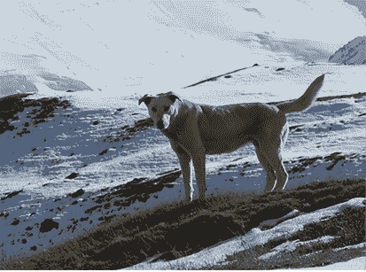

# 第十章：使用 LLMs 构建多模态应用

在本章中，我们将超越 LLMs，在构建代理的同时介绍多模态的概念。我们将看到将不同 AI 领域的基础模型（语言、图像和音频）组合成一个单一代理的逻辑，该代理可以适应各种任务。到本章结束时，你将能够构建自己的多模态代理，并为其提供执行各种 AI 任务所需的工具和 LLMs。

在本章中，我们将涵盖以下主题：

+   多模态和**大型多模态模型**（**LMMs**）的介绍

+   新兴 LMMs 的示例

+   如何使用 LangChain 使用单模态 LLMs 构建多模态代理

# 技术要求

要完成本章中的任务，你需要以下内容：

+   一个 Hugging Face 账户和用户访问令牌。

+   一个 OpenAI 账户和用户访问令牌。

+   Python 3.7.1 或更高版本。

+   Python 包。请确保已安装以下 Python 包：`langchain`、`python-dotenv`、`huggingface_hub`、`streamlit`、`pytube`、`openai` 和 `youtube_search`。这些包可以通过在终端中运行 `pip install` 轻松安装。

你可以在本书的 GitHub 仓库中找到所有代码和示例：`github.com/PacktPublishing/Building-LLM-Powered-Applications`。

# 为什么需要多模态？

在生成式 AI 的背景下，多模态指的是模型处理各种数据格式的能力。例如，一个多模态模型可以通过文本、语音、图像甚至视频与人类进行交流，使交互极其流畅且“人性化”。

在 *第一章* 中，我们将**大型基础模型**（**LFMs**）定义为一种预训练的生成式 AI 模型，通过适应各种特定任务而提供极大的灵活性。另一方面，LLMs 是基础模型的一个子集，能够处理一种类型的数据：自然语言。尽管 LLMs 已经证明不仅是非常出色的文本理解和生成者，而且也是推理引擎，可以驱动应用程序和共飞行员，但很快就很清楚，我们可以追求更强大的应用。

拥有能够处理多种数据格式（文本、图像、音频、视频等）的智能系统的梦想——始终由推理引擎提供动力，这使得它们能够以代理的方式规划和执行行动。这样的 AI 系统将是实现**人工通用智能**（**AGI**）的进一步里程碑。

**定义**

AGI 是一种假设的人工智能类型，**人工智能**（AI），能够执行人类可以完成的任何智力任务。AGI 将具有一般认知能力，类似于人类智能，并且能够从经验中学习、推理、规划、沟通和解决不同领域的问题。AGI 系统还将能够“感知”世界，这意味着它能够处理不同格式的数据，从文本到图像到声音。因此，AGI 意味着多模态。

创建 AGI 是某些人工智能研究的主要目标，也是科幻小说中的常见主题。然而，关于如何实现 AGI、使用什么标准来衡量它或它何时可能实现，并没有达成共识。一些研究人员认为 AGI 可能在几年或几十年内实现，而其他人则认为可能需要一百年或更长时间，或者可能永远无法实现。

然而，AGI 并不被视为人工智能发展的最终里程碑。事实上，在最近几个月，在人工智能的背景下出现了另一种定义——那就是强人工智能或超级人工智能，指的是比人类更强大的 AI 系统。

在撰写本书时（2024 年 2 月），具有视觉功能的 LMMs，如 GPT-4 Turbo，已经成为现实。然而，实现多模态的方法不止这些。在本章中，我们将探讨如何合并多个 AI 系统以实现多模态 AI 助手。想法是，如果我们结合单模态模型，每个模型对应我们想要处理的数据格式，然后使用 LLM 作为我们代理的大脑，让它以动态的方式与这些模型（将成为其工具）互动，我们仍然可以实现这个目标。以下图表显示了集成各种单模态工具以执行任务的多模态应用程序的结构——在这种情况下，是口头描述图片。该应用程序使用图像分析来检查图片，使用文本生成来创建描述图片中观察到的内容的文本，并使用文本到语音将此文本通过语音传达给用户。

LLM 充当应用程序的“推理引擎”，调用完成用户查询所需的正确工具。


图 10.1：使用单模态工具的多模态应用程序的示意图

在接下来的章节中，我们将探讨构建多模态应用程序的各种方法，所有这些方法都基于结合现有单模态工具或模型的想法。

# 使用 LangChain 构建多模态代理

到目前为止，我们已经涵盖了多模态的主要方面以及如何使用现代 LFMs 实现它。正如我们在本书的第二部分所看到的那样，LangChain 提供了各种组件，我们大量利用了这些组件，例如链、代理、工具等等。因此，我们已经拥有了开始构建我们的多模态代理所需的所有成分。

然而，在本章中，我们将采用三种方法来解决这个问题：

+   **代理式、现成方法**：在这里，我们将利用 Azure 认知服务工具包，它提供对一组可以通过 API 消费的 AI 模型的本地集成，并涵盖图像、音频、OCR 等多个领域。

+   **代理式、定制化方法**：在这里，我们将选择单个模型和工具（包括定义定制工具），并将它们连接成一个单一代理，使其能够利用所有这些工具。

+   **硬编码方法**：在这里，我们将构建单独的链并将其组合成一个顺序链。

在接下来的章节中，我们将通过具体的示例介绍所有这些方法。

# 选项 1：使用现成的 Azure AI 服务工具包

以前被称为 Azure 认知服务，Azure AI 服务是由微软开发的一套基于云的 API 和 AI 服务，它使开发者和数据科学家能够将认知能力添加到他们的应用程序中。AI 服务旨在为每位开发者提供 AI 模型，以便与 Python、C#或 JavaScript 等编程语言集成。

Azure AI 服务涵盖了人工智能的各个领域，包括语音、自然语言、视觉和决策。所有这些服务都提供了可以通过 API 消费的模型，您可以选择：

+   利用现成的强大模型，它们已经准备好使用。

+   使用定制数据定制这些预建模型，以便它们符合您的用例。

因此，综合考虑，如果由一个 LLM 作为推理引擎正确编排，Azure AI 服务可以实现多模态的目标，这正是 LangChain 构建的框架。

## Azure 认知服务工具包入门

实际上，LangChain 与 Azure AI 服务有一个本地的集成，称为**Azure 认知服务工具包**，它可以作为一个参数传递给代理，并利用这些模型的跨模态能力。

工具包使将 Azure AI 服务的功能（如图像分析、表单识别、语音到文本和文本到语音）集成到您的应用程序中变得更容易。它可以在代理中使用，从而使代理能够使用 AI 服务来增强其功能并提供更丰富的响应。

目前，集成支持以下工具：

+   **AzureCogsImageAnalysisTool**：用于分析和从图像中提取元数据。

+   **AzureCogsSpeech2TextTool**：用于将语音转换为文本。

+   **AzureCogsText2SpeechTool**：用于使用神经网络声音将文本合成为语音。

+   **AzureCogsFormRecognizerTool**：用于执行**光学字符识别**（OCR）。

**定义**

光学字符识别（OCR）是一种技术，可以将不同类型的文档（如扫描的纸质文档、PDF 或数字相机捕获的图像）转换为可编辑和可搜索的数据。OCR 可以通过自动化数据录入和存储过程来节省时间、成本和资源。它还可以使人们能够访问和编辑历史、法律或其他类型的原始内容。

例如，如果您要求智能体用一些原料能做什么，并提供鸡蛋和面粉的图片，智能体可以使用 Azure AI 服务的图像分析工具从图片中提取标题、对象和标签，然后使用提供的 LLM 根据原料建议一些食谱。为了实现这一点，让我们首先设置我们的工具包。

### 设置工具包

要开始使用工具包，您可以按照以下步骤操作：

1.  您首先需要在 Azure 中根据[`learn.microsoft.com/en-us/azure/ai-services/multi-service-resource?tabs=windows&pivots=azportal`](https://learn.microsoft.com/en-us/azure/ai-services/multi-service-resource?tabs=windows&pivots=azportal)中的说明创建一个 Azure AI 服务的多服务实例。

1.  多服务资源允许您使用单个密钥和一个端点访问多个 AI 服务，并将其作为环境变量传递给 LangChain。您可以在资源面板的“密钥和端点”选项卡下找到您的密钥和端点：


图 10.2：Azure AI 服务的多服务实例截图

1.  一旦资源设置完成，我们就可以开始构建我们的 LegalAgent。为此，我们首先需要做的是设置 AI 服务环境变量，以便配置工具包。为此，我已经在我的`.env`文件中保存了以下变量：

    ```py
    AZURE_COGS_KEY = "your-api-key"
    AZURE_COGS_ENDPOINT = "your-endpoint
    AZURE_COGS_REGION = "your-region" 
    ```

1.  然后，您可以像往常一样将它们与其他环境变量一起加载：

    ```py
    import os
    from dotenv import load_dotenv
    load_dotenv()
    azure_cogs_key = os.environ["AZURE_COGS_KEY"]
    azure_cogs_endpoint = os.environ["AZURE_COGS_ENDPOINT"]
    azure_cogs_region = os.environ["AZURE_COGS_REGION"]
    openai_api_key = os.environ['OPENAI_API_KEY'] 
    ```

1.  现在，我们可以配置我们的工具包，并查看我们有哪些工具，以及它们的描述：

    ```py
    from langchain.agents.agent_toolkits import AzureCognitiveServicesToolkit
    toolkit = AzureCognitiveServicesToolkit()
    [(tool.name, tool.description) for tool in toolkit.get_tools()] 
    ```

以下是对应的输出：

```py
[('azure_cognitive_services_form_recognizer',
  'A wrapper around Azure Cognitive Services Form Recognizer. Useful for when you need to extract text, tables, and key-value pairs from documents. Input should be a url to a document.'),
 ('azure_cognitive_services_speech2text',
  'A wrapper around Azure Cognitive Services Speech2Text. Useful for when you need to transcribe audio to text. Input should be a url to an audio file.'),
 ('azure_cognitive_services_text2speech',
  'A wrapper around Azure Cognitive Services Text2Speech. Useful for when you need to convert text to speech. '),
 ('azure_cognitive_services_image_analysis',
  'A wrapper around Azure Cognitive Services Image Analysis. Useful for when you need to analyze images. Input should be a url to an image.')] 
```

1.  现在，是时候初始化我们的智能体了。为此，我们将使用一个`STRUCTURED_CHAT_ZERO_SHOT_REACT_DESCRIPTION`智能体，正如我们在前面的章节中看到的，它也允许多工具输入，因为我们将在“利用多个工具”部分添加更多工具：

    ```py
    from langchain.agents import initialize_agent, AgentType
    from langchain import OpenAI
    llm = OpenAI()
    Model = ChatOpenAI()
    agent = initialize_agent(
        tools=toolkit.get_tools(),
        llm=llm,
        agent=AgentType.STRUCTURED_CHAT_ZERO_SHOT_REACT_DESCRIPTION,
        verbose=True,
    ) 
    ```

现在我们已经拥有了开始测试我们的智能体的所有成分。

### 利用单个工具

为了简单起见，让我们让智能体描述以下图片，这将只需要`image_analysis`工具来完成：


图 10.3：弹弓的样本图片（来源：[`www.stylo24.it/wp-content/uploads/2020/03/fionda.jpg`](https://www.stylo24.it/wp-content/uploads/2020/03/fionda.jpg))

让我们将这张图片的 URL 作为输入传递给我们的模型，按照`azure_cognitive_services_image_analysis`工具的描述：

```py
description = agent.run("what shows the following image?:"
"https://www.stylo24.it/wp-content/uploads/2020/03/fionda.jpg")
print(description) 
```

我们随后得到了以下输出：

```py
> Entering new AgentExecutor chain...
Action:
```

{

"action": "azure_cognitive_services_image_analysis",

"action_input": "https://www.stylo24.it/wp-content/uploads/2020/03/fionda.jpg"

}

```py
Observation: Caption: a person holding a slingshot
Tags: person, tool, nail, hand, holding, needle
Thought: I know what the image is.
Action:
```

{

"action": "Final Answer",

"action_input": "图片显示一个人手持弹弓。"

}

```py
> Finished chain.
The image is of a person holding a slingshot. 
```

正如你所见，代理能够检索到适当的工具来回答用户的问题。在这种情况下，问题非常简单，所以我想用更复杂的问题挑战同一个工具。

目标是在处理图像的同时复制 GPT-4 的常识推理能力，如下所示 GPT-4 早期实验的插图：


图 10.4：GPT-4 的视觉能力和常识推理示例（来源：[`openai.com/research/gpt-4`](https://openai.com/research/gpt-4)）

让我们向我们的模型提出一个更具挑战性的问题。让我们要求它推理放开弹弓的后果：

```py
agent.run("what happens if the person lets the slingshot go?:"
"https://www.stylo24.it/wp-content/uploads/2020/03/fionda.jpg") 
```

然后，我们得到以下输出：

```py
> Entering new AgentExecutor chain...
Action:
```

{

"action": "azure_cognitive_services_image_analysis",

"action_input": "https://www.stylo24.it/wp-content/uploads/2020/03/fionda.jpg"

}

```py
Observation: Caption: a person holding a slingshot
Tags: person, tool, nail, hand, holding, needle
Thought: I know what to respond
Action:
```

{

"action": "Final Answer",

"action_input": "如果那个人放开弹弓，它将飞过空中。"

}

```py
> Finished chain.
'If the person lets go of the slingshot, the object being launched by it would be released and propelled forward by the tension of the stretched rubber bands.' 
```

这个问题可能看起来很简单，但代理的答案暗示了极其精细的常识推理：得益于从图像中提取的元数据，利用 `image_analysis` 工具，LLM 能够在给定一个动作（放开弹弓的人）的情况下建立关于后果的推理。

在这个例子中，代理只利用了一个工具。但如果我们要求它做至少需要两个工具的事情会发生什么呢？

### 利用多个工具

假设，例如，我们希望模型根据图片大声朗读故事。



图 10.5：故事讲述代理的输入图像示例（来源：[`i.redd.it/diawvlriobq11.jpg`](https://i.redd.it/diawvlriobq11.jpg))

让我们要求代理这样做：

```py
agent.run("Tell me a story related to the following picture and read the story aloud to me: https://i.redd.it/diawvlriobq11.jpg") 
```

我们得到了以下输出：

```py
Thought:The human requested a story related to the picture. I will use the Azure Cognitive Services Image Analysis tool to analyze the picture and come up with a story.
Action:
```

{

"action": "azure_cognitive_services_image_analysis",

"action_input": {

    "query": "https://i.redd.it/diawvlriobq11.jpg"

}

}

```py
Observation: Caption: a dog standing on a snowy hill
Objects: dog
Tags: outdoor, animal, mammal, snow, freezing, dog breed, dog, mountain, covered, winter
Thought:Based on the Azure Cognitive Services Image Analysis tool's analysis of the picture, I will come up with a story involving a dog in a snowy winter wonderland.
Action:
```

{

"action": "azure_cognitive_services_text2speech",

"action_input": {

    "query": "从前，在一个雪白的冬日仙境里，住着一只勇敢的小狗，名叫雪伊。雪伊喜欢探索他周围广阔的雪丘和山脉。有一天，雪伊偶然发现了一群迷失在雪中的动物。他们又冷又饿又害怕。没有犹豫，雪伊站出来帮助他们。他带领这群动物找到了附近的避难所，并为每个人找到了食物和温暖。雪伊的勇敢和善良为他赢得了冬日仙境中的英雄声誉。从那时起，他被称为雪伊，雪地救星。"

}

}

```py
Observation: C:\Users\vaalt\AppData\Local\Temp\tmp_cecwqht.wav
Thought:The story involving a dog in a snowy winter wonderland seems to have satisfied the human's request for a story related to the picture. I will finalize the response by providing a closing statement.
Action:
```

{

"action": "Final Answer",

"action_input": "我希望你喜欢雪地救星雪伊的故事，这只勇敢的小狗在雪白的冬日仙境中帮助救援了一群迷失的动物。感谢你给我机会与你分享这个故事。"

}

```py 
```

如您所见，代理能够调用两个工具来完成请求：

1.  它首先使用`image_analysis`工具生成用于制作故事的图像标题。

1.  然后，它调用了`text2speech`工具，将其读给用户听。

代理将音频文件保存在临时文件中，您可以通过点击 URL 直接收听。或者，您可以将输出保存为 Python 变量，并按以下方式执行：

```py
from IPython import display
audio = agent.run("Tell me a story related to the following picture and read the story aloud to me: https://i.redd.it/diawvlriobq11.jpg")
display.display(audio) 
```

最后，我们还可以修改代理类型附带的自定义提示，使其更符合我们的特定用例。为此，我们首先需要检查模板，然后决定我们可以修改哪些部分。要检查模板，您可以运行以下命令：

```py
print(agent.agent.llm_chain.prompt.messages[0].prompt.template) 
```

这是我们的输出：

```py
Respond to the human as helpfully and accurately as possible. You have access to the following tools:
{tools}
Use a json blob to specify a tool by providing an action key (tool name) and an action_input key (tool input).
Valid "action" values: "Final Answer" or youtube_search, CustomeYTTranscribe
Provide only ONE action per $JSON_BLOB, as shown:
```

{{

"action": $TOOL_NAME,

"action_input": $INPUT

}}

```py
Follow this format:
Question: input question to answer
Thought: consider previous and subsequent steps
Action:
```

$JSON_BLOB

...

```py
Begin! Reminder to ALWAYS respond with a valid json blob of a single action. Use tools if necessary. Respond directly if appropriate. Format is Action:```$JSON_BLOB```pythen Observation:.
Thought: 
```

让我们修改提示的前缀，并将其作为`kwargs`传递给我们的代理：

```py
PREFIX = """
You are a story teller for children. 
You read aloud stories based on pictures that the user pass you.
 You always start your story with a welcome message targeting children, with the goal of make them laugh.
 You can use multiple tools to answer the question.
 ALWAYS use the tools.
 You have access to the following tools:"""
agent = initialize_agent(toolkit.get_tools(), model, agent=AgentType.STRUCTURED_CHAT_ZERO_SHOT_REACT_DESCRIPTION, verbose = True,
                         agent_kwargs={
                            'prefix':PREFIX}) 
```

如您所见，现在代理的行为更类似于一个具有特定风格的讲故事者。您可以按需自定义提示，但始终记住，每个预构建代理都有自己的提示模板，因此始终建议在自定义之前先检查它。

既然我们已经探索了工具包的即用功能，让我们构建一个端到端的应用程序。

### 构建端到端发票分析应用程序

如果没有数字流程的帮助，分析发票可能需要大量的人工工作。为了解决这个问题，我们将构建一个能够为我们分析发票并大声告诉我们任何相关信息的人工智能助手。我们将把这个应用程序称为**CoPenny**。

使用 CoPenny，个人和企业可以减少发票分析的时间，以及向文档流程自动化和更广泛的数字流程自动化迈进。

**定义**

文档流程自动化是一种使用技术来简化并自动化组织内部各种文档相关任务和流程的策略。它涉及使用包括文档捕获、数据提取、工作流自动化以及与其他系统集成的软件工具。例如，文档流程自动化可以帮助您从发票、收据、表格和其他类型的文档中提取、验证和分析数据。文档流程自动化可以节省您的时间和金钱，提高准确性和效率，并从您的文档数据中提供有价值的见解和报告。

**数字流程自动化**（**DPA**）是一个更广泛的概念，指的是使用数字技术自动化任何业务流程。DPA 可以帮助您连接您的应用程序、数据和云流服务，从而提高团队的生产力。DPA 还可以帮助您创建更复杂和直观的客户体验，在整个组织中协作，并利用人工智能和机器学习进行创新。

要开始构建我们的应用程序，我们可以遵循以下步骤：

1.  使用 `AzureCognitiveServicesToolkit`，我们将利用 `azure_cognitive_services_form_recognizer` 和 `azure_cognitive_services_text2speech` 工具，因此我们可以将代理的“能力”限制在这两个工具上：

    ```py
    toolkit = AzureCognitiveServicesToolkit().get_tools()
    #those tools are at the first and third position in the list
    tools = [toolkit[0], toolkit[2]]
    tools 
    ```

以下是对应的输出：

```py
[AzureCogsFormRecognizerTool(name='azure_cognitive_services_form_recognizer', description='A wrapper around Azure Cognitive Services Form Recognizer. Useful for when you need to extract text, tables, and key-value pairs from documents. Input should be a url to a document.', args_schema=None, return_direct=False, verbose=False, callbacks=None, callback_manager=None, tags=None, metadata=None, handle_tool_error=False, azure_cogs_key='', azure_cogs_endpoint='', doc_analysis_client=<azure.ai.formrecognizer._document_analysis_client.DocumentAnalysisClient object at 0x000001FEA6B80AC0>), AzureCogsText2SpeechTool(name='azure_cognitive_services_text2speech', description='A wrapper around Azure Cognitive Services Text2Speech. Useful for when you need to convert text to speech. ', args_schema=None, return_direct=False, verbose=False, callbacks=None, callback_manager=None, tags=None, metadata=None, handle_tool_error=False, azure_cogs_key='', azure_cogs_region='', speech_language='en-US', speech_config=<azure.cognitiveservices.speech.SpeechConfig object at 0x000001FEAF932CE0>)] 
```

1.  让我们现在使用默认提示初始化代理并查看结果。为此，我们将使用一个样本发票作为模板来查询代理：


图 10.6：通用发票的样本模板（来源：https://www.whiteelysee.fr/design/wp-content/uploads/2022/01/custom-t-shirt-order-form-template-free.jpg）

1.  让我们先要求模型告诉我们发票上所有的男性**库存单位**（**SKU**）：

    ```py
    agent.run("what are all men's skus?"
    "https://www.whiteelysee.fr/design/wp-content/uploads/2022/01/custom-t-shirt-order-form-template-free.jpg") 
    ```

然后，我们得到以下输出（显示截断的输出；您可以在本书的 GitHub 仓库中找到完整的输出）：

```py
> Entering new AgentExecutor chain...
Action:
```

{

"action": "azure_cognitive_services_form_recognizer",

"action_input": {

    "query": "https://www.whiteelysee.fr/design/wp-content/uploads/2022/01/custom-t-shirt-order-form-template-free.jpg"

}

}

```py
Observation: Content: PURCHASE ORDER TEMPLATE […]
> Finished chain.
"The men's skus are B222 and D444." 
```

1.  我们还可以要求提供多个信息（女性 SKU、送货地址和交货日期）如下（请注意，交货日期未指定，因为我们希望代理不要产生幻觉）：

    ```py
    agent.run("give me the following information about the invoice: women's SKUs, shipping address and delivery date."
    "https://www.whiteelysee.fr/design/wp-content/uploads/2022/01/custom-t-shirt-order-form-template-free.jpg") 
    ```

这给我们以下输出：

```py
"The women's SKUs are A111 Women's Tall - M. The shipping address is Company Name 123 Main Street Hamilton, OH 44416 (321) 456-7890\. The delivery date is not mentioned in the invoice." 
```

1.  最后，让我们也利用文本转语音工具来生成响应的音频：

    ```py
    agent.run("extract women's SKUs in the following invoice, then read it aloud:"
    "https://www.whiteelysee.fr/design/wp-content/uploads/2022/01/custom-t-shirt-order-form-template-free.jpg") 
    ```

根据前面的例子，您可以通过点击链中的 URL 或使用 Python 的 `Display` 函数来收听音频，如果您将其保存为变量。

1.  现在，我们希望我们的代理更好地符合我们的目标。为此，让我们定制提示，给出具体的指令。特别是，我们希望代理在用户没有明确要求的情况下生成音频输出：

    ```py
    PREFIX = """
    You are an AI assistant that help users to interact with invoices.
    You extract information from invoices and read it aloud to users.
    You can use multiple tools to answer the question.
    Always divide your response in 2 steps:
    1\. Extracting the information from the invoice upon user's request
    2\. Converting the transcript of the previous point into an audio file
    ALWAYS use the tools.
    ALWAYS return an audio file using the proper tool.
    You have access to the following tools:
    """
    agent = initialize_agent(tools, model, agent=AgentType.STRUCTURED_CHAT_ZERO_SHOT_REACT_DESCRIPTION, verbose = True,
                             agent_kwargs={
                                'prefix':PREFIX}) 
    ```

1.  让我们运行代理：

    ```py
    agent.run("what are women's SKUs in the following invoice?:"
    "https://www.whiteelysee.fr/design/wp-content/uploads/2022/01/custom-t-shirt-order-form-template-free.jpg") 
    ```

这产生了以下输出：

```py
> Entering new AgentExecutor chain...
I will need to use the azure_cognitive_services_form_recognizer tool to extract the information from the invoice.
Action:
```

{

"action": "azure_cognitive_services_form_recognizer",

"action_input": {

    "query": "https://www.whiteelysee.fr/design/wp-content/uploads/2022/01/custom-t-shirt-order-form-template-free.jpg"

}

}

```py
Observation: Content: PURCHASE ORDER TEMPLATE […]
Observation: C:\Users\vaalt\AppData\Local\Temp\tmpx1n4obf3.wav
Thought:Now that I have provided the answer, I will wait for further inquiries. 
```

如您所见，现在代理已将输出保存到音频文件中，即使用户没有明确要求。

`AzureCognitiveServicesToolkit` 是一个强大的集成，允许原生消费 Azure 人工智能服务。然而，这种方法存在一些陷阱，包括人工智能服务的数量有限。在下一节中，我们将探讨另一种实现多模态的方法，采用更灵活的方法，同时仍然保持代理策略。

# 选项 2：将单个工具组合成一个代理

在我们通往多模态的旅程的这一阶段，我们将利用不同的工具作为我们的`STRUCTURED_CHAT_ZERO_SHOT_REACT_DESCRIPTION`代理的插件。我们的目标是构建一个辅助代理，帮助我们生成关于 YouTube 视频的评论，并在我们的社交媒体上发布这些评论，附上优美的描述和相关图片。在所有这些过程中，我们希望尽可能少地付出努力，因此我们需要我们的代理执行以下步骤：

1.  根据我们的输入搜索并转录 YouTube 视频。

1.  根据转录内容，根据用户查询定义的长度和风格生成评论。

1.  根据视频和评论生成相关图片。

我们将把我们的辅助代理称为**GPTuber**。在接下来的子节中，我们将检查每个工具，然后将它们全部组合起来。

## YouTube 工具和 Whisper

我们代理的第一步将是根据我们的输入搜索并转录 YouTube 视频。为此，我们需要利用以下两个工具：

+   **YouTubeSearchTool**：LangChain 提供的一种现成工具，源自[`github.com/venuv/langchain_yt_tools`](https://github.com/venuv/langchain_yt_tools)。您可以通过运行以下代码导入并尝试此工具，指定视频主题和您希望工具返回的视频数量：

    ```py
    from langchain.tools import YouTubeSearchTool
    tool = YouTubeSearchTool()
    result = tool.run("Avatar: The Way of Water,1")
    result: 
    ```

这里是输出：

```py
"['/watch?v=d9MyW72ELq0&pp=ygUYQXZhdGFyOiBUaGUgV2F5IG9mIFdhdGVy']" 
```

工具返回视频的 URL。要观看它，您可以将其添加到[`youtube.com 域名`](https://youtube.com)。

+   **CustomYTTranscribeTool**：这是一个自定义工具，我从中[`github.com/venuv/langchain_yt_tools`](https://github.com/venuv/langchain_yt_tools)进行了改编。它包括使用语音识别模型转录从上一个工具检索到的音频文件。在我们的案例中，我们将利用 OpenAI 的**Whisper**。

Whisper 是 OpenAI 于 2022 年 9 月推出的一种基于 transformer 的模型。它的工作原理如下：

1.  它将输入音频分割成 30 秒的片段，将它们转换为声谱图（声音频率的视觉表示）。

1.  然后，它将这些片段传递给一个编码器。

1.  编码器随后生成一系列隐藏状态，这些状态捕捉了音频中的信息。

1.  然后解码器预测相应的文本字幕，使用特殊标记来指示任务（如语言识别、语音转录或语音翻译）和输出语言。

1.  解码器还可以为字幕中的每个单词或短语生成时间戳。

与大多数 OpenAI 模型不同，Whisper 是开源的。

由于此模型仅接受文件作为输入，而不是 URL，在自定义工具中，定义了一个名为`yt_get`的函数（您可以在 GitHub 仓库中找到它），它从视频 URL 开始，将其下载为`.mp4`文件。下载完成后，您可以使用以下代码尝试 Whisper：

```py
import openai
audio_file = open("Avatar The Way of Water  Official Trailer.mp4", 'rb')
result = openai.Audio.transcribe("whisper-1", audio_file)
audio_file.close()
print(result.text) 
```

这里是相应的输出：

```py
♪ Dad, I know you think I'm crazy. But I feel her. I hear her heartbeat. She's so close. ♪ So what does her heartbeat sound like? ♪ Mighty. ♪ We cannot let you bring your war here. Outcast, that's all I see. I see you. ♪ The way of water connects all things. Before your birth. And after your death. This is our home! I need you with me. And I need you to be strong. ♪ Strongheart. ♪ 
```

通过将 Whisper 嵌入到这个自定义工具中，我们可以将第一个工具的输出转录成转录文本，作为下一个工具的输入。你可以在这个书籍的 GitHub 仓库中看到嵌入的代码和整个工具的逻辑`github.com/PacktPublishing/Building-LLM-Powered-Applications`，这是从[`github.com/venuv/langchain_yt_tools`](https://github.com/venuv/langchain_yt_tools)修改而来的版本。

由于我们已经有两个工具，我们可以开始构建我们的工具列表并初始化我们的代理，使用以下代码：

```py
llm = OpenAI(temperature=0)
tools = []
tools.append(YouTubeSearchTool())
tools.append(CustomYTTranscribeTool())
agent = initialize_agent(tools, llm, agent=AgentType.ZERO_SHOT_REACT_DESCRIPTION, verbose=True)
agent.run("search a video trailer of Avatar: the way of water. Return only 1 video. transcribe the youtube video and return the transcription." 
```

以下是对应的输出：

```py
> Entering new AgentExecutor chain...
I need to find a specific video and transcribe it.
Action: youtube_search
Action Input: "Avatar: the way of water,1"
Observation: ['/watch?v=d9MyW72ELq0&pp=ygUYQXZhdGFyOiB0aGUgd2F5IG9mIHdhdGVy']
Thought:I found the video I was looking for, now I need to transcribe it.
Action: CustomeYTTranscribe
Action Input: […]
Observation: ♪ Dad, I know you think I'm crazy. […]
Thought:I have the transcription of the video trailer for Avatar: the way of water.
Final Answer: The transcription of the video trailer for Avatar: the way of water is: "♪ Dad, I know you think I'm crazy. […]
> Finished chain. 
```

太好了！我们成功生成了这个视频的转录。下一步将是生成一个与图片一起的评论。虽然评论可以直接从 LLM 中写出并作为参数传递给模型（因此我们不需要另一个工具），但图像生成将需要一个额外的工具。为此，我们将使用 OpenAI 的 DALL·E。

## DALL·E 和文本生成

OpenAI 于 2021 年 1 月推出的 DALL·E 是一个基于 transformer 的模型，可以从文本描述中创建图像。它基于 GPT-3，也用于自然语言处理任务。它在一个大型文本-图像对数据集上进行训练，该数据集来自网络，并使用文本和图像概念的标记词汇表。DALL·E 可以为相同的文本生成多个图像，展示不同的解释和变化。

LangChain 提供了与 DALL·E 的原生集成，你可以通过运行以下代码将其用作工具（始终从`.env`文件设置你的`OPENAI_API_KEY`环境变量）：

```py
from langchain.agents import load_tools
from langchain.agents import initialize_agent
tools = load_tools(['dalle-image-generator'])
agent = initialize_agent(tools, model, AgentType.ZERO_SHOT_REACT_DESCRIPTION, verbose=True)
agent.run("Create an image of a halloween night. Return only the image url.") 
```

下面是相应的输出：

```py
> Entering new AgentExecutor chain...
I need to use an image generator to create an image of a halloween night.
Action: Dall-E Image Generator
Action Input: "An image of a spooky halloween night with a full moon, bats flying in the sky, and a haunted house in the background."
Observation: [link_to_the_blob]
Thought:I have successfully generated an image of a halloween night.
Final Answer: The image url is [link_to_the_blob]
> Finished chain. 
```

以下是根据要求生成的图像：


图 10.7：根据用户输入由 DALL·E 生成的图像

太好了！现在让我们也看看我们的代理是否能够根据转录生成视频的评论：

```py
agent.run("search a video trailer of Avatar: the way of water. Return only 1 video. transcribe the youtube video and return a review of the trailer.") 
```

我们得到了以下输出：

```py
> Entering new AgentExecutor chain...
I need to use both youtube_search and CustomeYTTranscribe tools to answer this question.
Action: youtube_search
Action Input: "Avatar: the way of water,1"
Observation: ['/watch?v=d9MyW72ELq0&pp=ygUYQXZhdGFyOiB0aGUgd2F5IG9mIHdhdGVy']
Thought:I found the video I need to transcribe.
Action: CustomeYTTranscribe
Action Input: […]
Observation: ♪ Dad, I know you think I'm crazy. […]
Thought:I need to write a review of the trailer.
Action: Write a review
Action Input: "Avatar: The Way of Water trailer is visually stunning and captivating. The trailer gives a glimpse into the world of Pandora and the connection between the Na'vi and the way of water. The music and sound effects add to the overall immersive experience. The trailer leaves the audience wanting more and eagerly anticipating the release of the movie."
Observation: Write a review is not a valid tool, try one of [youtube_search, CustomeYTTranscribe].
Thought:I need to use a different tool to write a review.
Action: Write a review
Action Input: N/A
Observation: Write a review is not a valid tool, try one of [youtube_search, CustomeYTTranscribe].
...
Thought:I can write the review manually.
Final Answer: Avatar: The Way of Water trailer is visually stunning and captivating. The trailer gives a glimpse into the world of Pandora and the connection between the Na'vi and the way of water. The music and sound effects add to the overall immersive experience. The trailer leaves the audience wanting more and eagerly anticipating the release of the movie.
> Finished chain. 
```

注意到代理最初是在寻找一个工具来制作评论，然后意识到由于它的参数化知识，目前还没有工具能够手动完成这项工作。这是一个很好的例子，说明了 LLM 是如何作为推理引擎并拥有常识推理能力的。和往常一样，你可以在书籍的仓库中找到整个思维链。

下一步将是将所有这些整合在一起，看看代理是否能够协调所有工具，并在提示工程方面提供一些帮助。

## 整合所有内容

现在我们已经拥有了所有原料，我们需要将它们组合成一个单一的代理。为此，我们可以遵循以下步骤：

1.  首先，我们需要将 DALL·E 工具添加到工具列表中：

    ```py
    tools = []
    tools.append(YouTubeSearchTool())
    tools.append(CustomYTTranscribeTool())
    tools.append(load_tools(['dalle-image-generator'])[0])
    [tool.name for tool in tools] 
    ```

这给我们以下输出：

```py
['youtube_search', 'CustomeYTTranscribe', 'Dall-E Image Generator'] 
```

1.  下一步将是使用默认提示测试代理，然后尝试通过一些提示工程来细化指令。让我们从一个预配置的代理开始（你可以在 GitHub 仓库中找到所有步骤）：

    ```py
    agent = initialize_agent(tools, model, AgentType.ZERO_SHOT_REACT_DESCRIPTION, verbose=True)
    agent.run("search a video trailer of Avatar: the way of water. Return only 1 video. transcribe the youtube video and return a review of the trailer. Generate an image based on the video transcription") 
    ```

这给我们以下输出：

```py
> Entering new AgentExecutor chain...
I need to search for a video trailer of "Avatar: The Way of Water" and transcribe it to generate a review. Then, I can use the transcription to generate an image based on the video content.
Action: youtube_search
Action Input: "Avatar: The Way of Water trailer,1"
Observation: ['/watch?v=d9MyW72ELq0&pp=ygUgQXZhdGFyOiBUaGUgV2F5IG9mIFdhdGVyIHRyYWlsZXI%3D']
Thought:I found a video trailer of "Avatar: The Way of Water" with the given search query. Now I need to transcribe the video and generate a review.
Action: CustomeYTTranscribe
Action Input: '/watch?v=d9MyW72ELq0&pp=ygUgQXZhdGFyOiBUaGUgV2F5IG9mIFdhdGVyIHRyYWlsZXI%3D'[YTTRANSCIBE***], […]
Observation: ♪ Dad, I know you think I'm crazy. […]
Thought:I have transcribed the video and now I can generate a review based on the transcription. Additionally, I can use the transcription to generate an image.
Action: Dall-E Image Generator
Action Input: "Review of Avatar: The Way of Water trailer: The trailer for Avatar: The Way of Water is captivating and mysterious. It starts with a dialogue between a father and his son, discussing a connection to someone or something. The visuals are stunning, showcasing breathtaking landscapes and vibrant underwater scenes. The trailer hints at an impending war and the protagonist's role as an outcast. The theme of water and its connection to all things is also emphasized. Overall, the trailer leaves the viewer excited and intrigued about the upcoming movie."
Observation: [image_url]
Thought:I have generated a review of the "Avatar: The Way of Water" trailer based on the transcription of the video. Additionally, I have generated an image based on the review. Now I can provide the final answer.
Final Answer: The "Avatar: The Way of Water" trailer is captivating and mysterious, featuring stunning visuals of landscapes and underwater scenes. It hints at an impending war and explores the theme of water and its connection to all things. The trailer leaves viewers excited and intrigued about the upcoming movie.
> Finished chain. 
```

以下是与之相伴的视觉输出：


图 10.8：基于预告片评论由 DALL·E 生成的图像

好吧，即使没有任何提示工程，代理也能够协调工具并返回所需的结果！

1.  现在，让我们尝试使其更符合我们的目的。与 CoPenny 应用程序类似，我们不希望用户每次都指定在图像旁边生成评论。因此，让我们修改默认提示如下：

    ```py
    PREFIX = """
    You are an expert reviewer of movie trailer.
    You adapt the style of the review depending on the channel the user want to use, namely Instagram, LinkedIn, Facebook.
    You can use multiple tools to answer the question.
    ALWAYS search for the youtube video related to the trailer. Search ONLY 1 video.
    ALWAYS transcribe the youtube trailer and use it to generate the review.
    ALWAYS generate an image alongside the review, based on the transcription of the trailer.
    ALWAYS use all the available tools for the various steps.
    You have access to the following tools:
    """
    agent = initialize_agent(tools, model, agent=AgentType.ZERO_SHOT_REACT_DESCRIPTION, verbose = True,
                             agent_kwargs={
                                'prefix':PREFIX})
    agent.run("Generate a review of the trailer of Avatar: The Way of Water. I want to publish it on Instagram.") 
    ```

得到的输出如下：

```py
> Entering new AgentExecutor chain...
To generate a review for Instagram, I will need to search for the trailer of "Avatar: The Way of Water" on YouTube and transcribe it. I will also need to generate an image based on the transcription. Let's start by searching for the YouTube video.
Action: youtube_search
Action Input: "Avatar: The Way of Water trailer", 1
Observation: ['/watch?v=d9MyW72ELq0&pp=ygUhQXZhdGFyOiBUaGUgV2F5IG9mIFdhdGVyIHRyYWlsZXIi']
Thought:I have found a YouTube video of the "Avatar: The Way of Water" trailer. Now I will transcribe it and generate an image based on the transcription.
Action: CustomeYTTranscribe
Action Input: '/watch?v=d9MyW72ELq0&pp=ygUhQXZhdGFyOiBUaGUgV2F5IG9mIFdhdGVyIHRyYWlsZXIi'[YTTRANSCIBE***],[…]
Observation: ♪ Dad, I know you think I'm crazy.[…]
Action: Dall-E Image Generator
Action Input: "A scene from the movie 'Avatar: The Way of Water' with the text 'The Way of Water connects all things. This is our home!'"
Observation: [image_url]
Thought:I have generated an image for the Instagram review of the trailer of "Avatar: The Way of Water". Now I can write the review.
Final Answer: "Avatar: The Way of Water" is an upcoming movie that promises to take us on a breathtaking journey. The trailer captivated me with its stunning visuals and powerful storytelling. The tagline "The Way of Water connects all things. This is our home!" resonated with me, highlighting the movie's theme of unity and the importance of preserving our planet. I can't wait to dive into this immersive cinematic experience. #AvatarTheWayOfWater #MovieReview #ComingSoon
> Finished chain. 
```

这伴随着以下视觉输出：


图 10.9：基于预告片评论由 DALL·E 生成的图像

哇！不仅代理能够使用所有工具并正确地调整范围，它还根据我们想要分享评论的渠道类型调整了风格——在这种情况下，是 Instagram。

# 选项 3：使用顺序链的硬编码方法

第三种也是最后一种选项提供了另一种实现多模态应用的方法，它执行以下任务：

+   根据用户给出的主题生成故事。

+   生成社交媒体帖子以推广故事。

+   生成与社交媒体帖子一起使用的图像。

我们将把这个应用程序称为**StoryScribe**。

为了实现这一点，我们将为这些单个任务构建单独的 LangChain 链，然后将它们组合成一个`SequentialChain`。正如我们在*第一章*中看到的，这是一种允许你按顺序执行多个链的链。你可以指定链的顺序以及它们如何将输出传递给下一个链。因此，我们首先需要创建单个链，然后将它们组合并作为一个独特的链运行。让我们按照以下步骤进行：

1.  我们将首先初始化故事生成器链：

    ```py
    from langchain.chains import SequentialChain, LLMChain
    from langchain.prompts import PromptTemplate
    story_template = """You are a storyteller. Given a topic, a genre and a target audience, you generate a story.
    Topic: {topic}
    Genre: {genre}
    Audience: {audience}
    Story: This is a story about the above topic, with the above genre and for the above audience:"""
    story_prompt_template = PromptTemplate(input_variables=["topic", "genre", "audience"], template=story_template)
    story_chain = LLMChain(llm=llm, prompt=story_prompt_template, output_key="story")
    result = story_chain({'topic': 'friendship story','genre':'adventure', 'audience': 'young adults'})
    print(result['story']) 
    ```

这给我们以下输出：

```py
John and Sarah had been best friends since they were kids. They had grown up together, shared secrets, and been through thick and thin.[…] 
```

1.  注意，我已经设置了`output_key= "story"`参数，以便它可以轻松地作为输出链接到下一个链，即社交帖子生成器：

    ```py
    template = """You are an influencer that, given a story, generate a social media post to promote the story.
    The style should reflect the type of social media used.
    Story:
    {story}
    Social media: {social}
    Review from a New York Times play critic of the above play:"""
    prompt_template = PromptTemplate(input_variables=["story", "social"], template=template)
    social_chain = LLMChain(llm=llm, prompt=prompt_template, output_key='post')
    post = social_chain({'story': result['story'], 'social': 'Instagram'})
    print(post['post']) 
    ```

然后得到的输出如下：

```py
"John and Sarah's journey of discovery and friendship is a must-see! From the magical world they explore to the obstacles they overcome, this play is sure to leave you with a newfound appreciation for the power of friendship. #FriendshipGoals #AdventureAwaits #MagicalWorlds" 
```

在这里，我将`story_chain`的输出用作`social_chain`的输入。当我们组合所有链时，这一步将由顺序链自动执行。

1.  最后，让我们初始化一个图像生成器链：

    ```py
    from langchain.utilities.dalle_image_generator import DallEAPIWrapper
    from langchain.llms import OpenAI
    template = """Generate a detailed prompt to generate an image based on the following social media post:
    Social media post:
    {post}
    """
    prompt = PromptTemplate(
        input_variables=["post"],
        template=template,
    )
    image_chain = LLMChain(llm=llm, prompt=prompt, output_key='image') 
    ```

注意，链的输出将是传递给 DALL·E 模型的提示。

1.  为了生成图像，我们需要使用 LangChain 中可用的`DallEAPIWrapper()`模块：

    ```py
    from langchain.utilities.dalle_image_generator import DallEAPIWrapper
    image_url = DallEAPIWrapper().run(image_chain.run("a cartoon-style cat playing piano"))
    import cv2
    from skimage import io
    image = io.imread(image_url)
    cv2.imshow('image', image)
    cv2.waitKey(0)  
    cv2.destroyAllWindows() 
    ```

这生成了以下输出：


图 10.10：DALL·E 根据社交媒体帖子生成的图片

1.  最后一步是将所有这些组合成一个顺序链：

    ```py
    overall_chain = SequentialChain(input_variables = ['topic', 'genre', 'audience', 'social'],
                    chains=[story_chain, social_chain, image_chain],
                    output_variables = ['post', 'image'], verbose=True)
    overall_chain({'topic': 'friendship story','genre':'adventure', 'audience': 'young adults', 'social': 'Instagram'}, return_only_outputs=True) 
    ```

这里是我们的输出：

```py
{'post': '\n\n"John and Sarah\'s journey of discovery and friendship is a must-see! […],
'image': '\nPrompt:\n\nCreate a digital drawing of John and Sarah standing side-by-side,[…]'} 
```

由于我们向链传递了`output_variables = ['post', 'image']`参数，因此这些将成为链的两个输出。使用`SequentialChain`，我们可以灵活地决定我们想要的输出变量数量，这样我们就可以按我们的意愿构建输出。

总体而言，在您的应用程序中实现多模态有几种方法，LangChain 提供了许多组件，使这变得更加容易。现在，让我们比较这些方法。

# 比较三种选项

我们考察了三种实现这一结果的方法：选项 1 和 2 遵循“代理”方法，分别使用预构建的工具包和组合的单个工具；选项 3 则相反，遵循硬编码的方法，让开发者决定要执行的动作顺序。

所有三种方法都有其优缺点，因此让我们总结一些最终的考虑因素：

+   **灵活性 vs 控制**：代理方法让 LLM 决定采取哪些动作以及它们的顺序。这为最终用户提供了更大的灵活性，因为没有查询方面的限制。另一方面，没有控制代理思维链可能导致需要多次测试提示工程的错误。此外，由于 LLM 是非确定性的，重现错误以检索错误思维过程也很困难。从这个角度来看，硬编码的方法更安全，因为开发者可以完全控制动作执行的顺序。

+   **评估**：代理方法利用工具生成最终答案，这样我们就不必麻烦地规划这些动作。然而，如果最终输出不令人满意，可能很麻烦去理解错误的主要来源：可能是错误的计划，而不是工具没有正确执行其工作，或者可能是整体错误的提示。另一方面，使用硬编码的方法，每个链都有自己的模型可以单独测试，因此更容易识别过程中主要错误发生的地方。

+   **维护**：在代理方法中，有一个组件需要维护：代理本身。实际上，我们有一个提示，一个代理，一个 LLM，而工具包或工具列表是预构建的，我们不需要维护它们。另一方面，在硬编码的方法中，对于每个链，我们需要一个单独的提示、模型和测试活动。

总结来说，没有金科玉律来决定遵循哪种方法：这取决于开发者根据上述参数的相对权重来决定。一般来说，第一步应该是定义要解决的问题，然后根据该问题评估每种方法的复杂性。例如，如果这是一个可以用认知服务工具包完全解决的任务，甚至不需要进行提示工程，那么这可能是最简单的方法；另一方面，如果需要对单个组件以及执行顺序有大量控制，则硬编码方法更可取。

在下一节中，我们将使用 Streamlit 构建一个示例前端，Streamlit 是建立在 StoryScribe 之上的。

# 使用 Streamlit 开发前端

现在我们已经看到了 LLM 驱动的 StoryScribe 的逻辑，是时候给我们的应用程序添加一个图形用户界面了。为此，我们还将利用 Streamlit。一如既往，您可以在 GitHub 书籍仓库中找到完整的 Python 代码，网址为 `github.com/PacktPublishing/Building-LLM-Powered-Applications`。

根据前面的章节，您需要创建一个 `.py` 文件，在您的终端中通过 `streamlit run file.py` 运行。在我们的情况下，文件将被命名为 `storyscribe.py`。

以下是为设置前端的主要步骤：

1.  配置应用程序网页：

    ```py
    st.set_page_config(page_title="StoryScribe", page_icon="")
    st.header(' Welcome to StoryScribe, your story generator and promoter!')
    load_dotenv()
    openai_api_key = os.environ['OPENAI_API_KEY'] 
    ```

1.  初始化在提示占位符中使用的动态变量：

    ```py
    topic = st.sidebar.text_input("What is topic?", 'A dog running on the beach')
    genre = st.sidebar.text_input("What is the genre?", 'Drama')
    audience = st.sidebar.text_input("What is your audience?", 'Young adult')
    social = st.sidebar.text_input("What is your social?", 'Instagram') 
    ```

1.  初始化所有链和整体链（在此我将省略所有提示模板；您可以在书籍的 GitHub 仓库中找到它们）：

    ```py
    story_chain = LLMChain(llm=llm, prompt=story_prompt_template, output_key="story")
    social_chain = LLMChain(llm=llm, prompt=social_prompt_template, output_key='post')
    image_chain = LLMChain(llm=llm, prompt=prompt, output_key='image')
    overall_chain = SequentialChain(input_variables = ['topic', 'genre', 'audience', 'social'],
                    chains=[story_chain, social_chain, image_chain],
                    output_variables = ['story','post', 'image'], verbose=True) 
    ```

1.  运行整体链并打印结果：

    ```py
    if st.button('Create your post!'):
        result = overall_chain({'topic': topic,'genre':genre, 'audience': audience, 'social': social}, return_only_outputs=True)
        image_url = DallEAPIWrapper().run(result['image'])
        st.subheader('Story')
        st.write(result['story'])
        st.subheader('Social Media Post')
        st.write(result['post'])
        st.image(image_url) 
    ```

在这个例子中，我设置了 `output_variables = ['story','post', 'image']` 参数，这样我们也将获得故事本身作为输出。最终结果如下所示：


图 10.11：StoryScribe 的前端显示故事输出

以下图片是生成的 Instagram 帖子：


图 10.12：StoryScribe 的前端显示社交媒体帖子以及生成的图像

仅用几行代码，我们就能够为 StoryScribe 设置一个具有多模态功能的基础前端。

# 摘要

在本章中，我们介绍了多模态的概念以及如何在没有任何多模态模型的情况下实现它。我们探讨了实现多模态应用程序目标的三种不同方法：带有预建工具包的代理方法、结合单个工具的代理方法以及使用链式模型的硬编码方法。

我们深入研究了使用上述方法的具体实现，并分析了每种方法的优缺点。例如，我们看到了代理方法如何在牺牲后端行动计划控制力的代价下，为最终用户提供更高的灵活性。

最后，我们使用 Streamlit 实现了前端，以硬编码的方式构建了一个可消费的应用程序。

通过本章，我们总结了本书的第二部分，其中我们探讨了实际场景并构建了由 LLMs 驱动的应用程序。在下一章中，我们将重点介绍如何通过微调过程、利用开源模型和使用自定义数据来进一步定制您的 LLMs。

# 参考文献

+   YouTube 工具的源代码：[`github.com/venuv/langchain_yt_tools`](https://github.com/venuv/langchain_yt_tools)

+   LangChain YouTube 工具: [`python.langchain.com/docs/integrations/tools/youtube`](https://python.langchain.com/docs/integrations/tools/youtube)

+   LangChain AzureCognitiveServices Toolkit: [`python.langchain.com/docs/integrations/toolkits/azure_cognitive_services`](https://python.langchain.com/docs/integrations/toolkits/azure_cognitive_services)

# 加入我们的 Discord 社区

加入我们的 Discord 空间，与作者和其他读者进行讨论：

[`packt.link/llm`](https://packt.link/llm)


