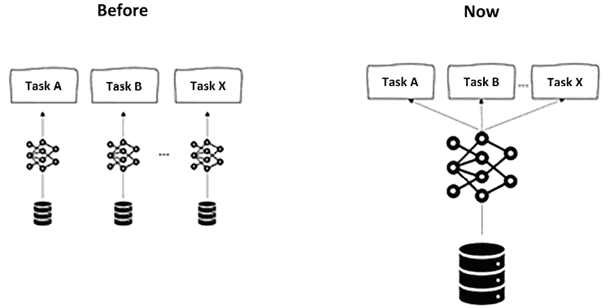
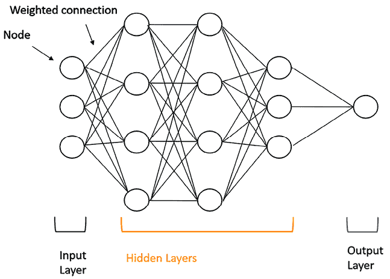
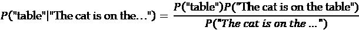
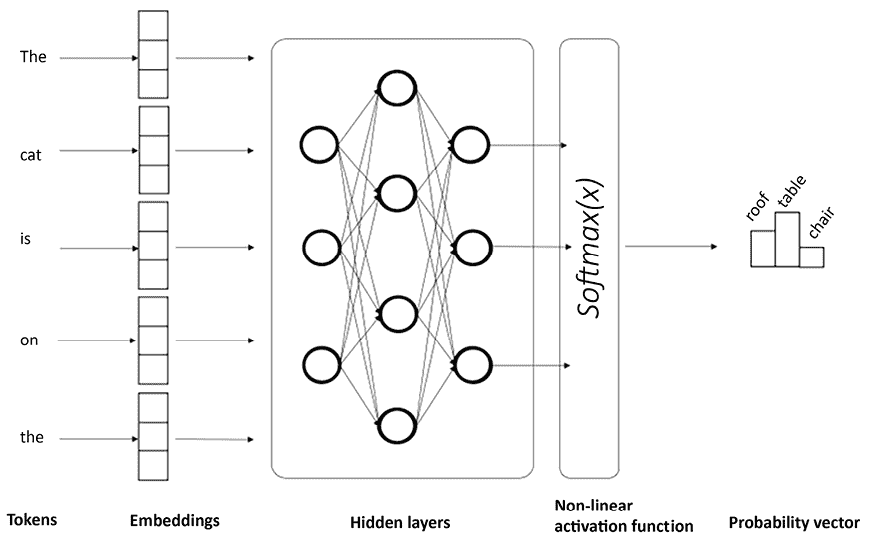
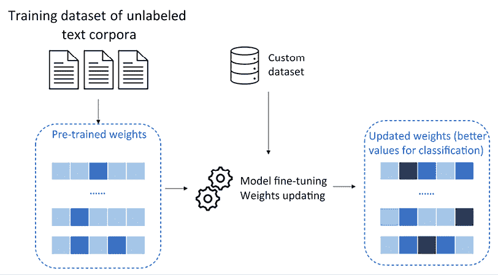

# 1

# 大型语言模型简介

亲爱的读者，欢迎来到《构建大型语言模型应用》！在这本书中，我们将探索新时代应用开发领域的迷人世界，其中**大型语言模型**（**LLMs**）是主要的主角。

在过去的一年里，我们都领略了生成式**人工智能**（**AI**）工具如 ChatGPT、Bing Chat、Bard 和 Dall-E 的强大功能。最让我们印象深刻的是它们基于用户用自然语言提出的请求生成类似人类内容的能力。实际上，正是它们的对话能力使它们易于消费，因此一进入市场就变得非常受欢迎。多亏了这个阶段，我们学会了认可生成式 AI 及其核心模型：LLMs。然而，LLMs 不仅仅是语言生成器。它们也可以被视为推理引擎，可以成为我们智能应用的头脑。

在这本书中，我们将看到如何构建 LLM 驱动的应用的理论和实践，解决各种场景，并展示进入这个 AI 新时代软件开发领域的新组件和框架。本书将从*第一部分*开始，我们将介绍 LLMs 背后的理论，目前市场上最有前途的 LLMs，以及 LLM 驱动的应用的新兴框架。之后，我们将进入实践部分，在那里我们将使用各种 LLMs 实现许多应用，解决不同的场景和现实世界问题。最后，我们将以第三部分结束本书，涵盖 LLMs 领域的兴起趋势，以及 AI 工具的风险以及如何通过负责任的 AI 实践来减轻这些风险。 

因此，让我们深入探讨，并从我们所处环境的定义开始。本章提供了对 LLMs（大型语言模型）的介绍和深入探讨，LLMs 是一组强大的深度学习神经网络，其特点在于生成式 AI 领域。

在本章中，我们将涵盖以下主题：

+   理解 LLMs，它们与经典机器学习模型的区别，以及相关的术语

+   最受欢迎的 LLM 架构概述

+   LLMs 的训练和消费方式

+   基础 LLMs 与微调 LLMs

到本章结束时，你将具备 LLMs 是什么、它们如何工作以及如何使它们更适合你应用的基本知识。这将为本书实践部分的 LLMs 具体应用铺平道路，在那里我们将看到如何在实践中将 LLMs 嵌入到你的应用中。

# 什么是大型基础模型和 LLMs？

LLMs 是基于深度学习的模型，使用大量参数从大量未标记的文本中学习。它们可以执行各种自然语言处理任务，如识别、总结、翻译、预测和生成文本。

**定义**

**深度学习**是机器学习的一个分支，其特征是具有多层神经网络的，因此得名“深度”。这些深度神经网络可以自动学习层次化的数据表示，每一层从输入数据中提取越来越抽象的特征。这些网络的深度指的是它们所拥有的层数，这使得它们能够有效地模拟复杂数据集中复杂的关系和模式。

LLMs 属于一个更广泛的模型集合，它包括人工智能子领域生成式人工智能的：**大型基础模型**（LFMs）。因此，在接下来的章节中，我们将探讨 LFMs 和 LLMs 的兴起和发展，以及它们的技术架构，这是理解它们的功能并在您的应用程序中正确采用这些技术的一个关键任务。

我们将首先了解为什么 LFMs 和 LLMs 与传统人工智能模型不同，以及它们如何代表这一领域的范式转变。然后我们将探讨 LLMs 的技术功能，它们是如何工作的，以及它们结果背后的机制。

## 人工智能范式转变——基础模型简介

基础模型指的是一种预训练的生成式人工智能模型，通过适应各种特定任务而提供极大的灵活性。这些模型在大量且多样化的数据集上进行广泛的训练，使它们能够掌握数据中的普遍模式和关系——不仅限于文本，还包括其他数据格式，如图像、音频和视频。这个初始的预训练阶段使模型在各个领域拥有强大的基础理解，为后续的微调奠定了基础。这种跨领域的功能将生成式人工智能模型与标准的**自然语言理解**（NLU）算法区分开来。

**注意**

生成式人工智能和 NLU 算法都与**自然语言处理**（NLP）相关，这是人工智能的一个分支，处理人类语言。然而，它们有不同的目标和应用。

生成式人工智能与 NLU 算法之间的区别在于，生成式人工智能旨在创建新的自然语言内容，而 NLU 算法旨在理解现有的自然语言内容。生成式人工智能可用于文本摘要、文本生成、图像标题或风格转换等任务。NLU 算法可用于聊天机器人、问答、情感分析或机器翻译等任务。

基础模型的设计考虑到了迁移学习，这意味着它们可以有效地将预训练期间获得的知识应用于新的相关任务。这种知识的迁移增强了它们的适应性，使它们能够以相对较少的额外训练快速掌握新任务。

基础模型的一个显著特征是其庞大的架构，包含数百万甚至数十亿个参数。这种广泛的规模使它们能够捕捉数据中的复杂模式和关系，从而有助于它们在各个任务中表现出色。

由于它们具有全面的预训练和迁移学习能力，基础模型展现出强大的泛化能力。这意味着它们可以在各种任务中表现出色，并能够高效地适应新的、未见过的数据，从而消除了为单个任务训练单独模型的需求。

这种人工神经网络设计的范式转变带来了相当大的优势，因为基础模型，凭借其多样化的训练数据集，可以根据用户的意图适应不同的任务，而不会损害性能或效率。在过去，为每个任务，如命名实体识别或情感分析，创建和训练不同的神经网络是必要的，但现在，基础模型为多个应用提供了一个统一且强大的解决方案。



图 1.1：从特定任务的模型到通用模型

现在，我们说 LFMs 是在大量不同格式的异构数据上训练的。当这些数据是无结构化的自然语言数据时，我们将其输出的 LFM 称为 LLM，因为它专注于文本理解和生成。


图 1.2：LLM 的特征

因此，我们可以说 LLM 是一种专门为 NLP 任务设计的基础模型。这些模型，如 ChatGPT、BERT、Llama 以及许多其他模型，都是在大量文本数据上训练的，可以生成类似人类的文本，回答问题，执行翻译等。

然而，LLM 并不仅限于执行与文本相关的任务。正如我们将在整本书中看到的那样，这些独特的模型可以被视为推理引擎，在常识推理方面非常出色。这意味着它们可以帮助我们完成复杂任务，分析问题解决，增强信息片段之间的联系和洞察力。

事实上，由于 LLM 模仿我们大脑的构建方式（我们将在下一节中看到），它们的架构以连接的神经元为特征。现在，人类大脑大约有 100 万亿个连接，远多于 LLM 中的连接。尽管如此，LLM 已经证明在将大量知识打包到这些较少的连接中比我们做得更好。

## LLM 的内部结构

LLM 是一种特定类型的人工神经网络（**ANNs**）：受人类大脑结构和功能启发的计算模型。它们已被证明在解决复杂问题方面非常有效，尤其是在模式识别、分类、回归和决策任务等领域。

人工神经网络（ANN）的基本构建块是人工神经元，也称为节点或单元。这些神经元被组织成层，神经元之间的连接被加权以表示它们之间关系的强度。这些权重代表了模型在训练过程中将要优化的**参数**。

根据定义，ANNs 是处理数值数据的数学模型。因此，当涉及到 LLMs 上下文中的非结构化文本数据时，有两个基本活动是必需的，以便将数据准备为模型输入：

+   **分词**：这是将文本片段（句子、段落或文档）分解成称为标记的更小单位的过程。这些标记可以是单词、子词，甚至字符，具体取决于选择的分词方案或算法。分词的目的是创建一个结构化的文本表示，可以轻松地被机器学习模型处理。


图 1.3：分词示例

+   **嵌入**：一旦文本被分词，每个标记就会被转换成一个密集的数值向量，称为嵌入。嵌入是将单词、子词或字符表示为连续向量空间中的方法。这些嵌入是在语言模型的训练过程中学习的，并捕捉标记之间的语义关系。这种数值表示允许模型在标记上执行数学运算，并理解它们出现的上下文。


图 1.4：嵌入示例

总结来说，分词将文本分解成称为标记的更小单位，嵌入将这些标记转换成密集的数值向量。这种关系使得 LLM 能够以有意义和上下文感知的方式处理和理解文本数据，从而使其能够以令人印象深刻的准确性执行广泛的 NLP 任务。

例如，让我们考虑一个二维嵌入空间，我们想要将单词“Man”、“King”、“Woman”和“Queen”向量化。想法是这些单词之间的数学距离应该代表它们的语义相似性。以下图表展示了这一点：


图 1.5：2D 空间中词语嵌入的示例

因此，如果我们正确地嵌入单词，关系**King** – **Man** + **Woman** ≈ **Queen**应该成立。

一旦我们有了向量化的输入，我们就可以将其传递到多层神经网络中。主要有三种类型的层：

+   **输入层**：神经网络的第一层接收输入数据。该层中的每个神经元对应输入数据的一个特征或属性。

+   **隐藏层**：在输入层和输出层之间，可以有一个或多个隐藏层。这些层通过一系列数学变换处理输入数据，并从数据中提取相关模式和表示。

+   **输出层**：神经网络的最外层产生所需的输出，这可能是预测、分类或其他相关结果，具体取决于神经网络设计用于的任务。



图 1.6：通用 ANN 的高级架构

训练 ANN 的过程涉及通过迭代调整神经元之间连接的权重来进行的**反向传播**过程，基于训练数据和期望的输出。

**定义**

**反向传播**是深度学习中用于训练神经网络的算法。它涉及两个阶段：正向传递，其中数据通过网络传递以计算输出，以及反向传递，其中错误被反向传播以更新网络的参数并提高其性能。这个迭代过程帮助网络从数据中学习并做出准确的预测。

在反向传播过程中，网络通过比较其预测与真实值以及最小化它们之间的错误或损失来学习。训练的目的是找到最优的权重集，使神经网络能够对新、未见过的数据进行准确的预测。

ANN 的架构可以有所不同，包括层数、每层的神经元数量以及它们之间的连接。

当提到生成式 AI 和 LLMs 时，它们根据我们的提示生成文本的非凡能力基于贝叶斯定理的统计概念。

**定义**

贝叶斯定理，以托马斯·贝叶斯牧师的名字命名，是概率论和统计学中的一个基本概念。它描述了如何根据新证据更新假设的概率。贝叶斯定理在我们想要在不确定性存在的情况下对未知参数或事件进行推理时特别有用。根据贝叶斯定理，给定两个事件 A 和 B，我们可以定义 A 在给定 B 的条件概率：


其中：

+   *P*(*B*|*A*) = 在给定 *A* 的条件下 *B* 发生的概率，也称为在固定的 *B* 条件下 *A* 的似然性。

+   *P*(*A*|*B*) = 在给定 *B* 的条件下 *A* 发生的概率；也称为在给定 *B* 的 *A* 的后验概率。

+   *P*(*A*)和*P*(*B*) = 在没有任何条件下观察 *A* 或 *B* 的概率。

贝叶斯定理将基于新证据的事件的条件概率与事件的事先概率联系起来。在 LLMs 的语境中，我们说的是这样一个模型通过预测用户提示的前一个词之后最有可能的词来工作。

但 LLM 如何知道下一个最有可能的词是什么？嗯，多亏了 LLM 在训练过程中所训练的巨大数据量（我们将在下一节更深入地探讨 LLM 的训练过程）。基于训练文本语料库，模型将能够根据用户的提示识别出下一个最有可能的词，或者更普遍地说，是文本补全。

例如，让我们考虑以下提示：“*猫在……上.*”并且我们希望我们的 LLM 来完成这个句子。然而，LLM 可能会生成多个候选词，因此我们需要一种方法来评估哪个候选词最有可能。为此，我们可以使用贝叶斯定理来选择给定上下文中最有可能的词。让我们看看所需的步骤：

+   **先验概率** **P**(**A**): 先验概率表示每个候选词作为上下文中的下一个词的概率，这是基于语言模型在训练期间学习到的知识。假设 LLM 有三个候选词：“桌子”、“椅子”和“屋顶”。

P(“桌子”)，P(“椅子”)和 P(“屋顶”)是每个候选词的先验概率，基于语言模型对训练数据中这些词频率的了解。

+   **似然度** (**P**(**B**|**A**)): 似然度表示每个候选词与上下文“猫在……上”的匹配程度。这是在给定每个候选词的情况下观察上下文的概率。LLM 根据训练数据和每个词在类似上下文中的出现频率来计算这个概率。

例如，如果 LLM 看到许多“猫在桌子上”的实例，它会给“桌子”作为给定上下文中的下一个词赋予高似然度。同样，如果它看到许多“猫在椅子上”的实例，它会给“椅子”作为下一个词赋予高似然度。

P(“猫在桌子上”)，P(“猫在椅子上”)和 P(“猫在屋顶上”)是给定上下文时每个候选词的似然度。

+   **后验概率** (**P**(**A**|**B**)): 使用贝叶斯定理，我们可以根据先验概率和似然度计算每个候选词的后验概率：




+   **选择最有可能的词**。在计算每个候选词的后验概率后，我们选择后验概率最高的词作为最有可能的下一个词来完成句子。

LLM 使用贝叶斯定理和训练期间学习到的概率来生成上下文相关且有意义的内容，捕捉训练数据中的模式和关联，以连贯的方式完成句子。

下图展示了这如何转化为神经网络架构框架：



图 1.7：在 LLM 中预测下一个最有可能的词

**注意**

ANN 的最后一层通常是非线性激活函数。在上面的图中，该函数是 Softmax，这是一个将实数向量转换为概率分布的数学函数。它在机器学习中常用于归一化神经网络或分类器的输出。Softmax 函数的定义如下：


其中 z[i]是输入向量的第*i*个元素，K 是向量中的元素数量。Softmax 函数确保输出向量的每个元素都在 0 到 1 之间，并且所有元素的总和为 1。这使得输出向量适合表示不同类别或结果的概率。

总体而言，人工神经网络（ANNs）是生成式 AI 模型发展的核心支柱：得益于它们的分词、嵌入和多层隐藏机制，它们能够在最无结构的数据中捕捉复杂的模式，例如自然语言。

然而，我们今天所观察到的模型展示出前所未有的惊人能力，这归功于近年来引入的特定的人工神经网络架构框架，它是 LLM 发展的主要推动者。这个框架被称为 Transformer，我们将在下一节中介绍。

# 最流行的基于 LLM 的 Transformer 架构

正如我们在前面的章节中看到的，人工神经网络（ANNs）是 LLMs 的核心。然而，为了成为*生成式*的，这些 ANNs 需要具备一些特殊能力，例如并行处理文本句子或保持先前上下文的记忆。

这些特殊能力是过去几十年生成式 AI 研究的核心，从 20 世纪 80 年代和 90 年代开始。然而，直到最近几年，这些早期模型的主要缺点——如文本并行处理能力或内存管理——才被现代生成式 AI 框架所克服。这些框架被称为**Transformer**。

在接下来的章节中，我们将探讨生成式 AI 模型架构的演变，从早期发展到最先进的 Transformer。我们将首先介绍为后续研究铺平道路的第一个生成式 AI 模型，突出它们的局限性以及克服这些局限性的方法。然后，我们将探讨基于 Transformer 的架构的引入，涵盖它们的主要组件，并解释为什么它们代表了 LLMs 的当前最佳水平。

## 早期实验

第一个流行的生成式 AI 人工神经网络架构可以追溯到 20 世纪 80 年代和 90 年代，包括：

+   **循环神经网络（RNNs**）：RNNs 是一种设计用于处理序列数据的 ANN。它们具有循环连接，允许信息在时间步之间持续存在，这使得它们适合语言建模、机器翻译和文本生成等任务。然而，由于梯度消失或爆炸问题，RNNs 在捕捉长距离依赖方面存在局限性。

    **定义**

    在 ANNs 中，梯度是衡量如果我们稍微调整模型的内部参数（权重），模型性能将提高多少的度量。在训练过程中，RNNs 通过根据损失函数的梯度调整其权重来最小化其预测与实际目标之间的差异。在 RNNs 的训练过程中，当梯度变得极其小或大时，会出现梯度消失或爆炸的问题。梯度消失问题发生在训练过程中梯度变得极其小的时候。结果，RNN 学习非常缓慢，难以在数据中捕捉长期模式。相反，梯度爆炸问题发生在梯度变得极其大的情况下。这导致训练不稳定，并阻止 RNN 收敛到良好的解决方案。

+   **长短期记忆（LSTM**）：LSTMs 是 RNNs 的一种变体，它解决了梯度消失问题。它们引入了门控机制，使得在更长的序列中更好地保留重要信息。LSTMs 在文本生成、语音识别和情感分析等各种序列任务中变得流行。

这些架构在处理各种生成任务时非常流行且有效，但在处理长距离依赖、可扩展性和整体效率方面存在局限性，尤其是在处理需要大量并行处理的大规模自然语言处理任务时。为了克服这些局限性，引入了 transformer 框架。在下一节中，我们将看到基于 transformer 的架构如何克服上述局限性，并成为现代生成式 AI 大型语言模型的核心。

## 介绍 transformer 架构

Transformer 架构是由 Vaswani 等人于 2017 年在论文“Attention Is All You Need”中引入的深度学习模型。它彻底改变了 NLP 和其他序列到序列任务。

Transformer 完全摒弃了循环和卷积，完全依赖于**注意力机制**来编码和解码序列。

**定义**

在 transformer 架构中，“注意力”是一种机制，它使模型能够在生成输出时关注输入序列的相关部分。它计算输入和输出位置之间的注意力分数，应用 Softmax 得到权重，并对输入序列进行加权求和以获得上下文向量。注意力对于捕捉数据中单词之间的长距离依赖和关系至关重要。

由于转换器对当前正在编码的相同序列使用注意力，我们将其称为**自注意力**。自注意力层负责确定每个输入标记在生成输出中的重要性。它们回答了这样的问题：“*我应该关注输入的哪一部分？*”

为了获得一个句子的自注意力向量，我们需要的是“值”、“查询”和“键”。这些矩阵用于计算输入序列中元素之间的注意力分数，并且在训练过程中学习到的三个权重矩阵（通常用随机值初始化）。更具体地说，它们的作用如下：

+   查询（*Q*）用于表示注意力机制当前的关注点

+   键（*K*）用于确定输入的哪些部分应该给予注意力

+   值（*V*）用于计算上下文向量

它们可以表示如下：


图 1.8：输入矩阵分解为 Q、K 和 V 向量

这些矩阵然后相乘并通过非线性变换（归功于 Softmax 函数）。自注意力层的输出以转换的、上下文感知的方式表示输入值，这使得转换器能够根据任务关注输入的不同部分。


图 1.9：Q、K 和 V 矩阵乘法以获得上下文向量

数学公式如下：


从架构角度来看，转换器由两个主要组件组成，一个编码器和一个解码器：

+   **编码器**接收输入序列并生成一系列隐藏状态，每个隐藏状态都是所有输入嵌入的加权和。

+   **解码器**接收输出序列（右移一个位置）并生成一系列预测，每个预测都是所有编码器隐藏状态和前一个解码器隐藏状态的加权和。

**注意**

在解码器层中将输出序列右移一个位置的原因是为了防止模型在预测下一个标记时看到当前标记。这是因为模型被训练来根据输入序列生成输出序列，输出序列不应依赖于自身。通过将输出序列右移，模型只能看到前一个标记作为输入，并学习根据输入序列和前一个输出标记来预测下一个标记。这样，模型可以学习生成连贯且有意义的话语，而不作弊。

下面的插图来自原始论文，展示了转换器架构：


图 1.10：简化的转换器架构

让我们检查每个构建块，从编码部分开始：

+   **输入嵌入**：这些是分词输入文本的向量表示。

+   **位置编码**：由于 Transformer 没有固有的词序感（与具有序列性质的 RNN 不同），因此需要向输入嵌入中添加位置编码。这些编码提供了关于输入序列中单词位置的信息，使模型能够理解标记的顺序。

+   **多头注意力层**：这是一种机制，其中多个自注意力机制并行地作用于输入数据的不同部分，产生多个表示。这允许 Transformer 模型并行地关注输入数据的各个部分，并从多个角度汇总信息。

+   **加和归一化层**：这结合了逐元素加法和层归一化。它将层的输出添加到原始输入中，然后应用层归一化以稳定和加速训练。这种技术有助于减轻梯度相关的问题，并提高模型在序列数据上的性能。

+   **前馈层**：负责将注意力层的归一化输出转换为适合最终输出的表示，使用非线性激活函数，如之前提到的 Softmax。

Transformer 的解码部分从与编码部分类似的过程开始，其中目标序列（输出序列）经过输入嵌入和位置编码。让我们了解这些模块：

+   **输出嵌入（右移**）：对于解码器，目标序列通过“右移”一个位置。这意味着在每个位置，模型试图预测原始目标序列中分析标记之后的标记。这是通过从目标序列中移除最后一个标记并用特殊的序列开始标记（开始符号）填充来实现的。这样，解码器在自回归解码期间根据先前的上下文学习生成正确的标记。

**定义**

自回归解码是一种从模型生成输出序列的技术，该模型根据先前输出的标记预测每个输出标记。它常用于 NLP 任务，如机器翻译、文本摘要和文本生成。

自回归解码通过向模型提供一个初始标记，例如序列开始符号，然后使用模型的预测作为下一个输入标记。这个过程重复进行，直到模型生成一个序列结束符号或达到最大长度。输出序列是所有预测标记的串联。

+   **解码层**：与编码块类似，这里我们也有位置编码、多头注意力、加和归一化以及前馈层，它们的作用与编码部分相同。

+   **线性与 Softmax**：这些层分别对输出向量应用线性和非线性变换。非线性变换（Softmax）将输出向量转换为概率分布，对应于一组候选词。概率向量中最大元素对应的词将是整个过程的输出。

变压器架构为现代大型语言模型（LLM）铺平了道路，并且在其原始框架的基础上也出现了许多变体。

一些模型仅使用编码器部分，例如**BERT（变换器双向编码器表示**），它被设计用于 NLU 任务，如文本分类、问答和情感分析。

其他模型仅使用解码器部分，例如**GPT-3（生成式预训练变换器 3**），它被设计用于自然语言生成任务，如文本补全、摘要和对话。

最后，还有一些模型同时使用编码器和解码器部分，例如**T5（文本到文本迁移变换器**），它被设计用于各种可以将之视为文本到文本转换的 NLP 任务，如翻译、改写和文本简化。

不论是哪种变体，变压器的核心组件——注意力机制——在 LLM 架构中保持不变，这也代表了为什么这些框架在生成式 AI 和 NLP 的背景下获得了如此多的关注。

然而，LLM 的架构变体并不是唯一影响该模型功能特性的元素。这种功能实际上还受到模型所知道的内容的影响，这取决于其训练数据集，以及它根据其评估指标如何有效地应用其知识。

在下一节中，我们将涵盖训练和评估 LLM 的过程，并提供区分不同 LLM 以及了解在特定应用场景中应使用哪个 LLM 所需的指标。

# 训练和评估 LLM

在前面的章节中，我们看到了选择 LLM 架构在确定其功能方面是一个关键步骤。然而，输出文本的质量和多样性在很大程度上取决于两个因素：训练数据集和评估指标。

训练数据集决定了 LLM 学习的数据类型以及它如何能够泛化到新的领域和语言。评估指标衡量 LLM 在特定任务和基准测试上的表现，以及它与其他模型和人类作者的比较。因此，选择合适的训练数据集和评估指标对于开发和评估 LLM 至关重要。

在本节中，我们将讨论在选择和使用不同训练数据集和评估指标时涉及的一些挑战和权衡，以及该领域的一些最新发展和未来方向。

## 训练 LLM

根据定义，LLMs 在规模上是非常大的，从两个方面来看：

+   **参数数量**：这是 LLM 架构复杂性的度量，表示神经元之间的连接数量。复杂的架构有数千层，每一层都有多个神经元，这意味着在层之间，我们将有多个带有相关参数（或权重）的连接。

+   **训练集**：这指的是 LLM 学习和训练其参数的无标签文本语料库。为了说明 LLM 的文本语料库可能有多大，让我们考虑 OpenAI 的 GPT-3 训练集：


图 1.11：GPT-3 知识库

考虑以下假设：

+   1 个 token 约等于 4 个英文字符

+   1 个 token 约等于 3/4 个单词

我们可以得出结论，GPT-3 大约训练了**3740 亿个单词**。

因此，一般来说，LLMs 是在大规模数据集上使用无监督学习进行训练的，这些数据集通常包含从互联网上不同来源收集的数十亿个句子。转换器架构，凭借其自注意力机制，允许模型有效地处理长序列的文本并捕捉词语之间的复杂依赖关系。训练此类模型需要庞大的计算资源，通常采用具有多个**图形处理单元**（**GPUs**）或**张量处理单元**（**TPUs**）的分布式系统。

**定义**

张量是数学和计算机科学中使用的多维数组。它包含数值数据，在机器学习等领域是基础性的。

TPU 是谷歌为深度学习任务创建的专用硬件加速器。TPU 针对张量运算进行了优化，使其在训练和运行神经网络时效率极高。它们在消耗较少能量的同时提供快速处理，使数据中心能够更快地进行模型训练和推理。

训练过程涉及对数据集的多次迭代，使用优化算法反向传播微调模型的参数。通过这个过程，基于转换器的语言模型能够深入理解语言模式、语义和上下文，使它们在从文本生成到情感分析和机器翻译的广泛 NLP 任务中表现出色。

以下是在 LLM 训练过程中的主要步骤：

1.  **数据收集**：这是从各种来源收集大量文本数据的过程，例如公开网络、书籍、新闻文章、社交媒体等。数据应该是多样化的、高质量的，并且能够代表 LLM 将遇到的自然语言。

1.  **数据预处理**：这是清洗、过滤和格式化数据以供训练的过程。这可能包括删除重复项、噪声或敏感信息，将数据分割成句子或段落，将文本标记化成子词或字符等。

1.  **模型架构**：这是设计 LLM 的结构和参数的过程。这可能包括选择神经网络类型（如 transformer）及其结构（如仅解码器、仅编码器或编码器-解码器），层数和大小，注意力机制，激活函数等。

1.  **模型初始化**：这是为 LLM（大型语言模型）的权重和偏差分配初始值的过程。这可能通过随机分配或使用来自另一个模型的预训练权重来完成。

1.  **模型预训练**：这是通过向 LLM 提供数据批次并计算损失函数来更新 LLM 的权重和偏差的过程。损失函数衡量 LLM 在给定前一个标记的情况下预测下一个标记的能力。LLM 通过使用调整权重和偏差以减少损失的方向的**优化算法**（如梯度下降）来尝试最小化损失。模型训练可能需要多个 epoch（在整个数据集上的迭代）才能收敛到低损失值。

**定义**

在神经网络背景下，训练过程中的优化算法是用于找到最小化预测误差或最大化训练数据准确性的模型最佳权重集的方法。神经网络中最常见的优化算法是**随机梯度下降**（**SGD**），它根据误差函数的梯度以及当前输入输出对来以小步骤更新权重。SGD 通常与前面在本章中定义的**反向传播**相结合。

预训练阶段的输出被称为基础模型。

1.  **微调**：基础模型通过包含（提示，理想响应）元组的监督数据集进行监督训练。这一步骤是使基础模型更符合 AI 助手（如 ChatGPT）的必要步骤。这一阶段的输出被称为**监督微调**（**SFT**）模型。

1.  **从人类反馈中进行强化学习**（**RLHF**）：这一步骤包括通过更新其部分参数来迭代优化 SFT 模型（相对于奖励模型，通常是另一个结合人类偏好的 LLM 训练的模型）。

**定义**

**强化学习**（**RL**）是机器学习的一个分支，专注于通过与环境交互来训练计算机做出最优决策。计算机不是被给予明确的指令，而是通过试错来学习：通过探索环境和为其行为获得奖励或惩罚。强化学习的目标是找到最优行为或策略，以最大化给定模型的预期奖励或价值。为此，RL 过程涉及一个**奖励模型**（**RM**），能够为计算机提供“偏好分数”。在 RLHF 的背景下，RM 被训练以结合人类偏好。

注意，RLHF（人类反馈强化学习）是实现人工智能系统与人类对齐的关键里程碑。由于生成人工智能领域的快速进展，持续赋予那些强大的 LLM（大型语言模型）以及更广泛的 LFM（语言模型）以人类典型的偏好和价值至关重要。

一旦我们训练好模型，接下来的最后一步就是评估其性能。

## 模型评估

评估传统的 AI 模型在某些方面是相当直观的。例如，让我们考虑一个图像分类模型，它必须确定输入图像代表的是狗还是猫。因此，我们在一组标记图像的训练数据集上训练我们的模型，一旦模型训练完成，我们就在未标记的图像上对其进行测试。评估指标仅仅是测试集中正确分类的图像占总图像数量的百分比。

当涉及到 LLM 时，情况略有不同。因为这些模型是在未标记的文本上训练的，并且不是针对特定任务的，而是根据用户的提示具有通用性和适应性，传统的评估指标不再适用。评估一个 LLM 意味着，在众多方面中，测量其语言流畅性、连贯性以及根据用户请求模仿不同风格的能力。

因此，需要引入一套新的评估框架。以下是最常用的用于评估 LLM 的框架：

+   **通用语言理解评估**（**GLUE**）和**SuperGLUE**：这个基准用于衡量 LLM 在多种自然语言理解（NLU）任务上的性能，如情感分析、自然语言推理、问答等。在 GLUE 基准上的分数越高，LLM 在不同任务和领域上的泛化能力就越强。

最近，它演变成一个以 GLUE 为风格的新基准，称为**SuperGLUE**，它包含更困难的任务。它包括八个具有挑战性的任务，这些任务比 GLUE 需要更高级的推理技能，例如自然语言推理、问答、指代消解等，一个广泛的覆盖诊断集，测试模型在多种语言能力和失败模式上的表现，以及一个根据模型在所有任务上的平均分数进行排名的排行榜。

GLUE 和 SuperGLUE 基准之间的区别在于，SuperGLUE 基准比 GLUE 基准更具挑战性和现实性，因为它涵盖了更复杂的任务和现象，要求模型处理多个领域和格式，并且具有更高的基准人类性能。SuperGLUE 基准旨在推动更通用和鲁棒的 NLU 系统开发的研究。

+   **大规模多任务语言理解**（**MMLU**）：这个基准使用零样本和少样本设置来衡量 LLM 的知识。

**定义**

零样本评估的概念是一种在没有任何标记数据或微调的情况下评估语言模型的方法。它通过使用自然语言指令或示例作为提示，并计算给定输入的正确输出的可能性来衡量语言模型执行新任务的能力。这是训练模型在没有需要标记的训练数据的情况下产生特定一组标记的概率。

这种设计增加了基准的复杂性，使其更接近于我们评估人类表现的方式。基准包含 14,000 个多项选择题，分为 57 组，涵盖 STEM、人文学科、社会科学和其他领域。它涵盖了从基础到高级专业水平的各种难度级别，评估了一般知识和解决问题的技能。主题包括传统领域，如数学和历史，以及法律和伦理等专门领域。广泛的主题范围和深度覆盖使该基准对于揭示模型知识中的任何差距非常有价值。评分基于特定主题的准确性和所有主题的平均准确性。

+   **HellaSwag**: HellaSwag 评估框架是一种评估 LLMs 在给定上下文中生成合理和常识性延续的方法。它基于 HellaSwag 数据集，这是一个包含 70,000 个多项选择题的集合，涵盖了多样化的领域和类型，如书籍、电影、食谱等。每个问题由一个上下文（描述情况或事件的几个句子）和四个可能的结尾（一个正确和三个错误）组成。结尾被设计成对 LLMs 来说难以区分，因为它们需要世界知识、常识推理和语言理解。

+   **TruthfulQA**: 该基准评估语言模型在生成问题回答的准确性。它包括 38 个类别（如健康、法律、金融和政治）中的 817 个问题。这些问题旨在模仿人类可能由于错误信念或误解而回答错误的问题。

+   **AI2 Reasoning Challenge** (**ARC**): 该基准用于衡量大型语言模型（LLMs）的推理能力，并刺激能够执行复杂自然语言理解（NLU）任务的模型的发展。它包含一个由 7,787 个多项选择题组成的科学问题数据集，旨在鼓励高级问答研究。数据集分为简单集和挑战集，后者仅包含需要复杂推理或额外知识才能正确回答的问题。基准还提供了一个包含超过 1400 万个科学句子的语料库，这些句子可以用作问题的支持证据。

重要的是要注意，每个评估框架都专注于特定的功能。具体来说，GLUE 基准关注语法、释义和文本相似性，而 MMLU 关注各个领域和任务中的泛化语言理解。因此，在评估 LLM 时，重要的是要清楚地了解最终目标，以便可以使用最相关的评估框架。或者，如果目标是任何任务中的最佳实践，那么关键不是只使用一个评估框架，而是多个框架的平均值。

此外，即使没有现成的 LLM 能够处理你的特定用例，你仍然有空间来定制这些模型，使它们更符合你的应用场景。在下一节中，我们确实将介绍 LLM 定制的现有技术，从最轻的（如提示工程）到从头开始训练整个 LLM。

# 基础模型与定制模型

LLMs 的优点在于它们已经被训练并准备好使用。正如我们在上一节中看到的，训练一个 LLM 需要大量的硬件投资（如 GPU 或 TPU），并且可能持续数月，这两个因素可能意味着对于个人和小企业来说并不可行。

幸运的是，预训练的 LLM 已经足够通用，可以应用于各种任务，因此可以直接通过它们的 REST API 进行消费（我们将在下一章中更深入地探讨模型消费）。

尽管如此，可能存在一些场景，通用 LLM 不足以应对，因为它缺乏特定领域的知识，或者不符合特定的沟通风格和分类法。如果是这种情况，你可能想要定制你的模型。

## 如何定制你的模型

定制模型主要有三种方法：

+   **扩展非参数化知识**：这允许模型在响应用户查询的同时访问外部信息源，以整合其参数化知识。

**定义**

LLMs（大型语言模型）表现出两种类型的知识：参数化和非参数化。参数化知识是嵌入在 LLM 参数中的，来源于训练阶段的无标签文本语料库。另一方面，非参数化知识是我们可以通过嵌入文档“附加”到模型上的。非参数化知识不会改变模型的结构，而是允许它通过外部文档导航，用作回答用户查询的相关上下文。

这可能涉及将模型连接到网络源（如维基百科）或具有特定领域知识的内部文档。LLM 与外部源的联系称为插件，我们将在本书的实践部分更深入地讨论它。

+   **少样本学习**：在这种类型的模型定制中，LLM 被给予一个包含少量示例（通常在 3 到 5 个之间）的**元提示**，每个新任务都被要求执行。模型必须使用其先验知识从这些示例中泛化以执行任务。

**定义**

元提示是一个可以用来通过几个示例提高 LLMs 在新任务上性能的消息或指令。

+   **微调**：微调过程涉及使用较小的、特定于任务的数据集来定制基础模型，以适用于特定应用。

这种方法与最初的方法不同，因为微调会改变和优化预训练模型的参数，使其针对特定任务。这是通过在针对新任务的小型标记数据集上训练模型来完成的。微调背后的关键思想是利用从预训练模型中学到的知识，并将其微调到新任务上，而不是从头开始训练模型。



图 1.12：微调过程示意图

在前面的图中，你可以看到一个关于在 OpenAI 预构建模型上如何进行微调的方案。想法是，你有一个带有通用权重或参数的预训练模型可用。然后，你用自定义数据来喂养你的模型，通常是“键值”提示和完成的格式：

```py
{"prompt": "<prompt text>", "completion": "<ideal generated text>"}
{"prompt": "<prompt text>", "completion": "<ideal generated text>"}
{"prompt": "<prompt text>", "completion": "<ideal generated text>"}
... 
```

一旦完成训练，你将拥有一个针对特定任务特别高效的定制模型，例如，你公司文档的分类。

微调的好处是，你可以根据你的用例定制预构建模型，而无需从头开始重新训练它们，同时利用较小的训练数据集，从而减少训练时间和计算。同时，模型保留了通过原始训练学到的生成能力和准确性，这是在大量数据集上发生的。

在第十一章“微调大型语言模型”中，我们将专注于在 Python 中微调你的模型，以便你可以测试它对你自己的任务。

在上述技术（你还可以将它们相互结合）之上，还有一个第四个技术，这是最“激进”的。它包括从头开始训练一个 LLM，你可能想自己构建或者从一个预构建的架构初始化。我们将在最后一章中看到如何接近这种技术。

# 摘要

在本章中，我们探讨了大型语言模型（LLMs）的领域，对其架构、功能和训练过程进行了技术深度分析。我们看到了最突出的架构，如基于 transformer 的框架，训练过程是如何工作的，以及自定义你自己的 LLM 的不同方法。

现在我们有了理解 LLMs 的基础。在下一章中，我们将看到如何使用它们，以及更具体地，如何用它们构建智能应用。

# 参考文献

+   所需的一切都是注意力：[1706.03762.pdf (arxiv.org)](https://arxiv.org)

+   人工智能可能导致的人类终结？杰弗里·辛顿在麻省理工学院科技评论的 EmTech Digital 演讲：[`www.youtube.com/watch?v=sitHS6UDMJc&t=594s&ab_channel=JosephRaczynski`](https://www.youtube.com/watch?v=sitHS6UDMJc&t=594s&ab_channel=JosephRaczynski)

+   Glue 基准测试: [`gluebenchmark.com/`](https://gluebenchmark.com/)

+   TruthfulQA: [`paperswithcode.com/dataset/truthfulqa`](https://paperswithcode.com/dataset/truthfulqa)

+   Hugging Face 开放式 LLM 排行榜: [`huggingface.co/spaces/optimum/llm-perf-leaderboard`](https://huggingface.co/spaces/optimum/llm-perf-leaderboard)

+   你认为你已经解决了问答问题？试试 ARC，AI2 推理挑战：[`arxiv.org/abs/1803.05457`](https://arxiv.org/abs/1803.05457)

# 加入我们的 Discord 社区

加入我们社区的 Discord 空间，与作者和其他读者进行讨论：

[`packt.link/llm`](https://packt.link/llm)


