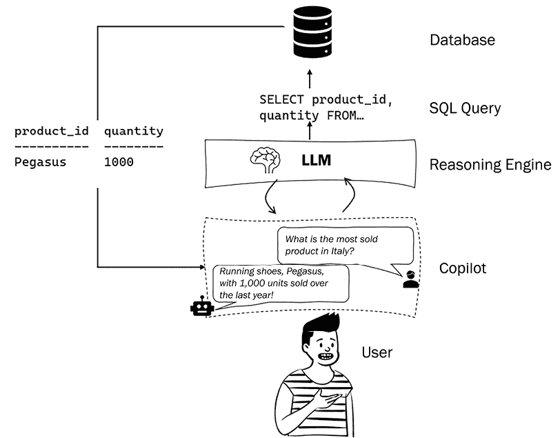
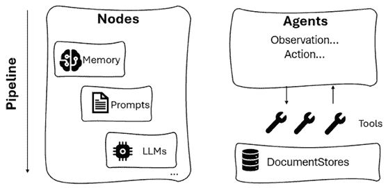
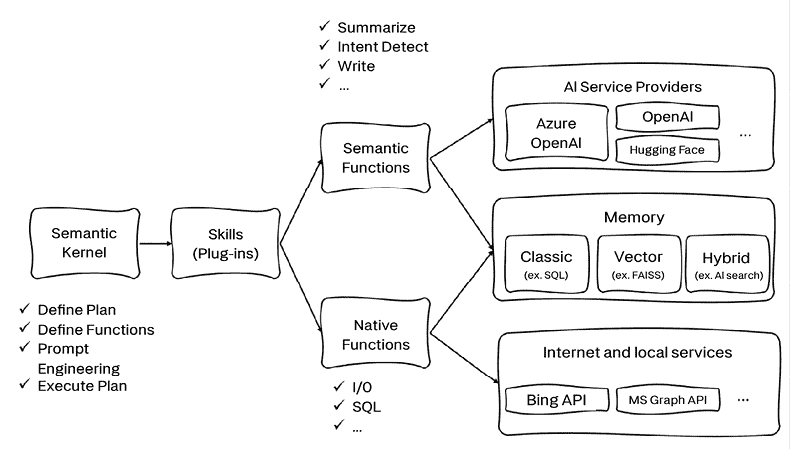

# 2

# LLMs for AI-Powered Applications

在*第一章*，*大型语言模型简介*中，我们介绍了**大型语言模型**（LLM）作为具有生成能力和强大常识推理能力的强大基础模型。现在，下一个问题是：我应该用这些模型做什么？

在本章中，我们将看到 LLM 如何改变软件开发的世界，引领一个由 AI 驱动的应用程序的新时代。到本章结束时，你将更清楚地了解如何利用新的 AI 编排器框架将 LLM 嵌入到不同的应用程序场景中，这些框架正在充斥着 AI 开发市场。

在本章中，我们将涵盖以下主题：

+   How LLMs are changing software development

+   协作者系统

+   将 AI 编排器引入以嵌入 LLM 到应用程序中

# How LLMs are changing software development

LLM 已被证明具有非凡的能力：从自然语言理解任务（摘要、命名实体识别和分类）到文本生成，从常识推理到头脑风暴技能。然而，它们并不仅仅如此出色。正如*第一章*中讨论的那样，LLM 以及一般而言的**大型基础模型**（LFM），正通过作为构建强大应用程序的平台而彻底改变软件开发。

事实上，开发者今天不必从头开始，他们可以直接调用一个托管版本的 LLM（大型语言模型），并根据他们的特定需求进行定制，正如我们在上一章所看到的。这种转变使得团队能够更轻松、更高效地将 AI 的力量融入他们的应用程序中，类似于过去从专用计算向分时系统的转变。

但在应用程序中具体如何整合 LLM 呢？在将 LLM 整合到应用程序时，有两个主要方面需要考虑：

+   **技术方面**，涉及*如何*。将 LLM 集成到应用程序中涉及通过 REST API 调用嵌入它们，并使用 AI 编排器进行管理。这意味着设置允许通过 API 调用无缝与 LLM 通信的架构组件。此外，使用 AI 编排器有助于在应用程序中高效地管理和协调 LLM 的功能，正如我们将在本章后面讨论的那样。

+   **概念方面**，涉及*什么*。LLM 带来了大量可以在应用程序中利用的新能力。这些能力将在本书的后续章节中详细探讨。一种看待 LLM 影响的方式是将它们视为一种新的软件类别，通常被称为*协作者*。这种分类突出了 LLM 在增强应用程序功能方面提供的重大帮助和协作。

我们将在本章后面深入探讨技术方面，而下一节将涵盖一个全新的软件类别——协作者系统。

# 飞行员系统

飞行员系统是一种新的软件类别，作为专家助手服务于试图完成复杂任务的用户。这个概念由微软提出，并已应用于其应用程序中，如 M365 Copilot 和新的 Bing，现在由 GPT-4 驱动。使用这些产品相同的框架，开发者现在可以构建自己的飞行员系统，将其嵌入到他们的应用程序中。

但飞行员系统究竟是什么？

如其名所示，飞行员系统旨在成为 AI 助手，与用户并肩工作，并在各种活动中支持他们，从信息检索到博客写作和发布，从头脑风暴想法到代码审查和生成。

以下是飞行员系统的一些独特特性：

+   **飞行员系统由 LLM 驱动**，或者更普遍地说，由 LFM（大型语言模型）驱动，这意味着这些是使飞行员“智能”的推理引擎。这个推理引擎是其组件之一，但并非唯一。飞行员还依赖于其他技术，如应用程序、数据源和用户界面，为用户提供有用且吸引人的体验。以下插图显示了这是如何工作的：

图 2.1：飞行员系统由一个大型语言模型（LLM）驱动

+   **飞行员系统被设计成具有会话式用户界面**，允许用户使用自然语言与之交互。这减少了或甚至消除了需要特定领域分类法（例如，查询表格数据需要了解编程语言如 T-SQL）的复杂系统与用户之间的知识差距。让我们看看这样一个对话的例子：

图 2.2：一个用于减少用户与数据库之间差距的会话式用户界面示例

+   **飞行员系统具有一个范围**。这意味着它被**定位**在特定领域的数据上，因此它只能在该应用或领域的范围内回答问题。

**定义**

定位是使用与特定用例相关、有用且不是 LLM 训练知识一部分的信息来使用 LLM 的过程。这对于确保输出的质量、准确性和相关性至关重要。例如，假设你想要一个由 LLM 驱动的应用程序，在研究最新的论文（不包括在你 LLM 的训练数据集中）时帮助你。你还希望你的应用程序只有在答案包含在这些论文中时才做出回应。为此，你需要将你的 LLM 定位到这些论文的集合上，这样你的应用程序就只能在这个范围内做出回应。

定位是通过一个名为检索增强生成（RAG）的架构框架实现的，这是一种在生成响应之前，通过结合外部权威知识库的信息来增强 LLM 输出的技术。这个过程有助于确保生成的内容是相关、准确且最新的。

什么是一个副驾驶和 RAG 之间的区别？RAG 可以被看作是一种具有副驾驶功能的架构模式。每当我们需要我们的副驾驶与特定领域的数据进行关联时，我们就使用 RAG 框架。请注意，RAG 并不是唯一可以具有副驾驶功能的架构模式：书中还将探讨其他框架，如函数调用或多智能体。

例如，假设我们在公司内部开发了一个副驾驶，允许员工与企业知识库进行聊天。虽然这很有趣，但我们不能为用户提供一个可以用来规划夏季旅行的副驾驶（这就像是在我们自己的托管成本下为用户提供一个类似 ChatGPT 的工具！）；相反，我们希望副驾驶仅关联到我们的企业知识库，以便它只能对特定领域的上下文相关的答案做出响应。

下图展示了副驾驶系统归一化的一个示例：

图 2.3：副驾驶归一化的示例

+   **通过技能扩展副驾驶的能力**，这些技能可以是代码或对其他模型的调用。实际上，LLM（我们的推理引擎）可能有两种类型的限制：

    +   **有限的参数知识**。这是由于知识库截止日期，这是 LLM（大型语言模型）的一个生理特征。事实上，它们的训练数据集总是会“过时”，不符合当前趋势。这可以通过添加具有归一化的非参数知识来克服，正如之前所看到的。

    +   **缺乏执行权力**。这意味着 LLM 本身没有执行动作的权限。让我们以众所周知的 ChatGPT 为例：如果我们要求它生成一篇关于生产力技巧的 LinkedIn 帖子，那么我们就需要将其复制粘贴到我们的 LinkedIn 个人资料上，因为 ChatGPT 本身无法这样做。这就是为什么我们需要插件的原因。插件是 LLM 连接外部世界的中介，不仅作为扩展 LLM 非参数知识的输入源（例如，允许网络搜索），而且还作为输出源，以便副驾驶实际上可以执行动作。例如，通过 LinkedIn 插件，我们由 LLM 驱动的副驾驶不仅能够生成帖子，还可以将其发布到网上。

    图 2.4：Wikipedia 和 LinkedIn 插件的示例

注意，用户的自然语言提示并不是模型处理的唯一输入。实际上，它是我们 LLM（大型语言模型）驱动应用程序的后端逻辑以及我们提供给模型的一组指令的关键组成部分。这种*元提示*或系统消息是新学科**提示工程**的研究对象。

**定义**

提示工程是设计并优化用于各种应用和研究主题的 LLMs 提示的过程。提示是用于引导 LLM 输出的简短文本片段。提示工程技能有助于更好地理解 LLMs 的能力和局限性。

提示工程涉及选择能够从 LLM 中获得期望响应的正确单词、短语、符号和格式。提示工程还涉及使用其他控制手段，如参数、示例或数据源，来影响 LLM 的行为。例如，如果我们想让我们的 LLM 驱动应用为 5 岁的孩子生成响应，我们可以在类似“扮演一个向 5 岁孩子解释复杂概念的教师”的系统消息中指定这一点。

事实上，安德烈·卡帕西（Andrej Karpathy），特斯拉前 AI 总监，于 2023 年 2 月重返 OpenAI，他在推特上表示：“英语是最新最热门的编程语言。”

我们将在第四章“提示工程”中更深入地探讨提示工程的概念。在下一节中，我们将重点关注新兴的 AI 编排器。

# 介绍 AI 编排器以将 LLMs 嵌入应用中

在本章的早期部分，我们了解到在将大型语言模型（LLMs）整合到应用中时，需要考虑两个主要方面：技术方面和概念方面。虽然我们可以用名为 Copilot 的全新软件类别来解释概念方面，但在本节中，我们将进一步探讨如何在我们的应用中技术性地嵌入和编排 LLMs。

## AI 编排器的主要组件

从一方面来看，基础模型范式转变意味着在 AI 驱动应用领域的大大简化：在生成模型之后，现在的趋势是消费模型。另一方面，在开发这种新型 AI 时可能会遇到许多障碍，因为 LLM 相关的组件是全新的，以前从未在应用生命周期中管理过。例如，可能会有恶意行为者试图更改 LLM 指令（前面提到的系统消息），以便应用不遵循正确的指令。这是一个典型的 LLM 驱动应用的新安全威胁示例，需要用强大的反击或预防技术来解决。

下图展示了此类应用的主要组件：

图 2.5：LLM 驱动应用的高级架构

让我们详细检查这些组件的每个部分：

+   **模型**：模型就是我们决定嵌入到我们的应用中的 LLM 类型。模型主要有两大类：

    +   **专有 LLM**：由特定公司或组织拥有的模型。例如，由 OpenAI 开发的 GPT-3 和 GPT-4，或由 Google 开发的 Bard。由于它们的源代码和架构不可用，这些模型不能从零开始使用自定义数据进行重新训练，但在需要时可以进行微调。

    +   **开源模型**：带有代码和架构的模型可以自由获取和分发，因此也可以从零开始使用自定义数据进行训练。例如，由阿布扎比的**技术创新研究所**（**TII**）开发的 Falcon LLM，或由 Meta 开发的 LLaMA。

我们将在第三章 *选择适合您应用的 LLM* 中更深入地探讨目前可用的主要 LLM 集合。

+   **记忆**：LLM 应用通常使用对话界面，这需要能够在对话中回溯到之前的信息。这是通过一个“记忆”系统实现的，该系统允许应用程序存储和检索过去的交互。请注意，过去的交互也可能构成要添加到模型中的额外非参数知识。为了实现这一点，将所有过去的对话——适当嵌入——存储到 VectorDB 中非常重要，这是应用程序数据的核心。

**定义**

VectorDB 是一种基于向量嵌入存储和检索信息的数据库，向量嵌入是捕获文本意义和上下文的数值表示。通过使用 VectorDB，您可以根据意义的相似性而不是关键词执行语义搜索和检索。VectorDB 还可以通过提供上下文理解和丰富生成结果来帮助 LLM 生成更相关和连贯的文本。VectorDB 的例子包括 Chroma、Elasticsearch、Milvus、Pinecone、Qdrant、Weaviate 和 **Facebook AI 相似性搜索**（**FAISS**）。

FAISS，由 Facebook（现在 Meta）于 2017 年开发，是早期向量数据库之一。它旨在进行密集向量的高效相似性搜索和聚类，特别适用于多媒体文档和密集嵌入。最初是 Facebook 的内部研究项目。其主要目标是更好地利用 GPU 来识别与用户偏好相关的相似性。随着时间的推移，它发展成为可用的最快相似性搜索库，可以处理数十亿规模的数据集。FAISS 为推荐引擎和基于 AI 的助手系统开辟了可能性。

+   **插件**：它们可以被视为可以集成到 LLM 中以扩展其功能或适应特定任务和应用的附加模块或组件。这些插件作为附加组件，增强了 LLM 在其核心语言生成或理解能力之外的额外能力。

插件背后的理念是使 LLM 更加灵活和适应性强，允许开发者和用户根据他们的特定需求自定义语言模型的行为。可以创建插件来执行各种任务，并且它们可以无缝地集成到 LLM 的架构中。

+   **提示词**：这可能是 LLM 驱动应用中最有趣和关键的部分。我们在上一节中已经引用了安德烈·卡帕西（Andrej Karpathy）的断言，“英语是最新最热门的编程语言”，你将在接下来的章节中了解到原因。提示词可以在两个不同的层面上定义：

    +   **“前端”，或用户所见**：一个“提示词”指的是模型输入。这是用户与应用程序交互的方式，以自然语言提问。

    +   **“后端”，或用户所见不到的部分**：自然语言不仅是用户与前端交互的方式；它也是我们“编程”后端的方式。事实上，在用户的提示词之上，有许多自然语言指令或元提示词，我们提供给模型以便它能够正确地处理用户的查询。元提示词的目的是指导模型按照预期的方式行动。例如，如果我们想限制我们的应用程序只回答与我们在 VectorDB 中提供的文档相关的问题，我们将在我们的元提示词中指定以下内容：“*只有当问题与提供的相关文档相关时才回答。*”

最后，我们来到了*图 2.5*所示的高级架构的核心，即**AI 编排器**。有了 AI 编排器，我们指的是轻量级库，它使得在应用程序中嵌入和编排 LLM 变得更加容易。

到 2022 年底，随着 LLM 的病毒式传播，市场上出现了许多库。在接下来的几节中，我们将重点关注其中的三个：LangChain、Semantic Kernel 和 Haystack。

## LangChain

LangChain 是由哈里森·查斯（Harrison Chase）于 2022 年 10 月作为一个开源项目推出的。它既可以用 Python，也可以用 JS/TS 使用。它是一个用于开发由语言模型驱动的应用程序的框架，使它们具有数据感知性（具有基础）和代理性——这意味着它们能够与外部环境交互。

让我们来看看 LangChain 的关键组件：

图 2.6：LangChain 的组件

总体而言，LangChain 具有以下核心模块：

+   **模型**：这些是将成为应用程序引擎的 LLM 或 LFM。LangChain 支持专有模型，如 OpenAI 和 Azure OpenAI 中可用的模型，以及从**Hugging Face Hub**可消费的开源模型。

**定义**

Hugging Face 是一家公司和社区，它构建和分享自然语言处理和其他机器学习领域的最先进模型和工具。它开发了 Hugging Face Hub，这是一个平台，人们可以在这里创建、发现和协作机器学习模型、LLMs、数据集和演示。Hugging Face Hub 托管了超过 120k 个模型、20k 个数据集和 50k 个不同领域和任务（如音频、视觉和语言）的演示。

除了模型之外，LangChain 还提供了许多与提示相关的组件，使得管理提示流程变得更加容易。

+   **数据连接器**: 这些是指构建所需以检索我们希望提供给模型的额外外部知识（例如，在基于 RAG 的场景中）的构建块。数据连接器的例子包括文档加载器或文本嵌入模型。

+   **内存**: 这允许应用程序在短期和长期内保留对用户交互的引用。它通常基于存储在 VectorDB 中的向量嵌入。

+   **链式操作**: 这些是预定义的动作序列和对 LLMs 的调用，使得构建需要将 LLMs 相互连接或与其他组件连接的复杂应用变得更加容易。一个链式操作的例子可能是：接收用户查询，将其分割成更小的部分，嵌入这些部分，在 VectorDB 中搜索相似的嵌入，使用 VectorDB 中前三个最相似的片段作为上下文来提供答案，并生成答案。

+   **代理**: 代理是在 LLM 驱动的应用程序中驱动决策的实体。它们可以访问一系列工具，并根据用户输入和上下文决定调用哪个工具。代理是动态和自适应的，这意味着它们可以根据情况或目标改变或调整其行为。

LangChain 提供了以下好处：

+   LangChain 为与语言模型一起工作所需的组件提供了模块化抽象，例如提示、内存和插件。

+   除了这些组件之外，LangChain 还提供了预构建的**链式操作**，这些是组件的结构化连接。这些链式操作可以是针对特定用例预构建的，也可以是定制的。

在本书的*第二部分*中，我们将通过一系列基于 LangChain 的动手应用，从*第五章*开始，专注于将 LLMs 嵌入您的应用程序，我们将更深入地探讨 LangChain 组件和整体框架。

## Haystack

Haystack 是由 Deepset 开发的基于 Python 的框架，Deepset 是一家成立于 2018 年的柏林初创公司，由 Milos Rusic、Malte Pietsch 和 Timo Möller 共同创立。Deepset 为开发者提供了构建基于自然语言处理（NLP）的应用程序的工具，随着 Haystack 的引入，他们将这些工具提升到了新的水平。

下面的插图显示了 Haystack 的核心组件：

图 2.7：Haystack 的组件

让我们详细看看这些组件：

+   **节点**：这些是执行特定任务或功能的组件，例如检索器、阅读器、生成器、摘要器等。节点可以是 LLM 或其他与 LLM 或其他资源交互的实用工具。在 LLM 中，Haystack 支持专有模型，例如 OpenAI 和 Azure OpenAI 中可用的模型，以及可以从 Hugging Face Hub 获取的开源模型。

+   **管道**：这些是调用执行自然语言任务或与其他资源交互的节点的序列。管道可以是查询管道或索引管道，具体取决于它们是在一组文档上执行搜索还是为搜索准备文档。管道是预先确定和硬编码的，这意味着它们不会根据用户输入或上下文改变或适应。

+   **代理**：这是一个使用 LLM 生成对复杂查询的准确响应的实体。代理可以访问一组工具，这些工具可以是管道或节点，并且它可以根据用户输入和上下文来决定调用哪个工具。代理是动态和自适应的，这意味着它可以根据情况或目标改变或调整其行为。

+   **工具**：这些是代理可以调用来执行自然语言任务或与其他资源交互的功能。工具可以是代理可用的管道或节点，它们可以被分组到工具包中，这些工具包是一组可以完成特定目标的工具。

+   **文档存储**：这些是用于搜索存储和检索文档的后端。文档存储可以基于不同的技术，也包括 VectorDB（例如 FAISS、Milvus 或 Elasticsearch）。

Haystack 提供的部分好处包括：

+   **易用性**：Haystack 易于使用且直观。它通常用于轻量级任务和快速原型。

+   **文档质量**：Haystack 的文档被认为是高质量的，有助于开发者构建搜索系统、问答、摘要和对话式 AI。

+   **端到端框架**：Haystack 涵盖了整个 LLM 项目生命周期，从数据预处理到部署。它非常适合大规模搜索系统和信息检索。

+   Haystack 的另一个优点是你可以将其作为 REST API 部署，并且可以直接消费。

## 语义内核

语义内核是我们将在本章中探索的第三个开源 SDK。它最初由微软开发，最初是用 C#编写的，现在也支持 Python。

这个框架的名字来源于“内核”的概念，通常指系统的核心或本质。在这个框架的上下文中，内核是指通过将一系列组件链接和连接成管道来处理用户输入的引擎，鼓励**函数组合**。

**定义**

在数学中，函数组合是将两个函数组合起来创建一个新函数的方法。其思想是使用一个函数的输出作为另一个函数的输入，形成一个函数链。两个函数 *f* 和 *g* 的组合表示为 (*f  g*)，其中函数 *g* 首先应用，然后是函数 *f* (*f  g*)(*x*) = *f*(*g*(*x*))。

计算机科学中的函数组合是一个强大的概念，它通过将较小的函数组合成较大的函数来创建更复杂和可重用的代码。它增强了模块化和代码组织，使程序更容易阅读和维护。

以下是对语义内核解剖结构的说明：

图 2.8：语义内核的解剖结构

语义内核有以下主要组件：

+   **模型**：这些是将成为应用程序引擎的 LLM 或 LFM。语义内核支持专有模型，例如 OpenAI 和 Azure OpenAI 中可用的模型，以及可以从 Hugging Face Hub 消费的开源模型。

+   **记忆**：它允许应用程序在短期和长期内保留对用户交互的引用。在语义内核的框架内，记忆可以通过以下三种方式访问：

    +   **键值对**：这包括保存存储简单信息的环境变量，例如名称或日期。

    +   **本地存储**：这包括将信息保存到可以按其文件名检索的文件中，例如 CSV 或 JSON 文件。

    +   **语义记忆搜索**：这与 LangChain 和 Haystack 的记忆类似，因为它使用嵌入来表示和基于其意义搜索文本信息。

+   **函数**：函数可以被视为混合 LLM 提示和代码的技能，目的是使用户的请求可解释和可操作。有两种类型的函数：

    +   **语义函数**：这是一种模板化提示，它是一个自然语言查询，指定了 LLM 的输入和输出格式，同时也结合了提示配置，该配置设置了 LLM 的参数。

    +   **本地函数**：这些指的是可以路由语义函数捕获的意图并执行相关任务的本地计算机代码。

举例来说，一个语义函数可以要求 LLM 写一段关于 AI 的短段落，而一个本地函数实际上可以在社交媒体如领英上发布。

+   **插件**：这些是连接到外部来源或系统的连接器，旨在提供额外信息或执行自主操作的能力。语义内核提供了一些开箱即用的插件，例如 Microsoft Graph 连接器套件，但你也可以通过利用函数（本地和语义，或两者的组合）来构建自定义插件。

+   **规划器**：由于 LLM 可以被视为推理引擎，它们也可以被利用来自动创建链或管道以满足新用户的需求。这个目标是通过规划器实现的，这是一个接受用户任务作为输入并生成实现目标所需的一组动作、插件和函数的功能。

语义内核的一些优点包括：

+   **轻量级和 C#支持**：语义内核更加轻量级，并包含 C#支持。对于 C#开发者或使用.NET 框架的用户来说，这是一个极佳的选择。

+   **广泛的应用场景**：语义内核功能多样，支持各种与 LLM 相关的任务。

+   **行业引领**：语义内核由微软开发，是公司构建其自己的协同飞行员所使用的框架。因此，它主要是由行业需求和问题驱动的，使其成为企业级应用的稳固工具。

## 如何选择框架

总体而言，这三个框架提供，或多或少，相似的核心组件，有时被称为不同的分类法，但涵盖了协同飞行员系统概念中所示的所有块。因此，一个自然的问题可能是：“我应该使用哪一个来构建我的 LLM 驱动应用程序？” 好吧，没有正确或错误答案！三者都非常有效。然而，有些功能可能对特定用例或开发者的偏好更为相关。以下是一些您可能想要考虑的标准：

+   **您熟悉或偏好的编程语言**：不同的框架可能支持不同的编程语言，或者与它们的兼容性或集成程度不同。例如，语义内核支持 C#、Python 和 Java，而 LangChain 和 Haystack 主要基于 Python（尽管 LangChain 也引入了 JS/TS 支持）。您可能希望选择一个与您现有技能或偏好相匹配的框架，或者允许您使用最适合您的应用程序领域或环境的语言。

+   **您想要执行或支持的自然语言任务类型和复杂性**：不同的框架可能具有不同的处理各种自然语言任务的能力或功能，例如摘要、生成、翻译、推理等。例如，LangChain 和 Haystack 提供了编排和执行自然语言任务的实用程序和组件，而语义内核允许您使用自然语言语义函数调用 LLM 和服务。您可能希望选择一个提供您为应用程序目标或场景所需的功能和灵活性的框架。

+   **您需要或希望对 LLM 及其参数或选项进行定制和控制的程度**：不同的框架可能有不同的方式来访问、配置和微调 LLM 及其参数或选项，例如模型选择、提示设计、推理速度、输出格式等。例如，Semantic Kernel 提供了连接器，使您能够轻松地将记忆和模型添加到您的 AI 应用中，而 LangChain 和 Haystack 允许您为文档存储、检索器、阅读器、生成器、摘要器和评估器插入不同的组件。您可能希望选择一个框架，该框架能够提供您对 LLM 及其参数或选项所需或希望达到的定制和控制程度。

+   **框架的文档、教程、示例和社区支持的可获得性和质量**：不同的框架可能有不同水平的文档、教程、示例和社区支持，这些可以帮助您学习、使用和调试框架。例如，Semantic Kernel 有一个包含文档、教程、示例和 Discord 社区的网站；LangChain 有一个包含文档、示例和问题的 GitHub 存储库；Haystack 有一个包含文档、教程、演示、博客文章和 Slack 社区的网站。您可能希望选择一个具有可获取性和高质量的文档、教程、示例和社区支持的框架，以帮助您开始使用并解决框架中的问题。

让我们简要总结一下这些编排器之间的差异：

| **功能** | **LangChain** | **Haystack** | **Semantic Kernel** |
| --- | --- | --- | --- |
| **LLM 支持** | 商业和开源 | 商业和开源 | 商业和开源 |
| **支持的语言** | Python 和 JS/TS | Python | C#、Java 和 Python |
| **流程编排** | 链 | 节点管道 | 函数管道 |
| **部署** | 无 REST API | REST API | 无 REST API |
| **功能** | **LangChain** | **Haystack** | **Semantic Kernel** |

表 2.1：三个 AI 编排器之间的比较

总体而言，所有三个框架都提供了一系列的工具和集成，用于构建您的 LLM 驱动应用程序，一个明智的方法可能是使用与您当前技能或公司整体方法最一致的框架。

# 概述

在本章中，我们深入探讨了 LLM（大型语言模型）正在铺就的新应用开发方式，介绍了协作者的概念，并讨论了新 AI 编排器的出现。在这些中，我们重点关注了三个项目——LangChain、Haystack 和 Semantic Kernel——并检查了它们的功能、主要组件以及一些选择哪个项目的标准。

一旦我们确定了人工智能编排器，另一个关键步骤就是决定我们想要嵌入到我们的应用程序中的 LLM（大型语言模型）。在*第三章*，*为您的应用程序选择一个 LLM*，我们将了解市场上最突出的 LLM——既有专有也有开源的——并了解一些决策标准，以便根据应用程序用例选择合适的模型。

# 参考文献

+   LangChain 仓库：[`github.com/langchain-ai/langchain`](https://github.com/langchain-ai/langchain)

+   语义内核文档：[`learn.microsoft.com/en-us/semantic-kernel/get-started/supported-languages`](https://learn.microsoft.com/en-us/semantic-kernel/get-started/supported-languages)

+   Copilot 堆栈：[`build.microsoft.com/en-US/sessions/bb8f9d99-0c47-404f-8212-a85fffd3a59d?source=/speakers/ef864919-5fd1-4215-b611-61035a19db6b`](https://build.microsoft.com/en-US/sessions/bb8f9d99-0c47-404f-8212-a85fffd3a59d?source=/speakers/ef864919-5fd1-4215-b611-61035a19db6b)

+   Copilot 系统：[`www.youtube.com/watch?v=E5g20qmeKpg`](https://www.youtube.com/watch?v=E5g20qmeKpg)

# 加入我们的社区 Discord

加入我们的社区 Discord 空间，与作者和其他读者进行讨论：

[`packt.link/llm`](https://packt.link/llm)

