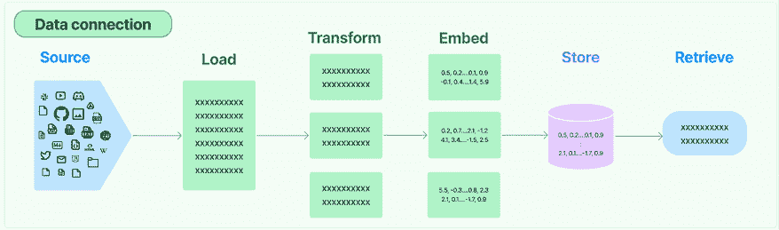

# 第五章：在您的应用中嵌入 LLMs

本章启动了本书的实践部分，重点关注我们如何利用大型语言模型（LLMs）来构建强大的 AI 应用。实际上，LLMs 为软件开发引入了一个全新的范式，为具有用户与机器之间通信流畅和对话式特点的新一代应用铺平了道路。此外，这些模型还增强了现有的应用，如聊天机器人和推荐系统，并赋予了它们独特的推理能力。

开发由大型语言模型（LLM）驱动的应用正成为企业保持市场竞争力的关键因素，这也导致了新的库和框架的传播，使得在应用中嵌入 LLM 变得更加容易。一些例子包括 Semantic Kernel、Haystack、LlamaIndex 和 LangChain。在本章中，我们将介绍 LangChain 并使用其模块构建实际示例。到本章结束时，你将拥有使用 LangChain 和开源 Hugging Face 模型开始开发你的 LLM 驱动应用的必要技术基础。

在本章中，我们将涵盖以下主题：

+   关于 LangChain 的简要说明

+   开始使用 LangChain

+   通过 Hugging Face Hub 与 LLMs 一起工作

# 技术要求

要完成本章的实践部分，需要以下先决条件：

+   一个 Hugging Face 账户和用户访问令牌。

+   一个 OpenAI 账户和用户访问令牌。

+   Python 3.7.1 或更高版本。

+   Python 包：请确保已安装以下 Python 包：`langchain`、`python-dotenv`、`huggingface_hub`、`google-search-results`、`faiss` 和 `tiktoken`。这些包可以通过在终端中使用 `pip install` 命令轻松安装。

你可以在本书的 GitHub 仓库 `github.com/PacktPublishing/Building-LLM-Powered-Applications` 中找到本章中使用的所有代码和示例。

# 关于 LangChain 的简要说明

正如生成式 AI 在过去一年中发展如此迅速一样，LangChain 也同样如此。在这本书写作和出版之间的几个月里，AI 调度器经历了巨大的变化。最显著的变化发生在 2024 年 1 月，当时 LangChain 的第一个稳定版本发布，引入了新的包和库的组织方式。

它包括以下内容：

+   一个核心骨干，其中存储了所有抽象和运行时逻辑

+   一层第三方集成和组件

+   一套预构建的架构和模板以供利用

+   一个服务层，用于将链作为 API 消费

+   一个可观测层，用于监控应用在开发、测试和生产阶段的表现

你可以在 [`python.langchain.com/docs/get_started/introduction`](https://python.langchain.com/docs/get_started/introduction) 中更详细地查看架构。

你可以安装以下三个包来开始使用 LangChain：

+   `langchain-core`：这个包包含整个 LangChain 生态系统的基本抽象和运行时。

+   `langchain-experimental`：这个包包含实验性的 LangChain 代码，旨在用于研究和实验。

+   `langchain-community`：这个包包含所有第三方集成。

此外，还有三个额外的包，我们在这本书中不会涉及，但可以用来监控和维护您的 LangChain 应用程序：

+   `langserve`：LangServe 是一个工具，让您可以将**LangChain 可运行的和链**作为 REST API 部署，这使得将 LangChain 应用程序集成到生产环境中变得更加容易。

+   `langsmith`：将 LangSmith 视为一个**创新的测试框架**，用于评估语言模型和 AI 应用程序。它有助于在链的每个步骤中可视化输入和输出，有助于开发过程中的理解和直觉。

+   `langchain-cli`：LangChain 的**官方命令行界面**，它简化了与 LangChain 项目（包括模板使用和快速入门）的交互。

最后但同样重要的是，LangChain 引入了**LangChain 表达式语言**（**LCEL**）来提高文本处理任务的效率和灵活性。

LCEL 的关键特性包括：

+   **流式异步支持**：这允许高效地处理数据流。

+   **批量支持**：这使能够批量处理数据。

+   **并行执行**：通过并发执行任务来提高性能。

+   **重试和回退**：通过优雅地处理失败来确保鲁棒性。

+   **动态路由逻辑**：这允许根据输入和输出进行逻辑流。

+   **消息历史记录**：这跟踪交互以实现上下文感知处理。

我们在这本书中不会涉及 LCEL；然而，如果您想加快开发速度并利用其与端到端 LangChain 开发堆栈的本地集成，所有代码示例都可以转换为 LCEL。

**重要提示**

在我们开始使用 LangChain 之前，重要的是要注意，所有包的版本略有不同，但所有版本都是由维护者以更清晰的策略发布，以处理重大更改。

在即将到来的章节中，您将看到一些已经移动的包，例如移动到`experimental`包，这意味着它们更倾向于实验性使用。同样，一些第三方集成已经移动到`community`包。

从下一节开始，我们将介绍核心概念——例如内存、VectorDB 和代理——这些在 LangChain 框架中以及更广泛的 LLM 开发领域中都是稳固的。

# LangChain 入门

如*第二章*中所述，LangChain 是一个轻量级的框架，旨在简化将 LLM 及其组件集成和编排到应用程序中的过程。它主要基于 Python，但最近已扩展其支持到 JavaScript 和 TypeScript。

除了 LLM 集成（我们将在即将到来的专门章节中介绍）之外，我们还看到 LangChain 提供了以下主要组件：

+   模型和提示模板

+   数据连接

+   内存

+   链

+   代理

这些组件在下图中进行了说明：


图 5.1：LangChain 的组件

下面的章节将深入探讨这些组件的每一个。

## 模型和提示

LangChain 与超过 50 个第三方供应商和平台进行了集成，包括**OpenAI**、Azure OpenAI、Databricks 和 MosaicML，以及与 Hugging Face Hub 和开源 LLM 世界的集成。在本书的*第二部分*中，我们将尝试各种 LLM，包括专有和开源的，并利用 LangChain 的集成。

只为了提供一个例子，让我们看看消费 OpenAI GPT-3 模型有多容易（你可以在[`platform.openai.com/account/api-keys`](https://platform.openai.com/account/api-keys)获取你的 OpenAI API 密钥）：

```py
from langchain.llms import OpenAI
llm = OpenAI(openai_api_key="your-api-key")
print(llm('tell me a joke')) 
```

这里是相应的输出：

```py
Q: What did one plate say to the other plate?
A: Dinner's on me! 
```

**注意**

在使用 LLM 运行示例时，输出将在每次运行中变化，这是由于模型本身的随机性。如果你想减少输出变化的范围，你可以通过调整温度超参数来使你的模型更加“确定”。此参数的范围从 0（确定）到 1（随机）。

默认情况下，**OpenAI**模块使用`gpt-3.5-turbo-instruct`作为模型。你可以通过传递模型名称作为参数来指定你想要使用的模型。

如前所述，我们将在下一节中深入探讨 LLM；因此，现在让我们专注于提示。与 LLM 提示和提示设计/工程相关的有两个主要组件：

+   **提示模板**：提示模板是一个组件，用于定义如何为语言模型生成提示。它可以包括变量、占位符、前缀、后缀以及其他可以根据数据和任务定制的元素。

例如，假设你想使用语言模型将一种语言翻译成另一种语言。你可以使用如下提示模板：

```py
Sentence: {sentence}
Translation in {language}: 
```

`{sentence}`是一个变量，将被实际文本替换。`翻译成{语言}：`是一个前缀，表示任务和期望的输出格式。

你可以轻松地按照以下方式实现此模板：

```py
from langchain import PromptTemplate
template = """Sentence: {sentence}
Translation in {language}:"""
prompt = PromptTemplate(template=template, input_variables=["sentence", "language"])
print(prompt.format(sentence = "the cat is on the table", language = "spanish")) 
```

这里是输出：

```py
Sentence: the cat is on the table
Translation in spanish: 
```

一般而言，提示模板对可能决定使用的 LLM 通常是中立的，并且可以适应完成和聊天模型。

**定义**

完成模型是一种 LLM，它接收文本输入并生成文本输出，这被称为完成。完成模型试图根据任务和它所训练的数据，以连贯和相关的的方式进行提示的延续。例如，完成模型可以生成摘要、翻译、故事、代码、歌词等，具体取决于提示。

聊天模型是一种特殊的完成模型，旨在生成对话式响应。聊天模型接收一系列消息作为输入，其中每个消息都有一个角色（系统、用户或助手）和内容。聊天模型试图根据之前的消息和系统指令为助手角色生成一条新消息。

完成模型和聊天模型之间的主要区别在于，完成模型期望一个单独的文本输入作为提示，而聊天模型期望一个消息列表作为输入。

+   **示例选择器**：示例选择器是 LangChain 中的一个组件，允许你选择要包含在语言模型提示中的示例。提示是一个文本输入，它指导语言模型产生期望的输出。示例是输入和输出的配对，展示了任务和输出格式的如下：

    ```py
    {"prompt": "<prompt text>", "completion": "<ideal generated text>"} 
    ```

这个想法让人想起了我们在*第一章*中讨论的少样本学习概念。

LangChain 提供了一个名为`BaseExampleSelector`的示例选择器类，你可以按需导入和修改。你可以在[`python.langchain.com/docs/modules/model_io/prompts/example_selectors/`](https://platform.openai.com/account/api-keys)找到 API 参考。

## 数据连接

数据连接指的是构建所需以检索我们希望提供给模型的额外非参数化知识的构建块。

想法是涵盖将用户特定数据融入由五个主要块组成的应用程序中的典型流程，如下面的图所示：



图 5.2：将用户特定知识融入 LLM（来源：[`python.langchain.com/docs/modules/data_connection/`](https://python.langchain.com/docs/modules/data_connection/))

这些块使用以下 LangChain 工具进行操作：

+   **文档加载器**：它们负责从不同的来源（如 CSV、文件目录、HTML、JSON、Markdown 和 PDF）加载文档。文档加载器提供了一个`.load`方法，用于从配置的源加载数据作为文档。输出是一个包含文本和相关元数据的`Document`对象。

例如，让我们考虑一个要加载的样本 CSV 文件（你可以在本书的 GitHub 仓库中找到完整的代码：`github.com/PacktPublishing/Building-LLM-Powered-Applications`):

```py
from langchain.document_loaders.csv_loader import CSVLoader
loader = CSVLoader(file_path='sample.csv')
data = loader.load()
print(data) 
```

这是输出：

```py
[Document(page_content='Name: John\nAge: 25\nCity: New York', metadata={'source': 'sample.csv', 'row': 0}), Document(page_content='Name: Emily\nAge: 28\nCity: Los Angeles', metadata={'source': 'sample.csv', 'row': 1}), Document(page_content='Name: Michael\nAge: 22\nCity: Chicago', metadata={'source': 'sample.csv', 'row': 2})] 
```

+   **文档转换器**：在导入您的文档后，通常需要修改它们以更好地满足您的需求。一个基本的例子是将一个冗长的文档拆分成适合您模型上下文窗口的小块。在 LangChain 中，有各种预构建的文档转换器可用，称为**文本拆分器**。文本拆分器的想法是使将文档拆分成语义相关的块变得更容易，这样我们就不会丢失上下文或相关信息。

使用文本拆分器，您可以决定如何拆分文本（例如，按字符、标题、标记等）以及如何衡量块长度（例如，按字符数）。

例如，让我们使用`RecursiveCharacterTextSplitter`模块拆分文档，该模块在字符级别上操作。为此，我们将使用关于山脉的`.txt`文件（您可以在本书的 GitHub 仓库`github.com/PacktPublishing/Building-LLM-Powered-Applications`中找到整个代码）：

```py
with open('mountain.txt') as f:
    mountain = f.read()
from langchain.text_splitter import RecursiveCharacterTextSplitter
text_splitter = RecursiveCharacterTextSplitter(
    chunk_size = 100, #number of characters for each chunk
    chunk_overlap  = 20,#number of characters overlapping between a preceding and following chunk
    length_function = len #function used to measure the number of characters
)
texts = text_splitter.create_documents([mountain])
print(texts[0])
print(texts[1])
print(texts[2]) 
```

在这里，`chunk_size`指的是每个块中的字符数，而`chunk_overlap`表示连续块之间重叠的字符数。以下是输出结果：

```py
page_content="Amidst the serene landscape, towering mountains stand as majestic guardians of nature's beauty." metadata={}
page_content='The crisp mountain air carries whispers of tranquility, while the rustling leaves compose a' metadata={} 
```

+   **文本嵌入模型**：在*第一章*的*LLM 内部结构*部分，我们介绍了嵌入的概念，作为在连续向量空间中表示单词、子词或字符的方法。

嵌入是将非参数知识纳入 LLM 的关键步骤。实际上，一旦在 VectorDB（将在下一节中介绍）中正确存储，它们就成为了我们可以用来衡量用户查询距离的非参数知识。

要开始使用嵌入，您需要一个嵌入模型。

然后，LangChain 提供了`Embedding`类，包含两个主要模块，分别处理非参数知识（多个输入文本）和用户查询（单个输入文本）的嵌入。

例如，让我们考虑使用**OpenAI**的嵌入模型`text-embedding-ada-002`（有关 OpenAI 嵌入模型的更多详细信息，您可以参考官方文档[`platform.openai.com/docs/guides/embeddings/what-are-embeddings`](https://platform.openai.com/docs/guides/embeddings/what-are-embeddings)）的嵌入：

```py
from langchain.embeddings import OpenAIEmbeddings
from dotenv import load_dotenv
load_dotenv()
os.environ["OPENAI_API_KEY"]
embeddings_model = OpenAIEmbeddings(model ='text-embedding-ada-002' )
embeddings = embeddings_model.embed_documents(
    [
        "Good morning!",
        "Oh, hello!",
        "I want to report an accident",
        "Sorry to hear that. May I ask your name?",
        "Sure, Mario Rossi."
    ]
)
print("Embed documents:")
print(f"Number of vector: {len(embeddings)}; Dimension of each vector: {len(embeddings[0])}")
embedded_query = embeddings_model.embed_query("What was the name mentioned in the conversation?")
print("Embed query:")
print(f"Dimension of the vector: {len(embedded_query)}")
print(f"Sample of the first 5 elements of the vector: {embedded_query[:5]}") 
```

这里是输出结果：

```py
Embed documents:
Number of vector: 5; Dimension of each vector: 1536
Embed query:
Dimension of the vector: 1536
Sample of the first 5 elements of the vector: [0.00538721214979887, -0.0005941778072156012, 0.03892524912953377, -0.002979141427204013, -0.008912666700780392] 
```

一旦我们将文档和查询嵌入，下一步将是计算这两个元素之间的相似度，并从文档嵌入中检索最合适的信息。当谈到向量存储时，我们将看到这个过程的细节。

+   **向量存储**：向量存储（或向量数据库）是一种可以存储和搜索非结构化数据（如文本、图像、音频或视频）的数据库类型，它通过使用嵌入来实现。通过使用嵌入，向量存储可以执行快速且准确的相似度搜索，这意味着为给定的查询找到最相关的数据。

**定义**

相似度是衡量两个向量在向量空间中接近程度或相关性的度量。在 LLM 的上下文中，向量是句子的、单词或文档的数值表示，它们捕捉了它们的语义意义，这些向量之间的距离应该代表它们的语义相似度。

测量向量之间相似性的方法有很多，而在与 LLM 一起工作时，最常用的度量之一是余弦相似度。

这是多维空间中两个向量之间角度的余弦值。它是通过向量的点积除以它们长度的乘积来计算的。余弦相似度对规模和位置不敏感，其范围从-1 到 1，其中 1 表示相同，0 表示正交，-1 表示相反。

以下是在使用向量存储时的典型流程图示。


图 5.3：向量存储的示例架构（来源：[`python.langchain.com/docs/modules/data_connection/vectorstores/`](https://python.langchain.com/docs/modules/data_connection/vectorstores/))

LangChain 提供了与第三方向量存储超过 40 种集成。一些例子包括**Facebook AI Similarity Search**（**FAISS**）、Elasticsearch、MongoDB Atlas 和 Azure Search。要查看所有集成的完整列表和描述，您可以查看官方文档：[`python.langchain.com/docs/integrations/vectorstores/`](https://python.langchain.com/docs/integrations/vectorstores/).

例如，让我们利用由 Meta AI 研究开发的 FAISS 向量存储，它用于高效地搜索和聚类密集向量。我们将利用上一节中保存的相同的`dialogue.txt`文件：

```py
from langchain.document_loaders import TextLoader
from langchain.embeddings.openai import OpenAIEmbeddings
from langchain.text_splitter import CharacterTextSplitter
from langchain.vectorstores import FAISS
from dotenv import load_dotenv
load_dotenv()
os.environ["OPENAI_API_KEY"]
# Load the document, split it into chunks, embed each chunk and load it into the vector store.
raw_documents = TextLoader('dialogue.txt').load()
text_splitter = CharacterTextSplitter(chunk_size=50, chunk_overlap=0, separator = "\n",)
documents = text_splitter.split_documents(raw_documents)
db = FAISS.from_documents(documents, OpenAIEmbeddings()) 
```

现在我们已经嵌入并保存了非参数化知识，让我们也嵌入一个用户的查询，以便可以使用余弦相似度作为度量来搜索最相似的文字片段：

```py
query = "What is the reason for calling?"
docs = db.similarity_search(query)
print(docs[0].page_content) 
```

以下为输出结果：

```py
I want to report an accident 
```

如您所见，输出的是更可能包含问题答案的文字片段。在端到端场景中，它将被用作 LLM 的上下文以生成对话式响应。

+   **检索器**：在 LangChain 中，检索器是一个可以返回与无结构查询（如自然语言问题或关键词）相关的文档的组件。检索器不需要自己存储文档，只需从源中检索它们。检索器可以使用不同的方法来查找相关文档，例如关键词匹配、语义搜索或排名算法。

检索器和向量存储之间的区别在于，检索器比向量存储更通用和灵活。检索器可以使用任何方法来查找相关文档，而向量存储依赖于嵌入和相似性度量。检索器还可以使用不同的文档来源，如网页、数据库或文件，而向量存储需要存储数据本身。

然而，如果数据被嵌入并由向量存储索引，向量存储也可以用作检索器的骨干。在这种情况下，检索器可以使用向量存储在嵌入数据上执行相似性搜索，并返回最相关的文档。这是 LangChain 中检索器的主要类型之一，被称为向量存储检索器。

例如，让我们考虑我们之前初始化并“安装”在之上的 FAISS 向量存储：

```py
from langchain.chains import RetrievalQA
from langchain.llms import OpenAI
retriever = db.as_retriever()
qa = RetrievalQA.from_chain_type(llm=OpenAI(), chain_type="stuff", retriever=retriever)
query = "What was the reason of the call?"
qa.run(query) 
```

这里是输出：

```py
' The reason for the call was to report an accident.' 
```

总体而言，数据连接模块提供了大量的集成和预构建模板，使管理您由 LLM 驱动的应用程序的流程变得更加容易。我们将在接下来的章节中看到这些构建块的一些具体应用，但在下一节中，我们将深入探讨 LangChain 的另一个主要组件。

## 记忆

在 LLM 驱动的应用程序的背景下，内存允许应用程序在短期和长期内保持对用户交互的引用。例如，让我们考虑广为人知的 ChatGPT。在与应用程序交互时，您有提出后续问题的可能性，这些后续问题引用了之前的交互，而无需明确告诉模型。

此外，所有对话都保存到线程中，这样，如果你想跟进之前的对话，你可以重新打开线程，而无需向 ChatGPT 提供所有上下文。这得益于 ChatGPT 能够将用户的交互存储到内存变量中，并在回答后续问题时使用这些记忆作为上下文。

LangChain 为设计您在应用程序中的内存系统提供了几个模块，使其具备读取和写入的能力。

使用您的内存系统的第一步是将您与人类的交互实际存储在某处。为此，您可以利用与第三方提供商（包括 Redis、Cassandra 和 Postgres）的众多内置内存集成。

然后，当涉及到定义如何查询您的内存系统时，您可以利用各种内存类型：

+   **对话缓冲区内存**：这是 LangChain 中可用的“普通香草”内存类型。它允许您存储您的聊天消息并在变量中提取它们。

+   **对话缓冲区窗口内存**：它与前面的类型相同，唯一的区别是只允许在只有*K*次交互上进行滑动窗口，这样您就可以随着时间的推移管理更长的聊天历史。

+   **实体内存**：实体内存是 LangChain 的一个功能，允许语言模型记住会话中特定实体的给定事实。实体是一个可以识别并与其他区分开的人、地点、事物或概念。例如，在句子“Deven 和 Sam 正在意大利参加黑客马拉松”中，Deven 和 Sam 是实体（人），以及黑客马拉松（事物）和意大利（地点）。

实体内存通过使用 LLM 从输入文本中提取有关实体的信息来工作。然后，它通过在内存存储中存储提取的事实来随着时间的推移建立对该实体的知识。内存存储可以在语言模型需要回忆或学习有关实体的新信息时被访问和更新。

+   **会话知识图谱内存**：这种类型的内存使用知识图谱来重建记忆。

    **定义**

    知识图谱是一种以图结构表示和组织知识的方式，其中节点是实体，边是它们之间的关系。知识图谱可以存储和整合来自各种来源的数据，并编码数据的语义和上下文。知识图谱还可以支持各种任务，如搜索、问答、推理和生成。

    另一个知识图谱的例子是 DBpedia，这是一个社区项目，从维基百科中提取结构化数据并将其发布在网络上。DBpedia 涵盖了地理、音乐、体育和电影等主题，并提供到其他数据集（如 GeoNames 和 WordNet）的链接。

您可以使用这种类型的内存将每个会话轮次的输入和输出保存为知识三元组（如主语、谓语和宾语），然后根据当前上下文使用它们生成相关且一致的反应。您还可以查询知识图谱以获取当前实体或会话的历史。

+   **会话摘要内存**：当涉及到要存储的较长的会话时，这种类型的内存非常有用，因为它随着时间的推移创建会话的摘要（利用 LLM）。

+   **会话摘要缓冲内存**：这种类型的内存结合了缓冲内存和会话摘要内存背后的思想。它在内存中保留最近交互的缓冲，但与仅完全清除旧交互（如会话缓冲内存中发生的情况）不同，它将它们编译成摘要并使用它们。

+   **会话标记缓冲内存**：它与前面的一种类似，但不同之处在于，为了确定何时开始总结交互，这种类型的内存使用标记长度而不是交互次数（如摘要缓冲内存中发生的情况）。

+   **基于向量存储的内存**：这种类型的内存利用了之前介绍的嵌入和向量存储的概念。它与所有之前的内存不同，因为它将交互存储为向量，并在每次查询时使用检索器检索最相似的 *K* 个文本。

LangChain 为每种内存类型提供了特定的模块。让我们以会话摘要内存为例，我们将还需要一个 LLM 来生成交互的摘要：

```py
from langchain.memory import ConversationSummaryMemory, ChatMessageHistory
from langchain.llms import OpenAI
memory = ConversationSummaryMemory(llm=OpenAI(temperature=0))
memory.save_context({"input": "hi, I'm looking for some ideas to write an essay in AI"}, {"output": "hello, what about writing on LLMs?"})
memory.load_memory_variables({}) 
```

这是输出：

```py
{'history': '\nThe human asked for ideas to write an essay in AI and the AI suggested writing on LLMs.'} 
```

如您所见，内存总结了对话，利用了我们初始化的**OpenAI** LLM。

在您的应用程序中，没有固定的食谱来定义使用哪种内存；然而，有一些场景可能特别适合特定的内存。例如，知识图谱内存对于需要从大量且多样化的数据集中获取信息并基于语义关系生成响应的应用程序很有用，而会话摘要缓冲区内存可能适合创建能够在多个回合中保持连贯和一致上下文的对话代理，同时还能压缩和总结之前的对话历史。

## 链

链是由预定义的动作序列和对 LLM 的调用组成的，这使得构建需要将 LLM 相互结合或与其他组件结合的复杂应用程序变得更加容易。

LangChain 提供了四种主要类型的链以供开始使用：

+   **LLMChain**：这是最常见的链类型。它由一个提示模板、一个 LLM 和一个可选的**输出解析器**组成。

**定义**

输出解析器是一个帮助结构化语言模型响应的组件。它是一个实现了两个主要方法的类：`get_format_instructions`和`parse`。`get_format_instructions`方法返回一个包含如何格式化语言模型输出的指令的字符串。`parse`方法接收一个字符串（假设是来自语言模型的响应）并将其解析为某种结构，例如字典、列表或自定义对象。

此链接受多个输入变量，使用`PromptTemplate`将它们格式化为提示，将其传递给模型，然后使用（如果提供）`OutputParser`将 LLM 的输出解析为最终格式。

例如，让我们检索我们在上一节中构建的提示模板：

```py
from langchain import PromptTemplate
template = """Sentence: {sentence}
Translation in {language}:"""
prompt = PromptTemplate(template=template, input_variables=["sentence", "language"]) 
```

现在，让我们将其放入一个 LLMChain 中：

```py
from langchain import OpenAI, LLMChain
llm = OpenAI(temperature=0)
llm_chain = LLMChain(prompt=prompt, llm=llm)
llm_chain.predict(sentence="the cat is on the table", language="spanish") 
```

这是输出：

```py
' El gato está en la mesa.' 
```

+   **RouterChain**：这是一种允许您根据某些条件将输入变量路由到不同链的链类型。您可以指定条件为返回布尔值的函数或表达式。您还可以指定在没有任何条件满足时使用的默认链。

例如，你可以使用这个链来创建一个能够处理不同类型请求的聊天机器人，比如规划行程或预订餐厅。为了实现这个目标，你可能需要根据用户将要提出的查询类型区分两个不同的提示：

```py
itinerary_template = """You are a vacation itinerary assistant. \
You help customers finding the best destinations and itinerary. \
You help customer screating an optimized itinerary based on their preferences.
Here is a question:
{input}"""
restaurant_template = """You are a restaurant booking assistant. \
You check with customers number of guests and food preferences. \
You pay attention whether there are special conditions to take into account.
Here is a question:
{input}""" 
```

多亏了路由链（RouterChain），我们可以构建一个能够根据用户的查询激活不同提示的链。我不会在这里发布整个代码（你可以在书的 GitHub 上找到笔记本`github.com/PacktPublishing/Building-LLM-Powered-Applications`），但你可以看到链如何对两个不同的用户查询做出反应的示例输出：

```py
print(chain.run("I'm planning a trip from Milan to Venice by car. What can I visit in between?")) 
```

这里是输出结果：

```py
> Entering new MultiPromptChain chain...
itinerary: {'input': "I'm planning a trip from Milan to Venice by car. What attractions can I visit in between?"}
> Finished chain.
Answer:
There are many attractions that you can visit while traveling from Milan to Venice by car. Some of the most popular attractions include Lake Como, Verona, the Dolomites, and the picturesque towns of Bergamo and Brescia. You can also visit the stunning UNESCO World Heritage Sites in Mantua and Ferrara. Additionally, you can explore some of the local wineries and sample some of the wines of the region. 
```

这里是第二个查询的结果：

```py
print(chain.run("I want to book a table for tonight")) 
```

这里是输出结果：

```py
> Entering new MultiPromptChain chain...
restaurant: {'input': 'I want to book a table for tonight'}
> Finished chain.
. How many people are in your party?
Hi there! How many people are in your party for tonight's reservation? 
```

+   **顺序链（SequentialChain**）：这是一种允许你按顺序执行多个链的链。你可以指定链的顺序以及它们如何将输出传递给下一个链。顺序链的最简单模块默认情况下将一个链的输出作为下一个链的输入。然而，你也可以使用更复杂的模块来在链之间设置更灵活的输入和输出。

例如，让我们考虑一个旨在首先在一个给定主题上生成一个笑话，然后将其翻译成另一种语言的 AI 系统。为此，我们首先创建两个链：

```py
from langchain.llms import OpenAI
from langchain.chains import LLMChain
from langchain.prompts import PromptTemplate
llm = OpenAI(temperature=.7)
template = """You are a comedian. Generate a joke on the following {topic}
Joke:"""
prompt_template = PromptTemplate(input_variables=["topic"], template=template)
joke_chain = LLMChain(llm=llm, prompt=prompt_template)
template = """You are translator. Given a text input, translate it to {language}
Translation:"""
.prompt_template = PromptTemplate(input_variables=["language"], template=template)
translator_chain = LLMChain(llm=llm, prompt=prompt_template) 
```

现在，让我们使用`SimpleSequentialChain`模块将它们结合起来：

```py
# This is the overall chain where we run these two chains in sequence.
from langchain.chains import SimpleSequentialChain
overall_chain = SimpleSequentialChain(chains=[joke_chain, translator_chain], verbose=True)
translated_joke = overall_chain.run("Cats and Dogs") 
```

这里是输出结果：

```py
> Entering new SimpleSequentialChain chain...
Why did the cat cross the road? To prove to the dog that it could be done!
 ¿Por qué cruzó el gato la carretera? ¡Para demostrarle al perro que se podía hacer!
> Finished chain. 
```

+   **转换链（TransformationChain**）：这是一种允许你使用某些函数或表达式来转换输入变量或另一个链的输出的链。你可以指定转换为一个函数，该函数接受输入或输出作为参数并返回一个新值，以及指定链的输出格式。

例如，假设我们想要总结一段文本，但在那之前，我们想要将故事中的一个主角（一只猫）重命名为“Silvester the Cat”。作为一个示例文本，我要求 Bing Chat 生成一个关于猫和狗的故事（你可以在本书的 GitHub 仓库中找到整个`.txt`文件）：

```py
from langchain.chains import TransformChain, LLMChain, SimpleSequentialChain
from langchain.llms import OpenAI
from langchain.prompts import PromptTemplate
transform_chain = TransformChain(
    input_variables=["text"], output_variables=["output_text"], transform=rename_cat
)
template = """Summarize this text:
{output_text}
Summary:"""
prompt = PromptTemplate(input_variables=["output_text"], template=template)
llm_chain = LLMChain(llm=OpenAI(), prompt=prompt)
sequential_chain = SimpleSequentialChain(chains=[transform_chain, llm_chain])
sequential_chain.run(cats_and_dogs) 
```

如你所见，我们已经将一个简单的顺序链和一个转换链结合起来，我们将`rename_cat`函数（你可以在 GitHub 仓库中看到整个代码）设置为转换函数。

输出如下：

```py
" Silvester the Cat and a dog lived together but did not get along. Silvester the Cat played a prank on the dog which made him angry. When their owner found them fighting, she scolded them and made them apologize. After that, they became friends and learned to respect each other's differences and appreciate each other's strengths." 
```

总体而言，LangChain 链是结合不同语言模型和任务到单一工作流程的强大方式。链是灵活的、可扩展的，并且易于使用，它们使用户能够利用语言模型在各个目的和领域发挥其力量。从下一章开始，我们将看到链在实际用例中的具体应用，但在到达那里之前，我们需要介绍 LangChain 的最后一个组件：代理。

## 代理

代理是驱动 LLM 驱动的应用程序中决策的实体。它们可以访问一系列工具，并根据用户输入和上下文决定调用哪个工具。代理是动态和自适应的，这意味着它们可以根据情况或目标改变或调整其行为：实际上，在链中，动作序列是硬编码的，而在代理中，LLM 被用作推理引擎，目的是按正确的顺序规划和执行正确的动作。

讨论代理时的一个核心概念是工具的概念。事实上，一个代理可能擅长规划所有正确的动作来满足用户的查询，但它可能无法实际执行它们，因为它缺少信息或执行权力？例如，想象我想构建一个能够通过搜索网络来回答我问题的代理。仅凭自身，代理无法访问网络，因此我需要提供这个工具。我将通过使用 LangChain 提供的 SerpApi（谷歌搜索 API）集成来实现这一点（你可以在 [`serpapi.com/dashboard`](https://serpapi.com/dashboard) 获取你的 API 密钥）。

让我们用 Python 看看：

```py
from langchain import SerpAPIWrapper
from langchain.agents import AgentType, initialize_agent
from langchain.llms import OpenAI
from langchain.tools import BaseTool, StructuredTool, Tool, tool
import os
from dotenv import load_dotenv
load_dotenv()
os.environ["SERPAPI_API_KEY"]
search = SerpAPIWrapper()
tools = [Tool.from_function(
        func=search.run,
        name="Search",
        description="useful for when you need to answer questions about current events"
    )]
agent = initialize_agent(tools, llm = OpenAI(), agent=AgentType.ZERO_SHOT_REACT_DESCRIPTION, verbose=True)
agent.run("When was Avatar 2 released?") 
```

以下是其输出：

```py
> Entering new AgentExecutor chain...
 I need to find out when Avatar 2 was released.
Action: Search
Action Input: "Avatar 2 release date"
Observation: December 16, 2022
Thought: I now know the final answer.
Final Answer: Avatar 2 was released on December 16, 2022.
> Finished chain.
'Avatar 2 was released on December 16, 2022.' 
```

注意，在初始化我的代理时，我将代理类型设置为 `ZERO_SHOT_REACT_DESCRIPTION`。这是我们可以选择的配置之一，具体来说，它配置代理仅根据工具的描述使用 ReAct 方法来决定选择哪个工具：

**定义**

ReAct 方法是使用 LLM 解决各种语言推理和决策任务的一种方式。它是在 2022 年 10 月由 Shunyu Yao 等人撰写的论文 *ReAct: Synergizing Reasoning and Acting in Language Models* 中引入的。

ReAct 方法以交错的方式提示 LLM 生成口头推理痕迹和文本动作，从而在两者之间实现更大的协同作用。推理痕迹有助于模型规划、跟踪和更新其动作，以及处理异常。动作允许模型与外部来源，如知识库或环境，交互以收集更多信息。

在此配置之上，LangChain 还提供了以下类型的代理：

+   **结构化输入 ReAct**: 这是一个使用 ReAct 框架根据结构化输入数据生成自然语言响应的代理类型。代理可以处理不同类型的输入数据，例如表格、列表或键值对。代理使用语言模型和提示来生成信息丰富、简洁且连贯的响应。

+   **OpenAI Functions**: 这是一个使用 OpenAI Functions API 访问 OpenAI 的各种语言模型和工具的代理类型。代理可以使用不同的功能，例如 GPT-3、Codex、DALL-E、CLIP 或 ImageGPT。代理使用语言模型和提示来生成对 OpenAI Functions API 的请求并解析响应。

+   **对话式**：这是一种使用语言模型与用户进行自然语言对话的代理类型。代理可以处理不同类型的对话任务，如闲聊、问答或任务完成。代理使用语言模型和提示来生成相关、流畅且引人入胜的响应。

+   **自问自答**：这是一种使用语言模型为自己生成问题，然后在网络上搜索答案的代理类型。代理可以使用这种技术来学习新信息或测试自己的知识。

+   **ReAct 文档存储**：这是一种使用 ReAct 框架根据存储在数据库中的文档生成自然语言响应的代理类型。代理可以处理不同类型的文档，如新闻文章、博客文章或研究论文。

+   **计划与执行代理**：这是一种实验性代理类型，它使用语言模型根据用户的输入和目标选择一系列动作。代理可以使用不同的工具或模型来执行其选择的动作。代理使用语言模型和提示来生成计划和动作，然后使用`AgentExecutor`来运行它们。

LangChain 代理在您希望让您的 LLMs 与外部世界交互时至关重要。此外，观察代理如何利用 LLMs 不仅用于检索和生成响应，还作为推理引擎来规划一系列优化的动作顺序，这很有趣。

与本节中涵盖的所有 LangChain 组件一起，代理可以是 LLM 驱动应用程序的核心，正如我们将在下一章中看到的那样。在下一节中，我们将转向开源 LLMs 的世界，介绍 Hugging Face Hub 及其与 LangChain 的原生集成。

# 通过 Hugging Face Hub 使用 LLMs

现在我们已经熟悉了 LangChain 组件，是时候开始使用我们的 LLMs 了。如果您想使用开源 LLMs，利用 Hugging Face Hub 集成非常灵活。实际上，只需一个访问令牌，您就可以利用 Hugging Face 存储库中所有可用的开源 LLMs。

由于这是一个非生产场景，我将使用免费的推理 API；然而，如果您打算构建生产就绪的应用程序，您可以轻松扩展到推理端点，这为您提供了专用且完全管理的基础设施来托管和消费您的 LLMs。

那么，让我们看看如何开始将 LangChain 与 Hugging Face Hub 集成。

## 创建 Hugging Face 用户访问令牌

要访问免费的推理 API，您需要一个用户访问令牌，这是允许您运行服务的凭证。以下激活用户访问令牌的步骤：

1.  **创建 Hugging Face 账户**：您可以在[`huggingface.co/join`](https://huggingface.co/join)免费创建 Hugging Face 账户。

1.  **检索您的用户访问令牌**：一旦您有了账户，请转到您的个人资料右上角，转到 **设置** | **访问令牌**。从该选项卡，您将能够复制您的秘密令牌并使用它来访问 Hugging Face 模型。


图 5.4：从 Hugging Face 账户检索访问令牌（来源：[`huggingface.co/settings/tokens`](https://huggingface.co/settings/tokens))

1.  **设置权限**：访问令牌使用户、应用程序和笔记本能够根据其分配的角色执行特定操作。有两种可用的角色：

    +   **读取权限**：这允许令牌提供读取权限到您有读取权限的仓库。这包括您或您组织拥有的公共和私有仓库。此角色适用于下载私有模型或推理等任务。

    +   **写入权限**：除了读取权限外，具有此角色的令牌还授予您对您有写入权限的仓库的写入权限。此令牌对于训练模型或更新模型卡片等活动很有用。

在我们的用例系列中，我们将保持对令牌的写入权限。

1.  **管理您的用户访问令牌**：在您的个人资料中，您可以创建和管理多个访问令牌，这样您也可以区分权限。要创建新的令牌，您可以点击 **新建令牌** 按钮：


图 5.5：创建新的令牌

1.  最后，在任何时候，您都可以在 **管理** 按钮下删除或刷新您的令牌：


图 5.6：管理令牌

重要的是不要泄露您的令牌，一个良好的做法是定期重新生成它。

## 在 `.env` 文件中存储您的秘密

在上一节中生成的用户访问令牌，我们有了第一个需要管理的秘密。

**定义**

秘密是需要保护免受未经授权访问的数据，例如密码、令牌、密钥和凭证。秘密用于验证和授权对 API 端点的请求，以及加密和解密敏感数据。

在本书的动手实践部分，我们将把所有秘密都保存在 `.env` 文件中。

在 `.env` 文件中存储 Python 秘密是提高项目安全性和可维护性的常见做法。为此，在您的项目目录中创建一个名为 `.env` 的文件，并将您的敏感信息作为键值对列出：在我们的场景中，我们将有 `HUGGINGFACEHUB_API_TOKEN="your_user_access_token"`。此文件应添加到您的项目 `.gitignore` 文件中，以防止意外泄露。

要在您的 Python 代码中访问这些秘密，请使用 `python-dotenv` 库将 `.env` 文件中的值加载为环境变量。您可以通过在终端中运行 `pip install python-dotenv` 来轻松安装它。

这种方法将敏感数据与您的代码库分开，有助于确保在整个开发和部署过程中，机密信息保持机密。

在这里，您可以看到一个如何检索您的访问令牌并将其设置为环境变量的示例：

```py
import os
from dotenv import load_dotenv
load_dotenv()
os.environ["HUGGINGFACEHUB_API_TOKEN"] 
```

注意，默认情况下，`load_dotenv`将在当前工作目录中查找`.env`文件；但是，您也可以指定您的机密文件路径：

```py
from dotenv import load_dotenv
from pathlib import Path
dotenv_path = Path('path/to/.env')
load_dotenv(dotenv_path=dotenv_path) 
```

现在我们已经拥有了开始编码的所有原料，是时候尝试一些开源 LLM 了。

## 开始使用开源 LLM

Hugging Face Hub 集成的优点在于，您可以导航其门户，在模型目录中决定使用什么。模型也按类别（**计算机视觉**、**自然语言处理**、**音频**等）和每个类别内的能力（在**自然语言处理**中，我们有摘要、分类、问答等）进行分组，如下面的截图所示：


图 5.7：Hugging Face 模型目录的首页

由于我们对 LLM 感兴趣，我们将专注于文本生成类别。在这个第一次实验中，让我们尝试 Falcon LLM-7B：

```py
from langchain import HuggingFaceHub
repo_id = "tiiuae/falcon-7b-instruct" 
llm = HuggingFaceHub(
    repo_id=repo_id, model_kwargs={"temperature": 0.5, "max_length": 1000}
)
print(llm("what was the first disney movie?")) 
```

下面是相应的输出：

```py
The first Disney movie was 'Snow White and the Seven Dwarfs' 
```

如您所见，仅用几行代码，我们就从 Hugging Face Hub 集成了 LLM。使用类似的代码，您可以测试和消费 Hub 中可用的所有 LLM。

注意，在本书中，我们将针对每个应用利用特定的模型，无论是专有模型还是开源模型。然而，想法是您可以通过简单地将其初始化为主 LLM 并按原样运行代码，只需更改 LangChain LLM 集成，就可以使用您偏好的模型。这是 LLM 驱动应用程序的主要优势之一，因为您不需要更改整个代码来适应不同的 LLM。

# 摘要

在这一章中，我们更深入地探讨了 LangChain 的基础知识，因为它是将在后续章节中使用的 AI 编排器：我们熟悉了 LangChain 组件，如内存、代理、链和提示模板。我们还介绍了如何开始将 LangChain 与 Hugging Face Hub 及其模型目录集成，以及如何使用可用的 LLM 并将它们嵌入到您的代码中。

从现在开始，我们将探讨一系列具体的端到端用例，从语义问答搜索应用开始，这是我们将在下一章中开发的。

# 参考文献

+   LangChain 与 OpenAI 的集成 - [`python.langchain.com/docs/integrations/llms/openai`](https://python.langchain.com/docs/integrations/llms/openai)

+   LangChain 的提示模板 - [`python.langchain.com/docs/modules/model_io/prompts/prompt_templates/`](https://python.langchain.com/docs/modules/model_io/prompts/prompt_templates/)

+   LangChain 的向量存储 – [`python.langchain.com/docs/integrations/vectorstores/`](https://python.langchain.com/docs/integrations/vectorstores/)

+   FAISS 索引 – [`faiss.ai/`](https://faiss.ai/)

+   LangChain 的链 – [`python.langchain.com/docs/modules/chains/`](https://python.langchain.com/docs/modules/chains/)

+   ReAct 方法 – [`arxiv.org/abs/2210.03629`](https://arxiv.org/abs/2210.03629)

+   LangChain 的代理 – [`python.langchain.com/docs/modules/agents/agent_types/`](https://python.langchain.com/docs/modules/agents/agent_types/)

+   Hugging Face 文档 – [`huggingface.co/docs`](https://huggingface.co/docs)

+   LangChain 表达式语言 (LCEL) – [`python.langchain.com/docs/expression_language/`](https://python.langchain.com/docs/expression_language/)

+   LangChain 稳定版本 – [`blog.langchain.dev/langchain-v0-1-0/`](https://blog.langchain.dev/langchain-v0-1-0/)

# 加入我们的 Discord 社区

加入我们的社区 Discord 空间，与作者和其他读者进行讨论：

[`packt.link/llm`](https://packt.link/llm)


