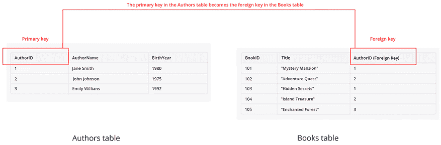
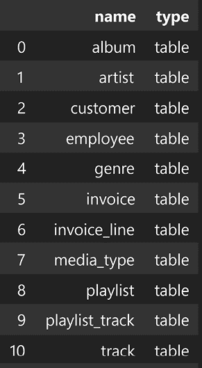

# 8

# 使用 LLMs 处理结构化数据

在本章中，我们将介绍**大型语言模型（LLMs**）的另一个伟大能力：处理结构化、表格数据的能力。我们将看到，得益于插件和代理方法，我们如何可以将 LLMs 用作我们与结构化数据之间的自然语言界面，从而缩小业务用户与结构化信息之间的差距。

在本章中，我们将涵盖以下主题：

+   结构化数据系统的主要介绍

+   使用工具和插件将 LLMs 连接到表格数据

+   使用 LangChain 构建数据库助手

到本章结束时，您将能够为您的数据领域构建自己的自然语言界面，并且能够将非结构化数据与结构化数据源相结合。

# 技术要求

要完成本章中的任务，您将需要以下内容：

+   Hugging Face 账户和用户访问令牌。

+   OpenAI 账户和用户访问令牌。

+   Python 3.7.1 或更高版本。

+   Python 包：请确保已安装以下 Python 包：`langchain`、`python-dotenv`、`huggingface_hub`、`streamlit`和`sqlite3`。这些包可以通过在终端中使用`pip install`轻松安装。

您可以在本书的 GitHub 仓库中找到所有代码和示例：`github.com/PacktPublishing/Building-LLM-Powered-Applications`。

# 什么是结构化数据？

在前面的章节中，我们关注了 LLMs 如何处理文本数据。实际上，这些模型正如其名所示，是“语言”模型，这意味着它们已经被训练并且能够处理非结构化文本数据。

然而，非结构化数据仅指应用程序可以处理的整体数据领域的一部分。通常，数据可以分为三种类型，如下所示：

+   **非结构化数据**：这指的是没有特定或预定义格式的数据。它缺乏一致的结构，使得使用传统数据库进行组织和分析变得具有挑战性。非结构化数据的例子包括：

    +   文本文档：电子邮件、社交媒体帖子、文章和报告。

    +   多媒体：图片、视频、音频记录。

    +   自然语言文本：聊天记录，口头对话的转录。

    +   二进制数据：没有特定数据格式的文件，例如专有文件格式。

**注意**

当涉及到存储非结构化数据时，由于它们灵活的无模式设计，NoSQL 数据库在处理各种数据类型（如文本、图片和视频）方面发挥着至关重要的作用。术语“NoSQL”最初代表“非 SQL”或“不仅 SQL”，以强调这些数据库不依赖于传统的**结构化查询语言（SQL**）来管理和查询数据。NoSQL 数据库的出现是对关系型数据库局限性的回应，特别是它们严格的模式要求以及横向扩展的困难。

NoSQL 数据库的一个例子是 MongoDB，这是一个面向文档的 NoSQL 数据库，以类似 JSON 的文档形式存储数据，这使得它非常有效地管理多样化的非结构化内容；同样，Cassandra 以其宽列存储模型而闻名，擅长处理大量数据，在许多通用服务器上提供高可用性而不影响性能。这种灵活性使得 NoSQL 数据库能够适应非结构化数据的量、种类和速度，适应快速变化并易于扩展。传统的基于关系的数据库，由于其严格的模式要求，难以有效地管理这种多样性和大量数据。

+   **结构化数据**：这种类型的数据是有组织和格式化的，通常以行和列的形式。它遵循固定的模式，使得使用关系型数据库存储、检索和分析变得容易。结构化数据的例子包括：

    +   关系型数据库：以预定义的列和数据类型存储在表中的数据。

    +   电子表格：在像 Microsoft Excel 这样的软件中以行和列组织的数据。

    +   传感器数据：以结构化格式记录的温度、压力和时间等测量值。

    +   财务数据：交易记录、资产负债表和损益表。

+   **半结构化数据**：这介于两种类别之间。虽然它不像结构化数据那样遵循严格的格式，但它具有一定的组织性，可能包含提供上下文的标签或其他标记。半结构化数据的例子包括：

    +   **可扩展标记语言** (**XML**) 文件：它们使用标签来结构化数据，但具体的标签及其排列可能有所不同。

    +   **JavaScript 对象表示法** (**JSON**)：用于数据交换，允许嵌套结构和键值对。

    +   NoSQL 数据库：以不需要固定模式的方式存储数据，提供灵活性。

总结来说，非结构化数据缺乏明确的格式，结构化数据遵循严格的格式，而半结构化数据具有一定的结构，但比结构化数据更灵活。这些数据类型之间的区别很重要，因为它影响它们在各种应用中的存储、处理和分析方式。

然而，无论其性质如何，查询结构化数据都需要使用特定的查询语言或数据库技术的方法。例如，对于 SQL 数据库，使用 SQL 与关系型数据库交互。因此，要从表中提取数据，你需要了解这种特定的语言。

但如果我们想用自然语言向我们的结构化数据提问呢？如果我们的应用程序不仅能提供枯燥的数字答案，还能提供对话式的答案，并给出关于数字的背景信息呢？这正是我们将在下一节中尝试实现的内容，即使用我们由*第二章*定义的 LLM（大型语言模型）驱动的应用程序。更具体地说，我们将构建一些已经在*第二章*中定义了的东西：一个**协同助手**。由于我们将我们的协同助手安装到关系型数据库中，我们将我们的应用程序命名为**DBCopilot**。首先，让我们看看什么是关系型数据库。

# 开始学习关系型数据库

关系型数据库的概念最早由 IBM 研究员 E.F. Codd 在 1970 年提出。他定义了关系模型的规则和原则，旨在提供一种简单且一致的方式来访问和操作数据。他还引入了 SQL，这成为了查询和操作关系型数据库的标准语言。关系型数据库已在各个领域和应用中得到广泛应用，例如电子商务、库存管理、工资单、**客户关系管理**（CRM）和**商业智能**（BI）。

在本节中，我们将介绍关系型数据库的主要方面。然后，我们将开始使用我们将在 DBCopilot 中使用的示例数据库——Chinook 数据库。我们将检查这个数据库，并探索如何使用 Python 连接到远程表。

## 关系型数据库简介

关系型数据库是一种存储和组织数据的数据库类型，这些数据以结构化表格的形式存在，包含行和列。每一行代表一条记录，每一列代表一个字段或属性。表之间的关系通过键建立，主要是主键和外键。这允许使用 SQL 高效地查询和操作数据。这些数据库因其能够有效管理结构化数据的能力，常用于各种应用，如网站和业务管理系统。

为了更好地理解关系型数据库，让我们考虑一个图书馆数据库的例子。我们将有两个表：一个用于书籍，另一个用于作者。它们之间的关系将通过主键和外键来建立。

**定义**

主键就像表中每条记录的唯一指纹。它是一个特殊的列，包含一个在该表中每行都是唯一的值。把它想象成记录的“身份”。拥有主键很重要，因为它保证了同一表中不会有两条记录共享相同的键。这种唯一性使得在表中定位、修改和管理单个记录变得容易。

外键是两张表之间的桥梁。它是一个表中的列，引用另一个表中的主键列。这种引用在两个表的数据之间创建了一个链接，建立了关系。外键的目的是在相关表之间维护数据的一致性和完整性。它确保如果主键表中的数据发生变化，其他表中的相关数据仍然准确。通过使用外键，您可以检索多个连接表的信息，从而了解不同的数据片段是如何相互关联的。

让我们更仔细地看看我们的例子，如下面的图像所示：



图 8.1：数据库中两个表之间关系的一个示例

在这个例子中，Authors 表包含有关作者的信息，包括他们的 ID、姓名和出生年份。Books 表包含有关书籍的详细信息，包括书籍的 ID、标题以及一个名为 AuthorID 的外键，它引用 Authors 表中的相应作者（其中 AuthorID 作为主键）。这样，您可以使用 SQL 查询检索信息，例如查找特定作者所写的所有书籍或根据作者所写的书籍确定作者的出生年份。这种关系结构允许以结构化的方式高效管理和检索数据。

市场上的一些主要数据库系统包括：

+   **SQL 数据库**：这些是**关系数据库管理系统**（**RDBMS**），使用 SQL 进行数据操作和查询。例如 MySQL、PostgreSQL 和 Microsoft SQL Server。

+   **Oracle 数据库**：一种广泛使用的 RDBMS，为大型应用程序提供高级功能和可伸缩性。

+   **SQLite**：一个自包含、无服务器、零配置的 SQL 数据库引擎，通常用于嵌入式系统和移动应用程序。

+   **IBM Db2**：由 IBM 开发的一系列数据管理产品，包括关系数据库服务器。

+   **Amazon Web Services (AWS) RDS**：由 Amazon 提供的一项托管关系数据库服务，提供 MySQL、PostgreSQL、SQL Server 等多种数据库的选项。

+   **Google Cloud SQL**：由 Google Cloud Platform 提供的一项托管数据库服务，支持 MySQL、PostgreSQL 和 SQL Server。

+   **Redis**：一个开源的内存数据结构存储，可以用作数据库、缓存和消息代理。

在本章中，我们将使用 SQLite 数据库，它也提供了与 Python 的无缝集成。但在我们这样做之前，让我们了解我们将要使用的数据库。

## Chinook 数据库概述

Chinook 数据库是一个用于学习和练习 SQL 的示例数据库。它基于一个虚构的数字媒体商店，包含有关艺术家、专辑、曲目、客户、发票等数据。Chinook 数据库适用于各种数据库管理系统，如 SQL Server、Oracle、MySQL、PostgreSQL、SQLite 和 DB2。

下面是这个数据库的一些特性：

+   它使用 iTunes 库的真实数据，这使得它更加真实和有趣。

+   它具有清晰简单的数据模型，这使得理解和查询变得容易。

+   它涵盖了更多 SQL 的功能，例如子查询、连接、视图和触发器。

+   它与多个数据库服务器兼容，这使得它更加灵活和便携。

您可以在[`database.guide/2-sample-databases-sqlite/`](https://database.guide/2-sample-databases-sqlite/)找到配置说明。

您可以在这里看到数据库表之间的关系图：


图 8.2：Chinook 数据库图（来源：[`github.com/arjunchndr/Analyzing-Chinook-Database-using-SQL-and-Python`](https://github.com/arjunchndr/Analyzing-Chinook-Database-using-SQL-and-Python))

正如您所看到的，有 11 个表，它们通过主键和外键相互关联。在接下来的段落中，我们将看到 LLMs 将如何在这些表之间导航，捕捉它们的关系并收集相关信息。但在跳到 LLMs 之前，让我们首先通过 Python 设置连接来更详细地检查 Chinook 数据库。

## 如何在 Python 中使用关系型数据库

要在 Python 中使用关系型数据库，您需要使用一个可以连接到数据库并执行 SQL 查询的库。以下是一些这些库的例子：

+   `SQLAlchemy`：这是一个开源的 SQL 工具包和 Python 的**对象关系映射器**（**ORM**）。它允许您使用 Python 对象和方法创建、读取、更新和删除关系型数据库中的数据。它支持许多数据库引擎，如 SQLite、MySQL、PostgreSQL 和 Oracle。

+   `Psycopg`：这是 PostgreSQL 数据库的一个流行连接器。它允许您从 Python 执行 SQL 查询并访问 PostgreSQL 功能。它速度快、可靠且线程安全。

+   `MySQLdb`：这是 MySQL 的数据库连接器。它允许您使用 DB-API 2.0 规范从 Python 与 MySQL 数据库交互。它是 Python 用于 MySQL 的最古老和最广泛使用的库之一，但其开发主要已冻结。

+   `cx_Oracle`：这是 Oracle 数据库的数据库连接器。它允许您从 Python 连接到 Oracle 数据库并使用 SQL 和 PL/SQL 功能。它支持高级功能，如对象类型、**大型对象**（**LOBs**）和数组。

+   `sqlite3`：这是一个 SQLite3 数据库连接器，SQLite3 是一个广泛使用、轻量级、无服务器、自包含和开源的关系型数据库管理系统。您可以使用 sqlite3 在您的 Python 程序中创建、查询、更新和删除 `SQLite` 数据库中的数据

由于我们将使用 SQLite，我们将使用 `sqlite3` 模块，您需要通过 `pip install sqlite3` 安装它。sqlite3 的一些功能如下：

+   它遵循 DB-API 2.0 规范，该规范定义了 Python 数据库访问模块的标准接口。

+   它支持事务，这允许你将多个 SQL 语句作为一个工作单元执行，并在出错时回滚。

+   它允许你使用 Python 对象作为 SQL 查询的参数和结果，使用各种适配器和转换器。

+   它支持用户定义的函数、聚合、排序规则和授权者，这使您能够使用 Python 代码扩展 SQLite 的功能。

+   它有一个内置的行工厂，它将查询结果作为命名元组或字典返回，而不是普通的元组。

让我们通过我们的 Chinook 数据库看看这个连接的例子：

1.  您可以从 [`www.sqlitetutorial.net/wp-content/uploads/2018/03/chinook.zip`](https://www.sqlitetutorial.net/wp-content/uploads/2018/03/chinook.zip) 本地下载数据库。您只需要解压 `chinook.db` 文件，它就准备好被使用了。在下面的代码中，我们正在初始化一个连接（`conn`）到我们的 `chinook.db`，这将用于与数据库交互。然后，我们将使用 `read_sql` 模块将我们的表保存到一个 pandas 对象中，该模块允许您对数据库运行 SQL 查询：

    ```py
    import sqlite3
    import pandas as pd
    ## creating a connection
    database = 'chinook.db'
    conn = sqlite3.connect(database)
    ## importing tables
    tables = pd.read_sql("""SELECT name, type
                            FROM sqlite_master
                             WHERE type IN ("table", "view");""", conn) 
    ```

这里是我们可以看到的输出：



图 8.3：Chinook 数据库中的表列表

**注意**

列名可能会略有不同，因为在线数据库会随着时间的推移而更新。要获取最新的列命名约定，您可以运行以下命令：

```py
pd.read_sql("PRAGMA table_info(customers);", conn)
print(customer_columns) 
```

1.  我们也可以检查单个表来收集一些相关数据。例如，假设我们想查看每张专辑销售量最高的前五个国家：

    ```py
    pd.read_sql("""
    SELECT c.country AS Country, SUM(i.total) AS Sales
    FROM customer c
    JOIN invoice i ON c.customer_id = i.customer_id
    GROUP BY Country
    ORDER BY Sales DESC
    LIMIT 5;
    """, conn) 
    ```

这里是相应的输出：


图 8.4：销量最高的前 5 个国家

1.  最后，我们还可以使用 `matplotlib` Python 库来创建有关数据库统计的有用图表。在下面的 Python 代码片段中，我们将运行一个 SQL 查询来提取按流派分组的曲目数量，然后使用 `matplotlib` 如下绘制结果：

    ```py
    import matplotlib.pyplot as plt
    # Define the SQL query
    sql = """
    SELECT g.Name AS Genre, COUNT(t.track_id) AS Tracks
    FROM genre g
    JOIN track t ON g.genre_id = t.genre_id
    GROUP BY Genre
    ORDER BY Tracks DESC;
    """
    # Read the data into a dataframe
    data = pd.read_sql(sql, conn)
    # Plot the data as a bar chart
    plt.bar(data.Genre, data.Tracks)
    plt.title("Number of Tracks by Genre")
    plt.xlabel("Genre")
    plt.ylabel("Tracks")
    plt.xticks(rotation=90)
    plt.show() 
    ```

我们将看到以下输出：


图 8.5：按流派划分的曲目数量

正如你所见，为了从我们的数据库中收集相关信息，我们使用了 SQL 语法。我们的目标是简单地用自然语言提问来收集信息，我们将在下一节开始这样做。

# 使用 LangChain 实现 DBCopilot

在本节中，我们将介绍 DBCopilot 应用程序背后的架构和实现步骤，这是一个与数据库结构化数据进行对话的自然语言界面。在接下来的章节中，我们将探讨如何利用一个强大的 LangChain 组件，即 SQL 代理来实现这一点。

## LangChain 代理和 SQL 代理

在 *第四章* 中，我们介绍了 LangChain 代理的概念，将其定义为在 LLM 驱动的应用程序中驱动决策的实体。

代理可以访问一系列工具，并可以根据用户输入和上下文决定调用哪个工具。代理是动态和自适应的，这意味着它们可以根据情况或目标改变或调整其行为。

在本章中，我们将看到代理在实际中的应用，使用以下 LangChain 组件：

+   `create_sql_agent`：一个设计用于与关系数据库交互的代理

+   `SQLDatabaseToolkit`：一个工具包，为代理提供所需的非参数化知识

+   `OpenAI`：一个作为代理背后的推理引擎以及生成对话结果的生成引擎的 LLM

让我们从以下步骤开始我们的实现：

1.  我们将首先初始化所有组件，并使用 `SQLDatabase` LangChain 组件（底层使用 `SQLAlchemy` 并用于连接我们的数据库）建立与 Chinook 数据库的连接：

    ```py
    from langchain.agents import create_sql_agent
    from langchain.llms import OpenAI
    from langchain.chat_models import ChatOpenAI
    from langchain.agents.agent_toolkits import SQLDatabaseToolkit
    from langchain.sql_database import SQLDatabase
    from langchain.llms.openai import OpenAI
    from langchain.agents import AgentExecutor
    from langchain.agents.agent_types import AgentType
    from langchain.chat_models import ChatOpenAI
    llm = OpenAI()
    db = SQLDatabase.from_uri('sqlite:///chinook.db')
    toolkit = SQLDatabaseToolkit(db=db, llm=llm)
    agent_executor = create_sql_agent(
        llm=llm,
        toolkit=toolkit,
        verbose=True,
        agent_type=AgentType.ZERO_SHOT_REACT_DESCRIPTION,
    ) 
    ```

1.  在运行代理之前，让我们首先检查其可用的工具：

    ```py
    [tool.name for tool in toolkit.get_tools()] 
    ```

这是输出：

```py
['sql_db_query', 'sql_db_schema', 'sql_db_list_tables', 'sql_db_query_checker'] 
```

这些工具具有以下功能：

+   `sql_db_query`：这个组件接受一个详细且正确的 SQL 查询，并从数据库输出结果。如果查询不正确，将返回错误消息。

+   `sql_db_schema`：这个组件接受一个逗号分隔的表名列表，并输出这些表的架构和样本行。

+   `sql_db_list_tables`：这个组件接受一个空字符串作为输入，并输出数据库中表名的逗号分隔列表。

+   `sql_db_query_checker`：这个工具在执行查询之前会再次检查查询是否正确。

1.  现在我们将使用一个简单的查询来描述 `playlisttrack` 表来执行我们的代理：

    ```py
    agent_executor.run("Describe the playlisttrack table") 
    ```

然后得到以下输出（输出被截断 - 你可以在本书的 GitHub 仓库中找到完整的输出）：

```py
> Entering new AgentExecutor chain...
Action: sql_db_list_tables
Action Input:
Observation: album, artist, customer, employee, genre, invoice, invoice_line, media_type, playlist, playlist_track, track
Thought: The table I need is playlist_track
Action: sql_db_schema
Action Input: playlist_track
Observation:
CREATE TABLE playlist_track (
[...]
> Finished chain.
'The playlist_track table contains the playlist_id and track_id columns. It has a primary key of playlist_id and track_id. There is also a foreign key reference to the track and playlist tables. Sample rows include (1, 3402), (1, 3389), and (1, 3390).' 
```

如你所见，通过一个简单的问题，我们的代理能够理解其语义，将其翻译成 SQL 查询，提取相关信息，并将其用作上下文来生成响应。

但它是如何做到这一切的？在底层，SQL 代理自带一个默认的提示模板，这使得它适合这种活动。让我们看看 LangChain 组件的默认模板：

```py
print(agent_executor.agent.llm_chain.prompt.template) 
```

这里是获得的结果：

```py
You are an agent designed to interact with a SQL database.
Given an input question, create a syntactically correct sqlite query to run, then look at the results of the query and return the answer.
Unless the user specifies a specific number of examples they wish to obtain, always limit your query to at most 10 results.
You can order the results by a relevant column to return the most interesting examples in the database.
Never query for all the columns from a specific table, only ask for the relevant columns given the question.
You have access to tools for interacting with the database.
Only use the below tools. Only use the information returned by the below tools to construct your final answer.
You MUST double check your query before executing it. If you get an error while executing a query, rewrite the query and try again.
DO NOT make any DML statements (INSERT, UPDATE, DELETE, DROP etc.) to the database.
If the question does not seem related to the database, just return "I don't know" as the answer.
sql_db_query: Input to this tool is a detailed and correct SQL query, output is a result from the database. If the query is not correct, an error message will be returned. If an error is returned, rewrite the query, check the query, and try again. If you encounter an issue with Unknown column 'xxxx' in 'field list', using sql_db_schema to query the correct table fields.
sql_db_schema: Input to this tool is a comma-separated list of tables, output is the schema and sample rows for those tables. 
Be sure that the tables actually exist by calling sql_db_list_tables first! Example Input: 'table1, table2, table3'
sql_db_list_tables: Input is an empty string, output is a comma separated list of tables in the database.
sql_db_query_checker: Use this tool to double check if your query is correct before executing it. Always use this tool before executing a query with sql_db_query!
Use the following format:
Question: the input question you must answer
Thought: you should always think about what to do
Action: the action to take, should be one of [sql_db_query, sql_db_schema, sql_db_list_tables, sql_db_query_checker]
Action Input: the input to the action
...
Question: {input}
Thought: I should look at the tables in the database to see what I can query.  Then I should query the schema of the most relevant tables.
{agent_scratchpad} 
```

多亏了这个提示模板，代理能够使用适当的工具并生成 SQL 查询，而不会修改底层数据库（你可以看到明确的规则，不要运行任何 **数据操作语言**（**DML**）语句）。

**定义**

DML 是一类 SQL 语句，用于查询、编辑、添加和从数据库表或视图中删除行级数据。主要的 DML 语句如下：

+   `SELECT`：此操作用于根据指定的标准从一个或多个表或视图中检索数据。

+   `INSERT`：此操作用于将新的数据记录或行插入到表中。

+   `UPDATE`：此操作用于修改表中现有数据记录或行的值。

+   `DELETE`：此操作用于从表中删除一个或多个数据记录或行。

+   `MERGE`：此操作用于根据公共列将两个表中的数据合并为一个。

+   DML 语句用于在数据库中存储、修改、检索、删除和更新数据。

我们还可以看到代理如何能够在数据库中关联多个表：

```py
agent_executor.run('what is the total number of tracks and the average length of tracks by genre?') 
```

从链的第一行，你可以看到 `Action Input` 调用了两个表——track 和 genre：

```py
> Entering new AgentExecutor chain...
Action: sql_db_list_tables
Action Input:
Observation: album, artist, customer, employee, genre, invoice, invoice_line, media_type, playlist, playlist_track, track
Thought: I should look at the schema of the track and genre tables.
Action: sql_db_schema
Action Input: track, genre
[…] 
```

以下为输出：

```py
'The top 10 genres by track count and average track length are Rock (1297 tracks with an average length of 283910.04 ms), Latin (579 tracks with an average length of 232859.26 ms), Metal (374 tracks with an average length of 309749.44 ms), Alternative & Punk (332 tracks with an average length of 234353.85 ms), Jazz (130 tracks with an average length of 291755.38 ms), TV Shows (93 tracks with an average length of 2145041.02 ms), Blues (81 tracks with an average length of 270359.78 ms), Classical (74 tracks with an average length of 293867.57 ms), Drama (64 tracks with an average length of 2575283.78 ms), and R&B/Soul (61 tracks with an average length of 220066.85 ms).' 
```

现在，问题是这样的：我们是否确信我们得到了正确的结果？一个很好的双重检查方法是打印出代理对数据库运行的 SQL 查询。为此，我们可以修改默认提示，要求代理明确展示其结果的推理过程。

## 提示工程

正如我们在上一章中看到的，预构建的 LangChain 代理和链默认带有提示，这使得它们更容易针对其目标进行定制。尽管如此，我们仍然可以自定义该提示并将其作为参数传递给我们的组件。例如，假设我们希望我们的 SQL 代理打印出它用于返回结果的 SQL 查询。

首先，我们必须了解 SQL 代理能够接受哪些类型的提示块作为参数。为此，我们可以简单地检查运行 `create_sql_agent` 的对象。


图 8.6：SQL 代理描述的截图

代理接受一个提示前缀和一个格式指令，它们合并构成了我们在上一节中检查的默认提示。为了使我们的代理更具自解释性，我们将创建两个变量，`prefix` 和 `format_instructions`，它们将作为参数传递并略微修改默认提示如下（你可以在 GitHub 仓库中找到完整的提示`github.com/PacktPublishing/Building-LLM-Powered-Applications`）：

+   我们有 `prompt_prefix`，它已经配置如下：

    ```py
    prefix: 'str' = 'You are an agent designed to interact with a SQL database.\nGiven an input question, create a syntactically correct {dialect} query to run, then look at the results of the query and return the answer.\nUnless the user specifies a specific number of examples they wish to obtain, always limit your query to at most {top_k} results.\nYou can order the results by a relevant column to return the most interesting examples in the database.\nNever query for all the columns from a specific table, only ask for the relevant columns given the question.\nYou have access to tools for interacting with the database.\nOnly use the below tools. Only use the information returned by the below tools to construct your final answer.\nYou MUST double check your query before executing it. If you get an error while executing a query, rewrite the query and try again.\n\nDO NOT make any DML statements (INSERT, UPDATE, DELETE, DROP etc.) to the database.\n\nIf the question does not seem related to the database, just return "I don\'t know" as the answer.\n', 
    ```

对于此，我们将添加以下指令行：

```py
As part of your final answer, ALWAYS include an explanation of how to got to the final answer, including the SQL query you run. Include the explanation and the SQL query in the section that starts with "Explanation:". 
```

+   在 `prompt_format_instructions` 中，我们将添加以下使用少量样本学习（few-shot learning）的示例说明，这是我们已在 *第一章* 中讨论过的：

    ```py
    Explanation:
    <===Beginning of an Example of Explanation:
    I joined the invoices and customers tables on the customer_id column, which is the common key between them. This will allowed me to access the Total and Country columns from both tables. Then I grouped the records by the country column and calculate the sum of the Total column for each country, ordered them in descending order and limited the SELECT to the top 5.
    ```sql

    SELECT c.country AS 国家, SUM(i.total) AS 销售额

    FROM 客户端 c

    JOIN invoice i ON c.customer_id = i.customer_id

    GROUP BY Country

    ORDER BY Sales DESC

    LIMIT 5;

    ```pysql
    ===>End of an Example of Explanation 
    ```

现在，让我们将这些提示块作为参数传递给我们的代理并打印结果（这里省略了整个链，但您可以在 GitHub 仓库中看到它）：

```py
agent_executor = create_sql_agent(
    prefix=prompt_prefix,
    format_instructions = prompt_format_instructions,
    llm=llm,
    toolkit=toolkit,
    verbose=True,
    top_k=10
)
result = agent_executor.run("What are the top 5 best-selling albums and their artists?")
print(result) 
```

这里是获得的结果：

```py
The top 5 best-selling albums and their artists are 'A Matter of Life and Death' by Iron Maiden, 'BBC Sessions [Disc 1] [live]' by Led Zeppelin, 'MK III The Final Concerts [Disc 1]' by Deep Purple, 'Garage Inc. (Disc 1)' by Metallica and 'Achtung Baby' by U2.
Explanation: I joined the album and invoice tables on the album_id column and joined the album and artist tables on the artist_id column. This allowed me to access the title and artist columns from the album table and the total column from the invoice table. Then I grouped the records by the artist column and calculated the sum of the Total column for each artist, ordered them in descending order and limited the SELECT to the top 5.
```sql

SELECT al.title AS Album, ar.name AS Artist, SUM(i.total) AS Sales

FROM album al

JOIN invoice i ON al.album_id = i.invoice_id

JOIN artist ar ON al.artist_id = ar.artist_id

GROUP BY ar.name

ORDER BY Sales

```py

Now, in our result, we have a clear explanation of the thought process as well as the printed query our agent made for us. This is key if we want to double-check the correctness of the reasoning procedure happening in the backend of our agent.

This is already extremely useful, but we want to bring it to the next level: we want our DBCopilot to also be able to generate graphs and save results in our local file system. To achieve this goal, we need to add tools to our agent, and we are going to do so in the next section.

## Adding further tools

In order to make our DBCopilot more versatile, there are two further capabilities we need to add:

*   **PythonREPLTool**: This tool allows you to interact with the Python programming language using natural language. You can use this tool to write, run, and debug Python code without having to use a script file or an IDE. You can also use this tool to access and manipulate various Python modules, libraries, and data structures. **We will need this tool to produce the matplotlib graphs from the SQL query’s results.**

**Definition**

REPL is an acronym for read-eval-print loop, which is a term that describes an interactive shell or environment that allows you to execute code and see the results immediately. REPL is a common feature of many programming languages, such as Python, Ruby, and Lisp.

In the context of LangChain, REPL is a feature that allows you to interact with LangChain agents and tools using natural language. You can use REPL in LangChain to test, debug, or experiment with different agents and tools without having to write and run a script file. You can also use REPL in LangChain to access and manipulate various data sources, such as databases, APIs, and web pages.

*   **FileManagementToolkit**: This is a set of tools, or toolkit, that allows you to interact with the file system of your computer or device using natural language. You can use this toolkit to perform various operations on files and directories, such as creating, deleting, renaming, copying, moving, searching, reading, and writing. You can also use this toolkit to access and manipulate the metadata and attributes of files and directories, such as name, size, type, date, and permissions.

We will need this toolkit to save the graphs generated by our agent in our working directory.

Now, let’s see how we can add these tools to our DBCopilot:

1.  First, we define the list of tools for our agent:

    ```

    from langchain_experimental.tools.python.tool import PythonREPLTool

    from langchain_experimental.python import PythonREPL

    from langchain.agents.agent_toolkits import FileManagementToolkit

    working_directory  = os.getcwd()

    tools = FileManagementToolkit(

        root_dir=str(working_directory),

        selected_tools=["read_file", "write_file", "list_directory"],).get_tools()

    tools.append(

        PythonREPLTool())

    tools.extend(SQLDatabaseToolkit(db=db, llm=llm).get_tools())

    ```py

2.  In order to leverage that heterogeneous set of tools – SQL Database, Python REPL, and File System ([`python.langchain.com/v0.1/docs/integrations/tools/filesystem/`](https://python.langchain.com/v0.1/docs/integrations/tools/filesystem/)) – we cannot work anymore with the SQL Database-specific agent, since its default configurations are meant to only accept SQL-related contents. Henceforth, we need to set up an agnostic agent that is able to use all of the tools that we provide it with. For this purpose, we are going to use the `STRUCTURED_CHAT_ZERO_SHOT_REACT_DESCRIPTION` agent type, which is able to use a multi-tool input.

Let’s first start with initializing the agent and asking it to produce a bar chart and save it in the current working directory for the top five countries for sales (note that, for this purpose, I’ve used a chat model as best suited for the type of agent in use):

```

from langchain.chat_models import ChatOpenAI

from langchain.agents import initialize_agent, Tool

from langchain.agents import AgentType

model = ChatOpenAI()

agent = initialize_agent(

    tools, model, agent= AgentType.STRUCTURED_CHAT_ZERO_SHOT_REACT_DESCRIPTION, verbose=True

)

agent.run("生成一个来自 chinook 数据库的前 5 个销售国家的 matplotlib 条形图。将输出保存到当前工作目录下的 figure.png")

```py

We then receive the following output, showing how, in this case, the agent was also able to dynamically orchestrate the available tools to generate the final answer (I will report here just the main actions of the chain – you can see the whole code in the GitHub repository of the book):

```

> 进入新的 AgentExecutor 链...

Action:

```py
{
  "action": "sql_db_query",
  "action_input": "SELECT billing_country as Country, SUM(total) as Sales FROM invoices GROUP BY billing_country ORDER BY Sales DESC LIMIT 5"
}
```

[…]

观察：[('USA', 10405.889999999912), ('Canada', 5489.549999999994), ('Brazil', 4058.999999999997), ('France', 3972.869999999995), ('Germany', 3441.2399999999925)]

[…]

我们已成功检索到前 5 个销售国家。现在我们可以使用 matplotlib 创建条形图。

Action:

```py
{
  "action": "Python_REPL",
  "action_input": "import matplotlib.pyplot as plt\nsales_data = [('USA', 10405.89), ('Canada', 5489.55), ('Brazil', 4059.0), ('France', 3972.87), ('Germany', 3441.24)]\n\nx = [item[0] for item in sales_data]\ny = [item[1] for item in sales_data]\nplt.bar(x, y)\nplt.xlabel('Country')\nplt.ylabel('Sales')\nplt.title('Top 5 Countries for Sales')\nplt.show()"
}
```

[…]

> 完成链。

'以下是来自 Chinook 数据库的前 5 个销售国家的条形图。它已保存为当前工作目录下的 figure.png。'

```py

The following is the generated chart of the top five countries by sales, as requested:


Figure 8.7: Bar chart of top five countries by sales

Great! The agent was able to first invoke the SQL tool to retrieve the relevant information, then it used the Python tool to generate the `matplotlib` bar chart. Then, it used the file system tool to save the result as PNG.

Also, in this case, we can modify the prompt of the agent. For example, we might want the agent to provide an explanation not only of the SQL query but also of the Python code. To do so, we need to define the `prompt_prefix` and `prompt_format_instructions` variables to be passed as `kgwargs` to the agent as follows:

```

prompt_prefix = """您的提示前缀

"""

prompt_format_instructions= """

您的指令在这里。

"""

agent = initialize_agent(tools, model, agent=AgentType.STRUCTURED_CHAT_ZERO_SHOT_REACT_DESCRIPTION, verbose = True,

                        agent_kwargs={

                            'prefix':prompt_prefix,

                            'format_instructions': prompt_format_instructions })

```py

Thanks to LangChain’s tools components, we were able to extend our DBCopilot capabilities and make it more versatile, depending upon the user’s query.

With the same logic, we can tailor our agents to any domain, adding or removing tools so that we can control its perimeter of actions. Plus, thanks to the prompt customization, we can always refine the agent’s backend logic to make it more customized.

# Developing the front-end with Streamlit

Now that we have seen the logic behind an LLM-powered DBCopilot, it is time to give a GUI to our application. To do so, we will once again leverage Streamlit. As always, you can find the whole Python code in the GitHub book repository at `github.com/PacktPublishing/Building-LLM-Powered-Applications`.

As per the previous sections, you need to create a `.py` file to run in your terminal via `streamlit run file.py`. In our case, the file will be named `dbcopilot.py`.

Here are the main steps to set up the frontend:

1.  Configure the application web page:

    ```

    import streamlit as st

    st.set_page_config(page_title="DBCopilot", page_icon="")

    st.header(' 欢迎来到 DBCopilot，您的结构化数据库助手。')

    ```py

2.  Import the credentials and establish the connection with the Chinook database:

    ```

    load_dotenv()

    #os.environ["HUGGINGFACEHUB_API_TOKEN"]

    openai_api_key = os.environ['OPENAI_API_KEY']

    db = SQLDatabase.from_uri('sqlite:///chinook.db')

    ```py

3.  Initialize the LLM and the toolkit:

    ```

    llm = OpenAI()

    toolkit = SQLDatabaseToolkit(db=db, llm=llm)

    ```py

4.  Initialize the Agent using the prompt variables defined in the previous sections:

    ```

    agent_executor = create_sql_agent(

        prefix=prompt_prefix,

        format_instructions = prompt_format_instructions,

        llm=llm,

        toolkit=toolkit,

        verbose=True,

        top_k=10

    )

    ```py

5.  Define Streamlit’s session states to make it conversational and memory aware:

    ```

    if "messages" not in st.session_state or st.sidebar.button("Clear message history"):

        st.session_state["messages"] = [{"role": "assistant", "content": "我能帮您什么忙？"}]

    for msg in st.session_state.messages:

        st.chat_message(msg["role"]).write(msg["content"])

    ```py

6.  Finally, define the logic of the application whenever a user makes a query:

    ```

    if user_query:

        st.session_state.messages.append({"role": "user", "content": user_query})

        st.chat_message("user").write(user_query)

        with st.chat_message("assistant"):

            st_cb = StreamlitCallbackHandler(st.container())

            response = agent_executor.run(user_query, callbacks = [st_cb], handle_parsing_errors=True)

            st.session_state.messages.append({"role": "assistant", "content": response})

            st.write(response)

    ```

您可以使用`streamlit run copilot.py`命令在终端中运行您的应用程序。最终的网页如下所示：


图 8.8：DBCopilot 前端截图

多亏了`StreamlitCallbackHandler`模块，我们还可以扩展代理所采取的每个动作，例如：


图 8.9：展示代理在链式操作中的行为

仅用几行代码，我们就能够为我们的 DBCopilot 设置一个简单的具有对话用户界面的前端。

# 摘要

在本章中，我们看到了 LLM 不仅能够与文本和非结构化数据交互，还能与结构化和数值数据交互。这得益于两个主要元素：LLM 的自然能力，以及更普遍的 LFM（用于理解问题陈述、规划解决方案以及作为推理引擎），以及一套工具，这些工具通过特定领域的技能扩展了 LLM 的能力。

在这种情况下，我们主要依赖于 LangChain 的 SQL 数据库工具包，它通过精心设计的提示将代理连接到 SQL 数据库。此外，我们还进一步扩展了代理的能力，使其能够使用 Python REPL 工具生成 matplotlib 图表，并使用文件管理工具将输出保存到我们的本地文件系统。

在下一章中，我们将更深入地探讨 LLM 的分析能力。更具体地说，我们将介绍它们处理代码的能力。

# 参考文献

+   Chinook 数据库：[`github.com/lerocha/chinook-database/tree/master/ChinookDatabase/DataSources`](https://github.com/lerocha/chinook-database/tree/master/ChinookDatabase/DataSources)

+   LangChain 文件系统工具：[`python.langchain.com/docs/integrations/tools/filesystem`](https://python.langchain.com/docs/integrations/tools/filesystem)

+   LangChain Python REPL 工具：[`python.langchain.com/docs/integrations/toolkits/python`](https://python.langchain.com/docs/integrations/toolkits/python)

# 加入我们的 Discord 社区

加入我们的社区 Discord 空间，与作者和其他读者进行讨论：

[`packt.link/llm`](https://packt.link/llm)


